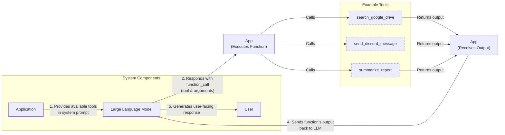
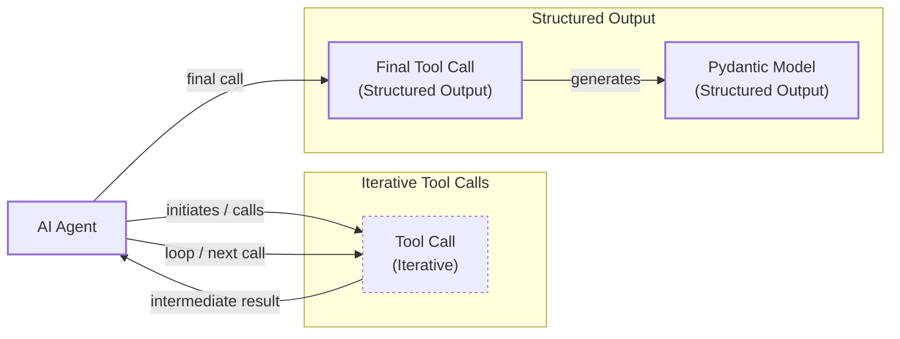
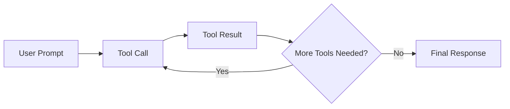

# Lesson 6: Agent Tools & Function Calling

In our previous lessons, we explored the foundations of AI Engineering, from understanding the agent landscape and the difference between workflows and agents to mastering context engineering and structured outputs. We have seen how to build basic workflows by chaining, routing, and parallelizing LLM calls. Now, we will give our systems the ability to take action.

This lesson tackles one of the most critical building blocks of any AI Agent: **Tools**, also known as **Function Calling**. We will open the black box to understand how an agent interacts with the external world. By implementing tool calling from scratch, you will learn how an LLM decides which tool to call, generates the correct parameters, and interprets the results. This is the skill that transforms an LLM from a simple text generator into an agent that acts.

## Understanding Why Agents Need Tools

LLMs have a fundamental limitation: they are powerful pattern matchers and text generators, but they cannot perform actions or access information outside their training data on their own. They are, in essence, brains in a jar. To bridge this gap, we use tools. Tools are the bridge between the LLM's internal reasoning and the external world, giving it "hands and senses" to perceive and act beyond its textual interface. With tools, an LLM becomes an AI agent that can interact with its environment and execute specific instructions [[1]](https://arxiv.org/html/2507.08034v1).

This capability fundamentally expands what an AI system can achieve. It allows agents to break free from the static knowledge they were trained on and engage with the world dynamically. This unlocks a wide range of practical applications that would otherwise be impossible [[2]](https://lnu.diva-portal.org/smash/get/diva2:1801354/FULLTEXT01.pdf), [[3]](https://medium.com/@anicomanesh/how-llm-reasoning-powers-the-agentic-ai-revolution-cbefd10ebf3f):

*   **Access real-time information:** An LLM alone cannot tell you the weather because it lacks real-time data. By giving it a weather API tool, it can formulate a request, get the current data, and present it in a natural format [[2]](https://lnu.diva-portal.org/smash/get/diva2:1801354/FULLTEXT01.pdf). The same applies to news, stock prices, or flight availability.
*   **Interact with external databases:** Agents can query a PostgreSQL database for sales records, a Snowflake data warehouse for analytics, or an S3 data lake for unstructured files, turning natural language questions into structured queries.
*   **Access long-term memory:** Connect to a vector database to retrieve user preferences or facts from past conversations, overcoming the limitations of a finite context window.
*   **Execute code:** A Python interpreter tool enables "executable reasoning," allowing the agent to perform exact arithmetic, run simulations, or validate logic through execution rather than just pattern matching. This is invaluable for calculations, data manipulation, and visualizations [[3]](https://medium.com/@anicomanesh/how-llm-reasoning-powers-the-agentic-ai-revolution-cbefd10ebf3f).

The core idea is simple. Your application defines a set of available tools. When a user makes a request, the LLM decides if a tool is needed. If so, it asks your application to execute it. Your application runs the tool, gets a result, and sends that result back to the LLM, which then formulates a final answer for the user.

## Implementing tool calls from scratch

The best way to understand how tools work is to build them from the ground up. In this section, we will implement a simple tool-calling mechanism from scratch. You will learn how to define a tool, create a schema so the LLM can understand it, and write the logic to execute the tool and interpret its output.

The process of calling a tool involves a five-step flow between your application and the LLM:

1.  **Application:** You send the LLM a prompt that includes a list of available tools defined in a schema.
2.  **LLM:** The model analyzes the user's request and decides to call a specific tool. It responds with a `function_call` containing the tool's name and the arguments it needs.
3.  **Application:** Your code parses this `function_call`, identifies the correct function, and executes it with the provided arguments.
4.  **Application:** You send the output from the function back to the LLM.
5.  **LLM:** The model uses the tool's output to generate a final, user-facing response.

This request-execute-respond flow is the foundation of all tool-using agents.


Image 1: A flowchart illustrating the 5-step request-execute-respond flow of calling a tool, including example tools.

Now, let's implement this flow. We will build a simple agent that can search for a financial report on Google Drive, summarize it, and send the summary to a Discord channel.

<aside>
💡

You can find the code for this lesson in the accompanying [Jupyter Notebook on GitHub](https://github.com/towardsai/course-ai-agents/blob/dev/lessons/06_tools/notebook.ipynb).

</aside>

1.  First, we set up our environment by importing the necessary libraries and initializing the Gemini client. We will use the `gemini-2.5-flash` model for its speed and cost-effectiveness. We also define a sample `DOCUMENT` to mock the content of a file found on Google Drive.
    ```python
    import json
    from typing import Any

    from google import genai
    from google.genai import types
    from pydantic import BaseModel, Field

    from lessons.utils import pretty_print

    client = genai.Client()

    MODEL_ID = "gemini-2.5-flash"

    DOCUMENT = """
    # Q3 2023 Financial Performance Analysis

    The Q3 earnings report shows a 20% increase in revenue and a 15% growth in user engagement, 
    beating market expectations. These impressive results reflect our successful product strategy 
    and strong market positioning.

    Our core business segments demonstrated remarkable resilience, with digital services leading 
    the growth at 25% year-over-year. The expansion into new markets has proven particularly 
    successful, contributing to 30% of the total revenue increase.

    Customer acquisition costs decreased by 10% while retention rates improved to 92%, 
    marking our best performance to date. These metrics, combined with our healthy cash flow 
    position, provide a strong foundation for continued growth into Q4 and beyond.
    """
    ```

2.  Next, we define our three mock tools as Python functions. The function signature and docstrings are critical, as the LLM uses them to understand what each tool does.
    ```python
    def search_google_drive(query: str) -> dict:
        """
        Searches for a file on Google Drive and returns its content or a summary.
    
        Args:
            query (str): The search query to find the file, e.g., 'Q3 earnings report'.
    
        Returns:
            dict: A dictionary representing the search results, including file names and summaries.
        """
    
        # In a real scenario, this would interact with the Google Drive API.
        # Here, we mock the response for demonstration.
        return {
            "files": [
                {
                    "name": "Q3_Earnings_Report_2024.pdf",
                    "id": "file12345",
                    "content": DOCUMENT,
                }
            ]
        }
    ```
    ```python
    def send_discord_message(channel_id: str, message: str) -> dict:
        """
        Sends a message to a specific Discord channel.
    
        Args:
            channel_id (str): The ID of the channel to send the message to, e.g., '#finance'.
            message (str): The content of the message to send.
    
        Returns:
            dict: A dictionary confirming the action, e.g., {"status": "success"}.
        """
    
        # Mocking a successful API call to Discord.
        return {
            "status": "success",
            "status_code": 200,
            "channel": channel_id,
            "message_preview": f"{message[:50]}...",
        }
    ```
    ```python
    def summarize_financial_report(text: str) -> str:
        """
        Summarizes a financial report.
    
        Args:
            text (str): The text to summarize.
    
        Returns:
            str: The summary of the text.
        """
    
        return "The Q3 2023 earnings report shows strong performance across all metrics \
    with 20% revenue growth, 15% user engagement increase, 25% digital services growth, and \
    improved retention rates of 92%."
    ```

3.  For the LLM to use these functions, we must describe them in a format it understands. This is done using a JSON schema, which is the industry standard for APIs from providers like OpenAI and Google [[4]](https://tetrate.io/learn/ai/llm-output-parsing-structured-generation). The schema details the tool's name, a description of what it does, and its parameters, including their names, types, and whether they are required.
    ```python
    search_google_drive_schema = {
        "name": "search_google_drive",
        "description": "Searches for a file on Google Drive and returns its content or a summary.",
        "parameters": {
            "type": "object",
            "properties": {
                "query": {
                    "type": "string",
                    "description": "The search query to find the file, e.g., 'Q3 earnings report'.",
                }
            },
            "required": ["query"],
        },
    }
    ```
    ```python
    send_discord_message_schema = {
        "name": "send_discord_message",
        "description": "Sends a message to a specific Discord channel.",
        "parameters": {
            "type": "object",
            "properties": {
                "channel_id": {
                    "type": "string",
                    "description": "The ID of the channel to send the message to, e.g., '#finance'.",
                },
                "message": {
                    "type": "string",
                    "description": "The content of the message to send.",
                },
            },
            "required": ["channel_id", "message"],
        },
    }
    ```
    ```python
    summarize_financial_report_schema = {
        "name": "summarize_financial_report",
        "description": "Summarizes a financial report.",
        "parameters": {
            "type": "object",
            "properties": {
                "text": {
                    "type": "string",
                    "description": "The text to summarize.",
                },
            },
            "required": ["text"],
        },
    }
    ```

4.  We then create a tool registry to map tool names to their corresponding functions and schemas. This makes it easy to look up and execute the correct tool later.
    ```python
    TOOLS = {
        "search_google_drive": {
            "handler": search_google_drive,
            "declaration": search_google_drive_schema,
        },
        "send_discord_message": {
            "handler": send_discord_message,
            "declaration": send_discord_message_schema,
        },
        "summarize_financial_report": {
            "handler": summarize_financial_report,
            "declaration": summarize_financial_report_schema,
        },
    }
    TOOLS_BY_NAME = {tool_name: tool["handler"] for tool_name, tool in TOOLS.items()}
    TOOLS_SCHEMA = [tool["declaration"] for tool in TOOLS.values()]
    ```
    The `TOOLS_BY_NAME` mapping looks like this:
    ```text
    {'search_google_drive': <function search_google_drive at 0x104c7df80>, 'send_discord_message': <function send_discord_message at 0x104c7de40>, 'summarize_financial_report': <function summarize_financial_report at 0x1274f5c60>}
    ```
    And here is the schema for our `search_google_drive` tool:
    ```json
    {
        "name": "search_google_drive",
        "description": "Searches for a file on Google Drive and returns its content or a summary.",
        "parameters": {
            "type": "object",
            "properties": {
                "query": {
                    "type": "string",
                    "description": "The search query to find the file, e.g., 'Q3 earnings report'."
                }
            },
            "required": [
                "query"
            ]
        }
    }
    ```

5.  Next, we create a system prompt to instruct the LLM on how to use these tools. This prompt explains when to use tools, how to select them, and the exact JSON format for a tool call.
    ```python
    TOOL_CALLING_SYSTEM_PROMPT = """
    You are a helpful AI assistant with access to tools that enable you to take actions and retrieve information to better 
    assist users.
    
    ## Tool Usage Guidelines
    
    **When to use tools:**
    - When you need information that is not in your training data
    - When you need to perform actions in external systems and environments
    - When you need real-time, dynamic, or user-specific data
    - When computational operations are required
    
    **Tool selection:**
    - Choose the most appropriate tool based on the user's specific request
    - If multiple tools could work, select the one that most directly addresses the need
    - Consider the order of operations for multi-step tasks
    
    **Parameter requirements:**
    - Provide all required parameters with accurate values
    - Use the parameter descriptions to understand expected formats and constraints
    - Ensure data types match the tool's requirements (strings, numbers, booleans, arrays)
    
    ## Tool Call Format
    
    When you need to use a tool, output ONLY the tool call in this exact format:
    
    ```tool_call
    {{"name": "tool_name", "args": {{"param1": "value1", "param2": "value2"}}}}
    ```
    
    **Critical formatting rules:**
    - Use double quotes for all JSON strings
    - Ensure the JSON is valid and properly escaped
    - Include ALL required parameters
    - Use correct data types as specified in the tool definition
    - Do not include any additional text or explanation in the tool call
    
    ## Response Behavior
    
    - If no tools are needed, respond directly to the user with helpful information
    - If tools are needed, make the tool call first, then provide context about what you're doing
    - After receiving tool results, provide a clear, user-friendly explanation of the outcome
    - If a tool call fails, explain the issue and suggest alternatives when possible
    
    ## Available Tools
    
    <tool_definitions>
    {tools}
    </tool_definitions>
    
    Remember: Your goal is to be maximally helpful to the user. Use tools when they add value, but don't use them unnecessarily. Always prioritize accuracy and user experience.
    """
    ```

6.  Now, let's see how this works. The LLM *decides* which tool to call based on the `description` field in the schema. This is why clear and distinct tool descriptions are so important. Vague descriptions like "search documents" and "search files" can confuse the model, leading it to choose the wrong tool or fail to use one at all. Explicit descriptions like "search documents on Google Drive" and "search files on the local disk" provide the clarity needed for accurate tool selection [[5]](https://www.anthropic.com/research/building-effective-agents). For example, if you have both a `search_products` and a `lookup_product_by_id` function, adding "Do not use this function when you have a specific product ID" to the search function's description prevents misuse [[6]](https://mbrenndoerfer.com/writing/function-calling-llm-structured-tools). This becomes even more critical as you scale to dozens or even hundreds of tools for a single agent. Once a tool is selected, the LLM *generates* the function name and arguments as a structured JSON output. This capability is not magic; models are specifically instruction-tuned to interpret these schemas and produce valid tool calls. This process of providing clear instructions and schemas is a form of prompt engineering, ensuring the model behaves predictably [[7]](https://community.openai.com/t/prompting-best-practices-for-tool-use-function-calling/1123036).

7.  Let's test it. We send a user prompt along with our system prompt to the model.
    ```python
    USER_PROMPT = """
    Can you help me find the latest quarterly report and share key insights with the team?
    """
    
    messages = [TOOL_CALLING_SYSTEM_PROMPT.format(tools=str(TOOLS_SCHEMA)), USER_PROMPT]
    
    response = client.models.generate_content(
        model=MODEL_ID,
        contents=messages,
    )
    ```
    The LLM correctly identifies the `search_google_drive` tool and generates the required arguments:
    ```text
    ```tool_call
    {"name": "search_google_drive", "args": {"query": "latest quarterly report"}}
    ```
    ```

8.  For a more complex query, the model still correctly identifies the first step.
    ```python
    USER_PROMPT = """
    Please find the Q3 earnings report on Google Drive and send a summary of it to 
    the #finance channel on Discord.
    """
    
    messages = [TOOL_CALLING_SYSTEM_PROMPT.format(tools=str(TOOLS_SCHEMA)), USER_PROMPT]
    
    response = client.models.generate_content(
        model=MODEL_ID,
        contents=messages,
    )
    ```
    It outputs:
    ```text
    ```tool_call
    {"name": "search_google_drive", "args": {"query": "Q3 earnings report"}}
    ```
    ```

9.  Now we need to parse the LLM's response and execute the tool. We start by extracting the JSON string from the response.
    ```python
    def extract_tool_call(response_text: str) -> str:
        """
        Extracts the tool call from the response text.
        """
        return response_text.split("```tool_call")[1].split("```")[0].strip()
    
    
    tool_call_str = extract_tool_call(response.text)
    ```
    This gives us a clean JSON string:
    ```text
    '{"name": "search_google_drive", "args": {"query": "Q3 earnings report"}}'
    ```

10. We parse this string into a Python dictionary.
    ```python
    tool_call = json.loads(tool_call_str)
    ```
    It outputs:
    ```text
    {'name': 'search_google_drive', 'args': {'query': 'Q3 earnings report'}}
    ```

11. Next, we retrieve the actual Python function (the "handler") from our `TOOLS_BY_NAME` registry.
    ```python
    tool_handler = TOOLS_BY_NAME[tool_call["name"]]
    ```
    This gives us a reference to our `search_google_drive` function:
    ```text
    <function __main__.search_google_drive(query: str) -> dict>
    ```

12. Finally, we call the function using the arguments generated by the LLM.
    ```python
    tool_result = tool_handler(**tool_call["args"])
    ```
    The tool returns the mocked document content:
    ```json
    {
        "files": [
            {
                "name": "Q3_Earnings_Report_2024.pdf",
                "id": "file12345",
                "content": "\n# Q3 2023 Financial Performance Analysis\n\nThe Q3 earnings report shows a 20% increase in revenue and a 15% growth in user engagement, \nbeating market expectations. These impressive results reflect our successful product strategy \nand strong market positioning.\n\nOur core business segments demonstrated remarkable resilience, with digital services leading \nthe growth at 25% year-over-year. The expansion into new markets has proven particularly \nsuccessful, contributing to 30% of the total revenue increase.\n\nCustomer acquisition costs decreased by 10% while retention rates improved to 92%, \nmarking our best performance to date. These metrics, combined with our healthy cash flow \nposition, provide a strong foundation for continued growth into Q4 and beyond.\n"
            }
        ]
    }
    ```

13. We can wrap this entire execution logic into a single helper function.
    ```python
    def call_tool(response_text: str, tools_by_name: dict) -> Any:
        """
        Call a tool based on the response from the LLM.
        """
    
        tool_call_str = extract_tool_call(response_text)
        tool_call = json.loads(tool_call_str)
        tool_name = tool_call["name"]
        tool_args = tool_call["args"]
        tool = tools_by_name[tool_name]
    
        return tool(**tool_args)
    ```
    Using this function simplifies the process:
    ```python
    call_tool(response.text, tools_by_name=TOOLS_BY_NAME)
    ```
    The output is the same as before.

14. The final step is to send the tool's result back to the LLM. This allows the model to interpret the information and either formulate a final response or decide on the next action.
    ```python
    response = client.models.generate_content(
        model=MODEL_ID,
        contents=f"Interpret the tool result: {json.dumps(tool_result, indent=2)}",
    )
    ```
    The LLM provides a user-friendly summary:
    ```text
    The tool result provides the content of a file named `Q3_Earnings_Report_2024.pdf`.
    
    This document is a **Q3 2023 Financial Performance Analysis** and details exceptionally strong results, significantly beating market expectations.
    
    **Key highlights from the report include:**
    
    *   **Revenue Growth:** A 20% increase in revenue.
    *   **User Engagement:** 15% growth in user engagement.
    *   **Core Business Performance:** Digital services led growth at 25% year-over-year.
    *   **Market Expansion Success:** New markets contributed 30% of the total revenue increase.
    *   **Efficiency & Retention:**
        *   Customer acquisition costs decreased by 10%.
        *   Retention rates improved to 92%, marking the best performance to date.
    *   **Financial Health:** The company maintains a healthy cash flow position.
    
    The report attributes these impressive results to a successful product strategy and strong market positioning, indicating a robust foundation for continued growth into Q4 and beyond.
    ```

That is the basic concept of tool calling. We have successfully implemented the entire flow from scratch, giving our LLM the ability to interact with external functions.

## Implementing a small tool calling framework from scratch

Manually defining JSON schemas for every function is tedious and error-prone. This approach doesn't scale well, as it requires you to write and maintain two separate sources of truth: the Python function itself and its JSON schema. Any change to the function's signature must be manually reflected in the schema, which is a recipe for bugs. That's why modern AI agent frameworks like LangGraph and standardized communication protocols like MCP (Model-Context-Protocol) implement a `@tool` decorator. Think of MCP as a universal language that allows different AI agents and tools to communicate seamlessly, much like a universal adapter for electronics. This decorator automatically computes and tracks the schemas of decorated functions.

Before we dive into the code, let's quickly clarify what a Python decorator is. A decorator is a function that takes another function as an argument, adds some functionality to it, and returns the modified function without altering the original function's code. It's a clean way to extend behavior, often used for logging, timing, or, in our case, transforming a plain function into a tool. You simply "decorate" your function with an `@` symbol followed by the decorator's name.

This decorator-based approach follows the Don't Repeat Yourself (DRY) principle, a cornerstone of good software engineering. By deriving the schema directly from the function's signature and docstring, we create a single source of truth. This makes the code more maintainable, readable, and less prone to errors [[8]](https://pydantic.dev/docs/ai/tools-toolsets/tools/), [[9]](https://openai.github.io/openai-agents-python/tools/).

Let's build our own simple framework by creating a `@tool` decorator. This will automatically inspect a function's signature and docstring to generate the schema, just like in production systems.

1.  First, we define a `ToolFunction` class to wrap our decorated functions. This class will hold both the callable function and its generated schema, acting as a convenient container that bundles the implementation with its metadata.
    ```python
    from inspect import Parameter, signature
    from typing import Any, Callable, Dict, Optional
    
    
    class ToolFunction:
        def __init__(self, func: Callable, schema: Dict[str, Any]) -> None:
            self.func = func
            self.schema = schema
            self.__name__ = func.__name__
            self.__doc__ = func.__doc__
    
        def __call__(self, *args: Any, **kwargs: Any) -> Any:
            return self.func(*args, **kwargs)
    ```

2.  Next, we implement the `@tool` decorator. It uses Python's built-in `inspect` module to get the function's signature. This is a powerful introspection feature that allows code to understand the structure of other code at runtime. The decorator then iterates through the parameters to build the `properties` and `required` fields for the JSON schema. The function's name and docstring are used for the schema's `name` and `description`, respectively. This process automates the tedious task of schema creation.
    ```python
    def tool(description: Optional[str] = None) -> Callable[[Callable], ToolFunction]:
        """
        A decorator that creates a tool schema from a function.
    
        Args:
            description: Optional override for the function's docstring
    
        Returns:
            A decorator function that wraps the original function and adds a schema
        """
    
        def decorator(func: Callable) -> ToolFunction:
            # Get function signature
            sig = signature(func)
    
            # Create parameters schema
            properties = {}
            required = []
    
            for param_name, param in sig.parameters.items():
                # Skip self for methods
                if param_name == "self":
                    continue
    
                param_schema = {
                    "type": "string",  # Default to string, can be enhanced with type hints
                    "description": f"The {param_name} parameter",  # Default description
                }
    
                # Add to required if parameter has no default value
                if param.default == Parameter.empty:
                    required.append(param_name)
    
                properties[param_name] = param_schema
    
            # Create the tool schema
            schema = {
                "name": func.__name__,
                "description": description or func.__doc__ or f"Executes the {func.__name__} function.",
                "parameters": {
                    "type": "object",
                    "properties": properties,
                    "required": required,
                },
            }
    
            return ToolFunction(func, schema)
    
        return decorator
    ```

3.  Now, we can redefine our tools using this new decorator. The code is much cleaner as we no longer need to write JSON schemas by hand.
    ```python
    @tool()
    def search_google_drive_example(query: str) -> dict:
        """Search for files in Google Drive."""
        return {"files": ["Q3 earnings report"]}
    
    
    @tool()
    def send_discord_message_example(channel_id: str, message: str) -> dict:
        """Send a message to a Discord channel."""
        return {"message": "Message sent successfully"}
    
    
    @tool()
    def summarize_financial_report_example(text: str) -> str:
        """Summarize the contents of a financial report."""
        return "Financial report summarized successfully"
    ```

4.  The decorated function is now a `ToolFunction` object.
    ```python
    type(search_google_drive_example)
    ```
    It outputs:
    ```text
    __main__.ToolFunction
    ```
    This object contains the auto-generated schema, which is identical to the one we created manually:
    ```json
    {
        "name": "search_google_drive_example",
        "description": "Search for files in Google Drive.",
        "parameters": {
            "type": "object",
            "properties": {
                "query": {
                    "type": "string",
                    "description": "The query parameter"
                }
            },
            "required": [
                "query"
            ]
        }
    }
    ```
    It also contains a reference to the original callable function:
    ```python
    search_google_drive_example.func
    ```
    It outputs:
    ```text
    <function __main__.search_google_drive_example(query: str) -> dict>
    ```

5.  We can now build our tool registries and call the LLM just as before.
    ```python
    tools = [
        search_google_drive_example,
        send_discord_message_example,
        summarize_financial_report_example,
    ]
    tools_by_name = {tool.schema["name"]: tool.func for tool in tools}
    tools_schema = [tool.schema for tool in tools]
    
    USER_PROMPT = """
    Please find the Q3 earnings report on Google Drive and send a summary of it to 
    the #finance channel on Discord.
    """
    
    messages = [TOOL_CALLING_SYSTEM_PROMPT.format(tools=str(tools_schema)), USER_PROMPT]
    
    response = client.models.generate_content(
        model=MODEL_ID,
        contents=messages,
    )
    ```
    The model responds with the correct tool call:
    ```text
    ```tool_call
    {"name": "search_google_drive_example", "args": {"query": "Q3 earnings report"}}
    ```
    ```
    And we can execute it using our `call_tool` function:
    ```python
    call_tool(response.text, tools_by_name=tools_by_name)
    ```
    It outputs:
    ```json
    {
        "files": [
            "Q3 earnings report"
        ]
    }
    ```

Voilà! We have built a small, yet functional, tool-calling framework. This implementation is conceptually similar to what happens under the hood in libraries like LangGraph.

## Implementing production-level tool calls with Gemini

While building from scratch provides great insight, in production, it is best to leverage the native tool-calling capabilities of modern LLM APIs. Providers like Google, OpenAI, and Anthropic have optimized their models for function calling, making their native implementations more robust, efficient, and easier to maintain [[10]](https://www.decodingai.com/p/tool-calling-from-scratch-to-production). These native integrations handle the complex prompt engineering behind the scenes, ensuring that the instructions sent to the model are always optimized for the specific version you are using. This saves you from the maintenance burden of updating prompts every time a new model is released.

Let's see how to achieve the same result using the Gemini API. Instead of manually crafting a system prompt, we pass our tool schemas directly to the `GenerateContentConfig` object.

1.  First, we define the configuration, passing our list of tool schemas. We also set the `mode` to `"ANY"` to force the model to call a tool instead of generating a text response.
    ```python
    tools = [
        types.Tool(
            function_declarations=[
                types.FunctionDeclaration(**search_google_drive_schema),
                types.FunctionDeclaration(**send_discord_message_schema),
            ]
        )
    ]
    config = types.GenerateContentConfig(
        tools=tools,
        # Force the model to call 'any' function, instead of chatting.
        tool_config=types.ToolConfig(function_calling_config=types.FunctionCallingConfig(mode="ANY")),
    )
    ```

2.  With this config, our prompt becomes much simpler. We can remove the lengthy system prompt and just provide the user's query. The API handles the rest.
    ```python
    response = client.models.generate_content(
        model=MODEL_ID,
        contents=USER_PROMPT,
        config=config,
    )
    ```
    The response contains a `FunctionCall` object:
    ```text
    FunctionCall(id=None, args={'query': 'Q3 earnings report'}, name='search_google_drive')
    ```

3.  The `google-genai` Python SDK simplifies this even further. It can automatically generate the required schema from a Python function’s signature, type hints, and docstring, just like our custom decorator. We can pass our functions directly to the `GenerateContentConfig` object.
    ```python
    from google.genai import types
    config = types.GenerateContentConfig(
        tools=[search_google_drive, send_discord_message]
    )
    ```

4.  Let's define a simplified `call_tool` function that works with Gemini's native `FunctionCall` object.
    ```python
    def call_tool(function_call) -> Any:
        tool_name = function_call.name
        tool_args = {key: value for key, value in function_call.args.items()}
    
        tool_handler = TOOLS_BY_NAME[tool_name]
    
        return tool_handler(**tool_args)
    ```

5.  Now, we can make the LLM call and execute the tool in just a few lines of code.
    ```python
    response = client.models.generate_content(
        model=MODEL_ID,
        contents=USER_PROMPT,
        config=config,
    )
    function_call = response.candidates[0].content.parts[0].function_call
    tool_result = call_tool(function_call)
    ```
    The output is the same as our manual implementation. By leveraging the native SDK, we reduced dozens of lines of code to just a few, creating a more robust and maintainable system. Other popular APIs from OpenAI and Anthropic follow a similar logic, making these concepts easily transferable [[11]](https://apxml.com/courses/prompt-engineering-llm-application-development/chapter-4-interacting-with-llm-apis/overview-common-llm-apis). While the exact syntax may differ, the core principle of passing a list of function definitions to the model is a universal pattern.

## Using Pydantic models as tools for on-demand structured outputs

As we saw in Lesson 4, structured outputs are essential for building reliable AI systems. A powerful pattern in agentic applications is to use a Pydantic model as a tool. This allows an agent to perform several intermediate steps that produce unstructured text—which is easy for an LLM to reason about—and then, when it is ready to produce a final answer, call a "Pydantic tool" to generate a validated, structured output. This output can then be reliably consumed by downstream Python code.

This approach combines the flexibility of free-form reasoning with the reliability of structured data extraction, giving you the best of both worlds.


Image 2: A Mermaid diagram illustrating an AI agent that calls multiple tools in a loop, with the final tool call producing structured output as a Pydantic model.

Let's see how to implement this pattern.

1.  First, we define our `DocumentMetadata` Pydantic model, just as we did in Lesson 4.
    ```python
    class DocumentMetadata(BaseModel):
        """A class to hold structured metadata for a document."""
    
        summary: str = Field(description="A concise, 1-2 sentence summary of the document.")
        tags: list[str] = Field(description="A list of 3-5 high-level tags relevant to the document.")
        keywords: list[str] = Field(description="A list of specific keywords or concepts mentioned.")
        quarter: str = Field(description="The quarter of the financial year described in the document (e.g., Q3 2023).")
        growth_rate: str = Field(description="The growth rate of the company described in the document (e.g., 10%).")
    ```

2.  Next, we create a tool declaration for our Pydantic model. We define a function named `extract_metadata` and use `DocumentMetadata.model_json_schema()` to provide its parameter schema. This tells the LLM to generate arguments that conform to our Pydantic model.
    ```python
    # The Pydantic class 'DocumentMetadata' is now our 'tool'
    extraction_tool = types.Tool(
        function_declarations=[
            types.FunctionDeclaration(
                name="extract_metadata",
                description="Extracts structured metadata from a financial document.",
                parameters=DocumentMetadata.model_json_schema(),
            )
        ]
    )
    config = types.GenerateContentConfig(
        tools=[extraction_tool],
        tool_config=types.ToolConfig(function_calling_config=types.FunctionCallingConfig(mode="ANY")),
    )
    ```

3.  We then prompt the model to analyze our document and extract the metadata.
    ```python
    prompt = f"""
    Please analyze the following document and extract its metadata.
    
    Document:
    --- 
    {DOCUMENT}
    --- 
    """
    
    response = client.models.generate_content(model=MODEL_ID, contents=prompt, config=config)
    ```

4.  The model responds with a `function_call` for our `extract_metadata` tool, with the arguments perfectly matching our Pydantic schema.
    ```text
    Function Name: `extract_metadata
    Function Arguments: `{
        "growth_rate": "20%",
        "summary": "The Q3 2023 earnings report shows a 20% increase in revenue and 15% growth in user engagement, driven by successful product strategy and market expansion. This performance provides a strong foundation for continued growth.",
        "quarter": "Q3 2023",
        "keywords": [
            "Revenue",
            "User Engagement",
            "Market Expansion",
            "Customer Acquisition",
            "Retention Rates",
            "Digital Services",
            "Cash Flow"
        ],
        "tags": [
            "Financials",
            "Earnings",
            "Growth",
            "Business Strategy",
            "Market Analysis"
        ]
    }`
    ```

5.  Finally, we can validate the arguments and create a `DocumentMetadata` instance.
    ```python
    function_call = response.candidates[0].content.parts[0].function_call
    
    try:
        document_metadata = DocumentMetadata(**function_call.args)
        print("Validation successful!")
    except Exception as e:
        print(f"Validation failed: {e}")
    ```
    It outputs:
    ```text
    Validation successful!
    ```
    This pattern is a clean and reliable way to get structured data from an agent, and it is widely used in production systems for tasks like data extraction and knowledge graph creation.

## The downsides of running tools in a loop

So far, we have focused on single-turn interactions where the agent calls one tool. However, many real-world tasks require multiple steps. For this, we can run tools in a loop, allowing the agent to chain multiple tool calls together. At each step, the LLM decides which tool to use based on the output of the previous ones. This approach gives the agent flexibility and adaptability to handle complex, multi-step problems.


Image 3: A sequential tool calling loop with a decision point for continuation.

Let's implement a loop for our previous task: finding the Q3 report, summarizing it, and sending the summary to Discord.

1.  We start by configuring all three of our tools.
    ```python
    tools = [
        types.Tool(
            function_declarations=[
                types.FunctionDeclaration(**search_google_drive_schema),
                types.FunctionDeclaration(**send_discord_message_schema),
                types.FunctionDeclaration(**summarize_financial_report_schema),
            ]
        )
    ]
    config = types.GenerateContentConfig(
        tools=tools,
        tool_config=types.ToolConfig(function_calling_config=types.FunctionCallingConfig(mode="ANY")),
    )
    ```

2.  The user prompt remains the same, describing the multi-step task.
    ```python
    USER_PROMPT = """
    Please find the Q3 earnings report on Google Drive and send a summary of it to 
    the #finance channel on Discord.
    """
    
    messages = [USER_PROMPT]
    ```

3.  We initiate the first LLM call.
    ```python
    response = client.models.generate_content(
        model=MODEL_ID,
        contents=messages,
        config=config,
    )
    ```
    As expected, the model first calls `search_google_drive`.
    ```text
    Function Name: `search_google_drive
    Function Arguments: `{
        "query": "Q3 earnings report"
    }`
    ```

4.  Now, we implement the loop. It continues as long as the model requests a function call or until we reach a maximum number of iterations. Inside the loop, we execute the tool, append the result to our message history, and call the model again for the next step.
    ```python
    messages.append(response.candidates[0].content)
    
    # Loop until the model stops requesting function calls or we reach the max number of iterations
    max_iterations = 3
    while hasattr(response.candidates[0].content.parts[0], "function_call") and max_iterations > 0:
        response_message_part = response.candidates[0].content.parts[0]
        tool_result = call_tool(response_message_part.function_call)
    
        # Add the tool result to the messages
        function_response_part = types.Part.from_function_response(
            name=response_message_part.function_call.name,
            response={"result": tool_result},
        )
        messages.append(function_response_part)
    
        # Ask the LLM to continue with the next step
        response = client.models.generate_content(
            model=MODEL_ID,
            contents=messages,
            config=config,
        )
    
        messages.append(response.candidates[0].content)
        max_iterations -= 1
    ```
    The agent correctly executes the sequence: `search_google_drive`, then `summarize_financial_report`, and finally `send_discord_message`.

While this loop is powerful, it has significant limitations. It does not allow the LLM to interpret the output of each tool before deciding on the next action. The agent immediately moves to the next function call without pausing to think about what it has learned or whether it should change its strategy. This can lead to inefficient tool usage or getting stuck in loops [[12]](https://myengineeringpath.dev/genai-engineer/agentic-patterns/). Furthermore, as the conversation history and tool results accumulate with each turn, the agent's context window can become saturated. Even with context windows of 128K tokens or more, this can lead to performance degradation or force the system to discard valuable information, a challenge that requires sophisticated memory management techniques like pruning or caching [[13]](https://www.emergentmind.com/topics/multi-turn-tool-calling-llms). This simple, interleaved approach also struggles with more complex agent workflows that go beyond a linear sequence of observation and generation [[1]](https://arxiv.org/html/2507.02259v1).

For tasks where tools are independent, we can run them in parallel to reduce latency. For example, an agent pulling data from multiple enterprise sources like Salesforce and Zendesk can execute these calls concurrently [[14]](https://www.codeant.ai/blogs/parallel-tool-calling). This reduces the total wait time from the sum of all tool execution times to the duration of the single slowest tool, a critical optimization for complex queries [[15]](https://airbyte.com/agentic-data/parallel-tool-calls-llm). However, for sequential, dependent tasks, this simple loop is not enough. This iterative cycle of observation and action mirrors decision-making loops in robotic control systems, where an agent must perceive its environment, reason about the next step, and then act [[16]](https://arxiv.org/pdf/2603.26730). These limitations motivated the development of more sophisticated patterns like **ReAct** (Reasoning and Acting), which explicitly interleaves reasoning steps with tool calls to better mimic this "observe, reason, act, observe" cycle [[17]](https://arxiv.org/pdf/2601.20334). We will explore ReAct in detail in Lessons 7 and 8.

## Popular tools used within the industry

Now that you understand how tools work, let's look at some of the most common categories of tools used in production AI systems. These examples should give you a better sense of what is possible.

**Knowledge & Memory Access** tools connect the agent to external knowledge sources, acting as its long-term memory. This includes querying vector databases for RAG, document stores, or graph databases. A popular and powerful pattern is text-to-SQL, which gives an agent the ability to construct and execute queries against traditional relational databases, effectively democratizing data access for non-technical users [[18]](https://promethium.ai/guides/text-to-sql-basics-benefits/). More advanced systems even provide agents with explicit tools like `remember` and `recall` to actively manage their own memory, keeping the core logic out of the prompt [[19]](https://blog.cloudflare.com/introducing-agent-memory/). We will cover memory and RAG in-depth in Lessons 9 and 10.

**Web Search & Browsing** tools give the agent access to the live internet, overcoming the static nature of its training data. This typically involves interfacing with search engine APIs from providers like Google, Bing, or Brave to find up-to-date information [[20]](https://mantraideas.com/llm-web-search/). More advanced browsing tools can also fetch and parse the full content of web pages, extracting specific information that a simple search summary might miss. These tools are standard in most modern chatbots and research-focused agents.

**Code Execution** tools transform the agent into a powerful computational engine. A sandboxed Python interpreter is one of the most versatile tools an agent can have, allowing it to perform precise mathematical calculations, manipulate data with libraries like Pandas, and generate data visualizations [[3]](https://medium.com/@anicomanesh/how-llm-reasoning-powers-the-agentic-ai-revolution-cbefd10ebf3f). While Python is the most common, interpreters for other languages like JavaScript can also be used for web-related or other specialized tasks.

**Other Popular Tools** cover a wide range of actions. Interacting with external APIs for calendars, email, or project management systems is common in enterprise AI applications. For productivity-focused agents, tools that perform file system operations—like reading and writing files or listing directories—are essential for automating tasks that involve interacting with a user's operating system.

## Conclusion

Tool calling is a foundational skill for any AI Engineer. It is what elevates an LLM from a passive text generator to an active agent capable of interacting with the world. By understanding how to define, implement, and orchestrate tools, you can build AI systems that are more powerful, reliable, and useful.

In this lesson, we have gone from the basics of tool calling to building a multi-step agent. The limitations of simple tool loops lead us directly to the next critical concept in agentic design: planning and reasoning. In Lesson 7, we will explore the theory behind the ReAct pattern, which allows an agent to think before it acts.

## References

- [1] MemAgent: A Simple and Effective Approach to Empowering Large Language Models with Long-Term Memory. [https://arxiv.org/html/2507.02259v1](https://arxiv.org/html/2507.02259v1)
- [2] LLMs and APIs: A Guide to Building Your First LLM-Powered Application. [https://lnu.diva-portal.org/smash/get/diva2:1801354/FULLTEXT01.pdf](https://lnu.diva-portal.org/smash/get/diva2:1801354/FULLTEXT01.pdf)
- [3] How LLM Reasoning Powers the Agentic AI Revolution. [https://medium.com/@anicomanesh/how-llm-reasoning-powers-the-agentic-ai-revolution-cbefd10ebf3f](https://medium.com/@anicomanesh/how-llm-reasoning-powers-the-agentic-ai-revolution-cbefd10ebf3f)
- [4] LLM Output Parsing and Structured Generation. [https://tetrate.io/learn/ai/llm-output-parsing-structured-generation](https://tetrate.io/learn/ai/llm-output-parsing-structured-generation)
- [5] Building effective agents. [https://www.anthropic.com/research/building-effective-agents](https://www.anthropic.com/research/building-effective-agents)
- [6] Function Calling: How LLMs Can Use Structured Tools. [https://mbrenndoerfer.com/writing/function-calling-llm-structured-tools](https://mbrenndoerfer.com/writing/function-calling-llm-structured-tools)
- [7] Prompting best practices for tool use / function calling. [https://community.openai.com/t/prompting-best-practices-for-tool-use-function-calling/1123036](https://community.openai.com/t/prompting-best-practices-for-tool-use-function-calling/1123036)
- [8] Function Tools. [https://pydantic.dev/docs/ai/tools-toolsets/tools/](https://pydantic.dev/docs/ai/tools-toolsets/tools/)
- [9] Tools. [https://openai.github.io/openai-agents-python/tools/](https://openai.github.io/openai-agents-python/tools/)
- [10] Tool Calling: From Scratch to Production. [https://www.decodingai.com/p/tool-calling-from-scratch-to-production](https://www.decodingai.com/p/tool-calling-from-scratch-to-production)
- [11] Overview of Common LLM APIs. [https://apxml.com/courses/prompt-engineering-llm-application-development/chapter-4-interacting-with-llm-apis/overview-common-llm-apis](https://apxml.com/courses/prompt-engineering-llm-application-development/chapter-4-interacting-with-llm-apis/overview-common-llm-apis)
- [12] Agentic Design Patterns — Visual Architecture Guide. [https://myengineeringpath.dev/genai-engineer/agentic-patterns/](https://myengineeringpath.dev/genai-engineer/agentic-patterns/)
- [13] Multi-turn Tool-calling LLMs. [https://www.emergentmind.com/topics/multi-turn-tool-calling-llms](https://www.emergentmind.com/topics/multi-turn-tool-calling-llms)
- [14] Parallel Tool Calling. [https://www.codeant.ai/blogs/parallel-tool-calling](https://www.codeant.ai/blogs/parallel-tool-calling)
- [15] Parallel Tool Calls for LLM Agents. [https://airbyte.com/agentic-data/parallel-tool-calls-llm](https://airbyte.com/agentic-data/parallel-tool-calls-llm)
- [16] LLM-based Cognitive Robotics. [https://arxiv.org/pdf/2603.26730](https://arxiv.org/pdf/2603.26730)
- [17] FAEA: A Foundation Agent for Embodied AI. [https://arxiv.org/pdf/2601.20334](https://arxiv.org/pdf/2601.20334)
- [18] Text-to-SQL: What It Is, How It Works, and Why It Matters in 2025. [https://promethium.ai/guides/text-to-sql-basics-benefits/](https://promethium.ai/guides/text-to-sql-basics-benefits/)
- [19] Introducing Agent Memory. [https://blog.cloudflare.com/introducing-agent-memory/](https://blog.cloudflare.com/introducing-agent-memory/)
- [20] LLM Web Search. [https://mantraideas.com/llm-web-search/](https://mantraideas.com/llm-web-search/)
- [21] Building Production-Ready LLM Applications: Bulletproof LLM Tool Calling with Advanced JSON. [https://medium.com/@hariomshahu101/building-production-ready-llm-applications-bulletproof-llm-tool-calling-with-advanced-json-b95ce8889f4e](https://medium.com/@hariomshahu101/building-production-ready-llm-applications-bulletproof-llm-tool-calling-with-advanced-json-b95ce8889f4e)
- [22] Tool Input and Output Schemas. [https://apxml.com/courses/building-advanced-llm-agent-tools/chapter-1-llm-agent-tooling-foundations/tool-input-output-schemas](https://apxml.com/courses/building-advanced-llm-agent-tools/chapter-1-llm-agent-tooling-foundations/tool-input-output-schemas)
- [23] Custom Tools. [https://strandsagents.com/docs/user-guide/concepts/tools/custom-tools/](https://strandsagents.com/docs/user-guide/concepts/tools/custom-tools/)
- [24] Tools. [https://docs.langchain.com/oss/python/langchain/tools](https://docs.langchain.com/oss/python/langchain/tools)
- [25] tool. [https://reference.langchain.com/python/langchain-core/tools/convert/tool](https://reference.langchain.com/python/langchain-core/tools/convert/tool)
- [26] Best practices to build LLM tools in 2025. [https://techinfotech.tech.blog/2025/06/09/best-practices-to-build-llm-tools-in-2025/](https://techinfotech.tech.blog/2025/06/09/best-practices-to-build-llm-tools-in-2025/)
- [27] Tool descriptions are critical: making better LLM tools for research capability. [https://pub.towardsai.net/tool-descriptions-are-critical-making-better-llm-tools-research-capability-b315851471e7](https://pub.towardsai.net/tool-descriptions-are-critical-making-better-llm-tools-research-capability-b315851471e7)
- [28] Underlying Factors Behind Inconsistency in LLM Responses with Multi-Tool Calling. [https://medium.com/@abhaychougule0907/underlying-factors-behind-inconsistency-in-llm-responses-with-multi-tool-calling-628ce7b4de76](https://medium.com/@abhaychougule0907/underlying-factors-behind-inconsistency-in-llm-responses-with-multi-tool-calling-628ce7b4de76)
- [29] How Editing Tool Descriptions Affects LLM Tool Use. [https://arxiv.org/html/2505.18135v2](https://arxiv.org/html/2505.18135v2)
- [30] Gemini Function Calling. [https://www.philschmid.de/gemini-function-calling](https://www.philschmid.de/gemini-function-calling)
- [31] Function calling with the Gemini API. [https://ai.google.dev/gemini-api/docs/function-calling](https://ai.google.dev/gemini-api/docs/function-calling)
- [32] Gemini Function Calling. [https://glaforge.dev/posts/2023/12/22/gemini-function-calling/](https://glaforge.dev/posts/2023/12/22/gemini-function-calling/)
- [33] Output. [https://pydantic.dev/docs/ai/core-concepts/output/](https://pydantic.dev/docs/ai/core-concepts/output/)
- [34] Multi-Agent Applications. [https://pydantic.dev/docs/ai/guides/multi-agent-applications/](https://pydantic.dev/docs/ai/guides/multi-agent-applications/)
- [35] Response schema from pydantic. [https://discuss.ai.google.dev/t/response-schema-from-pydantic/50028](https://discuss.ai.google.dev/t/response-schema-from-pydantic/50028)
- [36] What Is the AI Agent Loop? The Core Architecture Behind Autonomous AI Systems. [https://blogs.oracle.com/developers/what-is-the-ai-agent-loop-the-core-architecture-behind-autonomous-ai-systems](https://blogs.oracle.com/developers/what-is-the-ai-agent-loop-the-core-architecture-behind-autonomous-ai-systems)
- [37] How Vector Databases Are Rewiring the Tech Industry. [https://www.ruh.ai/blogs/how-vector-databases-are-rewiring-the-tech-industry](https://www.ruh.ai/blogs/how-vector-databases-are-rewiring-the-tech-industry)
- [38] Top 10 Open Source Vector Databases. [https://www.instaclustr.com/education/vector-database/top-10-open-source-vector-databases/](https://www.instaclustr.com/education/vector-database/top-10-open-source-vector-databases/)
- [39] LLM Engineering Part I. [https://medium.com/@yugalnandurkar5/llm-engineering-part-i-fa48d4307d26](https://medium.com/@yugalnandurkar5/llm-engineering-part-i-fa48d4307d26)
- [40] LLM Providers & Gen AI Platforms Compared. [https://www.getorchestra.io/guides/llm-providers-gen-ai-platforms-compared](https://www.getorchestra.io/guides/llm-providers-gen-ai-platforms-compared)
- [41] Gemini Guide. [https://myengineeringpath.dev/tools/gemini-guide/](https://myengineeringpath.dev/tools/gemini-guide/)
- [42] LLM API Differences That Break Your Code: Anthropic vs OpenAI vs Google. [https://futuresearch.ai/blog/llm-provider-quirks/](https://futuresearch.ai/blog/llm-provider-quirks/)</article>