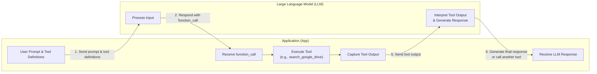
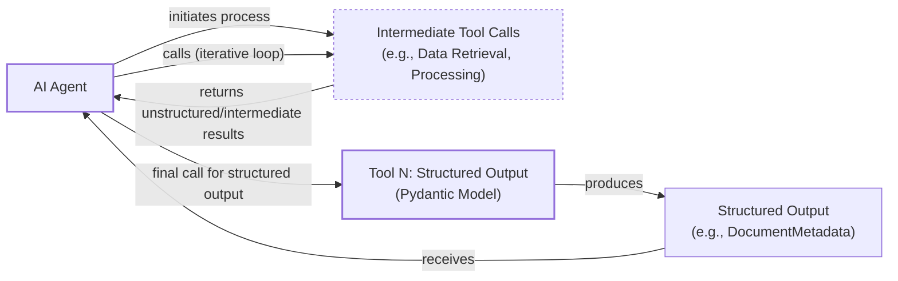
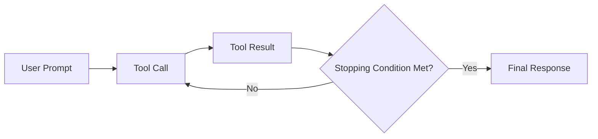

# Agent Tools: The Bridge Between LLMs and the Real World

In our previous lessons, we explored the fundamentals of AI engineering. We learned to distinguish between rule-based LLM workflows and autonomous agents, mastered context engineering to manage information flow, and used structured outputs to ensure reliable data extraction. Now, we will tackle one of the most critical components of any AI agent: tools.

Tools are what transform an LLM from a simple text generator into an agent that can take action in the external world. Understanding how an agent works with tools is fundamental to building, improving, and debugging modern AI applications. In this lesson, we will open the black box of tool usage, first by building the mechanism ourselves before using the native power of the Gemini API. We will also explore how to use Pydantic models as on-demand tools and chain multiple tools together, uncovering the limitations that lead to more advanced agentic patterns.

## Why Agents Need Tools

LLMs have a fundamental limitation: they are powerful pattern matchers and text generators, but they cannot perform actions or interact with the external world on their own [[19]](https://lnu.diva-portal.org/smash/get/diva2:1801354/FULLTEXT01.pdf). They need help from the engineering systems built around them. This is where tools come in. If the LLM is the brain of an agent, tools are its "hands and senses," allowing it to perceive and act in the world beyond its training data [[5]](https://www.deeplearning.ai/the-batch/agentic-design-patterns-part-3-tool-use/).

Tools are the bridge between the LLM's internal reasoning and the outside world. With tools, an LLM becomes an AI agent capable of executing specific instructions and interacting with its environment. For example, when you ask a chatbot for today's weather, it doesn't know the answer from its training data. Instead, it uses a weather tool. This is an API call to fetch real-time information and provide an accurate response [[19]](https://lnu.diva-portal.org/smash/get/diva2:1801354/FULLTEXT01.pdf).
Image 1: The high-level interaction flow between an application and an LLM for tool calling.

This capability unlocks a wide range of applications that power modern AI agents. By giving the model access to external functions, we enable it to solve complex, real-world problems that would otherwise be out of reach. Some of the most common use cases include:

*   **Accessing real-time information** through APIs for weather, news, or stock prices [[20]](https://medium.com/@yugalnandurkar5/llm-engineering-part-i-fa48d4307d26). This overcomes the static nature of the model's training data.
*   **Interacting with databases** and data warehouses. A common pattern is text-to-SQL, where the agent translates a natural language question into a SQL query to retrieve data from a relational database [[13]](https://promethium.ai/guides/text-to-sql-basics-benefits/).
*   **Accessing long-term memory** to remember information beyond the immediate context window, allowing for more personalized and continuous interactions [[12]](https://www.ruh.ai/blogs/how-vector-databases-are-rewiring-the-tech-industry).
*   **Executing code** in languages like Python. This is invaluable for performing precise calculations, manipulating data, or generating visualizations that LLMs struggle with on their own [[16]](https://arxiv.org/html/2507.08034v1).

By giving agents access to these tools, we overcome the core limitations of LLMs and enable them to solve a much broader class of problems.

## Implementing Tool Calls from Scratch

The best way to understand how tools work is to implement the mechanism manually. In this section, we will build a simple tool-calling system to see how an LLM decides which tool to use, generates the correct parameters, and how we execute its request.

Our goal is to provide the LLM with a list of available tools and let it choose the right one to fulfill a user's request. The process follows a clear, multi-step flow between our application and the LLM.

The high-level process looks like this:
1.  **Application:** We send the LLM a prompt containing the user's query and a list of available tool definitions.
2.  **LLM:** The model responds with a `function_call` request, specifying the tool to use and the arguments to pass.
3.  **Application:** Our code parses this response and executes the requested function with the provided arguments.
4.  **Application:** We send the function's output back to the LLM as additional context.
5.  **LLM:** The model uses the tool's output to generate a final, user-facing response.

This request-execute-respond cycle is the foundation of how agents interact with the world.


Image 2: A flowchart illustrating the 6-step request-execute-respond flow of calling a tool between an Application and an LLM.

Now, let's dig into the code. We will implement a simple example where we mock searching for a document on Google Drive and sending its summary to a Discord channel.

<aside>
💡

You can find all the code for this lesson in the accompanying [Jupyter Notebook](https://github.com/towardsai/course-ai-agents/blob/dev/lessons/06_tools/notebook.ipynb) on GitHub.

</aside>

### Setup

We start by setting up our environment, initializing the Gemini client, and defining some constants. We will use `gemini-2.5-flash` for its speed and cost-effectiveness. The `DOCUMENT` constant will serve as our mock file content.
```python
import json
from typing import Any

from google import genai
from google.genai import types
from pydantic import BaseModel, Field

from lessons.utils import pretty_print

client = genai.Client()

MODEL_ID = "gemini-2.5-flash"

DOCUMENT = """
# Q3 2023 Financial Performance Analysis

The Q3 earnings report shows a 20% increase in revenue and a 15% growth in user engagement, 
beating market expectations. These impressive results reflect our successful product strategy 
and strong market positioning.

Our core business segments demonstrated remarkable resilience, with digital services leading 
the growth at 25% year-over-year. The expansion into new markets has proven particularly 
successful, contributing to 30% of the total revenue increase.

Customer acquisition costs decreased by 10% while retention rates improved to 92%, 
marking our best performance to date. These metrics, combined with our healthy cash flow 
position, provide a strong foundation for continued growth into Q4 and beyond.
"""
```

### Defining Mock Tools

Next, we define three mock Python functions to simulate our tools. To keep the example focused, these functions return hardcoded data instead of making real API calls. Each function has a clear purpose, defined by its name, parameters, and docstring.
```python
def search_google_drive(query: str) -> dict:
    """
    Searches for a file on Google Drive and returns its content or a summary.

    Args:
        query (str): The search query to find the file, e.g., 'Q3 earnings report'.

    Returns:
        dict: A dictionary representing the search results, including file names and summaries.
    """
    return {
        "files": [
            {
                "name": "Q3_Earnings_Report_2024.pdf",
                "id": "file12345",
                "content": DOCUMENT,
            }
        ]
    }
```
```python
def send_discord_message(channel_id: str, message: str) -> dict:
    """
    Sends a message to a specific Discord channel.

    Args:
        channel_id (str): The ID of the channel to send the message to, e.g., '#finance'.
        message (str): The content of the message to send.

    Returns:
        dict: A dictionary confirming the action, e.g., {"status": "success"}.
    """
    return {
        "status": "success",
        "status_code": 200,
        "channel": channel_id,
        "message_preview": f"{message[:50]}...",
    }
```
```python
def summarize_financial_report(text: str) -> str:
    """
    Summarizes a financial report.

    Args:
        text (str): The text to summarize.

    Returns:
        str: The summary of the text.
    """
    return "The Q3 2023 earnings report shows strong performance across all metrics with 20% revenue growth, 15% user engagement increase, 25% digital services growth, and improved retention rates of 92%."
```

### Defining Tool Schemas

For the LLM to understand and use these functions, we must define their schemas. A schema, typically written in JSON, describes what a tool does (`description`) and what inputs it requires (`parameters`). This is the industry standard used by major providers like OpenAI and Google [[23]](https://tetrate.io/learn/ai/llm-output-parsing-structured-generation).
```python
search_google_drive_schema = {
    "name": "search_google_drive",
    "description": "Searches for a file on Google Drive and returns its content or a summary.",
    "parameters": {
        "type": "object",
        "properties": {
            "query": {
                "type": "string",
                "description": "The search query to find the file, e.g., 'Q3 earnings report'.",
            }
        },
        "required": ["query"],
    },
}
```
```python
send_discord_message_schema = {
    "name": "send_discord_message",
    "description": "Sends a message to a specific Discord channel.",
    "parameters": {
        "type": "object",
        "properties": {
            "channel_id": {
                "type": "string",
                "description": "The ID of the channel to send the message to, e.g., '#finance'.",
            },
            "message": {
                "type": "string",
                "description": "The content of the message to send.",
            },
        },
        "required": ["channel_id", "message"],
    },
}
```
```python
summarize_financial_report_schema = {
    "name": "summarize_financial_report",
    "description": "Summarizes a financial report.",
    "parameters": {
        "type": "object",
        "properties": {
            "text": {
                "type": "string",
                "description": "The text to summarize.",
            },
        },
        "required": ["text"],
    },
}
```

### Creating a Tool Registry

We then create a tool registry to map tool names to their corresponding functions and schemas. This makes it easy to look up and execute the correct function based on the LLM's request.
```python
TOOLS = {
    "search_google_drive": {
        "handler": search_google_drive,
        "declaration": search_google_drive_schema,
    },
    "send_discord_message": {
        "handler": send_discord_message,
        "declaration": send_discord_message_schema,
    },
    "summarize_financial_report": {
        "handler": summarize_financial_report,
        "declaration": summarize_financial_report_schema,
    },
}
TOOLS_BY_NAME = {tool_name: tool["handler"] for tool_name, tool in TOOLS.items()}
TOOLS_SCHEMA = [tool["declaration"] for tool in TOOLS.values()]
```
The `TOOLS_BY_NAME` mapping gives us quick access to the callable functions.
It outputs:
```text
Tool name: search_google_drive
Tool handler: <function search_google_drive at 0x104c7df80>
---------------------------------------------------------------------------
Tool name: send_discord_message
Tool handler: <function send_discord_message at 0x104c7de40>
---------------------------------------------------------------------------
Tool name: summarize_financial_report
Tool handler: <function summarize_financial_report at 0x1274f5c60>
---------------------------------------------------------------------------
```
And `TOOLS_SCHEMA` holds the definitions we will pass to the LLM.
It outputs:
```json
{
  "name": "search_google_drive",
  "description": "Searches for a file on Google Drive and returns its content or a summary.",
  "parameters": {
    "type": "object",
    "properties": {
      "query": {
        "type": "string",
        "description": "The search query to find the file, e.g., 'Q3 earnings report'."
      }
    },
    "required": [
      "query"
    ]
  }
}
```

### Prompting the LLM for Tool Use

Now, we need a system prompt to instruct the LLM on how to use these tools. This prompt sets the rules, explains the expected tool call format, and provides the list of available tools wrapped in `<tool_definitions>` tags. This explicit instruction is a form of prompt engineering that guides the model's behavior.
```python
TOOL_CALLING_SYSTEM_PROMPT = """
You are a helpful AI assistant with access to tools that enable you to take actions and retrieve information to better 
assist users.

## Tool Usage Guidelines

**When to use tools:**
- When you need information that is not in your training data
- When you need to perform actions in external systems and environments
- When you need real-time, dynamic, or user-specific data
- When computational operations are required

**Tool selection:**
- Choose the most appropriate tool based on the user's specific request
- If multiple tools could work, select the one that most directly addresses the need
- Consider the order of operations for multi-step tasks

**Parameter requirements:**
- Provide all required parameters with accurate values
- Use the parameter descriptions to understand expected formats and constraints
- Ensure data types match the tool's requirements (strings, numbers, booleans, arrays)

## Tool Call Format

When you need to use a tool, output ONLY the tool call in this exact format:

```tool_call
{{"name": "tool_name", "args": {{"param1": "value1", "param2": "value2"}}}}
```

**Critical formatting rules:**
- Use double quotes for all JSON strings
- Ensure the JSON is valid and properly escaped
- Include ALL required parameters
- Use correct data types as specified in the tool definition
- Do not include any additional text or explanation in the tool call

## Response Behavior

- If no tools are needed, respond directly to the user with helpful information
- If tools are needed, make the tool call first, then provide context about what you're doing
- After receiving tool results, provide a clear, user-friendly explanation of the outcome
- If a tool call fails, explain the issue and suggest alternatives when possible

## Available Tools

<tool_definitions>
{tools}
</tool_definitions>

Remember: Your goal is to be maximally helpful to the user. Use tools when they add value, but don't use them unnecessarily. Always prioritize accuracy and user experience.
"""
```

### How the LLM Decides to Call a Tool

In practice, tool calling works in two main phases. First, the LLM *decides* which tool to use based on the `description` field in the schema. This is why clear, articulate, and mutually exclusive descriptions are essential for reliable tool selection. A vague description like "search files" will confuse the model if multiple search tools exist. A better description is "search for a file on Google Drive" [[51]](https://mbrenndoerfer.com/writing/function-calling-llm-structured-tools). This becomes crucial as the number of tools grows, as ambiguity leads to lower accuracy [[51]](https://mbrenndoerfer.com/writing/function-calling-llm-structured-tools), [[32]](https://www.anthropic.com/research/building-effective-agents).

Another disambiguation method is to be explicit in your system prompt, verbosely stating what you need. For example, instead of saying `search documents`, specify where to search, such as `search documents on Google Drive`. By defining clear tool descriptions and system prompts, you ensure the agent can make the necessary matches and call the right tools. This becomes critical when scaling up to 50-100 tools per agent, a challenge we will explore more in Parts 2 and 3 of the course [[52]](https://medium.com/@abhaychougule0907/underlying-factors-behind-inconsistency-in-llm-responses-with-multi-tool-calling-628ce7b4de76).

Second, once a tool is selected, the model *generates* the function name and arguments as a structured JSON output. LLMs are specifically instruction-tuned to interpret these schemas and produce valid tool calls [[51]](https://mbrenndoerfer.com/writing/function-calling-llm-structured-tools).

### Testing the System Prompt

Let's test it. We send a user prompt along with our system prompt to the model.
```python
USER_PROMPT = """
Can you help me find the latest quarterly report and share key insights with the team?
"""

messages = [TOOL_CALLING_SYSTEM_PROMPT.format(tools=str(TOOLS_SCHEMA)), USER_PROMPT]

response = client.models.generate_content(
    model=MODEL_ID,
    contents=messages,
)
```
The LLM correctly identifies the `search_google_drive` tool and generates the required arguments.
It outputs:
```text
```tool_call
{"name": "search_google_drive", "args": {"query": "latest quarterly report"}}
```
```
For a multi-step query, the LLM plans the first action.
```python
USER_PROMPT = """
Please find the Q3 earnings report on Google Drive and send a summary of it to 
the #finance channel on Discord.
"""

messages = [TOOL_CALLING_SYSTEM_PROMPT.format(tools=str(TOOLS_SCHEMA)), USER_PROMPT]

response = client.models.generate_content(
    model=MODEL_ID,
    contents=messages,
)
```
It outputs:
```text
```tool_call
{"name": "search_google_drive", "args": {"query": "Q3 earnings report"}}
```
```

### Parsing the Response and Executing the Tool

Now, we need to parse the model's response and execute the tool. We start by extracting the JSON string from the Markdown block.
```python
def extract_tool_call(response_text: str) -> str:
    """
    Extracts the tool call from the response text.
    """
    return response_text.split("```tool_call")[1].split("```")[0].strip()


tool_call_str = extract_tool_call(response.text)
```
It outputs:
```text
'{"name": "search_google_drive", "args": {"query": "Q3 earnings report"}}'
```
Next, we parse the string into a Python dictionary.
```python
tool_call = json.loads(tool_call_str)
```
It outputs:
```json
{'name': 'search_google_drive', 'args': {'query': 'Q3 earnings report'}}
```
We retrieve the corresponding function from our `TOOLS_BY_NAME` registry and execute it with the arguments provided by the LLM.
```python
tool_handler = TOOLS_BY_NAME[tool_call["name"]]
tool_result = tool_handler(**tool_call["args"])
```
It outputs:
```json
{
  "files": [
    {
      "name": "Q3_Earnings_Report_2024.pdf",
      "id": "file12345",
      "content": "\n# Q3 2023 Financial Performance Analysis\n\nThe Q3 earnings report shows a 20% increase in revenue and a 15% growth in user engagement, \nbeating market expectations..."
    }
  ]
}
```
We can wrap this logic in a helper function for convenience. This function encapsulates the parsing and execution steps, making our main logic cleaner.
```python
def call_tool(response_text: str, tools_by_name: dict) -> Any:
    """
    Call a tool based on the response from the LLM.
    """

    tool_call_str = extract_tool_call(response_text)
    tool_call = json.loads(tool_call_str)
    tool_name = tool_call["name"]
    tool_args = tool_call["args"]
    tool = tools_by_name[tool_name]

    return tool(**tool_args)
```

### Interpreting the Tool Output

The final step is to send the tool's result back to the LLM so it can interpret the information and generate a final response or decide on the next action. This feedback loop is what makes agents adaptive.
```python
response = client.models.generate_content(
    model=MODEL_ID,
    contents=f"Interpret the tool result: {json.dumps(tool_result, indent=2)}",
)
```
It outputs:
```text
The tool result provides the content of a file named `Q3_Earnings_Report_2024.pdf`.

This document is a **Q3 2023 Financial Performance Analysis** and details exceptionally strong results, significantly beating market expectations.

**Key highlights from the report include:**

*   **Revenue Growth:** A 20% increase in revenue.
*   **User Engagement:** 15% growth in user engagement.
...
```
That's the basic concept of tool calling. We have successfully implemented the core logic by hand, giving us a solid foundation for understanding how agents interact with the external world.

## Implementing a Tool Calling Framework from Scratch

Manually defining a JSON schema for every tool is tedious and violates the Don't Repeat Yourself (DRY) software engineering principle. Production frameworks like LangGraph and protocols like MCP (Model-Context-Protocol) solve this by using decorators (e.g., `@tool`) to automatically generate and register schemas from Python functions [[28]](https://pydantic.dev/docs/ai/tools-toolsets/tools/), [[29]](https://docs.langchain.com/oss/python/langchain/tools). A decorator is a design pattern in Python that allows a user to add new functionality to an existing object without modifying its structure. It wraps a function, allowing us to run code before and after the original function executes.

Let's build our own simple framework by creating a `@tool` decorator. It will inspect a function's signature and docstring to generate the schema, creating a single source of truth for both the tool's implementation and its definition. This approach not only saves time but also ensures that our tool definitions stay in sync with our code, making our system more robust and easier to maintain.

### Defining the Decorator

First, we define a `ToolFunction` class to wrap our decorated functions and store their associated schemas. This class will hold both the callable function and its machine-readable schema.
```python
from inspect import Parameter, signature
from typing import Any, Callable, Dict, Optional


class ToolFunction:
    def __init__(self, func: Callable, schema: Dict[str, Any]) -> None:
        self.func = func
        self.schema = schema
        self.__name__ = func.__name__
        self.__doc__ = func.__doc__

    def __call__(self, *args: Any, **kwargs: Any) -> Any:
        return self.func(*args, **kwargs)
```
Next, we create the `@tool` decorator. This function takes another function as input, inspects its signature to identify parameters, and uses its name and docstring to build the schema. It then returns a `ToolFunction` instance. This process automates the tedious task of writing JSON schemas by hand.
```python
def tool(description: Optional[str] = None) -> Callable[[Callable], ToolFunction]:
    """
    A decorator that creates a tool schema from a function.

    Args:
        description: Optional override for the function's docstring

    Returns:
        A decorator function that wraps the original function and adds a schema
    """

    def decorator(func: Callable) -> ToolFunction:
        sig = signature(func)
        properties = {}
        required = []

        for param_name, param in sig.parameters.items():
            if param_name == "self":
                continue

            param_schema = {
                "type": "string",
                "description": f"The {param_name} parameter",
            }

            if param.default == Parameter.empty:
                required.append(param_name)

            properties[param_name] = param_schema

        schema = {
            "name": func.__name__,
            "description": description or func.__doc__ or f"Executes the {func.__name__} function.",
            "parameters": {
                "type": "object",
                "properties": properties,
                "required": required,
            },
        }

        return ToolFunction(func, schema)

    return decorator
```

### Using the Decorator

Now, we can redefine our tools by simply applying the `@tool` decorator to our functions. The code becomes much cleaner and more maintainable.
```python
@tool()
def search_google_drive_example(query: str) -> dict:
    """Search for files in Google Drive."""
    return {"files": ["Q3 earnings report"]}


@tool()
def send_discord_message_example(channel_id: str, message: str) -> dict:
    """Send a message to a Discord channel."""
    return {"message": "Message sent successfully"}


@tool()
def summarize_financial_report_example(text: str) -> str:
    """Summarize the contents of a financial report."""
    return "Financial report summarized successfully"


tools = [
    search_google_drive_example,
    send_discord_message_example,
    summarize_financial_report_example,
]
tools_by_name = {tool.schema["name"]: tool.func for tool in tools}
tools_schema = [tool.schema for tool in tools]
```
The decorated `search_google_drive_example` function is now a `ToolFunction` object.
It outputs:
```text
__main__.ToolFunction
```
This object contains the auto-generated schema, which is identical to the one we created manually.
It outputs:
```json
{
  "name": "search_google_drive_example",
  "description": "Search for files in Google Drive.",
  "parameters": {
    "type": "object",
    "properties": {
      "query": {
        "type": "string",
        "description": "The query parameter"
      }
    },
    "required": [
      "query"
    ]
  }
}
```
It also holds a reference to the original, callable function.
It outputs:
```text
<function __main__.search_google_drive_example(query: str) -> dict>
```

### Testing the Framework

Let's test our new framework. We use the same multi-step prompt as before.
```python
USER_PROMPT = """
Please find the Q3 earnings report on Google Drive and send a summary of it to 
the #finance channel on Discord.
"""

messages = [TOOL_CALLING_SYSTEM_PROMPT.format(tools=str(tools_schema)), USER_PROMPT]

response = client.models.generate_content(
    model=MODEL_ID,
    contents=messages,
)
```
The LLM correctly identifies the tool and its arguments, just as it did with the manually defined schema.
It outputs:
```text
```tool_call
{"name": "search_google_drive_example", "args": {"query": "Q3 earnings report"}}
```
```
We can now execute the tool call using the same `call_tool` helper function.
```python
call_tool(response.text, tools_by_name=tools_by_name)
```
It outputs:
```json
{
  "files": [
    "Q3 earnings report"
  ]
}
```
Voilà! We have built a small, functional tool-calling framework. This implementation is conceptually similar to what modern agentic frameworks do under the hood, giving you a much deeper understanding of how they operate.

## Implementing Production-Level Tool Calls with Gemini

While building a framework yourself is a great learning exercise, in production, we use the native capabilities of modern LLM APIs like Gemini or OpenAI. These APIs are optimized by the vendor for their specific models, making them simpler, more accurate, and more robust than manual prompt engineering [[54]](https://www.decodingai.com/p/tool-calling-from-scratch-to-production). Using a native SDK ensures that your implementation benefits from ongoing model improvements and handles edge cases gracefully, which is critical for building reliable, enterprise-grade applications.

Let's refactor our example to use Gemini's native tool-calling features. This approach offloads the complexity of prompt construction to the API provider, who has fine-tuned their models for this exact purpose.

### Using Schemas with Gemini

Instead of crafting a detailed system prompt, we define a `GenerateContentConfig` object and pass our tool schemas directly to it. The `ToolConfig` allows us to control the function-calling behavior, such as forcing the model to call a function (`mode="ANY"`) instead of generating a text response.
```python
from google.genai import types

tools = [
    types.Tool(
        function_declarations=[
            types.FunctionDeclaration(**search_google_drive_schema),
            types.FunctionDeclaration(**send_discord_message_schema),
        ]
    )
]
config = types.GenerateContentConfig(
    tools=tools,
    tool_config=types.ToolConfig(function_calling_config=types.FunctionCallingConfig(mode="ANY")),
)
```
With the configuration handled by the API, our prompt becomes much cleaner. We can remove the complex system prompt and just send the user's request. This makes our code more readable and maintainable.
```python
USER_PROMPT = """
Please find the Q3 earnings report on Google Drive and send a summary of it to 
the #finance channel on Discord.
"""
response = client.models.generate_content(
    model=MODEL_ID,
    contents=USER_PROMPT,
    config=config,
)
```
The response contains a structured `FunctionCall` object, which is easier and more reliable to parse than raw text.
```python
response_message_part = response.candidates[0].content.parts[0]
function_call = response_message_part.function_call
```
It outputs:
```text
FunctionCall(id=None, args={'query': 'Q3 earnings report'}, name='search_google_drive')
```

### Using Python Functions Directly

To simplify this even further, the `google-genai` SDK can automatically generate schemas from Python functions, just like our custom decorator. We can pass our function handlers directly to the `GenerateContentConfig`, eliminating the need for manual schema definitions entirely.
```python
from google.genai import types
config = types.GenerateContentConfig(
    tools=[search_google_drive, send_discord_message]
)
```
Let's create a simplified `call_tool` function to work with Gemini's native `FunctionCall` objects.
```python
def call_tool(function_call) -> any:
    tool_name = function_call.name
    tool_args = {key: value for key, value in function_call.args.items()}
    tool_handler = TOOLS_BY_NAME[tool_name]
    return tool_handler(**tool_args)

tool_result = call_tool(function_call)
```
It outputs:
```json
{
  "files": [
    {
      "name": "Q3_Earnings_Report_2024.pdf",
      "id": "file12345",
      "content": "\n# Q3 2023 Financial Performance Analysis..."
    }
  ]
}
```
By using the native SDK, we reduced dozens of lines of code to just a few, creating a more robust and maintainable system.

This native approach is the recommended way to implement tool calling in production. Popular APIs from OpenAI and Anthropic follow a similar logic, making these concepts easily transferable to your API of choice [[54]](https://www.decodingai.com/p/tool-calling-from-scratch-to-production), [[57]](https://myengineeringpath.dev/tools/gemini-guide/).

## Using Pydantic Models as Tools for On-Demand Structured Outputs

As we saw in Lesson 4, structured outputs are essential for building reliable AI systems. A particularly effective pattern in agentic workflows is to treat a Pydantic model as a tool. This allows an agent to perform several intermediate steps—retrieving data, processing information—and then, when it's ready, call a final "tool" to format its findings into a structured, validated Pydantic object [[6]](https://pydantic.dev/docs/ai/guides/multi-agent-applications/).

This approach gives you the best of both worlds: the flexibility of natural language for intermediate reasoning and the reliability of structured data for the final output. This provides a reliable bridge between the LLM's text-based output and the structured data your application code expects.


Image 3: A flowchart illustrating an AI agent calling multiple tools in a loop, where only the final step involves a tool call for structured outputs using a Pydantic model.

Let's see how to implement this pattern.

1.  First, we define our `DocumentMetadata` Pydantic model, just as we did in the structured outputs lesson. This class serves as the schema for our final, structured output.
    ```python
    class DocumentMetadata(BaseModel):
        """A class to hold structured metadata for a document."""
    
        summary: str = Field(description="A concise, 1-2 sentence summary of the document.")
        tags: list[str] = Field(description="A list of 3-5 high-level tags relevant to the document.")
        keywords: list[str] = Field(description="A list of specific keywords or concepts mentioned.")
        quarter: str = Field(description="The quarter of the financial year described in the document (e.g., Q3 2023).")
        growth_rate: str = Field(description="The growth rate of the company described in the document (e.g., 10%).")
    ```
2.  Next, we create a tool declaration for the model. We name the function `extract_metadata` and pass the Pydantic model's JSON schema as its parameters using the `model_json_schema()` method.
    ```python
    extraction_tool = types.Tool(
        function_declarations=[
            types.FunctionDeclaration(
                name="extract_metadata",
                description="Extracts structured metadata from a financial document.",
                parameters=DocumentMetadata.model_json_schema(),
            )
        ]
    )
    config = types.GenerateContentConfig(
        tools=[extraction_tool],
        tool_config=types.ToolConfig(function_calling_config=types.FunctionCallingConfig(mode="ANY")),
    )
    ```
3.  We then prompt the model to analyze the document and extract its metadata.
    ```python
    prompt = f"""
    Please analyze the following document and extract its metadata.
    
    Document:
    --- 
    {DOCUMENT}
    --- 
    """
    
    response = client.models.generate_content(model=MODEL_ID, contents=prompt, config=config)
    ```
4.  The model responds with a function call to our `extract_metadata` tool, with the extracted data in the `args` field.
    ```python
    response_message_part = response.candidates[0].content.parts[0]
    function_call = response_message_part.function_call
    ```
    It outputs:
    ```text
     Function Name:  `extract_metadata
     Function Arguments:  `{
    "growth_rate": "20%",
    "summary": "The Q3 2023 earnings report shows a 20% increase in revenue and 15% growth in user engagement, driven by successful product strategy and market expansion. This performance provides a strong foundation for continued growth.",
    "quarter": "Q3 2023",
    "keywords": [
      "Revenue",
      "User Engagement",
      "Market Expansion",
      "Customer Acquisition",
      "Retention Rates",
      "Digital Services",
      "Cash Flow"
    ],
    "tags": [
      "Financials",
      "Earnings",
      "Growth",
      "Business Strategy",
      "Market Analysis"
    ]
    }`
    ```
5.  Finally, we validate the arguments by parsing them into our `DocumentMetadata` model. This ensures the data is correct and type-safe before being used elsewhere in our application.
    ```python
    try:
        document_metadata = DocumentMetadata(**function_call.args)
        print("Validation successful!")
    except Exception as e:
        print(f"Validation failed: {e}")
    ```
    It outputs:
    ```text
    Validation successful!
    ```
This pattern is a clean and robust way to get structured data from an agent, and you will see it used frequently in production systems.

## The Downsides of Running Tools in a Loop

So far, we have focused on single-turn interactions. The next logical step is to build agents that can handle multi-step tasks by calling tools in a loop. This allows the agent to chain actions together, using the output of one tool to inform the input of the next. This is the final piece of the puzzle we need to build a real AI agent.


Image 4: A flowchart illustrating a sequential tool calling loop, showing the iterative interaction between an agent and tools until a final response is generated.

This approach offers flexibility and allows agents to tackle complex problems. Let's implement a loop for our Google Drive and Discord example.

1.  First, we configure our model with all three available tools.
    ```python
    tools = [
        types.Tool(
            function_declarations=[
                types.FunctionDeclaration(**search_google_drive_schema),
                types.FunctionDeclaration(**send_discord_message_schema),
                types.FunctionDeclaration(**summarize_financial_report_schema),
            ]
        )
    ]
    config = types.GenerateContentConfig(
        tools=tools,
        tool_config=types.ToolConfig(function_calling_config=types.FunctionCallingConfig(mode="ANY")),
    )
    ```
2.  Our user prompt now describes a multi-step task.
    ```python
    USER_PROMPT = """
    Please find the Q3 earnings report on Google Drive and send a summary of it to 
    the #finance channel on Discord.
    """
    
    messages = [USER_PROMPT]
    ```
3.  We initiate the loop by sending the first message to the model.
    ```python
    response = client.models.generate_content(
        model=MODEL_ID,
        contents=messages,
        config=config,
    )
    response_message_part = response.candidates[0].content.parts[0]
    messages.append(response.candidates[0].content)
    ```
    The model correctly identifies the first step: searching Google Drive.
    It outputs:
    ```text
     Function Name:  `search_google_drive
     Function Arguments:  `{
    "query": "Q3 earnings report"
    }`
    ```
4.  We then enter a `while` loop that continues as long as the model requests tool calls. In each iteration, we execute the tool, append the result to our message history, and send the updated history back to the model.
    ```python
    max_iterations = 3
    while hasattr(response_message_part, "function_call") and max_iterations > 0:
        tool_result = call_tool(response_message_part.function_call)
    
        function_response_part = types.Part.from_function_response(
            name=response_message_part.function_call.name,
            response={"result": tool_result},
        )
        messages.append(function_response_part)
    
        response = client.models.generate_content(
            model=MODEL_ID,
            contents=messages,
            config=config,
        )
    
        response_message_part = response.candidates[0].content.parts[0]
        messages.append(response.candidates[0].content)
    
        max_iterations -= 1
    ```
    The loop proceeds as follows:
    *   **Iteration 1:** Calls `search_google_drive` and gets the document content.
    *   **Iteration 2:** Calls `summarize_financial_report` with the document content.
    *   **Iteration 3:** Calls `send_discord_message` with the summary.
    After the final tool call, the model generates its concluding response, and the loop terminates.

While this loop enables multi-step tasks, it has significant limitations. It does not allow the LLM to interpret a tool's output before deciding on the next action. The agent moves directly to the next function call without pausing to think about what it has learned or whether it should change its strategy [[9]](https://myengineeringpath.dev/genai-engineer/agentic-patterns/). For instance, an agent might repeatedly call a search tool with slight variations of the same query if it doesn't pause to synthesize the information it has already gathered. This reactive, short-sighted approach not only wastes resources but also prevents the agent from forming a coherent, high-level plan to solve the user's problem effectively.

For tasks where tools are independent, we can run them in parallel to reduce latency. Independent tools are those whose execution does not rely on the output of another. In our example, a request for news headlines and a separate request for a stock price can be dispatched at the same time, as neither needs information from the other to succeed. This is because the LLM can identify these independent operations and request them in a single turn. The total latency then drops from the *sum* of all tool execution times to the time of the *slowest* individual tool [[60]](https://airbyte.com/agentic-data/parallel-tool-calls-llm). However, for dependent tasks—like summarizing a document that must first be found—this simple loop structure falls short.

These limitations motivated the development of more sophisticated patterns like **ReAct (Reason and Act)**, which explicitly interleaves reasoning steps with tool calls to make agents more deliberate and intelligent. We will explore the theory behind ReAct in Lesson 7 and implement it from scratch in Lesson 8.

## Popular Tools Used Within the Industry

Now that we have a solid grasp of how to implement tools, let's ground our knowledge in the real world by looking at the most common categories of tools used in production AI systems.

1.  **Knowledge & Memory Access:** These tools connect the agent to external knowledge sources. This includes querying vector databases for Retrieval-Augmented Generation (RAG), a technique where the agent retrieves relevant information from a knowledge base to inform its response. It also includes retrieving documents from stores like S3, or navigating graph databases [[12]](https://www.ruh.ai/blogs/how-vector-databases-are-rewiring-the-tech-industry). A popular pattern in this category is **text-to-SQL**, where the LLM generates SQL queries to interact with traditional relational databases, democratizing data access for non-technical users [[13]](https://promethium.ai/guides/text-to-sql-basics-benefits/). These tools are fundamental to an agent's memory, a topic we will cover in Lesson 9, and are at the heart of agentic RAG, which we will explore in Lesson 10.
2.  **Web Search & Browsing:** These tools are omnipresent in modern chatbots and research agents. They allow the agent to access up-to-date information from the internet by interfacing with search engine APIs like Google Search, Bing, or Brave [[17]](https://mantraideas.com/llm-web-search/). They are often paired with web scraping tools that can fetch and parse the content of web pages, giving the agent a rich source of external information.
3.  **Code Execution:** A code interpreter, typically for Python, is an invaluable tool for tasks requiring precise computation, data manipulation, or visualization. It allows the agent to write and execute code in a sandboxed environment, overcoming the LLM's inherent limitations with complex math or logic [[18]](https://medium.com/@anicomanesh/how-llm-reasoning-powers-the-agentic-ai-revolution-cbefd10ebf3f). While Python is the most common, this pattern can be adapted for other languages like JavaScript.
4.  **External API Integrations:** For enterprise and productivity applications, tools that interact with external APIs are essential. This includes connecting to calendars, sending emails, interacting with project management software like Jira, or accessing CRM data [[16]](https://arxiv.org/html/2507.08034v1). File system operations, such as reading and writing local files, also fall into this category, enabling agents to work directly with a user's environment.

## Conclusion

Tool calling is at the core of building AI agents. It is the mechanism that elevates an LLM from a passive text generator to an active participant that can interact with and affect the world. Mastering how to define, implement, and orchestrate tools is one of the most important skills for an AI engineer.

The simple tool-calling loop we built has its limits. It lacks the ability to reason about its actions, which can lead to inefficient or incorrect behavior. To build more robust and intelligent agents, we need to introduce explicit reasoning steps. This leads us directly to our next topic: planning and the ReAct pattern, which we will cover in Lesson 7.

## References

- [1] Tool Calling Agent From Scratch (https://www.youtube.com/watch?v=ApoDzZP8_ck)
- [2] Function Calling Guide: Google DeepMind Gemini 2.0 Flash (https://www.philschmid.de/gemini-function-calling)
- [3] Function calling with the Gemini API (https://ai.google.dev/gemini-api/docs/function-calling)
- [4] Gemini Function Calling (https://glaforge.dev/posts/2023/12/22/gemini-function-calling/)
- [5] Agentic Design Patterns Part 3, Tool Use (https://www.deeplearning.ai/the-batch/agentic-design-patterns-part-3-tool-use/)
- [6] Multi-Agent Applications (https://pydantic.dev/docs/ai/guides/multi-agent-applications/)
- [7] Response schema from Pydantic (https://discuss.ai.google.dev/t/response-schema-from-pydantic/50028)
- [8] Function Tools (https://pydantic.dev/docs/ai/tools-toolsets/tools/)
- [9] Agentic Design Patterns — Visual Architecture Guide (https://myengineeringpath.dev/genai-engineer/agentic-patterns/)
- [10] What Is the AI Agent Loop? The Core Architecture Behind Autonomous AI Systems (https://blogs.oracle.com/developers/what-is-the-ai-agent-loop-the-core-architecture-behind-autonomous-ai-systems)
- [11] What is Tool Calling? Connecting LLMs to Your Data (https://www.youtube.com/watch?v=h8gMhXYAv1k)
- [12] How Vector Databases Are Rewiring the Tech Industry (https://www.ruh.ai/blogs/how-vector-databases-are-rewiring-the-tech-industry)
- [13] Text-to-SQL: What It Is, How It Works, and Why It Matters in 2025 (https://promethium.ai/guides/text-to-sql-basics-benefits/)
- [14] Efficient Tool Use with Chain-of-Abstraction Reasoning (https://arxiv.org/pdf/2401.17464v3)
- [15] Top 10 Open Source Vector Databases (https://www.instaclustr.com/education/vector-database/top-10-open-source-vector-databases/)
- [16] A Survey on Large Language Model based Autonomous Agents (https://arxiv.org/html/2507.08034v1)
- [17] How LLMs Use Web Search to Answer Your Questions (https://mantraideas.com/llm-web-search/)
- [18] How LLM Reasoning Powers the Agentic AI Revolution (https://medium.com/@anicomanesh/how-llm-reasoning-powers-the-agentic-ai-revolution-cbefd10ebf3f)
- [19] Extending the Capabilities of Large Language Models with External APIs (https://lnu.diva-portal.org/smash/get/diva2:1801354/FULLTEXT01.pdf)
- [20] LLM Engineering: Part I (https://medium.com/@yugalnandurkar5/llm-engineering-part-i-fa48d4307d26)
- [21] Prompting best practices for tool use / function calling (https://community.openai.com/t/prompting-best-practices-for-tool-use-function-calling/1123036)
- [22] Building Production-Ready LLM Applications: Bulletproof LLM Tool Calling with Advanced JSON (https://medium.com/@hariomshahu101/building-production-ready-llm-applications-bulletproof-llm-tool-calling-with-advanced-json-b95ce8889f4e)
- [23] LLM Output Parsing and Structured Generation (https://tetrate.io/learn/ai/llm-output-parsing-structured-generation)
- [24] Tool Input and Output Schemas (https://apxml.com/courses/building-advanced-llm-agent-tools/chapter-1-llm-agent-tooling-foundations/tool-input-output-schemas)
- [25] Function Calling: How LLMs Can Use Structured Tools (https://mbrenndoerfer.com/writing/function-calling-llm-structured-tools)
- [26] Using Tools (https://openai.github.io/openai-agents-python/tools/)
- [27] Custom Tools (https://strandsagents.com/docs/user-guide/concepts/tools/custom-tools/)
- [28] Function Tools (https://pydantic.dev/docs/ai/tools-toolsets/tools/)
- [29] Tools (https://docs.langchain.com/oss/python/langchain/tools)
- [30] langChain-core convert tool (https://reference.langchain.com/python/langchain-core/tools/convert/tool)
- [31] Building AI Agents from scratch - Part 1: Tool use (https://www.newsletter.swirlai.com/p/building-ai-agents-from-scratch-part)
- [32] Building effective agents (https://www.anthropic.com/research/building-effective-agents)
- [33] Best Practices to Build LLM Tools in 2025 (https://techinfotech.tech.blog/2025/06/09/best-practices-to-build-llm-tools-in-2025/)
- [34] Function calling with OpenAI's API (https://platform.openai.com/docs/guides/function-calling)
- [35] ReAct vs Plan-and-Execute: A Practical Comparison of LLM Agent Patterns (https://dev.to/jamesli/react-vs-plan-and-execute-a-practical-comparison-of-llm-agent-patterns-4gh9)
- [36] Output (https://pydantic.dev/docs/ai/core-concepts/output/)
- [49] Tool Descriptions are Critical: Making Better LLM Tools (https://pub.towardsai.net/tool-descriptions-are-critical-making-better-llm-tools-research-capability-b315851471e7)
- [50] Tool Input and Output Schema Design (https://apxml.com/courses/building-advanced-llm-agent-tools/chapter-1-llm-agent-tooling-foundations/tool-input-output-schemas)
- [51] Function Calling: How LLMs Can Use Structured Tools (https://mbrenndoerfer.com/writing/function-calling-llm-structured-tools)
- [52] Underlying Factors Behind Inconsistency in LLM Responses with Multi-Tool Calling (https://medium.com/@abhaychougule0907/underlying-factors-behind-inconsistency-in-llm-responses-with-multi-tool-calling-628ce7b4de76)
- [53] Editing Tool Descriptions for Large Language Models (https://arxiv.org/html/2505.18135v2)
- [54] Tool Calling: From Scratch to Production (https://www.decodingai.com/p/tool-calling-from-scratch-to-production)
- [55] Overview of Common LLM APIs (https://apxml.com/courses/prompt-engineering-llm-application-development/chapter-4-interacting-with-llm-apis/overview-common-llm-apis)
- [56] LLM Providers & Gen AI Platforms Compared (https://www.getorchestra.io/guides/llm-providers-gen-ai-platforms-compared)
- [57] Google Gemini Guide (https://myengineeringpath.dev/tools/gemini-guide/)
- [58] LLM API Differences That Break Your Code: Anthropic vs OpenAI vs Google (https://futuresearch.ai/blog/llm-provider-quirks/)
- [59] Multi-turn tool-calling LLMs (https://www.emergentmind.com/topics/multi-turn-tool-calling-llms)
- [60] Parallel Tool Calls for LLM Agents (https://airbyte.com/agentic-data/parallel-tool-calls-llm)
- [61] FAEA: A Foundation Agent for Embodied AI (https://arxiv.org/pdf/2601.20334)
- [62] Agent Memory Architectures (https://atlan.com/know/agent-memory-architectures/)
- [63] Introducing Agent Memory (https://blog.cloudflare.com/introducing-agent-memory/)
</article>