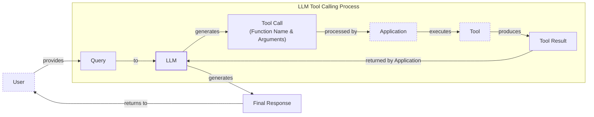
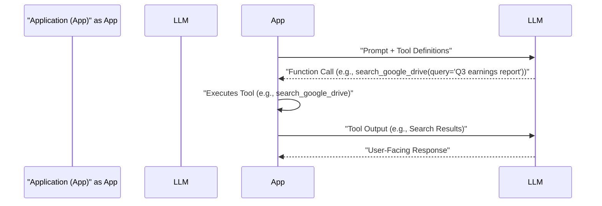
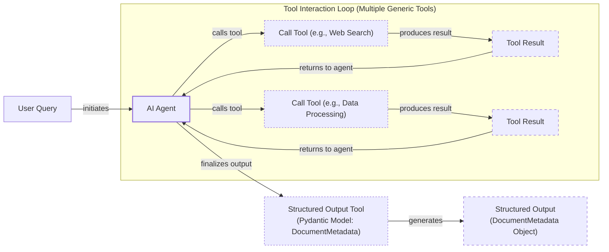
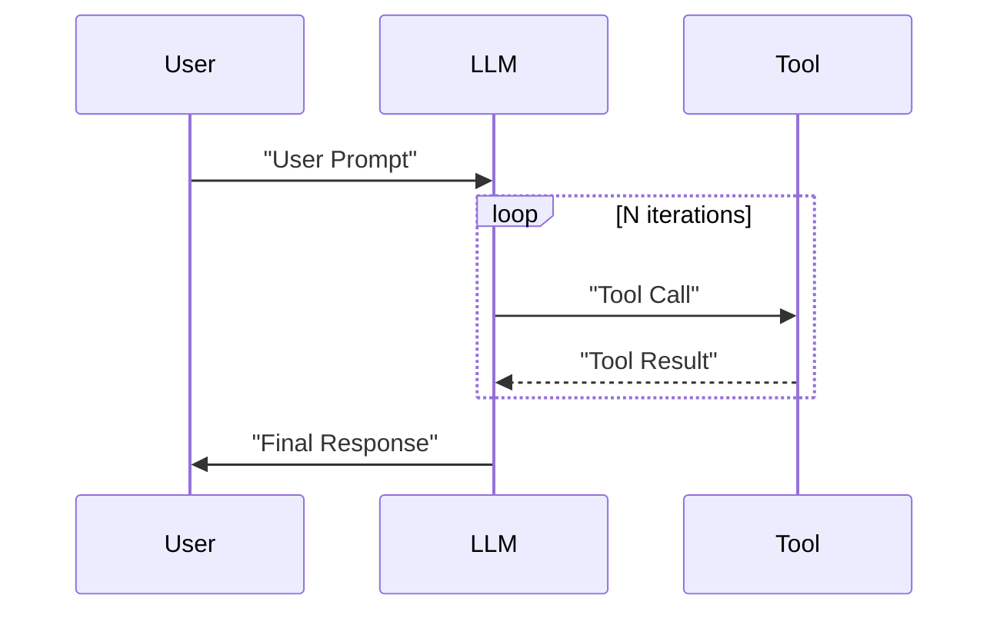

# Lesson 6: Agent Tools and Function Calling

In our previous lessons, we built a solid foundation in AI Engineering. We explored the landscape of AI agents, distinguished between rule-based LLM workflows and autonomous agents, and delved into context engineering and structured outputs. Now, we will explore one of the most critical building blocks of any AI Agent: **Tools**, also known as **Function Calling**.

Tools are what transform an LLM from a simple text generator into an agent that can take action in the external world. For an AI Engineer, understanding how an agent works with these tools is essential for building, improving, and debugging robust AI applications. In this lesson, we will open the black box by implementing tool calling from scratch, then progress to production-ready techniques using modern APIs, giving you the skills to build agents that can truly interact with their environment.

## Understanding why agents need tools

LLMs have a fundamental limitation: they are powerful pattern matchers and text generators, but they cannot perform actions or interact with the external world on their own. They are trained on a static dataset and have no access to real-time information or the ability to execute code. This is where tools come in.

This limitation is not merely about having a static training dataset; it is rooted in information-theoretic and statistical boundaries. LLMs are trained to complete patterns and maintain local coherence, not to perform logical inference, which causes their factual accuracy to decay for less common information not heavily represented in their training data [[1]](https://arxiv.org/html/2511.12869v2). Furthermore, they cannot reliably manage or maintain external state within their limited and fragile context windows, making explicit tools essential for any task requiring persistent memory or interaction [[2]](https://arxiv.org/html/2604.08224v1).

The LLM is the brain of an agent. Tools are its "hands and senses," allowing it to perceive and act in the world beyond its internal knowledge. They are the bridge between the LLM's reasoning capabilities and the external environment. By giving an LLM access to tools, we transform it into an AI agent that can interact with systems, access live data, and perform tasks. This concept is informed by cognitive science models of human tool use, where external aids act as "cognitive scaffolding." Just as humans use notebooks or file systems to offload memory and structure complex thoughts, agents use tools as cognitive prosthetics to maintain discipline and awareness during long tasks, preventing context decay and plan drift [[3]](https://gist.github.com/LangSensei/ffece86d696948ef739e42233642141a).


Image 1: A flowchart illustrating the high-level process of LLM tool calling.

As illustrated in Image 1, the process begins with a user query. The LLM, instead of just generating text, can request to call a specific tool with certain arguments. Your application then executes that tool, feeds the result back to the LLM, which then formulates a final, informed response.

This capability unlocks a vast range of applications. Some of the most common tools that power modern AI agents include:

-   Accessing real-time information via APIs (e.g., today's weather, latest news).
-   Interacting with external databases or storage solutions (e.g., PostgreSQL, Snowflake, S3).
-   Accessing an agent's long-term memory to remember information beyond its context window.
-   Executing code (e.g., Python, JavaScript) for precise calculations or data manipulation.

## Implementing tool calls from scratch

The best way to understand how tools work is to build the mechanism from the ground up. In this section, we will implement a simple tool-calling flow from scratch. We will define our tools, create schemas for them, prompt the LLM to decide which one to use, parse its response, and execute the corresponding function. This hands-on approach will demystify how an LLM discovers available tools, generates the correct parameters, and how your application interprets its requests.

Our end goal is to provide the LLM with a list of available tools and let it decide which one to use, generating the correct arguments to call it. The high-level process looks like this:

1.  **App:** You send the LLM a prompt and a list of available tools with their definitions.
2.  **LLM:** It responds with a `function_call` request, specifying the tool's name and the arguments.
3.  **App:** You execute the requested function in your code.
4.  **App:** You send the function's output back to the LLM.
5.  **LLM:** It uses the tool's output to generate a final, user-facing response.

This request-execute-respond flow is the foundation of all tool-use patterns.


Image 2: A sequence diagram illustrating the 5-step request-execute-respond flow of calling a tool from scratch between an Application and an LLM.

Let's implement this flow. We will build a simple agent that can search for a financial report on a mocked Google Drive, summarize it, and send the summary to a Discord channel.

<aside>
💡

You can find all the code for this lesson in the accompanying [Jupyter Notebook on GitHub](https://github.com/towardsai/course-ai-agents/blob/dev/lessons/06_tools/notebook.ipynb).

</aside>

1.  First, we set up our environment by importing the necessary libraries and initializing the Gemini client. We will use the `gemini-2.5-flash` model, which is fast and cost-effective. We also define a sample financial document that our mock tools will use.
    ```python
    import json
    from typing import Any
    
    from google import genai
    from google.genai import types
    from pydantic import BaseModel, Field
    
    from lessons.utils import env
    
    env.load(required_env_vars=["GOOGLE_API_KEY"])
    
    client = genai.Client()
    
    MODEL_ID = "gemini-2.5-flash"
    
    DOCUMENT = """
    # Q3 2023 Financial Performance Analysis
    
    The Q3 earnings report shows a 20% increase in revenue and a 15% growth in user engagement, 
    beating market expectations. These impressive results reflect our successful product strategy 
    and strong market positioning.
    
    Our core business segments demonstrated remarkable resilience, with digital services leading 
    the growth at 25% year-over-year. The expansion into new markets has proven particularly 
    successful, contributing to 30% of the total revenue increase.
    
    Customer acquisition costs decreased by 10% while retention rates improved to 92%, 
    marking our best performance to date. These metrics, combined with our healthy cash flow 
    position, provide a strong foundation for continued growth into Q4 and beyond.
    """
    ```

2.  Next, we define three simple, mocked functions to simulate our tools. The function signatures and docstrings are crucial, as the LLM uses them to understand what each tool does.
    ```python
    def search_google_drive(query: str) -> dict:
        """
        Searches for a file on Google Drive and returns its content or a summary.
    
        Args:
            query (str): The search query to find the file, e.g., 'Q3 earnings report'.
    
        Returns:
            dict: A dictionary representing the search results, including file names and summaries.
        """
        return {
            "files": [
                {
                    "name": "Q3_Earnings_Report_2024.pdf",
                    "id": "file12345",
                    "content": DOCUMENT,
                }
            ]
        }
    ```
    ```python
    def send_discord_message(channel_id: str, message: str) -> dict:
        """
        Sends a message to a specific Discord channel.
    
        Args:
            channel_id (str): The ID of the channel to send the message to, e.g., '#finance'.
            message (str): The content of the message to send.
    
        Returns:
            dict: A dictionary confirming the action, e.g., {"status": "success"}.
        """
        return {
            "status": "success",
            "status_code": 200,
            "channel": channel_id,
            "message_preview": f"{message[:50]}...",
        }
    ```
    ```python
    def summarize_financial_report(text: str) -> str:
        """
        Summarizes a financial report.
    
        Args:
            text (str): The text to summarize.
    
        Returns:
            str: The summary of the text.
        """
        return "The Q3 2023 earnings report shows strong performance across all metrics with 20% revenue growth, 15% user engagement increase, 25% digital services growth, and improved retention rates of 92%."
    ```

3.  For the LLM to use these functions, we must describe them in a format it understands. This is done using a schema, typically in JSON format. The schema details the tool's `name`, `description`, and `parameters`, including each parameter's type and purpose. This is the industry standard for major providers like OpenAI and Google [[4]](https://www.decodingai.com/p/tool-calling-from-scratch-to-production), [[5]](https://ai.google.dev/gemini-api/docs/function-calling).
    ```python
    search_google_drive_schema = {
        "name": "search_google_drive",
        "description": "Searches for a file on Google Drive and returns its content or a summary.",
        "parameters": {
            "type": "object",
            "properties": {
                "query": {
                    "type": "string",
                    "description": "The search query to find the file, e.g., 'Q3 earnings report'.",
                }
            },
            "required": ["query"],
        },
    }
    ```
    ```python
    send_discord_message_schema = {
        "name": "send_discord_message",
        "description": "Sends a message to a specific Discord channel.",
        "parameters": {
            "type": "object",
            "properties": {
                "channel_id": {
                    "type": "string",
                    "description": "The ID of the channel to send the message to, e.g., '#finance'.",
                },
                "message": {
                    "type": "string",
                    "description": "The content of the message to send.",
                },
            },
            "required": ["channel_id", "message"],
        },
    }
    ```
    ```python
    summarize_financial_report_schema = {
        "name": "summarize_financial_report",
        "description": "Summarizes a financial report.",
        "parameters": {
            "type": "object",
            "properties": {
                "text": {
                    "type": "string",
                    "description": "The text to summarize.",
                },
            },
            "required": ["text"],
        },
    }
    ```

4.  We then aggregate these tools into a registry for easy access. We create a dictionary mapping tool names to their handler functions (`TOOLS_BY_NAME`) and a list of all tool schemas (`TOOLS_SCHEMA`).
    ```python
    TOOLS = {
        "search_google_drive": {
            "handler": search_google_drive,
            "declaration": search_google_drive_schema,
        },
        "send_discord_message": {
            "handler": send_discord_message,
            "declaration": send_discord_message_schema,
        },
        "summarize_financial_report": {
            "handler": summarize_financial_report,
            "declaration": summarize_financial_report_schema,
        },
    }
    TOOLS_BY_NAME = {tool_name: tool["handler"] for tool_name, tool in TOOLS.items()}
    TOOLS_SCHEMA = [tool["declaration"] for tool in TOOLS.values()]
    ```
    The `TOOLS_BY_NAME` mapping looks like this:
    ```text
    Tool name: search_google_drive
    Tool handler: <function search_google_drive at 0x104c7df80>
    ---------------------------------------------------------------------------
    Tool name: send_discord_message
    Tool handler: <function send_discord_message at 0x104c7de40>
    ---------------------------------------------------------------------------
    Tool name: summarize_financial_report
    Tool handler: <function summarize_financial_report at 0x1274f5c60>
    ---------------------------------------------------------------------------
    ```
    And here is the schema for our first tool:
    ```json
    {
      "name": "search_google_drive",
      "description": "Searches for a file on Google Drive and returns its content or a summary.",
      "parameters": {
        "type": "object",
        "properties": {
          "query": {
            "type": "string",
            "description": "The search query to find the file, e.g., 'Q3 earnings report'."
          }
        },
        "required": [
          "query"
        ]
      }
    }
    ```

5.  Next, we craft a system prompt to instruct the LLM on how to use these tools. This prompt is critical. It explains when to use tools, how to select them, and the exact JSON format for a tool call. It is composed of four key parts:
    -   **Tool Usage Guidelines:** General rules on when and how to select tools.
    -   **Tool Call Format:** The exact syntax the model must use to request a tool call.
    -   **Response Behavior:** Instructions on how to behave after a tool is called or if no tool is needed.
    -   **Available Tools:** The list of tool schemas, enclosed in XML tags for clarity.
    ```python
    TOOL_CALLING_SYSTEM_PROMPT = """
    You are a helpful AI assistant with access to tools that enable you to take actions and retrieve information to better 
    assist users.
    
    ## Tool Usage Guidelines
    
    **When to use tools:**
    - When you need information that is not in your training data
    - When you need to perform actions in external systems and environments
    - When you need real-time, dynamic, or user-specific data
    - When computational operations are required
    
    **Tool selection:**
    - Choose the most appropriate tool based on the user's specific request
    - If multiple tools could work, select the one that most directly addresses the need
    - Consider the order of operations for multi-step tasks
    
    **Parameter requirements:**
    - Provide all required parameters with accurate values
    - Use the parameter descriptions to understand expected formats and constraints
    - Ensure data types match the tool's requirements (strings, numbers, booleans, arrays)
    
    ## Tool Call Format
    
    When you need to use a tool, output ONLY the tool call in this exact format:
    
    ```tool_call
    {{"name": "tool_name", "args": {{"param1": "value1", "param2": "value2"}}}}
    ```
    
    **Critical formatting rules:**
    - Use double quotes for all JSON strings
    - Ensure the JSON is valid and properly escaped
    - Include ALL required parameters
    - Use correct data types as specified in the tool definition
    - Do not include any additional text or explanation in the tool call
    
    ## Response Behavior
    
    - If no tools are needed, respond directly to the user with helpful information
    - If tools are needed, make the tool call first, then provide context about what you're doing
    - After receiving tool results, provide a clear, user-friendly explanation of the outcome
    - If a tool call fails, explain the issue and suggest alternatives when possible
    
    ## Available Tools
    
    <tool_definitions>
    {tools}
    </tool_definitions>
    
    Remember: Your goal is to be maximally helpful to the user. Use tools when they add value, but don't use them unnecessarily. Always prioritize accuracy and user experience.
    """
    ```

6.  Based on the `description` field from the tool schema, the LLM *decides* if a tool is appropriate to fulfill the user's query. This is why writing clear and articulate tool descriptions is critical for building successful AI agents [[6]](https://www.anthropic.com/research/building-effective-agents). When providing multiple tools, their descriptions must be distinct to avoid confusion. For example, descriptions like "search documents" and "search files" are ambiguous. Better descriptions would be "search documents on Google Drive" and "search files on the local disk" [[7]](https://mbrenndoerfer.com/writing/function-calling-llm-structured-tools). However, as you scale to dozens or even hundreds of tools, simply providing all schemas in the prompt becomes inefficient. This approach consumes valuable context window space and can lead to tool discovery failures [[8]](https://medium.com/@abhaychougule0907/underlying-factors-behind-inconsistency-in-llm-responses-with-multi-tool-calling-628ce7b4de76). Advanced systems solve this architecturally by using techniques like semantic distillation, where an agent first uses vector search to find the most relevant tools from a large library before being prompted with their schemas [[9]](https://www.linkedin.com/posts/anthony-alcaraz-b80763155_your-ai-agents-are-failing-because-of-tool-activity-7385615536883286016-HvoY).

7.  Once the LLM selects a tool, it *generates* the function name and arguments as a structured output, like the JSON we specified. This capability comes from instruction fine-tuning, a process that makes schema adherence a native capability of the model rather than a brittle instruction to be followed [[10]](https://blog.neosage.io/p/an-engineers-guide-to-fine-tuning). By training on thousands of examples of valid tool-use conversations, the model's internal weights are updated to reliably produce schema-compliant JSON, effectively retraining its instincts [[11]](https://mbrenndoerfer.com/writing/function-calling-llm-structured-tools), [[12]](https://tetrate.io/learn/ai/llm-output-parsing-structured-generation). We will explore scaling strategies in more detail in Parts 2 and 3 of the course.

8.  Let's test it. We send a user prompt along with our system prompt to the model.
    ```python
    USER_PROMPT = """
    Can you help me find the latest quarterly report and share key insights with the team?
    """
    
    messages = [TOOL_CALLING_SYSTEM_PROMPT.format(tools=str(TOOLS_SCHEMA)), USER_PROMPT]
    
    response = client.models.generate_content(
        model=MODEL_ID,
        contents=messages,
    )
    ```
    The LLM correctly identifies the `search_google_drive` tool and generates the required arguments:
    ```text
    ```tool_call
    {"name": "search_google_drive", "args": {"query": "latest quarterly report"}}
    ```
    ```
    Let's try a more complex query.
    ```python
    USER_PROMPT = """
    Please find the Q3 earnings report on Google Drive and send a summary of it to 
    the #finance channel on Discord.
    """
    
    messages = [TOOL_CALLING_SYSTEM_PROMPT.format(tools=str(TOOLS_SCHEMA)), USER_PROMPT]
    
    response = client.models.generate_content(
        model=MODEL_ID,
        contents=messages,
    )
    ```
    It outputs:
    ```text
    ```tool_call
    {"name": "search_google_drive", "args": {"query": "Q3 earnings report"}}
    ```
    ```

9.  Now, we need to parse the LLM's response and execute the function. First, we extract the JSON string from the response.
    ```python
    def extract_tool_call(response_text: str) -> str:
        """
        Extracts the tool call from the response text.
        """
        return response_text.split("```tool_call")[1].split("```")[0].strip()
    
    
    tool_call_str = extract_tool_call(response.text)
    ```
    It outputs:
    ```text
    '{"name": "search_google_drive", "args": {"query": "Q3 earnings report"}}'
    ```

10. Next, we parse the string into a Python dictionary.
    ```python
    tool_call = json.loads(tool_call_str)
    ```
    It outputs:
    ```text
    {'name': 'search_google_drive', 'args': {'query': 'Q3 earnings report'}}
    ```

11. We retrieve the function handler from our `TOOLS_BY_NAME` registry.
    ```python
    tool_handler = TOOLS_BY_NAME[tool_call["name"]]
    ```
    It outputs:
    ```text
    <function __main__.search_google_drive(query: str) -> dict>
    ```

12. Finally, we call the Python function using the arguments generated by the LLM.
    ```python
    tool_result = tool_handler(**tool_call["args"])
    ```
    It outputs:
    ```json
    {
      "files": [
        {
          "name": "Q3_Earnings_Report_2024.pdf",
          "id": "file12345",
          "content": "\n# Q3 2023 Financial Performance Analysis\n\nThe Q3 earnings report shows a 20% increase in revenue and a 15% growth in user engagement, \nbeating market expectations. These impressive results reflect our successful product strategy \nand strong market positioning.\n\nOur core business segments demonstrated remarkable resilience, with digital services leading \nthe growth at 25% year-over-year. The expansion into new markets has proven particularly \nsuccessful, contributing to 30% of the total revenue increase.\n\nCustomer acquisition costs decreased by 10% while retention rates improved to 92%, \nmarking our best performance to date. These metrics, combined with our healthy cash flow \nposition, provide a strong foundation for continued growth into Q4 and beyond.\n"
        }
      ]
    }
    ```

13. We can wrap these steps in a single helper function.
    ```python
    def call_tool(response_text: str, tools_by_name: dict) -> Any:
        """
        Call a tool based on the response from the LLM.
        """
    
        tool_call_str = extract_tool_call(response_text)
        tool_call = json.loads(tool_call_str)
        tool_name = tool_call["name"]
        tool_args = tool_call["args"]
        tool = tools_by_name[tool_name]
    
        return tool(**tool_args)
    ```
    Using this function gives us the same result:
    ```python
    call_tool(response.text, tools_by_name=TOOLS_BY_NAME)
    ```
    It outputs:
    ```json
    {
      "files": [
        {
          "name": "Q3_Earnings_Report_2024.pdf",
          "id": "file12345",
          "content": "\n# Q3 2023 Financial Performance Analysis\n\nThe Q3 earnings report shows a 20% increase in revenue and a 15% growth in user engagement, \nbeating market expectations. These impressive results reflect our successful product strategy \nand strong market positioning.\n\nOur core business segments demonstrated remarkable resilience, with digital services leading \nthe growth at 25% year-over-year. The expansion into new markets has proven particularly \nsuccessful, contributing to 30% of the total revenue increase.\n\nCustomer acquisition costs decreased by 10% while retention rates improved to 92%, \nmarking our best performance to date. These metrics, combined with our healthy cash flow \nposition, provide a strong foundation for continued growth into Q4 and beyond.\n"
        }
      ]
    }
    ```

14. The final step is to send the tool's result back to the LLM. This allows the model to interpret the information and either formulate a final response to the user or decide on the next action to take.
    ```python
    response = client.models.generate_content(
        model=MODEL_ID,
        contents=f"Interpret the tool result: {json.dumps(tool_result, indent=2)}",
    )
    ```
    It outputs:
    ```text
    The tool result provides the content of a file named `Q3_Earnings_Report_2024.pdf`.
    
    This document is a **Q3 2023 Financial Performance Analysis** and details exceptionally strong results, significantly beating market expectations.
    
    **Key highlights from the report include:**
    
    *   **Revenue Growth:** A 20% increase in revenue.
    *   **User Engagement:** 15% growth in user engagement.
    *   **Core Business Performance:** Digital services led growth at 25% year-over-year.
    *   **Market Expansion Success:** New markets contributed 30% of the total revenue increase.
    *   **Efficiency & Retention:**
        *   Customer acquisition costs decreased by 10%.
        *   Retention rates improved to 92%, marking the best performance to date.
    *   **Financial Health:** The company maintains a healthy cash flow position.
    
    The report attributes these impressive results to a successful product strategy and strong market positioning, indicating a robust foundation for continued growth into Q4 and beyond.
    ```
This covers the basic concept of tool calling. We have successfully implemented it from scratch, but there is room for improvement.

## Implementing a tool calling framework from scratch

Manually defining a JSON schema for every tool is tedious and error-prone. Production frameworks like LangGraph and protocols like the Model Context Protocol (MCP) automate this process using a `@tool` decorator. MCP is an emerging open standard designed to be a universal interface for AI systems to interact with external tools [[13]](https://truto.one/blog/the-best-unified-apis-for-llm-function-calling-ai-agent-tools-2026). Think of it as the USB-C for AI agents: a standardized way for any model to read files, execute functions, and handle context, with growing adoption from major providers like Anthropic, OpenAI, and Google [[14]](https://aimultiple.com/llm-orchestration). We will cover MCP in more detail in Part 2 of the course. This decorator inspects a Python function's signature and docstring to generate the schema automatically.

This approach follows the Don't Repeat Yourself (DRY) principle, a core tenet of good software engineering. By deriving the schema directly from the code, we create a single source of truth and eliminate redundant manual definitions [[15]](https://openai.github.io/openai-agents-python/tools/), [[16]](https://pydantic.dev/docs/ai/tools-toolsets/tools/). If we need to add a new parameter to a tool, we only need to change the function's signature; the schema updates automatically. This reduces the risk of schema-code mismatches, which are a common source of bugs in production AI systems. Let's build our own simple framework with a `@tool` decorator.

Before we dive in, let's briefly revisit how Python decorators work. A decorator is a function that takes another function as an argument, adds some functionality, and then returns the original function, often wrapped in a new one. In our case, the `@tool` decorator will wrap our tool functions, inspect their signature and docstring, and attach the generated schema to them. This pattern is extremely common in modern Python frameworks for its ability to add behavior to functions and classes declaratively.

1.  First, we define a `ToolFunction` class to wrap our decorated functions and hold their generated schema. This class acts as a container, holding both the original callable function (`self.func`) and its machine-readable schema (`self.schema`). This allows us to treat the tool as a single object that carries its own definition, which is a clean and modular design.
    ```python
    from inspect import Parameter, signature
    from typing import Any, Callable, Dict, Optional
    
    
    class ToolFunction:
        def __init__(self, func: Callable, schema: Dict[str, Any]) -> None:
            self.func = func
            self.schema = schema
            self.__name__ = func.__name__
            self.__doc__ = func.__doc__
    
        def __call__(self, *args: Any, **kwargs: Any) -> Any:
            return self.func(*args, **kwargs)
    ```

2.  Next, we create the `@tool` decorator. It inspects the function's signature to build the `parameters` schema and uses the docstring as the tool's `description`. This function is the core of our mini-framework. It uses Python's built-in `inspect` module to programmatically read the function's signature (`sig = signature(func)`). It then iterates through each parameter, determines if it's required, and builds the `properties` dictionary for the JSON schema. This automation is what saves us from writing JSON by hand.
    ```python
    def tool(description: Optional[str] = None) -> Callable[[Callable], ToolFunction]:
        """
        A decorator that creates a tool schema from a function.
    
        Args:
            description: Optional override for the function's docstring
    
        Returns:
            A decorator function that wraps the original function and adds a schema
        """
    
        def decorator(func: Callable) -> ToolFunction:
            sig = signature(func)
            properties = {}
            required = []
    
            for param_name, param in sig.parameters.items():
                if param_name == "self":
                    continue
    
                param_schema = {
                    "type": "string",  # Default to string
                    "description": f"The {param_name} parameter",
                }
    
                if param.default == Parameter.empty:
                    required.append(param_name)
    
                properties[param_name] = param_schema
    
            schema = {
                "name": func.__name__,
                "description": description or func.__doc__ or f"Executes the {func.__name__} function.",
                "parameters": {
                    "type": "object",
                    "properties": properties,
                    "required": required,
                },
            }
    
            return ToolFunction(func, schema)
    
        return decorator
    ```

3.  Now, we can redefine our tools using this decorator. The code is cleaner and the schema is generated automatically.
    ```python
    @tool()
    def search_google_drive_example(query: str) -> dict:
        """Search for files in Google Drive."""
        return {"files": ["Q3 earnings report"]}
    
    
    @tool()
    def send_discord_message_example(channel_id: str, message: str) -> dict:
        """Send a message to a Discord channel."""
        return {"message": "Message sent successfully"}
    
    
    @tool()
    def summarize_financial_report_example(text: str) -> str:
        """Summarize the contents of a financial report."""
        return "Financial report summarized successfully"
    
    
    tools = [
        search_google_drive_example,
        send_discord_message_example,
        summarize_financial_report_example,
    ]
    tools_by_name = {tool.schema["name"]: tool.func for tool in tools}
    tools_schema = [tool.schema for tool in tools]
    ```

4.  The decorated function is now a `ToolFunction` object.
    It outputs:
    ```text
    __main__.ToolFunction
    ```
    This object contains the generated schema and a reference to the original function handler. The schema is identical to the one we defined manually.
    ```python
    search_google_drive_example.schema
    ```
    It outputs:
    ```json
    {
      "name": "search_google_drive_example",
      "description": "Search for files in Google Drive.",
      "parameters": {
        "type": "object",
        "properties": {
          "query": {
            "type": "string",
            "description": "The query parameter"
          }
        },
        "required": [
          "query"
        ]
      }
    }
    ```
    And here is the function handler:
    ```python
    search_google_drive_example.func
    ```
    It outputs:
    ```text
    <function __main__.search_google_drive_example(query: str) -> dict>
    ```

5.  We can now use this automated setup with our LLM. The flow remains the same, but our code is now much more maintainable.
    ```python
    USER_PROMPT = """
    Please find the Q3 earnings report on Google Drive and send a summary of it to 
    the #finance channel on Discord.
    """
    
    messages = [TOOL_CALLING_SYSTEM_PROMPT.format(tools=str(tools_schema)), USER_PROMPT]
    
    response = client.models.generate_content(
        model=MODEL_ID,
        contents=messages,
    )
    ```
    It outputs:
    ```text
    ```tool_call
    {"name": "search_google_drive_example", "args": {"query": "Q3 earnings report"}}
    ```
    ```
    Executing the tool call yields the expected result.
    ```python
    call_tool(response.text, tools_by_name=tools_by_name)
    ```
    It outputs:
    ```json
    {
      "files": [
        "Q3 earnings report"
      ]
    }
    ```
Voilà! We have built our own small tool-calling framework. This implementation is conceptually similar to how frameworks like LangGraph operate under the hood.

## Implementing production-level tool calls with Gemini

While building from scratch is a great learning exercise, in production, it is best to leverage the native tool-calling capabilities of modern APIs like Gemini or OpenAI. These APIs are optimized for their specific models, making them more robust, efficient, and easier to maintain [[4]](https://www.decodingai.com/p/tool-calling-from-scratch-to-production). They abstract away the complexity of prompt engineering for tool use, ensuring that your application remains compatible even as the underlying models evolve.

Let's refactor our implementation to use Gemini's native `GenerateContentConfig`. This approach simplifies our code and aligns it with industry best practices for building scalable and reliable AI agents.

1.  Instead of crafting a detailed system prompt, we simply pass our tool schemas to the `GenerateContentConfig` object. This object is a key part of the Gemini API, allowing you to configure various aspects of the content generation process. We can also force the model to call a function instead of generating a text response by setting the `mode` in the `ToolConfig` to `"ANY"`.
    ```python
    tools = [
        types.Tool(
            function_declarations=[
                types.FunctionDeclaration(**search_google_drive_schema),
                types.FunctionDeclaration(**send_discord_message_schema),
            ]
        )
    ]
    config = types.GenerateContentConfig(
        tools=tools,
        tool_config=types.ToolConfig(function_calling_config=types.FunctionCallingConfig(mode="ANY")),
    )
    ```

2.  With this configuration, our prompt becomes much cleaner. We can remove the complex system prompt, as the API handles the tool-use instructions internally. This is more robust because the provider ensures the instructions are optimized for each model version. This is a critical point for production systems. The internal mechanisms that a provider like Google uses to make a model follow tool-use instructions are highly optimized and co-developed with the model itself. Relying on this native integration is far more robust than attempting to achieve the same result with a hand-crafted system prompt, which can become less effective or even break as the underlying model is updated.
    ```python
    response = client.models.generate_content(
        model=MODEL_ID,
        contents=USER_PROMPT,
        config=config,
    )
    ```

3.  The response contains a `function_call` object with the tool name and arguments, ready for execution.
    ```python
    response_message_part = response.candidates[0].content.parts[0]
    function_call = response_message_part.function_call
    ```
    It outputs:
    ```text
    FunctionCall(id=None, args={'query': 'Q3 earnings report'}, name='search_google_drive')
    ```

4.  To simplify even further, the `google-genai` SDK can automatically generate the schema from a Python function's signature, type hints, and docstring, just like our custom decorator. We can pass our functions directly to the `GenerateContentConfig` object.
    ```python
    config = types.GenerateContentConfig(
        tools=[search_google_drive, send_discord_message],
        tool_config=types.ToolConfig(function_calling_config=types.FunctionCallingConfig(mode="ANY")),
    )
    
    response = client.models.generate_content(
        model=MODEL_ID,
        contents=USER_PROMPT,
        config=config,
    )
    
    function_call = response.candidates[0].content.parts[0].function_call
    ```
    The `function_call` object looks the same:
    ```text
    FunctionCall(id=None, args={'query': 'Q3 earnings report'}, name='search_google_drive')
    ```
    And its arguments are easily accessible:
    ```text
    {'query': 'Q3 earnings report'}
    ```

5.  We can then define a simplified `call_tool` function to execute the call.
    ```python
    def call_tool(function_call) -> Any:
        tool_name = function_call.name
        tool_args = {key: value for key, value in function_call.args.items()}
    
        tool_handler = TOOLS_BY_NAME[tool_name]
    
        return tool_handler(**tool_args)
    
    tool_result = call_tool(function_call)
    ```
    The output is the same as our manual implementation. By leveraging the native SDK, we reduced dozens of lines of code to just a few, creating a more robust and maintainable system. Other popular APIs from OpenAI and Anthropic follow a similar logic, making these concepts easily transferable [[17]](https://apxml.com/courses/prompt-engineering-llm-application-development/chapter-4-interacting-with-llm-apis/overview-common-llm-apis), [[18]](https://myengineeringpath.dev/tools/gemini-guide/). While their SDKs might have minor differences in syntax, the core pattern of providing tool schemas and handling function call responses is a shared industry standard [[19]](https://www.getorchestra.io/guides/llm-providers-gen-ai-platforms-compared), [[20]](https://futuresearch.ai/blog/llm-provider-quirks/).

## Using Pydantic models as tools for on-demand structured outputs

In Lesson 4, we learned how to generate structured outputs. A powerful and elegant pattern is to treat a Pydantic model as a tool. This is particularly useful in agentic workflows where you might perform several intermediate steps (e.g., searching, calculating) and then, as a final step, dynamically decide to output a structured summary of the results.

This approach gives you the best of both worlds. The agent can use flexible, general-purpose tools to reason and gather information in an unstructured way, which is often more natural for an LLM. Then, once it has all the necessary pieces, it can call the Pydantic tool as a final "formatting step" to guarantee the output is machine-readable and valid for downstream application logic. It prevents the need to force every intermediate thought process into a rigid schema.

This approach combines the flexibility of multi-step tool use with the reliability of Pydantic for structured data extraction. The agent can use a variety of general-purpose tools in a loop and then "call" the Pydantic model tool to format the final answer. This is a common pattern in multi-agent applications where agents communicate by passing structured data to one another [[21]](https://pydantic.dev/docs/ai/guides/multi-agent-applications/).


Image 3: A flowchart illustrating an AI agent calling multiple tools in a loop, with the final step being a structured output using a Pydantic model.

Let's see how to implement this.

1.  First, we define the `DocumentMetadata` Pydantic model from Lesson 4.
    ```python
    class DocumentMetadata(BaseModel):
        """A class to hold structured metadata for a document."""
    
        summary: str = Field(description="A concise, 1-2 sentence summary of the document.")
        tags: list[str] = Field(description="A list of 3-5 high-level tags relevant to the document.")
        keywords: list[str] = Field(description="A list of specific keywords or concepts mentioned.")
        quarter: str = Field(description="The quarter of the financial year described in the document (e.g., Q3 2023).")
        growth_rate: str = Field(description="The growth rate of the company described in the document (e.g., 10%).")
    ```

2.  We then create a tool declaration where the `parameters` are defined by the Pydantic model's JSON schema. This is the key step: we are telling the LLM that there is a "function" it can call, and the "arguments" to that function just happen to be the fields of our Pydantic model.
    ```python
    extraction_tool = types.Tool(
        function_declarations=[
            types.FunctionDeclaration(
                name="extract_metadata",
                description="Extracts structured metadata from a financial document.",
                parameters=DocumentMetadata.model_json_schema(),
            )
        ]
    )
    config = types.GenerateContentConfig(
        tools=[extraction_tool],
        tool_config=types.ToolConfig(function_calling_config=types.FunctionCallingConfig(mode="ANY")),
    )
    ```

3.  We prompt the model to analyze the document and extract the metadata.
    ```python
    prompt = f"""
    Please analyze the following document and extract its metadata.
    
    Document:
    --- 
    {DOCUMENT}
    --- 
    """
    
    response = client.models.generate_content(model=MODEL_ID, contents=prompt, config=config)
    ```

4.  The LLM responds with a call to our `extract_metadata` tool, with the arguments perfectly matching our Pydantic schema. We can then validate this data by instantiating the `DocumentMetadata` class.
    ```python
    response_message_part = response.candidates[0].content.parts[0]
    
    if hasattr(response_message_part, "function_call"):
        function_call = response_message_part.function_call
        # ...
        try:
            document_metadata = DocumentMetadata(**function_call.args)
            print("Validation successful!")
        except Exception as e:
            print(f"Validation failed: {e}")
    ```
    The LLM generates the arguments for our tool:
    ```text
    Function Name: `extract_metadata
    Function Arguments: `{
      "growth_rate": "20%",
      "summary": "The Q3 2023 earnings report shows a 20% increase in revenue and 15% growth in user engagement, driven by successful product strategy and market expansion. This performance provides a strong foundation for continued growth.",
      "quarter": "Q3 2023",
      "keywords": [
        "Revenue",
        "User Engagement",
        "Market Expansion",
        "Customer Acquisition",
        "Retention Rates",
        "Digital Services",
        "Cash Flow"
      ],
      "tags": [
        "Financials",
        "Earnings",
        "Growth",
        "Business Strategy",
        "Market Analysis"
      ]
    }`
    ```
    And our validation passes successfully. This pattern is widely used in production agents that require reliable, structured outputs as their final step.

## The downsides of running tools in a loop

So far, we have focused on single-turn interactions. However, the true power of agents comes from their ability to perform complex, multi-step tasks by chaining multiple tool calls together. This is the final piece of the puzzle we need to build a real AI agent.

By running tools in a loop, an agent can dynamically decide which tool to use at each step based on the output of previous tools. This gives it flexibility and adaptability to handle complex workflows.


Image 4: A sequence diagram illustrating the sequential tool calling loop.

Let's implement a loop where our agent first finds the financial report and then sends a summary to Discord.

1.  First, we configure our model with all three available tools.
    ```python
    tools = [
        types.Tool(
            function_declarations=[
                types.FunctionDeclaration(**search_google_drive_schema),
                types.FunctionDeclaration(**send_discord_message_schema),
                types.FunctionDeclaration(**summarize_financial_report_schema),
            ]
        )
    ]
    config = types.GenerateContentConfig(
        tools=tools,
        tool_config=types.ToolConfig(function_calling_config=types.FunctionCallingConfig(mode="ANY")),
    )
    ```

2.  We provide a multi-step prompt to the agent.
    ```python
    USER_PROMPT = """
    Please find the Q3 earnings report on Google Drive and send a summary of it to 
    the #finance channel on Discord.
    """
    
    messages = [USER_PROMPT]
    ```

3.  The agent's first action is to search for the report.
    ```python
    response = client.models.generate_content(
        model=MODEL_ID,
        contents=messages,
        config=config,
    )
    response_message_part = response.candidates[0].content.parts[0]
    ```
    The first function call is `search_google_drive`.

4.  We then enter a loop. In each iteration, we execute the requested tool, append the result to our message history, and send it back to the LLM to decide the next step.
    ```python
    messages.append(response.candidates[0].content)
    
    max_iterations = 3
    while hasattr(response_message_part, "function_call") and max_iterations > 0:
        tool_result = call_tool(response_message_part.function_call)
    
        function_response_part = types.Part.from_function_response(
            name=response_message_part.function_call.name,
            response={"result": tool_result},
        )
        messages.append(function_response_part)
    
        response = client.models.generate_content(
            model=MODEL_ID,
            contents=messages,
            config=config,
        )
    
        response_message_part = response.candidates[0].content.parts[0]
        messages.append(response.candidates[0].content)
    
        max_iterations -= 1
    ```
    The agent correctly chains the tools:
    -   **Call 1:** `search_google_drive`
    -   **Result 1:** The content of the financial report.
    -   **Call 2:** `summarize_financial_report`
    -   **Result 2:** The summary text.
    -   **Call 3:** `send_discord_message`
    -   **Result 3:** Success status.

While powerful, this simple sequential loop suffers from compounding errors. If each step in a workflow has 90% accuracy, a 10-step process has only a 35% chance of succeeding, as errors from early steps propagate and are amplified [[22]](https://tushardadlani.com/the-compound-error-crisis-why-llm-agents-are-failing-like-broken-robots-and-why-computer-science-warned-us).

This is due to two key limitations [[23]](https://myengineeringpath.dev/genai-engineer/agentic-patterns/), [[24]](https://blogs.oracle.com/developers/what-is-the-ai-agent-loop-the-core-architecture-behind-autonomous-ai-systems). First, there is **no intermediate reasoning**. The LLM does not interpret the output of a tool before deciding on the next action. It receives the raw tool result and must immediately generate the next tool call. This can lead to failures like misreading a tool's output, for instance, concluding a test passed when it explicitly failed [[25]](https://arxiv.org/html/2509.13941v1). Second, there is **limited planning**. The agent cannot plan ahead or consider alternative strategies. It reacts one step at a time, which can lead to inefficient paths or getting stuck in unproductive loops.

A purely reactive agent lacks foresight. For example, if the `search_google_drive` tool returned no results, a simple loop might proceed to call `summarize_financial_report` with an empty string, wasting a step and producing a useless result. A more intelligent agent would pause, reason about the empty search result, and perhaps try a different search query or report to the user that the document could not be found.

To optimize performance, independent tool calls can be executed in parallel. This is often implemented as a formal **Parallelization and Routing Pattern**, where a central orchestrator directs queries to the most appropriate tools, potentially simultaneously [[26]](https://latitude.so/blog/5-patterns-for-scalable-llm-service-integration). For instance, if a user asks for both financial news and current stock prices, an agent could call a news API and a stock API at the same time, reducing latency.

The limitations of simple loops pushed the industry to develop more advanced patterns. The most notable is **ReAct (Reasoning and Acting)**, which explicitly interleaves reasoning steps with tool calls. This allows the agent to "think" about what it has learned from a tool before deciding what to do next. We will explore ReAct in detail in Lessons 7 and 8.

## Popular tools used within the industry

Now that we have a solid grasp of how tools work, let's ground our knowledge in real-world applications. Tools are incredibly versatile and can be categorized based on their function. Here are some of the most popular categories used across the industry today.

### Knowledge & Memory Access

These tools connect the LLM to external knowledge sources, overcoming the limitations of its static training data. This is a critical function for enterprise applications where domain-specific, up-to-date information is essential.

-   **Database Queries:** This includes tools for querying vector databases, document stores, or graph databases like Neo4j to retrieve relevant context [[27]](https://neo4j.com/blog/agentic-ai/connected-context-and-persistent-memory-neo4j-providers-for-the-microsoft-agent-framework/). This is the foundation of Retrieval-Augmented Generation (RAG). For example, a customer support agent might use a tool to query a vector database of product manuals to answer a technical question.
-   **Text-to-SQL:** More advanced tools can construct SQL or NoSQL queries from natural language, allowing agents to interact directly with traditional databases [[28]](https://promethium.ai/guides/text-to-sql-basics-benefits/). This democratizes data access, enabling non-technical users to query complex datasets using plain English.

These capabilities are closely tied to agent memory and RAG, which we will cover in Lessons 9 and 10.

### Web Search & Browsing

These tools give agents access to the live internet, enabling them to find real-time information.

-   **Search APIs:** Tools that interface with search engines like Google, Bing, or Brave to find up-to-date information. This is crucial for tasks that require knowledge of current events, such as answering "Who won the F1 race last weekend?".
-   **Web Scraping:** Tools that can fetch, parse, and extract specific content from web pages. A research agent could use this to gather data from multiple online sources for a summary report [[29]](https://lnu.diva-portal.org/smash/get/diva2:1801354/FULLTEXT01.pdf).

### Code Execution

Giving an agent the ability to write and execute code unlocks powerful computational and data manipulation capabilities.

-   **Python Interpreter:** A common tool allows an agent to run Python code in a sandboxed environment. This is invaluable for mathematical calculations, data analysis, and generating visualizations [[30]](https://medium.com/@anicomanesh/how-llm-reasoning-powers-the-agentic-ai-revolution-cbefd10ebf3f). For example, an agent could write and execute a Python script to calculate the compound interest on an investment or create a bar chart from a CSV file. While Python is the most popular, this pattern is often adapted for other languages like JavaScript.

### Autonomous Robotics and Real-World Interaction

A forward-looking application of tool calling is in autonomous robotics. Here, LLMs act as high-level planners that decompose user commands (e.g., "give me the apple on the table") into a sequence of API calls. These calls are then interpreted by low-level controllers to produce real-time physical actions, such as robot arm movements or navigation trajectories [[31]](https://www.mdpi.com/2673-2688/6/7/158). This layered architecture enables robots to perform complex tasks with contextual awareness and adapt to dynamic environments without domain-specific supervised learning [[32]](https://www.sciencedirect.com/science/article/abs/pii/S0921889024002975).

### Other Popular Tools

The possibilities are nearly endless, but some other common categories include:

-   **External APIs:** Tools for interacting with calendars, email, project management systems, and other enterprise applications. A personal assistant agent could schedule a meeting on your Google Calendar or draft an email in Gmail.
-   **File System Operations:** Tools that allow an agent to read and write files or list directories on a local or remote file system, essential for productivity applications that need to manage documents or code.

## Conclusion

Tool calling is at the heart of modern AI agents. It is the mechanism that elevates LLMs from passive text generators to active participants that can interact with the world. Mastering tool use is arguably the most important skill for building, monitoring, and debugging advanced AI applications.

The limitations of simple tool loops naturally lead us to more sophisticated agentic patterns. In our next lesson, we will explore the theory behind planning and the ReAct framework, which enables agents to reason about their actions. From there, we will continue to build on these concepts, diving into memory, Retrieval-Augmented Generation (RAG), and multi-agent systems.

## References

- [1] https://arxiv.org/html/2511.12869v2
- [2] https://arxiv.org/html/2604.08224v1
- [3] https://gist.github.com/LangSensei/ffece86d696948ef739e42233642141a
- [4] https://www.decodingai.com/p/tool-calling-from-scratch-to-production
- [5] https://ai.google.dev/gemini-api/docs/function-calling
- [6] https://www.anthropic.com/research/building-effective-agents
- [7] https://mbrenndoerfer.com/writing/function-calling-llm-structured-tools
- [8] https://medium.com/@abhaychougule0907/underlying-factors-behind-inconsistency-in-llm-responses-with-multi-tool-calling-628ce7b4de76
- [9] https://www.linkedin.com/posts/anthony-alcaraz-b80763155_your-ai-agents-are-failing-because-of-tool-activity-7385615536883286016-HvoY
- [10] https://blog.neosage.io/p/an-engineers-guide-to-fine-tuning
- [11] https://mbrenndoerfer.com/writing/function-calling-llm-structured-tools
- [12] https://tetrate.io/learn/ai/llm-output-parsing-structured-generation
- [13] https://truto.one/blog/the-best-unified-apis-for-llm-function-calling-ai-agent-tools-2026
- [14] https://aimultiple.com/llm-orchestration
- [15] https://openai.github.io/openai-agents-python/tools/
- [16] https://pydantic.dev/docs/ai/tools-toolsets/tools/
- [17] https://apxml.com/courses/prompt-engineering-llm-application-development/chapter-4-interacting-with-llm-apis/overview-common-llm-apis
- [18] https://myengineeringpath.dev/tools/gemini-guide/
- [19] https://www.getorchestra.io/guides/llm-providers-gen-ai-platforms-compared
- [20] https://futuresearch.ai/blog/llm-provider-quirks/
- [21] https://pydantic.dev/docs/ai/guides/multi-agent-applications/
- [22] https://tushardadlani.com/the-compound-error-crisis-why-llm-agents-are-failing-like-broken-robots-and-why-computer-science-warned-us
- [23] https://myengineeringpath.dev/genai-engineer/agentic-patterns/
- [24] https://blogs.oracle.com/developers/what-is-the-ai-agent-loop-the-core-architecture-behind-autonomous-ai-systems
- [25] https://arxiv.org/html/2509.13941v1
- [26] https://latitude.so/blog/5-patterns-for-scalable-llm-service-integration
- [27] https://neo4j.com/blog/agentic-ai/connected-context-and-persistent-memory-neo4j-providers-for-the-microsoft-agent-framework/
- [28] https://promethium.ai/guides/text-to-sql-basics-benefits/
- [29] https://lnu.diva-portal.org/smash/get/diva2:1801354/FULLTEXT01.pdf
- [30] https://medium.com/@anicomanesh/how-llm-reasoning-powers-the-agentic-ai-revolution-cbefd10ebf3f
- [31] https://www.mdpi.com/2673-2688/6/7/158
- [32] https://www.sciencedirect.com/science/article/abs/pii/S0921889024002975
</article>