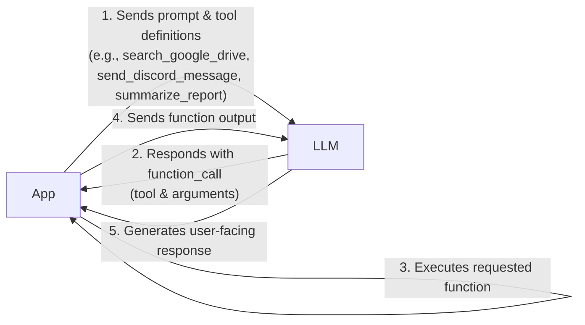
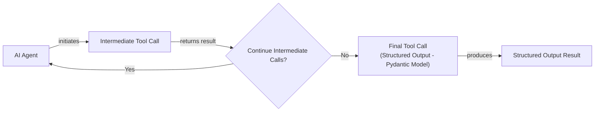
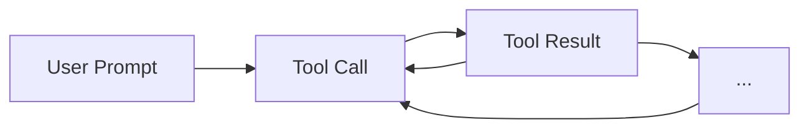

# Lesson 6: Agent Tools & Function Calling

In the last few lessons, we have built a solid foundation in AI Engineering. We have explored the agent landscape, distinguished between LLM workflows and AI agents, and mastered context engineering to feed LLMs the right information. We also learned how to get reliable, structured data out of them. Now, we will give our agents the ability to act.

This lesson is about tools, also known as function calling. Tools are what transform an LLM from a passive text generator into an active agent that can interact with the external world. For an AI Engineer, understanding how an agent uses tools is not just important; it is the key to building, debugging, and monitoring any real-world AI application. We will open up this black box, starting from the ground up.

## Understanding Why Agents Need Tools

LLMs have a fundamental limitation: they are powerful pattern matchers and text generators, but they cannot perform actions or access information outside their training data on their own. They are like a brain in a jar, capable of incredible reasoning but unable to interact with the world. This is where tools come in. They act as the agent's "hands and senses," allowing it to perceive and act in the world beyond its textual interface.

This limitation is not just a design choice but a consequence of their training. Likelihood-based training rewards local coherence over logical truth, which can lead to reasoning degradation and hallucinations [[39]](https://arxiv.org/html/2511.12869v2). Practical engineering constraints, such as finite context windows and the unreliability of managing complex state through prompts, also make external tools essential for robust performance [[40]](https://arxiv.org/html/2604.08224v1).

Tools are the bridge between an LLM's internal reasoning and the external environment. By giving an LLM access to tools, we transform it into an AI agent that can execute specific instructions and interact with its surroundings. This capability unlocks a vast range of applications.

Image 1: An AI Agent's core components include an LLM, planning capabilities, memory, and tools.

Some of the most common tools that power modern AI agents include:

*   **Accessing real-time information:** Using APIs to get today's weather, the latest news, or stock prices [[19]](https://lnu.diva-portal.org/smash/get/diva2:1801354/FULLTEXT01.pdf).
*   **Interacting with data stores:** Querying external databases like PostgreSQL, data warehouses like Snowflake, or data lakes on S3 [[16]](https://arxiv.org/html/2507.08034v1).
*   **Accessing long-term memory:** Retrieving information from vector or graph databases to remember facts beyond the current context window [[11]](https://neo4j.com/blog/agentic-ai/connected-context-and-persistent-memory-neo4j-providers-for-the-microsoft-agent-framework/).
*   **Executing code:** Running Python or JavaScript code to perform precise calculations, manipulate data, or create visualizations [[18]](https://medium.com/@anicomanesh/how-llm-reasoning-powers-the-agentic-ai-revolution-cbefd10ebf3f).

## Implementing tool calls from scratch

The best way to understand how tools work is to build them from the ground up. In this section, we will implement a simple tool-calling mechanism from scratch. We will define our tools, create schemas for them, and write a system prompt that teaches the LLM how to call them. Our goal is to give the LLM a list of available functions and let it decide which one to use, generating the correct arguments needed for the call.

The high-level process of calling a tool involves a five-step loop between your application and the LLM.



Image 2: A flowchart illustrating the 5-step request-execute-respond flow of calling a tool.

Let's implement this flow. We will build a simple agent that can search for a financial report on a mocked Google Drive, summarize it, and send the summary to a Discord channel.

1.  First, we set up our environment by importing the necessary libraries and initializing the Gemini client. We will use the `gemini-2.5-flash` model, which is fast and cost-effective. We also define a sample `DOCUMENT` to simulate the content of a file we might find.
    ```python
    import json
    from typing import Any

    from google import genai
    from google.genai import types
    from pydantic import BaseModel, Field

    from lessons.utils import env, pretty_print

    env.load(required_env_vars=["GOOGLE_API_KEY"])

    client = genai.Client()
    MODEL_ID = "gemini-2.5-flash"

    DOCUMENT = """
    # Q3 2023 Financial Performance Analysis

    The Q3 earnings report shows a 20% increase in revenue and a 15% growth in user engagement, 
    beating market expectations. These impressive results reflect our successful product strategy 
    and strong market positioning.

    Our core business segments demonstrated remarkable resilience, with digital services leading 
    the growth at 25% year-over-year. The expansion into new markets has proven particularly 
    successful, contributing to 30% of the total revenue increase.

    Customer acquisition costs decreased by 10% while retention rates improved to 92%, 
    marking our best performance to date. These metrics, combined with our healthy cash flow 
    position, provide a strong foundation for continued growth into Q4 and beyond.
    """
    ```

2.  Next, we define our three mock tools as Python functions. The function signature and docstring are critical, as the LLM will use this information to understand what each tool does.
    ```python
    def search_google_drive(query: str) -> dict:
        """
        Searches for a file on Google Drive and returns its content or a summary.

        Args:
            query (str): The search query to find the file, e.g., 'Q3 earnings report'.

        Returns:
            dict: A dictionary representing the search results, including file names and summaries.
        """
        return {
            "files": [
                {
                    "name": "Q3_Earnings_Report_2024.pdf",
                    "id": "file12345",
                    "content": DOCUMENT,
                }
            ]
        }
    ```
    ```python
    def send_discord_message(channel_id: str, message: str) -> dict:
        """
        Sends a message to a specific Discord channel.

        Args:
            channel_id (str): The ID of the channel to send the message to, e.g., '#finance'.
            message (str): The content of the message to send.

        Returns:
            dict: A dictionary confirming the action, e.g., {"status": "success"}.
        """
        return {
            "status": "success",
            "status_code": 200,
            "channel": channel_id,
            "message_preview": f"{message[:50]}...",
        }
    ```
    ```python
    def summarize_financial_report(text: str) -> str:
        """
        Summarizes a financial report.

        Args:
            text (str): The text to summarize.

        Returns:
            str: The summary of the text.
        """
        return "The Q3 2023 earnings report shows strong performance across all metrics with 20% revenue growth, 15% user engagement increase, 25% digital services growth, and improved retention rates of 92%."
    ```

3.  For the LLM to use these functions, we must describe them in a format it understands. We define a JSON schema for each tool, which specifies its name, a description of what it does, and the parameters it accepts. This schema is the industry standard for modern LLM providers like OpenAI and Gemini [[23]](https://tetrate.io/learn/ai/llm-output-parsing-structured-generation), [[83]](https://myengineeringpath.dev/tools/gemini-guide/).
    ```python
    search_google_drive_schema = {
        "name": "search_google_drive",
        "description": "Searches for a file on Google Drive and returns its content or a summary.",
        "parameters": {
            "type": "object",
            "properties": {
                "query": {
                    "type": "string",
                    "description": "The search query to find the file, e.g., 'Q3 earnings report'.",
                }
            },
            "required": ["query"],
        },
    }
    ```
    ```python
    send_discord_message_schema = {
        "name": "send_discord_message",
        "description": "Sends a message to a specific Discord channel.",
        "parameters": {
            "type": "object",
            "properties": {
                "channel_id": {
                    "type": "string",
                    "description": "The ID of the channel to send the message to, e.g., '#finance'.",
                },
                "message": {
                    "type": "string",
                    "description": "The content of the message to send.",
                },
            },
            "required": ["channel_id", "message"],
        },
    }
    ```
    ```python
    summarize_financial_report_schema = {
        "name": "summarize_financial_report",
        "description": "Summarizes a financial report.",
        "parameters": {
            "type": "object",
            "properties": {
                "text": {
                    "type": "string",
                    "description": "The text to summarize.",
                },
            },
            "required": ["text"],
        },
    }
    ```

4.  We then create a tool registry to map tool names to their corresponding functions and schemas.
    ```python
    TOOLS = {
        "search_google_drive": {
            "handler": search_google_drive,
            "declaration": search_google_drive_schema,
        },
        "send_discord_message": {
            "handler": send_discord_message,
            "declaration": send_discord_message_schema,
        },
        "summarize_financial_report": {
            "handler": summarize_financial_report,
            "declaration": summarize_financial_report_schema,
        },
    }
    TOOLS_BY_NAME = {tool_name: tool["handler"] for tool_name, tool in TOOLS.items()}
    TOOLS_SCHEMA = [tool["declaration"] for tool in TOOLS.values()]
    ```
    The `TOOLS_BY_NAME` mapping looks like this:
    ```text
    Tool name: search_google_drive
    Tool handler: <function search_google_drive at 0x104c7df80>
    ---------------------------------------------------------------------------
    Tool name: send_discord_message
    Tool handler: <function send_discord_message at 0x104c7de40>
    ---------------------------------------------------------------------------
    Tool name: summarize_financial_report
    Tool handler: <function summarize_financial_report at 0x1274f5c60>
    ---------------------------------------------------------------------------
    ```
    And here is the schema for our `search_google_drive` tool:
    ```json
    {
      "name": "search_google_drive",
      "description": "Searches for a file on Google Drive and returns its content or a summary.",
      "parameters": {
        "type": "object",
        "properties": {
          "query": {
            "type": "string",
            "description": "The search query to find the file, e.g., 'Q3 earnings report'."
          }
        },
        "required": [
          "query"
        ]
      }
    }
    ```

5.  Now, we need to instruct the LLM on how to use these tools. We create a detailed system prompt that explains when to use tools, how to select them, and the exact format for a tool call.
    ```python
    TOOL_CALLING_SYSTEM_PROMPT = """
    You are a helpful AI assistant with access to tools that enable you to take actions and retrieve information to better 
    assist users.

    ## Tool Usage Guidelines

    **When to use tools:**
    - When you need information that is not in your training data
    - When you need to perform actions in external systems and environments
    - When you need real-time, dynamic, or user-specific data
    - When computational operations are required

    **Tool selection:**
    - Choose the most appropriate tool based on the user's specific request
    - If multiple tools could work, select the one that most directly addresses the need
    - Consider the order of operations for multi-step tasks

    **Parameter requirements:**
    - Provide all required parameters with accurate values
    - Use the parameter descriptions to understand expected formats and constraints
    - Ensure data types match the tool's requirements (strings, numbers, booleans, arrays)

    ## Tool Call Format

    When you need to use a tool, output ONLY the tool call in this exact format:

    <tool_call>
    {{"name": "tool_name", "args": {{"param1": "value1", "param2": "value2"}}}}
    </tool_call>

    **Critical formatting rules:**
    - Use double quotes for all JSON strings
    - Ensure the JSON is valid and properly escaped
    - Include ALL required parameters
    - Use correct data types as specified in the tool definition
    - Do not include any additional text or explanation in the tool call

    ## Response Behavior

    - If no tools are needed, respond directly to the user with helpful information
    - If tools are needed, make the tool call first, then provide context about what you're doing
    - After receiving tool results, provide a clear, user-friendly explanation of the outcome
    - If a tool call fails, explain the issue and suggest alternatives when possible

    ## Available Tools

    <tool_definitions>
    {tools}
    </tool_definitions>

    Remember: Your goal is to be maximally helpful to the user. Use tools when they add value, but don't use them unnecessarily. Always prioritize accuracy and user experience.
    """
    ```

Based on the `description` field in the tool schema, the LLM *decides* if a tool call is appropriate to fulfill the user query. This is why writing clear and articulate tool descriptions is critical for building successful AI agents [[32]](https://www.anthropic.com/research/building-effective-agents). When you provide multiple tools, their descriptions must be distinct to avoid confusion. For example, descriptions like "search documents" and "search files" are ambiguous. It is better to be explicit: "search documents on Google Drive" versus "search files on the local disk" [[77]](https://mbrenndoerfer.com/writing/function-calling-llm-structured-tools). This clarity becomes crucial as you scale to 50-100 tools per agent. However, simply listing all schemas in the prompt does not scale. Advanced systems use techniques like semantic distillation, where tools are retrieved via vector search rather than being statically listed, solving the context window bottleneck [[90]](https://www.linkedin.com/posts/anthony-alcaraz-b80763155_your-ai-agents-are-failing-because-of-tool-activity-7385615536883286016-HvoY).

Once a tool is selected, the LLM *generates* the function name and arguments as a structured output, like JSON. This capability is not magic; LLMs are specifically instruction-tuned to interpret tool schemas and produce valid tool calls. While prompting adapts a model from the outside, fine-tuning on thousands of valid examples updates the model's internal weights, making schema adherence a "native" capability rather than a brittle, prompt-dependent behavior [[91]](https://blog.neosage.io/p/an-engineers-guide-to-fine-tuning), [[92]](https://mbrenndoerfer.com/writing/function-calling-llm-structured-tools).

6.  Let's test it. We send a user prompt along with our system prompt to the model.
    ```python
    USER_PROMPT = """
    Please find the Q3 earnings report on Google Drive and send a summary of it to 
    the #finance channel on Discord.
    """

    messages = [TOOL_CALLING_SYSTEM_PROMPT.format(tools=str(TOOLS_SCHEMA)), USER_PROMPT]

    response = client.models.generate_content(
        model=MODEL_ID,
        contents=messages,
    )
    ```
    The LLM correctly identifies the `search_google_drive` tool and generates the required arguments:
    ```text
    ```tool_call
    {"name": "search_google_drive", "args": {"query": "Q3 earnings report"}}
    ```
    ```

7.  Now we need to parse this response and execute the function. We will create a helper function to extract the JSON string from the response.
    ```python
    def extract_tool_call(response_text: str) -> str:
        """
        Extracts the tool call from the response text.
        """
        return response_text.split("```tool_call")[1].split("```")[0].strip()


    tool_call_str = extract_tool_call(response.text)
    ```
    This gives us the raw JSON string:
    ```text
    '{"name": "search_google_drive", "args": {"query": "Q3 earnings report"}}'
    ```

8.  We parse the string into a Python dictionary and use it to call the correct tool handler.
    ```python
    tool_call = json.loads(tool_call_str)
    tool_handler = TOOLS_BY_NAME[tool_call["name"]]
    tool_result = tool_handler(**tool_call["args"])
    ```
    The tool returns the content of the document:
    ```json
    {
      "files": [
        {
          "name": "Q3_Earnings_Report_2024.pdf",
          "id": "file12345",
          "content": "\n# Q3 2023 Financial Performance Analysis\n\nThe Q3 earnings report shows a 20% increase in revenue and a 15% growth in user engagement, \nbeating market expectations. These impressive results reflect our successful product strategy \nand strong market positioning.\n\nOur core business segments demonstrated remarkable resilience, with digital services leading \nthe growth at 25% year-over-year. The expansion into new markets has proven particularly \nsuccessful, contributing to 30% of the total revenue increase.\n\nCustomer acquisition costs decreased by 10% while retention rates improved to 92%, \nmarking our best performance to date. These metrics, combined with our healthy cash flow \nposition, provide a strong foundation for continued growth into Q4 and beyond.\n"
        }
      ]
    }
    ```

9.  To streamline this, we can create a `call_tool` function that handles parsing and execution in one step.
    ```python
    def call_tool(response_text: str, tools_by_name: dict) -> Any:
        """
        Call a tool based on the response from the LLM.
        """
        tool_call_str = extract_tool_call(response_text)
        tool_call = json.loads(tool_call_str)
        tool_name = tool_call["name"]
        tool_args = tool_call["args"]
        tool = tools_by_name[tool_name]
        return tool(**tool_args)
    ```

10. Finally, the tool's output is sent back to the LLM. The model can then use this new information to generate a final response for the user or decide on the next action to take.
    ```python
    response = client.models.generate_content(
        model=MODEL_ID,
        contents=f"Interpret the tool result: {json.dumps(tool_result, indent=2)}",
    )
    ```
    The LLM provides a helpful summary based on the document content:
    ```text
    The tool result provides the content of a file named `Q3_Earnings_Report_2024.pdf`.

    This document is a **Q3 2023 Financial Performance Analysis** and details exceptionally strong results, significantly beating market expectations.

    **Key highlights from the report include:**

    *   **Revenue Growth:** A 20% increase in revenue.
    *   **User Engagement:** 15% growth in user engagement.
    *   **Core Business Performance:** Digital services led growth at 25% year-over-year.
    *   **Market Expansion Success:** New markets contributed 30% of the total revenue increase.
    *   **Efficiency & Retention:**
        *   Customer acquisition costs decreased by 10%.
        *   Retention rates improved to 92%, marking the best performance to date.
    *   **Financial Health:** The company maintains a healthy cash flow position.

    The report attributes these impressive results to a successful product strategy and strong market positioning, indicating a robust foundation for continued growth into Q4 and beyond.
    ```
This covers the basic concept of tool calling. We have successfully implemented it from scratch, but as you can see, it involves a lot of manual work.

## Implementing a small tool calling framework from scratch

Manually defining a JSON schema for every function is tedious and error-prone. Production frameworks like LangGraph and protocols like MCP (Model Context Protocol) solve this by using a `@tool` decorator that automatically generates the schema from a function's signature and docstring [[26]](https://openai.github.io/openai-agents-python/tools/). MCP is an emerging open standard for how AI systems integrate with external tools, providing a universal interface that has been adopted by major AI providers [[93]](https://truto.one/blog/the-best-unified-apis-for-llm-function-calling-ai-agent-tools-2026). This approach follows the Don't Repeat Yourself (DRY) principle by creating a single source of truth for both the tool's implementation and its definition.

Let's build our own simple framework by creating a `@tool` decorator. This will make our code cleaner, more maintainable, and closer to what you will see in production.

1.  First, we define a `ToolFunction` class to wrap our decorated functions. This class will store both the function itself and its auto-generated schema.
    ```python
    from inspect import Parameter, signature
    from typing import Any, Callable, Dict, Optional


    class ToolFunction:
        def __init__(self, func: Callable, schema: Dict[str, Any]) -> None:
            self.func = func
            self.schema = schema
            self.__name__ = func.__name__
            self.__doc__ = func.__doc__

        def __call__(self, *args: Any, **kwargs: Any) -> Any:
            return self.func(*args, **kwargs)
    ```

2.  Next, we implement the `@tool` decorator. It inspects the function's signature to extract parameter names and determines which are required. It uses the function's name and docstring for the schema's `name` and `description`.
    ```python
    def tool(description: Optional[str] = None) -> Callable[[Callable], ToolFunction]:
        """
        A decorator that creates a tool schema from a function.

        Args:
            description: Optional override for the function's docstring

        Returns:
            A decorator function that wraps the original function and adds a schema
        """

        def decorator(func: Callable) -> ToolFunction:
            sig = signature(func)
            properties = {}
            required = []
            for param_name, param in sig.parameters.items():
                if param_name == "self":
                    continue
                param_schema = {
                    "type": "string",
                    "description": f"The {param_name} parameter",
                }
                if param.default == Parameter.empty:
                    required.append(param_name)
                properties[param_name] = param_schema
            schema = {
                "name": func.__name__,
                "description": description or func.__doc__ or f"Executes the {func.__name__} function.",
                "parameters": {
                    "type": "object",
                    "properties": properties,
                    "required": required,
                },
            }
            return ToolFunction(func, schema)
        return decorator
    ```

3.  Now, we can redefine our tools using this decorator. The code is much cleaner, as the schemas are generated automatically.
    ```python
    @tool()
    def search_google_drive_example(query: str) -> dict:
        """Search for files in Google Drive."""
        return {"files": ["Q3 earnings report"]}


    @tool()
    def send_discord_message_example(channel_id: str, message: str) -> dict:
        """Send a message to a Discord channel."""
        return {"message": "Message sent successfully"}


    @tool()
    def summarize_financial_report_example(text: str) -> str:
        """Summarize the contents of a financial report."""
        return "Financial report summarized successfully"


    tools = [
        search_google_drive_example,
        send_discord_message_example,
        summarize_financial_report_example,
    ]
    tools_by_name = {tool.schema["name"]: tool.func for tool in tools}
    tools_schema = [tool.schema for tool in tools]
    ```
    The decorated function is now a `ToolFunction` object. It contains the schema, which is identical to the one we defined manually, and a reference to the original function handler.
    ```json
    {
      "name": "search_google_drive_example",
      "description": "Search for files in Google Drive.",
      "parameters": {
        "type": "object",
        "properties": {
          "query": {
            "type": "string",
            "description": "The query parameter"
          }
        },
        "required": [
          "query"
        ]
      }
    }
    ```

4.  Let's run the same user prompt as before. The LLM receives the auto-generated schemas and correctly identifies the tool to call.
    ```python
    USER_PROMPT = """
    Please find the Q3 earnings report on Google Drive and send a summary of it to 
    the #finance channel on Discord.
    """

    messages = [TOOL_CALLING_SYSTEM_PROMPT.format(tools=str(tools_schema)), USER_PROMPT]

    response = client.models.generate_content(
        model=MODEL_ID,
        contents=messages,
    )
    ```
    It outputs:
    ```text
    ```tool_call
    {"name": "search_google_drive_example", "args": {"query": "Q3 earnings report"}}
    ```
    ```

5.  We use our `call_tool` function to execute the tool, and it works just as before.
    ```python
    call_tool(response.text, tools_by_name=tools_by_name)
    ```
    It outputs:
    ```json
    {
      "files": [
        "Q3 earnings report"
      ]
    }
    ```
Voilà! We have built a small, reusable tool-calling framework. This implementation is conceptually similar to what frameworks like LangGraph do under the hood.

## Implementing production-level tool calls with Gemini

While building from scratch is a great learning exercise, in production, you will almost always use the native tool-calling features of an LLM provider like Gemini or OpenAI. These APIs are optimized for their specific models, making them more robust, efficient, and easier to maintain [[80]](https://www.decodingai.com/p/tool-calling-from-scratch-to-production).

Let's see how to achieve the same result using Gemini's native `GenerateContentConfig`.

1.  Instead of crafting a large system prompt, we define a `config` object and pass our tool schemas directly to it. We can also set the `tool_config` to force the model to call a function.
    ```python
    tools = [
        types.Tool(
            function_declarations=[
                types.FunctionDeclaration(**search_google_drive_schema),
                types.FunctionDeclaration(**send_discord_message_schema),
            ]
        )
    ]
    config = types.GenerateContentConfig(
        tools=tools,
        tool_config=types.ToolConfig(function_calling_config=types.FunctionCallingConfig(mode="ANY")),
    )
    ```

2.  Now, we can call the model with just the user prompt. The Gemini API handles the complex instructions internally.
    ```python
    response = client.models.generate_content(
        model=MODEL_ID,
        contents=USER_PROMPT,
        config=config,
    )
    function_call = response.candidates[0].content.parts[0].function_call
    ```
    The response contains a `FunctionCall` object, which is much cleaner to work with than parsing raw text:
    ```text
    FunctionCall(id=None, args={'query': 'Q3 earnings report'}, name='search_google_drive')
    ```

3.  The `google-genai` Python SDK simplifies this even further. It can automatically generate the schema from a Python function’s signature, type hints, and docstring, just like our custom decorator. We can pass our functions directly to the `GenerateContentConfig` object.
    ```python
    from google.genai import types
    config = types.GenerateContentConfig(
        tools=[search_google_drive, send_discord_message]
    )
    ```

4.  We can then create a simplified `call_tool` function to execute the call.
    ```python
    def call_tool(function_call) -> any:
        tool_name = function_call.name
        tool_args = {key: value for key, value in function_call.args.items()}
        tool_handler = TOOLS_BY_NAME[tool_name]
        return tool_handler(**tool_args)

    tool_result = call_tool(function_call)
    ```
    The output is the same as our manual implementation. By leveraging the native SDK, we reduced dozens of lines of code to just a few, creating a more robust and maintainable system. Other popular APIs from OpenAI and Anthropic follow a similar logic, making these concepts easily transferable [[81]](https://apxml.com/courses/prompt-engineering-llm-application-development/chapter-4-interacting-with-llm-apis), [[82]](https://www.getorchestra.io/guides/llm-providers-gen-ai-platforms-compared).

## Using Pydantic models as tools for on-demand structured outputs

In Lesson 4, we learned how to generate structured outputs. A powerful pattern in agentic systems is to treat a Pydantic model as a tool. This allows an agent to perform several intermediate steps that may produce unstructured text, and then, when it has all the information it needs, call a final "tool" to format the result into a structured Pydantic object. This is perfect for scenarios where you need a reliable, validated output at the end of a multi-step process.



Image 3: A flowchart illustrating an AI agent calling multiple tools in a loop, where only the last one is a tool call for structured outputs.

Let's see how to implement this.

1.  First, we define our `DocumentMetadata` Pydantic model, just as we did in Lesson 4.
    ```python
    class DocumentMetadata(BaseModel):
        """A class to hold structured metadata for a document."""

        summary: str = Field(description="A concise, 1-2 sentence summary of the document.")
        tags: list[str] = Field(description="A list of 3-5 high-level tags relevant to the document.")
        keywords: list[str] = Field(description="A list of specific keywords or concepts mentioned.")
        quarter: str = Field(description="The quarter of the financial year described in the document (e.g., Q3 2023).")
        growth_rate: str = Field(description="The growth rate of the company described in the document (e.g., 10%).")
    ```

2.  We then create an `extraction_tool` by defining a `FunctionDeclaration`. We give it a name, `extract_metadata`, and for its parameters, we pass the JSON schema generated from our Pydantic model using `DocumentMetadata.model_json_schema()`.
    ```python
    extraction_tool = types.Tool(
        function_declarations=[
            types.FunctionDeclaration(
                name="extract_metadata",
                description="Extracts structured metadata from a financial document.",
                parameters=DocumentMetadata.model_json_schema(),
            )
        ]
    )
    config = types.GenerateContentConfig(
        tools=[extraction_tool],
        tool_config=types.ToolConfig(function_calling_config=types.FunctionCallingConfig(mode="ANY")),
    )
    ```

3.  We prompt the model to analyze the document and extract the metadata.
    ```python
    prompt = f"""
    Please analyze the following document and extract its metadata.

    Document:
    --- 
    {DOCUMENT}
    --- 
    """

    response = client.models.generate_content(model=MODEL_ID, contents=prompt, config=config)
    function_call = response.candidates[0].content.parts[0].function_call
    ```
    The model responds with a call to our `extract_metadata` tool, with the arguments populated as a dictionary.

4.  Finally, we can validate this dictionary against our Pydantic model to get a type-safe Python object.
    ```python
    try:
        document_metadata = DocumentMetadata(**function_call.args)
        print("Validation successful!")
    except Exception as e:
        print(f"Validation failed: {e}")
    ```
    It outputs:
    ```text
    Validation successful!
    ```
This pattern is extremely useful for building agents that need to return reliable, structured data after completing a series of actions.

## The downsides of running tools in a loop

So far, we have focused on single-turn interactions where the agent calls one tool. However, many real-world tasks require multiple steps. A natural progression is to run tools in a loop, allowing the agent to chain multiple actions together. At each step, the LLM can decide which tool to use next based on the output of the previous one. This gives the agent flexibility and allows it to handle complex, multi-step tasks.



Image 4: A flowchart illustrating a sequential tool calling loop.

Let's implement a loop where the agent first searches for the financial report, then summarizes it, and finally sends the summary to Discord.

1.  We configure our model with all three tools.
    ```python
    tools = [
        types.Tool(
            function_declarations=[
                types.FunctionDeclaration(**search_google_drive_schema),
                types.FunctionDeclaration(**send_discord_message_schema),
                types.FunctionDeclaration(**summarize_financial_report_schema),
            ]
        )
    ]
    config = types.GenerateContentConfig(
        tools=tools,
        tool_config=types.ToolConfig(function_calling_config=types.FunctionCallingConfig(mode="ANY")),
    )
    ```

2.  We start with the same user prompt and an empty message history.
    ```python
    USER_PROMPT = """
    Please find the Q3 earnings report on Google Drive and send a summary of it to 
    the #finance channel on Discord.
    """
    messages = [USER_PROMPT]
    ```

3.  We run a loop that continues as long as the model requests a tool call. In each iteration, we execute the tool, add the result to the message history, and call the model again to determine the next step.
    ```python
    response = client.models.generate_content(
        model=MODEL_ID,
        contents=messages,
        config=config,
    )
    response_message_part = response.candidates[0].content.parts[0]
    messages.append(response.candidates[0].content)

    max_iterations = 3
    while hasattr(response_message_part, "function_call") and max_iterations > 0:
        tool_result = call_tool(response_message_part.function_call)
        
        function_response_part = types.Part.from_function_response(
            name=response_message_part.function_call.name,
            response={"result": tool_result},
        )
        messages.append(function_response_part)

        response = client.models.generate_content(
            model=MODEL_ID,
            contents=messages,
            config=config,
        )
        response_message_part = response.candidates[0].content.parts[0]
        messages.append(response.candidates[0].content)
        max_iterations -= 1
    ```
    The agent successfully completes the task by chaining the three tools in the correct order: `search_google_drive`, `summarize_financial_report`, and `send_discord_message`.

While powerful, this simple loop has significant limitations. It does not give the LLM a chance to interpret the output of a tool before deciding on the next action. The agent immediately moves to the next function call without pausing to think about what it has learned or whether it should change its strategy. This can lead to inefficient tool usage or getting stuck in loops [[9]](https://myengineeringpath.dev/genai-engineer/agentic-patterns/). This compounding error is predictable: if each step has a 90% success rate, a 10-step process has only a 35% chance of succeeding overall [[94]](https://tushardadlani.com/the-compound-error-crisis-why-llm-agents-are-failing-like-broken-robots-and-why-computer-science-warned-us). This results in observable failure patterns, such as getting trapped in unproductive iterations or misinterpreting a verification step and incorrectly concluding success [[95]](https://arxiv.org/html/2509.13941v1).

As a side note, when tools are independent, they can be run in parallel to reduce latency. For instance, an agent could fetch financial news and stock prices simultaneously.

These limitations of simple loops pushed the industry to develop more sophisticated patterns like **ReAct** (Reasoning and Acting). ReAct explicitly interleaves reasoning steps with tool calls, allowing the agent to think through problems more deliberately. We will explore this pattern in detail in Lessons 7 and 8.

## Popular tools used within the industry

To ground what we have learned in the real world, let's look at some of the most popular categories of tools used in production AI systems today.

1.  **Knowledge & Memory Access:** These tools connect the agent to various data sources. This includes querying vector databases for RAG, document stores, or even graph databases to retrieve context. A more advanced pattern is text-to-SQL, where the LLM constructs SQL queries to interact with traditional databases [[13]](https://promethium.ai/guides/text-to-sql-basics-benefits/). These tools can be seen as a form of "cognitive scaffolding," acting as external memory aids that help an agent maintain discipline and state during long tasks [[96]](https://gist.github.com/LangSensei/ffece86d696948ef739e42233642141a). They are closely related to agent memory, which we will cover in Lesson 9, and RAG, which we will dive into in Lesson 10.
2.  **Web Search & Browsing:** Omnipresent in chatbots and research agents, these tools allow an agent to access up-to-date information from the internet. They typically interface with search engine APIs like Google Search or Brave Search and can include web scraping capabilities to parse content from web pages [[16]](https://arxiv.org/html/2507.08034v1).
3.  **Code Execution:** A code interpreter, most commonly for Python, is an invaluable tool. It allows an agent to write and execute code in a sandboxed environment, enabling it to perform precise calculations, manipulate data, and generate statistics or visualizations. This overcomes the LLM's inherent weakness in performing exact mathematical operations [[18]](https://medium.com/@anicomanesh/how-llm-reasoning-powers-the-agentic-ai-revolution-cbefd10ebf3f).
4.  **Physical World Interaction:** In fields like autonomous robotics, tool calling bridges the gap between language and physical action. LLMs decompose high-level commands (e.g., "pick up the apple") into a sequence of API calls that control low-level actuators and manipulators, enabling robots to perform complex tasks in unstructured environments [[97]](https://www.mdpi.com/2673-2688/6/7/158).
5.  **Other Popular Tools:** The possibilities are nearly endless. In enterprise applications, agents often interact with external APIs for calendars, email, and project management tools. In productivity apps, they might perform file system operations like reading and writing files. These tools allow agents to take concrete actions in the digital world [[20]](https://medium.com/@yugalnandurkar5/llm-engineering-part-i-fa48d4307d26).

## Conclusion

Tool calling is at the core of modern AI agents. It is the mechanism that allows them to act, learn, and interact with the world. Mastering how to define, implement, and orchestrate tools is perhaps the most important skill for an AI Engineer looking to build, monitor, and debug production-grade AI applications.

In this lesson, we have gone from the fundamentals to production-ready patterns. But our journey does not stop here. The simple tool-calling loop we built has limitations that highlight the need for more advanced reasoning capabilities. In our next lesson, we will explore the theory behind planning and the ReAct pattern, which will allow our agents to think before they act.

## References

- [1] Ntinopoulos, V., Biefer, H. R. C., Tudorache, I., Papadopoulos, N., Odavic, D., Risteski, P., Haeussler, A., & Dzemali, O. (2025). Large language models for data extraction from unstructured and semi-structured electronic health records: a multiple model performance evaluation. BMJ Health & Care Informatics, 32(1), e101139. (https://pmc.ncbi.nlm.nih.gov/articles/PMC11751965/)
- [2] Evaluation of LLM-based Strategies for the Extraction of Food Product Information from Online Shops. (n.d.). arXiv. (https://arxiv.org/html/2506.21585v1)
- [3] Team, S. (2024, August 29). Type Safety in Python: Pydantic vs. Data Classes vs. Annotations vs. TypedDicts | Speakeasy. Speakeasy. (https://www.speakeasy.com/blog/pydantic-vs-dataclasses)
- [4] Validators approach in Python - Pydantic vs. Dataclasses. (n.d.). Codetain - End-to-end Software Development. (https://codetain.com/blog/validators-approach-in-python-pydantic-vs-dataclasses/)
- [5] Automating Knowledge Graphs with LLM Outputs. (n.d.). Prompts.ai. (https://www.prompts.ai/en/blog-details/automating-knowledge-graphs-with-llm-outputs)
- [6] Kelly, C. (2025, February 13). Structured Outputs: everything you should know. Humanloop: LLM Evals Platform for Enterprises. (https://humanloop.com/blog/structured-outputs)
- [7] Structured Outputs in vLLM: Guiding AI Responses. (n.d.). Red Hat Developer. (https://developers.redhat.com/articles/2025/06/03/structured-outputs-vllm-guiding-ai-responses)
- [8] Best practices for prompt engineering with the OpenAI API. (n.d.). OpenAI Help Center. (https://help.openai.com/en/articles/6654000-best-practices-for-prompt-engineering-with-the-openai-api)
- [9] Agentic Design Patterns — Visual Architecture Guide. (https://myengineeringpath.dev/genai-engineer/agentic-patterns/)
- [10] Structured output. (n.d.). Google AI for Developers. (https://ai.google.dev/gemini-api/docs/structured-output)
- [11] Agentic AI: Connected Context and Persistent Memory with Neo4j Providers for the Microsoft Agent Framework. (https://neo4j.com/blog/agentic-ai/connected-context-and-persistent-memory-neo4j-providers-for-the-microsoft-agent-framework/)
- [12] Solomon, M. (2020, March 27). TypedDict vs dataclasses in Python — Epic typing BATTLE! DEV Community. (https://dev.to/meeshkan/typeddict-vs-dataclasses-in-python-epic-typing-battle-onb)
- [13] Text-to-SQL: The Basics, Benefits, and How It Works. (https://promethium.ai/guides/text-to-sql-basics-benefits/)
- [14] Sharma, A. (2024, October 10). When should I use function calling, structured outputs or JSON mode? Vellum AI Blog. (https://www.vellum.ai/blog/when-should-i-use-function-calling-structured-outputs-or-json-mode)
- [15] Structured Output in vertexAI BatchPredictionJob. (n.d.). Google Cloud Community. (https://www.googlecloudcommunity.com/gc/AI-ML/Structured-Output-in-vertexAI-BatchPredictionJob/m-p/866640)
- [16] Integrating External Tools with Large Language Models (LLM) to Improve Accuracy. (https://arxiv.org/html/2507.08034v1)
- [17] Hacker News Discussion on Structured Output. (n.d.). Hacker News. (https://news.ycombinator.com/item?id=41173223)
- [18] How LLM Reasoning Powers the Agentic AI Revolution. (https://medium.com/@anicomanesh/how-llm-reasoning-powers-the-agentic-ai-revolution-cbefd10ebf3f)
- [19] LLMs with external APIs. (https://lnu.diva-portal.org/smash/get/diva2:1801354/FULLTEXT01.pdf)
- [20] LLM Engineering: Part I. (https://medium.com/@yugalnandurkar5/llm-engineering-part-i-fa48d4307d26)
- [21] Prompting Best Practices for Tool Use / Function Calling. (https://community.openai.com/t/prompting-best-practices-for-tool-use-function-calling/1123036)
- [22] Building Production-Ready LLM Applications: Bulletproof LLM Tool Calling with Advanced JSON. (https://medium.com/@hariomshahu101/building-production-ready-llm-applications-bulletproof-llm-tool-calling-with-advanced-json-b95ce8889f4e)
- [23] A Guide to LLM Output Parsing: Structured Generation. (https://tetrate.io/learn/ai/llm-output-parsing-structured-generation)
- [24] Function Calling: A Pragmatic Guide to Giving LLMs Structured Tools. (https://mbrenndoerfer.com/writing/function-calling-llm-structured-tools)
- [25] Function Calling: A Pragmatic Guide to Giving LLMs Structured Tools. (https://mbrenndoerfer.com/writing/function-calling-llm-structured-tools)
- [26] Tools - OpenAI Agents SDK. (https://openai.github.io/openai-agents-python/tools/)
- [27] Tools - Pydantic AI. (https://pydantic.dev/docs/ai/tools-toolsets/tools/)
- [28] Tools - Pydantic AI. (https://pydantic.dev/docs/ai/tools-toolsets/tools/)
- [29] Tools - LangChain. (https://docs.langchain.com/oss/python/langchain/tools)
- [30] @tool decorator - LangChain Core. (https://reference.langchain.com/python/langchain-core/tools/convert/tool)
- [31] Building effective agents. (https://www.anthropic.com/research/building-effective-agents)
- [32] Building effective agents. (https://www.anthropic.com/research/building-effective-agents)
- [33] Tool descriptions are critical: making better LLM tools research capability. (https://pub.towardsai.net/tool-descriptions-are-critical-making-better-llm-tools-research-capability-b315851471e7)
- [34] Tool Input and Output Schema Design. (https://apxml.com/courses/building-advanced-llm-agent-tools/chapter-1-llm-agent-tooling-foundations/tool-input-output-schemas)
- [35] Function Calling: A Pragmatic Guide to Giving LLMs Structured Tools. (https://mbrenndoerfer.com/writing/function-calling-llm-structured-tools)
- [36] Underlying Factors Behind Inconsistency in LLM Responses with Multi-Tool Calling. (https://medium.com/@abhaychougule0907/underlying-factors-behind-inconsistency-in-llm-responses-with-multi-tool-calling-628ce7b4de76)
- [37] How to Edit Tool Descriptions to Get Better Tool-Using LLMs. (https://arxiv.org/html/2505.18135v2)
- [38] Tool Calling From Scratch to Production. (https://www.decodingai.com/p/tool-calling-from-scratch-to-production)
- [39] Information-theoretic bounds on why LLMs need external tools. (https://arxiv.org/html/2511.12869v2)
- [40] LLM need for external tools due to context window limits. (https://arxiv.org/html/2604.08224v1)
- [41] Information-theoretic bounds on why LLMs need external tools. (https://arxiv.org/html/2511.12869v2)
- [42] Function Calling: A Pragmatic Guide to Giving LLMs Structured Tools. (https://mbrenndoerfer.com/writing/function-calling-llm-structured-tools)
- [43] Function calling with the Gemini API. (https://ai.google.dev/gemini-api/docs/function-calling)
- [44] Function calling with OpenAI's API. (https://platform.openai.com/docs/guides/function-calling)
- [45] Tool Calling Agent From Scratch. (https://www.youtube.com/watch?v=ApoDzZP8_ck)
- [46] Efficient Tool Use with Chain-of-Abstraction Reasoning. (https://arxiv.org/pdf/2401.17464v3)
- [47] Building AI Agents from scratch - Part 1: Tool use. (https://www.newsletter.swirlai.com/p/building-ai-agents-from-scratch-part)
- [48] What is Tool Calling? Connecting LLMs to Your Data. (https://www.youtube.com/watch?v=h8gMhXYAv1k)
- [49] ReAct vs Plan-and-Execute: A Practical Comparison of LLM Agent Patterns. (https://dev.to/jamesli/react-vs-plan-and-execute-a-practical-comparison-of-llm-agent-patterns-4gh9)
- [50] Agentic Design Patterns Part 3, Tool Use. (https://www.deeplearning.ai/the-batch/agentic-design-patterns-part-3-tool-use/)
- [51] How does Gemini's GenerateContentConfig and native SDK support for direct function passing simplify production-level tool calling compared to manual schema definition and system prompts?. (https://www.philschmid.de/gemini-function-calling)
- [52] How does Gemini's GenerateContentConfig and native SDK support for direct function passing simplify production-level tool calling compared to manual schema definition and system prompts?. (https://ai.google.dev/gemini-api/docs/function-calling)
- [53] How does Gemini's GenerateContentConfig and native SDK support for direct function passing simplify production-level tool calling compared to manual schema definition and system prompts?. (https://glaforge.dev/posts/2023/12/22/gemini-function-calling/)
- [54] How can a Pydantic model be registered as a tool using DocumentMetadata.model_json_schema() to enable on-demand structured outputs in multi-step agent loops with the Gemini SDK?. (https://pydantic.dev/docs/ai/core-concepts/output/)
- [55] How can a Pydantic model be registered as a tool using DocumentMetadata.model_json_schema() to enable on-demand structured outputs in multi-step agent loops with the Gemini SDK?. (https://pydantic.dev/docs/ai/guides/multi-agent-applications/)
- [56] How can a Pydantic model be registered as a tool using DocumentMetadata.model_json_schema() to enable on-demand structured outputs in multi-step agent loops with the Gemini SDK?. (https://discuss.ai.google.dev/t/response-schema-from-pydantic/50028)
- [57] How can a Pydantic model be registered as a tool using DocumentMetadata.model_json_schema() to enable on-demand structured outputs in multi-step agent loops with the Gemini SDK?. (https://pydantic.dev/docs/ai/tools-toolsets/tools/)
- [58] What are the three main limitations of running tools sequentially in a loop without intermediate LLM interpretation, and how do they motivate more sophisticated patterns like ReAct?. (https://myengineeringpath.dev/genai-engineer/agentic-patterns/)
- [59] What are the three main limitations of running tools sequentially in a loop without intermediate LLM interpretation, and how do they motivate more sophisticated patterns like ReAct?. (https://blogs.oracle.com/developers/what-is-the-ai-agent-loop-the-core-architecture-behind-autonomous-ai-systems)
- [60] What industry tools fall under Knowledge & Memory Access, including vector database queries, text-to-SQL for classic databases, and connections to long-term memory beyond the context window?. (https://neo4j.com/blog/agentic-ai/connected-context-and-persistent-memory-neo4j-providers-for-the-microsoft-agent-framework/)
- [61] What industry tools fall under Knowledge & Memory Access, including vector database queries, text-to-SQL for classic databases, and connections to long-term memory beyond the context window?. (https://promethium.ai/guides/text-to-sql-basics-benefits/)
- [62] How do web search & browsing tools, code execution interpreters, and external API integrations (calendar, email, file system) enable LLMs to overcome their core limitation of being simple pattern matchers and text generators?. (https://arxiv.org/html/2507.08034v1)
- [63] How do web search & browsing tools, code execution interpreters, and external API integrations (calendar, email, file system) enable LLMs to overcome their core limitation of being simple pattern matchers and text generators?. (https://medium.com/@anicomanesh/how-llm-reasoning-powers-the-agentic-ai-revolution-cbefd10ebf3f)
- [64] How do web search & browsing tools, code execution interpreters, and external API integrations (calendar, email, file system) enable LLMs to overcome their core limitation of being simple pattern matchers and text generators?. (https://lnu.diva-portal.org/smash/get/diva2:1801354/FULLTEXT01.pdf)
- [65] How do web search & browsing tools, code execution interpreters, and external API integrations (calendar, email, file system) enable LLMs to overcome their core limitation of being simple pattern matchers and text generators?. (https://medium.com/@yugalnandurkar5/llm-engineering-part-i-fa48d4307d26)
- [66] How does implementing tool calls from scratch with explicit JSON schemas, system prompts like TOOL_CALLING_SYSTEM_PROMPT, and extraction of function name plus arguments demonstrate LLM decision-making for tool selection and parameter generation?. (https://community.openai.com/t/prompting-best-practices-for-tool-use-function-calling/1123036)
- [67] How does implementing tool calls from scratch with explicit JSON schemas, system prompts like TOOL_CALLING_SYSTEM_PROMPT, and extraction of function name plus arguments demonstrate LLM decision-making for tool selection and parameter generation?. (https://medium.com/@hariomshahu101/building-production-ready-llm-applications-bulletproof-llm-tool-calling-with-advanced-json-b95ce8889f4e)
- [68] How does implementing tool calls from scratch with explicit JSON schemas, system prompts like TOOL_CALLING_SYSTEM_PROMPT, and extraction of function name plus arguments demonstrate LLM decision-making for tool selection and parameter generation?. (https://tetrate.io/learn/ai/llm-output-parsing-structured-generation)
- [69] How does implementing tool calls from scratch with explicit JSON schemas, system prompts like TOOL_CALLING_SYSTEM_PROMPT, and extraction of function name plus arguments demonstrate LLM decision-making for tool selection and parameter generation?. (https://mbrenndoerfer.com/writing/function-calling-llm-structured-tools)
- [70] How does a @tool decorator that automatically extracts schemas from function signatures, docstrings, and type hints create a tools registry similar to manual TOOLS_BY_NAME and TOOLS_SCHEMA mappings while following DRY principles?. (https://openai.github.io/openai-agents-python/tools/)
- [71] How does a @tool decorator that automatically extracts schemas from function signatures, docstrings, and type hints create a tools registry similar to manual TOOLS_BY_NAME and TOOLS_SCHEMA mappings while following DRY principles?. (https://pydantic.dev/docs/ai/tools-toolsets/tools/)
- [72] How does a @tool decorator that automatically extracts schemas from function signatures, docstrings, and type hints create a tools registry similar to manual TOOLS_BY_NAME and TOOLS_SCHEMA mappings while following DRY principles?. (https://docs.langchain.com/oss/python/langchain/tools)
- [73] How does a @tool decorator that automatically extracts schemas from function signatures, docstrings, and type hints create a tools registry similar to manual TOOLS_BY_NAME and TOOLS_SCHEMA mappings while following DRY principles?. (https://reference.langchain.com/python/langchain-core/tools/convert/tool)
- [74] Why must tool descriptions be clear and distinguishing when scaling to many tools?. (https://www.anthropic.com/research/building-effective-agents)
- [75] Why must tool description fields in schemas be clear, articulate and mutually distinguishing for the LLM to decide appropriate tool calls based on user queries, with examples of confusing generic descriptions versus explicit ones like "search documents on Google Drive" versus "search files on disk", how does this become crucial when scaling to 50-100 tools, and what role does instruction fine-tuning play in enabling LLMs to interpret schemas and generate structured tool call outputs like JSON or Pydantic?. (https://pub.towardsai.net/tool-descriptions-are-critical-making-better-llm-tools-research-capability-b315851471e7)
- [76] Why must tool description fields in schemas be clear, articulate and mutually distinguishing for the LLM to decide appropriate tool calls based on user queries, with examples of confusing generic descriptions versus explicit ones like "search documents on Google Drive" versus "search files on disk", how does this become crucial when scaling to 50-100 tools, and what role does instruction fine-tuning play in enabling LLMs to interpret schemas and generate structured tool call outputs like JSON or Pydantic?. (https://apxml.com/courses/building-advanced-llm-agent-tools/chapter-1-llm-agent-tooling-foundations/tool-input-output-schemas)
- [77] Why must tool description fields in schemas be clear, articulate and mutually distinguishing for the LLM to decide appropriate tool calls based on user queries, with examples of confusing generic descriptions versus explicit ones like "search documents on Google Drive" versus "search files on disk", how does this become crucial when scaling to 50-100 tools, and what role does instruction fine-tuning play in enabling LLMs to interpret schemas and generate structured tool call outputs like JSON or Pydantic?. (https://mbrenndoerfer.com/writing/function-calling-llm-structured-tools)
- [78] Why must tool description fields in schemas be clear, articulate and mutually distinguishing for the LLM to decide appropriate tool calls based on user queries, with examples of confusing generic descriptions versus explicit ones like "search documents on Google Drive" versus "search files on disk", how does this become crucial when scaling to 50-100 tools, and what role does instruction fine-tuning play in enabling LLMs to interpret schemas and generate structured tool call outputs like JSON or Pydantic?. (https://medium.com/@abhaychougule0907/underlying-factors-behind-inconsistency-in-llm-responses-with-multi-tool-calling-628ce7b4de76)
- [79] Why must tool description fields in schemas be clear, articulate and mutually distinguishing for the LLM to decide appropriate tool calls based on user queries, with examples of confusing generic descriptions versus explicit ones like "search documents on Google Drive" versus "search files on disk", how does this become crucial when scaling to 50-100 tools, and what role does instruction fine-tuning play in enabling LLMs to interpret schemas and generate structured tool call outputs like JSON or Pydantic?. (https://arxiv.org/html/2505.18135v2)
- [80] Why do all popular LLM provider APIs including OpenAI and Anthropic follow essentially the same core logic as Gemini for instructing models on tool usage via configurations like GenerateContentConfig despite only minimal differences in their interfaces, allowing the from-scratch, decorator and Gemini-native lessons to be directly extrapolated to any chosen API after implementing production-level tool calls?. (https://www.decodingai.com/p/tool-calling-from-scratch-to-production)
- [81] Why do all popular LLM provider APIs including OpenAI and Anthropic follow essentially the same core logic as Gemini for instructing models on tool usage via configurations like GenerateContentConfig despite only minimal differences in their interfaces, allowing the from-scratch, decorator and Gemini-native lessons to be directly extrapolated to any chosen API after implementing production-level tool calls?. (https://apxml.com/courses/prompt-engineering-llm-application-development/chapter-4-interacting-with-llm-apis/overview-common-llm-apis)
- [82] Why do all popular LLM provider APIs including OpenAI and Anthropic follow essentially the same core logic as Gemini for instructing models on tool usage via configurations like GenerateContentConfig despite only minimal differences in their interfaces, allowing the from-scratch, decorator and Gemini-native lessons to be directly extrapolated to any chosen API after implementing production-level tool calls?. (https://www.getorchestra.io/guides/llm-providers-gen-ai-platforms-compared)
- [83] Why do all popular LLM provider APIs including OpenAI and Anthropic follow essentially the same core logic as Gemini for instructing models on tool usage via configurations like GenerateContentConfig despite only minimal differences in their interfaces, allowing the from-scratch, decorator and Gemini-native lessons to be directly extrapolated to any chosen API after implementing production-level tool calls?. (https://myengineeringpath.dev/tools/gemini-guide/)
- [84] Why do all popular LLM provider APIs including OpenAI and Anthropic follow essentially the same core logic as Gemini for instructing models on tool usage via configurations like GenerateContentConfig despite only minimal differences in their interfaces, allowing the from-scratch, decorator and Gemini-native lessons to be directly extrapolated to any chosen API after implementing production-level tool calls?. (https://futuresearch.ai/blog/llm-provider-quirks/)
- [85] Function Calling Guide: Google DeepMind Gemini 2.0 Flash. (https://www.philschmid.de/gemini-function-calling)
- [86] Output. (https://pydantic.dev/docs/ai/core-concepts/output/)
- [87] Agentic Design Patterns — Visual Architecture Guide. (https://myengineeringpath.dev/genai-engineer/agentic-patterns/)
- [88] Building effective agents. (https://www.anthropic.com/research/building-effective-agents)
- [89] Tools. (https://openai.github.io/openai-agents-python/tools/)
- [90] Scaling tool discovery with semantic distillation. (https://www.linkedin.com/posts/anthony-alcaraz-b80763155_your-ai-agents-are-failing-because-of-tool-activity-7385615536883286016-HvoY)
- [91] An Engineer's Guide to Fine-Tuning. (https://blog.neosage.io/p/an-engineers-guide-to-fine-tuning)
- [92] Fine-tuning open-source models for tool calling. (https://mbrenndoerfer.com/writing/function-calling-llm-structured-tools)
- [93] The Best Unified APIs for LLM Function Calling & AI Agent Tools (2026). (https://truto.one/blog/the-best-unified-apis-for-llm-function-calling-ai-agent-tools-2026)
- [94] The Compound Error Crisis: Why LLM Agents Are Failing. (https://tushardadlani.com/the-compound-error-crisis-why-llm-agents-are-failing-like-broken-robots-and-why-computer-science-warned-us)
- [95] A Systematic Study of Failure Cases of Automated Issue Solving Tools. (https://arxiv.org/html/2509.13941v1)
- [96] Cognitive Scaffolding for Autonomous Agents. (https://gist.github.com/LangSensei/ffece86d696948ef739e42233642141a)
- [97] A Survey on Large Language Models for Robotic Autonomy. (https://www.mdpi.com/2673-2688/6/7/158)