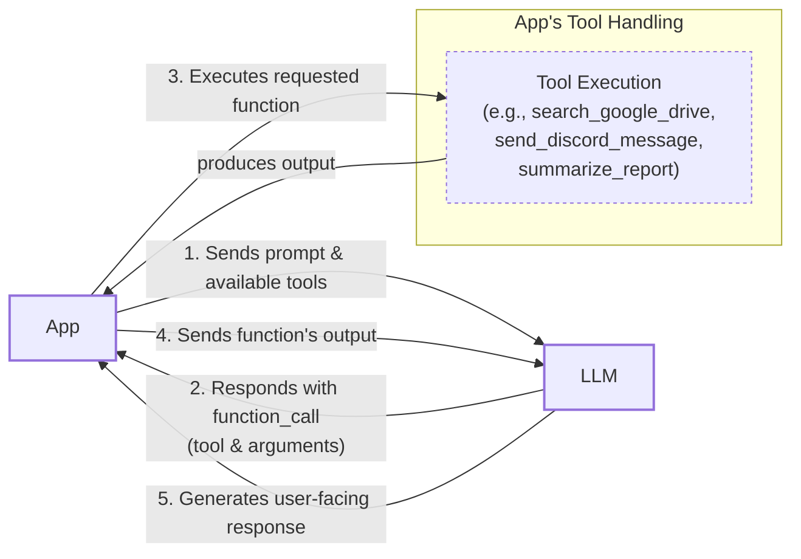
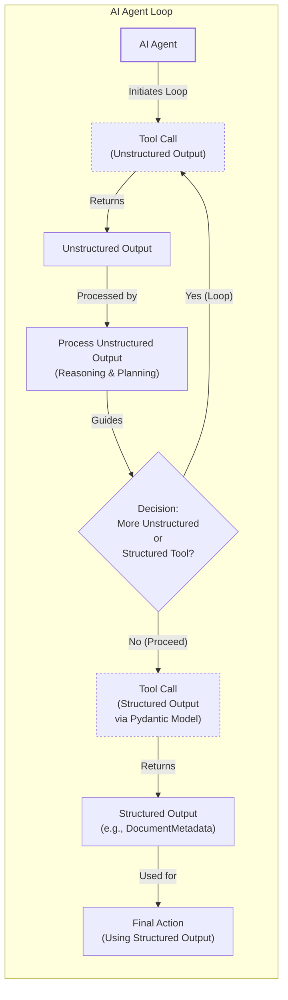
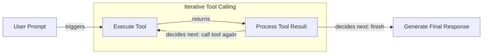

# Lesson 6: Agent Tools and Function Calling

In our previous lessons, we built a solid foundation in AI Engineering. We mapped the agent landscape, distinguished between LLM workflows and AI agents, and mastered context engineering and structured outputs. We even implemented basic workflow patterns like chaining and routing. Now, we will explore one of the most critical building blocks of any AI Agent: **Tools**, also known as Function Calling.

Tools transform an LLM from a simple text generator into an agent that can take action in the external world. Understanding how an agent works with these tools is essential for building, improving, and debugging them. In this lesson, we will open that black box, implementing tool calling from scratch before showing you how to build production-ready solutions with modern APIs like Gemini.

## Why Agents Need Tools

LLMs have a fundamental limitation: they are sophisticated pattern matchers and text generators. They are trained on static datasets and cannot, by themselves, interact with the external world to access real-time information or perform actions [[1]](https://arxiv.org/html/2507.08034v1). This challenge is solved by using tools. They act as the bridge between the LLM's internal reasoning and the outside world. Think of the LLM as the brain and tools as its "hands and senses," allowing it to perceive and act beyond its textual interface [[2]](https://medium.com/@anicomanesh/how-llm-reasoning-powers-the-agentic-ai-revolution-cbefd10ebf3f).

This challenge is analogous to the one found in traditional robotics. Classical robotic planners often rely on geometric algorithms like A* search, which are efficient for pathfinding in a known, static environment but struggle with ambiguity or dynamic changes [[3]](https://mediatum.ub.tum.de/doc/1766834/1766834.pdf). LLM-based agents, by contrast, excel at semantic reasoning. They can interpret high-level, ambiguous commands and adapt to changing conditions in a way that rigid, rule-based systems cannot, much like a human navigating an unfamiliar space [[4]](https://www.mdpi.com/2673-2688/6/7/158). Some of the most robust systems are hybrids, combining the LLM's commonsense reasoning with the formal reliability of classical planners [[5]](https://arxiv.org/html/2507.23589v1).

With tools, an LLM becomes an AI agent capable of executing specific instructions. This enables a wide range of capabilities that power modern AI applications:

*   **Accessing real-time information** through APIs, like checking today's weather or fetching the latest news [[6]](https://lnu.diva-portal.org/smash/get/diva2:1801354/FULLTEXT01.pdf).
*   **Interacting with external databases** and storage solutions like PostgreSQL, Snowflake, or S3 data lakes.
*   **Accessing the agent's long-term memory** to recall information beyond the current context window, a topic we will cover in Lesson 9.
*   **Executing code** in languages like Python or JavaScript for precise calculations, data manipulation, or statistical analysis [[1]](https://arxiv.org/html/2507.08034v1).

By giving an agent access to these external capabilities, we overcome the inherent limitations of the base model and create systems that are far more powerful and useful.

## Implementing Tool Calls From Scratch

The best way to understand how tools work is to build them from the ground up. Our goal is to provide the LLM with a list of available functions and let it decide which one to use and with what arguments to fulfill a user's request.

The high-level process involves five steps:

1.  **App:** We send the LLM a prompt containing the user's request and a list of available tools defined by their schemas.
2.  **LLM:** The model analyzes the request and responds with a `function_call`, specifying the tool name and the arguments it needs.
3.  **App:** Our application parses this response and executes the requested function with the provided arguments.
4.  **App:** We send the function's output back to the LLM as additional context.
5.  **LLM:** The model uses the tool's output to generate a final, user-facing response.

This request-execute-respond flow is the foundation of tool use in agentic systems.


Image 1: A flowchart illustrating the 5-step request-execute-respond flow of calling a tool.

Let's implement this flow with a simple example: finding a financial report on a mocked Google Drive and sending a summary to a mocked Discord channel.

1.  First, we set up our environment by initializing the Gemini client and defining our model and a sample document. We will use `gemini-2.5-flash` for its speed and cost-effectiveness.
    ```python
    import json
    from typing import Any
    
    from google import genai
    from google.genai import types
    from pydantic import BaseModel, Field
    
    from lessons.utils import pretty_print
    
    # Load GOOGLE_API_KEY from .env file
    from lessons.utils import env
    env.load(required_env_vars=["GOOGLE_API_KEY"])
    
    client = genai.Client()
    
    MODEL_ID = "gemini-2.5-flash"
    
    DOCUMENT = """
    # Q3 2023 Financial Performance Analysis
    
    The Q3 earnings report shows a 20% increase in revenue and a 15% growth in user engagement, 
    beating market expectations. These impressive results reflect our successful product strategy 
    and strong market positioning.
    
    Our core business segments demonstrated remarkable resilience, with digital services leading 
    the growth at 25% year-over-year. The expansion into new markets has proven particularly 
    successful, contributing to 30% of the total revenue increase.
    
    Customer acquisition costs decreased by 10% while retention rates improved to 92%, 
    marking our best performance to date. These metrics, combined with our healthy cash flow 
    position, provide a strong foundation for continued growth into Q4 and beyond.
    """
    ```

2.  Next, we define three mocked functions. The function signatures and docstrings are critical, as the LLM uses them to understand what each tool does.
    ```python
    def search_google_drive(query: str) -> dict:
        """
        Searches for a file on Google Drive and returns its content or a summary.
    
        Args:
            query (str): The search query to find the file, e.g., 'Q3 earnings report'.
    
        Returns:
            dict: A dictionary representing the search results, including file names and summaries.
        """
        return {
            "files": [
                {
                    "name": "Q3_Earnings_Report_2024.pdf",
                    "id": "file12345",
                    "content": DOCUMENT,
                }
            ]
        }
    ```
    ```python
    def send_discord_message(channel_id: str, message: str) -> dict:
        """
        Sends a message to a specific Discord channel.
    
        Args:
            channel_id (str): The ID of the channel to send the message to, e.g., '#finance'.
            message (str): The content of the message to send.
    
        Returns:
            dict: A dictionary confirming the action, e.g., {"status": "success"}.
        """
        return {
            "status": "success",
            "status_code": 200,
            "channel": channel_id,
            "message_preview": f"{message[:50]}...",
        }
    ```
    ```python
    def summarize_financial_report(text: str) -> str:
        """
        Summarizes a financial report.
    
        Args:
            text (str): The text to summarize.
    
        Returns:
            str: The summary of the text.
        """
        return "The Q3 2023 earnings report shows strong performance across all metrics with 20% revenue growth, 15% user engagement increase, 25% digital services growth, and improved retention rates of 92%."
    ```

3.  We then define a JSON schema for each function. This schema tells the LLM what the tool does (via `description`) and what inputs it needs (via `parameters`). This is the industry standard for modern LLM providers like OpenAI and Google [[7]](https://apxml.com/courses/prompt-engineering-llm-application-development/chapter-4-interacting-with-llm-apis/overview-common-llm-apis), [[8]](https://myengineeringpath.dev/tools/gemini-guide/).
    ```python
    search_google_drive_schema = {
        "name": "search_google_drive",
        "description": "Searches for a file on Google Drive and returns its content or a summary.",
        "parameters": {
            "type": "object",
            "properties": {
                "query": {
                    "type": "string",
                    "description": "The search query to find the file, e.g., 'Q3 earnings report'.",
                }
            },
            "required": ["query"],
        },
    }
    ```
    ```python
    send_discord_message_schema = {
        "name": "send_discord_message",
        "description": "Sends a message to a specific Discord channel.",
        "parameters": {
            "type": "object",
            "properties": {
                "channel_id": {
                    "type": "string",
                    "description": "The ID of the channel to send the message to, e.g., '#finance'.",
                },
                "message": {
                    "type": "string",
                    "description": "The content of the message to send.",
                },
            },
            "required": ["channel_id", "message"],
        },
    }
    ```
    ```python
    summarize_financial_report_schema = {
        "name": "summarize_financial_report",
        "description": "Summarizes a financial report.",
        "parameters": {
            "type": "object",
            "properties": {
                "text": {
                    "type": "string",
                    "description": "The text to summarize.",
                },
            },
            "required": ["text"],
        },
    }
    ```

4.  We aggregate these tools into a registry for easy access.
    ```python
    TOOLS = {
        "search_google_drive": {
            "handler": search_google_drive,
            "declaration": search_google_drive_schema,
        },
        "send_discord_message": {
            "handler": send_discord_message,
            "declaration": send_discord_message_schema,
        },
        "summarize_financial_report": {
            "handler": summarize_financial_report,
            "declaration": summarize_financial_report_schema,
        },
    }
    TOOLS_BY_NAME = {tool_name: tool["handler"] for tool_name, tool in TOOLS.items()}
    TOOLS_SCHEMA = [tool["declaration"] for tool in TOOLS.values()]
    ```
    `TOOLS_BY_NAME` maps tool names to their Python functions, and `TOOLS_SCHEMA` is a list of all our function schemas.

5.  Next, we craft a system prompt that instructs the LLM on how to use these tools. This prompt includes usage guidelines, the expected output format, and the list of available tools enclosed in XML tags.
    ```python
    TOOL_CALLING_SYSTEM_PROMPT = """
    You are a helpful AI assistant with access to tools that enable you to take actions and retrieve information to better 
    assist users.
    
    ## Tool Usage Guidelines
    
    **When to use tools:**
    - When you need information that is not in your training data
    - When you need to perform actions in external systems and environments
    - When you need real-time, dynamic, or user-specific data
    - When computational operations are required
    
    **Tool selection:**
    - Choose the most appropriate tool based on the user's specific request
    - If multiple tools could work, select the one that most directly addresses the need
    - Consider the order of operations for multi-step tasks
    
    **Parameter requirements:**
    - Provide all required parameters with accurate values
    - Use the parameter descriptions to understand expected formats and constraints
    - Ensure data types match the tool's requirements (strings, numbers, booleans, arrays)
    
    ## Tool Call Format
    
    When you need to use a tool, output ONLY the tool call in this exact format:
    
    <tool_call>
    {{"name": "tool_name", "args": {{"param1": "value1", "param2": "value2"}}}}
    </tool_call>
    
    **Critical formatting rules:**
    - Use double quotes for all JSON strings
    - Ensure the JSON is valid and properly escaped
    - Include ALL required parameters
    - Use correct data types as specified in the tool definition
    - Do not include any additional text or explanation in the tool call
    
    ## Response Behavior
    
    - If no tools are needed, respond directly to the user with helpful information
    - If tools are needed, make the tool call first, then provide context about what you're doing
    - After receiving tool results, provide a clear, user-friendly explanation of the outcome
    - If a tool call fails, explain the issue and suggest alternatives when possible
    
    ## Available Tools
    
    <tool_definitions>
    {tools}
    </tool_definitions>
    
    Remember: Your goal is to be maximally helpful to the user. Use tools when they add value, but don't use them unnecessarily. Always prioritize accuracy and user experience.
    """
    ```

6.  Based on the `description` field in the tool schema, the LLM decides if a tool is appropriate for the user's query. This is why clear and distinct tool descriptions are essential [[9]](https://www.anthropic.com/research/building-effective-agents). Vague descriptions like "search documents" can confuse the model, whereas "search documents on Google Drive" provides explicit context [[10]](https://medium.com/@abhaychougule0907/underlying-factors-behind-inconsistency-in-llm-responses-with-multi-tool-calling-628ce7b4de76). This clarity becomes even more important as you scale to dozens or hundreds of tools. The LLM is specially tuned through instruction fine-tuning to interpret these schemas and generate structured tool calls [[11]](https://mbrenndoerfer.com/writing/function-calling-llm-structured-tools).

    This selection process can be understood as a form of nearest-neighbor search in an embedding space, where the model matches the user's intent against the semantic meaning of the available tool descriptions [[12]](https://mbrenndoerfer.com/writing/function-calling-llm-structured-tools). Critically, these descriptions should be written as prompts, not as rigid API documentation. A description like "GET /users/{id}" is less effective than prose like "Fetches a user's profile information by their unique ID" because the latter is more aligned with how the model has been trained to understand language [[13]](https://tianpan.co/blog/2026-04-28-tool-schemas-are-prompts-not-api-contracts). As the number of tools grows, more advanced retrieval methods like using dense vector retrievers or hierarchical tool routers can be used to pre-select a relevant subset of tools before making the final decision [[14]](https://apxml.com/courses/agentic-llm-memory-architectures/chapter-4-complex-planning-tool-integration/tool-description-selection).

7.  Let's test it. We send a user prompt along with our system prompt to the model.
    ```python
    USER_PROMPT = """
    Please find the Q3 earnings report on Google Drive and send a summary of it to 
    the #finance channel on Discord.
    """
    
    messages = [TOOL_CALLING_SYSTEM_PROMPT.format(tools=str(TOOLS_SCHEMA)), USER_PROMPT]
    
    response = client.models.generate_content(
        model=MODEL_ID,
        contents=messages,
    )
    ```
    The LLM correctly identifies the `search_google_drive` tool and generates the required arguments. It outputs:
    ```text
    <tool_call>
    {"name": "search_google_drive", "args": {"query": "Q3 earnings report"}}
    </tool_call>
    ```

8.  Now we need to parse this response and execute the tool. We will create a helper function to extract the JSON string and then call the corresponding Python function.
    ```python
    def extract_tool_call(response_text: str) -> str:
        """
        Extracts the tool call from the response text.
        """
        return response_text.split("<tool_call>")[1].split("</tool_call>")[0].strip()
    
    def call_tool(response_text: str, tools_by_name: dict) -> Any:
        """
        Call a tool based on the response from the LLM.
        """
        tool_call_str = extract_tool_call(response_text)
        tool_call = json.loads(tool_call_str)
        tool_name = tool_call["name"]
        tool_args = tool_call["args"]
        tool = tools_by_name[tool_name]
    
        return tool(**tool_args)
    
    tool_result = call_tool(response.text, tools_by_name=TOOLS_BY_NAME)
    ```
    The `tool_result` contains the content of the fetched document. It outputs:
    ```json
    {
      "files": [
        {
          "name": "Q3_Earnings_Report_2024.pdf",
          "id": "file12345",
          "content": "\n# Q3 2023 Financial Performance Analysis\n\nThe Q3 earnings report shows a 20% increase in revenue and a 15% growth in user engagement, \nbeating market expectations. These impressive results reflect our successful product strategy \nand strong market positioning.\n\nOur core business segments demonstrated remarkable resilience, with digital services leading \nthe growth at 25% year-over-year. The expansion into new markets has proven particularly \nsuccessful, contributing to 30% of the total revenue increase.\n\nCustomer acquisition costs decreased by 10% while retention rates improved to 92%, \nmarking our best performance to date. These metrics, combined with our healthy cash flow \nposition, provide a strong foundation for continued growth into Q4 and beyond.\n"
        }
      ]
    }
    ```

9.  Finally, we send this result back to the LLM so it can interpret the information and decide on the next step.
    ```python
    response = client.models.generate_content(
        model=MODEL_ID,
        contents=f"Interpret the tool result: {json.dumps(tool_result, indent=2)}",
    )
    ```
    It outputs:
    ```text
    The tool result provides the content of a file named `Q3_Earnings_Report_2024.pdf`.
    
    This document is a **Q3 2023 Financial Performance Analysis** and details exceptionally strong results, significantly beating market expectations.
    
    **Key highlights from the report include:**
    
    *   **Revenue Growth:** A 20% increase in revenue.
    *   **User Engagement:** 15% growth in user engagement.
    *   **Core Business Performance:** Digital services led growth at 25% year-over-year.
    *   **Market Expansion Success:** New markets contributed 30% of the total revenue increase.
    *   **Efficiency & Retention:**
        *   Customer acquisition costs decreased by 10%.
        *   Retention rates improved to 92%, marking the best performance to date.
    *   **Financial Health:** The company maintains a healthy cash flow position.
    
    The report attributes these impressive results to a successful product strategy and strong market positioning, indicating a robust foundation for continued growth into Q4 and beyond.
    ```
    This is the basic concept behind tool calling. We have successfully implemented it from scratch, giving us a clear view of the underlying mechanics.

## Implementing a Tool Calling Framework From Scratch

Manually defining a JSON schema for every function is tedious and error-prone. Modern agent frameworks like LangGraph automate this process using a `@tool` decorator, which inspects a function's signature and docstring to generate the schema automatically. This approach follows the Don't Repeat Yourself (DRY) principle by creating a single source of truth for both the tool's implementation and its definition [[15]](https://pydantic.dev/docs/ai/tools-toolsets/tools/), [[16]](https://docs.langchain.com/oss/python/langchain/tools).

This automation is not just a convenience; it is a core feature of production-grade agentic frameworks. Libraries like LangChain, Pydantic AI, and the OpenAI Agents SDK all use decorators to inspect function signatures, parse docstrings in various formats (like Google, Sphinx, or NumPy), and use type hints to generate the corresponding JSON Schema [[15]](https://pydantic.dev/docs/ai/tools-toolsets/tools/), [[16]](https://docs.langchain.com/oss/python/langchain/tools). This ensures that the schema passed to the LLM is always synchronized with the Python function that will execute the tool call. By deriving the schema directly from the code, we eliminate a common source of bugs and make our agent's toolset much easier to maintain and scale.

Let's build our own small framework by creating a `@tool` decorator.

1.  We start by defining a `ToolFunction` class to wrap our decorated functions and store their schemas. This class will hold both the callable function and its generated schema, making it a self-contained tool definition.
    ```python
    from inspect import Parameter, signature
    from typing import Any, Callable, Dict, Optional
    
    class ToolFunction:
        def __init__(self, func: Callable, schema: Dict[str, Any]) -> None:
            self.func = func
            self.schema = schema
            self.__name__ = func.__name__
            self.__doc__ = func.__doc__
    
        def __call__(self, *args: Any, **kwargs: Any) -> Any:
            return self.func(*args, **kwargs)
    ```

2.  Next, we create the `@tool` decorator. It inspects the decorated function's signature to build the `parameters` schema and uses the docstring for the `description`. This process mimics how larger frameworks dynamically build their tool registries.
    ```python
    def tool(description: Optional[str] = None) -> Callable[[Callable], ToolFunction]:
        """
        A decorator that creates a tool schema from a function.
        """
        def decorator(func: Callable) -> ToolFunction:
            sig = signature(func)
            properties = {}
            required = []
    
            for param_name, param in sig.parameters.items():
                if param_name == "self":
                    continue
    
                param_schema = {
                    "type": "string",
                    "description": f"The {param_name} parameter",
                }
    
                if param.default == Parameter.empty:
                    required.append(param_name)
    
                properties[param_name] = param_schema
    
            schema = {
                "name": func.__name__,
                "description": description or func.__doc__ or f"Executes the {func.__name__} function.",
                "parameters": {
                    "type": "object",
                    "properties": properties,
                    "required": required,
                },
            }
            return ToolFunction(func, schema)
        return decorator
    ```

3.  Now, we can redefine our tools using this new decorator. The code is much cleaner and more maintainable, as the schema is generated automatically from the function itself.
    ```python
    @tool()
    def search_google_drive_example(query: str) -> dict:
        """Search for files in Google Drive."""
        return {"files": ["Q3 earnings report"]}
    
    @tool()
    def send_discord_message_example(channel_id: str, message: str) -> dict:
        """Send a message to a Discord channel."""
        return {"message": "Message sent successfully"}
    
    @tool()
    def summarize_financial_report_example(text: str) -> str:
        """Summarize the contents of a financial report."""
        return "Financial report summarized successfully"
    
    tools = [
        search_google_drive_example,
        send_discord_message_example,
        summarize_financial_report_example,
    ]
    tools_by_name = {tool.schema["name"]: tool.func for tool in tools}
    tools_schema = [tool.schema for tool in tools]
    ```
    The decorated function `search_google_drive_example` is now a `ToolFunction` object containing both the schema and the original function handler. The automatically generated schema is identical to the one we created manually.

4.  We can now use this new setup to call the LLM, passing the auto-generated schema.
    ```python
    USER_PROMPT = """
    Please find the Q3 earnings report on Google Drive and send a summary of it to 
    the #finance channel on Discord.
    """
    
    messages = [TOOL_CALLING_SYSTEM_PROMPT.format(tools=str(tools_schema)), USER_PROMPT]
    
    response = client.models.generate_content(
        model=MODEL_ID,
        contents=messages,
    )
    ```
    It outputs:
    ```text
    <tool_call>
    {"name": "search_google_drive_example", "args": {"query": "Q3 earnings report"}}
    </tool_call>
    ```

5.  We execute the tool call just as before, using our `call_tool` helper function.
    ```python
    call_tool(response.text, tools_by_name=tools_by_name)
    ```
    It outputs:
    ```json
    {
      "files": [
        "Q3 earnings report"
      ]
    }
    ```
Voilà. We have built a small, functional tool-calling framework. This implementation is conceptually similar to what powerful frameworks like LangGraph do behind the scenes.

However, relying on auto-generated schemas from docstrings has limitations in production. A primary failure mode is **schema drift**, where an underlying function signature changes but the agent's tool definition does not, leading to brittle integrations [[17]](https://medium.com/data-science-collective/why-ai-agents-keep-failing-in-production-cdd335b22219). Furthermore, as the number of tools scales, you must monitor key metrics like **tool selection accuracy** to catch regressions when models or prompts are updated [[18]](https://aws.amazon.com/blogs/machine-learning/ai-agents-in-enterprises-best-practices-with-amazon-bedrock-agentcore/). This is especially true if docstrings are written like API contracts instead of rich, descriptive prompts, which can cause the agent to misuse tools in subtle ways [[13]](https://tianpan.co/blog/2026-04-28-tool-schemas-are-prompts-not-api-contracts). Finally, large tool schemas contribute to **token bloat**, consuming valuable context window space before any useful work is done [[19]](https://www.decodingai.com/p/scaling-120-ai-agents-two-tier-orchestration).

## Implementing Production-Level Tool Calls with Gemini

While building from scratch provides great insight, production systems benefit from the robustness and optimization of native APIs. Instead of manually engineering a system prompt, we can use Gemini's `GenerateContentConfig` to declare our tools. This approach is simpler, more reliable, and ensures the LLM is instructed in the most effective way for that specific model [[20]](https://www.decodingai.com/p/tool-calling-from-scratch-to-production). For instance, in production tracking, Gemini's native function calling has demonstrated 98.5% schema compliance, consistently returning valid JSON without the extra parsing and validation code often required for other models [[21]](https://lablab.ai/ai-tutorials/building-voice-agents-gemini-live-fastapi).

This native support is a critical feature for building dependable agents. When you rely on the provider's API, you offload the responsibility of optimizing the tool-calling prompts for each specific model. This is a significant advantage, as crafting these prompts yourself can become a major maintenance burden, especially when working with open-source models or when model versions change. The provider handles the fine-tuning and prompt optimization, allowing you to focus on your application's logic.

Let's refactor our implementation to use Gemini's native capabilities.

1.  First, we define a `config` object. Instead of a large system prompt, we pass our tool schemas directly to the `GenerateContentConfig`. The `tool_config` with `mode="ANY"` forces the model to call a function instead of generating a chat response.
    ```python
    tools = [
        types.Tool(
            function_declarations=[
                types.FunctionDeclaration(**search_google_drive_schema),
                types.FunctionDeclaration(**send_discord_message_schema),
            ]
        )
    ]
    config = types.GenerateContentConfig(
        tools=tools,
        tool_config=types.ToolConfig(function_calling_config=types.FunctionCallingConfig(mode="ANY")),
    )
    ```

2.  Now, we can call the model with just the user prompt. The Gemini API handles the complex instructions internally.
    ```python
    USER_PROMPT = """
    Please find the Q3 earnings report on Google Drive and send a summary of it to 
    the #finance channel on Discord.
    """
    response = client.models.generate_content(
        model=MODEL_ID,
        contents=USER_PROMPT,
        config=config,
    )
    function_call = response.candidates[0].content.parts[0].function_call
    ```
    The model returns a `FunctionCall` object directly. It outputs:
    ```
    FunctionCall(id=None, args={'query': 'Q3 earnings report'}, name='search_google_drive')
    ```

3.  To simplify even further, the `google-genai` SDK can automatically generate the schema from a Python function's signature, type hints, and docstring. We can pass our functions directly to the `GenerateContentConfig` object.
    ```python
    config = types.GenerateContentConfig(
        tools=[search_google_drive, send_discord_message]
    )
    ```

4.  We can then create a simplified `call_tool` function to execute the call.
    ```python
    def call_tool(function_call) -> Any:
        tool_name = function_call.name
        tool_args = {key: value for key, value in function_call.args.items()}
        tool_handler = TOOLS_BY_NAME[tool_name]
        return tool_handler(**tool_args)
    
    tool_result = call_tool(function_call)
    ```
    The output is the same as our manual implementation. By using the native SDK, we reduced dozens of lines of code to just a few, creating a more robust and maintainable system. Other popular APIs from OpenAI and Anthropic follow a similar logic, making these concepts easily transferable [[7]](https://apxml.com/courses/prompt-engineering-llm-application-development/chapter-4-interacting-with-llm-apis/overview-common-llm-apis), [[22]](https://www.getorchestra.io/guides/llm-providers-gen-ai-platforms-compared).

## Using Pydantic Models as Tools for On-Demand Structured Outputs

Connecting this lesson with what we learned about structured outputs in Lesson 4, we can use a Pydantic model as a tool. This pattern is powerful in agentic scenarios where an agent performs several intermediate steps with unstructured text and then dynamically decides to output the final answer in a structured, validated format [[23]](https://pydantic.dev/docs/ai/core-concepts/output/).

This allows the agent to reason freely with text, which is natural for an LLM, but deliver a final, machine-readable output that can be reliably used by downstream systems. The agent can decide on-the-fly whether it has enough information to populate the structured model or if it needs to perform additional actions, such as calling other tools to gather more data. This dynamic capability is what makes the pattern particularly "agentic." In more complex applications, you might even register multiple Pydantic models as potential output tools, allowing the model to choose the most appropriate structure based on the context [[23]](https://pydantic.dev/docs/ai/core-concepts/output/).


Image 2: A flowchart illustrating an AI agent calling multiple tools in a loop, showing intermediate steps with unstructured outputs and a final step with a structured tool call using a Pydantic model.

Let's see how to implement this.

1.  We define our `DocumentMetadata` Pydantic model, just as we did in Lesson 4.
    ```python
    class DocumentMetadata(BaseModel):
        """A class to hold structured metadata for a document."""
    
        summary: str = Field(description="A concise, 1-2 sentence summary of the document.")
        tags: list[str] = Field(description="A list of 3-5 high-level tags relevant to the document.")
        keywords: list[str] = Field(description="A list of specific keywords or concepts mentioned.")
        quarter: str = Field(description="The quarter of the financial year described in the document (e.g., Q3 2023).")
        growth_rate: str = Field(description="The growth rate of the company described in the document (e.g., 10%).")
    ```

2.  We create an `extraction_tool` by defining a `FunctionDeclaration` that uses the Pydantic model's JSON schema as its parameters. This effectively turns our Pydantic model into a callable tool.
    ```python
    extraction_tool = types.Tool(
        function_declarations=[
            types.FunctionDeclaration(
                name="extract_metadata",
                description="Extracts structured metadata from a financial document.",
                parameters=DocumentMetadata.model_json_schema(),
            )
        ]
    )
    config = types.GenerateContentConfig(
        tools=[extraction_tool],
        tool_config=types.ToolConfig(function_calling_config=types.FunctionCallingConfig(mode="ANY")),
    )
    ```

3.  We prompt the model to analyze the document and extract the metadata.
    ```python
    prompt = f"""
    Please analyze the following document and extract its metadata.
    
    Document:
    --- 
    {DOCUMENT}
    --- 
    """
    
    response = client.models.generate_content(model=MODEL_ID, contents=prompt, config=config)
    function_call = response.candidates[0].content.parts[0].function_call
    ```
    The model responds with a call to our `extract_metadata` tool, with arguments that match our Pydantic schema.

4.  Finally, we validate the arguments from the function call against our Pydantic model.
    ```python
    try:
        document_metadata = DocumentMetadata(**function_call.args)
        print("Validation successful!")
    except Exception as e:
        print(f"Validation failed: {e}")
    ```
    It outputs:
    ```
    Validation successful!
    ```
This pattern provides a robust way to ensure that an agent's final output is always structured and validated, bridging the gap between probabilistic reasoning and deterministic code.

This robustness comes with a trade-off: latency. Each on-demand structured output requires an additional LLM call dedicated to the extraction task, which adds a network round trip to your workflow. This can be a worthwhile price for accuracy, especially in complex chains where it prevents context from growing uncontrollably [[24]](https://xebia.com/blog/how-to-get-the-most-out-of-your-agents-part-i/). The Pydantic validation itself, however, has minimal overhead and is rarely a performance bottleneck [[25]](https://tetrate.io/learn/ai/llm-output-parsing-structured-generation).

## The Downsides of Running Tools in a Loop

So far, we have focused on single-turn interactions. However, real-world tasks often require multiple steps. A natural progression is to run tools in a loop, allowing the agent to chain multiple actions together. At each step, the LLM decides which tool to use based on the output of the previous ones. This enables flexibility and allows the agent to handle complex, multi-step tasks.


Image 3: A flowchart illustrating a sequential tool calling loop.

Let's implement a loop for our previous scenario: finding a report, summarizing it, and sending the summary to Discord.

1.  First, we configure the model with all three of our available tools.
    ```python
    tools = [
        types.Tool(
            function_declarations=[
                types.FunctionDeclaration(**search_google_drive_schema),
                types.FunctionDeclaration(**send_discord_message_schema),
                types.FunctionDeclaration(**summarize_financial_report_schema),
            ]
        )
    ]
    config = types.GenerateContentConfig(
        tools=tools,
        tool_config=types.ToolConfig(function_calling_config=types.FunctionCallingConfig(mode="ANY")),
    )
    ```

2.  We start with the same user prompt as before. The first LLM call correctly identifies the `search_google_drive` tool.
    ```python
    USER_PROMPT = """
    Please find the Q3 earnings report on Google Drive and send a summary of it to 
    the #finance channel on Discord.
    """
    messages = [USER_PROMPT]
    response = client.models.generate_content(
        model=MODEL_ID,
        contents=messages,
        config=config,
    )
    response_message_part = response.candidates[0].content.parts[0]
    messages.append(response.candidates[0].content)
    ```
    The model calls `search_google_drive` with the query "Q3 earnings report".

3.  We then implement a loop that continues as long as the model requests tool calls. Inside the loop, we execute the tool, append the result to our message history, and call the model again for the next step.
    ```python
    max_iterations = 3
    while hasattr(response_message_part, "function_call") and max_iterations > 0:
        tool_result = call_tool(response_message_part.function_call)
    
        function_response_part = types.Part.from_function_response(
            name=response_message_part.function_call.name,
            response={"result": tool_result},
        )
        messages.append(function_response_part)
    
        response = client.models.generate_content(
            model=MODEL_ID,
            contents=messages,
            config=config,
        )
    
        response_message_part = response.candidates[0].content.parts[0]
        messages.append(response.candidates[0].content)
        max_iterations -= 1
    ```
    The agent successfully executes the multi-step task. Here is a trace of the execution:
    1.  The initial prompt triggers a call to `search_google_drive(query='Q3 earnings report')`.
    2.  The content of the report is returned. The agent, seeing this new information, decides the next step.
    3.  It calls `summarize_financial_report(text='...')` with the document content.
    4.  The summary is returned. The agent now has the summarized text.
    5.  It calls `send_discord_message(channel_id='#finance', message='...')` with the generated summary.
    6.  The tool confirms the message was sent, and the loop terminates as the task is complete.

However, this simple loop has significant limitations that often lead to production failures.

**Cascading failures** are the most significant risk. When one tool returns a slightly incorrect or malformed output, the agent often accepts it as valid and passes it to the next tool. This error then propagates and compounds at each subsequent step, leading to a final result that is completely wrong, even though no explicit error was ever thrown [[26]](https://futureagi.substack.com/p/how-tool-chaining-fails-in-production). Research has identified this error propagation as the most common failure pattern in agentic systems [[27]](https://futureagi.substack.com/p/how-tool-chaining-fails-in-production).

**Context degradation** occurs as the conversation history grows. In long chains, critical information or constraints from the initial prompt can be pushed out of the context window or get lost in the noise of intermediate tool outputs. The agent effectively forgets what it was originally asked to do [[28]](https://www.mindstudio.ai/blog/ai-agent-failure-pattern-recognition/).

**Unbounded loops** are another common failure. If an agent cannot find the information it needs or gets stuck in a repetitive cycle of calling the same failing tools, it may loop indefinitely, burning tokens and never reaching a conclusion. This is why a maximum iteration limit is a crucial safeguard in any production agent [[29]](https://myengineeringpath.dev/genai-engineer/agentic-patterns/).

**Silent tool failure** happens when a tool returns an error, but the agent doesn't handle it properly. It might try another tool, receive another error, and then confidently generate a final answer based on no valid data at all [[29]](https://myengineeringpath.dev/genai-engineer/agentic-patterns/).

The core issue is that this loop lacks an explicit reasoning step. The agent immediately moves to the next function call without pausing to think about what it has learned or whether its strategy needs to change. When tools are independent, we can run them in parallel to reduce latency. But for dependent tasks, this sequential loop is a bottleneck. These limitations pushed the industry to develop more sophisticated patterns like **ReAct** (Reasoning and Acting), which we will explore in detail in Lessons 7 and 8.

## Popular Tools Used Within the Industry

To ground this lesson in real-world applications, let's look at some of the most common categories of tools used by AI engineers today.

1.  **Knowledge & Memory Access:** These tools connect agents to external knowledge sources. This includes querying vector databases for RAG, document stores, or graph databases like Neo4j to retrieve structured context [[30]](https://neo4j.com/blog/agentic-ai/connected-context-and-persistent-memory-neo4j-providers-for-the-microsoft-agent-framework/). A popular advanced pattern is text-to-SQL, where an LLM constructs and executes SQL queries against traditional databases [[31]](https://promethium.ai/guides/text-to-sql-basics-benefits/). These tools are closely related to agent memory and RAG, which we will cover in Lessons 9 and 10.

2.  **Web Search & Browsing:** Omnipresent in chatbots and research agents, these tools allow an agent to access up-to-date information from the internet. This is typically done by interfacing with search engine APIs (like Google, Bing, or Brave Search) or using web scraping tools to fetch and parse content from specific URLs [[1]](https://arxiv.org/html/2507.08034v1).

3.  **Code Execution:** A code interpreter tool, usually a sandboxed Python environment, is invaluable for tasks requiring precise calculations, data manipulation, or visualization. It allows the agent to write and execute code to solve problems that are difficult for an LLM to handle through text generation alone [[2]](https://medium.com/@anicomanesh/how-llm-reasoning-powers-the-agentic-ai-revolution-cbefd10ebf3f). The Athena Framework, for instance, demonstrated significant accuracy improvements in mathematical and scientific reasoning by integrating a Python interpreter [[1]](https://arxiv.org/html/2507.08034v1).

4.  **Other Popular Tools:** The possibilities are nearly endless. Enterprise AI applications often integrate with external APIs for calendars (Google Calendar), team communication (Slack), and project management tools (Jira). Productivity apps might use tools for file system operations like reading and writing local files, allowing them to become deeply embedded in user workflows.

5.  **Autonomous Systems:** In fields like autonomous driving, agents use tools to interpret sensor data from LiDAR and radar, plan navigation routes, and even engage in cooperative driving behaviors like platooning to optimize traffic flow. Here, agents must make real-time decisions, translating high-level goals into a series of precise actions while adapting to a dynamic environment [[32]](https://smythos.com/developers/agent-development/multi-agent-systems/), [[33]](https://codewave.com/insights/top-ai-agent-platforms-autonomous-systems/).

## Conclusion

Tool calling is at the core of what makes an AI agent truly "agentic." It is the mechanism that allows an LLM to interact with the world, take action, and go beyond simple text generation. A deep understanding of how to build, use, and debug tools is one of the most important skills for a modern AI Engineer.

In this lesson, we have gone from the fundamentals to production-level implementations. But our journey doesn't stop here. The simple loops we built have limitations. In our next lesson, we will dive into the theory behind planning and the ReAct pattern, a more advanced approach that enables agents to reason about their actions and build more robust strategies for solving complex problems.

## References

- [1] https://arxiv.org/html/2507.08034v1
- [2] https://medium.com/@anicomanesh/how-llm-reasoning-powers-the-agentic-ai-revolution-cbefd10ebf3f
- [3] https://mediatum.ub.tum.de/doc/1766834/1766834.pdf
- [4] https://www.mdpi.com/2673-2688/6/7/158
- [5] https://arxiv.org/html/2507.23589v1
- [6] https://lnu.diva-portal.org/smash/get/diva2:1801354/FULLTEXT01.pdf
- [7] https://apxml.com/courses/prompt-engineering-llm-application-development/chapter-4-interacting-with-llm-apis/overview-common-llm-apis
- [8] https://myengineeringpath.dev/tools/gemini-guide/
- [9] https://www.anthropic.com/research/building-effective-agents
- [10] https://medium.com/@abhaychougule0907/underlying-factors-behind-inconsistency-in-llm-responses-with-multi-tool-calling-628ce7b4de76
- [11] https://mbrenndoerfer.com/writing/function-calling-llm-structured-tools
- [12] https://mbrenndoerfer.com/writing/function-calling-llm-structured-tools
- [13] https://tianpan.co/blog/2026-04-28-tool-schemas-are-prompts-not-api-contracts
- [14] https://apxml.com/courses/agentic-llm-memory-architectures/chapter-4-complex-planning-tool-integration/tool-description-selection
- [15] https://pydantic.dev/docs/ai/tools-toolsets/tools/
- [16] https://docs.langchain.com/oss/python/langchain/tools
- [17] https://medium.com/data-science-collective/why-ai-agents-keep-failing-in-production-cdd335b22219
- [18] https://aws.amazon.com/blogs/machine-learning/ai-agents-in-enterprises-best-practices-with-amazon-bedrock-agentcore/
- [19] https://www.decodingai.com/p/scaling-120-ai-agents-two-tier-orchestration
- [20] https://www.decodingai.com/p/tool-calling-from-scratch-to-production
- [21] https://lablab.ai/ai-tutorials/building-voice-agents-gemini-live-fastapi
- [22] https://www.getorchestra.io/guides/llm-providers-gen-ai-platforms-compared
- [23] https://pydantic.dev/docs/ai/core-concepts/output/
- [24] https://xebia.com/blog/how-to-get-the-most-out-of-your-agents-part-i/
- [25] https://tetrate.io/learn/ai/llm-output-parsing-structured-generation
- [26] https://futureagi.substack.com/p/how-tool-chaining-fails-in-production
- [27] https://futureagi.substack.com/p/how-tool-chaining-fails-in-production
- [28] https://www.mindstudio.ai/blog/ai-agent-failure-pattern-recognition/
- [29] https://myengineeringpath.dev/genai-engineer/agentic-patterns/
- [30] https://neo4j.com/blog/agentic-ai/connected-context-and-persistent-memory-neo4j-providers-for-the-microsoft-agent-framework/
- [31] https://promethium.ai/guides/text-to-sql-basics-benefits/
- [32] https://smythos.com/developers/agent-development/multi-agent-systems/
- [33] https://codewave.com/insights/top-ai-agent-platforms-autonomous-systems/