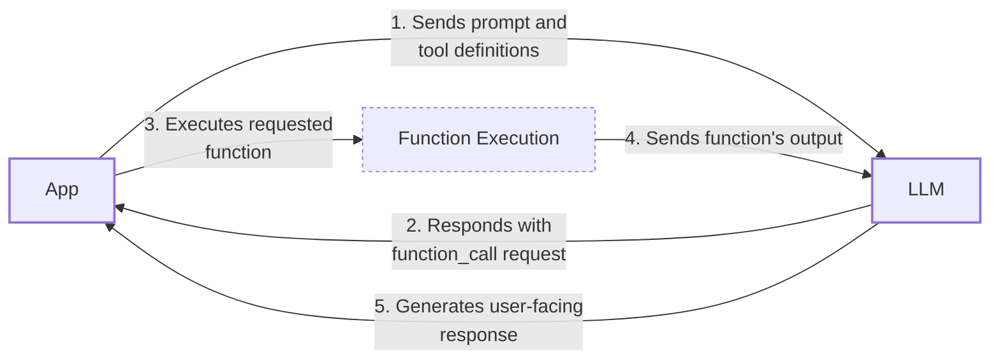
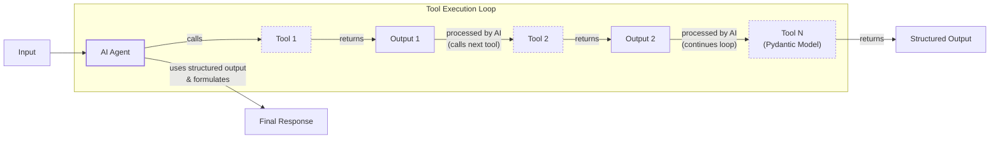
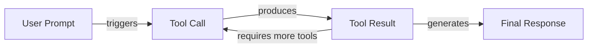

# Lesson 6: Agent Tools & Function Calling

In our previous lessons, we built a solid foundation in AI Engineering. We explored the landscape of AI agents, distinguished between rule-based LLM workflows and autonomous agents, and mastered context engineering to feed the right information to an LLM. We also learned how to get reliable, structured outputs. Now, we will give our agents the ability to act.

This lesson is about tools, also known as function calling. Tools are what transform an LLM from a passive text generator into an agent that can interact with the external world. For an AI Engineer, understanding how an agent uses tools is not just valuable—it is essential for building, debugging, and monitoring any real-world AI application. We will open this black box by implementing tool calling from scratch before moving on to production-ready techniques with modern APIs.

## Understanding Why Agents Need Tools

LLMs have a fundamental limitation: they are powerful pattern matchers and text generators, but their knowledge is confined to the data they were trained on. They cannot, by themselves, perform actions, access real-time information, or execute precise computations [[16]](https://arxiv.org/html/2507.08034v1). This is where tools come in. They act as the bridge between the LLM's internal reasoning and the external world. If the LLM is the brain, tools are its "hands and senses," allowing it to perceive and act beyond its textual interface. With tools, an LLM becomes an AI agent.

This transformation is what allows an agent to go beyond simply talking about a task to actually doing it. For example, an LLM alone cannot tell you the current weather because it has no access to real-time data. However, if it is programmed to interact with a weather API, it can formulate a request, receive the data, and present it in a natural format [[19]](https://lnu.diva-portal.org/smash/get/diva2:1801354/FULLTEXT01.pdf). This ability to interact with external systems is the essence of agentic AI.
Image 1: A high-level diagram of an AI agent's core components. (Source [https://www.newsletter.swirlai.com/p/building-ai-agents-from-scratch-part](https://www.newsletter.swirlai.com/p/building-ai-agents-from-scratch-part))

This pattern is everywhere in modern AI agents. Common examples include:
- **Accessing real-time information:** Using APIs to get today's weather, the latest news, or stock prices [[16]](https://arxiv.org/html/2507.08034v1).
- **Interacting with databases:** Querying a PostgreSQL database or a Snowflake data warehouse to retrieve user-specific data [[11]](https://neo4j.com/blog/agentic-ai/connected-context-and-persistent-memory-neo4j-providers-for-the-microsoft-agent-framework/).
- **Accessing long-term memory:** Connecting to vector or graph databases to remember information beyond the context window [[11]](https://neo4j.com/blog/agentic-ai/connected-context-and-persistent-memory-neo4j-providers-for-the-microsoft-agent-framework/), [[12]](https://www.ruh.ai/blogs/how-vector-databases-are-rewiring-the-tech-industry).
- **Executing code:** Running Python or JavaScript to perform precise calculations, manipulate data, or create visualizations [[16]](https://arxiv.org/html/2507.08034v1).

Let's see how this works in practice by building a tool-calling system from the ground up.

## Implementing Tool Calls from Scratch

The best way to understand how tools work is to build them from the ground up. We will learn how a tool is defined, how its schema is communicated to the LLM, and how the model’s response is used to execute a function. Our goal is to provide the LLM with a list of available tools and let it decide which one to use, generating the correct arguments to call the function.

The high-level process involves five steps:
1.  **You:** Send the LLM a prompt and a list of available tool definitions.
2.  **LLM:** Responds with a `function_call` request, specifying the tool name and arguments.
3.  **You:** Execute the requested function in your code.
4.  **You:** Send the function's output back to the LLM.
5.  **LLM:** Uses the tool's output to generate a final, user-facing response.

This request-execute-respond flow is the foundation of tool use in agentic systems.


Image 2: A flowchart illustrating the 5-step request-execute-respond flow of calling a tool.

Let's implement a simple example where we mock searching for a document on Google Drive and sending its summary to a Discord channel.

### Setup

First, we set up our environment by initializing the Gemini client and defining some constants. We will use `gemini-2.5-flash` for its speed and cost-effectiveness. The `DOCUMENT` constant will serve as our mock file content.

```python
import json
from typing import Any

from google import genai
from google.genai import types
from pydantic import BaseModel, Field

from lessons.utils import pretty_print

client = genai.Client()

MODEL_ID = "gemini-2.5-flash"

DOCUMENT = """
# Q3 2023 Financial Performance Analysis

The Q3 earnings report shows a 20% increase in revenue and a 15% growth in user engagement, 
beating market expectations. These impressive results reflect our successful product strategy 
and strong market positioning.

Our core business segments demonstrated remarkable resilience, with digital services leading 
the growth at 25% year-over-year. The expansion into new markets has proven particularly 
successful, contributing to 30% of the total revenue increase.

Customer acquisition costs decreased by 10% while retention rates improved to 92%, 
marking our best performance to date. These metrics, combined with our healthy cash flow 
position, provide a strong foundation for continued growth into Q4 and beyond.
"""
```

### Define Mock Tools

Next, we define three mock functions. The function signature and docstrings are critical, as the LLM uses them to understand what each tool does. To keep the code simple and focus on the tool implementation, all functions are mocked.

```python
def search_google_drive(query: str) -> dict:
    """
    Searches for a file on Google Drive and returns its content or a summary.

    Args:
        query (str): The search query to find the file, e.g., 'Q3 earnings report'.

    Returns:
        dict: A dictionary representing the search results, including file names and summaries.
    """
    return {
        "files": [
            {
                "name": "Q3_Earnings_Report_2024.pdf",
                "id": "file12345",
                "content": DOCUMENT,
            }
        ]
    }
```
```python
def send_discord_message(channel_id: str, message: str) -> dict:
    """
    Sends a message to a specific Discord channel.

    Args:
        channel_id (str): The ID of the channel to send the message to, e.g., '#finance'.
        message (str): The content of the message to send.

    Returns:
        dict: A dictionary confirming the action, e.g., {"status": "success"}.
    """
    return {
        "status": "success",
        "status_code": 200,
        "channel": channel_id,
        "message_preview": f"{message[:50]}...",
    }
```
```python
def summarize_financial_report(text: str) -> str:
    """
    Summarizes a financial report.

    Args:
        text (str): The text to summarize.

    Returns:
        str: The summary of the text.
    """
    return "The Q3 2023 earnings report shows strong performance across all metrics with 20% revenue growth, 15% user engagement increase, 25% digital services growth, and improved retention rates of 92%."
```

### Define Tool Schemas

For each function, we define a schema in JSON format. This schema tells the LLM the tool's `name`, `description`, and `parameters` (including name, type, and whether it is required). This is the industry standard for modern LLM providers like OpenAI and Gemini [[90]](https://www.decodingai.com/p/tool-calling-from-scratch-to-production), [[93]](https://myengineeringpath.dev/tools/gemini-guide/).

```python
search_google_drive_schema = {
    "name": "search_google_drive",
    "description": "Searches for a file on Google Drive and returns its content or a summary.",
    "parameters": {
        "type": "object",
        "properties": {
            "query": {
                "type": "string",
                "description": "The search query to find the file, e.g., 'Q3 earnings report'.",
            }
        },
        "required": ["query"],
    },
}
```
```python
send_discord_message_schema = {
    "name": "send_discord_message",
    "description": "Sends a message to a specific Discord channel.",
    "parameters": {
        "type": "object",
        "properties": {
            "channel_id": {
                "type": "string",
                "description": "The ID of the channel to send the message to, e.g., '#finance'.",
            },
            "message": {
                "type": "string",
                "description": "The content of the message to send.",
            },
        },
        "required": ["channel_id", "message"],
    },
}
```
```python
summarize_financial_report_schema = {
    "name": "summarize_financial_report",
    "description": "Summarizes a financial report.",
    "parameters": {
        "type": "object",
        "properties": {
            "text": {
                "type": "string",
                "description": "The text to summarize.",
            },
        },
        "required": ["text"],
    },
}
```

### Create a Tool Registry

We then aggregate these tools into a registry for easy access during execution. This involves creating mappings from tool names to their handler functions and collecting all schemas.

```python
TOOLS = {
    "search_google_drive": {
        "handler": search_google_drive,
        "declaration": search_google_drive_schema,
    },
    "send_discord_message": {
        "handler": send_discord_message,
        "declaration": send_discord_message_schema,
    },
    "summarize_financial_report": {
        "handler": summarize_financial_report,
        "declaration": summarize_financial_report_schema,
    },
}
TOOLS_BY_NAME = {tool_name: tool["handler"] for tool_name, tool in TOOLS.items()}
TOOLS_SCHEMA = [tool["declaration"] for tool in TOOLS.values()]
```

### Inspect the Tool Registry

The `TOOLS_BY_NAME` mapping provides a quick way to look up a function by its name.

```python
for tool_name, tool in TOOLS_BY_NAME.items():
    print(f"Tool name: {tool_name}")
    print(f"Tool handler: {tool}")
    print("-" * 75)
```
It outputs:
```text
Tool name: search_google_drive
Tool handler: <function search_google_drive at 0x104c7df80>
---------------------------------------------------------------------------
Tool name: send_discord_message
Tool handler: <function send_discord_message at 0x104c7de40>
---------------------------------------------------------------------------
Tool name: summarize_financial_report
Tool handler: <function summarize_financial_report at 0x1274f5c60>
---------------------------------------------------------------------------
```

### Inspect a Tool Schema

Here is the schema for `search_google_drive`, which we will pass to the LLM.

```python
pretty_print.wrapped(json.dumps(TOOLS_SCHEMA[0], indent=2), title="`search_google_drive` Tool Schema")
```
It outputs:
```text
-------------------------------- `search_google_drive` Tool Schema --------------------------------
 {
 "name": "search_google_drive",
 "description": "Searches for a file on Google Drive and returns its content or a summary.",
 "parameters": {
   "type": "object",
   "properties": {
     "query": {
       "type": "string",
       "description": "The search query to find the file, e.g., 'Q3 earnings report'."
     }
   },
   "required": [
     "query"
   ]
 }
}
----------------------------------------------------------------------------------------------------
```

### Define the System Prompt

Now, we create a system prompt to instruct the LLM on how to use these tools. This prompt includes usage guidelines, the required output format, and the list of available tools wrapped in XML tags.

```python
TOOL_CALLING_SYSTEM_PROMPT = """
You are a helpful AI assistant with access to tools that enable you to take actions and retrieve information to better 
assist users.

## Tool Usage Guidelines

**When to use tools:**
- When you need information that is not in your training data
- When you need to perform actions in external systems and environments
- When you need real-time, dynamic, or user-specific data
- When computational operations are required

**Tool selection:**
- Choose the most appropriate tool based on the user's specific request
- If multiple tools could work, select the one that most directly addresses the need
- Consider the order of operations for multi-step tasks

**Parameter requirements:**
- Provide all required parameters with accurate values
- Use the parameter descriptions to understand expected formats and constraints
- Ensure data types match the tool's requirements (strings, numbers, booleans, arrays)

## Tool Call Format

When you need to use a tool, output ONLY the tool call in this exact format:

```tool_call
{{"name": "tool_name", "args": {{"param1": "value1", "param2": "value2"}}}}
```

**Critical formatting rules:**
- Use double quotes for all JSON strings
- Ensure the JSON is valid and properly escaped
- Include ALL required parameters
- Use correct data types as specified in the tool definition
- Do not include any additional text or explanation in the tool call

## Response Behavior

- If no tools are needed, respond directly to the user with helpful information
- If tools are needed, make the tool call first, then provide context about what you're doing
- After receiving tool results, provide a clear, user-friendly explanation of the outcome
- If a tool call fails, explain the issue and suggest alternatives when possible

## Available Tools

<tool_definitions>
{tools}
</tool_definitions>

Remember: Your goal is to be maximally helpful to the user. Use tools when they add value, but don't use them unnecessarily. Always prioritize accuracy and user experience.
"""
```

### How Tool Calling Works in Practice

In practice, the LLM *decides* which tool to call based on the `description` field in the schema. This selection relies on the semantic alignment between the user's query and the tool descriptions. The model essentially performs a nearest-neighbor search in an embedding space, matching the user's intent to the semantic meaning of available tools [[87]](https://mbrenndoerfer.com/writing/function-calling-llm-structured-tools). This is why clear and distinct tool descriptions are essential for building reliable agents [[32]](https://www.anthropic.com/research/building-effective-agents). If you have two tools with vague descriptions like "search documents" and "search files," the model will get confused. Explicit descriptions like "search documents on Google Drive" and "search files on the local disk" prevent this ambiguity.

Another disambiguation method is to be explicit in the user prompt itself. Instead of a generic request like "search documents," a more specific prompt like "search documents on Google Drive" guides the model toward the correct tool [[88]](https://medium.com/@abhaychougule0907/underlying-factors-behind-inconsistency-in-llm-responses-with-multi-tool-calling-628ce7b4de76). Everything about the tools, from their descriptions to the user's query, acts as a prompt that influences the model's decision [[85]](https://pub.towardsai.net/tool-descriptions-are-critical-making-better-llm-tools-research-capability-b315851471e7). This becomes critical when scaling to dozens or even hundreds of tools per agent.

The quality of descriptions becomes a major factor in production reliability. A common failure mode occurs when tool descriptions are written like technical API documentation (e.g., "GET /users/{id}") rather than as instructions for the model. The agent may appear to call the API correctly, but it fails on subtle, long-tail inputs because the description lacks the right semantic cues [[96]](https://tianpan.co/blog/2026-04-28-tool-schemas-are-prompts-not-api-contracts). The impact is measurable; in enterprise settings, ambiguous descriptions can cause tool selection accuracy to drop by several percentage points, for example from a 92% baseline to 87% after a model change [[95]](https://aws.amazon.com/blogs/machine-learning/ai-agents-in-enterprises-best-practices-with-amazon-bedrock-agentcore/).

Once a tool is selected, the model *generates* the function name and arguments as a structured output, like the JSON we specified. This capability is not magic; LLMs are specifically instruction-tuned to interpret tool schemas and produce valid tool calls [[87]](https://mbrenndoerfer.com/writing/function-calling-llm-structured-tools). At scale, this can be augmented with more advanced techniques like tool routers, which use a simpler model or rule-based system to pre-select a relevant subset of tools before invoking the main LLM [[97]](https://apxml.com/courses/agentic-llm-memory-architectures/chapter-4-complex-planning-tool-integration/tool-description-selection).

### Test the System Prompt

Let's test our prompt with a simple user query. We send the user prompt along with our system prompt to the model.

```python
USER_PROMPT = """
Can you help me find the latest quarterly report and share key insights with the team?
"""

messages = [TOOL_CALLING_SYSTEM_PROMPT.format(tools=str(TOOLS_SCHEMA)), USER_PROMPT]

response = client.models.generate_content(
    model=MODEL_ID,
    contents=messages,
)
```

### Inspect the LLM Response

The LLM correctly identifies the `search_google_drive` tool and generates the required arguments in the specified format.

```python
pretty_print.wrapped(response.text, title="LLM Tool Call Response")
```
It outputs:
```text
-------------------------------------- LLM Tool Call Response --------------------------------------
 ```tool_call
{"name": "search_google_drive", "args": {"query": "latest quarterly report"}}
```
----------------------------------------------------------------------------------------------------
```

### Test with a Multi-Step Query

Let's try a more complex query that requires multiple steps.

```python
USER_PROMPT = """
Please find the Q3 earnings report on Google Drive and send a summary of it to 
the #finance channel on Discord.
"""

messages = [TOOL_CALLING_SYSTEM_PROMPT.format(tools=str(TOOLS_SCHEMA)), USER_PROMPT]

response = client.models.generate_content(
    model=MODEL_ID,
    contents=messages,
)
```

### Inspect the Multi-Step Response

The model correctly identifies the first step: searching for the report.

```python
pretty_print.wrapped(response.text, title="LLM Tool Call Response")
```
It outputs:
```text
-------------------------------------- LLM Tool Call Response --------------------------------------
 ```tool_call
{"name": "search_google_drive", "args": {"query": "Q3 earnings report"}}
```
----------------------------------------------------------------------------------------------------
```

### Extract the Tool Call

Now, we need to parse this response and execute the function. We start by extracting the JSON string from the response.

```python
def extract_tool_call(response_text: str) -> str:
    """
    Extracts the tool call from the response text.
    """
    return response_text.split("```tool_call")[1].split("```")[0].strip()


tool_call_str = extract_tool_call(response.text)
```
This gives us:
```text
'{"name": "search_google_drive", "args": {"query": "Q3 earnings report"}}'
```

### Parse the Tool Call

We parse the string into a Python dictionary.

```python
tool_call = json.loads(tool_call_str)
```
This results in:
```text
{'name': 'search_google_drive', 'args': {'query': 'Q3 earnings report'}}
```

### Get the Tool Handler

Next, we retrieve the corresponding function handler from our `TOOLS_BY_NAME` registry.

```python
tool_handler = TOOLS_BY_NAME[tool_call["name"]]
```

### Inspect the Tool Handler

The handler is a direct reference to our Python function.

```python
tool_handler
```
It outputs:
```text
<function __main__.search_google_drive(query: str) -> dict>
```

### Execute the Tool

Finally, we execute the function with the arguments provided by the LLM.

```python
tool_result = tool_handler(**tool_call["args"])
```

### Inspect the Tool Result

The tool returns the mocked document content.

```python
pretty_print.wrapped(tool_result, indent=2, title="LLM Tool Call Response")
```
It outputs:
```text
-------------------------------------- LLM Tool Call Response --------------------------------------
 {
 "files": [
   {
     "name": "Q3_Earnings_Report_2024.pdf",
     "id": "file12345",
     "content": "\n# Q3 2023 Financial Performance Analysis\n\nThe Q3 earnings report shows a 20% increase in revenue and a 15% growth in user engagement, \nbeating market expectations. These impressive results reflect our successful product strategy \nand strong market positioning.\n\nOur core business segments demonstrated remarkable resilience, with digital services leading \nthe growth at 25% year-over-year. The expansion into new markets has proven particularly \nsuccessful, contributing to 30% of the total revenue increase.\n\nCustomer acquisition costs decreased by 10% while retention rates improved to 92%, \nmarking our best performance to date. These metrics, combined with our healthy cash flow \nposition, provide a strong foundation for continued growth into Q4 and beyond.\n"
   }
 ]
}
----------------------------------------------------------------------------------------------------
```

### Create a Helper Function

We can wrap this logic into a single `call_tool` function for convenience.

```python
def call_tool(response_text: str, tools_by_name: dict) -> Any:
    """
    Call a tool based on the response from the LLM.
    """

    tool_call_str = extract_tool_call(response_text)
    tool_call = json.loads(tool_call_str)
    tool_name = tool_call["name"]
    tool_args = tool_call["args"]
    tool = tools_by_name[tool_name]

    return tool(**tool_args)
```

### Use the Helper Function

Using the helper function simplifies the process. The output is identical to the manual execution.

```python
pretty_print.wrapped(
    json.dumps(call_tool(response.text, tools_by_name=TOOLS_BY_NAME), indent=2), title="LLM Tool Call Response"
)
```
It outputs:
```text
-------------------------------------- LLM Tool Call Response --------------------------------------
 {
 "files": [
   {
     "name": "Q3_Earnings_Report_2024.pdf",
     "id": "file12345",
     "content": "\n# Q3 2023 Financial Performance Analysis\n\nThe Q3 earnings report shows a 20% increase in revenue and a 15% growth in user engagement, \nbeating market expectations. These impressive results reflect our successful product strategy \nand strong market positioning.\n\nOur core business segments demonstrated remarkable resilience, with digital services leading \nthe growth at 25% year-over-year. The expansion into new markets has proven particularly \nsuccessful, contributing to 30% of the total revenue increase.\n\nCustomer acquisition costs decreased by 10% while retention rates improved to 92%, \nmarking our best performance to date. These metrics, combined with our healthy cash flow \nposition, provide a strong foundation for continued growth into Q4 and beyond.\n"
   }
 ]
}
----------------------------------------------------------------------------------------------------
```

### Let the LLM Interpret the Result

The final step is to send the tool's result back to the LLM, which can then use it to formulate a final response or decide on the next action.

```python
response = client.models.generate_content(
    model=MODEL_ID,
    contents=f"Interpret the tool result: {json.dumps(tool_result, indent=2)}",
)
```

### Inspect the Final Response

The LLM provides a user-friendly summary based on the tool's output.

```python
pretty_print.wrapped(response.text, title="LLM Tool Call Response")
```
It outputs:
```text
-------------------------------------- LLM Tool Call Response --------------------------------------
 The tool result provides the content of a file named `Q3_Earnings_Report_2024.pdf`.

This document is a **Q3 2023 Financial Performance Analysis** and details exceptionally strong results, significantly beating market expectations.

**Key highlights from the report include:**

*   **Revenue Growth:** A 20% increase in revenue.
*   **User Engagement:** 15% growth in user engagement.
*   **Core Business Performance:** Digital services led growth at 25% year-over-year.
*   **Market Expansion Success:** New markets contributed 30% of the total revenue increase.
*   **Efficiency & Retention:**
    *   Customer acquisition costs decreased by 10%.
    *   Retention rates improved to 92%, marking the best performance to date.
*   **Financial Health:** The company maintains a healthy cash flow position.

The report attributes these impressive results to a successful product strategy and strong market positioning, indicating a robust foundation for continued growth into Q4 and beyond.
----------------------------------------------------------------------------------------------------
```
This is the basic concept behind tool calling. We have successfully implemented it from scratch. However, this manual approach is not very scalable. Let's see how we can improve it.

## Implementing a Tool Calling Framework from Scratch

Manually defining a JSON schema for every function is tedious and error-prone. Production frameworks like LangGraph and standardized communication protocols automate this by using a `@tool` decorator. This decorator inspects a function's signature and docstring to generate the schema automatically.

This approach respects the Don't Repeat Yourself (DRY) principle by creating a single source of truth for both the function's implementation and its schema [[26]](https://openai.github.io/openai-agents-python/tools/), [[28]](https://pydantic.dev/docs/ai/tools-toolsets/tools/). As agents scale to use dozens of tools, this automation becomes essential, but it also introduces new challenges. A key failure mode at scale is token bloat, where the combined size of tool schemas and prompts can consume a large portion of the context window before any useful work is done [[98]](https://www.decodingai.com/p/scaling-120-ai-agents-two-tier-orchestration).

This has pushed the industry toward standardization. Emerging protocols for agent-to-agent and agent-to-tool communication aim to create interoperable ways for agents and tools to communicate, reducing the need for custom, monolithic prompt engineering [[99]](https://arxiv.org/html/2601.13671v1). Let's build our own simple framework to understand the core idea.

Before we dive into the code, it is important to understand how Python decorators work. A decorator is a function that takes another function as an argument, adds some functionality to it, and returns the modified function without altering the original function's code. They are a powerful feature for extending behavior, such as adding logging, timing, or, in our case, attaching a schema to a function. The `@` syntax is just a more readable way of applying a decorator to a function.

### Define the ToolFunction Class

First, we define a `ToolFunction` class to wrap our decorated functions and store their schemas. This class will hold both the callable function and its generated schema.

```python
from inspect import Parameter, signature
from typing import Any, Callable, Dict, Optional


class ToolFunction:
    def __init__(self, func: Callable, schema: Dict[str, Any]) -> None:
        self.func = func
        self.schema = schema
        self.__name__ = func.__name__
        self.__doc__ = func.__doc__

    def __call__(self, *args: Any, **kwargs: Any) -> Any:
        return self.func(*args, **kwargs)
```

### Define the @tool Decorator

Next, we create the `@tool` decorator. It inspects the function's signature to build the parameters schema and uses the docstring for the description, automating the schema generation process.

```python
def tool(description: Optional[str] = None) -> Callable[[Callable], ToolFunction]:
    """
    A decorator that creates a tool schema from a function.

    Args:
        description: Optional override for the function's docstring

    Returns:
        A decorator function that wraps the original function and adds a schema
    """

    def decorator(func: Callable) -> ToolFunction:
        sig = signature(func)
        properties = {}
        required = []

        for param_name, param in sig.parameters.items():
            if param_name == "self":
                continue

            param_schema = {
                "type": "string",
                "description": f"The {param_name} parameter",
            }

            if param.default == Parameter.empty:
                required.append(param_name)

            properties[param_name] = param_schema

        schema = {
            "name": func.__name__,
            "description": description or func.__doc__ or f"Executes the {func.__name__} function.",
            "parameters": {
                "type": "object",
                "properties": properties,
                "required": required,
            },
        }

        return ToolFunction(func, schema)

    return decorator
```

### Decorate the Tools

Now, we can redefine our tools using the decorator. The code is much cleaner and more maintainable.

```python
@tool()
def search_google_drive_example(query: str) -> dict:
    """Search for files in Google Drive."""
    return {"files": ["Q3 earnings report"]}


@tool()
def send_discord_message_example(channel_id: str, message: str) -> dict:
    """Send a message to a Discord channel."""
    return {"message": "Message sent successfully"}


@tool()
def summarize_financial_report_example(text: str) -> str:
    """Summarize the contents of a financial report."""
    return "Financial report summarized successfully"
```

### Create the Tool Registry

We collect the decorated functions into a list, which will serve as our tool registry.

```python
tools = [
    search_google_drive_example,
    send_discord_message_example,
    summarize_financial_report_example,
]
```

### Inspect the Decorated Tool

The decorated function is now a `ToolFunction` object. It contains the original function handler and the auto-generated schema, which is identical to the one we created manually.

```python
type(search_google_drive_example)
```
It outputs:
```text
__main__.ToolFunction
```
The schema is accessible via `.schema`:
```text
{
    "name": "search_google_drive_example",
    "description": "Search for files in Google Drive.",
    "parameters": {
        "type": "object",
        "properties": {
            "query": {
                "type": "string",
                "description": "The query parameter"
            }
        },
        "required": [
            "query"
        ]
    }
}
```
And the function handler via `.func`:
```text
<function __main__.search_google_drive_example(query: str) -> dict>
```

### Prepare Mappings for Execution

We create our `tools_by_name` and `tools_schema` mappings from the list of decorated tools, just as before.

```python
tools_by_name = {tool.schema["name"]: tool.func for tool in tools}
tools_schema = [tool.schema for tool in tools]
```

### Call the LLM

We call the LLM with the new `tools_schema` variable and the same user prompt.

```python
USER_PROMPT = """
Please find the Q3 earnings report on Google Drive and send a summary of it to 
the #finance channel on Discord.
"""

messages = [TOOL_CALLING_SYSTEM_PROMPT.format(tools=str(tools_schema)), USER_PROMPT]

response = client.models.generate_content(
    model=MODEL_ID,
    contents=messages,
)
```

### Inspect the LLM Response

The LLM responds with the correct tool call, demonstrating that our automated schema generation works.

```python
pretty_print.wrapped(response.text, title="LLM Tool Call Response")
```
It outputs:
```text
-------------------------------------- LLM Tool Call Response --------------------------------------
 ```tool_call
{"name": "search_google_drive_example", "args": {"query": "Q3 earnings report"}}
```
----------------------------------------------------------------------------------------------------
```

### Execute the Tool Call

Executing the tool call using our `call_tool` helper function works exactly as before.

```python
pretty_print.wrapped(
    json.dumps(call_tool(response.text, tools_by_name=tools_by_name), indent=2), title="LLM Tool Call Response"
)
```
It outputs:
```text
-------------------------------------- LLM Tool Call Response --------------------------------------
 {
 "files": [
   "Q3 earnings report"
 ]
}
----------------------------------------------------------------------------------------------------
```
Voilà! We have our little tool-calling framework. This implementation is conceptually similar to what happens under the hood in libraries like LangChain.

## Implementing Production-Level Tool Calls with Gemini

While building from scratch is a great learning exercise, in production, we use the native tool-calling capabilities of APIs like Gemini or OpenAI. This approach is more robust, efficient, and requires less code, as the provider optimizes the process for their specific models [[90]](https://www.decodingai.com/p/tool-calling-from-scratch-to-production). For instance, real-world tracking shows Gemini can achieve 98.5% schema compliance out of the box, whereas other models often return malformed JSON that requires extensive custom parsing logic to handle reliably [[100]](https://lablab.ai/ai-tutorials/building-voice-agents-gemini-live-fastapi).

Using a native SDK abstracts away the complexity of prompt engineering for tool use. Instead of manually constructing a system prompt with tool schemas, you pass the tool definitions directly to the API configuration. The provider then handles the underlying logic to ensure the model correctly interprets and uses the tools. This not only simplifies your code but also improves performance, as the provider can apply model-specific optimizations that are not accessible through manual prompting.

Let's see how to achieve the same result using Gemini's native API.

### Configure Gemini with Tool Schemas

Instead of a lengthy system prompt, we define a `GenerateContentConfig` object and pass our tool schemas to it. We can also set the `mode` to `"ANY"` to force the model to call a tool.

```python
tools = [
    types.Tool(
        function_declarations=[
            types.FunctionDeclaration(**search_google_drive_schema),
            types.FunctionDeclaration(**send_discord_message_schema),
        ]
    )
]
config = types.GenerateContentConfig(
    tools=tools,
    tool_config=types.ToolConfig(function_calling_config=types.FunctionCallingConfig(mode="ANY")),
)
```

### Call the Model with Native Configuration

Now, we can call the model with just the user prompt. The configuration handles the tool instructions, making the process cleaner and more robust.

```python
response = client.models.generate_content(
    model=MODEL_ID,
    contents=USER_PROMPT,
    config=config,
)
```

### Inspect the Native Tool Call Response

The model returns a `FunctionCall` object directly, which is much easier to work with than parsing a raw string.

```python
response.candidates[0].content.parts[0].function_call
```
It outputs:
```text
FunctionCall(id=None, args={'query': 'Q3 earnings report'}, name='search_google_drive')
```

### Simplify Further with Direct Function Passing

To simplify even further, the `google-genai` SDK can automatically generate the schema from a Python function's signature, type hints, and docstring. We can pass our functions directly to the `GenerateContentConfig` object.

```python
config = types.GenerateContentConfig(
    tools=[search_google_drive, send_discord_message],
    tool_config=types.ToolConfig(function_calling_config=types.FunctionCallingConfig(mode="ANY")),
)
```

### Call the Model Again

We call the model again with the simplified configuration.

```python
response = client.models.generate_content(
    model=MODEL_ID,
    contents=USER_PROMPT,
    config=config,
)
```

### Inspect the FunctionCall Object

The `function_call` object contains the name and arguments, ready for execution.

```python
function_call = response.candidates[0].content.parts[0]
function_call.function_call
```
It outputs:
```text
FunctionCall(id=None, args={'query': 'Q3 earnings report'}, name='search_google_drive')
```

### Inspect the Arguments

The arguments are already parsed into a dictionary-like object.

```python
function_call.function_call.args
```
It outputs:
```text
{'query': 'Q3 earnings report'}
```

### Access the Tool Handler

We can access the tool handler from our `TOOLS_BY_NAME` registry as before.

```python
tool_handler = TOOLS_BY_NAME[function_call.function_call.name]
```

### Execute the Tool Manually

We can call the handler with the parsed arguments.

```python
tool_handler(**function_call.function_call.args)
```
It outputs:
```text
{'files': [{'name': 'Q3_Earnings_Report_2024.pdf', 'id': 'file12345', 'content': '\n# Q3 2023 Financial Performance Analysis\n\nThe Q3 earnings report shows a 20% increase in revenue and a 15% growth in user engagement...'}, ...]}
```

### Create a Simplified Helper Function

We can create a simplified `call_tool` function to execute the `FunctionCall` object directly.

```python
def call_tool(function_call) -> Any:
    tool_name = function_call.name
    tool_args = {key: value for key, value in function_call.args.items()}
    tool_handler = TOOLS_BY_NAME[tool_name]
    return tool_handler(**tool_args)
```

### Use the Simplified Helper

Calling the tool is now a one-liner.

```python
tool_result = call_tool(response.candidates[0].content.parts[0].function_call)
```

### Inspect the Final Result

The output is the same as our manual implementation. By using the native SDK, we reduced dozens of lines of code to just a few, creating a more robust and maintainable system.

```python
pretty_print.wrapped(tool_result, indent=2, title="Tool Result")
```
It outputs:
```text
------------------------------------------- Tool Result -------------------------------------------
 {
 "files": [
   {
     "name": "Q3_Earnings_Report_2024.pdf",
     "id": "file12345",
     "content": "\n# Q3 2023 Financial Performance Analysis\n\nThe Q3 earnings report shows a 20% increase in revenue and a 15% growth in user engagement, \nbeating market expectations..."
   }
 ]
}
----------------------------------------------------------------------------------------------------
```
Other popular APIs from OpenAI and Anthropic follow a similar logic, making these concepts easily transferable [[91]](https://apxml.com/courses/prompt-engineering-llm-application-development/chapter-4-interacting-with-llm-apis/overview-common-llm-apis), [[93]](https://myengineeringpath.dev/tools/gemini-guide/). This native support also enables powerful patterns, such as using structured data models directly as tools.

## Using Pydantic Models as Tools for On-Demand Structured Outputs

Connecting this lesson with what we learned in Lesson 4, a powerful and common pattern is to use a Pydantic model as a tool. This allows an agent to dynamically decide when to generate a structured output during a multi-step task. For example, an agent might perform several intermediate steps using unstructured text, which is easy for an LLM to interpret, and then call a Pydantic-based tool to format the final answer into a clean, validated structure for downstream processing. This pattern is especially useful when the final output of an agentic workflow needs to be consumed by another system that expects a specific schema.

This pattern introduces a latency trade-off: each tool call that structures output requires an additional LLM invocation, which adds to the total response time. However, this can improve accuracy by allowing the agent to process each tool's result individually, keeping it focused on one task at a time [[101]](https://xebia.com/blog/how-to-get-the-most-out-of-your-agents-part-i/). The validation overhead from Pydantic itself is minimal and rarely a bottleneck in production due to its efficient implementation [[23]](https://tetrate.io/learn/ai/llm-output-parsing-structured-generation).


Image 3: A flowchart illustrating an AI agent calling multiple tools in a loop, where the final tool call is for structured outputs using a Pydantic model.

Let's see how to implement this.

### Define the Pydantic Model

First, we define our `DocumentMetadata` Pydantic model, just as we did in Lesson 4. This class will serve as the schema for our structured output.

```python
class DocumentMetadata(BaseModel):
    """A class to hold structured metadata for a document."""

    summary: str = Field(description="A concise, 1-2 sentence summary of the document.")
    tags: list[str] = Field(description="A list of 3-5 high-level tags relevant to the document.")
    keywords: list[str] = Field(description="A list of specific keywords or concepts mentioned.")
    quarter: str = Field(description="The quarter of the financial year described in the document (e.g., Q3 2023).")
    growth_rate: str = Field(description="The growth rate of the company described in the document (e.g., 10%).")
```

### Define the Extraction Tool

We then create a tool declaration, using the Pydantic model's JSON schema as the definition for the tool's parameters. This tells the model how to structure its output.

```python
extraction_tool = types.Tool(
    function_declarations=[
        types.FunctionDeclaration(
            name="extract_metadata",
            description="Extracts structured metadata from a financial document.",
            parameters=DocumentMetadata.model_json_schema(),
        )
    ]
)
```

### Configure the Model

We create a configuration object that includes our new extraction tool and forces the model to use a tool.

```python
config = types.GenerateContentConfig(
    tools=[extraction_tool],
    tool_config=types.ToolConfig(function_calling_config=types.FunctionCallingConfig(mode="ANY")),
)
```

### Prompt and Call the Model

We prompt the model to analyze the document and extract the metadata, passing our configuration.

```python
prompt = f"""
Please analyze the following document and extract its metadata.

Document:
--- 
{DOCUMENT}
--- 
"""

response = client.models.generate_content(model=MODEL_ID, contents=prompt, config=config)
```

### Inspect the Function Call

The model responds with a call to our `extract_metadata` tool, with the arguments structured according to our Pydantic model.

```python
response_message_part = response.candidates[0].content.parts[0]

if hasattr(response_message_part, "function_call"):
    function_call = response_message_part.function_call
    pretty_print.function_call(function_call, title="Function Call")
```
It outputs:
```text
------------------------------------------ Function Call ------------------------------------------
 Function Name: `extract_metadata
 Function Arguments: `{
    "growth_rate": "20%",
    "summary": "The Q3 2023 earnings report shows a 20% increase in revenue and 15% growth in user engagement, driven by successful product strategy and market expansion. This performance provides a strong foundation for continued growth.",
    "quarter": "Q3 2023",
    "keywords": [
      "Revenue",
      "User Engagement",
      "Market Expansion",
      "Customer Acquisition",
      "Retention Rates",
      "Digital Services",
      "Cash Flow"
    ],
    "tags": [
      "Financials",
      "Earnings",
      "Growth",
      "Business Strategy",
      "Market Analysis"
    ]
  }`
----------------------------------------------------------------------------------------------------
```

### Validate and Parse the Output

Finally, we can validate the arguments and parse them directly into a `DocumentMetadata` object, ensuring the data is correct and type-safe.

```python
    try:
        document_metadata = DocumentMetadata(**function_call.args)
        pretty_print.wrapped(document_metadata.model_dump_json(indent=2), title="Pydantic Validated Object")
    except Exception as e:
        pretty_print.wrapped(f"Validation failed: {e}", title="Validation Error")
else:
    pretty_print.wrapped("The model did not call the extraction tool.", title="No Function Call")
```
It outputs:
```text
------------------------------------ Pydantic Validated Object ------------------------------------
 {
 "summary": "The Q3 2023 earnings report shows a 20% increase in revenue and 15% growth in user engagement, driven by successful product strategy and market expansion. This performance provides a strong foundation for continued growth.",
 "tags": [
   "Financials",
   "Earnings",
   "Growth",
   "Business Strategy",
   "Market Analysis"
 ],
 "keywords": [
   "Revenue",
   "User Engagement",
   "Market Expansion",
   "Customer Acquisition",
   "Retention Rates",
   "Digital Services",
   "Cash Flow"
 ],
 "quarter": "Q3 2023",
 "growth_rate": "20%"
}
----------------------------------------------------------------------------------------------------
```
This pattern is frequently used in AI agents that need to return structured data after completing a series of actions.

## The Downsides of Running Tools in a Loop

So far, we have focused on single-turn tool calls. For an agent to handle complex tasks, it needs to chain multiple tools together, using the output of one tool to inform the input of the next. This is the final piece of the puzzle for building a true AI agent.


Image 4: A flowchart illustrating a sequential tool calling loop.

This looping mechanism gives the agent flexibility and adaptability, allowing it to break down complex problems into a series of manageable steps. However, a simple sequential loop has significant limitations.

### Configure for Multi-Tool Use

Let's implement a loop where the agent finds a report, summarizes it, and sends the summary to Discord. First, we configure the model with all three tools.

```python
tools = [
    types.Tool(
        function_declarations=[
            types.FunctionDeclaration(**search_google_drive_schema),
            types.FunctionDeclaration(**send_discord_message_schema),
            types.FunctionDeclaration(**summarize_financial_report_schema),
        ]
    )
]
config = types.GenerateContentConfig(
    tools=tools,
    tool_config=types.ToolConfig(function_calling_config=types.FunctionCallingConfig(mode="ANY")),
)
```

### Define the User Intent

The user prompt specifies a multi-step task.

```python
USER_PROMPT = """
Please find the Q3 earnings report on Google Drive and send a summary of it to 
the #finance channel on Discord.
"""
```

### Implement the First LLM Call

We start the conversation by sending the initial prompt to the model.

```python
messages = [USER_PROMPT]

pretty_print.wrapped(USER_PROMPT, title="User Prompt")
response = client.models.generate_content(
    model=MODEL_ID,
    contents=messages,
    config=config,
)
```
It outputs:
```text
------------------------------------------- User Prompt -------------------------------------------
 Please find the Q3 earnings report on Google Drive and send a summary of it to 
the #finance channel on Discord.
----------------------------------------------------------------------------------------------------
```

### Inspect the First Tool Call

The model correctly identifies the first action: searching for the report.

```python
response_message_part = response.candidates[0].content.parts[0]
pretty_print.function_call(response_message_part.function_call, title="Function Call")

messages.append(response.candidates[0].content)
```
It outputs:
```text
------------------------------------------ Function Call ------------------------------------------
 Function Name: `search_google_drive
 Function Arguments: `{
    "query": "Q3 earnings report"
  }`
----------------------------------------------------------------------------------------------------
```

### Implement the Tool-Calling Loop

Now, we loop, executing tool calls and feeding the results back to the model until it generates a final response or we hit our iteration limit.

```python
max_iterations = 3
while hasattr(response_message_part, "function_call") and max_iterations > 0:
    tool_result = call_tool(response_message_part.function_call)
    pretty_print.wrapped(tool_result, title="Tool Result", indent=2)

    function_response_part = types.Part.from_function_response(
        name=response_message_part.function_call.name,
        response={"result": tool_result},
    )
    messages.append(function_response_part)

    response = client.models.generate_content(
        model=MODEL_ID,
        contents=messages,
        config=config,
    )

    response_message_part = response.candidates[0].content.parts[0]
    pretty_print.function_call(response_message_part.function_call, only_name=True, title="Function Call")

    messages.append(response.candidates[0].content)

    max_iterations -= 1

pretty_print.wrapped(response.candidates[0].content, title="Final Agent Response")
```
The agent successfully executes the sequence: `search_google_drive`, then `summarize_financial_report`, and finally `send_discord_message`.

This simple loop works, but it is naive. It does not allow the LLM to interpret the output of each tool before deciding on the next action. The agent immediately moves to the next function call without pausing to think about what it has learned or whether it should change its strategy. This can lead to inefficient tool usage or getting stuck in loops [[9]](https://myengineeringpath.dev/genai-engineer/agentic-patterns/). For instance, if the `search_google_drive` tool failed, a smarter agent would stop and report the error, rather than trying to summarize a non-existent document.

In production, this naive approach leads to **cascading failures**, where an error from one tool is silently passed to the next, compounding the problem at each step [[102]](https://futureagi.substack.com/p/how-tool-chaining-fails-in-production). Common failure modes include **silent data corruption**, where a tool returns a malformed result that the next tool misinterprets, and **schema drift**, where an API update changes a tool's output schema, breaking the chain [[103]](https://medium.com/data-science-collective/why-ai-agents-keep-failing-in-production-cdd335b22219). Another issue is **context loss**, where critical information from the initial prompt gets pushed out of the context window by intermediate tool calls, causing the agent to "forget" key constraints [[102]](https://futureagi.substack.com/p/how-tool-chaining-fails-in-production). Without a mechanism to handle these failures, the agent's reliability plummets.

To optimize, when tools are independent, we can run them in parallel to reduce latency. For example, fetching financial news and stock prices can happen simultaneously. However, the core limitation of this sequential pattern is its lack of intermediate reasoning. This limitation pushed the industry to develop more sophisticated patterns like **ReAct** (Reasoning and Acting), which explicitly interleaves reasoning steps with tool calls. We will explore ReAct in detail in Lessons 7 and 8.

## Popular Tools Used Within the Industry

To ground these concepts in the real world, let's look at some of the most popular tool categories used in production AI systems. These examples show the breadth of what's possible, all built on the core principles we've covered.

The first major category is **Knowledge & Memory Access**, which includes tools that connect an agent to its long-term memory. This involves querying vector databases for semantic search, retrieving documents from stores like S3, or traversing knowledge graphs to find interconnected information [[11]](https://neo4j.com/blog/agentic-ai/connected-context-and-persistent-memory-neo4j-providers-for-the-microsoft-agent-framework/). A powerful pattern in this category is text-to-SQL, where the LLM generates and executes SQL queries to interact with traditional databases, effectively democratizing data access for non-technical users [[13]](https://promethium.ai/guides/text-to-sql-basics-benefits/). These topics are closely related to memory and RAG, which we will cover in Lessons 9 and 10.

Another essential category is **Web Search & Browsing**. These tools are crucial for agents that need access to up-to-date information beyond their training data. They often interface with search engine APIs like Google, Bing, or Brave, and can include web scraping capabilities to fetch and parse content directly from web pages [[16]](https://arxiv.org/html/2507.08034v1). Research agents and chatbots, for example, rely heavily on these tools to provide current and relevant answers.

Next, we have **Code Execution**. A code interpreter, typically for Python, is an essential tool that allows an agent to write and execute code in a sandboxed environment. This enables it to perform precise calculations, data manipulation, statistical analysis, and even generate data visualizations, overcoming the inherent limitations of LLMs in these areas [[18]](https://medium.com/@anicomanesh/how-llm-reasoning-powers-the-agentic-ai-revolution-cbefd10ebf3f). The Athena framework, for example, achieved an 83% accuracy in mathematical reasoning by integrating computational tools, significantly outperforming standalone models like GPT-4o [[16]](https://arxiv.org/html/2507.08034v1). While Python is the most common, this pattern is adaptable to other languages like JavaScript.

Finally, there are many **Other Popular Tools** that extend an agent's capabilities into various domains. Enterprise AI applications frequently use tools to interact with external APIs for calendars, email, and project management systems. Productivity apps often need tools for file system operations like reading and writing files or listing directories, allowing them to interact directly with a user's operating system [[19]](https://lnu.diva-portal.org/smash/get/diva2:1801354/FULLTEXT01.pdf).

## Conclusion

Tool calling is the core mechanism that enables AI agents to act. Understanding how to define, call, and manage tools is one of the most important skills for an AI Engineer. This includes everything from building them from scratch to using modern APIs. It is what allows us to build, monitor, and debug AI applications that go beyond simple text generation.

In our next lesson, we will build on this foundation by exploring the theory behind planning and the ReAct pattern.

## References

- [1] Ntinopoulos, V., Biefer, H. R. C., Tudorache, I., Papadopoulos, N., Odavic, D., Risteski, P., Haeussler, A., & Dzemali, O. (2025). Large language models for data extraction from unstructured and semi-structured electronic health records: a multiple model performance evaluation. BMJ Health & Care Informatics, 32(1), e101139. https://pmc.ncbi.nlm.nih.gov/articles/PMC11751965/
- [2] Evaluation of LLM-based Strategies for the Extraction of Food Product Information from Online Shops. (n.d.). arXiv. https://arxiv.org/html/2506.21585v1
- [3] Team, S. (2024, August 29). Type Safety in Python: Pydantic vs. Data Classes vs. Annotations vs. TypedDicts | Speakeasy. Speakeasy. https://www.speakeasy.com/blog/pydantic-vs-dataclasses
- [4] Validators approach in Python - Pydantic vs. Dataclasses. (n.d.). Codetain - End-to-end Software Development. https://codetain.com/blog/validators-approach-in-python-pydantic-vs-dataclasses/
- [5] Automating Knowledge Graphs with LLM Outputs. (n.d.). Prompts.ai. https://www.prompts.ai/en/blog-details/automating-knowledge-graphs-with-llm-outputs
- [6] Kelly, C. (2025, February 13). Structured Outputs: everything you should know. Humanloop: LLM Evals Platform for Enterprises. https://humanloop.com/blog/structured-outputs
- [7] Structured Outputs in vLLM: Guiding AI Responses. (n.d.). Red Hat Developer. https://developers.redhat.com/articles/2025/06/03/structured-outputs-vllm-guiding-ai-responses
- [8] Best practices for prompt engineering with the OpenAI API. (n.d.). OpenAI Help Center. https://help.openai.com/en/articles/6654000-best-practices-for-prompt-engineering-with-the-openai-api
- [9] Agentic Design Patterns — Visual Architecture Guide. https://myengineeringpath.dev/genai-engineer/agentic-patterns/
- [10] Structured data response with Amazon Bedrock: Prompt Engineering and Tool Use | Amazon Web Services. (2025, June 26). Amazon Web Services. https://aws.amazon.com/blogs/machine-learning/structured-data-response-with-amazon-bedrock-prompt-engineering-and-tool-use/
- [11] Connected Context and Persistent Memory: Neo4j Providers for the Microsoft Agent Framework. https://neo4j.com/blog/agentic-ai/connected-context-and-persistent-memory-neo4j-providers-for-the-microsoft-agent-framework/
- [12] How Vector Databases Are Rewiring the Tech Industry. https://www.ruh.ai/blogs/how-vector-databases-are-rewiring-the-tech-industry
- [13] Text-to-SQL: Basics, Benefits, and How It Works. https://promethium.ai/guides/text-to-sql-basics-benefits/
- [14] Sharma, A. (2024, October 10). When should I use function calling, structured outputs or JSON mode? Vellum AI Blog. https://www.vellum.ai/blog/when-should-i-use-function-calling-structured-outputs-or-json-mode
- [15] Structured Output in vertexAI BatchPredictionJob. (n.d.). Google Cloud Community. https://www.googlecloudcommunity.com/gc/AI-ML/Structured-Output-in-vertexAI-BatchPredictionJob/m-p/866640
- [16] Integrating External Tools with Large Language Models (LLM) to Improve Accuracy. https://arxiv.org/html/2507.08034v1
- [17] Hacker News Discussion on Structured Output. (n.d.). Hacker News. https://news.ycombinator.com/item?id=41173223
- [18] How LLM Reasoning Powers the Agentic AI Revolution. https://medium.com/@anicomanesh/how-llm-reasoning-powers-the-agentic-ai-revolution-cbefd10ebf3f
- [19] The Power of Large Language Models: An Evaluation in a File Management Task. https://lnu.diva-portal.org/smash/get/diva2:1801354/FULLTEXT01.pdf
- [21] Prompting Best Practices for Tool Use / Function Calling. https://community.openai.com/t/prompting-best-practices-for-tool-use-function-calling/1123036
- [22] Building Production-Ready LLM Applications: Bulletproof LLM Tool Calling with Advanced JSON. https://medium.com/@hariomshahu101/building-production-ready-llm-applications-bulletproof-llm-tool-calling-with-advanced-json-b95ce8889f4e
- [23] LLM Output Parsing and Structured Generation. https://tetrate.io/learn/ai/llm-output-parsing-structured-generation
- [24] Tool Input and Output Schema Design. https://apxml.com/courses/building-advanced-llm-agent-tools/chapter-1-llm-agent-tooling-foundations/tool-input-output-schemas
- [25] Function Calling: How to Integrate LLMs with External Tools. https://mbrenndoerfer.com/writing/function-calling-llm-structured-tools
- [26] Tools. https://openai.github.io/openai-agents-python/tools/
- [28] Tools. https://pydantic.dev/docs/ai/tools-toolsets/tools/
- [29] Tools. https://docs.langchain.com/oss/python/langchain/tools
- [30] langchain_core.tools.convert.tool. https://reference.langchain.com/python/langchain-core/tools/convert/tool
- [32] Building effective agents. https://www.anthropic.com/research/building-effective-agents
- [85] Tool Descriptions are Critical: Making Better LLM Tools & Research Capability. https://pub.towardsai.net/tool-descriptions-are-critical-making-better-llm-tools-research-capability-b315851471e7
- [86] Tool Input and Output Schema Design. https://apxml.com/courses/building-advanced-llm-agent-tools/chapter-1-llm-agent-tooling-foundations/tool-input-output-schemas
- [87] Function Calling: How to Integrate LLMs with External Tools. https://mbrenndoerfer.com/writing/function-calling-llm-structured-tools
- [88] Underlying Factors Behind Inconsistency in LLM Responses with Multi-Tool Calling. https://medium.com/@abhaychougule0907/underlying-factors-behind-inconsistency-in-llm-responses-with-multi-tool-calling-628ce7b4de76
- [89] Editing Tool Descriptions for Large Language Models. https://arxiv.org/html/2505.18135v2
- [90] Tool Calling: From Scratch to Production. https://www.decodingai.com/p/tool-calling-from-scratch-to-production
- [91] Overview of Common LLM APIs (OpenAI, Anthropic, etc.). https://apxml.com/courses/prompt-engineering-llm-application-development/chapter-4-interacting-with-llm-apis/overview-common-llm-apis
- [92] LLM Providers & Gen AI Platforms Compared. https://www.getorchestra.io/guides/llm-providers-gen-ai-platforms-compared
- [93] Google Gemini Guide: API, Pricing, Models & Examples. https://myengineeringpath.dev/tools/gemini-guide/
- [94] LLM API Differences That Break Your Code: Anthropic vs OpenAI vs Google. https://futuresearch.ai/blog/llm-provider-quirks/
- [95] AI agents in enterprises: Best practices with Amazon Bedrock AgentCore. https://aws.amazon.com/blogs/machine-learning/ai-agents-in-enterprises-best-practices-with-amazon-bedrock-agentcore/
- [96] Tool Schemas are Prompts, Not API Contracts. https://tianpan.co/blog/2026-04-28-tool-schemas-are-prompts-not-api-contracts
- [97] Tool Description & Selection. https://apxml.com/courses/agentic-llm-memory-architectures/chapter-4-complex-planning-tool-integration/tool-description-selection
- [98] Scaling 120+ AI Agents with a Two-Tier Orchestration System. https://www.decodingai.com/p/scaling-120-ai-agents-two-tier-orchestration
- [99] The Rise of AI Agent Network Orchestration. https://arxiv.org/html/2601.13671v1
- [100] Building Voice Agents with Gemini Live and FastAPI. https://lablab.ai/ai-tutorials/building-voice-agents-gemini-live-fastapi
- [101] How to get the most out of your agents - Part I. https://xebia.com/blog/how-to-get-the-most-out-of-your-agents-part-i/
- [102] How Tool Chaining Fails in Production LLM Agents and How to Fix It. https://futureagi.substack.com/p/how-tool-chaining-fails-in-production
- [103] Why AI Agents Keep Failing in Production. https://medium.com/data-science-collective/why-ai-agents-keep-failing-in-production-cdd335b22219
- [104] Function calling with the Gemini API. https://ai.google.dev/gemini-api/docs/function-calling
- [105] Function calling with OpenAI's API. https://platform.openai.com/docs/guides/function-calling
- [106] Tool Calling Agent From Scratch. https://www.youtube.com/watch?v=ApoDzZP8_ck
- [107] Efficient Tool Use with Chain-of-Abstraction Reasoning. https://arxiv.org/pdf/2401.17464v3
- [108] Building AI Agents from scratch - Part 1: Tool use. https://www.newsletter.swirlai.com/p/building-ai-agents-from-scratch-part
- [109] What is Tool Calling? Connecting LLMs to Your Data. https://www.youtube.com/watch?v=h8gMhXYAv1k
- [110] ReAct vs Plan-and-Execute: A Practical Comparison of LLM Agent Patterns. https://dev.to/jamesli/react-vs-plan-and-execute-a-practical-comparison-of-llm-agent-patterns-4gh9
- [111] Agentic Design Patterns Part 3, Tool Use. https://www.deeplearning.ai/the-batch/agentic-design-patterns-part-3-tool-use/