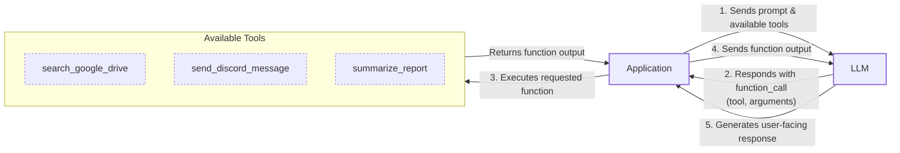
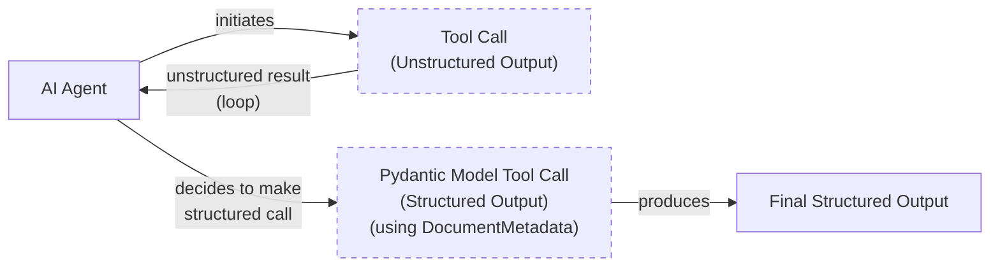
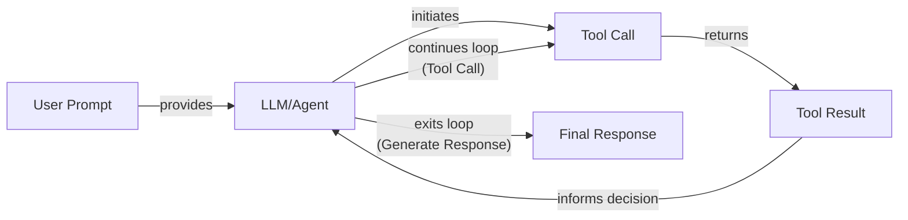

# Lesson 6: Agent Tools & Function Calling

In our previous lessons, we built a solid foundation in AI Engineering. We explored the landscape of AI agents, distinguished between rule-based LLM workflows and autonomous agents, and mastered context engineering and structured outputs. We learned how to chain, route, and orchestrate different components to build basic workflows.

Now, we will explore one of the most critical building blocks of any AI Agent: **Tools**, also known as Function Calling. We will learn how to give our LLM the ability to take action. By implementing tool calling from scratch, you will understand how an LLM decides which tool to call, generates the correct parameters, and executes the function. This lesson will open the black box, showing you what separates a simple text generator from an agent that can interact with the external world.

## Understanding why agents need tools

LLMs have a fundamental limitation: they are powerful pattern matchers and text generators, but they cannot perform actions or interact with the external world on their own. They are trained on vast amounts of text and store their knowledge within their weights, but this knowledge is static and disconnected from real-time information or external systems. This is where tools come in [[1]](https://arxiv.org/html/2507.08034v1).

Think of the LLM as the brain of an agent. Tools are its "hands and senses," allowing it to perceive and act in the world beyond its textual interface. They are the bridge between the LLM's internal reasoning and the external environment. With tools, an LLM transforms into an AI agent capable of executing specific instructions and interacting with the world. This capability is what allows an agent to move beyond simply generating text to providing dynamic, actionable, and data-driven assistance [[2]](https://medium.com/@yugalnandurkar5/llm-engineering-part-i-fa48d4307d26).

This capability unlocks a wide range of applications. Modern AI agents use tools to:
-   Access real-time information through APIs, such as checking today's weather or fetching the latest news, overcoming the limitation of static training data [[3]](https://lnu.diva-portal.org/smash/get/diva2:1801354/FULLTEXT01.pdf).
-   Interact with external databases and storage solutions, from a traditional PostgreSQL database or a Snowflake data warehouse to an S3 data lake [[4]](https://www.ruh.ai/blogs/how-vector-databases-are-rewiring-the-tech-industry).
-   Access the agent's long-term memory to recall information beyond the immediate context window, enabling continuity across conversations [[5]](https://neo4j.com/blog/agentic-ai/connected-context-and-persistent-memory-neo4j-providers-for-the-microsoft-agent-framework/).
-   Execute code in sandboxed environments like Python or JavaScript for precise calculations, data manipulation, statistics, and data visualizations. This includes tasks like basic math calculations, sorting, filtering, and grouping data [[6]](https://medium.com/@anicomanesh/how-llm-reasoning-powers-the-agentic-ai-revolution-cbefd10ebf3f).

## Implementing tool calls from scratch

The best way to understand how tools work is to implement them from scratch. In this section, you will learn how a tool is defined, how its schema is structured, how an LLM discovers available tools, and how to interpret the model's output to execute a function call.

The process involves a five-step flow between your application and the LLM:
1.  **Application:** You send the LLM a prompt along with a list of available tools defined by their schemas.
2.  **LLM:** It analyzes the prompt and decides if a tool is needed. If so, it responds with a `function_call` request, specifying the tool's name and the arguments.
3.  **Application:** You parse this request and execute the corresponding function in your code.
4.  **Application:** You send the function's output back to the LLM as an observation.
5.  **LLM:** It uses the tool's output to generate a final, user-facing response or decide the next action.

This request-execute-respond cycle is the foundation of tool use in AI agents.


Image 1: Flowchart illustrating the 5-step request-execute-respond flow of calling a tool.

Let's implement a simple example where we mock searching for a document on Google Drive and sending its summary to a Discord channel.

<aside>
💡

You can find the code for this lesson in the accompanying [Jupyter Notebook](https://github.com/towardsai/course-ai-agents/blob/dev/lessons/06_tools/notebook.ipynb) in the course's GitHub repository.

</aside>

### ### Setup and Tool Definition

1.  First, we set up our environment by importing the necessary libraries and initializing the Gemini client. We will use the `gemini-2.5-flash` model and define a sample `DOCUMENT` to mock the content of a file.
    ```python
    import json
    from typing import Any
    
    from google import genai
    from google.genai import types
    from pydantic import BaseModel, Field
    
    from lessons.utils import env, pretty_print
    
    env.load(required_env_vars=["GOOGLE_API_KEY"])
    
    client = genai.Client()
    
    MODEL_ID = "gemini-2.5-flash"
    
    DOCUMENT = """
    # Q3 2023 Financial Performance Analysis
    
    The Q3 earnings report shows a 20% increase in revenue and a 15% growth in user engagement, 
    beating market expectations. These impressive results reflect our successful product strategy 
    and strong market positioning.
    
    Our core business segments demonstrated remarkable resilience, with digital services leading 
    the growth at 25% year-over-year. The expansion into new markets has proven particularly 
    successful, contributing to 30% of the total revenue increase.
    
    Customer acquisition costs decreased by 10% while retention rates improved to 92%, 
    marking our best performance to date. These metrics, combined with our healthy cash flow 
    position, provide a strong foundation for continued growth into Q4 and beyond.
    """
    ```
2.  Next, we define our mock tools as Python functions. The function signature and docstring are critical, as the LLM uses them to understand what each tool does.
    ```python
    def search_google_drive(query: str) -> dict:
        """
        Searches for a file on Google Drive and returns its content or a summary.
    
        Args:
            query (str): The search query to find the file, e.g., 'Q3 earnings report'.
    
        Returns:
            dict: A dictionary representing the search results, including file names and summaries.
        """
        return {
            "files": [
                {
                    "name": "Q3_Earnings_Report_2024.pdf",
                    "id": "file12345",
                    "content": DOCUMENT,
                }
            ]
        }
    ```
    ```python
    def send_discord_message(channel_id: str, message: str) -> dict:
        """
        Sends a message to a specific Discord channel.
    
        Args:
            channel_id (str): The ID of the channel to send the message to, e.g., '#finance'.
            message (str): The content of the message to send.
    
        Returns:
            dict: A dictionary confirming the action, e.g., {"status": "success"}.
        """
        return {
            "status": "success",
            "status_code": 200,
            "channel": channel_id,
            "message_preview": f"{message[:50]}...",
        }
    ```
    ```python
    def summarize_financial_report(text: str) -> str:
        """
        Summarizes a financial report.
    
        Args:
            text (str): The text to summarize.
    
        Returns:
            str: The summary of the text.
        """
        return "The Q3 2023 earnings report shows strong performance across all metrics with 20% revenue growth, 15% user engagement increase, 25% digital services growth, and improved retention rates of 92%."
    ```
3.  For the LLM to use these functions, we must provide their definitions as a schema, typically in JSON format. This schema acts as a contract, telling the model the tool's name, its purpose (`description`), and how to call it (`parameters`). This is an industry standard used by APIs from OpenAI, Google, and Anthropic [[7]](https://ai.google.dev/gemini-api/docs/function-calling).
    ```python
    search_google_drive_schema = {
        "name": "search_google_drive",
        "description": "Searches for a file on Google Drive and returns its content or a summary.",
        "parameters": {
            "type": "object",
            "properties": {
                "query": {
                    "type": "string",
                    "description": "The search query to find the file, e.g., 'Q3 earnings report'.",
                }
            },
            "required": ["query"],
        },
    }
    ```
    ```python
    send_discord_message_schema = {
        "name": "send_discord_message",
        "description": "Sends a message to a specific Discord channel.",
        "parameters": {
            "type": "object",
            "properties": {
                "channel_id": {
                    "type": "string",
                    "description": "The ID of the channel to send the message to, e.g., '#finance'.",
                },
                "message": {
                    "type": "string",
                    "description": "The content of the message to send.",
                },
            },
            "required": ["channel_id", "message"],
        },
    }
    ```
    ```python
    summarize_financial_report_schema = {
        "name": "summarize_financial_report",
        "description": "Summarizes a financial report.",
        "parameters": {
            "type": "object",
            "properties": {
                "text": {
                    "type": "string",
                    "description": "The text to summarize.",
                },
            },
            "required": ["text"],
        },
    }
    ```
4.  We then create a tool registry to map tool names to their functions (`handler`) and schemas (`declaration`).
    ```python
    TOOLS = {
        "search_google_drive": {
            "handler": search_google_drive,
            "declaration": search_google_drive_schema,
        },
        "send_discord_message": {
            "handler": send_discord_message,
            "declaration": send_discord_message_schema,
        },
        "summarize_financial_report": {
            "handler": summarize_financial_report,
            "declaration": summarize_financial_report_schema,
        },
    }
    TOOLS_BY_NAME = {tool_name: tool["handler"] for tool_name, tool in TOOLS.items()}
    TOOLS_SCHEMA = [tool["declaration"] for tool in TOOLS.values()]
    ```
    The `TOOLS_BY_NAME` mapping provides a quick way to access a tool's function by its name:
    ```text
    Tool name: search_google_drive
    Tool handler: <function search_google_drive at 0x104c7df80>
    ---------------------------------------------------------------------------
    Tool name: send_discord_message
    Tool handler: <function send_discord_message at 0x104c7de40>
    ---------------------------------------------------------------------------
    Tool name: summarize_financial_report
    Tool handler: <function summarize_financial_report at 0x1274f5c60>
    ---------------------------------------------------------------------------
    ```
    And `TOOLS_SCHEMA` holds the list of schemas we'll pass to the LLM. Here is the schema for our `search_google_drive` tool:
    ```text
    {
      "name": "search_google_drive",
      "description": "Searches for a file on Google Drive and returns its content or a summary.",
      "parameters": {
        "type": "object",
        "properties": {
          "query": {
            "type": "string",
            "description": "The search query to find the file, e.g., 'Q3 earnings report'."
          }
        },
        "required": [
          "query"
        ]
      }
    }
    ```

### ### The System Prompt and Tool Selection

1.  Now, we create a system prompt to instruct the LLM on how to use these tools. This prompt includes guidelines on when to use tools, how to select them, and the exact format for a tool call. We embed the `TOOLS_SCHEMA` inside `<tool_definitions>` XML tags.
    ```python
    TOOL_CALLING_SYSTEM_PROMPT = """
    You are a helpful AI assistant with access to tools that enable you to take actions and retrieve information to better 
    assist users.
    
    ## Tool Usage Guidelines
    
    **When to use tools:**
    - When you need information that is not in your training data
    - When you need to perform actions in external systems and environments
    - When you need real-time, dynamic, or user-specific data
    - When computational operations are required
    
    **Tool selection:**
    - Choose the most appropriate tool based on the user's specific request
    - If multiple tools could work, select the one that most directly addresses the need
    - Consider the order of operations for multi-step tasks
    
    **Parameter requirements:**
    - Provide all required parameters with accurate values
    - Use the parameter descriptions to understand expected formats and constraints
    - Ensure data types match the tool's requirements (strings, numbers, booleans, arrays)
    
    ## Tool Call Format
    
    When you need to use a tool, output ONLY the tool call in this exact format:
    
    <tool_call>
    {{"name": "tool_name", "args": {{"param1": "value1", "param2": "value2"}}}}
    </tool_call>
    
    **Critical formatting rules:**
    - Use double quotes for all JSON strings
    - Ensure the JSON is valid and properly escaped
    - Include ALL required parameters
    - Use correct data types as specified in the tool definition
    - Do not include any additional text or explanation in the tool call
    
    ## Response Behavior
    
    - If no tools are needed, respond directly to the user with helpful information
    - If tools are needed, make the tool call first, then provide context about what you're doing
    - After receiving tool results, provide a clear, user-friendly explanation of the outcome
    - If a tool call fails, explain the issue and suggest alternatives when possible
    
    ## Available Tools
    
    <tool_definitions>
    {tools}
    </tool_definitions>
    
    Remember: Your goal is to be maximally helpful to the user. Use tools when they add value, but don't use them unnecessarily. Always prioritize accuracy and user experience.
    """
    ```
    Based on the `description` field in the tool schema, the LLM *decides* if a tool is appropriate for the user's query. This is why clear and distinct tool descriptions are critical. Vague descriptions like "Tool to search documents" can confuse the model, especially when multiple similar tools exist [[8]](https://www.anthropic.com/research/building-effective-agents). Explicit descriptions like "Tool to search documents on Google Drive" versus "Tool to search files on the local disk" prevent ambiguity [[9]](https://mbrenndoerfer.com/writing/function-calling-llm-structured-tools). This becomes essential when an agent has access to 50-100 tools. Once a tool is selected, the LLM *generates* the function name and arguments as a structured output, like JSON. This capability is enabled by instruction fine-tuning, which trains the model to interpret schemas and produce valid tool calls.

2.  Let's test it. We send a user prompt along with our system prompt to the model.
    ```python
    USER_PROMPT = """
    Can you help me find the latest quarterly report and share key insights with the team?
    """
    
    messages = [TOOL_CALLING_SYSTEM_PROMPT.format(tools=str(TOOLS_SCHEMA)), USER_PROMPT]
    
    response = client.models.generate_content(
        model=MODEL_ID,
        contents=messages,
    )
    ```
    The LLM correctly identifies the `search_google_drive` tool and generates the required arguments:
    ```text
    <tool_call>
    {"name": "search_google_drive", "args": {"query": "latest quarterly report"}}
    </tool_call>
    ```
3.  For a multi-step request, the model chains the tools sequentially.
    ```python
    USER_PROMPT = """
    Please find the Q3 earnings report on Google Drive and send a summary of it to 
    the #finance channel on Discord.
    """
    
    messages = [TOOL_CALLING_SYSTEM_PROMPT.format(tools=str(TOOLS_SCHEMA)), USER_PROMPT]
    
    response = client.models.generate_content(
        model=MODEL_ID,
        contents=messages,
    )
    ```
    It first calls the search tool:
    ```text
    <tool_call>
    {"name": "search_google_drive", "args": {"query": "Q3 earnings report"}}
    </tool_call>
    ```

### ### Executing the Tool and Interpreting the Result

1.  Now we need to parse the LLM's response and execute the tool. We start by extracting the JSON string from the response.
    ```python
    def extract_tool_call(response_text: str) -> str:
        """
        Extracts the tool call from the response text.
        """
        return response_text.split("<tool_call>")[1].split("</tool_call>")[0].strip()
    
    tool_call_str = extract_tool_call(response.text)
    ```
    This gives us a string: `'{"name": "search_google_drive", "args": {"query": "Q3 earnings report"}}'`.

2.  Next, we parse this string into a Python dictionary.
    ```python
    tool_call = json.loads(tool_call_str)
    ```
    The output is a dictionary: `{'name': 'search_google_drive', 'args': {'query': 'Q3 earnings report'}}`.

3.  We retrieve the actual Python function (the handler) from our `TOOLS_BY_NAME` registry.
    ```python
    tool_handler = TOOLS_BY_NAME[tool_call["name"]]
    ```
    The `tool_handler` is now a reference to our `search_google_drive` function, as we can see by inspecting it:
    ```text
    <function __main__.search_google_drive(query: str) -> dict>
    ```
4.  Finally, we execute the function using the arguments generated by the LLM.
    ```python
    tool_result = tool_handler(**tool_call["args"])
    ```
    The tool returns the mocked document content:
    ```text
    {
      "files": [
        {
          "name": "Q3_Earnings_Report_2024.pdf",
          "id": "file12345",
          "content": "\n# Q3 2023 Financial Performance Analysis\n\nThe Q3 earnings report shows a 20% increase in revenue and a 15% growth in user engagement, \nbeating market expectations..."
        }
      ]
    }
    ```
5.  We can wrap these steps in a convenient `call_tool` function to simplify the process.
    ```python
    def call_tool(response_text: str, tools_by_name: dict) -> Any:
        """
        Call a tool based on the response from the LLM.
        """
    
        tool_call_str = extract_tool_call(response_text)
        tool_call = json.loads(tool_call_str)
        tool_name = tool_call["name"]
        tool_args = tool_call["args"]
        tool = tools_by_name[tool_name]
    
        return tool(**tool_args)
    ```
    Using this function on the model's response gives us the same result as before.
    ```python
    call_tool(response.text, tools_by_name=TOOLS_BY_NAME)
    ```
    It outputs:
    ```text
    {'files': [{'name': 'Q3_Earnings_Report_2024.pdf',
       'id': 'file12345',
       'content': '\n# Q3 2023 Financial Performance Analysis\n\nThe Q3 earnings report shows a 20% increase in revenue and a 15% growth in user engagement, \nbeating market expectations. ...'}]}
    ```
6.  After executing the tool, we typically send the result back to the LLM to interpret it and formulate a user-facing response or decide on the next step.
    ```python
    response = client.models.generate_content(
        model=MODEL_ID,
        contents=f"Interpret the tool result: {json.dumps(tool_result, indent=2)}",
    )
    ```
    The LLM provides a natural language summary:
    ```text
    The tool result provides the content of a file named `Q3_Earnings_Report_2024.pdf`.
    
    This document is a **Q3 2023 Financial Performance Analysis** and details exceptionally strong results, significantly beating market expectations.
    
    **Key highlights from the report include:**
    
    *   **Revenue Growth:** A 20% increase in revenue.
    *   **User Engagement:** 15% growth in user engagement.
    ...
    ```
This covers the basic concepts of tool calling from scratch.

## Implementing a small tool calling framework from scratch

Manually defining a JSON schema for every tool is tedious and error-prone. Modern agentic frameworks like LangGraph automate this by using a `@tool` decorator. This decorator inspects a function's signature and docstring to generate the schema automatically, ensuring consistency and reducing boilerplate code [[10]](https://docs.langchain.com/oss/python/langchain/tools).

This approach follows the Don't Repeat Yourself (DRY) principle by creating a single source of truth for the tool's implementation and its schema. Let's build a simple framework with a `@tool` decorator to streamline our implementation. This will give you a better feel for how production frameworks operate under the hood.

### ### Automating Schema Generation with a @tool Decorator

1.  First, we define a `ToolFunction` class to wrap our decorated functions and store their schema. This class will hold both the callable function and its generated schema, making it easy to manage our tools.
    ```python
    from inspect import Parameter, signature
    from typing import Any, Callable, Dict, Optional
    
    
    class ToolFunction:
        def __init__(self, func: Callable, schema: Dict[str, Any]) -> None:
            self.func = func
            self.schema = schema
            self.__name__ = func.__name__
            self.__doc__ = func.__doc__
    
        def __call__(self, *args: Any, **kwargs: Any) -> Any:
            return self.func(*args, **kwargs)
    ```
2.  Next, we create the `@tool` decorator. In Python, a decorator is a function that takes another function as an argument, adds some functionality, and returns the modified function. Our decorator will inspect the function's signature using Python's `inspect` module to build the `parameters` schema, extracting parameter names and whether they are required. The function's name and docstring are used for the tool's `name` and `description` [[11]](https://openai.github.io/openai-agents-python/tools/).
    ```python
    def tool(description: Optional[str] = None) -> Callable[[Callable], ToolFunction]:
        """
        A decorator that creates a tool schema from a function.
    
        Args:
            description: Optional override for the function's docstring
    
        Returns:
            A decorator function that wraps the original function and adds a schema
        """
    
        def decorator(func: Callable) -> ToolFunction:
            # Get function signature
            sig = signature(func)
    
            # Create parameters schema
            properties = {}
            required = []
    
            for param_name, param in sig.parameters.items():
                # Skip self for methods
                if param_name == "self":
                    continue
    
                param_schema = {
                    "type": "string",  # Default to string, can be enhanced with type hints
                    "description": f"The {param_name} parameter",  # Default description
                }
    
                # Add to required if parameter has no default value
                if param.default == Parameter.empty:
                    required.append(param_name)
    
                properties[param_name] = param_schema
    
            # Create the tool schema
            schema = {
                "name": func.__name__,
                "description": description or func.__doc__ or f"Executes the {func.__name__} function.",
                "parameters": {
                    "type": "object",
                    "properties": properties,
                    "required": required,
                },
            }
    
            return ToolFunction(func, schema)
    
        return decorator
    ```
3.  Now, we can redefine our tools using this decorator. The code is much cleaner as the schemas are generated automatically.
    ```python
    @tool()
    def search_google_drive_example(query: str) -> dict:
        """Search for files in Google Drive."""
        return {"files": ["Q3 earnings report"]}
    
    
    @tool()
    def send_discord_message_example(channel_id: str, message: str) -> dict:
        """Send a message to a Discord channel."""
        return {"message": "Message sent successfully"}
    
    
    @tool()
    def summarize_financial_report_example(text: str) -> str:
        """Summarize the contents of a financial report."""
        return "Financial report summarized successfully"
    ```

### ### Using the Custom Framework

1.  Each decorated function is now a `ToolFunction` object. It contains the schema and a reference to the original function handler.
    ```python
    type(search_google_drive_example)
    ```
    It outputs: `__main__.ToolFunction`.
    
    The schema for `search_google_drive_example` is identical to the one we defined manually:
    ```text
    {
      "name": "search_google_drive_example",
      "description": "Search for files in Google Drive.",
      "parameters": {
        "type": "object",
        "properties": {
          "query": {
            "type": "string",
            "description": "The query parameter"
          }
        },
        "required": [
          "query"
        ]
      }
    }
    ```
    And we can access the underlying function via `search_google_drive_example.func`.

2.  We build our `tools_by_name` and `tools_schema` mappings as before and call the LLM.
    ```python
    tools = [
        search_google_drive_example,
        send_discord_message_example,
        summarize_financial_report_example,
    ]
    tools_by_name = {tool.schema["name"]: tool.func for tool in tools}
    tools_schema = [tool.schema for tool in tools]
    
    USER_PROMPT = """
    Please find the Q3 earnings report on Google Drive and send a summary of it to 
    the #finance channel on Discord.
    """
    
    messages = [TOOL_CALLING_SYSTEM_PROMPT.format(tools=str(tools_schema)), USER_PROMPT]
    
    response = client.models.generate_content(
        model=MODEL_ID,
        contents=messages,
    )
    ```
    The model's response is the same:
    ```text
    <tool_call>
    {"name": "search_google_drive_example", "args": {"query": "Q3 earnings report"}}
    </tool_call>
    ```
3.  Executing the tool call with our `call_tool` function also works just as before.
    ```python
    call_tool(response.text, tools_by_name=tools_by_name)
    ```
    It outputs: `{'files': ['Q3 earnings report']}`.

Voilà! We have created a small, reusable tool-calling framework. This implementation is conceptually similar to what frameworks like LangGraph do under the hood to simplify tool definition.

## Implementing production-level tool calls with Gemini

In production, it is best to use the native tool-calling features of modern LLM APIs like Gemini or OpenAI. Instead of manually engineering a system prompt, we can use the provider's configuration objects. This approach is simpler, more robust, and more efficient, as the provider optimizes the process for their specific models [[13]](https://www.decodingai.com/p/tool-calling-from-scratch-to-production). This also ensures that as models are updated, your tool-calling logic remains compatible without needing constant prompt adjustments.

Let's refactor our example to use Gemini's native API.

### ### Using Gemini's Native Tool Configuration

1.  We define a `GenerateContentConfig` object and pass our tool schemas to it. We can also set the `mode` to `"ANY"` to force the model to call a tool instead of generating a text response. This gives us more control over the model's behavior.
    ```python
    tools = [
        types.Tool(
            function_declarations=[
                types.FunctionDeclaration(**search_google_drive_schema),
                types.FunctionDeclaration(**send_discord_message_schema),
            ]
        )
    ]
    config = types.GenerateContentConfig(
        tools=tools,
        tool_config=types.ToolConfig(function_calling_config=types.FunctionCallingConfig(mode="ANY")),
    )
    ```
2.  With this configuration, we can call the model directly with the user prompt, completely removing our lengthy `TOOL_CALLING_SYSTEM_PROMPT`. The API handles the low-level prompt construction internally.
    ```python
    response = client.models.generate_content(
        model=MODEL_ID,
        contents=USER_PROMPT,
        config=config,
    )
    ```
    The response object now contains a structured `function_call` attribute:
    ```text
    FunctionCall(id=None, args={'query': 'Q3 earnings report'}, name='search_google_drive')
    ```

### ### Simplifying with Direct Function Passing

1.  The Google `genai` Python SDK simplifies this even further by allowing us to pass Python functions directly into the configuration. The SDK automatically extracts the schema from the function's signature, type hints, and docstring, just like our custom decorator [[12]](https://www.philschmid.de/gemini-function-calling).
    ```python
    config = types.GenerateContentConfig(
        tools=[search_google_drive, send_discord_message]
    )
    ```
2.  The response object contains the same structured `function_call` attribute, which we can inspect and use directly.
    ```python
    response_message_part = response.candidates[0].content.parts[0]
    function_call = response_message_part.function_call
    ```
    The `function_call.args` attribute contains the parameters:
    ```text
    {'query': 'Q3 earnings report'}
    ```
3.  We can simplify our `call_tool` function to work with Gemini's native `FunctionCall` object.
    ```python
    def call_tool(function_call) -> Any:
        tool_name = function_call.name
        tool_args = {key: value for key, value in function_call.args.items()}
    
        tool_handler = TOOLS_BY_NAME[tool_name]
    
        return tool_handler(**tool_args)
    
    tool_result = call_tool(function_call)
    ```
    The output is the same as our manual implementation:
    ```text
    {'files': [{'name': 'Q3_Earnings_Report_2024.pdf', 'id': 'file12345', 'content': '...'}]}
    ```
By using the native SDK, we reduced dozens of lines of code to just a few, creating a more robust and maintainable system. Other popular APIs from OpenAI and Anthropic follow a similar logic, making these concepts easily transferable across different platforms [[14]](https://myengineeringpath.dev/tools/gemini-guide/).

## Using Pydantic models as tools for on-demand structured outputs

We can combine the power of tool calling with the structured data validation of Pydantic, a topic we covered in Lesson 4. A powerful pattern in agentic systems is to treat a Pydantic model as a tool. This allows an agent to perform several intermediate steps with unstructured text and then, when it's ready, call a specific "tool" to format its final answer into a reliable, structured Pydantic object [[15]](https://pydantic.dev/docs/ai/core-concepts/output/).

This is useful for workflows where you need a structured output only at the end of a multi-step process, ensuring the final data is clean and validated for downstream use in your Python application. It gives the agent flexibility to reason freely during intermediate steps while guaranteeing a predictable final output.


Image 2: A flowchart illustrating an AI agent calling multiple tools in a loop, where only the last one is a tool call for structured outputs.

Let's see how to implement this.

1.  First, we define our `DocumentMetadata` Pydantic model, just as we did in Lesson 4.
    ```python
    class DocumentMetadata(BaseModel):
        """A class to hold structured metadata for a document."""
    
        summary: str = Field(description="A concise, 1-2 sentence summary of the document.")
        tags: list[str] = Field(description="A list of 3-5 high-level tags relevant to the document.")
        keywords: list[str] = Field(description="A list of specific keywords or concepts mentioned.")
        quarter: str = Field(description="The quarter of the financial year described in the document (e.g., Q3 2023).")
        growth_rate: str = Field(description="The growth rate of the company described in the document (e.g., 10%).")
    ```
2.  We then create a tool declaration where the `parameters` are derived from the Pydantic model's JSON schema.
    ```python
    extraction_tool = types.Tool(
        function_declarations=[
            types.FunctionDeclaration(
                name="extract_metadata",
                description="Extracts structured metadata from a financial document.",
                parameters=DocumentMetadata.model_json_schema(),
            )
        ]
    )
    config = types.GenerateContentConfig(
        tools=[extraction_tool],
        tool_config=types.ToolConfig(function_calling_config=types.FunctionCallingConfig(mode="ANY")),
    )
    ```
3.  We prompt the model to analyze the document and extract the metadata.
    ```python
    prompt = f"""
    Please analyze the following document and extract its metadata.
    
    Document:
    --- 
    {DOCUMENT}
    --- 
    """
    
    response = client.models.generate_content(model=MODEL_ID, contents=prompt, config=config)
    ```
4.  The model responds with a function call to our `extract_metadata` tool, with the arguments already structured according to our Pydantic schema.
    ```text
     Function Name:  `extract_metadata
     Function Arguments:  `{
        "growth_rate": "20%",
        "summary": "The Q3 2023 earnings report shows a 20% increase in revenue and 15% growth in user engagement, driven by successful product strategy and market expansion. This performance provides a strong foundation for continued growth.",
        "quarter": "Q3 2023",
        "keywords": [
          "Revenue",
          "User Engagement",
          "Market Expansion",
        ],
        "tags": [
          "Financials",
          "Earnings",
          "Growth",
        ]
      }`
    ```
5.  We can then validate these arguments and parse them directly into a `DocumentMetadata` object.
    ```python
    function_call = response.candidates[0].content.parts[0].function_call
    
    try:
        document_metadata = DocumentMetadata(**function_call.args)
        print("Validation successful!")
    except Exception as e:
        print(f"Validation failed: {e}")
    ```
This pattern is frequently used in AI agents that require reliable, structured data as their final output.

## The downsides of running tools in a loop

So far, we have focused on single-turn interactions. However, real-world tasks often require multiple steps. A natural progression is to run tools in a loop, allowing an agent to chain multiple actions together. The agent can decide which tool to use at each step based on the output of the previous one. This is the final piece of the puzzle needed to build a true AI agent.


Image 3: A flowchart illustrating a tool calling loop by an LLM/Agent.

This approach offers flexibility and adaptability, enabling agents to handle complex, multi-step tasks. Let's implement a loop where an agent first finds a report on Google Drive, summarizes it, and then sends the summary to a Discord channel.

1.  We configure the model with all three of our tools: `search_google_drive`, `summarize_financial_report`, and `send_discord_message`.
    ```python
    tools = [
        types.Tool(
            function_declarations=[
                types.FunctionDeclaration(**search_google_drive_schema),
                types.FunctionDeclaration(**send_discord_message_schema),
                types.FunctionDeclaration(**summarize_financial_report_schema),
            ]
        )
    ]
    config = types.GenerateContentConfig(
        tools=tools,
        tool_config=types.ToolConfig(function_calling_config=types.FunctionCallingConfig(mode="ANY")),
    )
    ```
2.  We provide a multi-step prompt and initialize a message history.
    ```python
    USER_PROMPT = """
    Please find the Q3 earnings report on Google Drive and send a summary of it to 
    the #finance channel on Discord.
    """
    
    messages = [USER_PROMPT]
    ```
3.  We run a loop that continues as long as the model requests a function call. In each iteration, we execute the tool, append the result to the message history, and send it back to the model to decide on the next step.
    ```python
    response = client.models.generate_content(
        model=MODEL_ID,
        contents=messages,
        config=config,
    )
    response_message_part = response.candidates[0].content.parts[0]
    messages.append(response.candidates[0].content)
    
    max_iterations = 3
    while hasattr(response_message_part, "function_call") and max_iterations > 0:
        tool_result = call_tool(response_message_part.function_call)
        
        function_response_part = types.Part.from_function_response(
            name=response_message_part.function_call.name,
            response={"result": tool_result},
        )
        messages.append(function_response_part)
    
        response = client.models.generate_content(
            model=MODEL_ID,
            contents=messages,
            config=config,
        )
    
        response_message_part = response.candidates[0].content.parts[0]
        messages.append(response.candidates[0].content)
        max_iterations -= 1
    ```
    The agent successfully executes the three tools in sequence. Here is the output trace:
    ```text
    Function Name: `search_google_drive`
    Tool Result: {'files': [{'name': 'Q3_Earnings_Report_2024.pdf', 'id': 'file12345', 'content': '...'}]}
    Function Name: `summarize_financial_report`
    Tool Result: The Q3 2023 earnings report shows strong performance...
    Function Name: `send_discord_message`
    Tool Result: {'status': 'success', 'status_code': 200, 'channel': '#finance', 'message_preview': 'The Q3 2023 earnings report shows strong performan...'}
    ```

However, this simple loop has significant limitations. It does not allow the LLM to interpret the output of each tool before deciding on the next action. The agent immediately moves to the next function call without a "thought" step to analyze what it has learned or adjust its strategy. This can lead to inefficient tool usage or getting stuck in loops [[16]](https://myengineeringpath.dev/genai-engineer/agentic-patterns/). Without an intermediate reasoning step, the agent cannot recover from errors, adapt its plan, or handle dependencies between tasks [[17]](https://blogs.oracle.com/developers/what-is-the-ai-agent-loop-the-core-architecture-behind-autonomous-ai-systems). For example, if the `search_google_drive` tool failed or returned an empty result, our current loop would blindly proceed to the next step, likely causing a failure. A more intelligent agent would recognize the failure, reason about it, and perhaps try a different search query or inform the user.

For tasks where tools are independent, we can run them in parallel to reduce latency. For example, fetching financial news and stock prices can happen simultaneously. However, many tasks have dependencies that require a more deliberate, step-by-step approach.

These limitations motivated the development of more sophisticated agentic patterns like **ReAct** (Reasoning and Acting). ReAct explicitly interleaves reasoning steps with actions, allowing the agent to "think" about its plan and the results of its actions. We will explore this powerful pattern in detail in Lessons 7 and 8.

## Popular tools used within the industry

To ground these concepts in the real world, let's look at some popular tool categories used across the industry. These examples showcase what's possible when you connect LLMs to external systems.

### Knowledge & Memory Access
These tools allow agents to retrieve information beyond their training data. This includes querying vector databases for semantic search, document stores, or graph databases to understand relationships between entities [[5]](https://neo4j.com/blog/agentic-ai/connected-context-and-persistent-memory-neo4j-providers-for-the-microsoft-agent-framework/). A powerful pattern in this category is text-to-SQL, where an agent constructs and executes SQL queries on traditional databases based on natural language prompts [[18]](https://promethium.ai/guides/text-to-sql-basics-benefits/). These tools are fundamental for memory and Retrieval-Augmented Generation (RAG), which we will cover in Lessons 9 and 10.

### Web Search & Browsing
A common use case for agents is accessing up-to-date information from the internet. This is achieved through tools that interface with search engine APIs like Google Search, Bing, or Brave [[19]](https://mantraideas.com/llm-web-search/). More advanced tools can also scrape and parse content directly from web pages, enabling agents to conduct deep research or monitor websites for changes. This overcomes the static nature of an LLM's training data, allowing it to answer questions about current events.

### Code Execution
Code interpreter tools give agents the ability to write and execute code, typically in a sandboxed environment. A Python interpreter is invaluable for performing precise calculations, manipulating data, running statistical analyses, and creating visualizations. These are tasks where LLMs alone often struggle [[1]](https://arxiv.org/html/2507.08034v1). While Python is the most common, this pattern can be adapted for other languages like JavaScript.

### Other Popular Tools
The possibilities for tools are nearly endless. In enterprise settings, agents often interact with external APIs for calendars, email, and project management systems, automating routine business workflows. For example, an agent could schedule a meeting, send a follow-up email, and create a task in a project management tool, all from a single natural language command. Productivity-focused AI applications might use tools for file system operations, like reading and writing files or listing directories, allowing them to interact directly with a user's operating system.

## Conclusion

Tool calling is a cornerstone of modern AI agents. It transforms LLMs from passive text generators into active participants that can interact with the external world. Understanding how to build, manage, and debug tools is one of the most important skills for an AI Engineer.

In this lesson, we have gone from implementing tool calling from scratch to using production-grade APIs. We have seen the power of chaining tools in a loop and also recognized its limitations. This sets the stage for our next lesson, where we will explore the theory behind more advanced agentic patterns like ReAct, which enable more sophisticated planning and reasoning.

## References

- [1]  [Integrating External Tools with Large Language Models (LLM) to Improve Accuracy](https://arxiv.org/html/2507.08034v1)
- [2]  [LLM Engineering: Part I](https://medium.com/@yugalnandurkar5/llm-engineering-part-i-fa48d4307d26)
- [3]  [LLMs and APIs: A Symbiotic Relationship for Enhanced Capabilities](https://lnu.diva-portal.org/smash/get/diva2:1801354/FULLTEXT01.pdf)
- [4]  [How Vector Databases Are Rewiring the Tech Industry](https://www.ruh.ai/blogs/how-vector-databases-are-rewiring-the-tech-industry)
- [5]  [Connected Context and Persistent Memory: Neo4j Providers for the Microsoft Agent Framework](https://neo4j.com/blog/agentic-ai/connected-context-and-persistent-memory-neo4j-providers-for-the-microsoft-agent-framework/)
- [6]  [How LLM Reasoning Powers the Agentic AI Revolution](https://medium.com/@anicomanesh/how-llm-reasoning-powers-the-agentic-ai-revolution-cbefd10ebf3f)
- [7]  [Function calling with the Gemini API](https://ai.google.dev/gemini-api/docs/function-calling)
- [8]  [Building effective agents](https://www.anthropic.com/research/building-effective-agents)
- [9]  [Function Calling: From First Principles to Advanced Patterns](https://mbrenndoerfer.com/writing/function-calling-llm-structured-tools)
- [10]  [LangChain Tools](https://docs.langchain.com/oss/python/langchain/tools)
- [11]  [Tools - OpenAI Agents SDK](https://openai.github.io/openai-agents-python/tools/)
- [12]  [Function Calling Guide: Google DeepMind Gemini 2.0 Flash](https://www.philschmid.de/gemini-function-calling)
- [13]  [Tool Calling: From Scratch to Production](https://www.decodingai.com/p/tool-calling-from-scratch-to-production)
- [14]  [Google Gemini Guide: The Complete Tutorial](https://myengineeringpath.dev/tools/gemini-guide/)
- [15]  [Output - Pydantic AI](https://pydantic.dev/docs/ai/core-concepts/output/)
- [16]  [Agentic Design Patterns — Visual Architecture Guide](https://myengineeringpath.dev/genai-engineer/agentic-patterns/)
- [17]  [What Is the AI Agent Loop? The Core Architecture Behind Autonomous AI Systems](https://blogs.oracle.com/developers/what-is-the-ai-agent-loop-the-core-architecture-behind-autonomous-ai-systems)
- [18]  [Text-to-SQL: The Basics, Benefits, and How It Works](https://promethium.ai/guides/text-to-sql-basics-benefits/)
- [19]  [How LLMs Use Web Search to Answer Your Questions](https://mantraideas.com/llm-web-search/)
- [20]  [Function calling with OpenAI's API](https://platform.openai.com/docs/guides/function-calling)
- [21]  [Tool Calling Agent From Scratch](https://www.youtube.com/watch?v=ApoDzZP8_ck)
- [22]  [Efficient Tool Use with Chain-of-Abstraction Reasoning](https://arxiv.org/pdf/2401.17464v3)
- [23]  [Building AI Agents from scratch - Part 1: Tool use](https://www.newsletter.swirlai.com/p/building-ai-agents-from-scratch-part)
- [24]  [What is Tool Calling? Connecting LLMs to Your Data](https://www.youtube.com/watch?v=h8gMhXYAv1k)
- [25]  [ReAct vs Plan-and-Execute: A Practical Comparison of LLM Agent Patterns](https://dev.to/jamesli/react-vs-plan-and-execute-a-practical-comparison-of-llm-agent-patterns-4gh9)
- [26]  [Agentic Design Patterns Part 3, Tool Use](https://www.deeplearning.ai/the-batch/agentic-design-patterns-part-3-tool-use/)
- [27]  [Prompting best practices for tool use / function calling](https://community.openai.com/t/prompting-best-practices-for-tool-use-function-calling/1123036)
- [28]  [Building Production-Ready LLM Applications: Bulletproof LLM Tool Calling with Advanced JSON](https://medium.com/@hariomshahu101/building-production-ready-llm-applications-bulletproof-llm-tool-calling-with-advanced-json-b95ce8889f4e)
- [29]  [LLM Output Parsing and Structured Generation](https://tetrate.io/learn/ai/llm-output-parsing-structured-generation)
- [30]  [LangChain Core convert_to_tool](https://reference.langchain.com/python/langchain-core/tools/convert/tool)
- [31]  [Underlying Factors Behind Inconsistency in LLM Responses with Multi-Tool Calling](https://medium.com/@abhaychougule0907/underlying-factors-behind-inconsistency-in-llm-responses-with-multi-tool-calling-628ce7b4de76)
- [32]  [Editing Tool Descriptions for Better LLM-Tool Interactions](https://arxiv.org/html/2505.18135v2)
- [33]  [Overview of Common LLM APIs (OpenAI, Anthropic, etc.)](https://apxml.com/courses/prompt-engineering-llm-application-development/chapter-4-interacting-with-llm-apis/overview-common-llm-apis)
- [34]  [LLM Providers & Gen AI Platforms Compared](https://www.getorchestra.io/guides/llm-providers-gen-ai-platforms-compared)
- [35]  [LLM API Differences That Break Your Code: Anthropic vs OpenAI vs Google](https://futuresearch.ai/blog/llm-provider-quirks/)
- [36]  [Pydantic AI Multi-Agent Applications](https://pydantic.dev/docs/ai/guides/multi-agent-applications/)
- [37]  [Tool Descriptions Are Critical: Making Better LLM Tools Research Capability](https://pub.towardsai.net/tool-descriptions-are-critical-making-better-llm-tools-research-capability-b315851471e7)
- [38]  [Tool Input and Output Schemas](https://apxml.com/courses/building-advanced-llm-agent-tools/chapter-1-llm-agent-tooling-foundations/tool-input-output-schemas)
- [39]  [Pydantic AI Tools](https://pydantic.dev/docs/ai/tools-toolsets/tools/)
- [40]  [Gemini Function Calling with Pydantic](https://discuss.ai.google.dev/t/response-schema-from-pydantic/50028)
- [41]  [Function calling with the Gemini API](https://ai.google.dev/gemini-api/docs/function-calling)
- [42]  [Function calling with OpenAI's API](https://platform.openai.com/docs/guides/function-calling)
- [43]  [Tool Calling Agent From Scratch](https://www.youtube.com/watch?v=ApoDzZP8_ck)
- [44]  [Efficient Tool Use with Chain-of-Abstraction Reasoning](https://arxiv.org/pdf/2401.17464v3)
- [45]  [Building AI Agents from scratch - Part 1: Tool use](https://www.newsletter.swirlai.com/p/building-ai-agents-from-scratch-part)
- [46]  [What is Tool Calling? Connecting LLMs to Your Data](https://www.youtube.com/watch?v=h8gMhXYAv1k)
- [47]  [ReAct vs Plan-and-Execute: A Practical Comparison of LLM Agent Patterns](https://dev.to/jamesli/react-vs-plan-and-execute-a-practical-comparison-of-llm-agent-patterns-4gh9)
- [48]  [Agentic Design Patterns Part 3, Tool Use](https://www.deeplearning.ai/the-batch/agentic-design-patterns-part-3-tool-use/)
- [49]  [Notebook for Lesson 6](https://github.com/towardsai/course-ai-agents/blob/dev/lessons/06_tools/notebook.ipynb)