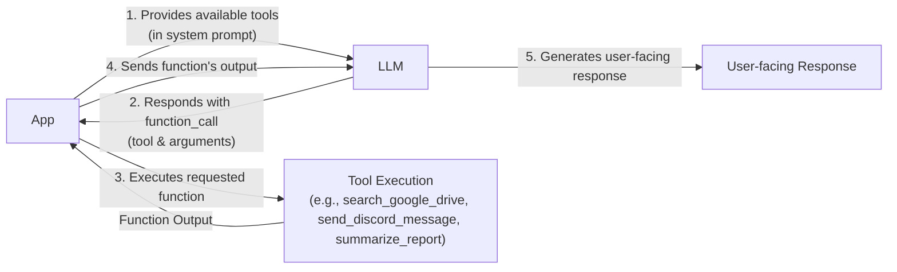
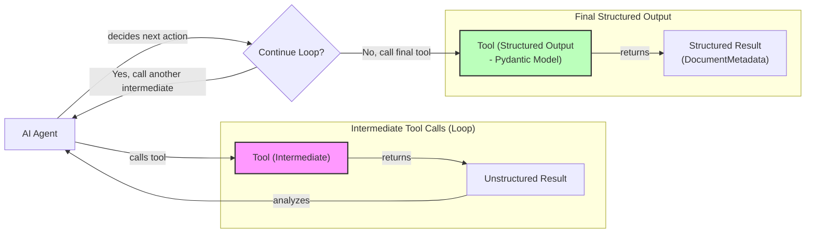
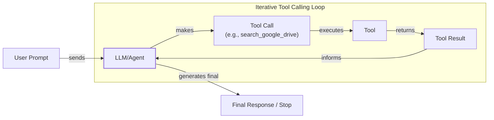

# Lesson 6: Agent Tools & Function Calling

In the previous lessons, we built a foundation in AI Engineering. We mapped the agent landscape, distinguished between rule-based LLM workflows and autonomous agents, and explored context engineering and structured outputs. We learned how to chain, route, and orchestrate different components to build basic workflows. Now, we will give our systems the ability to act.

This lesson is about tools, also known as function calling. Tools are what transform an LLM from a simple text generator into an agent that can interact with the external world. For an AI Engineer, understanding how an agent uses tools is not just a useful skill; it is fundamental. Opening this black box is the key to building, debugging, and monitoring reliable AI applications that can take meaningful actions.

## Understanding Why Agents Need Tools

LLMs have a fundamental limitation: they are pattern matchers and text generators. They are trained on vast amounts of text and can produce human-like responses, but they cannot, by themselves, interact with the external world. They are confined to the information stored in their weights. Tools solve this fundamental limitation.

The LLM serves as the agent's reasoning engine. Tools provide the necessary capabilities for the agent to interact with the external world, acting as its "hands and senses" to perceive and act beyond its textual interface. With tools, an LLM becomes an AI agent capable of executing specific instructions and affecting real-world change.

Image 1: An AI agent uses an LLM as its core reasoning engine to interact with its memory and decide which tools to use. (Source [Building AI Agents from scratch - Part 1: Tool use [[1]](https://www.newsletter.swirlai.com/p/building-ai-agents-from-scratch-part)])

This capability unlocks a wide range of applications. Modern AI agents use tools to:

-   Access real-time information through APIs, like getting today's weather or the latest news [[2]](https://lnu.diva-portal.org/smash/get/diva2:1801354/FULLTEXT01.pdf).
-   Interact with external databases and storage solutions, from a simple PostgreSQL database to a massive Snowflake data warehouse.
-   Access their own long-term memory to recall information beyond the current context window.
-   Execute code in languages like Python or JavaScript to perform precise calculations, manipulate data, or create visualizations [[3]](https://arxiv.org/html/2507.08034v1). LLMs are not calculators; they predict text, not compute results. A code execution tool allows an agent to offload calculations, ensuring accuracy for tasks ranging from basic math to complex statistical analysis [[4]](https://medium.com/@anicomanesh/how-llm-reasoning-powers-the-agentic-ai-revolution-cbefd10ebf3f).

## Implementing Tool Calls from Scratch

The best way to understand how tools work is to build them from the ground up. In this section, we will implement a simple tool-calling mechanism from scratch. We will define our tools, create schemas for them, and write a system prompt that teaches the LLM how to use them.

Our goal is to provide the LLM with a list of available tools and let it decide which one to use, generating the correct arguments to call the function. The high-level process involves five steps:

1.  **App:** We provide the LLM with a list of available tools in the system prompt.
2.  **LLM:** It analyzes the user's request and responds with a `function_call`, specifying the tool name and its arguments.
3.  **App:** Our application code parses this response and executes the requested function.
4.  **App:** We send the function's output back to the LLM.
5.  **LLM:** It uses the tool's output to generate a final, user-facing response.



Image 2: A flowchart illustrating the 5-step request-execute-respond flow of calling a tool.

Let's implement this flow. We will create a simple scenario where an agent can search for a financial report on Google Drive, summarize it, and send the summary to a Discord channel.

<aside>
💡

You can find all the code for this lesson in the accompanying [Jupyter Notebook on GitHub](https://github.com/towardsai/course-ai-agents/blob/dev/lessons/06_tools/notebook.ipynb).

</aside>

1.  First, we set up our environment by initializing the Gemini client and defining our model and a mock document. We will use `gemini-2.5-flash`, which is fast and cost-effective for these examples.
    ```python
    import json
    from typing import Any
    
    from google import genai
    from google.genai import types
    from pydantic import BaseModel, Field
    
    from lessons.utils import pretty_print
    
    client = genai.Client()
    
    MODEL_ID = "gemini-2.5-flash"
    
    DOCUMENT = """
    # Q3 2023 Financial Performance Analysis
    
    The Q3 earnings report shows a 20% increase in revenue and a 15% growth in user engagement, 
    beating market expectations. These impressive results reflect our successful product strategy 
    and strong market positioning.
    
    Our core business segments demonstrated remarkable resilience, with digital services leading 
    the growth at 25% year-over-year. The expansion into new markets has proven particularly 
    successful, contributing to 30% of the total revenue increase.
    
    Customer acquisition costs decreased by 10% while retention rates improved to 92%, 
    marking our best performance to date. These metrics, combined with our healthy cash flow 
    position, provide a strong foundation for continued growth into Q4 and beyond.
    """
    ```
2.  Next, we define our three mock tools as Python functions. The function signature and docstring are crucial, as the LLM will use them to understand what each tool does.
    ```python
    def search_google_drive(query: str) -> dict:
        """
        Searches for a file on Google Drive and returns its content or a summary.
    
        Args:
            query (str): The search query to find the file, e.g., 'Q3 earnings report'.
    
        Returns:
            dict: A dictionary representing the search results, including file names and summaries.
        """
        return {
            "files": [
                {
                    "name": "Q3_Earnings_Report_2024.pdf",
                    "id": "file12345",
                    "content": DOCUMENT,
                }
            ]
        }
    ```
    ```python
    def send_discord_message(channel_id: str, message: str) -> dict:
        """
        Sends a message to a specific Discord channel.
    
        Args:
            channel_id (str): The ID of the channel to send the message to, e.g., '#finance'.
            message (str): The content of the message to send.
    
        Returns:
            dict: A dictionary confirming the action, e.g., {"status": "success"}.
        """
        return {
            "status": "success",
            "status_code": 200,
            "channel": channel_id,
            "message_preview": f"{message[:50]}...",
        }
    ```
    ```python
    def summarize_financial_report(text: str) -> str:
        """
        Summarizes a financial report.
    
        Args:
            text (str): The text to summarize.
    
        Returns:
            str: The summary of the text.
        """
        return "The Q3 2023 earnings report shows strong performance across all metrics with 20% revenue growth, 15% user engagement increase, 25% digital services growth, and improved retention rates of 92%."
    ```
3.  For each tool, we define a schema in JSON format. This schema tells the LLM the tool's name, what it does (`description`), and what parameters it needs. This is the industry standard for major LLM providers like OpenAI and Google [[5]](https://www.decodingai.com/p/tool-calling-from-scratch-to-production).
    ```python
    search_google_drive_schema = {
        "name": "search_google_drive",
        "description": "Searches for a file on Google Drive and returns its content or a summary.",
        "parameters": {
            "type": "object",
            "properties": {
                "query": {
                    "type": "string",
                    "description": "The search query to find the file, e.g., 'Q3 earnings report'.",
                }
            },
            "required": ["query"],
        },
    }
    ```
    ```python
    send_discord_message_schema = {
        "name": "send_discord_message",
        "description": "Sends a message to a specific Discord channel.",
        "parameters": {
            "type": "object",
            "properties": {
                "channel_id": {
                    "type": "string",
                    "description": "The ID of the channel to send the message to, e.g., '#finance'.",
                },
                "message": {
                    "type": "string",
                    "description": "The content of the message to send.",
                },
            },
            "required": ["channel_id", "message"],
        },
    }
    ```
    ```python
    summarize_financial_report_schema = {
        "name": "summarize_financial_report",
        "description": "Summarizes a financial report.",
        "parameters": {
            "type": "object",
            "properties": {
                "text": {
                    "type": "string",
                    "description": "The text to summarize.",
                },
            },
            "required": ["text"],
        },
    }
    ```
4.  We then create a tool registry to map tool names to their corresponding functions and schemas.
    ```python
    TOOLS = {
        "search_google_drive": {
            "handler": search_google_drive,
            "declaration": search_google_drive_schema,
        },
        "send_discord_message": {
            "handler": send_discord_message,
            "declaration": send_discord_message_schema,
        },
        "summarize_financial_report": {
            "handler": summarize_financial_report,
            "declaration": summarize_financial_report_schema,
        },
    }
    TOOLS_BY_NAME = {tool_name: tool["handler"] for tool_name, tool in TOOLS.items()}
    TOOLS_SCHEMA = [tool["declaration"] for tool in TOOLS.values()]
    ```
    The `TOOLS_BY_NAME` mapping looks like this:
    ```text
    Tool name: search_google_drive
    Tool handler: <function search_google_drive at 0x104c7df80>
    ---------------------------------------------------------------------------
    Tool name: send_discord_message
    Tool handler: <function send_discord_message at 0x104c7de40>
    ---------------------------------------------------------------------------
    Tool name: summarize_financial_report
    Tool handler: <function summarize_financial_report at 0x1274f5c60>
    ---------------------------------------------------------------------------
    ```
    And here is the schema for our `search_google_drive` tool:
    ```text
    {
      "name": "search_google_drive",
      "description": "Searches for a file on Google Drive and returns its content or a summary.",
      "parameters": {
        "type": "object",
        "properties": {
          "query": {
            "type": "string",
            "description": "The search query to find the file, e.g., 'Q3 earnings report'."
          }
        },
        "required": [
          "query"
        ]
      }
    }
    ```
5.  Now, we craft a system prompt to instruct the LLM on how to use these tools. This prompt includes guidelines, the expected format for a tool call, and the list of available tools wrapped in XML tags.
    ```python
    TOOL_CALLING_SYSTEM_PROMPT = """
    You are a helpful AI assistant with access to tools that enable you to take actions and retrieve information to better 
    assist users.
    
    ## Tool Usage Guidelines
    
    **When to use tools:**
    - When you need information that is not in your training data
    - When you need to perform actions in external systems and environments
    - When you need real-time, dynamic, or user-specific data
    - When computational operations are required
    
    **Tool selection:**
    - Choose the most appropriate tool based on the user's specific request
    - If multiple tools could work, select the one that most directly addresses the need
    - Consider the order of operations for multi-step tasks
    
    **Parameter requirements:**
    - Provide all required parameters with accurate values
    - Use the parameter descriptions to understand expected formats and constraints
    - Ensure data types match the tool's requirements (strings, numbers, booleans, arrays)
    
    ## Tool Call Format
    
    When you need to use a tool, output ONLY the tool call in this exact format:
    
    <tool_call>
    {{"name": "tool_name", "args": {{"param1": "value1", "param2": "value2"}}}}
    </tool_call>
    
    **Critical formatting rules:**
    - Use double quotes for all JSON strings
    - Ensure the JSON is valid and properly escaped
    - Include ALL required parameters
    - Use correct data types as specified in the tool definition
    - Do not include any additional text or explanation in the tool call
    
    ## Response Behavior
    
    - If no tools are needed, respond directly to the user with helpful information
    - If tools are needed, make the tool call first, then provide context about what you're doing
    - After receiving tool results, provide a clear, user-friendly explanation of the outcome
    - If a tool call fails, explain the issue and suggest alternatives when possible
    
    ## Available Tools
    
    <tool_definitions>
    {tools}
    </tool_definitions>
    
    Remember: Your goal is to be maximally helpful to the user. Use tools when they add value, but don't use them unnecessarily. Always prioritize accuracy and user experience.
    """
    ```
    Based on the `description` field in the tool schema, the LLM *decides* if a tool call is appropriate. This is why clear and articulate tool descriptions are critical. When you have multiple tools, their descriptions must be distinct to avoid confusion. For example, `Tool used to search documents on Google Drive` is much better than a generic `Tool used to search files` [[6]](https://www.anthropic.com/research/building-effective-agents). Clear system prompts also help with disambiguation. This becomes essential when scaling to dozens of tools per agent, a topic we will explore more in Parts 2 and 3 of the course [[7]](https://mbrenndoerfer.com/writing/function-calling-llm-structured-tools). Once a tool is selected, the LLM *generates* the function name and arguments as a structured output, like JSON. This capability is a result of instruction fine-tuning, where models are specifically trained to interpret schemas and produce structured tool calls [[8]](https://tetrate.io/learn/ai/llm-output-parsing-structured-generation).

6.  Let's test it with two different prompts. First, a simple one-step task.
    ```python
    USER_PROMPT = """
    Can you help me find the latest quarterly report and share key insights with the team?
    """
    
    messages = [TOOL_CALLING_SYSTEM_PROMPT.format(tools=str(TOOLS_SCHEMA)), USER_PROMPT]
    
    response = client.models.generate_content(
        model=MODEL_ID,
        contents=messages,
    )
    ```
    The LLM correctly identifies the `search_google_drive` tool and generates the required arguments:
    ```text
    <tool_call>
    {"name": "search_google_drive", "args": {"query": "latest quarterly report"}}
    </tool_call>
    ```
7.  Now for a more complex, multi-step task.
    ```python
    USER_PROMPT = """
    Please find the Q3 earnings report on Google Drive and send a summary of it to 
    the #finance channel on Discord.
    """
    
    messages = [TOOL_CALLING_SYSTEM_PROMPT.format(tools=str(TOOLS_SCHEMA)), USER_PROMPT]
    
    response = client.models.generate_content(
        model=MODEL_ID,
        contents=messages,
    )
    ```
    The LLM correctly identifies the first step and requests the appropriate tool call:
    ```text
    <tool_call>
    {"name": "search_google_drive", "args": {"query": "Q3 earnings report"}}
    </tool_call>
    ```
8.  Now we need to parse this response and execute the tool. First, we extract the JSON string from the XML tags.
    ```python
    def extract_tool_call(response_text: str) -> str:
        """
        Extracts the tool call from the response text.
        """
        return response_text.split("<tool_call>")[1].split("</tool_call>")[0].strip()
    
    
    tool_call_str = extract_tool_call(response.text)
    ```
    This gives us a string: `'{"name": "search_google_drive", "args": {"query": "Q3 earnings report"}}'`. We then parse it into a Python dictionary:
    ```python
    tool_call = json.loads(tool_call_str)
    ```
9.  Next, we retrieve the correct function handler from our `TOOLS_BY_NAME` registry.
    ```python
    tool_handler = TOOLS_BY_NAME[tool_call["name"]]
    ```
    As expected, `tool_handler` is a reference to our `search_google_drive` function:
    ```text
    <function __main__.search_google_drive(query: str) -> dict>
    ```
10. We execute the function with the arguments provided by the LLM.
    ```python
    tool_result = tool_handler(**tool_call["args"])
    ```
    The tool returns the content of the financial report:
    ```text
    {
      "files": [
        {
          "name": "Q3_Earnings_Report_2024.pdf",
          "id": "file12345",
          "content": "\n# Q3 2023 Financial Performance Analysis\n\nThe Q3 earnings report shows a 20% increase in revenue and a 15% growth in user engagement, \nbeating market expectations..."
        }
      ]
    }
    ```
11. We can wrap this logic in a helper function to streamline the process.
    ```python
    def call_tool(response_text: str, tools_by_name: dict) -> Any:
        """
        Call a tool based on the response from the LLM.
        """
    
        tool_call_str = extract_tool_call(response_text)
        tool_call = json.loads(tool_call_str)
        tool_name = tool_call["name"]
        tool_args = tool_call["args"]
        tool = tools_by_name[tool_name]
    
        return tool(**tool_args)
    ```
12. Using this function gives us the same result as our manual execution.
    ```python
    call_tool(response.text, tools_by_name=TOOLS_BY_NAME)
    ```
    It outputs:
    ```text
    {'files': [{'name': 'Q3_Earnings_Report_2024.pdf',
       'id': 'file12345',
       'content': '\n# Q3 2023 Financial Performance Analysis\n\nThe Q3 earnings report shows a 20% increase in revenue and a 15% growth in user engagement, \nbeating market expectations...'}]}
    ```
13. Finally, we send the tool's result back to the LLM, asking it to interpret the output and formulate a response for the user or decide on the next action.
    ```python
    response = client.models.generate_content(
        model=MODEL_ID,
        contents=f"Interpret the tool result: {json.dumps(tool_result, indent=2)}",
    )
    ```
    The LLM provides a helpful summary based on the document's content:
    ```text
    The tool result provides the content of a file named `Q3_Earnings_Report_2024.pdf`.
    
    This document is a **Q3 2023 Financial Performance Analysis** and details exceptionally strong results, significantly beating market expectations.
    
    **Key highlights from the report include:**
    *   **Revenue Growth:** A 20% increase in revenue.
    *   **User Engagement:** 15% growth in user engagement.
    ...
    ```
This is the fundamental concept of tool calling. We have successfully implemented it from scratch, giving our LLM the ability to interact with external functions.

## Implementing a Tool Calling Framework from Scratch

Manually defining a JSON schema for every function is tedious and violates the Don't Repeat Yourself (DRY) principle. Production frameworks like LangGraph solve this by using a `@tool` decorator to automatically generate schemas from function signatures and docstrings.

Let's build our own simple framework to do the same. The goal is to decorate a Python function, and our framework will automatically extract its name, description, and parameters to create a schema. This creates a single source of truth and standardizes how we define tools.

1.  We start by defining a `ToolFunction` class to wrap our decorated functions and their schemas. This class will hold both the callable function and its generated schema.
    ```python
    from inspect import Parameter, signature
    from typing import Any, Callable, Dict, Optional
    
    
    class ToolFunction:
        def __init__(self, func: Callable, schema: Dict[str, Any]) -> None:
            self.func = func
            self.schema = schema
            self.__name__ = func.__name__
            self.__doc__ = func.__doc__
    
        def __call__(self, *args: Any, **kwargs: Any) -> Any:
            return self.func(*args, **kwargs)
    ```
2.  Next, we create the `@tool` decorator. It inspects the function's signature and docstring to build the JSON schema automatically.
    ```python
    def tool(description: Optional[str] = None) -> Callable[[Callable], ToolFunction]:
        """
        A decorator that creates a tool schema from a function.
    
        Args:
            description: Optional override for the function's docstring
    
        Returns:
            A decorator function that wraps the original function and adds a schema
        """
    
        def decorator(func: Callable) -> ToolFunction:
            sig = signature(func)
            properties = {}
            required = []
    
            for param_name, param in sig.parameters.items():
                if param_name == "self":
                    continue
    
                param_schema = {
                    "type": "string",
                    "description": f"The {param_name} parameter",
                }
    
                if param.default == Parameter.empty:
                    required.append(param_name)
    
                properties[param_name] = param_schema
    
            schema = {
                "name": func.__name__,
                "description": description or func.__doc__ or f"Executes the {func.__name__} function.",
                "parameters": {
                    "type": "object",
                    "properties": properties,
                    "required": required,
                },
            }
    
            return ToolFunction(func, schema)
    
        return decorator
    ```
3.  Now, we can redefine our tools using this new decorator. The code is much cleaner and more maintainable.
    ```python
    @tool()
    def search_google_drive_example(query: str) -> dict:
        """Search for files in Google Drive."""
        return {"files": ["Q3 earnings report"]}
    
    
    @tool()
    def send_discord_message_example(channel_id: str, message: str) -> dict:
        """Send a message to a Discord channel."""
        return {"message": "Message sent successfully"}
    
    
    @tool()
    def summarize_financial_report_example(text: str) -> str:
        """Summarize the contents of a financial report."""
        return "Financial report summarized successfully"
    ```
4.  We aggregate our decorated functions into a `tools` list, which serves as our registry.
    ```python
    tools = [
        search_google_drive_example,
        send_discord_message_example,
        summarize_financial_report_example,
    ]
    ```
5.  The decorated function is now a `ToolFunction` object. It contains both the schema and the original function handler.
    The type of `search_google_drive_example` is now `__main__.ToolFunction`. Its schema is identical to the one we defined manually:
    ```text
    {
      "name": "search_google_drive_example",
      "description": "Search for files in Google Drive.",
      "parameters": {
        "type": "object",
        "properties": {
          "query": {
            "type": "string",
            "description": "The query parameter"
          }
        },
        "required": [
          "query"
        ]
      }
    }
    ```
    And we can still access the original function via `search_google_drive_example.func`.

6.  We create our mappings for handlers and schemas from the `tools` list.
    ```python
    tools_by_name = {tool.schema["name"]: tool.func for tool in tools}
    tools_schema = [tool.schema for tool in tools]
    ```
    The `tools_schema` list now contains the automatically generated schemas for all our decorated functions.

7.  Let's run the full flow again with a user prompt.
    ```python
    USER_PROMPT = """
    Please find the Q3 earnings report on Google Drive and send a summary of it to 
    the #finance channel on Discord.
    """
    
    messages = [TOOL_CALLING_SYSTEM_PROMPT.format(tools=str(tools_schema)), USER_PROMPT]
    
    response = client.models.generate_content(
        model=MODEL_ID,
        contents=messages,
    )
    ```
    The LLM responds with the expected tool call:
    ```text
    <tool_call>
    {"name": "search_google_drive_example", "args": {"query": "Q3 earnings report"}}
    </tool_call>
    ```
8.  We execute the tool call using our `call_tool` helper function.
    ```python
    call_tool(response.text, tools_by_name=tools_by_name)
    ```
    It outputs:
    ```text
    {'files': ['Q3 earnings report']}
    ```
Voilà! We have built a small, reusable tool-calling framework. This implementation is conceptually similar to what frameworks like LangGraph do under the hood [[9]](https://openai.github.io/openai-agents-python/tools/).

## Implementing Production-Level Tool Calls with Gemini

While building from scratch is a great learning exercise, in production, you should use the native tool-calling features of modern LLM APIs like Gemini or OpenAI. These APIs are optimized for their specific models, making your implementation more robust, efficient, and easier to maintain.

Instead of manually crafting a system prompt, we can use Gemini's `GenerateContentConfig` to declare our available tools.

1.  First, we define the `tools` and `config` objects for the Gemini API. We still use our manually defined schemas for now.
    ```python
    tools = [
        types.Tool(
            function_declarations=[
                types.FunctionDeclaration(**search_google_drive_schema),
                types.FunctionDeclaration(**send_discord_message_schema),
            ]
        )
    ]
    config = types.GenerateContentConfig(
        tools=tools,
        tool_config=types.ToolConfig(function_calling_config=types.FunctionCallingConfig(mode="ANY")),
    )
    ```
2.  With the configuration set, our LLM call becomes much simpler. We no longer need the lengthy `TOOL_CALLING_SYSTEM_PROMPT`. The API handles the instructions internally.
    ```python
    response = client.models.generate_content(
        model=MODEL_ID,
        contents=USER_PROMPT,
        config=config,
    )
    ```
3.  To simplify even further, the `google-genai` Python SDK can automatically generate the schema from a function's signature, type hints, and docstring. We can pass our Python functions directly to the `GenerateContentConfig` object.
    ```python
    config = types.GenerateContentConfig(
        tools=[search_google_drive, send_discord_message]
    )
    ```
4.  Calling the model with this new config yields the same result.
    ```python
    response = client.models.generate_content(
        model=MODEL_ID,
        contents=USER_PROMPT,
        config=config,
    )
    response_message_part = response.candidates[0].content.parts[0]
    function_call = response_message_part.function_call
    ```
    The `function_call` object looks like this:
    ```text
    FunctionCall(id=None, args={'query': 'Q3 earnings report'}, name='search_google_drive')
    ```
    The arguments are easily accessible:
    ```text
    {'query': 'Q3 earnings report'}
    ```
5.  We can access the handler from our `TOOLS_BY_NAME` registry and call it manually.
    ```python
    tool_handler = TOOLS_BY_NAME[function_call.name]
    tool_handler(**function_call.args)
    ```
    It outputs:
    ```text
    {'files': [{'name': 'Q3_Earnings_Report_2024.pdf',
       'id': 'file12345',
       'content': '\n# Q3 2023 Financial Performance Analysis...'}]}
    ```
6.  We can then define a simplified `call_tool` function to execute the call.
    ```python
    def call_tool(function_call) -> Any:
        tool_name = function_call.name
        tool_args = {key: value for key, value in function_call.args.items()}
        tool_handler = TOOLS_BY_NAME[tool_name]
        return tool_handler(**tool_args)
    
    tool_result = call_tool(function_call)
    ```
    The output is the same as our manual implementation. By using the native SDK, we reduced dozens of lines of code to just a few, creating a more robust and maintainable system. Other popular APIs from OpenAI and Anthropic follow a similar logic, making these concepts easily transferable [[5]](https://www.decodingai.com/p/tool-calling-from-scratch-to-production).

## Using Pydantic Models as Tools for On-Demand Structured Outputs

In Lesson 4, we learned how to get structured outputs from an LLM. A powerful pattern in agentic systems is to treat a Pydantic model as a tool. This allows an agent to perform several intermediate steps that may return unstructured text, and then, when it has gathered all necessary information, call a final tool that forces the output into a structured, validated Pydantic object. This is the same principle we used in Lesson 4, but here we frame the schema as a tool the agent can choose to call on-demand.

This approach is useful when you need a structured final answer that can be easily consumed by downstream application logic, while allowing the agent flexibility during its reasoning process.



Image 3: A flowchart illustrating an AI agent calling multiple tools in a loop, where only the last tool call is for structured outputs.

Let's see how to implement this.

1.  First, we define our `DocumentMetadata` Pydantic model, just as we did in Lesson 4.
    ```python
    class DocumentMetadata(BaseModel):
        """A class to hold structured metadata for a document."""
    
        summary: str = Field(description="A concise, 1-2 sentence summary of the document.")
        tags: list[str] = Field(description="A list of 3-5 high-level tags relevant to the document.")
        keywords: list[str] = Field(description="A list of specific keywords or concepts mentioned.")
        quarter: str = Field(description="The quarter of the financial year described in the document (e.g., Q3 2023).")
        growth_rate: str = Field(description="The growth rate of the company described in the document (e.g., 10%).")
    ```
2.  We then define an `extraction_tool` for Gemini. We create a `FunctionDeclaration` and pass the Pydantic model's JSON schema to its `parameters`. This tells the LLM to treat our Pydantic model as a callable function [[10]](https://pydantic.dev/docs/ai/core-concepts/output/).
    ```python
    extraction_tool = types.Tool(
        function_declarations=[
            types.FunctionDeclaration(
                name="extract_metadata",
                description="Extracts structured metadata from a financial document.",
                parameters=DocumentMetadata.model_json_schema(),
            )
        ]
    )
    config = types.GenerateContentConfig(
        tools=[extraction_tool],
        tool_config=types.ToolConfig(function_calling_config=types.FunctionCallingConfig(mode="ANY")),
    )
    ```
3.  We prompt the model to analyze the document and extract the metadata.
    ```python
    prompt = f"""
    Please analyze the following document and extract its metadata.
    
    Document:
    --- 
    {DOCUMENT}
    --- 
    """
    
    response = client.models.generate_content(model=MODEL_ID, contents=prompt, config=config)
    ```
4.  The model returns a `function_call` with arguments that match our Pydantic schema.
    ```text
    Function Name: `extract_metadata
    Function Arguments: `{
      "growth_rate": "20%",
      "summary": "The Q3 2023 earnings report shows a 20% increase in revenue and 15% growth in user engagement, driven by successful product strategy and market expansion. This performance provides a strong foundation for continued growth.",
      "quarter": "Q3 2023",
      "keywords": [
        "Revenue",
        "User Engagement",
        "Market Expansion",
        "Customer Acquisition",
        "Retention Rates",
        "Digital Services",
        "Cash Flow"
      ],
      "tags": [
        "Financials",
        "Earnings",
        "Growth",
        "Business Strategy",
        "Market Analysis"
      ]
    }`
    ```
5.  We can then validate these arguments by instantiating our `DocumentMetadata` model.
    ```python
    function_call = response.candidates[0].content.parts[0].function_call
    try:
        document_metadata = DocumentMetadata(**function_call.args)
        print("Validation successful!")
    except Exception as e:
        print(f"Validation failed: {e}")
    ```
This pattern is frequently used in AI agents that need to return structured data after completing a series of actions.

## The Downsides of Running Tools in a Loop

So far, we have focused on single-turn interactions. A natural progression is to allow the LLM to run tools in a loop, chaining multiple calls together and deciding the next step based on the output of the previous one. This is the final piece we need to build a true AI agent.



Image 4: A flowchart illustrating the iterative tool calling loop in an AI agent.

This approach offers flexibility and adaptability, enabling agents to handle complex, multi-step tasks. Let's implement a loop where the agent finds a report, summarizes it, and sends the summary to Discord.

1.  We configure our tools and prompt the agent with a multi-step request.
    ```python
    tools = [
        types.Tool(
            function_declarations=[
                types.FunctionDeclaration(**search_google_drive_schema),
                types.FunctionDeclaration(**send_discord_message_schema),
                types.FunctionDeclaration(**summarize_financial_report_schema),
            ]
        )
    ]
    config = types.GenerateContentConfig(
        tools=tools,
        tool_config=types.ToolConfig(function_calling_config=types.FunctionCallingConfig(mode="ANY")),
    )
    
    
    USER_PROMPT = """
    Please find the Q3 earnings report on Google Drive and send a summary of it to 
    the #finance channel on Discord.
    """
    
    messages = [USER_PROMPT]
    
    response = client.models.generate_content(
        model=MODEL_ID,
        contents=messages,
        config=config,
    )
    response_message_part = response.candidates[0].content.parts[0]
    messages.append(response.candidates[0].content)
    ```
2.  We then enter a loop that continues as long as the model requests function calls. In each iteration, we execute the tool, add the result to our message history, and call the model again.
    ```python
    max_iterations = 3
    while hasattr(response_message_part, "function_call") and max_iterations > 0:
        tool_result = call_tool(response_message_part.function_call)
    
        function_response_part = types.Part.from_function_response(
            name=response_message_part.function_call.name,
            response={"result": tool_result},
        )
        messages.append(function_response_part)
    
        response = client.models.generate_content(
            model=MODEL_ID,
            contents=messages,
            config=config,
        )
    
        response_message_part = response.candidates[0].content.parts[0]
        messages.append(response.candidates[0].content)
    
        max_iterations -= 1
    ```
    The agent successfully executes the sequence, and we can see the trace of its actions:
    ```text
    Function Name: `search_google_drive
    Tool Result: { "files": [ { "name": "Q3_Earnings_Report_2024.pdf", "id": "file12345", "content": "..." } ] }
    Function Name: `summarize_financial_report
    Tool Result: The Q3 2023 earnings report shows strong performance...
    Function Name: `send_discord_message
    Tool Result: { "status": "success", "status_code": 200, "channel": "#finance", "message_preview": "The Q3 2023 earnings report shows strong performan..." }
    ```
However, this simple loop has significant limitations [[11]](https://myengineeringpath.dev/genai-engineer/agentic-patterns/):

-   **No intermediate reasoning:** The agent does not interpret the output of each tool before deciding on the next action. It moves directly to the next function call without pausing to think.
-   **Limited planning:** The agent cannot plan ahead or consider alternative strategies. It reacts to the immediate context, which can lead to inefficient paths or getting stuck in loops.
-   **Sequential execution:** The loop executes tools one by one.

To optimize tool calling, when tools are independent of each other, we can run them in parallel. For example, an agent could fetch financial news and stock prices simultaneously. The core benefit is reduced latency, as multiple actions are performed at once.

These limitations motivated the development of more sophisticated patterns like **ReAct** (Reasoning and Acting). ReAct explicitly interleaves reasoning steps with tool calls, allowing the agent to think through problems more deliberately. We will explore this powerful pattern in lessons 7 and 8.

## Popular Tools Used Within the Industry

To ground this lesson in the real world, let's look at some of the most common categories of tools used in production AI systems.

1.  **Knowledge & Memory Access:** These tools connect agents to external knowledge sources. This includes querying vector databases for semantic search, retrieving documents, or accessing graph databases like Neo4j to understand relationships between data points [[12]](https://neo4j.com/blog/agentic-ai/connected-context-and-persistent-memory-neo4j-providers-for-the-microsoft-agent-framework/). A popular pattern is text-to-SQL, where an agent constructs and executes SQL queries against traditional databases [[13]](https://promethium.ai/guides/text-to-sql-basics-benefits/). These tools are fundamental to RAG and agentic RAG systems, which we will cover in Lessons 9 and 10.

2.  **Web Search & Browsing:** Many agents need access to up-to-date information from the internet. Tools in this category interface with search engine APIs (like Google, Bing, or Brave) or use web scraping to fetch and parse content from web pages [[14]](https://mantraideas.com/llm-web-search/). These are essential for research agents and chatbots that need to answer questions about current events.

3.  **Code Execution:** A code interpreter tool, typically for Python, allows an agent to write and execute code in a sandboxed environment. This is invaluable for performing precise calculations, data manipulation, statistical analysis, and generating data visualizations [[3]](https://arxiv.org/html/2507.08034v1). While Python is the most common, this pattern is also adapted for other languages like JavaScript.

4.  **Other Popular Tools:** The possibilities are nearly endless. Enterprise AI applications often integrate with external APIs for calendars, email, and project management tools. Productivity apps might use tools for file system operations like reading and writing files [[2]](https://lnu.diva-portal.org/smash/get/diva2:1801354/FULLTEXT01.pdf). Essentially, any action that can be scripted can be turned into a tool for an agent.

## Conclusion

Tool calling is at the core of what makes an AI agent an "agent." It is the mechanism that allows an LLM to move beyond text generation and take meaningful actions in the world. Mastering how to define, implement, and orchestrate tools is one of the most important skills for an AI Engineer.

The simple tool-calling loop we built has its limits. This sets the stage for our next lesson, where we will explore planning and the ReAct pattern. We will also continue to build on these concepts when we cover agent memory in Lesson 9 and RAG in Lesson 10.

## References

- [1] Building AI Agents from scratch - Part 1: Tool use. (2024, December 21). Swirl AI. [https://www.newsletter.swirlai.com/p/building-ai-agents-from-scratch-part](https://www.newsletter.swirlai.com/p/building-ai-agents-from-scratch-part)
- [2] Extending the Capabilities of Large Language Models using External APIs. (2023). LNU. [https://lnu.diva-portal.org/smash/get/diva2:1801354/FULLTEXT01.pdf](https://lnu.diva-portal.org/smash/get/diva2:1801354/FULLTEXT01.pdf)
- [3] Integrating External Tools with Large Language Models (LLM) to Improve Accuracy. (2025, July). arXiv. [https://arxiv.org/html/2507.08034v1](https://arxiv.org/html/2507.08034v1)
- [4] How LLM Reasoning Powers the Agentic AI Revolution. (2024, October 26). Medium. [https://medium.com/@anicomanesh/how-llm-reasoning-powers-the-agentic-ai-revolution-cbefd10ebf3f](https://medium.com/@anicomanesh/how-llm-reasoning-powers-the-agentic-ai-revolution-cbefd10ebf3f)
- [5] Tool Calling: From Scratch to Production. (2025, August 12). Decoding AI. [https://www.decodingai.com/p/tool-calling-from-scratch-to-production](https://www.decodingai.com/p/tool-calling-from-scratch-to-production)
- [6] Building effective agents. (2024, August). Anthropic. [https://www.anthropic.com/research/building-effective-agents](https://www.anthropic.com/research/building-effective-agents)
- [7] Function Calling: How to Integrate LLMs with External Tools. (2024, June 10). mbrenndoerfer.com. [https://mbrenndoerfer.com/writing/function-calling-llm-structured-tools](https://mbrenndoerfer.com/writing/function-calling-llm-structured-tools)
- [8] LLM Output Parsing and Structured Generation. (n.d.). Tetrate. [https://tetrate.io/learn/ai/llm-output-parsing-structured-generation](https://tetrate.io/learn/ai/llm-output-parsing-structured-generation)
- [9] Tools. (n.d.). OpenAI Agents SDK. [https://openai.github.io/openai-agents-python/tools/](https://openai.github.io/openai-agents-python/tools/)
- [10] Output. (n.d.). Pydantic. [https://pydantic.dev/docs/ai/core-concepts/output/](https://pydantic.dev/docs/ai/core-concepts/output/)
- [11] Agentic Design Patterns — Visual Architecture Guide. (n.d.). My Engineering Path. [https://myengineeringpath.dev/genai-engineer/agentic-patterns/](https://myengineeringpath.dev/genai-engineer/agentic-patterns/)
- [12] Connected Context and Persistent Memory: Neo4j Providers for the Microsoft Agent Framework. (2026, April 16). Neo4j. [https://neo4j.com/blog/agentic-ai/connected-context-and-persistent-memory-neo4j-providers-for-the-microsoft-agent-framework/](https://neo4j.com/blog/agentic-ai/connected-context-and-persistent-memory-neo4j-providers-for-the-microsoft-agent-framework/)
- [13] Text-to-SQL: The Basics, Benefits, and How It Works. (n.d.). Promethium. [https://promethium.ai/guides/text-to-sql-basics-benefits/](https://promethium.ai/guides/text-to-sql-basics-benefits/)
- [14] How LLMs Use Web Search to Answer Your Questions. (n.d.). Mantra Ideas. [https://mantraideas.com/llm-web-search/](https://mantraideas.com/llm-web-search/)
- [15] Notebook for Lesson 6. (n.d.). GitHub. [https://github.com/towardsai/course-ai-agents/blob/dev/lessons/06_tools/notebook.ipynb](https://github.com/towardsai/course-ai-agents/blob/dev/lessons/06_tools/notebook.ipynb)
- [16] Function calling with the Gemini API. (n.d.). Google AI for Developers. [https://ai.google.dev/gemini-api/docs/function-calling](https://ai.google.dev/gemini-api/docs/function-calling)
- [17] Function calling with OpenAI's API. (n.d.). OpenAI Platform. [https://platform.openai.com/docs/guides/function-calling](https://platform.openai.com/docs/guides/function-calling)
- [18] Tool Calling Agent From Scratch. (2024, July 21). YouTube. [https://www.youtube.com/watch?v=ApoDzZP8_ck](https://www.youtube.com/watch?v=ApoDzZP8_ck)
- [19] Efficient Tool Use with Chain-of-Abstraction Reasoning. (2024, January). arXiv. [https://arxiv.org/pdf/2401.17464v3](https://arxiv.org/pdf/2401.17464v3)
- [20] Building AI Agents from scratch - Part 1: Tool use. (2024, December 21). Swirl AI. [https://www.newsletter.swirlai.com/p/building-ai-agents-from-scratch-part](https://www.newsletter.swirlai.com/p/building-ai-agents-from-scratch-part)
- [21] What is Tool Calling? Connecting LLMs to Your Data. (2024, June 18). YouTube. [https://www.youtube.com/watch?v=h8gMhXYAv1k](https://www.youtube.com/watch?v=h8gMhXYAv1k)
- [22] ReAct vs Plan-and-Execute: A Practical Comparison of LLM Agent Patterns. (2024, May 20). DEV Community. [https://dev.to/jamesli/react-vs-plan-and-execute-a-practical-comparison-of-llm-agent-patterns-4gh9](https://dev.to/jamesli/react-vs-plan-and-execute-a-practical-comparison-of-llm-agent-patterns-4gh9)
- [23] Agentic Design Patterns Part 3, Tool Use. (n.d.). DeepLearning.AI. [https://www.deeplearning.ai/the-batch/agentic-design-patterns-part-3-tool-use/](https://www.deeplearning.ai/the-batch/agentic-design-patterns-part-3-tool-use/)

</article>