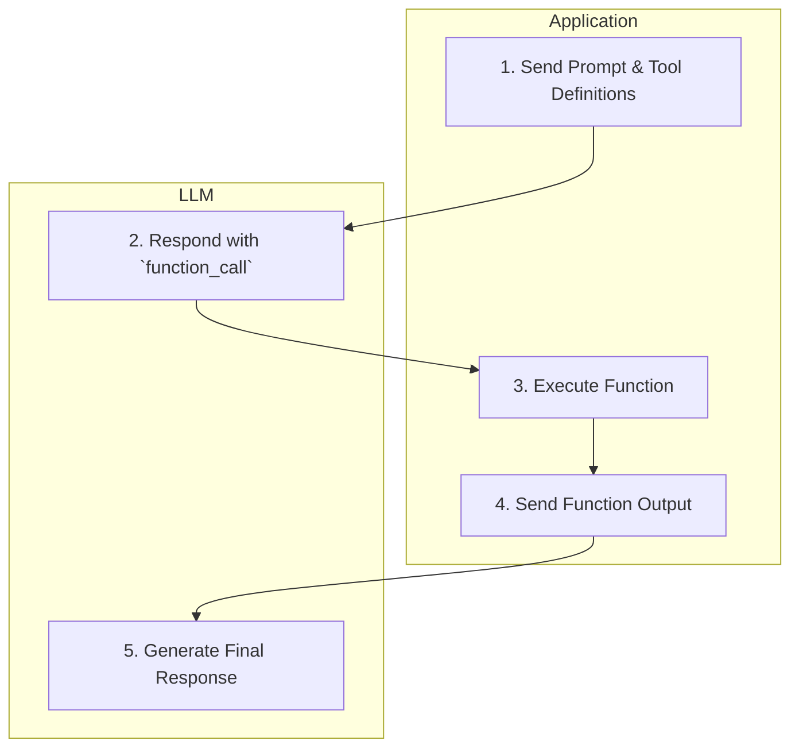
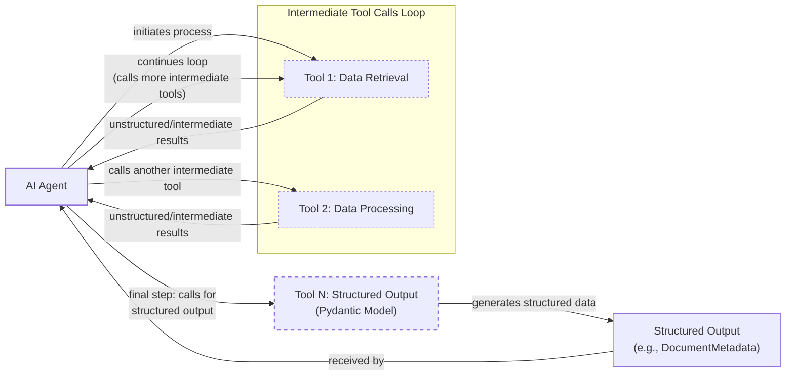
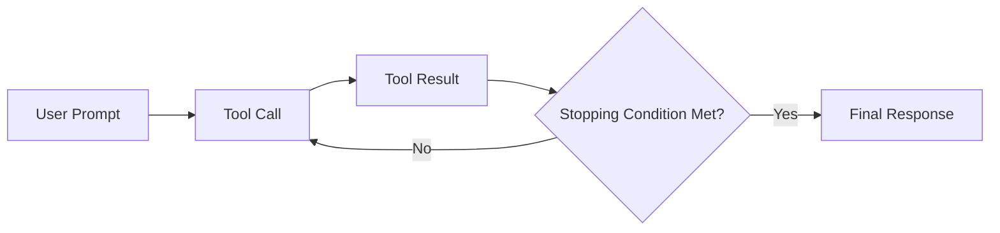

# Lesson 6: Agent Tools and Function Calling

In the previous lessons, we built a foundation in AI Engineering. We distinguished between rule-based LLM workflows and autonomous AI agents, engineered context to feed LLMs the right information, and used structured outputs to get reliable data back. We also explored basic workflow patterns like chaining and routing.

Now, we will give our AI systems "hands and senses" to interact with the world. This lesson is about tools, also known as function calling. Tools are what elevate an LLM from a text generator to an agent that can take action, access real-time data, and connect to external systems. Understanding how tools work under the hood is one of the most critical skills for an AI Engineer. It is the key to building, debugging, and monitoring robust AI applications that go beyond simple chat.

We will start by implementing tool calling from scratch to see the mechanics of how an LLM decides what to do. Then, we will use the native features of modern APIs like Gemini to build production-ready implementations. We will also cover using Pydantic models for on-demand structured outputs, running tools in loops for multi-step tasks, and finally, survey the most common tools used in the industry today.

## Understanding why agents need tools

LLMs have a fundamental limitation: they are powerful pattern matchers and text generators, but they are confined to the information in their training data [[16]](https://arxiv.org/html/2507.08034v1). They cannot, by themselves, browse the internet, check your calendar, or query a database. This is where tools come in. If the LLM is the brain of an AI agent, then tools are its hands and senses, allowing it to perceive and act in the world beyond its pre-trained knowledge [[5]](https://www.deeplearning.ai/the-batch/agentic-design-patterns-part-3-tool-use/).

Tools are the bridge between the LLM’s internal reasoning and the external world. They are essentially functions that the LLM can ask our application to execute. With this capability, an LLM transforms into an AI agent that can perform a wide range of tasks [[10]](https://blogs.oracle.com/developers/what-is-the-ai-agent-loop-the-core-architecture-behind-autonomous-ai-systems).
Image 1: An AI agent's core components, showing the LLM interacting with Planning, Memory, and Tools. (Source [swirl-ai.com](https://www.newsletter.swirlai.com/p/building-ai-agents-from-scratch-part))

As shown in Image 1, tools are a core component of any agent. Some of the most popular tools that power modern AI agents include:
-   **Accessing real-time information** through APIs for weather, news, or stock prices [[19]](https://lnu.diva-portal.org/smash/get/diva2:1801354/FULLTEXT01.pdf). This allows an agent to answer questions about current events, which would be impossible with only its static training data.
-   **Interacting with external databases** or other storage solutions. Using "text-to-SQL" tools, an agent can translate a user's natural language question into a SQL query, execute it against a PostgreSQL database or a Snowflake data warehouse, and return the results [[13]](https://promethium.ai/guides/text-to-sql-basics-benefits/).
-   **Accessing an agent's long-term memory** to recall information from past conversations or documents stored in a vector database, enabling personalized and context-aware interactions.
-   **Executing code** in languages like Python. This is invaluable for performing precise calculations, manipulating data with libraries like Pandas, or generating statistics—tasks that LLMs often struggle with on their own [[16]](https://arxiv.org/html/2507.08034v1), [[18]](https://medium.com/@anicomanesh/how-llm-reasoning-powers-the-agentic-ai-revolution-cbefd10ebf3f).

By giving an LLM access to these tools, we empower it to break free from its static knowledge and engage with the dynamic, real-time world.

## Implementing tool calls from scratch

The best way to understand how an LLM uses tools is to build the mechanism from scratch. We will provide the LLM with a list of available tools and let it decide which one to use and with what arguments. The high-level process, illustrated in Image 2, follows a simple 5-step flow: our application sends a request, the LLM decides to call a tool, our application executes it, sends the result back, and the LLM formulates the final answer.


Image 2: A flowchart illustrating the 5-step process of tool calling between an Application and an LLM.

Let's implement a simple example where we mock searching for a document on Google Drive and sending its summary to a Discord channel.

<aside>
💡

You can find all the code for this lesson in the accompanying [GitHub notebook](https://github.com/towardsai/course-ai-agents/blob/dev/lessons/06_tools/notebook.ipynb).

</aside>

### Defining and Mocking Tools

First, we set up our environment by initializing the Gemini client and defining our model and a mock document. We will use `gemini-2.5-flash`, which is fast and cost-effective for our examples.

```python
import json
from typing import Any
from google import genai
from google.genai import types
from pydantic import BaseModel, Field

# Assumes GOOGLE_API_KEY is set as an environment variable
client = genai.Client()
MODEL_ID = "gemini-2.5-flash"

DOCUMENT = """
# Q3 2023 Financial Performance Analysis

The Q3 earnings report shows a 20% increase in revenue and a 15% growth in user engagement, 
beating market expectations...
"""
```

Next, we define three mock Python functions to simulate our tools. The function signature and docstrings are what the LLM will use to understand each tool's purpose.

```python
def search_google_drive(query: str) -> dict:
    """
    Searches for a file on Google Drive and returns its content or a summary.

    Args:
        query (str): The search query to find the file, e.g., 'Q3 earnings report'.

    Returns:
        dict: A dictionary representing the search results...
    """
    return {
        "files": [
            {
                "name": "Q3_Earnings_Report_2024.pdf",
                "id": "file12345",
                "content": DOCUMENT,
            }
        ]
    }

def send_discord_message(channel_id: str, message: str) -> dict:
    """
    Sends a message to a specific Discord channel.

    Args:
        channel_id (str): The ID of the channel to send the message to, e.g., '#finance'.
        message (str): The content of the message to send.

    Returns:
        dict: A dictionary confirming the action, e.g., {"status": "success"}.
    """
    return {
        "status": "success",
        "status_code": 200,
        "channel": channel_id,
        "message_preview": f"{message[:50]}...",
    }

def summarize_financial_report(text: str) -> str:
    """
    Summarizes a financial report.

    Args:
        text (str): The text to summarize.

    Returns:
        str: The summary of the text.
    """
    return "The Q3 2023 earnings report shows strong performance across all metrics..."
```

### Creating Tool Schemas

For each tool, we create a schema in JSON format. This schema is the contract that tells the LLM what the tool is called, what it does (`description`), and what inputs it needs (`parameters`). This is an industry-standard approach used by APIs from OpenAI, Google, and Anthropic [[23]](https://tetrate.io/learn/ai/llm-output-parsing-structured-generation), [[57]](https://myengineeringpath.dev/tools/gemini-guide/).

```python
search_google_drive_schema = {
    "name": "search_google_drive",
    "description": "Searches for a file on Google Drive and returns its content or a summary.",
    "parameters": {
        "type": "object",
        "properties": {
            "query": {
                "type": "string",
                "description": "The search query to find the file, e.g., 'Q3 earnings report'.",
            }
        },
        "required": ["query"],
    },
}

send_discord_message_schema = {
    "name": "send_discord_message",
    "description": "Sends a message to a specific Discord channel.",
    "parameters": {
        "type": "object",
        "properties": {
            "channel_id": {
                "type": "string",
                "description": "The ID of the channel to send the message to, e.g., '#finance'.",
            },
            "message": {
                "type": "string",
                "description": "The content of the message to send.",
            },
        },
        "required": ["channel_id", "message"],
    },
}

summarize_financial_report_schema = {
    "name": "summarize_financial_report",
    "description": "Summarizes a financial report.",
    "parameters": {
        "type": "object",
        "properties": {"text": {"type": "string", "description": "The text to summarize."}},
        "required": ["text"],
    },
}
```

We then aggregate these tools and their schemas into registries for easy access.

```python
TOOLS = {
    "search_google_drive": {"handler": search_google_drive, "declaration": search_google_drive_schema},
    "send_discord_message": {"handler": send_discord_message, "declaration": send_discord_message_schema},
    "summarize_financial_report": {"handler": summarize_financial_report, "declaration": summarize_financial_report_schema},
}
TOOLS_BY_NAME = {tool_name: tool["handler"] for tool_name, tool in TOOLS.items()}
TOOLS_SCHEMA = [tool["declaration"] for tool in TOOLS.values()]
```

The `TOOLS_BY_NAME` mapping gives us quick access to the Python functions, while `TOOLS_SCHEMA` is the list of JSON schemas we will pass to the LLM.

### Instructing the LLM with a System Prompt

Next, we create a system prompt to instruct the LLM on how to use these tools. This prompt includes guidelines on when to use tools, how to select them, and the exact format for requesting a tool call. This is a critical piece of engineering, as the clarity of these instructions directly impacts the agent's reliability.

```python
TOOL_CALLING_SYSTEM_PROMPT = """
You are a helpful AI assistant with access to tools that enable you to take actions and retrieve information to better 
assist users.

## Tool Usage Guidelines
...
## Tool Call Format
When you need to use a tool, output ONLY the tool call in this exact format:

```tool_call
{{"name": "tool_name", "args": {{"param1": "value1", "param2": "value2"}}}}
```
...
## Available Tools
<tool_definitions>
{tools}
</tool_definitions>
...
"""
```

The LLM uses the `description` field from the tool schemas to decide which tool is most appropriate for a user's query. This is why clear and distinguishing descriptions are critical for building reliable agents [[32]](https://www.anthropic.com/research/building-effective-agents). If you have two tools with vague descriptions like "search documents" and "search files," the LLM will get confused. Explicit descriptions like "search documents on Google Drive" and "search files on the local disk" prevent this ambiguity [[51]](https://mbrenndoerfer.com/writing/function-calling-llm-structured-tools). This becomes even more important as you scale to dozens or hundreds of tools per agent [[52]](https://medium.com/@abhaychougule0907/underlying-factors-behind-inconsistency-in-llm-responses-with-multi-tool-calling-628ce7b4de76). Once a tool is selected, the LLM generates the function name and arguments as a structured output, like JSON. This capability is not magic; LLMs are specifically trained via instruction fine-tuning to interpret these schemas and produce valid tool call outputs [[51]](https://mbrenndoerfer.com/writing/function-calling-llm-structured-tools).

### Making the First Tool Call

Let's test it. We send a user prompt along with our system prompt to the model.

```python
USER_PROMPT = "Can you help me find the latest quarterly report and share key insights with the team?"
messages = [TOOL_CALLING_SYSTEM_PROMPT.format(tools=str(TOOLS_SCHEMA)), USER_PROMPT]

response = client.models.generate_content(
    model=MODEL_ID,
    contents=messages,
)
```

The LLM correctly identifies the `search_google_drive` tool and generates the required arguments.
It outputs:
```text
```tool_call
{"name": "search_google_drive", "args": {"query": "latest quarterly report"}}
```
```

With a more complex prompt, the LLM still correctly identifies the first step.
```python
USER_PROMPT = """
Please find the Q3 earnings report on Google Drive and send a summary of it to 
the #finance channel on Discord.
"""
messages = [TOOL_CALLING_SYSTEM_PROMPT.format(tools=str(TOOLS_SCHEMA)), USER_PROMPT]

response = client.models.generate_content(
    model=MODEL_ID,
    contents=messages,
)
```
It outputs:
```text
```tool_call
{"name": "search_google_drive", "args": {"query": "Q3 earnings report"}}
```
```

### Executing the Tool and Interpreting the Result

Now, we need to parse this response and execute the function. We start by extracting the JSON string from the Markdown block.

```python
def extract_tool_call(response_text: str) -> str:
    """Extracts the tool call from the response text."""
    return response_text.split("```tool_call")[1].split("```")[0].strip()

tool_call_str = extract_tool_call(response.text)
tool_call = json.loads(tool_call_str)
```

Next, we retrieve the corresponding Python function from our `TOOLS_BY_NAME` registry and execute it with the arguments provided by the LLM.

```python
tool_handler = TOOLS_BY_NAME[tool_call["name"]]
tool_result = tool_handler(**tool_call["args"])
```

We can wrap these steps in a single helper function for convenience. This function encapsulates the logic of parsing the LLM's response and dispatching the call to the correct tool handler.

```python
def call_tool(response_text: str, tools_by_name: dict) -> Any:
    """Call a tool based on the response from the LLM."""
    tool_call_str = extract_tool_call(response_text)
    tool_call = json.loads(tool_call_str)
    tool_name = tool_call["name"]
    tool_args = tool_call["args"]
    tool = tools_by_name[tool_name]
    return tool(**tool_args)
```

The final step in the loop is to send the tool's result back to the LLM. This allows the model to interpret the information and either generate a final response for the user or decide on the next action to take.

```python
response = client.models.generate_content(
    model=MODEL_ID,
    contents=f"Interpret the tool result: {json.dumps(tool_result, indent=2)}",
)
```
It outputs:
```text
The tool result provides the content of a file named `Q3_Earnings_Report_2024.pdf`.

This document is a **Q3 2023 Financial Performance Analysis** and details exceptionally strong results, significantly beating market expectations.

**Key highlights from the report include:**
*   **Revenue Growth:** A 20% increase in revenue.
*   **User Engagement:** 15% growth in user engagement...
```
This covers the basic concept of tool calling. We have successfully implemented the entire flow from scratch.

## Implementing a tool calling framework from scratch

Manually defining a JSON schema for every function is tedious and error-prone. Production frameworks like LangGraph automate this by using a `@tool` decorator [[27]](https://strandsagents.com/docs/user-guide/concepts/tools/custom-tools/). This decorator inspects a function's signature, type hints, and docstring to generate the schema automatically. This approach follows the Don't Repeat Yourself (DRY) principle by creating a single source of truth for the tool's definition and its implementation, which reduces redundancy and improves maintainability [[28]](https://pydantic.dev/docs/ai/tools-toolsets/tools/).

### Automating Schema Generation with a @tool Decorator

In Python, a decorator is a function that takes another function as an argument and extends its behavior without explicitly modifying it. It is a powerful feature for adding functionality like logging, timing, or, in our case, schema generation. The `@` syntax is just a more readable way of applying a decorator. For example, writing `@tool` above a function is equivalent to `my_function = tool(my_function)`. This allows us to wrap our functions cleanly and build a reusable framework.

A decorator is a "higher-order function"—a function that returns another function. This wrapper function can execute code before and after the original function runs. In our case, the decorator will inspect the original function's metadata (like its name, parameters, and docstring) to build a schema, then wrap the function in a `ToolFunction` class that stores both the schema and the original callable function. This lets us treat any decorated function as a self-describing tool.

Let's build a simple version of this framework.

### Building the Decorator

We start by defining a `ToolFunction` class to wrap our function and its generated schema. This class will hold both the executable function and its machine-readable description.

```python
from inspect import Parameter, signature
from typing import Any, Callable, Dict, Optional

class ToolFunction:
    def __init__(self, func: Callable, schema: Dict[str, Any]) -> None:
        self.func = func
        self.schema = schema
        self.__name__ = func.__name__
        self.__doc__ = func.__doc__

    def __call__(self, *args: Any, **kwargs: Any) -> Any:
        return self.func(*args, **kwargs)
```

Next, we implement the `@tool` decorator. It inspects the decorated function's signature and docstring to build the JSON schema. This process involves extracting parameter names, determining if they are required, and using the function's docstring as the tool's description.

```python
def tool(description: Optional[str] = None) -> Callable[[Callable], ToolFunction]:
    """A decorator that creates a tool schema from a function."""
    def decorator(func: Callable) -> ToolFunction:
        sig = signature(func)
        properties = {}
        required = []

        for param_name, param in sig.parameters.items():
            if param_name == "self":
                continue
            
            param_schema = {
                "type": "string",  # Simplified for example
                "description": f"The {param_name} parameter",
            }
            if param.default == Parameter.empty:
                required.append(param_name)
            properties[param_name] = param_schema

        schema = {
            "name": func.__name__,
            "description": description or func.__doc__ or f"Executes the {func.__name__} function.",
            "parameters": {
                "type": "object",
                "properties": properties,
                "required": required,
            },
        }
        return ToolFunction(func, schema)
    return decorator
```

### Using the Decorator in Practice

We can now redefine our tools using this decorator. The code is much cleaner as the schemas are generated automatically.

```python
@tool()
def search_google_drive_example(query: str) -> dict:
    """Search for files in Google Drive."""
    return {"files": ["Q3 earnings report"]}

@tool()
def send_discord_message_example(channel_id: str, message: str) -> dict:
    """Send a message to a Discord channel."""
    return {"message": "Message sent successfully"}

@tool()
def summarize_financial_report_example(text: str) -> str:
    """Summarize the contents of a financial report."""
    return "Financial report summarized successfully"

tools = [
    search_google_drive_example,
    send_discord_message_example,
    summarize_financial_report_example,
]
```

The decorated function is now a `ToolFunction` object containing the schema and the original handler. We can prepare the registries and call the LLM as before.

```python
tools_by_name = {tool.schema["name"]: tool.func for tool in tools}
tools_schema = [tool.schema for tool in tools]

USER_PROMPT = """
Please find the Q3 earnings report on Google Drive and send a summary of it to 
the #finance channel on Discord.
"""
messages = [TOOL_CALLING_SYSTEM_PROMPT.format(tools=str(tools_schema)), USER_PROMPT]

response = client.models.generate_content(
    model=MODEL_ID,
    contents=messages,
)
```
It outputs:
```text
```tool_call
{"name": "search_google_drive_example", "args": {"query": "Q3 earnings report"}}
```
```

The execution step works exactly the same, using our `call_tool` helper.

```python
call_tool(response.text, tools_by_name=tools_by_name)
```
It outputs:
```json
{
  "files": [
    "Q3 earnings report"
  ]
}
```
We have built a small, reusable tool-calling framework similar to what modern agentic libraries provide under the hood.

## Implementing production-level tool calls with Gemini

While building from scratch provides a great understanding, in production, we leverage the native tool-calling interfaces of APIs like Gemini or OpenAI. This is simpler, more robust, and more efficient, as the provider optimizes the process for their specific models [[3]](https://ai.google.dev/gemini-api/docs/function-calling). Providers fine-tune their models to respond to a specific tool-calling format, and by using their native SDK, you ensure you are using the most up-to-date and optimized method. This also makes your code more maintainable, as the SDK is updated by the provider whenever the underlying models or API specifications change.

Using a native SDK is more robust because the provider handles the complex prompt engineering required to guide the model. They can optimize the internal prompts for each specific model version, ensuring better performance and reliability than a one-size-fits-all manual prompt. This abstraction allows you to focus on your application logic rather than the low-level details of tool-use prompting [[54]](https://www.decodingai.com/p/tool-calling-from-scratch-to-production).

Let's see how to achieve the same result using Gemini's native capabilities.

1. Instead of a large system prompt, we define a `GenerateContentConfig` object and pass our tool schemas to it. We can also set the `mode` to `"ANY"` to force the model to call a function.
    ```python
    tools = [
        types.Tool(
            function_declarations=[
                types.FunctionDeclaration(**search_google_drive_schema),
                types.FunctionDeclaration(**send_discord_message_schema),
            ]
        )
    ]
    config = types.GenerateContentConfig(
        tools=tools,
        tool_config=types.ToolConfig(function_calling_config=types.FunctionCallingConfig(mode="ANY")),
    )
    ```

2. We can now call the model with just the user prompt. The Gemini API handles the complex instructions internally.
    ```python
    USER_PROMPT = """
    Please find the Q3 earnings report on Google Drive and send a summary of it to 
    the #finance channel on Discord.
    """
    response = client.models.generate_content(
        model=MODEL_ID,
        contents=USER_PROMPT,
        config=config,
    )
    ```

3. To simplify even further, the `google-genai` SDK can automatically generate schemas from Python function signatures, just like our decorator [[2]](https://www.philschmid.de/gemini-function-calling). We can pass our functions directly to the `GenerateContentConfig` object.
    ```python
    config = types.GenerateContentConfig(
        tools=[search_google_drive, send_discord_message],
        tool_config=types.ToolConfig(function_calling_config=types.FunctionCallingConfig(mode="ANY")),
    )
    
    response = client.models.generate_content(
        model=MODEL_ID,
        contents=USER_PROMPT,
        config=config,
    )
    ```

4. The response contains a `function_call` object, which is a structured object, not a JSON string.
    ```python
    response_message_part = response.candidates[0].content.parts[0]
    function_call = response_message_part.function_call
    ```
    It outputs:
    ```text
    FunctionCall(id=None, args={'query': 'Q3 earnings report'}, name='search_google_drive')
    ```

5. We can create a simplified `call_tool` function to execute the call.
    ```python
    def call_tool(function_call) -> any:
        tool_name = function_call.name
        tool_args = {key: value for key, value in function_call.args.items()}
        tool_handler = TOOLS_BY_NAME[tool_name]
        return tool_handler(**tool_args)

    tool_result = call_tool(function_call)
    ```
    By leveraging the native SDK, we reduced dozens of lines of code to just a few, creating a more robust and maintainable system. Other popular APIs from OpenAI and Anthropic follow a similar logic, making these concepts easily transferable. While the specific class names and configuration objects may differ, the core pattern of defining tools with schemas, letting the model decide when to call them, executing the function, and returning the result is consistent across the industry [[56]](https://www.getorchestra.io/guides/llm-providers-gen-ai-platforms-compared), [[58]](https://futuresearch.ai/blog/llm-provider-quirks/).

## Using Pydantic models as tools for on-demand structured outputs

In Lesson 4, we learned how to use Pydantic for structured outputs. We can combine that pattern with tool calling to create a mechanism for on-demand data extraction within an agentic workflow. This pattern is particularly useful when an agent needs to perform several intermediate steps before producing a final, structured result. The agent can use other tools for its internal steps and then "call" the Pydantic model as its final action to ensure the output is in a clean, validated format for downstream processing [[6]](https://pydantic.dev/docs/ai/core-concepts/output/).

This is a reliable and effective pattern because it separates the agent's reasoning process from the final data formatting. The agent can use tools that return unstructured text, which is easier for an LLM to interpret during intermediate steps. This avoids forcing the model to "think" in JSON for every single step, which can be inefficient and unnatural for a language model. When the reasoning is complete, it calls the Pydantic tool to package the final answer into a predictable structure that your application code can easily consume.

Image 3 illustrates this flow, where an agent performs several intermediate tool calls before finally invoking a Pydantic-based tool to generate the structured output.


Image 3: A flowchart illustrating an AI agent calling multiple tools in a loop, with the final step involving a tool call for structured outputs using a Pydantic model.

Let's see how to implement this.

1. We define our `DocumentMetadata` Pydantic model, just as we did in Lesson 4.
    ```python
    class DocumentMetadata(BaseModel):
        """A class to hold structured metadata for a document."""
        summary: str = Field(description="A concise, 1-2 sentence summary of the document.")
        tags: list[str] = Field(description="A list of 3-5 high-level tags relevant to the document.")
        keywords: list[str] = Field(description="A list of specific keywords or concepts mentioned.")
        quarter: str = Field(description="The quarter of the financial year described in the document (e.g., Q3 2023).")
        growth_rate: str = Field(description="The growth rate of the company described in the document (e.g., 10%).")
    ```

2. We create a tool declaration for a function named `extract_metadata`. The key step here is using `DocumentMetadata.model_json_schema()` as the `parameters` for this function. This tells the LLM that the arguments for this "function" must conform to our Pydantic model's schema.
    ```python
    extraction_tool = types.Tool(
        function_declarations=[
            types.FunctionDeclaration(
                name="extract_metadata",
                description="Extracts structured metadata from a financial document.",
                parameters=DocumentMetadata.model_json_schema(),
            )
        ]
    )
    config = types.GenerateContentConfig(
        tools=[extraction_tool],
        tool_config=types.ToolConfig(function_calling_config=types.FunctionCallingConfig(mode="ANY")),
    )
    ```

3. We prompt the model to analyze the document and extract the metadata.
    ```python
    prompt = f"""
    Please analyze the following document and extract its metadata.
    Document:
    --- 
    {DOCUMENT}
    --- 
    """
    response = client.models.generate_content(model=MODEL_ID, contents=prompt, config=config)
    ```

4. The model responds with a call to our `extract_metadata` function, and its arguments are a JSON object matching the `DocumentMetadata` schema.
    ```python
    function_call = response.candidates[0].content.parts[0].function_call
    ```
    It outputs:
    ```text
    Function Name: `extract_metadata`
    Function Arguments: `{
        "growth_rate": "20%",
        "summary": "The Q3 2023 earnings report shows a 20% increase in revenue and 15% growth in user engagement...",
        "quarter": "Q3 2023",
        "keywords": ["Revenue", "User Engagement", ...],
        "tags": ["Financials", "Earnings", ...]
    }`
    ```

5. We can now validate these arguments and parse them directly into our Pydantic model.
    ```python
    try:
        document_metadata = DocumentMetadata(**function_call.args)
        print("Validation successful!")
    except Exception as e:
        print(f"Validation failed: {e}")
    ```
    It outputs:
    ```text
    Validation successful!
    ```
This pattern provides a reliable way to get structured data exactly when you need it in a multi-step agentic process.

## The downsides of running tools in a loop

So far, we have focused on single-turn interactions. However, many tasks require a sequence of actions. This brings us to running tools in a loop, allowing an agent to chain multiple tool calls and decide the next step based on the output of the previous one. This capability is a key step toward building a functional AI agent.

The loop, shown in Image 4, is simple: the agent calls a tool, gets a result, and decides whether to call another tool or generate a final answer. This gives the agent flexibility and adaptability to handle complex, multi-step tasks.


Image 4: A flowchart illustrating a sequential tool calling loop, showing the iterative interaction between an agent and tools until a final response is generated.

Let's implement this loop for our Google Drive and Discord example.

1. We configure our model with all three tools.
    ```python
    tools = [
        types.Tool(
            function_declarations=[
                types.FunctionDeclaration(**search_google_drive_schema),
                types.FunctionDeclaration(**send_discord_message_schema),
                types.FunctionDeclaration(**summarize_financial_report_schema),
            ]
        )
    ]
    config = types.GenerateContentConfig(
        tools=tools,
        tool_config=types.ToolConfig(function_calling_config=types.FunctionCallingConfig(mode="ANY")),
    )
    ```

2. We start with the user's multi-step request and an empty message history.
    ```python
    USER_PROMPT = """
    Please find the Q3 earnings report on Google Drive and send a summary of it to 
    the #finance channel on Discord.
    """
    messages = [USER_PROMPT]
    ```

3. We make the first call to the LLM, which correctly identifies the first step: searching Google Drive.
    ```python
    response = client.models.generate_content(
        model=MODEL_ID,
        contents=messages,
        config=config,
    )
    response_message_part = response.candidates[0].content.parts[0]
    messages.append(response.candidates[0].content)
    ```
    It outputs:
    ```text
    Function Name: `search_google_drive`
    Function Arguments: `{"query": "Q3 earnings report"}`
    ```

4. Now we enter a loop that continues as long as the model requests tool calls. Inside the loop, we execute the tool, append the result to our message history, and call the model again.
    ```python
    max_iterations = 3
    while hasattr(response_message_part, "function_call") and max_iterations > 0:
        tool_result = call_tool(response_message_part.function_call)
    
        function_response_part = types.Part.from_function_response(
            name=response_message_part.function_call.name,
            response={"result": tool_result},
        )
        messages.append(function_response_part)
    
        response = client.models.generate_content(
            model=MODEL_ID,
            contents=messages,
            config=config,
        )
    
        response_message_part = response.candidates[0].content.parts[0]
        messages.append(response.candidates[0].content)
        max_iterations -= 1
    ```
    The loop executes as follows:
    - **Iteration 1:** Calls `search_google_drive`, gets the document. The next LLM call requests `summarize_financial_report`.
    - **Iteration 2:** Calls `summarize_financial_report`, gets the summary. The next LLM call requests `send_discord_message`.
    - **Iteration 3:** Calls `send_discord_message`. The next LLM call does not request a tool, so the loop terminates.

However, this simple sequential loop has significant limitations [[9]](https://myengineeringpath.dev/genai-engineer/agentic-patterns/). This process mirrors the perception-action cycles found in robotics, where an agent observes the environment, acts, and then observes the result before deciding its next move [[39]](https://arxiv.org/pdf/2603.26730). But in our simple loop, the agent doesn't get a chance to "reason" about the observation. It does not allow the LLM to pause and interpret the output of each tool before deciding on the next action. The agent immediately moves to the next function call without "thinking" about what it has learned or whether its initial plan is still valid. This can lead to inefficient tool use or getting stuck in loops if a tool fails or returns unexpected results [[10]](https://blogs.oracle.com/developers/what-is-the-ai-agent-loop-the-core-architecture-behind-autonomous-ai-systems).

One of the most common failure modes in multi-turn conversations is context saturation. As the dialogue history and tool outputs accumulate, they can quickly exhaust even large context windows (e.g., 128K+ tokens), degrading the model's ability to follow instructions. This has led to memory management strategies like caching tool outputs or intelligently pruning the history to preserve context space for the most relevant information [[63]](https://www.emergentmind.com/topics/multi-turn-tool-calling-llms).

For tasks where tools are independent, such as fetching data from multiple sources like Salesforce and Snowflake, we can run them in parallel to reduce latency [[42]](https://airbyte.com/agentic-data/parallel-tool-calls-llm). Instead of the total latency being the sum of all tool execution times, it becomes the time of the slowest tool. Modern LLM APIs support requesting multiple tool calls in a single turn, which our application can then execute concurrently [[41]](https://www.codeant.ai/blogs/parallel-tool-calling). However, for dependent tasks like ours, a sequential approach is necessary.

These limitations motivated the development of more sophisticated agentic patterns like **ReAct** (Reason + Act). ReAct explicitly interleaves reasoning steps with tool calls, allowing the agent to think through problems more deliberately. We will explore this powerful pattern in detail in Lessons 7 and 8.

## Popular tools used within the industry

To ground this lesson in the real world, let's look at some of the most common categories of tools that AI engineers build and deploy today.

1.  **Knowledge & Memory Access:** These tools connect the agent to external knowledge sources, overcoming the limitations of its training data. This includes querying vector databases for RAG, document stores, or even traditional SQL/NoSQL databases like PostgreSQL and MongoDB through "text-to-SQL" tools that translate natural language into database queries [[13]](https://promethium.ai/guides/text-to-sql-basics-benefits/). These patterns are fundamental to building knowledge-intensive agents, and we will cover them in depth in Lesson 9 (Memory) and Lesson 10 (RAG) [[12]](https://www.ruh.ai/blogs/how-vector-databases-are-rewiring-the-tech-industry). This goes beyond simple retrieval. Some agents use function calls to actively manage memory tiers, moving information between short-term and long-term storage instead of just relying on a large context window [[45]](https://atlan.com/know/agent-memory-architectures/). Others expose memory directly through tools like `remember` and `recall`, giving the agent explicit control over its knowledge base [[47]](https://blog.cloudflare.com/introducing-agent-memory/).

2.  **Web Search & Browsing:** These are some of the most common tools, enabling agents to access up-to-date information from the internet. This category includes tools that interface with search engine APIs (like the Google Search API or Bing Search API) and web scraping tools that can fetch and parse content directly from web pages [[17]](https://mantraideas.com/llm-web-search/). You see these in action in almost every modern chatbot and research agent.

3.  **Code Execution:** A powerful class of tools gives agents the ability to write and execute code, typically in a sandboxed environment. A Python interpreter, for example, allows an agent to perform precise calculations, manipulate data with libraries like Pandas, or even create visualizations with Matplotlib [[18]](https://medium.com/@anicomanesh/how-llm-reasoning-powers-the-agentic-ai-revolution-cbefd10ebf3f). While Python is the most common, this pattern can be adapted for other languages like JavaScript.

4.  **Other Popular Tools:** The possibilities are nearly endless. Enterprise AI applications frequently use tools to interact with external APIs for calendars (Google Calendar API), email, and project management systems (Slack API). Productivity apps might use tools for file system operations like reading and writing files. Essentially, any action that can be scripted can be turned into a tool for an AI agent [[20]](https://medium.com/@yugalnandurkar5/llm-engineering-part-i-fa48d4307d26).

## Conclusion

Tool calling is a foundational concept in AI Engineering. It is what transforms a passive text generator into an active agent capable of interacting with its environment. By deeply understanding how to define, call, and orchestrate tools—from scratch and with modern APIs—you gain the ability to build, monitor, and debug reliable and effective AI applications.

In this lesson, we have seen the entire lifecycle of a tool call. We started by manually crafting schemas and prompts, built a small framework to automate the process, and finally, leveraged the native power of the Gemini API. We also saw how these tool calls can be chained together and recognized the limitations of simple loops. This naturally leads us to our next topic: more advanced agentic reasoning. In Lesson 7, we will explore the theory behind planning and the ReAct pattern, which gives agents the ability to "think" between actions.

## References

- [1]  [AI Agents Course - Lesson 6 Notebook](https://github.com/towardsai/course-ai-agents/blob/dev/lessons/06_tools/notebook.ipynb)
- [2]  [Function Calling Guide: Google DeepMind Gemini 2.0 Flash](https://www.philschmid.de/gemini-function-calling)
- [3]  [Function calling with the Gemini API](https://ai.google.dev/gemini-api/docs/function-calling)
- [4]  [Tool Calling Agent From Scratch](https://www.youtube.com/watch?v=ApoDzZP8_ck)
- [5]  [Agentic Design Patterns Part 3, Tool Use](https://www.deeplearning.ai/the-batch/agentic-design-patterns-part-3-tool-use/)
- [6]  [Output - Pydantic AI](https://pydantic.dev/docs/ai/core-concepts/output/)
- [7]  [Function Tools - Pydantic AI](https://pydantic.dev/docs/ai/tools-toolsets/tools/)
- [8]  [What is Tool Calling? Connecting LLMs to Your Data](https://www.youtube.com/watch?v=h8gMhXYAv1k)
- [9]  [Agentic Design Patterns — Visual Architecture Guide](https://myengineeringpath.dev/genai-engineer/agentic-patterns/)
- [10]  [What Is the AI Agent Loop? The Core Architecture Behind Autonomous AI Systems](https://blogs.oracle.com/developers/what-is-the-ai-agent-loop-the-core-architecture-behind-autonomous-ai-systems)
- [11]  [ReAct vs Plan-and-Execute: A Practical Comparison of LLM Agent Patterns](https://dev.to/jamesli/react-vs-plan-and-execute-a-practical-comparison-of-llm-agent-patterns-4gh9)
- [12]  [How Vector Databases Are Rewiring the Tech Industry](https://www.ruh.ai/blogs/how-vector-databases-are-rewiring-the-tech-industry)
- [13]  [Text-to-SQL: What It Is, How It Works, and Why It Matters in 2025](https://promethium.ai/guides/text-to-sql-basics-benefits/)
- [14]  [Top 10 Open-Source Vector Databases](https://www.instaclustr.com/education/vector-database/top-10-open-source-vector-databases/)
- [15]  [Building AI Agents from scratch - Part 1: Tool use](https://www.newsletter.swirlai.com/p/building-ai-agents-from-scratch-part)
- [16]  [A Survey on Large Language Model based Autonomous Agents](https://arxiv.org/html/2507.08034v1)
- [17]  [How LLMs Use Web Search to Answer Your Questions](https://mantraideas.com/llm-web-search/)
- [18]  [How LLM Reasoning Powers the Agentic AI Revolution](https://medium.com/@anicomanesh/how-llm-reasoning-powers-the-agentic-ai-revolution-cbefd10ebf3f)
- [19]  [Extending Large Language Models with External Tools](https://lnu.diva-portal.org/smash/get/diva2:1801354/FULLTEXT01.pdf)
- [20]  [LLM Engineering Part I](https://medium.com/@yugalnandurkar5/llm-engineering-part-i-fa48d4307d26)
- [21]  [Prompting best practices for tool use / function calling](https://community.openai.com/t/prompting-best-practices-for-tool-use-function-calling/1123036)
- [22]  [Building Production-Ready LLM Applications: Bulletproof LLM Tool Calling with Advanced JSON Validation and Retry Strategies](https://medium.com/@hariomshahu101/building-production-ready-llm-applications-bulletproof-llm-tool-calling-with-advanced-json-b95ce8889f4e)
- [23]  [LLM Output Parsing and Structured Generation](https://tetrate.io/learn/ai/llm-output-parsing-structured-generation)
- [24]  [Tool Input and Output Schema Design](https://apxml.com/courses/building-advanced-llm-agent-tools/chapter-1-llm-agent-tooling-foundations/tool-input-output-schemas)
- [25]  [Function Calling is a Language Model's Structured Tool](https://mbrenndoerfer.com/writing/function-calling-llm-structured-tools)
- [26]  [Tools - OpenAI Agents](https://openai.github.io/openai-agents-python/tools/)
- [27]  [Custom Tools - Strands](https://strandsagents.com/docs/user-guide/concepts/tools/custom-tools/)
- [28]  [Function Tools - Pydantic AI](https://pydantic.dev/docs/ai/tools-toolsets/tools/)
- [29]  [Tools - LangChain](https://docs.langchain.com/oss/python/langchain/tools)
- [30]  [langchain_core.tools.tool](https://reference.langchain.com/python/langchain-core/tools/convert/tool)
- [31]  [Efficient Tool Use with Chain-of-Abstraction Reasoning](https://arxiv.org/pdf/2401.17464v3)
- [32]  [Building effective agents](https://www.anthropic.com/research/building-effective-agents)
- [33]  [Best Practices to Build LLM Tools in 2025](https://techinfotech.tech.blog/2025/06/09/best-practices-to-build-llm-tools-in-2025/)
- [34]  [Function calling with OpenAI's API](https://platform.openai.com/docs/guides/function-calling)
- [39]  [LLM-Based Embodied Agents for Real-World Tasks](https://arxiv.org/pdf/2603.26730)
- [41]  [Parallel Tool Calling in LLMs](https://www.codeant.ai/blogs/parallel-tool-calling)
- [42]  [Parallel Tool Calls in LLMs](https://airbyte.com/agentic-data/parallel-tool-calls-llm)
- [45]  [Agent Memory Architectures](https://atlan.com/know/agent-memory-architectures/)
- [47]  [Introducing Agent Memory](https://blog.cloudflare.com/introducing-agent-memory/)
- [49]  [Tool Descriptions are Critical for Making Better LLM Tools](https://pub.towardsai.net/tool-descriptions-are-critical-making-better-llm-tools-research-capability-b315851471e7)
- [50]  [Tool Input and Output Schema Design](https://apxml.com/courses/building-advanced-llm-agent-tools/chapter-1-llm-agent-tooling-foundations/tool-input-output-schemas)
- [51]  [Function Calling is a Language Model's Structured Tool](https://mbrenndoerfer.com/writing/function-calling-llm-structured-tools)
- [52]  [Underlying Factors Behind Inconsistency in LLM Responses with Multi-Tool Calling](https://medium.com/@abhaychougule0907/underlying-factors-behind-inconsistency-in-llm-responses-with-multi-tool-calling-628ce7b4de76)
- [53]  [What Makes a Good Tool? A Study on the Impact of Tool Description on Large Language Models' Tool Usage](https://arxiv.org/html/2505.18135v2)
- [54]  [Tool Calling: From Scratch to Production](https://www.decodingai.com/p/tool-calling-from-scratch-to-production)
- [55]  [Overview of Common LLM APIs](https://apxml.com/courses/prompt-engineering-llm-application-development/chapter-4-interacting-with-llm-apis/overview-common-llm-apis)
- [56]  [LLM Providers & Gen AI Platforms Compared](https://www.getorchestra.io/guides/llm-providers-gen-ai-platforms-compared)
- [57]  [Google Gemini: The Complete Guide](https://myengineeringpath.dev/tools/gemini-guide/)
- [58]  [LLM API Differences That Break Your Code](https://futuresearch.ai/blog/llm-provider-quirks/)
- [59]  [Response schema from Pydantic](https://discuss.ai.google.dev/t/response-schema-from-pydantic/50028)
- [60]  [Multi-Agent Applications - Pydantic AI](https://pydantic.dev/docs/ai/guides/multi-agent-applications/)
- [61]  [Playing with Gemini function calling](glaforge.dev/posts/2023/12/22/gemini-function-calling/)
- [62]  [Building Production-Ready LLM Applications: Bulletproof LLM Tool Calling with Advanced JSON Validation and Retry Strategies](https://medium.com/@hariomshahu101/building-production-ready-llm-applications-bulletproof-llm-tool-calling-with-advanced-json-b95ce8889f4e)
- [63]  [Multi-turn Tool-calling LLMs](https://www.emergentmind.com/topics/multi-turn-tool-calling-llms)