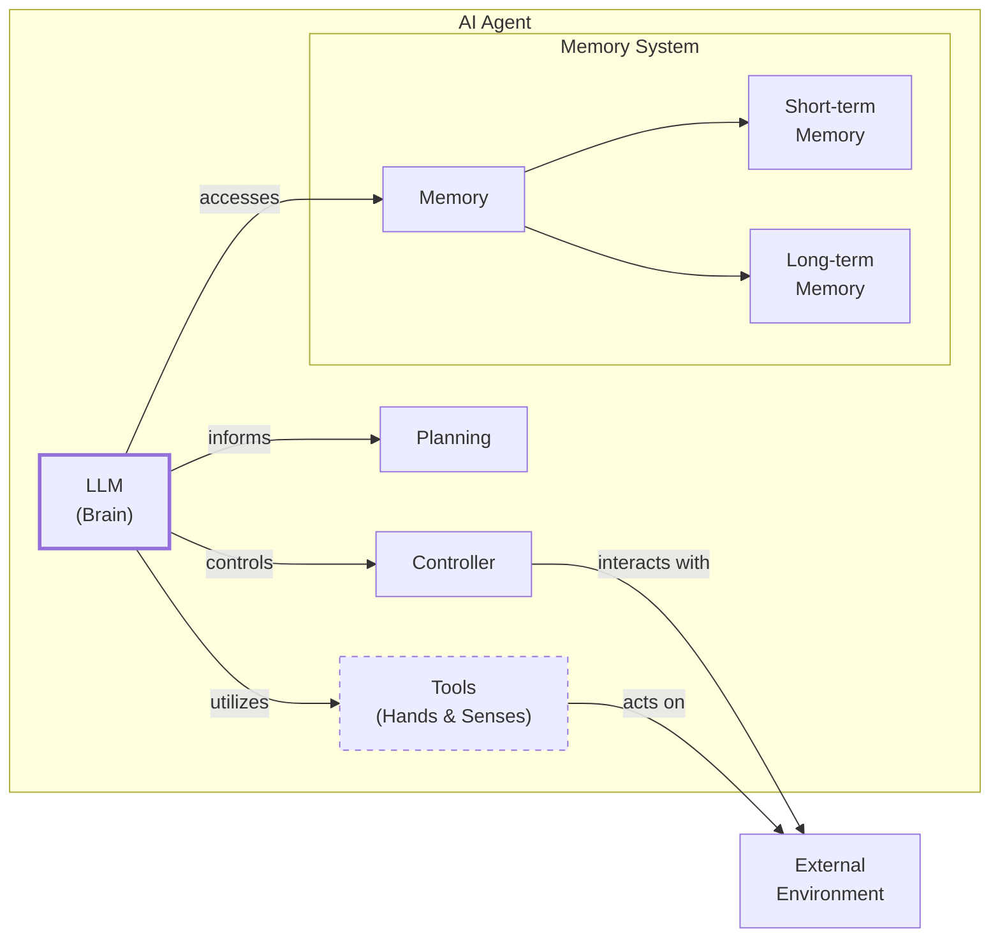
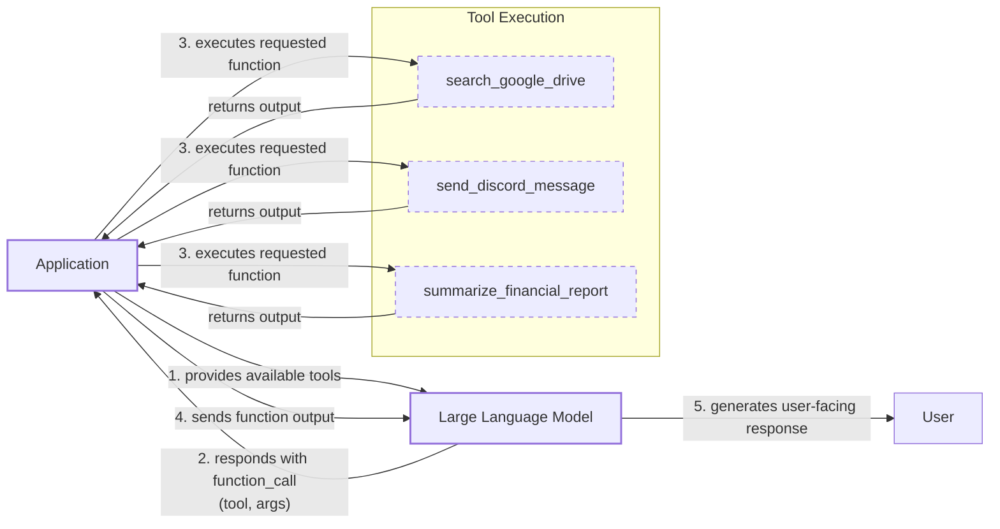
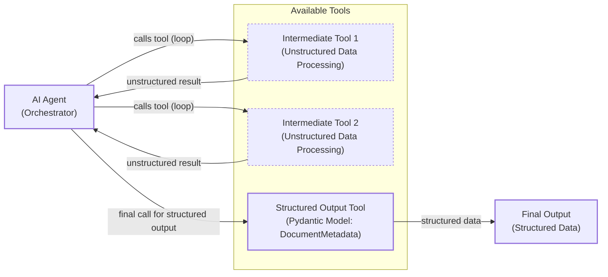
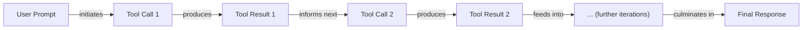

# From Scratch to Production: A Guide to AI Agent Tool Calling

In our previous lessons, we explored the landscape of AI engineering, distinguished between LLM workflows and agents, and delved into context engineering and structured outputs. We have laid the foundation for building intelligent systems. Now, we will give those systems the ability to act.

This lesson focuses on one of the most critical components of any AI agent: tools. Tools, also known as function calling, are what transform an LLM from a simple text generator into an agent that can interact with the external world. By implementing tool calling from scratch, you will understand how an LLM decides which tool to use, generates the correct parameters, and executes actions. This knowledge is essential for any AI engineer looking to build, debug, and monitor production-grade AI applications.

## Understanding Why Agents Need Tools

LLMs have a fundamental limitation: they are powerful pattern matchers and text generators, but they cannot perform actions or access information outside their training data on their own. They live within the confines of their weights. This is where tools come in. Tools are the bridge between an LLM's internal reasoning and the external world, enabling it to interact with its environment and execute specific instructions.

A useful analogy is to think of the LLM as the brain of an agent, while tools are its "hands and senses." They allow the agent to perceive and act in the world beyond its textual interface. This perception-action loop mirrors decision-making cycles in other autonomous systems, like robotics, where an agent must observe its environment, reason about the next step, and execute an action [[40]](https://arxiv.org/pdf/2601.20334), [[43]](https://openaccess.thecvf.com/content/CVPR2025W/MEIS/papers/Chen_Multi-Agent_Systems_for_Robotic_Autonomy_with_LLMs_CVPRW_2025_paper.pdf). With tools, an LLM graduates from being a passive text generator to an active AI agent.


Image 1: A conceptual diagram of an AI agent with the LLM as the brain and tools as hands and senses.

Modern AI agents use a wide array of tools to enhance their capabilities. Some popular examples include:

*   **Accessing real-time information** through APIs for tasks like checking today's weather or fetching the latest news [[19]](https://lnu.diva-portal.org/smash/get/diva2:1801354/FULLTEXT01.pdf).
*   **Interacting with external databases** and storage solutions like PostgreSQL, Snowflake, or S3 data lakes.
*   **Accessing the agent's long-term memory** to recall information beyond the current context window.
*   **Executing code** in languages like Python or JavaScript to perform precise calculations, manipulate data, or create visualizations [[16]](https://arxiv.org/html/2507.08034v1).

## Implementing Tool Calls From Scratch

The best way to understand how tools work is to build them from scratch. This section will guide you through implementing a simple tool-calling mechanism, giving you a clear view of how an LLM discovers, selects, and uses tools.

Our goal is to provide the LLM with a list of available tools and let it decide which one to use, along with the correct arguments, to fulfill a user's request. The high-level process involves five steps:

1.  **App:** You send the LLM a prompt that includes a list of available tools and their definitions.
2.  **LLM:** The model analyzes the prompt and responds with a `function_call` request, specifying the tool to use and the arguments for it.
3.  **App:** Your application parses this request and executes the corresponding function with the provided arguments.
4.  **App:** You send the output from the function back to the LLM.
5.  **LLM:** The model uses the tool's output to generate a final, user-facing response.


Image 2: A flowchart illustrating the 5-step request-execute-respond flow of calling a tool, highlighting interactions between the App and LLM, and tool execution.

Let's implement a simple example where we mock searching for a document on Google Drive and sending its summary to a Discord channel.

1.  First, we set up our environment by importing the necessary libraries, loading our API key, and initializing the Gemini client. We will use the `gemini-2.5-flash` model for its speed and cost-effectiveness. We also define a `DOCUMENT` constant to mock the content of a PDF file.
    ```python
    import json
    from typing import Any
    
    from google import genai
    from google.genai import types
    from pydantic import BaseModel, Field
    
    from lessons.utils import pretty_print
    
    # Load API key from .env file
    from lessons.utils import env
    env.load(required_env_vars=["GOOGLE_API_KEY"])
    
    client = genai.Client()
    
    MODEL_ID = "gemini-2.5-flash"
    
    DOCUMENT = """
    # Q3 2023 Financial Performance Analysis
    
    The Q3 earnings report shows a 20% increase in revenue and a 15% growth in user engagement, 
    beating market expectations. These impressive results reflect our successful product strategy 
    and strong market positioning.
    
    Our core business segments demonstrated remarkable resilience, with digital services leading 
    the growth at 25% year-over-year. The expansion into new markets has proven particularly 
    successful, contributing to 30% of the total revenue increase.
    
    Customer acquisition costs decreased by 10% while retention rates improved to 92%, 
    marking our best performance to date. These metrics, combined with our healthy cash flow 
    position, provide a strong foundation for continued growth into Q4 and beyond.
    """
    ```

2.  Next, we define three mock functions to simulate our tools. To keep the focus on the tool-calling mechanism, these functions return hardcoded responses instead of interacting with real APIs.
    ```python
    def search_google_drive(query: str) -> dict:
        """
        Searches for a file on Google Drive and returns its content or a summary.
    
        Args:
            query (str): The search query to find the file, e.g., 'Q3 earnings report'.
    
        Returns:
            dict: A dictionary representing the search results, including file names and summaries.
        """
        return {
            "files": [
                {
                    "name": "Q3_Earnings_Report_2024.pdf",
                    "id": "file12345",
                    "content": DOCUMENT,
                }
            ]
        }
    ```
    ```python
    def send_discord_message(channel_id: str, message: str) -> dict:
        """
        Sends a message to a specific Discord channel.
    
        Args:
            channel_id (str): The ID of the channel to send the message to, e.g., '#finance'.
            message (str): The content of the message to send.
    
        Returns:
            dict: A dictionary confirming the action, e.g., {"status": "success"}.
        """
        return {
            "status": "success",
            "status_code": 200,
            "channel": channel_id,
            "message_preview": f"{message[:50]}...",
        }
    ```
    ```python
    def summarize_financial_report(text: str) -> str:
        """
        Summarizes a financial report.
    
        Args:
            text (str): The text to summarize.
    
        Returns:
            str: The summary of the text.
        """
        return "The Q3 2023 earnings report shows strong performance across all metrics with 20% revenue growth, 15% user engagement increase, 25% digital services growth, and improved retention rates of 92%."
    ```

3.  For the LLM to understand these tools, we must define their schemas in a machine-readable format, typically JSON Schema. The schema tells the LLM what the tool does (via the `description`), what parameters it needs (`parameters`), their types, and which ones are required. This is the industry standard for modern LLM providers like OpenAI and Gemini [[23]](https://tetrate.io/learn/ai/llm-output-parsing-structured-generation), [[57]](https://myengineeringpath.dev/tools/gemini-guide/).
    ```python
    search_google_drive_schema = {
        "name": "search_google_drive",
        "description": "Searches for a file on Google Drive and returns its content or a summary.",
        "parameters": {
            "type": "object",
            "properties": {
                "query": {
                    "type": "string",
                    "description": "The search query to find the file, e.g., 'Q3 earnings report'.",
                }
            },
            "required": ["query"],
        },
    }
    ```
    ```python
    send_discord_message_schema = {
        "name": "send_discord_message",
        "description": "Sends a message to a specific Discord channel.",
        "parameters": {
            "type": "object",
            "properties": {
                "channel_id": {
                    "type": "string",
                    "description": "The ID of the channel to send the message to, e.g., '#finance'.",
                },
                "message": {
                    "type": "string",
                    "description": "The content of the message to send.",
                },
            },
            "required": ["channel_id", "message"],
        },
    }
    ```
    ```python
    summarize_financial_report_schema = {
        "name": "summarize_financial_report",
        "description": "Summarizes a financial report.",
        "parameters": {
            "type": "object",
            "properties": {
                "text": {
                    "type": "string",
                    "description": "The text to summarize.",
                },
            },
            "required": ["text"],
        },
    }
    ```

4.  We then create a tool registry to map tool names to their corresponding functions and schemas. This makes it easy to look up and execute the correct tool later.
    ```python
    TOOLS = {
        "search_google_drive": {
            "handler": search_google_drive,
            "declaration": search_google_drive_schema,
        },
        "send_discord_message": {
            "handler": send_discord_message,
            "declaration": send_discord_message_schema,
        },
        "summarize_financial_report": {
            "handler": summarize_financial_report,
            "declaration": summarize_financial_report_schema,
        },
    }
    TOOLS_BY_NAME = {tool_name: tool["handler"] for tool_name, tool in TOOLS.items()}
    TOOLS_SCHEMA = [tool["declaration"] for tool in TOOLS.values()]
    ```
    The `TOOLS_BY_NAME` mapping looks like this:
    ```text
    Tool name: search_google_drive
    Tool handler: <function search_google_drive at 0x104c7df80>
    ---------------------------------------------------------------------------
    Tool name: send_discord_message
    Tool handler: <function send_discord_message at 0x104c7de40>
    ---------------------------------------------------------------------------
    Tool name: summarize_financial_report
    Tool handler: <function summarize_financial_report at 0x1274f5c60>
    ---------------------------------------------------------------------------
    ```
    And here is the schema for our `search_google_drive` tool:
    ```json
    {
      "name": "search_google_drive",
      "description": "Searches for a file on Google Drive and returns its content or a summary.",
      "parameters": {
        "type": "object",
        "properties": {
          "query": {
            "type": "string",
            "description": "The search query to find the file, e.g., 'Q3 earnings report'."
          }
        },
        "required": [
          "query"
        ]
      }
    }
    ```

5.  Now, we need a system prompt to instruct the LLM on how to use these tools. This prompt defines the rules for tool selection, the expected output format for a tool call, and provides the list of available tools enclosed in XML tags.
    ```python
    TOOL_CALLING_SYSTEM_PROMPT = """
    You are a helpful AI assistant with access to tools that enable you to take actions and retrieve information to better 
    assist users.
    
    ## Tool Usage Guidelines
    
    **When to use tools:**
    - When you need information that is not in your training data
    - When you need to perform actions in external systems and environments
    - When you need real-time, dynamic, or user-specific data
    - When computational operations are required
    
    **Tool selection:**
    - Choose the most appropriate tool based on the user's specific request
    - If multiple tools could work, select the one that most directly addresses the need
    - Consider the order of operations for multi-step tasks
    
    **Parameter requirements:**
    - Provide all required parameters with accurate values
    - Use the parameter descriptions to understand expected formats and constraints
    - Ensure data types match the tool's requirements (strings, numbers, booleans, arrays)
    
    ## Tool Call Format
    
    When you need to use a tool, output ONLY the tool call in this exact format:
    
    <tool_call>
    {{"name": "tool_name", "args": {{"param1": "value1", "param2": "value2"}}}}
    </tool_call>
    
    **Critical formatting rules:**
    - Use double quotes for all JSON strings
    - Ensure the JSON is valid and properly escaped
    - Include ALL required parameters
    - Use correct data types as specified in the tool definition
    - Do not include any additional text or explanation in the tool call
    
    ## Response Behavior
    
    - If no tools are needed, respond directly to the user with helpful information
    - If tools are needed, make the tool call first, then provide context about what you're doing
    - After receiving tool results, provide a clear, user-friendly explanation of the outcome
    - If a tool call fails, explain the issue and suggest alternatives when possible
    
    ## Available Tools
    
    <tool_definitions>
    {tools}
    </tool_definitions>
    
    Remember: Your goal is to be maximally helpful to the user. Use tools when they add value, but don't use them unnecessarily. Always prioritize accuracy and user experience.
    """
    ```

6.  The LLM's decision-making process for tool calling relies heavily on the quality of the tool schemas and system prompt. Based on the `description` field in the schema, the model *decides* if a tool is appropriate for the user's query. This is why clear and distinct tool descriptions are critical. Ambiguous descriptions like "search documents" and "search files" can confuse the LLM. Explicit descriptions like "search documents on Google Drive" and "search files on the local disk" prevent this confusion [[51]](https://mbrenndoerfer.com/writing/function-calling-llm-structured-tools). This becomes even more important as you scale to dozens or hundreds of tools for a single agent [[52]](https://medium.com/@abhaychougule0907/underlying-factors-behind-inconsistency-in-llm-responses-with-multi-tool-calling-628ce7b4de76). Once a tool is selected, the LLM *generates* the function name and arguments as a structured output, like JSON. This capability is a result of instruction fine-tuning, where models are specifically trained to interpret schemas and produce structured tool calls [[23]](https://tetrate.io/learn/ai/llm-output-parsing-structured-generation).

7.  Let's test our setup. We send a user prompt along with our system prompt to the model.
    ```python
    USER_PROMPT = """
    Can you help me find the latest quarterly report and share key insights with the team?
    """
    
    messages = [TOOL_CALLING_SYSTEM_PROMPT.format(tools=str(TOOLS_SCHEMA)), USER_PROMPT]
    
    response = client.models.generate_content(
        model=MODEL_ID,
        contents=messages,
    )
    ```
    The LLM correctly identifies the `search_google_drive` tool and generates the required arguments:
    ```text
    <tool_call>
    {"name": "search_google_drive", "args": {"query": "latest quarterly report"}}
    </tool_call>
    ```

8.  With a more complex prompt, the model still correctly identifies the first step.
    ```python
    USER_PROMPT = """
    Please find the Q3 earnings report on Google Drive and send a summary of it to 
    the #finance channel on Discord.
    """
    
    messages = [TOOL_CALLING_SYSTEM_PROMPT.format(tools=str(TOOLS_SCHEMA)), USER_PROMPT]
    
    response = client.models.generate_content(
        model=MODEL_ID,
        contents=messages,
    )
    ```
    It outputs:
    ```text
    <tool_call>
    {"name": "search_google_drive", "args": {"query": "Q3 earnings report"}}
    </tool_call>
    ```

9.  Now, we need to parse the LLM's response and execute the tool. First, we extract the JSON string from the response.
    ```python
    def extract_tool_call(response_text: str) -> str:
        """
        Extracts the tool call from the response text.
        """
        return response_text.split("<tool_call>")[1].split("</tool_call>")[0].strip()
    
    tool_call_str = extract_tool_call(response.text)
    ```
    This gives us a clean JSON string: `{"name": "search_google_drive", "args": {"query": "Q3 earnings report"}}`.

10. Next, we parse the string into a Python dictionary.
    ```python
    tool_call = json.loads(tool_call_str)
    ```
    This results in: `{'name': 'search_google_drive', 'args': {'query': 'Q3 earnings report'}}`.

11. We retrieve the corresponding Python function from our `TOOLS_BY_NAME` registry.
    ```python
    tool_handler = TOOLS_BY_NAME[tool_call["name"]]
    ```
    The `tool_handler` is now a reference to our `search_google_drive` function.

12. Finally, we execute the function using the arguments generated by the LLM.
    ```python
    tool_result = tool_handler(**tool_call["args"])
    ```
    The tool returns the mocked document content:
    ```json
    {
      "files": [
        {
          "name": "Q3_Earnings_Report_2024.pdf",
          "id": "file12345",
          "content": "\n# Q3 2023 Financial Performance Analysis\n\nThe Q3 earnings report shows a 20% increase in revenue and a 15% growth in user engagement, \nbeating market expectations..."
        }
      ]
    }
    ```

13. We can wrap these steps into a single `call_tool` function for convenience.
    ```python
    def call_tool(response_text: str, tools_by_name: dict) -> Any:
        """
        Call a tool based on the response from the LLM.
        """
    
        tool_call_str = extract_tool_call(response_text)
        tool_call = json.loads(tool_call_str)
        tool_name = tool_call["name"]
        tool_args = tool_call["args"]
        tool = tools_by_name[tool_name]
    
        return tool(**tool_args)
    ```
    Using this function gives us the same result as before.

14. The final step in the cycle is to send the tool's output back to the LLM. This allows the model to interpret the results and either formulate a final response to the user or decide on the next action to take.
    ```python
    response = client.models.generate_content(
        model=MODEL_ID,
        contents=f"Interpret the tool result: {json.dumps(tool_result, indent=2)}",
    )
    ```
    The LLM provides a user-friendly summary of the tool's output:
    ```text
    The tool result provides the content of a file named `Q3_Earnings_Report_2024.pdf`.
    
    This document is a **Q3 2023 Financial Performance Analysis** and details exceptionally strong results, significantly beating market expectations.
    
    **Key highlights from the report include:**
    
    *   **Revenue Growth:** A 20% increase in revenue.
    *   **User Engagement:** 15% growth in user engagement.
    ...
    ```
This covers the fundamental concepts of tool calling. We have successfully implemented the entire flow from scratch.

## Implementing a Tool Calling Framework From Scratch

Manually defining a JSON schema for every function is tedious and error-prone. It violates the Don't Repeat Yourself (DRY) principle of software engineering. Production frameworks like LangGraph and protocols like MCP (Model-Context-Protocol) solve this by using a `@tool` decorator that automatically generates the schema from a function's signature and docstring [[28]](https://pydantic.dev/docs/ai/tools-toolsets/tools/), [[29]](https://docs.langchain.com/oss/python/langchain/tools).

Let's build our own simple framework by creating a `@tool` decorator. This will give us a single, standardized place to compute tool schemas, making our code more modular and maintainable.

1.  First, we define a `ToolFunction` class to wrap our decorated functions. This class will hold both the callable function and its generated schema.
    ```python
    from inspect import Parameter, signature
    from typing import Any, Callable, Dict, Optional
    
    
    class ToolFunction:
        def __init__(self, func: Callable, schema: Dict[str, Any]) -> None:
            self.func = func
            self.schema = schema
            self.__name__ = func.__name__
            self.__doc__ = func.__doc__
    
        def __call__(self, *args: Any, **kwargs: Any) -> Any:
            return self.func(*args, **kwargs)
    ```

2.  Next, we implement the `tool` decorator. It inspects the function's signature and docstring to automatically generate the JSON schema.
    ```python
    def tool(description: Optional[str] = None) -> Callable[[Callable], ToolFunction]:
        """
        A decorator that creates a tool schema from a function.
    
        Args:
            description: Optional override for the function's docstring
    
        Returns:
            A decorator function that wraps the original function and adds a schema
        """
    
        def decorator(func: Callable) -> ToolFunction:
            # Get function signature
            sig = signature(func)
    
            # Create parameters schema
            properties = {}
            required = []
    
            for param_name, param in sig.parameters.items():
                # Skip self for methods
                if param_name == "self":
                    continue
    
                param_schema = {
                    "type": "string",  # Default to string, can be enhanced with type hints
                    "description": f"The {param_name} parameter",  # Default description
                }
    
                # Add to required if parameter has no default value
                if param.default == Parameter.empty:
                    required.append(param_name)
    
                properties[param_name] = param_schema
    
            # Create the tool schema
            schema = {
                "name": func.__name__,
                "description": description or func.__doc__ or f"Executes the {func.__name__} function.",
                "parameters": {
                    "type": "object",
                    "properties": properties,
                    "required": required,
                },
            }
    
            return ToolFunction(func, schema)
    
        return decorator
    ```

3.  Now, we can redefine our tools using the new decorator. The code is much cleaner as the schemas are generated automatically.
    ```python
    @tool()
    def search_google_drive_example(query: str) -> dict:
        """Search for files in Google Drive."""
        return {"files": ["Q3 earnings report"]}
    
    
    @tool()
    def send_discord_message_example(channel_id: str, message: str) -> dict:
        """Send a message to a Discord channel."""
        return {"message": "Message sent successfully"}
    
    
    @tool()
    def summarize_financial_report_example(text: str) -> str:
        """Summarize the contents of a financial report."""
        return "Financial report summarized successfully"
    
    
    tools = [
        search_google_drive_example,
        send_discord_message_example,
        summarize_financial_report_example,
    ]
    tools_by_name = {tool.schema["name"]: tool.func for tool in tools}
    tools_schema = [tool.schema for tool in tools]
    ```

4.  The decorated function is now a `ToolFunction` object. It contains the auto-generated schema, which is identical to the one we defined manually.
    ```python
    type(search_google_drive_example)
    ```
    It outputs:
    ```text
    __main__.ToolFunction
    ```
    The schema is accessible via `.schema`:
    ```json
    {
      "name": "search_google_drive_example",
      "description": "Search for files in Google Drive.",
      "parameters": {
        "type": "object",
        "properties": {
          "query": {
            "type": "string",
            "description": "The query parameter"
          }
        },
        "required": [
          "query"
        ]
      }
    }
    ```
    And the original function is accessible via `.func`.

5.  Let's test it with the LLM. We use the same multi-step prompt as before.
    ```python
    USER_PROMPT = """
    Please find the Q3 earnings report on Google Drive and send a summary of it to 
    the #finance channel on Discord.
    """
    
    messages = [TOOL_CALLING_SYSTEM_PROMPT.format(tools=str(tools_schema)), USER_PROMPT]
    
    response = client.models.generate_content(
        model=MODEL_ID,
        contents=messages,
    )
    ```
    The model responds with the correct tool call:
    ```text
    <tool_call>
    {"name": "search_google_drive_example", "args": {"query": "Q3 earnings report"}}
    </tool_call>
    ```

6.  We execute the tool using our `call_tool` function.
    ```python
    call_tool(response.text, tools_by_name=tools_by_name)
    ```
    It outputs:
    ```json
    {
      "files": [
        "Q3 earnings report"
      ]
    }
    ```
Voilà! We have built a small, functional tool-calling framework. This implementation mirrors the underlying mechanics of popular frameworks, giving you a solid understanding of how they operate.

## Implementing Production-Level Tool Calls with Gemini

While building from scratch is a great learning exercise, in production, it is better to use the native tool-calling capabilities of APIs like Gemini or OpenAI. This approach is more robust, requires less code, and benefits from vendor-specific optimizations for their models [[54]](https://www.decodingai.com/p/tool-calling-from-scratch-to-production).

Let's refactor our example to use Gemini's native API.

1.  Instead of a lengthy system prompt, we define a `GenerateContentConfig` object and pass our tool schemas to it. We set the `mode` to `"ANY"` to force the model to call a function.
    ```python
    tools = [
        types.Tool(
            function_declarations=[
                types.FunctionDeclaration(**search_google_drive_schema),
                types.FunctionDeclaration(**send_discord_message_schema),
            ]
        )
    ]
    config = types.GenerateContentConfig(
        tools=tools,
        tool_config=types.ToolConfig(function_calling_config=types.FunctionCallingConfig(mode="ANY")),
    )
    ```

2.  We can now call the model with just the user prompt, as the tool instructions are handled by the configuration. This is more reliable because the provider optimizes tool usage for each specific model.
    ```python
    response = client.models.generate_content(
        model=MODEL_ID,
        contents=USER_PROMPT,
        config=config,
    )
    ```

3.  The response contains a `function_call` object that is easy to parse and use.
    ```python
    response_message_part = response.candidates[0].content.parts[0]
    function_call = response_message_part.function_call
    ```
    The `function_call` object looks like this: `FunctionCall(id=None, args={'query': 'Q3 earnings report'}, name='search_google_drive')`.

4.  To simplify even further, the `google-genai` SDK can automatically generate the schema from a Python function's signature, type hints, and docstring, just like our custom decorator. We can pass our functions directly to the `GenerateContentConfig` object.
    ```python
    config = types.GenerateContentConfig(
        tools=[search_google_drive, send_discord_message],
        tool_config=types.ToolConfig(function_calling_config=types.FunctionCallingConfig(mode="ANY")),
    )
    ```

5.  We can then define a simplified `call_tool` function to execute the call.
    ```python
    def call_tool(function_call) -> Any:
        tool_name = function_call.name
        tool_args = {key: value for key, value in function_call.args.items()}
        tool_handler = TOOLS_BY_NAME[tool_name]
        return tool_handler(**tool_args)
    
    tool_result = call_tool(function_call)
    ```
    The output is the same as our manual implementation. By leveraging the native SDK, we reduced dozens of lines of code to just a few, creating a more robust and maintainable system. Other popular APIs from OpenAI and Anthropic follow a similar logic, making these concepts easily transferable [[55]](https://apxml.com/courses/prompt-engineering-llm-application-development/chapter-4-interacting-with-llm-apis/overview-common-llm-apis), [[56]](https://www.getorchestra.io/guides/llm-providers-gen-ai-platforms-compared).

## Using Pydantic Models as Tools for On-Demand Structured Outputs

Connecting this lesson with what we learned in Lesson 4, we can use a Pydantic model as a tool to generate structured outputs dynamically. This is a powerful pattern in agentic systems where you might perform several intermediate steps that produce unstructured text (which is easy for an LLM to interpret) and then, at the final step, call a "tool" that forces the output into a structured Pydantic model. This ensures the final output is clean, validated, and ready for downstream processing in your application [[5]](https://pydantic.dev/docs/ai/core-concepts/output/), [[6]](https://pydantic.dev/docs/ai/guides/multi-agent-applications/).

This approach allows an agent to decide on-demand when to switch from free-form reasoning to structured data extraction.


Image 3: A diagram illustrating an AI agent calling multiple tools in a loop, where only the final tool call is for structured outputs using a Pydantic model.

Let's see how to implement this.

1.  First, we define our `DocumentMetadata` Pydantic model, just as we did in Lesson 4.
    ```python
    class DocumentMetadata(BaseModel):
        """A class to hold structured metadata for a document."""
    
        summary: str = Field(description="A concise, 1-2 sentence summary of the document.")
        tags: list[str] = Field(description="A list of 3-5 high-level tags relevant to the document.")
        keywords: list[str] = Field(description="A list of specific keywords or concepts mentioned.")
        quarter: str = Field(description="The quarter of the financial year described in the document (e.g., Q3 2023).")
        growth_rate: str = Field(description="The growth rate of the company described in the document (e.g., 10%).")
    ```

2.  We then create a tool declaration where the parameters are defined by the Pydantic model's JSON schema. This effectively turns our Pydantic model into a callable tool.
    ```python
    extraction_tool = types.Tool(
        function_declarations=[
            types.FunctionDeclaration(
                name="extract_metadata",
                description="Extracts structured metadata from a financial document.",
                parameters=DocumentMetadata.model_json_schema(),
            )
        ]
    )
    config = types.GenerateContentConfig(
        tools=[extraction_tool],
        tool_config=types.ToolConfig(function_calling_config=types.FunctionCallingConfig(mode="ANY")),
    )
    ```

3.  We prompt the model to analyze the document and extract the metadata.
    ```python
    prompt = f"""
    Please analyze the following document and extract its metadata.
    
    Document:
    --- 
    {DOCUMENT}
    --- 
    """
    
    response = client.models.generate_content(model=MODEL_ID, contents=prompt, config=config)
    ```

4.  The model responds with a `function_call` to our `extract_metadata` tool, with the arguments populated according to the document's content.
    ```text
    Function Name: `extract_metadata
    Function Arguments: `{
        "growth_rate": "20%",
        "summary": "The Q3 2023 earnings report shows a 20% increase in revenue and 15% growth in user engagement, driven by successful product strategy and market expansion. This performance provides a strong foundation for continued growth.",
        "quarter": "Q3 2023",
        "keywords": [
          "Revenue",
          "User Engagement",
          ...
        ],
        "tags": [
          "Financials",
          "Earnings",
          ...
        ]
    }`
    ```

5.  Finally, we validate the arguments by instantiating our `DocumentMetadata` model. If the data conforms to the schema, we get a clean, type-safe Python object.
    ```python
    function_call = response.candidates[0].content.parts[0].function_call
    try:
        document_metadata = DocumentMetadata(**function_call.args)
        print("Validation successful!")
    except Exception as e:
        print(f"Validation failed: {e}")
    ```
    This pattern is frequently used in AI agents that require reliable, structured data as their final output.

## The Downsides of Running Tools in a Loop

So far, we have focused on single-turn interactions. The next logical step is to build agents that can perform multi-step tasks by running tools in a loop. This allows the LLM to chain multiple actions, using the output of one tool to inform the input of the next. This is the final piece of the puzzle needed to build a true AI agent.


Image 4: A flowchart illustrating a sequential tool calling loop with multiple iterations.

This approach offers flexibility and adaptability, enabling agents to handle complex workflows. Let's implement a loop for our Google Drive and Discord example.

1.  We configure the model with all three of our tools.
    ```python
    tools = [
        types.Tool(
            function_declarations=[
                types.FunctionDeclaration(**search_google_drive_schema),
                types.FunctionDeclaration(**send_discord_message_schema),
                types.FunctionDeclaration(**summarize_financial_report_schema),
            ]
        )
    ]
    config = types.GenerateContentConfig(
        tools=tools,
        tool_config=types.ToolConfig(function_calling_config=types.FunctionCallingConfig(mode="ANY")),
    )
    ```

2.  The user asks the agent to find a report, summarize it, and send the summary to Discord.
    ```python
    USER_PROMPT = """
    Please find the Q3 earnings report on Google Drive and send a summary of it to 
    the #finance channel on Discord.
    """
    messages = [USER_PROMPT]
    ```

3.  We initiate the first call to the LLM.
    ```python
    response = client.models.generate_content(
        model=MODEL_ID,
        contents=messages,
        config=config,
    )
    response_message_part = response.candidates[0].content.parts[0]
    messages.append(response.candidates[0].content)
    ```
    The model correctly identifies the first step: `search_google_drive`.

4.  We then enter a loop that continues as long as the model requests tool calls. In each iteration, we execute the requested tool, append the result to our message history, and call the model again to determine the next step.
    ```python
    max_iterations = 3
    while hasattr(response_message_part, "function_call") and max_iterations > 0:
        tool_result = call_tool(response_message_part.function_call)
    
        function_response_part = types.Part.from_function_response(
            name=response_message_part.function_call.name,
            response={"result": tool_result},
        )
        messages.append(function_response_part)
    
        response = client.models.generate_content(
            model=MODEL_ID,
            contents=messages,
            config=config,
        )
    
        response_message_part = response.candidates[0].content.parts[0]
        messages.append(response.candidates[0].content)
        max_iterations -= 1
    ```
    The agent successfully executes the three-step plan:
    *   **Call 1:** `search_google_drive`
    *   **Call 2:** `summarize_financial_report`
    *   **Call 3:** `send_discord_message`

However, this simple sequential loop has significant limitations [[9]](httpshttps://myengineeringpath.dev/genai-engineer/agentic-patterns/), [[10]](https://blogs.oracle.com/developers/what-is-the-ai-agent-loop-the-core-architecture-behind-autonomous-ai-systems). It does not allow the LLM to interpret the output of each tool before deciding on the next action. The agent immediately moves to the next function call without pausing to think about what it has learned or whether it should adjust its strategy. This can lead to inefficient tool usage or getting stuck in loops.

For tasks where tools are independent, we can run them in parallel to reduce latency. For example, an agent could fetch financial news from Salesforce and stock prices from Snowflake simultaneously. By executing these calls concurrently, the total wait time is reduced from the sum of all tool execution times to the time of the single slowest tool [[42]](https://airbyte.com/agentic-data/parallel-tool-calls-llm). But for dependent tasks, this sequential approach lacks a crucial element: reasoning.

These limitations motivated the development of more sophisticated patterns like **ReAct (Reasoning and Acting)**, which explicitly interleaves reasoning steps with tool calls. We will explore the theory behind ReAct in Lesson 7 and implement it in Lesson 8.

## Popular Tools Used Within the Industry

To ground this lesson in real-world applications, let's review some of the most common categories of tools used by AI agents today.

### Knowledge & Memory Access

These tools connect the agent to external knowledge sources, overcoming the limitations of its training data. This is a core component of most agentic systems.

*   **Vector Databases:** Tools that query vector databases like Pinecone, Weaviate, or Qdrant to retrieve relevant documents or context for the LLM.
*   **Text-to-SQL:** These tools translate natural language into SQL queries, allowing agents to interact with traditional relational databases like PostgreSQL or MySQL. This pattern has become so popular it's a field of its own [[13]](https://promethium.ai/guides/text-to-sql-basics-benefits/).
*   **Long-Term Memory:** These tools connect to various data stores (vector, graph, or relational) that act as the agent's long-term memory, allowing it to recall facts and user preferences across sessions. Advanced agents use structured memory architectures with different tiers (e.g., in-context, short-term, long-term) to avoid context window saturation, actively managing what to remember [[12]](https://www.ruh.ai/blogs/how-vector-databases-are-rewiring-the-tech-industry), [[45]](https://atlan.com/know/agent-memory-architectures/), [[46]](https://www.emergentmind.com/topics/multi-turn-tool-calling-llms). Some systems even expose memory management directly through tools like `remember` and `recall` [[47]](https://blog.cloudflare.com/introducing-agent-memory/).

We will dive deeper into memory and Retrieval-Augmented Generation (RAG) in Lessons 9 and 10.

### Web Search & Browsing

These tools give agents access to the live internet, enabling them to retrieve up-to-the-minute information.

*   **Search APIs:** Integrations with search engines like Google, Bing, or Brave allow agents to perform web searches and get ranked results [[17]](https://mantraideas.com/llm-web-search/).
*   **Web Scraping:** Tools that can fetch and parse the content of web pages, extracting specific information requested by the user or needed for a task.

### Code Execution

Code interpreters are powerful tools that allow agents to perform complex calculations, data analysis, and visualization.

*   **Python Interpreter:** A sandboxed environment where the agent can write and execute Python code. This is invaluable for mathematical reasoning, statistical analysis, and data manipulation [[18]](https://medium.com/@anicomanesh/how-llm-reasoning-powers-the-agentic-ai-revolution-cbefd10ebf3f).
*   **Other Languages:** While Python is the most common, interpreters for other languages like JavaScript are also used.

### Other Popular Tools

*   **External APIs:** Tools that interact with third-party APIs for calendars, email, project management systems, and more. These are essential for building enterprise AI applications that integrate with existing workflows [[20]](https://medium.com/@yugalnandurkar5/llm-engineering-part-i-fa48d4307d26).
*   **File System Operations:** Tools that allow agents to read, write, and list files on a local or remote file system, common in productivity-focused AI apps.

## Conclusion

Tool calling is a foundational skill in AI engineering. It is the mechanism that elevates an LLM from a text-in, text-out system to an active agent capable of interacting with the world. Understanding how to define, implement, and orchestrate tools—from scratch and with production APIs—is essential for building, monitoring, and debugging robust AI applications.

In our next lesson, we will build on this foundation by exploring the theory behind planning and reasoning. You will learn about the ReAct pattern, a powerful technique that addresses the limitations of simple tool loops by enabling agents to "think" between actions. This will be a key step toward building more intelligent and autonomous systems.

## References

- [1] Function calling with the Gemini API. (n.d.). Google AI for Developers. https://ai.google.dev/gemini-api/docs/function-calling
- [2] Function calling with OpenAI's API. (n.d.). OpenAI Platform. https://platform.openai.com/docs/guides/function-calling
- [3] Tool Calling Agent From Scratch. (2025, July 22). YouTube. https://www.youtube.com/watch?v=ApoDzZP8_ck
- [4] Gao, Y., et al. (2024). Efficient Tool Use with Chain-of-Abstraction Reasoning. arXiv. https://arxiv.org/pdf/2401.17464v3
- [5] Output. (n.d.). Pydantic. https://pydantic.dev/docs/ai/core-concepts/output/
- [6] Multi-Agent Applications. (n.d.). Pydantic. https://pydantic.dev/docs/ai/guides/multi-agent-applications/
- [7] Response schema from Pydantic. (2025, July 15). Google AI. https://discuss.ai.google.dev/t/response-schema-from-pydantic/50028
- [8] Function Tools. (n.d.). Pydantic. https://pydantic.dev/docs/ai/tools-toolsets/tools/
- [9] Agentic Design Patterns — Visual Architecture Guide. (n.d.). My Engineering Path. https://myengineeringpath.dev/genai-engineer/agentic-patterns/
- [10] What Is the AI Agent Loop? The Core Architecture Behind Autonomous AI Systems. (2026, March 16). Oracle Blogs. https://blogs.oracle.com/developers/what-is-the-ai-agent-loop-the-core-architecture-behind-autonomous-ai-systems
- [11] Building AI Agents from scratch - Part 1: Tool use. (2024, December 21). Swirl AI. https://www.newsletter.swirlai.com/p/building-ai-agents-from-scratch-part
- [12] How Vector Databases Are Rewiring the Tech Industry. (n.d.). Ruh.ai. https://www.ruh.ai/blogs/how-vector-databases-are-rewiring-the-tech-industry
- [13] Text-to-SQL: What It Is, How It Works, and Why It Matters in 2025. (2025, November 13). Promethium. https://promethium.ai/guides/text-to-sql-basics-benefits/
- [14] What is Tool Calling? Connecting LLMs to Your Data. (2025, July 19). YouTube. https://www.youtube.com/watch?v=h8gMhXYAv1k
- [15] Top 10 Open Source Vector Databases. (n.d.). Instaclustr. https://www.instaclustr.com/education/vector-database/top-10-open-source-vector-databases/
- [16] A Comprehensive Survey on Tool-augmented Large Language Models. (2025, July 8). arXiv. https://arxiv.org/html/2507.08034v1
- [17] How LLMs Use Web Search to Answer Your Questions. (n.d.). Mantra Ideas. https://mantraideas.com/llm-web-search/
- [18] How LLM Reasoning Powers the Agentic AI Revolution. (2025, July 15). Medium. https://medium.com/@anicomanesh/how-llm-reasoning-powers-the-agentic-ai-revolution-cbefd10ebf3f
- [19] Extending the Capabilities of Large Language Models by Integrating External APIs. (2025). LNU Diva Portal. https://lnu.diva-portal.org/smash/get/diva2:1801354/FULLTEXT01.pdf
- [20] LLM Engineering: Part I. (2025, July 26). Medium. https://medium.com/@yugalnandurkar5/llm-engineering-part-i-fa48d4307d26
- [21] Prompting best practices for tool use / function calling. (2025, July 19). OpenAI Community. https://community.openai.com/t/prompting-best-practices-for-tool-use-function-calling/1123036
- [22] Building Production-Ready LLM Applications: Bulletproof LLM Tool Calling with Advanced JSON. (2025, July 20). Medium. https://medium.com/@hariomshahu101/building-production-ready-llm-applications-bulletproof-llm-tool-calling-with-advanced-json-b95ce8889f4e
- [23] LLM Output Parsing and Structured Generation. (n.d.). Tetrate. https://tetrate.io/learn/ai/llm-output-parsing-structured-generation
- [24] Tool Input and Output Schemas. (n.d.). APXML. https://apxml.com/courses/building-advanced-llm-agent-tools/chapter-1-llm-agent-tooling-foundations/tool-input-output-schemas
- [25] Function Calling: How LLMs Can Use Structured Tools. (n.d.). mbrenndoerfer.com. https://mbrenndoerfer.com/writing/function-calling-llm-structured-tools
- [26] Tools. (n.d.). OpenAI Agents Python. https://openai.github.io/openai-agents-python/tools/
- [27] Custom Tools. (n.d.). Strands Agents. https://strandsagents.com/docs/user-guide/concepts/tools/custom-tools/
- [28] Function Tools. (n.d.). Pydantic. https://pydantic.dev/docs/ai/tools-toolsets/tools/
- [29] LangChain Tools. (n.d.). LangChain. https://docs.langchain.com/oss/python/langchain/tools
- [30] langchain_core.tools.convert.tool. (n.d.). LangChain. https://reference.langchain.com/python/langchain-core/tools/convert/tool
- [31] ReAct vs Plan-and-Execute: A Practical Comparison of LLM Agent Patterns. (2025, July 19). DEV Community. https://dev.to/jamesli/react-vs-plan-and-execute-a-practical-comparison-of-llm-agent-patterns-4gh9
- [32] Building effective agents. (2025, July 16). Anthropic. https://www.anthropic.com/research/building-effective-agents
- [33] Best Practices to Build LLM Tools in 2025. (2025, June 9). TechInfoTech. https://techinfotech.tech.blog/2025/06/09/best-practices-to-build-llm-tools-in-2025/
- [34] Agentic Design Patterns Part 3, Tool Use. (2025, July 19). DeepLearning.AI. https://www.deeplearning.ai/the-batch/agentic-design-patterns-part-3-tool-use/
- [35] Function Calling Guide: Google DeepMind Gemini 2.0 Flash. (n.d.). Phil Schmid. https://www.philschmid.de/gemini-function-calling
- [36] Gemini Function Calling. (2023, December 22). Guillaume Laforge. https://glaforge.dev/posts/2023/12/22/gemini-function-calling/
- [39] LLM-based Cognitive Architecture for Autonomous Robotic Manipulation. (2026). arXiv. https://arxiv.org/pdf/2603.26730
- [40] FAEA: A Foundation Agent for Embodied AI. (2026). arXiv. https://arxiv.org/pdf/2601.20334
- [41] Parallel Tool Calling: The Secret to Faster, More Efficient LLMs. (n.d.). Codeant.ai. https://www.codeant.ai/blogs/parallel-tool-calling
- [42] Parallel Tool Calls: A New LLM Agent Capability. (n.d.). Airbyte. https://airbyte.com/agentic-data/parallel-tool-calls-llm
- [43] Multi-Agent Systems for Robotic Autonomy with LLMs. (2025). The CVF. https://openaccess.thecvf.com/content/CVPR2025W/MEIS/papers/Chen_Multi-Agent_Systems_for_Robotic_Autonomy_with_LLMs_CVPRW_2025_paper.pdf
- [44] MemAgent: A Generalist Agent for Long-Context Understanding and Reasoning. (2025). arXiv. https://arxiv.org/html/2507.02259v1
- [45] Agent Memory Architectures: What They Are, Why They Matter. (n.d.). Atlan. https://atlan.com/know/agent-memory-architectures/
- [46] Multi-turn Tool-Calling LLMs. (n.d.). Emergent Mind. https://www.emergentmind.com/topics/multi-turn-tool-calling-llms
- [47] Introducing Agent Memory. (n.d.). Cloudflare. https://blog.cloudflare.com/introducing-agent-memory/
- [48] AI Agent Architecture: How It Works & Why It Matters. (n.d.). Ruh.ai. https://www.ruh.ai/blogs/ai-agent-architecture-how-it-works-why-it-matters
- [49] Tool Descriptions are Critical: Making Better LLM Tools. (n.d.). Towards AI. https://pub.towardsai.net/tool-descriptions-are-critical-making-better-llm-tools-research-capability-b315851471e7
- [50] Tool Input and Output Schema Design. (n.d.). APXML. https://apxml.com/courses/building-advanced-llm-agent-tools/chapter-1-llm-agent-tooling-foundations/tool-input-output-schemas
- [51] Function Calling: How LLMs Can Use Structured Tools. (n.d.). mbrenndoerfer.com. https://mbrenndoerfer.com/writing/function-calling-llm-structured-tools
- [52] Underlying Factors Behind Inconsistency in LLM Responses with Multi-Tool Calling. (2025, July 17). Medium. https://medium.com/@abhaychougule0907/underlying-factors-behind-inconsistency-in-llm-responses-with-multi-tool-calling-628ce7b4de76
- [53] How to Write Good Tool Descriptions for Large Language Models. (2025, May 29). arXiv. https://arxiv.org/html/2505.18135v2
- [54] Tool Calling: From Scratch to Production. (n.d.). Decoding AI. https://www.decodingai.com/p/tool-calling-from-scratch-to-production
- [55] Overview of Common LLM APIs (OpenAI, Anthropic, etc.). (n.d.). APXML. https://apxml.com/courses/prompt-engineering-llm-application-development/chapter-4-interacting-with-llm-apis/overview-common-llm-apis
- [56] LLM Providers & Gen AI Platforms Compared. (2025, June 19). Orchestra. https://www.getorchestra.io/guides/llm-providers-gen-ai-platforms-compared
- [57] Google Gemini Guide. (n.d.). My Engineering Path. https://myengineeringpath.dev/tools/gemini-guide/
- [58] LLM API Differences That Break Your Code: Anthropic vs OpenAI vs Google. (n.d.). FutureSearch. https://futuresearch.ai/blog/llm-provider-quirks/