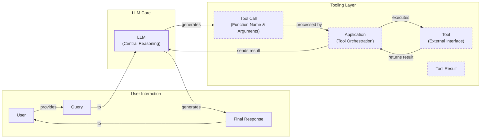
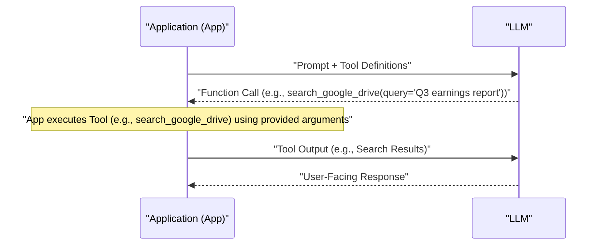
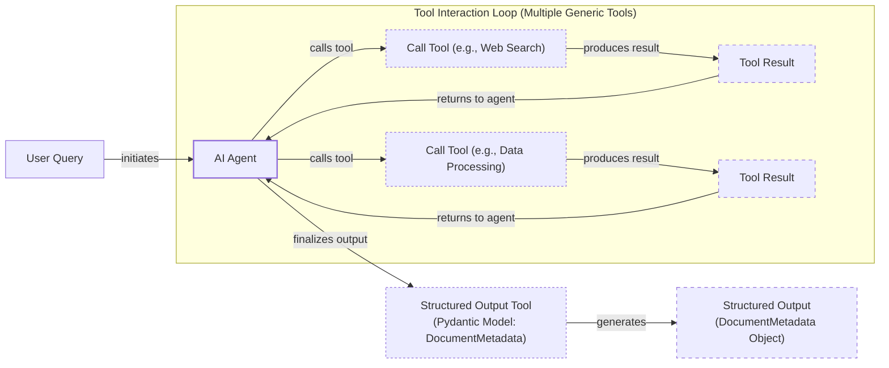
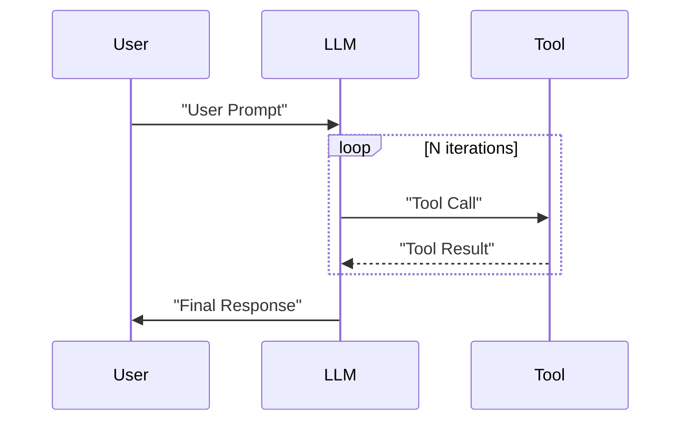

# Lesson 6: Agent Tools & Function Calling

In the previous lessons, you built a solid foundation in AI Engineering. You explored the agent landscape, distinguished between LLM workflows and AI agents, mastered context engineering, and ensured reliable data extraction with structured outputs. You even implemented basic workflow patterns like chaining and routing. Now, it is time to give our systems the ability to interact with the world.

This lesson dives into **tools**, also known as function calling. Tools are what transform an LLM from a passive text generator into an active agent capable of performing actions. For an AI engineer, understanding how to build and integrate tools is not just a skill; it is the key to unlocking the full potential of agentic AI. By implementing tool calling from scratch, you will open the black box and see exactly how an LLM decides what to do, how it generates the right parameters, and how it executes an action.

## Understanding Why Agents Need Tools

LLMs have a fundamental limitation: they are, at their core, sophisticated pattern matchers and text generators. They are trained on vast datasets and excel at language-based tasks, but they cannot interact with the external world on their own. They do not have access to real-time information, cannot perform precise calculations, and cannot take actions in other software systems. This is where tools come in.

This limitation is not just a missing feature; it is rooted in the information-theoretic nature of LLMs. They are trained to maximize likelihood, which rewards local coherence and pattern completion, not logical entailment. This leads to what is known as retrieval fragility: their ability to recall facts degrades for less common information, and their performance is bounded by the mutual information between a query and the retrieved context [[39]](https://arxiv.org/html/2511.12869v2). Furthermore, they cannot reliably maintain external state within their context window, as prompts are a fragile mechanism for managing persistent information [[40]](https://arxiv.org/html/2604.08224v1).

Think of the LLM as the agent's brain, providing the reasoning and decision-making capabilities. Tools, then, are the agent's "hands and senses." They are the bridge connecting the LLM's internal reasoning to the external world, allowing it to perceive, act, and affect its environment. By equipping an LLM with tools, we transform it into a true AI agent.


Image 1: A flowchart illustrating the high-level process of LLM tool calling.

As illustrated in Image 1, this process allows an agent to go far beyond its training data. Some of the most common capabilities enabled by tools include:

*   **Accessing real-time information** via APIs, such as checking today's weather or fetching the latest news [[19]](https://lnu.diva-portal.org/smash/get/diva2:1801354/FULLTEXT01.pdf).
*   **Interacting with external databases** and storage, like querying a PostgreSQL database or retrieving documents from a data lake.
*   **Accessing the agent's long-term memory** to recall information beyond the current context window.
*   **Executing code**, such as running Python scripts for complex calculations or data analysis [[16]](https://arxiv.org/html/2507.08034v1).

## Implementing Tool Calls from Scratch

The best way to understand how an LLM uses tools is to build the mechanism from scratch. In this section, we will implement a simple tool-calling flow. We will define our tools, create schemas for them, instruct the LLM on how to use them, and finally, parse the LLM's output to execute the requested action.

The high-level process involves a five-step loop between our application and the LLM:

1.  **Application:** We send a prompt to the LLM that includes the user's query and a list of available tool definitions.
2.  **LLM:** The model analyzes the request and, if it decides a tool is needed, responds with a `function_call` containing the tool's name and the arguments to use.
3.  **Application:** Our code parses this response and executes the specified function with the provided arguments.
4.  **Application:** We send the output from the function execution back to the LLM.
5.  **LLM:** The model uses the tool's output to generate a final, user-facing response.


Image 2: A sequence diagram illustrating the 5-step request-execute-respond flow of calling a tool from scratch.

Let's implement this flow. Our example will simulate an agent that can search for a financial report on Google Drive, summarize it, and send the summary to a Discord channel.

### Setup and Tool Definition

First, we set up our environment by importing the necessary libraries, initializing the Gemini client, and defining our model and a mock document.
```python
import json
from typing import Any

from google import genai
from google.genai import types
from pydantic import BaseModel, Field

from lessons.utils import pretty_print

client = genai.Client()

MODEL_ID = "gemini-2.5-flash"

DOCUMENT = """
# Q3 2023 Financial Performance Analysis

The Q3 earnings report shows a 20% increase in revenue and a 15% growth in user engagement, 
beating market expectations. These impressive results reflect our successful product strategy 
and strong market positioning.

Our core business segments demonstrated remarkable resilience, with digital services leading 
the growth at 25% year-over-year. The expansion into new markets has proven particularly 
successful, contributing to 30% of the total revenue increase.

Customer acquisition costs decreased by 10% while retention rates improved to 92%, 
marking our best performance to date. These metrics, combined with our healthy cash flow 
position, provide a strong foundation for continued growth into Q4 and beyond.
"""
```
Next, we define our three mock tools as Python functions. The docstrings are important here, as they provide the descriptions the LLM will use to understand what each tool does.
```python
def search_google_drive(query: str) -> dict:
    """
    Searches for a file on Google Drive and returns its content or a summary.

    Args:
        query (str): The search query to find the file, e.g., 'Q3 earnings report'.

    Returns:
        dict: A dictionary representing the search results, including file names and summaries.
    """

    # In a real scenario, this would interact with the Google Drive API.
    # Here, we mock the response for demonstration.
    return {
        "files": [
            {
                "name": "Q3_Earnings_Report_2024.pdf",
                "id": "file12345",
                "content": DOCUMENT,
            }
        ]
    }
```
```python
def send_discord_message(channel_id: str, message: str) -> dict:
    """
    Sends a message to a specific Discord channel.

    Args:
        channel_id (str): The ID of the channel to send the message to, e.g., '#finance'.
        message (str): The content of the message to send.

    Returns:
        dict: A dictionary confirming the action, e.g., {"status": "success"}.
    """

    # Mocking a successful API call to Discord.
    return {
        "status": "success",
        "status_code": 200,
        "channel": channel_id,
        "message_preview": f"{message[:50]}...",
    }
```
```python
def summarize_financial_report(text: str) -> str:
    """
    Summarizes a financial report.

    Args:
        text (str): The text to summarize.

    Returns:
        str: The summary of the text.
    """

    return "The Q3 2023 earnings report shows strong performance across all metrics \
with 20% revenue growth, 15% user engagement increase, 25% digital services growth, and \
improved retention rates of 92%."
```

### Defining Tool Schemas

For each tool, we define a schema in JSON format. This schema is what the LLM uses to understand the tool's purpose (from the `description`), its parameters, their types, and which ones are required. This structured format is an industry standard used by major providers like OpenAI and Google [[23]](https://tetrate.io/learn/ai/llm-output-parsing-structured-generation), [[3]](https://ai.google.dev/gemini-api/docs/function-calling).
```python
search_google_drive_schema = {
    "name": "search_google_drive",
    "description": "Searches for a file on Google Drive and returns its content or a summary.",
    "parameters": {
        "type": "object",
        "properties": {
            "query": {
                "type": "string",
                "description": "The search query to find the file, e.g., 'Q3 earnings report'.",
            }
        },
        "required": ["query"],
    },
}
```
```python
send_discord_message_schema = {
    "name": "send_discord_message",
    "description": "Sends a message to a specific Discord channel.",
    "parameters": {
        "type": "object",
        "properties": {
            "channel_id": {
                "type": "string",
                "description": "The ID of the channel to send the message to, e.g., '#finance'.",
            },
            "message": {
                "type": "string",
                "description": "The content of the message to send.",
            },
        },
        "required": ["channel_id", "message"],
    },
}
```
```python
summarize_financial_report_schema = {
    "name": "summarize_financial_report",
    "description": "Summarizes a financial report.",
    "parameters": {
        "type": "object",
        "properties": {
            "text": {
                "type": "string",
                "description": "The text to summarize.",
            },
        },
        "required": ["text"],
    },
}
```

### Creating the Tool Registry

We create a tool registry to map tool names to their corresponding functions and schemas. This makes it easy to look up and execute the correct tool later.
```python
TOOLS = {
    "search_google_drive": {
        "handler": search_google_drive,
        "declaration": search_google_drive_schema,
    },
    "send_discord_message": {
        "handler": send_discord_message,
        "declaration": send_discord_message_schema,
    },
    "summarize_financial_report": {
        "handler": summarize_financial_report,
        "declaration": summarize_financial_report_schema,
    },
}
TOOLS_BY_NAME = {tool_name: tool["handler"] for tool_name, tool in TOOLS.items()}
TOOLS_SCHEMA = [tool["declaration"] for tool in TOOLS.values()]
```
The `TOOLS_BY_NAME` mapping gives us a simple way to access our tool functions.
It outputs:
```text
Tool name: search_google_drive
Tool handler: <function search_google_drive at 0x104c7df80>
---------------------------------------------------------------------------
Tool name: send_discord_message
Tool handler: <function send_discord_message at 0x104c7de40>
---------------------------------------------------------------------------
Tool name: summarize_financial_report
Tool handler: <function summarize_financial_report at 0x1274f5c60>
---------------------------------------------------------------------------
```
And the `TOOLS_SCHEMA` list contains the JSON schemas we will pass to the LLM.
It outputs:
```text
{
  "name": "search_google_drive",
  "description": "Searches for a file on Google Drive and returns its content or a summary.",
  "parameters": {
    "type": "object",
    "properties": {
      "query": {
        "type": "string",
        "description": "The search query to find the file, e.g., 'Q3 earnings report'."
      }
    },
    "required": [
      "query"
    ]
  }
}
```

### Crafting the System Prompt

Now, we craft a detailed system prompt. This prompt instructs the LLM on how to behave, when to use tools, and the exact format for requesting a tool call. We enclose the list of available tools in `<tool_definitions>` tags.
```python
TOOL_CALLING_SYSTEM_PROMPT = """
You are a helpful AI assistant with access to tools that enable you to take actions and retrieve information to better 
assist users.

## Tool Usage Guidelines

**When to use tools:**
- When you need information that is not in your training data
- When you need to perform actions in external systems and environments
- When you need real-time, dynamic, or user-specific data
- When computational operations are required

**Tool selection:**
- Choose the most appropriate tool based on the user's specific request
- If multiple tools could work, select the one that most directly addresses the need
- Consider the order of operations for multi-step tasks

**Parameter requirements:**
- Provide all required parameters with accurate values
- Use the parameter descriptions to understand expected formats and constraints
- Ensure data types match the tool's requirements (strings, numbers, booleans, arrays)

## Tool Call Format

When you need to use a tool, output ONLY the tool call in this exact format:

```tool_call
{{"name": "tool_name", "args": {{"param1": "value1", "param2": "value2"}}}}
```

**Critical formatting rules:**
- Use double quotes for all JSON strings
- Ensure the JSON is valid and properly escaped
- Include ALL required parameters
- Use correct data types as specified in the tool definition
- Do not include any additional text or explanation in the tool call

## Response Behavior

- If no tools are needed, respond directly to the user with helpful information
- If tools are needed, make the tool call first, then provide context about what you're doing
- After receiving tool results, provide a clear, user-friendly explanation of the outcome
- If a tool call fails, explain the issue and suggest alternatives when possible

## Available Tools

<tool_definitions>
{tools}
</tool_definitions>

Remember: Your goal is to be maximally helpful to the user. Use tools when they add value, but don't use them unnecessarily. Always prioritize accuracy and user experience.
"""
```
The LLM's decision-making process is guided by the information we provide. Based on the `description` field in each tool's schema, the LLM *decides* if a tool is appropriate for the user's query. This is why clear and articulate tool descriptions are essential. If you have two tools with vague descriptions like "search documents" and "search files," the LLM will get confused. Explicit descriptions like "search documents on Google Drive" versus "search files on the local disk" are necessary for reliable tool selection [[32]](https://www.anthropic.com/research/building-effective-agents). Treat every word in a description as meaningful input to the model's decision process [[77]](https://mbrenndoerfer.com/writing/function-calling-llm-structured-tools). This becomes even more important as you scale to dozens or hundreds of tools. Directly exposing 100+ schemas in the prompt can create a "discovery failure mode." A common pattern to solve this is semantic distillation: grouping tools into meta-tools (e.g., "search") and using vector search to retrieve the most relevant specific tool, keeping the context clean [[47]](https://www.linkedin.com/posts/anthony-alcaraz-b80763155_your-ai-agents-are-failing-because-of-tool-activity-7385615536883286016-HvoY).

Once a tool is selected, the LLM *generates* the function name and its arguments as a structured output, like JSON. This capability is not magic; LLMs are specifically trained via instruction fine-tuning to interpret these schema inputs and produce correctly formatted tool calls. This training involves curating datasets with a mix of conversations—some requiring tools, some not—to teach the model the reasoning of when to call a function. The process updates the model's internal weights, making schema adherence a native capability [[42]](https://mbrenndoerfer.com/writing/function-calling-llm-structured-tools), [[44]](https://blog.neosage.io/p/an-engineers-guide-to-fine-tuning).

### Making the First Tool Call

Let's test it. We send a user prompt along with our system prompt to the model.
```python
USER_PROMPT = """
Can you help me find the latest quarterly report and share key insights with the team?
"""

messages = [TOOL_CALLING_SYSTEM_PROMPT.format(tools=str(TOOLS_SCHEMA)), USER_PROMPT]

response = client.models.generate_content(
    model=MODEL_ID,
    contents=messages,
)
```
The LLM correctly identifies the `search_google_drive` tool and generates the required arguments.
It outputs:
```text
```tool_call
{"name": "search_google_drive", "args": {"query": "latest quarterly report"}}
```
```
Here is another example with a more complex query.
```python
USER_PROMPT = """
Please find the Q3 earnings report on Google Drive and send a summary of it to 
the #finance channel on Discord.
"""

messages = [TOOL_CALLING_SYSTEM_PROMPT.format(tools=str(TOOLS_SCHEMA)), USER_PROMPT]

response = client.models.generate_content(
    model=MODEL_ID,
    contents=messages,
)
```
The LLM correctly identifies the first step: searching for the report.
It outputs:
```text
```tool_call
{"name": "search_google_drive", "args": {"query": "Q3 earnings report"}}
```
```

### Parsing the Response and Executing the Tool

Now, we need to parse this response. We create a helper function to extract the JSON string from the Markdown block.
```python
def extract_tool_call(response_text: str) -> str:
    """
    Extracts the tool call from the response text.
    """
    return response_text.split("```tool_call")[1].split("```")[0].strip()


tool_call_str = extract_tool_call(response.text)
```
It outputs:
```text
'{"name": "search_google_drive", "args": {"query": "Q3 earnings report"}}'
```
We parse the string into a Python dictionary.
```python
tool_call = json.loads(tool_call_str)
```
It outputs:
```text
{'name': 'search_google_drive', 'args': {'query': 'Q3 earnings report'}}
```
Next, we retrieve the correct tool handler from our `TOOLS_BY_NAME` dictionary.
```python
tool_handler = TOOLS_BY_NAME[tool_call["name"]]
```
The handler is a direct reference to our Python function.
It outputs:
```text
<function __main__.search_google_drive(query: str) -> dict>
```
We can now execute the tool by calling the function with the arguments provided by the LLM.
```python
tool_result = tool_handler(**tool_call["args"])
```
The tool returns the content of the mock document.
It outputs:
```text
{
  "files": [
    {
      "name": "Q3_Earnings_Report_2024.pdf",
      "id": "file12345",
      "content": "\n# Q3 2023 Financial Performance Analysis\n\nThe Q3 earnings report shows a 20% increase in revenue and a 15% growth in user engagement, \nbeating market expectations. These impressive results reflect our successful product strategy \nand strong market positioning.\n\nOur core business segments demonstrated remarkable resilience, with digital services leading \nthe growth at 25% year-over-year. The expansion into new markets has proven particularly \nsuccessful, contributing to 30% of the total revenue increase.\n\nCustomer acquisition costs decreased by 10% while retention rates improved to 92%, \nmarking our best performance to date. These metrics, combined with our healthy cash flow \nposition, provide a strong foundation for continued growth into Q4 and beyond.\n"
    }
  ]
}
```
We can wrap these steps into a single `call_tool` function for convenience.
```python
def call_tool(response_text: str, tools_by_name: dict) -> Any:
    """
    Call a tool based on the response from the LLM.
    """

    tool_call_str = extract_tool_call(response_text)
    tool_call = json.loads(tool_call_str)
    tool_name = tool_call["name"]
    tool_args = tool_call["args"]
    tool = tools_by_name[tool_name]

    return tool(**tool_args)
```
Using this function gives us the same result in one step.
```python
call_tool(response.text, tools_by_name=TOOLS_BY_NAME)
```
It outputs:
```text
{
  "files": [
    {
      "name": "Q3_Earnings_Report_2024.pdf",
      "id": "file12345",
      "content": "\n# Q3 2023 Financial Performance Analysis\n\nThe Q3 earnings report shows a 20% increase in revenue and a 15% growth in user engagement, \nbeating market expectations. These impressive results reflect our successful product strategy \nand strong market positioning.\n\nOur core business segments demonstrated remarkable resilience, with digital services leading \nthe growth at 25% year-over-year. The expansion into new markets has proven particularly \nsuccessful, contributing to 30% of the total revenue increase.\n\nCustomer acquisition costs decreased by 10% while retention rates improved to 92%, \nmarking our best performance to date. These metrics, combined with our healthy cash flow \nposition, provide a strong foundation for continued growth into Q4 and beyond.\n"
    }
  ]
}
```

### Interpreting the Tool's Output

Finally, we pass the tool's result back to the LLM, asking it to interpret the information. This is an important step that allows the agent to reason about the data it has retrieved and decide on the next action or formulate a final answer.
```python
response = client.models.generate_content(
    model=MODEL_ID,
    contents=f"Interpret the tool result: {json.dumps(tool_result, indent=2)}",
)
```
The LLM provides a natural language summary based on the tool's output.
It outputs:
```text
The tool result provides the content of a file named `Q3_Earnings_Report_2024.pdf`.

This document is a **Q3 2023 Financial Performance Analysis** and details exceptionally strong results, significantly beating market expectations.

**Key highlights from the report include:**

*   **Revenue Growth:** A 20% increase in revenue.
*   **User Engagement:** 15% growth in user engagement.
*   **Core Business Performance:** Digital services led growth at 25% year-over-year.
*   **Market Expansion Success:** New markets contributed 30% of the total revenue increase.
*   **Efficiency & Retention:**
    *   Customer acquisition costs decreased by 10%.
    *   Retention rates improved to 92%, marking the best performance to date.
*   **Financial Health:** The company maintains a healthy cash flow position.

The report attributes these impressive results to a successful product strategy and strong market positioning, indicating a robust foundation for continued growth into Q4 and beyond.
```
This covers the fundamental concepts of tool calling. We have successfully implemented the entire flow from scratch, but as you can see, it involves a lot of manual work.

## Implementing a Tool Calling Framework from Scratch

Manually defining JSON schemas for every function is tedious and error-prone. This is why modern agentic frameworks like LangGraph automatically generate these schemas from Python functions. As a natural next step, let's build a simple framework ourselves by creating a `@tool` decorator.

This decorator will inspect a function's signature and docstring to automatically generate the corresponding tool schema. This approach follows the Don't Repeat Yourself (DRY) principle, creating a single source of truth for both the tool's implementation and its definition, making our code much cleaner and more maintainable [[26]](https://openai.github.io/openai-agents-python/tools/), [[29]](https://docs.langchain.com/oss/python/langchain/tools). By decoupling the function's logic from its schema definition, we also make the system more extensible. Adding a new tool no longer requires manual JSON editing in a separate file; you simply write a Python function and decorate it. This reduces the cognitive load on the developer and minimizes the risk of schema-code mismatches, a common source of bugs in complex agentic systems.

### The @tool Decorator

In Python, a decorator is a function that takes another function as an argument and returns a new function, usually extending or modifying the behavior of the original. It is a powerful feature that allows you to add functionality to existing code without changing its structure. In our case, the `@tool` decorator will wrap our Python functions, inspect their properties like name, docstring, and parameters, and attach a generated schema to them. This process happens automatically whenever a decorated function is defined. This is a form of metaprogramming, where the program can inspect and modify its own structure at runtime. It allows for elegant and reusable code patterns, which is why decorators are so prevalent in modern Python frameworks.

First, we define a `ToolFunction` class to wrap our decorated functions and hold their schemas. This class acts as a container, holding both the executable function (`self.func`) and its machine-readable definition (`self.schema`). When you call an instance of this class, it behaves just like the original function, but it also carries its own metadata.
```python
from inspect import Parameter, signature
from typing import Any, Callable, Dict, Optional


class ToolFunction:
    def __init__(self, func: Callable, schema: Dict[str, Any]) -> None:
        self.func = func
        self.schema = schema
        self.__name__ = func.__name__
        self.__doc__ = func.__doc__

    def __call__(self, *args: Any, **kwargs: Any) -> Any:
        return self.func(*args, **kwargs)
```
Next, we create the `@tool` decorator. It inspects the function's signature and docstring to build the schema automatically. This implementation uses Python's built-in `inspect` module to extract details about the function's arguments. More advanced implementations, like those in production frameworks, use libraries like `griffe` to parse docstrings more robustly and `pydantic` for more complex schema creation [[26]](https://openai.github.io/openai-agents-python/tools/).
```python
def tool(description: Optional[str] = None) -> Callable[[Callable], ToolFunction]:
    """
    A decorator that creates a tool schema from a function.

    Args:
        description: Optional override for the function's docstring

    Returns:
        A decorator function that wraps the original function and adds a schema
    """

    def decorator(func: Callable) -> ToolFunction:
        # Get function signature
        sig = signature(func)

        # Create parameters schema
        properties = {}
        required = []

        for param_name, param in sig.parameters.items():
            # Skip self for methods
            if param_name == "self":
                continue

            param_schema = {
                "type": "string",  # Default to string, can be enhanced with type hints
                "description": f"The {param_name} parameter",  # Default description
            }

            # Add to required if parameter has no default value
            if param.default == Parameter.empty:
                required.append(param_name)

            properties[param_name] = param_schema

        # Create the tool schema
        schema = {
            "name": func.__name__,
            "description": description or func.__doc__ or f"Executes the {func.__name__} function.",
            "parameters": {
                "type": "object",
                "properties": properties,
                "required": required,
            },
        }

        return ToolFunction(func, schema)

    return decorator
```

### Redefining Tools with the Decorator

Now, we can redefine our tools by simply applying the `@tool` decorator to our functions. The code is much cleaner as the schema generation is handled automatically.
```python
@tool()
def search_google_drive_example(query: str) -> dict:
    """Search for files in Google Drive."""
    return {"files": ["Q3 earnings report"]}


@tool()
def send_discord_message_example(channel_id: str, message: str) -> dict:
    """Send a message to a Discord channel."""
    return {"message": "Message sent successfully"}


@tool()
def summarize_financial_report_example(text: str) -> str:
    """Summarize the contents of a financial report."""
    return "Financial report summarized successfully"
```
We collect the decorated functions into a list and create our mappings, just as before.
```python
tools = [
    search_google_drive_example,
    send_discord_message_example,
    summarize_financial_report_example,
]
tools_by_name = {tool.schema["name"]: tool.func for tool in tools}
tools_schema = [tool.schema for tool in tools]
```
The `search_google_drive_example` function is now a `ToolFunction` object.
It outputs:
```text
__main__.ToolFunction
```
This object contains the auto-generated schema, which is identical to the one we created manually, and a reference to the original function handler.
It outputs:
```text
{
  "name": "search_google_drive_example",
  "description": "Search for files in Google Drive.",
  "parameters": {
    "type": "object",
    "properties": {
      "query": {
        "type": "string",
        "description": "The query parameter"
      }
    },
    "required": [
      "query"
    ]
  }
}
```
The function handler is accessible via the `.func` attribute.
It outputs:
```text
<function __main__.search_google_drive_example(query: str) -> dict>
```

### Testing the Framework

We can now use the new `tools_schema` with our LLM call. The process is the same, but our setup is much more scalable and maintainable.
```python
USER_PROMPT = """
Please find the Q3 earnings report on Google Drive and send a summary of it to 
the #finance channel on Discord.
"""

messages = [TOOL_CALLING_SYSTEM_PROMPT.format(tools=str(tools_schema)), USER_PROMPT]

response = client.models.generate_content(
    model=MODEL_ID,
    contents=messages,
)
```
It outputs:
```text
```tool_call
{"name": "search_google_drive_example", "args": {"query": "Q3 earnings report"}}
```
```
Executing the tool call works exactly as before, using our `call_tool` helper function.
```python
call_tool(response.text, tools_by_name=tools_by_name)
```
It outputs:
```text
{
  "files": [
    "Q3 earnings report"
  ]
}
```
Voilà! We have built our own small tool-calling framework. This implementation is conceptually very similar to what production frameworks like LangGraph do under the hood.

## Implementing Production-Level Tool Calls with Gemini

While building from scratch is a great learning exercise, in production, you will almost always use the native tool-calling features of an API like Gemini or OpenAI. These APIs are optimized by the vendors for their specific models, making them more robust, efficient, and easier to use. Instead of manually engineering a system prompt to instruct the model on tool usage, you provide the tool definitions through a dedicated configuration object. This not only simplifies your code but also ensures that you are using the most effective method for that particular model, as the provider handles the underlying prompt optimization.

Let's see how to achieve the same result using Gemini's native `GenerateContentConfig`.

### Configuring Gemini with Tool Schemas

First, we can define our tools by passing our manually created schemas to the `types.Tool` and `GenerateContentConfig` objects. This approach still requires us to define the schemas, but it offloads the prompt engineering to the Gemini API. You can also control the tool-calling behavior with the `mode` parameter, setting it to `ANY` forces the model to call a function. Other modes like `AUTO` (the default) let the model decide, and `NONE` disables tool calling entirely [[3]](https://ai.google.dev/gemini-api/docs/function-calling).
```python
tools = [
    types.Tool(
        function_declarations=[
            types.FunctionDeclaration(**search_google_drive_schema),
            types.FunctionDeclaration(**send_discord_message_schema),
        ]
    )
]
config = types.GenerateContentConfig(
    tools=tools,
    # Force the model to call 'any' function, instead of chatting.
    tool_config=types.ToolConfig(function_calling_config=types.FunctionCallingConfig(mode="ANY")),
)
```
With this config, we can call the model without our lengthy system prompt. The Gemini API handles the instructions internally, which is far more reliable.
```python
response = client.models.generate_content(
    model=MODEL_ID,
    contents=USER_PROMPT,
    config=config,
)
```
It outputs:
```text
FunctionCall(id=None, args={'query': 'Q3 earnings report'}, name='search_google_drive')
```

### Simplifying with Native Function Passing

To simplify things even further, the `google-genai` SDK can automatically generate the schema from a Python function's signature, type hints, and docstring, just like our custom decorator. We can pass our functions directly to the `GenerateContentConfig` object, completely removing the need for manual schema definition.
```python
from google.genai import types 
config = types.GenerateContentConfig( 
    tools=[search_google_drive, send_discord_message] 
)
```
The model's response is a `FunctionCall` object containing the tool name and arguments.
```python
response = client.models.generate_content(
    model=MODEL_ID,
    contents='Please find the Q3 earnings report on Google Drive',
    config=config,
)
function_call = response.candidates[0].content.parts[0].function_call
```
It outputs:
```text
FunctionCall(id=None, args={'query': 'Q3 earnings report'}, name='search_google_drive')
```

### The Complete Execution Flow

We can simplify our `call_tool` function to work directly with this `FunctionCall` object.
```python
def call_tool(function_call) -> any:
    tool_name = function_call.name
    tool_args = {key: value for key, value in function_call.args.items()}

    tool_handler = TOOLS_BY_NAME[tool_name]

    return tool_handler(**tool_args)
```
Executing the tool is now straightforward.
```python
tool_result = call_tool(function_call)
```
It outputs:
```text
{'files': [{'name': 'Q3_Earnings_Report_2024.pdf', 'id': 'file12345', 'content': '...'}]}
```
By using the native SDK, we reduced dozens of lines of code and complex prompts to just a few configuration lines. This is the recommended approach for production systems. It is worth noting that other popular APIs from providers like OpenAI and Anthropic follow a very similar logic, making the concepts you have learned here easily transferable [[81]](https://apxml.com/courses/prompt-engineering-llm-application-development/chapter-4-interacting-with-llm-apis/overview-common-llm-apis), [[83]](https://myengineeringpath.dev/tools/gemini-guide/).

## Using Pydantic Models as Tools for On-Demand Structured Outputs

We can combine what we have learned in this lesson with the structured output techniques from Lesson 4. A powerful and elegant pattern is to treat a Pydantic model as a tool itself. This is particularly useful in agentic workflows where an agent might perform several intermediate steps and then, when it has all the necessary information, call a final "tool" to format its findings into a structured, validated Pydantic object.

This gives you the flexibility of free-form text for intermediate LLM reasoning, which is easier for the model to process, combined with the reliability of structured data for the final output that your application will consume. This pattern ensures that the agent's final deliverable is always in a predictable, machine-readable format, bridging the gap between the probabilistic world of the LLM and the deterministic logic of your downstream systems. This approach is highly effective because it allows the agent to "think" in unstructured language during its reasoning process but "speak" in structured data when it delivers its final answer, giving you the best of both worlds [[5]](https://pydantic.dev/docs/ai/core-concepts/output/).


Image 3: A flowchart illustrating an AI agent calling multiple tools in a loop, with the final step being a structured output using a Pydantic model.

Let's see how to implement this.

### Defining the Pydantic Model as a Tool

First, we define our `DocumentMetadata` Pydantic model, just as we did in Lesson 4. This class will serve as the schema for our structured output.
```python
class DocumentMetadata(BaseModel):
    """A class to hold structured metadata for a document."""

    summary: str = Field(description="A concise, 1-2 sentence summary of the document.")
    tags: list[str] = Field(description="A list of 3-5 high-level tags relevant to the document.")
    keywords: list[str] = Field(description="A list of specific keywords or concepts mentioned.")
    quarter: str = Field(description="The quarter of the financial year described in the document (e.g., Q3 2023).")
    growth_rate: str = Field(description="The growth rate of the company described in the document (e.g., 10%).")
```
We create a tool declaration named `extract_metadata`. For its parameters, we pass the JSON schema generated from our Pydantic model using `DocumentMetadata.model_json_schema()`. This tells the LLM that calling this "tool" means populating an object that conforms to our Pydantic model's structure.
```python
# The Pydantic class 'DocumentMetadata' is now our 'tool'
extraction_tool = types.Tool(
    function_declarations=[
        types.FunctionDeclaration(
            name="extract_metadata",
            description="Extracts structured metadata from a financial document.",
            parameters=DocumentMetadata.model_json_schema(),
        )
    ]
)
config = types.GenerateContentConfig(
    tools=[extraction_tool],
    tool_config=types.ToolConfig(function_calling_config=types.FunctionCallingConfig(mode="ANY")),
)
```

### Extracting and Validating the Structured Output

We prompt the model to analyze the document and extract the metadata.
```python
prompt = f"""
Please analyze the following document and extract its metadata.

Document:
--- 
{DOCUMENT}
--- 
"""

response = client.models.generate_content(model=MODEL_ID, contents=prompt, config=config)
```
The model responds with a function call to our `extract_metadata` tool, with the arguments populated according to the Pydantic schema.
It outputs:
```text
Function Name: `extract_metadata
Function Arguments: `{
    "growth_rate": "20%",
    "summary": "The Q3 2023 earnings report shows a 20% increase in revenue and 15% growth in user engagement, driven by successful product strategy and market expansion. This performance provides a strong foundation for continued growth.",
    "quarter": "Q3 2023",
    "keywords": [
      "Revenue",
      "User Engagement",
      "Market Expansion",
      "Customer Acquisition",
      "Retention Rates",
      "Digital Services",
      "Cash Flow"
    ],
    "tags": [
      "Financials",
      "Earnings",
      "Growth",
      "Business Strategy",
      "Market Analysis"
    ]
}`
```
We can then validate these arguments and create a `DocumentMetadata` instance, ensuring the data is correct and type-safe.
```python
function_call = response.candidates[0].content.parts[0].function_call
try:
    document_metadata = DocumentMetadata(**function_call.args)
    print("Validation successful!")
except Exception as e:
    print(f"Validation failed: {e}")
```
It outputs:
```text
Validation successful!
```
This pattern is extremely common in production AI agents, providing a robust way to guarantee the structure of the final output.

## The Downsides of Running Tools in a Loop

So far, we have focused on single tool calls. However, many real-world tasks require multiple steps. A natural progression is to run tools in a loop, allowing the LLM to chain actions together. At each step, the agent decides which tool to call next based on the results of the previous ones. This is the final piece of the puzzle needed to build a true AI agent.

This iterative process gives the agent flexibility and adaptability, enabling it to handle complex, multi-step problems that cannot be solved in a single turn [[10]](https://blogs.oracle.com/developers/what-is-the-ai-agent-loop-the-core-architecture-behind-autonomous-ai-systems).


Image 4: A sequence diagram illustrating the sequential tool calling loop between a User, LLM, and Tool.

Let's implement this loop for our "search, summarize, and notify" task.

### Implementing a Multi-Step Tool Loop

We configure our model with all three tools.
```python
tools = [
    types.Tool(
        function_declarations=[
            types.FunctionDeclaration(**search_google_drive_schema),
            types.FunctionDeclaration(**send_discord_message_schema),
            types.FunctionDeclaration(**summarize_financial_report_schema),
        ]
    )
]
config = types.GenerateContentConfig(
    tools=tools,
    tool_config=types.ToolConfig(function_calling_config=types.FunctionCallingConfig(mode="ANY")),
)
```
We start with the user's prompt.
```python
USER_PROMPT = """
Please find the Q3 earnings report on Google Drive and send a summary of it to 
the #finance channel on Discord.
"""

messages = [USER_PROMPT]
```
We initiate the first call to the LLM.
```python
response = client.models.generate_content(
    model=MODEL_ID,
    contents=messages,
    config=config,
)
```
The model correctly identifies the first step: `search_google_drive`.
It outputs:
```text
Function Name: `search_google_drive
Function Arguments: `{
    "query": "Q3 earnings report"
}`
```
Now, we enter a loop. As long as the model requests a tool call, we execute it, append the result to our message history, and call the model again.
```python
messages.append(response.candidates[0].content)

max_iterations = 3
while hasattr(response.candidates[0].content.parts[0], "function_call") and max_iterations > 0:
    response_message_part = response.candidates[0].content.parts[0]
    tool_result = call_tool(response_message_part.function_call)

    function_response_part = types.Part.from_function_response(
        name=response_message_part.function_call.name,
        response={"result": tool_result},
    )
    messages.append(function_response_part)

    # Ask the LLM to continue
    response = client.models.generate_content(
        model=MODEL_ID,
        contents=messages,
        config=config,
    )
    messages.append(response.candidates[0].content)
    max_iterations -= 1
```
The loop proceeds as follows:
*   **Iteration 1:** Calls `search_google_drive` and gets the document content.
*   **Iteration 2:** Calls `summarize_financial_report` with the document content.
*   **Iteration 3:** Calls `send_discord_message` with the summary.

### The Limitations of Sequential Loops

This simple loop works for sequential tasks, but it has significant limitations [[9]](https://myengineeringpath.dev/genai-engineer/agentic-patterns/). It assumes the LLM should call a tool at every step and provides no opportunity for the model to "think" or reason about the output of a tool before deciding on the next action. This leads to **compounding errors**: if each step has a 90% success rate, a 10-step process is only 35% likely to succeed. Empirical studies show that error rates grow exponentially after just a few steps, leading to catastrophic failure in longer chains [[53]](https://tushardadlani.com/the-compound-error-crisis-why-llm-agents-are-failing-like-broken-robots-and-why-computer-science-warned-us). For example, if a search tool returns an ambiguous result, a simple loop might proceed with the wrong information, leading subsequent tools to perform incorrect actions. An agent without a "thinking" step might repeatedly call the same failing tool, getting stuck in an unproductive loop without ever realizing it needs to change its query or try a different approach. This is why the agent's ability to reflect is so important.

This simple loop architecture cannot recover from failure. A failed tool call or an empty result cannot trigger a revised strategy because the model has no visibility into the outcome [[10]](https://blogs.oracle.com/developers/what-is-the-ai-agent-loop-the-core-architecture-behind-autonomous-ai-systems). The agent might also get stuck in unbounded loops, repeatedly calling tools without converging on an answer, burning tokens and producing nothing.

### A Note on Parallel Tool Calling

For tasks where tools are independent, we can run them in parallel to reduce latency. For example, an agent could fetch financial news and stock prices simultaneously. This is a powerful optimization when the workflow allows for it, but it does not solve the core issue of reasoning between dependent steps.

These limitations are what drove the development of more sophisticated agentic patterns like **ReAct (Reason + Act)**. ReAct introduces an explicit reasoning step, allowing the agent to think about its observations before acting. We will explore this powerful pattern in detail in Lessons 7 and 8.

## Popular Tools Used Within the Industry

We have covered the mechanics of tool calling, but what kinds of tools are being used in real-world applications? Understanding the landscape of available tools helps ground these concepts and reveals what is possible. Here are some of the most popular categories.

### Knowledge & Memory Access

These tools connect the agent to external knowledge sources, overcoming the limitations of its training data.
*   **Database Queries**: Tools can query vector databases for semantic search, document stores, or graph databases to retrieve context. This is a core component of RAG, which we will cover in Lesson 10 [[11]](https://neo4j.com/blog/agentic-ai/connected-context-and-persistent-memory-neo4j-providers-for-the-microsoft-agent-framework/).
*   **Text-to-SQL**: More advanced tools can translate natural language into SQL queries, allowing agents to interact directly with traditional relational databases [[13]](https://promethium.ai/guides/text-to-sql-basics-benefits/).
*   **Long-Term Memory**: These tools connect to an agent's persistent memory, allowing it to recall facts and preferences across conversations, a topic we will explore in Lesson 9.

### Web Search & Browsing

Essential for any agent needing up-to-date information.
*   **Search APIs**: These tools interface with search engines like Google, Bing, or Brave to retrieve current information from the web [[16]](https://arxiv.org/html/2507.08034v1).
*   **Web Scraping**: These tools can fetch and parse the content of specific web pages, enabling agents to extract data directly from online sources.

### Code Execution

This gives agents powerful computational and data manipulation capabilities.
*   **Python Interpreter**: A common tool that allows an agent to write and execute Python code in a sandboxed environment. This is very useful for mathematical calculations, data analysis, and creating visualizations [[18]](https://medium.com/@anicomanesh/how-llm-reasoning-powers-the-agentic-ai-revolution-cbefd10ebf3f). While Python is the most popular, interpreters for other languages like JavaScript are also used.

### Robotics & Real-Time Control

In autonomous robotics, tool calling is adapted for real-time interaction. LLMs act as high-level planners, decomposing commands (e.g., "pick up the apple") into API calls executed by low-level controllers, enabling robots to dynamically respond to their environment [[67]](https://www.mdpi.com/2673-2688/6/7/158).

### Other Popular Tools

These tools enable agents to perform actions in the real world and are common in enterprise and productivity applications.
*   **External APIs**: Agents can interact with countless third-party services through their APIs, such as sending emails, managing calendar events, or creating tasks in project management software [[20]](https://medium.com/@yugalnandurkar5/llm-engineering-part-i-fa48d4307d26).
*   **File System Operations**: Tools that allow an agent to read and write files or list directories on a local system are fundamental for productivity applications that need to interact with a user's operating system.

## Conclusion

Tool calling is the mechanism that elevates an LLM from a text generator to an active agent. It sits at the core of modern AI engineering and is a skill you must deeply understand to build, monitor, and debug advanced AI applications. We have journeyed from implementing tools from scratch to using production-grade APIs, giving you a complete picture of how agents act upon the world.

But action is only half the story. The simple loops we built are powerful but lack a critical component: reasoning. Now that we understand how an agent can *act*, it is time to learn how it can *think* about those actions. In Lesson 7, we will explore the theory behind planning and the ReAct pattern, setting the stage for building truly intelligent agents.

## References

- [1] https://pmc.ncbi.nlm.nih.gov/articles/PMC11751965/
- [2] https://arxiv.org/html/2506.21585v1
- [3] https://ai.google.dev/gemini-api/docs/function-calling
- [4] https://platform.openai.com/docs/guides/function-calling
- [5] https://www.youtube.com/watch?v=ApoDzZP8_ck
- [6] https://arxiv.org/pdf/2401.17464v3
- [7] https://www.newsletter.swirlai.com/p/building-ai-agents-from-scratch-part
- [9] https://myengineeringpath.dev/genai-engineer/agentic-patterns/
- [10] https://blogs.oracle.com/developers/what-is-the-ai-agent-loop-the-core-architecture-behind-autonomous-ai-systems
- [11] https://neo4j.com/blog/agentic-ai/connected-context-and-persistent-memory-neo4j-providers-for-the-microsoft-agent-framework/
- [13] https://promethium.ai/guides/text-to-sql-basics-benefits/
- [16] https://arxiv.org/html/2507.08034v1
- [18] https://medium.com/@anicomanesh/how-llm-reasoning-powers-the-agentic-ai-revolution-cbefd10ebf3f
- [19] https://lnu.diva-portal.org/smash/get/diva2:1801354/FULLTEXT01.pdf
- [20] https://medium.com/@yugalnandurkar5/llm-engineering-part-i-fa48d4307d26
- [21] https://community.openai.com/t/prompting-best-practices-for-tool-use-function-calling/1123036
- [22] https://medium.com/@hariomshahu101/building-production-ready-llm-applications-bulletproof-llm-tool-calling-with-advanced-json-b95ce8889f4e
- [23] https://tetrate.io/learn/ai/llm-output-parsing-structured-generation
- [25] https://mbrenndoerfer.com/writing/function-calling-llm-structured-tools
- [26] https://openai.github.io/openai-agents-python/tools/
- [28] https://pydantic.dev/docs/ai/tools-toolsets/tools/
- [29] https://docs.langchain.com/oss/python/langchain/tools
- [30] https://reference.langchain.com/python/langchain-core/tools/convert/tool
- [32] https://www.anthropic.com/research/building-effective-agents
- [39] https://arxiv.org/html/2511.12869v2
- [40] https://arxiv.org/html/2604.08224v1
- [42] https://mbrenndoerfer.com/writing/function-calling-llm-structured-tools
- [44] https://blog.neosage.io/p/an-engineers-guide-to-fine-tuning
- [47] https://www.linkedin.com/posts/anthony-alcaraz-b80763155_your-ai-agents-are-failing-because-of-tool-activity-7385615536883286016-HvoY
- [53] https://tushardadlani.com/the-compound-error-crisis-why-llm-agents-are-failing-like-broken-robots-and-why-computer-science-warned-us
- [67] https://www.mdpi.com/2673-2688/6/7/158
- [72] https://truto.one/blog/the-best-unified-apis-for-llm-function-calling-ai-agent-tools-2026
- [75] https://pub.towardsai.net/tool-descriptions-are-critical-making-better-llm-tools-research-capability-b315851471e7
- [76] https://apxml.com/courses/building-advanced-llm-agent-tools/chapter-1-llm-agent-tooling-foundations/tool-input-output-schemas
- [77] https://mbrenndoerfer.com/writing/function-calling-llm-structured-tools
- [78] https://medium.com/@abhaychougule0907/underlying-factors-behind-inconsistency-in-llm-responses-with-multi-tool-calling-628ce7b4de76
- [79] https://arxiv.org/html/2505.18135v2
- [80] https://www.decodingai.com/p/tool-calling-from-scratch-to-production
- [81] https://apxml.com/courses/prompt-engineering-llm-application-development/chapter-4-interacting-with-llm-apis/overview-common-llm-apis
- [82] https://www.getorchestra.io/guides/llm-providers-gen-ai-platforms-compared
- [83] https://myengineeringpath.dev/tools/gemini-guide/
- [84] https://futuresearch.ai/blog/llm-provider-quirks/