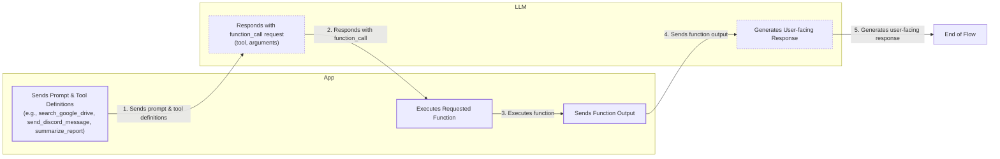
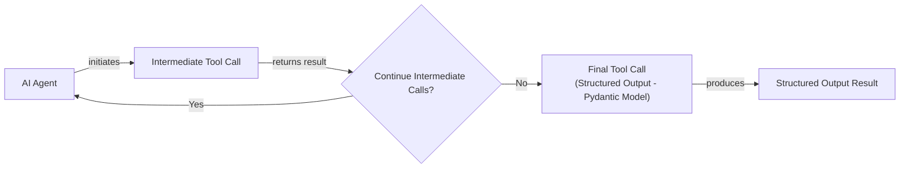
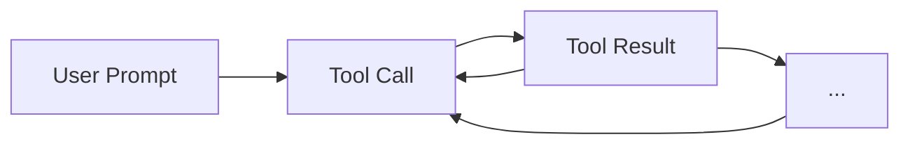

# Lesson 6: Agent Tools & Function Calling

In our previous lessons, we built a solid foundation in AI Engineering. We explored the agent landscape, distinguished between LLM workflows and AI agents, and mastered context engineering and structured outputs. We even implemented basic workflow patterns like chaining and routing. Now, we will explore one of the most essential components of any AI agent: **tools**.

Tools, also known as function calling, are what transform an LLM from a simple text generator into an agent that can take action in the external world. For an AI Engineer, understanding how an agent uses tools is not just a technical skill; it is the key to opening the black box of agentic systems. This knowledge is essential for building, debugging, and monitoring reliable AI applications.

## Understanding Why Agents Need Tools

LLMs have a fundamental limitation: they are, at their core, sophisticated pattern matchers and text generators. This is not just an architectural choice; it is a consequence of how they are trained. Likelihood-based training rewards local coherence over logical entailment, causing LLMs to favor "correlation completion" rather than true inference [[1]](https://arxiv.org/html/2511.12869v2). This leads to reasoning degradation and hallucinations, especially for less common facts where the model lacks sufficient training examples. They are trained on vast amounts of text and can produce human-like responses, but they cannot interact with the external world on their own. They cannot check today's weather, access a private database, or execute a piece of code. This is where tools come in.

Think of the LLM as the brain of an agent. Tools are its "hands and senses," allowing it to perceive and act in the world beyond its pre-trained knowledge. This externalization is necessary to overcome practical constraints like finite context windows and the unreliability of managing complex state through prompts alone [[2]](https://arxiv.org/html/2604.08224v1). Tools provide a persistent, reliable interface to the outside world. They are the bridge between the LLM's internal reasoning and the external environment. By giving an LLM access to tools, we transform it into an AI agent capable of executing specific instructions and interacting with its surroundings.
Image 1: An LLM uses tools to interact with the external world. (Source: Swirl AI [[3]](https://www.newsletter.swirlai.com/p/building-ai-agents-from-scratch-part))

This capability unlocks a wide range of applications. Modern AI agents leverage tools to:
-   Access real-time information through APIs, like checking the weather or fetching the latest news [[4]](https://lnu.diva-portal.org/smash/get/diva2:1801354/FULLTEXT01.pdf).
-   Interact with external databases and storage solutions, from traditional PostgreSQL databases to data lakes on S3 [[5]](https://arxiv.org/html/2507.08034v1).
-   Access their own long-term memory to recall information beyond the current context window, a topic we will explore in Lesson 9.
-   Execute code in languages like Python or JavaScript to perform precise calculations, manipulate data, or create visualizations [[6]](https://medium.com/@anicomanesh/how-llm-reasoning-powers-the-agentic-ai-revolution-cbefd10ebf3f).

## Implementing tool calls from scratch

The best way to understand how tools work is to build them from the ground up. In this section, we will implement a simple tool-calling mechanism from scratch. You will learn how a tool is defined, how its schema is communicated to the LLM, and how the model’s response is parsed and executed.

Our goal is to provide the LLM with a list of available tools and let it decide which one to use, generating the correct arguments needed to call it. The high-level process involves a five-step flow between our application and the LLM.



Image 2: A flowchart illustrating the 5-step request-execute-respond flow of calling a tool between an App and an LLM.

Now, let's dig into the code. We will build a simple workflow that mocks searching for a document on Google Drive and sending a summary to a Discord channel.

<aside>
💡

You can find the code for this lesson in the accompanying [Jupyter Notebook](https://github.com/towardsai/course-ai-agents/blob/dev/lessons/06_tools/notebook.ipynb) in the course repository.

</aside>

1.  First, we set up our environment by importing the necessary packages and initializing the Gemini client. We will use the `gemini-2.5-flash` model for its speed and cost-effectiveness. We also define a sample `DOCUMENT` to simulate the content of a file we might find.
    ```python
    import json
    from typing import Any

    from google import genai
    from google.genai import types
    from pydantic import BaseModel, Field

    from lessons.utils import pretty_print

    client = genai.Client()

    MODEL_ID = "gemini-2.5-flash"

    DOCUMENT = """
    # Q3 2023 Financial Performance Analysis

    The Q3 earnings report shows a 20% increase in revenue and a 15% growth in user engagement, 
    beating market expectations. These impressive results reflect our successful product strategy 
    and strong market positioning.

    Our core business segments demonstrated remarkable resilience, with digital services leading 
    the growth at 25% year-over-year. The expansion into new markets has proven particularly 
    successful, contributing to 30% of the total revenue increase.

    Customer acquisition costs decreased by 10% while retention rates improved to 92%, 
    marking our best performance to date. These metrics, combined with our healthy cash flow 
    position, provide a strong foundation for continued growth into Q4 and beyond.
    """
    ```

2.  Next, we define three mock functions that will serve as our tools. To keep the focus on the tool-calling mechanism, these functions return hardcoded data instead of making real API calls.
    ```python
    def search_google_drive(query: str) -> dict:
        """
        Searches for a file on Google Drive and returns its content or a summary.
    
        Args:
            query (str): The search query to find the file, e.g., 'Q3 earnings report'.
    
        Returns:
            dict: A dictionary representing the search results, including file names and summaries.
        """
        return {
            "files": [
                {
                    "name": "Q3_Earnings_Report_2024.pdf",
                    "id": "file12345",
                    "content": DOCUMENT,
                }
            ]
        }
    ```
    ```python
    def send_discord_message(channel_id: str, message: str) -> dict:
        """
        Sends a message to a specific Discord channel.
    
        Args:
            channel_id (str): The ID of the channel to send the message to, e.g., '#finance'.
            message (str): The content of the message to send.
    
        Returns:
            dict: A dictionary confirming the action, e.g., {"status": "success"}.
        """
        return {
            "status": "success",
            "status_code": 200,
            "channel": channel_id,
            "message_preview": f"{message[:50]}...",
        }
    ```
    ```python
    def summarize_financial_report(text: str) -> str:
        """
        Summarizes a financial report.
    
        Args:
            text (str): The text to summarize.
    
        Returns:
            str: The summary of the text.
        """
        return "The Q3 2023 earnings report shows strong performance across all metrics with 20% revenue growth, 15% user engagement increase, 25% digital services growth, and improved retention rates of 92%."
    ```

3.  For the LLM to understand these tools, we must define a schema for each one. This schema, typically in JSON format, describes the tool's name, its purpose, and the parameters it accepts. This is the industry standard for major LLM providers like OpenAI and Google [[7]](https://tetrate.io/learn/ai/llm-output-parsing-structured-generation), [[8]](https://ai.google.dev/gemini-api/docs/function-calling).
    ```python
    search_google_drive_schema = {
        "name": "search_google_drive",
        "description": "Searches for a file on Google Drive and returns its content or a summary.",
        "parameters": {
            "type": "object",
            "properties": {
                "query": {
                    "type": "string",
                    "description": "The search query to find the file, e.g., 'Q3 earnings report'.",
                }
            },
            "required": ["query"],
        },
    }
    ```
    ```python
    send_discord_message_schema = {
        "name": "send_discord_message",
        "description": "Sends a message to a specific Discord channel.",
        "parameters": {
            "type": "object",
            "properties": {
                "channel_id": {
                    "type": "string",
                    "description": "The ID of the channel to send the message to, e.g., '#finance'.",
                },
                "message": {
                    "type": "string",
                    "description": "The content of the message to send.",
                },
            },
            "required": ["channel_id", "message"],
        },
    }
    ```
    ```python
    summarize_financial_report_schema = {
        "name": "summarize_financial_report",
        "description": "Summarizes a financial report.",
        "parameters": {
            "type": "object",
            "properties": {
                "text": {
                    "type": "string",
                    "description": "The text to summarize.",
                },
            },
            "required": ["text"],
        },
    }
    ```

4.  We then create a tool registry to manage our tools, mapping names to their corresponding functions (handlers) and schemas.
    ```python
    TOOLS = {
        "search_google_drive": {
            "handler": search_google_drive,
            "declaration": search_google_drive_schema,
        },
        "send_discord_message": {
            "handler": send_discord_message,
            "declaration": send_discord_message_schema,
        },
        "summarize_financial_report": {
            "handler": summarize_financial_report,
            "declaration": summarize_financial_report_schema,
        },
    }
    TOOLS_BY_NAME = {tool_name: tool["handler"] for tool_name, tool in TOOLS.items()}
    TOOLS_SCHEMA = [tool["declaration"] for tool in TOOLS.values()]
    ```
    The `TOOLS_BY_NAME` mapping looks like this:
    ```text
    Tool name: search_google_drive
    Tool handler: <function search_google_drive at 0x104c7df80>
    ---------------------------------------------------------------------------
    Tool name: send_discord_message
    Tool handler: <function send_discord_message at 0x104c7de40>
    ---------------------------------------------------------------------------
    Tool name: summarize_financial_report
    Tool handler: <function summarize_financial_report at 0x1274f5c60>
    ---------------------------------------------------------------------------
    ```
    And here is the schema for our `search_google_drive` tool:
    ```text
    {
      "name": "search_google_drive",
      "description": "Searches for a file on Google Drive and returns its content or a summary.",
      "parameters": {
        "type": "object",
        "properties": {
          "query": {
            "type": "string",
            "description": "The search query to find the file, e.g., 'Q3 earnings report'."
          }
        },
        "required": [
          "query"
        ]
      }
    }
    ```

5.  To instruct the LLM on how to use these tools, we create a detailed system prompt. This prompt explains when to use tools, how to select them, and the exact format for requesting a tool call.
    ```python
    TOOL_CALLING_SYSTEM_PROMPT = """
    You are a helpful AI assistant with access to tools that enable you to take actions and retrieve information to better 
    assist users.
    
    ## Tool Usage Guidelines
    
    **When to use tools:**
    - When you need information that is not in your training data
    - When you need to perform actions in external systems and environments
    - When you need real-time, dynamic, or user-specific data
    - When computational operations are required
    
    **Tool selection:**
    - Choose the most appropriate tool based on the user's specific request
    - If multiple tools could work, select the one that most directly addresses the need
    - Consider the order of operations for multi-step tasks
    
    **Parameter requirements:**
    - Provide all required parameters with accurate values
    - Use the parameter descriptions to understand expected formats and constraints
    - Ensure data types match the tool's requirements (strings, numbers, booleans, arrays)
    
    ## Tool Call Format
    
    When you need to use a tool, output ONLY the tool call in this exact format:
    
    <tool_call>
    {{"name": "tool_name", "args": {{"param1": "value1", "param2": "value2"}}}}
    </tool_call>
    
    **Important formatting rules:**
    - Use double quotes for all JSON strings
    - Ensure the JSON is valid and properly escaped
    - Include ALL required parameters
    - Use correct data types as specified in the tool definition
    - Do not include any additional text or explanation in the tool call
    
    ## Response Behavior
    
    - If no tools are needed, respond directly to the user with helpful information
    - If tools are needed, make the tool call first, then provide context about what you're doing
    - After receiving tool results, provide a clear, user-friendly explanation of the outcome
    - If a tool call fails, explain the issue and suggest alternatives when possible
    
    ## Available Tools
    
    <tool_definitions>
    {tools}
    </tool_definitions>
    
    Remember: Your goal is to be maximally helpful to the user. Use tools when they add value, but don't use them unnecessarily. Always prioritize accuracy and user experience.
    """
    ```

6.  Now, let's look at how tool calling works in practice. The LLM uses the `description` field from the tool schema to *decide* if a tool is appropriate for a user's query. This is why clear and articulate tool descriptions are essential. The descriptions are not just documentation for humans; they are the primary signal the model uses to decide whether and how to invoke the tool [[11]](https://mbrenndoerfer.com/writing/function-calling-llm-structured-tools). A good description explains when to use the tool, its expected input format, and any edge cases [[9]](https://www.anthropic.com/research/building-effective-agents).

    If you have multiple tools, their descriptions must be distinct to avoid confusion. For example, two tools with vague descriptions like "search documents" and "search files" would confuse the LLM. You have to be explicit: "search documents on Google Drive" and "search files on the local disk" [[9]](https://www.anthropic.com/research/building-effective-agents). This becomes especially important as you scale to dozens or even hundreds of tools per agent. In fact, exposing over 100 tool schemas directly in the prompt can create a "discovery failure mode," where the model burns tokens on tool definitions instead of reasoning. A more scalable architecture involves using semantic search to find the most relevant tools from a large library, exposing only a few "meta-tools" to the agent [[10]](https://www.linkedin.com/posts/anthony-alcaraz-b80763155_your-ai-agents-are-failing-because-of-tool-activity-7385615536883286016-HvoY).

    Once a tool is selected, the LLM *generates* the function name and arguments as a structured output, like JSON. This capability is not magic; LLMs are specifically instruction fine-tuned to interpret these schemas and produce valid tool calls [[11]](https://mbrenndoerfer.com/writing/function-calling-llm-structured-tools). This process involves training the model on curated datasets of tool-use conversations, teaching it to generate valid structures probabilistically. It effectively retrains the model's instincts, making schema adherence a native capability rather than a behavior guided by a brittle prompt [[12]](https://blog.neosage.io/p/an-engineers-guide-to-fine-tuning).

7.  Let's test it. We send a user prompt along with our system prompt to the model.
    ```python
    USER_PROMPT = """
    Can you help me find the latest quarterly report and share key insights with the team?
    """
    
    messages = [TOOL_CALLING_SYSTEM_PROMPT.format(tools=str(TOOLS_SCHEMA)), USER_PROMPT]
    
    response = client.models.generate_content(
        model=MODEL_ID,
        contents=messages,
    )
    ```
    The LLM correctly identifies the `search_google_drive` tool and generates the required arguments:
    ```text
    <tool_call>
    {"name": "search_google_drive", "args": {"query": "latest quarterly report"}}
    </tool_call>
    ```

8.  Here is another example with a more complex prompt.
    ```python
    USER_PROMPT = """
    Please find the Q3 earnings report on Google Drive and send a summary of it to 
    the #finance channel on Discord.
    """
    
    messages = [TOOL_CALLING_SYSTEM_PROMPT.format(tools=str(TOOLS_SCHEMA)), USER_PROMPT]
    
    response = client.models.generate_content(
        model=MODEL_ID,
        contents=messages,
    )
    ```
    It outputs:
    ```text
    <tool_call>
    {"name": "search_google_drive", "args": {"query": "Q3 earnings report"}}
    </tool_call>
    ```

9.  Now we need to parse the LLM's response and execute the tool. First, we extract the JSON string from the response.
    ```python
    def extract_tool_call(response_text: str) -> str:
        """
        Extracts the tool call from the response text.
        """
        return response_text.split("<tool_call>")[1].split("</tool_call>")[0].strip()
    
    
    tool_call_str = extract_tool_call(response.text)
    ```
    It outputs:
    ```text
    '{"name": "search_google_drive", "args": {"query": "Q3 earnings report"}}'
    ```

10. Next, we parse the string into a Python dictionary.
    ```python
    tool_call = json.loads(tool_call_str)
    ```
    It outputs:
    ```text
    {'name': 'search_google_drive', 'args': {'query': 'Q3 earnings report'}}
    ```

11. We retrieve the correct tool handler (the Python function) from our `TOOLS_BY_NAME` registry.
    ```python
    tool_handler = TOOLS_BY_NAME[tool_call["name"]]
    ```
    It outputs:
    ```text
    <function search_google_drive at 0x104c7df80>
    ```

12. Finally, we call the function with the arguments generated by the LLM.
    ```python
    tool_result = tool_handler(**tool_call["args"])
    ```
    It outputs:
    ```text
    {'files': [{'name': 'Q3_Earnings_Report_2024.pdf',
       'id': 'file12345',
       'content': '\n# Q3 2023 Financial Performance Analysis\n\nThe Q3 earnings report shows a 20% increase in revenue and a 15% growth in user engagement, \nbeating market expectations. These impressive results reflect our successful product strategy \nand strong market positioning.\n\nOur core business segments demonstrated remarkable resilience, with digital services leading \nthe growth at 25% year-over-year. The expansion into new markets has proven particularly \nsuccessful, contributing to 30% of the total revenue increase.\n\nCustomer acquisition costs decreased by 10% while retention rates improved to 92%, \nmarking our best performance to date. These metrics, combined with our healthy cash flow \nposition, provide a strong foundation for continued growth into Q4 and beyond.\n'}]}
    ```

13. We can wrap these steps into a single `call_tool` function for convenience.
    ```python
    def call_tool(response_text: str, tools_by_name: dict) -> Any:
        """
        Call a tool based on the response from the LLM.
        """
    
        tool_call_str = extract_tool_call(response_text)
        tool_call = json.loads(tool_call_str)
        tool_name = tool_call["name"]
        tool_args = tool_call["args"]
        tool = tools_by_name[tool_name]
    
        return tool(**tool_args)
    ```

14. Using this function gives us the same result as before.
    ```python
    call_tool(response.text, tools_by_name=TOOLS_BY_NAME)
    ```

15. The final step in the loop is to send the tool's output back to the LLM. This allows the model to interpret the results and either generate a final response for the user or decide on the next action to take.
    ```python
    response = client.models.generate_content(
        model=MODEL_ID,
        contents=f"Interpret the tool result: {json.dumps(tool_result, indent=2)}",
    )
    ```
    It outputs:
    ```text
    The tool result provides the content of a file named `Q3_Earnings_Report_2024.pdf`.
    
    This document is a **Q3 2023 Financial Performance Analysis** and details exceptionally strong results, significantly beating market expectations.
    
    **Key highlights from the report include:**
    
    *   **Revenue Growth:** A 20% increase in revenue.
    *   **User Engagement:** 15% growth in user engagement.
    *   **Core Business Performance:** Digital services led growth at 25% year-over-year.
    *   **Market Expansion Success:** New markets contributed 30% of the total revenue increase.
    *   **Efficiency & Retention:**
        *   Customer acquisition costs decreased by 10%.
        *   Retention rates improved to 92%, marking the best performance to date.
    *   **Financial Health:** The company maintains a healthy cash flow position.
    
    The report attributes these impressive results to a successful product strategy and strong market positioning, indicating a robust foundation for continued growth into Q4 and beyond.
    ```
This covers the fundamental concepts of tool calling. We have successfully implemented a basic function-calling loop from scratch.

## Implementing a small tool calling framework from scratch

Manually defining a JSON schema for every function is tedious and error-prone. Production frameworks like LangGraph and protocols like the Model Context Protocol (MCP) solve this by using a `@tool` decorator to automatically generate schemas from Python functions [[13]](https://docs.langchain.com/oss/python/langchain/tools), [[14]](https://openai.github.io/openai-agents-python/tools/). MCP is an emerging open standard, adopted by major providers like OpenAI and Google, that aims to create a universal interface for how AI systems integrate with external tools [[15]](https://truto.one/blog/the-best-unified-apis-for-llm-function-calling-ai-agent-tools-2026). This approach respects the Don't Repeat Yourself (DRY) principle by creating a single source of truth for both the tool's implementation and its definition [[16]](https://pydantic.dev/docs/ai/tools-toolsets/tools/).

Before we build our own decorator, let's briefly review how they work in Python. A decorator is a function that takes another function as an argument, adds some functionality to it, and returns the modified function without altering the original function's source code. It is a powerful feature for extending behavior, often used for logging, timing, or, in our case, adding metadata.

Let's build our own simple framework by creating a `@tool` decorator. Our goal is to automatically extract the schema from a function's signature and docstring.

1.  First, we define a `ToolFunction` class to wrap our decorated functions and hold their schemas. This class will store both the original function and its generated schema, making them accessible together.
    ```python
    from inspect import Parameter, signature
    from typing import Any, Callable, Dict, Optional
    
    
    class ToolFunction:
        def __init__(self, func: Callable, schema: Dict[str, Any]) -> None:
            self.func = func
            self.schema = schema
            self.__name__ = func.__name__
            self.__doc__ = func.__doc__
    
        def __call__(self, *args: Any, **kwargs: Any) -> Any:
            return self.func(*args, **kwargs)
    ```

2.  Next, we create the `tool` decorator. This function takes an optional `description` and returns another function, `decorator`. The inner `decorator` function is the one that actually wraps our target function (e.g., `search_google_drive_example`). It uses Python's `inspect` module to examine the function's signature, extracting parameter names and determining if they are required. It then constructs the JSON schema and returns a `ToolFunction` instance containing both the original function and its new schema.
    ```python
    def tool(description: Optional[str] = None) -> Callable[[Callable], ToolFunction]:
        """
        A decorator that creates a tool schema from a function.
    
        Args:
            description: Optional override for the function's docstring
    
        Returns:
            A decorator function that wraps the original function and adds a schema
        """
    
        def decorator(func: Callable) -> ToolFunction:
            # Get function signature
            sig = signature(func)
    
            # Create parameters schema
            properties = {}
            required = []
    
            for param_name, param in sig.parameters.items():
                # Skip self for methods
                if param_name == "self":
                    continue
    
                param_schema = {
                    "type": "string",  # Default to string, can be enhanced with type hints
                    "description": f"The {param_name} parameter",  # Default description
                }
    
                # Add to required if parameter has no default value
                if param.default == Parameter.empty:
                    required.append(param_name)
    
                properties[param_name] = param_schema
    
            # Create the tool schema
            schema = {
                "name": func.__name__,
                "description": description or func.__doc__ or f"Executes the {func.__name__} function.",
                "parameters": {
                    "type": "object",
                    "properties": properties,
                    "required": required,
                },
            }
    
            return ToolFunction(func, schema)
    
        return decorator
    ```

3.  Now, we can redefine our tools using the new decorator. The code is much cleaner and more maintainable.
    ```python
    @tool()
    def search_google_drive_example(query: str) -> dict:
        """Search for files in Google Drive."""
        return {"files": ["Q3 earnings report"]}
    
    
    @tool()
    def send_discord_message_example(channel_id: str, message: str) -> dict:
        """Send a message to a Discord channel."""
        return {"message": "Message sent successfully"}
    
    
    @tool()
    def summarize_financial_report_example(text: str) -> str:
        """Summarize the contents of a financial report."""
        return "Financial report summarized successfully"
    ```

4.  We collect the decorated functions into a list and create our mappings.
    ```python
    tools = [
        search_google_drive_example,
        send_discord_message_example,
        summarize_financial_report_example,
    ]
    tools_by_name = {tool.schema["name"]: tool.func for tool in tools}
    tools_schema = [tool.schema for tool in tools]
    ```

5.  The decorated function is now a `ToolFunction` object. It contains the auto-generated schema, which is identical to the one we created manually.
    ```python
    type(search_google_drive_example)
    ```
    It outputs:
    ```text
    __main__.ToolFunction
    ```
    The schema looks like this:
    ```text
    {
      "name": "search_google_drive_example",
      "description": "Search for files in Google Drive.",
      "parameters": {
        "type": "object",
        "properties": {
          "query": {
            "type": "string",
            "description": "The query parameter"
          }
        },
        "required": [
          "query"
        ]
      }
    }
    ```
    And we can still access the original function via the `.func` attribute:
    ```text
    <function __main__.search_google_drive_example(query: str) -> dict>
    ```

6.  Let's test our new framework with the LLM.
    ```python
    USER_PROMPT = """
    Please find the Q3 earnings report on Google Drive and send a summary of it to 
    the #finance channel on Discord.
    """
    
    messages = [TOOL_CALLING_SYSTEM_PROMPT.format(tools=str(tools_schema)), USER_PROMPT]
    
    response = client.models.generate_content(
        model=MODEL_ID,
        contents=messages,
    )
    ```
    It outputs:
    ```text
    <tool_call>
    {"name": "search_google_drive_example", "args": {"query": "Q3 earnings report"}}
    </tool_call>
    ```

7.  We use our `call_tool` function from before to execute the request.
    ```python
    call_tool(response.text, tools_by_name=tools_by_name)
    ```
    It outputs:
    ```text
    {'files': ['Q3 earnings report']}
    ```
Voilà! We have built a small, functional tool-calling framework. This implementation is conceptually similar to what happens under the hood in frameworks like LangGraph.

## Implementing production-level tool calls with Gemini

While building from scratch is a great learning exercise, in production, you will almost always use the native tool-calling features of an LLM provider like Gemini or OpenAI. These APIs are optimized for their specific models, making them more robust, efficient, and easier to maintain [[17]](https://www.decodingai.com/p/tool-calling-from-scratch-to-production). They abstract away the complexity of prompt engineering for tool use, ensuring that the underlying instructions are always optimized for the specific model version you are using.

Let's see how to achieve the same result using Gemini's native capabilities.

1.  Instead of a system prompt, we provide the tool schemas directly to the API through a `GenerateContentConfig` object. This object acts as the main configuration for the generation request. Inside it, we define our `tools` using `types.Tool` and `types.FunctionDeclaration`. We also set the `tool_config` mode to `"ANY"` to force the model to call a function instead of generating a text response.
    ```python
    tools = [
        types.Tool(
            function_declarations=[
                types.FunctionDeclaration(**search_google_drive_schema),
                types.FunctionDeclaration(**send_discord_message_schema),
            ]
        )
    ]
    config = types.GenerateContentConfig(
        tools=tools,
        tool_config=types.ToolConfig(function_calling_config=types.FunctionCallingConfig(mode="ANY")),
    )
    ```

2.  With this configuration, our prompt becomes much simpler. We can remove the complex system prompt, as the API handles the tool-use instructions internally. This is more reliable because the provider optimizes these instructions for each specific model.
    ```python
    response = client.models.generate_content(
        model=MODEL_ID,
        contents=USER_PROMPT,
        config=config,
    )
    ```

3.  The response contains a `function_call` object with the tool name and arguments.
    ```python
    response_message_part = response.candidates[0].content.parts[0]
    function_call = response_message_part.function_call
    ```
    It outputs:
    ```text
    FunctionCall(id=None, args={'query': 'Q3 earnings report'}, name='search_google_drive')
    ```

4.  To simplify even further, the `google-genai` SDK can automatically generate the schema from a Python function's signature, type hints, and docstring, just like our custom decorator. This is a key benefit, as it allows us to pass our Python functions directly to the `GenerateContentConfig` without manually defining schemas. The SDK handles the conversion for us, making the code cleaner and less prone to errors.
    ```python
    def call_tool(function_call) -> Any:
        tool_name = function_call.name
        tool_args = {key: value for key, value in function_call.args.items()}
    
        tool_handler = TOOLS_BY_NAME[tool_name]
    
        return tool_handler(**tool_args)
    
    tool_result = call_tool(response_message_part.function_call)
    ```
    It outputs:
    ```text
    {'files': [{'name': 'Q3_Earnings_Report_2024.pdf',
       'id': 'file12345',
       'content': '\n# Q3 2023 Financial Performance Analysis\n\nThe Q3 earnings report shows a 20% increase in revenue and a 15% growth in user engagement, \nbeating market expectations. These impressive results reflect our successful product strategy \nand strong market positioning.\n\nOur core business segments demonstrated remarkable resilience, with digital services leading \nthe growth at 25% year-over-year. The expansion into new markets has proven particularly \nsuccessful, contributing to 30% of the total revenue increase.\n\nCustomer acquisition costs decreased by 10% while retention rates improved to 92%, \nmarking our best performance to date. These metrics, combined with our healthy cash flow \nposition, provide a strong foundation for continued growth into Q4 and beyond.\n'}]}
    ```
By leveraging the native SDK, we reduced dozens of lines of code to just a few, creating a more robust and maintainable system. Other popular APIs from providers like OpenAI and Anthropic follow a similar logic, making these concepts easily transferable to your API of choice [[18]](https://apxml.com/courses/prompt-engineering-llm-application-development/chapter-4-interacting-with-llm-apis/overview-common-llm-apis), [[19]](https://myengineeringpath.dev/tools/gemini-guide/).

## Using Pydantic models as tools for on-demand structured outputs

Connecting this lesson with what we learned about structured outputs in Lesson 4, we can use a Pydantic model as a tool. This is a powerful pattern for agentic workflows where you need to perform several intermediate steps before dynamically deciding to generate a final, structured answer. The agent can use other tools for tasks like searching or calculating, and then, as a final step, call the Pydantic "tool" to format the result into a reliable, validated object for downstream processing. This approach is particularly useful when the final output needs to be consumed by another system that expects a specific schema, such as a database, an API, or a user interface.



Image 3: A flowchart illustrating an AI agent calling multiple tools in a loop, where only the last one is a tool call for structured outputs.

Let's see how to implement this.

1.  First, we define our `DocumentMetadata` Pydantic model, just as we did in Lesson 4. This model serves as the schema for our desired structured output.
    ```python
    class DocumentMetadata(BaseModel):
        """A class to hold structured metadata for a document."""
    
        summary: str = Field(description="A concise, 1-2 sentence summary of the document.")
        tags: list[str] = Field(description="A list of 3-5 high-level tags relevant to the document.")
        keywords: list[str] = Field(description="A list of specific keywords or concepts mentioned.")
        quarter: str = Field(description="The quarter of the financial year described in the document (e.g., Q3 2023).")
        growth_rate: str = Field(description="The growth rate of the company described in the document (e.g., 10%).")
    ```

2.  We then create a tool declaration for Gemini. Instead of a function, our "tool" is the Pydantic model. We use `DocumentMetadata.model_json_schema()` to provide the parameter schema, instructing the model on how to structure the output. This is the key step that connects our Pydantic model to the tool-calling mechanism.
    ```python
    extraction_tool = types.Tool(
        function_declarations=[
            types.FunctionDeclaration(
                name="extract_metadata",
                description="Extracts structured metadata from a financial document.",
                parameters=DocumentMetadata.model_json_schema(),
            )
        ]
    )
    config = types.GenerateContentConfig(
        tools=[extraction_tool],
        tool_config=types.ToolConfig(function_calling_config=types.FunctionCallingConfig(mode="ANY")),
    )
    ```

3.  We prompt the model to analyze the document and extract the metadata.
    ```python
    prompt = f"""
    Please analyze the following document and extract its metadata.
    
    Document:
    --- 
    {DOCUMENT}
    --- 
    """
    
    response = client.models.generate_content(model=MODEL_ID, contents=prompt, config=config)
    response_message_part = response.candidates[0].content.parts[0]
    ```

4.  The model responds with a `function_call` containing the extracted data as arguments. We can then validate this data by instantiating our Pydantic model.
    ```python
    if hasattr(response_message_part, "function_call"):
        function_call = response_message_part.function_call
        pretty_print.function_call(function_call, title="Function Call")
    
        try:
            document_metadata = DocumentMetadata(**function_call.args)
            pretty_print.wrapped(document_metadata.model_dump_json(indent=2), title="Pydantic Validated Object")
        except Exception as e:
            pretty_print.wrapped(f"Validation failed: {e}", title="Validation Error")
    else:
        pretty_print.wrapped("The model did not call the extraction tool.", title="No Function Call")
    ```
    The LLM returns the function call with the correct arguments:
    ```text
    Function Name: `extract_metadata
    Function Arguments: `{
        "growth_rate": "20%",
        "summary": "The Q3 2023 earnings report shows a 20% increase in revenue and 15% growth in user engagement, driven by successful product strategy and market expansion. This performance provides a strong foundation for continued growth.",
        "quarter": "Q3 2023",
        "keywords": [
          "Revenue",
          "User Engagement",
          "Market Expansion",
          "Customer Acquisition",
          "Retention Rates",
          "Digital Services",
          "Cash Flow"
        ],
        "tags": [
          "Financials",
          "Earnings",
          "Growth",
          "Business Strategy",
          "Market Analysis"
        ]
    }`
    ```
    And the Pydantic object is successfully created and validated. This pattern is extremely common for building reliable agents that require structured data.

## The downsides of running tools in a loop

So far, we have focused on single-turn interactions. However, the true power of agents comes from their ability to perform multi-step tasks by chaining multiple tool calls together. This allows an agent to break down a complex problem, execute a sequence of actions, and use the output of one tool as the input for the next.



Image 4: A flowchart illustrating a sequential tool calling loop.

This approach offers flexibility and adaptability, but a simple sequential loop has significant limitations. Let's implement one to see why.

1.  We configure our model with all three tools.
    ```python
    tools = [
        types.Tool(
            function_declarations=[
                types.FunctionDeclaration(**search_google_drive_schema),
                types.FunctionDeclaration(**send_discord_message_schema),
                types.FunctionDeclaration(**summarize_financial_report_schema),
            ]
        )
    ]
    config = types.GenerateContentConfig(
        tools=tools,
        tool_config=types.ToolConfig(function_calling_config=types.FunctionCallingConfig(mode="ANY")),
    )
    ```

2.  Our user prompt requires a multi-step process: find a report, summarize it, and send the summary.
    ```python
    USER_PROMPT = """
    Please find the Q3 earnings report on Google Drive and send a summary of it to 
    the #finance channel on Discord.
    """
    
    messages = [USER_PROMPT]
    ```

3.  We create a loop that continues as long as the model requests tool calls. In each iteration, we execute the tool and feed the result back to the model.
    ```python
    response = client.models.generate_content(
        model=MODEL_ID,
        contents=messages,
        config=config,
    )
    response_message_part = response.candidates[0].content.parts[0]
    messages.append(response.candidates[0].content)
    
    max_iterations = 3
    while hasattr(response_message_part, "function_call") and max_iterations > 0:
        tool_result = call_tool(response_message_part.function_call)
    
        function_response_part = types.Part.from_function_response(
            name=response_message_part.function_call.name,
            response={"result": tool_result},
        )
        messages.append(function_response_part)
    
        response = client.models.generate_content(
            model=MODEL_ID,
            contents=messages,
            config=config,
        )
    
        response_message_part = response.candidates[0].content.parts[0]
        messages.append(response.candidates[0].content)
    
        max_iterations -= 1
    ```
    The agent successfully executes the three-step plan:
    ```text
    Function Name: `search_google_drive
    ...
    Tool Result: {'files': [{'name': 'Q3_Earnings_Report_2024.pdf', ...}]}
    ...
    Function Name: `summarize_financial_report
    ...
    Tool Result: The Q3 2023 earnings report shows strong performance...
    ...
    Function Name: `send_discord_message
    ...
    Tool Result: {'status': 'success', ...}
    ```

This simple loop works for this task, but it has major flaws. It assumes the agent should call a tool at every step and provides no opportunity for the model to *reason* about the results before acting again. The agent immediately moves to the next function call without pausing to think about what it has learned or whether it should change its strategy. This leads to compounding errors; if each step has 90% accuracy, a 10-step process has only a 35% chance of success [[20]](https://tushardadlani.com/the-compound-error-crisis-why-llm-agents-are-failing-like-broken-robots-and-why-computer-science-warned-us). Common failure modes include getting trapped in unproductive loops, misinterpreting a tool's output, or "agentic escalation," where the agent pursues a flawed plan with increasing intensity [[21]](https://arxiv.org/html/2509.13941v1), [[22]](https://prane-eth.github.io/papers/ai-is-not-reliable/AI-is-not-ready.pdf). This happens because the model often relies on surface-level pattern matching instead of a true semantic understanding of the task [[23]](https://icml.cc/virtual/2025/poster/43488).

This "blind" execution loop cannot iterate on results, recover from failures, or decompose dependent tasks effectively [[10]](https://blogs.oracle.com/developers/what-is-the-ai-agent-loop-the-core-architecture-behind-autonomous-ai-systems). For example, if a tool returns an error, the agent might try another tool without understanding why the first one failed, leading to a cascade of errors and a confident-sounding but incorrect final answer. This is known as silent tool failure. Another common issue is the unbounded loop, where an agent gets stuck calling tools indefinitely without converging on an answer, burning tokens and producing nothing.

For tasks where tools are independent, we could run them in parallel to reduce latency. For example, fetching financial news and stock prices can happen simultaneously. Another advanced pattern is to use a semantic router that directs a query to the most appropriate tool or workflow, which is especially useful when many specialized tools are available [[24]](https://latitude.so/blog/5-patterns-for-scalable-llm-service-integration). However, many tasks require sequential execution. The limitations of this "blind" execution loop pushed the industry to develop more sophisticated patterns like **ReAct** (Reasoning and Acting), which explicitly interleaves reasoning steps with tool calls. We will explore ReAct in detail in Lessons 7 and 8.

## Popular tools used within the industry

To ground this lesson in real-world applications, let's review some of the most common categories of tools used by AI agents today. These examples illustrate the vast potential of tool-augmented LLMs.

1.  **Knowledge & Memory Access:** These tools connect agents to external knowledge sources. This includes querying vector databases for RAG, which we will cover in Lesson 10, or using text-to-SQL to interact with traditional databases like PostgreSQL [[25]](https://promethium.ai/guides/text-to-sql-basics-benefits/). These tools are fundamental for providing agents with domain-specific or proprietary information, effectively extending their memory [[26]](https://neo4j.com/blog/agentic-ai/connected-context-and-persistent-memory-neo4j-providers-for-the-microsoft-agent-framework/). From a cognitive science perspective, these external memory tools act as "cognitive scaffolding," helping the agent maintain discipline and combat attention decay during long, complex tasks [[27]](https://gist.github.com/LangSensei/ffece86d696948ef739e42233642141a).
2.  **Web Search & Browsing:** This is one of the most common tool categories. Agents can use APIs for search engines like Google or Brave to access up-to-the-minute information from the internet. They can also use web scraping tools to fetch and parse content directly from web pages. These capabilities are essential for research agents and chatbots that need to answer questions about current events [[5]](https://arxiv.org/html/2507.08034v1).
3.  **Code Execution:** A code interpreter, typically for Python, is an invaluable tool. It allows an agent to write and execute code in a sandboxed environment to perform precise calculations, manipulate data, run statistical analyses, or even generate data visualizations. This overcomes the inherent limitations of LLMs in performing complex mathematical reasoning [[6]](https://medium.com/@anicomanesh/how-llm-reasoning-powers-the-agentic-ai-revolution-cbefd10ebf3f).
4.  **Real-World Interaction:** In fields like autonomous robotics, tool calling is adapted for real-time environmental interaction. LLMs act as high-level planners, translating natural language commands (e.g., "pick up the apple") into a sequence of API calls that trigger low-level motor control policies, enabling robots to execute complex physical tasks [[28]](https://www.mdpi.com/2673-2688/6/7/158).
5.  **Other Popular Tools:** The possibilities are nearly endless. Enterprise AI applications often integrate with external APIs for calendars, email, and project management tools. Productivity-focused agents might need tools for file system operations, like reading and writing files. These integrations allow agents to perform meaningful actions within a user's digital environment [[29]](https://medium.com/@yugalnandurkar5/llm-engineering-part-i-fa48d4307d26).

## Conclusion

Tool calling is at the heart of modern AI agents. It is the mechanism that allows them to act, learn, and interact with the world. Mastering how to define, implement, and orchestrate tools is one of the most important skills for an AI Engineer. It is what separates a simple chatbot from a powerful, autonomous system that can solve real-world problems.

In our next lesson, we will build on this foundation by exploring the theory behind planning and the ReAct pattern. This will address the limitations of the simple tool-calling loop we built today, introducing a more robust way for agents to reason about their actions.

## References

- [1] Gao, L., Madaan, A., Zhou, S., Alon, U., Liu, P., Yang, Y., Callan, J., & Neubig, G. (2022). PAL: Program-aided Language Models. arXiv. https://arxiv.org/html/2511.12869v2
- [2] Shinn, N., Cassano, F., Berman, E., Gopinath, A., Narasimhan, K., & Yao, S. (2023). Reflexion: Language Agents with Verbal Reinforcement Learning. arXiv. https://arxiv.org/html/2604.08224v1
- [3] Building AI Agents from scratch - Part 1: Tool use. (2024, December 21). Swirl AI. https://www.newsletter.swirlai.com/p/building-ai-agents-from-scratch-part
- [4] Master's Thesis: A Framework for Integrating External Tools with Large Language Models. (2023). LNU. https://lnu.diva-portal.org/smash/get/diva2:1801354/FULLTEXT01.pdf
- [5] Niketan, N., & Batatia, H. (2025). Integrating External Tools with Large Language Models (LLM) to Improve Accuracy. arXiv. https://arxiv.org/html/2507.08034v1
- [6] Manesh, A. (2024, July 1). How LLM Reasoning Powers the Agentic AI Revolution. Medium. https://medium.com/@anicomanesh/how-llm-reasoning-powers-the-agentic-ai-revolution-cbefd10ebf3f
- [7] LLM Output Parsing and Structured Generation. (n.d.). Tetrate. https://tetrate.io/learn/ai/llm-output-parsing-structured-generation
- [8] Function calling with the Gemini API. (n.d.). Google AI for Developers. https://ai.google.dev/gemini-api/docs/function-calling
- [9] Building effective agents. (2024, December 19). Anthropic. https://www.anthropic.com/research/building-effective-agents
- [10] Alcaraz, A. (2024). Your AI agents are failing because of tool architecture. LinkedIn. https://www.linkedin.com/posts/anthony-alcaraz-b80763155_your-ai-agents-are-failing-because-of-tool-activity-7385615536883286016-HvoY
- [11] Brenndoerfer, M. (2024). Function Calling & Other LLM Tools for Structured Output. https://mbrenndoerfer.com/writing/function-calling-llm-structured-tools
- [12] An Engineer's Guide to Fine-Tuning LLMs. (n.d.). Neosage. https://blog.neosage.io/p/an-engineers-guide-to-fine-tuning
- [13] Tools. (n.d.). LangChain. https://docs.langchain.com/oss/python/langchain/tools
- [14] Tools. (n.d.). OpenAI Agents SDK. https://openai.github.io/openai-agents-python/tools/
- [15] The Best Unified APIs for LLM Function Calling & AI Agent Tools in 2026. (n.d.). Truto. https://truto.one/blog/the-best-unified-apis-for-llm-function-calling-ai-agent-tools-2026
- [16] Tools. (n.d.). Pydantic. https://pydantic.dev/docs/ai/tools-toolsets/tools/
- [17] Tool Calling From Scratch to Production. (2025). Decoding AI. https://www.decodingai.com/p/tool-calling-from-scratch-to-production
- [18] Overview of Common LLM APIs. (n.d.). APXML. https://apxml.com/courses/prompt-engineering-llm-application-development/chapter-4-interacting-with-llm-apis/overview-common-llm-apis
- [19] Gemini Guide. (n.d.). My Engineering Path. https://myengineeringpath.dev/tools/gemini-guide/
- [20] The Compound Error Crisis: Why LLM Agents Are Failing. (n.d.). Tushar Dadlani. https://tushardadlani.com/the-compound-error-crisis-why-llm-agents-are-failing-like-broken-robots-and-why-computer-science-warned-us
- [21] Dziri, N., Milton, S., Yu, M., Zaiane, O., & Reddy, S. (2023). Faith and Fate: Limits of Transformers on Compositionality. arXiv. https://arxiv.org/html/2509.13941v1
- [22] Kirk, M., et al. (2024). LLM Operational Reliability Failure Taxonomy. arXiv. https://prane-eth.github.io/papers/ai-is-not-reliable/AI-is-not-ready.pdf
- [23] Understanding Intermediate Representations in Large Language Models. (2025). ICML. https://icml.cc/virtual/2025/poster/43488
- [24] 5 Patterns for Scalable LLM Service Integration. (n.d.). Latitude. https://latitude.so/blog/5-patterns-for-scalable-llm-service-integration
- [25] Text-to-SQL: The Definitive Guide. (n.d.). Promethium. https://promethium.ai/guides/text-to-sql-basics-benefits/
- [26] Agentic AI, Connected Context, and Persistent Memory. (2024, May 22). Neo4j. https://neo4j.com/blog/agentic-ai/connected-context-and-persistent-memory-neo4j-providers-for-the-microsoft-agent-framework/
- [27] Cognitive Scaffolding for Autonomous Agents. (n.d.). GitHub Gist. https://gist.github.com/LangSensei/ffece86d696948ef739e42233642141a
- [28] LLM-Driven Autonomous Learning Framework for Robots in Open Environments. (2024). MDPI. https://www.mdpi.com/2673-2688/6/7/158
- [29] Nandurkar, Y. (2024, July 26). LLM Engineering: Part I. Medium. https://medium.com/@yugalnandurkar5/llm-engineering-part-i-fa48d4307d26
</article>