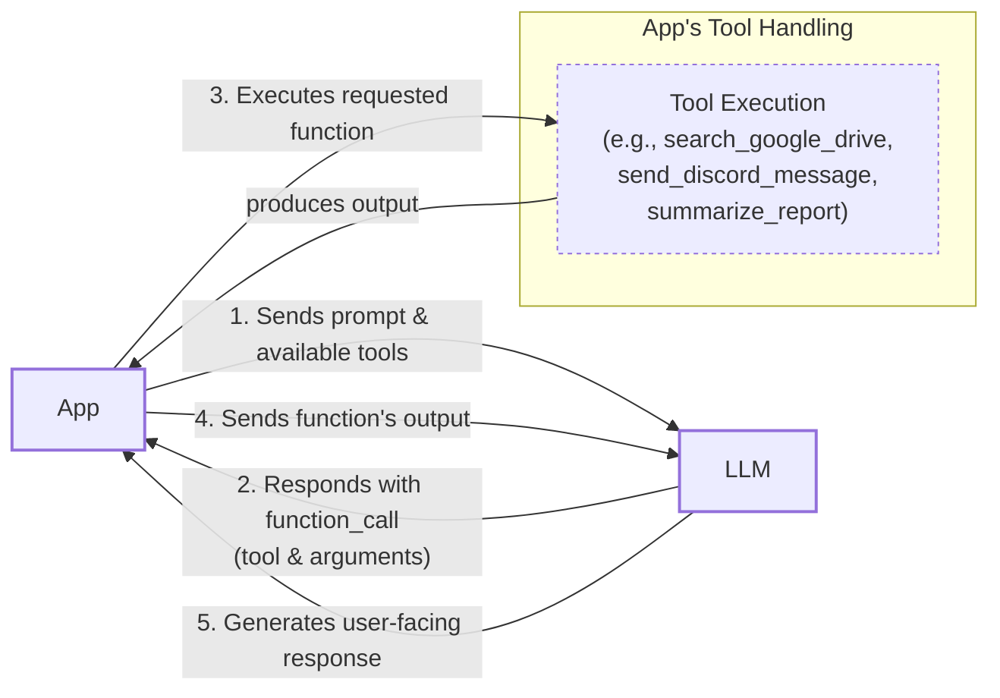
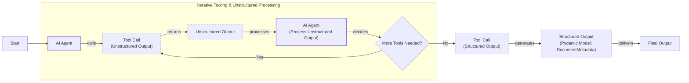
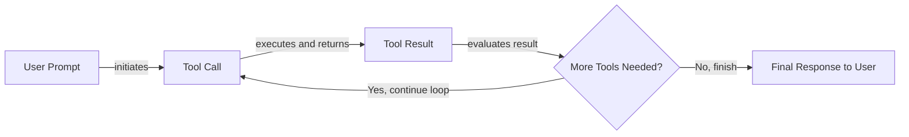

# Lesson 6: Agent Tools & Function Calling

In the previous lessons, you built a foundation in AI Engineering. You mapped the agent landscape, distinguished between LLM workflows and AI agents, engineered context, and enforced structured outputs. These skills allow you to control the information flowing into and out of an LLM. Now, you will give your systems the ability to act.

This lesson explores tool usage, the mechanism that transforms an LLM from a passive text generator into an agent that can interact with the external world. For an AI Engineer, understanding tools is not optional. It is the core competency that allows you to build systems that can access real-time data, execute code, and connect to any API. We will open the black box of function calling to show you how agents work, enabling you to build, debug, and monitor them effectively.

## Understanding Why Agents Need Tools

LLMs have a fundamental limitation: they are sophisticated pattern matchers and text generators. Their knowledge is confined to the data they were trained on, and they cannot, by themselves, interact with the world. This limitation is addressed by tools. If the LLM is the brain, tools are its hands and senses, allowing it to perceive and act beyond its internal knowledge.

Tools are the bridge between an LLM's reasoning and the outside world. By giving an LLM access to tools, we transform it into an AI agent capable of executing actions. This is the essence of function calling. An agent with tools can go beyond simple text generation to solve real-world problems by grounding its reasoning in external information and actions.

A few examples of tools that power modern AI agents include:
- **Accessing real-time information:** Using APIs to get today's weather, the latest news, or stock prices [[1]](https://arxiv.org/html/2507.08034v1).
- **Interacting with databases:** Querying a PostgreSQL database, a Snowflake data warehouse, or an S3 data lake using text-to-SQL or other data retrieval methods [[2]](https://neo4j.com/blog/agentic-ai/connected-context-and-persistent-memory-neo4j-providers-for-the-microsoft-agent-framework/), [[3]](https://promethium.ai/guides/text-to-sql-basics-benefits/).
- **Accessing long-term memory:** Retrieving information from vector or graph databases to remember past interactions and user preferences, which we will cover in Lesson 9 [[2]](https://neo4j.com/blog/agentic-ai/connected-context-and-persistent-memory-neo4j-providers-for-the-microsoft-agent-framework/), [[4]](https://www.ruh.ai/blogs/how-vector-databases-are-rewiring-the-tech-industry).
- **Executing code:** Running Python or JavaScript in a sandboxed environment to perform precise calculations, manipulate data, or generate visualizations [[5]](https://medium.com/@anicomanesh/how-llm-reasoning-powers-the-agentic-ai-revolution-cbefd10ebf3f).

By equipping an agent with these capabilities, you can build systems that are not only knowledgeable but also actionable.

## Implementing Tool Calls from Scratch

The best way to understand how an LLM uses tools is to build the mechanism from scratch. This section will walk you through how a tool is defined, how its schema is communicated to the model, and how the agent executes the function call.

Our goal is to give the LLM a list of available tools and let it decide which one to use and with what arguments to fulfill a user's request. The process follows a five-step flow:

1.  **You:** Send the LLM a prompt and a list of available tools defined by their function schemas.
2.  **LLM:** Responds with a `function_call` request, specifying the tool name and the arguments.
3.  **You:** Parse the response and execute the requested function in your code.
4.  **You:** Send the function's output back to the LLM as context.
5.  **LLM:** Uses the tool's output to generate a final, user-facing response.

This request-execute-respond cycle is the foundation of all tool-using agents.


Image 1: A flowchart illustrating the 5-step request-execute-respond flow of calling a tool.

Let's implement this flow. We will build a simple agent that can search for a financial report on Google Drive, summarize it, and send the summary to a Discord channel.

### Setup and Tool Definition

First, we set up our environment by importing the necessary libraries and initializing the Gemini client. We will use the `gemini-2.5-flash` model and a sample document to mock the content of a file.
```python
import json
from typing import Any

from google import genai
from google.genai import types
from pydantic import BaseModel, Field

from lessons.utils import env, pretty_print

env.load(required_env_vars=["GOOGLE_API_KEY"])

client = genai.Client()

MODEL_ID = "gemini-2.5-flash"

DOCUMENT = """
# Q3 2023 Financial Performance Analysis

The Q3 earnings report shows a 20% increase in revenue and a 15% growth in user engagement, 
beating market expectations. These impressive results reflect our successful product strategy 
and strong market positioning.

Our core business segments demonstrated remarkable resilience, with digital services leading 
the growth at 25% year-over-year. The expansion into new markets has proven particularly 
successful, contributing to 30% of the total revenue increase.

Customer acquisition costs decreased by 10% while retention rates improved to 92%, 
marking our best performance to date. These metrics, combined with our healthy cash flow 
position, provide a strong foundation for continued growth into Q4 and beyond.
"""
```
Next, we define our three mock tools as Python functions. The function signatures and docstrings are important, as the LLM will use them to understand what each tool does.
```python
def search_google_drive(query: str) -> dict:
    """
    Searches for a file on Google Drive and returns its content or a summary.

    Args:
        query (str): The search query to find the file, e.g., 'Q3 earnings report'.

    Returns:
        dict: A dictionary representing the search results, including file names and summaries.
    """
    return {
        "files": [
            {
                "name": "Q3_Earnings_Report_2024.pdf",
                "id": "file12345",
                "content": DOCUMENT,
            }
        ]
    }
```
```python
def send_discord_message(channel_id: str, message: str) -> dict:
    """
    Sends a message to a specific Discord channel.

    Args:
        channel_id (str): The ID of the channel to send the message to, e.g., '#finance'.
        message (str): The content of the message to send.

    Returns:
        dict: A dictionary confirming the action, e.g., {"status": "success"}.
    """
    return {
        "status": "success",
        "status_code": 200,
        "channel": channel_id,
        "message_preview": f"{message[:50]}...",
    }
```
```python
def summarize_financial_report(text: str) -> str:
    """
    Summarizes a financial report.

    Args:
        text (str): The text to summarize.

    Returns:
        str: The summary of the text.
    """
    return "The Q3 2023 earnings report shows strong performance across all metrics with 20% revenue growth, 15% user engagement increase, 25% digital services growth, and improved retention rates of 92%."
```

### Creating Tool Schemas

For the LLM to use these functions, we must describe them in a format it understands. We define a schema for each tool, typically in JSON. This schema tells the LLM the tool's `name`, its `description`, and the `parameters` it accepts, including their names, types, and whether they are required. This schema-based approach is the industry standard used by APIs from OpenAI, Google, and Anthropic [[6]](https://myengineeringpath.dev/tools/gemini-guide/), [[7]](https://apxml.com/courses/prompt-engineering-llm-application-development/chapter-4-interacting-with-llm-apis/overview-common-llm-apis).
```python
search_google_drive_schema = {
    "name": "search_google_drive",
    "description": "Searches for a file on Google Drive and returns its content or a summary.",
    "parameters": {
        "type": "object",
        "properties": {
            "query": {
                "type": "string",
                "description": "The search query to find the file, e.g., 'Q3 earnings report'.",
            }
        },
        "required": ["query"],
    },
}

send_discord_message_schema = {
    "name": "send_discord_message",
    "description": "Sends a message to a specific Discord channel.",
    "parameters": {
        "type": "object",
        "properties": {
            "channel_id": {
                "type": "string",
                "description": "The ID of the channel to send the message to, e.g., '#finance'.",
            },
            "message": {
                "type": "string",
                "description": "The content of the message to send.",
            },
        },
        "required": ["channel_id", "message"],
    },
}

summarize_financial_report_schema = {
    "name": "summarize_financial_report",
    "description": "Summarizes a financial report.",
    "parameters": {
        "type": "object",
        "properties": {
            "text": {
                "type": "string",
                "description": "The text to summarize.",
            },
        },
        "required": ["text"],
    },
}
```
We then create a tool registry to map tool names to their corresponding functions and schemas.
```python
TOOLS = {
    "search_google_drive": {
        "handler": search_google_drive,
        "declaration": search_google_drive_schema,
    },
    "send_discord_message": {
        "handler": send_discord_message,
        "declaration": send_discord_message_schema,
    },
    "summarize_financial_report": {
        "handler": summarize_financial_report,
        "declaration": summarize_financial_report_schema,
    },
}
TOOLS_BY_NAME = {tool_name: tool["handler"] for tool_name, tool in TOOLS.items()}
TOOLS_SCHEMA = [tool["declaration"] for tool in TOOLS.values()]
```
The `TOOLS_BY_NAME` mapping gives us easy access to the callable functions.
It outputs:
```text
{'search_google_drive': <function search_google_drive at 0x104c7df80>, 'send_discord_message': <function send_discord_message at 0x104c7de40>, 'summarize_financial_report': <function summarize_financial_report at 0x1274f5c60>}
```
And `TOOLS_SCHEMA` contains the list of definitions we will pass to the LLM. Here is the schema for `search_google_drive`.
It outputs:
```json
{
    "name": "search_google_drive",
    "description": "Searches for a file on Google Drive and returns its content or a summary.",
    "parameters": {
        "type": "object",
        "properties": {
            "query": {
                "type": "string",
                "description": "The search query to find the file, e.g., 'Q3 earnings report'."
            }
        },
        "required": [
            "query"
        ]
    }
}
```

### Building the System Prompt

Now, we create a system prompt to instruct the LLM on how to use these tools. This prompt includes guidelines, the required output format, and the list of available tool schemas enclosed in XML tags.
```python
TOOL_CALLING_SYSTEM_PROMPT = """
You are a helpful AI assistant with access to tools that enable you to take actions and retrieve information to better 
assist users.

## Tool Usage Guidelines

**When to use tools:**
- When you need information that is not in your training data
- When you need to perform actions in external systems and environments
- When you need real-time, dynamic, or user-specific data
- When computational operations are required

**Tool selection:**
- Choose the most appropriate tool based on the user's specific request
- If multiple tools could work, select the one that most directly addresses the need
- Consider the order of operations for multi-step tasks

**Parameter requirements:**
- Provide all required parameters with accurate values
- Use the parameter descriptions to understand expected formats and constraints
- Ensure data types match the tool's requirements (strings, numbers, booleans, arrays)

## Tool Call Format

When you need to use a tool, output ONLY the tool call in this exact format:

```tool_call
{{"name": "tool_name", "args": {{"param1": "value1", "param2": "value2"}}}}
```

**Critical formatting rules:**
- Use double quotes for all JSON strings
- Ensure the JSON is valid and properly escaped
- Include ALL required parameters
- Use correct data types as specified in the tool definition
- Do not include any additional text or explanation in the tool call

## Response Behavior

- If no tools are needed, respond directly to the user with helpful information
- If tools are needed, make the tool call first, then provide context about what you're doing
- After receiving tool results, provide a clear, user-friendly explanation of the outcome
- If a tool call fails, explain the issue and suggest alternatives when possible

## Available Tools

<tool_definitions>
{tools}
</tool_definitions>

Remember: Your goal is to be maximally helpful to the user. Use tools when they add value, but don't use them unnecessarily. Always prioritize accuracy and user experience.
"""
```
Tool calling works in two main stages. First, the LLM *decides* which tool to use. It makes this decision by matching the user's query against the `description` field in the tool schemas. This process is not just a simple keyword match; the model performs a semantic search, effectively looking for the nearest neighbor in an embedding space that aligns your intent with the tool's documented purpose [[9]](https://mbrenndoerfer.com/writing/function-calling-llm-structured-tools). This is why writing clear, articulate, and mutually exclusive tool descriptions is essential. It is helpful to think of tool schemas not as rigid API contracts, but as prompts themselves, guiding the model's reasoning [[23]](https://tianpan.co/blog/2026-04-28-tool-schemas-are-prompts-not-api-contracts). Vague descriptions like "search documents" and "search files" will confuse the model, leading to measurable drops in reliability; enterprises track this using metrics like tool selection accuracy, which can fall significantly with ambiguous schemas [[24]](https://aws.amazon.com/blogs/machine-learning/ai-agents-in-enterprises-best-practices-with-amazon-bedrock-agentcore/). Instead, be explicit: "search documents on Google Drive" versus "search files on the local disk." This clarity becomes critical as you scale to dozens of tools. Second, after selecting a tool, the LLM *generates* the required arguments as a structured output, like JSON. Models are specifically trained through instruction fine-tuning to interpret these schemas and produce valid tool calls [[8]](https://www.anthropic.com/research/building-effective-agents), [[9]](https://mbrenndoerfer.com/writing/function-calling-llm-structured-tools).

### Making the First Tool Call

Let's test our system. We will ask the agent to find a report and share key insights.
```python
USER_PROMPT = """
Can you help me find the latest quarterly report and share key insights with the team?
"""

messages = [TOOL_CALLING_SYSTEM_PROMPT.format(tools=str(TOOLS_SCHEMA)), USER_PROMPT]

response = client.models.generate_content(
    model=MODEL_ID,
    contents=messages,
)
```
It outputs:
```text
```tool_call
{"name": "search_google_drive", "args": {"query": "latest quarterly report"}}
```
```
The model correctly identified the `search_google_drive` tool and generated the appropriate query. Here is a more complex example involving multiple steps.
```python
USER_PROMPT = """
Please find the Q3 earnings report on Google Drive and send a summary of it to 
the #finance channel on Discord.
"""

messages = [TOOL_CALLING_SYSTEM_PROMPT.format(tools=str(TOOLS_SCHEMA)), USER_PROMPT]

response = client.models.generate_content(
    model=MODEL_ID,
    contents=messages,
)
```
It outputs:
```text
```tool_call
{"name": "search_google_drive", "args": {"query": "Q3 earnings report"}}
```
```
The LLM correctly determines that the first step is to find the document.

### Executing the Tool Call

Now, we need to parse the LLM's response and execute the function. First, we extract the JSON string from the response.
```python
def extract_tool_call(response_text: str) -> str:
    """
    Extracts the tool call from the response text.
    """
    return response_text.split("```tool_call")[1].split("```")[0].strip()


tool_call_str = extract_tool_call(response.text)
```
It outputs:
```text
'{"name": "search_google_drive", "args": {"query": "Q3 earnings report"}}'
```
Next, we parse the string into a Python dictionary.
```python
tool_call = json.loads(tool_call_str)
```
It outputs:
```text
{'name': 'search_google_drive', 'args': {'query': 'Q3 earnings report'}}
```
We retrieve the corresponding function handler from our `TOOLS_BY_NAME` registry.
```python
tool_handler = TOOLS_BY_NAME[tool_call["name"]]
```
It outputs:
```text
<function search_google_drive at 0x104c7df80>
```
Finally, we call the function with the arguments generated by the LLM.
```python
tool_result = tool_handler(**tool_call["args"])
```
It outputs:
```json
{
    "files": [
        {
            "name": "Q3_Earnings_Report_2024.pdf",
            "id": "file12345",
            "content": "\n# Q3 2023 Financial Performance Analysis\n\nThe Q3 earnings report shows a 20% increase in revenue and a 15% growth in user engagement, \nbeating market expectations. These impressive results reflect our successful product strategy \nand strong market positioning.\n\nOur core business segments demonstrated remarkable resilience, with digital services leading \nthe growth at 25% year-over-year. The expansion into new markets has proven particularly \nsuccessful, contributing to 30% of the total revenue increase.\n\nCustomer acquisition costs decreased by 10% while retention rates improved to 92%, \nmarking our best performance to date. These metrics, combined with our healthy cash flow \nposition, provide a strong foundation for continued growth into Q4 and beyond.\n"
        }
    ]
}
```
We can wrap this logic in a helper function to streamline the process.
```python
def call_tool(response_text: str, tools_by_name: dict) -> Any:
    """
    Call a tool based on the response from the LLM.
    """

    tool_call_str = extract_tool_call(response_text)
    tool_call = json.loads(tool_call_str)
    tool_name = tool_call["name"]
    tool_args = tool_call["args"]
    tool = tools_by_name[tool_name]

    return tool(**tool_args)
```
Using our new function yields the same result.
```python
call_tool(response.text, tools_by_name=TOOLS_BY_NAME)
```
It outputs:
```json
{'files': [{'name': 'Q3_Earnings_Report_2024.pdf',
   'id': 'file12345',
   'content': '\n# Q3 2023 Financial Performance Analysis\n\nThe Q3 earnings report shows a 20% increase in revenue and a 15% growth in user engagement, \nbeating market expectations. These impressive results reflect our successful product strategy \nand strong market positioning.\n\nOur core business segments demonstrated remarkable resilience, with digital services leading \nthe growth at 25% year-over-year. The expansion into new markets has proven particularly \nsuccessful, contributing to 30% of the total revenue increase.\n\nCustomer acquisition costs decreased by 10% while retention rates improved to 92%, \nmarking our best performance to date. These metrics, combined with our healthy cash flow \nposition, provide a strong foundation for continued growth into Q4 and beyond.\n'}]}
```
The final step is to send the tool's output back to the LLM. The model uses this new information to either generate a final answer for the user or decide on the next action.
```python
response = client.models.generate_content(
    model=MODEL_ID,
    contents=f"Interpret the tool result: {json.dumps(tool_result, indent=2)}",
)
```
It outputs:
```text
The tool result provides the content of a file named `Q3_Earnings_Report_2024.pdf`.

This document is a **Q3 2023 Financial Performance Analysis** and details exceptionally strong results, significantly beating market expectations.

**Key highlights from the report include:**

*   **Revenue Growth:** A 20% increase in revenue.
*   **User Engagement:** 15% growth in user engagement.
*   **Core Business Performance:** Digital services led growth at 25% year-over-year.
*   **Market Expansion Success:** New markets contributed 30% of the total revenue increase.
*   **Efficiency & Retention:**
    *   Customer acquisition costs decreased by 10%.
    *   Retention rates improved to 92%, marking the best performance to date.
*   **Financial Health:** The company maintains a healthy cash flow position.

The report attributes these impressive results to a successful product strategy and strong market positioning, indicating a robust foundation for continued growth into Q4 and beyond.
```
This from-scratch implementation reveals the core mechanics of tool calling. Next, we will see how to abstract away some of this boilerplate code to build a more scalable system.

## Implementing a Tool Calling Framework from Scratch

Manually defining a JSON schema for every function is tedious and error-prone. Production frameworks like LangGraph and emerging protocols like MCP (Model-Context-Protocol) simplify this by using a `@tool` decorator [[10]](https://www.decodingai.com/p/tool-calling-from-scratch-to-production). This approach reflects a broader industry trend toward standardized communication for collaborative agent ecosystems [[25]](https://arxiv.org/html/2601.13671v1). The decorator automatically inspects a function's signature and docstring to generate the required schema.

This approach follows the Don't Repeat Yourself (DRY) principle by creating a single source of truth for both the function's implementation and its schema [[11]](https://pydantic.dev/docs/ai/tools-toolsets/tools/), [[12]](https://docs.langchain.com/oss/python/langchain/tools). Let's build our own simple framework to demonstrate this.

### The @tool Decorator

In Python, a decorator is a function that takes another function as an argument, adds some functionality, and returns the modified function. They are a powerful feature for extending behavior without permanently modifying the original function's code. We will use a decorator to wrap our tool functions, automatically extracting their metadata and generating a schema. This keeps our code clean and centralizes the logic for how tools are defined, making the system easier to maintain and scale.

First, we define a `ToolFunction` class to wrap our decorated functions and hold their schemas.
```python
from inspect import Parameter, signature
from typing import Any, Callable, Dict, Optional


class ToolFunction:
    def __init__(self, func: Callable, schema: Dict[str, Any]) -> None:
        self.func = func
        self.schema = schema
        self.__name__ = func.__name__
        self.__doc__ = func.__doc__

    def __call__(self, *args: Any, **kwargs: Any) -> Any:
        return self.func(*args, **kwargs)
```
Next, we create the `@tool` decorator. It inspects the function's signature to build the `parameters` schema and uses the docstring for the `description`.
```python
def tool(description: Optional[str] = None) -> Callable[[Callable], ToolFunction]:
    """
    A decorator that creates a tool schema from a function.

    Args:
        description: Optional override for the function's docstring

    Returns:
        A decorator function that wraps the original function and adds a schema
    """

    def decorator(func: Callable) -> ToolFunction:
        # Get function signature
        sig = signature(func)

        # Create parameters schema
        properties = {}
        required = []

        for param_name, param in sig.parameters.items():
            # Skip self for methods
            if param_name == "self":
                continue

            param_schema = {
                "type": "string",  # Default to string, can be enhanced with type hints
                "description": f"The {param_name} parameter",  # Default description
            }

            # Add to required if parameter has no default value
            if param.default == Parameter.empty:
                required.append(param_name)

            properties[param_name] = param_schema

        # Create the tool schema
        schema = {
            "name": func.__name__,
            "description": description or func.__doc__ or f"Executes the {func.__name__} function.",
            "parameters": {
                "type": "object",
                "properties": properties,
                "required": required,
            },
        }

        return ToolFunction(func, schema)

    return decorator
```

### Decorating the Functions

Now, we can redefine our tools using the new decorator. The code is much cleaner as we no longer need to write the schemas by hand.
```python
@tool()
def search_google_drive_example(query: str) -> dict:
    """Search for files in Google Drive."""
    return {"files": ["Q3 earnings report"]}


@tool()
def send_discord_message_example(channel_id: str, message: str) -> dict:
    """Send a message to a Discord channel."""
    return {"message": "Message sent successfully"}


@tool()
def summarize_financial_report_example(text: str) -> str:
    """Summarize the contents of a financial report."""
    return "Financial report summarized successfully"
```
We collect the decorated functions into a list and create our mappings.
```python
tools = [
    search_google_drive_example,
    send_discord_message_example,
    summarize_financial_report_example,
]
tools_by_name = {tool.schema["name"]: tool.func for tool in tools}
tools_schema = [tool.schema for tool in tools]
```
The decorated function is now a `ToolFunction` object.
It outputs:
```text
<class '__main__.ToolFunction'>
```
This object contains both the generated schema and the original function handler.
It outputs:
```json
{
    "name": "search_google_drive_example",
    "description": "Search for files in Google Drive.",
    "parameters": {
        "type": "object",
        "properties": {
            "query": {
                "type": "string",
                "description": "The query parameter"
            }
        },
        "required": [
            "query"
        ]
    }
}
```
The original function is accessible via the `.func` attribute.
It outputs:
```text
<function search_google_drive_example at 0x12750eef0>
```

### Testing the Framework

Let's test it with the same multi-step prompt.
```python
USER_PROMPT = """
Please find the Q3 earnings report on Google Drive and send a summary of it to 
the #finance channel on Discord.
"""

messages = [TOOL_CALLING_SYSTEM_PROMPT.format(tools=str(tools_schema)), USER_PROMPT]

response = client.models.generate_content(
    model=MODEL_ID,
    contents=messages,
)
```
It outputs:
```text
```tool_call
{"name": "search_google_drive_example", "args": {"query": "Q3 earnings report"}}
```
```
The execution logic remains the same, and it works as expected.
```python
call_tool(response.text, tools_by_name=tools_by_name)
```
It outputs:
```json
{
    "files": [
        "Q3 earnings report"
    ]
}
```
However, while decorators solve schema generation, they do not address all production challenges at scale. Issues like token bloat from large schemas and schema drift—where underlying function changes break the agent—still require careful engineering [[26]](https://www.decodingai.com/p/scaling-120-ai-agents-two-tier-orchestration), [[27]](https://medium.com/data-science-collective/why-ai-agents-keep-failing-in-production-cdd335b22219).

Voilà! We have built a small, reusable tool-calling framework. This implementation is conceptually similar to what production frameworks do under the hood.

## Implementing Production-Level Tool Calls with Gemini

While building from scratch is a great learning exercise, in production, you should use the native tool-calling capabilities of your chosen LLM provider, like Gemini or OpenAI. These APIs are optimized for their specific models, making them more robust, efficient, and easier to maintain [[10]](https://www.decodingai.com/p/tool-calling-from-scratch-to-production). This increased reliability is measurable; production tracking shows native Gemini tool calls can achieve over 98% schema compliance, eliminating the malformed JSON outputs that require extensive validation in manual approaches [[28]](https://lablab.ai/ai-tutorials/building-voice-agents-gemini-live-fastapi).

Let's see how to refactor our example using Gemini's native API.

### Configuring Gemini with Tool Schemas

Instead of a lengthy system prompt, we define a `GenerateContentConfig` object and pass our tool schemas to it. This object is the central place for configuring how the model generates content. The `tool_config` parameter within it allows us to control the function-calling behavior. By setting the `mode` to `"ANY"`, we instruct the model that it must call one of the provided functions, rather than generating a text response.
```python
tools = [
    types.Tool(
        function_declarations=[
            types.FunctionDeclaration(**search_google_drive_schema),
            types.FunctionDeclaration(**send_discord_message_schema),
        ]
    )
]
config = types.GenerateContentConfig(
    tools=tools,
    tool_config=types.ToolConfig(function_calling_config=types.FunctionCallingConfig(mode="ANY")),
)
```
Now, we can call the model with just the user prompt. The Gemini API handles the complex instructions internally, ensuring the model knows how to use the provided tools.
```python
response = client.models.generate_content(
    model=MODEL_ID,
    contents=USER_PROMPT,
    config=config,
)
```
The response contains a `function_call` object.
It outputs:
```text
function_call: name: "search_google_drive"
args {
  fields {
    key: "query"
    value {
      string_value: "Q3 earnings report"
    }
  }
}
```

### Simplifying with Direct Function Passing

The `google-genai` SDK simplifies this even further. Instead of manually creating schemas, we can pass our Python functions directly to the `GenerateContentConfig`. The SDK automatically generates the schema from the function's signature, type hints, and docstring, just like our custom decorator.
```python
config = types.GenerateContentConfig(
    tools=[search_google_drive, send_discord_message],
    tool_config=types.ToolConfig(function_calling_config=types.FunctionCallingConfig(mode="ANY")),
)
```

### The Native Tool Calling Flow

We create a simplified `call_tool` function to work with Gemini's native `FunctionCall` object.
```python
def call_tool(function_call) -> any:
    tool_name = function_call.name
    tool_args = {key: value for key, value in function_call.args.items()}

    tool_handler = TOOLS_BY_NAME[tool_name]

    return tool_handler(**tool_args)


response_message_part = response.candidates[0].content.parts[0]
tool_result = call_tool(response_message_part.function_call)
```
It outputs:
```json
{
    "files": [
        {
            "name": "Q3_Earnings_Report_2024.pdf",
            "id": "file12345",
            "content": "\n# Q3 2023 Financial Performance Analysis\n\nThe Q3 earnings report shows a 20% increase in revenue and a 15% growth in user engagement, \nbeating market expectations. These impressive results reflect our successful product strategy \nand strong market positioning.\n\nOur core business segments demonstrated remarkable resilience, with digital services leading \nthe growth at 25% year-over-year. The expansion into new markets has proven particularly \nsuccessful, contributing to 30% of the total revenue increase.\n\nCustomer acquisition costs decreased by 10% while retention rates improved to 92%, \nmarking our best performance to date. These metrics, combined with our healthy cash flow \nposition, provide a strong foundation for continued growth into Q4 and beyond.\n"
        }
    ]
}
```
By leveraging the native SDK, we reduced dozens of lines of code to just a few, creating a more robust and maintainable system. Other popular APIs from OpenAI and Anthropic follow a similar logic, making these concepts easily transferable [[7]](https://apxml.com/courses/prompt-engineering-llm-application-development/chapter-4-interacting-with-llm-apis/overview-common-llm-apis), [[13]](https://www.getorchestra.io/guides/llm-providers-gen-ai-platforms-compared), [[14]](https://futuresearch.ai/blog/llm-provider-quirks/).

## Using Pydantic Models as Tools for On-Demand Structured Outputs

Connecting this lesson with what we learned in Lesson 4 on structured outputs, a powerful pattern emerges: using a Pydantic model as a tool. This allows an agent to perform several intermediate steps that may produce unstructured text, and then, when it's ready, call a final tool that forces the output into a clean, validated Pydantic object. This is ideal for scenarios where you need a structured result for downstream processing in your application code [[15]](https://pydantic.dev/docs/ai/core-concepts/output/), [[16]](https://pydantic.dev/docs/ai/guides/multi-agent-applications/), [[17]](https://discuss.ai.google.dev/t/response-schema-from-pydantic/50028).

This pattern introduces a latency trade-off. Each on-demand structuring step requires an additional LLM call, which increases the total response time. However, this extra call improves accuracy by focusing the model on a single extraction task and helps prevent the context window from overflowing with unprocessed data from previous tool calls [[29]](https://xebia.com/blog/how-to-get-the-most-out-of-your-agents-part-i/). The validation step itself, powered by Pydantic, adds minimal overhead as its core components are highly optimized [[30]](https://tetrate.io/learn/ai/llm-output-parsing-structured-generation).


Image 2: A flowchart illustrating an AI agent calling multiple tools in a loop, processing unstructured outputs, and then making a structured tool call using a Pydantic model.

Let's see how to implement this.

### Defining the Pydantic Model

First, we define our `DocumentMetadata` Pydantic model, just as we did in Lesson 4.
```python
class DocumentMetadata(BaseModel):
    """A class to hold structured metadata for a document."""

    summary: str = Field(description="A concise, 1-2 sentence summary of the document.")
    tags: list[str] = Field(description="A list of 3-5 high-level tags relevant to the document.")
    keywords: list[str] = Field(description="A list of specific keywords or concepts mentioned.")
    quarter: str = Field(description="The quarter of the financial year described in the document (e.g., Q3 2023).")
    growth_rate: str = Field(description="The growth rate of the company described in the document (e.g., 10%).")
```

### Creating the Pydantic Tool

We then create a tool declaration where the function's parameters are defined by the Pydantic model's JSON schema.
```python
extraction_tool = types.Tool(
    function_declarations=[
        types.FunctionDeclaration(
            name="extract_metadata",
            description="Extracts structured metadata from a financial document.",
            parameters=DocumentMetadata.model_json_schema(),
        )
    ]
)
config = types.GenerateContentConfig(
    tools=[extraction_tool],
    tool_config=types.ToolConfig(function_calling_config=types.FunctionCallingConfig(mode="ANY")),
)
```

### Extracting and Validating the Output

We prompt the model to analyze the document and extract the metadata.
```python
prompt = f"""
Please analyze the following document and extract its metadata.

Document:
--- 
{DOCUMENT}
--- 
"""

response = client.models.generate_content(model=MODEL_ID, contents=prompt, config=config)
response_message_part = response.candidates[0].content.parts[0]
```
The model responds with a function call whose arguments match our Pydantic schema. We can then validate these arguments and instantiate our `DocumentMetadata` object, ensuring the data is correct and type-safe.
```python
if hasattr(response_message_part, "function_call"):
    function_call = response_message_part.function_call
    try:
        document_metadata = DocumentMetadata(**function_call.args)
        print("Pydantic Validated Object:")
        print(document_metadata.model_dump_json(indent=2))
    except Exception as e:
        print(f"Validation failed: {e}")
```
It outputs:
```json
Pydantic Validated Object:
{
  "summary": "The Q3 2023 earnings report shows a 20% increase in revenue and 15% growth in user engagement, driven by successful product strategy and market expansion. This performance provides a strong foundation for continued growth.",
  "tags": [
    "Financials",
    "Earnings",
    "Growth",
    "Business Strategy",
    "Market Analysis"
  ],
  "keywords": [
    "Revenue",
    "User Engagement",
    "Market Expansion",
    "Customer Acquisition",
    "Retention Rates",
    "Digital Services",
    "Cash Flow"
  ],
  "quarter": "Q3 2023",
  "growth_rate": "20%"
}
```
This pattern is widely used in agents that need to return structured data after completing a series of actions.

## The Downsides of Running Tools in a Loop

So far, we have focused on single tool calls. However, to build a true AI agent, we need to handle multi-step tasks. This requires running tools in a loop, allowing the LLM to chain multiple actions together and use the output of one tool to inform the input of the next.


Image 3: A flowchart illustrating a sequential tool calling loop.

This approach offers flexibility and allows agents to tackle complex problems. Let's implement a loop for our finance agent scenario.

### Configuring the Multi-Tool Agent

We configure the model with all three of our tools.
```python
tools = [
    types.Tool(
        function_declarations=[
            types.FunctionDeclaration(**search_google_drive_schema),
            types.FunctionDeclaration(**send_discord_message_schema),
            types.FunctionDeclaration(**summarize_financial_report_schema),
        ]
    )
]
config = types.GenerateContentConfig(
    tools=tools,
    tool_config=types.ToolConfig(function_calling_config=types.FunctionCallingConfig(mode="ANY")),
)
```
The user asks the agent to find the report, summarize it, and send the summary to Discord.
```python
USER_PROMPT = """
Please find the Q3 earnings report on Google Drive and send a summary of it to 
the #finance channel on Discord.
"""
messages = [USER_PROMPT]
```

### Implementing the Tool Loop

We start the loop by making the first call to the LLM.
```python
response = client.models.generate_content(
    model=MODEL_ID,
    contents=messages,
    config=config,
)
response_message_part = response.candidates[0].content.parts[0]
messages.append(response.candidates[0].content)
```
The model correctly identifies the first step: `search_google_drive`. We then enter a `while` loop that continues as long as the model requests a tool call. Inside the loop, we execute the tool, append the result to our message history, and call the model again to determine the next step.
```python
max_iterations = 3
while hasattr(response_message_part, "function_call") and max_iterations > 0:
    tool_result = call_tool(response_message_part.function_call)

    function_response_part = types.Part.from_function_response(
        name=response_message_part.function_call.name,
        response={"result": tool_result},
    )
    messages.append(function_response_part)

    response = client.models.generate_content(
        model=MODEL_ID,
        contents=messages,
        config=config,
    )

    response_message_part = response.candidates[0].content.parts[0]
    messages.append(response.candidates[0].content)

    max_iterations -= 1
```

### Analyzing the Loop's Output

The loop executes three times:
1.  `search_google_drive` is called, and its result (the document content) is returned.
2.  `summarize_financial_report` is called with the document content.
3.  `send_discord_message` is called with the summary.

While powerful, this simple loop is brittle and fails in production. Its primary weakness is the risk of **cascading failures**: an error from one tool is not caught but is instead passed as valid input to the next, compounding the problem at each step [[31]](https://futureagi.substack.com/p/how-tool-chaining-fails-in-production). Research shows this silent error propagation is the most common failure pattern in agentic systems [[31]](https://futureagi.substack.com/p/how-tool-chaining-fails-in-production).

The loop also doesn't allow the LLM to explicitly reason about a tool's output before deciding on the next action. Without a "thought" step, the agent can't interpret what it learned or adjust its strategy. This can lead to inefficient tool use, getting stuck in loops, or even "memory poisoning," where a hallucinated result from one step contaminates the entire subsequent workflow [[32]](https://galileo.ai/blog/multi-agent-ai-failures-prevention).

For tasks where tools are independent, we can run them in parallel to reduce latency. For example, fetching financial news and stock prices can happen simultaneously. However, for sequential tasks, this simple loop is not enough. These limitations led to the development of more sophisticated patterns like ReAct (Reasoning and Acting), which we will explore in detail in Lessons 7 and 8.

## Popular Tools Used Within the Industry

To ground these concepts in the real world, let's look at some of the most common tool categories used by AI engineers today.

**Knowledge & Memory Access**
These tools connect agents to external knowledge sources, allowing them to retrieve information beyond their training data. This is a key component of agentic RAG systems, which we will cover in Lesson 10.
- **Vector Databases:** Tools that query vector stores like Pinecone, Weaviate, or Qdrant to find semantically similar documents or data chunks [[4]](https://www.ruh.ai/blogs/how-vector-databases-are-rewiring-the-tech-industry/), [[20]](https://www.instaclustr.com/education/vector-database/top-10-open-source-vector-databases/).
- **Graph Databases:** Tools for querying knowledge graphs like Neo4j to retrieve structured information and understand relationships between entities [[2]](https://neo4j.com/blog/agentic-ai/connected-context-and-persistent-memory-neo4j-providers-for-the-microsoft-agent-framework/).
- **Text-to-SQL:** Tools that translate natural language queries into SQL, allowing agents to interact with traditional relational databases like PostgreSQL or MySQL [[3]](https://promethium.ai/guides/text-to-sql-basics-benefits/).

**Web Search & Browsing**
These tools give agents access to the live internet, enabling them to find real-time information.
- **Search APIs:** Tools that integrate with search engines like Google, Bing, or Brave to perform web searches and retrieve up-to-date results [[1]](https://arxiv.org/html/2507.08034v1).
- **Web Scraping:** Tools that can fetch and parse the content of web pages, extracting specific data for the agent to use.

**Code Execution**
Code execution tools turn the LLM into a powerful computational engine.
- **Python Interpreter:** A tool that allows the agent to write and execute Python code in a sandboxed environment. This is invaluable for mathematical calculations, data analysis, and generating visualizations [[5]](https://medium.com/@anicomanesh/how-llm-reasoning-powers-the-agentic-ai-revolution-cbefd10ebf3f).

**Other Popular Tools**
- **External APIs:** Tools that connect to third-party services like calendars, email clients, or project management software, allowing agents to perform actions in the enterprise world [[21]](https://medium.com/@yugalnandurkar5/llm-engineering-part-i-fa48d4307d26).
- **File System Operations:** Tools that let agents read and write files on a local or remote file system, essential for productivity applications [[22]](https://lnu.diva-portal.org/smash/get/diva2:1801354/FULLTEXT01.pdf).

## Conclusion

Tool calling is the backbone of modern AI agents. It is the skill that bridges the gap between language and action. By understanding how to define, call, and chain tools—from scratch and with production-grade APIs—you have learned one of the most important concepts in AI Engineering.

However, as we saw, simply running tools in a loop is not enough. To build truly intelligent agents, we need to give them the ability to reason about their actions. In our next lesson, we will explore the theory behind planning and the ReAct pattern, setting the stage for building more sophisticated and reliable agents.

## References

- [1] https://arxiv.org/html/2507.08034v1
- [2] https://neo4j.com/blog/agentic-ai/connected-context-and-persistent-memory-neo4j-providers-for-the-microsoft-agent-framework/
- [3] https://promethium.ai/guides/text-to-sql-basics-benefits/
- [4] https://www.ruh.ai/blogs/how-vector-databases-are-rewiring-the-tech-industry
- [5] https://medium.com/@anicomanesh/how-llm-reasoning-powers-the-agentic-ai-revolution-cbefd10ebf3f
- [6] https://myengineeringpath.dev/tools/gemini-guide/
- [7] https://apxml.com/courses/prompt-engineering-llm-application-development/chapter-4-interacting-with-llm-apis/overview-common-llm-apis
- [8] https://www.anthropic.com/research/building-effective-agents
- [9] https://mbrenndoerfer.com/writing/function-calling-llm-structured-tools
- [10] https://www.decodingai.com/p/tool-calling-from-scratch-to-production
- [11] https://pydantic.dev/docs/ai/tools-toolsets/tools/
- [12] https://docs.langchain.com/oss/python/langchain/tools
- [13] https://www.getorchestra.io/guides/llm-providers-gen-ai-platforms-compared
- [14] https://futuresearch.ai/blog/llm-provider-quirks/
- [15] https://pydantic.dev/docs/ai/core-concepts/output/
- [16] https://pydantic.dev/docs/ai/guides/multi-agent-applications/
- [17] https://discuss.ai.google.dev/t/response-schema-from-pydantic/50028
- [18] https://myengineeringpath.dev/genai-engineer/agentic-patterns/
- [19] https://blogs.oracle.com/developers/what-is-the-ai-agent-loop-the-core-architecture-behind-autonomous-ai-systems
- [20] https://www.instaclustr.com/education/vector-database/top-10-open-source-vector-databases/
- [21] https://medium.com/@yugalnandurkar5/llm-engineering-part-i-fa48d4307d26
- [22] https://lnu.diva-portal.org/smash/get/diva2:1801354/FULLTEXT01.pdf
- [23] https://tianpan.co/blog/2026-04-28-tool-schemas-are-prompts-not-api-contracts
- [24] https://aws.amazon.com/blogs/machine-learning/ai-agents-in-enterprises-best-practices-with-amazon-bedrock-agentcore/
- [25] https://arxiv.org/html/2601.13671v1
- [26] https://www.decodingai.com/p/scaling-120-ai-agents-two-tier-orchestration
- [27] https://medium.com/data-science-collective/why-ai-agents-keep-failing-in-production-cdd335b22219
- [28] https://lablab.ai/ai-tutorials/building-voice-agents-gemini-live-fastapi
- [29] https://xebia.com/blog/how-to-get-the-most-out-of-your-agents-part-i/
- [30] https://tetrate.io/learn/ai/llm-output-parsing-structured-generation
- [31] https://futureagi.substack.com/p/how-tool-chaining-fails-in-production
- [32] https://galileo.ai/blog/multi-agent-ai-failures-prevention
- [33] https://www.philschmid.de/gemini-function-calling
- [34] https://ai.google.dev/gemini-api/docs/function-calling
- [35] https://community.openai.com/t/prompting-best-practices-for-tool-use-function-calling/1123036
- [36] https://medium.com/@hariomshahu101/building-production-ready-llm-applications-bulletproof-llm-tool-calling-with-advanced-json-b95ce8889f4e
- [37] https://tetrate.io/learn/ai/llm-output-parsing-structured-generation
- [38] https://apxml.com/courses/building-advanced-llm-agent-tools/chapter-1-llm-agent-tooling-foundations/tool-input-output-schemas
- [39] https://openai.github.io/openai-agents-python/tools/
- [40] https://reference.langchain.com/python/langchain-core/tools/convert/tool
- [41] https://pub.towardsai.net/tool-descriptions-are-critical-making-better-llm-tools-research-capability-b315851471e7
- [42] https://medium.com/@abhaychougule0907/underlying-factors-behind-inconsistency-in-llm-responses-with-multi-tool-calling-628ce7b4de76
- [43] https://arxiv.org/html/2505.18135v2
- [44] https://www.newsletter.swirlai.com/p/building-ai-agents-from-scratch-part
- [45] https://www.youtube.com/watch?v=h8gMhXYAv1k
- [46] https://www.deeplearning.ai/the-batch/agentic-design-patterns-part-3-tool-use/
- [47] https://dev.to/jamesli/react-vs-plan-and-execute-a-practical-comparison-of-llm-agent-patterns-4gh9
- [48] https://www.youtube.com/watch?v=ApoDzZP8_ck
- [49] https://arxiv.org/pdf/2401.17464v3
- [50] https://platform.openai.com/docs/guides/function-calling