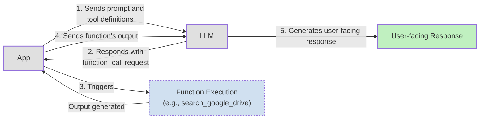
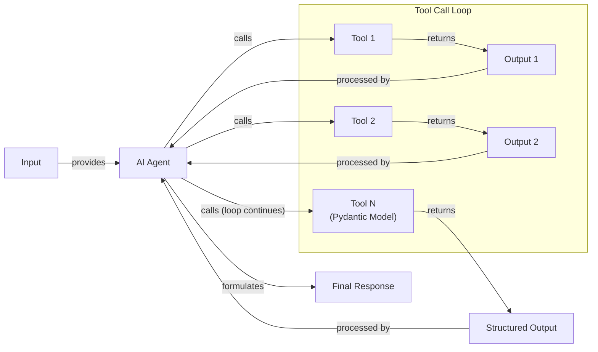
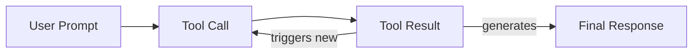

# Lesson 6: Agent Tools & Function Calling

In the previous lessons, we explored the landscape of AI engineering, distinguished between LLM workflows and agents, and delved into context engineering and structured outputs. We have learned how to design systems that feed the right information to an LLM and get predictable, machine-readable data out. Now, we will give our systems the ability to act.

So far, our LLM has been a passive processor of information. To build true AI agents, we need to bridge the gap between the model's internal reasoning and the external world. This is where tools, also known as function calling, come in. They are the mechanisms that transform an LLM from a simple text generator into an agent that can take action, interact with external systems, and affect its environment. Understanding how tools work is not just a technical skill; it is a foundational block for building, improving, and debugging any modern AI application.

## Understanding Why Agents Need Tools

LLMs have a fundamental limitation: they are sophisticated pattern matchers and text generators, but they cannot perform actions or access real-time information on their own. All their knowledge is frozen in their weights from the time of training. This is where tools come in. If the LLM is the brain of an agent, tools are its "hands and senses," allowing it to perceive and act in the world beyond its pre-trained knowledge.

This concept of an agent taking action is not new; it draws parallels with traditional robotic planning. However, where classical robotics often relies on formal, structured languages and algorithms like A* for provably optimal but rigid plans, LLM-based agents offer greater flexibility. They can interpret ambiguous natural language commands and use their general knowledge to make high-level decisions, trading some of the formal reliability of older systems for adaptability in complex, dynamic environments [[1]](https://mediatum.ub.tum.de/doc/1766834/1766834.pdf).

Tools are the bridge that connects an LLM's reasoning capabilities to external systems. By giving an LLM access to tools, we transform it into an AI agent that can execute specific instructions and interact with its environment. This enables a wide range of capabilities that are impossible for a standalone model.

Some of the most common applications for tools include:

-   **Accessing real-time information:** Tools can call external APIs to get up-to-the-minute data, such as today's weather, the latest news, or current stock prices.
-   **Interacting with databases:** Agents can use tools to query traditional databases like PostgreSQL or data warehouses like Snowflake, often using text-to-SQL to translate natural language into database queries.
-   **Accessing long-term memory:** Tools can connect to an agent's memory, stored in vector or graph databases, allowing it to recall information from past interactions that lie beyond its immediate context window.
-   **Executing code:** A Python interpreter tool allows an agent to run code in a sandboxed environment, which is invaluable for performing precise calculations, manipulating data, or creating visualizations.

By integrating these external capabilities, we overcome the core limitations of LLMs and unlock their potential to solve complex, real-world problems.

## Implementing tool calls from scratch

The best way to understand how an LLM uses tools is to implement the entire process from scratch. In this section, we will build a simple tool-calling mechanism to see how a tool is defined, how the LLM decides which one to call, and how we execute its request.

Our goal is to provide the LLM with a list of available tools and let it choose the right one, generating the correct arguments to call the associated function. The high-level process follows a five-step flow:

1.  **Application:** We send a prompt to the LLM that includes the user's query and the definitions of all available tools.
2.  **LLM:** The model analyzes the request and, if it decides a tool is needed, responds with a `function_call` request specifying the tool's name and the arguments.
3.  **Application:** Our code parses this request and executes the corresponding function with the provided arguments.
4.  **Application:** We then send the output from the function back to the LLM.
5.  **LLM:** The model uses the tool's output to generate a final, user-facing response.



Image 1: A 5-step request-execute-respond flow for tool calling.

Now, let's walk through a code example where we implement this flow. We will create a simple agent that can search for a financial report on a simulated Google Drive and send a summary to a Discord channel.

<aside>
💡

You can find all the code for this lesson in the accompanying notebook in our course's GitHub repository.

</aside>

1.  First, we set up our environment by importing the necessary libraries, loading our API key, and initializing the Gemini client. We will use the `gemini-2.5-flash` model, which is fast and cost-effective for these examples. We also define a sample `DOCUMENT` to simulate the content of a file we might find.
    ```python
    import json
    from typing import Any
    
    from google import genai
    from google.genai import types
    from pydantic import BaseModel, Field
    
    from lessons.utils import env, pretty_print
    
    env.load(required_env_vars=["GOOGLE_API_KEY"])
    
    client = genai.Client()
    
    MODEL_ID = "gemini-2.5-flash"
    
    DOCUMENT = """
    # Q3 2023 Financial Performance Analysis
    
    The Q3 earnings report shows a 20% increase in revenue and a 15% growth in user engagement, 
    beating market expectations. These impressive results reflect our successful product strategy 
    and strong market positioning.
    
    Our core business segments demonstrated remarkable resilience, with digital services leading 
    the growth at 25% year-over-year. The expansion into new markets has proven particularly 
    successful, contributing to 30% of the total revenue increase.
    
    Customer acquisition costs decreased by 10% while retention rates improved to 92%, 
    marking our best performance to date. These metrics, combined with our healthy cash flow 
    position, provide a strong foundation for continued growth into Q4 and beyond.
    """
    ```

2.  Next, we define three mock Python functions to act as our tools. To keep the focus on the tool-calling mechanism, these functions return hardcoded data instead of making real API calls.
    ```python
    def search_google_drive(query: str) -> dict:
        """
        Searches for a file on Google Drive and returns its content or a summary.
    
        Args:
            query (str): The search query to find the file, e.g., 'Q3 earnings report'.
    
        Returns:
            dict: A dictionary representing the search results, including file names and summaries.
        """
        return {
            "files": [
                {
                    "name": "Q3_Earnings_Report_2024.pdf",
                    "id": "file12345",
                    "content": DOCUMENT,
                }
            ]
        }
    ```
    ```python
    def send_discord_message(channel_id: str, message: str) -> dict:
        """
        Sends a message to a specific Discord channel.
    
        Args:
            channel_id (str): The ID of the channel to send the message to, e.g., '#finance'.
            message (str): The content of the message to send.
    
        Returns:
            dict: A dictionary confirming the action, e.g., {"status": "success"}.
        """
        return {
            "status": "success",
            "status_code": 200,
            "channel": channel_id,
            "message_preview": f"{message[:50]}...",
        }
    ```
    ```python
    def summarize_financial_report(text: str) -> str:
        """
        Summarizes a financial report.
    
        Args:
            text (str): The text to summarize.
    
        Returns:
            str: The summary of the text.
        """
        return "The Q3 2023 earnings report shows strong performance across all metrics with 20% revenue growth, 15% user engagement increase, 25% digital services growth, and improved retention rates of 92%."
    ```

3.  For the LLM to understand these tools, we must define a schema for each one. The schema, typically written in JSON, describes the tool's name, its purpose, and the parameters it accepts. This schema is the contract between our code and the LLM, and it is an industry standard used by major providers like OpenAI and Google [[2]](https://ai.google.dev/gemini-api/docs/function-calling), [[3]](https://platform.openai.com/docs/guides/function-calling).
    ```python
    search_google_drive_schema = {
        "name": "search_google_drive",
        "description": "Searches for a file on Google Drive and returns its content or a summary.",
        "parameters": {
            "type": "object",
            "properties": {
                "query": {
                    "type": "string",
                    "description": "The search query to find the file, e.g., 'Q3 earnings report'.",
                }
            },
            "required": ["query"],
        },
    }
    ```
    ```python
    send_discord_message_schema = {
        "name": "send_discord_message",
        "description": "Sends a message to a specific Discord channel.",
        "parameters": {
            "type": "object",
            "properties": {
                "channel_id": {
                    "type": "string",
                    "description": "The ID of the channel to send the message to, e.g., '#finance'.",
                },
                "message": {
                    "type": "string",
                    "description": "The content of the message to send.",
                },
            },
            "required": ["channel_id", "message"],
        },
    }
    ```
    ```python
    summarize_financial_report_schema = {
        "name": "summarize_financial_report",
        "description": "Summarizes a financial report.",
        "parameters": {
            "type": "object",
            "properties": {
                "text": {
                    "type": "string",
                    "description": "The text to summarize.",
                },
            },
            "required": ["text"],
        },
    }
    ```

4.  We then create a tool registry to map tool names to their corresponding functions and schemas. This makes it easy to look up and execute the correct tool later.
    ```python
    TOOLS = {
        "search_google_drive": {
            "handler": search_google_drive,
            "declaration": search_google_drive_schema,
        },
        "send_discord_message": {
            "handler": send_discord_message,
            "declaration": send_discord_message_schema,
        },
        "summarize_financial_report": {
            "handler": summarize_financial_report,
            "declaration": summarize_financial_report_schema,
        },
    }
    TOOLS_BY_NAME = {tool_name: tool["handler"] for tool_name, tool in TOOLS.items()}
    TOOLS_SCHEMA = [tool["declaration"] for tool in TOOLS.values()]
    ```

5.  The `TOOLS_BY_NAME` mapping gives us a quick way to access the callable function for each tool.
    It outputs:
    ```text
    Tool name: search_google_drive
    Tool handler: <function search_google_drive at 0x104c7df80>
    ---------------------------------------------------------------------------
    Tool name: send_discord_message
    Tool handler: <function send_discord_message at 0x104c7de40>
    ---------------------------------------------------------------------------
    Tool name: summarize_financial_report
    Tool handler: <function summarize_financial_report at 0x1274f5c60>
    ---------------------------------------------------------------------------
    ```

6.  The `TOOLS_SCHEMA` list contains the JSON definitions that we will pass to the LLM.
    It outputs:
    ```text
     [93m-------------------------------- `search_google_drive` Tool Schema -------------------------------- [0m
     {
     "name": "search_google_drive",
     "description": "Searches for a file on Google Drive and returns its content or a summary.",
     "parameters": {
       "type": "object",
       "properties": {
         "query": {
           "type": "string",
           "description": "The search query to find the file, e.g., 'Q3 earnings report'."
         }
       },
       "required": [
         "query"
       ]
     }
   }
    [93m---------------------------------------------------------------------------------------------------- [0m
    ```

7.  Now, we create a system prompt to instruct the LLM on how to use these tools. This prompt explains when to use tools, how to select them, and the exact format for requesting a tool call.
    ```python
    TOOL_CALLING_SYSTEM_PROMPT = """
    You are a helpful AI assistant with access to tools that enable you to take actions and retrieve information to better 
    assist users.
    
    ## Tool Usage Guidelines
    
    **When to use tools:**
    - When you need information that is not in your training data
    - When you need to perform actions in external systems and environments
    - When you need real-time, dynamic, or user-specific data
    - When computational operations are required
    
    **Tool selection:**
    - Choose the most appropriate tool based on the user's specific request
    - If multiple tools could work, select the one that most directly addresses the need
    - Consider the order of operations for multi-step tasks
    
    **Parameter requirements:**
    - Provide all required parameters with accurate values
    - Use the parameter descriptions to understand expected formats and constraints
    - Ensure data types match the tool's requirements (strings, numbers, booleans, arrays)
    
    ## Tool Call Format
    
    When you need to use a tool, output ONLY the tool call in this exact format:
    
    <tool_call>
    {{"name": "tool_name", "args": {{"param1": "value1", "param2": "value2"}}}}
    </tool_call>
    
    **Critical formatting rules:**
    - Use double quotes for all JSON strings
    - Ensure the JSON is valid and properly escaped
    - Include ALL required parameters
    - Use correct data types as specified in the tool definition
    - Do not include any additional text or explanation in the tool call
    
    ## Response Behavior
    
    - If no tools are needed, respond directly to the user with helpful information
    - If tools are needed, make the tool call first, then provide context about what you're doing
    - After receiving tool results, provide a clear, user-friendly explanation of the outcome
    - If a tool call fails, explain the issue and suggest alternatives when possible
    
    ## Available Tools
    
    <tool_definitions>
    {tools}
    </tool_definitions>
    
    Remember: Your goal is to be maximally helpful to the user. Use tools when they add value, but don't use them unnecessarily. Always prioritize accuracy and user experience.
    """
    ```

8.  Tool calling works in two main stages. First, the LLM *decides* which tool to use based on the `description` field in the schema. This is why clear and specific descriptions are essential. Vague descriptions like "search documents" can confuse the model, whereas explicit ones like "search documents on Google Drive" provide the necessary clarity. The impact of ambiguity is measurable; in enterprise settings, vague tool descriptions like "Gets revenue data" cause agents to make incorrect choices, directly impacting reliability metrics like tool selection accuracy [[4]](https://aws.amazon.com/blogs/machine-learning/ai-agents-in-enterprises-best-practices-with-amazon-bedrock-agentcore/). When an agent has access to many tools, these distinctions become even more important to prevent the model from choosing the wrong one [[5]](https://www.anthropic.com/research/building-effective-agents). This decision-making process relies on the semantic alignment between the user's query and the tool descriptions. The model is essentially performing a nearest-neighbor search in an embedding space, matching your intent to the semantic content of the available tools [[6]](https://mbrenndoerfer.com/writing/function-calling-llm-structured-tools). This behavior is learned through extensive instruction fine-tuning on examples of tool use. Second, once a tool is selected, the LLM *generates* the function name and arguments as a structured JSON output, which our application can then parse and execute.

9.  Let's test it. We send a user prompt along with our system prompt to the model.
    ```python
    USER_PROMPT = """
    Can you help me find the latest quarterly report and share key insights with the team?
    """
    
    messages = [TOOL_CALLING_SYSTEM_PROMPT.format(tools=str(TOOLS_SCHEMA)), USER_PROMPT]
    
    response = client.models.generate_content(
        model=MODEL_ID,
        contents=messages,
    )
    ```

10. The LLM correctly identifies the `search_google_drive` tool and generates the required arguments.
    It outputs:
    ```text
     [93m-------------------------------------- LLM Tool Call Response -------------------------------------- [0m
     <tool_call>
   {"name": "search_google_drive", "args": {"query": "latest quarterly report"}}
   </tool_call>
    [93m---------------------------------------------------------------------------------------------------- [0m
    ```

11. Let's try a more complex query that requires multiple steps.
    ```python
    USER_PROMPT = """
    Please find the Q3 earnings report on Google Drive and send a summary of it to 
    the #finance channel on Discord.
    """
    
    messages = [TOOL_CALLING_SYSTEM_PROMPT.format(tools=str(TOOLS_SCHEMA)), USER_PROMPT]
    
    response = client.models.generate_content(
        model=MODEL_ID,
        contents=messages,
    )
    ```

12. The model correctly determines that the first step is to search for the report.
    It outputs:
    ```text
     [93m-------------------------------------- LLM Tool Call Response -------------------------------------- [0m
     <tool_call>
   {"name": "search_google_drive", "args": {"query": "Q3 earnings report"}}
   </tool_call>
    [93m---------------------------------------------------------------------------------------------------- [0m
    ```

13. Now, we need to parse this response and execute the tool. First, we extract the JSON string from the response.
    ```python
    def extract_tool_call(response_text: str) -> str:
        """
        Extracts the tool call from the response text.
        """
        return response_text.split("<tool_call>")[1].split("</tool_call>")[0].strip()
    
    
    tool_call_str = extract_tool_call(response.text)
    ```
    It outputs:
    ```text
    '{"name": "search_google_drive", "args": {"query": "Q3 earnings report"}}'
    ```

14. We parse the string into a Python dictionary.
    ```python
    tool_call = json.loads(tool_call_str)
    ```
    It outputs:
    ```text
    {'name': 'search_google_drive', 'args': {'query': 'Q3 earnings report'}}
    ```

15. Next, we retrieve the correct function handler from our `TOOLS_BY_NAME` registry.
    ```python
    tool_handler = TOOLS_BY_NAME[tool_call["name"]]
    ```

16. The `tool_handler` is a direct reference to our `search_google_drive` function.
    It outputs:
    ```text
    <function __main__.search_google_drive(query: str) -> dict>
    ```

17. We can now call this function with the arguments provided by the LLM.
    ```python
    tool_result = tool_handler(**tool_call["args"])
    ```

18. The function returns the mocked content of the financial report.
    It outputs:
    ```text
     [93m-------------------------------------- LLM Tool Call Response -------------------------------------- [0m
     {
     "files": [
       {
         "name": "Q3_Earnings_Report_2024.pdf",
         "id": "file12345",
         "content": "\n# Q3 2023 Financial Performance Analysis\n\nThe Q3 earnings report shows a 20% increase in revenue and a 15% growth in user engagement, \nbeating market expectations. These impressive results reflect our successful product strategy \nand strong market positioning.\n\nOur core business segments demonstrated remarkable resilience, with digital services leading \nthe growth at 25% year-over-year. The expansion into new markets has proven particularly \nsuccessful, contributing to 30% of the total revenue increase.\n\nCustomer acquisition costs decreased by 10% while retention rates improved to 92%, \nmarking our best performance to date. These metrics, combined with our healthy cash flow \nposition, provide a strong foundation for continued growth into Q4 and beyond.\n"
       }
     ]
   }
    [93m---------------------------------------------------------------------------------------------------- [0m
    ```

19. We can wrap these steps into a single `call_tool` function for convenience.
    ```python
    def call_tool(response_text: str, tools_by_name: dict) -> Any:
        """
        Call a tool based on the response from the LLM.
        """
    
        tool_call_str = extract_tool_call(response_text)
        tool_call = json.loads(tool_call_str)
        tool_name = tool_call["name"]
        tool_args = tool_call["args"]
        tool = tools_by_name[tool_name]
    
        return tool(**tool_args)
    ```

20. Using this function gives us the same result as before.
    ```python
    pretty_print.wrapped(
        json.dumps(call_tool(response.text, tools_by_name=TOOLS_BY_NAME), indent=2), title="LLM Tool Call Response"
    )
    ```
    It outputs:
    ```text
     [93m-------------------------------------- LLM Tool Call Response -------------------------------------- [0m
     {
     "files": [
       {
         "name": "Q3_Earnings_Report_2024.pdf",
         "id": "file12345",
         "content": "\n# Q3 2023 Financial Performance Analysis\n\nThe Q3 earnings report shows a 20% increase in revenue and a 15% growth in user engagement, \nbeating market expectations. These impressive results reflect our successful product strategy \nand strong market positioning.\n\nOur core business segments demonstrated remarkable resilience, with digital services leading \nthe growth at 25% year-over-year. The expansion into new markets has proven particularly \nsuccessful, contributing to 30% of the total revenue increase.\n\nCustomer acquisition costs decreased by 10% while retention rates improved to 92%, \nmarking our best performance to date. These metrics, combined with our healthy cash flow \nposition, provide a strong foundation for continued growth into Q4 and beyond.\n"
       }
     ]
   }
    [93m---------------------------------------------------------------------------------------------------- [0m
    ```

21. The final step in the loop is to send the tool's output back to the LLM. This allows the model to interpret the results and decide on the next action or formulate a final response for the user.
    ```python
    response = client.models.generate_content(
        model=MODEL_ID,
        contents=f"Interpret the tool result: {json.dumps(tool_result, indent=2)}",
    )
    ```

22. The LLM now provides a user-friendly summary based on the content it received from the tool.
    It outputs:
    ```text
     [93m-------------------------------------- LLM Tool Call Response -------------------------------------- [0m
     The tool result provides the content of a file named `Q3_Earnings_Report_2024.pdf`.
   
   This document is a **Q3 2023 Financial Performance Analysis** and details exceptionally strong results, significantly beating market expectations.
   
   **Key highlights from the report include:**
   
   *   **Revenue Growth:** A 20% increase in revenue.
   *   **User Engagement:** 15% growth in user engagement.
   *   **Core Business Performance:** Digital services led growth at 25% year-over-year.
   *   **Market Expansion Success:** New markets contributed 30% of the total revenue increase.
   *   **Efficiency & Retention:**
       *   Customer acquisition costs decreased by 10%.
       *   Retention rates improved to 92%, marking the best performance to date.
   *   **Financial Health:** The company maintains a healthy cash flow position.
   
   The report attributes these impressive results to a successful product strategy and strong market positioning, indicating a robust foundation for continued growth into Q4 and beyond.
    [93m---------------------------------------------------------------------------------------------------- [0m
    ```
This covers the fundamental mechanics of tool calling. We have successfully implemented the entire flow from scratch, from defining tools to executing them based on the LLM's instructions.

## Implementing a tool calling framework from scratch

Manually defining a JSON schema for every function is tedious and violates the Don't Repeat Yourself (DRY) principle of software engineering. Production-grade frameworks like LangGraph automate this process using a `@tool` decorator, which inspects a function's signature and docstring to generate the schema automatically. This creates a single source of truth and makes the codebase much cleaner and easier to maintain.

However, while decorators streamline development, they introduce a potential pitfall at scale. The auto-generated descriptions, derived from docstrings, are often written like API documentation (e.g., "GET /users/{id}"). This style can be misinterpreted by the LLM, which expects prompt-style prose. This can lead to a subtle but serious failure mode where the agent appears to work correctly but slowly loses accuracy on a long tail of inputs, as the model consistently misuses the tools it is given [[7]](https://tianpan.co/blog/2026-04-28-tool-schemas-are-prompts-not-api-contracts).

Let's build our own simple framework by creating a `@tool` decorator. Our goal is to automatically generate and register schemas for any function we want to expose as a tool. This approach not only saves time but also enforces consistency, as the schema generation logic is centralized. By inspecting the function's signature, including parameter names, types, and default values, we can construct a precise schema that the LLM can reliably interpret. This is the same technique used by popular libraries like LangChain and Pydantic AI to make tool definition more developer-friendly [[8]](https://docs.langchain.com/oss/python/langchain/tools), [[9]](https://pydantic.dev/docs/ai/tools-toolsets/tools/).

1.  First, we define a `ToolFunction` class to wrap our original function and store its generated schema. This class acts as a container, holding both the executable code (`.func`) and its machine-readable description (`.schema`).
    ```python
    from inspect import Parameter, signature
    from typing import Any, Callable, Dict, Optional
    
    
    class ToolFunction:
        def __init__(self, func: Callable, schema: Dict[str, Any]) -> None:
            self.func = func
            self.schema = schema
            self.__name__ = func.__name__
            self.__doc__ = func.__doc__
    
        def __call__(self, *args: Any, **kwargs: Any) -> Any:
            return self.func(*args, **kwargs)
    ```

2.  Next, we define the `@tool` decorator. This function takes another function as input, inspects its signature to extract parameter names and types, and uses its docstring as the description. It then constructs the JSON schema and returns a `ToolFunction` object. The `inspect` module from Python's standard library is the key here, allowing us to programmatically access the function's metadata at runtime.
    ```python
    def tool(description: Optional[str] = None) -> Callable[[Callable], ToolFunction]:
        """
        A decorator that creates a tool schema from a function.
    
        Args:
            description: Optional override for the function's docstring
    
        Returns:
            A decorator function that wraps the original function and adds a schema
        """
    
        def decorator(func: Callable) -> ToolFunction:
            # Get function signature
            sig = signature(func)
    
            # Create parameters schema
            properties = {}
            required = []
    
            for param_name, param in sig.parameters.items():
                # Skip self for methods
                if param_name == "self":
                    continue
    
                param_schema = {
                    "type": "string",  # Default to string, can be enhanced with type hints
                    "description": f"The {param_name} parameter",  # Default description
                }
    
                # Add to required if parameter has no default value
                if param.default == Parameter.empty:
                    required.append(param_name)
    
                properties[param_name] = param_schema
    
            # Create the tool schema
            schema = {
                "name": func.__name__,
                "description": description or func.__doc__ or f"Executes the {func.__name__} function.",
                "parameters": {
                    "type": "object",
                    "properties": properties,
                    "required": required,
                },
            }
    
            return ToolFunction(func, schema)
    
        return decorator
    ```

3.  Now, we can redefine our tools by simply applying the `@tool` decorator to each function. The code becomes much cleaner, as the schema definition is now implicit.
    ```python
    @tool()
    def search_google_drive_example(query: str) -> dict:
        """Search for files in Google Drive."""
        return {"files": ["Q3 earnings report"]}
    
    
    @tool()
    def send_discord_message_example(channel_id: str, message: str) -> dict:
        """Send a message to a Discord channel."""
        return {"message": "Message sent successfully"}
    
    
    @tool()
    def summarize_financial_report_example(text: str) -> str:
        """Summarize the contents of a financial report."""
        return "Financial report summarized successfully"
    
    
    tools = [
        search_google_drive_example,
        send_discord_message_example,
        summarize_financial_report_example,
    ]
    ```

4.  Each decorated function is now a `ToolFunction` object.
    It outputs:
    ```text
    __main__.ToolFunction
    ```

5.  This object contains both the automatically generated schema and a reference to the original callable function. The schema is identical to the one we created manually.
    ```python
    pretty_print.wrapped(json.dumps(search_google_drive_example.schema, indent=2), title="Search Google Drive Example")
    ```
    It outputs:
    ```text
     [93m----------------------------------- Search Google Drive Example ----------------------------------- [0m
     {
     "name": "search_google_drive_example",
     "description": "Search for files in Google Drive.",
     "parameters": {
       "type": "object",
       "properties": {
         "query": {
           "type": "string",
           "description": "The query parameter"
         }
       },
       "required": [
         "query"
       ]
     }
   }
    [93m---------------------------------------------------------------------------------------------------- [0m
    ```

6.  We can access the original function through the `.func` attribute.
    It outputs:
    ```text
    <function __main__.search_google_drive_example(query: str) -> dict>
    ```

7.  We can now create our `tools_by_name` and `tools_schema` registries from the list of decorated functions.
    ```python
    tools_by_name = {tool.schema["name"]: tool.func for tool in tools}
    tools_schema = [tool.schema for tool in tools]
    ```

8.  Let's test our new framework with the same multi-step prompt.
    ```python
    USER_PROMPT = """
    Please find the Q3 earnings report on Google Drive and send a summary of it to 
    the #finance channel on Discord.
    """
    
    messages = [TOOL_CALLING_SYSTEM_PROMPT.format(tools=str(tools_schema)), USER_PROMPT]
    
    response = client.models.generate_content(
        model=MODEL_ID,
        contents=messages,
    )
    ```

9.  The model responds with the first tool call, just as before.
    It outputs:
    ```text
     [93m-------------------------------------- LLM Tool Call Response -------------------------------------- [0m
     <tool_call>
   {"name": "search_google_drive_example", "args": {"query": "Q3 earnings report"}}
   </tool_call>
    [93m---------------------------------------------------------------------------------------------------- [0m
    ```

10. We use our `call_tool` function to execute it.
    ```python
    pretty_print.wrapped(
        json.dumps(call_tool(response.text, tools_by_name=tools_by_name), indent=2), title="LLM Tool Call Response"
    )
    ```
    It outputs:
    ```text
     [93m-------------------------------------- LLM Tool Call Response -------------------------------------- [0m
     {
     "files": [
       "Q3 earnings report"
     ]
   }
    [93m---------------------------------------------------------------------------------------------------- [0m
    ```
Voilà! We have built a small, reusable tool-calling framework. This implementation is conceptually similar to what happens under the hood in libraries like LangChain, giving you a much deeper understanding of how these systems work.

## Implementing production-level tool calls with Gemini

While building a tool-calling framework from scratch is a great learning exercise, for production applications, it is best to use the native capabilities of modern LLM APIs like Gemini. These APIs are optimized for their specific models, making them more robust, efficient, and easier to maintain. Instead of manually crafting a large system prompt, we can simply provide the tool schemas through a configuration object.

Let's see how to achieve the same result using Gemini's native tool-calling features.

1.  We start by defining a `GenerateContentConfig` object. We pass our tool schemas to a `types.Tool` instance, which is then added to the config. We also set the `mode` to `"ANY"` to force the model to call a tool instead of generating a text response.
    ```python
    tools = [
        types.Tool(
            function_declarations=[
                types.FunctionDeclaration(**search_google_drive_schema),
                types.FunctionDeclaration(**send_discord_message_schema),
            ]
        )
    ]
    config = types.GenerateContentConfig(
        tools=tools,
        # Force the model to call 'any' function, instead of chatting.
        tool_config=types.ToolConfig(function_calling_config=types.FunctionCallingConfig(mode="ANY")),
    )
    ```

2.  With this configuration, our prompt becomes much simpler. We no longer need the lengthy `TOOL_CALLING_SYSTEM_PROMPT`, as the Gemini API handles the instructions internally. This is more reliable because the provider optimizes the underlying prompt for each specific model. For example, production tracking has shown Gemini can achieve over 98% schema compliance, consistently returning valid JSON and avoiding the parsing and validation issues common with models that wrap outputs in markdown or invent fields [[10]](https://lablab.ai/ai-tutorials/building-voice-agents-gemini-live-fastapi).
    ```python
    pretty_print.wrapped(USER_PROMPT, title="User Prompt")
    response = client.models.generate_content(
        model=MODEL_ID,
        contents=USER_PROMPT,
        config=config,
    )
    ```
    It outputs:
    ```text
     [93m------------------------------------------- User Prompt ------------------------------------------- [0m
     
   Please find the Q3 earnings report on Google Drive and send a summary of it to 
   the #finance channel on Discord.
   
    [93m---------------------------------------------------------------------------------------------------- [0m
    ```

3.  The response now contains a structured `function_call` object directly, which we can parse without any custom logic.
    It outputs:
    ```text
    FunctionCall(id=None, args={'query': 'Q3 earnings report'}, name='search_google_drive')
    ```

4.  To simplify things even further, the `google-genai` SDK can automatically generate the schema from a Python function's signature, type hints, and docstring. This means we can pass our functions directly to the `GenerateContentConfig` object, just like with our custom `@tool` decorator.
    ```python
    config = types.GenerateContentConfig(
        tools=[search_google_drive, send_discord_message]
    )
    ```

5.  The SDK handles the schema generation internally, making the code even more concise. The model's response remains the same structured `function_call` object.
    ```python
    response = client.models.generate_content(
        model=MODEL_ID,
        contents=USER_PROMPT,
        config=config,
    )
    ```

6.  We can inspect the `function_call` object returned by the Gemini API.
    It outputs:
    ```text
    FunctionCall(id=None, args={'query': 'Q3 earnings report'}, name='search_google_drive')
    ```

7.  The arguments are neatly parsed into a dictionary-like object.
    It outputs:
    ```text
    {'query': 'Q3 earnings report'}
    ```

8.  We can then use the function name to retrieve the correct handler from our `TOOLS_BY_NAME` registry.
    It outputs:
    ```text
    <function __main__.search_google_drive(query: str) -> dict>
    ```

9.  We can then execute the function with the provided arguments.
    It outputs:
    ```text
    {'files': [{'name': 'Q3_Earnings_Report_2024.pdf', 'id': 'file12345', 'content': '...'}]}
    ```

10. Let's create a simplified `call_tool` function that works with Gemini's native `FunctionCall` objects.
    ```python
    def call_tool(function_call) -> Any:
        tool_name = function_call.name
        tool_args = {key: value for key, value in function_call.args.items()}
    
        tool_handler = TOOLS_BY_NAME[tool_name]
    
        return tool_handler(**tool_args)
    ```

11. Now we can execute the tool call in a single line.
    ```python
    tool_result = call_tool(response.candidates[0].content.parts[0].function_call)
    ```

12. The output is the same as our manual implementation. By leveraging the native SDK, we reduced dozens of lines of code to just a few, creating a more robust and maintainable system.
    It outputs:
    ```text
     [93m------------------------------------------- Tool Result ------------------------------------------- [0m
     {
     "files": [
       {
         "name": "Q3_Earnings_Report_2024.pdf",
         "id": "file12345",
         "content": "\n# Q3 2023 Financial Performance Analysis\n\nThe Q3 earnings report shows a 20% increase in revenue and a 15% growth in user engagement, \nbeating market expectations. These impressive results reflect our successful product strategy \nand strong market positioning.\n\nOur core business segments demonstrated remarkable resilience, with digital services leading \nthe growth at 25% year-over-year. The expansion into new markets has proven particularly \nsuccessful, contributing to 30% of the total revenue increase.\n\nCustomer acquisition costs decreased by 10% while retention rates improved to 92%, \nmarking our best performance to date. These metrics, combined with our healthy cash flow \nposition, provide a strong foundation for continued growth into Q4 and beyond.\n"
       }
     ]
   }
    [93m---------------------------------------------------------------------------------------------------- [0m
    ```
Other popular APIs from providers like OpenAI and Anthropic follow a similar logic, making these concepts easily transferable to your API of choice [[3]](https://platform.openai.com/docs/guides/function-calling), [[5]](https://www.anthropic.com/research/building-effective-agents).

## Using Pydantic models as tools for on-demand structured outputs

In Lesson 4, we learned how to use Pydantic to get structured outputs from an LLM. We can combine that technique with tool calling to create a powerful pattern: treating a Pydantic model as a tool. This allows an agent to perform several intermediate steps that may not require a rigid structure, and then, when it's ready to produce its final output, it can "call" the Pydantic model to generate a validated, structured response.

This approach is particularly useful in agentic workflows where you need to ensure the final output conforms to a specific schema for downstream processing, while maintaining flexibility during the intermediate reasoning steps. This pattern introduces a latency trade-off. Each call to the Pydantic tool requires an additional LLM invocation to structure the output. However, this extra step significantly improves accuracy by keeping the model focused on extracting information from one source at a time. It also helps manage the context window in long, multi-step workflows that might otherwise fail. Given that Pydantic's own validation overhead is minimal, this trade-off is often acceptable for the reliability it provides [[11]](https://xebia.com/blog/how-to-get-the-most-out-of-your-agents-part-i/), [[12]](https://tetrate.io/learn/ai/llm-output-parsing-structured-generation).



Image 2: A flowchart illustrating an AI agent calling multiple tools in a loop, where the final tool call is for structured outputs using a Pydantic model.

Let's see how to implement this.

1.  First, we define our `DocumentMetadata` Pydantic model, just as we did in Lesson 4.
    ```python
    class DocumentMetadata(BaseModel):
        """A class to hold structured metadata for a document."""
    
        summary: str = Field(description="A concise, 1-2 sentence summary of the document.")
        tags: list[str] = Field(description="A list of 3-5 high-level tags relevant to the document.")
        keywords: list[str] = Field(description="A list of specific keywords or concepts mentioned.")
        quarter: str = Field(description="The quarter of the financial year described in the document (e.g., Q3 2023).")
        growth_rate: str = Field(description="The growth rate of the company described in the document (e.g., 10%).")
    ```

2.  Next, we create a tool declaration for our Pydantic model. We define a function named `extract_metadata` and use `DocumentMetadata.model_json_schema()` to provide its parameter schema. This tells the LLM that it can "call" this function to produce an output that matches our Pydantic model.
    ```python
    # The Pydantic class 'DocumentMetadata' is now our 'tool'
    extraction_tool = types.Tool(
        function_declarations=[
            types.FunctionDeclaration(
                name="extract_metadata",
                description="Extracts structured metadata from a financial document.",
                parameters=DocumentMetadata.model_json_schema(),
            )
        ]
    )
    config = types.GenerateContentConfig(
        tools=[extraction_tool],
        tool_config=types.ToolConfig(function_calling_config=types.FunctionCallingConfig(mode="ANY")),
    )
    ```

3.  We then prompt the model to analyze our document and extract the metadata.
    ```python
    prompt = f"""
    Please analyze the following document and extract its metadata.
    
    Document:
    --- 
    {DOCUMENT}
    --- 
    """
    
    response = client.models.generate_content(model=MODEL_ID, contents=prompt, config=config)
    ```

4.  The model responds with a function call to `extract_metadata`, with the arguments populated according to our Pydantic schema.
    It outputs:
    ```text
     [93m------------------------------------------ Function Call ------------------------------------------ [0m
      [38;5;208mFunction Name: [0m `extract_metadata
      [38;5;208mFunction Arguments: [0m `{
     "growth_rate": "20%",
     "summary": "The Q3 2023 earnings report shows a 20% increase in revenue and 15% growth in user engagement, driven by successful product strategy and market expansion. This performance provides a strong foundation for continued growth.",
     "quarter": "Q3 2023",
     "keywords": [
       "Revenue",
       "User Engagement",
       "Market Expansion",
       "Customer Acquisition",
       "Retention Rates",
       "Digital Services",
       "Cash Flow"
     ],
     "tags": [
       "Financials",
       "Earnings",
       "Growth",
       "Business Strategy",
       "Market Analysis"
     ]
   }`
    [93m---------------------------------------------------------------------------------------------------- [0m
    ```

5.  Finally, we can validate the arguments and create an instance of our `DocumentMetadata` model, ensuring the data is correct and properly typed.
    ```python
    response_message_part = response.candidates[0].content.parts[0]
    
    if hasattr(response_message_part, "function_call"):
        function_call = response_message_part.function_call
    
        try:
            document_metadata = DocumentMetadata(**function_call.args)
            pretty_print.wrapped(document_metadata.model_dump_json(indent=2), title="Pydantic Validated Object")
        except Exception as e:
            pretty_print.wrapped(f"Validation failed: {e}", title="Validation Error")
    ```
    It outputs:
    ```text
     [93m------------------------------------ Pydantic Validated Object ------------------------------------ [0m
     {
     "summary": "The Q3 2023 earnings report shows a 20% increase in revenue and 15% growth in user engagement, driven by successful product strategy and market expansion. This performance provides a strong foundation for continued growth.",
     "tags": [
       "Financials",
       "Earnings",
       "Growth",
       "Business Strategy",
       "Market Analysis"
     ],
     "keywords": [
       "Revenue",
       "User Engagement",
       "Market Expansion",
       "Customer Acquisition",
       "Retention Rates",
       "Digital Services",
       "Cash Flow"
     ],
     "quarter": "Q3 2023",
     "growth_rate": "20%"
   }
    [93m---------------------------------------------------------------------------------------------------- [0m
    ```
This pattern is a powerful way to combine the flexibility of agentic reasoning with the reliability of structured data, and it is a common technique in production AI systems.

## The downsides of running tools in a loop

So far, we have focused on single-turn interactions where the agent calls one tool. However, many real-world tasks require multiple steps. A natural progression is to run tools in a loop, allowing the agent to chain multiple actions together. At each step, the LLM can decide which tool to use next based on the results of the previous ones. This gives the agent flexibility and allows it to handle complex, multi-step tasks.



Image 3: A flowchart illustrating a sequential tool calling loop.

Let's implement a loop to handle our earlier request: find the Q3 earnings report, summarize it, and send the summary to Discord.

1.  We configure our model with all three available tools.
    ```python
    tools = [
        types.Tool(
            function_declarations=[
                types.FunctionDeclaration(**search_google_drive_schema),
                types.FunctionDeclaration(**send_discord_message_schema),
                types.FunctionDeclaration(**summarize_financial_report_schema),
            ]
        )
    ]
    config = types.GenerateContentConfig(
        tools=tools,
        tool_config=types.ToolConfig(function_calling_config=types.FunctionCallingConfig(mode="ANY")),
    )
    ```

2.  The user's intent is to find the report and share a summary.
    ```python
    USER_PROMPT = """
    Please find the Q3 earnings report on Google Drive and send a summary of it to 
    the #finance channel on Discord.
    """
    
    messages = [USER_PROMPT]
    ```

3.  We start by sending the initial prompt to the LLM.
    ```python
    response = client.models.generate_content(
        model=MODEL_ID,
        contents=messages,
        config=config,
    )
    ```

4.  The model correctly identifies that the first step is to search for the report.
    It outputs:
    ```text
     [93m------------------------------------------ Function Call ------------------------------------------ [0m
      [38;5;208mFunction Name: [0m `search_google_drive
      [38;5;208mFunction Arguments: [0m `{
     "query": "Q3 earnings report"
   }`
    [93m---------------------------------------------------------------------------------------------------- [0m
    ```

5.  Now, we enter a loop that continues as long as the model requests tool calls. In each iteration, we execute the requested tool, append the result to our message history, and send it back to the LLM to determine the next step.
    ```python
    response_message_part = response.candidates[0].content.parts[0]
    messages.append(response.candidates[0].content)
    
    # Loop until the model stops requesting function calls
    max_iterations = 3
    while hasattr(response_message_part, "function_call") and max_iterations > 0:
        tool_result = call_tool(response_message_part.function_call)
        
        function_response_part = types.Part.from_function_response(
            name=response_message_part.function_call.name,
            response={"result": tool_result},
        )
        messages.append(function_response_part)
    
        # Ask the LLM to continue
        response = client.models.generate_content(
            model=MODEL_ID,
            contents=messages,
            config=config,
        )
    
        response_message_part = response.candidates[0].content.parts[0]
        messages.append(response.candidates[0].content)
        max_iterations -= 1
    ```

6.  The loop executes as follows:
    -   **Iteration 1:** Calls `search_google_drive` and gets the document content.
    -   **Iteration 2:** Calls `summarize_financial_report` with the document content.
    -   **Iteration 3:** Calls `send_discord_message` with the summary.
    The agent successfully completes the multi-step task by chaining the tools in the correct order.

However, this simple looping approach has significant limitations that often lead to failures in production. The primary risk is **cascading failures**: when one tool returns a slightly incorrect or malformed output, the agent often treats it as valid and passes it to the next tool, compounding the error at each step. Unlike traditional software that throws exceptions, these errors propagate silently until the final output is completely wrong [[13]](https://futureagi.substack.com/p/how-tool-chaining-fails-in-production). This approach also struggles with **context preservation**, as critical information from early steps can be pushed out of the context window in long chains. Furthermore, it is vulnerable to production issues like **schema drift**, where a tool's API changes over time, causing the agent to fail without warning [[14]](https://medium.com/data-science-collective/why-ai-agents-keep-failing-in-production-cdd335b22219). The agent immediately moves to the next function call without an explicit opportunity to reason about what it has learned or whether it should change its strategy. This can lead to inefficient tool usage or getting stuck in loops.

A further optimization for tool calling is to run independent tools in parallel. For instance, if a user asks for both financial news and current stock prices, an agent could call the tools for each task simultaneously, reducing overall latency. This is only possible when the tools do not depend on each other's outputs. The model can request multiple tool calls in a single turn, and the application can execute them concurrently before returning all the results in the next turn.

The limitations of simple sequential loops have pushed the industry toward more sophisticated agentic patterns. The most prominent of these is **ReAct** (Reasoning and Acting), which explicitly interleaves reasoning steps with tool calls. This allows the agent to "think" about its progress at each step, leading to more robust and intelligent behavior. We will explore the theory behind ReAct in Lesson 7 and implement it from scratch in Lesson 8.

## Popular tools used within the industry

We have covered the mechanics of tool calling, but what kinds of tools are being used in real-world applications? Understanding the common categories can help you envision what is possible to build.

**Knowledge & Memory Access:** These tools connect an agent to external knowledge sources, forming the backbone of most RAG systems. This can involve querying vector databases for semantically similar documents, retrieving structured data from graph databases like Neo4j, or even interacting with traditional SQL databases using text-to-SQL [[15]](https://neo4j.com/blog/agentic-ai/connected-context-and-persistent-memory-neo4j-providers-for-the-microsoft-agent-framework/), [[16]](https://promethium.ai/guides/text-to-sql-basics-benefits/). These tools are closely related to the concepts of agent memory and RAG, which we will cover in detail in Lessons 9 and 10.

**Web Search & Browsing:** This is one of the most common use cases for tools. Agents can interface with search engine APIs like Google Search or Brave Search to access up-to-date information from the internet. More advanced tools can even scrape and parse the content of web pages, allowing the agent to "read" articles and extract specific information. These capabilities are essential for research agents and chatbots that need to answer questions about current events.

**Code Execution:** Giving an agent the ability to write and execute code opens up a vast range of possibilities. A Python interpreter tool, running in a secure sandboxed environment, allows an agent to perform complex calculations, manipulate data with libraries like Pandas, and even generate data visualizations. This significantly enhances an LLM's ability to solve mathematical and scientific problems, with frameworks like Athena showing accuracy improvements of over 15% on reasoning benchmarks by integrating computational tools [[2]](https://arxiv.org/html/2507.08034v1). While Python is the most common choice, this pattern can be adapted for other languages like JavaScript.

**Other Popular Tools:** The possibilities for tools are nearly endless. In enterprise settings, agents often interact with external APIs for productivity tools like calendars, email, and project management software. For productivity applications, tools that perform file system operations—like reading and writing files or listing directories—are common, allowing agents to interact directly with a user's local environment.

**Autonomous Systems & Robotics:** In complex domains like autonomous vehicles, agents use a suite of tools to make decisions. These systems integrate tools for perception (from cameras and LIDAR), path planning, and multi-agent coordination, where vehicles communicate and cooperate to optimize traffic flow. This represents one of the most advanced applications of agentic tool use today [[17]](https://smythos.com/developers/agent-development/multi-agent-systems/).

## Conclusion

Tool calling is at the heart of modern AI agents. It is the fundamental skill that allows an LLM to move beyond text generation and interact with the world. By understanding how to define, call, and orchestrate tools, you have learned how to build applications that can access real-time data, perform actions, and solve complex, multi-step problems.

Now that we know how to give our agent hands, we will learn how to make it think before it acts. This skill is the foundation for more advanced multi-agent systems, where specialized agents collaborate to solve complex problems [[18]](https://arxiv.org/html/2601.13671v1). In the next lesson, we will explore the theory behind planning and the ReAct pattern, which introduces an explicit reasoning step between actions, leading to more robust and intelligent agents.

## References

- [1] https://mediatum.ub.tum.de/doc/1766834/1766834.pdf
- [2] https://arxiv.org/html/2507.08034v1
- [3] https://platform.openai.com/docs/guides/function-calling
- [4] https://aws.amazon.com/blogs/machine-learning/ai-agents-in-enterprises-best-practices-with-amazon-bedrock-agentcore/
- [5] https://www.anthropic.com/research/building-effective-agents
- [6] https://mbrenndoerfer.com/writing/function-calling-llm-structured-tools
- [7] https://tianpan.co/blog/2026-04-28-tool-schemas-are-prompts-not-api-contracts
- [8] https://docs.langchain.com/oss/python/langchain/tools
- [9] https://pydantic.dev/docs/ai/tools-toolsets/tools/
- [10] https://lablab.ai/ai-tutorials/building-voice-agents-gemini-live-fastapi
- [11] https://xebia.com/blog/how-to-get-the-most-out-of-your-agents-part-i/
- [12] https://tetrate.io/learn/ai/llm-output-parsing-structured-generation
- [13] https://futureagi.substack.com/p/how-tool-chaining-fails-in-production
- [14] https://medium.com/data-science-collective/why-ai-agents-keep-failing-in-production-cdd335b22219
- [15] https://neo4j.com/blog/agentic-ai/connected-context-and-persistent-memory-neo4j-providers-for-the-microsoft-agent-framework/
- [16] https://promethium.ai/guides/text-to-sql-basics-benefits/
- [17] https://smythos.com/developers/agent-development/multi-agent-systems/
- [18] https://arxiv.org/html/2601.13671v1
- [19] https://www.philschmid.de/gemini-function-calling
- [20] https://ai.google.dev/gemini-api/docs/function-calling
- [21] https://glaforge.dev/posts/2023/12/22/gemini-function-calling/
- [22] https://pydantic.dev/docs/ai/core-concepts/output/
- [23] https://pydantic.dev/docs/ai/guides/multi-agent-applications/
- [24] https://discuss.ai.google.dev/t/response-schema-from-pydantic/50028
- [25] https://myengineeringpath.dev/genai-engineer/agentic-patterns/
- [26] https://blogs.oracle.com/developers/what-is-the-ai-agent-loop-the-core-architecture-behind-autonomous-ai-systems
- [27] https://www.ruh.ai/blogs/how-vector-databases-are-rewiring-the-tech-industry
- [28] https://www.instaclustr.com/education/vector-database/top-10-open-source-vector-databases/
- [29] https://medium.com/@anicomanesh/how-llm-reasoning-powers-the-agentic-ai-revolution-cbefd10ebf3f
- [30] https://lnu.diva-portal.org/smash/get/diva2:1801354/FULLTEXT01.pdf
- [31] https://medium.com/@yugalnandurkar5/llm-engineering-part-i-fa48d4307d26
- [32] https://community.openai.com/t/prompting-best-practices-for-tool-use-function-calling/1123036
- [33] https://medium.com/@hariomshahu101/building-production-ready-llm-applications-bulletproof-llm-tool-calling-with-advanced-json-b95ce8889f4e
- [34] https://tetrate.io/learn/ai/llm-output-parsing-structured-generation
- [35] https://apxml.com/courses/building-advanced-llm-agent-tools/chapter-1-llm-agent-tooling-foundations/tool-input-output-schemas
- [36] https://openai.github.io/openai-agents-python/tools/
- [37] https://reference.langchain.com/python/langchain-core/tools/convert/tool
- [38] https://pub.towardsai.net/tool-descriptions-are-critical-making-better-llm-tools-research-capability-b315851471e7
- [39] https://apxml.com/courses/building-advanced-llm-agent-tools/chapter-1-llm-agent-tooling-foundations/tool-input-output-schemas
- [40] https://medium.com/@abhaychougule0907/underlying-factors-behind-inconsistency-in-llm-responses-with-multi-tool-calling-628ce7b4de76
- [41] https://arxiv.org/html/2505.18135v2
- [42] https://www.decodingai.com/p/tool-calling-from-scratch-to-production
- [43] https://apxml.com/courses/prompt-engineering-llm-application-development/chapter-4-interacting-with-llm-apis/overview-common-llm-apis
- [44] https://www.getorchestra.io/guides/llm-providers-gen-ai-platforms-compared
- [45] https://myengineeringpath.dev/tools/gemini-guide/
- [46] https://futuresearch.ai/blog/llm-provider-quirks/
- [47] https://github.com/towardsai/course-ai-agents/blob/dev/lessons/06_tools/notebook.ipynb
- [48] https://www.youtube.com/watch?v=ApoDzZP8_ck
- [49] https://www.newsletter.swirlai.com/p/building-ai-agents-from-scratch-part
- [50] https://arxiv.org/pdf/2401.17464v3
- [51] https://www.youtube.com/watch?v=h8gMhXYAv1k
- [52] https://dev.to/jamesli/react-vs-plan-and-execute-a-practical-comparison-of-llm-agent-patterns-4gh9
- [53] https://www.deeplearning.ai/the-batch/agentic-design-patterns-part-3-tool-use/
</article>