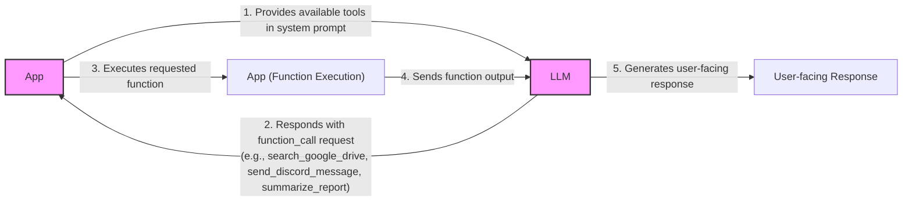
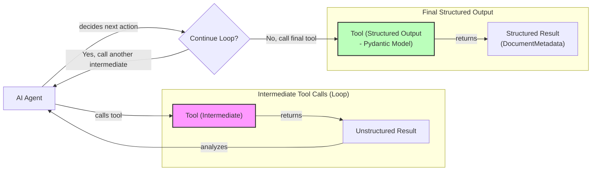
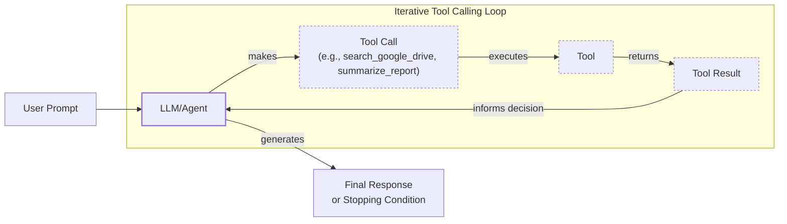

# Lesson 6: Agent Tools & Function Calling

In the previous lessons, we built a solid foundation in AI Engineering. We mapped the agent landscape, distinguished between rule-based LLM workflows and autonomous agents, and mastered context engineering and structured outputs. We even implemented basic workflow patterns like chaining and routing. Now, it is time to give our systems the ability to act.

This lesson explores agent tools, also known as function calling. Tools are what transform an LLM from a simple text generator into an agent that can interact with the external world. Understanding how an agent works with these tools is critical for any AI Engineer looking to build, improve, and debug modern AI applications. We will open the black box by implementing tool calling from scratch, see how to use production-grade APIs like Gemini, and explore the limitations that lead to more advanced agentic patterns.

## Understanding Why Agents Need Tools

LLMs have a fundamental limitation: they are sophisticated pattern matchers and text generators, but they cannot perform actions or access information outside their training data on their own. They live in a world of text, disconnected from real-time data and external systems. This is where tools come in.

Think of the LLM as the brain of an agent. Tools are its "hands and senses," allowing it to perceive and act in the world beyond its textual interface. They are the bridge between the LLM's internal reasoning and the external environment. With tools, an LLM becomes an AI agent capable of executing specific instructions and interacting with the world.

For example, some of the most popular tools that power modern AI agents allow them to:
- Access real-time information through APIs, like checking today's weather or fetching the latest news.
- Interact with external databases and storage solutions, from a PostgreSQL database to a Snowflake data warehouse.
- Access the agent's long-term memory to recall information beyond the current context window.
- Execute code in languages like Python or JavaScript for precise calculations, data manipulation, or visualization.

## Implementing Tool Calls from Scratch

The best way to understand how tools work is to build them from the ground up. In this section, we will implement a simple tool-calling mechanism from scratch. We will define our tools, create schemas for them, and write a system prompt that instructs the LLM on how to use them. Our goal is to provide the LLM with a list of available tools and let it decide which one to use, generating the correct arguments to call the function.

The high-level process involves five steps:
1.  **App:** We provide the LLM with a list of available tools in the system prompt.
2.  **LLM:** It analyzes the user's request and responds with a `function_call`, specifying the tool name and arguments.
3.  **App:** Our application parses this response and executes the requested function.
4.  **App:** We send the function's output back to the LLM.
5.  **LLM:** It uses the tool's output to generate a final, user-facing response.


Image 1: A flowchart illustrating the 5-step request-execute-respond flow of calling a tool between an App and an LLM.

Let's implement this flow with a practical example: an agent that can search for a financial report on a mocked Google Drive and send a summary to a Discord channel.

1.  First, we set up our environment, initialize the Gemini client, and define a sample document to simulate a file found on Google Drive.
    ```python
    import json
    from typing import Any
    
    from google import genai
    from google.genai import types
    from pydantic import BaseModel, Field
    
    from lessons.utils import env, pretty_print
    
    env.load(required_env_vars=["GOOGLE_API_KEY"])
    
    client = genai.Client()
    
    MODEL_ID = "gemini-2.5-flash"
    
    DOCUMENT = """
    # Q3 2023 Financial Performance Analysis
    
    The Q3 earnings report shows a 20% increase in revenue and a 15% growth in user engagement, 
    beating market expectations. These impressive results reflect our successful product strategy 
    and strong market positioning.
    
    Our core business segments demonstrated remarkable resilience, with digital services leading 
    the growth at 25% year-over-year. The expansion into new markets has proven particularly 
    successful, contributing to 30% of the total revenue increase.
    
    Customer acquisition costs decreased by 10% while retention rates improved to 92%, 
    marking our best performance to date. These metrics, combined with our healthy cash flow 
    position, provide a strong foundation for continued growth into Q4 and beyond.
    """
    ```

2.  Next, we define three mocked Python functions that will act as our tools. The function signature and docstrings are critical, as the LLM will use them to understand what each tool does.
    ```python
    def search_google_drive(query: str) -> dict:
        """
        Searches for a file on Google Drive and returns its content or a summary.
    
        Args:
            query (str): The search query to find the file, e.g., 'Q3 earnings report'.
    
        Returns:
            dict: A dictionary representing the search results, including file names and summaries.
        """
        return {
            "files": [
                {
                    "name": "Q3_Earnings_Report_2024.pdf",
                    "id": "file12345",
                    "content": DOCUMENT,
                }
            ]
        }
    ```
    ```python
    def send_discord_message(channel_id: str, message: str) -> dict:
        """
        Sends a message to a specific Discord channel.
    
        Args:
            channel_id (str): The ID of the channel to send the message to, e.g., '#finance'.
            message (str): The content of the message to send.
    
        Returns:
            dict: A dictionary confirming the action, e.g., {"status": "success"}.
        """
        return {
            "status": "success",
            "status_code": 200,
            "channel": channel_id,
            "message_preview": f"{message[:50]}...",
        }
    ```
    ```python
    def summarize_financial_report(text: str) -> str:
        """
        Summarizes a financial report.
    
        Args:
            text (str): The text to summarize.
    
        Returns:
            str: The summary of the text.
        """
        return "The Q3 2023 earnings report shows strong performance across all metrics with 20% revenue growth, 15% user engagement increase, 25% digital services growth, and improved retention rates of 92%."
    ```

3.  For each function, we define a schema in JSON format. This schema is what the LLM sees. It uses the `description` to decide which tool to use and the `parameters` to understand how to call it. This schema-based approach is an industry standard used by major providers like OpenAI and Google [[1]](https://ai.google.dev/gemini-api/docs/function-calling), [[2]](https://platform.openai.com/docs/guides/function-calling).
    ```python
    search_google_drive_schema = {
        "name": "search_google_drive",
        "description": "Searches for a file on Google Drive and returns its content or a summary.",
        "parameters": {
            "type": "object",
            "properties": {
                "query": {
                    "type": "string",
                    "description": "The search query to find the file, e.g., 'Q3 earnings report'.",
                }
            },
            "required": ["query"],
        },
    }
    ```
    ```python
    send_discord_message_schema = {
        "name": "send_discord_message",
        "description": "Sends a message to a specific Discord channel.",
        "parameters": {
            "type": "object",
            "properties": {
                "channel_id": {
                    "type": "string",
                    "description": "The ID of the channel to send the message to, e.g., '#finance'.",
                },
                "message": {
                    "type": "string",
                    "description": "The content of the message to send.",
                },
            },
            "required": ["channel_id", "message"],
        },
    }
    ```
    ```python
    summarize_financial_report_schema = {
        "name": "summarize_financial_report",
        "description": "Summarizes a financial report.",
        "parameters": {
            "type": "object",
            "properties": {
                "text": {
                    "type": "string",
                    "description": "The text to summarize.",
                },
            },
            "required": ["text"],
        },
    }
    ```

4.  We then create a tool registry to map tool names to their corresponding functions and schemas.
    ```python
    TOOLS = {
        "search_google_drive": {
            "handler": search_google_drive,
            "declaration": search_google_drive_schema,
        },
        "send_discord_message": {
            "handler": send_discord_message,
            "declaration": send_discord_message_schema,
        },
        "summarize_financial_report": {
            "handler": summarize_financial_report,
            "declaration": summarize_financial_report_schema,
        },
    }
    TOOLS_BY_NAME = {tool_name: tool["handler"] for tool_name, tool in TOOLS.items()}
    TOOLS_SCHEMA = [tool["declaration"] for tool in TOOLS.values()]
    ```
    The `TOOLS_BY_NAME` mapping looks like this:
    ```text
    Tool name: search_google_drive
    Tool handler: <function search_google_drive at 0x104c7df80>
    ---------------------------------------------------------------------------
    Tool name: send_discord_message
    Tool handler: <function send_discord_message at 0x104c7de40>
    ---------------------------------------------------------------------------
    Tool name: summarize_financial_report
    Tool handler: <function summarize_financial_report at 0x1274f5c60>
    ---------------------------------------------------------------------------
    ```
    And here is the schema for our `search_google_drive` tool:
    ```text
    {
      "name": "search_google_drive",
      "description": "Searches for a file on Google Drive and returns its content or a summary.",
      "parameters": {
        "type": "object",
        "properties": {
          "query": {
            "type": "string",
            "description": "The search query to find the file, e.g., 'Q3 earnings report'."
          }
        },
        "required": [
          "query"
        ]
      }
    }
    ```

5.  Now, we create a system prompt that instructs the LLM on how to use these tools. This prompt includes guidelines, the expected output format, and the list of available tool schemas.
    ```python
    TOOL_CALLING_SYSTEM_PROMPT = """
    You are a helpful AI assistant with access to tools that enable you to take actions and retrieve information to better 
    assist users.
    
    ## Tool Usage Guidelines
    
    **When to use tools:**
    - When you need information that is not in your training data
    - When you need to perform actions in external systems and environments
    - When you need real-time, dynamic, or user-specific data
    - When computational operations are required
    
    **Tool selection:**
    - Choose the most appropriate tool based on the user's specific request
    - If multiple tools could work, select the one that most directly addresses the need
    - Consider the order of operations for multi-step tasks
    
    **Parameter requirements:**
    - Provide all required parameters with accurate values
    - Use the parameter descriptions to understand expected formats and constraints
    - Ensure data types match the tool's requirements (strings, numbers, booleans, arrays)
    
    ## Tool Call Format
    
    When you need to use a tool, output ONLY the tool call in this exact format:
    
    ```tool_call
    {{"name": "tool_name", "args": {{"param1": "value1", "param2": "value2"}}}}
    ```
    
    **Critical formatting rules:**
    - Use double quotes for all JSON strings
    - Ensure the JSON is valid and properly escaped
    - Include ALL required parameters
    - Use correct data types as specified in the tool definition
    - Do not include any additional text or explanation in the tool call
    
    ## Response Behavior
    
    - If no tools are needed, respond directly to the user with helpful information
    - If tools are needed, make the tool call first, then provide context about what you're doing
    - After receiving tool results, provide a clear, user-friendly explanation of the outcome
    - If a tool call fails, explain the issue and suggest alternatives when possible
    
    ## Available Tools
    
    <tool_definitions>
    {tools}
    </tool_definitions>
    
    Remember: Your goal is to be maximally helpful to the user. Use tools when they add value, but don't use them unnecessarily. Always prioritize accuracy and user experience.
    """
    ```

6.  Based on the `description` field in the tool schema, the LLM *decides* if a tool is appropriate for the user's query. This is why clear and articulate tool descriptions are so important. If you have multiple tools, their descriptions must be distinct to avoid confusion. For example, `Tool used to search documents` and `Tool used to search files` would likely confuse the LLM. More explicit descriptions like `Tool used to search documents on Google Drive` and `Tool used to search files on the local disk` are much better.

    This becomes critical when scaling to 50-100 tools per agent. By defining clear tool descriptions and system prompts, you ensure the agent can make the right choices. We will dig more into scaling methods in future parts of the course. Once a tool is selected, the LLM *generates* the function name and arguments as a structured output, like JSON. This capability is a result of instruction fine-tuning, where models are specifically trained to interpret schemas and produce structured tool calls.

7.  Let's test it. We send a user prompt along with our system prompt to the model.
    ```python
    USER_PROMPT = """
    Can you help me find the latest quarterly report and share key insights with the team?
    """
    
    messages = [TOOL_CALLING_SYSTEM_PROMPT.format(tools=str(TOOLS_SCHEMA)), USER_PROMPT]
    
    response = client.models.generate_content(
        model=MODEL_ID,
        contents=messages,
    )
    ```
    The LLM correctly identifies the `search_google_drive` tool and generates the required arguments:
    ```text
    ```tool_call
    {"name": "search_google_drive", "args": {"query": "latest quarterly report"}}
    ```
    ```

8.  With a more complex prompt, the model still correctly identifies the first step.
    ```python
    USER_PROMPT = """
    Please find the Q3 earnings report on Google Drive and send a summary of it to 
    the #finance channel on Discord.
    """
    
    messages = [TOOL_CALLING_SYSTEM_PROMPT.format(tools=str(TOOLS_SCHEMA)), USER_PROMPT]
    
    response = client.models.generate_content(
        model=MODEL_ID,
        contents=messages,
    )
    ```
    It outputs:
    ```text
    ```tool_call
    {"name": "search_google_drive", "args": {"query": "Q3 earnings report"}}
    ```
    ```

9.  Now, we need to parse the LLM's response and execute the tool. First, we extract the JSON string.
    ```python
    def extract_tool_call(response_text: str) -> str:
        """
        Extracts the tool call from the response text.
        """
        return response_text.split("```tool_call")[1].split("```")[0].strip()
    
    tool_call_str = extract_tool_call(response.text)
    ```
    It outputs:
    ```text
    '{"name": "search_google_drive", "args": {"query": "Q3 earnings report"}}'
    ```

10. We parse the string into a Python dictionary.
    ```python
    tool_call = json.loads(tool_call_str)
    ```
    It outputs:
    ```text
    {'name': 'search_google_drive', 'args': {'query': 'Q3 earnings report'}}
    ```

11. We retrieve the function handler from our `TOOLS_BY_NAME` registry.
    ```python
    tool_handler = TOOLS_BY_NAME[tool_call["name"]]
    ```
    It outputs:
    ```text
    <function search_google_drive at 0x104c7df80>
    ```

12. Finally, we call the function with the arguments provided by the LLM.
    ```python
    tool_result = tool_handler(**tool_call["args"])
    ```
    It outputs:
    ```text
    {
      "files": [
        {
          "name": "Q3_Earnings_Report_2024.pdf",
          "id": "file12345",
          "content": "\n# Q3 2023 Financial Performance Analysis\n\nThe Q3 earnings report shows a 20% increase in revenue and a 15% growth in user engagement, \nbeating market expectations. These impressive results reflect our successful product strategy \nand strong market positioning.\n\nOur core business segments demonstrated remarkable resilience, with digital services leading \nthe growth at 25% year-over-year. The expansion into new markets has proven particularly \nsuccessful, contributing to 30% of the total revenue increase.\n\nCustomer acquisition costs decreased by 10% while retention rates improved to 92%, \nmarking our best performance to date. These metrics, combined with our healthy cash flow \nposition, provide a strong foundation for continued growth into Q4 and beyond.\n"
        }
      ]
    }
    ```

13. We can wrap this logic in a helper function.
    ```python
    def call_tool(response_text: str, tools_by_name: dict) -> Any:
        """
        Call a tool based on the response from the LLM.
        """
        tool_call_str = extract_tool_call(response_text)
        tool_call = json.loads(tool_call_str)
        tool_name = tool_call["name"]
        tool_args = tool_call["args"]
        tool = tools_by_name[tool_name]
        return tool(**tool_args)
    ```
    Using this function gives us the same result as before.

14. The final step is to send the tool's output back to the LLM so it can interpret the result and formulate a user-facing response or decide on the next action.
    ```python
    response = client.models.generate_content(
        model=MODEL_ID,
        contents=f"Interpret the tool result: {json.dumps(tool_result, indent=2)}",
    )
    ```
    It outputs:
    ```text
    The tool result provides the content of a file named `Q3_Earnings_Report_2024.pdf`.
    
    This document is a **Q3 2023 Financial Performance Analysis** and details exceptionally strong results, significantly beating market expectations.
    
    **Key highlights from the report include:**
    
    *   **Revenue Growth:** A 20% increase in revenue.
    *   **User Engagement:** 15% growth in user engagement.
    *   **Core Business Performance:** Digital services led growth at 25% year-over-year.
    *   **Market Expansion Success:** New markets contributed 30% of the total revenue increase.
    *   **Efficiency & Retention:**
        *   Customer acquisition costs decreased by 10%.
        *   Retention rates improved to 92%, marking the best performance to date.
    *   **Financial Health:** The company maintains a healthy cash flow position.
    
    The report attributes these impressive results to a successful product strategy and strong market positioning, indicating a robust foundation for continued growth into Q4 and beyond.
    ```

This is the basic concept behind tool calling. We have successfully implemented it from scratch, giving us a clear understanding of the underlying mechanics.

## Implementing a Tool Calling Framework from Scratch

Manually defining a JSON schema for every tool is tedious and doesn't scale well. Production frameworks like LangGraph and protocols like MCP (Model Context Protocol) solve this by using a `@tool` decorator that automatically generates and registers schemas from Python functions.

Let's build our own simple framework with a `@tool` decorator. This will automatically compute the schema from a function's signature and docstring, creating a tool registry that follows the Don't Repeat Yourself (DRY) principle.

1.  First, we define a `ToolFunction` class to wrap our decorated functions and hold their schemas.
    ```python
    from inspect import Parameter, signature
    from typing import Any, Callable, Dict, Optional
    
    
    class ToolFunction:
        def __init__(self, func: Callable, schema: Dict[str, Any]) -> None:
            self.func = func
            self.schema = schema
            self.__name__ = func.__name__
            self.__doc__ = func.__doc__
    
        def __call__(self, *args: Any, **kwargs: Any) -> Any:
            return self.func(*args, **kwargs)
    ```

2.  Next, we create the `@tool` decorator. It inspects the function's signature to build the parameters schema and uses the docstring for the description.
    ```python
    def tool(description: Optional[str] = None) -> Callable[[Callable], ToolFunction]:
        """
        A decorator that creates a tool schema from a function.
    
        Args:
            description: Optional override for the function's docstring
    
        Returns:
            A decorator function that wraps the original function and adds a schema
        """
    
        def decorator(func: Callable) -> ToolFunction:
            sig = signature(func)
            properties = {}
            required = []
    
            for param_name, param in sig.parameters.items():
                if param_name == "self":
                    continue
    
                param_schema = {
                    "type": "string",
                    "description": f"The {param_name} parameter",
                }
    
                if param.default == Parameter.empty:
                    required.append(param_name)
    
                properties[param_name] = param_schema
    
            schema = {
                "name": func.__name__,
                "description": description or func.__doc__ or f"Executes the {func.__name__} function.",
                "parameters": {
                    "type": "object",
                    "properties": properties,
                    "required": required,
                },
            }
    
            return ToolFunction(func, schema)
    
        return decorator
    ```

3.  Now, we can redefine our tools using this decorator. The code is much cleaner and the schema is generated automatically.
    ```python
    @tool()
    def search_google_drive_example(query: str) -> dict:
        """Search for files in Google Drive."""
        return {"files": ["Q3 earnings report"]}
    
    
    @tool()
    def send_discord_message_example(channel_id: str, message: str) -> dict:
        """Send a message to a Discord channel."""
        return {"message": "Message sent successfully"}
    
    
    @tool()
    def summarize_financial_report_example(text: str) -> str:
        """Summarize the contents of a financial report."""
        return "Financial report summarized successfully"
    
    
    tools = [
        search_google_drive_example,
        send_discord_message_example,
        summarize_financial_report_example,
    ]
    tools_by_name = {tool.schema["name"]: tool.func for tool in tools}
    tools_schema = [tool.schema for tool in tools]
    ```

4.  The decorated function is now a `ToolFunction` object.
    ```python
    type(search_google_drive_example)
    ```
    It outputs:
    ```text
    __main__.ToolFunction
    ```
    This object contains the generated schema, which is identical to the one we created manually:
    ```text
    {
      "name": "search_google_drive_example",
      "description": "Search for files in Google Drive.",
      "parameters": {
        "type": "object",
        "properties": {
          "query": {
            "type": "string",
            "description": "The query parameter"
          }
        },
        "required": [
          "query"
        ]
      }
    }
    ```
    And it still holds a reference to the original function handler:
    ```text
    <function __main__.search_google_drive_example(query: str) -> dict>
    ```

5.  Let's test our new framework with the same multi-step prompt.
    ```python
    USER_PROMPT = """
    Please find the Q3 earnings report on Google Drive and send a summary of it to 
    the #finance channel on Discord.
    """
    
    messages = [TOOL_CALLING_SYSTEM_PROMPT.format(tools=str(tools_schema)), USER_PROMPT]
    
    response = client.models.generate_content(
        model=MODEL_ID,
        contents=messages,
    )
    ```
    The model responds with the correct tool call:
    ```text
    ```tool_call
    {"name": "search_google_drive_example", "args": {"query": "Q3 earnings report"}}
    ```
    ```

6.  We can use our `call_tool` function from before to execute it.
    ```python
    call_tool(response.text, tools_by_name=tools_by_name)
    ```
    It outputs:
    ```text
    {
      "files": [
        "Q3 earnings report"
      ]
    }
    ```

Voilà! We have our little tool-calling framework. This implementation is similar to what you would find under the hood in a framework like LangGraph.

## Implementing Production-Level Tool Calls with Gemini

While building from scratch is a great learning exercise, in production, you should leverage the native tool-calling capabilities of modern LLM APIs like Gemini. This approach is more robust, requires less code, and is optimized by the provider for their specific models.

Instead of manually crafting a system prompt, we can use Gemini's `GenerateContentConfig` to declare our available tools.

1.  First, we define the `tools` and `config` objects for the Gemini API, passing our manually defined schemas. We also set the `mode` to `"ANY"` to force the model to call a tool.
    ```python
    tools = [
        types.Tool(
            function_declarations=[
                types.FunctionDeclaration(**search_google_drive_schema),
                types.FunctionDeclaration(**send_discord_message_schema),
            ]
        )
    ]
    config = types.GenerateContentConfig(
        tools=tools,
        tool_config=types.ToolConfig(function_calling_config=types.FunctionCallingConfig(mode="ANY")),
    )
    ```

2.  Now, we can call the model with a much simpler prompt, as the tool instructions are handled by the configuration.
    ```python
    response = client.models.generate_content(
        model=MODEL_ID,
        contents=USER_PROMPT,
        config=config,
    )
    ```
    The response contains a `function_call` object:
    ```text
    FunctionCall(id=None, args={'query': 'Q3 earnings report'}, name='search_google_drive')
    ```

3.  To make things even simpler, the `google-genai` SDK can automatically generate the schema from a Python function's signature, type hints, and docstring. We can pass our functions directly to the `GenerateContentConfig`.
    ```python
    config = types.GenerateContentConfig(
        tools=[search_google_drive, send_discord_message],
        tool_config=types.ToolConfig(function_calling_config=types.FunctionCallingConfig(mode="ANY")),
    )
    
    response = client.models.generate_content(
        model=MODEL_ID,
        contents=USER_PROMPT,
        config=config,
    )
    
    function_call = response.candidates[0].content.parts[0].function_call
    ```

4.  We can create a simplified `call_tool` function to execute the native `FunctionCall` object.
    ```python
    def call_tool(function_call) -> Any:
        tool_name = function_call.name
        tool_args = {key: value for key, value in function_call.args.items()}
        tool_handler = TOOLS_BY_NAME[tool_name]
        return tool_handler(**tool_args)
    
    tool_result = call_tool(function_call)
    ```
    It outputs:
    ```text
    {
      "files": [
        {
          "name": "Q3_Earnings_Report_2024.pdf",
          "id": "file12345",
          "content": "\n# Q3 2023 Financial Performance Analysis\n\nThe Q3 earnings report shows a 20% increase in revenue and a 15% growth in user engagement, \nbeating market expectations. These impressive results reflect our successful product strategy \nand strong market positioning.\n\nOur core business segments demonstrated remarkable resilience, with digital services leading \nthe growth at 25% year-over-year. The expansion into new markets has proven particularly \nsuccessful, contributing to 30% of the total revenue increase.\n\nCustomer acquisition costs decreased by 10% while retention rates improved to 92%, \nmarking our best performance to date. These metrics, combined with our healthy cash flow \nposition, provide a strong foundation for continued growth into Q4 and beyond.\n"
        }
      ]
    }
    ```

By leveraging the native SDK, we reduced dozens of lines of code to just a few, creating a more robust and maintainable system. Other popular APIs from providers like OpenAI and Anthropic follow a similar logic, making these concepts easily transferable to your API of choice.

## Using Pydantic Models as Tools for On-Demand Structured Outputs

Connecting this lesson with what we learned about structured outputs in Lesson 4, we can use a Pydantic model as a tool. This is a powerful pattern for agentic scenarios where you might perform several intermediate steps with unstructured text and then dynamically decide to output the final answer in a structured, validated format.

This approach is useful when an agent needs to gather and process information through multiple tool calls before presenting a final, structured result that can be easily consumed by downstream systems.


Image 2: A flowchart illustrating an AI agent calling multiple tools in a loop, where only the last tool call is for structured outputs.

Let's see how to implement this.

1.  First, we define our `DocumentMetadata` Pydantic model, just as we did in Lesson 4.
    ```python
    class DocumentMetadata(BaseModel):
        """A class to hold structured metadata for a document."""
    
        summary: str = Field(description="A concise, 1-2 sentence summary of the document.")
        tags: list[str] = Field(description="A list of 3-5 high-level tags relevant to the document.")
        keywords: list[str] = Field(description="A list of specific keywords or concepts mentioned.")
        quarter: str = Field(description="The quarter of the financial year described in the document (e.g., Q3 2023).")
        growth_rate: str = Field(description="The growth rate of the company described in the document (e.g., 10%).")
    ```

2.  We then create a tool declaration for Gemini, using the Pydantic model's JSON schema as the function's parameters.
    ```python
    extraction_tool = types.Tool(
        function_declarations=[
            types.FunctionDeclaration(
                name="extract_metadata",
                description="Extracts structured metadata from a financial document.",
                parameters=DocumentMetadata.model_json_schema(),
            )
        ]
    )
    config = types.GenerateContentConfig(
        tools=[extraction_tool],
        tool_config=types.ToolConfig(function_calling_config=types.FunctionCallingConfig(mode="ANY")),
    )
    ```

3.  We prompt the model to analyze the document and extract the metadata.
    ```python
    prompt = f"""
    Please analyze the following document and extract its metadata.
    
    Document:
    --- 
    {DOCUMENT}
    --- 
    """
    
    response = client.models.generate_content(model=MODEL_ID, contents=prompt, config=config)
    function_call = response.candidates[0].content.parts[0].function_call
    ```
    The model responds with a call to our `extract_metadata` tool, with arguments that match our Pydantic schema:
    ```text
    Function Name: `extract_metadata
    Function Arguments: `{
        "growth_rate": "20%",
        "summary": "The Q3 2023 earnings report shows a 20% increase in revenue and 15% growth in user engagement, driven by successful product strategy and market expansion. This performance provides a strong foundation for continued growth.",
        "quarter": "Q3 2023",
        "keywords": [
            "Revenue",
            "User Engagement",
            "Market Expansion",
            "Customer Acquisition",
            "Retention Rates",
            "Digital Services",
            "Cash Flow"
        ],
        "tags": [
            "Financials",
            "Earnings",
            "Growth",
            "Business Strategy",
            "Market Analysis"
        ]
    }`
    ```

4.  Finally, we can validate the arguments and create a `DocumentMetadata` instance.
    ```python
    try:
        document_metadata = DocumentMetadata(**function_call.args)
        print("Validation successful!")
    except Exception as e:
        print(f"Validation failed: {e}")
    ```
    It outputs:
    ```text
    Validation successful!
    ```
This pattern is frequently used in AI agents that require structured data as their final output, combining the flexibility of tool use with the reliability of Pydantic validation.

## The Downsides of Running Tools in a Loop

So far, we have focused on single-turn interactions. A natural progression is to allow the LLM to run tools in a loop, chaining multiple calls and deciding the next step based on the output of the previous one. This is the final piece needed to build a true AI agent, giving it the flexibility to handle complex, multi-step tasks.


Image 3: A flowchart illustrating the iterative tool calling loop in an AI agent.

Let's implement a loop where the agent finds the financial report, summarizes it, and sends the summary to Discord.

1.  We configure the agent with all three tools.
    ```python
    tools = [
        types.Tool(
            function_declarations=[
                types.FunctionDeclaration(**search_google_drive_schema),
                types.FunctionDeclaration(**send_discord_message_schema),
                types.FunctionDeclaration(**summarize_financial_report_schema),
            ]
        )
    ]
    config = types.GenerateContentConfig(
        tools=tools,
        tool_config=types.ToolConfig(function_calling_config=types.FunctionCallingConfig(mode="ANY")),
    )
    ```

2.  We define the user's multi-step request.
    ```python
    USER_PROMPT = """
    Please find the Q3 earnings report on Google Drive and send a summary of it to 
    the #finance channel on Discord.
    """
    messages = [USER_PROMPT]
    ```

3.  We start the loop. The first call correctly identifies the `search_google_drive` tool.
    ```python
    response = client.models.generate_content(
        model=MODEL_ID,
        contents=messages,
        config=config,
    )
    response_message_part = response.candidates[0].content.parts[0]
    messages.append(response.candidates[0].content)
    ```
    The first function call is:
    ```text
    Function Name: `search_google_drive
    Function Arguments: `{
        "query": "Q3 earnings report"
    }`
    ```

4.  We then loop, executing tool calls and feeding the results back to the model until it stops requesting functions or we hit a max iteration limit.
    ```python
    max_iterations = 3
    while hasattr(response_message_part, "function_call") and max_iterations > 0:
        tool_result = call_tool(response_message_part.function_call)
    
        function_response_part = types.Part.from_function_response(
            name=response_message_part.function_call.name,
            response={"result": tool_result},
        )
        messages.append(function_response_part)
    
        response = client.models.generate_content(
            model=MODEL_ID,
            contents=messages,
            config=config,
        )
    
        response_message_part = response.candidates[0].content.parts[0]
        messages.append(response.candidates[0].content)
    
        max_iterations -= 1
    ```
    The loop executes `search_google_drive`, then `summarize_financial_report`, and finally `send_discord_message`, successfully completing the task.

However, this simple sequential loop has significant limitations. It does not allow the LLM to interpret each tool's output before deciding on the next action. The agent immediately moves to the next function call without pausing to think about what it has learned or whether it should change its strategy. This can lead to inefficient tool usage or getting stuck in loops.

A quick note on optimization: when tools are independent, they can be called in parallel to reduce latency. For example, an agent could fetch financial news and stock prices simultaneously.

The limitations of simple loops pushed the industry to develop more sophisticated patterns like **ReAct** (Reasoning and Acting). ReAct explicitly interleaves reasoning steps with tool calls, allowing the agent to think more deliberately. We will explore this powerful pattern in lessons 7 and 8.

## Popular Tools Used Within the Industry

To ground these concepts in the real world, let's look at some popular tool categories used across the industry. These examples illustrate the vast possibilities when you connect LLMs to external systems.

1.  **Knowledge & Memory Access:** These tools are fundamental for providing agents with context beyond their training data.
    - They can query vector databases for semantic search, document stores for raw text, or graph databases to understand relationships between entities.
    - A powerful pattern in this category is text-to-SQL, where the LLM generates SQL queries to interact with traditional relational databases.
    - These tools are closely related to agent memory and Retrieval-Augmented Generation (RAG), which we will cover in detail in Lessons 9 and 10.

2.  **Web Search & Browsing:** These tools give agents access to the live internet.
    - They can interface with search engine APIs like Google Search, Bing, or Brave to retrieve up-to-date information.
    - They can also include web scraping capabilities to fetch and parse content directly from web pages.
    - These are essential for chatbots and research agents that need to answer questions about current events.

3.  **Code Execution:** These tools allow agents to perform computations and data manipulation.
    - A Python interpreter, running in a sandboxed environment, is a common example. It enables agents to perform precise calculations, analyze data, and even generate visualizations.
    - While Python is the most popular, this pattern is also adapted for other languages like JavaScript.

4.  **Other Popular Tools:**
    - **External APIs:** Many enterprise AI applications use tools to interact with calendars, email clients, and project management software.
    - **File System Operations:** Productivity apps often need tools to read and write local files or list directories, allowing them to interact directly with a user's operating system.

## Conclusion

Tool calling is at the core of modern AI agents. It is arguably the most important skill to master for building, monitoring, and debugging advanced AI applications. By understanding how to connect LLMs to external functions, you can build systems that go far beyond simple text generation.

We have seen how tools work from the ground up and how their limitations lead to more advanced patterns. In the next lesson, we will dive into the theory behind planning and the ReAct framework, which will allow us to build even more intelligent and capable agents.

## References

- [1] Function calling with the Gemini API. (n.d.). Google AI for Developers. https://ai.google.dev/gemini-api/docs/function-calling
- [2] Function calling with OpenAI's API. (n.d.). OpenAI Platform. https://platform.openai.com/docs/guides/function-calling