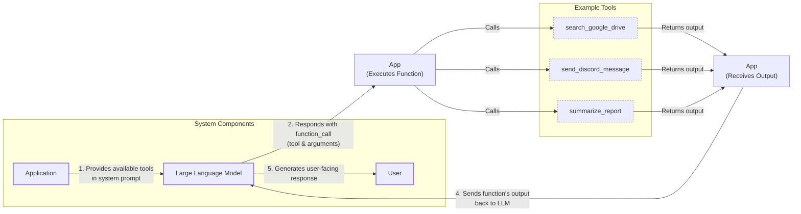
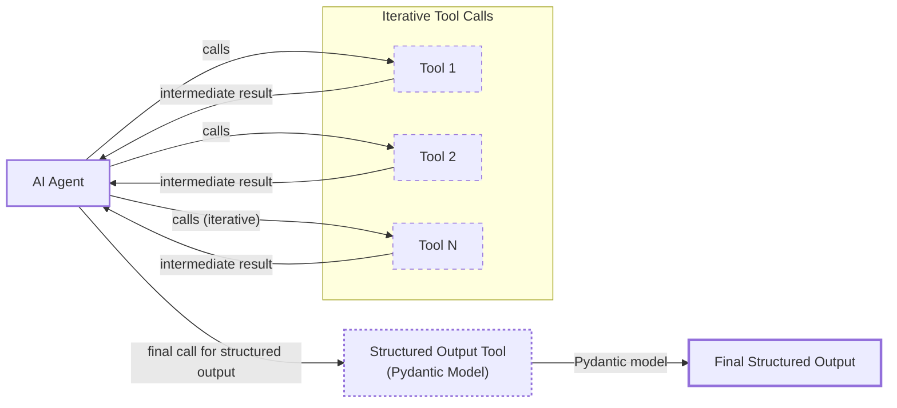
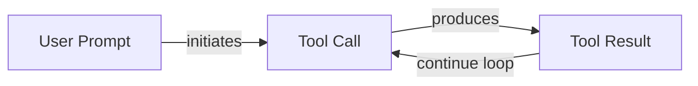

# Lesson 6: Agent Tools & Function Calling

In the previous lessons, we built a solid foundation in AI Engineering. We mapped the agent landscape, distinguished between LLM workflows and AI agents, and mastered context engineering and structured outputs. We learned how to control the flow of information *to* the LLM and how to get reliable data *from* it.

Now, we will give our LLM the ability to take action. This lesson is about tools, the mechanism that transforms an LLM from a passive text generator into an active agent that can interact with the external world. Understanding how tools work is not just a technical skill; it is the key to unlocking the full potential of AI agents. By opening this black box, you will learn how to build, debug, and monitor systems that can do more than just talk—they can *do*.

## Understanding why agents need tools

LLMs have a fundamental limitation: they are pattern matchers and text generators. They are trained on vast amounts of text and are incredibly good at predicting the next word in a sequence. However, they are confined to the information contained within their training data. They cannot, by themselves, access real-time information, interact with your calendar, or execute code. This is where tools come in.

Think of the LLM as the brain of an operation. It can reason, plan, and understand complex instructions. But a brain needs hands and senses to perceive and act upon the world. Tools are the LLM's "hands and senses." They are the bridge between the LLM's internal reasoning and the external environment, allowing it to fetch data, perform computations, and trigger actions in other systems. By giving an LLM access to tools, we transform it into an AI agent.

This capability unlocks a wide range of applications that power modern AI agents, including:
- **Accessing real-time information** through APIs to answer questions about today's weather, the latest news, or stock market prices [[1]](https://lnu.diva-portal.org/smash/get/diva2:1801354/FULLTEXT01.pdf).
- **Interacting with external databases** and other storage solutions, whether it is a PostgreSQL database, a Snowflake data warehouse, or an S3 data lake.
- **Accessing an agent's long-term memory** to remember facts, user preferences, and past interactions that fall outside its immediate context window.
- **Executing code** in a sandboxed environment, like a Python interpreter, to perform complex operations that go beyond simple text generation [[2]](https://arxiv.org/html/2507.08034v1).
- **Performing precise calculations** and data manipulations, such as solving mathematical equations, sorting lists, or filtering data, which LLMs often struggle with on their own.

## Implementing tool calls from scratch

The best way to understand how tools work is to build the mechanism from the ground up. In this section, we will implement a complete tool-calling flow from scratch. We will define our tools, create schemas so the LLM can understand them, prompt the model to select a tool, and execute its request.

The process of calling a tool involves a five-step conversation between your application and the LLM:

1.  **Application:** You send the LLM a prompt that includes a list of available tools and their definitions in the system prompt.
2.  **LLM:** The model analyzes the user's request and decides if a tool is needed. If so, it responds with a `function_call`, specifying the tool's name and the arguments required to run it.
3.  **Application:** Your code parses this `function_call` and executes the corresponding function with the provided arguments.
4.  **Application:** You send the output from the function back to the LLM.
5.  **LLM:** The model uses the tool's output to generate a final, user-facing response or decide on the next action.

This request-execute-respond flow is the fundamental pattern behind all tool-using agents.


Image 1: A flowchart illustrating the 5-step request-execute-respond flow of calling a tool, including example tools.

Now, let's implement this flow. We will build a simple agent that can search for a financial report in Google Drive, summarize it, and send the summary to a Discord channel.

1. First, we set up our environment by importing the necessary libraries and initializing the Gemini client. We will use the `gemini-2.5-flash` model, which is fast and cost-effective. We also define a sample `DOCUMENT` to mock the content of a file found on Google Drive.
    ```python
    import json
    from typing import Any
    
    from google import genai
    from google.genai import types
    from pydantic import BaseModel, Field
    
    from lessons.utils import pretty_print
    
    client = genai.Client()
    
    MODEL_ID = "gemini-2.5-flash"
    
    DOCUMENT = """
    # Q3 2023 Financial Performance Analysis
    
    The Q3 earnings report shows a 20% increase in revenue and a 15% growth in user engagement, 
    beating market expectations. These impressive results reflect our successful product strategy 
    and strong market positioning.
    
    Our core business segments demonstrated remarkable resilience, with digital services leading 
    the growth at 25% year-over-year. The expansion into new markets has proven particularly 
    successful, contributing to 30% of the total revenue increase.
    
    Customer acquisition costs decreased by 10% while retention rates improved to 92%, 
    marking our best performance to date. These metrics, combined with our healthy cash flow 
    position, provide a strong foundation for continued growth into Q4 and beyond.
    """
    ```

2. Next, we define our three mock tools as Python functions. The function signature and docstring are critical, as they provide the information the LLM needs to understand what each tool does.
    ```python
    def search_google_drive(query: str) -> dict:
        """
        Searches for a file on Google Drive and returns its content or a summary.
    
        Args:
            query (str): The search query to find the file, e.g., 'Q3 earnings report'.
    
        Returns:
            dict: A dictionary representing the search results, including file names and summaries.
        """
    
        # In a real scenario, this would interact with the Google Drive API.
        # Here, we mock the response for demonstration.
        return {
            "files": [
                {
                    "name": "Q3_Earnings_Report_2024.pdf",
                    "id": "file12345",
                    "content": DOCUMENT,
                }
            ]
        }
    ```
    ```python
    def send_discord_message(channel_id: str, message: str) -> dict:
        """
        Sends a message to a specific Discord channel.
    
        Args:
            channel_id (str): The ID of the channel to send the message to, e.g., '#finance'.
            message (str): The content of the message to send.
    
        Returns:
            dict: A dictionary confirming the action, e.g., {"status": "success"}.
        """
    
        # Mocking a successful API call to Discord.
        return {
            "status": "success",
            "status_code": 200,
            "channel": channel_id,
            "message_preview": f"{message[:50]}...",
        }
    ```
    ```python
    def summarize_financial_report(text: str) -> str:
        """
        Summarizes a financial report.
    
        Args:
            text (str): The text to summarize.
    
        Returns:
            str: The summary of the text.
        """
    
        return "The Q3 2023 earnings report shows strong performance across all metrics \
    with 20% revenue growth, 15% user engagement increase, 25% digital services growth, and \
    improved retention rates of 92%."
    ```

3. For the LLM to use these functions, we must describe them in a format it understands. This is done using a JSON Schema, which is the industry standard for defining tools for providers like OpenAI and Google. The schema details the tool's `name`, `description`, and `parameters`, including each parameter's type and whether it is required [[3]](https://tetrate.io/learn/ai/llm-output-parsing-structured-generation), [[4]](https://myengineeringpath.dev/tools/gemini-guide/).
    ```python
    search_google_drive_schema = {
        "name": "search_google_drive",
        "description": "Searches for a file on Google Drive and returns its content or a summary.",
        "parameters": {
            "type": "object",
            "properties": {
                "query": {
                    "type": "string",
                    "description": "The search query to find the file, e.g., 'Q3 earnings report'.",
                }
            },
            "required": ["query"],
        },
    }
    ```
    ```python
    send_discord_message_schema = {
        "name": "send_discord_message",
        "description": "Sends a message to a specific Discord channel.",
        "parameters": {
            "type": "object",
            "properties": {
                "channel_id": {
                    "type": "string",
                    "description": "The ID of the channel to send the message to, e.g., '#finance'.",
                },
                "message": {
                    "type": "string",
                    "description": "The content of the message to send.",
                },
            },
            "required": ["channel_id", "message"],
        },
    }
    ```
    ```python
    summarize_financial_report_schema = {
        "name": "summarize_financial_report",
        "description": "Summarizes a financial report.",
        "parameters": {
            "type": "object",
            "properties": {
                "text": {
                    "type": "string",
                    "description": "The text to summarize.",
                },
            },
            "required": ["text"],
        },
    }
    ```

4. We then create a tool registry to map tool names to their corresponding functions and schemas. This makes it easy to look up and execute the correct tool later.
    ```python
    TOOLS = {
        "search_google_drive": {
            "handler": search_google_drive,
            "declaration": search_google_drive_schema,
        },
        "send_discord_message": {
            "handler": send_discord_message,
            "declaration": send_discord_message_schema,
        },
        "summarize_financial_report": {
            "handler": summarize_financial_report,
            "declaration": summarize_financial_report_schema,
        },
    }
    TOOLS_BY_NAME = {tool_name: tool["handler"] for tool_name, tool in TOOLS.items()}
    TOOLS_SCHEMA = [tool["declaration"] for tool in TOOLS.values()]
    ```
    The `TOOLS_BY_NAME` mapping gives us a quick way to access the callable function:
    ```text
    {'search_google_drive': <function search_google_drive at 0x104c7df80>, 'send_discord_message': <function send_discord_message at 0x104c7de40>, 'summarize_financial_report': <function summarize_financial_report at 0x1274f5c60>}
    ```
    And `TOOLS_SCHEMA` holds the list of definitions we will pass to the LLM. Here is the schema for `search_google_drive`:
    ```json
    {
        "name": "search_google_drive",
        "description": "Searches for a file on Google Drive and returns its content or a summary.",
        "parameters": {
          "type": "object",
          "properties": {
            "query": {
              "type": "string",
              "description": "The search query to find the file, e.g., 'Q3 earnings report'."
            }
          },
          "required": [
            "query"
          ]
        }
      }
    ```

5. Now, we need a system prompt to instruct the LLM on how to use these tools. This prompt explains when to use tools, how to select them, and the exact format for requesting a tool call.
    ```python
    TOOL_CALLING_SYSTEM_PROMPT = """
    You are a helpful AI assistant with access to tools that enable you to take actions and retrieve information to better 
    assist users.
    
    ## Tool Usage Guidelines
    
    **When to use tools:**
    - When you need information that is not in your training data
    - When you need to perform actions in external systems and environments
    - When you need real-time, dynamic, or user-specific data
    - When computational operations are required
    
    **Tool selection:**
    - Choose the most appropriate tool based on the user's specific request
    - If multiple tools could work, select the one that most directly addresses the need
    - Consider the order of operations for multi-step tasks
    
    **Parameter requirements:**
    - Provide all required parameters with accurate values
    - Use the parameter descriptions to understand expected formats and constraints
    - Ensure data types match the tool's requirements (strings, numbers, booleans, arrays)
    
    ## Tool Call Format
    
    When you need to use a tool, output ONLY the tool call in this exact format:
    
    ```tool_call
    {{"name": "tool_name", "args": {{"param1": "value1", "param2": "value2"}}}}
    ```
    
    **Critical formatting rules:**
    - Use double quotes for all JSON strings
    - Ensure the JSON is valid and properly escaped
    - Include ALL required parameters
    - Use correct data types as specified in the tool definition
    - Do not include any additional text or explanation in the tool call
    
    ## Response Behavior
    
    - If no tools are needed, respond directly to the user with helpful information
    - If tools are needed, make the tool call first, then provide context about what you're doing
    - After receiving tool results, provide a clear, user-friendly explanation of the outcome
    - If a tool call fails, explain the issue and suggest alternatives when possible
    
    ## Available Tools
    
    <tool_definitions>
    {tools}
    </tool_definitions>
    
    Remember: Your goal is to be maximally helpful to the user. Use tools when they add value, but don't use them unnecessarily. Always prioritize accuracy and user experience.
    """
    ```
    Based on the `description` field in the tool schema, the LLM *decides* if a tool is appropriate to fulfill the user's query. This is why writing clear, articulate, and distinct tool descriptions is so important for building successful AI agents. If you have two tools with vague descriptions like "search documents" and "search files," the LLM will get confused. You must be explicit: "search documents on Google Drive" versus "search files on the local disk." This clarity becomes essential as you scale to dozens or even hundreds of tools per agent [[5]](https://www.anthropic.com/research/building-effective-agents), [[6]](https://mbrenndoerfer.com/writing/function-calling-llm-structured-tools).

    Once a tool is selected, the LLM *generates* the function name and arguments as a structured output, like the JSON object we specified. This capability is not magic; models are specifically trained through instruction fine-tuning to interpret these schemas and produce valid tool calls [[6]](https://mbrenndoerfer.com/writing/function-calling-llm-structured-tools).

6. Let's test it. We send a user prompt along with our system prompt to the model.
    ```python
    USER_PROMPT = """
    Can you help me find the latest quarterly report and share key insights with the team?
    """
    
    messages = [TOOL_CALLING_SYSTEM_PROMPT.format(tools=str(TOOLS_SCHEMA)), USER_PROMPT]
    
    response = client.models.generate_content(
        model=MODEL_ID,
        contents=messages,
    )
    ```
    The LLM correctly identifies the `search_google_drive` tool and generates the required arguments:
    ```text
    ```tool_call
    {"name": "search_google_drive", "args": {"query": "latest quarterly report"}}
    ```
    ```
    Here is another example with a more complex request:
    ```python
    USER_PROMPT = """
    Please find the Q3 earnings report on Google Drive and send a summary of it to 
    the #finance channel on Discord.
    """
    
    messages = [TOOL_CALLING_SYSTEM_PROMPT.format(tools=str(TOOLS_SCHEMA)), USER_PROMPT]
    
    response = client.models.generate_content(
        model=MODEL_ID,
        contents=messages,
    )
    ```
    It outputs:
    ```text
    ```tool_call
    {"name": "search_google_drive", "args": {"query": "Q3 earnings report"}}
    ```
    ```

7. Now we need to parse the LLM's response and execute the function. We start by extracting the JSON string from the response.
    ```python
    def extract_tool_call(response_text: str) -> str:
        """
        Extracts the tool call from the response text.
        """
        return response_text.split("```tool_call")[1].split("```")[0].strip()
    
    
    tool_call_str = extract_tool_call(response.text)
    ```
    This gives us a clean JSON string:
    ```text
    '{"name": "search_google_drive", "args": {"query": "Q3 earnings report"}}'
    ```

8. Next, we parse this string into a Python dictionary.
    ```python
    tool_call = json.loads(tool_call_str)
    ```
    It outputs:
    ```text
    {'name': 'search_google_drive', 'args': {'query': 'Q3 earnings report'}}
    ```

9. We use the tool name to retrieve the correct function handler from our `TOOLS_BY_NAME` registry.
    ```python
    tool_handler = TOOLS_BY_NAME[tool_call["name"]]
    ```
    The handler is a direct reference to our Python function:
    ```text
    <function search_google_drive at 0x104c7df80>
    ```

10. Finally, we execute the function using the arguments generated by the LLM.
    ```python
    tool_result = tool_handler(**tool_call["args"])
    ```
    The tool returns the mocked document content:
    ```json
    {
        "files": [
          {
            "name": "Q3_Earnings_Report_2024.pdf",
            "id": "file12345",
            "content": "\n# Q3 2023 Financial Performance Analysis\n\nThe Q3 earnings report shows a 20% increase in revenue and a 15% growth in user engagement, \nbeating market expectations. These impressive results reflect our successful product strategy \nand strong market positioning.\n\nOur core business segments demonstrated remarkable resilience, with digital services leading \nthe growth at 25% year-over-year. The expansion into new markets has proven particularly \nsuccessful, contributing to 30% of the total revenue increase.\n\nCustomer acquisition costs decreased by 10% while retention rates improved to 92%, \nmarking our best performance to date. These metrics, combined with our healthy cash flow \nposition, provide a strong foundation for continued growth into Q4 and beyond.\n"
          }
        ]
      }
    ```

11. We can wrap these steps into a single helper function, `call_tool`, to streamline the process.
    ```python
    def call_tool(response_text: str, tools_by_name: dict) -> Any:
        """
        Call a tool based on the response from the LLM.
        """
    
        tool_call_str = extract_tool_call(response_text)
        tool_call = json.loads(tool_call_str)
        tool_name = tool_call["name"]
        tool_args = tool_call["args"]
        tool = tools_by_name[tool_name]
    
        return tool(**tool_args)
    ```
    Calling this function with the LLM's response gives us the same result as before.

12. The final step in the loop is to send the tool's result back to the LLM. This allows the model to interpret the information and either generate a final response for the user or decide on the next action to take.
    ```python
    response = client.models.generate_content(
        model=MODEL_ID,
        contents=f"Interpret the tool result: {json.dumps(tool_result, indent=2)}",
    )
    ```
    The LLM provides a user-friendly summary of the tool's output:
    ```text
    The tool result provides the content of a file named `Q3_Earnings_Report_2024.pdf`.
    
    This document is a **Q3 2023 Financial Performance Analysis** and details exceptionally strong results, significantly beating market expectations.
    
    **Key highlights from the report include:**
    
    *   **Revenue Growth:** A 20% increase in revenue.
    *   **User Engagement:** 15% growth in user engagement.
    *   **Core Business Performance:** Digital services led growth at 25% year-over-year.
    *   **Market Expansion Success:** New markets contributed 30% of the total revenue increase.
    *   **Efficiency & Retention:**
        *   Customer acquisition costs decreased by 10%.
        *   Retention rates improved to 92%, marking the best performance to date.
    *   **Financial Health:** The company maintains a healthy cash flow position.
    
    The report attributes these impressive results to a successful product strategy and strong market positioning, indicating a robust foundation for continued growth into Q4 and beyond.
    ```

That is the basic concept of tool calling. We have successfully implemented the entire flow from scratch, from defining tools to executing them based on the LLM's decisions.

## Implementing a tool calling framework from scratch

Manually defining a JSON schema for every function is tedious and violates the Don't Repeat Yourself (DRY) principle. Production frameworks like LangGraph and protocols like MCP (Model Context Protocol) solve this by using a `@tool` decorator that automatically generates the schema from a function's signature and docstring. We will cover MCP in more detail in Part 2 of the course.

Let's build our own simple framework by creating a `@tool` decorator. This will centralize our schema generation logic and make our code much cleaner and more maintainable. The decorator pattern is a powerful feature in Python that allows you to wrap a function with another function, adding new capabilities without modifying the original code. In our case, the decorator will inspect the function it wraps—examining its name, docstring, parameters, and type hints—to dynamically build the JSON schema required by the LLM. This approach not only automates a repetitive task but also ensures that the schema always stays in sync with the function's implementation. If you change a parameter name or update the docstring, the schema is updated automatically, reducing the risk of bugs caused by outdated definitions [[7]](https://pydantic.dev/docs/ai/tools-toolsets/tools/), [[8]](https://ai.google.dev/gemini-api/docs/function-calling).

1. We start by defining a `ToolFunction` class to wrap our decorated functions. This class will hold both the callable function and its auto-generated schema.
    ```python
    from inspect import Parameter, signature
    from typing import Any, Callable, Dict, Optional
    
    
    class ToolFunction:
        def __init__(self, func: Callable, schema: Dict[str, Any]) -> None:
            self.func = func
            self.schema = schema
            self.__name__ = func.__name__
            self.__doc__ = func.__doc__
    
        def __call__(self, *args: Any, **kwargs: Any) -> Any:
            return self.func(*args, **kwargs)
    ```

2. Next, we implement the `@tool` decorator. It inspects the decorated function's signature (`__name__`, `__doc__`, parameters) to build the JSON schema automatically.
    ```python
    def tool(description: Optional[str] = None) -> Callable[[Callable], ToolFunction]:
        """
        A decorator that creates a tool schema from a function.
    
        Args:
            description: Optional override for the function's docstring
    
        Returns:
            A decorator function that wraps the original function and adds a schema
        """
    
        def decorator(func: Callable) -> ToolFunction:
            # Get function signature
            sig = signature(func)
    
            # Create parameters schema
            properties = {}
            required = []
    
            for param_name, param in sig.parameters.items():
                # Skip self for methods
                if param_name == "self":
                    continue
    
                param_schema = {
                    "type": "string",  # Default to string, can be enhanced with type hints
                    "description": f"The {param_name} parameter",  # Default description
                }
    
                # Add to required if parameter has no default value
                if param.default == Parameter.empty:
                    required.append(param_name)
    
                properties[param_name] = param_schema
    
            # Create the tool schema
            schema = {
                "name": func.__name__,
                "description": description or func.__doc__ or f"Executes the {func.__name__} function.",
                "parameters": {
                    "type": "object",
                    "properties": properties,
                    "required": required,
                },
            }
    
            return ToolFunction(func, schema)
    
        return decorator
    ```

3. Now, we can redefine our tools using this new decorator. The code is much cleaner, as the schemas are generated implicitly.
    ```python
    @tool()
    def search_google_drive_example(query: str) -> dict:
        """Search for files in Google Drive."""
        return {"files": ["Q3 earnings report"]}
    
    
    @tool()
    def send_discord_message_example(channel_id: str, message: str) -> dict:
        """Send a message to a Discord channel."""
        return {"message": "Message sent successfully"}
    
    
    @tool()
    def summarize_financial_report_example(text: str) -> str:
        """Summarize the contents of a financial report."""
        return "Financial report summarized successfully"
    
    
    tools = [
        search_google_drive_example,
        send_discord_message_example,
        summarize_financial_report_example,
    ]
    ```

4. The decorated function is now a `ToolFunction` object.
    ```python
    type(search_google_drive_example)
    ```
    It outputs:
    ```text
    __main__.ToolFunction
    ```
    This object contains the auto-generated schema, which is identical to the one we created manually:
    ```json
    {
        "name": "search_google_drive_example",
        "description": "Search for files in Google Drive.",
        "parameters": {
          "type": "object",
          "properties": {
            "query": {
              "type": "string",
              "description": "The query parameter"
            }
          },
          "required": [
            "query"
          ]
        }
      }
    ```
    It also holds a reference to the original callable function:
    ```python
    search_google_drive_example.func
    ```
    It outputs:
    ```text
    <function __main__.search_google_drive_example(query: str) -> dict>
    ```

5. We create our `tools_by_name` and `tools_schema` mappings just as before and call the LLM.
    ```python
    tools_by_name = {tool.schema["name"]: tool.func for tool in tools}
    tools_schema = [tool.schema for tool in tools]
    
    USER_PROMPT = """
    Please find the Q3 earnings report on Google Drive and send a summary of it to 
    the #finance channel on Discord.
    """
    
    messages = [TOOL_CALLING_SYSTEM_PROMPT.format(tools=str(tools_schema)), USER_PROMPT]
    
    response = client.models.generate_content(
        model=MODEL_ID,
        contents=messages,
    )
    ```
    The model responds with the correct tool call:
    ```text
    ```tool_call
    {"name": "search_google_drive_example", "args": {"query": "Q3 earnings report"}}
    ```
    ```

6. We execute the tool call using our existing `call_tool` function.
    ```python
    call_tool(response.text, tools_by_name=tools_by_name)
    ```
    It outputs:
    ```json
    {
        "files": [
          "Q3 earnings report"
        ]
      }
    ```

Voilà! We have built a small, reusable tool-calling framework. This implementation is conceptually similar to what production frameworks like LangGraph do under the hood, giving you a solid mental model for how they work.

## Implementing production-level tool calls with Gemini

While building from scratch is a great way to learn, in production, you will almost always use the native tool-calling features of an API like Gemini or OpenAI. These native integrations are simpler, more robust, and optimized by the provider for their specific models. By offloading the schema generation and prompt formatting to the API, you reduce the amount of boilerplate code you have to write and maintain. More importantly, you benefit from the provider's continuous improvements. As they update their models, the underlying tool-calling logic is also refined, ensuring you always get the best possible performance without having to re-engineer your prompts [[10]](https://www.decodingai.com/p/tool-calling-from-scratch-to-production).

Instead of manually crafting a system prompt, we can pass our tool schemas directly to Gemini's `GenerateContentConfig`. Let's see how this simplifies our implementation.

1. We define our `tools` and `config` objects for the Gemini API. We are still using the schemas we defined earlier, but we no longer need the lengthy system prompt. The `tool_config` forces the model to call a function instead of generating a chat response.
    ```python
    tools = [
        types.Tool(
            function_declarations=[
                types.FunctionDeclaration(**search_google_drive_schema),
                types.FunctionDeclaration(**send_discord_message_schema),
            ]
        )
    ]
    config = types.GenerateContentConfig(
        tools=tools,
        # Force the model to call 'any' function, instead of chatting.
        tool_config=types.ToolConfig(function_calling_config=types.FunctionCallingConfig(mode="ANY")),
    )
    ```

2. We can now call the model with just the user prompt. The API handles the complex instructions internally.
    ```python
    USER_PROMPT = """
    Please find the Q3 earnings report on Google Drive and send a summary of it to 
    the #finance channel on Discord.
    """
    response = client.models.generate_content(
        model=MODEL_ID,
        contents=USER_PROMPT,
        config=config,
    )
    ```

3. The response contains a `FunctionCall` object, which is a structured representation of the tool request.
    ```python
    response_message_part = response.candidates[0].content.parts[0]
    function_call = response_message_part.function_call
    ```
    It outputs:
    ```text
    FunctionCall(id=None, args={'query': 'Q3 earnings report'}, name='search_google_drive')
    ```

4. To simplify things even further, the `google-genai` SDK can automatically generate the schema from a Python function's signature, type hints, and docstring, just like our custom decorator. We can pass our functions directly to the `GenerateContentConfig` object [[9]](https://www.philschmid.de/gemini-function-calling).
    ```python
    from google.genai import types
    config = types.GenerateContentConfig(
        tools=[search_google_drive, send_discord_message]
    )
    ```

5. We can now create a simplified `call_tool` function to execute the call.
    ```python
    def call_tool(function_call) -> any:
        tool_name = function_call.name
        tool_args = {key: value for key, value in function_call.args.items()}
        tool_handler = TOOLS_BY_NAME[tool_name]
        return tool_handler(**tool_args)
    
    tool_result = call_tool(function_call)
    ```
    The output is the same as our manual implementation. By leveraging the native SDK, we reduced dozens of lines of code to just a few, creating a more robust and maintainable system. Other popular APIs from OpenAI and Anthropic follow a similar logic, making these concepts easily transferable [[10]](https://www.decodingai.com/p/tool-calling-from-scratch-to-production), [[4]](https://myengineeringpath.dev/tools/gemini-guide/).

## Using Pydantic models as tools for on-demand structured outputs

In Lesson 4, we learned how to use Pydantic for reliable structured outputs. We can combine that pattern with tool calling to create a powerful and flexible agent. An agent can perform multiple intermediate steps using tools that return unstructured text (which is easy for an LLM to interpret), and then, when it has all the information it needs, it can call a final "tool" that is actually a Pydantic model. This forces the final output into a structured, validated format that your application code can safely consume.

This pattern is an elegant way to get structured data on-demand in agentic workflows. It allows you to separate the concerns of your agent: intermediate reasoning steps can remain flexible and conversational, while the final output is guaranteed to be machine-readable and type-safe. This is particularly useful when the agent's final action is to create a database entry, call a downstream API, or update a user interface, all of which require predictable data structures. By treating the Pydantic model as a tool, you create a formal contract for the agent's final deliverable [[11]](https://pydantic.dev/docs/ai/core-concepts/output/).


Image 2: An AI agent calls multiple tools in a loop, with the final tool call providing structured output as a Pydantic model.

Let's see how to implement this.

1. First, we define the `DocumentMetadata` Pydantic model from our previous lesson.
    ```python
    class DocumentMetadata(BaseModel):
        """A class to hold structured metadata for a document."""
    
        summary: str = Field(description="A concise, 1-2 sentence summary of the document.")
        tags: list[str] = Field(description="A list of 3-5 high-level tags relevant to the document.")
        keywords: list[str] = Field(description="A list of specific keywords or concepts mentioned.")
        quarter: str = Field(description="The quarter of the financial year described in the document (e.g., Q3 2023).")
        growth_rate: str = Field(description="The growth rate of the company described in the document (e.g., 10%).")
    ```

2. We then create a tool declaration for the model. Instead of a real function, our "tool" is named `extract_metadata`, and its parameters are defined by the Pydantic model's JSON schema.
    ```python
    # The Pydantic class 'DocumentMetadata' is now our 'tool'
    extraction_tool = types.Tool(
        function_declarations=[
            types.FunctionDeclaration(
                name="extract_metadata",
                description="Extracts structured metadata from a financial document.",
                parameters=DocumentMetadata.model_json_schema(),
            )
        ]
    )
    config = types.GenerateContentConfig(
        tools=[extraction_tool],
        tool_config=types.ToolConfig(function_calling_config=types.FunctionCallingConfig(mode="ANY")),
    )
    ```

3. We prompt the model to analyze the document and extract the metadata.
    ```python
    prompt = f"""
    Please analyze the following document and extract its metadata.
    
    Document:
    --- 
    {DOCUMENT}
    --- 
    """
    
    response = client.models.generate_content(model=MODEL_ID, contents=prompt, config=config)
    ```

4. The model responds with a `function_call` to our `extract_metadata` tool, with the arguments perfectly matching our Pydantic schema.
    ```text
    Function Name: `extract_metadata
    Function Arguments: `{
        "growth_rate": "20%",
        "summary": "The Q3 2023 earnings report shows a 20% increase in revenue and 15% growth in user engagement, driven by successful product strategy and market expansion. This performance provides a strong foundation for continued growth.",
        "quarter": "Q3 2023",
        "keywords": [
          "Revenue",
          "User Engagement",
          "Market Expansion",
          "Customer Acquisition",
          "Retention Rates",
          "Digital Services",
          "Cash Flow"
        ],
        "tags": [
          "Financials",
          "Earnings",
          "Growth",
          "Business Strategy",
          "Market Analysis"
        ]
      }`
    ```

5. We can now validate these arguments by instantiating our `DocumentMetadata` model, giving us a type-safe Python object.
    ```python
    response_message_part = response.candidates[0].content.parts[0]
    
    if hasattr(response_message_part, "function_call"):
        function_call = response_message_part.function_call
    
        try:
            document_metadata = DocumentMetadata(**function_call.args)
            print("Validation successful!")
        except Exception as e:
            print(f"Validation failed: {e}")
    else:
        print("The model did not call the extraction tool.")
    ```
    It outputs:
    ```text
    Validation successful!
    ```
This pattern is extremely common in production AI agents that need to guarantee a structured final output after a series of intermediate steps.

## The downsides of running tools in a loop

So far, we have focused on single-turn interactions where the agent calls one tool. To build a true AI agent, we need to allow the LLM to run tools in a loop, chaining multiple actions together. The agent should be able to decide which tool to use at each step based on the output of the previous ones. This is the final piece of the puzzle.

This sequential loop allows for flexibility and adaptability, enabling the agent to handle complex, multi-step tasks.


Image 3: A sequential tool calling loop.

Let's implement a loop where the agent first finds the financial report on Google Drive, then summarizes it, and finally sends the summary to a Discord channel.

1. We configure the model with all three of our tools.
    ```python
    tools = [
        types.Tool(
            function_declarations=[
                types.FunctionDeclaration(**search_google_drive_schema),
                types.FunctionDeclaration(**send_discord_message_schema),
                types.FunctionDeclaration(**summarize_financial_report_schema),
            ]
        )
    ]
    config = types.GenerateContentConfig(
        tools=tools,
        tool_config=types.ToolConfig(function_calling_config=types.FunctionCallingConfig(mode="ANY")),
    )
    ```

2. We define the user's multi-step request and start a conversation history.
    ```python
    USER_PROMPT = """
    Please find the Q3 earnings report on Google Drive and send a summary of it to 
    the #finance channel on Discord.
    """
    
    messages = [USER_PROMPT]
    ```

3. We implement the tool-calling loop. The loop continues as long as the model requests a function call or until we hit a maximum number of iterations to prevent infinite loops.
    ```python
    # First call to the model
    response = client.models.generate_content(
        model=MODEL_ID,
        contents=messages,
        config=config,
    )
    response_message_part = response.candidates[0].content.parts[0]
    messages.append(response.candidates[0].content)
    
    # Loop until the model stops requesting function calls
    max_iterations = 3
    while hasattr(response_message_part, "function_call") and max_iterations > 0:
        tool_result = call_tool(response_message_part.function_call)
    
        function_response_part = types.Part.from_function_response(
            name=response_message_part.function_call.name,
            response={"result": tool_result},
        )
        messages.append(function_response_part)
    
        # Ask the LLM to continue
        response = client.models.generate_content(
            model=MODEL_ID,
            contents=messages,
            config=config,
        )
    
        response_message_part = response.candidates[0].content.parts[0]
        messages.append(response.candidates[0].content)
    
        max_iterations -= 1
    ```
    The agent successfully executes the three-step plan:
    ```text
    Function Call: `search_google_drive`
    Tool Result: {'files': [{'name': 'Q3_Earnings_Report_2024.pdf', 'id': 'file12345', 'content': '...'}]}
    Function Call: `summarize_financial_report`
    Tool Result: 'The Q3 2023 earnings report shows strong performance...'
    Function Call: `send_discord_message`
    Tool Result: {'status': 'success', 'status_code': 200, 'channel': '#finance', 'message_preview': '...'}
    ```

However, this simple sequential loop has significant limitations. It does not allow the LLM to interpret the output of each tool before deciding on the next action. The agent immediately moves to the next function call without pausing to think about what it has learned or whether it should change its strategy. This "myopia" can lead to several problems. The agent might continue down a flawed path, unable to recover from a failed tool call or an unexpected result. Without a termination condition, an agent might get stuck in an unbounded loop, repeatedly calling tools without converging on an answer, burning tokens and producing no output. Furthermore, as the conversation history and tool outputs accumulate with each turn, the agent's context window can become saturated, leading to degraded performance or an inability to process new information effectively [[12]](https://blogs.oracle.com/developers/what-is-the-ai-agent-loop-the-core-architecture-behind-autonomous-ai-systems), [[13]](https://myengineeringpath.dev/genai-engineer/agentic-patterns/), [[17]](https://www.emergentmind.com/topics/multi-turn-tool-calling-llms).

This iterative cycle of perception (observing tool output) and action (calling the next tool) closely parallels the decision loops found in robotic control systems. In robotics, an agent constantly perceives its environment through sensors, reasons about its state, and acts upon that environment. The simple loop we have built is a basic form of this perception-action cycle, but it lacks the sophisticated reasoning and planning components that allow advanced agents to navigate complex, dynamic environments.

To further optimize, when tools are independent, we can run them in parallel to reduce latency. For example, fetching financial news and stock prices can happen simultaneously. This is highly efficient, as the total latency drops from the sum of all tool execution times to the time of the single slowest tool [[18]](https://airbyte.com/agentic-data/parallel-tool-calls-llm).

These limitations motivated the development of more sophisticated agentic patterns like **ReAct** (Reasoning and Acting). ReAct explicitly interleaves reasoning steps with tool calls, allowing the agent to think through problems more deliberately. We will explore this powerful pattern in detail in Lessons 7 and 8.

## Popular tools used within the industry

We have covered the mechanics of tool use, but what kinds of tools are AI engineers building in the real world? Tools can be grouped into several key categories based on their function.

1.  **Knowledge & Memory Access:** These tools connect the agent to external knowledge sources. This includes querying vector databases for RAG, document stores, or graph databases. Advanced agents may even use explicit tools like `recall` and `remember` to manage a tiered memory system, distinguishing between short-term context and long-term archival storage. A popular and powerful pattern in this category is text-to-SQL, where the agent is given a tool that can construct and execute SQL queries against traditional databases, democratizing data access for non-technical users. These tools are fundamental to building agents with memory, which we will cover in Lesson 9, and for advanced RAG, the topic of Lesson 10 [[14]](https://promethium.ai/guides/text-to-sql-basics-benefits/), [[19]](https://atlan.com/know/agent-memory-architectures/), [[20]](https://blog.cloudflare.com/introducing-agent-memory/).

2.  **Web Search & Browsing:** This is one of the most common tool categories. It includes tools that interface with search engine APIs (like Google, Bing, or Brave) to access up-to-the-minute information, and web scraping tools that can fetch and parse content directly from web pages. These are essential for research agents and chatbots that need to answer questions about current events [[15]](https://mantraideas.com/llm-web-search/).

3.  **Code Execution:** Giving an agent a code interpreter, typically a sandboxed Python environment, is a powerful way to extend its capabilities. It allows the agent to perform precise mathematical calculations, manipulate data, run simulations, and even generate data visualizations. While Python is the most common choice, this pattern can be adapted for other languages like JavaScript [[16]](https://medium.com/@anicomanesh/how-llm-reasoning-powers-the-agentic-ai-revolution-cbefd10ebf3f).

4.  **Other Popular Tools:** The possibilities are nearly endless. Enterprise AI applications often use tools to interact with external APIs for calendars, email, and project management systems. Productivity apps might use tools for file system operations like reading and writing files. Essentially, any action that can be scripted can be turned into a tool for an agent.

## Conclusion

Mastering tool use is fundamental to building, monitoring, and debugging any AI application that goes beyond simple text generation. In this lesson, we have opened the black box to understand how an LLM decides which tool to call, how it generates the correct parameters, and how your application executes the request.

In our next lesson, we will build on this foundation by exploring the theory behind planning and the ReAct pattern. This will allow us to create more intelligent agents that can reason about their actions and recover from errors, moving us one step closer to building truly autonomous systems.

## References

- [1] [https://lnu.diva-portal.org/smash/get/diva2:1801354/FULLTEXT01.pdf](https://lnu.diva-portal.org/smash/get/diva2:1801354/FULLTEXT01.pdf)
- [2] [https://arxiv.org/html/2507.08034v1](https://arxiv.org/html/2507.08034v1)
- [3] [https://tetrate.io/learn/ai/llm-output-parsing-structured-generation](https://tetrate.io/learn/ai/llm-output-parsing-structured-generation)
- [4] [https://myengineeringpath.dev/tools/gemini-guide/](https://myengineeringpath.dev/tools/gemini-guide/)
- [5] [https://www.anthropic.com/research/building-effective-agents](https://www.anthropic.com/research/building-effective-agents)
- [6] [https://mbrenndoerfer.com/writing/function-calling-llm-structured-tools](https://mbrenndoerfer.com/writing/function-calling-llm-structured-tools)
- [7] [https://pydantic.dev/docs/ai/tools-toolsets/tools/](https://pydantic.dev/docs/ai/tools-toolsets/tools/)
- [8] [https://ai.google.dev/gemini-api/docs/function-calling](https://ai.google.dev/gemini-api/docs/function-calling)
- [9] [https://www.philschmid.de/gemini-function-calling](https://www.philschmid.de/gemini-function-calling)
- [10] [https://www.decodingai.com/p/tool-calling-from-scratch-to-production](https://www.decodingai.com/p/tool-calling-from-scratch-to-production)
- [11] [https://pydantic.dev/docs/ai/core-concepts/output/](https://pydantic.dev/docs/ai/core-concepts/output/)
- [12] [https://blogs.oracle.com/developers/what-is-the-ai-agent-loop-the-core-architecture-behind-autonomous-ai-systems](https://blogs.oracle.com/developers/what-is-the-ai-agent-loop-the-core-architecture-behind-autonomous-ai-systems)
- [13] [https://myengineeringpath.dev/genai-engineer/agentic-patterns/](https://myengineeringpath.dev/genai-engineer/agentic-patterns/)
- [14] [https://promethium.ai/guides/text-to-sql-basics-benefits/](https://promethium.ai/guides/text-to-sql-basics-benefits/)
- [15] [https://mantraideas.com/llm-web-search/](https://mantraideas.com/llm-web-search/)
- [16] [https://medium.com/@anicomanesh/how-llm-reasoning-powers-the-agentic-ai-revolution-cbefd10ebf3f](https://medium.com/@anicomanesh/how-llm-reasoning-powers-the-agentic-ai-revolution-cbefd10ebf3f)
- [17] [https://www.emergentmind.com/topics/multi-turn-tool-calling-llms](https://www.emergentmind.com/topics/multi-turn-tool-calling-llms)
- [18] [https://airbyte.com/agentic-data/parallel-tool-calls-llm](https://airbyte.com/agentic-data/parallel-tool-calls-llm)
- [19] [https://atlan.com/know/agent-memory-architectures/](https://atlan.com/know/agent-memory-architectures/)
- [20] [https://blog.cloudflare.com/introducing-agent-memory/](https://blog.cloudflare.com/introducing-agent-memory/)