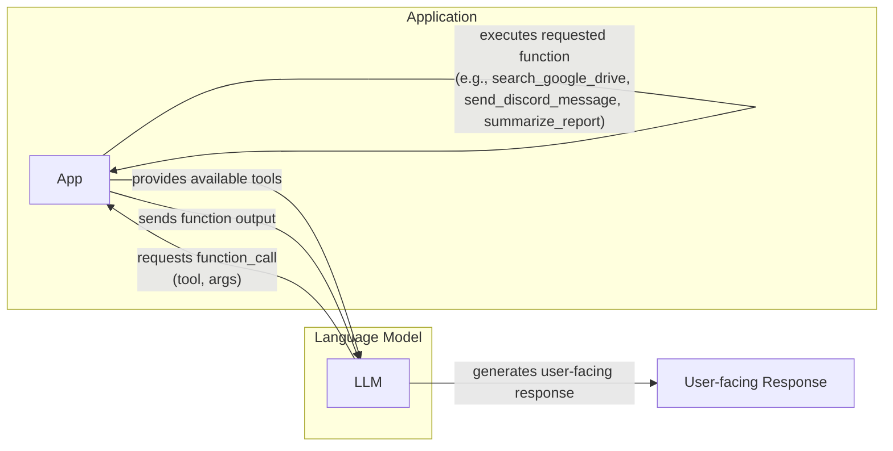
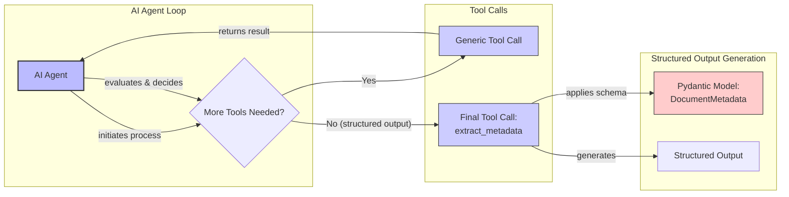
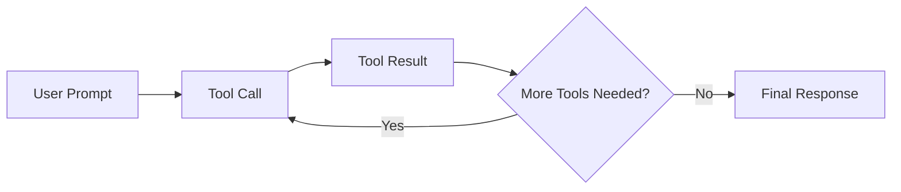

# Lesson 6: Agent Tools & Function Calling

In our previous lessons, we built a solid foundation in AI Engineering. We explored the agent landscape, distinguished between LLM workflows and AI agents, mastered context engineering, and learned how to get reliable, structured outputs from LLMs. Now, we will give our agents the ability to interact with the world.

This lesson is about tools, also known as function calling. Tools are what transform an LLM from a simple text generator into an agent that can take action. For an AI Engineer, understanding how an agent uses tools is not just a technical skill; it is the key to opening the black box. It allows you to build, debug, and monitor systems that can interact with external environments. By the end of this lesson, you will understand how an LLM decides which tool to call, generates the correct parameters, and executes the function.

## Understanding why agents need tools

LLMs have a fundamental limitation: they are powerful pattern matchers and text generators, but they cannot perform actions or access information outside their training data on their own. They are like a brain in a jar, capable of incredible reasoning but unable to interact with the external world. This limitation is not merely conceptual; it is rooted in the way LLMs are trained. Because they are optimized to predict the next token, they favor statistical correlation over true logical inference. This can lead to reasoning errors and hallucinations, especially for facts or events not well-represented in their training data. Information-theoretic bounds guarantee that such failures will persist regardless of model scale, making external tools a necessity for reliable access to real-world state [[12]](https://arxiv.org/html/2511.12869v2). This is where tools come in.

Think of the LLM as the brain of an agent. Tools are its "hands and senses," allowing it to perceive and act in the world beyond its textual interface. This aligns with the "extended mind" thesis in cognitive science, which argues that cognitive processes are not confined to the brain but are distributed across the tools we use [[11]](https://medium.com/@anicomanesh/how-llm-reasoning-powers-the-agentic-ai-revolution-cbefd10ebf3f). They are the bridge between the LLM's internal reasoning and the outside world. With tools, an LLM becomes an AI agent that can execute specific instructions and interact with its environment.

Image 1: A user asks an LLM to find the weather in Berlin, and the LLM uses a `get_weather` tool to retrieve the information before responding. (Source: [https://i.imgur.com/1y8yGvD.png](https://i.imgur.com/1y8yGvD.png))

This capability unlocks a vast range of applications. Here are a few examples of popular tools that power modern AI agents:

*   **Accessing real-time information** through APIs, such as checking today's weather or fetching the latest news [[1]](https://lnu.diva-portal.org/smash/get/diva2:1801354/FULLTEXT01.pdf).
*   **Interacting with external databases** and storage solutions like PostgreSQL, Snowflake, or S3.
*   **Accessing the agent's long-term memory** to recall information beyond its immediate context window, a topic we will cover in Lesson 9.
*   **Executing code** in languages like Python or JavaScript to perform precise calculations, manipulate data, or create visualizations [[2]](https://arxiv.org/html/2507.08034v1).

## Implementing tool calls from scratch

The best way to understand how tools work is to build them from scratch. The process of calling a tool involves a multi-step dialogue between your application and the LLM. It allows the model to request information or an action, which your code then executes and returns. This cycle is fundamental to how agents operate.

The high-level flow looks like this:

1.  **You:** Send the LLM a prompt and a list of available tools.
2.  **LLM:** Responds with a `function_call` request, specifying the tool and its arguments.
3.  **You:** Execute the requested function in your code.
4.  **You:** Send the function's output back to the LLM.
5.  **LLM:** Uses the tool's output to generate a final, user-facing response.

This request-execute-respond cycle is the core mechanism of tool use, as illustrated in Image 2.



Image 2: A flowchart illustrating the 5-step process of calling a tool between an App and an LLM.

Let's implement a simple example where we mock searching for a document on Google Drive and sending its summary to a Discord channel.

<aside>
💡

You can find the code for this lesson in the Lesson 6 notebook in the course's GitHub repository.

</aside>

1.  First, we set up our environment by initializing the Gemini client and defining our model and a mock document. We will use `gemini-2.5-flash`, which is fast and cost-effective.
    ```python
    import json
    from typing import Any
    
    from google import genai
    from google.genai import types
    from pydantic import BaseModel, Field
    
    from lessons.utils import pretty_print
    
    client = genai.Client()
    
    MODEL_ID = "gemini-2.5-flash"
    
    DOCUMENT = """
    # Q3 2023 Financial Performance Analysis
    
    The Q3 earnings report shows a 20% increase in revenue and a 15% growth in user engagement, 
    beating market expectations. These impressive results reflect our successful product strategy 
    and strong market positioning.
    
    Our core business segments demonstrated remarkable resilience, with digital services leading 
    the growth at 25% year-over-year. The expansion into new markets has proven particularly 
    successful, contributing to 30% of the total revenue increase.
    
    Customer acquisition costs decreased by 10% while retention rates improved to 92%, 
    marking our best performance to date. These metrics, combined with our healthy cash flow 
    position, provide a strong foundation for continued growth into Q4 and beyond.
    """
    ```

2.  Next, we define three mock functions. The function signatures and docstrings are critical, as the LLM uses them to understand what each tool does. To keep the code simple, all tools are mocked.
    ```python
    def search_google_drive(query: str) -> dict:
        """
        Searches for a file on Google Drive and returns its content or a summary.
    
        Args:
            query (str): The search query to find the file, e.g., 'Q3 earnings report'.
    
        Returns:
            dict: A dictionary representing the search results, including file names and summaries.
        """
    
        # In a real scenario, this would interact with the Google Drive API.
        # Here, we mock the response for demonstration.
        return {
            "files": [
                {
                    "name": "Q3_Earnings_Report_2024.pdf",
                    "id": "file12345",
                    "content": DOCUMENT,
                }
            ]
        }
    ```
    ```python
    def send_discord_message(channel_id: str, message: str) -> dict:
        """
        Sends a message to a specific Discord channel.
    
        Args:
            channel_id (str): The ID of the channel to send the message to, e.g., '#finance'.
            message (str): The content of the message to send.
    
        Returns:
            dict: A dictionary confirming the action, e.g., {"status": "success"}.
        """
    
        # Mocking a successful API call to Discord.
        return {
            "status": "success",
            "status_code": 200,
            "channel": channel_id,
            "message_preview": f"{message[:50]}...",
        }
    ```
    ```python
    def summarize_financial_report(text: str) -> str:
        """
        Summarizes a financial report.
    
        Args:
            text (str): The text to summarize.
    
        Returns:
            str: The summary of the text.
        """
    
        return "The Q3 2023 earnings report shows strong performance across all metrics \
    with 20% revenue growth, 15% user engagement increase, 25% digital services growth, and \
    improved retention rates of 92%."
    ```

3.  For each function, we define a schema in JSON format. This schema tells the LLM what the tool does (via `description`) and how to call it (via `parameters`). This is an industry standard used by providers like OpenAI and Google [[3]](https://ai.google.dev/gemini-api/docs/function-calling).
    ```python
    search_google_drive_schema = {
        "name": "search_google_drive",
        "description": "Searches for a file on Google Drive and returns its content or a summary.",
        "parameters": {
            "type": "object",
            "properties": {
                "query": {
                    "type": "string",
                    "description": "The search query to find the file, e.g., 'Q3 earnings report'.",
                }
            },
            "required": ["query"],
        },
    }
    ```
    ```python
    send_discord_message_schema = {
        "name": "send_discord_message",
        "description": "Sends a message to a specific Discord channel.",
        "parameters": {
            "type": "object",
            "properties": {
                "channel_id": {
                    "type": "string",
                    "description": "The ID of the channel to send the message to, e.g., '#finance'.",
                },
                "message": {
                    "type": "string",
                    "description": "The content of the message to send.",
                },
            },
            "required": ["channel_id", "message"],
        },
    }
    ```
    ```python
    summarize_financial_report_schema = {
        "name": "summarize_financial_report",
        "description": "Summarizes a financial report.",
        "parameters": {
            "type": "object",
            "properties": {
                "text": {
                    "type": "string",
                    "description": "The text to summarize.",
                },
            },
            "required": ["text"],
        },
    }
    ```

4.  We then aggregate these tools into a registry for easy access.
    ```python
    TOOLS = {
        "search_google_drive": {
            "handler": search_google_drive,
            "declaration": search_google_drive_schema,
        },
        "send_discord_message": {
            "handler": send_discord_message,
            "declaration": send_discord_message_schema,
        },
        "summarize_financial_report": {
            "handler": summarize_financial_report,
            "declaration": summarize_financial_report_schema,
        },
    }
    TOOLS_BY_NAME = {tool_name: tool["handler"] for tool_name, tool in TOOLS.items()}
    TOOLS_SCHEMA = [tool["declaration"] for tool in TOOLS.values()]
    ```

5.  The `TOOLS_BY_NAME` mapping looks like this:
    ```text
    Tool name: search_google_drive
    Tool handler: <function search_google_drive at 0x104c7df80>
    ---------------------------------------------------------------------------
    Tool name: send_discord_message
    Tool handler: <function send_discord_message at 0x104c7de40>
    ---------------------------------------------------------------------------
    Tool name: summarize_financial_report
    Tool handler: <function summarize_financial_report at 0x1274f5c60>
    ---------------------------------------------------------------------------
    ```

6.  Here is an example schema from `TOOLS_SCHEMA`:
    ```json
    {
      "name": "search_google_drive",
      "description": "Searches for a file on Google Drive and returns its content or a summary.",
      "parameters": {
        "type": "object",
        "properties": {
          "query": {
            "type": "string",
            "description": "The search query to find the file, e.g., 'Q3 earnings report'."
          }
        },
        "required": [
          "query"
        ]
      }
    }
    ```

7.  Next, we create a system prompt that instructs the LLM on how to use these tools. It includes guidelines, the required output format, and the list of available tools enclosed in XML tags. This prompt acts as the "manual" for the LLM, detailing everything it needs to know to operate the tools correctly.
    ```python
    TOOL_CALLING_SYSTEM_PROMPT = """
    You are a helpful AI assistant with access to tools that enable you to take actions and retrieve information to better 
    assist users.
    
    ## Tool Usage Guidelines
    
    **When to use tools:**
    - When you need information that is not in your training data
    - When you need to perform actions in external systems and environments
    - When you need real-time, dynamic, or user-specific data
    - When computational operations are required
    
    **Tool selection:**
    - Choose the most appropriate tool based on the user's specific request
    - If multiple tools could work, select the one that most directly addresses the need
    - Consider the order of operations for multi-step tasks
    
    **Parameter requirements:**
    - Provide all required parameters with accurate values
    - Use the parameter descriptions to understand expected formats and constraints
    - Ensure data types match the tool's requirements (strings, numbers, booleans, arrays)
    
    ## Tool Call Format
    
    When you need to use a tool, output ONLY the tool call in this exact format:
    
    <tool_call>
    {{"name": "tool_name", "args": {{"param1": "value1", "param2": "value2"}}}}
    </tool_call>
    
    **Critical formatting rules:**
    - Use double quotes for all JSON strings
    - Ensure the JSON is valid and properly escaped
    - Include ALL required parameters
    - Use correct data types as specified in the tool definition
    - Do not include any additional text or explanation in the tool call
    
    ## Response Behavior
    
    - If no tools are needed, respond directly to the user with helpful information
    - If tools are needed, make the tool call first, then provide context about what you're doing
    - After receiving tool results, provide a clear, user-friendly explanation of the outcome
    - If a tool call fails, explain the issue and suggest alternatives when possible
    
    ## Available Tools
    
    <tool_definitions>
    {tools}
    </tool_definitions>
    
    Remember: Your goal is to be maximally helpful to the user. Use tools when they add value, but don't use them unnecessarily. Always prioritize accuracy and user experience.
    """
    ```

8.  In practice, the LLM uses the `description` field from the tool schema to *decide* if a tool is appropriate for the user's query. This is why writing clear and distinct tool descriptions is critical. Vague descriptions like "search documents" and "search files" can confuse the model. Explicit descriptions like "search documents on Google Drive" and "search files on the local disk" prevent ambiguity [[4]](https://www.anthropic.com/research/building-effective-agents). Once a tool is selected, the LLM *generates* the function name and arguments as a structured JSON output. This capability is a result of instruction fine-tuning, where models are specifically trained to interpret schemas and produce valid tool calls. This process involves training the model on thousands of examples where an instruction is paired with the desired structured output, modifying the model's internal weights to make schema adherence a native capability [[13]](https://blog.neosage.io/p/an-engineers-guide-to-fine-tuning). As you scale to dozens or hundreds of tools, providing every schema in the prompt becomes inefficient and can confuse the model. A more robust architectural pattern, borrowed from microservices, is to use a routing layer. The agent first queries a retriever to find the most relevant tools for a task before being prompted with only that small subset [[14]](https://www.linkedin.com/posts/anthony-alcaraz-b80763155_your-ai-agents-are-failing-because-of-tool-activity-7385615536883286016-HvoY).

9.  Let's test it. We send a user prompt along with our system prompt to the model.
    ```python
    USER_PROMPT = """
    Can you help me find the latest quarterly report and share key insights with the team?
    """
    
    messages = [TOOL_CALLING_SYSTEM_PROMPT.format(tools=str(TOOLS_SCHEMA)), USER_PROMPT]
    
    response = client.models.generate_content(
        model=MODEL_ID,
        contents=messages,
    )
    ```
    It outputs:
    ```text
    <tool_call>
    {"name": "search_google_drive", "args": {"query": "latest quarterly report"}}
    </tool_call>
    ```
    The LLM correctly identifies the `search_google_drive` tool and generates the required arguments.

10. Let's try another prompt.
    ```python
    USER_PROMPT = """
    Please find the Q3 earnings report on Google Drive and send a summary of it to 
    the #finance channel on Discord.
    """
    
    messages = [TOOL_CALLING_SYSTEM_PROMPT.format(tools=str(TOOLS_SCHEMA)), USER_PROMPT]
    
    response = client.models.generate_content(
        model=MODEL_ID,
        contents=messages,
    )
    ```
    It outputs:
    ```text
    <tool_call>
    {"name": "search_google_drive", "args": {"query": "Q3 earnings report"}}
    </tool_call>
    ```

11. Now, we need to parse the LLM's response and execute the tool. First, we extract the JSON string.
    ```python
    def extract_tool_call(response_text: str) -> str:
        """
        Extracts the tool call from the response text.
        """
        return response_text.split("<tool_call>")[1].split("</tool_call>")[0].strip()
    
    
    tool_call_str = extract_tool_call(response.text)
    ```
    It outputs:
    ```text
    '{"name": "search_google_drive", "args": {"query": "Q3 earnings report"}}'
    ```

12. We parse the string into a Python dictionary.
    ```python
    tool_call = json.loads(tool_call_str)
    ```
    It outputs:
    ```text
    {'name': 'search_google_drive', 'args': {'query': 'Q3 earnings report'}}
    ```

13. Next, we retrieve the correct function handler from our `TOOLS_BY_NAME` registry.
    ```python
    tool_handler = TOOLS_BY_NAME[tool_call["name"]]
    ```
    It outputs:
    ```text
    <function __main__.search_google_drive(query: str) -> dict>
    ```

14. Finally, we call the function with the arguments generated by the LLM.
    ```python
    tool_result = tool_handler(**tool_call["args"])
    ```
    It outputs:
    ```json
    {
      "files": [
        {
          "name": "Q3_Earnings_Report_2024.pdf",
          "id": "file12345",
          "content": "\n# Q3 2023 Financial Performance Analysis\n\nThe Q3 earnings report shows a 20% increase in revenue and a 15% growth in user engagement, \nbeating market expectations. These impressive results reflect our successful product strategy \nand strong market positioning.\n\nOur core business segments demonstrated remarkable resilience, with digital services leading \nthe growth at 25% year-over-year. The expansion into new markets has proven particularly \nsuccessful, contributing to 30% of the total revenue increase.\n\nCustomer acquisition costs decreased by 10% while retention rates improved to 92%, \nmarking our best performance to date. These metrics, combined with our healthy cash flow \nposition, provide a strong foundation for continued growth into Q4 and beyond.\n"
        }
      ]
    }
    ```

15. We can wrap these steps in a single helper function.
    ```python
    def call_tool(response_text: str, tools_by_name: dict) -> Any:
        """
        Call a tool based on the response from the LLM.
        """
    
        tool_call_str = extract_tool_call(response_text)
        tool_call = json.loads(tool_call_str)
        tool_name = tool_call["name"]
        tool_args = tool_call["args"]
        tool = tools_by_name[tool_name]
    
        return tool(**tool_args)
    ```

16. Using this function gives us the same result.
    ```python
    call_tool(response.text, tools_by_name=TOOLS_BY_NAME)
    ```
    It outputs:
    ```json
    {
      "files": [
        {
          "name": "Q3_Earnings_Report_2024.pdf",
          "id": "file12345",
          "content": "\n# Q3 2023 Financial Performance Analysis\n\nThe Q3 earnings report shows a 20% increase in revenue and a 15% growth in user engagement, \nbeating market expectations. These impressive results reflect our successful product strategy \nand strong market positioning.\n\nOur core business segments demonstrated remarkable resilience, with digital services leading \nthe growth at 25% year-over-year. The expansion into new markets has proven particularly \nsuccessful, contributing to 30% of the total revenue increase.\n\nCustomer acquisition costs decreased by 10% while retention rates improved to 92%, \nmarking our best performance to date. These metrics, combined with our healthy cash flow \nposition, provide a strong foundation for continued growth into Q4 and beyond.\n"
        }
      ]
    }
    ```

17. The final step is to send the tool's result back to the LLM, allowing it to interpret the output and formulate a final response or decide on the next action.
    ```python
    response = client.models.generate_content(
        model=MODEL_ID,
        contents=f"Interpret the tool result: {json.dumps(tool_result, indent=2)}",
    )
    ```
    It outputs:
    ```text
    The tool result provides the content of a file named `Q3_Earnings_Report_2024.pdf`.
    
    This document is a **Q3 2023 Financial Performance Analysis** and details exceptionally strong results, significantly beating market expectations.
    
    **Key highlights from the report include:**
    
    *   **Revenue Growth:** A 20% increase in revenue.
    *   **User Engagement:** 15% growth in user engagement.
    *   **Core Business Performance:** Digital services led growth at 25% year-over-year.
    *   **Market Expansion Success:** New markets contributed to 30% of the total revenue increase.
    *   **Efficiency & Retention:**
        *   Customer acquisition costs decreased by 10%.
        *   Retention rates improved to 92%, marking the best performance to date.
    *   **Financial Health:** The company maintains a healthy cash flow position.
    
    The report attributes these impressive results to a successful product strategy and strong market positioning, indicating a robust foundation for continued growth into Q4 and beyond.
    ```

This is the basic concept behind tool calling. We have successfully implemented it from scratch.

## Implementing a tool calling framework from scratch

Manually defining a JSON schema for every tool is cumbersome and does not scale well. This approach introduces boilerplate code, is prone to human error, and violates fundamental software engineering principles. Modern agentic frameworks like LangGraph and protocols like MCP (Model Context Protocol) solve this by using a `@tool` decorator that automatically generates and tracks schemas from decorated functions. Protocols like MCP aim to create a universal standard for how agents interact with tools, much like USB-C for hardware. This provides a stable interface that simplifies integration across different models and tool providers, reducing vendor lock-in [[15]](https://truto.one/blog/the-best-unified-apis-for-llm-function-calling-ai-agent-tools-2026).

Let's build a small framework with a `@tool` decorator to automate schema generation. This approach follows the Don't Repeat Yourself (DRY) principle by creating a single, standardized way to define tools [[5]](https://openai.github.io/openai-agents-python/tools/). The decorator will inspect a function's signature and docstring to extract its name, description, and parameters, which is the same mechanism used by production-grade libraries.

1.  First, we define a `ToolFunction` class to hold the function and its schema. This class will act as a wrapper, bundling the executable code with its machine-readable description.
    ```python
    from inspect import Parameter, signature
    from typing import Any, Callable, Dict, Optional
    
    
    class ToolFunction:
        def __init__(self, func: Callable, schema: Dict[str, Any]) -> None:
            self.func = func
            self.schema = schema
            self.__name__ = func.__name__
            self.__doc__ = func.__doc__
    
        def __call__(self, *args: Any, **kwargs: Any) -> Any:
            return self.func(*args, **kwargs)
    ```

2.  Next, we create the `@tool` decorator. It inspects a function's signature and docstring to automatically generate the JSON schema. This process uses Python's built-in `inspect` module to understand the function's arguments and types. Production frameworks often use more advanced libraries like `griffe` for parsing complex docstring formats (like those used by Google or Sphinx) and `pydantic` for robust schema creation from type annotations [[5]](https://openai.github.io/openai-agents-python/tools/). Our simplified version captures the core logic.
    ```python
    def tool(description: Optional[str] = None) -> Callable[[Callable], ToolFunction]:
        """
        A decorator that creates a tool schema from a function.
    
        Args:
            description: Optional override for the function's docstring
    
        Returns:
            A decorator function that wraps the original function and adds a schema
        """
    
        def decorator(func: Callable) -> ToolFunction:
            # Get function signature
            sig = signature(func)
    
            # Create parameters schema
            properties = {}
            required = []
    
            for param_name, param in sig.parameters.items():
                # Skip self for methods
                if param_name == "self":
                    continue
    
                param_schema = {
                    "type": "string",  # Default to string, can be enhanced with type hints
                    "description": f"The {param_name} parameter",  # Default description
                }
    
                # Add to required if parameter has no default value
                if param.default == Parameter.empty:
                    required.append(param_name)
    
                properties[param_name] = param_schema
    
            # Create the tool schema
            schema = {
                "name": func.__name__,
                "description": description or func.__doc__ or f"Executes the {func.__name__} function.",
                "parameters": {
                    "type": "object",
                    "properties": properties,
                    "required": required,
                },
            }
    
            return ToolFunction(func, schema)
    
        return decorator
    ```

3.  Now, we can redefine our tools using the new decorator. The code becomes much cleaner and more maintainable, as the schema is generated implicitly from the function definition itself.
    ```python
    @tool()
    def search_google_drive_example(query: str) -> dict:
        """Search for files in Google Drive."""
        return {"files": ["Q3 earnings report"]}
    
    
    @tool()
    def send_discord_message_example(channel_id: str, message: str) -> dict:
        """Send a message to a Discord channel."""
        return {"message": "Message sent successfully"}
    
    
    @tool()
    def summarize_financial_report_example(text: str) -> str:
        """Summarize the contents of a financial report."""
        return "Financial report summarized successfully"
    
    
    tools = [
        search_google_drive_example,
        send_discord_message_example,
        summarize_financial_report_example,
    ]
    tools_by_name = {tool.schema["name"]: tool.func for tool in tools}
    tools_schema = [tool.schema for tool in tools]
    ```

4.  The decorated function is now a `ToolFunction` object.
    ```python
    type(search_google_drive_example)
    ```
    It outputs:
    ```text
    __main__.ToolFunction
    ```

5.  This object contains the auto-generated schema, which is identical to the one we defined manually.
    ```python
    search_google_drive_example.schema
    ```
    It outputs:
    ```json
    {
      "name": "search_google_drive_example",
      "description": "Search for files in Google Drive.",
      "parameters": {
        "type": "object",
        "properties": {
          "query": {
            "type": "string",
            "description": "The query parameter"
          }
        },
        "required": [
          "query"
        ]
      }
    }
    ```

6.  It also contains a reference to the original function handler.
    ```python
    search_google_drive_example.func
    ```
    It outputs:
    ```text
    <function __main__.search_google_drive_example(query: str) -> dict>
    ```

7.  Let's test our new framework with the LLM.
    ```python
    USER_PROMPT = """
    Please find the Q3 earnings report on Google Drive and send a summary of it to 
    the #finance channel on Discord.
    """
    
    messages = [TOOL_CALLING_SYSTEM_PROMPT.format(tools=str(tools_schema)), USER_PROMPT]
    
    response = client.models.generate_content(
        model=MODEL_ID,
        contents=messages,
    )
    ```
    It outputs:
    ```text
    <tool_call>
    {"name": "search_google_drive_example", "args": {"query": "Q3 earnings report"}}
    </tool_call>
    ```

8.  We can execute the tool call just as before.
    ```python
    call_tool(response.text, tools_by_name=tools_by_name)
    ```
    It outputs:
    ```json
    {
      "files": [
        "Q3 earnings report"
      ]
    }
    ```

Voilà! We have built a small, reusable tool-calling framework similar to what you might find in production libraries.

## Implementing production-level tool calls with Gemini

While building from scratch is a great learning exercise, in production, you will typically leverage the native tool-calling capabilities of APIs like Gemini or OpenAI. This approach is more robust, requires less code, and is optimized by the provider for their specific models [[6]](https://www.decodingai.com/p/tool-calling-from-scratch-to-production). When you use a native API, you are benefiting from the provider's extensive fine-tuning, which ensures the model understands the tool-calling syntax and schema constraints far more reliably than a generic model guided by a system prompt alone. This also offloads the maintenance burden of keeping prompts optimized for new model versions.

Let's see how to achieve the same result using Gemini's native API.

1.  Instead of a lengthy system prompt, we define a `GenerateContentConfig` object and pass our tool schemas directly to it. The `mode="ANY"` setting forces the model to call a function rather than generating a free-form text response.
    ```python
    tools = [
        types.Tool(
            function_declarations=[
                types.FunctionDeclaration(**search_google_drive_schema),
                types.FunctionDeclaration(**send_discord_message_schema),
            ]
        )
    ]
    config = types.GenerateContentConfig(
        tools=tools,
        # Force the model to call 'any' function, instead of chatting.
        tool_config=types.ToolConfig(function_calling_config=types.FunctionCallingConfig(mode="ANY")),
    )
    ```

2.  Now, we can call the model with just the user prompt. The Gemini API handles the complex instructions internally, making the process cleaner and more reliable.
    ```python
    response = client.models.generate_content(
        model=MODEL_ID,
        contents=USER_PROMPT,
        config=config,
    )
    ```

3.  The response contains a `function_call` object, which is a structured representation of the model's request.
    ```python
    response_message_part = response.candidates[0].content.parts[0]
    function_call = response_message_part.function_call
    ```
    It outputs:
    ```text
    FunctionCall(id=None, args={'query': 'Q3 earnings report'}, name='search_google_drive')
    ```

4.  To simplify even further, the `google-genai` SDK can automatically generate the schema from a Python function's signature, type hints, and docstring, just like our custom decorator. We can pass our functions directly to the `GenerateContentConfig` object, eliminating the need for manual schema definition entirely.
    ```python
    config = types.GenerateContentConfig(
        tools=[search_google_drive, send_discord_message]
    )
    ```

5.  We can then create a simplified `call_tool` function to execute the call.
    ```python
    def call_tool(function_call) -> Any:
        tool_name = function_call.name
        tool_args = {key: value for key, value in function_call.args.items()}
    
        tool_handler = TOOLS_BY_NAME[tool_name]
    
        return tool_handler(**tool_args)
    
    tool_result = call_tool(function_call)
    ```
    It outputs:
    ```json
    {
      "files": [
        {
          "name": "Q3_Earnings_Report_2024.pdf",
          "id": "file12345",
          "content": "\n# Q3 2023 Financial Performance Analysis\n\nThe Q3 earnings report shows a 20% increase in revenue and a 15% growth in user engagement, \nbeating market expectations. These impressive results reflect our successful product strategy \nand strong market positioning.\n\nOur core business segments demonstrated remarkable resilience, with digital services leading \nthe growth at 25% year-over-year. The expansion into new markets has proven particularly \nsuccessful, contributing to 30% of the total revenue increase.\n\nCustomer acquisition costs decreased by 10% while retention rates improved to 92%, \nmarking our best performance to date. These metrics, combined with our healthy cash flow \nposition, provide a strong foundation for continued growth into Q4 and beyond.\n"
        }
      ]
    }
    ```

By leveraging the native SDK, we reduced dozens of lines of code to just a few, creating a more robust and maintainable system. Other popular APIs from OpenAI and Anthropic follow a similar logic, making these concepts easily transferable [[7]](https://apxml.com/courses/prompt-engineering-llm-application-development/chapter-4-interacting-with-llm-apis/), [[8]](https://myengineeringpath.dev/tools/gemini-guide/).

## Using Pydantic models as tools for on-demand structured outputs

Connecting this lesson with what we learned in Lesson 4, a powerful pattern is to use a Pydantic model as a tool. This is particularly useful in agentic scenarios where an agent performs several intermediate steps and then, at the end, needs to output data in a structured format. By defining the Pydantic model as a tool, the agent can dynamically decide when to call it to produce a validated, machine-readable output. This is a common pattern for extracting entities to populate a knowledge graph or for returning structured data to a downstream application after a series of reasoning steps.

This approach combines the flexibility of multi-step reasoning with the reliability of structured data extraction, as shown in Image 3. The agent can use various tools to gather information and, once it has sufficient context, it makes a final call to an "extraction" tool backed by a Pydantic model to format the final answer.



Image 3: A flowchart illustrating an AI agent calling multiple tools in a loop, where only the last tool call is for structured outputs using a Pydantic model.

Let's see how to implement this.

1.  First, we define our `DocumentMetadata` Pydantic model, just as we did in Lesson 4.
    ```python
    class DocumentMetadata(BaseModel):
        """A class to hold structured metadata for a document."""
    
        summary: str = Field(description="A concise, 1-2 sentence summary of the document.")
        tags: list[str] = Field(description="A list of 3-5 high-level tags relevant to the document.")
        keywords: list[str] = Field(description="A list of specific keywords or concepts mentioned.")
        quarter: str = Field(description="The quarter of the financial year described in the document (e.g., Q3 2023).")
        growth_rate: str = Field(description="The growth rate of the company described in the document (e.g., 10%).")
    ```

2.  We then create a tool declaration, using the Pydantic model's JSON schema as the function's parameters. This effectively tells the LLM that there is a "tool" it can call whose arguments perfectly match the fields of our Pydantic model.
    ```python
    # The Pydantic class 'DocumentMetadata' is now our 'tool'
    extraction_tool = types.Tool(
        function_declarations=[
            types.FunctionDeclaration(
                name="extract_metadata",
                description="Extracts structured metadata from a financial document.",
                parameters=DocumentMetadata.model_json_schema(),
            )
        ]
    )
    config = types.GenerateContentConfig(
        tools=[extraction_tool],
        tool_config=types.ToolConfig(function_calling_config=types.FunctionCallingConfig(mode="ANY")),
    )
    ```

3.  We prompt the model to analyze the document and extract the metadata.
    ```python
    prompt = f"""
    Please analyze the following document and extract its metadata.
    
    Document:
    --- 
    {DOCUMENT}
    --- 
    """
    
    response = client.models.generate_content(model=MODEL_ID, contents=prompt, config=config)
    response_message_part = response.candidates[0].content.parts[0]
    ```

4.  The model responds with a function call to our `extract_metadata` tool, with the arguments populated according to the Pydantic schema.
    ```text
    Function Name: `extract_metadata
    Function Arguments: `{
        "growth_rate": "20%",
        "summary": "The Q3 2023 earnings report shows a 20% increase in revenue and 15% growth in user engagement, driven by successful product strategy and market expansion. This performance provides a strong foundation for continued growth.",
        "quarter": "Q3 2023",
        "keywords": [
            "Revenue",
            "User Engagement",
            "Market Expansion",
            "Customer Acquisition",
            "Retention Rates",
            "Digital Services",
            "Cash Flow"
        ],
        "tags": [
            "Financials",
            "Earnings",
            "Growth",
            "Business Strategy",
            "Market Analysis"
        ]
    }`
    ```

5.  Finally, we can validate the arguments by instantiating our `DocumentMetadata` model.
    ```python
    if hasattr(response_message_part, "function_call"):
        function_call = response_message_part.function_call
    
        try:
            document_metadata = DocumentMetadata(**function_call.args)
            print("Validation successful!")
        except Exception as e:
            print(f"Validation failed: {e}")
    else:
        print("The model did not call the extraction tool.")
    ```
    It outputs:
    ```text
    Validation successful!
    ```
This pattern is a clean and effective way to ensure your agent produces reliable, structured data when needed.

## The downsides of running tools in a loop

So far, we have focused on single-turn interactions. However, real-world tasks often require multiple steps. A natural progression is to run tools in a loop, allowing the agent to chain multiple actions and make decisions based on the output of previous steps. This is the final piece of the puzzle needed to build a true AI agent.

This loop, illustrated in Image 4, gives the agent flexibility and adaptability to handle complex tasks.



Image 4: A flowchart illustrating a sequential tool calling loop with a decision point for iteration.

Let's implement a multi-step task where the agent must find a report, summarize it, and send the summary to Discord.

1.  First, we configure the model with all three of our tools.
    ```python
    tools = [
        types.Tool(
            function_declarations=[
                types.FunctionDeclaration(**search_google_drive_schema),
                types.FunctionDeclaration(**send_discord_message_schema),
                types.FunctionDeclaration(**summarize_financial_report_schema),
            ]
        )
    ]
    config = types.GenerateContentConfig(
        tools=tools,
        tool_config=types.ToolConfig(function_calling_config=types.FunctionCallingConfig(mode="ANY")),
    )
    ```

2.  We define the user's multi-step request.
    ```python
    USER_PROMPT = """
    Please find the Q3 earnings report on Google Drive and send a summary of it to 
    the #finance channel on Discord.
    """
    
    messages = [USER_PROMPT]
    ```

3.  We initiate the first call to the LLM.
    ```python
    response = client.models.generate_content(
        model=MODEL_ID,
        contents=messages,
        config=config,
    )
    response_message_part = response.candidates[0].content.parts[0]
    messages.append(response.candidates[0].content)
    ```
    The model correctly identifies the first step: searching for the report.
    ```text
    Function Name: `search_google_drive
    Function Arguments: `{
        "query": "Q3 earnings report"
    }`
    ```

4.  Now, we loop. At each step, we execute the requested tool, append the result to our message history, and call the model again to decide the next action.
    ```python
    # Loop until the model stops requesting function calls or we reach the max number of iterations
    max_iterations = 3
    while hasattr(response_message_part, "function_call") and max_iterations > 0:
        tool_result = call_tool(response_message_part.function_call)
    
        # Add the tool result to the messages
        function_response_part = types.Part.from_function_response(
            name=response_message_part.function_call.name,
            response={"result": tool_result},
        )
        messages.append(function_response_part)
    
        # Ask the LLM to continue with the next step
        response = client.models.generate_content(
            model=MODEL_ID,
            contents=messages,
            config=config,
        )
    
        response_message_part = response.candidates[0].content.parts[0]
        messages.append(response.candidates[0].content)
    
        max_iterations -= 1
    ```
    The loop proceeds as follows:
    *   **Iteration 1:** `search_google_drive` is called. The file content is returned.
    *   **Iteration 2:** `summarize_financial_report` is called with the file content. The summary is returned.
    *   **Iteration 3:** `send_discord_message` is called with the summary. The loop terminates as the task is complete.

While powerful, this simple loop has limitations. It does not give the LLM an explicit opportunity to reason about the output of a tool before deciding on the next action. The agent immediately moves to the next function call without pausing to think about what it has learned or whether it should change its strategy. This can lead to inefficient tool use or getting stuck in loops [[9]](https://myengineeringpath.dev/genai-engineer/agentic-patterns/).

This is not just a theoretical risk; it is a well-documented failure mode. Research has shown that errors in multi-step agentic workflows compound exponentially. If each step has a 90% success rate, a 10-step process has only a 35% chance of succeeding. This pattern of compounding error, where small mistakes early on lead to catastrophic failures later, is a primary reason why simple agent loops are not reliable enough for many production use cases [[16]](https://tushardadlani.com/the-compound-error-crisis-why-llm-agents-are-failing-like-broken-robots-and-why-computer-science-warned-us). This phenomenon, sometimes called "agent drift," occurs as the agent loses focus over many steps due to "attention decay." To combat this, we can draw inspiration from human cognition and use a technique called 'Cognitive Scaffolding.' Just as a person uses a notepad to keep track of a complex task, an agent can use external storage, like a file system, as a "cognitive prosthetic" to write down its plan, log its actions, and re-read its goals to maintain discipline and focus over long-running tasks.

To further optimize, independent tool calls can be run in parallel. For example, fetching financial news and stock prices can happen simultaneously, reducing latency.

These limitations motivated the development of more sophisticated patterns like **ReAct** (Reasoning and Acting), which explicitly interleaves reasoning steps with tool calls. We will explore ReAct in detail in Lessons 7 and 8.

## Popular tools used within the industry

To ground these concepts in the real world, let's review some popular tool categories used across the industry.

### Knowledge & Memory Access

These tools connect the agent to external knowledge sources. This includes querying vector databases, document stores, or graph databases to retrieve relevant context. A more advanced pattern is text-to-SQL, where the LLM constructs and executes database queries to interact with traditional databases like PostgreSQL [[10]](https://promethium.ai/guides/text-to-sql-basics-benefits/). These tools are fundamental to RAG and agentic RAG systems, which we will discuss in Lessons 9 and 10.

### Web Search & Browsing

These tools give agents access to the internet. They can interface with search engine APIs (Google, Bing, Brave) or use web scraping tools to fetch and parse content from web pages. Web access is a standard feature in most modern chatbots and research agents [[2]](https://arxiv.org/html/2507.08034v1).

### Code Execution

A code interpreter tool, typically for Python, allows an agent to write and execute code in a sandboxed environment. This is invaluable for precise calculations, data manipulation, and generating visualizations. While Python is the most common, this pattern is also adapted for other languages like JavaScript [[11]](https://medium.com/@anicomanesh/how-llm-reasoning-powers-the-agentic-ai-revolution-cbefd10ebf3f).

### Robotics & Real-World Interaction

A rapidly growing application of tool calling is in autonomous robotics. Here, the LLM acts as a high-level planner, translating natural language commands like "pick up the red block" into a sequence of tool calls. These "tools" are APIs that control the robot's low-level functions, such as moving an arm, adjusting a gripper, or interpreting sensor data. This architecture allows robots to perform complex tasks in dynamic, unstructured environments without needing to be explicitly programmed for every possible scenario [[17]](https://www.mdpi.com/2673-2688/6/7/158).

### Other Popular Tools

The ecosystem of tools is vast and growing. Other common categories include:

*   **External API Integrations:** Connecting to calendars, email, or project management systems is common in enterprise AI applications.
*   **File System Operations:** Tools for reading, writing, and listing files are essential for productivity apps that interact with a user's local operating system.

## Conclusion

Tool calling is at the core of building AI agents. It is the mechanism that allows an LLM to move beyond text generation and interact with the world. Mastering this skill is essential for any AI engineer who wants to build, monitor, and debug robust AI applications.

In our next lesson, we will build on this foundation by exploring the theory behind planning and the ReAct pattern. This will allow our agents not just to act, but to reason about their actions, bringing us one step closer to building truly intelligent systems.

## References

- [1] https://lnu.diva-portal.org/smash/get/diva2:1801354/FULLTEXT01.pdf
- [2] https://arxiv.org/html/2507.08034v1
- [3] https://ai.google.dev/gemini-api/docs/function-calling
- [4] https://www.anthropic.com/research/building-effective-agents
- [5] https://openai.github.io/openai-agents-python/tools/
- [6] https://www.decodingai.com/p/tool-calling-from-scratch-to-production
- [7] https://apxml.com/courses/prompt-engineering-llm-application-development/chapter-4-interacting-with-llm-apis/
- [8] https://myengineeringpath.dev/tools/gemini-guide/
- [9] https://myengineeringpath.dev/genai-engineer/agentic-patterns/
- [10] https://promethium.ai/guides/text-to-sql-basics-benefits/
- [11] https://medium.com/@anicomanesh/how-llm-reasoning-powers-the-agentic-ai-revolution-cbefd10ebf3f
- [12] https://arxiv.org/html/2511.12869v2
- [13] https://blog.neosage.io/p/an-engineers-guide-to-fine-tuning
- [14] https://www.linkedin.com/posts/anthony-alcaraz-b80763155_your-ai-agents-are-failing-because-of-tool-activity-7385615536883286016-HvoY
- [15] https://truto.one/blog/the-best-unified-apis-for-llm-function-calling-ai-agent-tools-2026
- [16] https://tushardadlani.com/the-compound-error-crisis-why-llm-agents-are-failing-like-broken-robots-and-why-computer-science-warned-us
- [17] https://www.mdpi.com/2673-2688/6/7/158