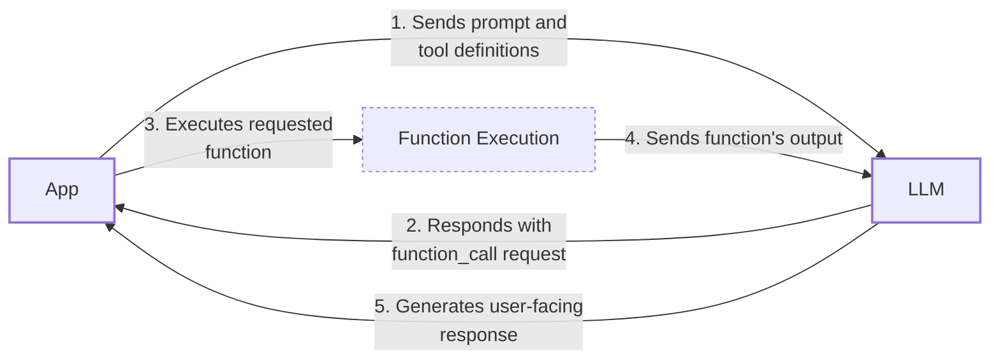
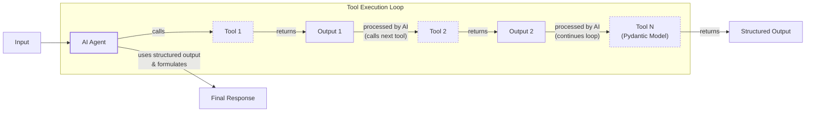
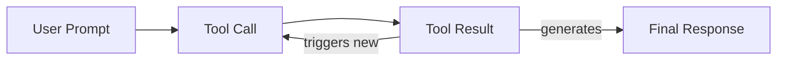

# Lesson 6: Agent Tools & Function Calling

In our previous lessons, we built a solid foundation in AI Engineering. We explored the agent landscape, distinguished between LLM workflows and AI agents, mastered context engineering, ensured reliable data extraction with structured outputs, and implemented basic workflow patterns. We have learned how to orchestrate information flow *to* an LLM. Now, it is time to tackle the other side of the equation: enabling an LLM to take action and interact with the world *around* it.

This is where tools, also known as function calling, come into play. For an AI Engineer, tools are what transform an LLM from a simple text generator into an agent that can act in the external world. They are a foundational component of any AI agent. This lesson will open that black box. We will implement tool calling from scratch to understand how an LLM decides which tool to call, generates the correct parameters, and executes the function. We will then show you how to build production-ready implementations with the Gemini API, use Pydantic models for on-demand structured outputs, and chain tools to handle multi-step tasks.

## Understanding Why Agents Need Tools

Before we dive into the implementation, it is important to understand why LLMs need tools. At their core, LLMs have a fundamental limitation: they are sophisticated pattern matchers and text generators. They are trained on vast amounts of text and can produce human-like responses, but they cannot, by themselves, interact with the external world. This is where tools come in. They act as the bridge between the LLM's internal reasoning and the outside environment.

Think of the LLM as the brain of an agent. It can think, reason, and plan. But without tools, it is a brain in a jar, unable to perceive or affect anything beyond its own thoughts. Tools are the LLM's "hands and senses," allowing it to interact with the world. With tools, an LLM becomes an AI agent capable of executing specific instructions and retrieving fresh information.

This approach leverages the LLM's general knowledge for high-level decisions, a contrast to traditional robotic planning systems that rely on classic algorithms like A* search. While traditional methods offer guaranteed optimality and reliability for tasks like pathfinding, LLMs provide the semantic understanding needed to interpret ambiguous goals and adapt to dynamic environments, a key step toward more flexible automation. [[45]](https://mediatum.ub.tum.de/doc/1766834/1766834.pdf)

This capability unlocks a wide range of applications that power modern AI agents, including:
- Accessing real-time information through APIs, like checking today's weather or fetching the latest news.
- Interacting with external databases and storage, from a PostgreSQL database to a Snowflake data warehouse.
- Accessing an agent's long-term memory to recall information beyond its immediate context window.
- Executing code in languages like Python or JavaScript.
- Performing precise calculations that go beyond the LLM's training data.

## Implementing Tool Calls from Scratch

The best way to understand how tools work is to build the mechanism from scratch. Our goal is to provide the LLM with a list of available functions and let it decide which one to use and with what arguments to fulfill a user's request.

The process involves a five-step loop between your application and the LLM:

1.  **Application:** Sends a prompt to the LLM that includes definitions of the available tools.
2.  **LLM:** Analyzes the prompt and responds with a `function_call` request, specifying the tool to use and the arguments to pass.
3.  **Application:** Parses the request and executes the corresponding function in your code.
4.  **Application:** Sends the function's output back to the LLM as a new message.
5.  **LLM:** Uses the tool's output to generate a final, user-facing response or decide on the next action.


Image 1: A flowchart illustrating the 5-step request-execute-respond flow of calling a tool.

Let's implement this flow. We will create a simple scenario where an agent can search for a financial report on a mocked Google Drive and send a summary to a mocked Discord channel.

<aside>
💡

You can find all the code for this lesson in the accompanying [Jupyter Notebook on GitHub](https://github.com/towardsai/course-ai-agents/blob/dev/lessons/06_tools/notebook.ipynb).

</aside>

1.  First, we set up our environment by initializing the Gemini client and defining some constants. We will use `gemini-2.5-flash` for its speed and cost-effectiveness. The `DOCUMENT` constant will serve as our mock file content.
    ```python
    import json
    from typing import Any
    
    from google import genai
    from google.genai import types
    from pydantic import BaseModel, Field
    
    from lessons.utils import pretty_print
    
    client = genai.Client()
    
    MODEL_ID = "gemini-2.5-flash"
    
    DOCUMENT = """
    # Q3 2023 Financial Performance Analysis
    
    The Q3 earnings report shows a 20% increase in revenue and a 15% growth in user engagement, 
    beating market expectations. These impressive results reflect our successful product strategy 
    and strong market positioning.
    
    Our core business segments demonstrated remarkable resilience, with digital services leading 
    the growth at 25% year-over-year. The expansion into new markets has proven particularly 
    successful, contributing to 30% of the total revenue increase.
    
    Customer acquisition costs decreased by 10% while retention rates improved to 92%, 
    marking our best performance to date. These metrics, combined with our healthy cash flow 
    position, provide a strong foundation for continued growth into Q4 and beyond.
    """
    ```
2.  Next, we define our mock tool functions. The function signature and docstrings are critical, as the LLM uses them to understand what each tool does.
    ```python
    def search_google_drive(query: str) -> dict:
        """
        Searches for a file on Google Drive and returns its content or a summary.
    
        Args:
            query (str): The search query to find the file, e.g., 'Q3 earnings report'.
    
        Returns:
            dict: A dictionary representing the search results, including file names and summaries.
        """
        return {
            "files": [
                {
                    "name": "Q3_Earnings_Report_2024.pdf",
                    "id": "file12345",
                    "content": DOCUMENT,
                }
            ]
        }
    ```
    ```python
    def send_discord_message(channel_id: str, message: str) -> dict:
        """
        Sends a message to a specific Discord channel.
    
        Args:
            channel_id (str): The ID of the channel to send the message to, e.g., '#finance'.
            message (str): The content of the message to send.
    
        Returns:
            dict: A dictionary confirming the action, e.g., {"status": "success"}.
        """
        return {
            "status": "success",
            "status_code": 200,
            "channel": channel_id,
            "message_preview": f"{message[:50]}...",
        }
    ```
    ```python
    def summarize_financial_report(text: str) -> str:
        """
        Summarizes a financial report.
    
        Args:
            text (str): The text to summarize.
    
        Returns:
            str: The summary of the text.
        """
        return "The Q3 2023 earnings report shows strong performance across all metrics with 20% revenue growth, 15% user engagement increase, 25% digital services growth, and improved retention rates of 92%."
    ```
3.  For each function, we must define a schema that the LLM can understand. This schema, typically in JSON format, describes the tool's name, its purpose, and its parameters, including their names, types, and descriptions. This is the industry standard used by major LLM providers like OpenAI and Google.
    ```python
    search_google_drive_schema = {
        "name": "search_google_drive",
        "description": "Searches for a file on Google Drive and returns its content or a summary.",
        "parameters": {
            "type": "object",
            "properties": {
                "query": {
                    "type": "string",
                    "description": "The search query to find the file, e.g., 'Q3 earnings report'.",
                }
            },
            "required": ["query"],
        },
    }
    ```
    ```python
    send_discord_message_schema = {
        "name": "send_discord_message",
        "description": "Sends a message to a specific Discord channel.",
        "parameters": {
            "type": "object",
            "properties": {
                "channel_id": {
                    "type": "string",
                    "description": "The ID of the channel to send the message to, e.g., '#finance'.",
                },
                "message": {
                    "type": "string",
                    "description": "The content of the message to send.",
                },
            },
            "required": ["channel_id", "message"],
        },
    }
    ```
    ```python
    summarize_financial_report_schema = {
        "name": "summarize_financial_report",
        "description": "Summarizes a financial report.",
        "parameters": {
            "type": "object",
            "properties": {
                "text": {
                    "type": "string",
                    "description": "The text to summarize.",
                },
            },
            "required": ["text"],
        },
    }
    ```
4.  We then create a tool registry to map tool names to their corresponding functions and schemas. This makes it easy to look up and execute the correct function later.
    ```python
    TOOLS = {
        "search_google_drive": {
            "handler": search_google_drive,
            "declaration": search_google_drive_schema,
        },
        "send_discord_message": {
            "handler": send_discord_message,
            "declaration": send_discord_message_schema,
        },
        "summarize_financial_report": {
            "handler": summarize_financial_report,
            "declaration": summarize_financial_report_schema,
        },
    }
    TOOLS_BY_NAME = {tool_name: tool["handler"] for tool_name, tool in TOOLS.items()}
    TOOLS_SCHEMA = [tool["declaration"] for tool in TOOLS.values()]
    ```
    The `TOOLS_BY_NAME` mapping looks like this:
    ```text
    {'search_google_drive': <function search_google_drive at 0x...>, 
     'send_discord_message': <function send_discord_message at 0x...>, 
     'summarize_financial_report': <function summarize_financial_report at 0x...>}
    ```
    And here is the schema for our `search_google_drive` tool:
    ```json
    {
        "name": "search_google_drive",
        "description": "Searches for a file on Google Drive and returns its content or a summary.",
        "parameters": {
            "type": "object",
            "properties": {
                "query": {
                    "type": "string",
                    "description": "The search query to find the file, e.g., 'Q3 earnings report'."
                }
            },
            "required": [
                "query"
            ]
        }
    }
    ```
5.  Now, we create a system prompt to instruct the LLM on how to use these tools. This prompt includes guidelines on when to use tools, how to select them, and the exact format for requesting a tool call. The available tools are injected into the prompt, enclosed in `<tool_definitions>` tags.
    ```python
    TOOL_CALLING_SYSTEM_PROMPT = """
    You are a helpful AI assistant with access to tools that enable you to take actions and retrieve information to better 
    assist users.
    
    ## Tool Usage Guidelines
    
    **When to use tools:**
    - When you need information that is not in your training data
    - When you need to perform actions in external systems and environments
    - When you need real-time, dynamic, or user-specific data
    - When computational operations are required
    
    **Tool selection:**
    - Choose the most appropriate tool based on the user's specific request
    - If multiple tools could work, select the one that most directly addresses the need
    - Consider the order of operations for multi-step tasks
    
    **Parameter requirements:**
    - Provide all required parameters with accurate values
    - Use the parameter descriptions to understand expected formats and constraints
    - Ensure data types match the tool's requirements (strings, numbers, booleans, arrays)
    
    ## Tool Call Format
    
    When you need to use a tool, output ONLY the tool call in this exact format:
    
    <tool_call>
    {{"name": "tool_name", "args": {{"param1": "value1", "param2": "value2"}}}}
    </tool_call>
    
    **Critical formatting rules:**
    - Use double quotes for all JSON strings
    - Ensure the JSON is valid and properly escaped
    - Include ALL required parameters
    - Use correct data types as specified in the tool definition
    - Do not include any additional text or explanation in the tool call
    
    ## Response Behavior
    
    - If no tools are needed, respond directly to the user with helpful information
    - If tools are needed, make the tool call first, then provide context about what you're doing
    - After receiving tool results, provide a clear, user-friendly explanation of the outcome
    - If a tool call fails, explain the issue and suggest alternatives when possible
    
    ## Available Tools
    
    <tool_definitions>
    {tools}
    </tool_definitions>
    
    Remember: Your goal is to be maximally helpful to the user. Use tools when they add value, but don't use them unnecessarily. Always prioritize accuracy and user experience.
    """
    ```
    Based on the `description` field from the tool schema, the LLM *decides* if a tool call is appropriate to fulfill the user query. This is why writing clear and articulate tool descriptions is so important for building successful AI agents. When you provide multiple tools, their descriptions must be distinct to avoid confusion. For example, two tools with generic descriptions like "Tool used to search documents" and "Tool used to search files" would likely confuse the LLM. It is better to be explicit: "Tool used to search documents on Google Drive" and "Tool used to search files on the local disk."

    This clarity becomes even more important as you scale to dozens or even hundreds of tools per agent. By defining clear tool descriptions and system prompts, you ensure the agent can make the necessary matches and call the right tools. We will dig more into scaling methods in future parts of the course. Once a tool is selected, the LLM *generates* the function name and arguments as a structured output, like JSON. This capability is not magic; LLMs are specifically trained through instruction fine-tuning to interpret tool schemas and produce valid tool calls.

    Under the hood, this selection mechanism relies on the semantic alignment between the user's query and the tool descriptions. The model essentially performs a form of nearest-neighbor search in its embedding space, matching the user's intent against the semantic content of the available tools. This process is honed during fine-tuning by calculating the loss only on the model's own outputs (the tool calls), ensuring the training signal focuses entirely on generating correct actions. [[46]](https://mbrenndoerfer.com/writing/function-calling-llm-structured-tools)

6.  Let's test it. We send a user prompt along with our system prompt to the model.
    ```python
    USER_PROMPT = """
    Can you help me find the latest quarterly report and share key insights with the team?
    """
    
    messages = [TOOL_CALLING_SYSTEM_PROMPT.format(tools=str(TOOLS_SCHEMA)), USER_PROMPT]
    
    response = client.models.generate_content(
        model=MODEL_ID,
        contents=messages,
    )
    ```
    The LLM correctly identifies the `search_google_drive` tool and generates the required arguments:
    ```text
    <tool_call>
    {"name": "search_google_drive", "args": {"query": "latest quarterly report"}}
    </tool_call>
    ```
    Here is another example with a more complex request:
    ```python
    USER_PROMPT = """
    Please find the Q3 earnings report on Google Drive and send a summary of it to 
    the #finance channel on Discord.
    """
    
    messages = [TOOL_CALLING_SYSTEM_PROMPT.format(tools=str(TOOLS_SCHEMA)), USER_PROMPT]
    
    response = client.models.generate_content(
        model=MODEL_ID,
        contents=messages,
    )
    ```
    It outputs:
    ```text
    <tool_call>
    {"name": "search_google_drive", "args": {"query": "Q3 earnings report"}}
    </tool_call>
    ```
7.  Now, we need to parse this response and execute the function. First, we extract the JSON string from the response.
    ```python
    def extract_tool_call(response_text: str) -> str:
        """
        Extracts the tool call from the response text.
        """
        return response_text.split("<tool_call>")[1].split("</tool_call>")[0].strip()
    
    tool_call_str = extract_tool_call(response.text)
    ```
    This gives us the raw JSON string: `{"name": "search_google_drive", "args": {"query": "Q3 earnings report"}}`. We then parse it into a Python dictionary.
    ```python
    tool_call = json.loads(tool_call_str)
    ```
8.  Next, we retrieve the correct function handler from our `TOOLS_BY_NAME` dictionary and execute it with the arguments provided by the LLM.
    ```python
    tool_handler = TOOLS_BY_NAME[tool_call["name"]]
    tool_result = tool_handler(**tool_call["args"])
    ```
    The `tool_handler` is a direct reference to our `search_google_drive` function. The execution returns the mocked file content:
    ```json
    {
      "files": [
        {
          "name": "Q3_Earnings_Report_2024.pdf",
          "id": "file12345",
          "content": "\n# Q3 2023 Financial Performance Analysis\n\nThe Q3 earnings report shows a 20% increase in revenue and a 15% growth in user engagement, \nbeating market expectations..."
        }
      ]
    }
    ```
9.  We can consolidate these steps into a single helper function.
    ```python
    def call_tool(response_text: str, tools_by_name: dict) -> Any:
        """
        Call a tool based on the response from the LLM.
        """
    
        tool_call_str = extract_tool_call(response_text)
        tool_call = json.loads(tool_call_str)
        tool_name = tool_call["name"]
        tool_args = tool_call["args"]
        tool = tools_by_name[tool_name]
    
        return tool(**tool_args)
    ```
10. The final step is to send the tool's result back to the LLM. This allows the model to interpret the information and formulate a final response to the user or decide on the next step.
    ```python
    response = client.models.generate_content(
        model=MODEL_ID,
        contents=f"Interpret the tool result: {json.dumps(tool_result, indent=2)}",
    )
    ```
    The LLM then provides a human-readable summary:
    ```text
    The tool result provides the content of a file named `Q3_Earnings_Report_2024.pdf`.
    
    This document is a **Q3 2023 Financial Performance Analysis** and details exceptionally strong results, significantly beating market expectations.
    
    **Key highlights from the report include:**
    *   **Revenue Growth:** A 20% increase in revenue.
    *   **User Engagement:** 15% growth in user engagement.
    ...
    ```

This is the basic concept behind tool calling. We have successfully implemented it from scratch, giving us a clear view of the underlying mechanics.

## Implementing a Tool Calling Framework from Scratch

Manually defining a JSON schema for every tool is tedious and violates the Don't Repeat Yourself (DRY) principle. Production frameworks like LangGraph and protocols like MCP (Model-Context-Protocol) solve this by using a `@tool` decorator to automatically generate and register schemas from Python functions.

The mention of MCP is important. It is part of a broader trend toward standardized, interoperable communication protocols for agents. Emerging standards like MCP and Agent-to-Agent (A2A) protocols aim to create a common language for agents and tools to exchange information and context, enabling more complex, multi-agent ecosystems. [[47]](https://arxiv.org/html/2601.13671v1)

Let's build a simplified version of this decorator to create our own small tool-calling framework. The goal is to automatically extract the schema from a function's signature and docstring, making our code cleaner and more maintainable.

1.  First, we define a `ToolFunction` class to wrap our decorated functions and store their schemas.
    ```python
    from inspect import Parameter, signature
    from typing import Any, Callable, Dict, Optional
    
    
    class ToolFunction:
        def __init__(self, func: Callable, schema: Dict[str, Any]) -> None:
            self.func = func
            self.schema = schema
            self.__name__ = func.__name__
            self.__doc__ = func.__doc__
    
        def __call__(self, *args: Any, **kwargs: Any) -> Any:
            return self.func(*args, **kwargs)
    ```
2.  Next, we create the `@tool` decorator. It inspects the function's signature to build the parameters schema and uses the docstring as the tool's description.
    ```python
    def tool(description: Optional[str] = None) -> Callable[[Callable], ToolFunction]:
        """
        A decorator that creates a tool schema from a function.
    
        Args:
            description: Optional override for the function's docstring
    
        Returns:
            A decorator function that wraps the original function and adds a schema
        """
    
        def decorator(func: Callable) -> ToolFunction:
            sig = signature(func)
            properties = {}
            required = []
    
            for param_name, param in sig.parameters.items():
                if param_name == "self":
                    continue
    
                param_schema = {
                    "type": "string",
                    "description": f"The {param_name} parameter",
                }
    
                if param.default == Parameter.empty:
                    required.append(param_name)
    
                properties[param_name] = param_schema
    
            schema = {
                "name": func.__name__,
                "description": description or func.__doc__ or f"Executes the {func.__name__} function.",
                "parameters": {
                    "type": "object",
                    "properties": properties,
                    "required": required,
                },
            }
    
            return ToolFunction(func, schema)
    
        return decorator
    ```
3.  Now, we can redefine our tools using this decorator. The code is much cleaner, as the schema generation is handled automatically.
    ```python
    @tool()
    def search_google_drive_example(query: str) -> dict:
        """Search for files in Google Drive."""
        return {"files": ["Q3 earnings report"]}
    
    
    @tool()
    def send_discord_message_example(channel_id: str, message: str) -> dict:
        """Send a message to a Discord channel."""
        return {"message": "Message sent successfully"}
    
    
    @tool()
def summarize_financial_report_example(text: str) -> str:
        """Summarize the contents of a financial report."""
        return "Financial report summarized successfully"
    ```
4.  Each decorated function is now a `ToolFunction` object. It contains the generated schema and a reference to the original function handler.
    The schema for `search_google_drive_example` is identical to the one we defined manually:
    ```json
    {
      "name": "search_google_drive_example",
      "description": "Search for files in Google Drive.",
      "parameters": {
        "type": "object",
        "properties": {
          "query": {
            "type": "string",
            "description": "The query parameter"
          }
        },
        "required": [
          "query"
        ]
      }
    }
    ```
5.  We create our tool registries and call the LLM as before.
    ```python
    tools = [
        search_google_drive_example,
        send_discord_message_example,
        summarize_financial_report_example,
    ]
    tools_by_name = {tool.schema["name"]: tool.func for tool in tools}
    tools_schema = [tool.schema for tool in tools]
    
    USER_PROMPT = """
    Please find the Q3 earnings report on Google Drive and send a summary of it to 
    the #finance channel on Discord.
    """
    
    messages = [TOOL_CALLING_SYSTEM_PROMPT.format(tools=str(tools_schema)), USER_PROMPT]
    
    response = client.models.generate_content(
        model=MODEL_ID,
        contents=messages,
    )
    ```
    The model responds with the expected tool call:
    ```text
    <tool_call>
    {"name": "search_google_drive_example", "args": {"query": "Q3 earnings report"}}
    </tool_call>
    ```
6.  We can then execute it using our `call_tool` function.
    ```python
    call_tool(response.text, tools_by_name=tools_by_name)
    ```
    It outputs:
    ```json
    {
      "files": [
        "Q3 earnings report"
      ]
    }
    ```
Voilà! We have our little tool-calling framework. This implementation is conceptually similar to what frameworks like LangGraph do under the hood. However, be aware that tool descriptions automatically generated from docstrings can be a source of subtle failures at scale. If a description reads like API documentation (e.g., "GET /users/{id}"), the model may misuse it, leading to a slow decay in accuracy on less common inputs. [[48]](https://tianpan.co/blog/2026-04-28-tool-schemas-are-prompts-not-api-contracts)

## Implementing Production-Level Tool Calls with Gemini

While building from scratch is a great learning exercise, in production, you will almost always use the native tool-calling features of an LLM provider like Google Gemini or OpenAI. This approach is more robust, efficient, and requires less code because the provider handles the complex prompt engineering for you. In practice, native implementations show high reliability; one production analysis found that Gemini's tool-calling API achieved 98.5% schema compliance, with failures attributed to timeouts rather than malformed JSON. [[49]](https://lablab.ai/ai-tutorials/building-voice-agents-gemini-live-fastapi)

Let's see how to achieve the same result using Gemini's native API.

1.  Instead of a lengthy system prompt, we define a `GenerateContentConfig` object and pass our tool schemas to it. We can also set the `mode` to `"ANY"` to force the model to call a tool instead of generating a text response.
    ```python
    from google.genai import types
    
    tools = [
        types.Tool(
            function_declarations=[
                types.FunctionDeclaration(**search_google_drive_schema),
                types.FunctionDeclaration(**send_discord_message_schema),
            ]
        )
    ]
    config = types.GenerateContentConfig(
        tools=tools,
        tool_config=types.ToolConfig(function_calling_config=types.FunctionCallingConfig(mode="ANY")),
    )
    ```
2.  Now, we can call the model with just the user prompt. The Gemini API handles the rest.
    ```python
    USER_PROMPT = """
    Please find the Q3 earnings report on Google Drive and send a summary of it to 
    the #finance channel on Discord.
    """
    
    response = client.models.generate_content(
        model=MODEL_ID,
        contents=USER_PROMPT,
        config=config,
    )
    ```
3.  The response contains a `function_call` object that is easy to parse and execute.
    ```python
    response_message_part = response.candidates[0].content.parts[0]
    function_call = response_message_part.function_call
    ```
    The `function_call` object looks like this:
    ```text
    FunctionCall(id=None, args={'query': 'Q3 earnings report'}, name='search_google_drive')
    ```
4.  To simplify things even further, the `google-genai` SDK can automatically generate the schema from a Python function's signature, type hints, and docstring. We can pass our functions directly to the `GenerateContentConfig` object.
    ```python
    config = types.GenerateContentConfig(
        tools=[search_google_drive, send_discord_message],
        tool_config=types.ToolConfig(function_calling_config=types.FunctionCallingConfig(mode="ANY")),
    )
    ```
5.  We can then define a simplified `call_tool` function to handle Gemini's native `function_call` object.
    ```python
    def call_tool(function_call) -> Any:
        tool_name = function_call.name
        tool_args = {key: value for key, value in function_call.args.items()}
    
        tool_handler = TOOLS_BY_NAME[tool_name]
    
        return tool_handler(**tool_args)
    
    tool_result = call_tool(function_call)
    ```
By leveraging the native SDK, we reduced dozens of lines of code to just a few, creating a more robust and maintainable system. Other popular APIs from providers like OpenAI and Anthropic follow a similar logic, making these concepts easily transferable to your API of choice.

## Using Pydantic Models as Tools for On-Demand Structured Outputs

In Lesson 4, we learned how to use Pydantic for structured outputs. We can combine that knowledge with tool calling to create a powerful pattern: using a Pydantic model as a tool. This allows an agent to perform several intermediate steps and then, when it has all the necessary information, call a final "tool" that forces its output into a structured, validated Pydantic object.

This is an elegant way to get structured data in agentic scenarios. The agent can reason and act using unstructured text, which is easy for an LLM to process, and then dynamically decide when to commit to a final, structured answer that your application code can easily interpret. This pattern introduces a small amount of latency, as each tool call requires an additional LLM invocation for structuring, but this often improves accuracy and helps manage context growth in complex workflows. [[50]](https://xebia.com/blog/how-to-get-the-most-out-of-your-agents-part-i/)


Image 2: A flowchart illustrating an AI agent calling multiple tools in a loop, where the final tool call is for structured outputs using a Pydantic model.

Let's see how to implement this.

1.  First, we define our `DocumentMetadata` Pydantic model, just as we did in Lesson 4.
    ```python
    class DocumentMetadata(BaseModel):
        """A class to hold structured metadata for a document."""
    
        summary: str = Field(description="A concise, 1-2 sentence summary of the document.")
        tags: list[str] = Field(description="A list of 3-5 high-level tags relevant to the document.")
        keywords: list[str] = Field(description="A list of specific keywords or concepts mentioned.")
        quarter: str = Field(description="The quarter of the financial year described in the document (e.g., Q3 2023).")
        growth_rate: str = Field(description="The growth rate of the company described in the document (e.g., 10%).")
    ```
2.  Next, we create a tool declaration where the parameters are defined by the Pydantic model's JSON schema.
    ```python
    extraction_tool = types.Tool(
        function_declarations=[
            types.FunctionDeclaration(
                name="extract_metadata",
                description="Extracts structured metadata from a financial document.",
                parameters=DocumentMetadata.model_json_schema(),
            )
        ]
    )
    config = types.GenerateContentConfig(
        tools=[extraction_tool],
        tool_config=types.ToolConfig(function_calling_config=types.FunctionCallingConfig(mode="ANY")),
    )
    ```
3.  We prompt the model to analyze the document and extract the metadata.
    ```python
    prompt = f"""
    Please analyze the following document and extract its metadata.
    
    Document:
    --- 
    {DOCUMENT}
    --- 
    """
    
    response = client.models.generate_content(model=MODEL_ID, contents=prompt, config=config)
    ```
4.  The model responds with a `function_call` to our `extract_metadata` tool, with the arguments perfectly matching our Pydantic schema.
    ```text
    Function Name: `extract_metadata
    Function Arguments: `{
        "growth_rate": "20%",
        "summary": "The Q3 2023 earnings report shows a 20% increase in revenue and 15% growth in user engagement, driven by successful product strategy and market expansion. This performance provides a strong foundation for continued growth.",
        "quarter": "Q3 2023",
        "keywords": [
            "Revenue",
            "User Engagement",
            "Market Expansion",
            ...
        ],
        "tags": [
            "Financials",
            "Earnings",

            "Growth",
            ...
        ]
    }`
    ```
5.  We can then validate these arguments and parse them directly into a `DocumentMetadata` object.
    ```python
    function_call = response.candidates[0].content.parts[0].function_call
    
    try:
        document_metadata = DocumentMetadata(**function_call.args)
        print("Validation successful!")
    except Exception as e:
        print(f"Validation failed: {e}")
    ```
This pattern is frequently used in AI agents that need to return structured data after completing a series of actions.

## The Downsides of Running Tools in a Loop

So far, we have focused on single-turn interactions. However, the real power of agents comes from their ability to perform multi-step tasks by chaining multiple tool calls together. This allows the LLM to decide which tool to use at each step based on the output of the previous ones, giving it flexibility and adaptability.


Image 3: A flowchart illustrating a sequential tool calling loop.

Let's implement a loop that allows our agent to find the financial report, summarize it, and then send the summary to Discord.

1.  We configure the model with all three of our tools.
    ```python
    tools = [
        types.Tool(
            function_declarations=[
                types.FunctionDeclaration(**search_google_drive_schema),
                types.FunctionDeclaration(**send_discord_message_schema),
                types.FunctionDeclaration(**summarize_financial_report_schema),
            ]
        )
    ]
    config = types.GenerateContentConfig(
        tools=tools,
        tool_config=types.ToolConfig(function_calling_config=types.FunctionCallingConfig(mode="ANY")),
    )
    ```
2.  We start with a user prompt for a multi-step task and create a message history.
    ```python
    USER_PROMPT = """
    Please find the Q3 earnings report on Google Drive and send a summary of it to 
    the #finance channel on Discord.
    """
    
    messages = [USER_PROMPT]
    ```
3.  We run a loop that continues as long as the model requests a tool call. In each iteration, we execute the tool, append the result to our message history, and send it back to the model to determine the next step.
    ```python
    response = client.models.generate_content(
        model=MODEL_ID,
        contents=messages,
        config=config,
    )
    response_message_part = response.candidates[0].content.parts[0]
    messages.append(response.candidates[0].content)
    
    max_iterations = 3
    while hasattr(response_message_part, "function_call") and max_iterations > 0:
        tool_result = call_tool(response_message_part.function_call)
    
        function_response_part = types.Part.from_function_response(
            name=response_message_part.function_call.name,
            response={"result": tool_result},
        )
        messages.append(function_response_part)
    
        response = client.models.generate_content(
            model=MODEL_ID,
            contents=messages,
            config=config,
        )
    
        response_message_part = response.candidates[0].content.parts[0]
        messages.append(response.candidates[0].content)
        max_iterations -= 1
    ```
    The agent correctly executes the sequence: `search_google_drive`, then `summarize_financial_report`, and finally `send_discord_message`.

While powerful, this simple sequential loop has significant limitations. It does not allow the LLM to interpret each tool's output before deciding on the next action. The agent immediately moves to the next function call without pausing to think about what it has learned or whether it should change its strategy. This can lead to inefficient tool usage or getting stuck in loops.

In production, this pattern is prone to **cascading failures**, where a small error in an early step propagates and compounds through the chain, often silently. [[51]](https://futureagi.substack.com/p/how-tool-chaining-fails-in-production) Ambiguous tool descriptions can cause the agent to select the wrong tool, and as the context window fills with intermediate results, critical information from the original prompt can be lost. [[52]](https://www.getmaxim.ai/articles/top-6-reasons-why-ai-agents-fail-in-production-and-how-to-fix-them/) Enterprises quantify these reliability drops by tracking metrics like tool selection accuracy, which can reveal performance degradation when new tools are added or models are changed. [[53]](https://aws.amazon.com/blogs/machine-learning/ai-agents-in-enterprises-best-practices-with-amazon-bedrock-agentcore/)

Furthermore, this approach has a limited ability to plan ahead. For complex tasks, a more deliberate reasoning process is needed. As a side note, when tools are independent, they can be run in parallel to reduce latency, such as fetching financial news and stock prices simultaneously.

These limitations have pushed the industry to develop more sophisticated patterns like **ReAct (Reasoning and Acting)**, which explicitly interleaves reasoning steps with tool calls. We will explore the theory behind ReAct in Lesson 7 and implement it from scratch in Lesson 8.

## Popular Tools Used Within the Industry

To ground these concepts in the real world, let's look at some of the most popular tool categories used by AI engineers today.

1.  **Knowledge & Memory Access:** These tools connect agents to external knowledge sources. This includes querying vector databases for semantic search, retrieving documents from stores, or traversing graph databases. A more advanced pattern is text-to-SQL, where an LLM constructs and executes SQL queries against traditional databases. These tools are closely related to the concepts of memory and Retrieval-Augmented Generation (RAG), which we will cover in detail in Lessons 9 and 10.

2.  **Web Search & Browsing:** These are some of the most common tools, enabling agents to access up-to-date information from the internet. They typically interface with search engine APIs like Google Search or Brave Search and can include web scraping capabilities to fetch and parse content from web pages. They are essential for chatbots and research agents.

3.  **Code Execution:** A code interpreter tool, most commonly for Python, allows an agent to write and execute code in a sandboxed environment. This is invaluable for performing calculations, manipulating data, running statistical analyses, and creating data visualizations.

4.  **Complex System Control:** In domains like autonomous vehicles, agents use tools to interact with and control complex physical systems. Multi-agent frameworks enable fleets of vehicles to communicate and coordinate, using tools to share sensor data, plan routes, and adapt to dynamic traffic conditions in real-time. [[54]](https://smythos.com/developers/agent-development/multi-agent-systems/)

5.  **Other Popular Tools:** The possibilities are vast. Enterprise AI applications often integrate with external APIs for calendars, email, and project management. Productivity apps might use tools for file system operations like reading and writing files.

## Conclusion

Tool calling is at the core of modern AI agents. It is arguably the most important skill to master for building, monitoring, and debugging advanced AI applications. By giving LLMs the ability to interact with the outside world, we transform them from passive text generators into active problem-solvers.

Now that we understand how to give agents "hands and senses," our next step is to improve how they "think." In Lesson 7, we will dive into the theory behind planning and reasoning patterns like ReAct. This will set the stage for building more intelligent and autonomous agents that can tackle even more complex tasks.

## References

- [1] https://www.philschmid.de/gemini-function-calling
- [2] https://ai.google.dev/gemini-api/docs/function-calling
- [3] https://glaforge.dev/posts/2023/12/22/gemini-function-calling/
- [4] https://pydantic.dev/docs/ai/core-concepts/output/
- [5] https://pydantic.dev/docs/ai/guides/multi-agent-applications/
- [6] https://discuss.ai.google.dev/t/response-schema-from-pydantic/50028
- [7] https://pydantic.dev/docs/ai/tools-toolsets/tools/
- [8] https://myengineeringpath.dev/genai-engineer/agentic-patterns/
- [9] https://blogs.oracle.com/developers/what-is-the-ai-agent-loop-the-core-architecture-behind-autonomous-ai-systems
- [10] https://neo4j.com/blog/agentic-ai/connected-context-and-persistent-memory-neo4j-providers-for-the-microsoft-agent-framework/
- [11] https://www.ruh.ai/blogs/how-vector-databases-are-rewiring-the-tech-industry
- [12] https://promethium.ai/guides/text-to-sql-basics-benefits/
- [13] https://www.instaclustr.com/education/vector-database/top-10-open-source-vector-databases/
- [14] https://arxiv.org/html/2507.08034v1
- [15] https://medium.com/@anicomanesh/how-llm-reasoning-powers-the-agentic-ai-revolution-cbefd10ebf3f
- [16] https://lnu.diva-portal.org/smash/get/diva2:1801354/FULLTEXT01.pdf
- [17] https://medium.com/@yugalnandurkar5/llm-engineering-part-i-fa48d4307d26
- [18] https://community.openai.com/t/prompting-best-practices-for-tool-use-function-calling/1123036
- [19] https://medium.com/@hariomshahu101/building-production-ready-llm-applications-bulletproof-llm-tool-calling-with-advanced-json-b95ce8889f4e
- [20] https://tetrate.io/learn/ai/llm-output-parsing-structured-generation
- [21] https://apxml.com/courses/building-advanced-llm-agent-tools/chapter-1-llm-agent-tooling-foundations/tool-input-output-schemas
- [22] https://mbrenndoerfer.com/writing/function-calling-llm-structured-tools
- [23] https://openai.github.io/openai-agents-python/tools/
- [24] https://pydantic.dev/docs/ai/tools-toolsets/tools/
- [25] https://docs.langchain.com/oss/python/langchain/tools
- [26] https://reference.langchain.com/python/langchain-core/tools/convert/tool
- [27] https://www.anthropic.com/research/building-effective-agents
- [28] https://pub.towardsai.net/tool-descriptions-are-critical-making-better-llm-tools-research-capability-b315851471e7
- [29] https://apxml.com/courses/building-advanced-llm-agent-tools/chapter-1-llm-agent-tooling-foundations/tool-input-output-schemas
- [30] https://mbrenndoerfer.com/writing/function-calling-llm-structured-tools
- [31] https://medium.com/@abhaychougule0907/underlying-factors-behind-inconsistency-in-llm-responses-with-multi-tool-calling-628ce7b4de76
- [32] https://arxiv.org/html/2505.18135v2
- [33] https://www.decodingai.com/p/tool-calling-from-scratch-to-production
- [34] https://apxml.com/courses/prompt-engineering-llm-application-development/chapter-4-interacting-with-llm-apis/overview-common-llm-apis
- [35] https://www.getorchestra.io/guides/llm-providers-gen-ai-platforms-compared
- [36] https://myengineeringpath.dev/tools/gemini-guide/
- [37] https://futuresearch.ai/blog/llm-provider-quirks/
- [38] https://github.com/towardsai/course-ai-agents/blob/dev/lessons/06_tools/notebook.ipynb
- [39] https://www.youtube.com/watch?v=ApoDzZP8_ck
- [40] https://www.newsletter.swirlai.com/p/building-ai-agents-from-scratch-part
- [41] https://arxiv.org/pdf/2401.17464v3
- [42] https://www.youtube.com/watch?v=h8gMhXYAv1k
- [43] https://dev.to/jamesli/react-vs-plan-and-execute-a-practical-comparison-of-llm-agent-patterns-4gh9
- [44] https://www.deeplearning.ai/the-batch/agentic-design-patterns-part-3-tool-use/
- [45] https://mediatum.ub.tum.de/doc/1766834/1766834.pdf
- [46] https://mbrenndoerfer.com/writing/function-calling-llm-structured-tools
- [47] https://arxiv.org/html/2601.13671v1
- [48] https://tianpan.co/blog/2026-04-28-tool-schemas-are-prompts-not-api-contracts
- [49] https://lablab.ai/ai-tutorials/building-voice-agents-gemini-live-fastapi
- [50] https://xebia.com/blog/how-to-get-the-most-out-of-your-agents-part-i/
- [51] https://futureagi.substack.com/p/how-tool-chaining-fails-in-production
- [52] https://www.getmaxim.ai/articles/top-6-reasons-why-ai-agents-fail-in-production-and-how-to-fix-them/
- [53] https://aws.amazon.com/blogs/machine-learning/ai-agents-in-enterprises-best-practices-with-amazon-bedrock-agentcore/
- [54] https://smythos.com/developers/agent-development/multi-agent-systems/