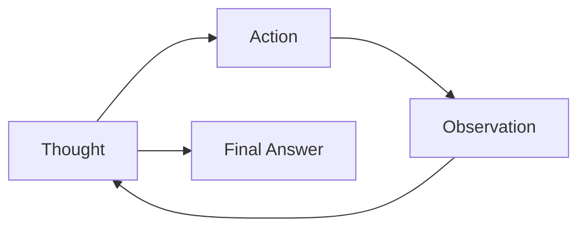

# Lesson 7: Agent Planning and Reasoning

In the last few lessons, we have built the foundational blocks of AI Engineering. We learned about the difference between LLM workflows and AI agents, how to manage information flow with context engineering, how to get reliable data out of LLMs with structured outputs, and how to give our systems the ability to take action with tools. But there is a missing piece. LLMs, at their core, are stateless next-token predictors. They do not plan, reason, or adapt to new information by default.

To build truly autonomous agents that can tackle complex, multi-step tasks, you need to give them the ability to think. This is where planning and reasoning come in. It involves structuring the agent’s thought process, allowing it to break down problems, create a strategy, and correct its course when things go wrong. While modern models are getting better at this internally, understanding the fundamental patterns of agentic reasoning is essential for any AI engineer.

In this lesson, we will explore how to transform a simple LLM into a reasoning agent. We will start by looking at why non-reasoning models fail and how Chain-of-Thought prompting was the first step toward a solution. Then, we will dive deep into two foundational patterns that are still relevant today: ReAct and Plan-and-Execute. Finally, we will see how these concepts are evolving with modern models and how they enable advanced capabilities like goal decomposition and self-correction.

## What a Non-Reasoning Model Does And Why It Fails on Complex Tasks

Let's use a recurring example to frame the problem: a Technical Research Assistant Agent. Its goal is to produce a comprehensive report on the "latest developments in edge AI deployment." This involves finding recent papers, summarizing their findings, identifying trends, and writing a structured report.

A non-reasoning model tackles this by trying to generate the entire report in a single pass. It treats the complex request as one large question and immediately starts writing an answer [[1]](https://www.narrativa.com/ai-reasoning-vs-non-reasoning-models-key-differences-explained). It might call the right tools, like a web search, but it does not have a mechanism to analyze the results, verify their quality, or adapt its approach based on what it finds. If a search returns irrelevant papers or conflicting information, the model has no way to recognize the problem and try a different strategy.

This approach leads to several failures. The output is often superficial because the agent does not break the task down into smaller, manageable sub-goals, like comparing sources or verifying statistics. It misses critical steps and cannot iterate on its own work to fix mistakes [[3]](https://arxiv.org/html/2606.07462v1).

In previous lessons, we learned that workflows, structured outputs, and tools provide modularity and reliability for predictable tasks. But for complex problems where adaptation is key, these components are not enough. Without a way to reason and plan, the agent is simply executing a fixed sequence of steps, blind to the dynamic nature of real-world tasks. To address this, we first need to teach the model to produce a reasoning trace, to think before it answers.

## Teaching Models to “Think”: Chain-of-Thought and Its Limits

The first major step toward giving models a planning capability was Chain-of-Thought (CoT) prompting [[33]](https://arxiv.org/pdf/2210.03629). The idea is simple: just like humans often "talk to themselves" to work through a problem, we can ask an LLM to write down its reasoning steps before giving the final answer [[24]](https://magazine.sebastianraschka.com/p/understanding-reasoning-llms).

For our research assistant agent, a simple CoT prompt might look like this: *"Before answering, think step by step about how you will research and verify sources on edge AI deployment. Then provide the final report."*

This small change has a significant impact. Instead of jumping straight to the answer, the model first drafts a high-level plan. It might outline steps like searching for academic papers, reading the abstracts, comparing their findings, and then synthesizing a report. This internal monologue allows the model to structure its thinking and often leads to more coherent and accurate results [[15]](https://www.ibm.com/think/topics/react-agent).

However, CoT has its limits. The reasoning trace and the final answer are generated in the same text block, which can be difficult to parse and control programmatically. More importantly, it is not a true iterative loop. The model makes a plan, but it does not have a mechanism to execute that plan step-by-step, observe the outcomes, and then refine its strategy [[7]](https://apxml.com/courses/intro-llm-agents/chapter-5-basic-agent-planning/guiding-agent-reasoning-chain-of-thought). It is a one-shot thought process, not a dynamic problem-solving cycle. It is also verbose and can increase costs and latency [[8]](https://mbrenndoerfer.com/writing/step-by-step-problem-solving-chain-of-thought-reasoning), [[9]](https://www.comet.com/site/blog/chain-of-thought-prompting).

To gain more structure and control, we need to separate the act of planning from the act of answering. This separation is the foundation of two powerful patterns: ReAct and Plan-and-Execute.

## Separating Planning from Answering: Foundations of ReAct and Plan-and-Execute

The core idea that unlocks more advanced agentic behavior is to ask the model to produce its plan or reasoning as a distinct step from its answer or action [[16]](https://openreview.net/forum?id=ybA4EcMmUZ). This separation provides two major benefits. First, it gives you, the engineer, clear control and interpretability. You can see the agent's plan before it acts, making it easier to debug and guide.

Second, it enables iterative loops. Once the agent takes an action, it can observe the result and feed that observation back into its planning process. This allows the agent to update its strategy based on new information, which is the essence of adaptive problem-solving. This is the key difference between a static workflow and a dynamic agent.

Two primary patterns emerged from this idea:

-   **ReAct** interleaves **T**hought, **A**ction, and **O**bservation in a tight loop. The agent thinks, acts, observes the result, and then thinks again based on that new information.
-   **Plan-and-Execute** separates the process into two distinct phases. First, the agent creates a complete, high-level plan. Then, it executes that plan step-by-step.

Let's go deep into ReAct, using our research-assistant example to see how it works in practice.

## ReAct in Depth: Loop, Evolving Example, Pros and Cons

The ReAct (Reason + Act) pattern was introduced to bridge the gap between the free-form reasoning of CoT and action-only systems [[33]](https://arxiv.org/pdf/2210.03629). It creates a powerful synergy by allowing reasoning to guide actions and actions to inform reasoning through environmental feedback. The agent operates in a continuous loop, making it highly adaptive to new information.

The loop consists of three phases:

-   **Thought:** The agent reasons about its current state, what it knows, what it needs to find out, and what action to take next.
-   **Action:** The agent invokes a tool, like a web search or a file read, to interact with its environment.
-   **Observation:** The agent receives the result of its action from the environment. This new information is then used in the next thought phase.

This cycle repeats until the agent determines it has enough information to provide a final answer.

Image 1: Flowchart illustrating the iterative ReAct loop.

Let's walk through our Technical Research Assistant Agent example using the ReAct pattern:

1.  **Thought:** "I need to find recent, trustworthy sources on edge AI deployment."
2.  **Action:** `search("latest developments in edge AI deployment 2024 site:arxiv.org OR site:nature.com")`
3.  **Observation:** A list of candidate papers is returned.
4.  **Thought:** "The search returned several papers. I should select the three most highly cited ones and one industry report to get a balanced view. I need to check their publication year and venue to ensure relevance."
5.  **Action:** `fetch_and_extract(paper_urls)`
6.  **Observation:** The abstracts and metadata for the selected papers are extracted.
7.  **Thought:** "Now I have the summaries. I will compare their claims about adoption rates and flag any conflicts."
8.  **Action:** `summarize_and_compare(extractions)`
9.  **Observation:** "Paper A claims 40% adoption, while Paper B says 25%."
10. **Thought:** "There's a conflict. I need to find a third-party market analysis to adjudicate this discrepancy."
11. **Action:** `search("edge AI deployment adoption market analysis 2024")`
12. **Observation:** A credible market analysis report is found.
13. **Thought:** "I can now use this report to resolve the conflict and finalize the trends and gaps in my analysis."
14. **Final Answer:** A structured report is generated with citations and the resolved statistics.

This iterative process makes ReAct highly effective for exploratory tasks where the path to the solution is not clear from the start.

-   **Pros:** It offers high interpretability, as you can follow the agent's reasoning at each step. It is also excellent at error recovery, since new observations can correct false assumptions [[13]](https://www.mindstudio.ai/blog/what-is-react-loop-ai-agent-reasoning). This grounding in external observations is what reduces hallucinations. From an information theory perspective, each observation reduces the model's uncertainty (or entropy), constraining its responses to be consistent with facts from the environment [[39]](https://arxiv.org/html/2507.22915v1).
-   **Cons:** The iterative nature can be slower and more costly due to the multiple LLM calls. It also requires careful tool design and a robust control loop with guardrails to prevent infinite cycles or misguided actions [[11]](https://mbrenndoerfer.com/writing/react-pattern-llm-reasoning-action-agents).

For tasks with a more predictable structure, the Plan-and-Execute pattern can offer a more efficient and reliable alternative.

## Plan-and-Execute in Depth: Plan, Execution, Pros and Cons

The Plan-and-Execute pattern offers a more structured approach to agentic tasks. Instead of interleaving thought and action, it separates the process into two distinct phases. First, a "planner" LLM creates a high-level, step-by-step plan. Then, an "executor" LLM (or a series of deterministic function calls) carries out that plan [[16]](https://openreview.net/forum?id=ybA4EcMmUZ). The plan is typically updated only when an execution step fails or new information makes the original plan obsolete.

This pattern has deep roots in classical AI research. Long before LLMs, systems used algorithms like STRIPS-style planning or hierarchical task networks to construct sequences of actions to achieve a goal. Modern agent planning modules build on these foundational ideas, enabling agents to look multiple steps ahead to anticipate consequences and dependencies [[40]](https://arxiv.org/html/2503.12687v1).

Image 2: A flowchart depicting the Plan-and-Execute approach with two distinct phases: Planning and Execution.

This separation mirrors how a head chef might plan a complex meal, leaving the line cooks to execute each specific recipe. It allows for a clear division of concerns, with one part of the system focused on strategic thinking and the other on tactical execution.

Let's revisit our Technical Research Assistant Agent, this time using the Plan-and-Execute pattern.

**Planning Phase**
The planner LLM receives the user's request and generates a detailed plan. This plan is the primary output of this phase.

*Planner Output:*

1.  **Define Scope:** Clarify the scope of the report and define success criteria. The goal is a comprehensive overview of recent developments in edge AI deployment, focusing on trends, gaps, and key papers from 2024.
2.  **Initial Search:** Conduct a broad search across academic databases (like arXiv) and industry publications to gather a list of relevant sources.
3.  **Source Selection:** Filter the search results to select the top 5-7 most relevant and high-quality sources based on citation count, venue, and publication date.
4.  **Information Extraction:** For each selected source, extract the abstract, key findings, and any specific data points related to adoption rates or performance metrics.
5.  **Synthesize Findings:** Group the extracted information by common themes. Compare the findings from different sources to identify consistent trends and any conflicting claims.
6.  **Outline Generation:** Create a structured outline for the final report, including sections for an introduction, key developments, emerging trends, research gaps, and a conclusion.
7.  **Report Writing:** Write the full report based on the outline, incorporating the synthesized findings and providing citations for all sources. Include a methodology note explaining how the sources were selected and analyzed.

**Execution Phase**
The executor then takes this plan and carries out each step in sequence. It might be another LLM prompted to execute one step at a time, or it could be a simpler agent that calls the appropriate tools.

1.  The executor calls the `search` tool with queries derived from the plan.
2.  It then uses a `filter_sources` tool to select the best papers.
3.  Next, it calls `fetch_and_extract` for each paper.
4.  It proceeds to summarize and compare the information. If it detects a conflict (like the 40% vs. 25% adoption rates), this can trigger a re-planning step. The planner might be invoked again to add a verification step to the plan.
5.  Once all information is gathered and synthesized, the executor generates an outline and finally writes the report.

This pattern is highly effective for tasks where the overall structure is known upfront.

-   **Pros:** The upfront planning makes the process more efficient, predictable, and easier to manage in terms of cost and time. It provides a clear roadmap, which improves reliability for well-defined tasks.
-   **Cons:** It is less flexible than ReAct when dealing with highly exploratory problems where the path is unknown. The agent can get stuck rigidly following an imperfect initial plan, and frequent re-planning can negate the efficiency gains.

These foundational ideas, ReAct and Plan-and-Execute, are not just theoretical. They power real-world systems like OpenAI's Deep Research, which operationalize iterative planning and verification at scale to perform complex research tasks.

## Where This Shows Up in Practice: Deep Research–Style Systems

The planning and reasoning patterns we have discussed are the engines behind advanced research systems like OpenAI's Deep Research. These systems are designed to handle long-horizon tasks by breaking them down into many smaller, manageable sub-goals [[27]](https://blog.promptlayer.com/how-deep-research-works). They operationalize the theoretical patterns of ReAct and Plan-and-Execute into a practical, iterative workflow.

For our Technical Research Assistant Agent example, a system like this would not just run a single ReAct loop. Instead, it would execute many micro-cycles of searching, reading, comparing, and verifying. It might perform dozens of searches to gather initial sources, then run another set of cycles to cross-reference statistics like adoption rates. It uses explicit prompts and policies to enforce verification at each step, which helps reduce hallucinations and ensures the final report is grounded in evidence [[26]](https://arxiv.org/html/2603.28376v1).

These systems are often hybrids. Some parts of their process are ReAct-like, with tight loops of thought, action, and observation for exploration and data gathering. Other parts are closer to Plan-and-Execute, where a high-level plan guides the overall research direction, with re-planning triggered only when a significant conflict or dead-end is discovered.

The success of these systems shows that structured reasoning is critical for building agents that can perform complex knowledge work. As models become more powerful, some of this explicit structuring is becoming internalized, with models now capable of generating "thinking" and "answer" streams natively.

## Modern Reasoning Models: Thinking vs. Answer Streams and Interleaved Thinking

The patterns we have discussed, like ReAct and Plan-and-Execute, were initially developed as prompting strategies to guide general-purpose LLMs. However, as the field has matured, model developers have started to build these reasoning capabilities directly into the models themselves [[24]](https://magazine.sebastianraschka.com/p/understanding-reasoning-llms). Modern reasoning models are often trained to separate their internal thought process from their final output.

This is often implemented through two distinct streams of generation:

1.  A **private "thinking" stream**, where the model generates its chain of thought, plans, and self-corrections. This is analogous to the "Thought" part of a ReAct loop. This stream is not always shown to the user but is used by the model to guide its own process [[23]](https://cameronrwolfe.substack.com/p/demystifying-reasoning-models).
2.  A **public "answer" stream**, which contains the final, user-facing response. This is the polished output, equivalent to the "Final Answer" in our examples.

Some models follow a "think first" approach. They generate a complete reasoning trace in the private stream, potentially calling tools and processing information, before producing the final answer in the public stream. This is similar to the Plan-and-Execute pattern, but it all happens within a single model turn.

More advanced models now support **interleaved thinking**. With this capability, the model can generate a piece of its answer, then pause to think, call a tool, observe the result, and then resume generating the answer [[38]](https://docs.anthropic.com/en/docs/build-with-claude/extended-thinking#interleaved-thinking). This is a much more dynamic process, closely mirroring the ReAct loop. For example, a model might start writing the introduction to our research report, then pause to think about what data it needs for the next section, call a search tool, and then continue writing, incorporating the new information. Some models can even do this asynchronously, thinking in the background while streaming the answer to the user [[21]](https://arxiv.org/html/2512.10931v1).

What does this mean for you as an AI engineer? As models get better at internalizing these reasoning patterns, you may need to write fewer explicit control loops in your code. However, the fundamental principles remain the same. You still need to provide clear instructions, well-defined tools, and robust guardrails to ensure reliability. Even with powerful implicit planning, the separation of reasoning and answering remains a valuable concept for debugging and maintaining control over your agent's behavior. These built-in capabilities simply provide a more powerful foundation, allowing agents to unlock even more advanced skills like goal decomposition and self-correction.

## Advanced Agent Capabilities Enabled by Planning: Goal Decomposition and Self-Correction

Once an agent has a solid foundation for planning and reasoning, it can start to exhibit more advanced autonomous behaviors. Two of the most important are goal decomposition and self-correction.

**Goal decomposition** is the ability to break a large, complex task into smaller, hierarchical sub-goals. For our research assistant, the top-level goal is "write a report." A planning agent can decompose this into sub-goals like "gather sources," "synthesize findings," and "draft content." The "gather sources" sub-goal can be broken down even further into "search academic databases," "search industry blogs," and "filter for relevance." In a ReAct-style agent, this decomposition often happens implicitly in the "Thought" steps, but your prompts can guide the model to be more structured in its approach.

**Self-correction** is the agent's ability to detect when something has gone wrong and update its plan accordingly. This is where the iterative nature of reasoning loops becomes critical. In our recurring example, the agent found conflicting adoption rates (40% vs. 25%). A non-reasoning agent would likely just report one or both without context. A reasoning agent, however, can recognize this conflict as a failure. It can then insert a new "verification" sub-goal into its plan, decide to search for a market analysis to resolve the discrepancy, and then revise the report with the corrected information [[32]](https://aclanthology.org/2025.acl-long.1104.pdf).

However, self-correction faces scalability limits. On long-horizon tasks, growing context can lead to overload, and early errors can propagate, derailing the entire process [[41]](https://www.emergentmind.com/topics/long-horizon-agent-planning).

Even with the most advanced models, explicit patterns like ReAct and Plan-and-Execute remain valuable. They provide a clear structure that improves debuggability, as you can trace the agent's thoughts, actions, and observations. They also ensure consistency by enforcing a control loop, and they give us a shared mental model for how agents think.

In our next lesson, we will get hands-on and implement a ReAct agent from scratch. Soon after, we will explore how to give our agents memory, augment them with external knowledge, and enable them to process multimodal data.

## Conclusion

We have seen that planning and reasoning are the essential ingredients that elevate LLMs from simple text generators to autonomous agents. By teaching a model to "think" before it acts, we unlock the ability to tackle complex, multi-step problems that require adaptation and strategy. We explored the evolution from basic Chain-of-Thought to the more structured and powerful patterns of ReAct and Plan-and-Execute.

These patterns are not just academic concepts; they are the foundational architectures for building reliable and interpretable agents. They give us the control to guide an agent's thought process and the visibility to understand its decisions. As models continue to internalize these reasoning capabilities, our role as AI engineers shifts from writing explicit loops to designing the high-level strategies, tools, and guardrails that allow these powerful models to operate effectively and safely.

In the next lesson, we will move from theory to practice and build our first ReAct agent from the ground up, giving you the hands-on experience to start implementing these patterns in your own projects.

## References

- [1] [https://www.narrativa.com/ai-reasoning-vs-non-reasoning-models-key-differences-explained](https://www.narrativa.com/ai-reasoning-vs-non-reasoning-models-key-differences-explained)
- [2] [https://www.kuppingercole.com/research/lb80993/fundamental-scaling-limitations-in-ai-reasoning-models](https://www.kuppingercole.com/research/lb80993/fundamental-scaling-limitations-in-ai-reasoning-models)
- [3] [https://arxiv.org/html/2606.07462v1](https://arxiv.org/html/2606.07462v1)
- [4] [https://developers.openai.com/api/docs/guides/reasoning-best-practices](https://developers.openai.com/api/docs/guides/reasoning-best-practices)
- [5] [https://www.linkedin.com/posts/skphd_agent-laboratory-using-llm-agents-as-research-activity-7283233189651738625-q6xU](https://www.linkedin.com/posts/skphd_agent-laboratory-using-llm-agents-as-research-activity-7283233189651738625-q6xU)
- [6] [https://www.emergentmind.com/topics/chain-of-thought-and-planning-agents](https://www.emergentmind.com/topics/chain-of-thought-and-planning-agents)
- [7] [https://apxml.com/courses/intro-llm-agents/chapter-5-basic-agent-planning/guiding-agent-reasoning-chain-of-thought](https://apxml.com/courses/intro-llm-agents/chapter-5-basic-agent-planning/guiding-agent-reasoning-chain-of-thought)
- [8] [https://mbrenndoerfer.com/writing/step-by-step-problem-solving-chain-of-thought-reasoning](https://mbrenndoerfer.com/writing/step-by-step-problem-solving-chain-of-thought-reasoning)
- [9] [https://www.comet.com/site/blog/chain-of-thought-prompting](https://www.comet.com/site/blog/chain-of-thought-prompting)
- [10] [https://www.ibm.com/think/topics/chain-of-thoughts](https://www.ibm.com/think/topics/chain-of-thoughts)
- [11] [https://mbrenndoerfer.com/writing/react-pattern-llm-reasoning-action-agents](https://mbrenndoerfer.com/writing/react-pattern-llm-reasoning-action-agents)
- [12] [https://apxml.com/courses/getting-started-with-llm-toolkit/chapter-8-developing-autonomous-agents/react-pattern-for-agents](https://apxml.com/courses/getting-started-with-llm-toolkit/chapter-8-developing-autonomous-agents/react-pattern-for-agents)
- [13] [https://www.mindstudio.ai/blog/what-is-react-loop-ai-agent-reasoning](https://www.mindstudio.ai/blog/what-is-react-loop-ai-agent-reasoning)
- [14] [https://www.salesforce.com/agentforce/ai-agents/react-agents](https://www.salesforce.com/agentforce/ai-agents/react-agents)
- [15] [https://www.ibm.com/think/topics/react-agent](https://www.ibm.com/think/topics/react-agent)
- [16] [https://openreview.net/forum?id=ybA4EcMmUZ](https://openreview.net/forum?id=ybA4EcMmUZ)
- [17] [https://www.ibm.com/think/topics/agentic-reasoning](https://www.ibm.com/think/topics/agentic-reasoning)
- [18] [https://www.ibm.com/think/topics/ai-agent-orchestration](https://www.ibm.com/think/topics/ai-agent-orchestration)
- [19] [https://www.anthropic.com/engineering/building-effective-agents](https://www.anthropic.com/engineering/building-effective-agents)
- [20] [https://www.ibm.com/think/insights/ai-agents-2025-expectations-vs-reality](https://www.ibm.com/think/insights/ai-agents-2025-expectations-vs-reality)
- [21] [https://arxiv.org/html/2512.10931v1](https://arxiv.org/html/2512.10931v1)
- [22] [https://www.ibm.com/think/topics/reasoning-model](https://www.ibm.com/think/topics/reasoning-model)
- [23] [https://cameronrwolfe.substack.com/p/demystifying-reasoning-models](https://cameronrwolfe.substack.com/p/demystifying-reasoning-models)
- [24] [https://magazine.sebastianraschka.com/p/understanding-reasoning-llms](https://magazine.sebastianraschka.com/p/understanding-reasoning-llms)
- [25] [https://arxiv.org/html/2601.10825v1](https://arxiv.org/html/2601.10825v1)
- [26] [https://arxiv.org/html/2603.28376v1](https://arxiv.org/html/2603.28376v1)
- [27] [https://blog.promptlayer.com/how-deep-research-works](https://blog.promptlayer.com/how-deep-research-works)
- [28] [https://www.jonkrohn.com/posts/2025/3/17/openais-deep-research-get-days-of-human-work-done-in-minutes](https://www.jonkrohn.com/posts/2025/3/17/openais-deep-research-get-days-of-human-work-done-in-minutes)
- [29] [https://blogs.nvidia.com/blog/reasoning-ai-agents-decision-making/](https://blogs.nvidia.com/blog/reasoning-ai-agents-decision-making/)
- [30] [https://cdn.openai.com/deep-research-system-card.pdf](https://cdn.openai.com/deep-research-system-card.pdf)
- [31] [https://cdn.openai.com/business-guides-and-resources/a-practical-guide-to-building-agents.pdf](https://cdn.openai.com/business-guides-and-resources/a-practical-guide-to-building-agents.pdf)
- [32] [https://aclanthology.org/2025.acl-long.1104.pdf](https://aclanthology.org/2025.acl-long.1104.pdf)
- [33] [https://arxiv.org/pdf/2210.03629](https://arxiv.org/pdf/2210.03629)
- [34] [https://arxiv.org/pdf/2504.19678](https://arxiv.org/pdf/2504.19678)
- [35] [https://www.ibm.com/think/topics/ai-agent-planning](https://www.ibm.com/think/topics/ai-agent-planning)
- [36] [https://research.google/blog/react-synergizing-reasoning-and-acting-in-language-models](https://research.google/blog/react-synergizing-reasoning-and-acting-in-language-models)
- [37] [https://metr.org/blog/2025-03-19-measuring-ai-ability-to-complete-long-tasks/](https://metr.org/blog/2025-03-19-measuring-ai-ability-to-complete-long-tasks/)
- [38] [https://docs.anthropic.com/en/docs/build-with-claude/extended-thinking#interleaved-thinking](https://docs.anthropic.com/en/docs/build-with-claude/extended-thinking#interleaved-thinking)
- [39] [https://arxiv.org/html/2507.22915v1](https://arxiv.org/html/2507.22915v1)
- [40] [https://arxiv.org/html/2503.12687v1](https://arxiv.org/html/2503.12687v1)
- [41] [https://www.emergentmind.com/topics/long-horizon-agent-planning](https://www.emergentmind.com/topics/long-horizon-agent-planning)