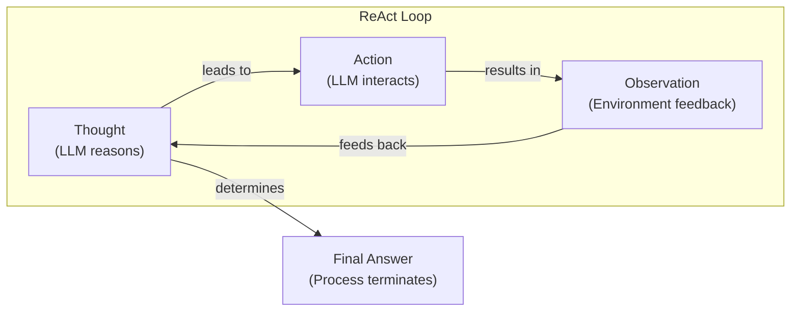
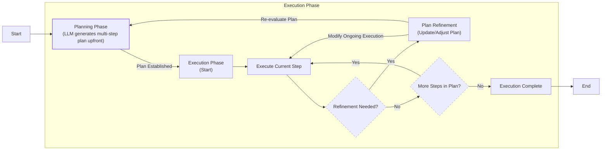

# Lesson 7: Agentic Planning and Reasoning

In our journey so far, we have explored the foundational elements of AI Engineering. We have learned to distinguish between structured LLM workflows and autonomous AI agents, mastered the art of context engineering to feed models the right information, ensured reliability with structured outputs, and built basic workflows. In the last lesson, we gave our systems the ability to act by using tools. Now, we will teach them how to think.

This lesson introduces two core ingredients of agentic behavior: planning and reasoning. We will explore why LLMs, by their nature, do not plan and how we can build systems that guide them to think before they act. We will cover foundational strategies like ReAct and Plan-and-Execute, which remain essential for structuring an agent’s thought process. Understanding these patterns is key to building autonomous agents that can tackle complex, multi-step tasks with greater intelligence and reliability.

In this lesson, we will cover:
- Why non-reasoning models fail on complex tasks.
- How Chain-of-Thought (CoT) prompting teaches models to "think" and its limitations.
- The foundational concepts of ReAct and Plan-and-Execute.
- A deep dive into how each of these patterns works, with pros and cons.
- How modern reasoning models use private "thinking" and public "answer" streams.
- Advanced agent capabilities unlocked by planning, such as goal decomposition and self-correction.

## What a Non-Reasoning Model Does And Why It Fails on Complex Tasks

Let's frame the problem with a recurring example: a "Technical Research Assistant Agent." Your goal is to give it a high-level task, and it should produce a comprehensive technical report on the "Latest developments in edge AI deployment." This involves finding recent papers, summarizing their findings, identifying trends, and writing a structured report.

A basic, non-reasoning model treats this entire complex task as a single request to be answered immediately. It attempts to generate the final report in one go, without first creating a plan. While it might call the right tools, it does so without a strategy. If a search query returns irrelevant results or a source contains conflicting information, the model has no mechanism to recognize the error and adapt its approach. It simply continues, often leading to superficial or incorrect outputs. On simple tasks, this can even lead to overthinking, where the model consumes more resources than necessary, sometimes degrading accuracy [[2]](https://www.kuppingercole.com/research/lb80993/fundamental-scaling-limitations-in-ai-reasoning-models).

This behavior stems from the model's core function as a next-token predictor. It does not inherently possess a strategic "thinking" process. For complex tasks, this leads to several failures:
-   **It misses important steps:** Without an explicit plan, the agent might forget to verify sources, compare conflicting data points, or structure the final report logically. It can misunderstand the task's intent, stop too early, or violate an explicit constraint [[3]](https://arxiv.org/html/2606.07462v1).
-   **It cannot recover from errors:** If a tool fails or provides unexpected output, the agent doesn't stop to reconsider its plan. It just plows ahead, compounding the initial mistake.
-   **The output is shallow:** The final report is often a simple aggregation of information rather than a deep synthesis. The agent doesn't iterate on its own findings to identify gaps or draw higher-level conclusions.

In our previous lessons, we built systems with some control. Workflows and structured outputs gave us modularity for predictable processes, and tools gave our agents the ability to act. However, these components are not enough for complex, dynamic tasks. When an agent needs to adapt to unforeseen results, it needs more than just tools; it needs a plan. To address this, we must first teach the model to generate a reasoning trace, essentially thinking before it answers.

## Teaching Models to “Think” Chain-of-Thought and Its Limits

The first step toward more intelligent agents was to get them to "show their work." Just as humans often talk themselves through a problem, we can prompt an LLM to write out a reasoning trace before giving a final answer. This technique is known as Chain-of-Thought (CoT) prompting. By generating intermediate steps, the model can break down a complex problem into a more manageable sequence, which often leads to more accurate results [[7]](https://apxml.com/courses/intro-llm-agents/chapter-5-basic-agent-planning/guiding-agent-reasoning-chain-of-thought).

Let's apply this to our research assistant task. Instead of just asking for the report, we would modify the prompt:
*"Before answering, think step by step about how you will research and verify sources on edge AI deployment. Then provide the final report."*

With this prompt, the model first outlines a high-level plan, such as "First, I will search for recent papers on arXiv. Second, I will read the abstracts to identify key trends. Third, I will synthesize the findings into a report." This explicit reasoning process helps the model structure its thinking and stay on track.

However, CoT has significant limitations, especially for building autonomous agents. The reasoning trace and the final answer are generated together as a single block of text, which is difficult to parse and control programmatically. The model might generate a good initial plan but has no built-in mechanism to execute it as an iterative loop. It does not pause to act on a step, observe the outcome, and then refine its plan accordingly [[7]](https://apxml.com/courses/intro-llm-agents/chapter-5-basic-agent-planning/guiding-agent-reasoning-chain-of-thought), [[11]](https://mbrenndoerfer.com/writing/react-pattern-llm-reasoning-action-agents). It is a static, one-shot thought process, not a dynamic, interactive one.

Furthermore, CoT is a heuristic, not a sophisticated planning algorithm; it guides reasoning but does not guarantee correctness [[7]](https://apxml.com/courses/intro-llm-agents/chapter-5-basic-agent-planning/guiding-agent-reasoning-chain-of-thought). It struggles to explore multiple alternatives, backtrack efficiently from dead ends, or adapt to complex, unforeseen circumstances [[7]](https://apxml.com/courses/intro-llm-agents/chapter-5-basic-agent-planning/guiding-agent-reasoning-chain-of-thought). This approach also comes with practical costs. The verbosity of CoT responses increases latency and token consumption, which are real constraints in production environments where speed and cost matter [[8]](https://mbrenndoerfer.com/writing/step-by-step-problem-solving-chain-of-thought-reasoning), [[9]](https://www.comet.com/site/blog/chain-of-thought-prompting). A model might produce a detailed, coherent reasoning path that still leads to an incorrect answer, and without a way to ground its thoughts in real-world feedback, these errors can go unchecked [[9]](https://www.comet.com/site/blog/chain-of-thought-prompting).

To build true agents that can act, observe, and adapt, we need more than just a preliminary thought process. We need a way to separate the model's planning from its actions. This separation is the foundation of more advanced agentic patterns like ReAct and Plan-and-Execute.

## Separating Planning from Answering Foundations of ReAct and Plan-and-Execute

The limitations of Chain-of-Thought led to a pivotal insight that mirrors a long-standing concept in cognitive science: dual-process theory [[39]](https://www.frontiersin.org/journals/cognition/articles/10.3389/fcogn.2024.1356941/full). This theory posits that human thought operates on two systems: a fast, intuitive, and automatic "System 1," and a slow, deliberate, and analytical "System 2" [[40]](https://en.wikipedia.org/wiki/Dual_process_theory). To build more capable agents, we must similarly separate the process of *thinking* (System 2) from the act of *doing* (a System 1-like immediate action). Instead of a single, monolithic output containing both reasoning and the final answer, we can structure the interaction into distinct phases. This separation gives us greater control, improves interpretability, and, most importantly, enables the agent to operate in a loop, updating its plan based on new information [[38]](https://arxiv.org/pdf/2210.03629).

This core idea gave rise to two foundational patterns for agentic reasoning:

1.  **ReAct (Reason and Act):** This pattern interleaves reasoning and acting into a tight loop. The agent thinks about what to do, takes an action, observes the result, and then thinks again based on the new information. It is a dynamic, step-by-step process [[15]](https://www.ibm.com/think/topics/react-agent).
2.  **Plan-and-Execute:** This approach involves two distinct phases. First, a "planner" model creates a complete, multi-step plan. Then, an "executor" model (or a series of deterministic actions) carries out that plan. The plan is typically created upfront and is only updated if the executor encounters an error [[16]](https://openreview.net/forum?id=ybA4EcMmUZ).

By separating these concerns, we move from a simple "prompt-and-response" model to a true agentic system. We can inspect the agent's thoughts, guide its actions, and build feedback mechanisms that allow it to learn and adapt. This structure is what allows an agent to do more than just answer questions; it allows it to solve problems.

First, we will take a deep dive into the ReAct framework to see how its iterative loop enables dynamic problem-solving.

## ReAct in Depth Loop, Evolving Example, Pros and Cons

The ReAct framework was introduced to bridge the gap between the internal reasoning of Chain-of-Thought and the external interactions of action-only models [[38]](https://arxiv.org/pdf/2210.03629). The goal was to create a system that could both reason about a task and interact with the outside world to gather information, creating a powerful synergy. The model can use reasoning to decide what action to take next (reason to act), and it can use the results of its actions to inform its future reasoning (act to reason) [[38]](https://arxiv.org/pdf/2210.03629).

### The ReAct Loop

This is achieved through a simple but powerful iterative loop consisting of three steps: **Thought, Action, and Observation** [[11]](https://mbrenndoerfer.com/writing/react-pattern-llm-reasoning-action-agents).

1.  **Thought:** The LLM analyzes the current situation and its goal, then generates a private reasoning trace about what it should do next.
2.  **Action:** Based on its thought, the LLM chooses a tool and executes it. This could be a web search, an API call, or any other defined action.
3.  **Observation:** The environment returns the result of the action. This new information is fed back to the LLM.

The agent repeats this cycle until it has enough information to produce a final answer [[12]](https://apxml.com/courses/getting-started-with-llm-toolkit/chapter-8-developing-autonomous-agents/react-pattern-for-agents).

Image 1: A flowchart illustrating the iterative ReAct loop, showing the cyclical nature of Thought, Action, and Observation, leading to a terminal Final Answer.

### Evolving Example

Let's see how our Technical Research Assistant Agent would use the ReAct loop to tackle its task:

-   **Thought:** "I need to find recent, trustworthy sources on edge AI deployment. I should start by searching for academic papers from 2024 on reputable sites like arXiv.org."
-   **Action:** `search("latest developments in edge AI deployment 2024 site:arxiv.org")`
-   **Observation:** The search returns a list of five recent papers with their titles and URLs.
-   **Thought:** "The first three papers seem most relevant based on their titles. I need to read their abstracts to understand their key findings and check their publication dates."
-   **Action:** `fetch_and_extract(["paper_url_1", "paper_url_2", "paper_url_3"])`
-   **Observation:** The tool returns the abstracts and metadata for the selected papers.
-   **Thought:** "I have the summaries. Now I need to compare their claims about adoption rates. Paper A says 40%, while Paper B says 25%. This is a conflict."
-   **Action:** `summarize_and_compare(["abstract_A", "abstract_B"])`
-   **Observation:** The tool confirms the conflicting statistics.
-   **Thought:** "I have detected a conflict. I need a third-party source, like a market analysis report, to resolve this discrepancy."
-   **Action:** `search("edge AI deployment adoption market analysis 2024")`
-   **Observation:** A credible industry report is found that explains the difference in metrics.
-   **Thought:** "I can now resolve the conflict using the market report. I have enough information to identify the main trends and gaps and can proceed to write the final report."
-   **Final Answer:** A structured report is generated with citations and the resolved statistics.

### Pros and Cons

This example highlights the strengths of the ReAct pattern. The explicit thought process at each step makes the agent's behavior highly interpretable and easy to debug [[15]](https://www.ibm.com/think/topics/react-agent). This adaptability is a key advantage; the agent can dynamically react to new information from its environment. When it encountered conflicting data, it adjusted its plan to seek clarification, a process that mirrors human problem-solving [[14]](https://www.salesforce.com/agentforce/ai-agents/react-agents). Furthermore, by grounding its reasoning in external observations at each step, ReAct significantly reduces the risk of hallucination and error propagation that can plague pure CoT models, making its outputs more trustworthy [[38]](https://arxiv.org/pdf/2210.03629).

However, the ReAct pattern is not without its drawbacks. The iterative nature of the loop, which involves multiple LLM calls and tool executions for a single task, can lead to higher latency compared to other approaches [[8]](https://mbrenndoerfer.com/writing/step-by-step-problem-solving-chain-of-thought-reasoning). This can be a significant issue in real-time applications. The agent's reasoning is also typically focused on the immediate next action, making it less suitable for complex tasks that require long-term planning and foresight [[41]](https://arxiv.org/html/2505.09970v2). This myopic focus can sometimes lead to inefficient or suboptimal paths. Finally, without careful design and robust error handling, ReAct agents can be prone to getting stuck in "retry loops," where a tool repeatedly fails, and the agent re-attempts the exact same action without changing its strategy [[42]](https://latitude.so/blog/ai-agent-failure-detection-guide). A single malformed tool argument can also cause "chained corruption," silently corrupting all subsequent steps that depend on its output [[42]](https://latitude.so/blog/ai-agent-failure-detection-guide).

ReAct is powerful for exploratory tasks where the path to the solution is not clear from the start. However, for more structured problems where the steps are predictable, the Plan-and-Execute pattern can offer a more efficient and reliable alternative.

## Plan-and-Execute in Depth Plan, Execution, Pros and Cons

While ReAct excels at dynamic, exploratory tasks, its focus on the immediate next step makes it less effective for complex goals that require long-term planning [[41]](https://arxiv.org/html/2505.09970v2). The Plan-and-Execute pattern offers an alternative by separating the overall process into two distinct phases: an upfront planning phase and a subsequent execution phase [[16]](https://openreview.net/forum?id=ybA4EcMmUZ). This approach is analogous to how a head chef first designs a menu (the plan) and then directs the line cooks to prepare each dish (the execution) [[16]](https://openreview.net/forum?id=ybA4EcMmUZ). The core idea is to invest more computational effort upfront to create a robust, complete plan, which can then be executed more efficiently and predictably.

### The Two-Phase Process

The process begins with a "planner" LLM that takes the user's high-level goal and generates a detailed, step-by-step plan. This plan is then passed to an "executor," which can be another, often simpler, LLM or a series of deterministic function calls. The executor's job is to carry out each step of the plan sequentially. Unlike ReAct, the executor does not engage in deep reasoning at each step; it simply follows the instructions laid out in the plan. The plan is only revisited if a step fails or returns an unexpected result, which would trigger a re-planning cycle, often by sending the error and the current state back to the planner for revision [[16]](https://openreview.net/forum?id=ybA4EcMmUZ).

Image 2: A flowchart depicting the Plan-and-Execute approach for an LLM.

### Evolving Example

Let's revisit our Technical Research Assistant Agent, this time using the Plan-and-Execute pattern. The user provides the high-level goal, and the planner LLM generates a detailed, structured plan. The output of this planning phase might look like this:
1.  **Define Scope and Success Criteria:** Clarify the exact scope of "edge AI deployment" to include hardware, software, and industry use cases. Set success criteria for the report, such as including at least three recent trends and two unresolved challenges.
2.  **Search Across Sources:** Conduct parallel searches for academic papers (on arXiv, Nature) and industry reports (on Gartner, Forrester) using keywords like "edge AI deployment 2024," "tinyML trends," and "edge computing hardware."
3.  **Select Top Sources:** From the search results, select the top five academic papers based on citation count and relevance, and the top two industry reports based on credibility and date of publication.
4.  **Summarize Each Source:** For each selected source, extract key findings, statistics, and conclusions. Generate a concise summary for each document.
5.  **Compare Findings and Identify Trends:** Synthesize the summaries to identify recurring trends, conflicting data points, and documented gaps in the research.
6.  **Draft Outline:** Create a structured outline for the final report, including an introduction, sections for each identified trend, a section on challenges, and a conclusion.
7.  **Write Report:** Write the full report based on the outline, incorporating the synthesized findings and adding inline citations for all claims. Include a methodology note explaining the research process.

The executor system then takes this plan and carries out each step. This might involve a series of simpler tool calls or deterministic code to execute tasks like `search`, `select_sources`, `summarize`, and `write_report_section`. Generating accurate plans can be difficult since LLMs are not inherently trained for this task. To address this, planners can be fine-tuned on synthetic data generated by annotating successful task trajectories with feasible plans, which enhances their generalization and accuracy [[16]](https://openreview.net/forum?id=ybA4EcMmUZ).

### Pros and Cons

This approach offers several advantages for well-defined, multi-step tasks. By creating a comprehensive plan upfront, the system can be more efficient and predictable, reducing the number of expensive LLM calls needed during the execution phase [[16]](https://openreview.net/forum?id=ybA4EcMmUZ). The clear separation of planning and execution also makes the system easier to manage, debug, and constrain, allowing for better control over costs and execution time. This structure is particularly well-suited for long-horizon tasks, as it provides a clear roadmap from start to finish, making it less likely for the agent to get sidetracked by intermediate details [[16]](https://openreview.net/forum?id=ybA4EcMmUZ).

However, this pattern also has its weaknesses. The primary drawback is its rigidity. An upfront plan can be brittle; if the environment changes unexpectedly or an early step reveals information that invalidates the original strategy, the system may struggle to adapt without a costly and time-consuming re-planning phase. The success of the entire process also hinges on the quality of the initial plan. If the planner generates a flawed or incomplete plan, the executor will blindly follow it, inevitably leading to failure. This makes the Plan-and-Execute pattern less suitable for highly exploratory or dynamic problems where the path to a solution cannot be clearly determined from the outset.

These foundational patterns, ReAct and Plan-and-Execute, are not just theoretical concepts. They power real-world systems like OpenAI's Deep Research, which operationalize iterative planning and verification to automate complex knowledge work at scale.

## Where This Shows Up in Practice Deep Research–Style Systems

The theoretical patterns of ReAct and Plan-and-Execute come to life in advanced research systems, like those similar to OpenAI's Deep Research. These systems are designed to tackle long-horizon tasks by breaking them down into smaller, manageable sub-goals and executing them through iterative cycles.

A typical workflow in such a system mirrors the agentic patterns we have discussed [[27]](https://blog.promptlayer.com/how-deep-research-works). First, the system clarifies the user's query and decomposes the complex task into a series of sub-questions or research areas, which serves as the initial planning phase. It then enters an iterative research loop, which involves searching for information, reading and analyzing content from various sources (including HTML, PDFs, and images), and progressively refining its understanding. This execution phase is often implemented as a series of ReAct-like cycles. Finally, the system cross-references information, resolves contradictions, and synthesizes the findings into a structured, cited report, a form of self-correction that is a key agentic capability.

For our "Technical Research Assistant Agent," this means the system would not just perform one search. It would run dozens of queries, fetch and parse multiple papers, and verify statistics like adoption rates by comparing different sources. It would maintain an internal state, or "notes," that it constantly updates with new findings and flags for conflicting information before ever starting to write the final report [[28]](https://www.jonkrohn.com/posts/2025/3/17/openais-deep-research-get-days-of-human-work-done-in-minutes). These systems also have access to a code execution environment, allowing them to crunch numbers or plot charts on the fly if the research requires it [[27]](https://blog.promptlayer.com/how-deep-research-works).

These systems often blend both patterns. The overall structure may resemble Plan-and-Execute, with an initial high-level plan. However, the execution of each step in that plan might involve a series of smaller, ReAct-style loops to handle the dynamic and unpredictable nature of web research. This hybrid approach combines the structure of planning with the adaptability of reactive reasoning. As models become more powerful, some of this explicit looping is becoming more internalized, with modern reasoning models generating distinct "thinking" and "answer" streams.

## Modern Reasoning Models Thinking vs Answer Streams and Interleaved Thinking

As LLMs have evolved, they have begun to internalize some of the planning and reasoning structures we have been discussing. Modern reasoning models are often trained to separate their internal thought process from their final output, creating a distinction between a private "thinking" stream and a public "answer" stream [[23]](https://cameronrwolfe.substack.com/p/demystifying-reasoning-models). This is a significant architectural shift from older models that produced a single, undifferentiated stream of text.

### Private Thinking and Public Answers

Instead of relying solely on prompt engineering to elicit a chain of thought, these models are fine-tuned to first generate intermediate reasoning steps before arriving at the final answer [[22]](https://www.ibm.com/think/topics/reasoning-model). This "thinking" phase can involve generating a long chain of thought, exploring multiple possible solutions, or even performing self-correction before committing to an answer. In some cases, this thinking process is entirely hidden from the user, who only sees the final, polished response. In other cases, a summary of the reasoning is provided for transparency [[23]](https://cameronrwolfe.substack.com/p/demystifying-reasoning-models). This separation is achieved by training the model on data that is formatted with special tokens, such as `<think>` and `</think>`, to delineate the reasoning process from the final answer, which might be enclosed in `<answer>` tags [[23]](https://cameronrwolfe.substack.com/p/demystifying-reasoning-models). This allows the model to learn to "think" in a structured way that is logically separate from the content it presents to the user.

### Asynchronous and Interleaved Thinking

A key innovation in this area is **asynchronous reasoning**, a training-free approach that allows the model to generate its public response concurrently with its private thinking [[21]](https://arxiv.org/html/2512.10931v1). This is a departure from the rigid "read-think-answer" cycle. In this paradigm, the model operates with three concurrent streams of tokens: user inputs, private thoughts, and the public response. Using properties of rotary positional embeddings, the model can perceive these separate streams as a single contiguous sequence, allowing it to "multitask" without additional training [[21]](https://arxiv.org/html/2512.10931v1). The model has two views: a "thinker" and a "writer". The writer generates the public response, but it can see the thinker's private thoughts as they are being generated. At the same time, the thinker can see what the writer has already produced and can "pause" the writer if it needs more time to work through a complex part of the problem. This is managed by periodically inserting a special prompt into the thinking stream to ask the model if its thoughts are far enough ahead to continue writing or if it needs to pause [[21]](https://arxiv.org/html/2512.10931v1). This creates a more interactive and real-time experience, reducing the long delays typically associated with complex reasoning tasks, which is especially useful for user-facing applications where perceived latency is important [[21]](https://arxiv.org/html/2512.10931v1).

Another advanced technique is **interleaved thinking**, particularly useful when agents are using tools. In a traditional tool-use loop, the model calls a tool, gets a result, and then immediately produces the next action or final answer. With interleaved thinking, the model can pause to "think" after receiving a tool's output. It can generate a new set of reasoning traces to analyze the result, decide if it was what it expected, and then formulate a more sophisticated plan for its next step. This allows for more complex, multi-step tool use where the agent can reason about the intermediate results of its actions before proceeding.

This capability is being shipped in production models. For example, Anthropic's Claude models support interleaved thinking, allowing the model to alternate between reasoning and tool use [[43]](https://www.ikangai.com/the-ai-that-pauses-to-think-how-interleaved-reasoning-is-reshaping-autonomous-agents). However, this power comes with a significant cost trade-off. Extended thinking with tools can consume 5-10 times more tokens than standard API calls. To manage this, APIs provide parameters like `budget_tokens` to set a total budget for thinking steps within a single turn, which can be distinct from the final `max_tokens` limit for the response [[44]](https://docs.aws.amazon.com/bedrock/latest/userguide/claude-messages-extended-thinking.html).

### Implications for System Design

The emergence of these advanced reasoning models has important implications for how we design agentic systems. While you may rely less on explicit, hand-coded loops to manage the think-act cycle, the underlying principles remain the same. You still need to provide the model with clear instructions, well-defined tools, and robust guardrails to ensure it behaves reliably. The separation of reasoning and answering, whether managed by your code or by the model itself, provides a crucial layer of control and debuggability. When an agent fails, being able to inspect its private "thinking" stream can be invaluable for understanding the root cause of the error.

Furthermore, these capabilities do not eliminate the need for thoughtful system architecture. You still need to manage state, handle tool failures, and design a user experience that can accommodate the potential for longer response times during complex reasoning. The choice of whether to use a model with built-in asynchronous reasoning or to implement an explicit ReAct loop in your own code will depend on the specific requirements of your application, including the need for real-time interactivity, the complexity of the tasks, and the level of control you require over the agent's behavior. Ultimately, these modern reasoning models provide more powerful building blocks, but the responsibility of assembling them into a robust and reliable system still rests with the AI engineer.

These advanced reasoning abilities are what enable agents to perform more sophisticated tasks, such as decomposing high-level goals and correcting their own mistakes.

## Advanced Agent Capabilities Enabled by Planning Goal Decomposition and Self-Correction

Effective planning and reasoning are not just about following a sequence of steps; they are about creating and adapting that sequence. These capabilities unlock two of the most powerful behaviors in autonomous agents: goal decomposition and self-correction.

Goal decomposition is the ability to break down a large, ambiguous task into smaller, concrete sub-goals. For example, instead of just searching, a capable research agent would first decompose the goal to define the scope, identify sub-topics, formulate a research plan, synthesize findings, and then draft the report. In ReAct-style agents, this happens implicitly in the "Thought" steps, while in Plan-and-Execute systems, it is the explicit goal of the planning phase.

Self-correction is the agent's ability to detect when something has gone wrong and adjust its plan accordingly. This is where the feedback loop in agentic systems becomes essential. For instance, when our agent finds conflicting adoption rates (40% vs. 25%), it should detect the conflict, insert a "verification" sub-goal, find an authoritative third source to resolve the discrepancy, and then revise its report [[45]](https://assets.amazon.science/54/04/2dd88903469b9c7e2ef48769eb1c/llm-self-correction-with-decrim-decompose-critique-and-refine-for-enhanced-following-of-instructions-with-multiple-constraints.pdf). However, implementing stable self-correction is difficult. A key challenge is that LLMs often struggle to critique their own work without external guidance and may stubbornly adhere to an incorrect initial answer [[46]](https://aclanthology.org/2025.acl-long.203.pdf). Building a reliable verifier or critic to provide that external feedback is a significant engineering barrier [[46]](https://aclanthology.org/2025.acl-long.203.pdf).

Even with the most powerful models, these agentic patterns matter. They provide a structured way to guide the model's behavior, making it more predictable, consistent, and easier to debug. When an agent fails, a clear trace of its thoughts, actions, and observations is very useful for understanding what went wrong. These patterns give us a shared mental model for how an agent "thinks," which is fundamental to building and maintaining complex AI systems.

In our next lesson, we will put this theory into practice by implementing a ReAct agent from scratch. From there, we will explore how agents remember information with memory systems in Lesson 9, how they access vast knowledge bases with RAG in Lesson 10, and how they process complex data formats in Lesson 11.

## Conclusion

In this lesson, we moved beyond simple actions and taught our agents how to think. We explored the evolution from basic models that react without foresight to sophisticated systems that can plan, reason, and adapt. We saw how Chain-of-Thought introduced the concept of a reasoning trace, and how patterns like ReAct and Plan-and-Execute provide the structure needed for true agentic behavior by separating thinking from doing.

Understanding these foundational patterns is not just an academic exercise. They are the building blocks for creating robust, reliable, and intelligent agents. Whether you are building a system that requires the dynamic adaptability of ReAct or the structured predictability of Plan-and-Execute, these principles will guide your design. As we look ahead, these concepts will be central to everything we build, from implementing our first reasoning agent in the next lesson to developing advanced memory and knowledge retrieval systems.

## References

- [2] https://www.kuppingercole.com/research/lb80993/fundamental-scaling-limitations-in-ai-reasoning-models
- [3] https://arxiv.org/html/2606.07462v1
- [7] https://apxml.com/courses/intro-llm-agents/chapter-5-basic-agent-planning/guiding-agent-reasoning-chain-of-thought
- [8] https://mbrenndoerfer.com/writing/step-by-step-problem-solving-chain-of-thought-reasoning
- [9] https://www.comet.com/site/blog/chain-of-thought-prompting
- [11] https://mbrenndoerfer.com/writing/react-pattern-llm-reasoning-action-agents
- [12] https://apxml.com/courses/getting-started-with-llm-toolkit/chapter-8-developing-autonomous-agents/react-pattern-for-agents
- [14] https://www.salesforce.com/agentforce/ai-agents/react-agents
- [15] https://www.ibm.com/think/topics/react-agent
- [16] https://openreview.net/forum?id=ybA4EcMmUZ
- [21] https://arxiv.org/html/2512.10931v1
- [22] https://www.ibm.com/think/topics/reasoning-model
- [23] https://cameronrwolfe.substack.com/p/demystifying-reasoning-models
- [27] https://blog.promptlayer.com/how-deep-research-works
- [28] https://www.jonkrohn.com/posts/2025/3/17/openais-deep-research-get-days-of-human-work-done-in-minutes
- [38] https://arxiv.org/pdf/2210.03629
- [39] https://www.frontiersin.org/journals/cognition/articles/10.3389/fcogn.2024.1356941/full
- [40] https://en.wikipedia.org/wiki/Dual_process_theory
- [41] https://arxiv.org/html/2505.09970v2
- [42] https://latitude.so/blog/ai-agent-failure-detection-guide
- [43] https://www.ikangai.com/the-ai-that-pauses-to-think-how-interleaved-reasoning-is-reshaping-autonomous-agents
- [44] https://docs.aws.amazon.com/bedrock/latest/userguide/claude-messages-extended-thinking.html
- [45] https://assets.amazon.science/54/04/2dd88903469b9c7e2ef48769eb1c/llm-self-correction-with-decrim-decompose-critique-and-refine-for-enhanced-following-of-instructions-with-multiple-constraints.pdf
- [46] https://aclanthology.org/2025.acl-long.203.pdf
- [69] https://espjeta.org/jeta-v5i2p115