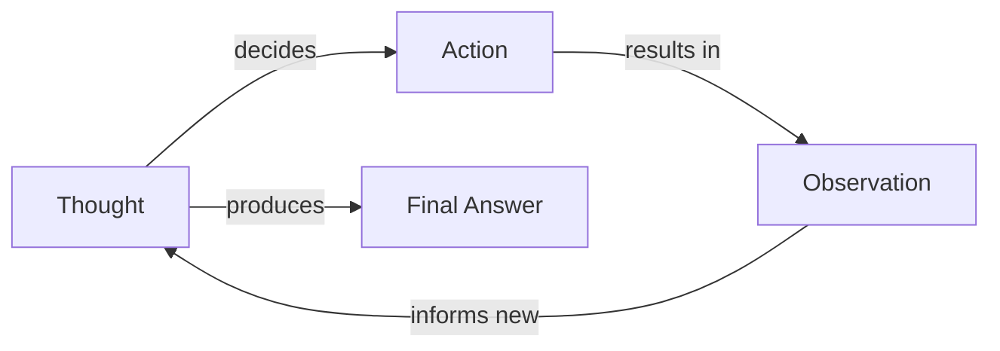
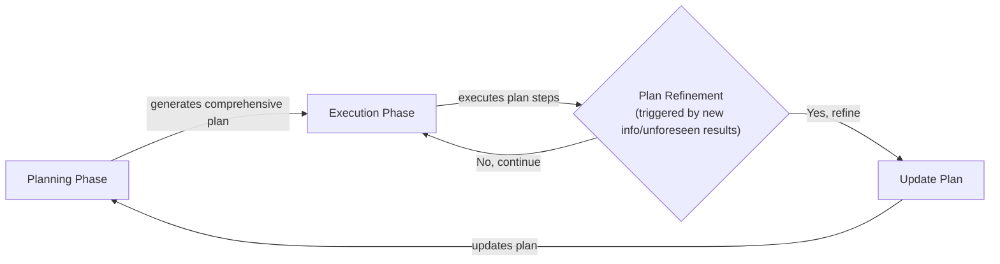

# The Art of Agentic Reasoning: From Chain-of-Thought to Advanced Planning

In our previous lessons, we built a solid foundation for AI Engineering. We navigated the agent landscape, distinguished between rigid LLM workflows and autonomous AI agents, mastered context engineering, enforced structured outputs, and gave our systems the ability to act with tools. We have all the components, but we are missing the glue that holds them together for complex, unpredictable tasks: a brain.

LLMs are powerful, but they do not plan by default. They are exceptional at single-turn, pattern-matching tasks but falter when faced with multi-step problems that require forethought and adaptation. Simply giving an agent a set of tools is not enough; without a reasoning process, it is like a brilliant specialist with no strategy. This is where planning and reasoning come in. They are the core ingredients that transform a simple tool-user into an intelligent, autonomous agent [[18]](https://www.anthropic.com/engineering/building-effective-agents).

In this lesson, we will explore how to build this "brain." We will start by examining why basic models fail at complex tasks and how early techniques like Chain-of-Thought tried to solve this. We will then dive into two foundational planning strategies that remain relevant today: ReAct and Plan-and-Execute. Finally, we will see how these concepts have evolved into the sophisticated reasoning capabilities of modern AI models, enabling advanced behaviors like goal decomposition and self-correction.

## What a Non-Reasoning Model Does And Why It Fails on Complex Tasks

Let's frame the problem with a recurring example: a "Technical Research Assistant Agent." Its goal is to produce a comprehensive technical report on the "Latest developments in edge AI deployment." This involves finding recent papers, summarizing their findings, identifying trends, and writing a structured report.

A non-reasoning model tackles this task by attempting to generate the final answer in a single pass. It treats the entire complex request as one large text-generation problem. While it might call the right tools in the right sequence for a simple, predictable task, it has no mechanism to handle unexpected results or correct its course [[1]](https://www.narrativa.com/ai-reasoning-vs-non-reasoning-models-key-differences-explained). If a search query returns irrelevant papers or a source contains conflicting information, the model plows ahead, leading to superficial and often incorrect outputs [[3]](https://arxiv.org/html/2606.07462v1). This failure stems from fundamental information-theoretic limits; LLMs suffer from inherent noise and errors that degrade reasoning and make it difficult to distinguish truth from falsehood without an external verification loop [[36]](https://www.emergentmind.com/papers/2511.12869).

This approach fails because it lacks an explicit process for breaking down the problem. The agent does not create sub-goals like "verify source credibility" or "compare findings across multiple papers." It does not iterate on its own partial results to refine its understanding. It simply executes.

In previous lessons, we built modularity and reliability with LLM workflows, structured outputs, and tools. These are perfect for predictable processes where the steps are known in advance. However, for complex tasks that require adaptation—the very tasks where agents shine—this is not enough. Without a capacity for reasoning and planning, the agent’s performance will inevitably drift and degrade. To address this, we first need to teach the model to produce a reasoning trace, to think before it answers.

## Teaching Models to “Think” Chain-of-Thought and Its Limits

The first major breakthrough in teaching models to reason was a simple yet powerful technique: Chain-of-Thought (CoT) prompting. The idea is to ask an LLM to "think step by step," mimicking how humans often talk themselves through a problem [[6]](https://www.emergentmind.com/topics/chain-of-thought-and-planning-agents). By prompting the model to write out its reasoning trace before giving the final answer, we give it space to plan and iterate on partial solutions internally [[9]](https://www.comet.com/site/blog/chain-of-thought-prompting).

Let's apply this to our research assistant agent. Instead of just asking for the report, we would modify the prompt:

*"Before answering, think step by step about how you will research and verify sources on edge AI deployment. Then provide the final report."*

With this instruction, the model’s behavior changes. It first drafts a high-level plan, something like: "First, I will search for recent academic papers and industry reports. Then, I will read the abstracts to select the most relevant ones. After that, I will compare their findings to identify common trends and conflicts. Finally, I will synthesize this information into a structured report."

This is a huge improvement. The model is now planning its actions. However, CoT has its limits. First, the reasoning trace and the final answer are generated together in a single block of text, which is difficult for a downstream system to parse and control [[7]](https://apxml.com/courses/intro-llm-agents/chapter-5-basic-agent-planning/guiding-agent-reasoning-chain-of-thought). Second, the model typically generates the plan once at the beginning and does not update it based on what it discovers. It is a static plan, not a dynamic, iterative loop that can adapt to new information. To gain more structure and control, we need to formally separate the act of planning from the act of answering.

## Separating Planning from Answering Foundations of ReAct and Plan-and-Execute

The next logical step in agent design is to create a formal separation between planning and execution. Instead of a single, monolithic output, we instruct the model to produce its reasoning and its actions as distinct, interleaved steps. This separation is the foundation of modern agentic architectures and gives us far greater control and interpretability.

This approach draws inspiration from decades of research in symbolic AI, where breaking complex tasks into discrete, logical steps is a core principle. By fusing these symbolic structures with the power of deep neural networks, we create a synergy that significantly boosts agent capabilities [[41]](https://arxiv.org/html/2407.08516v5).

By treating reasoning as a separate step, we can build iterative loops. An agent can think, act, observe the result, and then think again, updating its plan based on new information. This feedback loop is what enables genuine adaptability. It also allows us to handle the reasoning traces and the final outputs differently. For example, we can show the final answer to the user while keeping the internal "thoughts" for debugging.

Two primary patterns emerged from this idea:

-   **ReAct** (Reason + Act) interleaves thoughts, actions, and observations in a tight, continuous loop.
-   **Plan-and-Execute** separates the entire process into a distinct Planning phase that generates a comprehensive plan upfront, followed by an Execution phase that carries out the steps.

These patterns provide the fundamental structures for building reasoning agents. Let's explore ReAct first, using our research-assistant example to see it in action.

## ReAct in Depth Loop, Evolving Example, Pros and Cons

The ReAct framework was introduced to bridge the gap between pure reasoning (like CoT) and pure action. It synergizes the two by creating an iterative loop where the model thinks, acts, observes the result, and then uses that observation to inform its next thought [[38]](https://research.google/blog/react-synergizing-reasoning-and-acting-in-language-models), [[11]](https://mbrenndoerfer.com/writing/react-pattern-llm-reasoning-action-agents). This dynamic process mirrors how humans approach complex problems: we try something, see what happens, and adjust our strategy accordingly.

The loop consists of three phases that repeat until the task is complete [[12]](https://apxml.com/courses/getting-started-with-llm-toolkit/chapter-8-developing-autonomous-agents/react-pattern-for-agents), [[15]](https://www.ibm.com/think/topics/react-agent):

1.  **Thought:** The model reasons about the current state and decides on the next step.
2.  **Action:** The model invokes a tool to interact with its environment.
3.  **Observation:** The result from the tool is fed back to the model.

Image 1: A flowchart illustrating the iterative ReAct loop.

Let's see how our Technical Research Assistant Agent would use this loop:

-   **Thought 1:** "I need to find recent, trustworthy sources on edge AI deployment. I should start by searching for academic papers and industry reports from the last year."
-   **Action 1:** `search("latest developments in edge AI deployment 2024 site:arxiv.org OR site:nature.com")`
-   **Observation 1:** A list of five papers with titles and URLs is returned.
-   **Thought 2:** "The search returned several promising papers. I will select the top three based on their titles and relevance, then fetch their abstracts to get a summary."
-   **Action 2:** `fetch_and_extract(paper_urls=["url1", "url2", "url3"])`
-   **Observation 2:** The abstracts for the three papers are extracted.
-   **Thought 3:** "I have the abstracts. Now I need to summarize each one and compare their claims about market adoption rates. I will look for specific percentages."
-   **Action 3:** `summarize_and_compare(abstracts)`
-   **Observation 3:** "Summary: Paper A claims 40% adoption by 2025. Paper B claims 25% by 2025."
-   **Thought 4:** "There is a conflict in the adoption rates. I need to find a third-party market analysis to verify these numbers."
-   **Action 4:** `search("edge AI deployment adoption market analysis 2024")`
-   **Observation 4:** A link to a credible industry report is found.
-   **Thought 5:** "I have the industry report. I will use it to resolve the conflict and then finalize the trends and gaps for my final report."
-   **Final Answer:** A structured report is generated with citations and the resolved statistics.

This example highlights the strengths of ReAct. It is highly interpretable and allows for natural error recovery. However, it has structural failure modes. For long-horizon tasks, the context window fills with intermediate thoughts and observations, leading to "context rot" where early, important information gets diluted [[39]](https://www.agentengineering.io/topics/articles/react-loop-unpacked). Performance collapses as the number of steps increases; even the strongest models become unreliable after about 12-15 complex operations [[40]](https://openreview.net/pdf?id=dAn82lpLx4). Furthermore, the loop has no native concept of action reversibility, making it risky for tasks involving irreversible actions like deleting files or sending payments [[39]](https://www.agentengineering.io/topics/articles/react-loop-unpacked).

## Plan-and-Execute in Depth Plan, Execution, Pros and Cons

While ReAct excels at exploratory tasks, the Plan-and-Execute approach offers more structure and efficiency for problems where the overall workflow can be anticipated [[16]](https://openreview.net/forum?id=ybA4EcMmUZ). Instead of deciding one step at a time, the agent first creates a comprehensive, multi-step plan. Then, it proceeds to the execution phase, carrying out each step of the plan sequentially. The plan is treated as a high-level blueprint, and the agent only returns to the planning phase if it encounters a significant error or new information that invalidates the original strategy.

This separation of concerns directly addresses ReAct's long-horizon drift by structurally solving the problem of token bloat. A planner generates the task graph upfront, and smaller, often cheaper models can execute each step with only the necessary sub-task context, not the full history [[39]](https://www.agentengineering.io/topics/articles/react-loop-unpacked). This is analogous to a head chef creating a detailed recipe before the line cooks begin their work [[16]](https://openreview.net/forum?id=ybA4EcMmUZ).

Image 2: A flowchart depicting the Plan-and-Execute approach with plan refinement feedback.

Let's revisit our research assistant agent with this new approach.

**Planning Phase:** The agent receives the task and generates a complete plan. This plan is not just a simple list; it is a structured, high-level strategy. The planner model decomposes the user's goal into a series of logical steps designed to achieve the objective efficiently.

-   **Plan:**
    1.  **Define Scope:** Clarify the report's focus on recent developments (2023-2024) in edge AI, covering hardware, software, and adoption trends. Establish success criteria, such as including at least three distinct trends and two identified research gaps.
    2.  **Information Gathering:** Execute parallel searches on Google Scholar, arXiv, and industry news sites using targeted keywords like "edge AI hardware accelerators," "tinyML frameworks," and "edge computing market growth."
    3.  **Source Selection:** From the search results, filter and select the top 5 academic papers and 3 industry reports. Prioritize sources based on citation count, publication date, and authoritativeness of the venue.
    4.  **Data Extraction:** For each selected source, systematically extract the abstract, key findings, methodologies, and any quantitative data (e.g., performance metrics, market size projections, adoption rates).
    5.  **Synthesis and Analysis:** Consolidate the extracted information. Identify 3-5 major trends, 2-3 significant research gaps, and any conflicting findings between sources.
    6.  **Conflict Resolution:** If contradictions are found (e.g., different market growth percentages), perform a targeted search for a meta-analysis or a reputable market research report to adjudicate the differences. Document the discrepancy and the resolution.
    7.  **Outline Generation:** Draft a detailed outline for the final report. This should include an introduction, dedicated sections for each identified trend, a discussion of research gaps, and a conclusion summarizing the key takeaways.
    8.  **Report Writing:** Write the full report based on the approved outline, ensuring every claim is supported by an inline citation pointing to the specific source. Include a methodology section explaining the research process.

**Execution Phase:** The executor module takes this detailed plan and carries out each step. Unlike ReAct, it does not stop to "think" between every minor action. Instead, it works through the blueprint, using its tools to perform searches, fetch content, and process data. The execution is more like running a script than a continuous dialogue. For example, the executor might run all the searches from step 2, then all the extractions from step 4, and so on.

**Plan Refinement:** The system is not entirely rigid. Feedback loops are built in to handle unexpected situations. If, during step 5, the agent finds a major contradiction that the plan already anticipated in step 6, it simply proceeds to that step. However, a full re-planning cycle is triggered only when a fundamental assumption of the plan is violated. For instance, if all initial searches in step 2 failed to return any relevant documents, the original plan would be unworkable. The executor would pause, and the planner would be invoked again to generate a new strategy, perhaps with different keywords or data sources.

The primary advantage of Plan-and-Execute is its efficiency and predictability for well-defined, multi-step tasks. By creating the full plan upfront, it minimizes the number of expensive LLM calls during the execution phase, making it easier to estimate the time and cost required. However, its main drawback is a lack of flexibility. If the initial plan is flawed or the task is highly exploratory and unpredictable, the agent might rigidly follow a sub-optimal path, leading to frequent and costly re-planning cycles.

## Where This Shows Up in Practice Deep Research–Style Systems

The theoretical patterns of ReAct and Plan-and-Execute are not just academic exercises; they power some of the most advanced agentic systems available today. So-called "deep research" systems, which are designed to tackle complex, long-horizon research tasks, are prime examples of these principles in action [[27]](https://blog.promptlayer.com/how-deep-research-works).

These systems operationalize planning and reasoning by breaking down a high-level query into a series of sub-goals. They then enter an iterative cycle of searching for information, reading and extracting content from various sources (including HTML, PDFs, and images), comparing findings, verifying claims, and synthesizing the results into a coherent report [[27]](https://blog.promptlayer.com/how-deep-research-works), [[28]](https://www.jonkrohn.com/posts/2025/3/17/openais-deep-research-get-days-of-human-work-done-in-minutes). To combat hallucinations and ensure factual accuracy, they are built with strong internal policies and prompts that enforce source verification and citation [[30]](https://cdn.openai.com/deep-research-system-card.pdf).

These principles extend beyond text-based research. In legal tech, agentic systems use similar planning architectures to manage complex tasks like case analysis and litigation strategy, with sub-agents handling specific parts of the legal reasoning process [[42]](https://legal.thomsonreuters.com/blog/how-agentic-ai-systems-think-learn-and-collaborate-with-legal-professionals). The field is also expanding to multimodal agents that can plan over visually rich, interactive environments, not just text [[43]](https://arxiv.org/html/2603.16777v1).

Our Technical Research Assistant Agent is a simplified version of such a system. In a real-world implementation, it would perform dozens of micro-cycles of searching, extracting, and cross-validating statistics like adoption rates before committing them to its final report.

Architecturally, many of these systems are built on a ReAct-like loop, augmented with sophisticated tools and robust system prompts that guide the reasoning process. Others are closer to a Plan-and-Execute model, where an initial research strategy is formulated and then executed, with periodic check-ins to refine the plan as new information is uncovered. The lines often blur, but the core principles of separating reasoning from action and using feedback to guide the process remain constant. As models evolve, some ofthis explicit orchestration is becoming more integrated into the models themselves.

## Modern Reasoning Models Thinking vs Answer Streams and Interleaved Thinking

The evolution of AI models has led to a tighter integration of reasoning and planning capabilities directly into their architecture. Instead of relying solely on external orchestration frameworks to guide their thought processes, modern reasoning models are explicitly trained to think before they speak [[22]](https://www.ibm.com/think/topics/reasoning-model). This is often implemented through a dual-stream generation process:

1.  A **private "thinking" stream**, where the model generates its internal monologue, chain-of-thought reasoning, or step-by-step plan. This content is not typically shown to the end-user but is used by the model to structure its response [[23]](https://cameronrwolfe.substack.com/p/demystifying-reasoning-models).
2.  A **public "answer" stream**, which contains the final, polished response intended for the user.

This separation allows the model to perform extensive computation and reasoning "behind the scenes" before delivering a coherent answer. Some models operate in a "think first" mode, where the entire reasoning process is completed before any part of the final answer is generated. This is similar to the Plan-and-Execute pattern but happens internally within a single model call.

A more advanced capability is **interleaved thinking**. With this feature, the model can alternate between thinking and generating its public answer. For example, after receiving the results of a tool call, the model can generate new private "thinking" tokens to analyze those results and update its plan before continuing to write the final response [[21]](https://arxiv.org/html/2512.10931v1). This creates a tight, dynamic feedback loop that combines the adaptability of ReAct with the efficiency of an integrated model architecture.

For example, when a voice assistant is asked a question, it can start providing an initial response while simultaneously thinking more deeply in the background. If its background reasoning uncovers a more complex answer, it can pause the public response, "think" for a moment longer, and then resume with a more accurate and detailed answer [[21]](https://arxiv.org/html/2512.10931v1). This asynchronous process, shown in the image below, reduces perceived latency while retaining the benefits of deep reasoning.
Image 3: A model can generate its response concurrently with thinking. If the thinking stream needs more time, it can pause the writer until the next reasoning step is ready. (Source [Asynchronous Reasoning: Training-Free Interactive Thinking LLMs [21]](https://arxiv.org/html/2512.10931v1))

However, this increased reasoning capability does not come without trade-offs. Counter-intuitively, some of the most advanced reasoning models, like OpenAI's o3 and o4-mini, have been found to hallucinate *more* often than their predecessors. On one internal benchmark, o3 hallucinated in 33% of responses, roughly double the rate of previous models, and the company has stated that "more research is needed" to understand why [[44]](https://techcrunch.com/2025/04/18/openais-new-reasoning-ai-models-hallucinate-more). This is a critical reminder that more powerful reasoning does not automatically equate to more factual reliability.

What does this mean for AI engineers? The rise of integrated reasoning models has significant implications for system design. While these models may reduce the need to build explicit ReAct or Plan-and-Execute loops from scratch, the underlying principles of planning, acting, and verification remain as crucial as ever. Relying on a model's implicit reasoning without proper oversight can be risky. The separation of "thinking" and "answer" streams, even when internal to the model, provides a valuable abstraction for debugging and control. By inspecting the private reasoning traces, you can gain insight into why a model made a particular decision, identify logical errors, and refine your prompts to guide its behavior.

Furthermore, even the most advanced reasoning models benefit from a structured environment. You still need to provide clear instructions, well-documented tools, and robust guardrails to ensure reliable performance. For high-stakes applications, an external verification loop, where the agent's proposed actions or conclusions are checked against a set of rules or an external data source, is often necessary. The internal reasoning of the model should be seen as a powerful starting point, not a substitute for a well-architected system. Ultimately, the goal is to find the right balance between leveraging the model's native capabilities and imposing the necessary structure to ensure your agent is reliable, predictable, and safe. With these powerful planning abilities in place, agents can unlock even more advanced capabilities.

## Advanced Agent Capabilities Enabled by Planning Goal Decomposition and Self-Correction

Effective planning and reasoning are not just about following a sequence of steps; they unlock more sophisticated cognitive behaviors that are essential for true autonomy. Two of the most important are goal decomposition and self-correction [[33]](https://www.ibm.com/think/topics/agentic-reasoning).

**Goal decomposition** is the ability to break down a large, ambiguous task into smaller, concrete sub-goals. For our research assistant agent, the high-level goal "write a report on edge AI" is decomposed into sub-goals like "find academic sources," "identify industry trends," and "synthesize findings." In a ReAct-style agent, this decomposition often happens implicitly within the "Thought" steps, guided by a well-crafted system prompt that encourages structured problem-solving.

**Self-correction** is the agent's ability to detect when something has gone wrong and adjust its plan accordingly. This is where the iterative nature of reasoning loops becomes powerful. For instance, when our agent identified conflicting adoption rates (40% vs. 25%), it did not just report the contradiction. Instead, it recognized the failure, inserted a new "verification" sub-goal into its plan, and took action to resolve it. This can involve several techniques, such as re-prompting itself with the error information, trying alternative actions, re-evaluating the overall plan, or even asking the user for clarification. This ability to reflect on its own outputs and course-correct is a hallmark of advanced agency [[32]](https://aclanthology.org/2025.acl-long.1104.pdf). This process can be formalized using concepts from control theory, where self-correction is a closed-loop feedback problem. The agent's output is compared against a goal, an "error signal" is generated, and a "controller" (the reasoning model) generates a corrective action to stabilize the system toward a correct output [[45]](https://arxiv.org/html/2605.17305v1).

However, self-correction is not a solved problem. It remains an open area of research with significant challenges, including handling tool execution failures, adapting to unexpected changes in the environment, and balancing the computational cost of correction attempts with latency requirements. Current self-correction mechanisms are still heuristic and lack formal guarantees of reliability [[46]](https://apxml.com/courses/agentic-llm-memory-architectures/chapter-4-complex-planning-tool-integration/self-correction-plan-refinement).

Even with powerful modern models that have built-in reasoning, explicit patterns like ReAct remain valuable. They provide a clear structure that improves debuggability, allowing you to trace the agent's decisions through the Thought-Action-Observation sequence. They also enhance consistency by enforcing a deliberate control loop.

## Conclusion

We have journeyed from the limitations of non-reasoning models to the sophisticated planning capabilities of modern agents. We have seen how Chain-of-Thought opened the door to explicit reasoning, and how frameworks like ReAct and Plan-and-Execute provided the structure needed for true agentic behavior. These patterns are not just historical artifacts; they are foundational principles that continue to shape how we build intelligent systems, even as models with integrated reasoning become more common.

Understanding these core concepts of planning, goal decomposition, and self-correction is what separates building a simple chatbot from engineering a robust, autonomous agent. They provide the mental models needed to design, debug, and control complex AI systems. Now that we have this theoretical grounding, we are ready to get our hands dirty. In the next lesson, we will implement the ReAct pattern from scratch, turning these abstract ideas into working code. From there, we will explore agent memory, advanced RAG, and multimodal processing, building on these reasoning foundations every step of the way.

## References

- [1] [AI reasoning vs non-reasoning models: key differences explained](https://www.narrativa.com/ai-reasoning-vs-non-reasoning-models-key-differences-explained)
- [2] [Fundamental Scaling Limitations in AI Reasoning Models](https://www.kuppingercole.com/research/lb80993/fundamental-scaling-limitations-in-ai-reasoning-models)
- [3] [From LLM Reasoning to Autonomous AI Agents: A Comprehensive Review](https://arxiv.org/html/2606.07462v1)
- [4] [Reasoning best practices | OpenAI API](https://developers.openai.com/api/docs/guides/reasoning-best-practices)
- [5] [Agent Laboratory: Using LLM Agents as Research Assistants](https://www.linkedin.com/posts/skphd_agent-laboratory-using-llm-agents-as-research-activity-7283233189651738625-q6xU)
- [6] [Chain-of-Thought and Planning Agents](https://www.emergentmind.com/topics/chain-of-thought-and-planning-agents)
- [7] [Guiding Agent Reasoning: Chain of Thought](https://apxml.com/courses/intro-llm-agents/chapter-5-basic-agent-planning/guiding-agent-reasoning-chain-of-thought)
- [8] [Step-by-step Problem-Solving: Chain-of-Thought Reasoning](https://mbrenndoerfer.com/writing/step-by-step-problem-solving-chain-of-thought-reasoning)
- [9] [Chain-of-Thought Prompting](https://www.comet.com/site/blog/chain-of-thought-prompting)
- [10] [Chain of thoughts](https://www.ibm.com/think/topics/chain-of-thoughts)
- [11] [The ReAct Pattern for LLM Reasoning and Action](https://mbrenndoerfer.com/writing/react-pattern-llm-reasoning-action-agents)
- [12] [ReAct Pattern for Agents](https://apxml.com/courses/getting-started-with-llm-toolkit/chapter-8-developing-autonomous-agents/react-pattern-for-agents)
- [13] [What is the ReAct Loop for AI Agent Reasoning?](https://www.mindstudio.ai/blog/what-is-react-loop-ai-agent-reasoning)
- [14] [ReAct Agents: What They Are & How They Work](https://www.salesforce.com/agentforce/ai-agents/react-agents)
- [15] [ReAct agent](https://www.ibm.com/think/topics/react-agent)
- [16] [Plan-and-Act: Improving Planning of Agents for Long-Horizon Tasks](https://openreview.net/forum?id=ybA4EcMmUZ)
- [17] [Agentic AI vs. Generative AI - IBM](https://www.ibm.com/think/topics/agentic-ai-vs-generative-ai)
- [18] [Building effective agents - Anthropic](https://www.anthropic.com/engineering/building-effective-agents)
- [19] [ReAct: Synergizing Reasoning and Acting in Language Models](https://arxiv.org/pdf/2210.03629)
- [20] [AI Agent Planning - IBM](https://www.ibm.com/think/topics/ai-agent-planning)
- [21] [Asynchronous Reasoning: Training-Free Interactive Thinking LLMs](https://arxiv.org/html/2512.10931v1)
- [22] [Reasoning Model - IBM](https://www.ibm.com/think/topics/reasoning-model)
- [23] [Demystifying Reasoning Models](https://cameronrwolfe.substack.com/p/demystifying-reasoning-models)
- [24] [Understanding Reasoning LLMs](https://magazine.sebastianraschka.com/p/understanding-reasoning-llms)
- [25] [AI Agents in 2025: Expectations vs Reality - IBM](https://www.ibm.com/think/insights/ai-agents-2025-expectations-vs-reality)
- [26] [How Deep Research works](https://arxiv.org/html/2603.28376v1)
- [27] [How OpenAI's Deep Research Works](https://blog.promptlayer.com/how-deep-research-works)
- [28] [OpenAI’s Deep Research: Get Days of Human Work Done in Minutes](https://www.jonkrohn.com/posts/2025/3/17/openais-deep-research-get-days-of-human-work-done-in-minutes)
- [29] [Reasoning AI Agents Transform Decision Making - NVIDIA](https://blogs.nvidia.com/blog/reasoning-ai-agents-decision-making/)
- [30] [Deep Research System Card](https://cdn.openai.com/deep-research-system-card.pdf)
- [31] [A practical guide to building agents](https://cdn.openai.com/business-guides-and-resources/a-practical-guide-to-building-agents.pdf)
- [32] [Principled Instructions Are All You Need for Questioning LLaMA-1/2, GPT-3.5/4](https://aclanthology.org/2025.acl-long.1104.pdf)
- [33] [Agentic Reasoning - IBM](https://www.ibm.com/think/topics/agentic-reasoning)
- [34] [AI Agent Orchestration - IBM](https://www.ibm.com/think/topics/ai-agent-orchestration)
- [35] [Measuring AI Ability to Complete Long Tasks - METR](https://metr.org/blog/2025-03-19-measuring-ai-ability-to-complete-long-tasks/)
- [36] [Information-theoretic limits on planning in LLMs](https://www.emergentmind.com/papers/2511.12869)
- [37] [From LLM Reasoning to Autonomous AI Agents](https://arxiv.org/pdf/2504.19678)
- [38] [ReAct - Google](https://research.google.com/blog/react-synergizing-reasoning-and-acting-in-language-models)
- [39] [The ReAct Loop Unpacked: Reasoning + Acting in Practice](https://www.agentengineering.io/topics/articles/react-loop-unpacked)
- [40] [On the Horizon: Interactive and Compositional Task Generalization with Large Language Models](https://openreview.net/pdf?id=dAn82lpLx4)
- [41] [Neuro-Symbolic AI for Autonomous Agents: A Survey](https://arxiv.org/html/2407.08516v5)
- [42] [How agentic AI systems think, learn, and collaborate with legal professionals](https://legal.thomsonreuters.com/blog/how-agentic-ai-systems-think-learn-and-collaborate-with-legal-professionals)
- [43] [Look Before You Leap: Unveiling the Power of Model-Based Planning in Multimodal Agents](https://arxiv.org/html/2603.16777v1)
- [44] [OpenAI’s new reasoning AI models hallucinate more](https://techcrunch.com/2025/04/18/openais-new-reasoning-ai-models-hallucinate-more)
- [45] [CyberCorrect: A Cybernetics-Inspired Framework for LLM Self-Correction](https://arxiv.org/html/2605.17305v1)
- [46] [Self-Correction and Plan Refinement](https://apxml.com/courses/agentic-llm-memory-architectures/chapter-4-complex-planning-tool-integration/self-correction-plan-refinement)