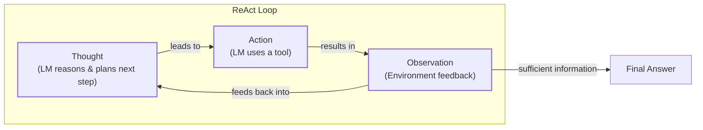
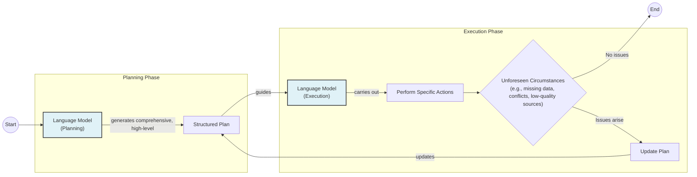

# Lesson 7: Agent Planning and Reasoning

In the previous lessons, we built a solid foundation for AI Engineering. We explored the agent landscape, distinguished between LLM workflows and AI agents, engineered context, structured outputs, and gave our systems the ability to act using tools. We have all the components. Yet, if we assemble them, our agent will still feel incomplete. It can execute instructions but struggles with complex, multi-step tasks that require adaptation. It follows a script but doesn't truly *think*.

This gap between execution and autonomy is one of the biggest challenges in AI engineering. How do we build agents that can create a plan, reason about their next steps, and adapt when things go wrong? The answer lies in teaching them to structure their thought process. While modern models are becoming better at this internally, understanding the foundational patterns that enable this behavior is essential for building robust and predictable systems.

In this lesson, we will explore the core principles of agentic planning and reasoning. We will start by examining why simple models fail at complex tasks and how early techniques like Chain-of-Thought tried to solve this. Then, we will explore two foundational architectural patterns, ReAct and Plan-and-Execute, that give agents a structured way to think and act. Finally, we will see how these patterns manifest in modern reasoning models and enable advanced capabilities like goal decomposition and self-correction.

## What a Non-Reasoning Model Does And Why It Fails on Complex Tasks

Let's use a recurring example to frame the problem: a "Technical Research Assistant Agent." Its goal is to produce a comprehensive report on the "Latest developments in edge AI deployment." This involves finding recent papers, summarizing their findings, identifying trends, and writing a structured report.

A non-reasoning model, when given this prompt, attempts to generate the answer in one go [[1]](https://www.narrativa.com/ai-reasoning-vs-non-reasoning-models-key-differences-explained). It treats the entire complex task as a single, large-scale text generation problem. It might call a search tool, retrieve a few documents, and immediately write a summary. It doesn't draft a plan, cross-reference sources, or verify conflicting information. The process is linear and non-adaptive.

This approach inevitably fails for complex tasks. The agent might misunderstand the task's intent, edit the wrong information, or stop too early without completing all the required steps [[3]](https://arxiv.org/html/2606.07462v1). Since it doesn't break the problem down into sub-goals, it misses crucial stages like source verification or trend analysis. If it encounters an unexpected result, like a paywalled article or conflicting data, it has no mechanism to correct its course. It simply plows ahead, often producing superficial or incorrect outputs [[2]](https://www.kuppingercole.com/research/lb80993/fundamental-scaling-limitations-in-ai-reasoning-models).

In our previous lessons, we learned how to build reliable, modular systems. Workflows and structured outputs brought predictability, and tools enabled action. However, these components are only as good as the logic that orchestrates them. For tasks where the path is not straightforward, we need more than just a sequence of steps. We need a reasoning engine. To address this, the first step is to teach the model to produce a reasoning trace, making its thought process explicit.

## Teaching Models to “Think” Chain-of-Thought and Its Limits

The first major breakthrough in teaching models to reason was a simple yet powerful technique: Chain-of-Thought (CoT) prompting. The idea is to ask the LLM to "think step by step" before giving its final answer, much like a person might talk themselves through a problem [[38]](https://arxiv.org/pdf/2210.03629). This forces the model to externalize its reasoning process, breaking down a complex problem into intermediate steps.

For our research assistant agent, a CoT prompt might look like this: *"Before answering, think step by step about how you will research and verify sources on edge AI deployment. Then provide the final report."*

The model would first generate a high-level plan, a reasoning trace that looks something like this:
*   *Thought: First, I need to search for recent academic papers and industry reports. Second, I will select the most credible sources based on citations and publisher. Third, I will extract key findings, paying attention to deployment trends and challenges. Fourth, I will synthesize these findings into a structured report.*

This is a significant improvement. The model now has a plan, which improves the quality and structure of the final output. However, CoT has its limits. It’s a heuristic, not a guaranteed algorithm; it guides the model toward better reasoning but doesn't ensure correctness [[7]](https://apxml.com/courses/intro-llm-agents/chapter-5-basic-agent-planning/guiding-agent-reasoning-chain-of-thought). The model can still produce a detailed explanation that leads to a wrong answer [[9]](https://www.comet.com/site/blog/chain-of-thought-prompting).

Furthermore, the reasoning trace and the final answer are generated together, often in the same text block. This makes the output verbose and difficult for a downstream system to parse and control [[8]](https://mbrenndoerfer.com/writing/step-by-step-problem-solving-chain-of-thought-reasoning). Most importantly, the plan is usually static. The model makes a plan and then executes it, without a built-in loop to react to observations, handle errors, or refine its approach based on new information. To achieve true autonomy, we need to give the agent a way to not only think but also to act on those thoughts and learn from the results. To gain this structure and control, we must separate planning and reasoning from answering and action.

## Separating Planning from Answering Foundations of ReAct and Plan-and-Execute

The limitations of Chain-of-Thought led to a pivotal insight: to build more robust agents, we need to formally separate the model's internal reasoning from its external actions. This separation provides a clear structure for the agent's behavior, making it more controllable, interpretable, and capable of iterative problem-solving. This idea is the foundation for two of the most influential patterns in agent design: ReAct and Plan-and-Execute.

By creating distinct phases for thinking and doing, we enable a feedback loop. The agent can reason about a goal, take an action, observe the outcome, and then use that observation to update its reasoning for the next step. This is a fundamental departure from the linear, one-shot process of basic CoT.

This separation manifests in two primary architectural patterns:

*   **ReAct (Reason + Act)** interleaves `Thought`, `Action`, and `Observation` in a tight, iterative loop. It is designed for dynamic, exploratory tasks where the plan must constantly adapt to new information.
*   **Plan-and-Execute** separates the process into two distinct, high-level phases: a comprehensive `Planning` phase that generates a full, step-by-step plan upfront, followed by an `Execution` phase that carries out that plan [[16]](https://openreview.net/forum?id=ybA4EcMmUZ).

Both patterns give us greater control and visibility into the agent's process, but they are suited for different types of problems. To understand which to choose, we will first go deep into ReAct using our evolving research-assistant example.

## ReAct in Depth Loop, Evolving Example, Pros and Cons

The ReAct framework was introduced to bridge the gap between the internal, abstract reasoning of Chain-of-Thought and the action-oriented but non-reasoning approaches that existed at the time [[38]](https://arxiv.org/pdf/2210.03629). It synergizes reasoning and acting by prompting an LLM to generate thoughts and actions in an interleaved manner. This allows the agent to create and adjust plans dynamically while interacting with external tools to ground its reasoning in real-world information.

The core of ReAct is an iterative loop that consists of three phases:

1.  **Thought:** The LLM analyzes the current situation and its goal, then formulates a reasoning step and a plan for what to do next.
2.  **Action:** Based on its thought, the LLM selects and invokes a tool, like a web search or a database query.
3.  **Observation:** The agent receives the output from the tool. This is the environment's feedback, which it adds to its context. This new information feeds into the next thought, closing the loop.

This cycle repeats until the agent determines it has enough information to provide a final answer [[11]](https://mbrenndoerfer.com/writing/react-pattern-llm-reasoning-action-agents), [[12]](https://apxml.com/courses/getting-started-with-llm-toolkit/chapter-8-developing-autonomous-agents/react-pattern-for-agents).

Image 1: A flowchart illustrating the ReAct (Reason + Act) loop, showing the iterative Thought-Action-Observation cycle and the eventual transition to a Final Answer.

Let's see how our Technical Research Assistant Agent would use the ReAct loop:

*   **Thought 1:** "I need to find recent, trustworthy sources on edge AI deployment. I should start by searching for review papers on academic sites."
*   **Action 1:** `search("latest developments in edge AI deployment 2024 site:arxiv.org OR site:nature.com")`
*   **Observation 1:** A list of recent papers with titles and abstracts is returned.
*   **Thought 2:** "The search returned several promising papers. I will select the three most relevant ones based on their titles and abstracts, focusing on recent publication dates and high-impact venues."
*   **Action 2:** `fetch_and_extract(paper_urls=["url1", "url2", "url3"])`
*   **Observation 2:** The full text or detailed abstracts of the selected papers are extracted.
*   **Thought 3:** "Now I need to summarize each source and identify key trends, especially regarding adoption rates. I will look for specific data points and compare claims across the papers."
*   **Action 3:** `summarize_and_compare(extractions)`
*   **Observation 3:** "Summary generated. Conflict detected: Paper A claims 40% adoption in manufacturing, while Paper B reports only 25%."
*   **Thought 4:** "There is a conflict in the data. To resolve this, I need a third-party source, like a market analysis report, to verify the adoption rates."
*   **Action 4:** `search("edge AI deployment adoption market analysis 2024")`
*   **Observation 4:** A credible industry report is found with detailed market data.
*   **Thought 5:** "I have resolved the conflict using the market report. I now have enough information to identify the main trends, challenges, and future directions. I can synthesize this into the final report."
*   **Final Answer:** A structured report is generated with citations and a note explaining the resolved data conflict.

This pattern has clear advantages. It offers high interpretability, as we can follow the agent's reasoning at each step. It is also excellent for exploratory tasks where the path forward is uncertain, as the feedback loop allows for natural error recovery and plan adaptation [[14]](https://www.salesforce.com/agentforce/ai-agents/react-agents). However, this iterative process can be slower and more computationally expensive. It also requires careful prompt design and robust loop control to prevent the agent from getting stuck in repetitive cycles or going off-track. For tasks with a more predictable structure, the Plan-and-Execute pattern can be a more efficient and reliable alternative.

## Plan-and-Execute in Depth Plan, Execution, Pros and Cons

While ReAct excels at exploration, many tasks benefit from a more structured approach. The Plan-and-Execute pattern addresses this by separating the agent's process into two distinct phases. First, an LLM acts as a "Planner" to generate a comprehensive, high-level plan. Then, an "Executor" (which can be the same or a different LLM) carries out the steps in that plan [[16]](https://openreview.net/forum?id=ybA4EcMmUZ).

The key idea is to think everything through upfront. The Planner decomposes the main goal into a sequence of smaller, manageable sub-tasks. The Executor then works through this checklist. This approach is less about dynamic adaptation at every step and more about methodical execution of a well-thought-out strategy. The plan can still be updated if the Executor encounters an unexpected issue, but this is an exception rather than the default mode of operation [[35]](https://www.ibm.com/think/topics/ai-agent-planning).

Image 2: Flowchart illustrating the Plan-and-Execute approach with a planning phase, execution phase, and a plan refinement loop.

Let's apply this to our Technical Research Assistant Agent.

**Planning Phase:**
The user provides the high-level goal, and the Planner LLM generates a detailed, structured plan. This is more than a simple list; it's a complete strategy for tackling the research task.
1.  **Define Scope and Success Criteria:** The first step is to establish clear boundaries. The agent clarifies what "edge AI" includes (e.g., hardware, software, frameworks) and sets the time frame for "latest developments" (e.g., the last 18 months). Success is defined as a 1,500-word report with cited sources covering trends, challenges, and future outlook.
2.  **Search Across Academic and Industry Sources:** The agent plans to execute parallel searches on multiple platforms like arXiv, Google Scholar, and relevant industry news sites. This ensures a balanced perspective by combining academic rigor with real-world applications.
3.  **Select Top Sources by Relevance and Quality:** The plan specifies criteria for filtering the search results. The agent will prioritize the top five academic papers based on citation counts and venue prestige, and the top three industry reports from reputable analyst firms.
4.  **Summarize Each Source:** For each selected document, the agent will extract and summarize the abstract, key findings, methodologies, and any quantitative data related to performance metrics, adoption rates, or market size.
5.  **Compare Findings and Identify Trends:** This step involves synthesizing the extracted information. The agent will consolidate all summaries, identify recurring themes (e.g., the rise of specialized hardware), compare and contrast claims, and flag any conflicting data points for further investigation.
6.  **Draft Outline:** Before writing, the agent will create a structured outline for the final report. This includes standard sections like an Introduction, Key Technological Advances, Major Use Cases, Deployment Challenges, and Future Trends.
7.  **Write the Report:** The agent will write the full report following the outline, ensuring that every factual claim is supported by an inline citation. It will also include a methodology note explaining how sources were selected and how data conflicts were resolved.

**Execution Phase:**
With the plan in place, the Executor agent begins to work through it step-by-step. It calls the necessary tools to perform searches, filter results, and extract text. The process is methodical. If, during Step 5, it finds a major conflict (like the 40% vs. 25% adoption rate), it triggers a plan refinement. The system might pause, re-engage the Planner to insert a new step for conflict resolution (like finding a meta-analysis), and then resume execution.

The primary advantage of this pattern is its efficiency and predictability for well-defined, multi-step tasks. By creating a full plan upfront, the agent can proceed methodically, which makes it easier to estimate completion time and resource costs. It provides a clear structure that improves reliability.

However, its main drawback is its relative rigidity. The agent is committed to its initial plan, which may be flawed or become outdated as the environment changes. While re-planning is possible, it is a more heavyweight process than the micro-adjustments made in every ReAct loop. This makes Plan-and-Execute less suitable for highly uncertain or exploratory problems where the path to the solution is unknown at the start. These foundational ideas are not just theoretical; they power real-world systems that operationalize iterative planning and verification at scale.

## Where This Shows Up in Practice Deep Research–Style Systems

The planning and reasoning patterns we have discussed are not just academic concepts; they are the engines behind some of the most advanced agentic AI systems available today. A prime example is what we can call "deep research" systems, like those developed by OpenAI and other research labs [[27]](https://blog.promptlayer.com/how-deep-research-works), [[28]](https://www.jonkrohn.com/posts/2025/3/17/openais-deep-research-get-days-of-human-work-done-in-minutes).

These systems are designed to tackle complex, long-horizon research tasks that would take a human expert hours or even days to complete. They do this by operationalizing the principles of goal decomposition, iterative execution, and verification. When given a complex query, the system first breaks it down into a series of logical sub-questions [[27]](https://blog.promptlayer.com/how-deep-research-works). This is the "planning" part of the process.

Then, it enters an iterative cycle of searching for information, reading and extracting content from various sources (including HTML, PDFs, and images), comparing findings, and verifying facts [[30]](https://cdn.openai.com/deep-research-system-card.pdf). This is the "execution" part, which often resembles a ReAct-style loop. The agent performs many micro-cycles of searching, extracting, and synthesizing information, continually updating its understanding and refining its research direction based on what it finds [[27]](https://blog.promptlayer.com/how-deep-research-works).

For our technical research assistant example, such a system would not just perform one search. It would issue dozens of queries, read multiple papers, extract specific statistics on adoption rates, notice discrepancies, and then launch a new set of queries specifically to resolve those conflicts. This heavy reliance on online search and cross-source verification is a key strategy to reduce hallucinations and ensure factual grounding [[30]](https://cdn.openai.com/deep-research-system-card.pdf).

The success of these systems has demonstrated the power of explicit reasoning, leading model developers to integrate these capabilities more deeply into the models themselves.

## Modern Reasoning Models Thinking vs Answer Streams and Interleaved Thinking

The effectiveness of patterns like ReAct and Plan-and-Execute has not gone unnoticed by AI researchers. Modern reasoning models from labs like OpenAI, Google, and Anthropic are now being explicitly trained to incorporate these behaviors natively. Instead of relying solely on clever prompting to coax out a reasoning process, these models are designed from the ground up to think before they speak.

A key architectural innovation is the separation of a model's output into two distinct streams: a private "thinking" stream and a public "answer" stream [[23]](https://cameronrwolfe.substack.com/p/demystifying-reasoning-models).

The **thinking stream** contains the model's internal monologue or chain of thought. This is where it breaks down the problem, formulates a plan, considers alternatives, and processes the results of tool calls. This stream is analogous to the `Thought` steps in ReAct or the `Planning` phase in Plan-and-Execute. In many production systems, this stream is not shown to the end user, or is only provided as a summarized explanation [[22]](https://www.ibm.com/think/topics/reasoning-model).

The **answer stream** is the final, polished response intended for the user. It is generated based on the conclusions reached in the thinking stream. This separation allows the model to perform extensive, messy, and iterative reasoning in the background without cluttering the final output.

Some models take this a step further with **interleaved thinking**. Instead of generating one long thought process upfront, the model can think, produce a part of the answer or call a tool, and then generate new thinking tokens to process the result before continuing [[20]](https://www.anthropic.com/engineering/building-effective-agents). This is essentially a native, more tightly integrated version of the ReAct loop. For example, a model might think about which tool to call, use the tool, and then immediately enter another thinking phase to analyze the tool's output before deciding its next action or generating the next piece of the final answer [[37]](https://docs.anthropic.com/en/docs/build-with-claude/extended-thinking#interleaved-thinking).

Remarkably, some research has shown it's possible to enable this concurrent thinking and writing behavior in existing models without any retraining. By manipulating the positional embeddings of the tokens, an LLM can be made to perceive the thinking and answer streams as a single, contiguous sequence, allowing it to generate both in parallel. The thinking stream can even be prompted to decide when to "pause" the answer stream to allow for more thinking time [[21]](https://arxiv.org/html/2512.10931v1).

These advancements have important implications for system design. As models internalize planning and reasoning, the role of the AI engineer shifts. You may need to write less explicit code for managing loops and state, but the need for clear instructions, well-designed tools, and robust guardrails becomes even more pronounced. The focus moves from orchestrating the agent's every move to guiding its internal thought process. For example, instead of coding a ReAct loop, you might use a system prompt that instructs the model on how to structure its internal reasoning, when to use certain tools, and how to verify its own conclusions.

Furthermore, the separation of thinking and answer streams offers new opportunities for debugging and control. By inspecting the thinking stream, you can gain insight into why the model made a particular decision, making it easier to identify and correct errors. This transparency is invaluable for building trust in autonomous systems. Even with powerful implicit planning, the explicit architectural patterns of ReAct and Plan-and-Execute remain useful mental models for designing, debugging, and controlling agent behavior. With these powerful planning and reasoning abilities in place, agents can achieve even more advanced capabilities.

## Advanced Agent Capabilities Enabled by Planning Goal Decomposition and Self-Correction

With a solid foundation in planning and reasoning, AI agents can achieve more advanced, autonomous behaviors. Two of the most important are goal decomposition and self-correction.

**Goal decomposition** is the ability to break down a large, ambiguous task into a hierarchy of smaller, concrete sub-goals. For our research assistant, the initial goal, "write a report on edge AI," is too broad. A planning agent decomposes this into primary goals like "gather sources," "synthesize findings," and "draft report." Each of these can be broken down further. "Gather sources" becomes "search academic databases," "search industry news," and "filter for relevance." This decomposition can happen upfront in a Plan-and-Execute style or emerge dynamically during the `Thought` steps of a ReAct loop. Effective prompts can guide the agent to perform this decomposition, leading to more thorough and structured task execution.

**Self-correction** is the agent's ability to detect and recover from errors. This is where the iterative nature of reasoning loops becomes powerful. When our agent found conflicting adoption rates (40% vs. 25%), a simple non-reasoning agent would have failed. A self-correcting agent, however, recognizes the contradiction as a failure state. It then dynamically inserts a new sub-goal: "verify adoption rates." This could trigger a new action, like searching for a third-party market analysis to resolve the conflict [[26]](https://arxiv.org/html/2603.28376v1), [[32]](https://aclanthology.org/2025.acl-long.1104.pdf). This ability to identify a problem, reflect on it, and adapt the plan is a hallmark of advanced autonomy.

Even as models like Gemini 2.0 or OpenAI's o-series get better at performing these behaviors implicitly, understanding the underlying patterns of ReAct and Plan-and-Execute remains essential. These frameworks provide a clear mental model for how an agent should think, making it easier to design prompts, debug failures, and build reliable control structures around the model. They give us the vocabulary and architecture to ensure consistency and interpretability.

In our next lesson, we will get hands-on and implement a ReAct agent from scratch, putting these theories into practice. Shortly after, we will explore how memory systems (Lesson 9), knowledge-augmented retrieval (Lesson 10), and multimodal processing (Lesson 11) make these planning and reasoning capabilities even more powerful.

## Conclusion

Moving from simple instruction-following to structured planning and reasoning is the fundamental step that transforms LLMs from powerful tools into capable, autonomous agents. By learning to think before they act, agents can tackle complex, multi-step problems that would otherwise be out of reach.

We have explored the foundational patterns that enable this transformation. Chain-of-Thought provides a basic mechanism for externalizing a reasoning process. ReAct and Plan-and-Execute offer more robust architectural frameworks for structuring the interplay between thinking and doing, each with its own trade-offs between flexibility and predictability. These patterns are not just theoretical constructs; they are the proven engineering principles behind today's most advanced AI systems and are increasingly being built into the very fabric of frontier models.

Understanding these concepts gives you a powerful mental model for designing, building, and debugging autonomous agents. In the next lesson, we will move from theory to practice and build our own ReAct agent from the ground up, giving us a hands-on understanding of how to implement these reasoning loops.

## References

- [1]  https://www.narrativa.com/ai-reasoning-vs-non-reasoning-models-key-differences-explained
- [2]  https://www.kuppingercole.com/research/lb80993/fundamental-scaling-limitations-in-ai-reasoning-models
- [3]  https://arxiv.org/html/2606.07462v1
- [4]  https://www.linkedin.com/pulse/agent-laboratory-using-llm-agents-as-research-activity-7283233189651738625-q6xU
- [5]  https://developers.openai.com/api/docs/guides/reasoning-best-practices
- [6]  https://www.emergentmind.com/topics/chain-of-thought-and-planning-agents
- [7]  https://apxml.com/courses/intro-llm-agents/chapter-5-basic-agent-planning/guiding-agent-reasoning-chain-of-thought
- [8]  https://mbrenndoerfer.com/writing/step-by-step-problem-solving-chain-of-thought-reasoning
- [9]  https://www.comet.com/site/blog/chain-of-thought-prompting
- [10]  https://www.ibm.com/think/topics/chain-of-thoughts
- [11]  https://mbrenndoerfer.com/writing/react-pattern-llm-reasoning-action-agents
- [12]  https://apxml.com/courses/getting-started-with-llm-toolkit/chapter-8-developing-autonomous-agents/react-pattern-for-agents
- [13]  https://www.mindstudio.ai/blog/what-is-react-loop-ai-agent-reasoning
- [14]  https://www.salesforce.com/agentforce/ai-agents/react-agents
- [15]  https://www.ibm.com/think/topics/react-agent
- [16]  https://openreview.net/forum?id=ybA4EcMmUZ
- [17]  https://www.ibm.com/think/topics/agentic-reasoning
- [18]  https://www.ibm.com/think/topics/ai-agent-orchestration
- [19]  https://research.google/blog/react-synergizing-reasoning-and-acting-in-language-models
- [20]  https://www.anthropic.com/engineering/building-effective-agents
- [21]  https://arxiv.org/html/2512.10931v1
- [22]  https://www.ibm.com/think/topics/reasoning-model
- [23]  https://cameronrwolfe.substack.com/p/demystifying-reasoning-models
- [24]  https://magazine.sebastianraschka.com/p/understanding-reasoning-llms
- [25]  https://arxiv.org/html/2601.10825v1
- [26]  https://arxiv.org/html/2603.28376v1
- [27]  https://blog.promptlayer.com/how-deep-research-works
- [28]  https://www.jonkrohn.com/posts/2025/3/17/openais-deep-research-get-days-of-human-work-done-in-minutes
- [29]  https://www.ibm.com/think/insights/ai-agents-2025-expectations-vs-reality
- [30]  https://cdn.openai.com/deep-research-system-card.pdf
- [31]  https://blogs.nvidia.com/blog/reasoning-ai-agents-decision-making/
- [32]  https://aclanthology.org/2025.acl-long.1104.pdf
- [33]  https://arxiv.org/pdf/2504.19678
- [34]  https://cdn.openai.com/business-guides-and-resources/a-practical-guide-to-building-agents.pdf
- [35]  https://www.ibm.com/think/topics/ai-agent-planning
- [36]  https://metr.org/blog/2025-03-19-measuring-ai-ability-to-complete-long-tasks/
- [37]  https://docs.anthropic.com/en/docs/build-with-claude/extended-thinking#interleaved-thinking
- [38]  https://arxiv.org/pdf/2210.03629