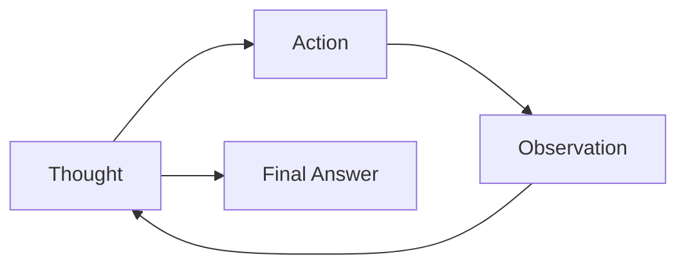

# Lesson 7: Planning and Reasoning

In our previous lessons, we've assembled the essential components for building AI systems. We learned to distinguish between structured LLM workflows and autonomous AI agents in Lesson 2, manage the flow of information with context engineering in Lesson 3, and ensure reliable data extraction with structured outputs in Lesson 4. We even gave our systems the ability to act using tools in Lesson 6. Yet, a crucial piece is missing. An LLM, by itself, is a powerful text generator, but it doesn't inherently know how to plan, adapt, or reason through a complex, multi-step task.

Simply giving an agent a set of tools is like handing a person a toolbox without any instructions. They might be able to hammer a nail, but they can't build a house. To move from simple actions to complex projects, an agent needs a "brain"—a mechanism for planning and reasoning. This lesson introduces these foundational ingredients of agentic behavior. We will explore core strategies like ReAct and Plan-and-Execute that give agents the ability to think, decompose problems, and self-correct, transforming them from simple tools into capable partners.

In this lesson, we will cover:
- Why models without explicit reasoning fail at complex tasks.
- How Chain-of-Thought prompting teaches models to "think" and its limitations.
- The foundational patterns of ReAct and Plan-and-Execute.
- How these patterns appear in real-world systems.
- The evolution of reasoning in modern models.
- Advanced capabilities unlocked by planning, such as goal decomposition and self-correction.

## What a Non-Reasoning Model Does And Why It Fails on Complex Tasks

To understand the need for planning, let's consider a "Technical Research Assistant Agent." Its goal is to produce a comprehensive report on the "Latest developments in edge AI deployment." This involves finding recent papers, summarizing their findings, identifying trends, and writing a structured report.

A non-reasoning model, when given this task, treats it as a single, large text generation problem. It tries to "answer" the request in one go. It might call the right tools, perhaps searching for papers and then summarizing them, but it does so without a coherent, adaptive strategy. It follows a pre-conceived pattern without analyzing the results of its actions.

This approach quickly breaks down when faced with complexity. The agent might produce a superficial summary because it doesn't have an internal goal to cross-reference multiple sources. It won't iterate on its findings or verify conflicting information because it lacks a mechanism to analyze its own outputs. Since there is no explicit breakdown of sub-goals, it often misses critical steps like checking the credibility of a source or identifying gaps in the research. The performance of such an agent drops significantly, often misunderstanding the task's intent or stopping too early [[3]](https://arxiv.org/html/2606.07462v1). These models rely on pattern matching and often fail on unfamiliar tasks, lacking the ability to adapt beyond their training data [[1]](https://www.narrativa.com/ai-reasoning-vs-non-reasoning-models-key-differences-explained).

As we saw in previous lessons, LLM workflows and structured outputs provide modularity and reliability for predictable processes. Tools give our systems the ability to act. However, for complex tasks where adaptation is key—the very tasks where agents excel—this is not enough. To address this, we must first teach the model to create a reasoning trace before it provides an answer.

## Teaching Models to “Think” Chain-of-Thought and Its Limits

The first step toward more intelligent agents was teaching models to "think" before they act. This is the core idea behind Chain-of-Thought (CoT) prompting. Just as humans often talk themselves through a problem, we can instruct an LLM to write down its reasoning steps before giving the final answer [[24]](https://magazine.sebastianraschka.com/p/understanding-reasoning-llms). This simple technique unlocks a primitive form of planning.

For our Technical Research Assistant Agent, a CoT prompt might look like this: *"Before answering, think step by step about how you will research and verify sources on edge AI deployment. Then provide the final report."*

The model would first generate a high-level plan, something like:
1.  Search for recent papers on edge AI deployment from reputable sources.
2.  Read the abstracts to identify the most relevant ones.
3.  Compare the findings and identify common trends and conflicts.
4.  Synthesize the information into a structured report.

This is a significant improvement. The model is no longer just reacting; it's formulating a strategy. However, CoT has its limits. The reasoning trace and the final answer are generated together as a single block of text, which is difficult to parse and control programmatically. More importantly, the model typically generates the plan once and then follows it. It doesn't create an iterative loop where it can act, observe the result, and then refine its plan. CoT is a heuristic that guides the LLM, but it's not a sophisticated planning algorithm that can explore alternatives or backtrack from dead ends [[7]](https://apxml.com/courses/intro-llm-agents/chapter-5-basic-agent-planning/guiding-agent-reasoning-chain-of-thought). To gain more structure and control, we need to separate the act of planning from the act of answering.

## Separating Planning from Answering Foundations of ReAct and Plan-and-Execute

The next logical step in agent design is to create a clear separation between planning and execution. Instead of generating a single, monolithic block of text that mixes thought and action, we ask the model to perform these as two distinct steps, either interleaved or in separate phases.

This separation is the foundation for two of the most influential patterns in agent architecture: ReAct and Plan-and-Execute.

-   **ReAct (Reason + Act)** interleaves `Thought`, `Action`, and `Observation` in a tight loop. The agent thinks, acts, sees what happens, and then thinks again.
-   **Plan-and-Execute** separates the process into two distinct phases. First, the agent creates a comprehensive plan. Then, it executes that plan step-by-step.

These two patterns are foundational, but they are part of a broader family of agentic strategies. Other notable approaches include Tree-of-Thoughts, where an agent explores multiple reasoning paths in parallel, and Reflexion, where an agent critiques its own past actions to refine its strategy for future attempts [[40]](https://medium.com/@nraman.n6/architectural-taxonomy-of-modern-ai-systems-modular-vertical-agentic-and-hybrid-implementations-5f3f0f0d95b9).

This separation provides clear benefits. It gives us greater control and makes the agent's behavior more interpretable. We can inspect the plan before it's executed and analyze the reasoning behind each action. Most importantly, it enables iterative loops. An observation from the environment—like a search result or an error message—can be fed back into the model to update its plan. This feedback loop is what allows an agent to adapt and recover from mistakes.

First, we will explore the ReAct pattern in more detail.

## ReAct in Depth Loop, Evolving Example, Pros and Cons

The ReAct pattern emerged to bridge the gap between the internal, ungrounded reasoning of Chain-of-Thought and the blind, reactive nature of action-only models [[38]](https://arxiv.org/pdf/2210.03629). It was inspired by the synergy between reasoning and acting in human problem-solving [[36]](https://research.google/blog/react-synergizing-reasoning-and-acting-in-language-models). The core idea is to create an iterative loop where the model generates a reasoning trace (`Thought`), then an `Action` to take, and finally receives an `Observation` from the environment. This observation then informs the next `Thought`, creating a dynamic feedback cycle [[12]](https://apxml.com/courses/getting-started-with-llm-toolkit/chapter-8-developing-autonomous-agents/react-pattern-for-agents).

Image 1: Flowchart illustrating the iterative ReAct loop.

Let's see how our Technical Research Assistant Agent would use the ReAct loop to complete its task.

*   **Step 1**
    *   **Thought:** I need to find recent, trustworthy sources on edge AI deployment. I should start by searching for survey papers and industry reports from the last year.
    *   **Action:** `search("latest developments in edge AI deployment 2024 site:arxiv.org OR site:acm.org")`
    *   **Observation:** A list of 10 papers is returned, including titles, authors, and abstracts.

*   **Step 2**
    *   **Thought:** The search returned several promising papers. I will select the top 3 based on their titles and abstracts, prioritizing those that mention performance metrics and real-world case studies.
    *   **Action:** `fetch_and_extract(urls=["arxiv.org/abs/2401.1234", "acm.org/doi/10.1145/12345"])`
    *   **Observation:** The full text of two papers and an abstract for the third are extracted.

*   **Step 3**
    *   **Thought:** I have the content of the papers. Now I need to summarize each one and identify key claims, particularly regarding adoption rates. I will look for conflicting information.
    *   **Action:** `summarize_and_compare(texts=[paper1_text, paper2_text])`
    *   **Observation:** "Paper A claims a 40% adoption rate in manufacturing. Paper B, a survey from a different region, reports a 25% adoption rate."

*   **Step 4**
    *   **Thought:** I have detected a conflict in the adoption rates. This is a critical point that needs to be resolved. I should search for a third-party market analysis to verify these claims.
    *   **Action:** `search("edge AI deployment adoption rate market analysis 2024")`
    *   **Observation:** A report from a major analyst firm is found, which explains the regional differences in adoption rates.

*   **Step 5**
    *   **Thought:** The market analysis report clarifies the discrepancy. I can now synthesize my findings, explain the different adoption rates, and identify trends and gaps. I have enough information to write the final report.
    *   **Action:** `finish(report_text="...")`

This example shows the power of the ReAct loop. The agent is not just following a static plan; it is actively reasoning, gathering information, and adapting its strategy based on what it learns.

The main advantages of this pattern are its high interpretability and its natural ability to handle errors and unexpected outcomes [[11]](https://mbrenndoerfer.com/writing/react-pattern-llm-reasoning-action-agents). The `Observation` step is particularly effective at reducing hallucinations, as it forces the model to ground its internal reasoning against external, factual information. This feedback loop helps constrain the model's responses to what can be verified, minimizing the generation of incorrect or unfounded information [[41]](https://arxiv.org/html/2507.22915v1). It is particularly well-suited for exploratory tasks where the path to the solution is not clear from the start. However, this flexibility comes at a cost. ReAct can be slower and more computationally expensive than other methods due to the multiple LLM calls. It also requires careful prompt engineering and robust tooling to work reliably.

For tasks where the overall structure is more predictable, the Plan-and-Execute pattern can offer a more efficient and reliable alternative.

## Plan-and-Execute in Depth Plan, Execution, Pros and Cons

The Plan-and-Execute approach offers a more structured alternative to ReAct. Instead of interleaving thought and action at each step, this pattern separates the entire process into two distinct phases: first, the agent generates a comprehensive, high-level plan, and second, it executes that plan step-by-step [[16]](https://openreview.net/forum?id=ybA4EcMmUZ). This separation allows the model to balance high-level objectives with low-level execution details.

Image 2: A flowchart depicting the Plan-and-Execute approach with two distinct phases: Planning and Execution.

Let's revisit our Technical Research Assistant Agent to see how it would operate using this pattern.

**Phase 1: Planning**
The agent is first prompted to generate a detailed, step-by-step plan to accomplish the goal. The output of this phase is not an action, but the plan itself.

*   **Planner Output:**
    1.  **Define Scope:** Identify the key areas to cover in the report: recent advancements, key technologies, adoption trends, challenges, and future outlook.
    2.  **Source Identification:** Perform targeted searches on academic databases (arXiv, Google Scholar) and industry news sites for documents published in the last 18 months.
    3.  **Source Selection:** From the search results, select the 5 most relevant and credible sources, prioritizing a mix of survey papers, case studies, and market reports.
    4.  **Information Extraction:** For each selected source, extract key findings, statistics, and conclusions related to the defined scope.
    5.  **Synthesis and Analysis:** Consolidate the extracted information, compare findings across sources, identify common trends, and note any contradictions or gaps.
    6.  **Outline Generation:** Create a structured outline for the final report based on the synthesized information.
    7.  **Report Writing:** Write the full report following the outline, ensuring all claims are supported by citations.

**Phase 2: Execution**
Once the plan is generated, an "executor" agent (or a series of tool calls) begins to carry out each step. The executor focuses on a single task at a time, using the plan as its guide.

1.  The executor runs `search("review paper edge AI deployment 2023-2024")`.
2.  It then runs `search("industry report edge AI market trends 2024")`.
3.  Based on the results, it selects the top 5 URLs and calls `fetch_and_extract()` for each.
4.  It passes the extracted texts to a `summarize()` tool.
5.  It synthesizes the summaries, perhaps using another LLM call with a specific prompt for this task.
6.  Finally, it generates the outline and then the full report.

Unlike ReAct, where the plan evolves with each step, the Plan-and-Execute model follows a more rigid path. Re-planning typically only happens when a step fails or the environment returns an unexpected result that invalidates the rest of the plan [[57]](https://openreview.net/forum?id=ybA4EcMmUZ).

The primary advantage of this approach is its efficiency and predictability, especially for well-defined tasks. By creating a plan upfront, the agent can reduce the number of LLM calls and avoid getting sidetracked. This makes it easier to estimate the cost and time required for a task. However, this rigidity is also its main drawback. The pattern is less suited for highly exploratory problems where the path forward is unknown. If the initial plan is flawed, the agent may waste resources executing it before realizing a course correction is needed.

## Where This Shows Up in Practice Deep Research–Style Systems

The planning and reasoning patterns we've discussed are not just theoretical constructs; they are the engines behind powerful, real-world AI systems. A prime example is what we can call "deep research" systems, which are designed to tackle complex, long-horizon research tasks that can take a human researcher hours or even days to complete [[28]](https://www.jonkrohn.com/posts/2025/3/17/openais-deep-research-get-days-of-human-work-done-in-minutes).

These systems operationalize the iterative cycles of planning, acting, and verification at a large scale. When tasked with a complex query, a deep research agent decomposes it into a series of sub-goals. For our Technical Research Assistant Agent, this might involve dozens of micro-cycles: searching for a paper, reading its abstract, deciding if it's relevant, extracting key statistics, cross-verifying those stats with another source, and updating an internal summary or knowledge base [[27]](https://blog.promptlayer.com/how-deep-research-works).

Many of these systems are built on a ReAct-like loop, using strong system prompts and a rich set of tools to guide the agent's behavior. They often include explicit policies to enforce verification and reduce hallucinations, such as requiring multiple sources for any factual claim. Others are closer to a Plan-and-Execute model, where an initial research strategy is formulated and then executed, with periodic checkpoints to allow for re-planning if the agent hits a dead end or uncovers conflicting information [[27]](https://blog.promptlayer.com/how-deep-research-works).

The success of these systems shows that while the underlying patterns are simple, their power comes from robust implementation with well-defined tools, clear error handling, and effective state management. However, these long-horizon systems face significant scalability challenges. As the agent interacts with its environment, its interaction history grows, leading to context overload that can cause it to lose track of the original goal. Furthermore, in a long chain of steps, a single local failure can cascade and derail the entire plan, a problem known as error propagation [[42]](https://www.emergentmind.com/topics/long-horizon-agent-planning). As models become more capable, some of this explicit orchestration is becoming more implicit, with models generating separate "thinking" and "answer" streams.

## Modern Reasoning Models Thinking vs Answer Streams and Interleaved Thinking

As LLMs have evolved, they have started to internalize some of the planning and reasoning structures that we previously had to engineer with explicit prompts and loops. Many modern reasoning models are now specifically trained to separate their internal thought process from their final output, a feature often described as having a private "thinking" stream and a public "answer" stream [[22]](https://www.ibm.com/think/topics/reasoning-model), [[23]](https://cameronrwolfe.substack.com/p/demystifying-reasoning-models).

This logical separation is fundamental. The model first generates a long chain of thought—often in a special `<think>` block—where it breaks down the problem, explores different approaches, and refines its plan. Only after this internal reasoning is complete does it generate the final, user-facing answer [[23]](https://cameronrwolfe.substack.com/p/demystifying-reasoning-models). This "think-first" approach allows the model to spend more computational effort on complex problems, which has been shown to yield significant performance improvements on reasoning tasks [[22]](https://www.ibm.com/think/topics/reasoning-model). For the user, this process can be either hidden or presented as a summarized "thinking..." step, similar to what you might see in ChatGPT [[24]](https://magazine.sebastianraschka.com/p/understanding-reasoning-llms).

An even more advanced capability is **interleaved thinking**, which is particularly useful for agents that use tools. With interleaved thinking, the model doesn't just think once at the beginning. Instead, it can generate a `thought`, call a `tool`, receive the `result`, and then generate *another* `thought` to process that result before deciding on the next action or producing the final answer. This allows the agent to reason about the output of its actions in real-time, creating a more dynamic and responsive loop that closely mirrors the ReAct pattern, but is built into the model's behavior [[136]](https://docs.anthropic.com/en/docs/build-with-claude/extended-thinking#interleaved-thinking). Some models can even think, write, and process new inputs concurrently, pausing their output stream if they need more time to reason about the next step [[21]](https://arxiv.org/html/2512.10931v1).

What does this mean for us as AI engineers? While these increasingly sophisticated models handle more of the reasoning process internally, it doesn't make the patterns we've discussed obsolete. We still need to provide clear instructions, well-defined tools, and robust guardrails. The separation of reasoning and answering, even when handled by the model, remains a powerful concept for debugging and maintaining control. Understanding the underlying logic of ReAct and Plan-and-Execute helps us design better prompts and interpret the behavior of even the most advanced agents. With these foundational planning and reasoning capabilities in place, agents can unlock more advanced behaviors like goal decomposition and self-correction.

## Advanced Agent Capabilities Enabled by Planning Goal Decomposition and Self-Correction

Effective planning and reasoning are not just about following a series of steps; they are about creating and adapting those steps. Two of the most important advanced capabilities that emerge from a well-designed agent architecture are goal decomposition and self-correction.

**Goal decomposition** is the ability to break a large, complex task into smaller, more manageable sub-goals. This concept has deep roots in classical AI planning, which has long used algorithms like STRIPS and hierarchical task networks to decompose goals into executable steps [[43]](https://arxiv.org/html/2503.12687v1). For our Technical Research Assistant Agent, the high-level goal "write a report" is decomposed into sub-goals like "find sources," "verify information," "synthesize findings," and "draft outline." In a ReAct-style agent, this decomposition often happens implicitly within the `Thought` steps, as the agent reasons about what it needs to do next. We can encourage this behavior with prompts that guide the agent to think about sub-tasks and dependencies.

**Self-correction** is the agent's ability to detect when something has gone wrong and adjust its plan accordingly. This is where the feedback loop in agentic systems becomes critical. Let's return to the example where our agent found conflicting adoption rates (40% vs. 25%). A non-reasoning system might just report both numbers or arbitrarily pick one. An agent capable of self-correction, however, recognizes the contradiction as a failure state. It can then insert a new "verification" sub-goal into its plan, decide to search for a new, more authoritative source, and use that information to resolve the conflict before proceeding [[32]](https://aclanthology.org/2025.acl-long.1104.pdf).

Even with powerful modern models that have built-in reasoning capabilities, the explicit patterns of ReAct and Plan-and-Execute remain valuable. They provide a clear structure for debugging, ensuring consistency, and giving us a shared mental model of how the agent is "thinking." They are the scaffolding that allows us to build reliable and predictable systems.

These concepts of planning, reasoning, and adaptation are the core of agentic AI. In the next lesson, Lesson 8, we will get our hands dirty and implement the ReAct pattern from scratch. Soon after, we will explore how agents remember information with memory systems in Lesson 9, how they retrieve external knowledge in our RAG deep dive in Lesson 10, and how they handle complex data formats in Lesson 11.

## Conclusion

In this lesson, we explored the critical shift from simple instruction-following to dynamic planning and reasoning. We saw that without these capabilities, LLMs fail on complex tasks that require adaptation and multi-step execution. Foundational patterns like Chain-of-Thought, ReAct, and Plan-and-Execute provide the structure needed to transform LLMs from mere text generators into capable, autonomous agents.

Understanding these patterns is not just an academic exercise. They are the building blocks for creating robust, interpretable, and effective AI systems. As we move forward in this course, these concepts will be the foundation upon which we build more advanced agents with memory, knowledge, and the ability to interact with a complex, multimodal world.

## References

- [1]  https://www.narrativa.com/ai-reasoning-vs-non-reasoning-models-key-differences-explained
- [2]  https://www.kuppingercole.com/research/lb80993/fundamental-scaling-limitations-in-ai-reasoning-models
- [3]  https://arxiv.org/html/2606.07462v1
- [4]  https://developers.openai.com/api/docs/guides/reasoning-best-practices
- [5]  https://www.linkedin.com/posts/skphd_agent-laboratory-using-llm-agents-as-research-activity-7283233189651738625-q6xU
- [6]  https://www.emergentmind.com/topics/chain-of-thought-and-planning-agents
- [7]  https://apxml.com/courses/intro-llm-agents/chapter-5-basic-agent-planning/guiding-agent-reasoning-chain-of-thought
- [8]  https://mbrenndoerfer.com/writing/step-by-step-problem-solving-chain-of-thought-reasoning
- [9]  https://www.comet.com/site/blog/chain-of-thought-prompting
- [10]  https://www.ibm.com/think/topics/chain-of-thoughts
- [11]  https://mbrenndoerfer.com/writing/react-pattern-llm-reasoning-action-agents
- [12]  https://apxml.com/courses/getting-started-with-llm-toolkit/chapter-8-developing-autonomous-agents/react-pattern-for-agents
- [13]  https://www.mindstudio.ai/blog/what-is-react-loop-ai-agent-reasoning
- [14]  https://www.salesforce.com/agentforce/ai-agents/react-agents
- [15]  https://www.ibm.com/think/topics/react-agent
- [16]  https://openreview.net/forum?id=ybA4EcMmUZ
- [17]  https://www.ibm.com/think/topics/agentic-reasoning
- [18]  https://www.ibm.com/think/topics/ai-agent-orchestration
- [19]  https://www.anthropic.com/engineering/building-effective-agents
- [20]  https://arxiv.org/pdf/2504.19678
- [21]  https://arxiv.org/html/2512.10931v1
- [22]  https://www.ibm.com/think/topics/reasoning-model
- [23]  https://cameronrwolfe.substack.com/p/demystifying-reasoning-models
- [24]  https://magazine.sebastianraschka.com/p/understanding-reasoning-llms
- [25]  https://arxiv.org/html/2601.10825v1
- [26]  https://arxiv.org/html/2603.28376v1
- [27]  https://blog.promptlayer.com/how-deep-research-works
- [28]  https://www.jonkrohn.com/posts/2025/3/17/openais-deep-research-get-days-of-human-work-done-in-minutes
- [29]  https://www.ibm.com/think/insights/ai-agents-2025-expectations-vs-reality
- [30]  https://cdn.openai.com/deep-research-system-card.pdf
- [31]  https://blogs.nvidia.com/blog/reasoning-ai-agents-decision-making/
- [32]  https://aclanthology.org/2025.acl-long.1104.pdf
- [33]  https://cdn.openai.com/business-guides-and-resources/a-practical-guide-to-building-agents.pdf
- [34]  https://www.ibm.com/think/topics/ai-agent-planning
- [35]  https://metr.org/blog/2025-03-19-measuring-ai-ability-to-complete-long-tasks/
- [36]  https://research.google/blog/react-synergizing-reasoning-and-acting-in-language-models
- [37]  https://docs.anthropic.com/en/docs/build-with-claude/extended-thinking#interleaved-thinking
- [38]  https://arxiv.org/pdf/2210.03629
- [39]  https://www.ibm.com/think/topics/tree-of-thoughts
- [40]  https://medium.com/@nraman.n6/architectural-taxonomy-of-modern-ai-systems-modular-vertical-agentic-and-hybrid-implementations-5f3f0f0d95b9
- [41]  https://arxiv.org/html/2507.22915v1
- [42]  https://www.emergentmind.com/topics/long-horizon-agent-planning
- [43]  https://arxiv.org/html/2503.12687v1