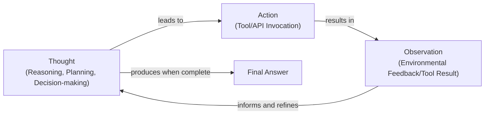
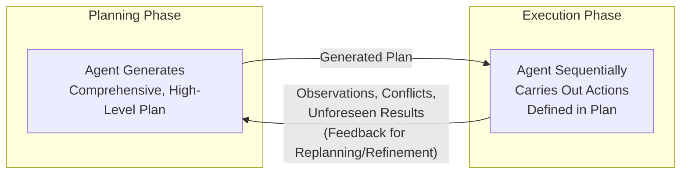

# Lesson 7: Agentic Planning and Reasoning

In our previous lessons, we built a solid foundation for AI engineering. We covered the difference between LLM workflows and AI agents, the art of context engineering, how to get structured outputs, and how to give agents tools to take action. So far, we have focused on building systems with predictable logic. Workflows gave us modularity, structured outputs provided reliability, and tools enabled actions.

However, these components alone are not enough for the complex, unpredictable tasks that are best suited for agents. When an agent needs to adapt to unforeseen results, correct its own mistakes, or break down a large goal into smaller steps, it needs more than just a set of tools. It needs the ability to plan and reason. This lesson introduces the foundational patterns that teach an LLM how to "think" before it acts, transforming it from a simple tool-user into a more autonomous problem-solver.

## What a Non-Reasoning Model Does And Why It Fails on Complex Tasks

Let's imagine you are building a "Technical Research Assistant Agent." Your goal is to give it a high-level task, like "Create a comprehensive report on the latest developments in edge AI deployment," and have it autonomously find recent papers, summarize their findings, identify trends, and write a structured report.

If you give this task to a standard, non-reasoning agent, it will try to "answer" the request in a single pass. It might call some tools, perhaps even in the right order, but it treats the entire complex task as one continuous response generation [[1]](https://arxiv.org/html/2606.07462v1), [[2]](https://developers.openai.com/api/docs/guides/reasoning-best-practices). The agent does not create an explicit plan, nor does it stop to analyze the results of its actions before moving to the next step.

This approach quickly falls apart on complex tasks. The agent might produce a superficial summary or miss crucial steps like comparing sources or verifying conflicting information. Because there is no explicit breakdown of sub-goals, it has no mechanism to iterate on partial results or correct its course when it hits a dead end [[3]](https://www.kuppingercole.com/research/lb80993/fundamental-scaling-limitations-in-ai-reasoning-models). This is the primary bottleneck for autonomous research: the intrinsic reasoning capability of the underlying model determines its success [[1]](https://arxiv.org/html/2606.07462v1).

The skills we have learned so far are essential. Workflows and structured outputs give us control when the process is predictable, and tools allow agents to interact with the world. However, for an agent to handle the ambiguity and dynamic nature of a research task, it needs a way to manage its own thought process. To address this, we first need to teach the model to produce a reasoning trace, to think before it answers.

## Teaching Models to “Think”: Chain-of-Thought and Its Limits

One of the first major breakthroughs in LLM reasoning was a surprisingly simple technique called Chain-of-Thought (CoT) prompting. The core idea is to ask the model to "think out loud" or "think step by step" before giving its final answer. Just as humans often talk themselves through a problem, CoT encourages the LLM to generate a series of intermediate reasoning steps that lead to a conclusion [[4]](https://arxiv.org/pdf/2504.19678), [[5]](https://research.google/blog/react-synergizing-reasoning-and-acting-in-language-models). This simple addition to the prompt adds planning power and allows the model to break down a problem.

For our research assistant agent, a CoT prompt might look something like this: *"Before answering, think step by step about how you will research and verify sources on edge AI deployment. Then provide the final report."*

With this prompt, the model’s behavior changes. Instead of jumping straight to an answer, it first drafts a high-level plan, such as: "First, I will search for recent academic papers and industry reports. Second, I will read the abstracts to select the most relevant sources. Third, I will compare their findings. Finally, I will synthesize the information into a structured report."

While CoT improves reasoning, it has significant limitations for building agents [[6]](https://apxml.com/courses/intro-llm-agents/chapter-5-basic-agent-planning/guiding-agent-reasoning-chain-of-thought). The reasoning trace and the final answer are mixed together in a single block of text, which is difficult for a system to parse and control. More importantly, CoT is often a one-shot plan. The model generates its reasoning upfront but does not have a built-in mechanism to execute the plan as an iterative loop, where it can act, observe the results, and then refine its next steps. It is a heuristic that guides the model, not a sophisticated planning algorithm [[6]](https://apxml.com/courses/intro-llm-agents/chapter-5-basic-agent-planning/guiding-agent-reasoning-chain-of-thought), [[7]](https://www.comet.com/site/blog/chain-of-thought-prompting).

To gain the structure and control needed for a true agent, we need to go a step further and formally separate the act of planning from the act of answering. This separation is the foundation of two of the most important patterns in agent design: ReAct and Plan-and-Execute.

## Separating Planning from Answering: Foundations of ReAct and Plan-and-Execute

The key insight that moves us from simple CoT to true agentic behavior is the explicit separation of reasoning and acting. Instead of asking the model to produce a single, monolithic block of text containing both its thoughts and its final answer, we design a system that treats them as distinct phases. This separation gives us far more control, interpretability, and reliability [[8]](https://www.ibm.com/think/topics/ai-agent-planning), [[9]](https://www.anthropic.com/engineering/building-effective-agents).

This architectural split mirrors a long-standing concept in cognitive science known as dual-process theory. This theory posits that human thought operates with two systems: a fast, intuitive, and associative "System 1," and a slow, deliberate, and rule-based "System 2" [[10]](https://www.frontiersin.org/journals/cognition/articles/10.3389/fcogn.2024.1356941/full). Agentic reasoning patterns essentially build an externalized "System 2" for the LLM, which is naturally a "System 1" thinker.

By separating these two functions, we enable an iterative loop. The agent can think, then act, then observe the result of that action, and then use that observation to inform its next thought. This feedback loop is what allows an agent to handle unexpected outcomes, correct mistakes, and dynamically adjust its plan. It also makes the agent's behavior much easier to debug, as we can clearly see the reasoning behind each action.

This fundamental idea has given rise to two classic agent architectures that are still highly relevant today:

1.  **ReAct (Reason + Act):** This pattern interleaves reasoning and acting in a tight loop. The agent generates a thought, then an action, then an observation, and repeats this cycle until the task is complete.
2.  **Plan-and-Execute:** This pattern involves two distinct phases. First, the agent creates a comprehensive, high-level plan. Then, it enters an execution phase where it carries out the steps of that plan.

These two patterns represent different strategies for structuring an agent's thought process. In the next section, we will take a deep dive into ReAct, using our research-assistant example to see it in action.

## ReAct in Depth: Loop, Evolving Example, Pros and Cons

The ReAct (Reason + Act) framework was a pivotal development that bridged the gap between abstract reasoning, like in Chain-of-Thought, and action-oriented systems. It was inspired by the way humans seamlessly combine internal monologue with external actions to solve problems [[11]](https://arxiv.org/pdf/2210.03629). Instead of generating a complete plan upfront, a ReAct agent operates in a tight, iterative loop of **Thought → Action → Observation**.

-   **Thought:** The LLM analyzes the goal and its history to form a plan for the next immediate step. This is its internal reasoning.
-   **Action:** Based on its thought, the LLM chooses a tool and the specific inputs for it.
-   **Observation:** The system executes the action and returns the result (e.g., an API response, web page content, or an error) to the agent. This new information is added to the agent's context, informing its next thought.

This cycle repeats until the agent determines it has enough information to provide a final answer [[12]](https://apxml.com/courses/getting-started-with-llm-toolkit/chapter-8-developing-autonomous-agents/react-pattern-for-agents).

Image 1: A Mermaid diagram illustrating the iterative ReAct (Reasoning + Acting) loop.

Let's see how our "Technical Research Assistant Agent" would tackle its task using the ReAct pattern:

-   **Thought 1:** "I need to find recent and trustworthy sources on edge AI deployment. I should start by searching for academic papers and industry reports from 2024 onwards."
-   **Action 1:** `search("latest developments in edge AI deployment 2024 site:arxiv.org OR site:nature.com")`
-   **Observation 1:** The search returns a list of five papers with their URLs and titles.
-   **Thought 2:** "The search results look promising. I will select the top three most relevant papers based on their titles and fetch their content to extract abstracts and key findings."
-   **Action 2:** `fetch_and_extract(["url_1", "url_2", "url_3"])`
-   **Observation 2:** The tool returns the extracted text from the three papers.
-   **Thought 3:** "Now I have the content. I need to summarize each source and specifically look for claims about market adoption rates. I will compare these claims and flag any conflicts."
-   **Action 3:** `summarize_and_compare(extractions)`
-   **Observation 3:** "Paper A claims a 40% adoption rate in manufacturing. Paper B claims a 25% adoption rate."
-   **Thought 4:** "There is a conflict in the adoption rates. I need to find a third-party market analysis to resolve this discrepancy. I will search for a market report."
-   **Action 4:** `search("edge AI deployment adoption market analysis 2024")`
-   **Observation 4:** A link to a credible market analysis report is found.
-   **Thought 5:** "I have found a report that can resolve the conflict. I will use it to finalize the trends and gaps section of my report. I now have all the necessary information."
-   **Final Answer:** The agent generates the structured report, complete with citations and a note explaining how the conflicting statistics were resolved.

This example highlights the strengths of ReAct. It is highly interpretable, as each action is justified by a preceding thought. It is also robust, as the observation step creates a natural feedback loop for error recovery [[13]](https://mbrenndoerfer.com/writing/react-pattern-llm-reasoning-action-agents). However, this iterative process can be slower and more computationally expensive than other methods. It also requires careful design of tools and a robust control loop to prevent the agent from getting stuck in repetitive cycles [[14]](https://www.ibm.com/think/topics/agentic-reasoning).

In production, these cycles manifest as specific failure modes. The most common is the **retry loop**, where an agent receives an error from a tool and repeatedly retries the same failed action without changing its strategy. Another insidious failure is **chained corruption**, where a single malformed tool argument in an early step silently corrupts all subsequent steps that depend on its output, leading to a final answer that is subtly wrong without any obvious error [[15]](https://latitude.so/blog/ai-agent-failure-detection-guide).

While ReAct excels at exploratory tasks where the path is not clear, for problems with a more predictable structure, the Plan-and-Execute pattern can offer a more efficient and reliable alternative.

## Plan-and-Execute in Depth: Plan, Execution, Pros and Cons

While ReAct provides a strong foundation, its reasoning typically focuses only on the immediate next action. This makes it less suited for complex tasks that require long-term planning and executing a long sequence of dependent actions [[16]](https://arxiv.org/html/2505.09970v2). To address this limitation, the Plan-and-Execute pattern offers a more structured alternative. Instead of interleaving thought and action at every step, this approach separates the agent's process into two distinct phases: Planning and Execution [[17]](https://openreview.net/forum?id=ybA4EcMmUZ). This is similar to how a head chef first designs the entire menu (the plan) and then the line cooks carry out the specific recipes (the execution).

Image 2: A Mermaid diagram illustrating the Plan-and-Execute agentic strategy with distinct planning and execution phases and a feedback loop for iterative refinement.

### The Planning Phase

In this initial phase, the agent takes the user's high-level goal and decomposes it into a detailed, step-by-step plan. The LLM is prompted to think through the entire task from start to finish and produce a sequence of actions. This plan is generated upfront, before any tools are executed. The goal is to create a complete and logical workflow that, if followed correctly, will achieve the objective [[8]](https://www.ibm.com/think/topics/ai-agent-planning).

For our "Technical Research Assistant Agent," the output of the planning phase might be a structured list like this:

1.  **Define Scope:** Clarify the key aspects of "edge AI deployment" to focus on, such as hardware, software, and industry use cases.
2.  **Source Identification:** Perform parallel searches on Google Scholar, arXiv, and industry news sites to gather a diverse set of sources.
3.  **Source Selection:** From the search results, select the top 5 academic papers and 3 industry reports based on relevance, citation count, and publication date.
4.  **Content Extraction:** For each selected source, fetch the full text and extract the abstract, key findings, and any specific data points on market trends.
5.  **Data Synthesis:** Consolidate the extracted information, summarizing each source and identifying common themes, conflicting claims, and emerging trends.
6.  **Outline Generation:** Create a structured outline for the final report, including sections for an introduction, key developments, case studies, challenges, and future outlook.
7.  **Report Writing:** Write the full report based on the outline and synthesized data, ensuring all claims are supported by inline citations.
8.  **Final Review:** Read through the generated report to check for clarity, coherence, and factual accuracy.

### The Execution Phase

Once the plan is generated, the agent moves to the execution phase. It systematically carries out each step in the plan, calling the necessary tools in sequence. Unlike ReAct, the agent does not stop to reason between every single action. Instead, it follows the pre-defined roadmap.

However, this does not mean the process is completely rigid. A crucial part of a robust Plan-and-Execute system is a feedback loop for re-planning. If an action fails, returns unexpected results, or reveals that the initial plan was flawed, the agent can pause the execution, return to the planning phase to revise its strategy, and then resume execution [[17]](https://openreview.net/forum?id=ybA4EcMmUZ). For example, if Step 2 returns no relevant papers, the agent might re-plan to use different search keywords.

### Pros and Cons

The primary advantage of the Plan-and-Execute pattern is its efficiency and reliability for well-defined tasks. By creating a full plan upfront, the agent can often complete tasks with fewer LLM calls and in less time than a ReAct agent. The structure makes the process more predictable and easier to manage, which is valuable in production environments where cost and latency are important considerations.

The main drawback is its lack of flexibility. The agent is committed to its initial plan, and while it can re-plan, this is often a more "expensive" operation than the micro-adjustments made in a ReAct loop. For highly exploratory or unpredictable problems where the next step is entirely dependent on the outcome of the previous one, this upfront planning can be a disadvantage. The agent risks rigidly adhering to an imperfect plan and may struggle to adapt to dynamic environments.

These foundational ideas of iterative planning and verification are not just theoretical; they power some of the most advanced agentic systems in practice today, such as those designed for deep research.

## Where This Shows Up in Practice: Deep Research–Style Systems

The planning and reasoning patterns we have discussed are not just academic concepts; they are the architectural backbone of real-world agentic systems. A prime example is the category of "deep research" agents, which are designed to automate the kind of complex, long-horizon knowledge work our recurring example has explored [[18]](https://cdn.openai.com/deep-research-system-card.pdf).

Systems like OpenAI's Deep Research operationalize these patterns to tackle tasks that would take a human researcher hours or even days [[19]](https://www.jonkrohn.com/posts/2025/3/17/openais-deep-research-get-days-of-human-work-done-in-minutes). When given a complex query, these agents do not just return a single answer. Instead, they initiate an iterative process of planning, searching, reading, comparing, verifying, and synthesizing information from dozens of sources [[20]](https://blog.promptlayer.com/how-deep-research-works).

This process mirrors the patterns we have explored:

-   **Task Decomposition:** The agent first breaks down the high-level research question into a series of smaller, manageable sub-goals. This is the "planning" part of Plan-and-Execute.
-   **Iterative Cycles:** The agent then enters a loop of searching for information, extracting relevant content, and observing the results. This is the core of the ReAct pattern. If it finds conflicting data, like the different adoption rates in our example, it can spawn a new sub-task to verify the information before continuing.
-   **Verification and Grounding:** A key feature of these systems is their heavy reliance on grounding claims in evidence. They are explicitly prompted to reduce hallucinations and verify facts by cross-referencing multiple sources, often with a final step of generating a structured report with inline citations [[21]](https://arxiv.org/html/2603.28376v1).

In essence, many of these advanced systems are hybrids. They might use a Plan-and-Execute approach at a high level to structure the overall research process, while employing ReAct-like loops within each major step to handle the dynamic and unpredictable nature of web searches and content extraction.

As models become more powerful, some of this explicit, structured reasoning is becoming internalized. Modern reasoning models are now being trained to generate "thinking" and "answer" streams in parallel, making some of these patterns more implicit.

## Modern Reasoning Models: Thinking vs. Answer Streams and Interleaved Thinking

The evolution of agentic reasoning has moved from being purely a function of clever prompting (like with CoT and ReAct) to a capability that is increasingly built into the architecture of the models themselves. Modern reasoning models, are explicitly trained to separate their internal thought processes from their final, user-facing output [[22]](https://cameronrwolfe.substack.com/p/demystifying-reasoning-models).

This is often implemented through two concurrent streams of generation:

1.  **A private "thinking" stream:** This is where the model generates its chain of thought, analyzes the problem, formulates a plan, and decides which tools to use. This stream is analogous to the "Thought" part of a ReAct loop but happens internally. It is not always exposed to the user, though some APIs provide a summary of it for transparency [[23]](https://www.ibm.com/think/topics/reasoning-model).
2.  **A public "answer" stream:** This is the final, polished response that is visible to the user. It is informed by the private thinking stream but does not contain the messy, intermediate steps.

This dual-stream architecture allows the model to "think before it speaks." It can spend more computational effort on the private reasoning process to improve the quality and accuracy of the final answer [[24]](https://magazine.sebastianraschka.com/p/understanding-reasoning-llms). For example, a model might generate thousands of tokens in its private thinking stream to solve a complex math problem, but only output the final answer in the public stream.

One of the most powerful advancements in this area is **interleaved thinking**. In a traditional "think first" model, the entire reasoning process happens upfront, before any tools are called or any part of the answer is written. With interleaved thinking, the model can generate some thoughts, then call a tool, then generate more thoughts based on the tool's output, and so on. This allows for a much more dynamic and responsive reasoning process, very similar to the explicit ReAct loop but handled more natively by the model [[25]](https://docs.anthropic.com/en/docs/build-with-claude/extended-thinking#interleaved-thinking). This power, however, comes at a cost. Extended thinking with interleaved tool use can consume 5 to 10 times more tokens than a standard generation mode, a critical consideration for production systems where token economics matter [[26]](https://www.ikangai.com/the-ai-that-pauses-to-think-how-interleaved-reasoning-is-reshaping-autonomous-agents).

A fascinating implementation of this concept is **asynchronous reasoning**, where the thinking and writing streams run concurrently. The thinking stream can generate reasoning steps in the background while the writing stream starts delivering the answer to the user. If the thinking process encounters a difficult step and needs more time, it can programmatically "pause" the writer until it has figured out the next step. The model itself decides when to pause and resume, creating a real-time, interactive experience without sacrificing deep reasoning [[27]](https://arxiv.org/html/2512.10931v1). This is achieved by having the model periodically ask itself if its thoughts are far enough ahead of its response to continue writing.

What does this mean for us as AI engineers? Does the rise of powerful, built-in reasoning make patterns like ReAct and Plan-and-Execute obsolete?

Not at all. While models are getting better at managing their own thought processes, the explicit architectural patterns remain invaluable. They provide a clear structure for our agentic systems, making them easier to debug, control, and maintain. For example, even if a model supports interleaved thinking, wrapping it in a ReAct-style control loop gives us explicit checkpoints to inspect the agent's state, validate its actions, and enforce guardrails. The separation of reasoning and answering, whether managed by our code or by the model itself, remains a cornerstone of reliable agent design.

With these powerful planning and reasoning capabilities in place, agents can unlock even more advanced behaviors, such as decomposing complex goals and correcting their own mistakes.

## Advanced Agent Capabilities Enabled by Planning

Once an agent can plan, it unlocks more advanced behaviors like goal decomposition and self-correction. Goal decomposition is the process of breaking a large objective into smaller, concrete sub-goals [[8]](https://www.ibm.com/think/topics/ai-agent-planning). In ReAct-style agents, this happens implicitly in the "Thought" steps. In Plan-and-Execute systems, it is the central task of the initial planning phase.

Self-correction is the ability to detect failures or contradictions and adjust the plan. This relies on the feedback loop in reasoning architectures, where an agent observes an unexpected result and inserts a new sub-goal to fix it [[28]](https://aclanthology.org/2025.acl-long.1104.pdf). However, this is difficult in practice, as models often stubbornly adhere to an incorrect answer, and there is no standard verifier to determine the correctness of a generated thought during the process [[29]](https://aclanthology.org/2025.acl-long.203.pdf). For example, when our research agent found conflicting adoption rates (40% vs. 25%), it created a "verification" sub-goal to find a third-party source to resolve the discrepancy.

Explicit patterns like ReAct and Plan-and-Execute remain essential even with powerful models. They provide a predictable structure that improves debuggability, consistency, and our shared mental model for how agents think.

In our next lesson, Lesson 8, we will move from theory to practice and implement a ReAct agent from scratch. This hands-on experience will solidify the concepts we have discussed and prepare you for building more advanced systems, including those with sophisticated memory (Lesson 9), knowledge-augmented retrieval (Lesson 10), and multimodal processing capabilities (Lesson 11).

## References

- [1]  [How does a non-reasoning model behave on the Technical Research Assistant Agent task?](https://arxiv.org/html/2606.07462v1)
- [2]  [Reasoning Best Practices](https://developers.openai.com/api/docs/guides/reasoning-best-practices)
- [3]  [Fundamental Scaling Limitations in AI Reasoning Models](https://www.kuppingercole.com/research/lb80993/fundamental-scaling-limitations-in-ai-reasoning-models)
- [4]  [From LLM Reasoning to Autonomous AI Agents: A Comprehensive Review](https://arxiv.org/pdf/2504.19678)
- [5]  [ReAct - Google](https://research.google/blog/react-synergizing-reasoning-and-acting-in-language-models)
- [6]  [Guiding Agent Reasoning with Chain-of-Thought](https://apxml.com/courses/intro-llm-agents/chapter-5-basic-agent-planning/guiding-agent-reasoning-chain-of-thought)
- [7]  [Chain-of-Thought Prompting](https://www.comet.com/site/blog/chain-of-thought-prompting)
- [8]  [AI Agent Planning - IBM](https://www.ibm.com/think/topics/ai-agent-planning)
- [9]  [Building effective agents - Anthropic](https://www.anthropic.com/engineering/building-effective-agents)
- [10]  [Dual-process theories of thought as potential architectures for developing neuro-symbolic AI models](https://www.frontiersin.org/journals/cognition/articles/10.3389/fcogn.2024.1356941/full)
- [11]  [ReAct: Synergizing Reasoning and Acting in Language Models](https://arxiv.org/pdf/2210.03629)
- [12]  [ReAct Pattern for Agents](https://apxml.com/courses/getting-started-with-llm-toolkit/chapter-8-developing-autonomous-agents/react-pattern-for-agents)
- [13]  [ReAct Pattern for LLM Reasoning and Action Agents](https://mbrenndoerfer.com/writing/react-pattern-llm-reasoning-action-agents)
- [14]  [Agentic Reasoning - IBM](https://www.ibm.com/think/topics/agentic-reasoning)
- [15]  [Detecting AI Agent Failure Modes in Production](https://latitude.so/blog/ai-agent-failure-detection-guide)
- [16]  [Pre-Act: A Plan-Ahead and Execute Framework for Large Language Model Agents](https://arxiv.org/html/2505.09970v2)
- [17]  [Plan-and-Act: Improving Planning of Agents for Long-Horizon Tasks](https://openreview.net/forum?id=ybA4EcMmUZ)
- [18]  [Deep Research System Card](https://cdn.openai.com/deep-research-system-card.pdf)
- [19]  [OpenAI's Deep Research: Get Days of Human Work Done in Minutes](https://www.jonkrohn.com/posts/2025/3/17/openais-deep-research-get-days-of-human-work-done-in-minutes)
- [20]  [How Deep Research Works](https://blog.promptlayer.com/how-deep-research-works)
- [21]  [How deep research systems use iterative verification cycles](https://arxiv.org/html/2603.28376v1)
- [22]  [Demystifying Reasoning Models](https://cameronrwolfe.substack.com/p/demystifying-reasoning-models)
- [23]  [Reasoning Model - IBM](https://www.ibm.com/think/topics/reasoning-model)
- [24]  [Understanding Reasoning LLMs](https://magazine.sebastianraschka.com/p/understanding-reasoning-llms)
- [25]  [Interleaved Thinking for Reasoning LLMs](https://docs.anthropic.com/en/docs/build-with-claude/extended-thinking#interleaved-thinking)
- [26]  [The AI That Pauses to Think: How Interleaved Reasoning Is Reshaping Autonomous Agents](https://www.ikangai.com/the-ai-that-pauses-to-think-how-interleaved-reasoning-is-reshaping-autonomous-agents)
- [27]  [Asynchronous Reasoning: Training-Free Interactive Thinking LLMs](https://arxiv.org/html/2512.10931v1)
- [28]  [How does self-correction insert verification subgoals for data conflicts?](https://aclanthology.org/2025.acl-long.1104.pdf)
- [29]  [On the Computational Expense and Verification Challenges of Self-Correction](https://aclanthology.org/2025.acl-long.203.pdf)