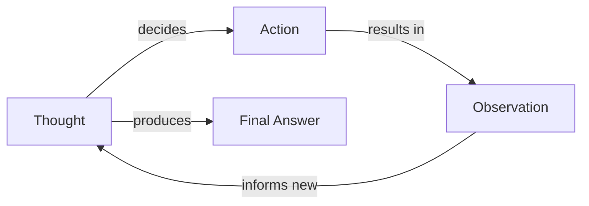
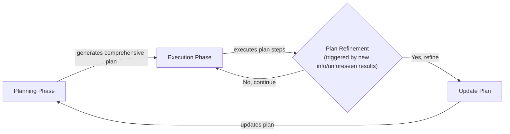

# Planning and Reasoning: The Core of Agentic AI

In our previous lessons, we built a solid foundation for AI Engineering. We explored the agent landscape, learned to distinguish between rigid LLM workflows and autonomous agents, mastered context engineering, ensured reliable outputs with structured data, and gave our models the ability to act with tools. But even with all these components, a critical piece is missing: the ability for an agent to think, plan, and adapt. Without this, our agents are just sophisticated automatons, executing predefined steps without true intelligence.

This lesson introduces the foundational ingredients of agentic behavior: planning and reasoning. We will explore why LLMs, by their nature, lack default planning capabilities and how we can structure their "thought" processes to overcome this. We will cover historically important and still relevant strategies like Chain-of-Thought, ReAct, and Plan-and-Execute. Understanding these patterns is essential for building autonomous agents that can tackle complex, multi-step tasks with something resembling genuine thought.

We will explore why these foundational patterns remain important even as modern models begin to internalize these abilities. By the end, you will understand how to design more robust, intelligent, and debuggable systems.

## What a Non-Reasoning Model Does And Why It Fails on Complex Tasks

To understand the need for planning, let's consider a recurring example: a "Technical Research Assistant Agent." Its task is to produce a comprehensive report on the "latest developments in edge AI deployment." This involves finding recent papers, summarizing their findings, identifying trends and gaps, and writing a structured report.

A non-reasoning model, even one equipped with tools, approaches this task by trying to generate an answer directly. It treats the entire complex request as a single prompt to be answered in one forward pass. It might call the right tools in the right sequence if the path is simple, but it lacks the ability to analyze its own partial results, correct mistakes, or adapt to unforeseen outcomes [[1]](https://www.narrativa.com/ai-reasoning-vs-non-reasoning-models-key-differences-explained). This is because these models are trained to predict the next word, not to strategize or solve multi-step problems [[2]](https://arxiv.org/pdf/2504.19678). They rely on pattern matching from their training data, which often fails when a task is unfamiliar or requires deep, iterative thinking [[1]](https://www.narrativa.com/ai-reasoning-vs-non-reasoning-models-key-differences-explained). Information-theoretic limits also play a role; inherent noise, errors, and an inability to distinguish truth from falsehood can lead to reasoning degradation and hallucinations [[3]](https://www.emergentmind.com/papers/2511.12869).

The consequences for our research agent are significant. The output is often superficial, missing important steps like comparing sources or verifying conflicting information. Since the model does not explicitly break the task into sub-goals, it might misunderstand the task's intent, stop too early, or follow misleading evidence [[4]](https://arxiv.org/html/2606.07462v1). It simply executes a sequence without a higher-level strategy. On high-complexity tasks, this approach often leads to complete failure [[5]](https://www.kuppingercole.com/research/lb80993/fundamental-scaling-limitations-in-ai-reasoning-models).

In previous lessons, we saw how workflows and structured outputs bring reliability to predictable processes, and tools allow our systems to take action. However, for complex tasks where adaptation is key, the very tasks best suited for agents, these components are not enough. Without explicit reasoning and planning, the agent's performance degrades as complexity increases. To solve this, we must first teach the model to think before it acts.

## Teaching Models to “Think” Chain-of-Thought and Its Limits

The first major breakthrough in giving LLMs a semblance of reasoning was Chain-of-Thought (CoT) prompting. The idea is simple but powerful: just as humans often "talk to themselves" to work through a problem, we can instruct an LLM to write down its reasoning steps before providing the final answer [[6]](https://www.comet.com/site/blog/chain-of-thought-prompting). The simple addition of the phrase "Let's think step by step" was found to improve performance on tasks requiring arithmetic, commonsense, and symbolic reasoning [[6]](https://www.comet.com/site/blog/chain-of-thought-prompting). By externalizing its thought process, the model can construct a more logical path to the solution.

Let's apply this to our research assistant agent. A simple CoT prompt might look like this: *“Before answering, think step by step about how you will research and verify sources on edge AI deployment. Then provide the final report.”*

With this prompt, the model would first generate a high-level plan, such as: "First, I will search for recent papers on arXiv and industry reports. Then, I will read the abstracts to select the most relevant sources. After that, I will synthesize the findings and identify common themes. Finally, I will write the report." This process gives the model a chance to structure its approach, leading to a more coherent final output.

However, CoT has its limits. First, the reasoning trace and the final answer are mixed together in a single block of text, which is difficult to parse and control programmatically [[7]](https://apxml.com/courses/intro-llm-agents/chapter-5-basic-agent-planning/guiding-agent-reasoning-chain-of-thought). Second, while the model generates an initial plan, it does not execute it in an iterative loop. It thinks once, then answers. There is no mechanism for it to observe the result of a step, identify a failure, and dynamically adjust its plan [[7]](https://apxml.com/courses/intro-llm-agents/chapter-5-basic-agent-planning/guiding-agent-reasoning-chain-of-thought). It is a heuristic that guides reasoning, not a sophisticated planning algorithm that can backtrack from dead ends [[7]](https://apxml.com/courses/intro-llm-agents/chapter-5-basic-agent-planning/guiding-agent-reasoning-chain-of-thought). Furthermore, CoT increases token consumption, which raises both cost and latency, and it does not guarantee correctness; the model can still make errors in its reasoning [[8]](https://mbrenndoerfer.com/writing/step-by-step-problem-solving-chain-of-thought-reasoning). To gain more structure and control, we need to formally separate the act of thinking from the act of doing.

## Separating Planning from Answering Foundations of ReAct and Plan-and-Execute

The limitations of Chain-of-Thought led to a pivotal insight: to build truly effective agents, we must separate planning and reasoning from answering and acting. Instead of asking the model to produce a single, monolithic output containing both its thoughts and its final answer, we can structure the interaction into distinct phases or interleaved steps. This structured approach represents a convergence of modern neural networks with classical symbolic AI principles, where complex tasks are broken down into discrete, logical steps that can be reasoned over systematically [[9]](https://arxiv.org/html/2407.08516v5).

This separation offers several advantages. It provides clear control and interpretability, as we can inspect the agent's plan before it takes any action. It enables iterative loops, where the agent can take an action, observe the outcome, and then update its plan based on new information [[10]](https://mbrenndoerfer.com/writing/react-pattern-llm-reasoning-action-agents). This is essential because trying to plan and execute detailed actions simultaneously often leads to confusion and mistakes [[11]](https://openreview.net/forum?id=ybA4EcMmUZ). Finally, it allows us to handle reasoning traces and final outputs differently, for example, by showing the user only the final answer while logging the thought process for debugging.

Two foundational patterns emerged from this idea:

1.  **ReAct (Reason + Act):** This approach interleaves thoughts, actions, and observations in a tight, iterative loop. The agent thinks, acts, observes the result, and then thinks again [[10]](https://mbrenndoerfer.com/writing/react-pattern-llm-reasoning-action-agents).
2.  **Plan-and-Execute:** This approach creates a clearer separation between a comprehensive upfront planning phase and a subsequent execution phase [[11]](https://openreview.net/forum?id=ybA4EcMmUZ).

These two patterns represent different philosophies for structuring an agent's cognitive cycle. Let's go deep into ReAct first, using our evolving research-assistant example to see it in action.

## ReAct in Depth Loop, Evolving Example, Pros and Cons

The ReAct framework was introduced to bridge the gap between the internal, ungrounded reasoning of Chain-of-Thought and action-only paradigms that lacked high-level planning [[12]](https://cameronrwolfe.substack.com/p/demystifying-reasoning-models). It synergizes reasoning and acting by prompting an LLM to generate verbal reasoning traces and task-specific actions in an interleaved manner [[13]](https://www.ibm.com/think/topics/reasoning-model). This creates a dynamic feedback loop that mirrors how humans approach complex tasks: we think, act, observe the consequences, and then adjust our next thought based on what we have learned [[10]](https://mbrenndoerfer.com/writing/react-pattern-llm-reasoning-action-agents).

### The ReAct Loop

The core of ReAct is a simple, iterative loop with three phases:

1.  **Thought:** The agent analyzes the current situation and its goal, then formulates a reasoning step about what to do next.
2.  **Action:** Based on its thought, the agent chooses and executes a specific action, typically by calling a tool.
3.  **Observation:** The environment returns the result of the action, which is then fed back into the agent's context for the next cycle.

Image 1: A flowchart illustrating the iterative ReAct loop.

### Evolving Example

Let's see how our Technical Research Assistant Agent would use this loop to complete its task:

-   **Thought:** “I need recent, trustworthy sources on edge AI deployment.”
-   **Action:** `search("latest developments in edge AI deployment 2024 site:arxiv.org OR site:nature.com")`
-   **Observation:** Returns a list of candidate papers.
-   **Thought:** “Select 3 highly cited, 1 industry report; check publication year and venue.”
-   **Action:** `fetch_and_extract(paper_urls)`
-   **Observation:** Extracted abstracts and metadata.
-   **Thought:** “Summarize per source and compare claims about adoption rates; flag conflicts.”
-   **Action:** `summarize_and_compare(extractions)`
-   **Observation:** Paper A says 40% adoption; Paper B says 25%.
-   **Thought:** “Conflict detected; find a third-party market analysis to adjudicate.”
-   **Action:** `search("edge AI deployment adoption market analysis 2024")`
-   **Observation:** Credible report found.
-   **Thought:** “Resolve conflict using the report; finalize trends and gaps.”
-   **Final Answer:** A structured report is generated, complete with citations and a note on the resolved statistical conflict.

### Pros and Cons

The main advantage of ReAct is its high interpretability and natural ability to recover from errors. Each observation grounds the agent's next thought, allowing it to stay on track during exploratory tasks and perform incremental verification [[10]](https://mbrenndoerfer.com/writing/react-pattern-llm-reasoning-action-agents). However, ReAct has structural failure modes. For long-horizon tasks, the context window can fill with intermediate steps, leading to "context rot" where early, important information gets diluted and performance drops [[14]](https://www.agentengineering.io/topics/articles/react-loop-unpacked). As the number of steps increases, the relevance of early information diminishes, and the model's attention drifts toward more recent content, causing planning coherence to collapse [[15]](https://huggingface.co/papers?q=long-horizon).

The loop also has no native concept of action reversibility, creating risks with high-stakes tools like `delete_file` or `send_email` [[14]](https://www.agentengineering.io/topics/articles/react-loop-unpacked). Finally, the model can suffer from thought-action divergence, where it correctly reasons about a step but generates a different, incorrect action due to pattern-matching bias [[14]](https://www.agentengineering.io/topics/articles/react-loop-unpacked). For tasks with a more predictable structure, the Plan-and-Execute approach can be more efficient [[16]](https://apxml.com/courses/getting-started-with-llm-toolkit/chapter-8-developing-autonomous-agents/react-pattern-for-agents).

## Plan-and-Execute in Depth Plan, Execution, Pros and Cons

While ReAct excels at exploratory tasks that require dynamic adaptation, many real-world problems follow a more predictable structure. For these scenarios, the Plan-and-Execute approach offers a more efficient and reliable alternative.

### The Core Concept

The core idea is to separate the agent's work into two distinct phases: first, an LLM generates a comprehensive, step-by-step plan, and second, another component (or the same LLM in a different mode) executes that plan sequentially [[11]](https://openreview.net/forum?id=ybA4EcMmUZ). This separation is analogous to how a head chef plans a multi-course meal before the line cooks begin executing specific recipes [[11]](https://openreview.net/forum?id=ybA4EcMmUZ). The planner focuses on the high-level strategy, while the executor focuses on the low-level details of each step. Recent work has shown that this division of labor helps the model balance high-level objectives with execution details, reducing confusion and improving success rates on complex, long-horizon tasks [[11]](https://openreview.net/forum?id=ybA4EcMmUZ).

This pattern structurally solves the "context rot" problem seen in ReAct. By separating the planning LLM call from the execution calls, the full history does not need to be re-processed at every step. This allows for significant performance gains on tasks that can be parallelized. For example, systems like LLMCompiler, which generate a full task graph upfront and execute independent steps simultaneously, have demonstrated speedups of over 3x and cost reductions of over 6x compared to sequential ReAct loops on certain tasks [[14]](https://www.agentengineering.io/topics/articles/react-loop-unpacked).

The process generally looks like this:

Image 2: A flowchart depicting the Plan-and-Execute approach with plan refinement feedback.

A related pattern is ReWOO (Reasoning Without Observation), which consists of three modules: a planner that breaks down the task, workers that use tools to gather evidence for each subtask, and a solver that synthesizes the results. By removing the observation step from the main loop, ReWOO can outperform ReAct on certain NLP benchmarks, though its performance can degrade if too many tools are added or context is limited [[17]](https://www.ibm.com/think/topics/agentic-reasoning).

### Evolving Example

Let's revisit our Technical Research Assistant Agent with this new approach.

**Planning Phase:** The agent is prompted to generate a detailed plan to accomplish the goal. The output of this phase might be a structured list of steps:
1.  Define the scope of the report, focusing on developments from the last 18 months in hardware, software, and security for edge AI.
2.  Execute parallel searches on Google Scholar, arXiv, and industry news sites for relevant keywords.
3.  From the search results, select the top 5 academic papers and 3 industry reports based on citation count, relevance, and publication date.
4.  For each selected source, extract the abstract, key findings, and any quantitative data on performance or adoption.
5.  Synthesize the extracted information to identify 3-5 major trends and 2-3 significant research gaps.
6.  If any data conflicts (e.g., different adoption rates), perform a targeted search for a market analysis report to resolve the discrepancy.
7.  Draft an outline for the final report with sections for Introduction, Key Trends, Research Gaps, and Conclusion.
8.  Write the full report, ensuring all claims are supported by inline citations.

**Execution Phase:** An executor module (which could be another LLM call or a simple loop in code) iterates through the plan, carrying out each step. The plan itself is not static; it can be updated if the executor encounters unexpected issues. For example, if Step 3 yields no relevant industry reports, the system can trigger a re-planning step, where the planner modifies the search criteria or adds a new source to consult.

### Pros and Cons

The primary strength of this pattern is its efficiency and reliability for well-defined tasks. By creating a complete plan upfront, the agent can proceed with a clear roadmap, which makes it easier to estimate costs and completion time. The structured nature of the plan also simplifies debugging and makes the agent's behavior more predictable. However, this approach is less flexible for highly exploratory problems where the path to a solution is unknown. An imperfect initial plan can lead the agent down the wrong path, requiring frequent and costly re-planning cycles. A significant challenge is that LLMs are not inherently trained for planning, which can make the initial plan generation difficult and error-prone [[11]](https://openreview.net/forum?id=ybA4EcMmUZ).

These foundational ideas, both ReAct and Plan-and-Execute, are not just theoretical. They power real-world systems like Deep Research, which operationalize iterative planning and verification at scale.

## Where This Shows Up in Practice Deep Research–Style Systems

The planning and reasoning patterns we have discussed are the engines behind advanced AI systems designed for deep research, such as OpenAI's Deep Research capability. These systems are built to tackle long-horizon tasks that require synthesizing information from numerous sources, a process that mirrors the work of a human researcher [[18]](https://www.jonkrohn.com/posts/2025/3/17/openais-deep-research-get-days-of-human-work-done-in-minutes).

At their core, these systems operationalize the iterative cycles of planning and execution. A complex query, like our "edge AI deployment" report, is first decomposed into a series of sub-goals [[19]](https://blog.promptlayer.com/how-deep-research-works). The agent then enters an iterative loop of searching the web, reading content from various formats like HTML and PDFs, comparing findings, and verifying claims [[19]](https://blog.promptlayer.com/how-deep-research-works). This process is not a simple one-shot execution; it is a dynamic cycle where each step informs the next. The agent has access to a suite of tools, including a web searcher, a browser for fetching page content, a code interpreter for analysis, and a file parser for non-HTML content [[19]](https://blog.promptlayer.com/how-deep-research-works).

This iterative process is a practical application of the ReAct pattern. The system plans a search (Thought), executes it (Action), and analyzes the results (Observation) before deciding on the next step [[19]](https://blog.promptlayer.com/how-deep-research-works). If it encounters conflicting data, like the different adoption rates in our example, it can dynamically insert a verification sub-goal to resolve the issue before proceeding [[20]](https://arxiv.org/html/2603.28376v1). Other implementations might lean more towards a Plan-and-Execute model, generating a high-level research strategy upfront and then executing it, with periodic checks to trigger re-planning if the initial path proves unfruitful [[19]](https://blog.promptlayer.com/how-deep-research-works).

The key is that these systems are explicitly designed with policies and prompts that enforce verification and reduce hallucinations [[21]](https://cdn.openai.com/deep-research-system-card.pdf). They do not just retrieve information; they reason about its quality and relevance, gradually building a structured, cited report. As these capabilities mature, modern reasoning models are beginning to make some of this behavior more implicit by generating separate "thinking" and "answer" streams.

## Modern Reasoning Models Thinking vs Answer Streams and Interleaved Thinking

The evolution of AI models is increasingly blurring the lines between explicit prompting frameworks like ReAct and the inherent capabilities of the models themselves. Modern reasoning models, such as OpenAI's o-series or Anthropic's Claude 3.5 Sonnet, are specifically trained to integrate planning and reasoning directly into their generation process [[13]](https://www.ibm.com/think/topics/reasoning-model), [[22]](https://developers.openai.com/api/docs/guides/reasoning-best-practices).

A key architectural innovation is the separation of a model's output into two distinct streams: a private "thinking" stream and a public "answer" stream [[23]](https://arxiv.org/html/2512.10931v1), [[12]](https://cameronrwolfe.substack.com/p/demystifying-reasoning-models). The thinking stream contains the model's internal monologue or chain of thought. This includes its step-by-step reasoning, plan adjustments, and analysis of intermediate results. The answer stream contains the final, user-facing response. This logical separation allows the model to "think" extensively without cluttering the final output, providing the benefits of CoT without the parsing challenges [[12]](https://cameronrwolfe.substack.com/p/demystifying-reasoning-models). However, this advanced reasoning capability does not automatically reduce errors like hallucination. In fact, OpenAI’s own testing revealed that their o3 and o4-mini reasoning models hallucinated *more* often than previous-generation models. One analysis found o3 invented actions it could not perform, such as claiming it ran code on a specific machine "outside of ChatGPT" [[24]](https://techcrunch.com/2025/04/18/openais-new-reasoning-ai-models-hallucinate-more). This suggests that as models generate more complex reasoning, they also create more opportunities for making inaccurate claims, a challenge that remains an active area of research [[25]](https://arxiv.org/html/2505.23646v1).

This dual-stream architecture enables more sophisticated behaviors. For instance, some models are trained to "think first," generating a complete internal plan before producing any part of the final answer [[13]](https://www.ibm.com/think/topics/reasoning-model). This is akin to a built-in Plan-and-Execute mechanism. Other models support **asynchronous reasoning**, where the model can generate its public response concurrently while continuing to think privately in the background. This is achieved by using properties of rotary positional embeddings to make the LLM perceive the concurrent streams as a single sequence, without additional training. In this setup, the thinking stream can even "pause" the writer if it needs more time to work through a complex sub-problem, ensuring the final answer is well-reasoned [[23]](https://arxiv.org/html/2512.10931v1). The model itself decides when to pause by periodically being prompted with a question like, "Wait, are my thoughts ahead of the response by enough to continue writing it? (yes/no)". Based on the probability of the next token, the system either continues writing or pauses [[23]](https://arxiv.org/html/2512.10931v1).

A particularly powerful capability emerging from this is **interleaved thinking**. Instead of a single, monolithic thinking phase, the model can interleave thinking and acting. After calling a tool and receiving an observation, the model can generate new thinking tokens to analyze the result and decide on the next action [[26]](https://docs.anthropic.com/en/docs/build-with-claude/extended-thinking#interleaved-thinking). This effectively builds the ReAct loop directly into the model's behavior, allowing for more dynamic and responsive reasoning without requiring an external orchestration loop. For example, a model could use a tool to get stock data, think about the implications of that data, and then decide to call another tool to execute a trade, all within a single turn. In effect, these models internalize the agentic loop, functioning as implicit Plan-and-Execute systems where the reasoning trace is hidden but the model is planning before acting [[14]](https://www.agentengineering.io/topics/articles/react-loop-unpacked).

What does this mean for AI engineers? While these advanced models handle much of the planning implicitly, the underlying principles of structuring thought remain the same. You may rely less on explicit, hand-crafted loops, but you still need to provide clear instructions, well-defined tools, and robust guardrails to ensure reliability. The separation of thinking and answering, even when managed by the model, remains a powerful concept for debugging and maintaining control. With these foundational reasoning abilities in place, agents can unlock even more advanced capabilities like goal decomposition and self-correction.

## Advanced Agent Capabilities Enabled by Planning Goal Decomposition and Self-Correction

Effective planning and reasoning are not just about following a sequence of steps; they are about building a cognitive architecture that enables more advanced agentic behaviors. Two of the most important capabilities unlocked by these patterns are goal decomposition and self-correction.

**Goal decomposition** is breaking a large task into smaller, manageable sub-goals. For our research agent, "write a report" becomes "find sources," "extract data," and "synthesize trends." In a ReAct agent, this happens implicitly in the "Thought" steps. You can guide this with prompts that encourage the model to break down its approach.

**Self-correction** is the agent's ability to detect when something has gone wrong and dynamically update its plan to fix it. This is where the iterative nature of reasoning loops becomes essential. Consider our example where the agent found conflicting adoption rates (40% vs. 25%). A non-reasoning agent might have just reported both figures or arbitrarily picked one. A reasoning agent, however, can recognize the contradiction, insert a new "verification" sub-goal into its plan, and take an action—like searching for a third-party market analysis—to resolve the conflict before proceeding [[27]](https://aclanthology.org/2025.acl-long.1104.pdf). This ability to identify and recover from errors is a hallmark of more robust and autonomous systems. This process of self-correction can be formalized using concepts from classical control theory. The agent's generation process is the "plant," errors are "disturbances," and the correction prompts are "control inputs" in a closed-loop system that seeks to converge on a stable, correct output [[28]](https://arxiv.org/html/2605.17305v1).

However, self-correction is far from a solved problem. It remains unreliable due to inherent model biases, and formal guarantees are difficult to establish. Open challenges include handling tool execution failures, adapting to unexpected environmental changes, and balancing the computational cost of correction attempts with latency requirements [[29]](https://apxml.com/courses/agentic-llm-memory-architectures/chapter-4-complex-planning-tool-integration/self-correction-plan-refinement).

Even with powerful, modern models that have built-in reasoning capabilities, the explicit patterns we've discussed remain valuable. They provide a clear mental model for how the agent is "thinking," which is important for debuggability and building trust in the system. An explicit Thought-Action-Observation trace is far easier to inspect and correct than a black-box model's internal state.

These concepts of planning, reasoning, and self-correction are central to building capable agents. In the next lesson, we will get our hands dirty and implement a ReAct agent from scratch. Soon after, we will explore how to give our agents memory, augment their knowledge with advanced retrieval, and process complex multimodal data.

## References

- [1] https://www.narrativa.com/ai-reasoning-vs-non-reasoning-models-key-differences-explained
- [2] https://arxiv.org/pdf/2504.19678
- [3] https://www.emergentmind.com/papers/2511.12869
- [4] https://arxiv.org/html/2606.07462v1
- [5] https://www.kuppingercole.com/research/lb80993/fundamental-scaling-limitations-in-ai-reasoning-models
- [6] https://www.comet.com/site/blog/chain-of-thought-prompting
- [7] https://apxml.com/courses/intro-llm-agents/chapter-5-basic-agent-planning/guiding-agent-reasoning-chain-of-thought
- [8] https://mbrenndoerfer.com/writing/step-by-step-problem-solving-chain-of-thought-reasoning
- [9] https://arxiv.org/html/2407.08516v5
- [10] https://mbrenndoerfer.com/writing/react-pattern-llm-reasoning-action-agents
- [11] https://openreview.net/forum?id=ybA4EcMmUZ
- [12] https://cameronrwolfe.substack.com/p/demystifying-reasoning-models
- [13] https://www.ibm.com/think/topics/reasoning-model
- [14] https://www.agentengineering.io/topics/articles/react-loop-unpacked
- [15] https://huggingface.co/papers?q=long-horizon
- [16] https://apxml.com/courses/getting-started-with-llm-toolkit/chapter-8-developing-autonomous-agents/react-pattern-for-agents
- [17] https://www.ibm.com/think/topics/agentic-reasoning
- [18] https://www.jonkrohn.com/posts/2025/3/17/openais-deep-research-get-days-of-human-work-done-in-minutes
- [19] https://blog.promptlayer.com/how-deep-research-works
- [20] https://arxiv.org/html/2603.28376v1
- [21] https://cdn.openai.com/deep-research-system-card.pdf
- [22] https://developers.openai.com/api/docs/guides/reasoning-best-practices
- [23] https://arxiv.org/html/2512.10931v1
- [24] https://techcrunch.com/2025/04/18/openais-new-reasoning-ai-models-hallucinate-more
- [25] https://arxiv.org/html/2505.23646v1
- [26] https://docs.anthropic.com/en/docs/build-with-claude/extended-thinking#interleaved-thinking
- [27] https://aclanthology.org/2025.acl-long.1104.pdf
- [28] https://arxiv.org/html/2605.17305v1
- [29] https://apxml.com/courses/agentic-llm-memory-architectures/chapter-4-complex-planning-tool-integration/self-correction-plan-refinement
- [30] https://www.ibm.com/think/topics/agentic-reasoning
- [31] https://www.ibm.com/think/topics/ai-agent-orchestration
- [32] https://www.ibm.com/think/topics/react-agent
- [33] https://www.anthropic.com/engineering/building-effective-agents
- [34] https://arxiv.org/pdf/2210.03629
- [35] https://www.ibm.com/think/insights/ai-agents-2025-expectations-vs-reality
- [36] https://blogs.nvidia.com/blog/reasoning-ai-agents-decision-making/
- [37] https://arxiv.org/pdf/2504.19678
- [38] https://cdn.openai.com/business-guides-and-resources/a-practical-guide-to-building-agents.pdf
- [39] https://www.ibm.com/think/topics/ai-agent-planning
- [40] https://research.google/blog/react-synergizing-reasoning-and-acting-in-language-models
- [41] https://metr.org/blog/2025-03-19-measuring-ai-ability-to-complete-long-tasks/
- [42] https://docs.anthropic.com/en/docs/build-with-claude/extended-thinking#interleaved-thinking