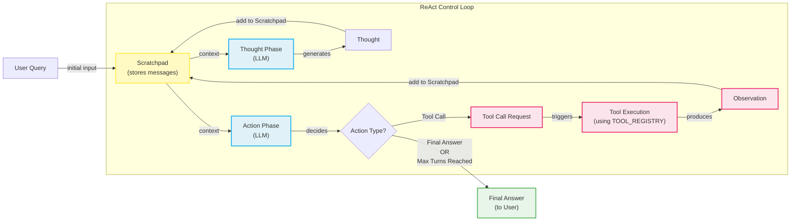

# Lesson 8: Build a ReAct Agent From Scratch

In our previous lessons, we have covered the theoretical foundations of AI agents. We have explored the agent landscape, distinguished between LLM workflows and autonomous agents, engineered context, structured outputs, and examined the basics of tool use and planning. We even covered the theory behind the ReAct (Reasoning and Acting) framework. Now, it is time to put that theory into practice.

This lesson is 100% hands-on. We will build a minimal ReAct agent from the ground up, using only Python and the Gemini API. By writing every part of the Thought → Action → Observation loop ourselves, we will demystify what goes on inside agentic frameworks. This hands-on approach provides a concrete mental model that is essential for any AI engineer. Once you understand how the core loop works, you can debug, extend, and customize agents with confidence, moving beyond the limitations of any single framework.

We will follow the code from the lesson's notebook step-by-step to implement:
1.  A mock tool for the agent to interact with.
2.  The "Thought" phase, where the agent reasons about its next step.
3.  The "Action" phase, where the agent decides to use a tool or provide a final answer.
4.  The turn-based control loop that orchestrates the entire process.

## Setup and Environment

Our first step is to set up a clean Python environment to ensure all our code runs smoothly. This foundation will let us focus on the agent's logic without worrying about configuration issues.

1. We start by loading our `GOOGLE_API_KEY` from a `.env` file. We use a custom utility, `lessons.utils.env.load`, to manage environment variables. This is a good practice that keeps sensitive keys out of your code and makes your application more portable.
    ```python
    from lessons.utils import env
    
    env.load(required_env_vars=["GOOGLE_API_KEY"])
    ```
    It outputs:
    ```text
    Trying to load environment variables from /path/to/your/project/.env
    Environment variables loaded successfully.
    ```

2. Next, we import the necessary packages. We will use `google-genai` for interacting with the Gemini API, `pydantic` and `enum` for creating structured data models, `typing` for type hints, and another custom utility, `lessons.utils.pretty_print`, for formatting our output, which will make it easier to trace the agent's behavior.
    ```python
    from enum import Enum
    from pydantic import BaseModel, Field
    from typing import List
    
    from google import genai
    from google.genai import types
    
    from lessons.utils import pretty_print
    ```
    Using Pydantic is a cornerstone of building reliable AI systems. It allows us to define clear data "contracts" for our agent's internal state and outputs. Instead of dealing with unpredictable dictionaries, we work with validated, type-safe objects. `Enum` helps us define a fixed set of choices, like message roles, which prevents simple typos from causing runtime errors.

3. We initialize the Gemini client. Our utility function checks for both `GOOGLE_API_KEY` and `GEMINI_API_KEY` for flexibility, but the client will use the former if both are present.
    ```python
    client = genai.Client()
    ```
    It outputs:
    ```text
    Both GOOGLE_API_KEY and GEMINI_API_KEY are set. Using GOOGLE_API_KEY.
    ```

4. Finally, we define the model we will use. For this lesson, we will use `gemini-2.5-flash`, a model that is both fast and cost-effective, making it ideal for development and simpler reasoning tasks.
    ```python
    MODEL_ID = "gemini-2.5-flash"
    ```

With our environment configured, we have a solid base to start building our agent. The next step is to give it a way to interact with the outside world by defining its tools.

## Tool Layer: Mock Search Implementation

An agent's power comes from its ability to use tools to gather information or perform actions. For this lesson, we will create a simple mock search tool. This approach lets us focus purely on the ReAct mechanics without getting bogged down by real-world API integrations, external dependencies, or key management. It also gives us predictable responses, which is a great advantage when testing and debugging our agent's logic.

Our mock `search` function simulates a knowledge source. It takes a string query and returns a predefined answer if the query matches certain keywords. If no match is found, it returns a generic "not found" message. The function signature and docstring are important; as we will see later, modern LLM APIs use this information to understand what the tool does and how to use it.

```python
def search(query: str) -> str:
    """Search for information about a specific topic or query.

    Args:
        query (str): The search query or topic to look up.
    """
    query_lower = query.lower()

    # Predefined responses for demonstration
    if all(word in query_lower for word in ["capital", "france"]):
        return "Paris is the capital of France and is known for the Eiffel Tower."
    elif "react" in query_lower:
        return "The ReAct (Reasoning and Acting) framework enables LLMs to solve complex tasks by interleaving thought generation, action execution, and observation processing."

    # Generic response for unhandled queries
    return f"Information about '{query}' was not found."
```

In a production system, you would replace this mock function with calls to real external APIs. For example, you could use Google's official Search API or a third-party service like SerpApi. The key is that the function signature (`search(query: str) -> str`) would remain the same. This modular design allows you to swap out the tool's implementation without changing the agent's core logic. However, a production implementation would also need robust error handling for things like API failures, network issues, and rate limiting.

To manage our tools, we create a `TOOL_REGISTRY`. This dictionary maps the string name of a tool to the actual callable Python function. This registry allows the agent to plan using symbolic tool names, while our code can safely look up and execute the corresponding function.

```python
TOOL_REGISTRY = {
    search.__name__: search,
}
```

Now that our agent has a tool it can use, we need to implement the first phase of the ReAct cycle: thinking.

## Thought Phase: Prompt Construction and Generation

The "Thought" phase is where the agent analyzes the user's request and its history to decide on a plan. The goal is to generate a short, focused paragraph that outlines the next intended action and the reasoning behind it.

1. To guide the LLM, we construct a prompt that includes all the necessary context. This includes the available tools and the conversation history. We create a helper function, `build_tools_xml_description`, to format our tool definitions into an XML structure. Using XML tags like `<tools>` and `<tool>` helps the model clearly distinguish the tool descriptions from other parts of the prompt, a technique we covered in Lesson 3 on Context Engineering.
    ```python
    def build_tools_xml_description(tools: dict[str, callable]) -> str:
        """Build a minimal XML description of tools using only their docstrings."""
        lines = []
        for tool_name, fn in tools.items():
            doc = (fn.__doc__ or "").strip()
            lines.append(f"\t<tool name=\"{tool_name}\">")
            if doc:
                lines.append(f"\t\t<description>")
                for line in doc.split("\n"):
                    lines.append(f"\t\t\t{line}")
                lines.append(f"\t\t</description>")
            lines.append("\t</tool>")
        return "\n".join(lines)
    
    tools_xml = build_tools_xml_description(TOOL_REGISTRY)
    
    PROMPT_TEMPLATE_THOUGHT = f"""
    You are deciding the next best step for reaching the user goal. You have some tools available to you.
    
    Available tools:
    <tools>
    {tools_xml}
    </tools>
    
    Conversation so far:
    <conversation>
    {{conversation}}
    </conversation>
    
    State your next thought about what to do next as one short paragraph focused on the next action you intend to take and why.
    Avoid repeating the same strategies that didn't work previously. Prefer different approaches.
    """.strip()
    ```

2. Let's inspect the full prompt template to see what the model receives. The `{conversation}` placeholder will be dynamically filled with the history of interactions at each step.
    ```python
    print(PROMPT_TEMPLATE_THOUGHT)
    ```
    It outputs:
    ```text
    You are deciding the next best step for reaching the user goal. You have some tools available to you.
    
    Available tools:
    <tools>
        <tool name="search">
            <description>
                Search for information about a specific topic or query.
                
                Args:
                    query (str): The search query or topic to look up.
            </description>
        </tool>
    </tools>
    
    Conversation so far:
    <conversation>
    {conversation}
    </conversation>
    
    State your next thought about what to do next as one short paragraph focused on the next action you intend to take and why.
    Avoid repeating the same strategies that didn't work previously. Prefer different approaches.
    ```

3. With the prompt template ready, we implement the `generate_thought` function. This function takes the current conversation history, inserts it into the template, and calls the Gemini model. It then returns the model's text response, which represents the agent's thought.
    ```python
    def generate_thought(conversation: str, tool_registry: dict[str, callable]) -> str:
        """Generate a thought as plain text (no structured output)."""
        tools_xml = build_tools_xml_description(tool_registry)
        prompt = PROMPT_TEMPLATE_THOUGHT.format(conversation=conversation, tools_xml=tools_xml)
    
        response = client.models.generate_content(
            model=MODEL_ID,
            contents=prompt
        )
        return response.text.strip()
    ```

A coherent thought gives the agent a plan. The next logical step is to translate that plan into a concrete action, which could be either calling a tool or providing a final answer to the user.

## Action Phase: Function Calling and Parsing

The "Action" phase is where the agent commits to a specific next step. It decides whether to use a tool to gather more information or, if it has enough context, to provide a final answer. We will implement this using Gemini's native function-calling capabilities.

This approach is more robust than embedding tool-use instructions directly in the prompt. By passing the tool definitions in the API request's configuration, we let Gemini handle the complex logic of when and how to call a function. The API automatically parses the function's signature and docstring to create a schema that the model uses for its reasoning. This separation of concerns keeps our prompts clean and focused on strategic guidance, while the API manages the technical details of tool integration. This is a common pattern also used by other providers like OpenAI [[19]](https://platform.openai.com/docs/guides/structured-outputs).

1. We start by defining two prompt templates. The first, `PROMPT_TEMPLATE_ACTION`, is for general use, asking the model to decide between a tool call and a final answer. The second, `PROMPT_TEMPLATE_ACTION_FORCED`, is a special-purpose prompt we will use to ensure the agent provides a concluding answer when it reaches its iteration limit.
    ```python
    PROMPT_TEMPLATE_ACTION = """
    You are selecting the best next action to reach the user goal.
    
    Conversation so far:
    <conversation>
    {conversation}
    </conversation>
    
    Respond either with a tool call (with arguments) or a final answer if you can confidently conclude.
    """.strip()
    
    # Dedicated prompt used when we must force a final answer
    PROMPT_TEMPLATE_ACTION_FORCED = """
    You must now provide a final answer to the user.
    
    Conversation so far:
    <conversation>
    {conversation}
    </conversation>
    
    Provide a concise final answer that best addresses the user's goal.
    """.strip()
    ```

2. We define Pydantic models to represent the two possible outcomes of the action phase: a `ToolCallRequest` or a `FinalAnswer`. As we discussed in Lesson 4, using Pydantic ensures our data is structured and validated, making the rest of our code more reliable.
    ```python
    class ToolCallRequest(BaseModel):
        """A request to call a tool with its name and arguments."""
        tool_name: str = Field(description="The name of the tool to call.")
        arguments: dict = Field(description="The arguments to pass to the tool.")
    
    
    class FinalAnswer(BaseModel):
        """A final answer to present to the user when no further action is needed."""
        text: str = Field(description="The final answer text to present to the user.")
    ```

3. Now, we implement the `generate_action` function. This is the core of the action phase.
    ```python
    def generate_action(conversation: str, tool_registry: dict[str, callable] | None = None, force_final: bool = False) -> (ToolCallRequest | FinalAnswer):
        """Generate an action by passing tools to the LLM and parsing function calls or final text.
    
        When force_final is True or no tools are provided, the model is instructed to produce a final answer and tool calls are disabled.
        """
        # Use a dedicated prompt when forcing a final answer or no tools are provided
        if force_final or not tool_registry:
            prompt = PROMPT_TEMPLATE_ACTION_FORCED.format(conversation=conversation)
            response = client.models.generate_content(
                model=MODEL_ID,
                contents=prompt
            )
            return FinalAnswer(text=response.text.strip())
    
        # Default action prompt
        prompt = PROMPT_TEMPLATE_ACTION.format(conversation=conversation)
    
        # Provide the available tools to the model; disable auto-calling so we can parse and run ourselves
        tools = list(tool_registry.values())
        config = types.GenerateContentConfig(
            tools=tools,
            automatic_function_calling={"disable": True}
        )
        response = client.models.generate_content(
            model=MODEL_ID,
            contents=prompt,
            config=config
        )
    
        # Extract the function call from the response (if present)
        candidate = response.candidates[0]
        parts = candidate.content.parts
        if parts and getattr(parts[0], "function_call", None):
            name = parts[0].function_call.name
            args = dict(parts[0].function_call.args) if parts[0].function_call.args is not None else {}
            return ToolCallRequest(tool_name=name, arguments=args)
        
        # Otherwise, it's a final answer
        final_answer = "".join(part.text for part in candidate.content.parts)
        return FinalAnswer(text=final_answer.strip())
    ```
    The `force_final` flag is a crucial feature for production-ready agents. It provides a mechanism to terminate the ReAct loop gracefully, preventing infinite loops or excessive costs. When `max_turns` is reached, we can call `generate_action` with this flag to instruct the model to summarize its findings and provide the best possible answer with the information it has gathered.

    Note that we set `automatic_function_calling={"disable": True}` in the configuration. This tells the Gemini SDK that we want to handle the tool execution ourselves, giving us full control over the "Act" and "Observe" steps of the loop.

With the Thought and Action phases implemented, we have all the building blocks for our agent. The final step is to orchestrate them in a control loop.

## Control Loop: Messages, Scratchpad, and Orchestration

The control loop is the engine that drives the ReAct agent. It orchestrates the Thought → Action → Observation cycle, manages the agent's memory, and ensures the process terminates correctly. We will build this loop by treating the entire interaction as a sequence of structured messages stored in a "scratchpad."

1. First, we define the data structures for our messages. `MessageRole` is an `Enum` that defines the possible roles a message can have, such as `USER`, `THOUGHT`, or `OBSERVATION`. The `Message` class is a Pydantic model that combines a role with its text content. This structured approach is fundamental to keeping the agent's history organized and interpretable.
    ```python
    class MessageRole(str, Enum):
        """Enumeration for the different roles a message can have."""
        USER = "user"
        THOUGHT = "thought"
        TOOL_REQUEST = "tool request"
        OBSERVATION = "observation"
        FINAL_ANSWER = "final answer"
    
    
    class Message(BaseModel):
        """A message with a role and content, used for all message types."""
        role: MessageRole = Field(description="The role of the message in the ReAct loop.")
        content: str = Field(description="The textual content of the message.")
    
        def __str__(self) -> str:
            """Provides a user-friendly string representation of the message."""
            return f"{self.role.value.capitalize()}: {self.content}"
    ```

2. To make the agent's internal process easy to follow, we create a helper function to print each message with color-coded headers. This will give us a clear, readable trace of the agent's execution, which is invaluable for debugging.
    ```python
    def pretty_print_message(message: Message, turn: int, max_turns: int, header_color: str = pretty_print.Color.YELLOW, is_forced_final_answer: bool = False) -> None:
        if not is_forced_final_answer:
            title = f"{message.role.value.capitalize()} (Turn {turn}/{max_turns}):"
        else:
            title = f"{message.role.value.capitalize()} (Forced):"
    
        pretty_print.wrapped(
            text=message.content,
            title=title,
            header_color=header_color,
        )
    ```

3. The `Scratchpad` class acts as the agent's short-term memory. It holds a list of `Message` objects and provides a method to append new messages, optionally printing them as they are added. At each turn, we will serialize the contents of the scratchpad into a string to provide the full context to the LLM for its next Thought and Action phases.
    ```python
    class Scratchpad:
        """Container for ReAct messages with optional pretty-print on append."""
    
        def __init__(self, max_turns: int) -> None:
            self.messages: List[Message] = []
            self.max_turns: int = max_turns
            self.current_turn: int = 1
    
        def set_turn(self, turn: int) -> None:
            self.current_turn = turn
    
        def append(self, message: Message, verbose: bool = False, is_forced_final_answer: bool = False) -> None:
            self.messages.append(message)
            if verbose:
                role_to_color = {
                    MessageRole.USER: pretty_print.Color.RESET,
                    MessageRole.THOUGHT: pretty_print.Color.ORANGE,
                    MessageRole.TOOL_REQUEST: pretty_print.Color.GREEN,
                    MessageRole.OBSERVATION: pretty_print.Color.YELLOW,
                    MessageRole.FINAL_ANSWER: pretty_print.Color.CYAN,
                }
                header_color = role_to_color.get(message.role, pretty_print.Color.YELLOW)
                pretty_print_message(
                    message=message,
                    turn=self.current_turn,
                    max_turns=self.max_turns,
                    header_color=header_color,
                    is_forced_final_answer=is_forced_final_answer,
                )
    
        def to_string(self) -> str:
            return "\n".join(str(m) for m in self.messages)
    ```

4. Now we can assemble the main `react_agent_loop`. This function orchestrates the entire process. It initializes the scratchpad with the user's question and then enters a loop that runs for a maximum number of turns.
    ```python
    def react_agent_loop(initial_question: str, tool_registry: dict[str, callable], max_turns: int = 5, verbose: bool = False) -> str:
        """
        Implements the main ReAct (Thought -> Action -> Observation) control loop.
        Uses a unified message class for the scratchpad.
        """
        scratchpad = Scratchpad(max_turns=max_turns)
    
        # Add the user's question to the scratchpad
        user_message = Message(role=MessageRole.USER, content=initial_question)
        scratchpad.append(user_message, verbose=verbose)
    
        for turn in range(1, max_turns + 1):
            scratchpad.set_turn(turn)
    
            # Generate a thought based on the current scratchpad
            thought_content = generate_thought(
                scratchpad.to_string(),
                tool_registry,
            )
            thought_message = Message(role=MessageRole.THOUGHT, content=thought_content)
            scratchpad.append(thought_message, verbose=verbose)
    
            # Generate an action based on the current scratchpad
            action_result = generate_action(
                scratchpad.to_string(),
                tool_registry=tool_registry,
            )
    
            # If the model produced a final answer, return it
            if isinstance(action_result, FinalAnswer):
                final_answer = action_result.text
                final_message = Message(role=MessageRole.FINAL_ANSWER, content=final_answer)
                scratchpad.append(final_message, verbose=verbose)
                return final_answer
    
            # Otherwise, it is a tool request
            if isinstance(action_result, ToolCallRequest):
                action_name = action_result.tool_name
                action_params = action_result.arguments
    
                # Add the action to the scratchpad
                params_str = ", ".join([f"{k}='{v}'" for k, v in action_params.items()])
                action_content = f"{action_name}({params_str})"
                action_message = Message(role=MessageRole.TOOL_REQUEST, content=action_content)
                scratchpad.append(action_message, verbose=verbose)
    
                # Run the action and get the observation
                observation_content = ""
                tool_function = tool_registry[action_name]
                try:
                    observation_content = tool_function(**action_params)
                except Exception as e:
                    observation_content = f"Error executing tool '{action_name}': {e}"
    
                # Add the observation to the scratchpad
                observation_message = Message(role=MessageRole.OBSERVATION, content=observation_content)
                scratchpad.append(observation_message, verbose=verbose)
    
            # Check if the maximum number of turns has been reached. If so, force the action selector to produce a final answer
            if turn == max_turns:
                forced_action = generate_action(
                    scratchpad.to_string(),
                    force_final=True,
                )
                if isinstance(forced_action, FinalAnswer):
                    final_answer = forced_action.text
                else:
                    final_answer = "Unable to produce a final answer within the allotted turns."
                final_message = Message(role=MessageRole.FINAL_ANSWER, content=final_answer)
                scratchpad.append(final_message, verbose=verbose, is_forced_final_answer=True)
                return final_answer
    ```

Inside each turn, it generates a thought, then an action. If the action is a `FinalAnswer`, the loop terminates. If it is a `ToolCallRequest`, the loop executes the tool, captures the output as an "Observation," and appends it to the scratchpad before continuing to the next turn. This cycle seamlessly integrates observation processing into the main loop. If the loop reaches `max_turns`, it makes one final call to `generate_action` with `force_final=True` to guarantee a concluding response.


Image 1: A flowchart illustrating the ReAct control loop, detailing the turn-based Thought-Action-Observation cycle.

With the complete loop in place, our agent is ready. It is time to test its behavior on a couple of queries to see how it performs.

## Tests and Traces: Success and Graceful Fallback

The final step is to validate our agent. We will run it with two different queries: one that should succeed and one designed to test its fallback behavior. By analyzing the printed traces, we can confirm that the Thought-Action-Observation loop, tool integration, and termination logic are all working as expected.

### Successful Query

First, let's ask a straightforward factual question that our mock `search` tool can answer. We will set `max_turns=2` and `verbose=True` to see the detailed trace.

```python
# A straightforward question requiring a search.
question = "What is the capital of France?"
final_answer = react_agent_loop(question, TOOL_REGISTRY, max_turns=2, verbose=True)
```

The trace shows the agent executing the ReAct cycle perfectly:
1.  **User:** The initial question is added to the scratchpad.
2.  **Thought (Turn 1/2):** The agent correctly identifies that it needs to use the `search` tool to find the capital of France.
3.  **Tool Request (Turn 1/2):** It generates a call to `search(query='capital of France')`.
4.  **Observation (Turn 1/2):** The mock tool returns the predefined answer: "Paris is the capital of France and is known for the Eiffel Tower."
5.  **Thought (Turn 2/2):** With the information from the observation, the agent concludes it has found the answer and prepares to deliver it.
6.  **Final Answer (Turn 2/2):** The agent extracts the core fact and provides the concise answer: "Paris is the capital of France."

This trace confirms that our agent can successfully use a tool to find information and complete a task within its turn budget.

### Graceful Fallback

Now, let's test a query that our mock tool does not have a predefined answer for. This will test the agent's ability to handle tool "failures" and its forced termination logic.

```python
# An unknown/unsupported query for the mock tool.
question = "What is the capital of Italy?"
final_answer = react_agent_loop(question, TOOL_REGISTRY, max_turns=2, verbose=True)
```

The trace for this query demonstrates the agent's resilience:
1.  **Thought (Turn 1/2) & Tool Request (Turn 1/2):** The agent attempts to search for "capital of Italy."
2.  **Observation (Turn 1/2):** The mock tool returns its fallback message: "Information about 'capital of Italy' was not found."
3.  **Thought (Turn 2/2):** The agent observes the failure and adapts its strategy. It decides to try a broader search for just "Italy," hoping to find relevant information it can parse.
4.  **Tool Request (Turn 2/2):** It calls `search(query='Italy')`.
5.  **Observation (Turn 2/2):** This search also fails, returning "Information about 'Italy' was not found."
6.  **Final Answer (Forced):** The agent has now reached its `max_turns` limit of 2. The control loop triggers the forced final answer mechanism. The agent generates a polite and honest response: "I'm sorry, but I couldn't find information about the capital of Italy."

This test validates two important behaviors. First, the agent can reason about tool failures and attempt alternative strategies. Second, our `max_turns` and `force_final` logic works as a safety net, ensuring the agent terminates gracefully with a helpful message instead of getting stuck in a loop. In multi-turn scenarios, agents can sometimes lose context or get stuck in repetitive error loops, a common failure mode observed in complex systems [[25]](https://arxiv.org/html/2510.24663v1). Our simple termination strategy provides a basic but effective mitigation.

Designing comprehensive test suites with edge cases and even adversarial prompts is just as important for agents as it is in traditional software engineering. These simple tests confirm our from-scratch agent is behaving correctly and provide a solid foundation for building more complex capabilities.

## Conclusion

In this lesson, we have moved from theory to practice, building a complete ReAct agent from scratch. By implementing each component of the Thought-Action-Observation loop, we have gained a deep, hands-on understanding of how agentic systems reason, act, and learn from their environment. We have seen how to define tools, construct prompts for thought and action, and orchestrate the entire process within a stateful control loop.

This from-scratch approach gives you a foundational mental model that transcends any specific framework. You now have the core skills to build your own custom agents, debug their behavior with precision, and extend their capabilities with confidence. Even if you use a framework like LangGraph in the future, you will know exactly what is happening under the hood.

This is a fundamental skill for any AI Engineer. In our upcoming lessons, we will build on this foundation to explore more advanced topics, including how to equip agents with long-term memory (Lesson 9), how to connect them to vast knowledge bases with Retrieval-Augmented Generation (Lesson 10), and how to process complex, multimodal data (Lesson 11).

## References

- [1] Yao, S., Zhao, J., Yu, D., Du, N., Shafran, I., Narasimhan, K., & Cao, Y. (2023). *ReAct: Synergizing Reasoning and Acting in Language Models*. arXiv. https://arxiv.org/pdf/2210.03629
- [2] Bergmann, D. (n.d.). *ReAct Agent*. IBM. https://www.ibm.com/think/topics/react-agent
- [3] Stryker, C. (n.d.). *AI Agent Planning*. IBM. https://www.ibm.com/think/topics/ai-agent-planning
- [4] S., E., & Zhang, B. (2024, December 19). *Building effective agents*. Anthropic. https://www.anthropic.com/engineering/building-effective-agents
- [5] *ReAct agent from scratch with Gemini 2.5 and LangGraph*. (n.d.). Google AI for Developers. https://ai.google.dev/gemini-api/docs/langgraph-example
- [6] Ferrag, M. A., Tihanyi, N., & Debbah, M. (2026, March 6). *From LLM Reasoning to Autonomous AI Agents: A Comprehensive Review*. arXiv. https://arxiv.org/pdf/2504.19678
- [7] Shankar, A. (2024, June 10). *Building ReAct Agents from Scratch using Gemini*. Medium. https://medium.com/google-cloud/building-react-agents-from-scratch-a-hands-on-guide-using-gemini-ffe4621d90ae
- [8] Downie, A., & Finio, M. (n.d.). *AI Agent Orchestration*. IBM. https://www.ibm.com/think/topics/ai-agent-orchestration
- [9] *Function calling*. (n.d.). Google AI for Developers. https://ai.google.dev/gemini-api/docs/function-calling
- [10] *Prompt design strategies*. (n.d.). Google AI for Developers. https://ai.google.dev/gemini-api/docs/prompting-strategies
- [11] Iusztin, P. (2025, November 18). *Building Production ReAct Agents From Scratch Is Simple*. Decoding AI. https://www.decodingai.com/p/building-production-react-agents
- [12] Pasternak, R. (n.d.). *Building a Python React Agent Class: A Step-by-Step Guide*. Neradot. https://www.neradot.com/post/building-a-python-react-agent-class-a-step-by-step-guide
- [13] Schmid, P. (n.d.). *ReAct agent from scratch with Gemini 2.5 and LangGraph*. https://www.philschmid.de/langgraph-gemini-2-5-react-agent
- [14] *Building a real-time web searching AI agent with LangChain and Google Gemini*. (2025, November 25). https://atalupadhyay.wordpress.com/2025/11/25/building-a-real-time-web-searching-ai-agent-with-langchain-and-google-gemini/
- [15] *Building ReAct Agents with LangGraph: A Beginner’s Guide*. (2024, July 1). Machine Learning Mastery. https://machinelearningmastery.com/building-react-agents-with-langgraph-a-beginners-guide/
- [16] Daily Dose of DS. (2024, June 10). *AI Agents Crash Course - Part 10: ReAct Framework with Implementation*. https://www.dailydoseofds.com/ai-agents-crash-course-part-10-with-implementation/
- [17] Roelants, P. (2023, April 16). *ReAct with OpenAI Function Calling*. https://peterroelants.github.io/posts/react-openai-function-calling/
- [18] Technofile. (2024, May 22). *How to Build a ReAct AI Agent with Python from Scratch*. https://technofile.substack.com/p/how-to-build-a-react-ai-agent-with-python-from-scratch
- [19] *Structured Outputs with OpenAI*. (n.d.). OpenAI Platform. https://platform.openai.com/docs/guides/structured-outputs
- [20] *LangChain ReAct Agent: Complete Implementation Guide with Working Examples (2025)*. (2024, August 15). LateNode. https://latenode.com/blog/ai-frameworks-technical-infrastructure/langchain-setup-tools-agents-memory/langchain-react-agent-complete-implementation-guide-working-examples-2025
- [21] *Building ReAct Agents with Microsoft Agent Framework: From Theory to Production*. (n.d.). GenMind. https://genmind.ch/posts/Building-ReAct-Agents-with-Microsoft-Agent-Framework-From-Theory-to-Production/
- [22] *Beyond the Prompt: Engineering the Thought-Action-Observation Loop*. (n.d.). Towards AI. https://pub.towardsai.net/beyond-the-prompt-engineering-the-thought-action-observation-loop-2e1fd99114d2
- [23] *AI Agents IV: AI Agents through the Thought-Action-Observation (TAO) Cycle*. (n.d.). Stackademic. https://blog.stackademic.com/ai-agents-iv-ai-agents-through-the-thought-action-observation-tao-cycle-3dfe2eb76629
- [24] *Agent steps and structure*. (n.d.). Hugging Face. https://huggingface.co/learn/agents-course/unit1/agent-steps-and-structure
- [25] Lu, Y., Liu, S., & Dong, L. (2025). *OrchDAG: Complex Tool Orchestration in Multi-Turn Interactions with Plan DAGs*. arXiv. https://arxiv.org/html/2510.24663v1
- [26] *OrchDAG: Complex Tool Orchestration in Multi-Turn Interactions with Plan DAGs*. (n.d.). Amazon Science. https://www.amazon.science/publications/orchdag-complex-tool-orchestration-in-multi-turn-interactions-with-plan-dags
- [27] Google Developers. (2025, May 3). *Real-world agent examples with Gemini 3*. https://developers.googleblog.com/real-world-agent-examples-with-gemini-3/