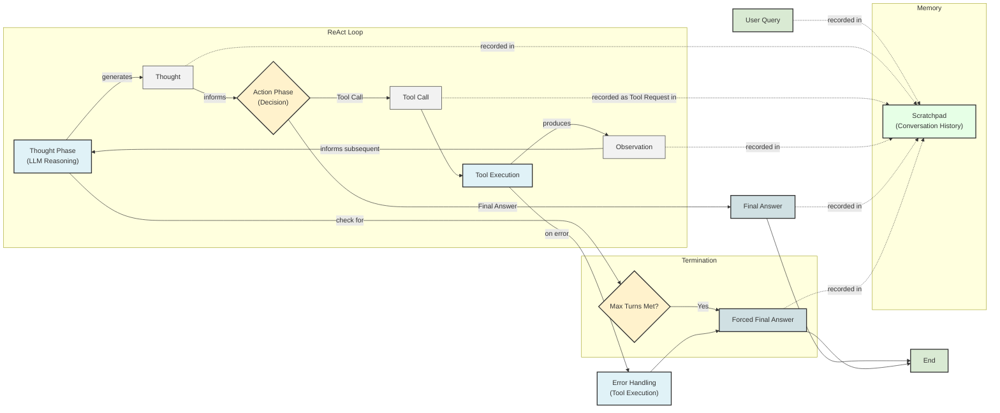

# Build a ReAct Agent From Scratch: A Step-by-Step Guide

In the previous lessons, we covered the theory behind AI agents, from context engineering and structured outputs to function calling and reasoning patterns like ReAct. We have established that understanding these concepts is one thing, but building an agent from scratch provides a concrete mental model that no amount of theory can replace. This lesson is 100% practice.

We will build a minimal ReAct agent from the ground up using Python and the Gemini API. By implementing the full Thought → Action → Observation loop yourself, you will gain the hands-on experience needed to debug, extend, and confidently build your own agents. We will define a mock tool, generate thoughts, select actions with function calling, execute those actions, and process the resulting observations, all orchestrated within a turn-based control loop.

By the end of this lesson, you will have a working ReAct agent and a solid foundation for tackling the more advanced topics we will cover later in the course, such as memory and RAG.

Let's start by setting up the environment.

## Setup and Environment

Our first step is to ensure your Python environment is correctly configured to run the code from this lesson's notebook. A well-structured setup is the foundation for any successful project, and it allows us to focus on the agent's logic rather than wrestling with dependencies.

1. We begin by loading our `GOOGLE_API_KEY` from the `.env` file using a custom utility function. This keeps our credentials secure and separate from the code.

    ```python
    from lessons.utils import env
    
    env.load(required_env_vars=["GOOGLE_API_KEY"])
    ```

    It outputs:

    ```text
    Trying to load environment variables from /path/to/your/project/.env
    Environment variables loaded successfully.
    ```

    The `lessons.utils.env.load` utility is a small but important piece of our project's design. Instead of scattering `os.getenv()` calls throughout the codebase, we centralize environment variable loading into a single, reusable function. This modular approach makes the code cleaner and easier to maintain. If we ever need to change how we manage secrets, for example, by moving to a dedicated secrets manager, we only need to update this one utility.

2. Next, we import the key packages for this lesson. We will use `google-genai` to interact with the Gemini API, `pydantic` for data validation, and `enum` to define distinct roles for our messages. We also import our `pretty_print` utility to make the agent's traces easier to read.

    ```python
    from enum import Enum
    from pydantic import BaseModel, Field
    from typing import List
    
    from google import genai
    from google.genai import types
    
    from lessons.utils import pretty_print
    ```

    Using `pydantic` is a best practice in agent development because it enforces a strict schema on the data flowing through your system. When an LLM's output is parsed into a Pydantic model, it is automatically validated. If the data does not match the expected types or structure, Pydantic raises a clear error, preventing bad data from causing issues downstream. `Enum` helps us define a fixed set of roles (like `USER`, `THOUGHT`, etc.), which makes our code more readable and less prone to typos. Similarly, the `pretty_print` utility encapsulates the logic for displaying formatted output, separating presentation concerns from the core agent logic.

3. We initialize the Gemini client, which is our main interface for communicating with the model.

    ```python
    client = genai.Client()
    ```

    It outputs:

    ```text
    Both GOOGLE_API_KEY and GEMINI_API_KEY are set. Using GOOGLE_API_KEY.
    ```

4. Finally, we define the model we will use. For this lesson, we have chosen `gemini-2.5-flash`, a model that offers a good balance of speed and cost-effectiveness for our task.

    ```python
    MODEL_ID = "gemini-2.5-flash"
    ```

With the client and model ID in place, our environment is ready. Now we can start building the agent by defining its first external capability: a search tool.

## Tool Layer: Mock Search Implementation

For an agent to be useful, it needs to interact with the outside world. This is done through tools. In this section, we will implement a simple mock search tool that serves as a stand-in for a real-world API.

We are using a mock tool for a few important reasons. First, it allows us to focus entirely on the ReAct mechanics without getting bogged down in the details of API authentication, network requests, or rate limiting. Second, it eliminates external dependencies, so you can run this lesson's code without needing extra API keys. Finally, a mock tool provides predictable, consistent responses, which is essential for learning and debugging. When you know exactly what a tool should return, you can more easily identify whether a problem lies with the tool itself or the agent's reasoning logic.

1. Our mock `search` function is a simple Python function with a clear docstring. The docstring is critical because, as we saw in Lesson 6 on function calling, LLMs use it to understand what a tool does and how to use it [[1]](https://ai.google.dev/gemini-api/docs/function-calling), [[2]](https://www.anthropic.com/engineering/building-effective-agents).

    ```python
    def search(query: str) -> str:
        """Search for information about a specific topic or query.
    
        Args:
            query (str): The search query or topic to look up.
        """
        query_lower = query.lower()
    
        # Predefined responses for demonstration
        if all(word in query_lower for word in ["capital", "france"]):
            return "Paris is the capital of France and is known for the Eiffel Tower."
        elif "react" in query_lower:
            return "The ReAct (Reasoning and Acting) framework enables LLMs to solve complex tasks by interleaving thought generation, action execution, and observation processing."
    
        # Generic response for unhandled queries
        return f"Information about '{query}' was not found."
    ```

    The function contains hardcoded logic to return specific answers for queries about the capital of France or the ReAct framework. For any other query, it returns a "not found" message. This fallback behavior is important for testing how the agent handles situations where a tool fails to provide the needed information.

2. To make our tools accessible to the agent, we create a `TOOL_REGISTRY`. This dictionary maps the string name of a tool to its actual Python function. This registry allows the agent to decide on an action by name (e.g., `"search"`), and our code can then look up and execute the corresponding function.

    ```python
    TOOL_REGISTRY = {
        search.__name__: search,
    }
    ```

In a production system, you would replace this mock `search` function with a call to a real external API, like the Google Search API or a private knowledge base. This transition involves several important considerations. First, API key management is essential. You would store your keys securely as environment variables and load them at runtime, just as we did with our `GOOGLE_API_KEY`.

Second, you must handle network-related issues. Real-world API calls can fail due to timeouts, rate limiting, or server errors. A robust implementation would wrap the API call in a `try...except` block to catch these exceptions and return an informative error message to the agent. For example, Microsoft's Agent Framework implements tools with explicit timeouts and graceful error handling to prevent agents from hanging or crashing [[5]](https://genmind.ch/posts/Building-ReAct-Agents-with-Microsoft-Agent-Framework-From-Theory-to-Production/).

Here is a simplified example of what a production-ready Google Search tool might look like, using the `requests` library.

```python
import os
import requests
import json

def google_search(query: str) -> str:
    """Performs a Google search using the Serper API and returns formatted results."""
    api_key = os.getenv("SERPER_API_KEY")
    if not api_key:
        return "ERROR: SERPER_API_KEY environment variable not set."

    url = "https://google.serper.dev/search"
    payload = json.dumps({"q": query, "num": 5})
    headers = {'X-API-KEY': api_key, 'Content-Type': 'application/json'}

    try:
        response = requests.post(url, headers=headers, data=payload, timeout=10)
        response.raise_for_status()  # Raises an HTTPError for bad responses (4xx or 5xx)
        results = response.json().get('organic', [])
        
        if not results:
            return f"No Google search results found for query: {query}"

        # Format results for the agent
        formatted = [f"Title: {item.get('title', '')}\nSnippet: {item.get('snippet', '')}\nLink: {item.get('link', '')}" for item in results]
        return "\n\n".join(formatted)

    except requests.Timeout:
        return f"ERROR: Search timed out for query: {query}"
    except requests.RequestException as e:
        return f"ERROR: Search failed: {str(e)}"
```

Notice how this function includes a timeout, handles potential `requests` exceptions, and checks for an API key. The function signature and its registration in the `TOOL_REGISTRY` would remain the same, allowing you to swap the mock and real implementations seamlessly.

With a tool defined, the agent now has a way to act. The next step is to give it a way to decide *when* and *how* to use that tool. This brings us to the "Thought" phase of the ReAct loop.

## Thought Phase: Prompt Construction and Generation

The "Thought" phase is where the agent reasons about its goal and plans its next step. It analyzes the user's query and the conversation history to decide whether to use a tool, ask a clarifying question, or provide a final answer. We will implement this by constructing a specific prompt that guides the LLM to generate a single, focused thought.

The quality of this thought is heavily dependent on the quality of the prompt. A well-designed prompt provides clear instructions, defines the available tools, and gives the model the context it needs to make an informed decision. As we learned in Lesson 3 on Context Engineering, structuring the prompt with clear delimiters like XML tags is a powerful technique to help the model distinguish between different types of information [[3]](https://ai.google.dev/gemini-api/docs/prompting-strategies).

1. First, we create a helper function to convert our `TOOL_REGISTRY` into an XML description. This makes the tool definitions machine-readable and clearly separated from the rest of the prompt.

    ```python
    def build_tools_xml_description(tools: dict[str, callable]) -> str:
        """Build a minimal XML description of tools using only their docstrings."""
        lines = []
        for tool_name, fn in tools.items():
            doc = (fn.__doc__ or "").strip()
            lines.append(f"\t<tool name=\"{tool_name}\">")
            if doc:
                lines.append(f"\t\t<description>")
                for line in doc.split("\n"):
                    lines.append(f"\t\t\t{line}")
                lines.append(f"\t\t</description>")
            lines.append("\t</tool>")
        return "\n".join(lines)
    
    tools_xml = build_tools_xml_description(TOOL_REGISTRY)
    
    PROMPT_TEMPLATE_THOUGHT = f"""
    You are deciding the next best step for reaching the user goal. You have some tools available to you.
    
    Available tools:
    <tools>
    {tools_xml}
    </tools>
    
    Conversation so far:
    <conversation>
    {{conversation}}
    </conversation>
    
    State your next thought about what to do next as one short paragraph focused on the next action you intend to take and why.
    Avoid repeating the same strategies that didn't work previously. Prefer different approaches.
    """.strip()
    ```

    This prompt template has three main parts: the tool descriptions wrapped in `<tools>` tags, a placeholder for the conversation history inside `<conversation>` tags, and the final instruction. The instruction "Avoid repeating the same strategies that didn't work previously" is particularly important. It explicitly encourages the agent to learn from its observations and adapt its approach, preventing it from getting stuck in repetitive loops if a tool call fails.

2. Let's inspect the fully rendered prompt to see exactly what the LLM will receive.

    ```python
    print(PROMPT_TEMPLATE_THOUGHT)
    ```

    It outputs:

    ```text
    You are deciding the next best step for reaching the user goal. You have some tools available to you.
    
    Available tools:
    <tools>
    	<tool name="search">
    		<description>
    			Search for information about a specific topic or query.
    			
    			Args:
    			    query (str): The search query or topic to look up.
    		</description>
    	</tool>
    </tools>
    
    Conversation so far:
    <conversation>
    {conversation}
    </conversation>
    
    State your next thought about what to do next as one short paragraph focused on the next action you intend to take and why.
    Avoid repeating the same strategies that didn't work previously. Prefer different approaches.
    ```

    As you can see, the prompt clearly lists the `search` tool and its description, which comes directly from the function's docstring. This structured format helps the model focus on the task at hand.

3. Finally, we implement the `generate_thought` function. This function takes the current conversation history, inserts it into our prompt template, and calls the Gemini API to generate the agent's next thought as plain text.

    ```python
    def generate_thought(conversation: str, tool_registry: dict[str, callable]) -> str:
        """Generate a thought as plain text (no structured output)."""
        tools_xml = build_tools_xml_description(tool_registry)
        prompt = PROMPT_TEMPLATE_THOUGHT.format(conversation=conversation, tools_xml=tools_xml)
    
        response = client.models.generate_content(
            model=MODEL_ID,
            contents=prompt
        )
        return response.text.strip()
    ```

This thought gives the agent a plan. Now, we need to translate that plan into a concrete action, which could be either calling a tool or concluding with a final answer. This is the "Action" phase.

## Action Phase: Function Calling and Parsing

The "Action" phase is where the agent commits to a specific step. Based on the conversation so far, it decides whether to call a tool to gather more information or to provide a final answer to the user. We will implement this using Gemini's native function calling capabilities, which, as we learned in Lesson 6, is the most reliable way to have an LLM interact with tools.

1. We start by defining two prompt templates. The first is for general use, and the second is a specialized prompt we will use to force the agent to provide a final answer, which is a crucial mechanism for preventing infinite loops.

    ```python
    PROMPT_TEMPLATE_ACTION = """
    You are selecting the best next action to reach the user goal.
    
    Conversation so far:
    <conversation>
    {conversation}
    </conversation>
    
    Respond either with a tool call (with arguments) or a final answer if you can confidently conclude.
    """.strip()
    
    # Dedicated prompt used when we must force a final answer
    PROMPT_TEMPLATE_ACTION_FORCED = """
    You must now provide a final answer to the user.
    
    Conversation so far:
    <conversation>
    {conversation}
    </conversation>
    
    Provide a concise final answer that best addresses the user's goal.
    """.strip()
    ```

    Notice that unlike in the "Thought" phase, we do not include tool descriptions in these prompts. Instead, we will pass the Python tool functions directly to the Gemini API. The API automatically extracts the function name, docstring, and parameter information and includes it in the context it sends to the model. This separation of concerns keeps our prompts clean and makes tool management much easier.

2. We define two Pydantic models, `ToolCallRequest` and `FinalAnswer`, to represent the two possible outcomes of the action phase. This use of structured outputs, a concept we covered in Lesson 4, ensures that the agent's decision is always returned in a predictable, easy-to-parse format.

    ```python
    class ToolCallRequest(BaseModel):
        """A request to call a tool with its name and arguments."""
        tool_name: str = Field(description="The name of the tool to call.")
        arguments: dict = Field(description="The arguments to pass to the tool.")
    
    
    class FinalAnswer(BaseModel):
        """A final answer to present to the user when no further action is needed."""
        text: str = Field(description="The final answer text to present to the user.")
    ```

3. Now we implement the `generate_action` function. This is the core of the action phase.

    ```python
    def generate_action(conversation: str, tool_registry: dict[str, callable] | None = None, force_final: bool = False) -> (ToolCallRequest | FinalAnswer):
        """Generate an action by passing tools to the LLM and parsing function calls or final text.
    
        When force_final is True or no tools are provided, the model is instructed to produce a final answer and tool calls are disabled.
        """
        # Use a dedicated prompt when forcing a final answer or no tools are provided
        if force_final or not tool_registry:
            prompt = PROMPT_TEMPLATE_ACTION_FORCED.format(conversation=conversation)
            response = client.models.generate_content(
                model=MODEL_ID,
                contents=prompt
            )
            return FinalAnswer(text=response.text.strip())
    
        # Default action prompt
        prompt = PROMPT_TEMPLATE_ACTION.format(conversation=conversation)
    
        # Provide the available tools to the model; disable auto-calling so we can parse and run ourselves
        tools = list(tool_registry.values())
        config = types.GenerateContentConfig(
            tools=tools,
            automatic_function_calling={"disable": True}
        )
        response = client.models.generate_content(
            model=MODEL_ID,
            contents=prompt,
            config=config
        )
    
        # Extract the function call from the response (if present)
        candidate = response.candidates[0]
        parts = candidate.content.parts
        if parts and getattr(parts[0], "function_call", None):
            name = parts[0].function_call.name
            args = dict(parts[0].function_call.args) if parts[0].function_call.args is not None else {}
            return ToolCallRequest(tool_name=name, arguments=args)
        
        # Otherwise, it's a final answer
        final_answer = "".join(part.text for part in candidate.content.parts)
        return FinalAnswer(text=final_answer.strip())
    ```

    This function first checks if a final answer is being forced. If so, it uses the dedicated prompt and returns a `FinalAnswer`. Otherwise, it passes the available tools to the Gemini API and sets `automatic_function_calling` to `disable`. We disable automatic calling because we want to control the execution loop ourselves for this educational example. The function then inspects the model's response. If it contains a `function_call`, it parses the name and arguments and returns a `ToolCallRequest`. If not, it assumes the response is a final answer and returns a `FinalAnswer`.

### Advanced Error Handling in Production

In a production environment, tool execution can fail for many reasons, such as network issues, invalid API keys, or unexpected data formats. A robust agent must handle these failures gracefully. Here are some advanced strategies:

-   **Retry Mechanisms:** For transient errors like network timeouts, implementing a retry mechanism with exponential backoff is a common pattern. This involves waiting for a short, increasing interval between retries, giving the external service time to recover. You can implement this with a simple decorator.

    ```python
    import time
    from functools import wraps
    
    def retry(max_tries=3, delay_seconds=1):
        def decorator(func):
            @wraps(func)
            def wrapper(*args, **kwargs):
                tries = 0
                while tries < max_tries:
                    try:
                        return func(*args, **kwargs)
                    except Exception as e:
                        tries += 1
                        if tries == max_tries:
                            raise e
                        time.sleep(delay_seconds * (2 ** (tries - 1)))
            return wrapper
        return decorator
    
    @retry(max_tries=3, delay_seconds=2)
    def production_search(query: str) -> str:
        # ... API call logic ...
        pass
    ```

-   **Circuit Breakers:** For more persistent failures, a circuit breaker pattern can prevent an application from repeatedly trying to execute an operation that is likely to fail. If a tool fails a certain number of times, the circuit "opens," and subsequent calls fail immediately without attempting to contact the external service. After a timeout, the circuit moves to a "half-open" state to test if the service has recovered.

-   **User-Facing Errors:** When a tool fails permanently, the agent should not expose raw technical error messages to the user. Instead, the `observe` function should catch the exception and return a clean, informative message like, `"I'm sorry, the search service is currently unavailable. Please try again later."` This allows the agent to reason about the failure and potentially try a different tool or inform the user gracefully.

We now have separate components for thinking and acting. The final step is to orchestrate them in a continuous loop that also handles the "Observation" phase.

## Control Loop: Messages, Scratchpad, Orchestration

The control loop is the engine of our ReAct agent. It orchestrates the Thought → Action → Observation cycle, manages the conversation history, and decides when to terminate. To build it, we first need a standardized way to represent each step of the agent's process. This is where our `Message` and `Scratchpad` classes come into play, acting as the short-term memory for the agent's current task.

This concept of a structured, iterative loop is not just theoretical; it powers real-world systems at a massive scale. For instance, Bank of America's AI assistant, Erica, handles over 3 billion customer interactions annually using the ReAct pattern. When a customer reports a suspicious charge, Erica follows a similar loop: it **reasons** ("I need to check the transaction history"), **acts** (queries the fraud detection system), **observes** (finds an unusual spending pattern), and continues this cycle until it can take a final action, like escalating the issue [[5]](https://genmind.ch/posts/Building-ReAct-Agents-with-Microsoft-Agent-Framework-From-Theory-to-Production/).

1. We start by defining a `MessageRole` enum and a `Message` Pydantic model. This creates a unified structure for all types of interactions: user queries, the agent's internal thoughts, tool requests, tool outputs (observations), and the final answer.

    ```python
    class MessageRole(str, Enum):
        """Enumeration for the different roles a message can have."""
        USER = "user"
        THOUGHT = "thought"
        TOOL_REQUEST = "tool request"
        OBSERVATION = "observation"
        FINAL_ANSWER = "final answer"
    
    
    class Message(BaseModel):
        """A message with a role and content, used for all message types."""
        role: MessageRole = Field(description="The role of the message in the ReAct loop.")
        content: str = Field(description="The textual content of the message.")
    
        def __str__(self) -> str:
            """Provides a user-friendly string representation of the message."""
            return f"{self.role.value.capitalize()}: {self.content}"
    ```

2. To make the agent's process easy to follow, we create a helper function that uses our `pretty_print` utility to render each message in the notebook with a colored header indicating its role and the current turn.

    ```python
    def pretty_print_message(message: Message, turn: int, max_turns: int, header_color: str = pretty_print.Color.YELLOW, is_forced_final_answer: bool = False) -> None:
        if not is_forced_final_answer:
            title = f"{message.role.value.capitalize()} (Turn {turn}/{max_turns}):"
        else:
            title = f"{message.role.value.capitalize()} (Forced):"
    
        pretty_print.wrapped(
            text=message.content,
            title=title,
            header_color=header_color,
        )
    ```

3. The `Scratchpad` class acts as the agent's short-term memory. It holds a list of all `Message` objects in the current conversation. Its `append` method adds a new message and can optionally print it, while `to_string` serializes the entire history into a single string that we can pass to the LLM.

    ```python
    class Scratchpad:
        """Container for ReAct messages with optional pretty-print on append."""
    
        def __init__(self, max_turns: int) -> None:
            self.messages: List[Message] = []
            self.max_turns: int = max_turns
            self.current_turn: int = 1
    
        def set_turn(self, turn: int) -> None:
            self.current_turn = turn
    
        def append(self, message: Message, verbose: bool = False, is_forced_final_answer: bool = False) -> None:
            self.messages.append(message)
            if verbose:
                role_to_color = {
                    MessageRole.USER: pretty_print.Color.RESET,
                    MessageRole.THOUGHT: pretty_print.Color.ORANGE,
                    MessageRole.TOOL_REQUEST: pretty_print.Color.GREEN,
                    MessageRole.OBSERVATION: pretty_print.Color.YELLOW,
                    MessageRole.FINAL_ANSWER: pretty_print.Color.CYAN,
                }
                header_color = role_to_color.get(message.role, pretty_print.Color.YELLOW)
                pretty_print_message(
                    message=message,
                    turn=self.current_turn,
                    max_turns=self.max_turns,
                    header_color=header_color,
                    is_forced_final_answer=is_forced_final_answer,
                )
    
        def to_string(self) -> str:
            return "\n".join(str(m) for m in self.messages)
    ```

4. Finally, we implement the `react_agent_loop` function. This is where everything comes together.

    ```python
    def react_agent_loop(initial_question: str, tool_registry: dict[str, callable], max_turns: int = 5, verbose: bool = False) -> str:
        """
        Implements the main ReAct (Thought -> Action -> Observation) control loop.
        Uses a unified message class for the scratchpad.
        """
        scratchpad = Scratchpad(max_turns=max_turns)
    
        # Add the user's question to the scratchpad
        user_message = Message(role=MessageRole.USER, content=initial_question)
        scratchpad.append(user_message, verbose=verbose)
    
        for turn in range(1, max_turns + 1):
            scratchpad.set_turn(turn)
    
            # Generate a thought based on the current scratchpad
            thought_content = generate_thought(
                scratchpad.to_string(),
                tool_registry,
            )
            thought_message = Message(role=MessageRole.THOUGHT, content=thought_content)
            scratchpad.append(thought_message, verbose=verbose)
    
            # Generate an action based on the current scratchpad
            action_result = generate_action(
                scratchpad.to_string(),
                tool_registry=tool_registry,
            )
    
            # If the model produced a final answer, return it
            if isinstance(action_result, FinalAnswer):
                final_answer = action_result.text
                final_message = Message(role=MessageRole.FINAL_ANSWER, content=final_answer)
                scratchpad.append(final_message, verbose=verbose)
                return final_answer
    
            # Otherwise, it is a tool request
            if isinstance(action_result, ToolCallRequest):
                action_name = action_result.tool_name
                action_params = action_result.arguments
    
                # Add the action to the scratchpad
                params_str = ", ".join([f"{k}='{v}'" for k, v in action_params.items()])
                action_content = f"{action_name}({params_str})"
                action_message = Message(role=MessageRole.TOOL_REQUEST, content=action_content)
                scratchpad.append(action_message, verbose=verbose)
    
                # Run the action and get the observation
                observation_content = ""
                tool_function = tool_registry[action_name]
                try:
                    observation_content = tool_function(**action_params)
                except Exception as e:
                    observation_content = f"Error executing tool '{action_name}': {e}"
    
                # Add the observation to the scratchpad
                observation_message = Message(role=MessageRole.OBSERVATION, content=observation_content)
                scratchpad.append(observation_message, verbose=verbose)
    
            # Check if the maximum number of turns has been reached. If so, force the action selector to produce a final answer
            if turn == max_turns:
                forced_action = generate_action(
                    scratchpad.to_string(),
                    force_final=True,
                )
                if isinstance(forced_action, FinalAnswer):
                    final_answer = forced_action.text
                else:
                    final_answer = "Unable to produce a final answer within the allotted turns."
                final_message = Message(role=MessageRole.FINAL_ANSWER, content=final_answer)
                scratchpad.append(final_message, verbose=verbose, is_forced_final_answer=True)
                return final_answer
    ```

    The loop works as follows:
    - It starts by adding the user's initial question to the scratchpad.
    - On each turn, it generates a **Thought** and adds it to the scratchpad. This is the reasoning step.
    - It then generates an **Action**, which is the agent's decision.
    - If the action is a `FinalAnswer`, the loop terminates and returns the answer.
    - If the action is a `ToolCallRequest`, it looks up the tool in the registry and executes it. The result of this execution is the **Observation**.
    - The observation is added to the scratchpad, providing new information for the next turn, and the loop continues.
    - If the loop reaches the `max_turns` limit, it calls `generate_action` one last time with `force_final=True` to ensure a graceful exit.

This structure directly implements the ReAct pattern. While effective, this design introduces a fundamental performance bottleneck: the sequential dependency between LLM inference and tool execution. Because the agent must wait for a tool's observation before it can generate the next thought, the GPU often sits idle during I/O-bound tool calls. This serial workflow can lead to significant hardware underutilization and is a primary driver of high latency in agentic systems [[4]](https://arxiv.org/html/2506.04301v1). The flowchart below illustrates this step-by-step process.


Image 1: A flowchart illustrating the ReAct (Reasoning and Acting) control loop.

The loop is now complete. Let's test it to see how it behaves in both success and failure scenarios.

## Tests and Traces: Success and Graceful Fallback

With our control loop fully implemented, it is time to validate its behavior. We will run two tests: a straightforward factual query that our mock tool can answer, and a query that the tool cannot handle. Analyzing the printed traces will show us if the agent is reasoning, acting, and observing as expected.

1. First, we ask a simple question that our mock `search` tool is designed to answer: "What is the capital of France?". We set `max_turns` to 2 and `verbose` to `True` to see the step-by-step trace.

    ```python
    # A straightforward question requiring a search.
    question = "What is the capital of France?"
    final_answer = react_agent_loop(question, TOOL_REGISTRY, max_turns=2, verbose=True)
    ```

    It outputs:

    ```text
    User (Turn 1/2):
    What is the capital of France?
    
    Thought (Turn 1/2):
    The user is asking for the capital of France. I can use the search tool to find this information.
    
    Tool request (Turn 1/2):
    search(query='capital of France')
    
    Observation (Turn 1/2):
    Paris is the capital of France and is known for the Eiffel Tower.
    
    Thought (Turn 2/2):
    I have found the answer using the search tool. The capital of France is Paris. I can now provide the final answer.
    
    Final answer (Turn 2/2):
    Paris is the capital of France.
    ```

    The trace shows a perfect ReAct cycle. In the first turn, the agent correctly identifies the need for information, calls the `search` tool, and receives an observation. In the second turn, it recognizes that the observation contains the answer and generates a `FinalAnswer`, successfully completing the task within the turn limit.

2. Now, let's test a scenario where the tool fails. We ask, "What is the capital of Italy?", a query our mock tool does not have a predefined answer for.

    ```python
    question = "What is the capital of Italy?"
    final_answer = react_agent_loop(question, TOOL_REGISTRY, max_turns=2, verbose=True)
    ```

    It outputs:

    ```text
    User (Turn 1/2):
    What is the capital of Italy?
    
    Thought (Turn 1/2):
    The user is asking for the capital of Italy. I can use the search tool to find this information.
    
    Tool request (Turn 1/2):
    search(query='capital of Italy')
    
    Observation (Turn 1/2):
    Information about 'capital of Italy' was not found.
    
    Thought (Turn 2/2):
    My previous search for 'capital of Italy' failed. I will try a broader search for just 'Italy' to see if I can find any relevant information that might lead me to the capital.
    
    Tool request (Turn 2/2):
    search(query='Italy')
    
    Observation (Turn 2/2):
    Information about 'Italy' was not found.
    
    Final answer (Forced):
    I was unable to find information about the capital of Italy using the available tools.
    ```

    This trace demonstrates the agent's resilience and the importance of the forced termination mechanism. After the first tool call fails, the agent's thought process in the second turn shows it adapting its strategy by trying a broader query. When that also fails and the `max_turns` limit is reached, the loop correctly triggers the forced final answer path, providing a graceful and honest response to the user. This adaptive behavior is a key strength of the ReAct framework. A real-world example of this can be seen in a complex research query where an agent, after failing to find a country's "national dish," adaptively switches its strategy to search for "popular dishes" instead, successfully gathering the necessary information over multiple iterations [[6]](https://medium.com/google-cloud/building-react-agents-from-scratch-a-hands-on-guide-using-gemini-ffe4621d90ae).

### Designing a Comprehensive Test Suite

While these simple tests are effective for this lesson, production-grade agents require a much more comprehensive test suite, drawing inspiration from traditional software engineering.

-   **Unit Tests:** Just as you would test individual functions, each tool should have its own set of unit tests. For our `google_search` tool, we would write tests to verify its behavior with valid queries, empty queries, and simulated API failures.
-   **Integration Tests:** These tests verify that different components of the agent work together correctly. For example, we could write a test to ensure that the `generate_action` function correctly parses the output of `generate_thought` and produces a valid `ToolCallRequest`.
-   **End-to-End (E2E) Tests:** These are the most important tests for an agent. They involve running the full `react_agent_loop` with a variety of inputs and asserting on the final output. You should create a test suite with dozens or even hundreds of questions that cover:
    -   **Golden paths:** Queries where the agent is expected to succeed easily.
    -   **Edge cases:** Queries with ambiguous phrasing, no clear answer, or that require multiple tool calls.
    -   **Adversarial prompts:** Queries designed to trick the agent into a loop or cause it to fail, testing its robustness.

Furthermore, performance benchmarks for agents reveal behaviors not seen in conventional LLM services. Unlike single-pass queries with predictable latency, an agent’s iterative nature results in a heavy-tailed latency distribution; some queries may finish quickly while others take orders of magnitude longer. Research shows that as request volume increases, a ReAct agent's tail latency (the 95th percentile) rises much more sharply than that of a standard chatbot, highlighting a high sensitivity to load. This makes maintaining a consistent Quality of Service (QoS) a major engineering challenge [[4]](https://arxiv.org/html/2506.04301v1).

## Conclusion

In this lesson, we have moved from theory to practice by building a complete, albeit minimal, ReAct agent from scratch. We have implemented each component of the Thought-Action-Observation loop: defining a tool, using a prompted LLM to generate a thought, leveraging function calling to decide on an action, executing that action, and feeding the resulting observation back into the loop. Orchestrating this cycle has given you a concrete mental model of how reasoning agents operate under the hood.

This foundational understanding is a critical skill for any AI engineer. While frameworks can accelerate development, knowing how to build the core logic yourself is what allows you to debug effectively, customize behavior, and create truly robust systems.

The agent we built today is just the beginning. However, scaling this pattern from a simple loop to a production service reveals immense infrastructure challenges. A single agentic query can consume over 100 times more energy than a standard LLM call, raising serious questions about cost and sustainability at scale [[4]](https://arxiv.org/html/2506.04301v1). This is why mastering efficient design is so important. In the upcoming lessons, we will build upon this foundation, exploring how to equip agents with memory in Lesson 9 and connecting them to vast external knowledge bases with RAG in Lesson 10.

## References

- [1] Function calling (Google AI for Developers) https://ai.google.dev/gemini-api/docs/function-calling
- [2] Building effective agents (Anthropic) https://www.anthropic.com/engineering/building-effective-agents
- [3] Prompt design strategies (Google AI for Developers) https://ai.google.dev/gemini-api/docs/prompting-strategies
- [4] The Cost of Dynamic Reasoning: Demystifying AI Agents and Test-Time Scaling from an AI Infrastructure Perspective (arXiv) https://arxiv.org/html/2506.04301v1
- [5] Building ReAct Agents with Microsoft Agent Framework: From Theory to Production (GenMind) https://genmind.ch/posts/Building-ReAct-Agents-with-Microsoft-Agent-Framework-From-Theory-to-Production/
- [6] Building ReAct Agents from Scratch using Gemini (Medium) https://medium.com/google-cloud/building-react-agents-from-scratch-a-hands-on-guide-using-gemini-ffe4621d90ae

</article>