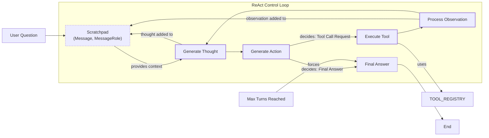

# Lesson 8: Building a ReAct Agent From Scratch

In our previous lessons, we built a solid foundation in AI engineering. We started by understanding the agent landscape, distinguished between LLM workflows and autonomous agents, learned the art of context engineering, made LLM outputs reliable with structured data, and explored how to give agents the ability to act through tools and function calling. Most recently, in Lesson 7, we covered the theory behind planning and reasoning frameworks like ReAct.

This lesson is 100% practice. We will take the ReAct theory and build a minimal agent from the ground up using Python and the Gemini API. You will implement the full Thought → Action → Observation loop end-to-end. This hands-on approach demystifies what happens inside frameworks like LangGraph and gives you a concrete mental model for how these systems work. By building the control loop yourself, you will gain the confidence to debug, customize, and extend agents for your own applications.

Let's get started.

## Setup and Environment

Our first step is to set up a clean Python environment to ensure the code from our notebook runs seamlessly. This foundation will help you replicate the expected traces and outputs as we build the agent.

### ### Environment Configuration

1.  We begin by loading our `GOOGLE_API_KEY` from a `.env` file using a custom utility function. This keeps our credentials secure and separate from the application code.

    ```python
    from lessons.utils import env
    
    env.load(required_env_vars=["GOOGLE_API_KEY"])
    ```

    It outputs:

    ```text
    Trying to load environment variables from /path/to/your/project/.env
    Environment variables loaded successfully.
    ```

2.  Next, we import the key packages for this lesson. We will use `google-genai` to interact with the Gemini API, `pydantic` for creating structured data models, and `enum` to define a set of named constants for message roles.

    ```python
    from enum import Enum
    from pydantic import BaseModel, Field
    from typing import List
    
    from google import genai
    from google.genai import types
    
    from lessons.utils import pretty_print
    ```

### ### Client and Model Initialization

1.  With our imports ready, we initialize the Gemini client. Our utility automatically detects the API key loaded in the previous step.

    ```python
    client = genai.Client()
    ```

    It outputs:

    ```text
    Both GOOGLE_API_KEY and GEMINI_API_KEY are set. Using GOOGLE_API_KEY.
    ```

2.  Finally, we define a constant for the model we will use. For this lesson, `gemini-2.5-flash` is a great choice as it is fast, cost-effective, and supports the function calling features we need.

    ```python
    MODEL_ID = "gemini-2.5-flash"
    ```

Using Pydantic is a best practice in agent development because it enforces a schema, ensuring that data moving between the LLM and your code is predictable and validated. This "fail-fast" approach catches errors early. While this validation adds a small amount of overhead, it is negligible compared to the latency of an LLM call. In fact, it can improve end-to-end performance by eliminating extra LLM calls needed to fix formatting errors [[1]](https://medium.com/@mohitcharan04/comprehensive-comparison-of-ai-agent-frameworks-bec7d25df8a6). Similarly, `Enum` provides a robust way to manage a fixed set of states, like message roles, making the code more readable and less prone to typos than using plain strings. The custom utilities like `env.load` and `pretty_print` encapsulate reusable logic, promoting a modular design that is easier to maintain and extend as the project grows.

With the client and model ID in place, we are ready to define the external capabilities our agent will use.

## Tool Layer: Mock Search Implementation

To allow our agent to interact with the world, we need to give it tools. For this lesson, we will implement a mock search tool that serves as a simple external knowledge source. This approach lets us focus purely on the ReAct mechanics without worrying about real API integrations, dependencies, or keys. It also gives us predictable responses, which is perfect for learning and testing.

### ### Designing the Mock Tool

1.  We define a simple Python function called `search`. Its docstring is essential, as this is what the LLM will use to understand what the tool does and how to use it.

    ```python
    def search(query: str) -> str:
        """Search for information about a specific topic or query.
    
        Args:
            query (str): The search query or topic to look up.
        """
        query_lower = query.lower()
    
        # Predefined responses for demonstration
        if all(word in query_lower for word in ["capital", "france"]):
            return "Paris is the capital of France and is known for the Eiffel Tower."
        elif "react" in query_lower:
            return "The ReAct (Reasoning and Acting) framework enables LLMs to solve complex tasks by interleaving thought generation, action execution, and observation processing."
    
        # Generic response for unhandled queries
        return f"Information about '{query}' was not found."
    ```

    The function contains hardcoded logic to return specific answers for queries about the capital of France or the ReAct framework. For any other query, it returns a "not found" message. This fallback behavior is crucial for testing how the agent handles situations where a tool fails to provide useful information.

2.  We then create a `TOOL_REGISTRY`, a dictionary that maps the tool's name to its callable function. This registry allows our agent's control loop to dynamically execute the correct function based on the LLM's decision.

    ```python
    TOOL_REGISTRY = {
        search.__name__: search,
    }
    ```

### ### From Mock to Production

In a production system, you would swap this mock `search` function with a real one that calls an external API. The modular design, where the tool's interface is decoupled from its implementation, is a core principle for building scalable agentic systems. This allows you to change the underlying tool logic without altering the agent's core reasoning process [[2]](https://medium.com/google-cloud/building-react-agents-from-scratch-a-hands-on-guide-using-gemini-ffe4621d90ae).

For example, to use a real web search, you could replace the mock function with one that uses the `DuckDuckGoSearchRun` tool from LangChain. The function signature and docstring remain the same, preserving the contract with the LLM, but the implementation now interacts with a live search engine.

```python
from langchain_community.tools import DuckDuckGoSearchRun

@tool
def web_search(query: str) -> str:
    """Searches the web using DuckDuckGo for up-to-date information."""
    search = DuckDuckGoSearchRun()
    return search.run(query)
```

This transition to production-grade tools introduces several important considerations. First, API key management becomes critical. You should load keys securely from environment variables or a secret manager, never hardcoding them in your source code. Second, you must account for rate limiting. External APIs often impose limits on the number of requests you can make in a given period. Your implementation should include mechanisms like exponential backoff or simple delays to handle these limits gracefully.

Finally, robust error handling is non-negotiable. Network requests can fail, APIs can be temporarily unavailable, or they might return unexpected error codes. Your tool's implementation should wrap API calls in `try...except` blocks to catch these exceptions and return an informative error message as the observation. This allows the agent to reason about the failure and decide whether to retry, use a different tool, or inform the user that it cannot complete the request [[3]](https://latenode.com/blog/ai-frameworks-technical-infrastructure/langchain-setup-tools-agents-memory/langchain-react-agent-complete-implementation-guide-working-examples-2025).

## Thought Phase: Prompt Construction and Generation

The first step in the ReAct loop is "Thought." This is where the agent analyzes the user's query and the conversation history to form a plan. We will guide the LLM to generate this thought using a carefully crafted prompt that includes descriptions of the available tools. This phase is crucial because a well-formed thought sets the stage for an effective action, ensuring the agent's behavior is both logical and goal-oriented.

### ### Building the Tool Description

1.  First, we create a helper function to convert our `TOOL_REGISTRY` into a minimal XML description. This function iterates through the tools, extracts their docstrings, and formats them into `<tool>` blocks. XML is a great choice for this because it provides clear, structured delimiters that help the model distinguish tools from other parts of the prompt. This structured approach is more reliable than simply listing tool information in plain text, as it reduces ambiguity and helps the model parse the available capabilities more accurately.

    ```python
    def build_tools_xml_description(tools: dict[str, callable]) -> str:
        """Build a minimal XML description of tools using only their docstrings."""
        lines = []
        for tool_name, fn in tools.items():
            doc = (fn.__doc__ or "").strip()
            lines.append(f"\t<tool name=\"{tool_name}\">")
            if doc:
                lines.append(f"\t\t<description>")
                for line in doc.split("\n"):
                    lines.append(f"\t\t\t{line}")
                lines.append(f"\t\t</description>")
            lines.append("\t</tool>")
        return "\n".join(lines)
    ```

### ### Crafting the Thought Prompt

1.  Next, we define the prompt template for the thought-generation step. It instructs the model to decide on the next best action based on the conversation so far and the available tools. The `{conversation}` and `{tools_xml}` placeholders will be dynamically filled in. The instructions guide the model to focus on the next action, its rationale, and to avoid repeating failed strategies, encouraging adaptive problem-solving.

    ```python
    tools_xml = build_tools_xml_description(TOOL_REGISTRY)
    
    PROMPT_TEMPLATE_THOUGHT = f"""
    You are deciding the next best step for reaching the user goal. You have some tools available to you.
    
    Available tools:
    <tools>
    {tools_xml}
    </tools>
    
    Conversation so far:
    <conversation>
    {{conversation}}
    </conversation>
    
    State your next thought about what to do next as one short paragraph focused on the next action you intend to take and why.
    Avoid repeating the same strategies that didn't work previously. Prefer different approaches.
    """.strip()
    ```

2.  Let's inspect the final prompt. You can see how the tool's docstring has been embedded within the `<tools>` block, giving the LLM the context it needs to reason about its capabilities. This explicit declaration of tools within the prompt is a key part of the ReAct framework, as it grounds the model's reasoning in the actual capabilities available to it.

    ```python
    print(PROMPT_TEMPLATE_THOUGHT)
    ```

    It outputs:

    ```text
    You are deciding the next best step for reaching the user goal. You have some tools available to you.
    
    Available tools:
    <tools>
        <tool name="search">
            <description>
                Search for information about a specific topic or query.
                
                Args:
                    query (str): The search query or topic to look up.
            </description>
        </tool>
    </tools>
    
    Conversation so far:
    <conversation>
    {conversation}
    </conversation>
    
    State your next thought about what to do next as one short paragraph focused on the next action you intend to take and why.
    Avoid repeating the same strategies that didn't work previously. Prefer different approaches.
    ```

### ### Generating the Thought

1.  Finally, we implement the `generate_thought` function. It takes the current conversation history, builds the full prompt by injecting the conversation and tool descriptions, and then calls the Gemini API to generate the agent's next thought. The function simply returns the stripped text from the model's response, which represents the agent's internal monologue or plan for the next step.

    ```python
    def generate_thought(conversation: str, tool_registry: dict[str, callable]) -> str:
        """Generate a thought as plain text (no structured output)."""
        tools_xml = build_tools_xml_description(tool_registry)
        prompt = PROMPT_TEMPLATE_THOUGHT.format(conversation=conversation)
    
        response = client.models.generate_content(
            model=MODEL_ID,
            contents=prompt
        )
        return response.text.strip()
    ```

With a coherent thought generated, the agent now needs to decide whether to use a tool or to conclude with a final answer. This brings us to the "Action" phase.

## Action Phase: Function Calling and Parsing

After generating a thought, the agent must decide on a concrete action. This could be calling a tool to gather more information or, if it has enough context, providing a final answer to the user. We will use Gemini's native function calling capabilities to handle this decision-making process.

A key design choice here is the separation of concerns. The prompt for the "Thought" phase included tool descriptions to help the LLM *plan*. For the "Action" phase, we do not need to repeat these descriptions in the prompt itself. Instead, we pass the Python tool functions directly to the Gemini API via its `tools` configuration. The client automatically extracts the function name, docstring (as the description), and parameter types, making them available to the model for execution [[2]](https://medium.com/google-cloud/building-react-agents-from-scratch-a-hands-on-guide-using-gemini-ffe4621d90ae). This keeps our action prompt clean and focused on high-level strategy.

### ### Defining Prompts and Output Structures

1.  We define two prompt templates for the action phase. The main template guides the model to choose between a tool call and a final answer. A second, more direct template is used to force a final answer when the agent reaches its turn limit. This ensures the agent can terminate gracefully.

    ```python
    PROMPT_TEMPLATE_ACTION = """
    You are selecting the best next action to reach the user goal.
    
    Conversation so far:
    <conversation>
    {conversation}
    </conversation>
    
    Respond either with a tool call (with arguments) or a final answer if you can confidently conclude.
    """.strip()
    
    # Dedicated prompt used when we must force a final answer
    PROMPT_TEMPLATE_ACTION_FORCED = """
    You must now provide a final answer to the user.
    
    Conversation so far:
    <conversation>
    {conversation}
    </conversation>
    
    Provide a concise final answer that best addresses the user's goal.
    """.strip()
    ```

2.  To handle the model's output, we define two Pydantic models: `ToolCallRequest` and `FinalAnswer`. These structured classes will help us parse the model's decision reliably, creating a clear contract between the LLM's output and our application logic.

    ```python
    class ToolCallRequest(BaseModel):
        """A request to call a tool with its name and arguments."""
        tool_name: str = Field(description="The name of the tool to call.")
        arguments: dict = Field(description="The arguments to pass to the tool.")
    
    
    class FinalAnswer(BaseModel):
        """A final answer to present to the user when no further action is needed."""
        text: str = Field(description="The final answer text to present to the user.")
    ```

### ### Implementing the Action Generator

1.  Now, we implement the `generate_action` function. This is the core of the action phase.

    ```python
    def generate_action(conversation: str, tool_registry: dict[str, callable] | None = None, force_final: bool = False) -> (ToolCallRequest | FinalAnswer):
        """Generate an action by passing tools to the LLM and parsing function calls or final text.
    
        When force_final is True or no tools are provided, the model is instructed to produce a final answer and tool calls are disabled.
        """
        # Use a dedicated prompt when forcing a final answer or no tools are provided
        if force_final or not tool_registry:
            prompt = PROMPT_TEMPLATE_ACTION_FORCED.format(conversation=conversation)
            response = client.models.generate_content(
                model=MODEL_ID,
                contents=prompt
            )
            return FinalAnswer(text=response.text.strip())
    
        # Default action prompt
        prompt = PROMPT_TEMPLATE_ACTION.format(conversation=conversation)
    
        # Provide the available tools to the model; disable auto-calling so we can parse and run ourselves
        tools = list(tool_registry.values())
        config = types.GenerateContentConfig(
            tools=tools,
            automatic_function_calling={"disable": True}
        )
        response = client.models.generate_content(
            model=MODEL_ID,
            contents=prompt,
            config=config
        )
    
        # Extract the function call from the response (if present)
        candidate = response.candidates[0]
        parts = candidate.content.parts
        if parts and getattr(parts[0], "function_call", None):
            name = parts[0].function_call.name
            args = dict(parts[0].function_call.args) if parts[0].function_call.args is not None else {}
            return ToolCallRequest(tool_name=name, arguments=args)
        
        # Otherwise, it's a final answer
        final_answer = "".join(part.text for part in candidate.content.parts)
        return FinalAnswer(text=final_answer.strip())
    ```

    If `force_final` is true, it uses the simple "forced" prompt and returns a `FinalAnswer`. Otherwise, it passes the available tools to the `GenerateContentConfig`. We set `automatic_function_calling={"disable": True}` because we want to control the execution loop ourselves. The function then inspects the response: if it contains a `function_call` object, it parses it into a `ToolCallRequest`; otherwise, it treats the text as a `FinalAnswer` [[4]](https://ai.google.dev/gemini-api/docs/function-calling).

### ### Production-Grade Error Handling

In a production scenario, robust error handling here is key. This goes beyond simple retries. For instance, developers building with Gemini have reported failure modes where the model hallucinates tool outputs or acts as if a tool returned nothing when it provided valid data [[5]](https://adam.holter.com/gemini-tool-calling-problems-why-it-feels-nervous-in-agents/). A particularly nasty failure is when an agent hallucinates a tool name that does not exist. A global retry counter might treat this permanent failure the same as a transient network error, wasting all its retry attempts on the hallucination and leaving no budget for real network issues later [[6]](https://towardsdatascience.com/your-react-agent-is-wasting-90-of-its-retries-heres-how-to-stop-it/).

A more advanced approach is the circuit breaker pattern. In software, a circuit breaker stops calls to a failing service after a certain number of errors [[7]](https://www.statsig.com/perspectives/building-fault-tolerant-systems-with-circuit-breakers). In AI agents, this can be adapted to interrupt the model's internal "thought" process the moment it forms a harmful or invalid intention, like calling a non-existent tool, preventing the bad action entirely [[8]](https://neuraltrust.ai/blog/circuit-breakers). For example, Microsoft's Agent Framework implements this by allowing middleware to log each step of the ReAct cycle and providing error-handling fallbacks that return an error message to the agent instead of crashing, allowing it to adapt its plan [[9]](https://genmind.ch/posts/Building-ReAct-Agents-with-Microsoft-Agent-Framework-From-Theory-to-Production/).

## Control Loop: Messages, Scratchpad, and Orchestration

Now we arrive at the heart of our agent: the control loop. This is where we orchestrate the Thought → Action → Observation cycle. The loop manages the conversation history, calls the thought and action phases, executes tools, and processes the results until the task is complete. A central component of this loop is the "scratchpad," which is the agent's working memory. It stores the entire sequence of interactions as a list of messages.

### ### Message and Scratchpad Structure

1.  To structure the scratchpad, we first define an `Enum` for the different message roles and a Pydantic model for a `Message`. This enforces a consistent structure for every entry in our agent's memory, making the history easy to parse and debug.

    ```python
    class MessageRole(str, Enum):
        """Enumeration for the different roles a message can have."""
        USER = "user"
        THOUGHT = "thought"
        TOOL_REQUEST = "tool request"
        OBSERVATION = "observation"
        FINAL_ANSWER = "final answer"
    
    
    class Message(BaseModel):
        """A message with a role and content, used for all message types."""
        role: MessageRole = Field(description="The role of the message in the ReAct loop.")
        content: str = Field(description="The textual content of the message.")
    
        def __str__(self) -> str:
            """Provides a user-friendly string representation of the message."""
            return f"{self.role.value.capitalize()}: {self.content}"
    ```

2.  We create a helper function to pretty-print messages. This will make our agent's traces easy to read and debug, which is essential for understanding the agent's decision-making process during development.

    ```python
    def pretty_print_message(message: Message, turn: int, max_turns: int, header_color: str = pretty_print.Color.YELLOW, is_forced_final_answer: bool = False) -> None:
        if not is_forced_final_answer:
            title = f"{message.role.value.capitalize()} (Turn {turn}/{max_turns}):"
        else:
            title = f"{message.role.value.capitalize()} (Forced):"
    
        pretty_print.wrapped(
            text=message.content,
            title=title,
            header_color=header_color,
        )
    ```

3.  The `Scratchpad` class manages the list of messages. Its `append` method adds a new message and, if `verbose` is enabled, prints it using our pretty-printer. The `to_string` method serializes the entire history into a single string to be used as context for the LLM. This serialization is how the agent maintains its short-term memory across turns.

    ```python
    class Scratchpad:
        """Container for ReAct messages with optional pretty-print on append."""
    
        def __init__(self, max_turns: int) -> None:
            self.messages: List[Message] = []
            self.max_turns: int = max_turns
            self.current_turn: int = 1
    
        def set_turn(self, turn: int) -> None:
            self.current_turn = turn
    
        def append(self, message: Message, verbose: bool = False, is_forced_final_answer: bool = False) -> None:
            self.messages.append(message)
            if verbose:
                role_to_color = {
                    MessageRole.USER: pretty_print.Color.RESET,
                    MessageRole.THOUGHT: pretty_print.Color.ORANGE,
                    MessageRole.TOOL_REQUEST: pretty_print.Color.GREEN,
                    MessageRole.OBSERVATION: pretty_print.Color.YELLOW,
                    MessageRole.FINAL_ANSWER: pretty_print.Color.CYAN,
                }
                header_color = role_to_color.get(message.role, pretty_print.Color.YELLOW)
                pretty_print_message(
                    message=message,
                    turn=self.current_turn,
                    max_turns=self.max_turns,
                    header_color=header_color,
                    is_forced_final_answer=is_forced_final_answer,
                )
    
        def to_string(self) -> str:
            return "\n".join(str(m) for m in self.messages)
    ```

### ### The Orchestration Loop

1.  Finally, we implement the `react_agent_loop` function. This is the main orchestrator.

    ```python
    def react_agent_loop(initial_question: str, tool_registry: dict[str, callable], max_turns: int = 5, verbose: bool = False) -> str:
        """
        Implements the main ReAct (Thought -> Action -> Observation) control loop.
        Uses a unified message class for the scratchpad.
        """
        scratchpad = Scratchpad(max_turns=max_turns)
    
        # Add the user's question to the scratchpad
        user_message = Message(role=MessageRole.USER, content=initial_question)
        scratchpad.append(user_message, verbose=verbose)
    
        for turn in range(1, max_turns + 1):
            scratchpad.set_turn(turn)
    
            # Generate a thought based on the current scratchpad
            thought_content = generate_thought(
                scratchpad.to_string(),
                tool_registry,
            )
            thought_message = Message(role=MessageRole.THOUGHT, content=thought_content)
            scratchpad.append(thought_message, verbose=verbose)
    
            # Generate an action based on the current scratchpad
            action_result = generate_action(
                scratchpad.to_string(),
                tool_registry=tool_registry,
            )
    
            # If the model produced a final answer, return it
            if isinstance(action_result, FinalAnswer):
                final_answer = action_result.text
                final_message = Message(role=MessageRole.FINAL_ANSWER, content=final_answer)
                scratchpad.append(final_message, verbose=verbose)
                return final_answer
    
            # Otherwise, it is a tool request
            if isinstance(action_result, ToolCallRequest):
                action_name = action_result.tool_name
                action_params = action_result.arguments
    
                # Add the action to the scratchpad
                params_str = ", ".join([f"{k}='{v}'" for k, v in action_params.items()])
                action_content = f"{action_name}({params_str})"
                action_message = Message(role=MessageRole.TOOL_REQUEST, content=action_content)
                scratchpad.append(action_message, verbose=verbose)
    
                # Run the action and get the observation
                observation_content = ""
                tool_function = tool_registry.get(action_name)
                if tool_function:
                    try:
                        observation_content = tool_function(**action_params)
                    except Exception as e:
                        observation_content = f"Error executing tool '{action_name}': {e}"
                else:
                    observation_content = f"Tool '{action_name}' not found. Available tools: {list(tool_registry.keys())}"
    
                # Add the observation to the scratchpad
                observation_message = Message(role=MessageRole.OBSERVATION, content=observation_content)
                scratchpad.append(observation_message, verbose=verbose)
    
            # Check if the maximum number of turns has been reached. If so, force the action selector to produce a final answer
            if turn == max_turns:
                forced_action = generate_action(
                    scratchpad.to_string(),
                    force_final=True,
                )
                if isinstance(forced_action, FinalAnswer):
                    final_answer = forced_action.text
                else:
                    final_answer = "Unable to produce a final answer within the allotted turns."
                final_message = Message(role=MessageRole.FINAL_ANSWER, content=final_answer)
                scratchpad.append(final_message, verbose=verbose, is_forced_final_answer=True)
                return final_answer
    ```

    The loop starts with the user's initial question. In each turn, it generates a thought, then an action. If the action is a `FinalAnswer`, the loop terminates. If it is a `ToolCallRequest`, it looks up the tool in the `TOOL_REGISTRY`, executes it, and appends the result as an `OBSERVATION` message to the scratchpad. A production system must also handle partial failures, where a tool returns incomplete data due to issues like a pagination bug. The agent needs to be able to recognize this and adapt its plan [[10]](https://dev.to/wassimchegham/why-your-ai-agent-demo-falls-apart-in-production-1320). The loop continues until a final answer is given or `max_turns` is reached, at which point it calls `generate_action` one last time with `force_final=True` to ensure a graceful exit.

### ### Comparing Control Loop Implementations

While our from-scratch loop provides maximum transparency and control, production systems often benefit from frameworks that handle state management and orchestration. LangGraph, for example, models agents as a state graph. A simple ReAct agent in LangGraph might have two nodes (`llm` and `tools`) and a conditional edge (`should_continue`) that directs traffic between them [[11]](https://www.philschmid.de/langgraph-gemini-2-5-react-agent).

```python
# Simplified LangGraph example
from langgraph.graph import StateGraph, END

# Define state, nodes (call_model, call_tool), and conditional edge (should_continue)
# ...

workflow = StateGraph(AgentState)
workflow.add_node("llm", call_model)
workflow.add_node("tools", call_tool)
workflow.set_entry_point("llm")
workflow.add_conditional_edges(
    "llm",
    should_continue,
    {"continue": "tools", "end": END},
)
workflow.add_edge("tools", "llm")
graph = workflow.compile()
```

This graph-based approach abstracts away the manual loop, providing built-in state management, error handling, and the ability to add more complex logic (like human-in-the-loop checkpoints) by adding new nodes and edges. The trade-off is complexity; a simple ReAct loop might take 40 lines of code from scratch but 120 in LangGraph [[12]](https://pooya.blog/blog/ai-agents-frameworks-local-llm-2026/). For simple, predictable workflows, a custom loop is often sufficient. For complex, multi-agent systems where reliability and defined paths are critical, LangGraph provides the necessary structure and guarantees [[13]](https://www.amitavroy.com/articles/2025-06-29-LangGraph-vs-ReAct-When-Should-You-Use-Which-for-Your-Next-AI-Agent).

The simple accumulating scratchpad we built has a critical flaw for production systems: context window exhaustion. Each turn adds to the history, linearly increasing the number of tokens processed in the next step. A theoretical benchmark shows this can lead to a 60% increase in total tokens processed over 10 iterations compared to a more optimized approach [[14]](https://azguards.com/ai-engineering/the-memory-leak-in-the-loop-optimizing-custom-state-reducers-in-langgraph/). For complex tasks, this not only increases cost and latency but can cause the agent to fail entirely [[15]](https://www.reddit.com/r/AI_Agents/comments/1sczdh8/are_we_building_ai_agents_wrong_react_is_becoming/). Production strategies to mitigate this include compacting stale tool outputs into summaries or cyclically refining the history to keep only the most relevant information [[16]](https://cursor.directory/plugins/context-engineering).



Image 1: A flowchart illustrating the ReAct control loop, detailing the iterative Thought → Action → Observation cycle, including the role of the scratchpad and termination conditions.

This diagram illustrates the complete flow we just implemented. It shows how the `Scratchpad` acts as the central state manager, feeding context to the `Generate Thought` and `Generate Action` nodes. The loop continues, processing tool outputs as observations, until a final answer is reached or the turn limit is hit.

## Tests and Traces: Success and Graceful Fallback

With our end-to-end ReAct loop implemented, it's time to test it. We will run two scenarios: a successful query that our mock tool can answer and an unsupported query that tests the agent's fallback behavior and forced termination. Analyzing the verbose traces will validate that each part of our implementation works as designed.

### ### Test Case 1: Successful Factual Query

1.  First, let's try a straightforward factual question that our mock `search` tool is designed to handle. We set `max_turns=2` and `verbose=True` to see the step-by-step trace.

    ```python
    # A straightforward question requiring a search.
    question = "What is the capital of France?"
    final_answer = react_agent_loop(question, TOOL_REGISTRY, max_turns=2, verbose=True)
    ```

    The output shows a perfect two-turn execution. Let's break down the trace:
    *   **User (Turn 1/2):** The initial question, "What is the capital of France?", is added to the scratchpad. This serves as the starting point for the agent's reasoning process.
    *   **Thought (Turn 1/2):** The agent analyzes the user's query and correctly reasons that it needs to find the capital of France. It identifies the `search` tool as the appropriate means to acquire this factual information.
    *   **Tool request (Turn 1/2):** Based on its thought, the agent generates a tool call: `search(query='capital of France')`. This demonstrates that the action phase correctly parsed the thought and formulated a valid request for the tool.
    *   **Observation (Turn 1/2):** Our mock tool executes and returns the predefined answer: "Paris is the capital of France and is known for the Eiffel Tower." This result is added to the scratchpad as an observation.
    *   **Thought (Turn 2/2):** In the next turn, the agent observes the successful tool output. Its new thought is to synthesize this information and formulate the final answer for the user.
    *   **Final answer (Turn 2/2):** The agent provides the correct and concise answer, "Paris is the capital of France." The loop then terminates because a `FinalAnswer` object was returned, successfully completing the task within the turn limit.

### ### Test Case 2: Unsupported Query and Graceful Fallback

1.  Next, let's test a query that our mock tool does not have a predefined answer for: "What is the capital of Italy?" This will test the agent's ability to handle a tool failure and the forced termination logic.

    ```python
    # An unsupported question to test fallback and forced termination.
    question = "What is the capital of Italy?"
    final_answer = react_agent_loop(question, TOOL_REGISTRY, max_turns=2, verbose=True)
    ```

    The trace for this query demonstrates graceful failure and recovery:
    *   **User (Turn 1/2):** The initial question is logged.
    *   **Thought (Turn 1/2):** The agent plans to search for the capital of Italy, following the same logic as the first test case.
    *   **Tool request (Turn 1/2):** It calls `search(query='capital of Italy')`.
    *   **Observation (Turn 1/2):** The mock tool returns its fallback message: "Information about 'capital of Italy' was not found." This simulates a failed search.
    *   **Thought (Turn 2/2):** Observing the failure, the agent adapts its strategy. It decides to try a broader search for just "Italy," hoping to find the capital that way. This shows basic reasoning and recovery, a key capability of the ReAct pattern.
    *   **Tool request (Turn 2/2):** It executes the new search: `search(query='Italy')`.
    *   **Observation (Turn 2/2):** This second attempt also fails, returning "Information about 'Italy' was not found."
    *   **Final answer (Forced):** Since the `max_turns` limit of 2 has been reached, the control loop triggers the forced final answer mechanism. The agent concludes, "I'm sorry, but I couldn't find information about the capital of Italy." This confirms our termination logic works correctly.

### ### Designing a Comprehensive Test Suite

These two tests confirm that our ReAct agent is working correctly. However, a production-ready agent requires a much more comprehensive test suite. In traditional software engineering, we use a hierarchy of tests: unit tests for individual functions, integration tests for component interactions, and end-to-end tests for the full system. This methodology applies to agents as well.

You should create unit tests for each tool to validate its logic and error handling. For the agent itself, you need a suite of integration tests that cover various scenarios: successful tool use, tool failures, malformed arguments, and multi-turn conversations. But agent testing introduces a unique challenge: adversarial testing. This involves testing the agent's robustness against a malicious or deceptive environment. A recent threat model called "Adversarial Environmental Injection" explores how agents behave when tools are compromised to return false information. These attacks create "navigational traps" that can cause agents to get stuck in infinite loops or waste their entire turn budget on fabricated data [[17]](https://arxiv.org/html/2604.18874v1). For example, an agent could be tricked into a "reference graph trap," where it follows a circular chain of fake citations, never reaching a valid source. Benchmarks like Potemkin have been developed to systematically test for these vulnerabilities, revealing that even advanced models can be highly susceptible, with trap entry rates up to 96% [[17]](https://arxiv.org/html/2604.18874v1). A comprehensive test suite for a production agent should include scenarios that simulate these adversarial conditions to ensure the agent is not only functional but also secure and resilient.

## Conclusion

By building a ReAct agent from scratch, we have demystified the core mechanics of the Thought-Action-Observation loop. This hands-on implementation provides a concrete mental model that is essential for any AI engineer. You now understand how an agent uses prompts to think, leverages function calling to act, and incorporates feedback through observations to refine its approach. This pattern is highly generalizable; by simply changing the available tools, the same ReAct logic can be adapted from web search to robotics [[18]](https://ai.plainenglish.io/agents-react-vs-coact-d44ada0dd103).

Even if you use a framework like LangGraph in production, this foundational knowledge is important. A from-scratch loop gives you a deep understanding of the mechanics, while a framework provides the guardrails and state management needed for complex, production-grade workflows [[13]](https://www.amitavroy.com/articles/2025-06-29-LangGraph-vs-ReAct-When-Should-You-Use-Which-for-Your-Next-AI-Agent). It equips you to debug more effectively, customize agent behavior with precision, and make informed architectural decisions. You have built the engine; now you are ready to add more powerful tools and sophisticated reasoning patterns.

The simple scratchpad we built is just the first step toward agentic memory. Production systems require more advanced patterns like episodic memory to learn from past actions or semantic memory to maintain knowledge across sessions [[19]](https://dev.to/dohkoai/8-ai-agent-memory-patterns-for-production-systems-beyond-basic-rag-5795).

This lesson is part of our AI Agents course. Here is our roadmap:

1.  AI Engineering & Agent Landscape
2.  Workflows vs. Agents
3.  Context Engineering
4.  Structured Outputs
5.  Basic Workflow Ingredients
6.  Agent Tools & Function Calling
7.  LLM Planning & Reasoning
8.  **ReAct Agents From Scratch** ← You just finished this one.
9.  Agent Memory & Knowledge ← Move to this one
10. RAG Deep Dive
11. Multimodal Processing

## References

- [1] Charan, M. (2024). *Comprehensive Comparison of AI Agent Frameworks*. Medium. https://medium.com/@mohitcharan04/comprehensive-comparison-of-ai-agent-frameworks-bec7d25df8a6
- [2] Shankar, A. (2024, June 20). *Building ReAct Agents from Scratch using Gemini*. Medium. https://medium.com/google-cloud/building-react-agents-from-scratch-a-hands-on-guide-using-gemini-ffe4621d90ae
- [3] *LangChain ReAct Agent: Complete Implementation Guide with Working Examples (2025)*. (2024). LateNode. https://latenode.com/blog/ai-frameworks-technical-infrastructure/langchain-setup-tools-agents-memory/langchain-react-agent-complete-implementation-guide-working-examples-2025
- [4] *Function calling*. (n.d.). Google AI for Developers. https://ai.google.dev/gemini-api/docs/function-calling
- [5] Holter, A. (2026). *Gemini Tool Calling Problems: Why It Feels Nervous in Agents*. Adam Holter. https://adam.holter.com/gemini-tool-calling-problems-why-it-feels-nervous-in-agents/
- [6] *Your ReAct Agent is Wasting 90% of Its Retries. Here’s How to Stop It*. (2024). Towards Data Science. https://towardsdatascience.com/your-react-agent-is-wasting-90-of-its-retries-heres-how-to-stop-it/
- [7] *Building Fault-Tolerant Systems with Circuit Breakers*. (n.d.). Statsig. https://www.statsig.com/perspectives/building-fault-tolerant-systems-with-circuit-breakers
- [8] *Using Circuit Breakers to Secure the Next Generation of AI Agents*. (2026). NeuralTrust. https://neuraltrust.ai/blog/circuit-breakers
- [9] *Building ReAct Agents with Microsoft Agent Framework: From Theory to Production*. (2024). GenMind. https://genmind.ch/posts/Building-ReAct-Agents-with-Microsoft-Agent-Framework-From-Theory-to-Production/
- [10] Chegham, W. (2024). *Why your AI agent demo falls apart in production*. DEV Community. https://dev.to/wassimchegham/why-your-ai-agent-demo-falls-apart-in-production-1320
- [11] Schmid, P. (2025). *ReAct agent from scratch with Gemini 2.5 and LangGraph*. https://www.philschmid.de/langgraph-gemini-2-5-react-agent
- [12] *AI Agents Frameworks for Local LLMs in 2026*. (2024). Pooya. https://pooya.blog/blog/ai-agents-frameworks-local-llm-2026/
- [13] Roy, A. (2025). *LangGraph vs. ReAct: When Should You Use Which for Your Next AI Agent?*. Amitav Roy. https://www.amitavroy.com/articles/2025-06-29-LangGraph-vs-ReAct-When-Should-You-Use-Which-for-Your-Next-AI-Agent
- [14] *The Memory Leak in the Loop: Optimizing Custom State Reducers in LangGraph*. (n.d.). Azguards. https://azguards.com/ai-engineering/the-memory-leak-in-the-loop-optimizing-custom-state-reducers-in-langgraph/
- [15] *Are we building AI agents wrong? ReAct is becoming a bottleneck*. (2024). Reddit. https://www.reddit.com/r/AI_Agents/comments/1sczdh8/are_we_building_ai_agents_wrong_react_is_becoming/
- [16] *Context Engineering*. (n.d.). Cursor. https://cursor.directory/plugins/context-engineering
- [17] Zhan, Z., Zhou, H., Li, Z., Jing, P., Li, K., & Haddadi, H. (2026). *How Adversarial Environments Mislead Agentic AI?*. arXiv. https://arxiv.org/html/2604.18874v1
- [18] *Agents: ReAct vs CoAct*. (2024). AI In Plain English. https://ai.plainenglish.io/agents-react-vs-coact-d44ada0dd103
- [19] *8 AI Agent Memory Patterns for Production Systems (Beyond Basic RAG)*. (2024). DEV Community. https://dev.to/dohkoai/8-ai-agent-memory-patterns-for-production-systems-beyond-basic-rag-5795
- [20] Yao, S., Zhao, J., Yu, D., Du, N., Shafran, I., Narasimhan, K., & Cao, Y. (2022). *ReAct: Synergizing Reasoning and Acting in Language Models*. arXiv. https://arxiv.org/pdf/2210.03629
- [21] *ReAct Agent*. (n.d.). IBM. https://www.ibm.com/think/topics/react-agent
- [22] *AI Agent Planning*. (n.d.). IBM. https://www.ibm.com/think/topics/ai-agent-planning
- [23] S., E., & Zhang, B. (2024, December 19). *Building effective agents*. Anthropic. https://www.anthropic.com/engineering/building-effective-agents
- [24] *ReAct agent from scratch with Gemini 2.5 and LangGraph*. (n.d.). Google AI for Developers. https://ai.google.dev/gemini-api/docs/langgraph-example
- [25] Ferrag, M. A., Tihanyi, N., & Debbah, M. (2025). *From LLM Reasoning to Autonomous AI Agents: A Comprehensive Review*. arXiv. https://arxiv.org/pdf/2504.19678
- [26] Downie, A., & Finio, M. (n.d.). *AI Agent Orchestration*. IBM. https://www.ibm.com/think/topics/ai-agent-orchestration

</article>