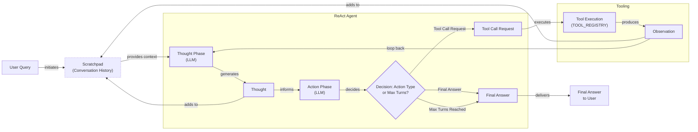

# Build a ReAct Agent From Scratch: A Step-by-Step Guide

In our last lesson, we explored the theory behind AI agent planning, focusing on frameworks that allow an LLM to reason and act. We learned that these agents can solve complex tasks by generating a thought, taking an action with a tool, and then observing the outcome to inform their next step. While understanding the theory is important, there is no substitute for building something yourself.

This lesson is 100% practical. We will build a minimal agent from scratch using only Python and the Gemini API. By implementing the full cycle of thinking, acting, and observing, you will gain a concrete mental model of how these systems work. This hands-on experience is essential for building reliable AI systems. With a working control loop in hand, you will be equipped to debug, customize, and extend agents with confidence.

We will walk through the entire process, from setting up the environment and implementing a mock tool to building the thought and action phases, orchestrating the control loop, and testing the final agent.

## Setup and Environment

Our first step is to set up a clean Python environment to ensure our code runs seamlessly. This involves loading API keys, importing the necessary packages, and initializing the Gemini client. All the code for this lesson is available in the course's GitHub repository.

1.  We begin by loading our `GOOGLE_API_KEY` from a `.env` file. We use a custom utility function, `env.load()`, which is a simple wrapper around the `python-dotenv` library. This practice separates configuration from code, a standard in software engineering that makes applications more secure and portable.
    ```python
    from lessons.utils import env

    env.load(required_env_vars=["GOOGLE_API_KEY"])
    ```
    It outputs:
    ```text
    Trying to load environment variables from /path/to/your/project/.env
    Environment variables loaded successfully.
    ```
2.  Next, we import the key packages we will use throughout our implementation. We will use `google-genai` to interact with the Gemini API.
    ```python
    from enum import Enum
    from pydantic import BaseModel, Field
    from typing import List

    from google import genai
    from google.genai import types

    from lessons.utils import pretty_print
    ```
    We also import `pydantic` and `enum`, which are essential for building robust agentic systems. Pydantic allows us to define structured data models with runtime validation. This creates a formal contract for the data flowing through our agent, ensuring it is always in the expected format and preventing bugs caused by unexpected LLM outputs.

    For example, if we expect a tool call to have a specific set of arguments, a Pydantic model will immediately raise an error if the LLM generates a response that is missing a required field.

    `Enum` helps us define a fixed set of choices, such as the different roles a message can have in our agent's memory (`USER`, `THOUGHT`, etc.). This makes our code more readable and prevents subtle bugs that can arise from simple typos in string literals.

    Finally, `pretty_print` is another custom utility we use for clear, color-coded logging of the agent's internal steps. Good observability is critical for debugging complex agentic behavior, and this utility provides a simple way to trace the agent's reasoning process.

3.  With our API key loaded, we initialize the Gemini client.
    ```python
    client = genai.Client()
    ```
    It outputs:
    ```text
    Both GOOGLE_API_KEY and GEMINI_API_KEY are set. Using GOOGLE_API_KEY.
    ```
4.  Finally, we define the model we will use. For this lesson, `gemini-2.5-flash` is a great choice as it is fast and cost-effective, perfect for the simple reasoning our agent will perform.
    ```python
    MODEL_ID = "gemini-2.5-flash"
    ```
With the client and model in place, we can now define an external capability for our agent to use.

## Tool Layer: Mock Search Implementation

To allow our agent to interact with its environment, we need to give it tools. In a production system, these tools would connect to real external services like a Google Search API or an internal company database. However, for this lesson, our goal is to focus purely on the agent's reasoning and action mechanics.

To keep things simple and predictable, we will implement a mock search tool. This approach has several educational benefits: it isolates the agent's logic from external dependencies, removes the need for API key management, and provides deterministic responses that make testing and debugging straightforward [[1]](https://www.dailydoseofds.com/ai-agents-crash-course-part-10-with-implementation/), [[2]](https://medium.com/google-cloud/building-react-agents-from-scratch-a-hands-on-guide-using-gemini-ffe4621d90ae).

1.  Our mock `search` function is a simple Python function with a clear signature and a docstring. The docstring is especially important, as modern function-calling LLMs use it to understand what the tool does and how to use it.
    ```python
    def search(query: str) -> str:
        """Search for information about a specific topic or query.

        Args:
            query (str): The search query or topic to look up.
        """
        query_lower = query.lower()

        # Predefined responses for demonstration
        if all(word in query_lower for word in ["capital", "france"]):
            return "Paris is the capital of France and is known for the Eiffel Tower."
        elif "react" in query_lower:
            return "The ReAct (Reasoning and Acting) framework enables LLMs to solve complex tasks by interleaving thought generation, action execution, and observation processing."

        # Generic response for unhandled queries
        return f"Information about '{query}' was not found."
    ```
    This function has predefined responses for a few specific queries and a fallback response for anything else. This allows us to test both successful and unsuccessful tool calls.

2.  We then create a tool registry, which is a simple dictionary that maps the tool's name to its callable function. This registry allows our agent to plan with a symbolic tool name (`"search"`) and lets our code safely resolve that name to the actual Python function for execution.
    ```python
    TOOL_REGISTRY = {
        search.__name__: search,
    }
    ```

### Moving to Production

In a real-world application, swapping this mock tool for a production API is straightforward. You would replace the body of the `search` function with a call to an external service, while keeping the function name and signature the same [[2]](https://medium.com/google-cloud/building-react-agents-from-scratch-a-hands-on-guide-using-gemini-ffe4621d90ae), [[3]](https://atalupadhyay.wordpress.com/2025/11/25/building-a-real-time-web-searching-ai-agent-with-langchain-and-google-gemini/). This modular design is a key principle of building maintainable agentic systems.

For example, to integrate a real Google Search API, you would modify the function to use a library like `requests`. This introduces several production considerations.

First is API key management. Hardcoding keys is a security risk. Instead, you should load them from environment variables, just as we did with our `GOOGLE_API_KEY` in the setup phase.

Second is error handling. Network requests can fail for many reasons, such as timeouts, invalid requests, or the service being temporarily unavailable. Your tool function must be wrapped in a `try...except` block to catch these exceptions. Instead of crashing, the tool should return an informative error message as its observation. This allows the agent to reason about the failure and potentially retry or try a different tool.

Third is rate limiting. Most APIs limit the number of requests you can make in a given period. While our simple agent is unlikely to hit these limits, production systems often need to implement strategies like exponential backoff to handle rate-limiting errors gracefully.

A production-ready search tool might look something like this:
```python
import os
import requests

def google_search(query: str) -> str:
    """Performs a Google search using the SERP API."""
    api_key = os.getenv("SERP_API_KEY")
    if not api_key:
        return "Error: SERP_API_KEY is not set."

    url = "https://serpapi.com/search"
    params = {"q": query, "api_key": api_key}

    try:
        response = requests.get(url, params=params, timeout=5)
        response.raise_for_status()  # Raise an exception for bad status codes (4xx or 5xx)
        results = response.json()
        # Process and return the most relevant snippet
        if "organic_results" in results and results["organic_results"]:
            return results["organic_results"][0]["snippet"]
        return "No results found."
    except requests.exceptions.RequestException as e:
        return f"Error performing search: {e}"
```
This example demonstrates how the core logic of the tool can be swapped out while the agent's reasoning framework remains unchanged, a testament to the power of modular tool design.

## Thought Phase: Prompt Construction and Generation

The first step in the agent's operational cycle is "Thought." This is where the agent analyzes the user's query and its conversation history to decide on the best next step. We will implement this by constructing a prompt that guides the LLM to generate a concise, purposeful thought. This phase is critical because the quality of the thought directly influences the effectiveness of the subsequent action.

1.  To inform the LLM about its capabilities, we need to provide a description of the available tools. We create a helper function, `build_tools_xml_description`, that generates a minimal XML representation of our tools using their docstrings. Using XML tags like `<tools>` and `<tool>` helps the model clearly distinguish instructions from other parts of the context. This is a common best practice in prompt engineering that improves the model's ability to parse complex inputs [[4]](https://ai.google.dev/gemini-api/docs/prompting-strategies).
    ```python
    def build_tools_xml_description(tools: dict[str, callable]) -> str:
        """Build a minimal XML description of tools using only their docstrings."""
        lines = []
        for tool_name, fn in tools.items():
            doc = (fn.__doc__ or "").strip()
            lines.append(f"\t<tool name=\"{tool_name}\">")
            if doc:
                lines.append(f"\t\t<description>")
                for line in doc.split("\n"):
                    lines.append(f"\t\t\t{line}")
                lines.append(f"\t\t</description>")
            lines.append("\t</tool>")
        return "\n".join(lines)

    tools_xml = build_tools_xml_description(TOOL_REGISTRY)

    PROMPT_TEMPLATE_THOUGHT = f"""
    You are deciding the next best step for reaching the user goal. You have some tools available to you.

    Available tools:
    <tools>
    {tools_xml}
    </tools>

    Conversation so far:
    <conversation>
    {{conversation}}
    </conversation>

    State your next thought about what to do next as one short paragraph focused on the next action you intend to take and why.
    Avoid repeating the same strategies that didn't work previously. Prefer different approaches.
    """.strip()
    ```
    The prompt defines the agent's persona ("You are deciding the next best step..."), which sets the context for its task. It includes the `<conversation>` placeholder, which will be filled with the history of interactions, providing the agent with its short-term memory. The final instruction, "Avoid repeating the same strategies," encourages the agent to be more adaptive and creative in its problem-solving, a key trait for robust agents.

2.  Let's inspect the final prompt template. It instructs the model on its role, provides the tool descriptions, includes a placeholder for the conversation history, and asks for the next thought.
    ```python
    print(PROMPT_TEMPLATE_THOUGHT)
    ```
    It outputs:
    ```text
    You are deciding the next best step for reaching the user goal. You have some tools available to you.

    Available tools:
    <tools>
        <tool name="search">
            <description>
                Search for information about a specific topic or query.
                
                Args:
                    query (str): The search query or topic to look up.
            </description>
        </tool>
    </tools>

    Conversation so far:
    <conversation>
    {conversation}
    </conversation>

    State your next thought about what to do next as one short paragraph focused on the next action you intend to take and why.
    Avoid repeating the same strategies that didn't work previously. Prefer different approaches.
    ```
3.  Finally, we implement the `generate_thought` function. It takes the current conversation history, formats the prompt with the tool descriptions, calls the Gemini API, and returns the model's generated thought as a clean string.
    ```python
    def generate_thought(conversation: str, tool_registry: dict[str, callable]) -> str:
        """Generate a thought as plain text (no structured output)."""
        tools_xml = build_tools_xml_description(tool_registry)
        prompt = PROMPT_TEMPLATE_THOUGHT.format(conversation=conversation)

        response = client.models.generate_content(
            model=MODEL_ID,
            contents=prompt
        )
        return response.text.strip()
    ```
With a coherent thought generated, the agent has a plan. The next step is to translate that plan into a concrete action, which could be either calling a tool or providing a final answer to the user.

## Action Phase: Function Calling and Parsing

The "Action" phase is where the agent commits to a course of action. It either decides to use a tool to gather more information or concludes that it has enough information to provide a final answer. We will implement this using Gemini's native function calling capabilities.

A key advantage of this approach is that we do not need to include detailed tool signatures in our prompt [[5]](https://www.philschmid.de/langgraph-gemini-2-5-react-agent). Instead, we pass the Python tool functions directly to the API configuration. The Gemini client automatically extracts the function's name, docstring (as its description), and parameter types, making them available to the model [[6]](https://ai.google.dev/gemini-api/docs/function-calling). This keeps our prompt focused on high-level strategy and simplifies tool management.

1.  First, we define two prompt templates. `PROMPT_TEMPLATE_ACTION` is the default prompt for this phase. `PROMPT_TEMPLATE_ACTION_FORCED` is a special prompt we will use to force the agent to provide a final answer when it reaches its maximum number of turns, preventing infinite loops. This is a crucial safeguard for production systems to manage costs and ensure a response is always returned.
    ```python
    PROMPT_TEMPLATE_ACTION = """
    You are selecting the best next action to reach the user goal.

    Conversation so far:
    <conversation>
    {conversation}
    </conversation>

    Respond either with a tool call (with arguments) or a final answer if you can confidently conclude.
    """.strip()

    # Dedicated prompt used when we must force a final answer
    PROMPT_TEMPLATE_ACTION_FORCED = """
    You must now provide a final answer to the user.

    Conversation so far:
    <conversation>
    {conversation}
    </conversation

    Provide a concise final answer that best addresses the user's goal.
    """.strip()
    ```
2.  Next, we define Pydantic models to represent the two possible outcomes of the action phase: a `ToolCallRequest` or a `FinalAnswer`. Using Pydantic gives us structured, validated objects instead of raw dictionaries, which makes our code safer and easier to work with.
    ```python
    class ToolCallRequest(BaseModel):
        """A request to call a tool with its name and arguments."""
        tool_name: str = Field(description="The name of the tool to call.")
        arguments: dict = Field(description="The arguments to pass to the tool.")


    class FinalAnswer(BaseModel):
        """A final answer to present to the user when no further action is needed."""
        text: str = Field(description="The final answer text to present to the user.")
    ```
3.  Now we implement the `generate_action` function. This is the core of the action phase.
    ```python
    def generate_action(conversation: str, tool_registry: dict[str, callable] | None = None, force_final: bool = False) -> (ToolCallRequest | FinalAnswer):
        """Generate an action by passing tools to the LLM and parsing function calls or final text.

        When force_final is True or no tools are provided, the model is instructed to produce a final answer and tool calls are disabled.
        """
        # Use a dedicated prompt when forcing a final answer or no tools are provided
        if force_final or not tool_registry:
            prompt = PROMPT_TEMPLATE_ACTION_FORCED.format(conversation=conversation)
            response = client.models.generate_content(
                model=MODEL_ID,
                contents=prompt
            )
            return FinalAnswer(text=response.text.strip())

        # Default action prompt
        prompt = PROMPT_TEMPLATE_ACTION.format(conversation=conversation)

        # Provide the available tools to the model; disable auto-calling so we can parse and run ourselves
        tools = list(tool_registry.values())
        config = types.GenerateContentConfig(
            tools=tools,
            automatic_function_calling={"disable": True}
        )
        response = client.models.generate_content(
            model=MODEL_ID,
            contents=prompt,
            config=config
        )

        # Extract the function call from the response (if present)
        candidate = response.candidates[0]
        parts = candidate.content.parts
        if parts and getattr(parts[0], "function_call", None):
            name = parts[0].function_call.name
            args = dict(parts[0].function_call.args) if parts[0].function_call.args is not None else {}
            return ToolCallRequest(tool_name=name, arguments=args)
        
        # Otherwise, it's a final answer
        final_answer = "".join(part.text for part in candidate.content.parts)
        return FinalAnswer(text=final_answer.strip())
    ```
    This function first checks if a final answer is being forced. If not, it configures the Gemini client with the available tools from our `tool_registry`. We set `automatic_function_calling` to `disable: True` because we want to control the execution of the tool ourselves, which allows us to log the observation and handle errors.

    The function then parses the model's response. If it contains a `function_call`, it extracts the name and arguments into a `ToolCallRequest`. Otherwise, it treats the response as a `FinalAnswer`. This robust parsing logic is critical for building a reliable agent.

### Advanced Error Handling

In a production environment, tool execution can fail for numerous reasons. A robust agent must handle these failures gracefully. Beyond the basic `try...except` block in our tool implementation, advanced strategies include retry mechanisms and circuit breakers.

For transient issues like a temporary network glitch, a simple retry logic, perhaps with an exponential backoff, can resolve the problem. For more persistent failures, a circuit breaker pattern can prevent the agent from repeatedly calling a failing service. After a certain number of failures, the circuit "opens," and subsequent calls to that tool are immediately failed for a cooldown period, preventing wasted resources [[7]](https://www.decodingai.com/p/building-production-react-agents).

When a tool fails permanently, the error message returned as an observation should be clear and structured. This allows the LLM to understand the nature of the failure and adapt its plan, for instance, by trying an alternative tool or informing the user that the request cannot be completed. Frameworks like LangGraph provide pre-built components like the `ToolNode` which incorporate some of this error handling automatically [[7]](https://www.decodingai.com/p/building-production-react-agents).

## Control Loop: Messages, Scratchpad, and Orchestration

Now we arrive at the heart of our agent: the control loop. This is where we orchestrate the Thought → Action → Observation cycle. The loop manages the agent's state, sequences the calls to our `generate_thought` and `generate_action` functions, executes tools, and processes the results.

The key to managing this process is a "scratchpad," which is a log of the entire interaction history. It records every user query, thought, tool call, and observation as a sequence of structured messages. This history provides the full context for the LLM at each step, allowing it to make informed decisions [[8]](https://www.neradot.com/post/building-a-python-react-agent-class-a-step-by-step-guide).

1.  We start by defining the data structures for our messages. A `MessageRole` enum categorizes each message type, and a `Message` Pydantic model provides a consistent structure for all entries in our scratchpad.
    ```python
    class MessageRole(str, Enum):
        """Enumeration for the different roles a message can have."""
        USER = "user"
        THOUGHT = "thought"
        TOOL_REQUEST = "tool request"
        OBSERVATION = "observation"
        FINAL_ANSWER = "final answer"


    class Message(BaseModel):
        """A message with a role and content, used for all message types."""
        role: MessageRole = Field(description="The role of the message in the ReAct loop.")
        content: str = Field(description="The textual content of the message.")

        def __str__(self) -> str:
            """Provides a user-friendly string representation of the message."""
            return f"{self.role.value.capitalize()}: {self.content}"
    ```
2.  To make debugging easier, we create a helper function to pretty-print each message. This will give us a clear, color-coded trace of the agent's execution, making it easy to follow the cycle.
    ```python
    def pretty_print_message(message: Message, turn: int, max_turns: int, header_color: str = pretty_print.Color.YELLOW, is_forced_final_answer: bool = False) -> None:
        if not is_forced_final_answer:
            title = f"{message.role.value.capitalize()} (Turn {turn}/{max_turns}):"
        else:
            title = f"{message.role.value.capitalize()} (Forced):"

        pretty_print.wrapped(
            text=message.content,
            title=title,
            header_color=header_color,
        )
    ```
3.  Next, we define the `Scratchpad` class. It holds a list of `Message` objects and provides an `append` method that both stores a new message and, if verbose mode is on, prints it. This class will be our single source of truth for the agent's history.
    ```python
    class Scratchpad:
        """Container for ReAct messages with optional pretty-print on append."""

        def __init__(self, max_turns: int) -> None:
            self.messages: List[Message] = []
            self.max_turns: int = max_turns
            self.current_turn: int = 1

        def set_turn(self, turn: int) -> None:
            self.current_turn = turn

        def append(self, message: Message, verbose: bool = False, is_forced_final_answer: bool = False) -> None:
            self.messages.append(message)
            if verbose:
                role_to_color = {
                    MessageRole.USER: pretty_print.Color.RESET,
                    MessageRole.THOUGHT: pretty_print.Color.ORANGE,
                    MessageRole.TOOL_REQUEST: pretty_print.Color.GREEN,
                    MessageRole.OBSERVATION: pretty_print.Color.YELLOW,
                    MessageRole.FINAL_ANSWER: pretty_print.Color.CYAN,
                }
                header_color = role_to_color.get(message.role, pretty_print.Color.YELLOW)
                pretty_print_message(
                    message=message,
                    turn=self.current_turn,
                    max_turns=self.max_turns,
                    header_color=header_color,
                    is_forced_final_answer=is_forced_final_answer,
                )

        def to_string(self) -> str:
            return "\n".join(str(m) for m in self.messages)
    ```
4.  Finally, we implement the main `react_agent_loop` function. This function ties everything together. It initializes the scratchpad, then enters a loop that runs for a maximum number of turns. In each turn, it generates a thought, generates an action, and then processes the result.
    ```python
    def react_agent_loop(initial_question: str, tool_registry: dict[str, callable], max_turns: int = 5, verbose: bool = False) -> str:
        """
        Implements the main ReAct (Thought -> Action -> Observation) control loop.
        Uses a unified message class for the scratchpad.
        """
        scratchpad = Scratchpad(max_turns=max_turns)

        # Add the user's question to the scratchpad
        user_message = Message(role=MessageRole.USER, content=initial_question)
        scratchpad.append(user_message, verbose=verbose)

        for turn in range(1, max_turns + 1):
            scratchpad.set_turn(turn)

            # Generate a thought based on the current scratchpad
            thought_content = generate_thought(
                scratchpad.to_string(),
                tool_registry,
            )
            thought_message = Message(role=MessageRole.THOUGHT, content=thought_content)
            scratchpad.append(thought_message, verbose=verbose)

            # Generate an action based on the current scratchpad
            action_result = generate_action(
                scratchpad.to_string(),
                tool_registry=tool_registry,
            )

            # If the model produced a final answer, return it
            if isinstance(action_result, FinalAnswer):
                final_answer = action_result.text
                final_message = Message(role=MessageRole.FINAL_ANSWER, content=final_answer)
                scratchpad.append(final_message, verbose=verbose)
                return final_answer

            # Otherwise, it is a tool request
            if isinstance(action_result, ToolCallRequest):
                action_name = action_result.tool_name
                action_params = action_result.arguments

                # Add the action to the scratchpad
                params_str = ", ".join([f"{k}='{v}'" for k, v in action_params.items()])
                action_content = f"{action_name}({params_str})"
                action_message = Message(role=MessageRole.TOOL_REQUEST, content=action_content)
                scratchpad.append(action_message, verbose=verbose)

                # Run the action and get the observation
                observation_content = ""
                tool_function = tool_registry[action_name]
                try:
                    observation_content = tool_function(**action_params)
                except Exception as e:
                    observation_content = f"Error executing tool '{action_name}': {e}"

                # Add the observation to the scratchpad
                observation_message = Message(role=MessageRole.OBSERVATION, content=observation_content)
                scratchpad.append(observation_message, verbose=verbose)

            # Check if the maximum number of turns has been reached. If so, force the action selector to produce a final answer
            if turn == max_turns:
                forced_action = generate_action(
                    scratchpad.to_string(),
                    force_final=True,
                )
                if isinstance(forced_action, FinalAnswer):
                    final_answer = forced_action.text
                else:
                    final_answer = "Unable to produce a final answer within the allotted turns."
                final_message = Message(role=MessageRole.FINAL_ANSWER, content=final_answer)
                scratchpad.append(final_message, verbose=verbose, is_forced_final_answer=True)
                return final_answer
    ```
    If the action is a `ToolCallRequest`, the loop finds the corresponding function in our `TOOL_REGISTRY`, executes it, and records the output as an "Observation." This closes the loop, as the new observation is now part of the scratchpad for the next thought phase.

    If the action is a `FinalAnswer`, the loop terminates and returns the answer. If the loop reaches `max_turns`, it calls `generate_action` one last time with `force_final=True` to ensure a graceful exit.

### Comparison with Production Frameworks

Our manual control loop is a great learning tool, but in production, you would likely use a framework like LangGraph to manage this complexity. LangGraph formalizes the agent's logic into a state graph. Each phase—thought, action, observation—becomes a node in the graph, and the transitions between them are defined by conditional edges [[9]](https://machinelearningmastery.com/building-react-agents-with-langgraph-a-beginners-guide/).

For example, a `call_model` node would handle the thought and action generation. A conditional edge would then check if the model's output contains a tool call. If it does, it routes to a `call_tool` node; otherwise, it routes to the `END` of the graph. This graph-based approach makes the control flow explicit and easier to manage, especially for complex agents with many possible states and transitions. While our from-scratch implementation gives us maximum control, a framework like LangGraph provides production-ready features like automatic state management, parallel tool execution, and better observability [[5]](https://www.philschmid.de/langgraph-gemini-2-5-react-agent).


Image 1: A flowchart illustrating the ReAct control loop, detailing the turn-based Thought-Action-Observation cycle.

This complete loop, visualized in Image 1, is the engine of our agent. It methodically builds context, reasons about its next move, and learns from its interactions with the environment.

## Tests and Traces: Success and Graceful Fallback

With our agent fully implemented, it is time to test its end-to-end behavior. By analyzing the execution traces, we can verify that the Thought-Action-Observation loop works as expected, that tools are integrated correctly, and that the agent can handle both success and failure gracefully. We will run two tests: one with a query our mock tool can answer, and one with a query it cannot.

### Successful Factual Query

First, let's ask a straightforward factual question that our mock tool is designed to handle. We will set `max_turns` to 2 and enable `verbose` to see the full trace.

1.  We run the agent loop with the question "What is the capital of France?".
    ```python
    # A straightforward question requiring a search.
    question = "What is the capital of France?"
    final_answer = react_agent_loop(question, TOOL_REGISTRY, max_turns=2, verbose=True)
    ```
    It outputs:
    ```text
    User: What is the capital of France?

    Thought (Turn 1/2):
    I need to find the capital of France. I can use the search tool to look this up.

    Tool request (Turn 1/2):
    search(query='capital of France')

    Observation (Turn 1/2):
    Paris is the capital of France and is known for the Eiffel Tower.

    Thought (Turn 2/2):
    The search tool returned the answer that Paris is the capital of France. I can now provide the final answer.

    Final answer (Turn 2/2):
    Paris is the capital of France.
    ```
    The trace clearly shows the cycle in action. In Turn 1, the agent generates a **Thought** ("I need to find the capital..."), which leads to an **Action** (a `Tool request` for `search`). The tool's output becomes the **Observation** ("Paris is the capital..."). In Turn 2, the agent's new **Thought** recognizes that the observation contains the answer, so its **Action** is to produce a `Final answer`, successfully completing the task.

### Graceful Fallback on an Unknown Query

Now, let's test how the agent handles a query that our mock tool does not have a predefined answer for. This will test its ability to reason from failure and its forced termination logic.

1.  We run the loop with the question "What is the capital of Italy?"
    ```python
    question = "What is the capital of Italy?"
    final_answer = react_agent_loop(question, TOOL_REGISTRY, max_turns=2, verbose=True)
    ```
    It outputs:
    ```text
    User: What is the capital of Italy?

    Thought (Turn 1/2):
    I need to find the capital of Italy. I can use the search tool for this.

    Tool request (Turn 1/2):
    search(query='capital of Italy')

    Observation (Turn 1/2):
    Information about 'capital of Italy' was not found.

    Thought (Turn 2/2):
    The previous search for "capital of Italy" failed. I will try a broader search for just "Italy" to see if I can find the capital that way.

    Tool request (Turn 2/2):
    search(query='Italy')

    Observation (Turn 2/2):
    Information about 'Italy' was not found.

    Final answer (Forced):
    I'm sorry, but I was unable to find the capital of Italy using the available tools.
    ```
    This trace demonstrates the agent's resilience. After the first tool call fails (Observation 1), it does not give up. Its next **Thought** is to try an adaptive strategy: a broader search. When that also fails and it hits the `max_turns` limit, the forced final answer mechanism kicks in, providing a polite and honest response. This ability to adapt and fail gracefully is a hallmark of a well-designed agent.

### Designing a Comprehensive Test Suite

While these manual tests are useful for development, a production-ready agent requires a more comprehensive test suite, much like traditional software. This includes unit tests for individual tools to ensure they handle various inputs and errors correctly. It also includes integration tests for the entire agent loop, using a "golden dataset" of queries with known expected outcomes to verify end-to-end behavior and prevent regressions.

Furthermore, you should incorporate adversarial testing by crafting ambiguous or malicious prompts designed to trick the agent or expose vulnerabilities. Performance benchmarks are also essential to measure latency and token costs per query, ensuring the agent meets operational requirements. In a real-world scenario, a failure might occur if an agent hallucinates an answer when its tools fail. For example, in the HotpotQA benchmark, early models without external tools often invented facts, a problem that the ReAct framework helps mitigate by grounding the agent in real-time observations [[10]](https://arxiv.org/pdf/2210.03629). A good test suite would include queries designed to trigger such hallucinations to verify that the agent admits it does not know the answer.

## Conclusion

By building a ReAct agent from the ground up, we have moved from abstract theory to a concrete implementation. We have seen how to orchestrate the Thought-Action-Observation loop, manage state with a scratchpad, and use an LLM's reasoning to drive tool use. This hands-on process provides a deep and practical understanding of how agentic systems function, a mental model that is essential for any AI engineer.

Even though we used a simple mock tool, the core architecture we built is robust. You can extend it with more sophisticated tools, integrate real-world APIs, and implement more complex reasoning patterns. This foundational knowledge is your starting point for building powerful, customized agents.

Remember, this article is part of our AI Agents Foundations series. In future lessons, we will build upon this foundation, exploring concepts like agent memory and Retrieval-Augmented Generation (RAG), a technique for providing agents with external knowledge.

## References

- [1] Daily Dose of DS. (2024, June 10). *AI Agents Crash Course - Part 10: ReAct Framework with Implementation*. Retrieved from https://www.dailydoseofds.com/ai-agents-crash-course-part-10-with-implementation/
- [2] Shankar, A. (2024, June 13). *Building ReAct Agents from Scratch using Gemini*. Medium. Retrieved from https://medium.com/google-cloud/building-react-agents-from-scratch-a-hands-on-guide-using-gemini-ffe4621d90ae
- [3] Upadhyay, A. (2025, November 25). *Building a real-time web searching AI agent with LangChain and Google Gemini*. WordPress. Retrieved from https://atalupadhyay.wordpress.com/2025/11/25/building-a-real-time-web-searching-ai-agent-with-langchain-and-google-gemini/
- [4] Google AI for Developers. (n.d.). *Prompt design strategies*. Retrieved from https://ai.google.dev/gemini-api/docs/prompting-strategies
- [5] Schmid, P. (n.d.). *ReAct agent from scratch with Gemini 2.5 and LangGraph*. Retrieved from https://www.philschmid.de/langgraph-gemini-2-5-react-agent
- [6] Google AI for Developers. (n.d.). *Function calling*. Retrieved from https://ai.google.dev/gemini-api/docs/function-calling
- [7] Iusztin, P. (2025, November 18). *Building Production ReAct Agents From Scratch Is Simple*. Decoding AI. Retrieved from https://www.decodingai.com/p/building-production-react-agents
- [8] Pasternak, R. (2024, November 5). *Building a Python React Agent Class: A Step-by-Step Guide*. Neradot. Retrieved from https://www.neradot.com/post/building-a-python-react-agent-class-a-step-by-step-guide
- [9] Brownlee, J. (2024, July 1). *Building ReAct Agents with LangGraph: A Beginner’s Guide*. Machine Learning Mastery. Retrieved from https://machinelearningmastery.com/building-react-agents-with-langgraph-a-beginners-guide/
- [10] Yao, S., Zhao, J., Yu, D., Du, N., Shafran, I., Narasimhan, K., & Cao, Y. (2022). *ReAct: Synergizing Reasoning and Acting in Language Models*. arXiv. Retrieved from https://arxiv.org/pdf/2210.03629