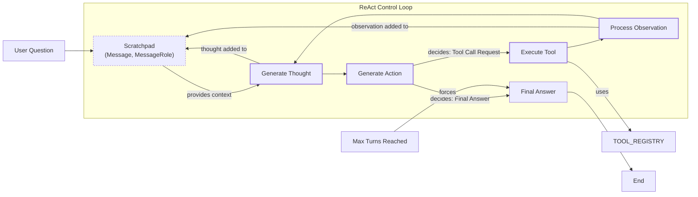

# Build a ReAct Agent From Scratch

In our previous lessons, we covered the foundations of AI Engineering, from choosing between LLM workflows and AI agents to mastering context engineering, structured outputs, and tool use. In Lesson 7, we introduced the theory behind planning and reasoning frameworks like ReAct. Now, it is time to put that theory into practice.

This lesson is 100% hands-on. We will build a minimal ReAct agent from scratch using only Python and the Gemini API. By implementing the full Thought → Action → Observation loop yourself, you will gain a concrete mental model of how these systems work. This practical understanding is essential for any AI Engineer who needs to build, debug, and extend agents with confidence.

We will walk through the entire process, step-by-step, following the code from the accompanying notebook:
-   Setting up the environment and defining a mock search tool.
-   Implementing the thought phase to generate a plan.
-   Using function calling to select and execute actions.
-   Processing observations from tool outputs.
-   Orchestrating the entire cycle within a turn-based control loop.

Let's get started.

## Setup and Environment

Our first step is to set up a clean Python environment to ensure our code runs smoothly and our outputs match the expected traces. This involves loading API keys, importing the necessary libraries, and initializing the Gemini client.

1.  We begin by loading our `GOOGLE_API_KEY` from a `.env` file using a custom utility function. This keeps our credentials secure and separate from the application code.
    ```python
    from lessons.utils import env
    
    env.load(required_env_vars=["GOOGLE_API_KEY"])
    ```
    It outputs:
    ```text
    Trying to load environment variables from /path/to/your/project/.env
    Environment variables loaded successfully.
    ```

2.  Next, we import the key packages for our agent. We use `google-genai` to interact with the Gemini API. For data modeling, we rely on `pydantic` and Python's built-in `enum` and `typing` modules. We also import a `pretty_print` utility to help visualize the agent's execution traces.
    ```python
    from enum import Enum
    from pydantic import BaseModel, Field
    from typing import List
    
    from google import genai
    from google.genai import types
    
    from lessons.utils import pretty_print
    ```
    Using Pydantic is a best practice in agent development. While a standard Python `dict` can hold data, a `pydantic.BaseModel` enforces a schema at runtime. This means if the LLM returns data in an unexpected format, Pydantic raises a clear validation error, preventing corrupted data from propagating through your system. Similarly, using `enum.Enum` for roles like `USER` or `THOUGHT` makes the code more readable and less prone to typos than using raw strings. These custom utilities for loading environment variables and printing outputs are examples of good software design, promoting modularity and reusability.

    While Pydantic's runtime validation introduces a small performance overhead compared to standard Python dataclasses, this latency is typically negligible next to the time spent on an LLM API call. For production systems, the benefits of data integrity and automatic error handling far outweigh the minimal performance cost, as it prevents silent failures and reduces the need for extra validation logic downstream [[14]](https://medium.com/@mohitcharan04/comprehensive-comparison-of-ai-agent-frameworks-bec7d25df8a6).

3.  We initialize the Gemini client, which will handle all our API requests. The client automatically detects and uses the API key we loaded earlier.
    ```python
    client = genai.Client()
    ```
    It outputs:
    ```text
    Both GOOGLE_API_KEY and GEMINI_API_KEY are set. Using GOOGLE_API_KEY.
    ```

4.  Finally, we define a constant for the model we will use. For this lesson, we will use `gemini-2.5-flash`, a model optimized for speed and cost-effectiveness, which is perfect for our simple tasks.
    ```python
    MODEL_ID = "gemini-2.5-flash"
    ```
With our client and model configured, we are ready to define the external capabilities our agent will use.

## Tool Layer: Mock Search Implementation

To allow our agent to interact with the outside world, we need to provide it with tools. For this lesson, we will implement a mock search tool. This approach lets us focus purely on the ReAct mechanics without worrying about external dependencies like API keys or network issues. A mock tool also gives us predictable responses, which is ideal for testing and debugging.

Our mock `search` function simulates a knowledge source. It takes a string query and returns a predefined answer if the query matches a known topic. If the query is not recognized, it returns a fallback message.

1.  We define the `search` function with a clear docstring. This documentation is important because, as we will see later, modern LLM APIs can automatically use docstrings to understand what a tool does and how to use it [[10]](https://ai.google.dev/gemini-api/docs/function-calling).
    ```python
    def search(query: str) -> str:
        """Search for information about a specific topic or query.
    
        Args:
            query (str): The search query or topic to look up.
        """
        query_lower = query.lower()
    
        # Predefined responses for demonstration
        if all(word in query_lower for word in ["capital", "france"]):
            return "Paris is the capital of France and is known for the Eiffel Tower."
        elif "react" in query_lower:
            return "The ReAct (Reasoning and Acting) framework enables LLMs to solve complex tasks by interleaving thought generation, action execution, and observation processing."
    
        # Generic response for unhandled queries
        return f"Information about '{query}' was not found."
    ```

2.  To manage our tools, we create a `TOOL_REGISTRY`. This dictionary maps the tool's name to its callable function. This registry allows the agent to plan using a symbolic name (`"search"`) while our code can safely resolve that name to the actual Python function for execution.
    ```python
    TOOL_REGISTRY = {
        search.__name__: search,
    }
    ```
In a production system, you would replace this mock function with calls to real external APIs. For example, to integrate a real Google Search, you could use the `requests` library to call the Custom Search JSON API. This would involve managing an API key, handling potential network errors with `try...except` blocks, and parsing the JSON response from the API. You would also need to consider rate limits and implement strategies like exponential backoff for retries. However, the core integration with the agent remains the same: the agent calls the tool by name, and the function executes the logic, returning a string observation.

## Thought Phase: Prompt Construction and Generation

The first step in the ReAct cycle is "Thought." This is where the agent analyzes the user's query and its history to form a plan. We will guide the model to produce a short, purposeful thought that outlines its next intended action and the reasoning behind it.

1.  To inform the model about its available capabilities, we create a function that builds a minimal XML description of the tools from our `TOOL_REGISTRY`. This function extracts the docstring from each tool and formats it into an XML block. XML tags are a common technique in prompt engineering to help the model distinguish between different parts of the context, such as instructions, examples, and input data [[2]](https://ai.google.dev/gemini-api/docs/prompting-strategies).
    ```python
    def build_tools_xml_description(tools: dict[str, callable]) -> str:
        """Build a minimal XML description of tools using only their docstrings."""
        lines = []
        for tool_name, fn in tools.items():
            doc = (fn.__doc__ or "").strip()
            lines.append(f"\t<tool name=\"{tool_name}\">")
            if doc:
                lines.append(f"\t\t<description>")
                for line in doc.split("\n"):
                    lines.append(f"\t\t\t{line}")
                lines.append(f"\t\t</description>")
            lines.append("\t</tool>")
        return "\n".join(lines)
    
    tools_xml = build_tools_xml_description(TOOL_REGISTRY)
    ```

2.  We then define our prompt template for the thought generation phase. This prompt instructs the agent on its goal, provides the XML description of the available tools, and includes a placeholder for the conversation history. It explicitly asks the model to state its next thought as a short paragraph.
    ```python
    PROMPT_TEMPLATE_THOUGHT = f"""
    You are deciding the next best step for reaching the user goal. You have some tools available to you.
    
    Available tools:
    <tools>
    {tools_xml}
    </tools>
    
    Conversation so far:
    <conversation>
    {{conversation}}
    </conversation>
    
    State your next thought about what to do next as one short paragraph focused on the next action you intend to take and why.
    Avoid repeating the same strategies that didn't work previously. Prefer different approaches.
    """.strip()
    ```
    Inspecting the full prompt reveals how these pieces come together.
    It outputs:
    ```text
    You are deciding the next best step for reaching the user goal. You have some tools available to you.
    
    Available tools:
    <tools>
        <tool name="search">
            <description>
                Search for information about a specific topic or query.
                
                Args:
                    query (str): The search query or topic to look up.
            </description>
        </tool>
    </tools>
    
    Conversation so far:
    <conversation>
    {conversation}
    </conversation>
    
    State your next thought about what to do next as one short paragraph focused on the next action you intend to take and why.
    Avoid repeating the same strategies that didn't work previously. Prefer different approaches.
    ```
    The output shows the `<tool>` block containing the docstring from our `search` function and the `{conversation}` placeholder ready to be filled.

3.  Finally, we implement the `generate_thought` function. It takes the current conversation history, formats the prompt template, sends it to the Gemini model, and returns the model's textual response.
    ```python
    def generate_thought(conversation: str, tool_registry: dict[str, callable]) -> str:
        """Generate a thought as plain text (no structured output)."""
        tools_xml = build_tools_xml_description(tool_registry)
        prompt = PROMPT_TEMPLATE_THOUGHT.format(conversation=conversation, tools_xml=tools_xml)
    
        response = client.models.generate_content(
            model=MODEL_ID,
            contents=prompt
        )
        return response.text.strip()
    ```
With a coherent thought generated, the agent must now decide whether to call a tool or conclude with a final answer. This brings us to the "Action" phase.

## Action Phase: Function Calling and Parsing

The "Action" phase determines the agent's concrete next step. We will use Gemini's native function calling capabilities, which allow the model to indicate its intent to use a tool in a structured format. This is more reliable than asking the model to generate a text command that we then have to parse manually.

1.  We start by defining two prompt templates for this phase. The first is the default prompt, which asks the model to choose between calling a tool or providing a final answer. The second is a special-purpose prompt used to force a final answer, which is a useful mechanism for ensuring the agent can terminate gracefully.
    ```python
    PROMPT_TEMPLATE_ACTION = """
    You are selecting the best next action to reach the user goal.
    
    Conversation so far:
    <conversation>
    {conversation}
    </conversation>
    
    Respond either with a tool call (with arguments) or a final answer if you can confidently conclude.
    """.strip()
    
    # Dedicated prompt used when we must force a final answer
    PROMPT_TEMPLATE_ACTION_FORCED = """
    You must now provide a final answer to the user.
    
    Conversation so far:
    <conversation>
    {conversation}
    </conversation>
    
    Provide a concise final answer that best addresses the user's goal.
    """.strip()
    ```
    In a ReAct loop, we need a way to prevent infinite loops or excessive costs. The `force_final` flag allows us to instruct the model to conclude and provide the best possible answer based on the information it has gathered so far. This is typically triggered when the agent reaches a predefined turn limit.

2.  Next, we define Pydantic models to represent the two possible outcomes of the action phase: a `ToolCallRequest` or a `FinalAnswer`. Using Pydantic ensures the outputs are structured and validated.
    ```python
    class ToolCallRequest(BaseModel):
        """A request to call a tool with its name and arguments."""
        tool_name: str = Field(description="The name of the tool to call.")
        arguments: dict = Field(description="The arguments to pass to the tool.")
    
    
    class FinalAnswer(BaseModel):
        """A final answer to present to the user when no further action is needed."""
        text: str = Field(description="The final answer text to present to the user.")
    ```

3.  Now we implement the `generate_action` function. This is the core of the action phase.
    ```python
    def generate_action(conversation: str, tool_registry: dict[str, callable] | None = None, force_final: bool = False) -> (ToolCallRequest | FinalAnswer):
        """Generate an action by passing tools to the LLM and parsing function calls or final text.
    
        When force_final is True or no tools are provided, the model is instructed to produce a final answer and tool calls are disabled.
        """
        # Use a dedicated prompt when forcing a final answer or no tools are provided
        if force_final or not tool_registry:
            prompt = PROMPT_TEMPLATE_ACTION_FORCED.format(conversation=conversation)
            response = client.models.generate_content(
                model=MODEL_ID,
                contents=prompt
            )
            return FinalAnswer(text=response.text.strip())
    
        # Default action prompt
        prompt = PROMPT_TEMPLATE_ACTION.format(conversation=conversation)
    
        # Provide the available tools to the model; disable auto-calling so we can parse and run ourselves
        tools = list(tool_registry.values())
        config = types.GenerateContentConfig(
            tools=tools,
            automatic_function_calling={"disable": True}
        )
        response = client.models.generate_content(
            model=MODEL_ID,
            contents=prompt,
            config=config
        )
    
        # Extract the function call from the response (if present)
        candidate = response.candidates[0]
        parts = candidate.content.parts
        if parts and getattr(parts[0], "function_call", None):
            name = parts[0].function_call.name
            args = dict(parts[0].function_call.args) if parts[0].function_call.args is not None else {}
            return ToolCallRequest(tool_name=name, arguments=args)
        
        # Otherwise, it's a final answer
        final_answer = "".join(part.text for part in candidate.content.parts)
        return FinalAnswer(text=final_answer.strip())
    ```
    A key detail here is that we pass the Python tool functions directly to the `tools` parameter in `generate_content`. The Gemini client automatically inspects these functions, extracts their name, parameters (from the signature), and description (from the docstring), and incorporates this information into the context it sends to the model. This allows us to keep our prompt clean and focused on high-level strategy, while the API handles the technical details of function calling [[10]](https://ai.google.dev/gemini-api/docs/function-calling).

    We also set `automatic_function_calling={"disable": True}`. This tells the Gemini SDK not to execute the function call automatically. Instead, it returns the model's intent to call a function, allowing our control loop to manage the execution and observation steps explicitly.

    In a production setting, robust error handling for tool execution is critical, especially since tool-calling can be a source of subtle failures. For instance, developers have reported issues with Gemini models where the agent might hallucinate tool outputs, ignore valid data returned from a tool, or prematurely claim a task is complete without verification [[15]](https://adam.holter.com/gemini-tool-calling-problems-why-it-feels-nervous-in-agents/). A common failure mode in any ReAct loop is when a tool call fails due to a transient network error or a hallucinated tool name. A simple global retry counter can be counterproductive; if the agent hallucinates a tool name like `web_browser` instead of `search`, each failed attempt consumes a retry slot that could have been used for a genuine network issue later, leading to premature task failure [[16]](https://towardsdatascience.com/your-react-agent-is-wasting-90-of-its-retries-heres-how-to-stop-it/).

    To handle this, production systems use more sophisticated patterns. Instead of global retries, you can implement per-tool circuit breakers. A circuit breaker monitors failures from a specific tool. If the failure rate exceeds a threshold, the circuit "trips" and blocks further calls to that tool for a period, preventing cascading failures and wasted resources. This is a core resilience pattern that stops the system from repeatedly calling a service that is clearly down [[17]](https://www.statsig.com/perspectives/building-fault-tolerant-systems-with-circuit-breakers). In AI agents, this can be taken further by targeting the model's internal representations. Using techniques like Representation Engineering, a circuit breaker can interrupt the agent's thought process the moment it forms an intent to take a harmful or invalid action, rerouting it before the tool is ever called [[18]](https://neuraltrust.ai/blog/circuit-breakers). The error message from any failed tool call becomes an observation itself, which a well-designed agent can use to adapt its strategy.

## Control Loop: Messages, Scratchpad, Orchestration

With the Thought and Action phases defined, we can now assemble the main ReAct control loop. This loop orchestrates the entire Thought → Action → Observation cycle. The key to this orchestration is a "scratchpad," which maintains the full history of the interaction, including user inputs, agent thoughts, tool calls, and observations.

1.  We start by defining the data structures for our messages. An `Enum` called `MessageRole` categorizes each message, and a Pydantic `Message` model provides a consistent structure for all interactions.
    ```python
    class MessageRole(str, Enum):
        """Enumeration for the different roles a message can have."""
        USER = "user"
        THOUGHT = "thought"
        TOOL_REQUEST = "tool request"
        OBSERVATION = "observation"
        FINAL_ANSWER = "final answer"
    
    
    class Message(BaseModel):
        """A message with a role and content, used for all message types."""
        role: MessageRole = Field(description="The role of the message in the ReAct loop.")
        content: str = Field(description="The textual content of the message.")
    
        def __str__(self) -> str:
            """Provides a user-friendly string representation of the message."""
            return f"{self.role.value.capitalize()}: {self.content}"
    ```

2.  A helper function, `pretty_print_message`, uses our custom utility to render each message in the notebook with a color-coded header, making the agent's trace easy to follow.
    ```python
    def pretty_print_message(message: Message, turn: int, max_turns: int, header_color: str = pretty_print.Color.YELLOW, is_forced_final_answer: bool = False) -> None:
        if not is_forced_final_answer:
            title = f"{message.role.value.capitalize()} (Turn {turn}/{max_turns}):"
        else:
            title = f"{message.role.value.capitalize()} (Forced):"
    
        pretty_print.wrapped(
            text=message.content,
            title=title,
            header_color=header_color,
        )
    ```

3.  The `Scratchpad` class manages the list of `Message` objects. Its `append` method adds a new message to the history and can optionally print it. The `to_string` method serializes the entire history into a single string, which we will feed back to the model in each turn.
    ```python
    class Scratchpad:
        """Container for ReAct messages with optional pretty-print on append."""
    
        def __init__(self, max_turns: int) -> None:
            self.messages: List[Message] = []
            self.max_turns: int = max_turns
            self.current_turn: int = 1
    
        def set_turn(self, turn: int) -> None:
            self.current_turn = turn
    
        def append(self, message: Message, verbose: bool = False, is_forced_final_answer: bool = False) -> None:
            self.messages.append(message)
            if verbose:
                role_to_color = {
                    MessageRole.USER: pretty_print.Color.RESET,
                    MessageRole.THOUGHT: pretty_print.Color.ORANGE,
                    MessageRole.TOOL_REQUEST: pretty_print.Color.GREEN,
                    MessageRole.OBSERVATION: pretty_print.Color.YELLOW,
                    MessageRole.FINAL_ANSWER: pretty_print.Color.CYAN,
                }
                header_color = role_to_color.get(message.role, pretty_print.Color.YELLOW)
                pretty_print_message(
                    message=message,
                    turn=self.current_turn,
                    max_turns=self.max_turns,
                    header_color=header_color,
                    is_forced_final_answer=is_forced_final_answer,
                )
    
        def to_string(self) -> str:
            return "\n".join(str(m) for m in self.messages)
    ```
    The design of this `Scratchpad` is simple but has important performance implications. By appending every thought, action, and observation, the context sent to the LLM grows linearly with each turn. This can become expensive and inefficient. For example, in a 10-turn loop, an accumulating scratchpad can process over 60% more tokens than a more optimized approach that only retains the most recent state. For long-running agents, this accumulating history can eventually exceed the model's context window, causing the task to fail [[19]](https://azguards.com/ai-engineering/the-memory-leak-in-the-loop-optimizing-custom-state-reducers-in-langgraph/). Production systems often mitigate this by applying compaction strategies, such as replacing older tool outputs with concise summaries to keep the active context lean while preserving key information [[20]](https://cursor.directory/plugins/context-engineering).

4.  Finally, we implement the `react_agent_loop` function. This is the heart of our agent. It initializes the scratchpad with the user's question and then iterates through the ReAct cycle for a maximum number of turns.
    ```python
    def react_agent_loop(initial_question: str, tool_registry: dict[str, callable], max_turns: int = 5, verbose: bool = False) -> str:
        """
        Implements the main ReAct (Thought -> Action -> Observation) control loop.
        Uses a unified message class for the scratchpad.
        """
        scratchpad = Scratchpad(max_turns=max_turns)
    
        # Add the user's question to the scratchpad
        user_message = Message(role=MessageRole.USER, content=initial_question)
        scratchpad.append(user_message, verbose=verbose)
    
        for turn in range(1, max_turns + 1):
            scratchpad.set_turn(turn)
    
            # Generate a thought based on the current scratchpad
            thought_content = generate_thought(
                scratchpad.to_string(),
                tool_registry,
            )
            thought_message = Message(role=MessageRole.THOUGHT, content=thought_content)
            scratchpad.append(thought_message, verbose=verbose)
    
            # Generate an action based on the current scratchpad
            action_result = generate_action(
                scratchpad.to_string(),
                tool_registry=tool_registry,
            )
    
            # If the model produced a final answer, return it
            if isinstance(action_result, FinalAnswer):
                final_answer = action_result.text
                final_message = Message(role=MessageRole.FINAL_ANSWER, content=final_answer)
                scratchpad.append(final_message, verbose=verbose)
                return final_answer
    
            # Otherwise, it is a tool request
            if isinstance(action_result, ToolCallRequest):
                action_name = action_result.tool_name
                action_params = action_result.arguments
    
                # Add the action to the scratchpad
                params_str = ", ".join([f"{k}='{v}'" for k, v in action_params.items()])
                action_content = f"{action_name}({params_str})"
                action_message = Message(role=MessageRole.TOOL_REQUEST, content=action_content)
                scratchpad.append(action_message, verbose=verbose)
    
                # Run the action and get the observation
                observation_content = ""
                tool_function = tool_registry[action_name]
                try:
                    observation_content = tool_function(**action_params)
                except Exception as e:
                    observation_content = f"Error executing tool '{action_name}': {e}"
    
                # Add the observation to the scratchpad
                observation_message = Message(role=MessageRole.OBSERVATION, content=observation_content)
                scratchpad.append(observation_message, verbose=verbose)
    
            # Check if the maximum number of turns has been reached. If so, force the action selector to produce a final answer
            if turn == max_turns:
                forced_action = generate_action(
                    scratchpad.to_string(),
                    force_final=True,
                )
                if isinstance(forced_action, FinalAnswer):
                    final_answer = forced_action.text
                else:
                    final_answer = "Unable to produce a final answer within the allotted turns."
                final_message = Message(role=MessageRole.FINAL_ANSWER, content=final_answer)
                scratchpad.append(final_message, verbose=verbose, is_forced_final_answer=True)
                return final_answer
    ```
    Inside each turn, the loop performs the following steps:
    1.  **Thought:** Calls `generate_thought` using the current scratchpad content.
    2.  **Action:** Calls `generate_action` to decide the next step.
    3.  **Termination Check:** If the action is a `FinalAnswer`, the loop ends, and the answer is returned.
    4.  **Execution & Observation:** If the action is a `ToolCallRequest`, it looks up the tool in the `TOOL_REGISTRY`, executes it, and captures the output as an `Observation` message. This observation is then appended to the scratchpad, completing the cycle.
    5.  **Max Turns Check:** If the loop reaches its final turn, it calls `generate_action` one last time with `force_final=True` to ensure a graceful exit.

This loop architecture is a direct implementation of the ReAct pattern, as shown in the diagram below.


Image 1: A flowchart illustrating the ReAct control loop, detailing the iterative Thought → Action → Observation cycle, including the role of the scratchpad and termination conditions.

## Tests and Traces: Success and Graceful Fallback

Now that we have built the complete ReAct loop, let's validate its behavior with a couple of test cases. By analyzing the printed traces, we can confirm that the agent reasons, acts, and observes as expected in both successful and unsuccessful scenarios.

### Successful Factual Query

First, let's test the agent with a straightforward factual question that our mock `search` tool can answer. We will limit the agent to two turns.

```python
# A straightforward question requiring a search.
question = "What is the capital of France?"
final_answer = react_agent_loop(question, TOOL_REGISTRY, max_turns=2, verbose=True)
```

The execution trace shows a perfect ReAct cycle:

-   **User (Turn 1/2):** The initial question is added to the scratchpad.
-   **Thought (Turn 1/2):** The agent reasons that it needs to find the capital of France and decides to use the search tool.
-   **Tool request (Turn 1/2):** It correctly forms the tool call `search(query='capital of France')`.
-   **Observation (Turn 1/2):** The mock tool returns the predefined answer: "Paris is the capital of France...".
-   **Thought (Turn 2/2):** Observing the result, the agent concludes it has found the answer and plans to present it.
-   **Final answer (Turn 2/2):** The agent provides the correct final answer, "Paris is the capital of France," and the loop terminates.

This trace confirms that our agent can successfully use a tool to find information and conclude its task within the allotted turns.

### Graceful Fallback on an Unknown Query

Next, let's see how the agent handles a query that the mock tool does not know how to answer. This tests the agent's ability to reason through failure and terminate gracefully.

```python
# An unsupported query for the mock tool.
question = "What is the capital of Italy?"
final_answer = react_agent_loop(question, TOOL_REGISTRY, max_turns=2, verbose=True)
```

The trace for this query demonstrates the agent's resilience:

-   **Turn 1:** The agent follows the same initial steps, requesting `search(query='capital of Italy')`. However, the observation is the fallback message: "Information about 'capital of Italy' was not found."
-   **Thought (Turn 2/2):** The agent recognizes the failure and adapts its strategy. It decides to try a broader search, thinking that searching for "Italy" might provide some context.
-   **Tool request (Turn 2/2):** It executes `search(query='Italy')`.
-   **Observation (Turn 2/2):** This search also fails, returning "Information about 'Italy' was not found."
-   **Final answer (Forced):** Having reached the maximum number of turns without finding an answer, the control loop triggers the forced final answer mechanism. The agent generates a polite and honest response: "I'm sorry, but I couldn't find information about the capital of Italy."

This example validates two crucial features: the agent's ability to adapt its reasoning based on observations (even negative ones) and the control loop's graceful termination when a solution cannot be found within the turn limit.

Designing a comprehensive test suite for a production agent would go much further, drawing from both traditional software engineering and active AI safety research. Beyond unit tests for tools and integration tests for the ReAct loop, robust evaluation requires testing against adversarial conditions. This involves more than just malformed outputs; it means testing an agent's skepticism when its tools might be actively misleading. Researchers formalize this threat as Adversarial Environmental Injection (AEI), where tool outputs are deliberately poisoned to deceive an agent [[21]](https://arxiv.org/html/2604.18874v1).

Open-source evaluation harnesses like Potemkin are being developed to test for these vulnerabilities. They create a "fake world" for the agent by intercepting tool calls and injecting deceptive information. These tests reveal failure modes that standard benchmarks miss, such as "navigational traps" where an agent gets stuck in infinite loops chasing phantom links in a knowledge base. Such adversarial testing is essential for building agents that can be trusted in open, uncontrolled environments [[21]](https://arxiv.org/html/2604.18874v1).

## Conclusion

In this lesson, we have moved from theory to practice, building a complete, albeit minimal, ReAct agent from scratch. By implementing the Thought-Action-Observation cycle, we have demystified the core mechanics that power modern reasoning agents. We defined tools, constructed prompts for thought and action, orchestrated the flow with a control loop, and validated the agent's behavior with concrete examples.

This hands-on experience provides a solid mental model for how these systems operate. While building from scratch is the best way to learn, in production you will often use a framework that provides more structure. For example, a library like LangGraph represents the ReAct loop as a formal graph with nodes and conditional edges. This enforces explicit state management and provides built-in support for cycles, which is more robust for complex, multi-step workflows where reliability is paramount [[22]](https://www.abstractalgorithms.dev/langgraph-react-agent-pattern)[[23]](https://dev.to/nikhil_ramank_152ca48266/-langchain-vs-langgraph-which-agent-framework-actually-delivers-in-production-2d87). Understanding the manual loop we built gives you the foundational knowledge to use, debug, and customize these frameworks effectively.

Remember that this article is part of a longer series of 9 pieces on the AI Agents Foundations that will give you the tools to morph from a Python developer to an AI Engineer. In our next lesson, we will build on this foundation by exploring how to equip agents with memory. This is a critical component for production agents, enabling them to learn from past interactions and provide more personalized, context-aware responses by integrating techniques like RAG with persistent, structured memory systems [[24]](https://medium.com/@mohitbasantani1987/building-a-react-agent-with-llm-tools-and-memory-saver-a-step-by-step-guide-1b1fee88e210).

## References

- [1] Yao, S., Zhao, J., Yu, D., Du, N., Shafran, I., Narasimhan, K., & Cao, Y. (2022). ReAct: Synergizing Reasoning and Acting in Language Models. arXiv. https://arxiv.org/pdf/2210.03629
- [2] Prompting strategies. (n.d.). Google AI for Developers. https://ai.google.dev/gemini-api/docs/prompting-strategies
- [3] Ferrag, M. A., Tihanyi, N., & Debbah, M. (2025). From LLM Reasoning to Autonomous AI Agents: A Comprehensive Review. arXiv. https://arxiv.org/pdf/2504.19678
- [4] Shankar, A. (2024). Building ReAct Agents from Scratch using Gemini. Medium. https://medium.com/google-cloud/building-react-agents-from-scratch-a-hands-on-guide-using-gemini-ffe4621d90ae
- [5] ReAct Agent. (n.d.). IBM. https://www.ibm.com/think/topics/react-agent
- [6] AI Agent Planning. (n.d.). IBM. https://www.ibm.com/think/topics/ai-agent-planning
- [7] S., E., & Zhang, B. (2024). Building effective agents. Anthropic. https://www.anthropic.com/engineering/building-effective-agents
- [8] AI Agent Orchestration. (n.d.). IBM. https://www.ibm.com/think/topics/ai-agent-orchestration
- [9] ReAct agent from scratch with Gemini 2.5 and LangGraph. (n.d.). Google AI for Developers. https://ai.google.dev/gemini-api/docs/langgraph-example
- [10] Function calling. (n.d.). Google AI for Developers. https://ai.google.dev/gemini-api/docs/function-calling
- [11] Schmid, P. (2025). ReAct agent from scratch with Gemini 2.5 and LangGraph. https://www.philschmid.de/langgraph-gemini-2-5-react-agent
- [12] Iusztin, P. (2024). Building Production ReAct Agents From Scratch Is Simple. Decoding AI. https://www.decodingai.com/p/building-production-react-agents
- [13] towardsai/course-ai-agents. (n.d.). GitHub. https://github.com/towardsai/course-ai-agents/blob/dev/lessons/08_react_practice/notebook.ipynb
- [14] Comprehensive comparison of AI agent frameworks. (2024). Medium. https://medium.com/@mohitcharan04/comprehensive-comparison-of-ai-agent-frameworks-bec7d25df8a6
- [15] Holter, A. (n.d.). Gemini Tool Calling Problems: Why It Feels Nervous in Agents. https://adam.holter.com/gemini-tool-calling-problems-why-it-feels-nervous-in-agents/
- [16] Your ReAct Agent Is Wasting 90% of Its Retries. Here’s How to Stop It. (n.d.). Towards Data Science. https://towardsdatascience.com/your-react-agent-is-wasting-90-of-its-retries-heres-how-to-stop-it/
- [17] Building Fault-Tolerant Systems with Circuit Breakers. (n.d.). Statsig. https://www.statsig.com/perspectives/building-fault-tolerant-systems-with-circuit-breakers
- [18] Using Circuit Breakers to Secure the Next Generation of AI Agents. (n.d.). NeuralTrust. https://neuraltrust.ai/blog/circuit-breakers
- [19] The Memory Leak in the Loop: Optimizing Custom State Reducers in LangGraph. (n.d.). AZguards.com. https://azguards.com/ai-engineering/the-memory-leak-in-the-loop-optimizing-custom-state-reducers-in-langgraph/
- [20] Context Engineering. (n.d.). Cursor. https://cursor.directory/plugins/context-engineering
- [21] Zhan, Z., Zhou, H., Li, Z., Jing, P., Li, K., & Haddadi, H. (2026). How Adversarial Environments Mislead Agentic AI?. arXiv. https://arxiv.org/html/2604.18874v1
- [22] The ReAct Agent Pattern. (n.d.). Abstract Algorithms. https://www.abstractalgorithms.dev/langgraph-react-agent-pattern
- [23] LangChain vs LangGraph. (n.d.). Dev.to. https://dev.to/nikhil_ramank_152ca48266/-langchain-vs-langgraph-which-agent-framework-actually-delivers-in-production-2d87
- [24] Building a ReAct Agent with LLM, Tools, and Memory Saver. (2024). Medium. https://medium.com/@mohitbasantani1987/building-a-react-agent-with-llm-tools-and-memory-saver-a-step-by-step-guide-1b1fee88e210