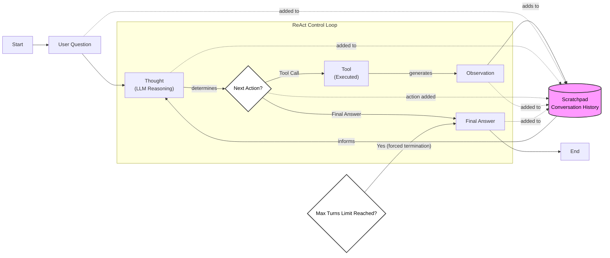

# Build a ReAct Agent From Scratch with Python and Gemini

In our previous lessons, we have covered the core theory behind AI agents. We explored the differences between workflows and agents, the importance of context engineering and structured outputs, and how to give LLMs the ability to take action with tools. In Lesson 7, we looked at the ReAct framework, a powerful pattern that enables agents to reason and act in a cycle.

Theory is essential, but to truly understand how these systems work, you need to build one. Many frameworks can get you started quickly, but they often hide the underlying mechanics. This can make it difficult to debug and customize your agents later on.

This lesson is a 100% practical, step-by-step guide to building a minimal ReAct agent from scratch. We will implement the full Thought → Action → Observation loop using only Python and the Gemini API. We will define a mock tool, generate thoughts, select actions using function calling, execute the tool, process the observation, and orchestrate the entire cycle with a control loop.

By the end of this lesson, you will have a concrete mental model of how agents operate. This hands-on experience will give you the confidence to extend, debug, and build more complex agentic systems.

## Setup and Environment

Before we start building, we need to set up our Python environment. A clean and consistent setup ensures your code runs smoothly and the outputs match our expected traces. This is a foundational step for any AI engineering project, guaranteeing reproducibility. We will follow the steps from the lesson's notebook to prepare our workspace, covering everything from loading credentials to initializing the API client.

1.  First, we load our `GOOGLE_API_KEY` from a `.env` file using a utility function. This is a standard practice that keeps our credentials secure and separate from the source code.
    
    ```python
    from lessons.utils import env
    
    env.load(required_env_vars=["GOOGLE_API_KEY"])
    ```
    
2.  Next, we import the necessary packages. This includes `google.genai` for interacting with the Gemini API, `pydantic` for data modeling and validation, and some standard Python libraries like `enum` and `typing` for creating clean and type-safe code.
    
    ```python
    from enum import Enum
    from pydantic import BaseModel, Field
    from typing import List
    
    from google import genai
    from google.genai import types
    
    from lessons.utils import pretty_print
    ```
    
3.  We initialize the Gemini client, which is our main interface for making API calls to the model. This object handles the communication with Google's backend services.
    
    ```python
    client = genai.Client()
    ```
    
    It outputs:
    
    ```text
    Both GOOGLE_API_KEY and GEMINI_API_KEY are set. Using GOOGLE_API_KEY.
    ```
    
4.  Finally, we define the model we will use. We will use `gemini-2.5-flash`, a model that is both fast and cost-effective, making it an excellent choice for development and experimentation where rapid iteration is key.
    
    ```python
    MODEL_ID = "gemini-2.5-flash"
    ```
    
With our environment configured, we can now define an external capability for our agent to use.

## Tool Layer: Mock Search Implementation

To keep our focus on the ReAct mechanics, we will use a mock `search` tool instead of making real API calls. This design choice is intentional for a few reasons. It simplifies the learning process by removing the complexity of managing external dependencies and API keys. More importantly, it provides predictable, deterministic responses, which is invaluable for testing and debugging an agent's reasoning loop [[1]](https://www.dailydoseofds.com/ai-agents-crash-course-part-10-with-implementation/), [[2]](https://medium.com/google-cloud/building-react-agents-from-scratch-a-hands-on-guide-using-gemini-ffe4621d90ae).

Our mock tool is a simple Python function. The function's docstring is especially important; it serves as the primary documentation that the LLM uses to understand the tool's purpose, its parameters, and when to use it [[3]](https://ai.google.dev/gemini-api/docs/function-calling), [[4]](https://www.anthropic.com/engineering/building-effective-agents).

1.  We define the `search` function with a clear docstring and some hardcoded responses.
    
    ```python
    def search(query: str) -> str:
        """Search for information about a specific topic or query.
    
        Args:
            query (str): The search query or topic to look up.
        """
        query_lower = query.lower()
    
        # Predefined responses for demonstration
        if all(word in query_lower for word in ["capital", "france"]):
            return "Paris is the capital of France and is known for the Eiffel Tower."
        elif "react" in query_lower:
            return "The ReAct (Reasoning and Acting) framework enables LLMs to solve complex tasks by interleaving thought generation, action execution, and observation processing."
    
        # Generic response for unhandled queries
        return f"Information about '{query}' was not found."
    ```
    
2.  We then create a `TOOL_REGISTRY`, a dictionary that maps the tool's name to its function object. This registry allows our agent to dynamically call the correct Python function based on the name provided by the LLM. In a production setting, you could easily swap this mock function with a real one that calls an external API, as long as the function signature and name remain consistent [[2]](https://medium.com/google-cloud/building-react-agents-from-scratch-a-hands-on-guide-using-gemini-ffe4621d90ae).
    
    ```python
    TOOL_REGISTRY = {
        search.__name__: search,
    }
    ```
    
Now that our agent has a tool, it needs a way to reason about when and how to use it. This brings us to the "Thought" phase of the ReAct loop.

## Thought Phase: Prompt Construction and Generation

The first step in the ReAct cycle is "Thought." This is the agent's internal monologue, where it analyzes the user's query and the conversation history to decide on a plan. This step is essential for breaking down complex problems into manageable parts. We guide this reasoning process with a carefully crafted prompt template that tells the model how to think.

1.  To inform the LLM about available tools, we create an XML description from our `TOOL_REGISTRY`. This function extracts the docstring from each tool and formats it. Using a structured format like XML is a deliberate choice. It creates unambiguous boundaries in the prompt, helping the model clearly distinguish our instructions from the tool definitions and conversation history [[5]](https://ai.google.dev/gemini-api/docs/prompting-strategies). This clarity is key to reliable instruction following.
    
    ```python
    def build_tools_xml_description(tools: dict[str, callable]) -> str:
        """Build a minimal XML description of tools using only their docstrings."""
        lines = []
        for tool_name, fn in tools.items():
            doc = (fn.__doc__ or "").strip()
            lines.append(f"\t<tool name=\"{tool_name}\">")
            if doc:
                lines.append(f"\t\t<description>")
                for line in doc.split("\n"):
                    lines.append(f"\t\t\t{line}")
                lines.append(f"\t\t</description>")
            lines.append("\t</tool>")
        return "\n".join(lines)
    
    tools_xml = build_tools_xml_description(TOOL_REGISTRY)
    ```
    
2.  We define our `PROMPT_TEMPLATE_THOUGHT`, which instructs the model to state its next thought as a short paragraph. It includes placeholders for the tool descriptions and the conversation history, providing all the necessary context for the model to reason effectively.
    
    ```python
    PROMPT_TEMPLATE_THOUGHT = f"""
    You are deciding the next best step for reaching the user goal. You have some tools available to you.
    
    Available tools:
    <tools>
    {tools_xml}
    </tools>
    
    Conversation so far:
    <conversation>
    {{conversation}}
    </conversation>
    
    State your next thought about what to do next as one short paragraph focused on the next action you intend to take and why.
    Avoid repeating the same strategies that didn't work previously. Prefer different approaches.
    """.strip()
    ```
    
    The final prompt template looks like this:
    
    ```text
    You are deciding the next best step for reaching the user goal. You have some tools available to you.
    
    Available tools:
    <tools>
    	<tool name="search">
    		<description>
    			Search for information about a specific topic or query.
    			
    			Args:
    			    query (str): The search query or topic to look up.
    		</description>
    	</tool>
    </tools>
    
    Conversation so far:
    <conversation>
    {conversation}
    </conversation>
    
    State your next thought about what to do next as one short paragraph focused on the next action you intend to take and why.
    Avoid repeating the same strategies that didn't work previously. Prefer different approaches.
    ```
    
3.  Finally, we implement the `generate_thought` function. It takes the conversation history, formats the prompt, and calls the Gemini API to generate the agent's next thought. This function is the engine of the agent's reasoning process.
    
    ```python
    def generate_thought(conversation: str, tool_registry: dict[str, callable]) -> str:
        """Generate a thought as plain text (no structured output)."""
        tools_xml = build_tools_xml_description(tool_registry)
        prompt = PROMPT_TEMPLATE_THOUGHT.format(conversation=conversation, tools_xml=tools_xml)
    
        response = client.models.generate_content(
            model=MODEL_ID,
            contents=prompt
        )
        return response.text.strip()
    ```
    
A thought is just an internal monologue. The agent must now decide whether to act on that thought by calling a tool or by concluding with an answer.

## Action Phase: Function Calling and Parsing

After generating a thought, the agent moves to the "Action" phase. Here, it decides whether to use a tool or provide a final answer. We will use Gemini's native function calling capability, a reliable method for getting structured tool calls from the model [[3]](https://ai.google.dev/gemini-api/docs/function-calling). This approach separates strategic guidance in the prompt from the technical details of the tools.

Our action prompt focuses on high-level decision-making, instructing the model to choose between a tool call and a final answer. We do not need to include tool signatures in the prompt itself. Instead, we pass the Python functions to the `tools` configuration of the Gemini API. The API automatically extracts the function name, docstring (as the description), and parameter information from the function's signature. This keeps our prompts clean and makes tool management much easier [[6]](https://www.philschmid.de/langgraph-gemini-2-5-react-agent).

1.  We define two prompt templates. The first, `PROMPT_TEMPLATE_ACTION`, is for general use. The second, `PROMPT_TEMPLATE_ACTION_FORCED`, is used to instruct the model to provide a final answer when the agent reaches its turn limit.
    
    ```python
    PROMPT_TEMPLATE_ACTION = """
    You are selecting the best next action to reach the user goal.
    
    Conversation so far:
    <conversation>
    {conversation}
    </conversation>
    
    Respond either with a tool call (with arguments) or a final answer if you can confidently conclude.
    """.strip()
    
    PROMPT_TEMPLATE_ACTION_FORCED = """
    You must now provide a final answer to the user.
    
    Conversation so far:
    <conversation>
    {conversation}
    </conversation>
    
    Provide a concise final answer that best addresses the user's goal.
    """.strip()
    ```
    
2.  We define Pydantic models to represent a `ToolCallRequest` and a `FinalAnswer`. This provides structure and validation for the model's decisions.
    
    ```python
    class ToolCallRequest(BaseModel):
        """A request to call a tool with its name and arguments."""
        tool_name: str = Field(description="The name of the tool to call.")
        arguments: dict = Field(description="The arguments to pass to the tool.")
    
    
    class FinalAnswer(BaseModel):
        """A final answer to present to the user when no further action is needed."""
        text: str = Field(description="The final answer text to present to the user.")
    ```
    
3.  The `generate_action` function orchestrates this phase. It passes the tool functions to the `tools` parameter and disables automatic function calling so we can parse the response ourselves. The logic checks if the response contains a `function_call`. If so, it extracts the name and arguments. Otherwise, it treats the response as a final answer. This handles the dual return format cleanly. Any errors in parsing, such as an unknown action, are caught to prevent crashes.
    
    ```python
    def generate_action(conversation: str, tool_registry: dict[str, callable] | None = None, force_final: bool = False) -> (ToolCallRequest | FinalAnswer):
        """Generate an action by passing tools to the LLM and parsing function calls or final text.
    
        When force_final is True or no tools are provided, the model is instructed to produce a final answer and tool calls are disabled.
        """
        if force_final or not tool_registry:
            prompt = PROMPT_TEMPLATE_ACTION_FORCED.format(conversation=conversation)
            response = client.models.generate_content(
                model=MODEL_ID,
                contents=prompt
            )
            return FinalAnswer(text=response.text.strip())
    
        prompt = PROMPT_TEMPLATE_ACTION.format(conversation=conversation)
    
        tools = list(tool_registry.values())
        config = types.GenerateContentConfig(
            tools=tools,
            automatic_function_calling={"disable": True}
        )
        response = client.models.generate_content(
            model=MODEL_ID,
            contents=prompt,
            config=config
        )
    
        candidate = response.candidates[0]
        parts = candidate.content.parts
        if parts and getattr(parts[0], "function_call", None):
            name = parts[0].function_call.name
            args = dict(parts[0].function_call.args) if parts[0].function_call.args is not None else {}
            return ToolCallRequest(tool_name=name, arguments=args)
        
        final_answer = "".join(part.text for part in candidate.content.parts)
        return FinalAnswer(text=final_answer.strip())
    ```
    
    The `force_final` flag is a simple but effective way to ensure the agent terminates cleanly after a set number of turns, preventing infinite loops.
    
    We now have the Thought and Action phases. It is time to orchestrate them in a control loop.

## Control Loop: Messages, Scratchpad, and Orchestration

The control loop is the heart of our ReAct agent. It orchestrates the Thought → Action → Observation cycle, manages the conversation history, and ensures the agent makes progress toward its goal. This is where the agentic behavior truly comes to life.

To manage the conversation, we will use a "scratchpad," a list of messages that tracks every step of the agent's process. This is analogous to human working memory, a temporary space that holds intermediate results during a multi-step task so the agent does not lose track of its reasoning process [[7]](https://dev.to/sreeni5018/the-5-types-of-ai-agent-memory-every-developer-needs-to-know-part-1-52fn). Each interaction—user query, thought, tool request, and observation—is stored as a structured message.

1.  First, we define the structure of our messages. `MessageRole` is an `Enum` that categorizes each message (e.g., `USER`, `THOUGHT`, `TOOL_REQUEST`). The `Message` class is a Pydantic model that holds the role and content. This structured format is essential for tracking the agent's state and providing clear context for future reasoning steps.
    
    ```python
    class MessageRole(str, Enum):
        """Enumeration for the different roles a message can have."""
        USER = "user"
        THOUGHT = "thought"
        TOOL_REQUEST = "tool request"
        OBSERVATION = "observation"
        FINAL_ANSWER = "final answer"
    
    
    class Message(BaseModel):
        """A message with a role and content, used for all message types."""
        role: MessageRole = Field(description="The role of the message in the ReAct loop.")
        content: str = Field(description="The textual content of the message.")
    
        def __str__(self) -> str:
            """Provides a user-friendly string representation of the message."""
            return f"{self.role.value.capitalize()}: {self.content}"
    ```
    
2.  The `Scratchpad` class manages this list of `Message` objects. It provides an `append` method to add new messages and a `to_string` method to serialize the history into a single string for the LLM's context.
    
    ```python
    class Scratchpad:
        """Container for ReAct messages with optional pretty-print on append."""
    
        def __init__(self, max_turns: int) -> None:
            self.messages: List[Message] = []
            self.max_turns: int = max_turns
            self.current_turn: int = 1
    
        def set_turn(self, turn: int) -> None:
            self.current_turn = turn
    
        def append(self, message: Message, verbose: bool = False, is_forced_final_answer: bool = False) -> None:
            self.messages.append(message)
    
        def to_string(self) -> str:
            return "\n".join(str(m) for m in self.messages)
    ```
    
3.  The `react_agent_loop` function brings everything together. It initializes the scratchpad with the user's question and then iterates through the ReAct cycle. A `max_turns` limit is an important safeguard in these feedback-driven systems, preventing the agent from getting stuck in an infinite loop if it fails to converge on an answer [[8]](https://zigment.ai/blog/react-vs-agentic-planning-understanding-ai-decision-making).
    
    Inside the loop, the agent generates a thought, then an action. If the action is a `FinalAnswer`, the loop terminates. If it is a `ToolCallRequest`, the corresponding tool is executed. The result, or an error message if the tool fails, is then added to the scratchpad as an `Observation`. This observation is essential, as it grounds the agent's next thought in the reality of the external environment, completing the cycle.
    
    ```python
    def react_agent_loop(initial_question: str, tool_registry: dict[str, callable], max_turns: int = 5, verbose: bool = False) -> str:
        """
        Implements the main ReAct (Thought -> Action -> Observation) control loop.
        Uses a unified message class for the scratchpad.
        """
        scratchpad = Scratchpad(max_turns=max_turns)
    
        user_message = Message(role=MessageRole.USER, content=initial_question)
        scratchpad.append(user_message, verbose=verbose)
    
        for turn in range(1, max_turns + 1):
            scratchpad.set_turn(turn)
    
            thought_content = generate_thought(
                scratchpad.to_string(),
                tool_registry,
            )
            thought_message = Message(role=MessageRole.THOUGHT, content=thought_content)
            scratchpad.append(thought_message, verbose=verbose)
    
            action_result = generate_action(
                scratchpad.to_string(),
                tool_registry=tool_registry,
            )
    
            if isinstance(action_result, FinalAnswer):
                final_answer = action_result.text
                final_message = Message(role=MessageRole.FINAL_ANSWER, content=final_answer)
                scratchpad.append(final_message, verbose=verbose)
                return final_answer
    
            if isinstance(action_result, ToolCallRequest):
                action_name = action_result.tool_name
                action_params = action_result.arguments
    
                params_str = ", ".join([f"{k}='{v}'" for k, v in action_params.items()])
                action_content = f"{action_name}({params_str})"
                action_message = Message(role=MessageRole.TOOL_REQUEST, content=action_content)
                scratchpad.append(action_message, verbose=verbose)
    
                observation_content = ""
                tool_function = tool_registry[action_name]
                try:
                    observation_content = tool_function(**action_params)
                except Exception as e:
                    observation_content = f"Error executing tool '{action_name}': {e}"
    
                observation_message = Message(role=MessageRole.OBSERVATION, content=observation_content)
                scratchpad.append(observation_message, verbose=verbose)
    
            if turn == max_turns:
                forced_action = generate_action(
                    scratchpad.to_string(),
                    force_final=True,
                )
                if isinstance(forced_action, FinalAnswer):
                    final_answer = forced_action.text
                else:
                    final_answer = "Unable to produce a final answer within the allotted turns."
                final_message = Message(role=MessageRole.FINAL_ANSWER, content=final_answer)
                scratchpad.append(final_message, verbose=verbose, is_forced_final_answer=True)
                return final_answer
    ```
    

This loop is the engine of our agent. It systematically progresses from reasoning to acting and back again, using observations to refine its strategy at each step.


Image 1: A flowchart illustrating the ReAct control loop, showing the Thought, Action, and Observation cycle, with a central Scratchpad and forced termination.

Now that we have a complete control loop, let's test it to see how it performs.

## Tests and Traces: Success and Graceful Fallback

With our agent fully implemented, it is time to validate its behavior. We will run two tests: a straightforward factual query to check the success path and an unsupported query to test its graceful fallback and termination logic. Analyzing the traces from these tests will confirm that our agent behaves as designed.

First, we will ask a question that our mock `search` tool can answer: `"What is the capital of France?"`

```python
question = "What is the capital of France?"
final_answer = react_agent_loop(question, TOOL_REGISTRY, max_turns=2, verbose=True)
```

The agent follows the ReAct cycle perfectly. In the first turn, it reasons that it needs to search for the capital and executes the `search` tool. After receiving the correct information in the observation, it recognizes in the second turn that it has enough information and provides the final answer: "Paris is the capital of France." This confirms that our core loop, tool integration, and answer generation are working correctly.

Next, we test the fallback mechanism with a query our mock tool cannot handle: `"What is the capital of Italy?"`. This tests the agent's ability to adapt when a tool fails to provide useful information.

```python
question = "What is the capital of Italy?"
final_answer = react_agent_loop(question, TOOL_REGISTRY, max_turns=2, verbose=True)
```

In this scenario, the first tool call results in an observation that the information was not found. The agent's trace for the second turn shows a clear change in strategy. It acknowledges the failure and attempts a broader search for "Italy." When that also fails, the agent hits the `max_turns` limit. The control loop then correctly triggers the forced final answer path, and the agent concludes with a message admitting it could not find the information. This demonstrates that our agent can handle tool failures and terminate gracefully.

These tests confirm our minimal agent works as designed, providing a solid baseline for building more advanced capabilities.

## Conclusion

In this lesson, we built a minimal ReAct agent from the ground up. We implemented the complete Thought-Action-Observation cycle, from defining a simple tool to orchestrating the entire process with a stateful control loop. This hands-on exercise demystifies what happens inside agentic frameworks and gives you a solid mental model for how these systems operate.

You now have a foundational understanding of how an agent reasons about a task, decides to use a tool, processes the outcome, and iterates until it reaches a conclusion. This core loop is the engine that powers more sophisticated agents. In our upcoming lessons, we will build upon this foundation. We will explore how to equip agents with memory to recall past interactions in Lesson 9 and how to connect them to vast knowledge bases using Retrieval-Augmented Generation (RAG) in Lesson 10.

## References

- [1] Building ReAct agents from scratch using only Python and an LLM. (2024, May 29). Daily Dose of DS. https://www.dailydoseofds.com/ai-agents-crash-course-part-10-with-implementation/
- [2] Shankar, A. (2024, June 17). Building ReAct Agents from Scratch using Gemini. Medium. https://medium.com/google-cloud/building-react-agents-from-scratch-a-hands-on-guide-using-gemini-ffe4621d90ae
- [3] Function calling. (n.d.). Google AI for Developers. https://ai.google.dev/gemini-api/docs/function-calling
- [4] Building effective agents. (2024, December 19). Anthropic. https://www.anthropic.com/engineering/building-effective-agents
- [5] Prompt design strategies. (n.d.). Google AI for Developers. https://ai.google.dev/gemini-api/docs/prompting-strategies
- [6] Schmid, P. (2024, July 1). ReAct agent from scratch with Gemini 2.5 and LangGraph. https://www.philschmid.de/langgraph-gemini-2-5-react-agent
- [7] The 5 types of AI agent memory every developer needs to know. (2024, June 3). DEV Community. https://dev.to/sreeni5018/the-5-types-of-ai-agent-memory-every-developer-needs-to-know-part-1-52fn
- [8] ReAct vs. agentic planning: Understanding AI decision-making. (n.d.). Zigment. https://zigment.ai/blog/react-vs-agentic-planning-understanding-ai-decision-making

</article>