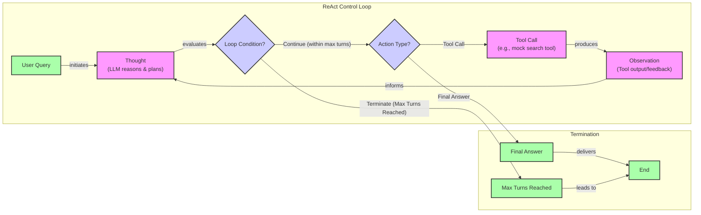

# Building a ReAct Agent From Scratch

In our previous lessons, we have covered the foundations of AI engineering, from context engineering and structured outputs to giving LLMs the ability to take action with tools. We explored the theory behind the ReAct (Reasoning and Acting) framework, one of the most effective patterns for building agents that think and act to solve problems. The core idea, first proposed by researchers at Google, is to create a synergy between reasoning and acting: reasoning helps the model create and adjust plans, while actions allow it to gather new information from external sources [[1]](https://arxiv.org/pdf/2210.03629).

Now, we move from theory to practice. This lesson is a hands-on guide to building a minimal ReAct agent from scratch using only Python and the Gemini API. We will implement the full Thought → Action → Observation loop, giving you a concrete mental model of how these systems work. Understanding this core mechanic is more valuable than relying on high-level frameworks, which can create extra layers of abstraction that make debugging difficult [[19]](https://www.anthropic.com/engineering/building-effective-agents). This approach equips you to debug, customize, and extend agents with confidence.

We will walk through the entire process, step-by-step:
1.  Setting up the environment.
2.  Defining a simple mock tool.
3.  Implementing the "Thought" phase to generate a plan.
4.  Implementing the "Action" phase using function calling.
5.  Orchestrating everything in a control loop.
6.  Testing our agent to see it in action.

## Setup and Environment

Before we start building, we need to set up our Python environment. This ensures our code runs smoothly and that our outputs match the expected traces.

1.  First, we load our `GOOGLE_API_KEY` from the environment. Our utility function handles this, making sure the necessary keys are available.
2.  Next, we import the required libraries, including `google-genai` for the Gemini API, `pydantic` for data structures, and some helper utilities for printing outputs.
3.  We initialize the Gemini client, which is our main interface to the API. You might see a warning if you have multiple API keys set, but the client will default to the correct one.
    ```python
    import google.generativetai as genai
    from lessons.utils import env
    
    env.load(required_env_vars=["GOOGLE_API_KEY"])
    client = genai.Client()
    ```
4.  Finally, we define the model we will use. For this exercise, we will use `"gemini-1.5-flash"`, a fast and cost-effective model perfect for our needs.
    ```python
    MODEL_ID = "gemini-1.5-flash"
    ```
With the client and model in place, we can now define an external capability for our agent to use.

## Tool Layer: Mock Search Implementation

To keep our focus on the ReAct mechanics, we will use a simple mock search tool instead of making real API calls. This approach simplifies the learning process by eliminating external dependencies and providing predictable responses for testing.

Our mock tool is a Python function named `search`. Its docstring is important, as it describes the tool's purpose to the LLM. The function takes a `query` and returns a hardcoded response for specific inputs like "capital of France" or a fallback message if the query is not recognized.

```python
def search(query: str) -> str:
    """
    Searches for information on a given topic and returns a summary.
    """
    print(f"Searching for: {query}")
    if query == "capital of France":
        return "Paris is the capital of France and is known for the Eiffel Tower."
    else:
        return f"Information about '{query}' was not found."
```
In a production system, you could easily replace this mock function with a real implementation that calls an external API like Google Search or queries a domain-specific knowledge base, all while preserving the same function signature [[4]](https://medium.com/google-cloud/building-react-agents-from-scratch-a-hands-on-guide-using-gemini-ffe4621d90ae). The design of this function serves as the agent-computer interface (ACI), and its clarity is as important as the main prompt. A good tool definition should make its purpose and parameters obvious to the model, minimizing the chance of misuse [[19]](https://www.anthropic.com/engineering/building-effective-agents). Now that the agent has a tool, it needs to be able to *think* about when to use it.

## Thought Phase: Prompt Construction and Generation

The "Thought" phase is where the agent reasons about the user's query and plans its next step. This internal monologue is generated by the LLM, guided by a carefully crafted prompt.

1.  We start by creating an XML description of our available tools. This format helps the LLM clearly distinguish the tools it can use. Using structured tags like `<tools>` is an effective strategy for Gemini, as it helps separate instructions from context and improves the model's adherence to the prompt [[18]](https://ai.google.dev/gemini-api/docs/prompting-strategies). The function `build_tools_xml_description` takes our tool registry and generates an XML block containing the tool's name and its docstring.
2.  Next, we define our prompt template. It instructs the agent to analyze the conversation history and available tools, then produce a "thought" explaining its reasoning.
    ```python
    PROMPT_TEMPLATE_THOUGHT = """
    You are a helpful assistant. Your goal is to answer the user's query.
    To do this, you have access to the following tools:
    <tools>
    {tools_xml}
    </tools>
    
    Here is the conversation so far:
    <conversation>
    {conversation}
    </conversation>
    
    Based on the conversation, what is your next thought?
    Your thought should be a brief, clear, and concise plan for your next action.
    """
    ```
3.  We create a helper function, `generate_thought`, that formats this prompt with the current conversation and tool descriptions, then calls the Gemini model to generate the thought.
    ```python
    def generate_thought(conversation: str, tool_registry: dict) -> str:
        """
        Generates a thought based on the conversation and available tools.
        """
        tools_xml = build_tools_xml_description(tool_registry)
        prompt = PROMPT_TEMPLATE_THOUGHT.format(
            tools_xml=tools_xml, conversation=conversation
        )
        response = client.models.generate_content(model=MODEL_ID, contents=prompt)
        return response.text.strip()
    ```
A thought is just an intention. Now, we need to turn that intention into a concrete action.

## Action Phase: Function Calling and Parsing

The "Action" phase determines the agent's next move: either call a tool or provide a final answer. We leverage Gemini's native function calling capabilities to make this decision. This modern approach is more reliable than older methods that relied on parsing raw text, which was often prone to errors and hallucinations [[15]](https://www.philschmid.de/langgraph-gemini-2-5-react-agent).

The key advantage of this approach is that we do not need to include detailed tool signatures in our system prompt. Instead, we pass the function definitions directly to the model's `tools` configuration. Gemini automatically extracts the function name, docstring (as the description), and parameters from the Python function signature [[5]](https://ai.google.dev/gemini-api/docs/function-calling). This keeps our prompt clean and focused on strategic guidance.

1.  We define a system prompt that instructs the agent to decide on its next action based on the conversation and its previous thought.
    ```python
    PROMPT_TEMPLATE_ACTION = """
    You are a helpful assistant. Your goal is to answer the user's query.
    Based on the conversation so far, please decide on your next action.
    
    Here is the conversation so far:
    <conversation>
    {conversation}
    </conversation>
    
    Your previous thought was:
    <thought>
    {thought}
    </thought>
    
    Based on your thought, should you use a tool or provide a final answer?
    """
    ```
2.  The `generate_action` function takes the conversation and the last thought, then calls the Gemini model with our `search` tool configured.
    ```python
    from google.genai.types import Tool

    def generate_action(conversation: str, thought: str, tool_registry: dict):
        # ... (prompt formatting) ...
        
        tools = Tool(function_declarations=[...]) # Tool declarations from registry
        
        response = client.models.generate_content(
            model=MODEL_ID, contents=prompt, tools=[tools]
        )
        
        # ... (response parsing) ...
    ```
3.  After the model responds, we parse its output. If the response contains a `function_call`, we extract its name and arguments. If not, we assume it is a final answer. This logic allows us to distinguish between a tool invocation and a concluding statement.
    ```python
    # Inside generate_action
    part = response.candidates[0].content.parts[0]
    if hasattr(part, "function_call"):
        function_call = part.function_call
        return "tool_code", {
            "name": function_call.name,
            "args": dict(function_call.args),
        }
    else:
        return "text", response.text
    ```
We now have the individual components for thought and action. The next step is to orchestrate them in a continuous loop.

## ReAct Control Loop: Messages, Scratchpad, and Orchestration

The control loop is the engine that drives the ReAct agent, orchestrating the full Thought-Action-Observation cycle. It manages the conversation history, executes actions, and processes feedback, allowing the agent to reason iteratively. This cycle inherently creates a feedback loop where the model problem-solves by repeating the interleaved process until a goal is met [[21]](https://www.ibm.com/think/topics/react-agent). This iterative process of action sequencing is a fundamental part of how planning agents operate to achieve complex goals [[20]](https://www.ibm.com/think/topics/ai-agent-planning).

To manage the history, we first define simple `MessageRole` and `Message` classes. These structures help us log each step of the process—user queries, thoughts, tool requests, observations, and final answers—into a "scratchpad." This scratchpad serves as the agent's short-term memory.

```python
from enum import Enum
from pydantic import BaseModel

class MessageRole(str, Enum):
    USER = "USER"
    THOUGHT = "THOUGHT"
    TOOL_REQUEST = "TOOL_REQUEST"
    OBSERVATION = "OBSERVATION"
    FINAL_ANSWER = "FINAL_ANSWER"

class Message(BaseModel):
    role: MessageRole
    content: str
```

The core of the orchestration is the `react_agent_loop` function. This function runs a turn-based loop that continues until the agent provides a final answer or reaches a maximum number of iterations.


Image 1: A flowchart illustrating the core ReAct (Reasoning and Acting) control loop, showing the iterative Thought-Action-Observation cycle and two termination points: Final Answer or Max Turns Reached.

Inside each turn, the loop performs the following steps:
1.  **Thought:** It calls `generate_thought` to determine the agent's next plan and adds it to the scratchpad.
2.  **Action:** It calls `generate_action`. If the model decides to use a tool, the loop proceeds to the observation phase. If it returns a final answer, the loop terminates.
3.  **Observation:** If a tool is called, the loop looks up the corresponding function in our `TOOL_REGISTRY` and executes it. The tool's output (the observation) is captured and added to the scratchpad. The loop then continues to the next turn, where the agent can reason based on this new information.

The loop also includes a safeguard: if the maximum number of turns is reached, it forces the agent to generate a final answer based on the information gathered so far. This prevents infinite loops and ensures the agent always concludes. With the full loop implemented, we are ready to test it.

## Tests and Traces: Success and Graceful Fallback

A key motivation for the ReAct framework was to overcome common LLM failure modes like hallucination and error propagation by grounding the model in external information [[1]](https://arxiv.org/pdf/2210.03629). To validate our agent, we will run two tests: one success case where our tool has the answer, and one fallback case where it does not. Analyzing the traces confirms that our loop, tool integration, and termination logic work as designed.

### Success Case

First, we ask a simple factual question: `"What is the capital of France?"`. We set a limit of two turns.

```python
query = "What is the capital of France?"
react_agent_loop(query, TOOL_REGISTRY, max_turns=2, verbose=True)
```
The agent's trace shows a clear, successful execution:
*   **Thought (Turn 1/2):** The agent reasons that it needs to use the search tool to find the capital of France.
*   **Tool Request (Turn 1/2):** It correctly calls `search(query='capital of France')`.
*   **Observation (Turn 1/2):** Our mock tool returns, `"Paris is the capital of France and is known for the Eiffel Tower."`.
*   **Thought (Turn 2/2):** The agent observes that it has found the answer and plans to communicate it.
*   **Final Answer (Turn 2/2):** The agent concludes with the correct answer: `"Paris is the capital of France."`.

The agent successfully found the information and answered within the turn limit.

### Graceful Fallback Case

Next, we test the agent with a query our mock tool does not recognize: `"What is the capital of Italy?"`.

```python
query = "What is the capital of Italy?"
react_agent_loop(query, TOOL_REGISTRY, max_turns=2, verbose=True)
```
The trace demonstrates the agent's ability to handle failure and adapt:
*   **Thought (Turn 1/2):** The agent decides to search for "capital of Italy."
*   **Tool Request (Turn 1/2):** It calls `search(query='capital of Italy')`.
*   **Observation (Turn 1/2):** The tool returns, `"Information about 'capital of Italy' was not found."`.
*   **Thought (Turn 2/2):** Observing the failure, the agent tries a broader strategy: searching for just "Italy".
*   **Tool Request (Turn 2/2):** It calls `search(query='Italy')`.
*   **Observation (Turn 2/2):** The tool fails again.
*   **Final Answer (Forced):** Having reached the maximum turns, the agent is forced to conclude, admitting, `"I'm sorry, but I couldn't find information about the capital of Italy."`.

These tests confirm our from-scratch implementation works correctly, providing a solid foundation for building more advanced agents.

## Conclusion

We have successfully built a minimal but complete ReAct agent from scratch. By implementing each component—the tool, the thought and action phases, and the control loop—we have gained a concrete mental model of the Thought-Action-Observation cycle. This hands-on experience is one of the most effective ways to understand how agentic systems truly operate under the hood.

This foundational knowledge is essential for any AI engineer. It prepares you to build more sophisticated systems by adhering to core principles like simplicity in design, transparency in the agent's reasoning, and a carefully crafted agent-computer interface through well-documented tools [[19]](https://www.anthropic.com/engineering/building-effective-agents). In our upcoming lessons, we will build on this foundation to explore how to equip agents with long-term Memory (Lesson 9) and enhance their knowledge with Retrieval-Augmented Generation (Lesson 10).

## References

- [1] Yao, S., Zhao, J., Yu, D., Du, N., Shafran, I., Narasimhan, K., & Cao, Y. (2022). *ReAct: Synergizing Reasoning and Acting in Language Models*. arXiv. [https://arxiv.org/pdf/2210.03629](https://arxiv.org/pdf/2210.03629)
- [2] (n.d.). *ReAct agent from scratch with Gemini 1.5 and LangGraph*. Google AI for Developers. [https://ai.google.dev/gemini-api/docs/langgraph-example](https://ai.google.dev/gemini-api/docs/langgraph-example)
- [3] Ferrag, M. A., Tihanyi, N., & Debbah, M. (2025). *From LLM Reasoning to Autonomous AI Agents: A Comprehensive Review*. arXiv. [https://arxiv.org/pdf/2504.19678](https://arxiv.org/pdf/2504.19678)
- [4] Shankar, A. (2024, July 15). *Building ReAct Agents from Scratch using Gemini*. Medium. [https://medium.com/google-cloud/building-react-agents-from-scratch-a-hands-on-guide-using-gemini-ffe4621d90ae](https://medium.com/google-cloud/building-react-agents-from-scratch-a-hands-on-guide-using-gemini-ffe4621d90ae)
- [5] (n.d.). *Function calling*. Google AI for Developers. [https://ai.google.dev/gemini-api/docs/function-calling](https://ai.google.dev/gemini-api/docs/function-calling)
- [6] Iusztin, P. (2024, September 2). *Building Production ReAct Agents From Scratch Is Simple*. Decoding AI. [https://www.decodingai.com/p/building-production-react-agents](https://www.decodingai.com/p/building-production-react-agents)
- [7] Pasternak, R. (2024, November 5). *Building a Python React Agent Class: A Step-by-Step Guide*. Neradot. [https://www.neradot.com/post/building-a-python-react-agent-class-a-step-by-step-guide](https://www.neradot.com/post/building-a-python-react-agent-class-a-step-by-step-guide)
- [8] Brownlee, J. (2024, July 1). *Building ReAct Agents with LangGraph: A Beginner’s Guide*. Machine Learning Mastery. [https://machinelearningmastery.com/building-react-agents-with-langgraph-a-beginners-guide/](https://machinelearningmastery.com/building-react-agents-with-langgraph-a-beginners-guide/)
- [9] (n.d.). *AI Agents Crash Course - Part 10: ReAct Framework with Implementation*. Daily Dose of DS. [https://www.dailydoseofds.com/ai-agents-crash-course-part-10-with-implementation/](https://www.dailydoseofds.com/ai-agents-crash-course-part-10-with-implementation/)
- [10] Roelants, P. (2023, April 16). *ReAct with OpenAI functions*. Peter Roelants. [https://peterroelants.github.io/posts/react-openai-function-calling/](https://peterroelants.github.io/posts/react-openai-function-calling/)
- [11] (2024, June 10). *Implement ReAct Agentic Pattern from scratch*. Daily Dose of DS. [https://blog.dailydoseofds.com/p/implement-react-agentic-pattern-from](https://blog.dailydoseofds.com/p/implement-react-agentic-pattern-from)
- [12] (2024, July 23). *Beyond the Prompt: Engineering the Thought-Action-Observation Loop*. Towards AI. [https://pub.towardsai.net/beyond-the-prompt-engineering-the-thought-action-observation-loop-2e1fd99114d2](https://pub.towardsai.net/beyond-the-prompt-engineering-the-thought-action-observation-loop-2e1fd99114d2)
- [13] (2024, May 22). *AI Agents (IV): AI Agents through the Thought-Action-Observation (TAO) Cycle*. Stackademic. [https://blog.stackademic.com/ai-agents-iv-ai-agents-through-the-thought-action-observation-tao-cycle-3dfe2eb76629](https://blog.stackademic.com/ai-agents-iv-ai-agents-through-the-thought-action-observation-tao-cycle-3dfe2eb76629)
- [14] (n.d.). *The agent steps and structure*. Hugging Face. [https://huggingface.co/learn/agents-course/unit1/agent-steps-and-structure](https://huggingface.co/learn/agents-course/unit1/agent-steps-and-structure)
- [15] Schmid, P. (2024, June 17). *ReAct agent from scratch with Gemini 1.5 and LangGraph*. Philipp Schmid. [https://www.philschmid.de/langgraph-gemini-2-5-react-agent](https://www.philschmid.de/langgraph-gemini-2-5-react-agent)
- [16] (2024, June 26). *Build an AI Coding Agent with Python and Gemini*. freeCodeCamp.org. [https://www.freecodecamp.org/news/build-an-ai-coding-agent-with-python-and-gemini/](https://www.freecodecamp.org/news/build-an-ai-coding-agent-with-python-and-gemini/)
- [17] Upadhyay, A. (2024, November 25). *Building a Real-time Web Searching AI Agent with Langchain and Google Gemini*. Atal Upadhyay's Blog. [https://atalupadhyay.wordpress.com/2024/11/25/building-a-real-time-web-searching-ai-agent-with-langchain-and-google-gemini/](https://atalupadhyay.wordpress.com/2024/11/25/building-a-real-time-web-searching-ai-agent-with-langchain-and-google-gemini/)
- [18] (n.d.). *Prompting strategies*. Google AI for Developers. [https://ai.google.dev/gemini-api/docs/prompting-strategies](https://ai.google.dev/gemini-api/docs/prompting-strategies)
- [19] (2024, December 19). *Building effective agents*. Anthropic. [https://www.anthropic.com/engineering/building-effective-agents](https://www.anthropic.com/engineering/building-effective-agents)
- [20] Stryker, C. (n.d.). *AI Agent Planning*. IBM. [https://www.ibm.com/think/topics/ai-agent-planning](https://www.ibm.com/think/topics/ai-agent-planning)
- [21] Bergmann, D. (n.d.). *ReAct Agent*. IBM. [https://www.ibm.com/think/topics/react-agent](https://www.ibm.com/think/topics/react-agent)