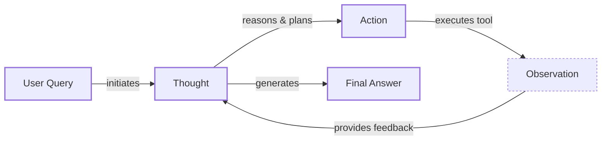

# Lesson 8: Building a Minimal ReAct Agent from Scratch

In our previous lessons, we have covered the theoretical foundations of AI engineering. We have explored the agent landscape, learned how to engineer context, produce structured outputs, and give agents tools to interact with the world. We also looked at the theory behind reasoning frameworks like ReAct (Reasoning and Acting) [[1]](https://arxiv.org/pdf/2210.03629). Now, it is time to put that theory into practice.

This lesson is a hands-on workshop. We will build a minimal ReAct agent from the ground up using Python and the Gemini API. You will implement the complete Thought → Action → Observation cycle, which is the core engine of modern autonomous agents [[2]](https://www.ibm.com/think/topics/react-agent). By building this loop yourself, you will gain a concrete mental model of how these systems work, moving from abstract concepts to tangible code. This foundational understanding is what separates building prototypes from shipping production-grade AI.

We will walk through the entire process, step-by-step:
- Setting up the environment.
- Defining a mock tool for the agent to use.
- Generating thoughts to plan the next action.
- Selecting and executing actions with function calling.
- Processing observations to inform the next reasoning step.
- Orchestrating the entire cycle within a control loop.

Let's get building.

## Setup and Environment

First, we need to set up our Python environment to ensure the code runs smoothly. This involves loading our API keys, importing the necessary libraries, and initializing the Gemini client. A consistent setup ensures that your outputs will match the expected traces as we progress through the lesson.

1. We start by loading our environment variables. We use a simple utility function for this, which looks for a `.env` file in our project.
    ```python
    from lessons.utils import env
    
    env.load(required_env_vars=["GOOGLE_API_KEY"])
    ```
    It outputs:
    ```text
    Trying to load environment variables from .../.env
    Environment variables loaded successfully.
    ```

2. Next, we import the key packages we will use, including `google.genai` for the Gemini API, `pydantic` for data structures, and some standard Python libraries.
    ```python
    from enum import Enum
    from pydantic import BaseModel, Field
    from typing import List
    
    from google import genai
    from google.genai import types
    
    from lessons.utils import pretty_print
    ```

3. We initialize the Gemini client. The client automatically uses the API key we loaded.
    ```python
    client = genai.Client()
    ```
    It outputs:
    ```text
    Both GOOGLE_API_KEY and GEMINI_API_KEY are set. Using GOOGLE_API_KEY.
    ```

4. Finally, we define the model we will use. For this lesson, we will use `gemini-2.5-flash`, which is fast and cost-effective for the tasks we are implementing.
    ```python
    MODEL_ID = "gemini-2.5-flash"
    ```
With the client and model ready, we can now define the external capabilities our agent will use.

## Tool Layer: Mock Search Implementation

To keep our focus on the ReAct mechanics, we will use a mock `search` tool instead of making real API calls. This approach simplifies the learning process by providing predictable responses and removing the need for external dependencies or API keys. In a production system, you would replace this mock function with a real implementation that calls an external API like Google Search or a domain-specific knowledge base [[3]](https://medium.com/google-cloud/building-react-agents-from-scratch-a-hands-on-guide-using-gemini-ffe4621d90ae).

1. The tool is a simple Python function. Its docstring is important, as it provides the description the LLM will use to decide when to call this tool.
    ```python
    def search(query: str) -> str:
        """Search for information about a specific topic or query.
    
        Args:
            query (str): The search query or topic to look up.
        """
        query_lower = query.lower()
    
        # Predefined responses for demonstration
        if all(word in query_lower for word in ["capital", "france"]):
            return "Paris is the capital of France and is known for the Eiffel Tower."
        elif "react" in query_lower:
            return "The ReAct (Reasoning and Acting) framework enables LLMs to solve complex tasks by interleaving thought generation, action execution, and observation processing."
    
        # Generic response for unhandled queries
        return f"Information about '{query}' was not found."
    ```

2. We also create a tool registry, which is a dictionary that maps the tool's name to the actual Python function. This allows our agent to safely execute the correct function based on the name provided by the LLM.
    ```python
    TOOL_REGISTRY = {
        search.__name__: search,
    }
    ```

This simple tool layer gives our agent a capability to "act" upon its environment. Now, let's implement the reasoning component that decides when and how to use this tool.

## Thought Phase: Prompt Construction and Generation

The first step in the ReAct loop is "Thought." This is where the agent analyzes the user's query and its history to decide what to do next. It is an internal monologue that guides its actions [[4]](https://www.ibm.com/think/topics/ai-agent-planning). We will generate this thought by prompting the LLM with a specific template.

1. First, we create a helper function to format our tool definitions into an XML structure. As we discussed in Lesson 3, using XML tags helps the model distinguish between different parts of the context. This is not just a stylistic choice; official Google documentation confirms that using clear delimiters like XML helps the model separate instructions from data, which improves reasoning performance [[7]](https://ai.google.dev/gemini-api/docs/prompting-strategies). This function takes our `TOOL_REGISTRY` and creates a minimal description using each tool's docstring.
    ```python
    def build_tools_xml_description(tools: dict[str, callable]) -> str:
        """Build a minimal XML description of tools using only their docstrings."""
        lines = []
        for tool_name, fn in tools.items():
            doc = (fn.__doc__ or "").strip()
            lines.append(f"\t<tool name=\"{tool_name}\">")
            if doc:
                lines.append(f"\t\t<description>")
                for line in doc.split("\n"):
                    lines.append(f"\t\t\t{line}")
                lines.append(f"\t\t</description>")
            lines.append("\t</tool>")
        return "\n".join(lines)
    
    tools_xml = build_tools_xml_description(TOOL_REGISTRY)
    ```

2. Next, we define the prompt template for the thought generation phase. It includes placeholders for the available tools and the conversation history. The prompt instructs the model to state its next thought as a short paragraph focused on the next intended action.
    ```python
    PROMPT_TEMPLATE_THOUGHT = f"""
    You are deciding the next best step for reaching the user goal. You have some tools available to you.
    
    Available tools:
    <tools>
    {tools_xml}
    </tools>
    
    Conversation so far:
    <conversation>
    {{conversation}}
    </conversation>
    
    State your next thought about what to do next as one short paragraph focused on the next action you intend to take and why.
    Avoid repeating the same strategies that didn't work previously. Prefer different approaches.
    """.strip()
    ```

3. Let's inspect the final prompt.
    ```python
    print(PROMPT_TEMPLATE_THOUGHT)
    ```
    It outputs:
    ```text
    You are deciding the next best step for reaching the user goal. You have some tools available to you.
    
    Available tools:
    <tools>
        <tool name="search">
            <description>
                Search for information about a specific topic or query.
                
                Args:
                    query (str): The search query or topic to look up.
            </description>
        </tool>
    </tools>
    
    Conversation so far:
    <conversation>
    {conversation}
    </conversation>
    
    State your next thought about what to do next as one short paragraph focused on the next action you intend to take and why.
    Avoid repeating the same strategies that didn't work previously. Prefer different approaches.
    ```
    The output shows the full prompt with the `<tool>` block correctly populated from our `search` function's docstring.

4. Finally, we implement the `generate_thought` function. It takes the conversation history, formats the prompt, calls the Gemini model, and returns the generated thought as plain text.
    ```python
    def generate_thought(conversation: str, tool_registry: dict[str, callable]) -> str:
        """Generate a thought as plain text (no structured output)."""
        tools_xml = build_tools_xml_description(tool_registry)
        prompt = PROMPT_TEMPLATE_THOUGHT.format(conversation=conversation)
    
        response = client.models.generate_content(
            model=MODEL_ID,
            contents=prompt
        )
        return response.text.strip()
    ```
With a coherent thought generated, the agent must now decide whether to call a tool or conclude with a final answer. This brings us to the "Action" phase.

## Action Phase: Function Calling and Parsing

The "Action" phase is where the agent translates its thought into a concrete step. It either selects a tool to use or decides it has enough information to provide a final answer. We will use Gemini's native function calling capability, which we introduced in Lesson 6, to handle this [[5]](https://ai.google.dev/gemini-api/docs/function-calling).

This approach is more robust than manually prompting for JSON and parsing it. When we provide Python functions directly to the Gemini API, it automatically handles the extraction of the function's name, description (from the docstring), and parameters. This allows our prompt to focus on high-level strategy, keeping it clean and easy to manage [[6]](https://www.anthropic.com/engineering/building-effective-agents).

1. We define two prompt templates. The first is for the standard action step, and the second is a specialized version used to force a final answer, which is useful for gracefully terminating the loop.
    ```python
    PROMPT_TEMPLATE_ACTION = """
    You are selecting the best next action to reach the user goal.
    
    Conversation so far:
    <conversation>
    {conversation}
    </conversation>
    
    Respond either with a tool call (with arguments) or a final answer if you can confidently conclude.
    """.strip()
    
    # Dedicated prompt used when we must force a final answer
    PROMPT_TEMPLATE_ACTION_FORCED = """
    You must now provide a final answer to the user.
    
    Conversation so far:
    <conversation>
    {conversation}
    </conversation>
    
    Provide a concise final answer that best addresses the user's goal.
    """.strip()
    ```

2. We define Pydantic models to represent the two possible outcomes of the action phase: a `ToolCallRequest` or a `FinalAnswer`. This provides the structure we need for parsing the model's response.
    ```python
    class ToolCallRequest(BaseModel):
        """A request to call a tool with its name and arguments."""
        tool_name: str = Field(description="The name of the tool to call.")
        arguments: dict = Field(description="The arguments to pass to the tool.")
    
    
    class FinalAnswer(BaseModel):
        """A final answer to present to the user when no further action is needed."""
        text: str = Field(description="The final answer text to present to the user.")
    ```

3. The `generate_action` function orchestrates this phase. It selects the appropriate prompt, configures the Gemini client with the available tools, and calls the model. We disable automatic function calling so we can parse the response ourselves and maintain control over the execution loop.
    ```python
    def generate_action(conversation: str, tool_registry: dict[str, callable] | None = None, force_final: bool = False) -> (ToolCallRequest | FinalAnswer):
        """Generate an action by passing tools to the LLM and parsing function calls or final text.
    
        When force_final is True or no tools are provided, the model is instructed to produce a final answer and tool calls are disabled.
        """
        # Use a dedicated prompt when forcing a final answer or no tools are provided
        if force_final or not tool_registry:
            prompt = PROMPT_TEMPLATE_ACTION_FORCED.format(conversation=conversation)
            response = client.models.generate_content(
                model=MODEL_ID,
                contents=prompt
            )
            return FinalAnswer(text=response.text.strip())
    
        # Default action prompt
        prompt = PROMPT_TEMPLATE_ACTION.format(conversation=conversation)
    
        # Provide the available tools to the model; disable auto-calling so we can parse and run ourselves
        tools = list(tool_registry.values())
        config = types.GenerateContentConfig(
            tools=tools,
            automatic_function_calling={"disable": True}
        )
        response = client.models.generate_content(
            model=MODEL_ID,
            contents=prompt,
            config=config
        )
    
        # Extract the function call from the response (if present)
        candidate = response.candidates[0]
        parts = candidate.content.parts
        if parts and getattr(parts[0], "function_call", None):
            name = parts[0].function_call.name
            args = dict(parts[0].function_call.args) if parts[0].function_call.args is not None else {}
            return ToolCallRequest(tool_name=name, arguments=args)
        
        # Otherwise, it's a final answer
        final_answer = "".join(part.text for part in candidate.content.parts)
        return FinalAnswer(text=final_answer.strip())
    ```
The `force_final` flag is a simple but effective mechanism to prevent infinite loops. If the agent reaches its maximum number of turns, we can call this function one last time with `force_final=True` to ensure it produces a concluding response.

## ReAct Control Loop

Now we will build the main control loop that orchestrates the Thought → Action → Observation cycle. This loop manages the conversation history, calls the thought and action phases, executes tools, and processes the results.


Image 1: A flowchart illustrating the core ReAct (Reasoning and Acting) control loop.

1. First, we define data structures to manage the flow of information. The `MessageRole` enum categorizes each step in the dialogue, and the `Message` model provides a unified structure for all interactions. This structured approach is essential for the agent to parse its own history correctly. By tagging each entry with a role, the LLM can easily distinguish between its internal thoughts, tool interactions, and final outputs, preventing confusion as it builds a coherent plan.
    ```python
    class MessageRole(str, Enum):
        """Enumeration for the different roles a message can have."""
        USER = "user"
        THOUGHT = "thought"
        TOOL_REQUEST = "tool request"
        OBSERVATION = "observation"
        FINAL_ANSWER = "final answer"
    
    
    class Message(BaseModel):
        """A message with a role and content, used for all message types."""
        role: MessageRole = Field(description="The role of the message in the ReAct loop.")
        content: str = Field(description="The textual content of the message.")
    
        def __str__(self) -> str:
            """Provides a user-friendly string representation of the message."""
            return f"{self.role.value.capitalize()}: {self.content}"
    ```

2. We create a `Scratchpad` class to store the sequence of messages. This acts as the agent's short-term memory for the current task. It has an `append` method that adds a new message and can optionally print it for easy debugging.

    This concept directly parallels models of human cognition, where the scratchpad functions as the agent's working memory. It holds the intermediate results and observations needed for multi-step reasoning, allowing the agent to maintain a coherent train of thought throughout a complex task [[8]](https://dev.to/sreeni5018/the-5-types-of-ai-agent-memory-every-developer-needs-to-know-part-1-52fn).
    ```python
    class Scratchpad:
        """Container for ReAct messages with optional pretty-print on append."""
    
        def __init__(self, max_turns: int) -> None:
            self.messages: List[Message] = []
            self.max_turns: int = max_turns
            self.current_turn: int = 1
    
        def set_turn(self, turn: int) -> None:
            self.current_turn = turn
    
        def append(self, message: Message, verbose: bool = False, is_forced_final_answer: bool = False) -> None:
            self.messages.append(message)
            if verbose:
                # ... (pretty_print_message logic)
                pass
    
        def to_string(self) -> str:
            return "\n".join(str(m) for m in self.messages)
    ```

3. The `react_agent_loop` function implements the core logic. It initializes the scratchpad with the user's question and then iterates through the cycle for a specified number of turns. This limit is a critical safeguard against infinite loops, a common failure mode in agentic systems. A 'turn' here consists of one Thought-Action-Observation sequence. By setting a maximum, we ensure the agent terminates even if it fails to find a resolution [[9]](https://stevekinney.com/writing/agent-loops).
    - At each turn, it generates a `Thought`.
    - Then, it generates an `Action`.
    - If the action is a `FinalAnswer`, the loop terminates.
    - If it is a `ToolCallRequest`, the agent executes the tool, captures the output as an `Observation`, and appends it to the scratchpad.
    - If the loop reaches `max_turns`, it calls `generate_action` one last time with `force_final=True` to guarantee a conclusion.
    ```python
    def react_agent_loop(initial_question: str, tool_registry: dict[str, callable], max_turns: int = 5, verbose: bool = False) -> str:
        """
        Implements the main ReAct (Thought -> Action -> Observation) control loop.
        Uses a unified message class for the scratchpad.
        """
        scratchpad = Scratchpad(max_turns=max_turns)
    
        # Add the user's question to the scratchpad
        user_message = Message(role=MessageRole.USER, content=initial_question)
        scratchpad.append(user_message, verbose=verbose)
    
        for turn in range(1, max_turns + 1):
            scratchpad.set_turn(turn)
    
            # Generate a thought
            thought_content = generate_thought(scratchpad.to_string(), tool_registry)
            thought_message = Message(role=MessageRole.THOUGHT, content=thought_content)
            scratchpad.append(thought_message, verbose=verbose)
    
            # Generate an action
            action_result = generate_action(scratchpad.to_string(), tool_registry=tool_registry)
    
            # If it's a final answer, return
            if isinstance(action_result, FinalAnswer):
                final_answer = action_result.text
                final_message = Message(role=MessageRole.FINAL_ANSWER, content=final_answer)
                scratchpad.append(final_message, verbose=verbose)
                return final_answer
    
            # Otherwise, it is a tool request
            if isinstance(action_result, ToolCallRequest):
                # ... (execute tool and get observation)
                tool_function = tool_registry[action_result.tool_name]
                try:
                    observation_content = tool_function(**action_result.arguments)
                except Exception as e:
                    observation_content = f"Error executing tool '{action_result.tool_name}': {e}"
    
                # Add observation to scratchpad
                observation_message = Message(role=MessageRole.OBSERVATION, content=observation_content)
                scratchpad.append(observation_message, verbose=verbose)
    
            # Force a final answer if max turns are reached
            if turn == max_turns:
                forced_action = generate_action(scratchpad.to_string(), force_final=True)
                # ... (handle forced final answer)
                return forced_action.text
    ```
This loop is the engine of our agent. It systematically progresses from reasoning to acting and observing, using the scratchpad to maintain context and learn from its actions.

## Tests and Traces: Success and Graceful Fallback

Finally, let's test our agent and analyze its behavior by looking at the execution traces. We will use two examples: one where the agent succeeds and another where it must handle failure gracefully.

### Success Case

First, a straightforward factual question that our mock tool can answer.

1. We call the agent loop with the question and set `verbose=True` to see the trace.
    ```python
    question = "What is the capital of France?"
    final_answer = react_agent_loop(question, TOOL_REGISTRY, max_turns=2, verbose=True)
    ```
    The trace shows the agent's step-by-step process:
    - **User (Turn 1/2):** Asks the initial question.
    - **Thought (Turn 1/2):** "I need to find the capital of France. The `search` tool seems appropriate for this kind of factual query."
    - **Tool request (Turn 1/2):** `search(query='capital of France')`
    - **Observation (Turn 1/2):** "Paris is the capital of France and is known for the Eiffel Tower."
    - **Thought (Turn 2/2):** "The previous step successfully identified the capital of France as Paris. I now have the final answer and can present it to the user."
    - **Final answer (Turn 2/2):** "Paris is the capital of France."

The agent correctly identifies the need for a tool, executes it, processes the observation, and provides the final answer, all within the two-turn limit.

### Graceful Fallback Case

Now, let's try a query that our mock tool cannot answer. This tests the agent's ability to adapt and terminate gracefully.

1. We ask about the capital of Italy, which is not in our mock tool's predefined responses.
    ```python
    question = "What is the capital of Italy?"
    final_answer = react_agent_loop(question, TOOL_REGISTRY, max_turns=2, verbose=True)
    ```
    The trace reveals a different path:
    - **Thought (Turn 1/2) & Tool request (Turn 1/2):** The agent tries to `search(query='capital of Italy')`.
    - **Observation (Turn 1/2):** The tool returns, "Information about 'capital of Italy' was not found."
    - **Thought (Turn 2/2):** Realizing the specific query failed, the agent tries a broader strategy: "The initial search for 'capital of Italy' failed. I will try a broader search for just 'Italy' to see if I can find related information that might lead to the answer."
    - **Tool request (Turn 2/2):** `search(query='Italy')`
    - **Observation (Turn 2/2):** This also fails: "Information about 'Italy' was not found."
    - **Final answer (Forced):** Since it reached the `max_turns` limit, the loop forces a final answer. The agent concludes, "I'm sorry, but I couldn't find information about the capital of Italy using the available tools."

This trace shows the agent adapting its strategy after failure and, when all attempts are exhausted, providing a helpful and honest response instead of hallucinating.

## Conclusion

In this lesson, we built a minimal but functional ReAct agent from scratch. By implementing each component of the Thought-Action-Observation loop, you have gained a practical understanding of how reasoning agents operate. You saw how to define tools, generate thoughts, use function calling to select actions, and orchestrate the entire process in a control loop. This hands-on experience is the bedrock of AI engineering.

The simple agent we built today is a starting point. In the upcoming lessons, we will build upon this foundation. We will explore how to equip agents with memory to learn from past interactions in Lesson 9, connect them to vast knowledge bases with RAG in Lesson 10, and enable them to process complex, multimodal data in Lesson 11. Mastering these fundamental patterns is your path to building truly powerful and reliable AI systems.

## References

- [1]  https://arxiv.org/pdf/2210.03629
- [2]  https://www.ibm.com/think/topics/react-agent
- [3]  https://medium.com/google-cloud/building-react-agents-from-scratch-a-hands-on-guide-using-gemini-ffe4621d90ae
- [4]  https://www.ibm.com/think/topics/ai-agent-planning
- [5]  https://ai.google.dev/gemini-api/docs/function-calling
- [6]  https://www.anthropic.com/engineering/building-effective-agents
- [7]  https://ai.google.dev/gemini-api/docs/prompting-strategies
- [8]  https://dev.to/sreeni5018/the-5-types-of-ai-agent-memory-every-developer-needs-to-know-part-1-52fn
- [9]  https://stevekinney.com/writing/agent-loops