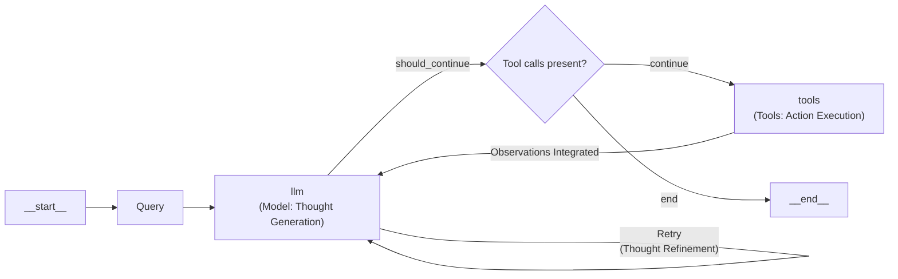

# Lesson 8: Building a ReAct Agent From Scratch

In our previous lessons, we have explored the theoretical foundations of AI agents. We learned about the ReAct framework in Lesson 7, understanding how agents can reason, plan, and interact with external tools. While theory is essential for building mental models, it often feels abstract. The real learning happens when you roll up your sleeves and build. Many agentic frameworks can hide the underlying logic, making it difficult to understand what is truly happening.

This lesson bridges that gap by shifting from theory to practice. We will build a minimal ReAct agent from scratch, using only Python and the Gemini API. This approach demystifies what happens inside agentic frameworks. By implementing the core logic yourself, you will gain a concrete mental model that is difficult to acquire from documentation alone [[1]](https://blog.stackademic.com/ai-agents-iv-ai-agents-through-the-thought-action-observation-tao-cycle-3dfe2eb76629). We will walk through the entire Thought-Action-Observation cycle, from defining a mock tool to orchestrating the control loop that brings the agent to life.

Image 1: A flowchart illustrating the theoretical design of a ReAct agent, detailing the iterative Thought-Action-Observation loop.

This lesson is a 100% practical, step-by-step walkthrough following the course notebook. By the end, you will have a working agent and a deep, practical understanding of how these systems operate, preparing you to debug, customize, and confidently build more complex agents.

## Setup and Environment

Before we start building, let's set up our environment. The goal is to ensure your code runs seamlessly and that your outputs match the traces we will analyze later. This lesson follows the provided notebook, so each step here corresponds directly to a cell in that file.

1.  First, we load the `GOOGLE_API_KEY` from a `.env` file into our environment. Our custom utility function handles this, making it easy to manage secrets without hardcoding them.
    
    ```python
    from lessons.utils import env
    
    env.load(required_env_vars=["GOOGLE_API_KEY"])
    ```
    
2.  Next, we import the necessary packages for our agent. We will use `google-genai` to interact with the Gemini API, `pydantic` to define structured data models for our messages, and Python’s `enum` and `typing` for creating clear and maintainable code.
    
    ```python
    from enum import Enum
    from pydantic import BaseModel, Field
    from typing import List
    
    from google import genai
    from google.genai import types
    
    from lessons.utils import pretty_print
    ```
    
3.  With the API key loaded, we initialize the Gemini client. This object will be our main interface for making calls to the model.
    
    ```python
    client = genai.Client()
    ```
    
    It outputs:
    
    ```text
    Both GOOGLE_API_KEY and GEMINI_API_KEY are set. Using GOOGLE_API_KEY.
    ```
    
4.  Finally, we define the model we will use. For this lesson, `gemini-2.5-flash` is an excellent choice because it is both fast and cost-effective, making it ideal for the simple, iterative tasks our agent will perform.
    
    ```python
    MODEL_ID = "gemini-2.5-flash"
    ```
    
With the client and model ready, we can now define the external capabilities our agent will use.

## Tool Layer: Mock Search Implementation

To keep our focus on the ReAct mechanics, we will use a mock `search` tool instead of integrating a real API. This design philosophy is intentional. It simplifies the learning process by removing external dependencies and API key management. More importantly, it provides predictable, deterministic responses, which are perfect for testing and understanding our agent’s logic without the variability of live web results [[2]](https://medium.com/google-cloud/building-react-agents-from-scratch-a-hands-on-guide-using-gemini-ffe4621d90ae).

Our mock tool is a simple Python function. The docstring is critical here; it serves as the primary documentation that the LLM will use to understand the tool's purpose, its arguments, and when to use it [[3]](https://ai.google.dev/gemini-api/docs/function-calling).

1.  We define the `search` function. It simulates looking up information by checking for keywords in the query and returning a predefined string. For any query it does not recognize, it returns a "not found" message, allowing us to test the agent's fallback behavior.
    
    ```python
    def search(query: str) -> str:
        """Search for information about a specific topic or query.
    
        Args:
            query (str): The search query or topic to look up.
        """
        query_lower = query.lower()
    
        # Predefined responses for demonstration
        if all(word in query_lower for word in ["capital", "france"]):
            return "Paris is the capital of France and is known for the Eiffel Tower."
        elif "react" in query_lower:
            return "The ReAct framework enables LLMs to solve complex tasks by interleaving thought generation, action execution, and observation processing."
    
        # Generic response for unhandled queries
        return f"Information about '{query}' was not found."
    ```
    
2.  We then create a `TOOL_REGISTRY`. This dictionary maps the tool's name to its function object, allowing our agent to dynamically call the correct function based on the name provided by the LLM.
    
    ```python
    TOOL_REGISTRY = {
        search.__name__: search,
    }
    ```
    
In a production system, this mock function could be swapped with a real API call to Google Search or a domain-specific knowledge base, as long as the function signature and docstring remain consistent [[2]](https://medium.com/google-cloud/building-react-agents-from-scratch-a-hands-on-guide-using-gemini-ffe4621d90ae). With a tool in place, the next step is to teach our agent how to *think* about using it.

## Thought Phase: Prompt Construction and Generation

The "Thought" phase is the agent's internal monologue, where it reasons about the user's query and plans its next step [[4]](https://arxiv.org/pdf/2210.03629). It is important to remember this is not a native capability of the LLM. We are guiding the model to produce this reasoning through carefully designed prompts. The entire ReAct pattern is an emergent behavior created by prompt engineering, not a built-in function [[5]](https://www.dailydoseofds.com/ai-agents-crash-course-part-10-with-implementation/).

1.  First, we create a function to generate an XML description of the available tools from their docstrings. Using XML tags like `<tools>` and `<tool>` helps the LLM clearly distinguish the tool definitions from other parts of the prompt, improving its ability to reason about them correctly [[6]](https://ai.google.dev/gemini-api/docs/prompting-strategies).
    
    ```python
    def build_tools_xml_description(tools: dict[str, callable]) -> str:
        """Build a minimal XML description of tools using only their docstrings."""
        lines = []
        for tool_name, fn in tools.items():
            doc = (fn.__doc__ or "").strip()
            lines.append(f"\t<tool name=\"{tool_name}\">")
            if doc:
                lines.append(f"\t\t<description>")
                for line in doc.split("\n"):
                    lines.append(f"\t\t\t{line}")
                lines.append(f"\t\t</description>")
            lines.append("\t</tool>")
        return "\n".join(lines)
    ```
    
2.  We then define the prompt template for thought generation. It includes the XML tool descriptions, a placeholder for the conversation history, and clear instructions for the agent to state its next thought. This structure provides all the necessary context for the model to plan its next move.
    
    ```python
    tools_xml = build_tools_xml_description(TOOL_REGISTRY)
    
    PROMPT_TEMPLATE_THOUGHT = f"""
    You are deciding the next best step for reaching the user goal. You have some tools available to you.
    
    Available tools:
    <tools>
    {tools_xml}
    </tools>
    
    Conversation so far:
    <conversation>
    {{conversation}}
    </conversation>
    
    State your next thought about what to do next as one short paragraph focused on the next action you intend to take and why.
    Avoid repeating the same strategies that didn't work previously. Prefer different approaches.
    """.strip()
    ```
    
    The resulting prompt provides the model with all the necessary context:
    
    ```text
    You are deciding the next best step for reaching the user goal. You have some tools available to you.
    
    Available tools:
    <tools>
    	<tool name="search">
    		<description>
    			Search for information about a specific topic or query.
    			
    			Args:
    			    query (str): The search query or topic to look up.
    		</description>
    	</tool>
    </tools>
    
    Conversation so far:
    <conversation>
    {conversation}
    </conversation>
    
    State your next thought about what to do next as one short paragraph focused on the next action you intend to take and why.
    Avoid repeating the same strategies that didn't work previously. Prefer different approaches.
    ```
    
3.  Finally, we implement the `generate_thought` function. This function takes the current conversation history, formats the prompt template with it, and calls the Gemini API to generate the agent's next thought.
    
    ```python
    def generate_thought(conversation: str, tool_registry: dict[str, callable]) -> str:
        """Generate a thought as plain text (no structured output)."""
        tools_xml = build_tools_xml_description(tool_registry)
        prompt = PROMPT_TEMPLATE_THOUGHT.format(conversation=conversation, tools_xml=tools_xml)
    
        response = client.models.generate_content(
            model=MODEL_ID,
            contents=prompt
        )
        return response.text.strip()
    ```
    
This thought provides the reasoning for the next step: calling a tool or providing a final answer.

## Action Phase: Function Calling and Parsing

The "Action" phase is where the agent decides what to do based on its thought process. It can either call a tool to gather more information or, if it has enough context, provide a final answer to the user. We will use Gemini’s native function calling capabilities, which we covered in Lesson 6, to handle this decision. This approach is cleaner than embedding tool details in the system prompt. We pass the Python functions to the `tools` configuration, and Gemini automatically extracts their signatures and docstrings to decide which tool to use. This separates strategic guidance in the prompt from the technical details of the tools [[3]](https://ai.google.dev/gemini-api/docs/function-calling).

1.  We define two prompt templates. The first is for general action selection, and the second is a specialized prompt to force a final answer, which is useful for ensuring the agent terminates gracefully.
    
    ```python
    PROMPT_TEMPLATE_ACTION = """
    You are selecting the best next action to reach the user goal.
    
    Conversation so far:
    <conversation>
    {conversation}
    </conversation>
    
    Respond either with a tool call (with arguments) or a final answer if you can confidently conclude.
    """.strip()
    
    # Dedicated prompt used when we must force a final answer
    PROMPT_TEMPLATE_ACTION_FORCED = """
    You must now provide a final answer to the user.
    
    Conversation so far:
    <conversation>
    {conversation}
    </conversation>
    
    Provide a concise final answer that best addresses the user's goal.
    """.strip()
    ```
    
2.  We define Pydantic models to represent the two possible outcomes: a `ToolCallRequest` or a `FinalAnswer`. This provides a structured way to handle the model's output.
    
    ```python
    class ToolCallRequest(BaseModel):
        """A request to call a tool with its name and arguments."""
        tool_name: str = Field(description="The name of the tool to call.")
        arguments: dict = Field(description="The arguments to pass to the tool.")
    
    
    class FinalAnswer(BaseModel):
        """A final answer to present to the user when no further action is needed."""
        text: str = Field(description="The final answer text to present to the user.")
    ```
    
3.  The `generate_action` function orchestrates this phase. It selects the appropriate prompt, configures the Gemini client with the available tools, and calls the model. It then parses the response to determine if the model generated a function call or a final answer. The logic checks for a `function_call` attribute on the response parts. If found, it returns a `ToolCallRequest`; otherwise, it assumes a `FinalAnswer`.
    
    A production system would include more robust error handling for unknown actions or malformed responses. For example, you could wrap the parsing logic in a `try-except` block to catch `ValueError` or other exceptions. If parsing fails, the agent could log the error and call the `think` method again to retry, ensuring the loop does not crash on an unexpected output [[2]](https://medium.com/google-cloud/building-react-agents-from-scratch-a-hands-on-guide-using-gemini-ffe4621d90ae).
    
    ```python
    def generate_action(conversation: str, tool_registry: dict[str, callable] | None = None, force_final: bool = False) -> (ToolCallRequest | FinalAnswer):
        """Generate an action by passing tools to the LLM and parsing function calls or final text.
    
        When force_final is True or no tools are provided, the model is instructed to produce a final answer and tool calls are disabled.
        """
        # Use a dedicated prompt when forcing a final answer or no tools are provided
        if force_final or not tool_registry:
            prompt = PROMPT_TEMPLATE_ACTION_FORCED.format(conversation=conversation)
            response = client.models.generate_content(
                model=MODEL_ID,
                contents=prompt
            )
            return FinalAnswer(text=response.text.strip())
    
        # Default action prompt
        prompt = PROMPT_TEMPLATE_ACTION.format(conversation=conversation)
    
        # Provide the available tools to the model; disable auto-calling so we can parse and run ourselves
        tools = list(tool_registry.values())
        config = types.GenerateContentConfig(
            tools=tools,
            automatic_function_calling={"disable": True}
        )
        response = client.models.generate_content(
            model=MODEL_ID,
            contents=prompt,
            config=config
        )
    
        # Extract the function call from the response (if present)
        candidate = response.candidates[0]
        parts = candidate.content.parts
        if parts and getattr(parts[0], "function_call", None):
            name = parts[0].function_call.name
            args = dict(parts[0].function_call.args) if parts[0].function_call.args is not None else {}
            return ToolCallRequest(tool_name=name, arguments=args)
        
        # Otherwise, it's a final answer
        final_answer = "".join(part.text for part in candidate.content.parts)
        return FinalAnswer(text=final_answer.strip())
    ```
    
With the Thought and Action phases defined, we now need a control loop to orchestrate them in the full ReAct cycle.

## Control Loop: Messages, Scratchpad, and Orchestration

The control loop is the core component that orchestrates the agent's behavior. It manages the Thought → Action → Observation cycle, maintains the conversation history in a "scratchpad," and ensures the agent makes steady progress. This cycle is directly analogous to how humans solve problems: we think, act, observe the result, and then use that new information to inform our next thought [[5]](https://www.dailydoseofds.com/ai-agents-crash-course-part-10-with-implementation/). This creates a powerful feedback loop, allowing the agent to adapt its plan based on new information from its environment [[7]](https://www.ibm.com/think/topics/react-agent). Our implementation is inspired by graph-based frameworks like LangGraph, where nodes represent states and edges represent transitions.



Image 2: A flowchart depicting the implementation of a ReAct agent using LangGraph.

1.  First, we define the data structures for our messages. An `Enum` for `MessageRole` categorizes each step of the interaction (user input, thought, tool request, observation, and final answer). A `Message` Pydantic model provides a unified structure for all content. This structured approach is key to tracking the agent's state and making the reasoning process transparent and easy to debug.
    
    ```python
    class MessageRole(str, Enum):
        """Enumeration for the different roles a message can have."""
        USER = "user"
        THOUGHT = "thought"
        TOOL_REQUEST = "tool request"
        OBSERVATION = "observation"
        FINAL_ANSWER = "final answer"
    
    
    class Message(BaseModel):
        """A message with a role and content, used for all message types."""
        role: MessageRole = Field(description="The role of the message in the ReAct loop.")
        content: str = Field(description="The textual content of the message.")
    
        def __str__(self) -> str:
            """Provides a user-friendly string representation of the message."""
            return f"{self.role.value.capitalize()}: {self.content}"
    ```
    
2.  Next, we create a `Scratchpad` class to manage the list of messages. This class acts as the agent's short-term memory, storing the entire history of the interaction. It provides a simple way to serialize this history into a string for the LLM's context and includes a pretty-printing utility to make the agent's internal state easy to follow during execution.
    
    ```python
    class Scratchpad:
        """Container for ReAct messages with optional pretty-print on append."""
    
        def __init__(self, max_turns: int) -> None:
            self.messages: List[Message] = []
            self.max_turns: int = max_turns
            self.current_turn: int = 1
    
        def set_turn(self, turn: int) -> None:
            self.current_turn = turn
    
        def append(self, message: Message, verbose: bool = False, is_forced_final_answer: bool = False) -> None:
            self.messages.append(message)
            if verbose:
                # ... pretty_print_message implementation ...
                pass
    
        def to_string(self) -> str:
            return "\n".join(str(m) for m in self.messages)
    ```
    
3.  Now we implement the main `react_agent_loop`. This function initializes the scratchpad with the user's question and then iterates through the ReAct cycle. In each turn, it generates a thought and an action. If the action is a tool call, it executes the tool and records the result as an observation. This observation is then added to the scratchpad, making it available for the next thought phase.
    
    A key part of a robust agent is handling tool failures. Our loop includes a `try-except` block to catch any exceptions during tool execution. If a tool fails, the error message is formatted as an `Observation`, allowing the agent to reason about the failure and decide on a new course of action, rather than crashing [[8]](https://www.decodingai.com/p/building-production-react-agents). The loop terminates if the agent produces a `FinalAnswer` or reaches the `max_turns` limit, at which point it forces a final answer to ensure a graceful exit.
    
    ```python
    def react_agent_loop(initial_question: str, tool_registry: dict[str, callable], max_turns: int = 5, verbose: bool = False) -> str:
        """
        Implements the main ReAct (Thought -> Action -> Observation) control loop.
        Uses a unified message class for the scratchpad.
        """
        scratchpad = Scratchpad(max_turns=max_turns)
    
        # Add the user's question to the scratchpad
        user_message = Message(role=MessageRole.USER, content=initial_question)
        scratchpad.append(user_message, verbose=verbose)
    
        for turn in range(1, max_turns + 1):
            scratchpad.set_turn(turn)
    
            # Generate a thought
            thought_content = generate_thought(scratchpad.to_string(), tool_registry)
            thought_message = Message(role=MessageRole.THOUGHT, content=thought_content)
            scratchpad.append(thought_message, verbose=verbose)
    
            # Generate an action
            action_result = generate_action(scratchpad.to_string(), tool_registry=tool_registry)
    
            # If it's a final answer, stop
            if isinstance(action_result, FinalAnswer):
                final_message = Message(role=MessageRole.FINAL_ANSWER, content=action_result.text)
                scratchpad.append(final_message, verbose=verbose)
                return action_result.text
    
            # If it's a tool request, execute it and add the observation
            if isinstance(action_result, ToolCallRequest):
                action_name = action_result.tool_name
                action_params = action_result.arguments
    
                params_str = ", ".join([f"{k}='{v}'" for k, v in action_params.items()])
                action_content = f"{action_name}({params_str})"
                action_message = Message(role=MessageRole.TOOL_REQUEST, content=action_content)
                scratchpad.append(action_message, verbose=verbose)
    
                # Run the action and get the observation
                observation_content = ""
                tool_function = tool_registry[action_name]
                try:
                    observation_content = tool_function(**action_params)
                except Exception as e:
                    observation_content = f"Error executing tool '{action_name}': {e}"
    
                observation_message = Message(role=MessageRole.OBSERVATION, content=observation_content)
                scratchpad.append(observation_message, verbose=verbose)
    
            # Force a final answer if max turns are reached
            if turn == max_turns:
                forced_action = generate_action(scratchpad.to_string(), force_final=True)
                final_answer = forced_action.text if isinstance(forced_action, FinalAnswer) else "Unable to produce a final answer."
                final_message = Message(role=MessageRole.FINAL_ANSWER, content=final_answer)
                scratchpad.append(final_message, verbose=verbose, is_forced_final_answer=True)
                return final_answer
    ```
    
With the full loop implemented, let's test it to see our agent in action and verify its behavior.

## Tests and Traces: Success and Graceful Fallback

To validate our agent, we will run two test cases from the notebook. The first is a straightforward question that our mock tool can answer, demonstrating a successful run. The second is a query our tool does not support, which will test the agent's ability to handle failure and terminate gracefully. By analyzing the printed traces, we can confirm that the Thought-Action-Observation loop, tool integration, and forced termination all behave as designed.

1.  First, let's ask a question our mock `search` tool is designed to handle: "What is the capital of France?" We will run the loop for a maximum of two turns and set `verbose=True` to see the full trace.
    
    ```python
    question = "What is the capital of France?"
    final_answer = react_agent_loop(question, TOOL_REGISTRY, max_turns=2, verbose=True)
    ```
    
    The trace shows a perfect execution cycle. In the first turn, the agent thinks it needs to find the capital and correctly identifies the `search` tool. It generates a `ToolCallRequest` with the appropriate query. The control loop executes the tool, which returns the predefined answer. This result is added to the scratchpad as an `Observation`. In the second turn, the agent sees this new information, reasons that it now has the answer, and generates a `FinalAnswer`. The loop terminates successfully.
    
    The output looks like this:
    
    ```text
    User (Turn 1/2):
    What is the capital of France?
    
    Thought (Turn 1/2):
    I need to find the capital of France. I can use the search tool to get this information.
    
    Tool request (Turn 1/2):
    search({'query': 'capital of France'})
    
    Observation (Turn 1/2):
    Paris is the capital of France and is known for the Eiffel Tower.
    
    Thought (Turn 2/2):
    The search result directly answers the question. I can now provide the final answer.
    
    Final answer (Turn 2/2):
    Paris is the capital of France.
    ```
    
2.  Now, let's try a query that will fail: "What is the capital of Italy?" Our mock tool has no predefined answer for this, which allows us to test the agent's fallback behavior.
    
    ```python
    question = "What is the capital of Italy?"
    final_answer = react_agent_loop(question, TOOL_REGISTRY, max_turns=2, verbose=True)
    ```
    
    This trace demonstrates the agent's resilience. In the first turn, the `search` tool returns the "not found" message. The agent observes this failure and, in its second thought, adjusts its strategy by trying a broader search for just "Italy." When that also fails, the agent reaches the `max_turns` limit. The control loop then triggers the forced final answer path, and the agent gracefully admits it could not find the information. This confirms our termination logic is working correctly.
    
    The output confirms this process:
    
    ```text
    User (Turn 1/2):
    What is the capital of Italy?
    
    Thought (Turn 1/2):
    I need to find the capital of Italy. I can use the search tool for this.
    
    Tool request (Turn 1/2):
    search({'query': 'capital of Italy'})
    
    Observation (Turn 1/2):
    Information about 'capital of Italy' was not found.
    
    Thought (Turn 2/2):
    The previous search failed. I'll try a broader search for just "Italy" to see if I can find any relevant information that might lead me to the capital.
    
    Tool request (Turn 2/2):
    search({'query': 'Italy'})
    
    Observation (Turn 2/2):
    Information about 'Italy' was not found.
    
    Final answer (Forced):
    I am unable to find the capital of Italy with the available tools.
    ```
    
These tests confirm that our from-scratch implementation correctly executes the ReAct loop, integrates with tools, processes observations, and handles failures gracefully.

## Conclusion

We have successfully built a minimal but complete ReAct agent from the ground up. By implementing each component of the Thought-Action-Observation cycle, we have gained a practical understanding of how these reasoning systems work. Building this simple agent from scratch provides a clear view of the core mechanics that power more complex agentic applications.

This is just the beginning. The agent we built is a foundation you can extend with more sophisticated capabilities. In our upcoming lessons, we will explore how to equip agents with memory to recall past interactions in Lesson 9 and how to connect them to vast knowledge bases using Retrieval-Augmented Generation in Lesson 10. The principles you learned today are the building blocks for those more advanced systems.

## References

- [1] AI Agents IV: AI Agents through the Thought-Action-Observation (TAO) Cycle. (n.d.). Stackademic. [https://blog.stackademic.com/ai-agents-iv-ai-agents-through-the-thought-action-observation-tao-cycle-3dfe2eb76629](https://blog.stackademic.com/ai-agents-iv-ai-agents-through-the-thought-action-observation-tao-cycle-3dfe2eb76629)
- [2] Building ReAct Agents from Scratch a Hands-on Guide using Gemini. (n.d.). Google Cloud Blog. [https://medium.com/google-cloud/building-react-agents-from-scratch-a-hands-on-guide-using-gemini-ffe4621d90ae](https://medium.com/google-cloud/building-react-agents-from-scratch-a-hands-on-guide-using-gemini-ffe4621d90ae)
- [3] Function calling. (n.d.). Google AI for Developers. [https://ai.google.dev/gemini-api/docs/function-calling](https://ai.google.dev/gemini-api/docs/function-calling)
- [4] Yao, S., Zhao, J., Yu, D., Du, N., Shafran, I., Narasimhan, K., & Cao, Y. (2023). ReAct: Synergizing Reasoning and Acting in Language Models. [https://arxiv.org/pdf/2210.03629](https://arxiv.org/pdf/2210.03629)
- [5] Implementing ReAct Agentic Pattern From Scratch. (n.d.). The Dailydose of Data Science. [https://www.dailydoseofds.com/ai-agents-crash-course-part-10-with-implementation/](https://www.dailydoseofds.com/ai-agents-crash-course-part-10-with-implementation/)
- [6] Prompt design strategies. (n.d.). Google AI for Developers. [https://ai.google.dev/gemini-api/docs/prompting-strategies](https://ai.google.dev/gemini-api/docs/prompting-strategies)
- [7] What is a ReAct agent? (n.d.). IBM. [https://www.ibm.com/think/topics/react-agent](https://www.ibm.com/think/topics/react-agent)
- [8] Building Production ReAct Agents From Scratch Is Simple. (n.d.). Decoding AI. [https://www.decodingai.com/p/building-production-react-agents](https://www.decodingai.com/p/building-production-react-agents)
- [9] Formalizing the Agent-Environment Interface for Large Language Models. (2026). SCITEPRESS. [https://www.scitepress.org/Papers/2026/144223/144223.pdf](https://www.scitepress.org/Papers/2026/144223/144223.pdf)
- [10] ReAct: Reasoning and Acting in Prompting. (n.d.). GeeksforGeeks. [https://www.geeksforgeeks.org/artificial-intelligence/react-reasoning-acting-prompting/](https://www.geeksforgeeks.org/artificial-intelligence/react-reasoning-acting-prompting/)