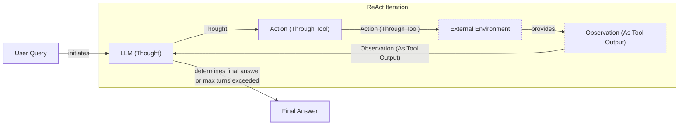

# Build a ReAct Agent From Scratch

In our last lesson, we covered the theory behind planning and reasoning frameworks like ReAct. We learned how the cycle of Thought, Action, and Observation allows an agent to break down complex problems and interact with its environment to find solutions. The core idea is to create a synergy between reasoning and acting: reasoning helps the agent track, induce, and update its action plan, while actions allow it to gather new information from external sources to support the next reasoning step [[1]](https://arxiv.org/pdf/2210.03629). But theory only takes you so far. The real understanding comes from building.

Many AI frameworks can obscure the core mechanics of how agents work. They offer powerful abstractions, but when you need to debug a subtle issue or customize a behavior, those abstractions can become a barrier. The most successful and robust agentic systems are often built with simple, composable patterns rather than complex, opaque frameworks [[9]](https://www.anthropic.com/engineering/building-effective-agents). By combining an LLM’s internal monologue with external tool use, this approach reduces issues like hallucination and improves the agent's accuracy and trustworthiness [[10]](https://www.ibm.com/think/topics/react-agent). To truly master agentic systems, you need to know what is happening under the hood.

That is why this lesson is 100% practical. We will build a minimal ReAct agent from scratch using only Python and the Gemini API. By implementing the full Thought → Action → Observation loop ourselves, you will gain a concrete mental model that will give you the confidence to build, extend, and debug any agent, whether you use a framework or not.

We will walk through the entire process, step by step, covering how to set up the environment, implement a mock tool layer, generate thoughts, use function calling for actions, build the main control loop, and finally, test our agent with both success and failure cases.

## Setup and Environment

First, we need to set up our Python environment to ensure the code runs smoothly. A consistent setup is the foundation for any reproducible AI application. This process involves loading our API keys, importing the necessary libraries, and initializing the Gemini client that will serve as our agent's "brain."

1.  We start by loading our environment variables. Our custom utility function, `env.load()`, securely loads the `GOOGLE_API_KEY` needed to authenticate with the Gemini API. This practice avoids hardcoding sensitive keys in our code.
    ```python
    from lessons.utils import env
    
    env.load(required_env_vars=["GOOGLE_API_KEY"])
    ```
2.  Next, we import the required packages. We will use `google-genai` as our client for the Gemini API, `pydantic` for creating structured data models, and other standard Python libraries for type hinting and enumeration.
    ```python
    from enum import Enum
    from typing import Union, List, Dict, Callable
    
    import google.generativeai as genai
    from pydantic import BaseModel, Field
    
    from lessons.utils.pretty_print import pretty_print_conversation
    ```
3.  We initialize the Gemini client, which creates an object that will handle all our communication with the model's API endpoint.
    ```python
    client = genai.Client()
    ```
4.  Finally, we define the model we will use. For this exercise, `gemini-2.5-flash` is an excellent choice. It is designed for speed and cost-efficiency, making it perfect for the simple, single-turn reasoning our minimal agent requires.
    ```python
    MODEL_ID = "gemini-2.5-flash"
    ```
With the client and model ready, we can now define an external tool that our agent can use to interact with its environment.

## Tool Layer: Mock Search Implementation

Every ReAct agent needs tools to perform actions. For this lesson, instead of calling a real API, we will create a mock `search` tool. This approach simplifies our focus to the ReAct mechanics, removes external dependencies, and gives us predictable responses for testing and debugging. This is a common practice when developing agents, as it allows you to isolate and test the agent's reasoning logic without worrying about network issues or API costs.

Our mock tool is a simple Python function that takes a query and returns a hardcoded response. The function’s docstring is an important part of its design, as it serves as the description that the LLM will use to understand what the tool does and when to use it.

```python
def search(query: str) -> str:
    """
    Searches for information on a given topic.
    
    Args:
        query: The topic to search for.
    
    Returns:
        A string containing information about the topic, or a message indicating that the information was not found.
    """
    if query.lower() == "capital of france":
        return "Paris is the capital of France and is known for the Eiffel Tower."
    else:
        return f"Information about '{query}' was not found."
```
Designing a good tool interface is a key part of building effective agents. You can think of it as creating an agent-computer interface (ACI), where clear descriptions and well-named parameters make it easier for the model to use the tool correctly [[9]](https://www.anthropic.com/engineering/building-effective-agents). Our function simulates a knowledge base: if asked about the capital of France, it provides a direct answer. For any other query, it returns a "not found" message, which allows us to test the agent's ability to handle tool failures gracefully. In a production system, you could easily swap this mock function with a real API call to Google Search or a private knowledge base while keeping the agent's core logic the same [[13]](https://medium.com/google-cloud/building-react-agents-from-scratch-a-hands-on-guide-using-gemini-ffe4621d90ae).

## Thought Phase: Prompt Construction and Generation

The first step in the ReAct cycle is "Thought." This is where the agent analyzes the user's query and its history to form an internal monologue about what to do next. This reasoning trace helps the model decompose the task, track its progress, and decide on the most logical next step [[1]](https://arxiv.org/pdf/2210.03629). We guide this process with a carefully crafted prompt template that provides the model with context and instructions.

1.  We create an XML-based description of our available tools. Using XML tags like `<tools>` and `<tool>` helps the LLM clearly distinguish the tools and their descriptions from other parts of the prompt. This structured approach improves model adherence and reliability, as it separates instructions, context, and tasks into logical sections [[11]](https://ai.google.dev/gemini-api/docs/prompting-strategies). The template also includes a `{conversation}` placeholder where we will inject the history of interactions, giving the agent the context it needs to make an informed decision.
    ```python
    def build_tools_xml_description(tool_registry: Dict) -> str:
        # ... function to build XML from tool registry ...

    TOOL_REGISTRY = {"search": search}
    
    PROMPT_TEMPLATE_THOUGHT = f"""
    You are a helpful assistant. Your goal is to answer the user's question.
    You have access to the following tools:
    <tools>
    {build_tools_xml_description(TOOL_REGISTRY)}
    </tools>
    
    To answer the question, you must generate a thought.
    A thought is your internal monologue that you will use to determine your next action.
    Your action will be either to use a tool or to answer the user's question.
    
    Here is the conversation so far:
    <conversation>
    {{conversation}}
    </conversation>
    
    Generate your thought.
    """
    ```
2.  The `generate_thought` function formats this template with the current conversation history and calls the Gemini model to produce the thought. The output is a plain text string representing the agent's internal reasoning.
    ```python
    def generate_thought(conversation: List[Dict], tool_registry: Dict) -> str:
        """
        Generates a thought based on the conversation history and available tools.
        """
        prompt = PROMPT_TEMPLATE_THOUGHT.format(
            conversation="\n".join(
                [f"<{msg['role']}>{msg['content']}</{msg['role']}>" for msg in conversation]
            )
        )
        response = client.models.generate_content(model=MODEL_ID, contents=prompt)
        return response.text.strip()
    ```
The generated thought is a short, purposeful statement that guides the agent. For example, if the user asks, "What is the capital of France?", the agent might think, "The user is asking a factual question. I should use the search tool to find the answer." With this coherent thought, the agent is ready to decide on a concrete action.

## Action Phase: Function Calling and Parsing

Once the agent has a thought, it must decide on an "Action." This can be either calling a tool or providing a final answer to the user. We will use Gemini's native function calling capability to handle this decision, as it provides a more structured and reliable way for the model to interact with external tools [[5]](https://ai.google.dev/gemini-api/docs/function-calling).

A key advantage of using a modern LLM like Gemini is that we do not need to include detailed tool signatures in our prompt. We can pass the Python `search` function directly in the API configuration. Gemini automatically inspects the function's signature and docstring to understand its parameters and purpose. This modern approach is more reliable than older methods that relied on parsing raw text from the LLM's output, as it significantly reduces errors and hallucinations [[12]](https://www.philschmid.de/langgraph-gemini-2-5-react-agent). This separation of concerns keeps our system prompt focused on high-level strategy rather than low-level technical details.

1.  First, we define a system prompt that instructs the agent on how to behave. It encourages the agent to think step-by-step and decide whether to use a tool or finish the conversation with a final answer. The `FINISH:` prefix is a simple convention we establish for the model to signal completion.
    ```python
    ACTION_SYSTEM_PROMPT = """
    You are a helpful assistant. Your goal is to answer the user's question.
    
    You have access to a set of tools.
    Based on the conversation so far, you must decide on your next action.
    Your action can be either to use a tool or to answer the user's question.
    
    If you have enough information to answer the user's question, you will answer it.
    To do so, you must respond with "FINISH: <your answer>".
    
    Here is the conversation so far:
    
    {conversation}
    """
    ```
2.  The `generate_action` function takes the conversation history and the tool registry. It configures the Gemini client with the available tools and calls the model. The model's response will be either a text string or a `function_call` object.
    ```python
    def generate_action(
        conversation: List[Dict], tool_registry: Dict
    ) -> Union[str, Dict]:
        # ...
        tools = list(tool_registry.values())
        response = client.models.generate_content(
            model=MODEL_ID, contents=prompt, tools=tools
        )
        return response.candidates[0].content.parts[0]
    ```
3.  The `parse_action` function processes the model's response to determine the next step. If the response contains a `function_call` object, we extract the tool name and its arguments. If it is a text response starting with our `FINISH:` convention, we treat it as the final answer. This parsing logic acts as the bridge between the LLM's decision and our application's execution logic.
    ```python
    def parse_action(action: Union[str, Dict]) -> Dict:
        if hasattr(action, "function_call"):
            tool_name = action.function_call.name
            tool_args = {key: value for key, value in action.function_call.args.items()}
            return {"name": tool_name, "args": tool_args}
        
        text = action.text
        if text.startswith("FINISH:"):
            return {"name": "FINISH", "args": {"answer": text.replace("FINISH:", "").strip()}}
        
        return {"name": "unknown", "args": {"details": "Unknown action"}}
    ```
This completes the action phase. The agent can now think about a problem and decide on a specific, executable action. The next step is to orchestrate these phases in a continuous loop.

## Control Loop: Messages, Scratchpad, and Orchestration

The core of our ReAct agent is the control loop, which orchestrates the complete Thought-Action-Observation cycle. This loop manages the conversation history, executes actions, processes observations, and repeats the cycle until it reaches a final answer. We will use a "scratchpad" to maintain the state, which is simply a list of messages that tracks every step of the agent's process.


Image 1: A flowchart illustrating the ReAct control loop, detailing the iterative Thought -> Action -> Observation cycle.

### Message Structure Foundation

To keep the scratchpad organized and easy for the LLM to parse, we first define structured classes for messages and their roles using Pydantic and Enum. This categorizes each interaction as a `USER` query, an internal `THOUGHT`, a `TOOL_REQUEST`, an `OBSERVATION` from a tool, or a `FINAL_ANSWER`. This structured format is essential for maintaining a clear and traceable history of the agent's reasoning process.

```python
class MessageRole(Enum):
    USER = "user"
    THOUGHT = "thought"
    TOOL_REQUEST = "tool_request"
    OBSERVATION = "observation"
    FINAL_ANSWER = "final_answer"

class Message(BaseModel):
    role: MessageRole
    content: str
```

### Control Loop Architecture

The control loop, implemented in the `react_agent_loop` function, iterates through a set number of turns to prevent infinite loops and manage costs. In each turn, it orchestrates the full ReAct cycle: it generates a thought, decides on an action, executes that action, and records the result as an observation. The loop terminates either when the agent produces a final answer or when it reaches the maximum number of turns, at which point it is forced to conclude.

### Integrated Observation Processing

A key part of the loop is processing observations. After the agent decides to use a tool, the loop looks up the corresponding function in our `TOOL_REGISTRY` and executes it with the arguments provided by the LLM. The return value of the tool—whether it is a successful result or an error message—is then formatted as an `OBSERVATION` message and appended to the scratchpad. This feedback is what allows the agent to learn from its actions and adjust its strategy in the next turn.

The full implementation of the loop brings all our components together:

```python
def react_agent_loop(
    user_query: str, tool_registry: Dict, max_turns: int = 5, verbose: bool = False
) -> str:
    scratchpad = [Message(role=MessageRole.USER, content=user_query)]
    final_answer = ""

    for turn in range(max_turns):
        # 1. Thought
        thought = generate_thought(
            [msg.dict() for msg in scratchpad], tool_registry=tool_registry
        )
        scratchpad.append(Message(role=MessageRole.THOUGHT, content=thought))

        # 2. Action
        action = generate_action(
            [msg.dict() for msg in scratchpad], tool_registry=tool_registry
        )
        parsed_action = parse_action(action)
        
        tool_name = parsed_action["name"]
        tool_args = parsed_action["args"]

        # 3. Observation
        if tool_name == "FINISH":
            final_answer = tool_args["answer"]
            scratchpad.append(
                Message(role=MessageRole.FINAL_ANSWER, content=final_answer)
            )
            break
        
        scratchpad.append(
            Message(
                role=MessageRole.TOOL_REQUEST,
                content=f"Tool: {tool_name}, Args: {tool_args}",
            )
        )
        
        if tool_name in tool_registry:
            tool_function = tool_registry[tool_name]
            try:
                observation = tool_function(**tool_args)
            except Exception as e:
                observation = f"Error executing tool {tool_name}: {e}"
        else:
            observation = f"Tool '{tool_name}' not found."

        scratchpad.append(Message(role=MessageRole.OBSERVATION, content=observation))

    if not final_answer:
        final_answer = "I am sorry, I could not answer your question."

    if verbose:
        pretty_print_conversation(scratchpad)

    return final_answer
```
This loop is the engine of our agent. It systematically generates a thought, uses function calling to select an action, executes the tool, and adds the observation back to the scratchpad. Debugging these loops can be challenging due to potential parsing issues or unexpected model responses. The error handling in our loop ensures robustness by catching exceptions and reporting them as observations, which helps in diagnosing problems and allows the agent to self-correct [[13]](https://medium.com/google-cloud/building-react-agents-from-scratch-a-hands-on-guide-using-gemini-ffe4621d90ae).

## Tests and Traces: Success and Graceful Fallback

With the full loop implemented, we can now test our agent. Analyzing the execution traces will help us verify that each phase—thought, action, and observation—is working as designed. We will run two tests: one where the mock tool has the answer and one where it does not, to demonstrate both a successful run and a graceful fallback.

First, we ask a simple factual question that our mock tool is programmed to answer: "What is the capital of France?"

```python
react_agent_loop(
    user_query="What is the capital of France?",
    tool_registry=TOOL_REGISTRY,
    max_turns=2,
    verbose=True,
)
```
The trace for this query shows the agent working perfectly. In the first turn, the agent thinks, "I need to find the capital of France. I should use the search tool for this." It then generates a tool request for `search(query='capital of France')`. The tool executes and returns the observation, "Paris is the capital of France and is known for the Eiffel Tower." In the second turn, the agent observes this new information and thinks, "I have found the answer." It then generates the final answer: "Paris is the capital of France."

Next, we will ask a question our mock tool cannot answer: "What is the capital of Italy?" This tests the agent's ability to handle failure and adapt its strategy.

```python
react_agent_loop(
    user_query="What is the capital of Italy?",
    tool_registry=TOOL_REGISTRY,
    max_turns=2,
    verbose=True,
)
```
The trace for this query demonstrates graceful failure and recovery. The agent first tries to search for "capital of Italy," but the tool returns the observation, "Information about 'capital of Italy' was not found." In the next turn, the agent adapts its strategy based on this feedback. It thinks, "The previous search failed. I will try a broader search for just 'Italy' to see if I can find any relevant information." This also fails. Having reached the maximum number of turns without finding an answer, the loop terminates and generates a forced final answer, admitting it could not find the information. This highlights the robustness of the control loop and its ability to handle tool failures and dead ends.

## Conclusion

By building a ReAct agent from the ground up, we have demystified the core Thought-Action-Observation loop. We have seen how to orchestrate thoughts, actions, and observations to create a system that can reason about a problem and interact with its environment to solve it. This loop is a practical implementation of fundamental AI planning concepts like task decomposition and action sequencing, which are a core part of any autonomous system [[14]](https://www.ibm.com/think/topics/ai-agent-planning). This hands-on implementation provides a concrete mental model for any AI engineer.

Even when you use powerful frameworks in production, knowing how these systems are built from first principles is a key advantage. It gives you the confidence to debug, customize, and extend your agents far beyond what off-the-shelf solutions offer. This is a core skill for shipping robust and reliable AI products.

This article is part of our AI Agents Foundations series. Now that you have a practical grasp of the ReAct pattern, we will move on to another critical component of agentic systems in our next lesson: Memory.

## References
- [1] Yao, S., Zhao, J., Yu, D., Du, N., Shafran, I., Narasimhan, K., & Cao, Y. (2022). *ReAct: Synergizing Reasoning and Acting in Language Models*. arXiv. https://arxiv.org/pdf/2210.03629
- [2] *ReAct agent from scratch with Gemini 2.5 and LangGraph*. (n.d.). Google AI for Developers. https://ai.google.dev/gemini-api/docs/langgraph-example
- [3] Ferrag, M. A., Tihanyi, N., & Debbah, M. (2025). *From LLM Reasoning to Autonomous AI Agents: A Comprehensive Review*. arXiv. https://arxiv.org/pdf/2504.19678
- [4] Shankar, A. (2024, June 18). *Building ReAct Agents from Scratch using Gemini*. Medium. https://medium.com/google-cloud/building-react-agents-from-scratch-a-hands-on-guide-using-gemini-ffe4621d90ae
- [5] *Function calling*. (n.d.). Google AI for Developers. https://ai.google.dev/gemini-api/docs/function-calling
- [6] Iusztin, P. (2024). *Building Production ReAct Agents From Scratch Is Simple*. Decoding AI. https://www.decodingai.com/p/building-production-react-agents
- [7] Pasternak, R. (2024, November 5). *Building a Python React Agent Class: A Step-by-Step Guide*. Neradot. https://www.neradot.com/post/building-a-python-react-agent-class-a-step-by-step-guide
- [8] Brownlee, J. (2024, July 1). *Building ReAct Agents with LangGraph: A Beginner’s Guide*. Machine Learning Mastery. https://machinelearningmastery.com/building-react-agents-with-langgraph-a-beginners-guide/
- [9] *Building effective agents*. (2024, December 19). Anthropic. https://www.anthropic.com/engineering/building-effective-agents
- [10] Bergmann, D. (n.d.). *ReAct Agent*. IBM. https://www.ibm.com/think/topics/react-agent
- [11] *Prompt design strategies*. (n.d.). Google AI for Developers. https://ai.google.dev/gemini-api/docs/prompting-strategies
- [12] Schmid, P. (n.d.). *ReAct agent from scratch with Gemini 2.5 and LangGraph*. https://www.philschmid.de/langgraph-gemini-2-5-react-agent
- [13] Shankar, A. (2024, May 22). *Building ReAct Agents from Scratch: A Hands-On Guide Using Gemini*. Medium. https://medium.com/google-cloud/building-react-agents-from-scratch-a-hands-on-guide-using-gemini-ffe4621d90ae
- [14] Stryker, C. (n.d.). *AI Agent Planning*. IBM. https://www.ibm.com/think/topics/ai-agent-planning