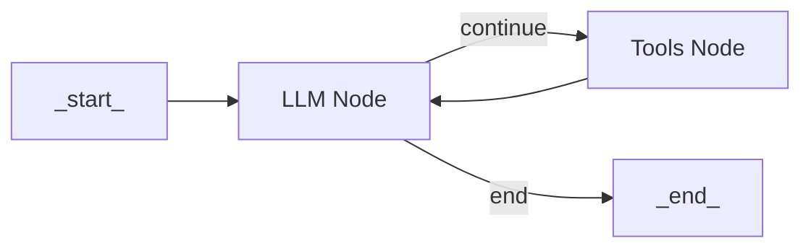

# Building a ReAct Agent From Scratch

## Introduction

In our previous lesson, we explored the theoretical foundations of AI agent planning and reasoning, focusing on patterns like ReAct. We learned that ReAct agents solve complex tasks by interleaving thought generation, action execution, and observation processing. While frameworks like LangChain or CrewAI provide high-level abstractions to build these agents, they often hide the underlying logic. This can make debugging, customization, and true understanding difficult.

When we started building our own AI agents, we often found ourselves frustrated with these abstractions. Simple logic that should have taken minutes to implement became hours of work as we tried to force our code into a predefined paradigm that didn't quite fit. That’s when we did what we always do when we're stuck: we opened the source code. Reading through the implementations of these frameworks was a lightbulb moment. It gave us the concrete mental model we couldn't get from the documentation.

This lesson is born from that experience. We're going to skip the theory and dive straight into practice. We will build a minimal ReAct agent from the ground up, using only Python and the Gemini API. By implementing the full Thought → Action → Observation loop yourself, you will gain a deep, practical understanding of how these systems work.

By the end, you’ll have a working agent and a clear mental model of how to extend, debug, and customize it with confidence. We will walk through:

1.  Setting up the Python environment.
2.  Implementing a mock tool for the agent to use.
3.  Generating thoughts to guide the agent's next steps.
4.  Selecting and parsing actions using function calling.
5.  Orchestrating the full cycle in a control loop.
6.  Testing the agent to see it succeed and handle failure gracefully.

## Setup and Environment

Before we can build our agent, we need to set up a clean Python environment. Our goal is to ensure the code runs seamlessly and that the outputs you see match the traces we will analyze later. A well-configured environment is the foundation of any reproducible software project, and it is especially important in AI engineering where dependencies can be complex. This lesson follows the code from the associated notebook, so you can run each step yourself.

1.  First, we load our `GOOGLE_API_KEY` from a `.env` file. We use a simple utility function for this, which is good practice for managing secrets in any project. Storing keys in environment variables keeps them separate from your codebase, enhancing security.
    ```python
    from lessons.utils import env
    
    env.load(required_env_vars=["GOOGLE_API_KEY"])
    ```
    It outputs:
    ```text
    Trying to load environment variables from /path/to/your/project/.env
    Environment variables loaded successfully.
    ```

2.  Next, we import the necessary packages. We will use `google-genai` to interact with the Gemini API, `pydantic` for data validation as we discussed in Lesson 4, and a few standard Python libraries for type hinting and enums. Our custom `pretty_print` utility will help visualize the agent's traces.
    ```python
    from enum import Enum
    from pydantic import BaseModel, Field
    from typing import List
    
    from google import genai
    from google.genai import types
    
    from lessons.utils import pretty_print
    ```

3.  With the API key loaded, we initialize the Gemini client. The client will automatically detect and use the key from our environment variables, simplifying the setup process.
    ```python
    client = genai.Client()
    ```
    It outputs:
    ```text
    Both GOOGLE_API_KEY and GEMINI_API_KEY are set. Using GOOGLE_API_KEY.
    ```

4.  Finally, we define the model we will use. For this lesson, `gemini-2.5-flash` is a great choice. It is fast, cost-effective, and powerful enough for the reasoning our simple agent requires, making it ideal for development and prototyping [[23]](https://ai.google.dev/gemini-api/docs/langgraph-example).
    ```python
    MODEL_ID = "gemini-2.5-flash"
    ```
    With our client and model ready, the next step is to give our agent a way to interact with the world. For that, we need to define some tools.

## Tool Layer: Mock Search Implementation

An agent's power comes from its ability to use tools to gather information or perform actions in an external environment. In a production system, these tools might call a real search engine like Google Search, query a private database, or interact with a third-party API [[27]](https://atalupadhyay.wordpress.com/2025/11/25/building-a-real-time-web-searching-ai-agent-with-langchain-and-google-gemini/). For this lesson, however, we will use a mock tool to keep things simple and focused.

Using a mock tool offers significant educational benefits. It allows us to concentrate on the core ReAct mechanics—the Thought-Action-Observation loop—without the complexity of managing external dependencies or API keys [[12]](https://www.dailydoseofds.com/ai-agents-crash-course-part-10-with-implementation/). A mock tool provides predictable, consistent responses, which is crucial for testing and understanding the agent's behavior in a controlled setting. This approach demystifies how agents interact with their environment and makes the learning process more transparent [[13]](https://medium.com/google-cloud/building-react-agents-from-scratch-a-hands-on-guide-using-gemini-ffe4621d90ae).

The beauty of this modular design is that you can easily swap the mock implementation with a real one later. By preserving the function signature and updating the internal logic, you can transition to a production-ready tool without altering the agent's core reasoning code. This strategy of defining a consistent interface for tools is a common practice in building scalable AI systems [[29]](https://ai.google.dev/gemini-api/docs/langgraph-example).

1.  We will implement a simple `search` function that mimics a web search. It takes a string query and returns a hardcoded response for specific topics. If the query is not recognized, it returns a "not found" message, simulating a failed search. The docstring is especially important, as it provides the description that the LLM will use to understand what the tool does and how to use it.
    ```python
    def search(query: str) -> str:
        """Search for information about a specific topic or query.
    
        Args:
            query (str): The search query or topic to look up.
        """
        query_lower = query.lower()
    
        # Predefined responses for demonstration
        if all(word in query_lower for word in ["capital", "france"]):
            return "Paris is the capital of France and is known for the Eiffel Tower."
        elif "react" in query_lower:
            return "The ReAct (Reasoning and Acting) framework enables LLMs to solve complex tasks by interleaving thought generation, action execution, and observation processing."
    
        # Generic response for unhandled queries
        return f"Information about '{query}' was not found."
    ```

2.  To manage our tools, we create a `TOOL_REGISTRY`. This dictionary maps the tool's name (which the LLM will use) to the actual Python function. This allows our agent to plan with symbolic names while our code safely resolves them to executable functions.
    ```python
    TOOL_REGISTRY = {
        search.__name__: search,
    }
    ```
    This simple setup gives our agent its first capability. Now, we need to teach it how to *think* about when and why to use this tool.

## Thought Phase: Prompt Construction and Generation

The "Thought" phase is the reasoning core of the ReAct cycle. Here, the agent analyzes the user's query and its history to decide on the next best step. This is not about generating the final answer but about planning the process. We guide this reasoning process with a carefully crafted prompt that provides the LLM with the necessary context and instructions.

A well-structured prompt is essential for effective reasoning. It should clearly define the agent's role, list the available tools, and show the conversation history. This helps the model understand its capabilities and the context of the task at hand. Using clear delimiters like XML tags (`<tools>`, `<conversation>`) is a powerful technique to help the model distinguish between different parts of the prompt, such as instructions, context, and user input [[20]](https://ai.google.dev/gemini-api/docs/prompting-strategies). This structured approach improves the reliability of the model's reasoning.

We separate the thought generation from the action selection for a reason. The thought phase is about high-level planning. By asking the model to first generate a thought as plain text, we encourage it to focus on strategy without getting bogged down in the specific syntax of a tool call. This two-step process—think, then act—often leads to more robust and logical behavior.

1.  To inform the LLM about available tools, we create an XML description from our `TOOL_REGISTRY`. This function iterates through the tools, extracts their docstrings, and formats them into a simple `<tool>` block.
    ```python
    def build_tools_xml_description(tools: dict[str, callable]) -> str:
        """Build a minimal XML description of tools using only their docstrings."""
        lines = []
        for tool_name, fn in tools.items():
            doc = (fn.__doc__ or "").strip()
            lines.append(f"\t<tool name=\"{tool_name}\">")
            if doc:
                lines.append(f"\t\t<description>")
                for line in doc.split("\n"):
                    lines.append(f"\t\t\t{line}")
                lines.append(f"\t\t</description>")
            lines.append("\t</tool>")
        return "\n".join(lines)
    
    tools_xml = build_tools_xml_description(TOOL_REGISTRY)
    ```

2.  Next, we define the prompt template for thought generation. It instructs the agent to decide on its next step, provides the XML description of the tools, and includes a placeholder for the conversation history.
    ```python
    PROMPT_TEMPLATE_THOUGHT = f"""
    You are deciding the next best step for reaching the user goal. You have some tools available to you.
    
    Available tools:
    <tools>
    {tools_xml}
    </tools>
    
    Conversation so far:
    <conversation>
    {{conversation}}
    </conversation>
    
    State your next thought about what to do next as one short paragraph focused on the next action you intend to take and why.
    Avoid repeating the same strategies that didn't work previously. Prefer different approaches.
    """.strip()
    ```

3.  Let's inspect the final prompt that the LLM will see.
    ```python
    print(PROMPT_TEMPLATE_THOUGHT)
    ```
    It outputs:
    ```text
    You are deciding the next best step for reaching the user goal. You have some tools available to you.
    
    Available tools:
    <tools>
        <tool name="search">
            <description>
                Search for information about a specific topic or query.
                
                Args:
                    query (str): The search query or topic to look up.
            </description>
        </tool>
    </tools>
    
    Conversation so far:
    <conversation>
    {conversation}
    </conversation>
    
    State your next thought about what to do next as one short paragraph focused on the next action you intend to take and why.
    Avoid repeating the same strategies that didn't work previously. Prefer different approaches.
    ```

4.  Finally, we create a function to generate the thought. It takes the current conversation, inserts it into the prompt, and calls the Gemini API. The model's response is a plain text string representing its internal reasoning.
    ```python
    def generate_thought(conversation: str, tool_registry: dict[str, callable]) -> str:
        """Generate a thought as plain text (no structured output)."""
        tools_xml = build_tools_xml_description(tool_registry)
        prompt = PROMPT_TEMPLATE_THOUGHT.format(conversation=conversation, tools_xml=tools_xml)
    
        response = client.models.generate_content(
            model=MODEL_ID,
            contents=prompt
        )
        return response.text.strip()
    ```
    A thought is just a plan. The next step is to translate that plan into a concrete, executable action, which we will do using function calling.

## Action Phase: Function Calling and Parsing

After the agent generates a thought, it needs to decide on a concrete action. This could be calling a tool or, if it has enough information, providing a final answer. We will use Gemini's native function calling capability to handle this decision. This approach is more robust than parsing text because the model returns a structured object when it wants to use a tool, reducing ambiguity and parsing errors [[30]](https://ai.google.dev/gemini-api/docs/function-calling).

A key design choice here is the separation of concerns between the thought and action phases. The prompt for the thought phase includes tool descriptions to help the agent *reason* about what is possible. The prompt for the action phase, however, can be simpler. We pass the Python tool functions directly to the Gemini API via its `tools` configuration. The API automatically extracts the function signature and docstring, making them available to the model without us needing to manually inject them into the prompt. This keeps our action prompt clean and focused on high-level decision-making, while letting the API handle the technical details of tool definition.

This automatic integration is a powerful feature. It means you can add or modify tools just by changing the Python functions, and the agent will adapt without needing complex prompt updates. The system prompt can focus on strategic guidance, making the overall architecture easier to manage and extend.

Our implementation will parse the model's response to distinguish between a `ToolCallRequest` and a `FinalAnswer`. We use Pydantic models to represent these structured outputs, ensuring that the data we work with is validated and type-safe. The parsing logic checks for a `function_call` attribute in the response. If present, we extract the tool name and arguments. If not, we treat the response as a text-based final answer. This includes handling potential errors, such as malformed responses or requests for unknown tools, to make our agent more resilient.

1.  First, we define two prompt templates. One for the standard action-selection step and a second, more direct one to use when we need to force the agent to provide a final answer. This is a crucial mechanism to prevent infinite loops and ensure the agent can terminate gracefully.
    ```python
    PROMPT_TEMPLATE_ACTION = """
    You are selecting the best next action to reach the user goal.
    
    Conversation so far:
    <conversation>
    {conversation}
    </conversation>
    
    Respond either with a tool call (with arguments) or a final answer if you can confidently conclude.
    """.strip()
    
    # Dedicated prompt used when we must force a final answer
    PROMPT_TEMPLATE_ACTION_FORCED = """
    You must now provide a final answer to the user.
    
    Conversation so far:
    <conversation>
    {conversation}
    </conversation>
    
    Provide a concise final answer that best addresses the user's goal.
    """.strip()
    ```

2.  We define two Pydantic models, `ToolCallRequest` and `FinalAnswer`, to represent the two possible outcomes of the action phase. This ensures the output is structured and validated, a concept we covered in Lesson 4.
    ```python
    class ToolCallRequest(BaseModel):
        """A request to call a tool with its name and arguments."""
        tool_name: str = Field(description="The name of the tool to call.")
        arguments: dict = Field(description="The arguments to pass to the tool.")
    
    
    class FinalAnswer(BaseModel):
        """A final answer to present to the user when no further action is needed."""
        text: str = Field(description="The final answer text to present to the user.")
    ```

3.  Now, we implement the `generate_action` function. This is the core of the action phase.
    ```python
    def generate_action(conversation: str, tool_registry: dict[str, callable] | None = None, force_final: bool = False) -> (ToolCallRequest | FinalAnswer):
        """Generate an action by passing tools to the LLM and parsing function calls or final text.
    
        When force_final is True or no tools are provided, the model is instructed to produce a final answer and tool calls are disabled.
        """
        # Use a dedicated prompt when forcing a final answer or no tools are provided
        if force_final or not tool_registry:
            prompt = PROMPT_TEMPLATE_ACTION_FORCED.format(conversation=conversation)
            response = client.models.generate_content(
                model=MODEL_ID,
                contents=prompt
            )
            return FinalAnswer(text=response.text.strip())
    
        # Default action prompt
        prompt = PROMPT_TEMPLATE_ACTION.format(conversation=conversation)
    
        # Provide the available tools to the model; disable auto-calling so we can parse and run ourselves
        tools = list(tool_registry.values())
        config = types.GenerateContentConfig(
            tools=tools,
            automatic_function_calling={"disable": True}
        )
        response = client.models.generate_content(
            model=MODEL_ID,
            contents=prompt,
            config=config
        )
    
        # Extract the function call from the response (if present)
        candidate = response.candidates[0]
        parts = candidate.content.parts
        if parts and getattr(parts[0], "function_call", None):
            name = parts[0].function_call.name
            args = dict(parts[0].function_call.args) if parts[0].function_call.args is not None else {}
            return ToolCallRequest(tool_name=name, arguments=args)
        
        # Otherwise, it's a final answer
        final_answer = "".join(part.text for part in candidate.content.parts)
        return FinalAnswer(text=final_answer.strip())
    ```
    The function first checks the `force_final` flag. If `True`, it uses the specialized prompt and returns a `FinalAnswer`. Otherwise, it sends the standard prompt along with the list of tools to the Gemini API. We set `automatic_function_calling={"disable": True}` because we want to handle the tool execution ourselves in our control loop. The function then inspects the response. If it contains a `function_call` object, it parses the name and arguments into our `ToolCallRequest` model. If not, it assumes the response is a text-based final answer.

We now have separate components for thinking and acting. The next step is to orchestrate them in a loop that can reason, act, and learn from observations.

## Control Loop: Messages, Scratchpad, and Orchestration

With the "Thought" and "Action" phases defined, we need a control loop to orchestrate the entire ReAct cycle. This loop will manage the conversation history, call the thought and action generation functions, execute tools, and process the resulting observations. This orchestration is the heart of the agent, turning individual components into a dynamic, stateful system [[19]](https://www.ibm.com/think/topics/ai-agent-orchestration).

To keep track of the agent's state, we will treat the entire interaction as a sequence of messages. Each message has a role (user, thought, tool request, etc.) and content. This structured history, which we call a "scratchpad," is fed back to the LLM in each turn, providing the necessary context for its next decision. This is a common pattern for managing state in agentic systems, ensuring that the agent can maintain coherence over multiple turns [[8]](https://www.neradot.com/post/building-a-python-react-agent-class-a-step-by-step-guide).

Our control loop will be turn-based, with a maximum number of iterations to prevent infinite loops—a critical safeguard for production agents. In each turn, the agent will generate a thought, then an action. If the action is a tool call, the loop executes the tool, captures the output as an observation, and adds it to the scratchpad. This observation becomes part of the context for the next turn, allowing the agent to learn and adapt. If a tool fails, the error message itself becomes the observation, giving the agent a chance to self-correct [[13]](https://medium.com/google-cloud/building-react-agents-from-scratch-a-hands-on-guide-using-gemini-ffe4621d90ae). The loop terminates when the agent produces a final answer or hits the turn limit, at which point it generates a concluding response.

1.  First, we define an `Enum` for the message roles and a Pydantic `Message` model to structure each entry in our scratchpad. This provides a clear, validated format for every step of the agent's interaction.
    ```python
    class MessageRole(str, Enum):
        """Enumeration for the different roles a message can have."""
        USER = "user"
        THOUGHT = "thought"
        TOOL_REQUEST = "tool request"
        OBSERVATION = "observation"
        FINAL_ANSWER = "final answer"
    
    
    class Message(BaseModel):
        """A message with a role and content, used for all message types."""
        role: MessageRole = Field(description="The role of the message in the ReAct loop.")
        content: str = Field(description="The textual content of the message.")
    
        def __str__(self) -> str:
            """Provides a user-friendly string representation of the message."""
            return f"{self.role.value.capitalize()}: {self.content}"
    ```

2.  We also create a helper function to print these messages in a color-coded, readable format. This will make it easy to trace the agent's execution and debug its behavior.
    ```python
    def pretty_print_message(message: Message, turn: int, max_turns: int, header_color: str = pretty_print.Color.YELLOW, is_forced_final_answer: bool = False) -> None:
        if not is_forced_final_answer:
            title = f"{message.role.value.capitalize()} (Turn {turn}/{max_turns}):"
        else:
            title = f"{message.role.value.capitalize()} (Forced):"
    
        pretty_print.wrapped(
            text=message.content,
            title=title,
            header_color=header_color,
        )
    ```

3.  The `Scratchpad` class will manage our list of messages. It provides an `append` method to add new messages and a `to_string` method to serialize the entire history into a single string for the LLM prompt.
    ```python
    class Scratchpad:
        """Container for ReAct messages with optional pretty-print on append."""
    
        def __init__(self, max_turns: int) -> None:
            self.messages: List[Message] = []
            self.max_turns: int = max_turns
            self.current_turn: int = 1
    
        def set_turn(self, turn: int) -> None:
            self.current_turn = turn
    
        def append(self, message: Message, verbose: bool = False, is_forced_final_answer: bool = False) -> None:
            self.messages.append(message)
            if verbose:
                role_to_color = {
                    MessageRole.USER: pretty_print.Color.RESET,
                    MessageRole.THOUGHT: pretty_print.Color.ORANGE,
                    MessageRole.TOOL_REQUEST: pretty_print.Color.GREEN,
                    MessageRole.OBSERVATION: pretty_print.Color.YELLOW,
                    MessageRole.FINAL_ANSWER: pretty_print.Color.CYAN,
                }
                header_color = role_to_color.get(message.role, pretty_print.Color.YELLOW)
                pretty_print_message(
                    message=message,
                    turn=self.current_turn,
                    max_turns=self.max_turns,
                    header_color=header_color,
                    is_forced_final_answer=is_forced_final_answer,
                )
    
        def to_string(self) -> str:
            return "\n".join(str(m) for m in self.messages)
    ```

4.  Now we can implement the main `react_agent_loop`. This function orchestrates the entire process, bringing together all the components we have built.
    ```python
    def react_agent_loop(initial_question: str, tool_registry: dict[str, callable], max_turns: int = 5, verbose: bool = False) -> str:
        """
        Implements the main ReAct (Thought -> Action -> Observation) control loop.
        Uses a unified message class for the scratchpad.
        """
        scratchpad = Scratchpad(max_turns=max_turns)
    
        # Add the user's question to the scratchpad
        user_message = Message(role=MessageRole.USER, content=initial_question)
        scratchpad.append(user_message, verbose=verbose)
    
        for turn in range(1, max_turns + 1):
            scratchpad.set_turn(turn)
    
            # Generate a thought based on the current scratchpad
            thought_content = generate_thought(
                scratchpad.to_string(),
                tool_registry,
            )
            thought_message = Message(role=MessageRole.THOUGHT, content=thought_content)
            scratchpad.append(thought_message, verbose=verbose)
    
            # Generate an action based on the current scratchpad
            action_result = generate_action(
                scratchpad.to_string(),
                tool_registry=tool_registry,
            )
    
            # If the model produced a final answer, return it
            if isinstance(action_result, FinalAnswer):
                final_answer = action_result.text
                final_message = Message(role=MessageRole.FINAL_ANSWER, content=final_answer)
                scratchpad.append(final_message, verbose=verbose)
                return final_answer
    
            # Otherwise, it is a tool request
            if isinstance(action_result, ToolCallRequest):
                action_name = action_result.tool_name
                action_params = action_result.arguments
    
                # Add the action to the scratchpad
                params_str = ", ".join([f"{k}='{v}'" for k, v in action_params.items()])
                action_content = f"{action_name}({params_str})"
                action_message = Message(role=MessageRole.TOOL_REQUEST, content=action_content)
                scratchpad.append(action_message, verbose=verbose)
    
                # Run the action and get the observation
                observation_content = ""
                tool_function = tool_registry[action_name]
                try:
                    observation_content = tool_function(**action_params)
                except Exception as e:
                    observation_content = f"Error executing tool '{action_name}': {e}"
    
                # Add the observation to the scratchpad
                observation_message = Message(role=MessageRole.OBSERVATION, content=observation_content)
                scratchpad.append(observation_message, verbose=verbose)
    
            # Check if the maximum number of turns has been reached. If so, force the action selector to produce a final answer
            if turn == max_turns:
                forced_action = generate_action(
                    scratchpad.to_string(),
                    force_final=True,
                )
                if isinstance(forced_action, FinalAnswer):
                    final_answer = forced_action.text
                else:
                    final_answer = "Unable to produce a final answer within the allotted turns."
                final_message = Message(role=MessageRole.FINAL_ANSWER, content=final_answer)
                scratchpad.append(final_message, verbose=verbose, is_forced_final_answer=True)
                return final_answer
    ```
    The loop works as follows:
    - It starts with the user's initial question.
    - In each turn, it generates a `Thought` and appends it to the scratchpad.
    - It then generates an `Action`. If it is a `FinalAnswer`, the loop terminates.
    - If it is a `ToolCallRequest`, it executes the corresponding function from the `TOOL_REGISTRY`.
    - The tool's output is captured as an `Observation` and added to the scratchpad.
    - The loop continues until a final answer is produced or `max_turns` is reached. If the turn limit is hit, it calls `generate_action` one last time with `force_final=True` to ensure a graceful exit.

While this manual loop is great for learning, production systems often use graph-based frameworks like LangGraph to define this control flow. A graph provides a more formal and often more manageable way to represent the states and transitions in an agent's logic.

Image 1: A flowchart illustrating the control flow of a ReAct agent implemented using LangGraph.

As shown in Image 1, a LangGraph implementation would define nodes for the LLM (thought and action generation) and tools (action execution). Conditional edges would then route the flow based on the agent's state, such as whether a tool call was generated. This creates the same ReAct loop but in a more structured and extensible way [[6]](https://ai.google.dev/gemini-api/docs/langgraph-example).

With the complete loop implemented, we are ready to test our agent and see it in action.

## Tests and Traces: Success and Graceful Fallback

Now that we have built all the components of our ReAct agent, it is time to test it. By running it on a couple of queries and analyzing the output traces, we can verify that the Thought-Action-Observation cycle works as expected. Tracing is a critical part of debugging and understanding agent behavior, as it makes the reasoning process transparent [[17]](https://medium.com/google-cloud/building-react-agents-from-scratch-a-hands-on-guide-using-gemini-ffe4621d90ae). We will look at a case where the agent succeeds and another where it must gracefully handle failure.

### Test 1: A Successful Factual Lookup

Let's start with a simple question that our mock `search` tool can answer: "What is the capital of France?". This test will validate the end-to-end flow: the agent should reason that it needs to search, call the tool correctly, process the observation, and provide the final answer. We will set `max_turns=2` and `verbose=True` to see the detailed trace.

1.  We call our main loop with the question.
    ```python
    # A straightforward question requiring a search.
    question = "What is the capital of France?"
    final_answer = react_agent_loop(question, TOOL_REGISTRY, max_turns=2, verbose=True)
    ```
    It outputs:
    ```text
    User (Turn 1/2):
    What is the capital of France?
    
    Thought (Turn 1/2):
    I need to find the capital of France. I can use the search tool to look up this information.
    
    Tool request (Turn 1/2):
    search(query='capital of France')
    
    Observation (Turn 1/2):
    Paris is the capital of France and is known for the Eiffel Tower.
    
    Thought (Turn 2/2):
    The search tool provided the answer directly. The capital of France is Paris. I can now provide the final answer.
    
    Final answer (Turn 2/2):
    Paris is the capital of France.
    ```
    The trace shows the agent working perfectly. In the first turn, it correctly thinks it needs to use the search tool, generates a `ToolCallRequest` with the right query, and executes it. The observation contains the answer. In the second turn, the agent's thought reflects that it has sufficient information, and it proceeds to generate a `FinalAnswer`, successfully terminating the loop within the allowed turns.

### Test 2: Handling an Unknown Query

Now, let's try a query our mock tool does not know the answer to: "What is the capital of Italy?". This will test the agent's ability to handle tool failure, adapt its strategy, and utilize the forced termination mechanism. This is a key aspect of building resilient agents that can recover from unexpected situations [[17]](https://medium.com/google-cloud/building-react-agents-from-scratch-a-hands-on-guide-using-gemini-ffe4621d90ae).

1.  We run the loop with the new question.
    ```python
    # A query that the mock tool does not have a direct answer for.
    question = "What is the capital of Italy?"
    final_answer = react_agent_loop(question, TOOL_REGISTRY, max_turns=2, verbose=True)
    ```
    It outputs:
    ```text
    User (Turn 1/2):
    What is the capital of Italy?
    
    Thought (Turn 1/2):
    I need to find the capital of Italy. I can use the search tool to look this up.
    
    Tool request (Turn 1/2):
    search(query='capital of Italy')
    
    Observation (Turn 1/2):
    Information about 'capital of Italy' was not found.
    
    Thought (Turn 2/2):
    The previous search for 'capital of Italy' failed. I should try a broader search, perhaps just for 'Italy', to see if I can find any relevant information that might lead me to the capital.
    
    Tool request (Turn 2/2):
    search(query='Italy')
    
    Observation (Turn 2/2):
    Information about 'Italy' was not found.
    
    Final answer (Forced):
    I'm sorry, but I was unable to find the capital of Italy using the available tools.
    ```
    This trace demonstrates the agent's resilience and adaptive reasoning. In the first turn, the `search` tool returns a "not found" message. The agent observes this failure. In the second turn, its thought process adapts; it recognizes the previous failure and decides to try a broader query ("Italy"). When that also fails and it hits the `max_turns` limit, the control loop correctly triggers the forced final answer path. The agent then generates a helpful, apologetic response, gracefully admitting it could not find the information.

These tests confirm that our end-to-end implementation is working correctly. The agent can successfully use tools, reason about observations, adapt its strategy, and terminate cleanly, even when faced with unexpected outcomes.

## Conclusion

We have successfully built a minimal but functional ReAct agent from scratch. By implementing each component—the environment, tools, thought and action phases, and the control loop—we have demystified what goes on under the hood of agentic frameworks. This hands-on process provides a concrete mental model that is essential for any AI engineer.

Even if you use a framework like LangGraph or CrewAI in production, understanding these fundamental building blocks is crucial. It empowers you to debug more effectively, customize behavior with confidence, and make informed architectural decisions. You now have a solid foundation for building more complex and capable agents.

This lesson is part of our broader journey into AI Engineering. Having mastered the basics of the ReAct loop, we are now ready to explore more advanced topics. In the next lesson, we will dive into agent memory, learning how to give our agents a persistent understanding of past interactions and knowledge, moving beyond the simple in-conversation scratchpad we built today.

## References

- [1] Yao, S., Zhao, J., Yu, D., Du, N., Shafran, I., Narasimhan, K., & Cao, Y. (2022). ReAct: Synergizing Reasoning and Acting in Language Models. *arXiv*. https://arxiv.org/pdf/2210.03629
- [2] Google AI for Developers. (n.d.). *Prompt design strategies*. https://ai.google.dev/gemini-api/docs/prompting-strategies
- [3] Google AI for Developers. (n.d.). *Gemini API: Function Calling*. https://ai.google.dev/gemini-api/docs/function-calling
- [4] Shankar, A. (2024). Building ReAct Agents from Scratch using Gemini. *Medium*. https://medium.com/google-cloud/building-react-agents-from-scratch-a-hands-on-guide-using-gemini-ffe4621d90ae
- [5] Schmid, P. (2025). ReAct agent from scratch with Gemini 2.5 and LangGraph. https://www.philschmid.de/langgraph-gemini-2-5-react-agent
- [6] Google AI for Developers. (n.d.). ReAct agent from scratch with Gemini 2.5 and LangGraph. https://ai.google.dev/gemini-api/docs/langgraph-example
- [7] Iusztin, P. (2025). Building Production ReAct Agents From Scratch Is Simple. *decodingai.com*. https://www.decodingai.com/p/building-production-react-agents
- [8] Neradot. (2024). Building a Python React Agent Class: A Step-by-Step Guide. https://www.neradot.com/post/building-a-python-react-agent-class-a-step-by-step-guide
- [9] Brownlee, J. (2024). Building ReAct Agents with LangGraph: A Beginner’s Guide. *Machine Learning Mastery*. https://machinelearningmastery.com/building-react-agents-with-langgraph-a-beginners-guide/
- [10] Daily Dose of DS. (2024). Implementing ReAct Agentic Pattern From Scratch. https://www.dailydoseofds.com/ai-agents-crash-course-part-10-with-implementation/
- [11] Towards AI. (n.d.). Beyond the Prompt: Engineering the Thought-Action-Observation Loop. https://pub.towardsai.net/beyond-the-prompt-engineering-the-thought-action-observation-loop-2e1fd99114d2
- [12] Stackademic. (n.d.). AI Agents IV: AI Agents through the Thought-Action-Observation (TAO) Cycle. https://blog.stackademic.com/ai-agents-iv-ai-agents-through-the-thought-action-observation-tao-cycle-3dfe2eb76629
- [13] Hugging Face. (n.d.). Agent steps and structure. *Hugging Face Agents Course*. https://huggingface.co/learn/agents-course/unit1/agent-steps-and-structure
- [14] DataCamp. (n.d.). Chapter 2: Hugging Face Agents Course. https://projector-video-pdf-converter.datacamp.com/42942/chapter2.pdf
- [15] Ferrag, M. A., Tihanyi, N., & Debbah, M. (2025). From LLM Reasoning to Autonomous AI Agents: A Comprehensive Review. *arXiv*. https://arxiv.org/pdf/2504.19678
- [16] IBM. (n.d.). ReAct Agent. *IBM Think*. https://www.ibm.com/think/topics/react-agent
- [17] IBM. (n.d.). AI Agent Planning. *IBM Think*. https://www.ibm.com/think/topics/ai-agent-planning
- [18] Anthropic. (2024). Building effective agents. https://www.anthropic.com/engineering/building-effective-agents
- [19] IBM. (n.d.). AI Agent Orchestration. *IBM Think*. https://www.ibm.com/think/topics/ai-agent-orchestration
- [20] Google AI for Developers. (n.d.). *Prompting strategies*. https://ai.google.dev/gemini-api/docs/prompting-strategies
- [21] Google Cloud. (n.d.). Thinking. *Vertex AI Docs*. https://docs.cloud.google.com/vertex-ai/generative-ai/docs/thinking
- [22] OpenAI Community. (n.d.). Converting a ReAct prompt to use function calling. https://community.openai.com/t/converting-a-react-prompt-to-use-function-calling/264914
- [23] OpenAI Community. (n.d.). Using Gemini with OpenAI Agents SDK. https://community.openai.com/t/using-gemini-with-openai-agents-sdk/1307262
- [24] freeCodeCamp. (n.d.). Build an AI Coding Agent with Python and Gemini. https://www.freecodecamp.org/news/build-an-ai-coding-agent-with-python-and-gemini/
- [25] arXiv. (n.d.). OrchDAG: Complex Tool Orchestration in Multi-turn Interactions with Plan DAGs. https://arxiv.org/html/2510.24663v1
- [26] Amazon Science. (n.d.). OrchDAG: Complex tool orchestration in multi-turn interactions with plan DAGs. https://www.amazon.science/publications/orchdag-complex-tool-orchestration-in-multi-turn-interactions-with-plan-dags
- [27] Upadhyay, A. (2025). Building a Real-Time Web Searching AI Agent with LangChain and Google Gemini. *WordPress*. https://atalupadhyay.wordpress.com/2025/11/25/building-a-real-time-web-searching-ai-agent-with-langchain-and-google-gemini/
- [28] Google Developers Blog. (n.d.). Real-world agent examples with Gemini 3. https://developers.googleblog.com/real-world-agent-examples-with-gemini-3/
- [29] GenMind. (n.d.). Building ReAct Agents with Microsoft Agent Framework: From Theory to Production. https://genmind.ch/posts/Building-ReAct-Agents-with-Microsoft-Agent-Framework-From-Theory-to-Production/
- [30] Google AI for Developers. (n.d.). *Function Calling*. https://ai.google.dev/gemini-api/docs/function-calling