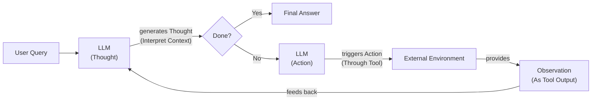

# Building a ReAct Agent From Scratch: A Step-by-Step Guide

In our last lesson, we covered the theory behind ReAct, a powerful pattern for building AI agents that can reason and take action [[1]](https://arxiv.org/pdf/2210.03629). Now, it is time to move from theory to practice. While frameworks like LangChain or CrewAI are great for getting started, they often hide the underlying logic that makes an agent work [[2]](https://www.ibm.com/think/topics/react-agent). Mastering these fundamentals is a key step toward building production-grade AI.

This lesson is 100% practical. We will build a minimal ReAct agent from scratch using only Python and the Gemini API. By implementing the full Thought → Action → Observation loop yourself, you will gain a concrete mental model of how these systems operate. This hands-on approach is consistent with the principle of using simple, composable patterns, which often prove more effective and easier to debug than complex, abstract frameworks [[4]](https://www.anthropic.com/engineering/building-effective-agents). This practical experience is essential for extending and customizing agents with confidence.

We will walk through the entire process, step-by-step:
- Setting up the environment.
- Defining a mock tool for the agent to use.
- Generating thoughts to guide the agent's reasoning.
- Selecting and parsing actions with function calling.
- Building the control loop that orchestrates the agent's behavior.
- Testing the agent to see it succeed and handle failure gracefully.

## Setup and Environment

First, we need to ensure our environment is configured correctly. This setup will allow you to run the code from the lesson's notebook and get the same results. A well-defined environment is the foundation of any reproducible software project, and it is especially important in AI engineering where dependencies can be complex. This initial configuration ensures that our agent has a stable foundation to build upon, minimizing potential issues down the line.

1. We start by loading our environment variables. We use a simple helper function from our course utilities to load the `GOOGLE_API_KEY` from a local `.env` file. This practice is essential for security, as it keeps sensitive credentials like API keys separate from your application's source code, preventing them from being accidentally exposed in version control.
    ```python
    from lessons.utils import env
    
    env.load(required_env_vars=["GOOGLE_API_KEY"])
    ```
    It outputs:
    ```text
    Environment variables loaded successfully.
    ```

2. Next, we import the necessary packages. We will use `google-genai` as the official Python SDK to interact with the Gemini API. `pydantic` will be used for data modeling and validation, which, as we saw in Lesson 4, is critical for creating reliable structured outputs. We also import a few standard libraries for type hinting and an `Enum` for defining our message roles, ensuring our code is both readable and type-safe.
    ```python
    import json
    from enum import Enum
    from typing import List
    
    from google import genai
    from google.genai import types
    from pydantic import BaseModel, Field
    
    from lessons.utils import pretty_print
    ```

3. We initialize the Gemini client. This object will handle all our requests to the Gemini API, managing authentication and network communication for us. It acts as the primary interface between our Python code and Google's AI models.
    ```python
    client = genai.Client()
    ```
    It outputs:
    ```text
    Both GOOGLE_API_KEY and GEMINI_API_KEY are set. Using GOOGLE_API_KEY.
    ```

4. Finally, we define the model we will use. For this lesson, we will use `gemini-2.5-flash`. This model is part of Google's latest generation of models, offering a great balance of speed, cost, and reasoning capabilities, which makes it an excellent choice for building and testing agentic workflows. It is designed for high-frequency tasks where latency and cost are important considerations.
    ```python
    MODEL_ID = "gemini-2.5-flash"
    ```

With the client and model in place, we have a direct line to our agent's "brain." The next step is to give it "hands" by defining an external capability it can use to interact with the world.

## Tool Layer: Mock Search Implementation

To build a useful agent, we need to give it tools. In a production system, these tools would interact with real-world APIs, databases, or other external systems. For this lesson, however, we will use a mock search tool. This approach offers several advantages for learning, as it allows us to focus purely on the agent's internal logic without introducing external complexities.

The philosophy behind using a mock tool is to isolate the core ReAct mechanics. This provides several key benefits:
- **It simplifies the learning focus:** We can concentrate on how the agent thinks, acts, and observes without getting bogged down in API key management, network latency, or the specifics of external services. This educational approach demystifies the agent's decision-making process by providing a controlled environment [[12]](https://www.dailydoseofds.com/ai-agents-crash-course-part-10-with-implementation/).
- **It provides predictability:** The mock tool returns consistent, predefined responses. This is essential for creating reliable tests and debugging the agent's behavior, as we can be certain about the information it receives at each step. This predictability makes the agent's reasoning traces transparent and easy to follow [[13]](https://medium.com/google-cloud/building-react-agents-from-scratch-a-hands-on-guide-using-gemini-ffe4621d90ae).
- **It eliminates dependencies:** Our agent becomes self-contained, making it easier to run and share without requiring additional setup or accounts for third-party services. This hands-on implementation provides a concrete mental model for how agents work, building confidence for extending them later [[14]](https://blog.dailydoseofds.com/p/implement-react-agentic-pattern-from).

Our mock search tool will simulate a simple search engine. It will have a few hardcoded responses for specific queries and a generic fallback response for anything it does not recognize. This is enough to demonstrate the full ReAct loop.

1. We define the `search` function. The docstring here is more than just a comment; it is a critical piece of the tool's definition. The Gemini API will parse this docstring to understand what the tool does and what arguments it expects. A clear and descriptive docstring is essential for the LLM to make accurate decisions about when and how to use the tool.
    ```python
    def search(query: str) -> str:
        """Search for information about a specific topic or query.
    
        Args:
            query (str): The search query or topic to look up.
        """
        query_lower = query.lower()
    
        # Predefined responses for demonstration
        if all(word in query_lower for word in ["capital", "france"]):
            return "Paris is the capital of France and is known for the Eiffel Tower."
        elif "react" in query_lower:
            return "The ReAct (Reasoning and Acting) framework enables LLMs to solve complex tasks by interleaving thought generation, action execution, and observation processing."
    
        # Generic response for unhandled queries
        return f"Information about '{query}' was not found."
    ```

2. We create a `TOOL_REGISTRY`, which is a simple Python dictionary that maps the tool's string name to its callable function. This registry allows our control loop to dynamically look up and execute the correct function based on the name provided by the LLM.
    ```python
    TOOL_REGISTRY = {
        search.__name__: search,
    }
    ```

This simple mock tool is all we need to build and test our agent. In a real-world application, swapping this mock function for a real one is straightforward. You would simply replace the body of the `search` function with code that calls an actual API, like the Google Search API or a query to a vector database. As long as the function signature (name and arguments) and the purpose described in the docstring remain the same, the agent's logic does not need to change [[27]](https://medium.com/google-cloud/building-react-agents-from-scratch-a-hands-on-guide-using-gemini-ffe4621d90ae). This modular design is a key principle of building maintainable AI systems.

## Thought Phase: Prompt Construction and Generation

The first step in the ReAct loop is "Thought." This is where the agent analyzes the user's query and its current context to decide what to do next. This phase is the "reasoning" part of ReAct, where the agent formulates a plan before taking an action [[3]](https://www.ibm.com/think/topics/ai-agent-planning). We will implement a function that generates this thought by prompting the LLM with a carefully constructed set of instructions.

A key strategy here is to use a structured prompt format. We will use XML tags to clearly separate the different parts of the prompt: the instructions, the tool definitions, and the conversation history. This practice, recommended in Google's own prompting strategies, helps the model distinguish between different types of information [[6]](https://ai.google.dev/gemini-api/docs/prompting-strategies). By providing a clear structure, we reduce ambiguity and guide the model's reasoning process more effectively. This not only improves the reliability of the agent's thoughts but also makes its decision-making process more transparent and easier to debug. The prompt acts as the blueprint for the agent's internal monologue, shaping how it decomposes problems and plans its actions.

1. We start by creating a function that generates an XML description of our available tools from the `TOOL_REGISTRY`. This function iterates through the tools, extracts their docstrings, and formats them into a clean XML block. This block will be dynamically inserted into our prompt, ensuring the LLM always has an up-to-date list of its capabilities.
    ```python
    def build_tools_xml_description(tools: dict[str, callable]) -> str:
        """Build a minimal XML description of tools using only their docstrings."""
        lines = []
        for tool_name, fn in tools.items():
            doc = (fn.__doc__ or "").strip()
            lines.append(f"\t<tool name=\"{tool_name}\">")
            if doc:
                lines.append(f"\t\t<description>")
                for line in doc.split("\n"):
                    lines.append(f"\t\t\t{line}")
                lines.append(f"\t\t</description>")
            lines.append("\t</tool>")
        return "\n".join(lines)
    
    tools_xml = build_tools_xml_description(TOOL_REGISTRY)
    
    PROMPT_TEMPLATE_THOUGHT = f"""
    You are deciding the next best step for reaching the user goal. You have some tools available to you.
    
    Available tools:
    <tools>
    {tools_xml}
    </tools>
    
    Conversation so far:
    <conversation>
    {{conversation}}
    </conversation>
    
    State your next thought about what to do next as one short paragraph focused on the next action you intend to take and why.
    Avoid repeating the same strategies that didn't work previously. Prefer different approaches.
    """.strip()
    ```

2. Let's inspect the full prompt template to see exactly what the LLM will receive. This is a good practice to ensure the prompt is structured as intended.
    ```python
    print(PROMPT_TEMPLATE_THOUGHT)
    ```
    It outputs:
    ```text
    You are deciding the next best step for reaching the user goal. You have some tools available to you.
    
    Available tools:
    <tools>
        <tool name="search">
            <description>
                Search for information about a specific topic or query.
                
                Args:
                    query (str): The search query or topic to look up.
            </description>
        </tool>
    </tools>
    
    Conversation so far:
    <conversation>
    {conversation}
    </conversation>
    
    State your next thought about what to do next as one short paragraph focused on the next action you intend to take and why.
    Avoid repeating the same strategies that didn't work previously. Prefer different approaches.
    ```
    The output confirms our structure: the prompt clearly defines the agent's goal, lists the available tools within an XML block, and provides a placeholder for the ongoing conversation history. This structured approach helps the model to focus its reasoning on the task at hand.

3. Now, we implement the `generate_thought` function. This function takes the current conversation history as a string, formats the prompt template with it, and calls the Gemini API. The model's response is a natural language string representing the agent's thought, which we then return.
    ```python
    def generate_thought(conversation: str, tool_registry: dict[str, callable]) -> str:
        """Generate a thought as plain text (no structured output)."""
        tools_xml = build_tools_xml_description(tool_registry)
        prompt = PROMPT_TEMPLATE_THOUGHT.format(conversation=conversation, tools_xml=tools_xml)
    
        response = client.models.generate_content(
            model=MODEL_ID,
            contents=prompt
        )
        return response.text.strip()
    ```

With a coherent thought generated, the agent has a plan. The next step is to translate that plan into a concrete action, which brings us to the "Action" phase of the ReAct loop.

## Action Phase: Function Calling and Parsing

The "Action" phase is where the agent translates its thought into a concrete step. It can either call one of its tools to gather more information or, if it has enough context, provide a final answer to the user. We will implement this using Gemini's native function calling capabilities, a concept we introduced in Lesson 6. This method is far more robust and reliable than trying to parse actions from unstructured text.

### Prompt and Tool Strategy

Our system prompt for this phase is intentionally high-level. It instructs the agent to choose its next action based on the conversation history but does not include the technical details of the tools.

```text
You are selecting the best next action to reach the user goal.

Conversation so far:
<conversation>
{conversation}
</conversation>

Respond either with a tool call (with arguments) or a final answer if you can confidently conclude.
```

This minimalist approach is possible because we pass the Python tool functions directly to the Gemini API's `tools` configuration. This is a powerful feature that separates the strategic instructions in the prompt from the technical data of the tools [[7]](https://stevekinney.com/writing/prompt-engineering-frontier-llms). The API automatically inspects our `search` function, extracts its name, docstring (for the description), and parameter type hints, and formats this information for the model. This keeps our prompts clean and focused on the agent's goal, while the API handles the low-level details of tool definition. This separation of concerns is a best practice that makes our agent more modular and easier to maintain.

### Implementation

1. We start by defining two Pydantic models, `ToolCallRequest` and `FinalAnswer`, to represent the two possible outcomes of the action phase. This ensures that the model's decision is returned in a predictable, structured format that our code can easily work with.
    ```python
    class ToolCallRequest(BaseModel):
        """A request to call a tool with its name and arguments."""
        tool_name: str = Field(description="The name of the tool to call.")
        arguments: dict = Field(description="The arguments to pass to the tool.")
    
    
    class FinalAnswer(BaseModel):
        """A final answer to present to the user when no further action is needed."""
        text: str = Field(description="The final answer text to present to the user.")
    ```

2. Next, we define our prompt templates. `PROMPT_TEMPLATE_ACTION` is for the standard decision-making process. `PROMPT_TEMPLATE_ACTION_FORCED` is a special-purpose prompt we will use to compel the agent to provide a final answer when it reaches its turn limit, preventing infinite loops.
    ```python
    PROMPT_TEMPLATE_ACTION = """
    You are selecting the best next action to reach the user goal.
    
    Conversation so far:
    <conversation>
    {conversation}
    </conversation>
    
    Respond either with a tool call (with arguments) or a final answer if you can confidently conclude.
    """.strip()
    
    # Dedicated prompt used when we must force a final answer
    PROMPT_TEMPLATE_ACTION_FORCED = """
    You must now provide a final answer to the user.
    
    Conversation so far:
    <conversation>
    {conversation}
    </conversation>
    
    Provide a concise final answer that best addresses the user's goal.
    """.strip()
    ```

3. Now, we implement the `generate_action` function, the core of this phase. This function constructs the request to the Gemini API, including the prompt and the tool configuration, and then parses the response to determine the agent's next action.
    ```python
    def generate_action(conversation: str, tool_registry: dict[str, callable] | None = None, force_final: bool = False) -> (ToolCallRequest | FinalAnswer):
        """Generate an action by passing tools to the LLM and parsing function calls or final text.
    
        When force_final is True or no tools are provided, the model is instructed to produce a final answer and tool calls are disabled.
        """
        # Use a dedicated prompt when forcing a final answer or no tools are provided
        if force_final or not tool_registry:
            prompt = PROMPT_TEMPLATE_ACTION_FORCED.format(conversation=conversation)
            response = client.models.generate_content(
                model=MODEL_ID,
                contents=prompt
            )
            return FinalAnswer(text=response.text.strip())
    
        # Default action prompt
        prompt = PROMPT_TEMPLATE_ACTION.format(conversation=conversation)
    
        # Provide the available tools to the model
        tools = list(tool_registry.values())
        config = types.GenerateContentConfig(
            tools=tools,
        )
        response = client.models.generate_content(
            model=MODEL_ID,
            contents=prompt,
            config=config
        )
    
        # Extract the function call from the response (if present)
        candidate = response.candidates[0]
        if hasattr(candidate.content.parts[0], "function_call"):
            function_call = candidate.content.parts[0].function_call
            name = function_call.name
            args = dict(function_call.args) if function_call.args is not None else {}
            return ToolCallRequest(tool_name=name, arguments=args)
        
        # Otherwise, it's a final answer
        final_answer = "".join(part.text for part in candidate.content.parts)
        return FinalAnswer(text=final_answer.strip())
    ```
    The parsing logic is straightforward. We check if the response contains a `function_call` attribute. If it does, we extract the tool name and arguments and return a `ToolCallRequest`. If not, we treat the response as a text-based final answer and return a `FinalAnswer`. The `force_final` flag provides a crucial safety mechanism, ensuring our agent can always terminate gracefully.

    It is also important to handle potential errors during this phase. For instance, if the LLM returns a malformed response that is neither a valid function call nor a final answer, our system needs to recover. A robust implementation might include a `try-except` block around the parsing logic. If parsing fails, the agent could log the error and either retry the `generate_action` call or return a default "I'm sorry, I encountered an error" message to the user. Similarly, if the model requests a tool that does not exist in our `TOOL_REGISTRY`, the control loop (which we will build next) should catch this and provide feedback to the agent in the next observation step, allowing it to self-correct.

## Control Loop: Messages, Scratchpad, and Orchestration

Now we build the main ReAct control loop that orchestrates the Thought → Action → Observation cycle. This loop is the engine of our agent, managing the flow of information and decisions from one step to the next. This pattern is conceptually similar to feedback control loops used in robotics and other engineering disciplines, where a system continuously senses its environment, plans a response, and acts to achieve a goal [[8]](https://www.sciencedirect.com/topics/computer-science/feedback-control-loop).

### Control Loop Architecture

The diagram in Image 1 shows the flow we are about to implement. The agent receives a query, enters a loop of thinking and acting, and continues until it determines it is done and can provide a final answer. This iterative process allows the agent to break down complex problems into smaller, manageable steps, gathering information and refining its approach along the way. The orchestration of this loop is what gives the agent its autonomous character, enabling it to navigate tasks without a predefined script.


Image 1: A flowchart illustrating the core ReAct control loop.

### Message Structure

To track the agent's interactions in a clean and organized way, we will use a structured message system. This is far more robust than simply appending raw strings to a history log. A structured approach ensures that each piece of information is clearly labeled with its role, which is vital for the LLM to correctly interpret the conversation history. It also makes the agent's internal state much easier for us to inspect and debug.

1. First, we define a `MessageRole` enum. This allows us to categorize each message in the conversation (e.g., user input, agent thought, tool output), which is essential for both the agent and for us to understand the context of each piece of information.
    ```python
    class MessageRole(str, Enum):
        """Enumeration for the different roles a message can have."""
        USER = "user"
        THOUGHT = "thought"
        TOOL_REQUEST = "tool request
        OBSERVATION = "observation"
        FINAL_ANSWER = "final answer"
    ```

2. Next, we create a `Message` class using Pydantic. Each message will have a `role` and `content`. This simple but powerful structure forms the building block of our agent's short-term memory, often called a "scratchpad."
    ```python
    class Message(BaseModel):
        """A message with a role and content, used for all message types."""
        role: MessageRole = Field(description="The role of the message in the ReAct loop.")
        content: str = Field(description="The textual content of the message.")
    
        def __str__(self) -> str:
            """Provides a user-friendly string representation of the message."""
            return f"{self.role.value.capitalize()}: {self.content}"
    ```

3. We also add a helper function to pretty-print these messages with colors. This will make the agent's execution trace much easier to read and debug.
    ```python
    def pretty_print_message(message: Message, turn: int, max_turns: int, header_color: str = pretty_print.Color.YELLOW, is_forced_final_answer: bool = False) -> None:
        if not is_forced_final_answer:
            title = f"{message.role.value.capitalize()} (Turn {turn}/{max_turns}):"
        else:
            title = f"{message.role.value.capitalize()} (Forced):"
    
        pretty_print.wrapped(
            text=message.content,
            title=title,
            header_color=header_color,
        )
    ```

### The Scratchpad

The `Scratchpad` class is a simple container for our list of `Message` objects. Its main job is to append new messages and, when needed, serialize the entire history into a single string to be passed to the LLM. This provides the model with the full context of the conversation for its next decision. The scratchpad is the agent's working memory, holding the state of the current task.

```python
class Scratchpad:
    """Container for ReAct messages with optional pretty-print on append."""

    def __init__(self, max_turns: int) -> None:
        self.messages: List[Message] = []
        self.max_turns: int = max_turns
        self.current_turn: int = 1

    def set_turn(self, turn: int) -> None:
        self.current_turn = turn

    def append(self, message: Message, verbose: bool = False, is_forced_final_answer: bool = False) -> None:
        self.messages.append(message)
        if verbose:
            role_to_color = {
                MessageRole.USER: pretty_print.Color.RESET,
                MessageRole.THOUGHT: pretty_print.Color.ORANGE,
                MessageRole.TOOL_REQUEST: pretty_print.Color.GREEN,
                MessageRole.OBSERVATION: pretty_print.Color.YELLOW,
                MessageRole.FINAL_ANSWER: pretty_print.Color.CYAN,
            }
            header_color = role_to_color.get(message.role, pretty_print.Color.YELLOW)
            pretty_print_message(
                message=message,
                turn=self.current_turn,
                max_turns=self.max_turns,
                header_color=header_color,
                is_forced_final_answer=is_forced_final_answer,
            )

    def to_string(self) -> str:
        return "\n".join(str(m) for m in self.messages)
```
While this simple scratchpad is effective for short tasks, it has a critical limitation for longer interactions: the "context avalanche." Because the entire history is sent on each turn, token consumption can grow quadratically, not linearly. A ten-step task can easily accumulate thousands of tokens in just context overhead, making the agent slow and expensive [[9]](https://www.zartis.com/ai-agent-cost-optimisation-why-token-cost-is-the-wrong-number-to-optimise/). In production, you would need more sophisticated context management strategies, like summarizing past turns or using a vector store for episodic memory, which we will explore in future lessons.

### The Control Loop

Finally, we implement the `react_agent_loop`. This function orchestrates the entire process from start to finish. It is the heart of the agent, tying together the thought, action, and observation phases into a cohesive, iterative workflow.

- It initializes the `Scratchpad` with the user's initial question.
- It then enters a loop that runs for a maximum number of turns. In each turn, it generates a `Thought`, then an `Action`.
- If the action is a `ToolCallRequest`, it looks up the tool in the `TOOL_REGISTRY` and executes it. The result is captured as an `Observation` message and added to the scratchpad. This observation processing is integrated directly into the loop, providing immediate feedback for the next reasoning step.
- If the action is a `FinalAnswer`, the loop terminates and returns the answer.
- If the agent reaches the `max_turns` limit without finding an answer, it calls `generate_action` one last time with `force_final=True` to ensure a graceful exit.

This loop also includes basic error handling. If a tool execution fails or if the agent requests an unknown tool, an informative error message is added to the scratchpad as the observation. This allows the agent to "see" the failure and potentially try a different approach in its next thought phase. This resilience is a hallmark of a well-designed agent.

```python
def react_agent_loop(initial_question: str, tool_registry: dict[str, callable], max_turns: int = 5, verbose: bool = False) -> str:
    """
    Implements the main ReAct (Thought -> Action -> Observation) control loop.
    Uses a unified message class for the scratchpad.
    """
    scratchpad = Scratchpad(max_turns=max_turns)

    # Add the user's question to the scratchpad
    user_message = Message(role=MessageRole.USER, content=initial_question)
    scratchpad.append(user_message, verbose=verbose)

    for turn in range(1, max_turns + 1):
        scratchpad.set_turn(turn)

        # Generate a thought based on the current scratchpad
        thought_content = generate_thought(
            scratchpad.to_string(),
            tool_registry,
        )
        thought_message = Message(role=MessageRole.THOUGHT, content=thought_content)
        scratchpad.append(thought_message, verbose=verbose)

        # Generate an action based on the current scratchpad
        action_result = generate_action(
            scratchpad.to_string(),
            tool_registry=tool_registry,
        )

        # If the model produced a final answer, return it
        if isinstance(action_result, FinalAnswer):
            final_answer = action_result.text
            final_message = Message(role=MessageRole.FINAL_ANSWER, content=final_answer)
            scratchpad.append(final_message, verbose=verbose)
            return final_answer

        # Otherwise, it is a tool request
        if isinstance(action_result, ToolCallRequest):
            action_name = action_result.tool_name
            action_params = action_result.arguments

            # Add the action to the scratchpad
            params_str = ", ".join([f"{k}='{v}'" for k, v in action_params.items()])
            action_content = f"{action_name}({params_str})"
            action_message = Message(role=MessageRole.TOOL_REQUEST, content=action_content)
            scratchpad.append(action_message, verbose=verbose)

            # Run the action and get the observation
            observation_content = ""
            if action_name in tool_registry:
                tool_function = tool_registry[action_name]
                try:
                    observation_content = tool_function(**action_params)
                except Exception as e:
                    observation_content = f"Error executing tool '{action_name}': {e}"
            else:
                observation_content = f"Unknown tool '{action_name}'. Available tools: {list(tool_registry.keys())}"


            # Add the observation to the scratchpad
            observation_message = Message(role=MessageRole.OBSERVATION, content=observation_content)
            scratchpad.append(observation_message, verbose=verbose)

        # Check if the maximum number of turns has been reached. If so, force the action selector to produce a final answer
        if turn == max_turns:
            forced_action = generate_action(
                scratchpad.to_string(),
                force_final=True,
            )
            if isinstance(forced_action, FinalAnswer):
                final_answer = forced_action.text
            else:
                final_answer = "Unable to produce a final answer within the allotted turns."
            final_message = Message(role=MessageRole.FINAL_ANSWER, content=final_answer)
            scratchpad.append(final_message, verbose=verbose, is_forced_final_answer=True)
            return final_answer
```
This loop is the engine of our ReAct agent, tying together all the components we have built into a functioning, autonomous system. While simple, it forms the basis for more advanced agentic architectures. It could be extended with more sophisticated tools, a more robust memory system, or even a self-correction mechanism where the agent reflects on its failures to improve its strategy.

## Tests and Traces: Success and Graceful Fallback

With the complete loop implemented, it is time to test our agent. By analyzing the execution traces, we can verify that the agent behaves as expected in both successful and unsuccessful scenarios. These tests are crucial to ensure our agent is not only functional but also robust. A well-designed agent should be able to handle both the happy path and unexpected failures with equal grace.

### Successful Execution

First, let's ask a simple factual question that our mock `search` tool is designed to answer: "What is the capital of France?" We will set `max_turns` to 2, giving the agent a limited number of attempts to find the solution. This test will validate the agent's ability to follow the core ReAct cycle to a successful conclusion.

1. We define the question and run the `react_agent_loop`, setting `verbose=True` to print the full trace.
    ```python
    question = "What is the capital of France?"
    final_answer = react_agent_loop(question, TOOL_REGISTRY, max_turns=2, verbose=True)
    ```
    It outputs:
    ```text
    User (Turn 1/2):
    What is the capital of France?
    
    Thought (Turn 1/2):
    I need to find the capital of France. The user's question is a straightforward factual query. I can use the search tool to find this information.
    
    Tool request (Turn 1/2):
    search(query='capital of France')
    
    Observation (Turn 1/2):
    Paris is the capital of France and is known for the Eiffel Tower.
    
    Thought (Turn 2/2):
    I have found the answer to the user's question. I can now provide the final answer.
    
    Final answer (Turn 2/2):
    Paris is the capital of France.
    ```

2. The trace shows a perfect execution of the ReAct cycle. In the first turn, the agent correctly identifies the need for external information, formulates a thought to use the `search` tool, and generates the correct `ToolCallRequest`. After executing the tool and receiving the `Observation`, it proceeds to the second turn. Here, its thought process recognizes that the observation contains the answer, and it correctly transitions to generating a `FinalAnswer`, successfully completing the task within the turn limit. This confirms that our core loop—from thought to action to observation and back—is functioning as designed. The clarity of the trace, with each step explicitly labeled, demonstrates the interpretability benefits of the ReAct pattern.

### Graceful Fallback

Now, let's test the agent's resilience. We will ask a question that our mock tool cannot answer: "What is the capital of Italy?" This scenario will test two important features: the agent's ability to adapt its strategy when a tool fails and the forced termination logic that ensures a graceful exit. This is a critical test of the agent's robustness in the face of imperfect information.

1. We run the loop with the new, unsupported question.
    ```python
    question = "What is the capital of Italy?"
    final_answer = react_agent_loop(question, TOOL_REGISTRY, max_turns=2, verbose=True)
    ```
    It outputs:
    ```text
    User (Turn 1/2):
    What is the capital of Italy?
    
    Thought (Turn 1/2):
    The user is asking for the capital of Italy. I can use the search tool to find this information.
    
    Tool request (Turn 1/2):
    search(query='capital of Italy')
    
    Observation (Turn 1/2):
    Information about 'capital of Italy' was not found.
    
    Thought (Turn 2/2):
    The previous search for 'capital of Italy' failed. I will try a broader search for just 'Italy' to see if I can find the capital that way.
    
    Tool request (Turn 2/2):
    search(query='Italy')
    
    Observation (Turn 2/2):
    Information about 'Italy' was not found.
    
    Final answer (Forced):
    I'm sorry, but I couldn't find information about the capital of Italy using the available tools.
    ```
2. This trace demonstrates several critical behaviors for a robust agent.
    - **Adaptation:** The thought in Turn 2 is particularly insightful. After the initial, specific search fails, the agent does not give up. Instead, it reasons about the failure and formulates a new plan: "I will try a broader search for just 'Italy'". This shows adaptive problem-solving, a key characteristic of effective agents.
    - **Tool Failure Handling:** The agent correctly processes the "not found" observation from the tool and incorporates this new information into its reasoning process without crashing. It treats the failure as just another piece of data to inform its next step.
    - **Forced Termination:** After two failed attempts, the agent reaches the `max_turns` limit. The control loop correctly identifies this and triggers the `force_final=True` path. This results in a polite and informative final answer that clearly communicates to the user that it was unable to fulfill the request, preventing an infinite loop and providing a clean conclusion.

These tests confirm that our agent is not only capable of solving tasks but can also handle unexpected situations and failures gracefully, a critical feature for any system intended for real-world use.

## Conclusion

By building a ReAct agent from scratch, we have demystified the core mechanics of the Thought-Action-Observation loop. We have seen how to structure prompts, define tools, generate thoughts, parse actions, and orchestrate the entire process within a control loop. This hands-on approach provides a solid mental model for how these systems work under the hood.

This foundational knowledge is what will allow you to build, debug, and extend more complex agents with confidence. Even if you end up using a framework in production, understanding these principles is one of the core skills you should master as an AI Engineer. While frameworks like LangGraph offer pre-built solutions, knowing how they are constructed enables you to customize and troubleshoot them effectively [[5]](https://ai.google.dev/gemini-api/docs/langgraph-example).

In our next lesson, we will build on this foundation by exploring how to give agents memory, allowing them to remember past interactions and learn over time.

## References

- [1] ReAct: Synergizing Reasoning and Acting in Language Models (https://arxiv.org/pdf/2210.03629)
- [2] ReAct Agent (https://www.ibm.com/think/topics/react-agent)
- [3] AI Agent Planning (https://www.ibm.com/think/topics/ai-agent-planning)
- [4] Building effective agents (https://www.anthropic.com/engineering/building-effective-agents)
- [5] ReAct agent from scratch with Gemini 2.5 and LangGraph (https://ai.google.dev/gemini-api/docs/langgraph-example)
- [6] Prompt design strategies (https://ai.google.dev/gemini-api/docs/prompting-strategies)
- [7] Prompt Engineering for Frontier LLMs (https://stevekinney.com/writing/prompt-engineering-frontier-llms)
- [8] Feedback Control Loop (https://www.sciencedirect.com/topics/computer-science/feedback-control-loop)
- [9] AI Agent Cost Optimisation: Why Token Cost Is The Wrong Number To Optimise (https://www.zartis.com/ai-agent-cost-optimisation-why-token-cost-is-the-wrong-number-to-optimise/)
- [12] AI Agents Crash Course - Part 10: ReAct Framework with Implementation (https://www.dailydoseofds.com/ai-agents-crash-course-part-10-with-implementation/)
- [13] Building ReAct Agents from Scratch using Gemini (https://medium.com/google-cloud/building-react-agents-from-scratch-a-hands-on-guide-using-gemini-ffe4621d90ae)
- [14] Implementing ReAct Agentic Pattern From Scratch (https://blog.dailydoseofds.com/p/implement-react-agentic-pattern-from)
- [27] Building ReAct Agents from Scratch using Gemini (https://medium.com/google-cloud/building-react-agents-from-scratch-a-hands-on-guide-using-gemini-ffe4621d90ae)
</article>