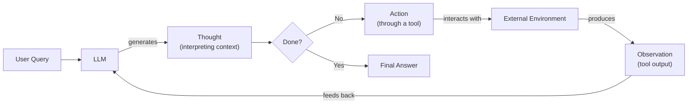

# Build a ReAct Agent from Scratch with Python and Gemini

In our last lesson, we explored the theory behind agentic reasoning patterns like ReAct. We saw how Large Language Models (LLMs) can break down complex problems into a sequence of thoughts and actions, a powerful step up from simple one-shot generation. But theory only gets you so far. To truly master AI engineering, you need to get your hands dirty and build these systems yourself.

The dream of autonomous agents is not new; it traces back to early symbolic AI research in the 1970s, where "expert systems" attempted to encode human knowledge into rules and inference engines [[10]](https://www.ibm.com/think/topics/evolution-of-ai-agents). While those early systems were brittle, the core idea of a system that can reason and act to achieve a goal has been a long-standing ambition in computer science. Today's LLMs provide a new, more flexible foundation for realizing that ambition.

Frameworks like LangGraph or CrewAI offer powerful abstractions for building agents, but they can also hide the fundamental mechanics. Relying on them without understanding what happens under the hood is like driving a car without knowing how the engine works. You can get from A to B, but when something goes wrong, you are left stranded. This is the "PoC purgatory" where so many promising AI projects end up.

That is why this lesson is 100% practical. We will build a complete, minimal ReAct agent from scratch using only Python and the Gemini API. By implementing the full Thought-Action-Observation loop yourself, you will gain a concrete mental model of how these systems operate. This hands-on experience is what separates engineers who build robust, debuggable AI products from those who just connect black boxes.

We will walk through the entire process step-by-step, mirroring the code in the accompanying notebook. You will learn to:

*   Define and integrate external tools for your agent.
*   Construct prompts to guide the agent’s thought process.
*   Use Gemini’s function calling to translate thoughts into actions.
*   Implement a turn-based control loop to orchestrate the agent's execution.
*   Analyze execution traces to debug and verify agent behavior.

Let's start building.

## Setup and Environment

Our first step is to set up a clean and predictable environment. This ensures that the code from our notebook runs smoothly and that you can replicate the exact traces we will analyze later. We will use Google's `google-genai` Python package to interact with the Gemini API.

1.  We begin by loading our API key from an environment file. This is a standard practice to keep secrets out of your code.
    ```python
    from lessons.utils import env
    
    env.load(required_env_vars=["GOOGLE_API_KEY"])
    ```

2.  Next, we import the necessary libraries, including `google.genai` for the Gemini client and `pydantic` for data modeling, which we will use later.
    ```python
    import json
    from enum import Enum
    from typing import (
        Callable,
        TypedDict,
    )
    
    from google import genai
    from google.genai import types
    from pydantic import BaseModel, Field
    
    from lessons.utils.pretty_print import print_in_color
    ```

3.  We initialize the Gemini client. If you have both a `GOOGLE_API_KEY` and a `GEMINI_API_KEY` set, the library might print a warning indicating which one it is using.
    ```python
    client = genai.Client()
    ```
    It outputs:
    ```text
    Both GOOGLE_API_KEY and GEMINI_API_KEY are set. Using GOOGLE_API_KEY.
    ```

4.  Finally, we select the model we will use. Gemini offers a range of models, but for this lesson, we will use `gemini-2.5-flash`. It is fast, cost-effective, and more than capable of handling the reasoning required for our simple agent.
    ```python
    MODEL_ID = "gemini-2.5-flash"
    ```

With our client and model ready, the next step is to give our agent a capability—a tool it can use to interact with the world.

## Tool Layer: Mock Search Implementation

An agent's power comes from its ability to use tools to gather information or perform actions. For this lesson, we will create a simple mock search tool. Instead of making real API calls to Google or another search engine, our tool will return predefined responses.

There are a few key reasons for this approach, especially when learning:

*   **Focus:** It allows us to concentrate on the ReAct mechanics (thought, action, observation) without getting sidetracked by API integrations and network requests.
*   **Simplicity:** It removes the need for external dependencies and additional API keys, making the setup cleaner.
*   **Predictability:** It provides consistent, predictable responses, which is essential for testing and debugging our agent's reasoning loop.

Our mock `search` function is designed to simulate a real search tool. It takes a query and returns a string with the result. The docstring is especially important, as modern LLMs use it to understand what the tool does and how to use it.

1.  We start by defining our simple `search` function. It contains a hardcoded dictionary of answers. If a query matches a key, it returns the corresponding value; otherwise, it returns a "not found" message. This simulates how a real tool might respond to different queries.
    ```python
    def search(query: str) -> str:
        """
        A mock search tool that returns predefined results for specific queries.
        """
        # A mock search tool that returns predefined results for specific queries.
        mock_results = {
            "capital of France": "Paris is the capital of France and is known for the Eiffel Tower.",
            "current weather in New York": "The weather in New York is currently sunny with a temperature of 75°F.",
        }
        return mock_results.get(query, f"Information about '{query}' was not found.")
    ```

2.  Next, we define a `Tool` class and a `TOOL_REGISTRY` to manage our tools. This is a common pattern in agentic systems. A registry acts as a central place to store and look up available tools by name, making it easy to add new tools or swap implementations without changing the core agent logic.
    ```python
    class Tool(TypedDict):
        """A simple tool definition with a name, handler function, and description."""
    
        name: str
        handler: Callable
        description: str
    
    
    TOOL_REGISTRY = {
        "search": Tool(
            name="search",
            handler=search,
            description=search.__doc__,
        ),
    }
    ```

In a production system, you could easily replace our mock `search` function with a real one that calls an external API like Google Search. As long as the new function maintains the same signature (`query: str -> str`) and the tool registry is updated, the agent's logic would not need to change. This modular design is a key principle of building scalable AI systems.

When moving from mock tools to real ones, it is important to invest time in their design. Think of the tool's definition—its name, parameters, and description—as an "agent-computer interface." Just as a good human-computer interface is intuitive for people, a good ACI must be unambiguous for the LLM. Best practices include writing clear descriptions with examples, testing how the model uses the tool on various inputs, and designing parameters to be less error-prone [[4]](https://www.anthropic.com/engineering/building-effective-agents).

Now that our agent has a tool, it needs a way to decide when and how to use it. This is the "Thought" phase of the ReAct cycle.

## Thought Phase: Prompt Construction and Generation

The first step in the ReAct loop is "Thought." This is where the agent analyzes the user's query and its history to form a plan. This phase is a practical application of AI agent planning, where the system determines a sequence of actions to achieve a goal. A key part of this process is task decomposition, where the agent breaks a complex goal into smaller, manageable sub-goals [[3]](https://www.ibm.com/think/topics/ai-agent-planning). To guide this process, we need a prompt that tells the LLM what tools are available and what its current context is.

A common and effective technique is to use XML tags to structure the prompt. This provides clear delimiters that help the model distinguish between different types of information, such as tool descriptions and the conversation history.

1.  We will create a helper function to format our tool registry into an XML string. Each tool is wrapped in a `<tool>` tag, including its name and description. This gives the LLM a clean, machine-readable list of its capabilities.
    ```python
    def build_tools_xml_description(tool_registry: dict[str, Tool]) -> str:
        """Builds an XML string describing the available tools."""
        xml = "<tools>\n"
        for tool in tool_registry.values():
            xml += f'<tool name="{tool["name"]}">\n'
            xml += f"<description>{tool['description']}</description>\n"
            xml += "</tool>\n"
        xml += "</tools>"
        return xml
    
    
    tools_xml_description = build_tools_xml_description(TOOL_REGISTRY)
    
    PROMPT_TEMPLATE_THOUGHT = """
    You are a helpful assistant that has access to the following tools:
    {tools_xml}
    
    The following is the conversation history.
    <conversation>
    {conversation}
    </conversation>
    
    Based on the conversation history, do you need to use a tool?
    If so, what is your high-level plan to answer the user's question?
    Respond with your thought process only.
    """
    ```

2.  Let's inspect the full prompt template. It instructs the model on its role, provides the XML block of tools, and includes a placeholder for the `{conversation}` history.
    ```python
    print(PROMPT_TEMPLATE_THOUGHT.format(
        tools_xml=tools_xml_description,
        conversation="<user>What is the capital of France?</user>"
    ))
    ```
    It outputs:
    ```text
    You are a helpful assistant that has access to the following tools:
    <tools>
    <tool name="search">
    <description>
            A mock search tool that returns predefined results for specific queries.
            </description>
    </tool>
    </tools>
    
    The following is the conversation history.
    <conversation>
    <user>What is the capital of France?</user>
    </conversation>
    
    Based on the conversation history, do you need to use a tool?
    If so, what is your high-level plan to answer the user's question?
    Respond with your thought process only.
    ```

3.  Finally, we create a function, `generate_thought`, to execute this phase. It formats the prompt with the current conversation and tool registry, sends it to the Gemini model, and returns the model's generated thought as a clean string.
    ```python
    def generate_thought(conversation: str, tool_registry: dict[str, Tool]) -> str:
        """Generates a thought based on the conversation history and available tools."""
        tools_xml = build_tools_xml_description(tool_registry)
        prompt = PROMPT_TEMPLATE_THOUGHT.format(
            tools_xml=tools_xml, conversation=conversation
        )
        response = client.models.generate_content(model=MODEL_ID, contents=prompt)
        return response.text.strip()
    ```

A thought is just the first step. The agent must translate that thought into a concrete action. This is where Gemini's function calling comes in.

## Action Phase: Function Calling and Parsing

After generating a thought, the agent needs to decide on a concrete action. This could be calling a tool or, if it has enough information, providing a final answer to the user. Instead of manually prompting the model to output a specific string format for the action, we can leverage a more robust and modern approach: native function calling. Early ReAct agents relied on parsing text-based actions from the LLM's output, a brittle process prone to errors. Modern LLMs with native function calling capabilities allow for a much more reliable approach by returning a structured format that can be directly executed [[11]](https://www.philschmid.de/langgraph-gemini-2-5-react-agent).

Gemini's function calling feature allows us to define our tools as Python functions and pass them directly in the API configuration. The model then automatically gets the function's name, docstring (as its description), and parameters from the function signature. This is a powerful advantage because it separates the strategic guidance in the system prompt from the technical details of the tools. Our prompt can focus on *what* to do, while the `tools` configuration tells the model *how* to do it.

This leads to cleaner prompts and makes it much easier to manage, add, or remove tools without rewriting complex prompt templates.

1.  We start by defining two Pydantic models to represent the possible outcomes of the action phase: `ToolCallRequest` for when a tool needs to be used, and `FinalAnswer` for when the agent is done. Using Pydantic ensures our parsed outputs are validated and type-safe.
    ```python
    class ToolCallRequest(BaseModel):
        """A request to call a tool with a given name and arguments."""
    
        name: str = Field(description="The name of the tool to call.")
        args: dict = Field(description="The arguments to pass to the tool.")
    
    
    class FinalAnswer(BaseModel):
        """The final answer to the user's question."""
    
        answer: str = Field(description="The final answer.")
    ```

2.  Next, we define a system prompt for the action phase. Notice how simple it is. It gives the agent high-level instructions to either use a tool to find information or provide a final answer. It does not need to include any details about the `search` tool's signature or description.
    ```python
    PROMPT_TEMPLATE_ACTION = """
    You are a helpful assistant.
    Based on the conversation history, you must decide what to do next.
    You can either use a tool to get more information or provide a final answer.
    
    The following is the conversation history.
    <conversation>
    {conversation}
    </conversation>
    """
    ```

3.  The core of this phase is the `generate_action` function. It takes the conversation history and the tool registry. Inside, it constructs the `GenerateContentConfig` for the Gemini API call. We pass our Python tool handlers directly to the `tools` parameter.
    ```python
    def generate_action(
        conversation: str, tool_registry: dict[str, Tool]
    ) -> ToolCallRequest | FinalAnswer:
        """Generates an action (tool call or final answer) based on the conversation."""
        prompt = PROMPT_TEMPLATE_ACTION.format(conversation=conversation)
    
        tool_handlers = [tool["handler"] for tool in tool_registry.values()]
        config = types.GenerateContentConfig(tools=tool_handlers)
    
        response = client.models.generate_content(
            model=MODEL_ID, contents=prompt, config=config
        )
        part = response.candidates[0].content.parts[0]
    
        if hasattr(part, "function_call"):
            function_call = part.function_call
            return ToolCallRequest(
                name=function_call.name, args=dict(function_call.args)
            )
        else:
            return FinalAnswer(answer=part.text)
    ```
    After calling the model, we parse the response. If the response contains a `function_call` attribute, we know the model wants to use a tool. We extract the tool's name and arguments and return a `ToolCallRequest` object. If there is no function call, we assume the model's text response is the final answer and return a `FinalAnswer` object. This robust parsing logic ensures we can handle both outcomes cleanly.

While the ReAct loop offers adaptability, it is worth noting that for predictable, straightforward tasks, a direct function call can be faster and more token-efficient. The iterative reasoning of ReAct is most valuable in dynamic or unpredictable scenarios where the agent's ability to adjust its plan is a key advantage [[2]](https://www.ibm.com/think/topics/react-agent).

We can now generate thoughts and actions. The final piece is to orchestrate these steps in a continuous loop, allowing the agent to reason, act, and observe until it solves the task.

## Control Loop: Messages, Scratchpad, and Orchestration

With the "Thought" and "Action" phases defined, we now need a control loop to tie them together. This loop will manage the conversation turn by turn, maintain a history of all interactions, and orchestrate the full ReAct cycle: Thought → Action → Observation.

The heart of our control loop is a "scratchpad," which is simply a list of messages that records every step the agent takes. This history is crucial, as it provides the context for the agent's reasoning in subsequent turns.

1.  To keep the scratchpad organized, we will define a structured `Message` class and a `MessageRole` enum. This allows us to clearly distinguish between the user's query, the agent's internal thoughts, tool requests, tool outputs (observations), and the final answer.
    ```python
    class MessageRole(str, Enum):
        """The role of the message sender."""
    
        USER = "user"
        THOUGHT = "thought"
        TOOL_REQUEST = "tool_request"
        OBSERVATION = "observation"
        FINAL_ANSWER = "final_answer"
    
    
    class Message(BaseModel):
        """A message in the conversation history."""
    
        role: MessageRole
        content: str
    ```

2.  We will also create a couple of helper functions. `format_scratchpad_as_messages` converts our list of `Message` objects into a simple XML-formatted string that can be easily injected into our prompts. `pretty_print_message` helps us visualize the agent's trace in a color-coded, readable format.
    ```python
    def format_scratchpad_as_messages(scratchpad: list[Message]) -> str:
        """Formats the scratchpad into an XML string."""
        xml = ""
        for message in scratchpad:
            xml += f"<{message.role}>\n{message.content}\n</{message.role}>\n"
        return xml.strip()
    
    
    def pretty_print_message(message: Message):
        """Prints a message with a color-coded role."""
        role_color_map = {
            MessageRole.USER: "blue",
            MessageRole.THOUGHT: "purple",
            MessageRole.TOOL_REQUEST: "green",
            MessageRole.OBSERVATION: "yellow",
            MessageRole.FINAL_ANSWER: "red",
        }
        print_in_color(f"{message.role.upper()}:", role_color_map[message.role])
        print(f"{message.content}\n")
    ```

The ReAct loop is a practical implementation of a feedback loop, a core concept in control theory and other fields of engineering. In these systems, the output of an action (the observation) is fed back as an input to guide the next decision (the thought), creating a self-regulating cycle that steers the system toward a goal [[12]](https://fs.blog/mental-model-feedback-loops). Image 1 below shows the theoretical ReAct loop that we discussed in the previous lesson. It is this exact cycle of thought, action, and observation that we are now implementing in our `react_agent_loop` function.


Image 1: A flowchart illustrating the Theoretical ReAct Agent Design, showing the iterative Thought-Action-Observation loop.

3.  The `react_agent_loop` function is the main orchestrator. It initializes the scratchpad with the user's query and then enters a loop that runs for a maximum number of turns.
    ```python
    def react_agent_loop(
        user_query: str, tool_registry: dict[str, Tool], max_turns: int = 5, verbose: bool = False
    ) -> str:
        """
        The main ReAct agent loop.
        """
        scratchpad = [Message(role=MessageRole.USER, content=user_query)]
        if verbose:
            pretty_print_message(scratchpad[-1])
    
        for turn in range(max_turns):
            if verbose:
                print_in_color(f"--- Turn {turn + 1}/{max_turns} ---", "cyan")
    
            # 1. Thought Phase
            conversation = format_scratchpad_as_messages(scratchpad)
            thought = generate_thought(conversation, tool_registry)
            scratchpad.append(Message(role=MessageRole.THOUGHT, content=thought))
            if verbose:
                pretty_print_message(scratchpad[-1])
    
            # 2. Action Phase
            conversation = format_scratchpad_as_messages(scratchpad)
            action = generate_action(conversation, tool_registry)
    
            if isinstance(action, FinalAnswer):
                scratchpad.append(
                    Message(role=MessageRole.FINAL_ANSWER, content=action.answer)
                )
                if verbose:
                    pretty_print_message(scratchpad[-1])
                return action.answer
    
            # 3. Observation Phase
            scratchpad.append(
                Message(
                    role=MessageRole.TOOL_REQUEST,
                    content=json.dumps({"name": action.name, "args": action.args}),
                )
            )
            if verbose:
                pretty_print_message(scratchpad[-1])
    
            if action.name in tool_registry:
                tool_handler = tool_registry[action.name]["handler"]
                try:
                    observation = tool_handler(**action.args)
                except Exception as e:
                    observation = f"Error executing tool {action.name}: {e}"
            else:
                observation = f"Unknown tool: {action.name}. Please use one of the available tools: {list(tool_registry.keys())}"
    
            scratchpad.append(Message(role=MessageRole.OBSERVATION, content=observation))
            if verbose:
                pretty_print_message(scratchpad[-1])
    
        # Forced Final Answer
        final_answer = "I'm sorry, but I couldn't find an answer. Please try again."
        scratchpad.append(Message(role=MessageRole.FINAL_ANSWER, content=final_answer))
        if verbose:
            pretty_print_message(scratchpad[-1])
        return final_answer
    ```
    Inside each turn, it performs the three phases:
    *   **Thought:** It calls `generate_thought` using the current scratchpad content.
    *   **Action:** It calls `generate_action`. If the action is a `FinalAnswer`, the loop terminates and returns the answer.
    *   **Observation:** If the action is a `ToolCallRequest`, the loop looks up the corresponding tool in the `TOOL_REGISTRY` and executes it. The tool's output (the observation) is captured. This includes handling potential errors during tool execution or if an unknown tool is requested. The observation is then added to the scratchpad.
    
    If the loop completes all turns without reaching a `FinalAnswer`, it generates a forced final response to ensure the agent always concludes gracefully.

While we have implemented this orchestration logic manually, frameworks like LangGraph formalize this process by modeling agents as stateful graphs. In such a graph, our functions (`generate_thought`, `generate_action`, `call_tool`) would be nodes, and conditional logic would define the edges that direct the flow from one node to the next based on the current state [[5]](https://ai.google.dev/gemini-api/docs/langgraph-example).

With the complete loop implemented, let's test it on a couple of scenarios to see it in action and analyze its behavior.

## Tests and Traces: Success and Graceful Fallback

The final step is to validate our agent and analyze its execution traces. By observing the full ReAct cycle on different queries, we can confirm that our control loop, tool integration, and termination logic are all working as designed. We will run two tests: one where the agent should succeed easily and another designed to test its ability to handle failure gracefully.

### Test 1: Successful Factual Query

First, let's ask a simple factual question that our mock `search` tool is equipped to answer: "What is the capital of France?". We will set `max_turns=2` to give it enough room to work but prevent infinite loops.

1.  We call our `react_agent_loop` with the query and `verbose=True` to see the full trace.
    ```python
    react_agent_loop(
        user_query="What is the capital of France?",
        tool_registry=TOOL_REGISTRY,
        max_turns=2,
        verbose=True,
    );
    ```
    It outputs:
    ```text
    USER:
    What is the capital of France?
    
    --- Turn 1/2 ---
    THOUGHT:
    The user is asking for the capital of France. I should use the search tool to find this information.
    
    TOOL_REQUEST:
    {"name": "search", "args": {"query": "capital of France"}}
    
    OBSERVATION:
    Paris is the capital of France and is known for the Eiffel Tower.
    
    --- Turn 2/2 ---
    THOUGHT:
    I have found the capital of France using the search tool. I can now provide the final answer.
    
    FINAL_ANSWER:
    Paris is the capital of France.
    ```
    The trace shows a perfect ReAct cycle. In the first turn, the agent thinks, correctly decides to use the `search` tool, and gets the observation that Paris is the capital. In the second turn, it recognizes it has the answer and provides the `FinalAnswer`, successfully terminating the loop. This highlights a key strength of the ReAct pattern: by grounding its reasoning in an external observation, the agent avoids hallucinating facts, a common failure mode for reasoning-only approaches [[1]](https://arxiv.org/pdf/2210.03629).

### Test 2: Graceful Fallback on an Unknown Query

Now, let's test a query that our mock tool does not have a predefined answer for: "What is the capital of Italy?". This will test the agent's ability to handle a "not found" observation and continue its reasoning process.

1.  We run the loop again with the new query.
    ```python
    react_agent_loop(
        user_query="What is the capital of Italy?",
        tool_registry=TOOL_REGISTRY,
        max_turns=2,
        verbose=True,
    );
    ```
    It outputs:
    ```text
    USER:
    What is the capital of Italy?
    
    --- Turn 1/2 ---
    THOUGHT:
    The user is asking for the capital of Italy. I will use the search tool to find this information.
    
    TOOL_REQUEST:
    {"name": "search", "args": {"query": "capital of Italy"}}
    
    OBSERVATION:
    Information about 'capital of Italy' was not found.
    
    --- Turn 2/2 ---
    THOUGHT:
    The previous search for "capital of Italy" failed. I will try a broader search for just "Italy" to see if I can find any relevant information that might lead to the answer.
    
    TOOL_REQUEST:
    {"name": "search", "args": {"query": "Italy"}}
    
    OBSERVATION:
    Information about 'Italy' was not found.
    
    FINAL_ANSWER:
    I'm sorry, but I couldn't find an answer. Please try again.
    ```
    This trace demonstrates the agent's resilience. After the first search fails, the agent does not give up. In its next thought, it formulates a new strategy: trying a broader query ("Italy"). Although that also fails in our mock setup, it shows adaptive reasoning. Because it reaches the `max_turns` limit without a definitive answer, the loop triggers the forced final answer, admitting it could not fulfill the request. This is a critical feature for production agents, preventing them from getting stuck and ensuring they always provide a response to the user.

These tests show that even our minimal implementation provides a robust foundation for an agent. By building this from scratch, you have gained a deep understanding of the core mechanics that power more complex agentic systems.

## Conclusion

By building a ReAct agent from the ground up, we have demystified the magic behind agentic frameworks. We have seen how a simple, turn-based control loop can orchestrate the full Thought-Action-Observation cycle, enabling an LLM to reason, use tools, and adapt its strategy based on new information. This hands-on process provides a concrete mental model that is essential for any AI engineer looking to build, debug, and extend autonomous systems. The same core principles are being applied to build agents that can plan and execute end-to-end workflows in complex domains like scientific discovery [[13]](https://kempnerinstitute.harvard.edu/research/deeper-learning/from-models-to-scientists-building-ai-agents-for-scientific-discovery/).

This is a foundational skill. The core loop we implemented is the engine that drives more sophisticated agents. In upcoming lessons, we will build upon this foundation. We will explore how to equip agents with memory to recall past interactions in Lesson 9, dive deep into Retrieval-Augmented Generation (RAG) to connect them with vast knowledge bases in Lesson 10, and learn to process multimodal data like images and documents in Lesson 11. The journey to production also involves tackling challenges like managing latency, token costs, and ensuring reliability at scale [[14]](https://discuss.google.dev/t/beyond-the-prototype-scaling-production-grade-agents-with-gemini/356140). Your journey into building production-ready AI agents has just begun.

## References

*   [1] Yao, S., Zhao, J., Yu, D., Du, N., Shafran, I., Narasimhan, K., & Cao, Y. (2022). *ReAct: Synergizing Reasoning and Acting in Language Models*. arXiv. https://arxiv.org/pdf/2210.03629
*   [2] *What is a ReAct agent?*. (n.d.). IBM. https://www.ibm.com/think/topics/react-agent
*   [3] *What is AI agent planning?*. (n.d.). IBM. https://www.ibm.com/think/topics/ai-agent-planning
*   [4] *Building effective agents*. (n.d.). Anthropic. https://www.anthropic.com/engineering/building-effective-agents
*   [5] *ReAct agent from scratch with Gemini 2.5 and LangGraph*. (n.d.). Google AI for Developers. https://ai.google.dev/gemini-api/docs/langgraph-example
*   [6] Ferrag, M. A., Tihanyi, N., & Debbah, M. (2025). *From LLM Reasoning to Autonomous AI Agents: A Comprehensive Review*. arXiv. https://arxiv.org/pdf/2504.19678
*   [7] Shankar, A. (2024, July 15). *Building ReAct Agents from Scratch using Gemini*. Medium. https://medium.com/google-cloud/building-react-agents-from-scratch-a-hands-on-guide-using-gemini-ffe4621d90ae
*   [8] *What is AI agent orchestration?*. (n.d.). IBM. https://www.ibm.com/think/topics/ai-agent-orchestration
*   [9] *Function calling*. (n.d.). Google AI for Developers. https://ai.google.dev/gemini-api/docs/function-calling
*   [10] *The evolution of AI agents*. (n.d.). IBM. https://www.ibm.com/think/topics/evolution-of-ai-agents
*   [11] Schmid, P. (2025, March 31). *ReAct agent from scratch with Gemini 2.5 and LangGraph*. Phil Schmid's Blog. https://www.philschmid.de/langgraph-gemini-2-5-react-agent
*   [12] *Feedback Loops*. (n.d.). Farnam Street. https://fs.blog/mental-model-feedback-loops/
*   [13] *From Models to Scientists: Building AI Agents for Scientific Discovery*. (n.d.). Kempner Institute Harvard University. https://kempnerinstitute.harvard.edu/research/deeper-learning/from-models-to-scientists-building-ai-agents-for-scientific-discovery/
*   [14] *Beyond the Prototype: Scaling Production-Grade Agents with Gemini*. (2024, August 20). Google for Developers. https://discuss.google.dev/t/beyond-the-prototype-scaling-production-grade-agents-with-gemini/356140