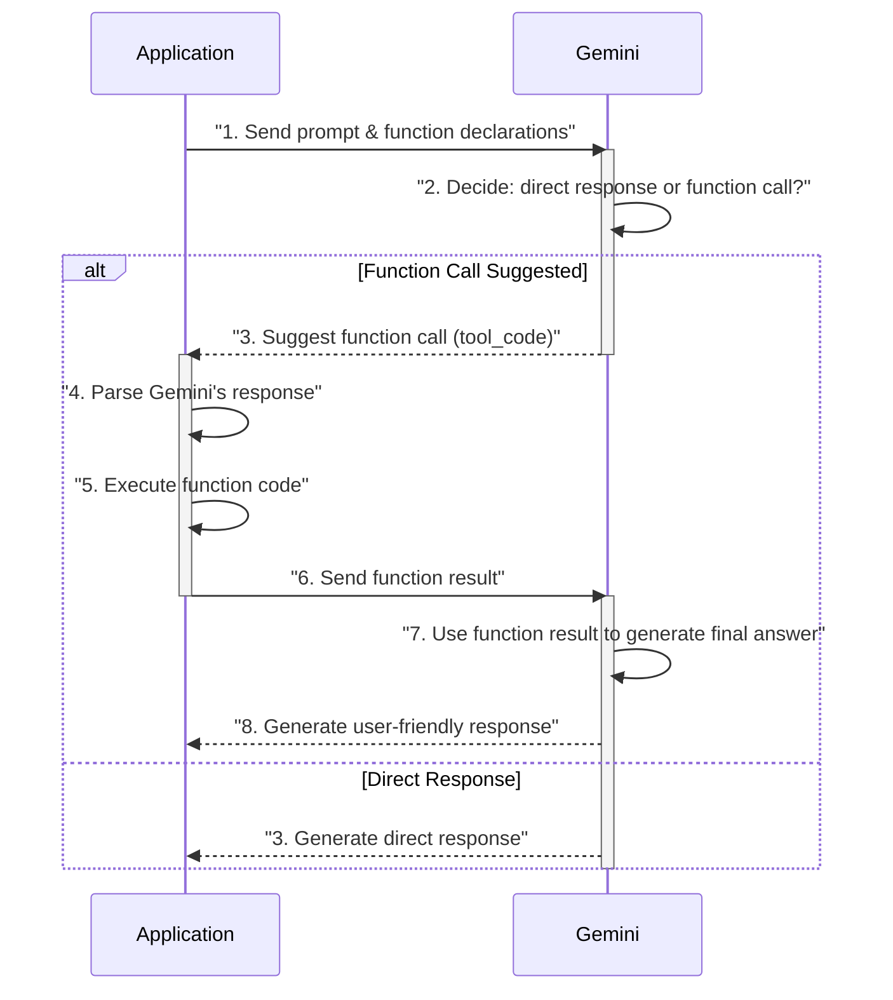
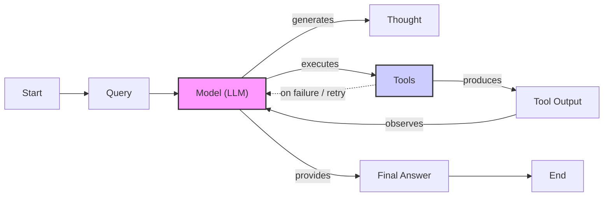

# Building a ReAct Agent From Scratch: A Step-by-Step Guide

In our previous lessons, we covered the theoretical foundations of AI agents. We explored the agent landscape, distinguished between LLM workflows and autonomous agents, and introduced context engineering, structured outputs, tools, and the ReAct reasoning framework. Now, it is time to put theory into practice.

This lesson is a 100% hands-on guide to building a minimal ReAct agent from scratch. We will use only Python and the Gemini API to implement the complete Thought → Action → Observation cycle. You will learn to define a mock tool, generate thoughts, select actions using function calling, execute those actions, and process the resulting observations within a turn-based control loop.

Building this system from the ground up provides a concrete mental model of how reasoning agents work. By the end of this lesson, you will have a functional agent that you can confidently debug, extend, and customize, giving you a solid foundation for building more complex AI systems.

## Setup and Environment

Before we start building, let's ensure your environment is set up correctly. This will help you run the code from the lesson's notebook seamlessly and verify that your outputs match our expected traces.

1.  First, we load the necessary environment variables. Our utility function checks for your `GOOGLE_API_KEY` to authenticate with the Gemini API.
    ```python
    from lessons.utils import env
    
    env.load(required_env_vars=["GOOGLE_API_KEY"])
    ```
    It outputs:
    ```text
    Trying to load environment variables from /path/to/your/project/.env
    Environment variables loaded successfully.
    ```

2.  Next, we import the key packages for this lesson. We will use `google-genai` for interacting with the Gemini API, `pydantic` for creating data structures, and some standard Python libraries for type hinting.
    ```python
    from enum import Enum
    from pydantic import BaseModel, Field
    from typing import List
    
    from google import genai
    from google.genai import types
    
    from lessons.utils import pretty_print
    ```

3.  We then initialize the Gemini client. The client will automatically use the API key we loaded earlier.
    ```python
    client = genai.Client()
    ```
    It outputs:
    ```text
    Both GOOGLE_API_KEY and GEMINI_API_KEY are set. Using GOOGLE_API_KEY.
    ```

4.  Finally, we define the model we will use. For this lesson, we will use `gemini-2.5-flash`, which is a fast and cost-effective model well-suited for the tasks we will be performing.
    ```python
    MODEL_ID = "gemini-2.5-flash"
    ```

With the client and model in place, we can now define the external tools our agent will use to interact with its environment.

## Tool Layer: Mock Search Implementation

Our ReAct agent needs tools to perform actions. For this lesson, we will create a simple mock search tool instead of integrating with a real API like Google Search. This approach offers several educational benefits: it allows us to focus purely on the ReAct mechanics without worrying about external dependencies or API keys, and it provides predictable responses, which makes testing and debugging much easier [[12]](https://www.dailydoseofds.com/ai-agents-crash-course-part-10-with-implementation/), [[13]](https://medium.com/google-cloud/building-react-agents-from-scratch-a-hands-on-guide-using-gemini-ffe4621d90ae/).

1.  Our mock `search` function simulates an external knowledge source. It takes a string query and returns a predefined answer if the query matches certain keywords. The function signature and docstring are important, as they provide the LLM with the necessary information to understand what the tool does and how to use it.
    ```python
    def search(query: str) -> str:
        """Search for information about a specific topic or query.
    
        Args:
            query (str): The search query or topic to look up.
        """
        query_lower = query.lower()
    
        # Predefined responses for demonstration
        if all(word in query_lower for word in ["capital", "france"]):
            return "Paris is the capital of France and is known for the Eiffel Tower."
        elif "react" in query_lower:
            return "The ReAct (Reasoning and Acting) framework enables LLMs to solve complex tasks by interleaving thought generation, action execution, and observation processing."
    
        # Generic response for unhandled queries
        return f"Information about '{query}' was not found."
    ```
    For example, if the query contains "capital" and "france," it returns a fact about Paris. If it sees "react," it provides a definition of the ReAct framework. For any other query, it returns a fallback message indicating that the information was not found. This simulates how a real search tool might behave when it cannot find relevant results.

2.  To manage our tools, we use a `TOOL_REGISTRY`. This dictionary maps the tool's name to its actual Python function. This mapping is what allows our agent to execute the correct function when the LLM decides to use a tool. It separates the model's symbolic planning (using the tool name) from the code's execution logic.
    ```python
    TOOL_REGISTRY = {
        search.__name__: search,
    }
    ```

In a production system, you could easily swap this mock function with a real API call to Google Search, Wikipedia, or a domain-specific knowledge base [[27]](https://medium.com/google-cloud/building-react-agents-from-scratch-a-hands-on-guide-using-gemini-ffe4621d90ae/). As long as the new function maintains the same signature (`query: str -> str`) and the docstring accurately describes its purpose, the agent can integrate it without any changes to its core logic.

Now that our agent has a tool, let's implement the first step of the ReAct cycle: the Thought phase.

## Thought Phase: Prompt Construction and Generation

The first step in the ReAct loop is "Thought," where the agent analyzes the user's query and the conversation history to decide on the next best action. To guide this process, we need to construct a prompt that tells the LLM what tools are available and how it should structure its reasoning.

1.  We start by creating a helper function, `build_tools_xml_description`, to generate a minimal XML description of our available tools. This function iterates through the `TOOL_REGISTRY`, extracts the name and docstring of each tool, and formats them within `<tool>` tags. Using XML helps the model clearly distinguish the tool definitions from other parts of the prompt.
    ```python
    def build_tools_xml_description(tools: dict[str, callable]) -> str:
        """Build a minimal XML description of tools using only their docstrings."""
        lines = []
        for tool_name, fn in tools.items():
            doc = (fn.__doc__ or "").strip()
            lines.append(f"\t<tool name=\"{tool_name}\">")
            if doc:
                lines.append(f"\t\t<description>")
                for line in doc.split("\n"):
                    lines.append(f"\t\t\t{line}")
                lines.append(f"\t\t</description>")
            lines.append("\t</tool>")
        return "\n".join(lines)
    ```

2.  Next, we define the prompt template for the thought-generation phase. This template includes placeholders for the tool descriptions (`{tools_xml}`) and the conversation history (`{conversation}`). It instructs the model to state its next thought as a short paragraph focused on the action it intends to take.
    ```python
    tools_xml = build_tools_xml_description(TOOL_REGISTRY)
    
    PROMPT_TEMPLATE_THOUGHT = f"""
    You are deciding the next best step for reaching the user goal. You have some tools available to you.
    
    Available tools:
    <tools>
    {tools_xml}
    </tools>
    
    Conversation so far:
    <conversation>
    {{conversation}}
    </conversation>
    
    State your next thought about what to do next as one short paragraph focused on the next action you intend to take and why.
    Avoid repeating the same strategies that didn't work previously. Prefer different approaches.
    """.strip()
    ```

3.  Let's inspect the final prompt to see how it looks with the tool definitions injected.
    ```python
    print(PROMPT_TEMPLATE_THOUGHT)
    ```
    It outputs:
    ```text
    You are deciding the next best step for reaching the user goal. You have some tools available to you.
    
    Available tools:
    <tools>
    	<tool name="search">
    		<description>
    			Search for information about a specific topic or query.
    			
    			Args:
    			    query (str): The search query or topic to look up.
    		</description>
    	</tool>
    </tools>
    
    Conversation so far:
    <conversation>
    {conversation}
    </conversation>
    
    State your next thought about what to do next as one short paragraph focused on the next action you intend to take and why.
    Avoid repeating the same strategies that didn't work previously. Prefer different approaches.
    ```
    The output shows the complete prompt, with the `<tool name="search">` block containing the docstring from our mock function.

4.  Finally, we implement the `generate_thought` function. This function takes the current conversation history, formats the prompt template with the necessary information, and calls the Gemini model. It returns the model's generated thought as a clean string.
    ```python
    def generate_thought(conversation: str, tool_registry: dict[str, callable]) -> str:
        """Generate a thought as plain text (no structured output)."""
        tools_xml = build_tools_xml_description(tool_registry)
        prompt = PROMPT_TEMPLATE_THOUGHT.format(conversation=conversation, tools_xml=tools_xml)
    
        response = client.models.generate_content(
            model=MODEL_ID,
            contents=prompt
        )
        return response.text.strip()
    ```
    While our prompt is straightforward, production systems often use more advanced prompting strategies to improve reasoning quality. Techniques like Chain-of-Verification (CoVe), where the model generates and answers verification questions before responding, can reduce factual errors and hallucinations in the agent's thought process [[39]](https://medium.com/@aysan.nazarmohamady/reducing-ai-hallucinations-6-prompt-engineering-techniques-that-actually-work-16b583797bd0).

With a coherent thought generated, the agent must now decide whether to call a tool to gather more information or conclude with a final answer. This brings us to the Action phase.

## Action Phase: Function Calling and Parsing

After generating a thought, the agent moves to the "Action" phase. Here, it decides whether to use a tool or provide a final answer. We will use Gemini's native function calling capability, which is more reliable than manually parsing text [[38]](https://arxiv.org/pdf/2210.03629). Instead of including detailed tool signatures in our prompt, we pass the Python tool functions directly to the API. The Gemini client automatically extracts their definitions and arguments, allowing our prompt to focus on high-level strategy.

This separation of concerns makes prompts cleaner and tool management easier. The model analyzes the prompt and the available functions, and if it decides a tool is needed, it returns a structured `functionCall` object. Our application then parses this object to execute the corresponding function.

Image 1: A sequence diagram illustrating the function calling process between an application and the Gemini model.



Let's implement this phase step-by-step.

1.  We define two prompt templates. `PROMPT_TEMPLATE_ACTION` is the default, instructing the model to choose between a tool call and a final answer. `PROMPT_TEMPLATE_ACTION_FORCED` is used when we need to terminate the loop, forcing the model to provide a final answer without calling any more tools. This is a crucial mechanism for preventing infinite loops.
    ```python
    PROMPT_TEMPLATE_ACTION = """
    You are selecting the best next action to reach the user goal.
    
    Conversation so far:
    <conversation>
    {conversation}
    </conversation>
    
    Respond either with a tool call (with arguments) or a final answer if you can confidently conclude.
    """.strip()
    
    # Dedicated prompt used when we must force a final answer
    PROMPT_TEMPLATE_ACTION_FORCED = """
    You must now provide a final answer to the user.
    
    Conversation so far:
    <conversation>
    {conversation}
    </conversation>
    
    Provide a concise final answer that best addresses the user's goal.
    """.strip()
    ```

2.  Next, we define Pydantic models to represent the two possible outcomes of the action phase: a `ToolCallRequest` or a `FinalAnswer`. Using Pydantic ensures that the data we work with is structured and validated.
    ```python
    class ToolCallRequest(BaseModel):
        """A request to call a tool with its name and arguments."""
        tool_name: str = Field(description="The name of the tool to call.")
        arguments: dict = Field(description="The arguments to pass to the tool.")
    
    
    class FinalAnswer(BaseModel):
        """A final answer to present to the user when no further action is needed."""
        text: str = Field(description="The final answer text to present to the user.")
    ```

3.  Now, we implement the `generate_action` function. This is the core of the action phase.
    ```python
    def generate_action(conversation: str, tool_registry: dict[str, callable] | None = None, force_final: bool = False) -> (ToolCallRequest | FinalAnswer):
        """Generate an action by passing tools to the LLM and parsing function calls or final text.
    
        When force_final is True or no tools are provided, the model is instructed to produce a final answer and tool calls are disabled.
        """
        # Use a dedicated prompt when forcing a final answer or no tools are provided
        if force_final or not tool_registry:
            prompt = PROMPT_TEMPLATE_ACTION_FORCED.format(conversation=conversation)
            response = client.models.generate_content(
                model=MODEL_ID,
                contents=prompt
            )
            return FinalAnswer(text=response.text.strip())
    
        # Default action prompt
        prompt = PROMPT_TEMPLATE_ACTION.format(conversation=conversation)
    
        # Provide the available tools to the model; disable auto-calling so we can parse and run ourselves
        tools = list(tool_registry.values())
        config = types.GenerateContentConfig(
            tools=tools,
        )
        response = client.models.generate_content(
            model=MODEL_ID,
            contents=prompt,
            config=config
        )
    
        # Extract the function call from the response (if present)
        candidate = response.candidates[0]
        parts = candidate.content.parts
        if parts and getattr(parts[0], "function_call", None):
            name = parts[0].function_call.name
            args = dict(parts[0].function_call.args) if parts[0].function_call.args is not None else {}
            return ToolCallRequest(tool_name=name, arguments=args)
        
        # Otherwise, it's a final answer
        final_answer = "".join(part.text for part in candidate.content.parts)
        return FinalAnswer(text=final_answer.strip())
    ```
    If `force_final` is true, it uses the forced-answer prompt and returns a `FinalAnswer`. Otherwise, it sends the default prompt along with the list of available tools to the `generate_content` call. We then inspect the response. If it contains a `function_call`, we parse the name and arguments and return a `ToolCallRequest`. If not, we treat the response as plain text and return a `FinalAnswer`.

While our implementation handles a single tool call per turn, production frameworks often optimize this step. For instance, frameworks like LangGraph can parse multiple tool calls from a single model response and execute them concurrently. This parallel execution can dramatically reduce latency when an agent needs to gather information from several sources at once [[40]](https://www.decodingai.com/p/building-production-react-agents).

With the Thought and Action phases implemented, we have all the pieces needed to build the main control loop that orchestrates the entire ReAct cycle.

## Control Loop: Messages, Scratchpad, Orchestration

The control loop is the engine of our ReAct agent. It orchestrates the Thought → Action → Observation cycle, managing the flow of information and making decisions at each turn. To keep track of the conversation, we will use a "scratchpad," which is a list of messages that records every step of the agent's process.

This pattern is a simplified version of what production-grade agentic frameworks implement. For example, LangGraph builds a stateful graph where an `AgentState` object, which holds the message history, is passed between nodes representing thoughts and tools. Our scratchpad serves the same purpose as this state object: it is the agent's short-term memory [[40]](https://www.decodingai.com/p/building-production-react-agents).

Image 2: A flowchart illustrating the LangGraph's ReAct Agent Implementation, showing the iterative process between the LLM (Model) and external Tools, including observation processing and termination conditions.



1.  First, we define the data structures for our messages. `MessageRole` is an `Enum` that categorizes each message as a user query, an internal thought, a tool request, an observation, or a final answer. The `Message` class is a Pydantic model that holds the role and content for each message.
    ```python
    class MessageRole(str, Enum):
        """Enumeration for the different roles a message can have."""
        USER = "user"
        THOUGHT = "thought"
        TOOL_REQUEST = "tool request"
        OBSERVATION = "observation"
        FINAL_ANSWER = "final answer"
    
    
    class Message(BaseModel):
        """A message with a role and content, used for all message types."""
        role: MessageRole = Field(description="The role of the message in the ReAct loop.")
        content: str = Field(description="The textual content of the message.")
    
        def __str__(self) -> str:
            """Provides a user-friendly string representation of the message."""
            return f"{self.role.value.capitalize()}: {self.content}"
    ```

2.  To make the agent's process easy to follow, we create a `pretty_print_message` helper function. It prints each message with a color-coded header indicating its role and the current turn, making the traces readable.
    ```python
    def pretty_print_message(message: Message, turn: int, max_turns: int, header_color: str = pretty_print.Color.YELLOW, is_forced_final_answer: bool = False) -> None:
        if not is_forced_final_answer:
            title = f"{message.role.value.capitalize()} (Turn {turn}/{max_turns}):"
        else:
            title = f"{message.role.value.capitalize()} (Forced):"
    
        pretty_print.wrapped(
            text=message.content,
            title=title,
            header_color=header_color,
        )
    ```

3.  The `Scratchpad` class manages the list of messages. Its `append` method adds a new message to the history and can optionally print it using our pretty-printing function. The `to_string` method serializes the entire message history into a single string, which we will feed back into the model's context at each turn.
    ```python
    class Scratchpad:
        """Container for ReAct messages with optional pretty-print on append."""
    
        def __init__(self, max_turns: int) -> None:
            self.messages: List[Message] = []
            self.max_turns: int = max_turns
            self.current_turn: int = 1
    
        def set_turn(self, turn: int) -> None:
            self.current_turn = turn
    
        def append(self, message: Message, verbose: bool = False, is_forced_final_answer: bool = False) -> None:
            self.messages.append(message)
            if verbose:
                role_to_color = {
                    MessageRole.USER: pretty_print.Color.RESET,
                    MessageRole.THOUGHT: pretty_print.Color.ORANGE,
                    MessageRole.TOOL_REQUEST: pretty_print.Color.GREEN,
                    MessageRole.OBSERVATION: pretty_print.Color.YELLOW,
                    MessageRole.FINAL_ANSWER: pretty_print.Color.CYAN,
                }
                header_color = role_to_color.get(message.role, pretty_print.Color.YELLOW)
                pretty_print_message(
                    message=message,
                    turn=self.current_turn,
                    max_turns=self.max_turns,
                    header_color=header_color,
                    is_forced_final_answer=is_forced_final_answer,
                )
    
        def to_string(self) -> str:
            return "\n".join(str(m) for m in self.messages)
    ```
    Maintaining this conversation history is the key challenge in building agents that can handle multi-turn dialogues. Without a well-managed scratchpad, the agent cannot remember previous interactions, leading to repetitive or irrelevant responses [[41]](https://codesignal.com/learn/courses/coordinating-openai-agents-workflows-in-typescript/lessons/building-multi-turn-conversations-with-openai-agents-in-typescript). However, as the scratchpad grows, it can lead to state bloat and increased token costs, a trade-off that must be managed in long-running conversations [[5]](https://ai.google.dev/gemini-api/docs/langgraph-example).

4.  Now we can implement the main `react_agent_loop` function. This function orchestrates the entire process.
    ```python
    def react_agent_loop(initial_question: str, tool_registry: dict[str, callable], max_turns: int = 5, verbose: bool = False) -> str:
        """
        Implements the main ReAct (Thought -> Action -> Observation) control loop.
        Uses a unified message class for the scratchpad.
        """
        scratchpad = Scratchpad(max_turns=max_turns)
    
        # Add the user's question to the scratchpad
        user_message = Message(role=MessageRole.USER, content=initial_question)
        scratchpad.append(user_message, verbose=verbose)
    
        for turn in range(1, max_turns + 1):
            scratchpad.set_turn(turn)
    
            # Generate a thought based on the current scratchpad
            thought_content = generate_thought(
                scratchpad.to_string(),
                tool_registry,
            )
            thought_message = Message(role=MessageRole.THOUGHT, content=thought_content)
            scratchpad.append(thought_message, verbose=verbose)
    
            # Generate an action based on the current scratchpad
            action_result = generate_action(
                scratchpad.to_string(),
                tool_registry=tool_registry,
            )
    
            # If the model produced a final answer, return it
            if isinstance(action_result, FinalAnswer):
                final_answer = action_result.text
                final_message = Message(role=MessageRole.FINAL_ANSWER, content=final_answer)
                scratchpad.append(final_message, verbose=verbose)
                return final_answer
    
            # Otherwise, it is a tool request
            if isinstance(action_result, ToolCallRequest):
                action_name = action_result.tool_name
                action_params = action_result.arguments
    
                # Add the action to the scratchpad
                params_str = ", ".join([f"{k}='{v}'" for k, v in action_params.items()])
                action_content = f"{action_name}({params_str})"
                action_message = Message(role=MessageRole.TOOL_REQUEST, content=action_content)
                scratchpad.append(action_message, verbose=verbose)
    
                # Run the action and get the observation
                observation_content = ""
                tool_function = tool_registry.get(action_name)
                if tool_function:
                    try:
                        observation_content = tool_function(**action_params)
                    except Exception as e:
                        observation_content = f"Error executing tool '{action_name}': {e}"
                else:
                    observation_content = f"Unknown tool '{action_name}'. Available tools: {list(tool_registry.keys())}"
    
                # Add the observation to the scratchpad
                observation_message = Message(role=MessageRole.OBSERVATION, content=observation_content)
                scratchpad.append(observation_message, verbose=verbose)
    
            # Check if the maximum number of turns has been reached. If so, force the action selector to produce a final answer
            if turn == max_turns:
                forced_action = generate_action(
                    scratchpad.to_string(),
                    force_final=True,
                )
                if isinstance(forced_action, FinalAnswer):
                    final_answer = forced_action.text
                else:
                    final_answer = "Unable to produce a final answer within the allotted turns."
                final_message = Message(role=MessageRole.FINAL_ANSWER, content=final_answer)
                scratchpad.append(final_message, verbose=verbose, is_forced_final_answer=True)
                return final_answer
    ```
    The loop begins by adding the user's initial question to the scratchpad. Then, for a maximum number of turns, it generates a thought and an action. If the action is a `FinalAnswer`, the loop terminates and returns the answer. If it is a `ToolCallRequest`, the loop executes the specified tool, captures the output as an "Observation," and appends it to the scratchpad. This observation becomes part of the context for the next turn's thought process. If the loop reaches its maximum number of turns, it calls `generate_action` one last time with `force_final=True` to ensure a graceful exit.

This complete loop demonstrates the core of a ReAct agent: an iterative cycle of reasoning, acting, and observing that allows the agent to tackle complex problems step-by-step.

## Tests and Traces: Success and Graceful Fallback

Now that we have built the complete ReAct loop, let's test it with two examples. We will analyze the printed traces to verify that the agent behaves as expected, both in a successful run and in a scenario that requires a graceful fallback.

1.  First, we ask a simple factual question: "What is the capital of France?". We set `max_turns` to 2 and `verbose` to `True` to see the detailed trace.
    ```python
    # A straightforward question requiring a search.
    question = "What is the capital of France?"
    final_answer = react_agent_loop(question, TOOL_REGISTRY, max_turns=2, verbose=True)
    ```
    It outputs:
    ```text
    User (Turn 1/2):
    What is the capital of France?
    
    Thought (Turn 1/2):
    I need to find the capital of France. The user has asked a direct factual question. I can use the search tool to find this information.
    
    Tool request (Turn 1/2):
    search(query='capital of France')
    
    Observation (Turn 1/2):
    Paris is the capital of France and is known for the Eiffel Tower.
    
    Thought (Turn 2/2):
    The search tool returned the answer that Paris is the capital of France. I have enough information to answer the user's question.
    
    Final answer (Turn 2/2):
    Paris is the capital of France.
    ```
    The trace shows a perfect execution. In the first turn, the agent correctly identifies the need for a search, calls the `search` tool, and receives the answer. In the second turn, it recognizes that it has sufficient information and provides the final answer, terminating the loop well within the turn budget.

2.  Next, let's test the agent's fallback behavior with a query our mock tool cannot answer: "What is the capital of Italy?".
    ```python
    # A question our mock tool can't answer, testing fallback.
    question = "What is the capital of Italy?"
    final_answer = react_agent_loop(question, TOOL_REGISTRY, max_turns=2, verbose=True)
    ```
    It outputs:
    ```text
    User (Turn 1/2):
    What is the capital of Italy?
    
    Thought (Turn 1/2):
    The user is asking for the capital of Italy. I can use the search tool to find this information.
    
    Tool request (Turn 1/2):
    search(query='capital of Italy')
    
    Observation (Turn 1/2):
    Information about 'capital of Italy' was not found.
    
    Thought (Turn 2/2):
    The previous search for "capital of Italy" failed. I will try a broader search for just "Italy" to see if I can find the capital that way.
    
    Tool request (Turn 2/2):
    search(query='Italy')
    
    Observation (Turn 2/2):
    Information about 'Italy' was not found.
    
    Final answer (Forced):
    I'm sorry, but I couldn't find information about the capital of Italy using the available tools.
    ```
    This trace demonstrates the agent's resilience. After the first search fails, the agent's thought process in the second turn shows it adapting its strategy to a broader query. When that also fails, it reaches the `max_turns` limit. The control loop then correctly triggers the forced final answer path, and the agent concludes by informing the user that it could not find the information.

These tests confirm that our end-to-end loop is working correctly. The agent can successfully use tools to find answers and can also handle failure gracefully by adapting its strategy and terminating cleanly when it cannot find a solution. While manual inspection of traces is useful for debugging, production-grade agents require systematic evaluation. This involves tracking both outcome metrics, like task completion rates, and process metrics, such as tool selection accuracy and latency per step, to quantify performance over time [[42]](https://www.braintrust.dev/articles/evaluate-agents-new-models-gemini-3).

## Conclusion

In this lesson, we moved from theory to practice by building a complete ReAct agent from the ground up. You implemented every component of the Thought-Action-Observation cycle, from defining tools and constructing prompts to orchestrating the control loop that brings it all together. By building this system yourself, you have gained a practical understanding of how autonomous agents reason, act, and learn from their environment.

This hands-on experience is the foundation for building more advanced AI systems. The simple agent we created today can be extended with more sophisticated tools, a persistent memory, and more complex reasoning patterns. In our upcoming lessons, we will dive deeper into these topics, exploring how to build agents with long-term memory and how to leverage Retrieval-Augmented Generation (RAG) for knowledge-intensive tasks.

## References

- [1] Yao, S., Zhao, J., Yu, D., Du, N., Shafran, I., Narasimhan, K., & Cao, Y. (2023). ReAct: Synergizing Reasoning and Acting in Language Models. *arXiv preprint arXiv:2210.03629*. https://arxiv.org/pdf/2210.03629
- [2] ReAct Agent. (n.d.). IBM. https://www.ibm.com/think/topics/react-agent
- [3] AI agent planning. (n.d.). IBM. https://www.ibm.com/think/topics/ai-agent-planning
- [4] Building effective agents. (2024). Anthropic. https://www.anthropic.com/engineering/building-effective-agents
- [5] ReAct agent from scratch with Gemini 2.5 and LangGraph. (n.d.). Google AI for Developers. https://ai.google.dev/gemini-api/docs/langgraph-example
- [6] Ferrag, M. A., Tihanyi, N., & Debbah, M. (2026). From LLM Reasoning to Autonomous AI Agents: A Comprehensive Review. *arXiv preprint arXiv:2504.19678*. https://arxiv.org/pdf/2504.19678
- [7] Shankar, A. (2024). Building ReAct Agents from Scratch using Gemini. *Medium*. https://medium.com/google-cloud/building-react-agents-from-scratch-a-hands-on-guide-using-gemini-ffe4621d90ae
- [8] AI Agent Orchestration. (n.d.). IBM. https://www.ibm.com/think/topics/ai-agent-orchestration
- [9] Function calling. (n.d.). Google AI for Developers. https://ai.google.dev/gemini-api/docs/function-calling
- [10] Neradot. (2024). Building a Python React Agent Class: A Step-by-Step Guide. https://www.neradot.com/post/building-a-python-react-agent-class-a-step-by-step-guide
- [11] Roelants, P. (n.d.). Implement a simple ReAct Agent using OpenAI function calling. https://peterroelants.github.io/posts/react-openai-function-calling/
- [12] AI Agents Crash Course Part-10 (with implementation). (2024). *Daily Dose of DS*. https://www.dailydoseofds.com/ai-agents-crash-course-part-10-with-implementation/
- [13] Shankar, A. (2024). Building ReAct Agents from Scratch using Gemini. *Medium*. https://medium.com/google-cloud/building-react-agents-from-scratch-a-hands-on-guide-using-gemini-ffe4621d90ae
- [14] Implement ReAct (Agentic) Pattern From Scratch. (2024). *Daily Dose of DS*. https://blog.dailydoseofds.com/p/implement-react-agentic-pattern-from
- [15] LangChain ReAct Agent: Complete Implementation Guide & Working Examples [2025]. (2025). *Latenode*. https://latenode.com/blog/ai-frameworks-technical-infrastructure/langchain-setup-tools-agents-memory/langchain-react-agent-complete-implementation-guide-working-examples-2025
- [16] Building ReAct Agents with Microsoft Agent Framework: From Theory to Production. (2024). *GenMind*. https://genmind.ch/posts/Building-ReAct-Agents-with-Microsoft-Agent-Framework-From-Theory-to-Production/
- [17] Schmid, P. (2024). ReAct agent from scratch with Gemini 2.5 and LangGraph. https://www.philschmid.de/langgraph-gemini-2-5-react-agent
- [18] Lu, Y., Liu, S., & Dong, L. (2025). OrchDAG: Complex Tool Orchestration in Multi-Turn Interactions with Plan DAGs. *arXiv preprint arXiv:2510.24663*. https://arxiv.org/html/2510.24663v1
- [19] OrchDAG: Complex Tool Orchestration in Multi-Turn Interactions with Plan DAGs. (2024). *Amazon Science*. https://www.amazon.science/publications/orchdag-complex-tool-orchestration-in-multi-turn-interactions-with-plan-dags
- [20] Using Gemini with OpenAI Agents SDK. (2024). *OpenAI Community*. https://community.openai.com/t/using-gemini-with-openai-agents-sdk/1307262
- [21] Build an AI Coding Agent with Python and Gemini. (2024). *freeCodeCamp*. https://www.freecodecamp.org/news/build-an-ai-coding-agent-with-python-and-gemini/
- [22] Beyond the Prompt: Engineering the Thought-Action-Observation Loop. (2024). *Towards AI*. https://pub.towardsai.net/beyond-the-prompt-engineering-the-thought-action-observation-loop-2e1fd99114d2
- [23] AI Agents (IV) AI Agents Through the Thought-Action-Observation (TAO) Cycle. (2024). *Stackademic*. https://blog.stackademic.com/ai-agents-iv-ai-agents-through-the-thought-action-observation-tao-cycle-3dfe2eb76629
- [24] Agent steps and structure. (n.d.). *Hugging Face*. https://huggingface.co/learn/agents-course/unit1/agent-steps-and-structure
- [25] DataCamp. (n.d.). *Chapter 2*. https://projector-video-pdf-converter.datacamp.com/42942/chapter2.pdf
- [26] Upadhyay, A. (2025). Building a real-time web-searching AI agent with LangChain and Google Gemini. *WordPress*. https://atalupadhyay.wordpress.com/2025/11/25/building-a-real-time-web-searching-ai-agent-with-langchain-and-google-gemini/
- [27] Shankar, A. (2024). Building ReAct Agents from Scratch using Gemini. *Medium*. https://medium.com/google-cloud/building-react-agents-from-scratch-a-hands-on-guide-using-gemini-ffe4621d90ae
- [28] Real-world agent examples with Gemini 3. (2024). *Google for Developers Blog*. https://developers.googleblog.com/real-world-agent-examples-with-gemini-3/
- [29] Prompting strategies. (n.d.). Google AI for Developers. https://ai.google.dev/gemini-api/docs/prompting-strategies
- [30] Thinking. (n.d.). Google Cloud. https://docs.cloud.google.com/vertex-ai/generative-ai/docs/thinking
- [31] Converting a ReAct prompt to use function calling. (2023). *OpenAI Community*. https://community.openai.com/t/converting-a-react-prompt-to-use-function-calling/264914
- [32] Building production ReAct agents. (2024). *Decoding AI*. https://www.decodingai.com/p/building-production-react-agents
- [33] Building ReAct agents with LangGraph: A beginner’s guide. (2024). *Machine Learning Mastery*. https://machinelearningmastery.com/building-react-agents-with-langgraph-a-beginners-guide/
- [34] AI Agents Crash Course Part-10 (with implementation). (2024). *Daily Dose of DS*. https://www.dailydoseofds.com/ai-agents-crash-course-part-10-with-implementation/
- [35] Roelants, P. (n.d.). Implement a simple ReAct Agent using OpenAI function calling. https://peterroelants.github.io/posts/react-openai-function-calling/
- [36] Shankar, A. (2024). Building ReAct Agents from Scratch using Gemini. *Medium*. https://medium.com/google-cloud/building-react-agents-from-scratch-a-hands-on-guide-using-gemini-ffe4621d90ae
- [37] Schmid, P. (2024). ReAct agent from scratch with Gemini 2.5 and LangGraph. https://www.philschmid.de/langgraph-gemini-2-5-react-agent
- [38] Yao, S., Zhao, J., Yu, D., Du, N., Shafran, I., Narasimhan, K., & Cao, Y. (2023). ReAct: Synergizing Reasoning and Acting in Language Models. *arXiv preprint arXiv:2210.03629*. https://arxiv.org/pdf/2210.03629
- [39] Nazarmohamady, A. (2024). Reducing AI Hallucinations: 6 Prompt Engineering Techniques That Actually Work. *Medium*. https://medium.com/@aysan.nazarmohamady/reducing-ai-hallucinations-6-prompt-engineering-techniques-that-actually-work-16b583797bd0
- [40] Iusztin, P. (2024). Building Production ReAct Agents From Scratch Is Simple. *Decoding AI*. https://www.decodingai.com/p/building-production-react-agents
- [41] Building multi-turn conversations with OpenAI Agents in TypeScript. (n.d.). *CodeSignal*. https://codesignal.com/learn/courses/coordinating-openai-agents-workflows-in-typescript/lessons/building-multi-turn-conversations-with-openai-agents-in-typescript
- [42] Evaluate agents on new models like Gemini 3. (2024). *Braintrust*. https://www.braintrust.dev/articles/evaluate-agents-new-models-gemini-3