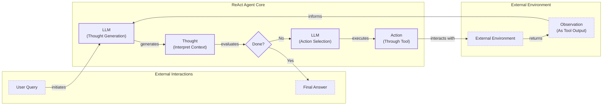

# Building a ReAct Agent From Scratch: A Step-by-Step Guide

In our last lesson, we covered the theory behind planning and reasoning frameworks like ReAct. We saw how agents could break down complex problems by interleaving `Thought`, `Action`, and `Observation`. But theory only gets you so far. To truly understand how these systems work, you have to build one. Abstract diagrams are useful, but they do not capture the engineering reality of managing state, parsing outputs, and orchestrating a control loop.

When we started building our writing agent, we decided to use LangGraph to implement the ReAct pattern. We embraced their graph model with nodes and edges, thinking it would make everything cleaner. But what we discovered was frustrating: simple if-else logic and basic loops that should have taken five minutes became hours of work. We had to force our Python code to fit their graph paradigm, modeling everything through edges in ways that felt unnatural. It did not add real value, just complexity [[10]](https://www.decodingai.com/p/building-production-react-agents).

This experience highlighted a common challenge in AI engineering: frameworks can sometimes obscure the very principles they are meant to simplify. This lesson is born from that realization. It is 100% practical. We will first explore the theoretical design of a ReAct agent and then build a minimal implementation from scratch using only Python and the Gemini API.

By constructing the complete `Thought` → `Action` → `Observation` cycle yourself, you will gain a concrete mental model that frameworks often hide. This hands-on approach gives you the foundational knowledge to build, debug, and customize agents with confidence. We will walk through the entire process, step-by-step, following the code in the associated notebook. You will learn how to:

-   Set up a Python environment with the Gemini client.
-   Define and integrate a mock tool for the agent to use.
-   Implement the `Thought` phase to generate a plan.
-   Use function calling to select and parse actions.
-   Build a turn-based control loop to orchestrate the agent.
-   Analyze traces to verify success and graceful failure.

By the end, you will have a working ReAct agent and the foundational skills to build more complex and reliable AI systems.

## The Problem with Agent Frameworks

Frameworks like LangChain, CrewAI, and LangGraph are excellent for getting started quickly. They provide pre-built components and abstractions that handle much of the boilerplate code involved in building agents. However, this convenience comes at a cost. Relying too heavily on these high-level tools can lead to a superficial understanding of how agents actually work. You might know how to call a function that creates a ReAct agent, but you may not grasp the underlying mechanics of the `Thought-Action-Observation` loop [[13]](https://www.dailydoseofds.com/ai-agents-crash-course-part-10-with-implementation/).

This lack of foundational knowledge becomes a problem when you need to move beyond simple prototypes. In production, you will inevitably face scenarios that require custom logic, fine-grained control, or deep debugging. When an agent fails, you need to be able to trace its reasoning, inspect its state, and understand why it made a particular decision. High-level abstractions can make this difficult, as they often hide the intermediate steps and raw LLM inputs and outputs.

Furthermore, the world of AI is moving incredibly fast. New models and techniques are released constantly. Frameworks can lag behind, and their abstractions might prevent you from accessing cutting-edge features or implementing novel agent architectures. By learning to build agents from scratch, you free yourself from these limitations. You gain the ability to implement any pattern, use any model, and maintain full control over your agent's behavior. This is why understanding the fundamentals is so important for any serious AI engineer.

## Theoretical ReAct Agent Design

Before we dive into the code, let's revisit the theoretical structure of a ReAct agent. The framework, introduced by Yao et al., is designed to synergize reasoning and acting [[1]](https://arxiv.org/pdf/2210.03629). It operates in a loop that mimics human problem-solving: you think about what to do, you take an action, and you observe the result to inform your next thought.

This cycle can be visualized as a simple flowchart.


Image 1: A flowchart illustrating the theoretical Thought-Action-Observation loop of a ReAct agent.

Let's break down the components shown in Image 1:

1.  **User Query:** The process begins with an input from the user. This is the initial task or question the agent needs to solve.
2.  **LLM (Thought Generation):** The agent takes the user query and any previous context (observations) and uses an LLM to generate a "Thought." This is a reasoning step where the agent plans its next move. For example: "I need to find the current weather. I should use the weather tool."
3.  **Done?:** The agent evaluates its thought to determine if it has enough information to answer the user's query.
4.  **LLM (Action Selection):** If the task is not done, the agent uses the LLM to select an "Action." This involves choosing a tool and determining the necessary inputs for it.
5.  **External Environment:** The agent executes the action, which interacts with an external environment. This could be a database, an API, or a simple web search.
6.  **Observation:** The environment returns a result, which is the "Observation." This new piece of information is fed back into the agent's context.
7.  **Loop:** The agent returns to the thought generation step, now with the new observation in its context, and the cycle repeats.
8.  **Final Answer:** Once the agent determines it is done, it synthesizes all the information it has gathered and provides a final answer to the user.

This simple but powerful loop enables agents to tackle complex problems that require multiple steps and access to external information. Now, let's implement it.

## Setup and Environment

Before we start building, let's ensure our environment is set up correctly. A clean setup ensures your code runs smoothly and the outputs match the traces we will analyze later. This is a foundational step for reproducibility, a core principle in both software and AI engineering. This lesson follows a notebook, and our first step is to configure the essentials: loading environment variables, importing packages, and initializing the Gemini client. This initial configuration is a standard practice that prepares our workspace for the agent implementation.

1.  First, we load our `GOOGLE_API_KEY` from a `.env` file. We use a simple utility function for this, which is good practice for keeping secrets out of your code and version control. This ensures our API key is managed securely.
    ```python
    from lessons.utils import env
    
    env.load(required_env_vars=["GOOGLE_API_KEY"])
    ```
    It outputs:
    ```text
    Trying to load environment variables from /path/to/your/project/.env
    Environment variables loaded successfully.
    ```

2.  Next, we import the necessary packages. Our implementation relies on `google-genai` for the LLM, `pydantic` for creating structured data classes, and Python’s `enum` and `typing` for type safety. We also import a `pretty_print` utility to make our agent's traces easier to read, which is very useful for debugging.
    ```python
    from enum import Enum
    from pydantic import BaseModel, Field
    from typing import List
    
    from google import genai
    from google.genai import types
    
    from lessons.utils import pretty_print
    ```

3.  With our key loaded, we initialize the Gemini client. This object is our gateway to the Gemini API, handling authentication and request management for all subsequent calls to the model.
    ```python
    client = genai.Client()
    ```
    It outputs:
    ```text
    Both GOOGLE_API_KEY and GEMINI_API_KEY are set. Using GOOGLE_API_KEY.
    ```

4.  Finally, we define the model we will use. For this guide, we will use `gemini-2.5-flash`. It is a fast and cost-effective model, making it ideal for the simple reasoning our agent requires during development and testing. While more powerful models like the `pro` series exist, `flash` provides a good balance of performance and cost for this educational exercise.
    ```python
    MODEL_ID = "gemini-2.5-flash"
    ```

With the client and model in place, we can now define an external capability for our agent to use.

## Tool Layer: Mock Search Implementation

An agent's power comes from its ability to interact with the world through tools [[1]](https://arxiv.org/pdf/2210.03629). For this lesson, we will focus on the ReAct mechanics rather than complex API integrations. To do this, we will create a mock `search` tool.

### Tool Design Philosophy

Using a mock tool offers several educational benefits. It simplifies the learning process by eliminating external dependencies and API key requirements, which can be a hassle to set up. It also provides predictable responses, which is essential for reliable testing and debugging. When you are learning the core logic of an agent, you want to be sure that any errors come from your implementation, not from a flaky external API. This allows us to focus entirely on the agent's internal logic: how it thinks, acts, and observes [[13]](https://www.dailydoseofds.com/ai-agents-crash-course-part-10-with-implementation/).

Our mock tool is a simple Python function that simulates a search engine. It takes a `query` string and returns a hardcoded response if the query matches a predefined pattern. If the query is not recognized, it returns a fallback message. The function’s docstring is a very important part of the implementation. It provides the description the LLM will use to understand what the tool does and how to use it. This docstring-driven integration is a powerful pattern for building a clean Agent-Computer Interface (ACI) and creating modular, extensible agents [[4]](https://www.anthropic.com/engineering/building-effective-agents), [[7]](https://medium.com/google-cloud/building-react-agents-from-scratch-a-hands-on-guide-using-gemini-ffe4621d90ae).

1.  Here is the implementation of our `search` function. It handles two specific queries—the capital of France and the definition of ReAct—and has a default response for anything else.
    ```python
    def search(query: str) -> str:
        """Search for information about a specific topic or query.
    
        Args:
            query (str): The search query or topic to look up.
        """
        query_lower = query.lower()
    
        # Predefined responses for demonstration
        if all(word in query_lower for word in ["capital", "france"]):
            return "Paris is the capital of France and is known for the Eiffel Tower."
        elif "react" in query_lower:
            return "The ReAct (Reasoning and Acting) framework enables LLMs to solve complex tasks by interleaving thought generation, action execution, and observation processing."
    
        # Generic response for unhandled queries
        return f"Information about '{query}' was not found."
    ```

2.  To make tools accessible to our agent, we use a `TOOL_REGISTRY`. This dictionary maps the tool's name (the function's name) to the function object itself. This allows our agent to plan with symbolic names like `"search"` and lets our code safely resolve and execute the corresponding Python function.
    ```python
    TOOL_REGISTRY = {
        search.__name__: search,
    }
    ```

### Real-World Context

In a production system, swapping this mock function with a real one is straightforward. You could replace it with a function that calls an external API like Google Search or queries a domain-specific knowledge base. As long as the new function maintains the same signature (`query: str -> str`) and its purpose aligns with the docstring, the agent's core logic remains unchanged. This modular design is key to building maintainable and scalable agentic systems. When making this transition, you would also need to consider real-world factors like API rate limits, network latency, and more robust error handling [[7]](https://medium.com/google-cloud/building-react-agents-from-scratch-a-hands-on-guide-using-gemini-ffe4621d90ae).

Now that our agent has a tool, we need to teach it how to think about when and how to use it.

## Thought Phase: Prompt Construction and Generation

The first step in the ReAct cycle is "Thought." This is where the agent analyzes the user's query and its history to decide what to do next [[1]](https://arxiv.org/pdf/2210.03629). We will implement this by creating a prompt that asks the LLM to generate a brief, focused paragraph about its intended next action and the reasoning behind it. This step is essential for making the agent's behavior interpretable and debuggable, as it externalizes the model's reasoning process.

To help the LLM make an informed decision, we provide it with context, including the tools available and the conversation so far. We format the tool descriptions in XML, a practice recommended for Gemini models to help them clearly distinguish instructions from other contextual information [[14]](https://ai.google.dev/gemini-api/docs/prompting-strategies). This structured approach improves the reliability of the model's reasoning by making the boundaries between different types of input explicit. This is a core technique in context engineering, which we discussed in Lesson 3.

1.  First, we define a function to convert our `TOOL_REGISTRY` into a minimal XML description. It iterates through the tools, extracts their docstrings, and wraps them in `<tool>` and `<description>` tags. This makes the tool's purpose explicit to the LLM, allowing it to reason about which tool is appropriate for a given task.
    ```python
    def build_tools_xml_description(tools: dict[str, callable]) -> str:
        """Build a minimal XML description of tools using only their docstrings."""
        lines = []
        for tool_name, fn in tools.items():
            doc = (fn.__doc__ or "").strip()
            lines.append(f"\t<tool name=\"{tool_name}\">")
            if doc:
                lines.append(f"\t\t<description>")
                for line in doc.split("\n"):
                    lines.append(f"\t\t\t{line}")
                lines.append(f"\t\t</description>")
            lines.append("\t</tool>")
        return "\n".join(lines)
    
    tools_xml = build_tools_xml_description(TOOL_REGISTRY)
    ```

2.  Next, we create the prompt template for the thought-generation step. It includes the XML-formatted tool descriptions and a placeholder for the conversation history, which will be filled in at runtime. The prompt explicitly asks the agent to state its next thought, focusing on the action it intends to take and why.
    ```python
    PROMPT_TEMPLATE_THOUGHT = f"""
    You are deciding the next best step for reaching the user goal. You have some tools available to you.
    
    Available tools:
    <tools>
    {tools_xml}
    </tools>
    
    Conversation so far:
    <conversation>
    {{conversation}}
    </conversation>
    
    State your next thought about what to do next as one short paragraph focused on the next action you intend to take and why.
    Avoid repeating the same strategies that didn't work previously. Prefer different approaches.
    """.strip()
    ```
    The fully formatted prompt looks like this, clearly outlining the `search` tool's capabilities:
    ```text
    You are deciding the next best step for reaching the user goal. You have some tools available to you.
    
    Available tools:
    <tools>
        <tool name="search">
            <description>
                Search for information about a specific topic or query.
                
                Args:
                    query (str): The search query or topic to look up.
            </description>
        </tool>
    </tools>
    
    Conversation so far:
    <conversation>
    {conversation}
    </conversation>
    
    State your next thought about what to do next as one short paragraph focused on the next action you intend to take and why.
    Avoid repeating the same strategies that didn't work previously. Prefer different approaches.
    ```

3.  Finally, we implement the `generate_thought` function. It takes the current conversation history, formats the prompt, calls the Gemini model, and returns the generated thought as plain text. This function encapsulates the reasoning step of our agent.
    ```python
    def generate_thought(conversation: str, tool_registry: dict[str, callable]) -> str:
        """Generate a thought as plain text (no structured output)."""
        tools_xml = build_tools_xml_description(tool_registry)
        prompt = PROMPT_TEMPLATE_THOUGHT.format(conversation=conversation, tools_xml=tools_xml)
    
        response = client.models.generate_content(
            model=MODEL_ID,
            contents=prompt
        )
        return response.text.strip()
    ```

With a coherent thought generated, the agent has a plan. The next step is to translate that plan into a concrete `Action`, which could be a tool call or a final answer to the user.

## Action Phase: Function Calling and Parsing

After generating a thought, the agent must decide on a concrete action. This could be calling a tool to gather more information or, if it has enough context, providing a final answer. We will implement this "Action" phase using Gemini's native function calling capability, which is the modern and reliable way to integrate tools with LLMs [[15]](https://www.philschmid.de/langgraph-gemini-2-5-react-agent).

### System Prompt Strategy

A key advantage of using function calling is that we do not need to clutter our prompt with detailed tool signatures. Instead, we pass the Python tool functions directly to the Gemini API through its `tools` configuration. The API automatically extracts their names, docstrings (for descriptions), and parameter types, and handles the low-level prompt engineering for us [[9]](https://ai.google.dev/gemini-api/docs/function-calling). This separation of concerns allows our action-selection prompt to remain clean and focused on high-level strategy. It instructs the model to choose between using a tool or concluding, rather than getting bogged down in the technical details of tool implementation.

### Function Calling Implementation

1.  We start by defining two prompt templates. The first is for general action selection, instructing the model to choose between a tool call and a final answer. The second, `PROMPT_TEMPLATE_ACTION_FORCED`, is a special-purpose prompt. We will use it to compel the agent to provide a final answer when it reaches its turn limit, a crucial mechanism for preventing infinite loops and ensuring graceful termination.
    ```python
    PROMPT_TEMPLATE_ACTION = """
    You are selecting the best next action to reach the user goal.
    
    Conversation so far:
    <conversation>
    {conversation}
    </conversation>
    
    Respond either with a tool call (with arguments) or a final answer if you can confidently conclude.
    """.strip()
    
    # Dedicated prompt used when we must force a final answer
    PROMPT_TEMPLATE_ACTION_FORCED = """
    You must now provide a final answer to the user.
    
    Conversation so far:
    <conversation>
    {conversation}
    </conversation>
    
    Provide a concise final answer that best addresses the user's goal.
    """.strip()
    ```

2.  To handle the two possible outcomes of the action phase (a tool call or a final answer), we define two Pydantic models: `ToolCallRequest` and `FinalAnswer`. These models provide a structured way to represent the agent's decision, ensuring the output is predictable and easy to parse in our Python code. This is an application of the structured outputs pattern we learned in Lesson 4.
    ```python
    class ToolCallRequest(BaseModel):
        """A request to call a tool with its name and arguments."""
        tool_name: str = Field(description="The name of the tool to call.")
        arguments: dict = Field(description="The arguments to pass to the tool.")
    
    
    class FinalAnswer(BaseModel):
        """A final answer to present to the user when no further action is needed."""
        text: str = Field(description="The final answer text to present to the user.")
    ```

3.  Now we implement the `generate_action` function, the core of the action phase. It takes the conversation history and the tool registry as input.
    ```python
    def generate_action(conversation: str, tool_registry: dict[str, callable] | None = None, force_final: bool = False) -> (ToolCallRequest | FinalAnswer):
        """Generate an action by passing tools to the LLM and parsing function calls or final text.
    
        When force_final is True or no tools are provided, the model is instructed to produce a final answer and tool calls are disabled.
        """
        # Use a dedicated prompt when forcing a final answer or no tools are provided
        if force_final or not tool_registry:
            prompt = PROMPT_TEMPLATE_ACTION_FORCED.format(conversation=conversation)
            response = client.models.generate_content(
                model=MODEL_ID,
                contents=prompt
            )
            return FinalAnswer(text=response.text.strip())
    
        # Default action prompt
        prompt = PROMPT_TEMPLATE_ACTION.format(conversation=conversation)
    
        # Provide the available tools to the model; disable auto-calling so we can parse and run ourselves
        tools = list(tool_registry.values())
        config = types.GenerateContentConfig(
            tools=tools,
            automatic_function_calling={"disable": True}
        )
        response = client.models.generate_content(
            model=MODEL_ID,
            contents=prompt,
            config=config
        )
    
        # Extract the function call from the response (if present)
        candidate = response.candidates[0]
        parts = candidate.content.parts
        if parts and getattr(parts[0], "function_call", None):
            name = parts[0].function_call.name
            args = dict(parts[0].function_call.args) if parts[0].function_call.args is not None else {}
            return ToolCallRequest(tool_name=name, arguments=args)
        
        # Otherwise, it's a final answer
        final_answer = "".join(part.text for part in candidate.content.parts)
        return FinalAnswer(text=final_answer.strip())
    ```
    If `force_final` is `True`, it uses the specialized prompt to request a conclusive answer. Otherwise, it passes the available tools to the `generate_content` call. We set `automatic_function_calling` to `{"disable": True}` because we want to parse the tool call ourselves and maintain full control over the execution loop.

    The function then inspects the response. If it contains a `function_call`, it parses the name and arguments into a `ToolCallRequest`. If not, it assumes the response is a final answer and wraps it in a `FinalAnswer` object. This explicit parsing gives us transparency and control, but in many production scenarios, you might let the SDK handle this automatically [[9]](https://ai.google.dev/gemini-api/docs/function-calling).

### Error Handling

If the model's response is malformed or does not contain a valid action, our control loop will need to handle it. A robust implementation would catch parsing errors and instruct the agent to rethink its approach. For example, if the LLM returns a tool name that does not exist in our `TOOL_REGISTRY`, or if the arguments are incorrect, our control loop should catch this. It can then log the error as an `Observation` and feed it back to the agent. This allows the agent to learn from its mistake and try a different action in the next turn [[7]](https://medium.com/google-cloud/building-react-agents-from-scratch-a-hands-on-guide-using-gemini-ffe4621d90ae). We will see this in action when we build the full loop.

With the `Thought` and `Action` phases implemented, we have all the building blocks for our agent. The next step is to orchestrate them in a control loop.

## Control Loop: Messages, Scratchpad, and Orchestration

The control loop is the heart of the ReAct agent, orchestrating the `Thought` → `Action` → `Observation` cycle. It manages the conversation history, calls the thought and action generation functions, executes tools, and processes their outputs (observations). This loop is what gives the agent its iterative problem-solving ability [[12]](https://machinelearningmastery.com/building-react-agents-with-langgraph-a-beginners-guide/).

### Message Structure Foundation

To keep track of the conversation, we will use a "scratchpad," which is a list of messages representing each step of the agent's process. This structured history is not only essential for the LLM to maintain context but also provides a clear, auditable trace for us to debug and understand the agent's behavior [[11]](https://www.neradot.com/post/building-a-python-react-agent-class-a-step-by-step-guide).

1.  First, we define the data structures for our messages. `MessageRole` is an `Enum` that categorizes each message (e.g., `USER`, `THOUGHT`, `TOOL_REQUEST`). The `Message` class is a Pydantic model that holds the role and content for each entry in our scratchpad. This structured approach makes the agent's history clear and easy to trace.
    ```python
    class MessageRole(str, Enum):
        """Enumeration for the different roles a message can have."""
        USER = "user"
        THOUGHT = "thought"
        TOOL_REQUEST = "tool request"
        OBSERVATION = "observation"
        FINAL_ANSWER = "final answer"
    
    
    class Message(BaseModel):
        """A message with a role and content, used for all message types."""
        role: MessageRole = Field(description="The role of the message in the ReAct loop.")
        content: str = Field(description="The textual content of the message.")
    
        def __str__(self) -> str:
            """Provides a user-friendly string representation of the message."""
            return f"{self.role.value.capitalize()}: {self.content}"
    ```

2.  To make the agent's execution easy to follow, we create a helper function that pretty-prints each message with a color-coded header indicating its role and the current turn. This visual feedback is very helpful during development for tracing the agent's logic.
    ```python
    def pretty_print_message(message: Message, turn: int, max_turns: int, header_color: str = pretty_print.Color.YELLOW, is_forced_final_answer: bool = False) -> None:
        if not is_forced_final_answer:
            title = f"{message.role.value.capitalize()} (Turn {turn}/{max_turns}):"
        else:
            title = f"{message.role.value.capitalize()} (Forced):"
    
        pretty_print.wrapped(
            text=message.content,
            title=title,
            header_color=header_color,
        )
    ```

3.  Next, we define the `Scratchpad` class. It manages a list of `Message` objects and provides an `append` method to add new messages. When `verbose=True`, this method also calls our pretty-printer, giving us a real-time trace of the agent's activity. The `to_string` method serializes the entire history into a single string to be passed to the LLM.
    ```python
    class Scratchpad:
        """Container for ReAct messages with optional pretty-print on append."""
    
        def __init__(self, max_turns: int) -> None:
            self.messages: List[Message] = []
            self.max_turns: int = max_turns
            self.current_turn: int = 1
    
        def set_turn(self, turn: int) -> None:
            self.current_turn = turn
    
        def append(self, message: Message, verbose: bool = False, is_forced_final_answer: bool = False) -> None:
            self.messages.append(message)
            if verbose:
                role_to_color = {
                    MessageRole.USER: pretty_print.Color.RESET,
                    MessageRole.THOUGHT: pretty_print.Color.ORANGE,
                    MessageRole.TOOL_REQUEST: pretty_print.Color.GREEN,
                    MessageRole.OBSERVATION: pretty_print.Color.YELLOW,
                    MessageRole.FINAL_ANSWER: pretty_print.Color.CYAN,
                }
                header_color = role_to_color.get(message.role, pretty_print.Color.YELLOW)
                pretty_print_message(
                    message=message,
                    turn=self.current_turn,
                    max_turns=self.max_turns,
                    header_color=header_color,
                    is_forced_final_answer=is_forced_final_answer,
                )
    
        def to_string(self) -> str:
            return "\n".join(str(m) for m in self.messages)
    ```

### Control Loop Architecture

Finally, we implement the main `react_agent_loop`. This function ties everything together. It initializes the scratchpad with the user's question and then enters a loop that runs for a maximum number of turns. This turn limit is a simple but effective safeguard against infinite loops and excessive token usage.

Inside the loop, it first generates a `Thought` and adds it to the scratchpad. Then, it generates an `Action`. If the action is a `FinalAnswer`, the loop terminates and returns the answer. If it is a `ToolCallRequest`, the loop proceeds to the observation processing step.

### Integrated Observation Processing

This is where the "Act" part of ReAct happens. The loop checks if the requested tool exists in the `tool_registry`. If it does, it executes the tool within a `try...except` block to catch any runtime errors. The tool's output (or the error message) is captured as an `Observation` and added to the scratchpad. If the tool name is not found, an informative error message is generated as the observation. This feedback mechanism is what allows the agent to reason about its failures and self-correct in the next `Thought` phase.

If the loop reaches `max_turns`, it calls `generate_action` one last time with `force_final=True` to ensure a graceful exit. This forces the agent to synthesize the best possible answer with the information it has gathered so far.

```python
def react_agent_loop(initial_question: str, tool_registry: dict[str, callable], max_turns: int = 5, verbose: bool = False) -> str:
    """
    Implements the main ReAct (Thought -> Action -> Observation) control loop.
    Uses a unified message class for the scratchpad.
    """
    scratchpad = Scratchpad(max_turns=max_turns)

    # Add the user's question to the scratchpad
    user_message = Message(role=MessageRole.USER, content=initial_question)
    scratchpad.append(user_message, verbose=verbose)

    for turn in range(1, max_turns + 1):
        scratchpad.set_turn(turn)

        # Generate a thought based on the current scratchpad
        thought_content = generate_thought(
            scratchpad.to_string(),
            tool_registry,
        )
        thought_message = Message(role=MessageRole.THOUGHT, content=thought_content)
        scratchpad.append(thought_message, verbose=verbose)

        # Generate an action based on the current scratchpad
        action_result = generate_action(
            scratchpad.to_string(),
            tool_registry=tool_registry,
        )

        # If the model produced a final answer, return it
        if isinstance(action_result, FinalAnswer):
            final_answer = action_result.text
            final_message = Message(role=MessageRole.FINAL_ANSWER, content=final_answer)
            scratchpad.append(final_message, verbose=verbose)
            return final_answer

        # Otherwise, it is a tool request
        if isinstance(action_result, ToolCallRequest):
            action_name = action_result.tool_name
            action_params = action_result.arguments

            # Add the action to the scratchpad
            params_str = ", ".join([f"{k}='{v}'" for k, v in action_params.items()])
            action_content = f"{action_name}({params_str})"
            action_message = Message(role=MessageRole.TOOL_REQUEST, content=action_content)
            scratchpad.append(action_message, verbose=verbose)

            # Run the action and get the observation
            observation_content = ""
            if action_name in tool_registry:
                tool_function = tool_registry[action_name]
                try:
                    observation_content = tool_function(**action_params)
                except Exception as e:
                    observation_content = f"Error executing tool '{action_name}': {e}"
            else:
                observation_content = f"Error: Tool '{action_name}' not found. Available tools: {list(tool_registry.keys())}"

            # Add the observation to the scratchpad
            observation_message = Message(role=MessageRole.OBSERVATION, content=observation_content)
            scratchpad.append(observation_message, verbose=verbose)

        # Check if the maximum number of turns has been reached. If so, force the action selector to produce a final answer
        if turn == max_turns:
            forced_action = generate_action(
                scratchpad.to_string(),
                force_final=True,
            )
            if isinstance(forced_action, FinalAnswer):
                final_answer = forced_action.text
            else:
                final_answer = "Unable to produce a final answer within the allotted turns."
            final_message = Message(role=MessageRole.FINAL_ANSWER, content=final_answer)
            scratchpad.append(final_message, verbose=verbose, is_forced_final_answer=True)
            return final_answer
```

### Extension Possibilities

This basic implementation provides a solid foundation. From here, you could extend the agent in several ways. You could add more sophisticated tools, such as a code interpreter or a database query tool. You could implement a more advanced memory system, allowing the agent to retain information across multiple sessions, a topic we will cover in Lesson 9. You could also explore more complex reasoning patterns, such as planning and reflection, which we will touch on in future lessons. The modular structure we have built makes these extensions straightforward to implement.

With the control loop complete, our ReAct agent is ready to be tested.

## Tests and Traces: Success and Graceful Fallback

Now that we have built our agent, it is time to validate its behavior. We will run two tests: a straightforward factual question to check the successful execution of the full ReAct cycle, and a query our mock tool cannot answer to verify its graceful fallback and termination logic. Analyzing the traces will confirm that each component—thought, action, observation, and the control loop—works as designed. These tests are essential to ensure our agent is not only functional but also robust.

### Successful Execution Trace

First, let's ask a question our mock tool can answer: `"What is the capital of France?"`. We will set `max_turns=2` and `verbose=True` to see the step-by-step trace. This test validates the "happy path" where the agent successfully uses a tool to find an answer and concludes within the turn limit.

```python
# A straightforward question requiring a search.
question = "What is the capital of France?"
final_answer = react_agent_loop(question, TOOL_REGISTRY, max_turns=2, verbose=True)
```

The agent produces the following trace:

```text
User (Turn 1/2):
What is the capital of France?

Thought (Turn 1/2):
I need to find the capital of France. The user is asking a direct factual question, so I should use the search tool to find the answer.

Tool request (Turn 1/2):
search(query='capital of France')

Observation (Turn 1/2):
Paris is the capital of France and is known for the Eiffel Tower.

Thought (Turn 2/2):
The search tool provided the answer directly. I can now formulate the final answer based on this information.

Final answer (Turn 2/2):
Paris is the capital of France.
```

This trace confirms the ideal workflow. Let's analyze it turn by turn. In the first turn, the `Thought` correctly identifies the need for a factual lookup and plans to use the `search` tool. The `Tool request` shows the agent correctly formatting the call with the appropriate query. The `Observation` then captures the successful output from our mock tool. In the second turn, the agent's `Thought` processes this observation, recognizes that it now has sufficient information, and decides to conclude. This leads directly to the `Final answer`, which correctly and concisely answers the user's question. The process is logical, transparent, and efficient, demonstrating that our core ReAct loop is functioning perfectly.

### Graceful Fallback Trace

Next, let's test the agent with a query our mock tool does not know: `"What is the capital of Italy?"`. This will test the agent's ability to handle tool failures and its forced termination logic. This scenario is critical for building robust agents that do not get stuck or hallucinate when they encounter unexpected situations. A well-designed agent should recognize its limitations and communicate them clearly.

```python
# An unknown/unsupported query for the mock tool.
question = "What is the capital of Italy?"
final_answer = react_agent_loop(question, TOOL_REGISTRY, max_turns=2, verbose=True)
```

The output trace shows the agent adapting its strategy:

```text
User (Turn 1/2):
What is the capital of Italy?

Thought (Turn 1/2):
I need to find the capital of Italy. I will use the search tool to look up this information.

Tool request (Turn 1/2):
search(query='capital of Italy')

Observation (Turn 1/2):
Information about 'capital of Italy' was not found.

Thought (Turn 2/2):
The initial search for "capital of Italy" failed. I will try a broader search for just "Italy" to see if I can find the capital within a general article.

Tool request (Turn 2/2):
search(query='Italy')

Observation (Turn 2/2):
Information about 'Italy' was not found.

Final answer (Forced):
I'm sorry, but I was unable to find information about the capital of Italy using the available tools.
```

This trace demonstrates several key features of a resilient agent. After the first search fails, the `Observation` clearly states that the information was not found. The agent's next `Thought` shows a change in strategy. It reasons about the failure and decides to try a broader, more general query. This is a simple but powerful example of self-correction. When that second attempt also fails and the agent reaches the `max_turns` limit, the control loop correctly triggers the forced final answer path. The agent concludes by honestly informing the user that it could not find the answer, which is a much better outcome than hallucinating or crashing. These tests confirm our from-scratch implementation is robust and behaves predictably.

## Conclusion

By building a ReAct agent from the ground up, we have demystified the `Thought-Action-Observation` loop that powers modern agentic systems. We have seen how to orchestrate reasoning with Gemini, integrate external tools via function calling, manage state with a scratchpad, and ensure robust execution with a control loop. This hands-on approach provides a concrete mental model that is essential for any AI engineer looking to move beyond simple prompts and build truly interactive applications.

This minimal implementation is just the beginning. The patterns we have established—structured messages, a clear control loop, and modular tools—provide a solid foundation. In future lessons, we will build upon this by exploring more advanced topics like agent memory and Retrieval-Augmented Generation (RAG). Armed with a deep understanding of the core mechanics, you will be well-equipped to tackle those challenges and build even more sophisticated agents.

## References

- [1] Yao, S., Zhao, J., Yu, D., Du, N., Shafran, I., Narasimhan, K., & Cao, Y. (2022). ReAct: Synergizing Reasoning and Acting in Language Models. *arXiv*. [https://arxiv.org/pdf/2210.03629](https://arxiv.org/pdf/2210.03629)
- [2] ReAct Agent - IBM. (n.d.). IBM. [https://www.ibm.com/think/topics/react-agent](https://www.ibm.com/think/topics/react-agent)
- [3] AI Agent Planning - IBM. (n.d.). IBM. [https://www.ibm.com/think/topics/ai-agent-planning](https://www.ibm.com/think/topics/ai-agent-planning)
- [4] Building effective agents - Anthropic. (2024, December 19). Anthropic. [https://www.anthropic.com/engineering/building-effective-agents](https://www.anthropic.com/engineering/building-effective-agents)
- [5] ReAct agent from scratch with Gemini 2.5 and LangGraph. (n.d.). Google AI for Developers. [https://ai.google.dev/gemini-api/docs/langgraph-example](https://ai.google.dev/gemini-api/docs/langgraph-example)
- [6] Ferrag, M. A., Tihanyi, N., & Debbah, M. (2025). From LLM Reasoning to Autonomous AI Agents: A Comprehensive Review. *arXiv*. [https://arxiv.org/pdf/2504.19678](https://arxiv.org/pdf/2504.19678)
- [7] Shankar, A. (2024, June 20). Building ReAct Agents from Scratch using Gemini. *Medium*. [https://medium.com/google-cloud/building-react-agents-from-scratch-a-hands-on-guide-using-gemini-ffe4621d90ae](https://medium.com/google-cloud/building-react-agents-from-scratch-a-hands-on-guide-using-gemini-ffe4621d90ae)
- [8] AI Agent Orchestration - IBM. (n.d.). IBM. [https://www.ibm.com/think/topics/ai-agent-orchestration](https://www.ibm.com/think/topics/ai-agent-orchestration)
- [9] Gemini Function Calling Documentation. (n.d.). Google AI for Developers. [https://ai.google.dev/gemini-api/docs/function-calling](https://ai.google.dev/gemini-api/docs/function-calling)
- [10] Iusztin, P. (2025). Building Production ReAct Agents From Scratch Is Simple. *decodingai.com*. [https://www.decodingai.com/p/building-production-react-agents](https://www.decodingai.com/p/building-production-react-agents)
- [11] Pasternak, R. (2024, November 5). Building a Python React Agent Class: A Step-by-Step Guide. *Neradot*. [https://www.neradot.com/post/building-a-python-react-agent-class-a-step-by-step-guide](https://www.neradot.com/post/building-a-python-react-agent-class-a-step-by-step-guide)
- [12] Brownlee, J. (2024, July 1). Building ReAct Agents with LangGraph: A Beginner’s Guide. *Machine Learning Mastery*. [https://machinelearningmastery.com/building-react-agents-with-langgraph-a-beginners-guide/](https://machinelearningmastery.com/building-react-agents-with-langgraph-a-beginners-guide/)
- [13] Implementing ReAct Agentic Pattern From Scratch. (n.d.). *Daily Dose of DS*. [https://www.dailydoseofds.com/ai-agents-crash-course-part-10-with-implementation/](https://www.dailydoseofds.com/ai-agents-crash-course-part-10-with-implementation/)
- [14] Prompt design strategies. (n.d.). Google AI for Developers. [https://ai.google.dev/gemini-api/docs/prompting-strategies](https://ai.google.dev/gemini-api/docs/prompting-strategies)
- [15] Schmid, P. (2025, March 31). ReAct agent from scratch with Gemini 2.5 and LangGraph. *philschmid.de*. [https://www.philschmid.de/langgraph-gemini-2-5-react-agent](https://www.philschmid.de/langgraph-gemini-2-5-react-agent)