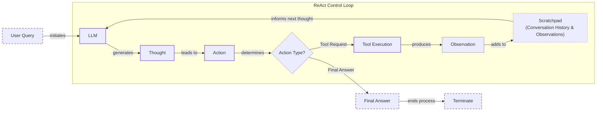

# Lesson 8: ReAct Agents From Scratch

In our previous lesson, we explored the theory behind agentic planning and reasoning, focusing on frameworks like ReAct. We learned how agents can break down complex problems by interleaving thought, action, and observation. But theory only takes you so far. To truly understand how these systems work, you have to build one.

This lesson is 100% practical. We are moving from theory to code, building a minimal ReAct agent from the ground up using only Python and the Gemini API. We will implement the full Thought → Action → Observation cycle: defining a mock tool, generating thoughts, selecting actions with function calling, executing the tool, processing the observation, and orchestrating it all within a control loop.

Why build it from scratch? Because frameworks, while useful, can obscure the fundamental mechanics. By implementing the core loop yourself, you will gain a concrete mental model of how reasoning agents operate. This hands-on experience is what gives you the confidence to debug, customize, and extend agents for production.

## Setup and Environment

Before we start building, let's get our environment ready. The goal is to ensure your setup can run the code from this lesson’s notebook seamlessly, allowing you to replicate the outputs we will be analyzing. This initial configuration is a critical first step in any software project, and for AI engineering, it ensures that our interactions with the LLM are consistent and reproducible.

1.  First, we load our environment variables. We use a simple helper function from our course utilities to load the `GOOGLE_API_KEY`. Storing sensitive keys in environment variables rather than hardcoding them is a standard security practice.
    ```python
    from lessons.utils import env
    
    env.load(required_env_vars=["GOOGLE_API_KEY"])
    ```
    It outputs:
    ```text
    Trying to load environment variables from `/path/to/your/project/.env`
    Environment variables loaded successfully.
    ```
2.  Next, we import the necessary packages. We will use `google-genai` for interacting with the Gemini API, `pydantic` for creating structured data models, and standard Python libraries like `enum` and `typing` for type safety. We also import a `pretty_print` utility from our course-specific code, which will help us visualize the agent's internal monologue and actions later on.
    ```python
    import json
    from enum import Enum
    from typing import List
    
    from google import genai
    from google.genai import types
    from pydantic import BaseModel, Field
    
    from lessons.utils import pretty_print
    ```
3.  With our imports ready, we initialize the Gemini client. This object is our main interface for all API calls to Google's models. It automatically uses the API key we loaded from the environment.
    ```python
    client = genai.Client()
    ```
    It outputs:
    ```text
    Both GOOGLE_API_KEY and GEMINI_API_KEY are set. Using GOOGLE_API_KEY.
    ```
4.  Finally, we define the model we will use. For this lesson, we will use `gemini-2.5-flash`. This model provides a good balance of speed, cost, and reasoning capabilities, making it an excellent choice for development and for the types of tasks we are implementing here.
    ```python
    MODEL_ID = "gemini-2.5-flash"
    ```
With the client and model ID in place, our environment is set. Now, we can start building the first component of our agent: its ability to interact with the outside world through tools.

## Tool Layer: Mock Search Implementation

Every ReAct agent needs tools to act upon its environment. In a production system, these tools would interact with real external APIs, databases, or other services. For this lesson, however, we will use a mock search tool.

The philosophy behind using a mock tool is to isolate the concept we are learning. It allows us to focus purely on the ReAct mechanics. The thought, action, and observation loop can be complex, and removing external variables like network latency or API key management helps simplify the learning process. This approach also makes our agent’s behavior predictable. By defining a fixed set of responses, we can reliably test our control loop and error handling. This is a common practice in software development, known as unit testing, where components are tested in isolation to ensure they work correctly before being integrated into a larger system. Building from scratch with simple, predictable tools provides transparency, which is key to understanding and debugging the agent's decision-making process [[13]](https://www.dailydoseofds.com/ai-agents-crash-course-part-10-with-implementation/).

Our mock `search` function simulates a simple knowledge base. It takes a string query and returns a predefined answer if the query matches a known topic. If the query is not recognized, it returns a "not found" message. This mimics how a real tool might behave, including successful and unsuccessful outcomes.

1.  We implement the `search` function with a few hardcoded responses for "capital of France" and "ReAct". The docstring is important. It provides a description that the LLM will use to understand what the tool does and when to use it.
    ```python
    def search(query: str) -> str:
        """Search for information about a specific topic or query.
    
        Args:
            query (str): The search query or topic to look up.
        """
        query_lower = query.lower()
    
        # Predefined responses for demonstration
        if all(word in query_lower for word in ["capital", "france"]):
            return "Paris is the capital of France and is known for the Eiffel Tower."
        elif "react" in query_lower:
            return "The ReAct (Reasoning and Acting) framework enables LLMs to solve complex tasks by interleaving thought generation, action execution, and observation processing."
    
        # Generic response for unhandled queries
        return f"Information about '{query}' was not found."
    ```
2.  To manage our tools, we create a `TOOL_REGISTRY`. This dictionary maps the tool's name (the function name) to the function object itself. This registry allows our agent to dynamically look up and execute the correct function based on the LLM's decision. This is a simple but effective pattern for managing tools in an agentic system.
    ```python
    TOOL_REGISTRY = {
        search.__name__: search,
    }
    ```
In a real-world application, you could easily swap this mock function with a real API call to Google Search, Wikipedia, or a domain-specific knowledge base [[7]](https://medium.com/google-cloud/building-react-agents-from-scratch-a-hands-on-guide-using-gemini-ffe4621d90ae). As long as the new function respects the same signature (takes a query string and returns a string) and has a clear docstring, the rest of our agent's logic remains unchanged. This modular design, where the tool's implementation is decoupled from the agent's reasoning logic, is a key principle for building robust and maintainable AI systems.

## Thought Phase: Prompt Construction and Generation

The first step in the ReAct cycle is "Thought." This is where the agent reasons about the user's query and the conversation history to decide on its next step. To generate a useful thought, we need to provide the LLM with the right context, which includes a clear description of the tools it can use.

We will construct a prompt that instructs the model to state its next thought. A common and effective technique for structuring prompts is to use XML tags to delineate different types of information [[2]]. This helps the model distinguish between instructions, available tools, and the conversation history. In fact, Google explicitly recommends using clear delimiters like XML tags for Gemini models to separate different parts of a prompt [[15]](https://ai.google.dev/gemini-api/docs/prompting-strategies). This approach follows a core reliability principle: when instructions are clearly separated from dynamic data like conversation history, the model is less likely to misinterpret boundaries and make errors [[16]](https://stevekinney.com/writing/prompt-engineering-frontier-llms).

1.  First, we create a helper function, `build_tools_xml_description`, to convert our `TOOL_REGISTRY` into an XML-formatted string. This function iterates through the tools, extracts their docstrings, and wraps them in `<tool>` and `<description>` tags. This gives the LLM a clear, machine-readable list of its capabilities.
    ```python
    def build_tools_xml_description(tools: dict[str, callable]) -> str:
        """Build a minimal XML description of tools using only their docstrings."""
        lines = []
        for tool_name, fn in tools.items():
            doc = (fn.__doc__ or "").strip()
            lines.append(f"\t<tool name=\"{tool_name}\">")
            if doc:
                lines.append(f"\t\t<description>")
                for line in doc.split("\n"):
                    lines.append(f"\t\t\t{line}")
                lines.append(f"\t\t</description>")
            lines.append("\t</tool>")
        return "\n".join(lines)
    ```
2.  Next, we define our prompt template. It instructs the agent on its goal: deciding the next best step. It includes placeholders for the tool descriptions (`{tools_xml}`) and the ongoing conversation history (`{conversation}`).
    ```python
    tools_xml = build_tools_xml_description(TOOL_REGISTRY)
    
    PROMPT_TEMPLATE_THOUGHT = f"""
    You are deciding the next best step for reaching the user goal. You have some tools available to you.
    
    Available tools:
    <tools>
    {tools_xml}
    </tools>
    
    Conversation so far:
    <conversation>
    {{conversation}}
    </conversation>
    
    State your next thought about what to do next as one short paragraph focused on the next action you intend to take and why.
    Avoid repeating the same strategies that didn't work previously. Prefer different approaches.
    """.strip()
    ```
3.  Let's inspect the final prompt to see what the LLM will receive.
    ```python
    print(PROMPT_TEMPLATE_THOUGHT)
    ```
    It outputs:
    ```text
    You are deciding the next best step for reaching the user goal. You have some tools available to you.
    
    Available tools:
    <tools>
        <tool name="search">
            <description>
                Search for information about a specific topic or query.
                
                Args:
                    query (str): The search query or topic to look up.
            </description>
        </tool>
    </tools>
    
    Conversation so far:
    <conversation>
    {conversation}
    </conversation>
    
    State your next thought about what to do next as one short paragraph focused on the next action you intend to take and why.
    Avoid repeating the same strategies that didn't work previously. Prefer different approaches.
    ```
    The prompt provides the model with three key pieces of information: its high-level goal, the specific tools it can use (via the XML block), and the context of the conversation so far. By instructing it to "State your next thought," we are explicitly asking for the reasoning step that precedes an action, which is the core of the ReAct framework.
4.  Finally, we implement the `generate_thought` function. It takes the current conversation history, formats the prompt with the tool descriptions, and calls the Gemini API. The function then returns the model's generated thought as a clean text string.
    ```python
    def generate_thought(conversation: str, tool_registry: dict[str, callable]) -> str:
        """Generate a thought as plain text (no structured output)."""
        tools_xml = build_tools_xml_description(tool_registry)
        prompt = PROMPT_TEMPLATE_THOUGHT.format(conversation=conversation, tools_xml=tools_xml)
    
        response = client.models.generate_content(
            model=MODEL_ID,
            contents=prompt
        )
        return response.text.strip()
    ```
With a coherent thought generated, the agent now has a plan. The next step is to translate that plan into a concrete "Action," which could be either calling a tool or providing a final answer to the user.

## Action Phase: Function Calling and Parsing

After the "Thought" phase, the agent must decide on an "Action." This can be a call to an external tool or a final answer to the user. We will use Gemini's native function calling capability to handle this decision. This approach is more robust and cleaner than trying to parse actions from a text-based prompt [[5]].

When we provide Python functions to the `tools` configuration in the Gemini API, the client automatically handles the complex parts. It extracts the function's name, docstring (as the description), and parameter types from the function signature. This information is passed to the model in a structured format, allowing it to reason about which tool to use and with what arguments [[9]]. This separation of concerns is powerful. Our prompt can focus on high-level strategic guidance, while the API manages the technical details of tool integration. This makes the system more modular, as we can add or change tools without having to rewrite the core reasoning prompt.

1.  We start by defining two prompt templates for the action phase. The first is the default prompt, which asks the model to choose between calling a tool or giving a final answer. The second is a "forced" prompt. This is used to ensure the agent concludes when it reaches a predefined limit, like the maximum number of turns, preventing it from getting stuck in a loop.
    ```python
    PROMPT_TEMPLATE_ACTION = """
    You are selecting the best next action to reach the user goal.
    
    Conversation so far:
    <conversation>
    {conversation}
    </conversation>
    
    Respond either with a tool call (with arguments) or a final answer if you can confidently conclude.
    """.strip()
    
    # Dedicated prompt used when we must force a final answer
    PROMPT_TEMPLATE_ACTION_FORCED = """
    You must now provide a final answer to the user.
    
    Conversation so far:
    <conversation>
    {conversation}
    </conversation>
    
    Provide a concise final answer that best addresses the user's goal.
    """.strip()
    ```
2.  Next, we define two Pydantic models to represent the possible outcomes of the action phase: a `ToolCallRequest` or a `FinalAnswer`. Using structured models like these makes our code more predictable and easier to debug, as we discussed in Lesson 4 on Structured Outputs.
    ```python
    class ToolCallRequest(BaseModel):
        """A request to call a tool with its name and arguments."""
        tool_name: str = Field(description="The name of the tool to call.")
        arguments: dict = Field(description="The arguments to pass to the tool.")
    
    
    class FinalAnswer(BaseModel):
        """A final answer to present to the user when no further action is needed."""
        text: str = Field(description="The final answer text to present to the user.")
    ```
3.  Now we implement the core `generate_action` function. This function handles the logic for calling the Gemini API and parsing its response.

    If `force_final` is `True` or no tools are provided, it uses the `PROMPT_TEMPLATE_ACTION_FORCED` and returns a `FinalAnswer`.

    Otherwise, it sends the default prompt and the list of available tool functions to the `tools` parameter of the `generate_content` call. We set `automatic_function_calling={"disable": True}` because we want to parse the response and execute the tool ourselves. This gives us full control over the loop.

    The function then inspects the response. If the model decided to call a function, the response will contain a `function_call` object. We parse its name and arguments into our `ToolCallRequest` model. If not, we treat the response as a text-based `FinalAnswer`.
    ```python
    def generate_action(conversation: str, tool_registry: dict[str, callable] | None = None, force_final: bool = False) -> (ToolCallRequest | FinalAnswer):
        """Generate an action by passing tools to the LLM and parsing function calls or final text.
    
        When force_final is True or no tools are provided, the model is instructed to produce a final answer and tool calls are disabled.
        """
        # Use a dedicated prompt when forcing a final answer or no tools are provided
        if force_final or not tool_registry:
            prompt = PROMPT_TEMPLATE_ACTION_FORCED.format(conversation=conversation)
            response = client.models.generate_content(
                model=MODEL_ID,
                contents=prompt
            )
            return FinalAnswer(text=response.text.strip())
    
        # Default action prompt
        prompt = PROMPT_TEMPLATE_ACTION.format(conversation=conversation)
    
        # Provide the available tools to the model; disable auto-calling so we can parse and run ourselves
        tools = list(tool_registry.values())
        config = types.GenerateContentConfig(
            tools=tools,
            automatic_function_calling={"disable": True}
        )
        response = client.models.generate_content(
            model=MODEL_ID,
            contents=prompt,
            config=config
        )
    
        # Extract the function call from the response (if present)
        candidate = response.candidates[0]
        parts = candidate.content.parts
        if parts and getattr(parts[0], "function_call", None):
            name = parts[0].function_call.name
            args = dict(parts[0].function_call.args) if parts[0].function_call.args is not None else {}
            return ToolCallRequest(tool_name=name, arguments=args)
        
        # Otherwise, it's a final answer
        final_answer = "".join(part.text for part in candidate.content.parts)
        return FinalAnswer(text=final_answer.strip())
    ```
This `generate_action` function is the decision-making core of our agent. It reliably determines the next step, bridging the gap between the agent's internal reasoning and its external actions. A robust agent must also handle cases where the model's response is malformed or an unknown tool is requested. While our current implementation assumes valid responses, a production system would include `try-except` blocks to catch parsing errors or invalid tool names, allowing the agent to recover and retry [[7]](https://medium.com/google-cloud/building-react-agents-from-scratch-a-hands-on-guide-using-gemini-ffe4621d90ae). Now we have all the pieces needed to build the main control loop.

## Control Loop: Messages, Scratchpad, Orchestration

With the "Thought" and "Action" phases defined, we can now assemble the main ReAct control loop. This loop orchestrates the entire process, cycling through thought, action, and observation until the task is complete. This iterative process is not unique to LLM agents. It mirrors the feedback control loops used extensively in robotics and other autonomous systems, where an agent continuously senses its environment, plans its next move, and acts upon it [[17]](https://www.sciencedirect.com/topics/computer-science/feedback-control-loop). The key to a stateful agent is its ability to remember what has happened. We will manage this using a "scratchpad," which is a running history of all interactions.

1.  First, we define the data structures for our messages. An `Enum` called `MessageRole` categorizes each entry in our history (e.g., `USER`, `THOUGHT`, `TOOL_REQUEST`). The `Message` class, a Pydantic model, holds the content and role for each step. This structured approach makes the agent's trace easy to follow and debug. It provides a clear, auditable trail of the agent's reasoning process.
    ```python
    class MessageRole(str, Enum):
        """Enumeration for the different roles a message can have."""
        USER = "user"
        THOUGHT = "thought"
        TOOL_REQUEST = "tool request"
        OBSERVATION = "observation"
        FINAL_ANSWER = "final answer"
    
    
    class Message(BaseModel):
        """A message with a role and content, used for all message types."""
        role: MessageRole = Field(description="The role of the message in the ReAct loop.")
        content: str = Field(description="The textual content of the message.")
    
        def __str__(self) -> str:
            """Provides a user-friendly string representation of the message."""
            return f"{self.role.value.capitalize()}: {self.content}"
    ```
2.  We also create a helper function to print these messages in a visually distinct way. This will be useful for analyzing the agent's execution traces, making it easier to distinguish between the agent's internal thoughts, its actions, and the observations it receives from the environment.
    ```python
    def pretty_print_message(message: Message, turn: int, max_turns: int, header_color: str = pretty_print.Color.YELLOW, is_forced_final_answer: bool = False) -> None:
        if not is_forced_final_answer:
            title = f"{message.role.value.capitalize()} (Turn {turn}/{max_turns}):"
        else:
            title = f"{message.role.value.capitalize()} (Forced):"
    
        pretty_print.wrapped(
            text=message.content,
            title=title,
            header_color=header_color,
        )
    ```
3.  The `Scratchpad` class manages the list of `Message` objects. It provides an `append` method to add new messages and optionally print them. Its `to_string` method serializes the entire history into a single string, which we will feed back to the LLM in each turn to provide context. This scratchpad acts as the agent's short-term working memory.
    ```python
    class Scratchpad:
        """Container for ReAct messages with optional pretty-print on append."""
    
        def __init__(self, max_turns: int) -> None:
            self.messages: List[Message] = []
            self.max_turns: int = max_turns
            self.current_turn: int = 1
    
        def set_turn(self, turn: int) -> None:
            self.current_turn = turn
    
        def append(self, message: Message, verbose: bool = False, is_forced_final_answer: bool = False) -> None:
            self.messages.append(message)
            if verbose:
                role_to_color = {
                    MessageRole.USER: pretty_print.Color.RESET,
                    MessageRole.THOUGHT: pretty_print.Color.ORANGE,
                    MessageRole.TOOL_REQUEST: pretty_print.Color.GREEN,
                    MessageRole.OBSERVATION: pretty_print.Color.YELLOW,
                    MessageRole.FINAL_ANSWER: pretty_print.Color.CYAN,
                }
                header_color = role_to_color.get(message.role, pretty_print.Color.YELLOW)
                pretty_print_message(
                    message=message,
                    turn=self.current_turn,
                    max_turns=self.max_turns,
                    header_color=header_color,
                    is_forced_final_answer=is_forced_final_answer,
                )
    
        def to_string(self) -> str:
            return "\n".join(str(m) for m in self.messages)
    ```
    While simple and effective for a few turns, this naive approach of appending all history to the scratchpad has a critical scaling issue known as "context avalanche." With each turn, the context sent to the model grows, and token consumption can increase quadratically, not linearly [[18]](https://www.zartis.com/ai-agent-cost-optimisation-why-token-cost-is-the-wrong-number-to-optimise/). In production, managing the scratchpad becomes essential. This often involves summarizing observations or tool errors before adding them to the history, ensuring the context remains relevant without becoming prohibitively large or noisy [[19]](https://appstekcorp.com/blog/design-patterns-for-agentic-ai-and-multi-agent-systems/). For this lesson, we will stick to the basic append-only method to keep the focus on the core loop mechanics.
4.  Finally, we implement the `react_agent_loop` function. This is the heart of our agent. It initializes a `Scratchpad`, adds the initial user query, and then enters a loop that runs for a maximum number of turns.

    Inside the loop, for each turn, it follows the ReAct pattern precisely:
    1.  **Thought:** It calls `generate_thought`, passing the entire conversation history from the scratchpad. The model reflects on the current state and decides what to do next. This thought is appended to the scratchpad, informing subsequent steps.
    2.  **Action:** It calls `generate_action`, again using the updated scratchpad. The model now translates its thought into a concrete action: either a `ToolCallRequest` or a `FinalAnswer`.
    3.  **Decision & Observation:**
        - If the action is a `FinalAnswer`, the loop has succeeded. We log the answer and terminate.
        - If it's a `ToolCallRequest`, we log the request and move to the observation step. We look up the tool function in our `TOOL_REGISTRY` and execute it with the provided arguments. The `try-except` block ensures that if the tool execution fails, the error is caught and reported as an observation. The return value of the tool becomes the "Observation." This observation—whether a successful result or an error message—is appended to the scratchpad.
    
    The loop continues until a `FinalAnswer` is produced or the `max_turns` limit is reached. This turn limit is a crucial safeguard. If the agent gets stuck in a loop or cannot find an answer, we force it to conclude by calling `generate_action` with `force_final=True`. This ensures the agent always terminates gracefully instead of running indefinitely.
    ```python
    def react_agent_loop(initial_question: str, tool_registry: dict[str, callable], max_turns: int = 5, verbose: bool = False) -> str:
        """
        Implements the main ReAct (Thought -> Action -> Observation) control loop.
        Uses a unified message class for the scratchpad.
        """
        scratchpad = Scratchpad(max_turns=max_turns)
    
        # Add the user's question to the scratchpad
        user_message = Message(role=MessageRole.USER, content=initial_question)
        scratchpad.append(user_message, verbose=verbose)
    
        for turn in range(1, max_turns + 1):
            scratchpad.set_turn(turn)
    
            # Generate a thought based on the current scratchpad
            thought_content = generate_thought(
                scratchpad.to_string(),
                tool_registry,
            )
            thought_message = Message(role=MessageRole.THOUGHT, content=thought_content)
            scratchpad.append(thought_message, verbose=verbose)
    
            # Generate an action based on the current scratchpad
            action_result = generate_action(
                scratchpad.to_string(),
                tool_registry=tool_registry,
            )
    
            # If the model produced a final answer, return it
            if isinstance(action_result, FinalAnswer):
                final_answer = action_result.text
                final_message = Message(role=MessageRole.FINAL_ANSWER, content=final_answer)
                scratchpad.append(final_message, verbose=verbose)
                return final_answer
    
            # Otherwise, it is a tool request
            if isinstance(action_result, ToolCallRequest):
                action_name = action_result.tool_name
                action_params = action_result.arguments
    
                # Add the action to the scratchpad
                params_str = ", ".join([f"{k}='{v}'" for k, v in action_params.items()])
                action_content = f"{action_name}({params_str})"
                action_message = Message(role=MessageRole.TOOL_REQUEST, content=action_content)
                scratchpad.append(action_message, verbose=verbose)
    
                # Run the action and get the observation
                observation_content = ""
                tool_function = tool_registry[action_name]
                try:
                    observation_content = tool_function(**action_params)
                except Exception as e:
                    observation_content = f"Error executing tool '{action_name}': {e}"
    
                # Add the observation to the scratchpad
                observation_message = Message(role=MessageRole.OBSERVATION, content=observation_content)
                scratchpad.append(observation_message, verbose=verbose)
    
            # Check if the maximum number of turns has been reached. If so, force the action selector to produce a final answer
            if turn == max_turns:
                forced_action = generate_action(
                    scratchpad.to_string(),
                    force_final=True,
                )
                if isinstance(forced_action, FinalAnswer):
                    final_answer = forced_action.text
                else:
                    final_answer = "Unable to produce a final answer within the allotted turns."
                final_message = Message(role=MessageRole.FINAL_ANSWER, content=final_answer)
                scratchpad.append(final_message, verbose=verbose, is_forced_final_answer=True)
                return final_answer
    ```
This loop is the engine of our ReAct agent, turning a static LLM into a dynamic problem-solver, as illustrated in Image 1.


Image 1: A flowchart illustrating the ReAct control loop with iterative Thought, Action, and Observation phases, emphasizing the role of the scratchpad.

## Tests and Traces: Success and Graceful Fallback

Now that our ReAct agent is fully implemented, let's validate its behavior with a couple of test cases. We will analyze the printed traces to see the Thought-Action-Observation cycle in action and confirm that our control loop, tool integration, and termination logic work as expected.

First, we will test a straightforward factual question that our mock `search` tool can answer. This will demonstrate the "happy path" where the agent finds the information it needs and successfully completes the task.

1.  We ask, "What is the capital of France?" and limit the agent to two turns.
    ```python
    # A straightforward question requiring a search.
    question = "What is the capital of France?"
    final_answer = react_agent_loop(question, TOOL_REGISTRY, max_turns=2, verbose=True)
    ```
    The agent produces the following trace:
    ```text
    User: What is the capital of France?
    
    Thought (Turn 1/2):
    I need to find the capital of France. The user's question is a straightforward factual query. I can use the available search tool to find this information.
    
    Tool request (Turn 1/2):
    search(query='capital of France')
    
    Observation (Turn 1/2):
    Paris is the capital of France and is known for the Eiffel Tower.
    
    Thought (Turn 2/2):
    I have found the answer to the user's question. The observation from the search tool clearly states that Paris is the capital of France. I can now provide a final answer.
    
    Final answer (Turn 2/2):
    Paris is the capital of France.
    ```
    In this successful run, the agent's first thought correctly identifies that a search is needed. It formulates a precise query for the `search` tool. The tool returns a useful observation. In the second turn, the agent's thought process recognizes that the observation contains the answer. It then generates a `FinalAnswer`, successfully completing the loop within the two-turn limit. This trace perfectly illustrates the ReAct cycle: reason, act, observe, and reason again to conclude.

Next, let's test a query that our mock tool does not have a predefined answer for. This will test the agent's ability to handle tool failures and its graceful fallback behavior. A resilient agent should not crash or get stuck; it should recognize the failure and adapt its strategy.

2.  We ask, "What is the capital of Italy?" again with a two-turn limit.
    ```python
    # An unsupported query for the mock tool.
    question = "What is the capital of Italy?"
    final_answer = react_agent_loop(question, TOOL_REGISTRY, max_turns=2, verbose=True)
    ```
    The trace shows a different path:
    ```text
    User: What is the capital of Italy?
    
    Thought (Turn 1/2):
    The user is asking for the capital of Italy. I can use the search tool to find this information.
    
    Tool request (Turn 1/2):
    search(query='capital of Italy')
    
    Observation (Turn 1/2):
    Information about 'capital of Italy' was not found.
    
    Thought (Turn 2/2):
    The previous search for 'capital of Italy' failed. I will try a broader search for just 'Italy' to see if I can find any relevant information that might lead me to the capital.
    
    Tool request (Turn 2/2):
    search(query='Italy')
    
    Observation (Turn 2/2):
    Information about 'Italy' was not found.
    
    Final answer (Forced):
    I'm sorry, but I couldn't find information about the capital of Italy using the available tools.
    ```
    This trace demonstrates the agent's resilience. The first observation is a failure message. The agent's next thought reflects this. It correctly diagnoses the problem and formulates a new plan: try a broader search query. This adaptive reasoning is a key strength of the ReAct pattern. When the second search also fails and the agent hits the `max_turns` limit, the forced final answer logic is triggered. The agent gracefully admits it cannot fulfill the request, providing a helpful response to the user instead of an error.

These tests confirm that our from-scratch implementation of the ReAct loop is working correctly. It can successfully solve tasks when its tools provide the necessary information, and it can handle failures and terminate cleanly when they do not.

## Conclusion

By building a ReAct agent from scratch, we have constructed the core mechanics that drive modern AI agents. We have seen how a simple control loop, combined with structured prompts and native function calling, can orchestrate the Thought-Action-Observation cycle. This process not only makes the agent more capable but also improves its interpretability and trustworthiness, as each reasoning step is explicitly recorded [[20]](https://www.promptingguide.ai/techniques/react). This hands-on process provides a concrete mental model that is essential for any AI engineer. You now have a foundational understanding of how to build systems that can reason, act, and learn from their environment.

The simple agent we built can be enhanced by steering its behavior more deliberately. Advanced agent design involves configuring its reasoning strategy (how it plans), execution reliability (how it handles errors and adapts), and interaction style (when it asks for clarification) [[15]](https://ai.google.dev/gemini-api/docs/prompting-strategies). Mastering these dimensions is the next step in building more sophisticated and robust agents.

Even if you use a framework like LangGraph in production, knowing what happens under the hood is one of the most important skills you can develop. With this understanding, you can debug more effectively, customize agent behavior, and make informed architectural decisions. As the field evolves with larger context windows, the core challenge is shifting from simply fitting information into the prompt to intelligently deciding what information belongs there in the first place [[21]](https://www.linkedin.com/posts/andreashorn1_%F0%9D%97%A5%F0%9D%97%B2%F0%9D%97%B0%F0%9D%98%82%F0%9D%97%BF%F0%9D%98%80%F0%9D%97%B6%F0%9D%98%83%F0%9D%97%B2-%F0%9D%97%9F%F0%9D%97%AE%F0%9D%97%BB%F0%9D%97%B4%F0%9D%98%82%F0%9D%97%AE%F0%9D%97%B4%F0%9D%97%B2-%F0%9D%97%A0%F0%9D%97%BC%F0%9D%97%B1%F0%9D%97%B2%F0%9D%97%B9%F0%9D%98%80-activity-7427962498198290433-M4wm).

This lesson is part of our AI Agents Foundations series. You have learned how to implement the core reasoning loop. In our next lessons, we will build on this foundation, exploring how to equip agents with memory and connect them to real-world knowledge through Retrieval-Augmented Generation (RAG).

## References

- [1] ReAct: Synergizing Reasoning and Acting in Language Models (https://arxiv.org/pdf/2210.03629)
- [2] ReAct Agent - IBM (https://www.ibm.com/think/topics/react-agent)
- [3] AI Agent Planning - IBM (https://www.ibm.com/think/topics/ai-agent-planning)
- [4] Building effective agents - Anthropic (https://www.anthropic.com/engineering/building-effective-agents)
- [5] ReAct agent from scratch with Gemini 2.5 and LangGraph (https://ai.google.dev/gemini-api/docs/langgraph-example)
- [6] From LLM Reasoning to Autonomous AI Agents - ArXiv (https://arxiv.org/pdf/2504.19678)
- [7] Building ReAct Agents from Scratch using Gemini - Medium (https://medium.com/google-cloud/building-react-agents-from-scratch-a-hands-on-guide-using-gemini-ffe4621d90ae)
- [8] AI Agent Orchestration - IBM (https://www.ibm.com/think/topics/ai-agent-orchestration)
- [9] Gemini Function Calling Documentation (https://ai.google.dev/gemini-api/docs/function-calling)
- [10] Building Production ReAct Agents From Scratch Is Simple (https://www.decodingai.com/p/building-production-react-agents)
- [11] Building a Python React Agent Class: A Step-by-Step Guide (https://www.neradot.com/post/building-a-python-react-agent-class-a-step-by-step-guide)
- [12] Building ReAct Agents with LangGraph: A Beginner’s Guide (https://machinelearningmastery.com/building-react-agents-with-langgraph-a-beginners-guide/)
- [13] Implementing ReAct Agentic Pattern From Scratch (https://www.dailydoseofds.com/ai-agents-crash-course-part-10-with-implementation/)
- [14] ReAct agent from scratch with Gemini 2.5 and LangGraph (https://www.philschmid.de/langgraph-gemini-2-5-react-agent)
- [15] Prompt design strategies (https://ai.google.dev/gemini-api/docs/prompting-strategies)
- [16] Prompt Engineering for Frontier LLMs (https://stevekinney.com/writing/prompt-engineering-frontier-llms)
- [17] Feedback Control Loop (https://www.sciencedirect.com/topics/computer-science/feedback-control-loop)
- [18] AI Agent Cost Optimisation: Why Token Cost is the Wrong Number to Optimise (https://www.zartis.com/ai-agent-cost-optimisation-why-token-cost-is-the-wrong-number-to-optimise/)
- [19] Design Patterns for Agentic AI and Multi-Agent Systems (https://appstekcorp.com/blog/design-patterns-for-agentic-ai-and-multi-agent-systems/)
- [20] ReAct Prompting (https://www.promptingguide.ai/techniques/react)
- [21] Post on RLMs (https://www.linkedin.com/posts/andreashorn1_%F0%9D%97%A5%F0%9D%97%B2%F0%9D%97%B0%F0%9D%98%82%F0%9D%97%BF%F0%9D%98%80%F0%9D%97%B6%F0%9D%98%83%F0%9D%97%B2-%F0%9D%97%9F%F0%9D%97%AE%F0%9D%97%BB%F0%9D%97%B4%F0%9D%98%82%F0%9D%97%AE%F0%9D%97%B4%F0%9D%97%B2-%F0%9D%97%A0%F0%9D%97%BC%F0%9D%97%B1%F0%9D%97%B2%F0%9D%97%B9%F0%9D%98%80-activity-7427962498198290433-M4wm)
</article>