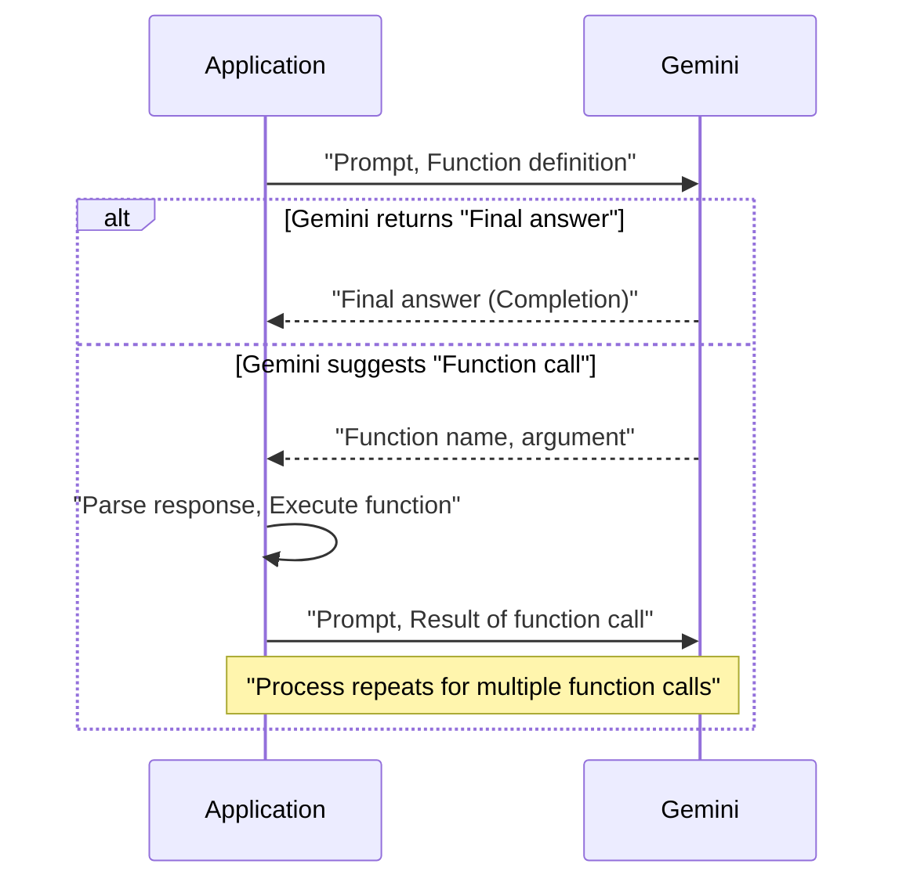
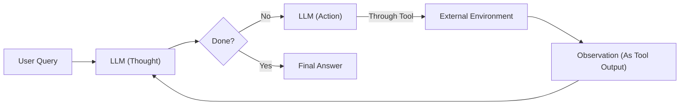

# Building a ReAct Agent From Scratch with Python and Gemini

In our previous lessons, we built a solid foundation in AI Engineering. We explored the agent landscape, distinguished between LLM workflows and AI agents, and mastered context engineering. We also learned how to get structured outputs from LLMs and give them the ability to act through function calling. In Lesson 7, we covered the theory behind ReAct, a powerful pattern for synergizing reasoning and acting.

Now, it is time to put that theory into practice. This lesson is 100% hands-on. We will move away from high-level frameworks to see what is happening under the hood. Relying on pre-packaged libraries without understanding their inner workings can lead to confusion. You might wonder how an agent decides to perform a web search or a calculation. By building the core logic yourself, you gain full control and a deep understanding that frameworks often hide.

We will build a minimal ReAct agent from scratch, step-by-step, using only Python and the Gemini API. You will implement the complete Thought → Action → Observation cycle: defining a tool, generating thoughts, selecting actions, executing them, processing observations, and orchestrating it all within a control loop. This hands-on experience will give you a concrete mental model for how these systems work, empowering you to debug, extend, and customize agents with confidence.

## Setup and Environment

Our first step is to set up a clean and predictable environment. This ensures your code runs smoothly and the outputs from our agent match the expected traces. A consistent setup is fundamental for reproducibility, a core principle in both software and AI engineering. We will load our API keys securely, import the necessary libraries that form the building blocks of our agent, and initialize the Gemini client that will serve as our agent's "brain."

1.  We start by loading our environment variables. We have a utility function that securely loads the `GOOGLE_API_KEY` from a `.env` file in the project's root. This practice prevents hardcoding sensitive keys directly in the source code.

    ```python
    from lessons.utils import env
    
    env.load(required_env_vars=["GOOGLE_API_KEY"])
    ```

2.  Next, we import the required libraries. We will use `google-genai` to interact with the Gemini API, `pydantic` to define structured data models for our actions, and Python's `enum` and `typing` for creating clear and type-safe code. Our custom `pretty_print` utilities will help visualize the agent's internal monologue later on.

    ```python
    import json
    from enum import Enum
    from typing import Annotated, Any, Union
    
    from google import genai
    from google.genai import types
    from pydantic import BaseModel, Field
    
    from lessons.utils.pretty_print import print_color, print_color_and_json
    ```

3.  We initialize the Gemini client, which is our gateway to the LLM. This object will handle all communication with the model.

    ```python
    client = genai.Client()
    ```

    It outputs:

    ```text
    Both GOOGLE_API_KEY and GEMINI_API_KEY are set. Using GOOGLE_API_KEY.
    ```

4.  Finally, we define the model we will use. Gemini offers a family of models, primarily `flash` and `pro`. The `flash` models are optimized for speed and cost-effectiveness, making them ideal for tasks like summarization or simple Q&A. The `pro` models offer more powerful reasoning capabilities, which are better suited for complex, multi-step agentic tasks. For this lesson, `gemini-2.5-flash` provides the right balance of performance and efficiency.

    ```python
    MODEL_ID = "gemini-2.5-flash"
    ```

With our environment configured, we can now define an external capability for our agent. This "tool" will allow it to interact with the outside world and gather information it does not possess internally.

## Tool Layer: Mock Search Implementation

To build a ReAct agent, we need to give it tools to interact with an external environment. For this lesson, we will create a mock search tool instead of calling a real API like Google Search. This approach has several advantages for learning. It simplifies our focus to the core ReAct mechanics, removes the need for extra API keys, and provides predictable, consistent responses, which is essential for testing and debugging [[13]](https://medium.com/google-cloud/building-react-agents-from-scratch-a-hands-on-guide-using-gemini-ffe4621d90ae). By isolating the agent's logic from external dependencies, we can clearly observe and understand its decision-making process without the noise of network latency or variable API outputs.

This educational strategy is powerful because it allows you to build a mental model of the agent's internal state machine. You can see exactly how a specific observation influences the next thought and action. The mock tool's predictable nature makes the agent's behavior deterministic, which is invaluable for debugging. When something goes wrong, you know the issue lies within your agent's reasoning or control loop, not with an external service. This transparency is a key benefit of building from scratch, as it equips you with the skills to troubleshoot more complex systems where the root cause of an error is not always obvious [[12]](https://www.dailydoseofds.com/ai-agents-crash-course-part-10-with-implementation/).

Our mock `search` function will simulate a web search. It takes a query and returns a hardcoded string if the query matches one of our predefined cases. If the query is not recognized, it returns a "not found" message. This fallback behavior is important, as it allows us to test how the agent handles situations where a tool fails to provide the needed information.

1.  First, we define our simple search function. Notice the docstring; it clearly explains what the tool does. As we learned in Lesson 6, this description is critical because the LLM uses it to understand when and how to use the tool.

    ```python
    def search(query: str) -> str:
        """
        Searches for the given query and returns a string with the results.
        """
        if query == "capital of France":
            return "Paris is the capital of France and is known for the Eiffel Tower."
        if query == "capital of Germany":
            return "Berlin is the capital of Germany and is famous for the Brandenburg Gate."
        return f"Information about '{query}' was not found."
    ```

2.  Next, we create a `TOOL_REGISTRY` to map the tool's name to its function handler. This registry allows our agent's control loop to dynamically call the correct function based on the LLM's action decision.

    ```python
    TOOL_REGISTRY = {
        "search": search,
    }
    ```

In a production system, swapping this mock tool with a real one is straightforward. You would simply replace the body of the `search` function with a call to an external API, like Google Search or a domain-specific knowledge base [[27]](https://medium.com/google-cloud/building-react-agents-from-scratch-a-hands-on-guide-using-gemini-ffe4621d90ae). As long as the function signature (`query: str -> str`) and the docstring remain consistent, the agent's logic does not need to change [[29]](https://ai.google.dev/gemini-api/docs/langgraph-example). This modular design is a key principle of building maintainable AI systems.

Now that our agent has a tool, it needs a way to reason about when to use it. This brings us to the "Thought" phase of the ReAct cycle.

## Thought Phase: Prompt Construction and Generation

The "Thought" phase is where the agent reasons about the user's query and its past actions to decide what to do next. This is the "Re" in ReAct—the agent's internal monologue where it plans its strategy. To guide this process, we need to construct a prompt that provides the LLM with all the necessary context, including the available tools and the conversation history.

We will use XML tags to structure the prompt, a technique we introduced in Lesson 3. This helps the model distinguish between different types of information, such as tool descriptions and the ongoing conversation, improving its ability to follow instructions [[14]](https://ai.google.dev/gemini-api/docs/prompting-strategies). The structure makes the prompt more machine-readable and reduces ambiguity, which is critical for achieving reliable agent behavior.

1.  First, we create a helper function to format our tool registry into an XML string. This function iterates through our `TOOL_REGISTRY` and wraps each tool's name and docstring in `<tool>` tags. This structured format makes it easy for the LLM to parse and understand its available capabilities.

    ```python
    def build_tools_xml_description(tool_registry: dict[str, callable]) -> str:
        """
        Builds an XML string describing the available tools.
        """
        xml = "<tools>\n"
        for name, func in tool_registry.items():
            xml += f"<tool name='{name}'>{func.__doc__}</tool>\n"
        xml += "</tools>"
        return xml
    ```

2.  Next, we define the prompt template for the thought-generation step. This prompt sets the agent's persona ("You are a helpful assistant"), provides the tool definitions within the `{tools}` placeholder, shows the conversation history via `{conversation}`, and asks the crucial question: "what is your next thought?". The instruction to keep the thought "short, and concise" encourages the model to produce focused, actionable reasoning.

    ```python
    PROMPT_TEMPLATE_THOUGHT = """
    You are a helpful assistant. Your goal is to assist the user with their question.
    You have access to the following tools:
    {tools}
    
    The conversation history is as follows:
    <conversation>
    {conversation}
    </conversation>
    
    Based on the conversation history and the available tools, what is your next thought?
    Your thought should be a single, short, and concise sentence.
    """
    ```

3.  We can now inspect the full prompt by formatting the template with our tool's XML description. This is a good debugging practice to ensure the context being sent to the LLM is correctly structured and contains all the necessary information for the model to reason effectively.

    ```python
    tools_xml = build_tools_xml_description(TOOL_REGISTRY)
    print(PROMPT_TEMPLATE_THOUGHT.format(tools=tools_xml, conversation="..."))
    ```

    It outputs:

    ```text
    You are a helpful assistant. Your goal is to assist the user with their question.
    You have access to the following tools:
    <tools>
    <tool name='search'>
            Searches for the given query and returns a string with the results.
            </tool>
    </tools>
    
    The conversation history is as follows:
    <conversation>
    ...
    </conversation>
    
    Based on the conversation history and the available tools, what is your next thought?
    Your thought should be a single, short, and concise sentence.
    ```

4.  Finally, we create the `generate_thought` function. It takes the current conversation and tool registry, assembles the complete prompt, and calls the Gemini model to generate the agent's next thought. This function encapsulates the reasoning step of our agent, turning context into a strategic plan.

    ```python
    def generate_thought(conversation: str, tool_registry: dict[str, callable]) -> str:
        """
        Generates the next thought for the agent.
        """
        tools_xml = build_tools_xml_description(tool_registry)
        prompt = PROMPT_TEMPLATE_THOUGHT.format(tools=tools_xml, conversation=conversation)
        response = client.models.generate_content(model=MODEL_ID, contents=prompt)
        return response.text.strip()
    ```

With a coherent thought generated, the agent has a plan. The next step is to translate that plan into a concrete, executable action.

## Action Phase: Function Calling and Parsing

After generating a thought, the agent must decide on an action. This is the "Act" in ReAct. The action could be calling a tool to gather more information or, if it has enough context, providing a final answer to the user. We will use Gemini’s native function calling capability, which we explored in Lesson 6, to make this decision. This approach is more reliable than manually parsing text because it leverages the model's built-in ability to generate structured JSON output for tool calls [[9]](https://ai.google.dev/gemini-api/docs/function-calling).

By separating the strategic guidance in our prompt from the technical details of the tools, we create a cleaner and more maintainable system. The prompt tells the agent *how* to think, while the `tools` configuration tells it *what* it can do.

1.  First, we define a prompt that guides the agent's action-selection process. It instructs the agent to decide between using a tool or finishing the task based on the conversation history. Notice that we do not include tool descriptions here; that information will be passed to the model through its configuration.

    ```python
    PROMPT_TEMPLATE_ACTION = """
    You are a helpful assistant. Your goal is to assist the user with their question.
    Based on the conversation history, what is your next action?
    Your available actions are to call a tool or to finish the conversation.
    If you have enough information to answer the user's question, finish the conversation.
    Otherwise, call a tool to gather more information.
    
    The conversation history is as follows:
    <conversation>
    {conversation}
    </conversation>
    """
    ```

2.  Next, we define a constant for the finish action and a Pydantic model for tool call requests. As we learned in Lesson 4, using Pydantic for structured outputs ensures that the data we get from the LLM is validated and easy to work with. `ACTION_FINISH` is a special signal we will use to terminate the agent's loop when it determines it has enough information. The `ToolCallRequest` model provides a clear, type-safe structure for tool invocations.

    ```python
    ACTION_FINISH = "finish"
    
    class ToolCallRequest(BaseModel):
        name: str = Field(description="The name of the tool to be called.")
        args: dict[str, Any] = Field(description="The arguments to be passed to the tool.")
    ```

3.  Now, we implement the `generate_action` function. This function takes the conversation history and the list of available tools, then calls Gemini with the `tools` configuration. The model will either return a `function_call` object, suggesting a tool to use, or a text response if it decides to finish. Our parsing logic is straightforward: we check if the response contains a `function_call` attribute. If it does, we parse it into our `ToolCallRequest` model. If not, we return the `ACTION_FINISH` signal. This is more robust than parsing raw text and gracefully handles the model's decision to conclude the task.

    ```python
    def generate_action(
        conversation: str, tool_registry: dict[str, callable]
    ) -> Union[ToolCallRequest, str]:
        """
        Generates the next action for the agent.
        """
        prompt = PROMPT_TEMPLATE_ACTION.format(conversation=conversation)
        response = client.models.generate_content(
            model=MODEL_ID,
            contents=prompt,
            config=types.GenerateContentConfig(tools=[types.Tool(function_declarations=tool_registry)]),
        )
    
        if hasattr(response.candidates[0].content.parts[0], "function_call"):
            function_call = response.candidates[0].content.parts[0].function_call
            return ToolCallRequest(name=function_call.name, args=dict(function_call.args))
        else:
            return ACTION_FINISH
    ```



Image 1: Sequence diagram of the function calling process between an Application and Gemini in a ReAct agent.

This diagram illustrates the two possible paths. The application sends a prompt and function definitions to Gemini. The model either returns a final answer directly or suggests a function call. If it's a function call, our application executes it and sends the result back to Gemini to continue the process.

We now have the core components for the "Thought" and "Action" phases. The final piece is to orchestrate them in a continuous loop that also handles observations.

## Control Loop: Messages, Scratchpad, Orchestration

With the "Thought" and "Action" phases defined, we now need to tie them together into a control loop. This loop orchestrates the entire ReAct cycle: it generates a thought, determines an action, executes it, observes the result, and repeats. This iterative process is what makes an agent autonomous and allows it to tackle complex, multi-step problems.

This iterative process is not unique to AI; it mirrors the feedback mechanisms used in control theory for decades. In classic engineering, a control loop measures a system's output (like the temperature in a room), compares it to a desired set-point, and manipulates an input (like turning on the air conditioner) to minimize the error [[10]](https://eng.libretexts.org/Bookshelves/Industrial_and_Systems_Engineering/Chemical_Process_Dynamics_and_Controls_(Woolf)/11%3A_Control_Architectures/11.01%3A_Feedback_control-_What_is_it_When_useful_When_not_Common_usage.). Our ReAct loop operates on the same principle: an "observation" is the measured output, the "thought" evaluates it against the goal, and the "action" is the input adjusted to bring the agent closer to a solution.



Image 2: A flowchart depicting the iterative ReAct (Reasoning and Acting) control loop.

Central to this loop is the "scratchpad," which acts as the agent's short-term memory. It logs every step of the process—user queries, thoughts, tool calls, and observations—allowing the agent to maintain context across turns. To build a reliable scratchpad, we need a consistent structure for our messages.

1.  We start by defining an `Enum` for the different roles a message can have: `USER`, `THOUGHT`, `TOOL_REQUEST`, `OBSERVATION`, and `FINAL_ANSWER`. This makes our code more readable and less prone to errors from typos.

    ```python
    class MessageRole(Enum):
        USER = "user"
        THOUGHT = "thought"
        TOOL_REQUEST = "tool_request"
        OBSERVATION = "observation"
        FINAL_ANSWER = "final_answer"
    ```

2.  Next, we create a Pydantic `Message` model that combines a `role` and `content`. This simple class will be the universal format for every entry in our scratchpad, creating a structured and auditable trail of the agent's entire process.

    ```python
    class Message(BaseModel):
        role: MessageRole
        content: str
    ```

3.  We also create a couple of helper functions. `format_scratchpad` converts our list of `Message` objects into a single, XML-formatted string that we can insert into our prompts. `pretty_print_message` helps us visualize the agent's trace with color-coded outputs, making it much easier to debug and understand the agent's behavior.

    ```python
    def format_scratchpad(scratchpad: list[Message]) -> str:
        """
        Formats the scratchpad into a string.
        """
        formatted_scratchpad = ""
        for message in scratchpad:
            formatted_scratchpad += f"<{message.role.value}>\n{message.content}\n</{message.role.value}>\n"
        return formatted_scratchpad
    
    def pretty_print_message(message: Message):
        """
        Prints a message with a color-coded role.
        """
        role_to_color = {
            MessageRole.USER: "white",
            MessageRole.THOUGHT: "cyan",
            MessageRole.TOOL_REQUEST: "yellow",
            MessageRole.OBSERVATION: "magenta",
            MessageRole.FINAL_ANSWER: "green",
        }
        print_color(f"{message.role.value.upper()}:", role_to_color[message.role])
        if message.role == MessageRole.TOOL_REQUEST:
            print_color_and_json(message.content)
        else:
            print(message.content)
    ```

4.  Now we can build the main `react_agent_loop`. This function is the heart of our agent. It initializes the scratchpad with the user's initial query and then enters a `for` loop that runs for a predefined number of turns. This `max_turns` parameter is a crucial guardrail to prevent the agent from getting stuck in an infinite loop, which could lead to unexpected costs and behavior. Inside the loop, the agent methodically executes the ReAct cycle. The "Observation" phase is where the agent learns from its actions. After the LLM decides on a tool call, our loop executes it and captures the result. This result, whether it is a successful piece of information or an error message, is then formatted as an `OBSERVATION` message and added to the scratchpad. This step is critical because it closes the feedback loop. The observation becomes part of the context for the next "Thought" phase, allowing the agent to assess its progress, correct its course if a tool failed, and plan its next move based on new information. Our implementation includes robust error handling: if a tool call fails or the tool name is invalid, an informative error message is returned as the observation. This teaches the agent to be resilient and adapt its strategy when things do not go as planned.

    ```python
    def react_agent_loop(
        user_query: str, tool_registry: dict[str, callable], max_turns: int = 5, verbose: bool = False
    ) -> str:
        """
        The main loop for the ReAct agent.
        """
        scratchpad = [Message(role=MessageRole.USER, content=user_query)]
        
        for i in range(max_turns):
            if verbose:
                print_color(f"Turn {i+1}/{max_turns}", "yellow")
    
            # 1. Thought
            conversation = format_scratchpad(scratchpad)
            thought = generate_thought(conversation, tool_registry)
            scratchpad.append(Message(role=MessageRole.THOUGHT, content=thought))
            if verbose:
                pretty_print_message(scratchpad[-1])
    
            # 2. Action
            conversation = format_scratchpad(scratchpad)
            action = generate_action(conversation, tool_registry)
    
            if isinstance(action, str) and action == ACTION_FINISH:
                # 3. Final Answer
                scratchpad.append(
                    Message(
                        role=MessageRole.FINAL_ANSWER,
                        content="I have enough information to answer the user's question.",
                    )
                )
                if verbose:
                    pretty_print_message(scratchpad[-1])
                return generate_thought(format_scratchpad(scratchpad), tool_registry)
            
            # 3. Tool Execution and Observation
            scratchpad.append(
                Message(
                    role=MessageRole.TOOL_REQUEST,
                    content=action.model_dump_json(indent=2),
                )
            )
            if verbose:
                pretty_print_message(scratchpad[-1])
    
            if action.name in tool_registry:
                try:
                    tool_result = tool_registry[action.name](**action.args)
                except Exception as e:
                    tool_result = f"Error executing tool: {e}"
            else:
                tool_result = f"Tool '{action.name}' not found. Please use one of the available tools: {list(tool_registry.keys())}"
    
            scratchpad.append(Message(role=MessageRole.OBSERVATION, content=tool_result))
            if verbose:
                pretty_print_message(scratchpad[-1])
    
        if verbose:
            print_color("Max turns reached. Generating final answer.", "red")
        return generate_thought(format_scratchpad(scratchpad), tool_registry)
    ```

This loop fully implements the ReAct pattern. It methodically thinks, acts, and observes, accumulating knowledge in its scratchpad until it can confidently answer the user's query or reaches its operational limits. Now that our agent is complete, let's test it.

## Tests and Traces: Success and Graceful Fallback

With our ReAct loop fully implemented, it is time to validate its behavior. We will run two tests. The first is a simple factual query to demonstrate a successful run where the agent finds the answer. The second uses a query our mock tool cannot handle, testing the agent's ability to adapt its strategy and terminate gracefully when it fails. Analyzing the traces from these runs will confirm that each part of our system—thought generation, tool integration, and the control loop—works as designed.

1.  First, we test a simple, factual question: "What is the capital of France?". We limit the agent to two turns to see how it performs within a constrained loop.

    ```python
    final_answer = react_agent_loop(
        user_query="What is the capital of France?",
        tool_registry=TOOL_REGISTRY,
        max_turns=2,
        verbose=True,
    )
    
    print("\n\n---\n")
    print_color(f"Final Answer: {final_answer}", "green")
    ```

    The agent produces the following trace:
    - **Thought (Turn 1/2):** It correctly reasons that it needs to use the `search` tool to find the capital of France. This shows the model understands the query and can map it to the available tool.
    - **Tool request (Turn 1/2):** It generates a valid call: `search(query='capital of France')`. The action phase successfully translates the thought into a structured tool call.
    - **Observation (Turn 1/2):** Our mock tool returns the answer: "Paris is the capital of France and is known for the Eiffel Tower." The observation is successfully captured.
    - **Thought (Turn 2/2):** Observing the result, the agent concludes it has the information needed to answer. This demonstrates the agent's ability to evaluate its state.
    - **Final answer (Turn 2/2):** It extracts the core fact and provides the final answer: "Paris is the capital of France." The loop terminates correctly upon finding a solution.

    This trace confirms that the agent can successfully follow the Thought-Action-Observation cycle to resolve a query.

2.  Next, we test the agent's fallback behavior with a query our mock tool does not recognize: "What is the capital of Italy?". This tests the agent's resilience and its ability to handle failure.

    ```python
    final_answer = react_agent_loop(
        user_query="What is the capital of Italy?",
        tool_registry=TOOL_REGISTRY,
        max_turns=2,
        verbose=True,
    )
    
    print("\n\n---\n")
    print_color(f"Final Answer: {final_answer}", "green")
    ```

    This time, the trace shows a different, more adaptive path:
    - **Thought (Turn 1/2) → Tool request (Turn 1/2):** The agent initially tries `search(query='capital of Italy')`, a logical first step.
    - **Observation (Turn 1/2):** The mock tool returns: "Information about 'capital of Italy' was not found." The agent correctly processes this negative feedback.
    - **Thought (Turn 2/2):** The agent observes the failure and decides to try a broader search, a simple but effective recovery strategy. This shows adaptive reasoning.
    - **Tool request (Turn 2/2):** It attempts a new search: `search(query='Italy')`.
    - **Observation (Turn 2/2):** This also fails, returning: "Information about 'Italy' was not found."
    - **Final answer (Forced):** Having reached the maximum number of turns without success, the loop terminates and generates a final, honest response: "I'm sorry, but I couldn't find information about the capital of Italy."

This second test demonstrates the agent's resilience. It can recognize tool failures, adapt its strategy, and provide a graceful response when it cannot find an answer. The forced termination at `max_turns` ensures the agent does not get stuck in an unproductive loop, which is a critical safety feature for production systems.

These tests validate our end-to-end implementation and provide a solid foundation for building more advanced agents with richer tools and more sophisticated reasoning behaviors.

## Conclusion

By building a ReAct agent from scratch, we have demystified the magic behind autonomous AI. We have seen how a simple, stateful loop combining thought, action, and observation allows an LLM to reason about problems and interact with its environment. This exploration gives us more than just theoretical knowledge; it provides a concrete mental model for how these systems work.

Understanding this core logic is essential for building production-grade AI systems, even when using production frameworks like LangGraph that formalize this loop into a stateful graph [[11]](https://ai.google.dev/gemini-api/docs/langgraph-example). Moving from a prototype to a scaled system introduces new challenges, such as managing variable token costs and debugging latency across multiple tool calls [[15]](https://discuss.google.dev/t/beyond-the-prototype-scaling-production-grade-agents-with-gemini/356140). Mastering these fundamentals prepares you to build reliable agents for complex domains, from enterprise automation to AI-powered scientific discovery [[16]](https://kempnerinstitute.harvard.edu/research/deeper-learning/from-models-to-scientists-building-ai-agents-for-scientific-discovery/). In our upcoming lessons, we will build upon this foundation, exploring how to equip agents with long-term memory and enhance their knowledge with advanced Retrieval-Augmented Generation (RAG) techniques, which we will cover in detail in Lesson 10.

## References

- [1] Yao, S., Zhao, J., Yu, D., Du, N., Shafran, I., Narasimhan, K., & Cao, Y. (2022). *ReAct: Synergizing Reasoning and Acting in Language Models*. arXiv. https://arxiv.org/pdf/2210.03629
- [2] *What is a ReAct agent?* (n.d.). IBM. https://www.ibm.com/think/topics/react-agent
- [3] *What is AI agent planning?* (n.d.). IBM. https://www.ibm.com/think/topics/ai-agent-planning
- [4] *Building effective agents*. (n.d.). Anthropic. https://www.anthropic.com/engineering/building-effective-agents
- [5] *ReAct agent from scratch with Gemini 2.5 and LangGraph*. (n.d.). Google AI for Developers. https://ai.google.dev/gemini-api/docs/langgraph-example
- [6] Ferrag, M. A., Tihanyi, N., & Debbah, M. (2025). *From LLM Reasoning to Autonomous AI Agents: A Comprehensive Review*. arXiv. https://arxiv.org/pdf/2504.19678
- [7] Shankar, A. (2024, June 25). *Building ReAct Agents from Scratch using Gemini*. Medium. https://medium.com/google-cloud/building-react-agents-from-scratch-a-hands-on-guide-using-gemini-ffe4621d90ae
- [8] *What is AI agent orchestration?* (n.d.). IBM. https://www.ibm.com/think/topics/ai-agent-orchestration
- [9] *Function calling*. (n.d.). Google AI for Developers. https://ai.google.dev/gemini-api/docs/function-calling
- [10] Woolf, P. (n.d.). *Feedback control- What is it? When useful? When not? Common usage*. Engineering LibreTexts. https://eng.libretexts.org/Bookshelves/Industrial_and_Systems_Engineering/Chemical_Process_Dynamics_and_Controls_(Woolf)/11%3A_Control_Architectures/11.01%3A_Feedback_control-_What_is_it_When_useful_When_not_Common_usage.
- [11] *ReAct agent from scratch with Gemini 2.5 and LangGraph*. (n.d.). Google AI for Developers. https://ai.google.dev/gemini-api/docs/langgraph-example
- [12] Daily Dose of DS. (2024, June 10). *AI Agents Crash Course - Part 10: ReAct Framework with Implementation*. Daily Dose of DS. https://www.dailydoseofds.com/ai-agents-crash-course-part-10-with-implementation/
- [13] Shankar, A. (2024, June 25). *Building ReAct Agents from Scratch using Gemini*. Medium. https://medium.com/google-cloud/building-react-agents-from-scratch-a-hands-on-guide-using-gemini-ffe4621d90ae
- [14] *Prompting strategies*. (n.d.). Google AI for Developers. https://ai.google.dev/gemini-api/docs/prompting-strategies
- [15] *Beyond the Prototype: Scaling Production-Grade Agents with Gemini*. (2024). Google Developers Community. https://discuss.google.dev/t/beyond-the-prototype-scaling-production-grade-agents-with-gemini/356140
- [16] *From Models to Scientists: Building AI Agents for Scientific Discovery*. (n.d.). Kempner Institute for the Study of Natural and Artificial Intelligence at Harvard University. https://kempnerinstitute.harvard.edu/research/deeper-learning/from-models-to-scientists-building-ai-agents-for-scientific-discovery/
- [17] Shankar, A. (2024, June 25). *Building ReAct Agents from Scratch using Gemini*. Medium. https://medium.com/google-cloud/building-react-agents-from-scratch-a-hands-on-guide-using-gemini-ffe4621d90ae
- [18] *ReAct agent from scratch with Gemini 2.5 and LangGraph*. (n.d.). Google AI for Developers. https://ai.google.dev/gemini-api/docs/langgraph-example
- [19] *Real-world agent examples with Gemini 3*. (2024, July 16). Google for Developers Blog. https://developers.googleblog.com/real-world-agent-examples-with-gemini-3/
- [20] *ReAct agent from scratch with Gemini 2.5 and LangGraph*. (n.d.). Google AI for Developers. https://ai.google.dev/gemini-api/docs/langgraph-example
- [21] *ReAct agent from scratch with Gemini 2.5 and LangGraph*. (n.d.). Google AI for Developers. https://ai.google.dev/gemini-api/docs/langgraph-example
- [22] Schmid, P. (2025, March 31). *ReAct agent from scratch with Gemini 2.5 and LangGraph*. Philipp Schmid. https://www.philschmid.de/langgraph-gemini-2-5-react-agent
- [23] *ReAct agent from scratch with Gemini 2.5 and LangGraph*. (n.d.). Google AI for Developers. https://ai.google.dev/gemini-api/docs/langgraph-example
- [24] *Build an AI Coding Agent with Python and Gemini*. (2024, July 1). freeCodeCamp.org. https://www.freecodecamp.org/news/build-an-ai-coding-agent-with-python-and-gemini/
- [25] Lu, Y., Liu, S., & Dong, L. (2025). *OrchDAG: Complex Tool Orchestration in Multi-Turn Interactions with Plan DAGs*. arXiv. https://arxiv.org/html/2510.24663v1
- [26] *OrchDAG: Complex Tool Orchestration in Multi-Turn Interactions with Plan DAGs*. (2025). Amazon Science. https://www.amazon.science/publications/orchdag-complex-tool-orchestration-in-multi-turn-interactions-with-plan-dags
- [27] Shankar, A. (2024, June 25). *Building ReAct Agents from Scratch using Gemini*. Medium. https://medium.com/google-cloud/building-react-agents-from-scratch-a-hands-on-guide-using-gemini-ffe4621d90ae
- [28] *ReAct agent from scratch with Gemini 2.5 and LangGraph*. (n.d.). Google AI for Developers. https://ai.google.dev/gemini-api/docs/langgraph-example
- [29] *ReAct agent from scratch with Gemini 2.5 and LangGraph*. (n.d.). Google AI for Developers. https://ai.google.dev/gemini-api/docs/langgraph-example
- [30] *Real-world agent examples with Gemini 3*. (2024, July 16). Google for Developers Blog. https://developers.googleblog.com/real-world-agent-examples-with-gemini-3/
- [31] *Beyond the Prompt: Engineering the Thought-Action-Observation Loop*. (2024, July 1). Towards AI. https://pub.towardsai.net/beyond-the-prompt-engineering-the-thought-action-observation-loop-2e1fd99114d2
- [32] *AI Agents IV: AI Agents through the Thought-Action-Observation (TAO) Cycle*. (2024, July 1). Stackademic. https://blog.stackademic.com/ai-agents-iv-ai-agents-through-the-thought-action-observation-tao-cycle-3dfe2eb76629
- [33] *Agent Steps and Structure*. (n.d.). Hugging Face. https://huggingface.co/learn/agents-course/unit1/agent-steps-and-structure
- [34] *Building Production ReAct Agents From Scratch Is Simple*. (2025, November 18). Decoding AI. https://www.decodingai.com/p/building-production-react-agents
- [35] Neradot. (2024, November 5). *Building a Python React Agent Class: A Step-by-Step Guide*. Neradot. https://www.neradot.com/post/building-a-python-react-agent-class-a-step-by-step-guide
- [36] Brownlee, J. (2024, July 1). *Building ReAct Agents with LangGraph: A Beginner’s Guide*. Machine Learning Mastery. https://machinelearningmastery.com/building-react-agents-with-langgraph-a-beginners-guide/
- [37] Daily Dose of DS. (2024, June 10). *AI Agents Crash Course - Part 10: ReAct Framework with Implementation*. Daily Dose of DS. https://www.dailydoseofds.com/ai-agents-crash-course-part-10-with-implementation/
- [38] Daily Dose of DS. (2024, June 10). *AI Agents Crash Course - Part 10: ReAct Framework with Implementation*. Daily Dose of DS. https://www.dailydoseofds.com/ai-agents-crash-course-part-10-with-implementation/
- [39] Shankar, A. (2024, June 25). *Building ReAct Agents from Scratch using Gemini*. Medium. https://medium.com/google-cloud/building-react-agents-from-scratch-a-hands-on-guide-using-gemini-ffe4621d90ae
- [40] Daily Dose of DS. (2024, June 10). *Implement ReAct Agentic Pattern From Scratch*. Daily Dose of DS. https://blog.dailydoseofds.com/p/implement-react-agentic-pattern-from
- [41] Shankar, A. (2024, June 25). *Building ReAct Agents from Scratch using Gemini*. Medium. https://medium.com/google-cloud/building-react-agents-from-scratch-a-hands-on-guide-using-gemini-ffe4621d90ae
- [42] Schmid, P. (2025, March 31). *ReAct agent from scratch with Gemini 2.5 and LangGraph*. Philipp Schmid. https://www.philschmid.de/langgraph-gemini-2-5-react-agent
- [43] *ReAct agent from scratch with Gemini 2.5 and LangGraph*. (n.d.). Google AI for Developers. https://ai.google.dev/gemini-api/docs/langgraph-example
- [44] Shankar, A. (2024, June 25). *Building ReAct Agents from Scratch using Gemini*. Medium. https://medium.com/google-cloud/building-react-agents-from-scratch-a-hands-on-guide-using-gemini-ffe4621d90ae
- [45] Schmid, P. (2025, March 31). *ReAct agent from scratch with Gemini 2.5 and LangGraph*. Philipp Schmid. https://www.philschmid.de/langgraph-gemini-2-5-react-agent
- [46] *ReAct agent from scratch with Gemini 2.5 and LangGraph*. (n.d.). Google AI for Developers. https://ai.google.dev/gemini-api/docs/langgraph-example
- [47] *Build an AI Coding Agent with Python and Gemini*. (2024, July 1). freeCodeCamp.org. https://www.freecodecamp.org/news/build-an-ai-coding-agent-with-python-and-gemini/