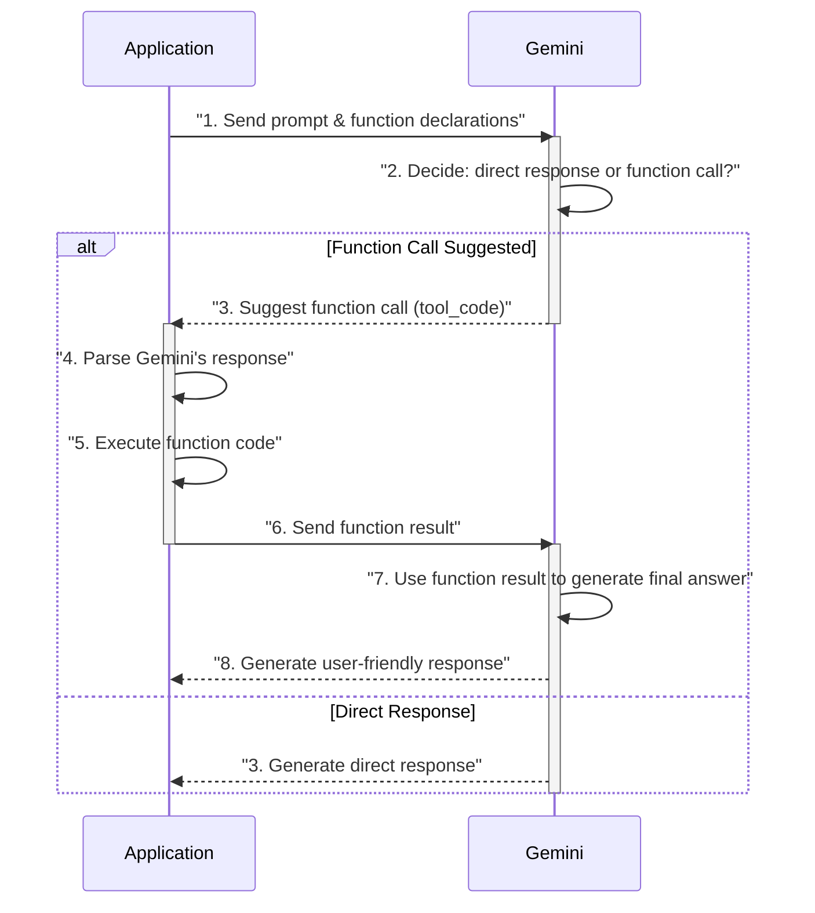
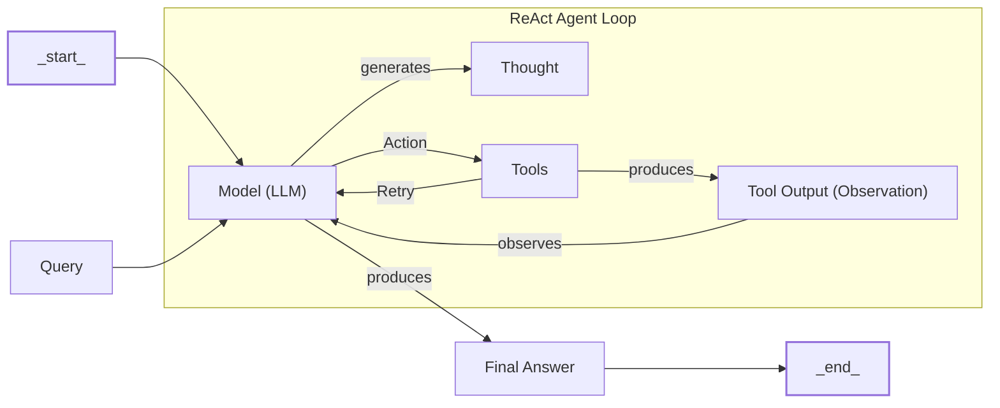

# Lesson 8: A Step-by-Step Guide to Building a ReAct Agent From Scratch

In our previous lessons, we have built a solid foundation in AI engineering. We have explored the agentic landscape, distinguished between rule-based LLM workflows and autonomous agents, and learned how to engineer context. We have also covered how to get structured data from LLMs, equip them with tools through function calling, and understand the theory behind reasoning patterns like ReAct.

Now, it is time to put all that theory into practice. While frameworks like LangGraph or CrewAI are powerful, they often hide the core logic that makes an agent tick. To truly master AI engineering, you need to understand what is happening under the hood. The best way to do that is to build it yourself. This is not just an academic exercise. In production, you often end up writing your own agentic layer because high-level abstractions can limit access to new features, and graph-based models can make simple logic overly complicated [[1]](https://www.decodingai.com/p/building-production-react-agents).

The ReAct pattern we are implementing is a key milestone in the evolution of AI agents, which has roots in decades of multi-agent systems research [[2]](https://www.ibm.com/think/topics/evolution-of-ai-agents). It combines chain-of-thought reasoning with the ability to use external tools, allowing an LLM to act as the agent’s “brain” to plan and execute tasks [[3]](https://www.ibm.com/think/topics/react-agent).

This lesson is 100% practical. We will guide you step-by-step through building a minimal ReAct agent from the ground up, using only Python and the Gemini API. We will implement the complete Thought → Action → Observation loop, giving you a concrete mental model of how these systems operate. By the end, you will have a working agent that you can debug, customize, and extend with confidence.

We will cover:
- Setting up the environment and initializing the Gemini client.
- Creating a mock tool to simulate external interactions.
- Implementing the Thought phase to generate a reasoning step.
- Building the Action phase using function calling to decide the next move.
- Orchestrating the full cycle with a turn-based control loop.
- Testing the agent to see it succeed and handle failures gracefully.

## Setup and Environment

Our first step is to set up a clean and predictable environment. This ensures that the code from our notebook runs smoothly and that your outputs match the traces we will analyze later. This lesson follows the notebook from the course repository, so make sure you have it open. A consistent setup is critical for reproducibility, a core principle in both software and AI engineering.

1. We begin by loading our `GOOGLE_API_KEY` from the environment. Our utility function handles this, making sure the key is available for the Gemini client.
    ```python
    from lessons.utils import env
    
    env.load(required_env_vars=["GOOGLE_API_KEY"])
    ```
    It outputs:
    ```text
      Trying to load environment variables from /path/to/your/project/.env
      Environment variables loaded successfully.
    ```

2. Next, we import the necessary packages. We will use `google-genai` for interacting with the Gemini API, `pydantic` for data validation, and other standard libraries for type hinting and enumeration. These dependencies form the backbone of our agent, providing the tools for communication, data structuring, and clear type definitions.
    ```python
    from enum import Enum
    from pydantic import BaseModel, Field
    from typing import List
    
    from google import genai
    from google.genai import types
    
    from lessons.utils import pretty_print
    ```

3. With our key loaded, we initialize the Gemini client. The client automatically detects and uses the API key we set up, establishing the connection to Google's AI services.
    ```python
    client = genai.Client()
    ```
    It outputs:
    ```text
    Both GOOGLE_API_KEY and GEMINI_API_KEY are set. Using GOOGLE_API_KEY.
    ```

4. Finally, we define the model we will use. For this lesson, we will use `gemini-2.5-flash`. It is a fast and cost-effective model, perfect for the simple reasoning tasks we will be performing. For more complex, multi-step agentic workflows, you might consider a `pro` model, which offers more powerful reasoning capabilities but at a higher latency and cost.
    ```python
    MODEL_ID = "gemini-2.5-flash"
    ```
With the client and model in place, we are ready to define the external capabilities our agent can use.

## Tool Layer: Mock Search Implementation

An agent's power comes from its ability to interact with the world through tools. To demonstrate this, we will create a simple mock `search` tool. In a production system, this tool would call a real API like Google Search or a private knowledge base. For this lesson, however, a mock tool is better for a few reasons.

First, it keeps our focus on the ReAct mechanics without adding the complexity of API keys and network requests. This educational approach demystifies the agent's internal workings, allowing you to see the decision-making process clearly [[4]](https://www.dailydoseofds.com/ai-agents-crash-course-part-10-with-implementation/). Second, it gives us predictable, consistent responses, which is essential for learning and debugging. This way, we can be sure that any unexpected behavior comes from our agent's logic, not from a random API result. This hands-on approach provides a concrete mental model for how to debug and extend agents with confidence [[5]](https://pub.towardsai.net/beyond-the-prompt-engineering-the-thought-action-observation-loop-2e1fd99114d2).

1. Our mock `search` function takes a string query and returns a predefined answer if the query matches a known topic. We use a docstring to describe what the tool does and its arguments. As we will see later, this documentation is critical, as the LLM uses it to understand how and when to use the tool.
    ```python
    def search(query: str) -> str:
        """Search for information about a specific topic or query.
    
        Args:
            query (str): The search query or topic to look up.
        """
        query_lower = query.lower()
    
        # Predefined responses for demonstration
        if all(word in query_lower for word in ["capital", "france"]):
            return "Paris is the capital of France and is known for the Eiffel Tower."
        elif "react" in query_lower:
            return "The ReAct (Reasoning and Acting) framework enables LLMs to solve complex tasks by interleaving thought generation, action execution, and observation processing."
    
        # Generic response for unhandled queries
        return f"Information about '{query}' was not found."
    ```

2. Next, we create a `TOOL_REGISTRY`. This dictionary maps the tool's name to its actual Python function. This registry allows our agent to plan with symbolic names like `"search"` and lets our control loop safely execute the corresponding code.
    ```python
    TOOL_REGISTRY = {
        search.__name__: search,
    }
    ```
This simple setup provides a solid foundation for our agent. While we are using a mock tool now, swapping it for a real-world API in production is a straightforward process. The key is to maintain a consistent function signature and a clear docstring. For example, to switch to a real Google Search API, you would replace the body of the `search` function with an API call, but the function name, arguments, and docstring would remain the same [[6]](https://medium.com/google-cloud/building-react-agents-from-scratch-a-hands-on-guide-using-gemini-ffe4621d90ae). This modular design, driven by docstrings, ensures that you can enhance the agent's capabilities without altering its core reasoning logic. Frameworks like LangGraph use decorators like `@tool` to achieve the same effect, binding the tool to the model and making it available for execution [[7]](https://ai.google.dev/gemini-api/docs/langgraph-example).

## Thought Phase: Prompt Construction and Generation

Now we will implement the "Thought" phase, the first step in the ReAct cycle. Here, the agent analyzes the user's query and its conversation history to reason about what to do next. The goal is to produce a short, purposeful thought that guides its subsequent action. This phase is where the agent performs its planning, a critical component of any agentic system that needs to break down complex goals into manageable steps [[8]](https://www.ibm.com/think/topics/ai-agent-planning).

To achieve this, we will construct a prompt that explicitly tells the LLM which tools are available. Since we are implementing this from scratch, we will format the tool descriptions using XML tags. This is a common and effective prompt engineering technique that helps the model clearly distinguish different parts of the context, such as instructions, user input, and available tools [[9]](https://ai.google.dev/gemini-api/docs/prompting-strategies). This structured approach improves clarity and guides the model's output more reliably than unstructured text.

1. We start with a helper function, `build_tools_xml_description`, that converts our `TOOL_REGISTRY` into an XML string. It iterates through the tools, extracts their docstrings, and formats them within `<tool>` tags.
    ```python
    def build_tools_xml_description(tools: dict[str, callable]) -> str:
        """Build a minimal XML description of tools using only their docstrings."""
        lines = []
        for tool_name, fn in tools.items():
            doc = (fn.__doc__ or "").strip()
            lines.append(f"\t<tool name=\"{tool_name}\">")
            if doc:
                lines.append(f"\t\t<description>")
                for line in doc.split("\n"):
                    lines.append(f"\t\t\t{line}")
                lines.append(f"\t\t</description>")
            lines.append("\t</tool>")
        return "\n".join(lines)
    ```

2. Next, we define the prompt template for the thought generation step. This template instructs the agent to analyze the situation and state its next thought. It includes placeholders for the available tools (as an XML block) and the conversation history.
    ```python
    tools_xml = build_tools_xml_description(TOOL_REGISTRY)
    
    PROMPT_TEMPLATE_THOUGHT = f"""
    You are deciding the next best step for reaching the user goal. You have some tools available to you.
    
    Available tools:
    <tools>
    {tools_xml}
    </tools>
    
    Conversation so far:
    <conversation>
    {{conversation}}
    </conversation>
    
    State your next thought about what to do next as one short paragraph focused on the next action you intend to take and why.
    Avoid repeating the same strategies that didn't work previously. Prefer different approaches.
    """.strip()
    ```

3. Let's inspect the full prompt to see how it looks with the tool definitions included.
    ```python
    print(PROMPT_TEMPLATE_THOUGHT)
    ```
    It outputs:
    ```text
    You are deciding the next best step for reaching the user goal. You have some tools available to you.
    
    Available tools:
    <tools>
        <tool name="search">
            <description>
                Search for information about a specific topic or query.
                
                Args:
                    query (str): The search query or topic to look up.
            </description>
        </tool>
    </tools>
    
    Conversation so far:
    <conversation>
    {conversation}
    </conversation>
    
    State your next thought about what to do next as one short paragraph focused on the next action you intend to take and why.
    Avoid repeating the same strategies that didn't work previously. Prefer different approaches.
    ```
    As you can see, the prompt clearly lists the `search` tool and its description, giving the model all the information it needs to reason about its capabilities.

4. Finally, we implement the `generate_thought` function. It takes the current conversation and tool registry, formats the prompt, and calls the Gemini API to generate a plain-text thought.
    ```python
    def generate_thought(conversation: str, tool_registry: dict[str, callable]) -> str:
        """Generate a thought as plain text (no structured output)."""
        tools_xml = build_tools_xml_description(tool_registry)
        prompt = PROMPT_TEMPLATE_THOUGHT.format(conversation=conversation, tools_xml=tools_xml)
    
        response = client.models.generate_content(
            model=MODEL_ID,
            contents=prompt
        )
        return response.text.strip()
    ```
While our prompt is straightforward, designing prompts for the thought phase in production requires careful engineering to minimize errors like hallucination. Advanced techniques can improve reasoning quality. For example, Chain-of-Verification (CoVe) involves instructing the model to first generate verification questions about its planned action, answer them independently, and then revise its final thought or action based on those answers. This self-correction loop can reduce the risk of the agent pursuing a flawed path [[10]](https://medium.com/@aysan.nazarmohamady/reducing-ai-hallucinations-6-prompt-engineering-techniques-that-actually-work-16b583797bd0).

With a coherent thought generated, the agent must now decide whether to call a tool or conclude with a final answer. This brings us to the Action phase.

## Action Phase: Function Calling and Parsing

The Action phase is where the agent decides what to do based on its thought. Instead of generating more text, we will use Gemini's native function calling feature. This is a more robust and reliable way to get structured commands from the model [[11]](https://ai.google.dev/gemini-api/docs/function-calling).

Unlike the Thought phase, where we manually inserted tool descriptions into the prompt, here we will pass the Python functions directly to the API. The Gemini client automatically parses their signatures and docstrings, making them available to the model. This keeps our prompt clean and focused on strategic guidance rather than technical details. This separation of concerns is a key best practice. The system prompt guides the agent's high-level strategy, while the tool definitions provide the specific capabilities it can use. This makes the system more modular and easier to maintain [[6]](https://medium.com/google-cloud/building-react-agents-from-scratch-a-hands-on-guide-using-gemini-ffe4621d90ae).

Image 1: A sequence diagram illustrating the function calling process between an application and the Gemini model.

The process, illustrated in Image 1, involves the application sending a prompt and function declarations to Gemini. The model then decides whether to respond directly or suggest a function call. If it suggests a call, our application parses the suggestion, executes the code, and sends the result back to the model, which then generates a final, user-friendly answer.

1. We start by defining two prompt templates. The first is for the default action step, and the second is a specialized prompt used to force a final answer. We need this to ensure the agent can terminate gracefully, for example, when it reaches a maximum number of turns.
    ```python
    PROMPT_TEMPLATE_ACTION = """
    You are selecting the best next action to reach the user goal.
    
    Conversation so far:
    <conversation>
    {conversation}
    </conversation>
    
    Respond either with a tool call (with arguments) or a final answer if you can confidently conclude.
    """.strip()
    
    # Dedicated prompt used when we must force a final answer
    PROMPT_TEMPLATE_ACTION_FORCED = """
    You must now provide a final answer to the user.
    
    Conversation so far:
    <conversation>
    {conversation}
    </conversation>
    
    Provide a concise final answer that best addresses the user's goal.
    """.strip()
    ```

2. To handle the model's output, we define two Pydantic models: `ToolCallRequest` and `FinalAnswer`. These classes enforce a clear structure, ensuring that we receive either a valid tool call with a name and arguments or a simple text answer.
    ```python
    class ToolCallRequest(BaseModel):
        """A request to call a tool with its name and arguments."""
        tool_name: str = Field(description="The name of the tool to call.")
        arguments: dict = Field(description="The arguments to pass to the tool.")
    
    
    class FinalAnswer(BaseModel):
        """A final answer to present to the user when no further action is needed."""
        text: str = Field(description="The final answer text to present to the user.")
    ```

3. Now, we implement the `generate_action` function. This is the core of the Action phase.
    ```python
    def generate_action(conversation: str, tool_registry: dict[str, callable] | None = None, force_final: bool = False) -> (ToolCallRequest | FinalAnswer):
        """Generate an action by passing tools to the LLM and parsing function calls or final text.
    
        When force_final is True or no tools are provided, the model is instructed to produce a final answer and tool calls are disabled.
        """
        # Use a dedicated prompt when forcing a final answer or no tools are provided
        if force_final or not tool_registry:
            prompt = PROMPT_TEMPLATE_ACTION_FORCED.format(conversation=conversation)
            response = client.models.generate_content(
                model=MODEL_ID,
                contents=prompt
            )
            return FinalAnswer(text=response.text.strip())
    
        # Default action prompt
        prompt = PROMPT_TEMPLATE_ACTION.format(conversation=conversation)
    
        # Provide the available tools to the model; disable auto-calling so we can parse and run ourselves
        tools = list(tool_registry.values())
        config = types.GenerateContentConfig(
            tools=tools,
            # We disable automatic function calling because we want to parse and execute the tool ourselves in the control loop.
            automatic_function_calling={"disable": True}
        )
        response = client.models.generate_content(
            model=MODEL_ID,
            contents=prompt,
            config=config
        )
    
        # Extract the function call from the response (if present)
        candidate = response.candidates[0]
        parts = candidate.content.parts
        if parts and getattr(parts[0], "function_call", None):
            name = parts[0].function_call.name
            args = dict(parts[0].function_call.args) if parts[0].function_call.args is not None else {}
            return ToolCallRequest(tool_name=name, arguments=args)
        
        # Otherwise, it's a final answer
        final_answer = "".join(part.text for part in candidate.content.parts)
        return FinalAnswer(text=final_answer.strip())
    ```
    This function handles both standard and forced-final-answer scenarios. In the default case, it passes the `TOOL_REGISTRY` to the `tools` parameter of the `GenerateContentConfig`. We set `automatic_function_calling` to `disable` because we want to control the execution loop ourselves. The function then parses the response, checking for a `function_call` object. If one is found, it returns a `ToolCallRequest`. If not, it returns a `FinalAnswer`. This parsing logic is crucial for handling the model's output reliably. In a production system, you would also add more robust error handling here to manage cases where the model returns a malformed response or an unknown tool name.

With the Thought and Action phases defined, we now have all the building blocks to create the main control loop that orchestrates the agent's behavior.

## Control Loop: Messages, Scratchpad, and Orchestration

The control loop is the heart of our ReAct agent. It orchestrates the Thought → Action → Observation cycle, managing the flow of information and making decisions at each step. The main challenge in any multi-turn agentic system is maintaining context. Without a memory of previous interactions, the agent cannot hold a coherent conversation or execute a multi-step plan [[12]](https://codesignal.com/learn/courses/coordinating-openai-agents-workflows-in-typescript/lessons/building-multi-turn-conversations-with-openai-agents-in-typescript). We will solve this by building our loop around a "scratchpad," a term for the agent's short-term working memory. It tracks every message in the conversation, from the user's initial query to the agent's final answer. This orchestration is a key aspect of what makes an agentic system powerful and autonomous [[13]](https://www.ibm.com/think/topics/ai-agent-orchestration).

Image 2: A flowchart illustrating the LangGraph's ReAct Agent Implementation.

As shown in Image 2, the process begins with a query, which the model uses to generate a thought and decide on an action. The action is executed via a tool, producing an observation. This observation is fed back to the model, which can then retry or produce a final answer. This entire process is managed by our control loop.

1. To structure the scratchpad, we first define our message data structures using Pydantic. `MessageRole` is an `Enum` that categorizes each message (e.g., `USER`, `THOUGHT`, `TOOL_REQUEST`). The `Message` class holds the content and role for each entry in our conversation history. Using a structured class like this is far more robust than managing a simple list of strings or dictionaries, as it provides type safety and a clear schema for our conversation state.
    ```python
    class MessageRole(str, Enum):
        """Enumeration for the different roles a message can have."""
        USER = "user"
        THOUGHT = "thought"
        TOOL_REQUEST = "tool request"
        OBSERVATION = "observation"
        FINAL_ANSWER = "final answer"
    
    
    class Message(BaseModel):
        """A message with a role and content, used for all message types."""
        role: MessageRole = Field(description="The role of the message in the ReAct loop.")
        content: str = Field(description="The textual content of the message.")
    
        def __str__(self) -> str:
            """Provides a user-friendly string representation of the message."""
            return f"{self.role.value.capitalize()}: {self.content}"
    ```

2. We also create a small helper function to print each message with color-coding. This will make the agent's traces much easier to read and debug.
    ```python
    def pretty_print_message(message: Message, turn: int, max_turns: int, header_color: str = pretty_print.Color.YELLOW, is_forced_final_answer: bool = False) -> None:
        if not is_forced_final_answer:
            title = f"{message.role.value.capitalize()} (Turn {turn}/{max_turns}):"
        else:
            title = f"{message.role.value.capitalize()} (Forced):"
    
        pretty_print.wrapped(
            text=message.content,
            title=title,
            header_color=header_color,
        )
    ```

3. The `Scratchpad` class manages our list of messages. Its `append` method adds a new message and, if `verbose` is true, prints it using our pretty-printer. The `to_string` method serializes the entire history into a single string, which we will pass to the LLM as context.
    ```python
    class Scratchpad:
        """Container for ReAct messages with optional pretty-print on append."""
    
        def __init__(self, max_turns: int) -> None:
            self.messages: List[Message] = []
            self.max_turns: int = max_turns
            self.current_turn: int = 1
    
        def set_turn(self, turn: int) -> None:
            self.current_turn = turn
    
        def append(self, message: Message, verbose: bool = False, is_forced_final_answer: bool = False) -> None:
            self.messages.append(message)
            if verbose:
                role_to_color = {
                    MessageRole.USER: pretty_print.Color.RESET,
                    MessageRole.THOUGHT: pretty_print.Color.ORANGE,
                    MessageRole.TOOL_REQUEST: pretty_print.Color.GREEN,
                    MessageRole.OBSERVATION: pretty_print.Color.YELLOW,
                    MessageRole.FINAL_ANSWER: pretty_print.Color.CYAN,
                }
                header_color = role_to_color.get(message.role, pretty_print.Color.YELLOW)
                pretty_print_message(
                    message=message,
                    turn=self.current_turn,
                    max_turns=self.max_turns,
                    header_color=header_color,
                    is_forced_final_answer=is_forced_final_answer,
                )
    
        def to_string(self) -> str:
            return "\n".join(str(m) for m in self.messages)
    ```

4. Now we can implement the main `react_agent_loop`. This function orchestrates the entire process.
    ```python
    def react_agent_loop(initial_question: str, tool_registry: dict[str, callable], max_turns: int = 5, verbose: bool = False) -> str:
        """
        Implements the main ReAct (Thought -> Action -> Observation) control loop.
        Uses a unified message class for the scratchpad.
        """
        scratchpad = Scratchpad(max_turns=max_turns)
    
        # Add the user's question to the scratchpad
        user_message = Message(role=MessageRole.USER, content=initial_question)
        scratchpad.append(user_message, verbose=verbose)
    
        for turn in range(1, max_turns + 1):
            scratchpad.set_turn(turn)
    
            # 1. Thought
            thought_content = generate_thought(
                scratchpad.to_string(),
                tool_registry,
            )
            thought_message = Message(role=MessageRole.THOUGHT, content=thought_content)
            scratchpad.append(thought_message, verbose=verbose)
    
            # 2. Action
            action_result = generate_action(
                scratchpad.to_string(),
                tool_registry=tool_registry,
            )
    
            # If the model produced a final answer, we are done
            if isinstance(action_result, FinalAnswer):
                final_answer = action_result.text
                final_message = Message(role=MessageRole.FINAL_ANSWER, content=final_answer)
                scratchpad.append(final_message, verbose=verbose)
                return final_answer
    
            # 3. Observation
            if isinstance(action_result, ToolCallRequest):
                action_name = action_result.tool_name
                action_params = action_result.arguments
    
                # Add the tool request to the scratchpad
                params_str = ", ".join([f"{k}='{v}'" for k, v in action_params.items()])
                action_content = f"{action_name}({params_str})"
                action_message = Message(role=MessageRole.TOOL_REQUEST, content=action_content)
                scratchpad.append(action_message, verbose=verbose)
    
                # Execute the tool and get an observation
                observation_content = ""
                tool_function = tool_registry.get(action_name)
                if tool_function:
                    try:
                        observation_content = tool_function(**action_params)
                    except Exception as e:
                        observation_content = f"Error executing tool '{action_name}': {e}"
                else:
                    observation_content = f"Error: Unknown tool '{action_name}'. Available tools: {list(tool_registry.keys())}"
    
                # Add the observation to the scratchpad
                observation_message = Message(role=MessageRole.OBSERVATION, content=observation_content)
                scratchpad.append(observation_message, verbose=verbose)
    
            # Force a final answer if we have reached the max number of turns
            if turn == max_turns:
                forced_action = generate_action(
                    scratchpad.to_string(),
                    force_final=True,
                )
                if isinstance(forced_action, FinalAnswer):
                    final_answer = forced_action.text
                else:
                    final_answer = "Unable to produce a final answer within the allotted turns."
                final_message = Message(role=MessageRole.FINAL_ANSWER, content=final_answer)
                scratchpad.append(final_message, verbose=verbose, is_forced_final_answer=True)
                return final_answer
    ```
    The loop is straightforward. It starts with the user's question. In each turn, it generates a `Thought`, then an `Action`. If the action is a `FinalAnswer`, the loop terminates. If it is a `ToolCallRequest`, the loop executes the tool, adds the resulting `Observation` to the scratchpad, and continues to the next turn. A key part of this is the integrated observation processing. We have included a `try-except` block to catch any errors during tool execution. If a tool fails, the error message itself becomes the observation. This allows the agent to "see" the failure and potentially try a different tool or strategy in its next thought phase. We also handle cases where the model requests an unknown tool, providing feedback that lists the available options. If the loop reaches `max_turns`, it calls `generate_action` one last time with `force_final=True` to ensure a clean exit.

Our current loop handles one tool call per turn. A key feature in production-grade systems is the ability to execute multiple tool calls in parallel to reduce latency. Frameworks like LangGraph handle this by allowing the model to generate a list of tool calls, which are then executed concurrently before the results are aggregated into observations for the next thought cycle [[1]](https://www.decodingai.com/p/building-production-react-agents).

With the control loop fully implemented, our agent is complete. Let's test it to see how it performs.

## Tests and Traces: Success and Graceful Fallback

The final step is to validate our agent. We will run two tests to analyze its behavior. One with a straightforward question that our mock tool can answer, and another with a query it cannot handle. This will demonstrate both a successful run and the agent's ability to fail gracefully. Analyzing these traces is essential for debugging and ensuring the agent behaves as expected [[6]](https://medium.com/google-cloud/building-react-agents-from-scratch-a-hands-on-guide-using-gemini-ffe4621d90ae).

1. First, we test with a simple factual question: "What is the capital of France?". We set `max_turns=2` and `verbose=True` to see the full trace.
    ```python
    question = "What is the capital of France?"
    final_answer = react_agent_loop(question, TOOL_REGISTRY, max_turns=2, verbose=True)
    ```
    It outputs:
    ```text
    User (Turn 1/2):
    What is the capital of France?
    
    Thought (Turn 1/2):
    The user is asking for the capital of France. I can use the search tool to find this information.
    
    Tool request (Turn 1/2):
    search(query='capital of France')
    
    Observation (Turn 1/2):
    Paris is the capital of France and is known for the Eiffel Tower.
    
    Thought (Turn 2/2):
    I have found the answer to the user's question. The capital of France is Paris. I can now provide the final answer.
    
    Final answer (Turn 2/2):
    Paris is the capital of France.
    ```
    The trace shows the agent working perfectly. In the first turn, the `Thought` phase correctly identifies the need for information. The `Action` phase generates a `ToolCallRequest` for the `search` tool with the right query. The `Observation` phase captures the successful result from our mock tool. In the second turn, the agent's thought process recognizes that it has sufficient information, and it proceeds to generate the `FinalAnswer`, successfully terminating the loop.

2. Now, let's try a query our mock tool does not know: "What is the capital of Italy?".
    ```python
    question = "What is the capital of Italy?"
    final_answer = react_agent_loop(question, TOOL_REGISTRY, max_turns=2, verbose=True)
    ```
    It outputs:
    ```text
    User (Turn 1/2):
    What is the capital of Italy?
    
    Thought (Turn 1/2):
    The user is asking for the capital of Italy. I can use the search tool to find this information.
    
    Tool request (Turn 1/2):
    search(query='capital of Italy')
    
    Observation (Turn 1/2):
    Information about 'capital of Italy' was not found.
    
    Thought (Turn 2/2):
    The search for "capital of Italy" was not successful. I will try a broader search for just "Italy" to see if I can find the capital that way.
    
    Tool request (Turn 2/2):
    search(query='Italy')
    
    Observation (Turn 2/2):
    Information about 'Italy' was not found.
    
    Final answer (Forced):
    I am sorry, but I was unable to find the capital of Italy using the available tools.
    ```
    This trace demonstrates the agent's resilience. After the first search fails, the agent does not give up. In its second thought, it devises a new strategy: a broader search for "Italy". This shows adaptive reasoning based on the observation of failure. When that also fails, it reaches the `max_turns` limit. The control loop then correctly triggers the forced final answer, and the agent admits it could not find the information. This is exactly the kind of graceful fallback behavior we want in a production system.

While visual inspection of traces is effective for debugging, production systems require automated evaluation. This involves tracking not just outcome metrics like task completion, but also process metrics such as tool selection accuracy (did the agent choose the right tool?) and parameter correctness (were the tool arguments valid?). These metrics provide a quantitative measure of the agent's reasoning quality [[14]](https://www.braintrust.dev/articles/evaluate-agents-new-models-gemini-3).

These tests confirm that our end-to-end ReAct loop is working as intended. It can successfully use tools to solve problems, adapt its strategy when it fails, and terminate cleanly when it is done or out of options.

## Conclusion

In this lesson, we have built a complete, albeit minimal, ReAct agent from scratch. By implementing each component of the Thought-Action-Observation cycle ourselves, we have gained a deep, practical understanding of how these systems function. We saw how to define tools, generate reasoning steps, use function calling for decisions, and orchestrate the entire process with a control loop. Most importantly, we have a working mental model that will serve as a foundation for building more complex and robust agents.

This is just the beginning. In our upcoming lessons, we will build on this foundation. In Lesson 9, we will explore how to give our agents memory, allowing them to learn from past interactions. Then, in Lesson 10, we will dive deep into Retrieval-Augmented Generation (RAG), enabling our agents to access and reason over vast external knowledge bases. The simple loop we built today is the engine that will power these more advanced capabilities, forming the basis for complex systems like multi-agent frameworks used in financial trading, where specialized agents collaborate to analyze market data and execute trades [[15]](https://tradingagents-ai.github.io/).

## References

- [1] Building Production ReAct Agents From Scratch Is Simple. (n.d.). Decoding AI. [https://www.decodingai.com/p/building-production-react-agents](https://www.decodingai.com/p/building-production-react-agents)
- [2] The evolution of AI agents. (n.d.). IBM. [https://www.ibm.com/think/topics/evolution-of-ai-agents](https://www.ibm.com/think/topics/evolution-of-ai-agents)
- [3] ReAct agent. (n.d.). IBM. [https://www.ibm.com/think/topics/react-agent](https://www.ibm.com/think/topics/react-agent)
- [4] AI Agents Crash Course - Part 10: ReAct Framework with Implementation. (2024). Daily Dose of DS. [https://www.dailydoseofds.com/ai-agents-crash-course-part-10-with-implementation/](https://www.dailydoseofds.com/ai-agents-crash-course-part-10-with-implementation/)
- [5] Beyond the Prompt: Engineering the Thought-Action-Observation Loop. (n.d.). Towards AI. [https://pub.towardsai.net/beyond-the-prompt-engineering-the-thought-action-observation-loop-2e1fd99114d2](https://pub.towardsai.net/beyond-the-prompt-engineering-the-thought-action-observation-loop-2e1fd99114d2)
- [6] Shankar, A. (2024). Building ReAct Agents from Scratch using Gemini. *Medium*. [https://medium.com/google-cloud/building-react-agents-from-scratch-a-hands-on-guide-using-gemini-ffe4621d90ae](https://medium.com/google-cloud/building-react-agents-from-scratch-a-hands-on-guide-using-gemini-ffe4621d90ae)
- [7] ReAct agent from scratch with Gemini 2.5 and LangGraph. (n.d.). Google AI for Developers. [https://ai.google.dev/gemini-api/docs/langgraph-example](https://ai.google.dev/gemini-api/docs/langgraph-example)
- [8] AI agent planning. (n.d.). IBM. [https://www.ibm.com/think/topics/ai-agent-planning](https://www.ibm.com/think/topics/ai-agent-planning)
- [9] Prompting strategies. (n.d.). Google AI for Developers. [https://ai.google.dev/gemini-api/docs/prompting-strategies](https://ai.google.dev/gemini-api/docs/prompting-strategies)
- [10] Nazarmohamady, A. (2024). Reducing AI Hallucinations: 6 Prompt Engineering Techniques That Actually Work. *Medium*. [https://medium.com/@aysan.nazarmohamady/reducing-ai-hallucinations-6-prompt-engineering-techniques-that-actually-work-16b583797bd0](https://medium.com/@aysan.nazarmohamady/reducing-ai-hallucinations-6-prompt-engineering-techniques-that-actually-work-16b583797bd0)
- [11] Function calling. (n.d.). Google AI for Developers. [https://ai.google.dev/gemini-api/docs/function-calling](https://ai.google.dev/gemini-api/docs/function-calling)
- [12] Building Multi-Turn Conversations with OpenAI Agents in TypeScript. (n.d.). CodeSignal. [https://codesignal.com/learn/courses/coordinating-openai-agents-workflows-in-typescript/lessons/building-multi-turn-conversations-with-openai-agents-in-typescript](https://codesignal.com/learn/courses/coordinating-openai-agents-workflows-in-typescript/lessons/building-multi-turn-conversations-with-openai-agents-in-typescript)
- [13] AI agent orchestration. (n.d.). IBM. [https://www.ibm.com/think/topics/ai-agent-orchestration](https://www.ibm.com/think/topics/ai-agent-orchestration)
- [14] How to evaluate AI agents with new models like Gemini 1.5. (n.d.). Braintrust. [https://www.braintrust.dev/articles/evaluate-agents-new-models-gemini-3](https://www.braintrust.dev/articles/evaluate-agents-new-models-gemini-3)
- [15] TradingAgents. (n.d.). GitHub. [https://tradingagents-ai.github.io/](https://tradingagents-ai.github.io/)
- [16] Yao, S., Zhao, J., Yu, D., Du, N., Shafran, I., Narasimhan, K., & Cao, Y. (2023). ReAct: Synergizing Reasoning and Acting in Language Models. *arXiv*. [https://arxiv.org/pdf/2210.03629](https://arxiv.org/pdf/2210.03629)
- [17] Building effective agents. (2024). Anthropic. [https://www.anthropic.com/engineering/building-effective-agents](https://www.anthropic.com/engineering/building-effective-agents)
- [18] Ferrag, M. A., Tihanyi, N., & Debbah, M. (2026). From LLM Reasoning to Autonomous AI Agents: A Comprehensive Review. *arXiv*. [https://arxiv.org/pdf/2504.19678](https://arxiv.org/pdf/2504.19678)

</article>