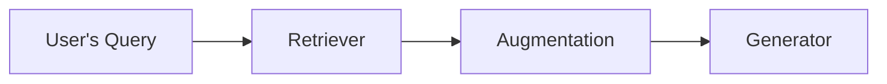
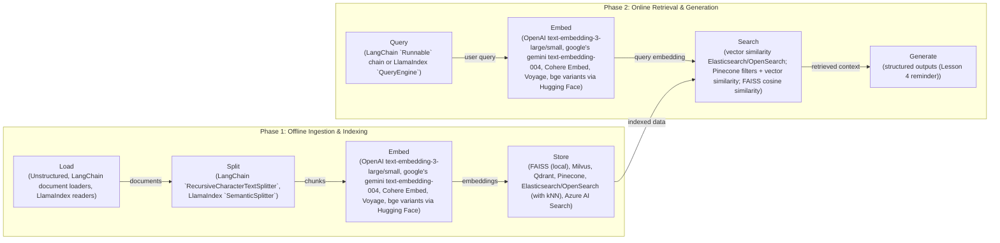
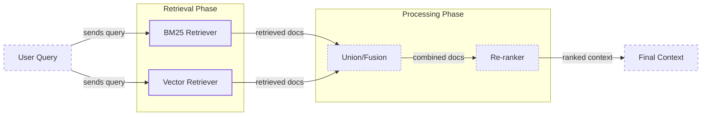
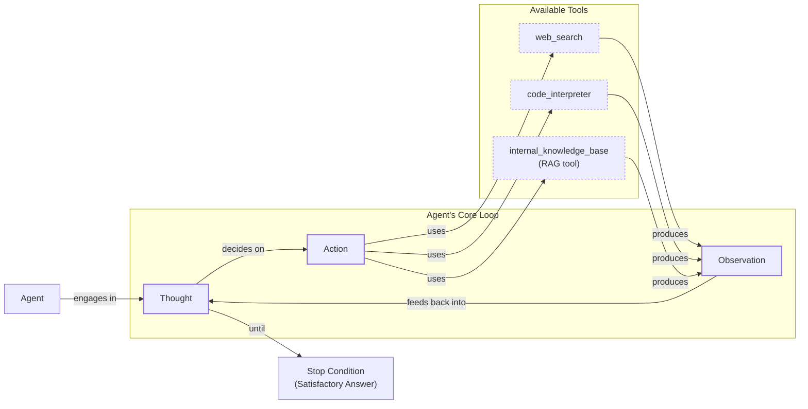

# Lesson 9: Retrieval-Augmented Generation

In our previous lessons, we built a solid foundation in AI Engineering. We explored the agent landscape, distinguished between LLM workflows and agents, and covered context engineering, the art of managing information flow to an LLM. We also gave our agents the ability to reason and act using tools. Now, we will tackle a fundamental problem: an LLM’s knowledge is frozen in time.

LLMs are trained on massive, but fixed, datasets. This process is like taking a "closed-book exam" on the world's information. Once training is complete, the model's internal, or parameterized, knowledge becomes static. It cannot learn new facts or access real-time information on its own. While fine-tuning can update a model's weights, it is slow, expensive, and not a practical way to keep up with constantly changing data. This limitation leads to two major problems: knowledge cutoffs and hallucinations. The model might not know about recent events or, worse, confidently invent plausible but incorrect answers. For example, asking a model with a 2022 knowledge cutoff about the 2024 NBA MVP will result in a polite refusal or a fabricated answer [[1]](https://neo4j.com/blog/developer/fine-tuning-vs-rag/). This unreliability can have serious consequences, as seen when a lawyer used ChatGPT in federal court and cited non-existent legal cases generated by the model [[2]](https://www.infoworld.com/article/2335043/addressing-ai-hallucinations-with-retrieval-augmented-generation.html).

Retrieval-Augmented Generation (RAG) is a reliable solution to this problem. Instead of trying to force new knowledge into the model's weights, we give it an "open-book exam." RAG connects the LLM to external, up-to-date knowledge sources at the moment it needs to answer a question. Much like how we use cheat sheets or manuals, RAG allows an LLM to look up relevant information and use it to construct an accurate, grounded response. This approach is more flexible and cost-effective than retraining, transforming the challenge from model maintenance to database maintenance [[1]](https://neo4j.com/blog/developer/fine-tuning-vs-rag/). Empirical studies have shown that for knowledge-intensive tasks, RAG consistently outperforms unsupervised fine-tuning, especially when injecting new facts into a model [[3]](https://aclanthology.org/2024.emnlp-main.15.pdf).

As we covered in Lesson 3 on Context Engineering, curating the information an LLM sees is essential for building effective applications. RAG is a core technique in this process. It is the mechanism that retrieves specific, relevant data to be engineered into the final context. This external knowledge is a key part of an agent's ability to reason about the world. In the next lesson, we will explore how agent memory complements RAG by storing information from past interactions, creating a more persistent and personalized experience. For now, we will focus on retrieval from external knowledge bases.

This lesson will guide you through the fundamentals of RAG, from its basic components to the advanced and agentic patterns that power modern AI systems. You will learn the "what" and "how" of building pipelines that ground LLMs in verifiable facts, turning them into trustworthy and knowledgeable assistants. With the problem and motivation clear, we will first decompose RAG into its core components so you can see where each responsibility lives.

## The RAG System: Core Components

Understanding the core components of a RAG system is the first step in the context engineering process of designing effective retrieval pipelines. At a high level, RAG can be broken down into three conceptual pillars: Retrieval, Augmentation, and Generation. Each plays a distinct role in transforming a user's query into a factually grounded answer.

Image 1: A flowchart illustrating the core conceptual pillars of a RAG system: Retrieval, Augmentation, and Generation.

**Retrieval** is the engine responsible for finding relevant information from an external knowledge base. When a user asks a question, the retriever’s job is to search through vast amounts of data, like company documents, articles, or a database. It then pulls out the specific pieces of information that are most likely to help answer the query. The most common approach for this is semantic similarity search, which goes beyond simple keyword matching.

This process relies on vector embeddings. An embedding is a numerical representation of a piece of text, capturing its semantic meaning. An embedding model, such as one based on the BERT architecture, transforms text chunks into these high-dimensional vectors [[4]](https://qdrant.tech/articles/what-is-rag-in-ai/). These vectors are then stored in a specialized database called a vector database. When a user query comes in, it is also converted into a vector using the same model. The retriever then searches the vector database to find the text chunks whose embeddings are mathematically closest to the query's embedding, indicating a strong semantic match [[5]](https://medium.com/@robi.tomar72/how-rag-actually-works-embeddings-vector-databases-indexing-retrieval-explained-simply-3d1ca45fe1bf). This is often measured using distance metrics like cosine similarity [[6]](https://towardsdatascience.com/rag-explained-understanding-embeddings-similarity-and-retrieval/).

**Augmentation** is the process of preparing the retrieved information to be used by the LLM. Once the retriever has identified the most relevant text chunks, this step involves taking that information and formatting it into the prompt that will be sent to the LLM. The augmented prompt typically includes the original user query along with the retrieved content, which serves as the context. This step is important because it directly provides the LLM with the external knowledge it needs to formulate its answer. A well-structured prompt might use a template to clearly separate the user's question from the retrieved documents, instructing the model on how to use the context [[7]](https://www.topquadrant.com/resources/blog-retrieval-augmented-generation-explained/).

**Generation** is the final step where the LLM produces the answer. The model receives the augmented prompt, which contains both the user’s question and the contextual information retrieved from the knowledge base. Using this combined input, the LLM generates a response that is grounded in the provided data. This ensures the answer is not only relevant and coherent but also factually accurate and verifiable, as it is based on specific, retrieved sources rather than just the model's pre-trained knowledge [[8]](https://www.ibm.com/think/topics/retrieval-augmented-generation).

Now that you can name each moving part, let’s see how they line up across the two phases of a real system.

## The RAG Pipeline: Ingestion and Retrieval

An end-to-end RAG workflow is split into two distinct phases: an offline ingestion pipeline that prepares the knowledge base, and an online retrieval pipeline that answers user queries in real-time. Understanding this separation is key to building and maintaining an efficient RAG system.

Image 2: A detailed flowchart illustrating the end-to-end RAG workflow, clearly separating it into two distinct phases: "Phase 1: Offline Ingestion & Indexing" and "Phase 2: Online Retrieval & Generation".

### Phase 1: Offline Ingestion & Indexing

The ingestion phase is an offline process where you prepare your external data to be searchable [[9]](https://newsletter.systemdesign.one/p/how-rag-works). This pipeline runs whenever new data is available or when existing data is updated, ensuring the knowledge base remains current. It consists of four main steps:

1.  **Load:** The first step is to load your documents from their various sources. These can be PDFs, web pages, database records, APIs, or any other form of unstructured or semi-structured data. Tools like LangChain’s document loaders or LlamaIndex’s readers are commonly used to handle different file formats and data sources, abstracting away the complexity of data extraction.
2.  **Split:** Since LLMs have a limited context window, large documents must be broken down into smaller, manageable pieces called chunks. The chunking strategy is essential for retrieval quality. A simple approach is to split text by a fixed number of characters, but more advanced methods like semantic chunking aim to keep related ideas together by splitting along paragraphs or sections. This prevents cutting off important context mid-sentence and ensures that each chunk is a coherent unit of information [[5]](https://medium.com/@robi.tomar72/how-rag-actually-works-embeddings-vector-databases-indexing-retrieval-explained-simply-3d1ca45fe1bf).
3.  **Embed:** Each chunk of text is then converted into a numerical vector using an embedding model. This vector captures the semantic meaning of the text, allowing for comparisons based on concepts rather than just keywords. Popular embedding models include OpenAI’s `text-embedding-3` series, Google's Gemini models, and various open-source models available through platforms like Hugging Face. The choice of model can significantly impact the quality of your semantic search.
4.  **Store:** Finally, the generated embeddings and their corresponding text chunks are stored in a vector database. This specialized database is optimized for efficient similarity search. It indexes the vectors, allowing for fast retrieval of the chunks that are most semantically similar to a given query vector. Examples of vector databases include FAISS for local development, and scalable solutions like Qdrant, Pinecone, or Milvus [[10]](https://tutorialsdojo.com/aws-vector-databases-explained-semantic-search-and-rag-systems/). Metadata, such as document source or creation date, is also stored alongside the chunks to enable filtering during retrieval.

### Phase 2: Online Retrieval & Generation

The online phase happens in real-time when a user interacts with the system. This pipeline is responsible for understanding the user's query, finding relevant information, and generating a grounded response [[11]](https://medium.com/@derrickryangiggs/rag-pipeline-deep-dive-ingestion-chunking-embedding-and-vector-search-abd3c8bfc177).

1.  **Query:** The process begins when a user submits a query. This query can be a question, a command, or any natural language input. In some systems, this step might also involve pre-processing the query, such as expanding acronyms or correcting typos, to improve retrieval accuracy. Frameworks like LangChain and LlamaIndex provide abstractions like `Runnable` chains and `QueryEngine` to manage this process.
2.  **Embed:** The user's query is converted into a vector using the *same* embedding model that was used during the ingestion phase. This is essential to ensure that the query and the document chunks are represented in the same vector space, making the similarity comparison meaningful [[4]](https://qdrant.tech/articles/what-is-rag-in-ai/).
3.  **Search:** The query vector is used to search the vector database. The database performs a similarity search (often using cosine similarity) to find the top-k document chunks whose embeddings are closest to the query vector. These top-k chunks are considered the most relevant context for answering the user's question.
4.  **Generate:** The retrieved chunks are combined with the original user query and a set of instructions into a single prompt. This augmented prompt is then passed to an LLM. The LLM synthesizes the information from the retrieved context to generate a final, coherent answer. As we learned in Lesson 4, using structured outputs at this stage can help ensure the response is consistently formatted and includes citations back to the source documents, enhancing verifiability.

With the end-to-end path in place, the next question is quality: what are the advanced techniques to make the retrieval more accurate and useful across messy, real-world data?

## Advanced RAG Techniques

While a basic RAG pipeline is effective, production-grade applications often require more sophisticated techniques to handle the complexities of real-world data and user queries. These advanced methods focus on improving the quality and relevance of the retrieved context, which directly impacts the accuracy of the final answer.

Image 3: A flowchart illustrating the hybrid retrieval flow, combining keyword-based search (BM25) and dense vector search, with parallel processing, fusion, and re-ranking steps.

### Hybrid Search

Vector search is excellent at understanding semantic meaning, but it can sometimes miss exact keywords, acronyms, or specific identifiers. Hybrid search addresses this by combining dense vector retrieval with a sparse retrieval method like BM25, which is a traditional keyword-based search algorithm [[12]](https://mlpills.substack.com/p/issue-76-optimize-rag-with-hybrid). For example, in a customer support scenario, a user might ask, "my bill keeps rolling over." A keyword search would find articles containing "rollover," while a semantic search might also surface documents about "carryover balance." By running both searches in parallel and fusing the results using a method like Reciprocal Rank Fusion (RRF), you capture different wordings of the same issue, improving overall recall and relevance [[13]](https://cubitrek.com/blog/hybrid-search-optimization-how-bm25-and-dense-vector-retrieval-work-together-for-superior-ai-search/).

### Re-ranking

The initial retrieval step is optimized for speed and recall, meaning it aims to quickly find a broad set of potentially relevant documents. However, the most relevant document might not always be at the top of this initial list. Re-ranking introduces a second, more precise scoring step to re-order these candidates. A common approach is to use a cross-encoder model, which takes the query and a candidate document together as a single input and outputs a relevance score [[14]](https://apxml.com/courses/optimizing-rag-for-production/chapter-2-advanced-retrieval-optimization/reranking-architectures-rag). This allows for a deeper interaction between the query and document tokens than the initial retrieval. For a product help query like "how to connect my account," a re-ranker can push the official step-by-step setup guide to the top, above a less relevant press release or community forum thread that also mentions the keywords [[15]](https://redis.io/blog/10-techniques-to-improve-rag-accuracy/).

### Query Transformations

Sometimes, the user's original query is not the best one for retrieval. Query transformation techniques modify or expand the query to improve its chances of matching relevant documents.

-   **Decomposition:** This involves breaking down a complex, multi-part question into several simpler sub-queries. For instance, "What’s our travel policy for conferences in Europe this year?" can be split into: (1) "Where is the travel policy?", (2) "What are the rules for conferences?", (3) "Are there specific rules for Europe?", and (4) "What changed this year?". The system retrieves documents for each sub-query and then synthesizes the results [[16]](https://docs.nvidia.com/rag/latest/query_decomposition.html).
-   **Hypothetical Document Embeddings (HyDE):** This technique addresses the fact that user queries are often phrased differently from the documents that contain the answers. With HyDE, an LLM first generates a hypothetical, ideal answer to the user's query. For example, it might draft a short paragraph like: “Employees attending approved conferences in Europe can book economy flights and up to three hotel nights with daily meal limits.” Then, an embedding of this *hypothetical answer* is used for the vector search, as it is more likely to be semantically similar to the actual policy documents [[17]](https://47billion.com/blog/rag-system-in-production-why-it-fails-and-how-to-fix-it/).

### Advanced Chunking Strategies

How you split your documents can have a huge impact on retrieval quality. Moving beyond simple fixed-size chunks can preserve important context.

-   **Semantic Chunking:** Instead of splitting a 20-page handbook every 500 words, which might cut the "Reimbursements" section in half, semantic chunking groups related paragraphs. This ensures the entire section, including spending caps and exceptions, is retrieved as a single, coherent unit [[18]](https://cloudurable.com/blog/advanced-rag-techniques-that-will-transform-your-l/).
-   **Layout-Aware Chunking:** For documents with complex structures like PDFs with tables, this method preserves the layout. For a pricing table, it keeps each row (product, price, discount) together, preventing the model from receiving isolated numbers without their labels.
-   **Context-Enriched Chunking:** This technique, also known as contextual retrieval, uses an LLM to generate a short, explanatory context for each chunk before embedding it. This prepended context helps create a more accurate vector representation, improving retrieval for chunks that lack context on their own.

### GraphRAG

For questions about complex relationships, standard document retrieval can fall short. GraphRAG addresses this by first constructing a knowledge graph where entities (like people or products) are nodes and their relationships are edges [[19]](https://arxiv.org/html/2601.03014v1). This excels at multi-hop queries that require connecting information across different documents. For a retail query like, “Which shoes get the most size-related returns and were featured in last month’s ads?”, the system can traverse the graph to connect returns data to sizing reasons, then to specific product SKUs, and finally to the marketing calendar. Similarly, for an IT operations query like, “Which incidents were caused by weekend deploys that also touched the login service?”, it can link change records to deploy times, affected services, and finally to incident tickets, surfacing the relevant post-mortems [[20]](https://arxiv.org/html/2501.00309v2).

These techniques increase retrieval quality. Next, we’ll see how retrieval becomes one tool that an agent can choose to use as it reasons.

## Agentic RAG

In Lessons 7 and 8, we explored the ReAct framework, where an agent cycles through a loop of Thought, Action, and Observation to solve problems. Agentic RAG is the practical application of this concept, where retrieval is not a fixed step in a pipeline but a dynamic tool that a reasoning agent can choose to use.

Image 4: A conceptual flowchart illustrating an agent's main loop, emphasizing its ability to reason and choose between various tools.

The core distinction between standard and agentic RAG lies in their control flow. Standard RAG is a linear, predetermined workflow: Retrieve → Augment → Generate. It is effective but rigid. In contrast, Agentic RAG is adaptive and iterative. The agent decides *when* to retrieve, *what* to retrieve, and whether one retrieval is enough [[19]](https://towardsdatascience.com/agentic-rag-vs-classic-rag-from-a-pipeline-to-a-control-loop/). It is important to note that agents typically use many tools. Labeling a whole system "agentic RAG" can be too narrow, as the retrieval tool is just one of several capabilities.

This agentic approach unlocks several advanced capabilities:

-   **Iterative Retrieval:** An agent can use the RAG tool multiple times. For example, if an initial search for a policy yields a vague result, the agent can narrow the scope with a refined query like “EU customers, 2024 updates,” retrieve again, and reconcile the differences.
-   **Dynamic Tool Use:** An agent can choose which knowledge source to search. For an outage inquiry, it might select `search_incident_runbooks` over `search_marketing_pages`. It can also fuse information from the RAG tool with data from other tools, like a web search, to form a comprehensive answer.
-   **Autonomous Validation:** The agent can assess the quality of retrieved information. If the context is insufficient, it can decide to perform another retrieval or ask the user a clarifying question. It can even decide to update the RAG system's knowledge base with new information it learns, a topic we will explore in Lesson 10 on Memory.

For example, if an agent is asked about "2024 EU data retention rules," its thought process might begin by recognizing its internal policy is from 2023 and likely outdated. It would then form an action to retrieve the internal policy, observe that it's missing citations, and reason that external verification is needed. This leads to a new action, a web search for the official 2024 directive. After observing the new information, its final thought would be to synthesize both sources, highlighting the changes. This iterative process transforms RAG from a simple database lookup into a dynamic conversation with a knowledgeable research assistant.

You now understand both a linear RAG pipeline and how an agent can control retrieval when needed. Let’s wrap up by situating RAG in the wider AI Engineering toolkit and previewing what comes next.

## Conclusion

We have journeyed from the basic principles of RAG to its advanced and agentic forms. The key takeaway is that RAG is the most widely adopted solution to the LLM knowledge problem. It addresses limitations like knowledge cutoffs and hallucinations, enabling the creation of trustworthy AI systems grounded in verifiable data. For production-grade quality, advanced techniques like hybrid search and re-ranking are essential, and the future of complex information retrieval is undeniably agentic.

By grounding LLM responses in external data, RAG builds user trust and allows for customization with proprietary information. It is not just a niche technique but a foundational competency for any AI Engineer. As a core part of Context Engineering, mastering RAG is a key step toward building intelligent, reliable, and useful AI applications.

In our next lesson, we will explore Memory for Agents. You will learn how short-term and long-term memory systems complement RAG, allowing agents to remember past interactions and build a persistent understanding of their environment. We will also touch upon other important topics later in the course, such as evaluating retrieval quality and monitoring these complex systems in production, to provide a complete picture of building and maintaining robust AI solutions.

## References

- [1] Knowledge Graphs and LLMs: Fine-Tuning vs. Retrieval-Augmented Generation. (https://neo4j.com/blog/developer/fine-tuning-vs-rag/)
- [2] Addressing AI hallucinations with retrieval-augmented generation. (https://www.infoworld.com/article/2335043/addressing-ai-hallucinations-with-retrieval-augmented-generation.html)
- [3] Fine-Tuning or Retrieval? Comparing Knowledge Injection in LLMs. (https://aclanthology.org/2024.emnlp-main.15.pdf)
- [4] What is RAG: Understanding Retrieval-Augmented Generation. (https://qdrant.tech/articles/what-is-rag-in-ai/)
- [5] How RAG Actually Works: Embeddings, Vector Databases, Indexing & Retrieval Explained Simply. (https://medium.com/@robi.tomar72/how-rag-actually-works-embeddings-vector-databases-indexing-retrieval-explained-simply-3d1ca45fe1bf)
- [6] RAG Explained: Understanding Embeddings, Similarity, and Retrieval. (https://towardsdatascience.com/rag-explained-understanding-embeddings-similarity-and-retrieval/)
- [7] Retrieval-Augmented Generation (RAG) Explained. (https://www.topquadrant.com/resources/blog-retrieval-augmented-generation-explained/)
- [8] What is retrieval-augmented generation?. (https://www.ibm.com/think/topics/retrieval-augmented-generation)
- [9] How RAG Works. (https://newsletter.systemdesign.one/p/how-rag-works)
- [10] AWS Vector Databases Explained: Semantic Search and RAG Systems. (https://tutorialsdojo.com/aws-vector-databases-explained-semantic-search-and-rag-systems/)
- [11] RAG Pipeline Deep Dive: Ingestion (Chunking, Embedding) and Vector Search. (https://medium.com/@derrickryangiggs/rag-pipeline-deep-dive-ingestion-chunking-embedding-and-vector-search-abd3c8bfc177)
- [12] Issue 76: Optimize RAG with Hybrid Search. (https://mlpills.substack.com/p/issue-76-optimize-rag-with-hybrid)
- [13] Hybrid Search Optimization: How BM25 and Dense Vector Retrieval Work Together for Superior AI Search. (https://cubitrek.com/blog/hybrid-search-optimization-how-bm25-and-dense-vector-retrieval-work-together-for-superior-ai-search/)
- [14] Reranking Architectures in RAG. (https://apxml.com/courses/optimizing-rag-for-production/chapter-2-advanced-retrieval-optimization/reranking-architectures-rag)
- [15] 10 techniques to improve RAG accuracy. (https://redis.io/blog/10-techniques-to-improve-rag-accuracy/)
- [16] Query Decomposition. (https://docs.nvidia.com/rag/latest/query_decomposition.html)
- [17] RAG System in Production: Why It Fails and How to Fix It. (https://47billion.com/blog/rag-system-in-production-why-it-fails-and-how-to-fix-it/)
- [18] Advanced RAG Techniques That Will Transform Your LLM Applications. (https://cloudurable.com/blog/advanced-rag-techniques-that-will-transform-your-l/)
- [19] From Local to Global: A GraphRAG Approach to Query-Focused Summarization. (https://arxiv.org/html/2404.16130)
- [20] Graph-based Retrieval for Retrieval-Augmented Generation. (https://arxiv.org/html/2501.00309v2)
- [21] Agentic RAG vs Classic RAG: From a Pipeline to a Control Loop. (https://towardsdatascience.com/agentic-rag-vs-classic-rag-from-a-pipeline-to-a-control-loop/)
- [22] Agentic RAG vs Traditional RAG. (https://medium.com/@gaddam.rahul.kumar/agentic-rag-vs-traditional-rag-b1a156f72167)
</article>