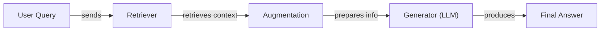
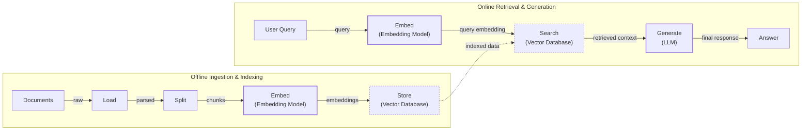
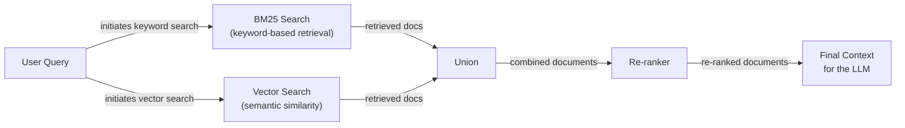
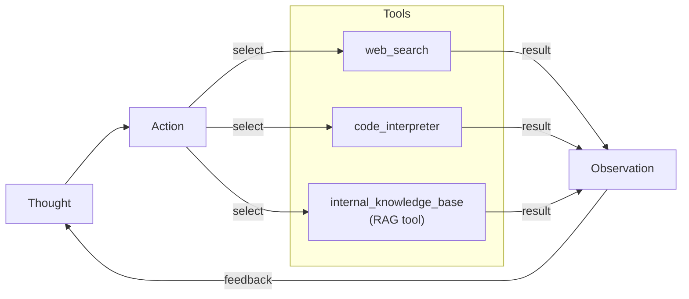

# Retrieval-Augmented Generation: The RAG Revolution

In our previous lessons, we have explored the landscape of AI Engineering, from distinguishing between LLM workflows and autonomous agents to mastering context engineering. We learned that context engineering is the art of managing the flow of information to an LLM, ensuring it has precisely what it needs to perform a task. Now, we will explore one of the most critical techniques in an AI Engineer's toolkit: Retrieval-Augmented Generation.

A core problem with LLMs is that their knowledge is frozen in time. They are trained on a fixed dataset, which means they are essentially taking a "closed-book exam" on the world's information as it existed up to their knowledge cutoff date. This static knowledge makes them unaware of any events that occurred after their training and unable to access private or domain-specific information [[57]](https://neo4j.com/blog/developer/fine-tuning-vs-rag/). We do not yet have efficient techniques to enable models to continuously learn new information after deployment by updating their internal weights.

While fine-tuning is an option, it is often costly, slow, and impractical for keeping a model's knowledge current [[57]](https://neo4j.com/blog/developer/fine-tuning-vs-rag/). Fine-tuning adapts a model's internal knowledge by continuing the training process on a smaller, task-specific dataset. It is like cramming for an exam on a particular subject. While this can improve performance in a narrow domain, it does not solve the fundamental knowledge cutoff problem; it only pushes the date forward. Furthermore, research shows that LLMs struggle to learn new facts through fine-tuning alone, and it remains a less reliable method for knowledge injection compared to RAG [[4]](https://aclanthology.org/2024.emnlp-main.15.pdf).

This is where Retrieval-Augmented Generation (RAG) provides a reliable and elegant solution. Instead of trying to change the model itself, we change the data it sees. With RAG, we give the LLM an "open-book exam" by connecting it to external, real-time knowledge sources. Just as humans do not need to memorize everything and can rely on manuals, notes, or search engines, LLMs can use RAG to access information on demand. This approach directly addresses two of the biggest limitations of LLMs: their static knowledge and their tendency to hallucinate, or invent facts, when they do not know an answer [[1]](https://blogs.nvidia.com/blog/what-is-retrieval-augmented-generation/). The risk of hallucination is not trivial; there are real-world cases where professionals have mistakenly relied on fabricated information from LLMs, leading to serious consequences [[2]](https://www.forbes.com/sites/mattnovak/2023/05/27/lawyer-uses-chatgpt-in-federal-court-and-it-goes-horribly-wrong/).

RAG is a fundamental method within the broader discipline of context engineering we covered in Lesson 3. It is the mechanism by which we retrieve specific, relevant information from a vast sea of data to include in the LLM's context. This is distinct from an agent's memory, which we will explore in Lesson 10. Memory deals with recalling past interactions and learned preferences, while RAG focuses on retrieving factual knowledge from external documents.

In this lesson, we will build a complete understanding of RAG, from its basic components to the advanced, agentic patterns that power modern AI systems. We will start by breaking down what RAG is and how its core pieces work together. Then, we will walk through the end-to-end pipeline, explore advanced techniques for improving its accuracy, and finally, see how RAG evolves from a static process into a dynamic tool used by intelligent agents.

## The RAG System: Core Components

To design effective RAG systems, you first need to understand their fundamental building blocks. This is a core part of the context engineering process we introduced in Lesson 3. At its heart, a RAG system is composed of three conceptual pillars: Retrieval, Augmentation, and Generation. Each plays a distinct role in transforming a user's query into a grounded, accurate answer.

**Retrieval** is the engine of the RAG system, responsible for finding relevant information from an external knowledge base. The most common approach relies on semantic similarity search. This process begins by converting documents into numerical representations called vector embeddings, which capture the semantic meaning of the text. An embedding model transforms text into a high-dimensional vector where words and phrases with similar meanings are located close to each other in the vector space. These embeddings are then stored in a specialized vector database [[7]](https://tutorialsdojo.com/aws-vector-databases-explained-semantic-search-and-rag-systems/). When a user asks a question, the query is also converted into an embedding. The system then searches the database for document chunks with the closest embeddings, effectively finding text that is semantically similar in meaning, not just in keywords [[51]](https://apxml.com/courses/prompt-engineering-llm-application-development/chapter-6-integrating-llms-external-data-rag/implementing-semantic-search-retrieval), [[52]](https://medium.com/@robi.tomar72/how-rag-actually-works-embeddings-vector-databases-indexing-retrieval-explained-simply-3d1ca45fe1bf). This can be supplemented with traditional keyword-based search methods like BM25 to ensure that exact terms or identifiers are not missed.

**Augmentation** is the bridge between retrieval and generation. Once the most relevant document chunks are retrieved, they are combined with the original user query to form an augmented prompt. This step is essential for providing the LLM with the necessary context to answer the question accurately. The process involves carefully structuring the prompt with a template that instructs the model to use the provided information as its primary source of truth. A typical instruction might be, "Using the context above, answer the question. If the context does not contain the answer, say so." This helps ground the final response in facts and reduce the likelihood of hallucination [[56]](https://www.topquadrant.com/resources/blog-retrieval-augmented-generation-explained/). This is a practical application of prompt engineering, ensuring the model gives appropriate weight to the retrieved context.

**Generation** is the final step, where the LLM uses the augmented prompt to produce a coherent, human-readable answer. The model synthesizes the information from the retrieved context to address the user's query. Instead of relying solely on its internal, pre-trained knowledge, the LLM acts as a reasoning engine, formulating a response that is directly supported by the external data provided [[29]](https://www.ibm.com/think/topics/retrieval-augmented-generation). It is not just repeating information but combining different retrieved pieces into a cohesive narrative. This ensures the answer is not only relevant but also verifiable, as the system can cite the sources it used. This ability to provide citations builds user trust and allows for easy fact-checking, a feature of great importance for enterprise applications.

Image 1: A flowchart illustrating the core components of a RAG system.

Understanding these three components is the first step toward building and optimizing RAG systems. Now that you can name each moving part, let’s see how they line up across the two phases of a real system.

## The RAG Pipeline: Ingestion and Retrieval

A complete RAG system operates in two distinct phases: an offline ingestion pipeline that prepares the knowledge base, and an online retrieval pipeline that answers user queries in real-time. This separation allows the computationally intensive work of processing documents to happen once, upfront, making the live query process fast and efficient [[32]](https://newsletter.systemdesign.one/p/how-rag-works).

### Phase 1: Offline Ingestion & Indexing

The goal of the ingestion phase is to convert your raw documents into a searchable index. This is a batch or streaming process that runs in the background to keep your knowledge base up-to-date. It involves four key steps:

1.  **Load:** The pipeline begins by loading documents from various sources. These can be anything from PDFs and web pages to data from APIs, databases, or even Slack channels. Frameworks like LangChain and LlamaIndex offer a wide range of document loaders that can parse different file formats, from simple text files to complex PDFs with tables and images [[33]](https://towardsdatascience.com/ragops-guide-building-and-scaling-retrieval-augmented-generation-systems-3d26b3ebd627/).

2.  **Split:** Since LLMs have a limited context window, large documents must be broken down into smaller, manageable pieces called chunks. The chunking strategy is important for retrieval quality. Simple fixed-size splitting can work, but it risks cutting sentences or ideas in half. More advanced methods like semantic chunking aim to keep related ideas together by splitting along paragraphs or sections. For example, LangChain's `RecursiveCharacterTextSplitter` attempts to split text based on a hierarchy of separators (like newlines and spaces) to keep semantically related parts together. Adding a small overlap between chunks is a common technique to ensure that context is not lost at the boundaries.

3.  **Embed:** Each chunk of text is then passed through an embedding model. This model, such as OpenAI's `text-embedding-3-large` or open-source alternatives like BGE variants from Hugging Face, converts the text into a high-dimensional vector that captures its semantic meaning. This numerical representation is what enables the system to find contextually similar information, even if the wording is different [[8]](https://qdrant.tech/articles/what-is-rag-in-ai/). The choice of embedding model can significantly impact retrieval performance, and different models are optimized for different types of content.

4.  **Store:** Finally, the generated embeddings and their corresponding text chunks are loaded into a vector database. This database, whether a local solution like FAISS or a managed service like Qdrant or Pinecone, is optimized for efficient similarity search. It indexes the vectors in a way that allows it to quickly find the vectors most similar to a given query vector, forming the backbone of the retrieval process. It is also a best practice to store metadata alongside each chunk, such as the source document, creation date, or topic, which can be used for filtering during retrieval.

### Phase 2: Online Retrieval & Generation

This phase happens in real-time when a user interacts with the system. It is designed to be fast and responsive.

1.  **Query:** The process starts when a user submits a query. This query is the input to the retrieval system. In more advanced systems, the query might be pre-processed or expanded to improve retrieval accuracy.

2.  **Embed:** The user's query is converted into a vector using the *same* embedding model that was used during the ingestion phase. This is essential to ensure that the query and the document chunks are represented in the same vector space, making their comparison meaningful.

3.  **Search:** The system uses the query vector to search the vector database. It performs a similarity search (e.g., cosine similarity) to find the top-k document chunks whose embeddings are closest to the query embedding. These "k" chunks are considered the most relevant context for answering the user's question.

4.  **Generate:** The retrieved chunks are combined with the original query and a set of instructions into a single prompt. This augmented prompt is then sent to an LLM. The LLM synthesizes the information in the prompt to generate a final, grounded answer. As we learned in Lesson 4, using structured outputs can help format this answer and include citations, linking the response back to the source documents for verifiability.

Image 2: A detailed flowchart depicting the two distinct phases of a RAG pipeline: Offline Ingestion & Indexing and Online Retrieval & Generation.

With the end-to-end path in place, the next question is quality. What are the advanced techniques to make retrieval more accurate and useful across messy, real-world data?

## Advanced RAG Techniques

A naive RAG pipeline is a great starting point, but production systems often require more sophisticated techniques to handle the complexities of real-world data and user queries. These advanced methods focus on improving the quality and relevance of the retrieved context, which directly translates to more accurate and reliable answers.

### Hybrid Search

Vector search is powerful for understanding semantic meaning, but it can sometimes miss specific keywords, acronyms, or identifiers. Hybrid search solves this by combining semantic vector search with traditional keyword-based search, like BM25. BM25 is a ranking algorithm based on term frequency-inverse document frequency (TF-IDF), which excels at finding exact matches by scoring documents based on the presence and frequency of query terms. This dual approach ensures you get the best of both worlds: the precision of keyword matching and the contextual understanding of semantic search [[38]](https://mlpills.substack.com/p/issue-76-optimize-rag-with-hybrid).

For example, in a customer support scenario, a user might ask, “My bill keeps rolling over.” A keyword search would find documents containing the exact term "rollover." A semantic search might also find articles about "carryover balance." Hybrid search combines both sets of results, often using a technique like Reciprocal Rank Fusion (RRF) to merge the ranked lists, providing a more comprehensive context that covers different ways of describing the same issue. This synergy transforms retrieval into a more context-aware tool, significantly enhancing performance in domains where specific terminology is key.

### Re-ranking

The initial retrieval step is optimized for speed and recall, meaning it aims to quickly find a broad set of potentially relevant documents. However, the best document might not always be at the top of this initial list. Re-ranking introduces a second, more precise scoring step. A re-ranker model, often a cross-encoder, takes the user query and each retrieved document as a pair and calculates a more accurate relevance score [[43]](https://apxml.com/courses/optimizing-rag-for-production/chapter-2-advanced-retrieval-optimization/reranking-architectures-rag). While the initial retrieval uses bi-encoders that create separate embeddings for the query and documents, cross-encoders process them together, allowing for deeper interaction between their tokens and thus a more nuanced relevance judgment.

This is computationally more expensive than the initial retrieval, which is why it is applied only to a smaller set of top-k results (e.g., the top 50 candidates). For instance, when a user asks, “How do I connect my account?” the initial retrieval might pull up a press release and a community forum thread along with the official setup guide. A re-ranker would analyze these results and push the step-by-step guide to the top, ensuring the LLM receives the most useful document first.

Image 3: A flowchart illustrating the hybrid retrieval process, from user query to final context for an LLM.

### Query Transformations

Sometimes, the user's query is not in the ideal format for retrieval. Query transformation techniques rewrite or expand the query to improve its chances of matching the right documents.

-   **Decomposition:** This technique breaks down a complex, multi-part question into several simpler sub-questions. The system then retrieves documents for each sub-question and merges the results. For example, the query “What’s our travel policy for conferences in Europe this year?” could be decomposed into: (1) “What is the travel policy?”, (2) “What are the rules for conferences?”, and (3) “Are there specific rules for Europe in 2024?” [[19]](https://docs.nvidia.com/rag/latest/query_decomposition.html). This allows the retrieval system to find focused information for each aspect of the query.

-   **Hypothetical Document Embeddings (HyDE):** This approach involves using an LLM to generate a hypothetical, ideal answer to the user's query *before* the retrieval step. This generated answer is then converted to an embedding and used for the similarity search. The idea is that an answer-like document is more likely to be semantically similar to the actual answer documents in the knowledge base [[16]](https://47billion.com/blog/rag-system-in-production-why-it-fails-and-how-to-fix-it/). For an employee policy question, the system might first generate a draft answer like, "Employees attending approved conferences in Europe can book economy flights and up to three hotel nights with daily meal limits," and then search for documents that match this statement.

### Advanced Chunking Strategies

How you split your documents can have a huge impact on retrieval quality. Moving beyond simple fixed-size chunks can preserve the context and structure of your information.

-   **Semantic Chunking:** Instead of splitting a document every 500 words, semantic chunking splits text based on topical boundaries, such as paragraphs or sections. This ensures that a complete idea, like a policy's "Reimbursements" section, remains in a single chunk, preventing important information from being split across two different retrieved pieces [[18]](https://cloudurable.com/blog/advanced-rag-techniques-that-will-transform-your-l/).

-   **Layout-Aware Chunking:** For documents with complex structures like tables or forms, layout-aware chunking preserves the relationship between different elements. For example, in a pricing table, it is important to keep each row intact (e.g., product, price, and discount) rather than splitting the table arbitrarily and separating numbers from their labels. This is vital for accurately answering questions about structured data within documents.

### GraphRAG

For questions about complex relationships and interconnected data, standard document retrieval can fall short. GraphRAG addresses this by first constructing a knowledge graph from the documents, where entities (like people, products, or companies) are nodes and their relationships are edges. This structured representation allows the system to answer multi-hop questions that require reasoning across multiple connections [[46]](https://arxiv.org/html/2601.03014v1). The process involves using an LLM to extract entities and relationships, building the graph, and then using graph traversal algorithms or community detection to find relevant, interconnected context. This approach excels at understanding the "how" and "why" between data points.

For example, a retail company might ask, “Which shoes get the most size-related returns and were featured in last month’s ads?” A GraphRAG system can traverse the knowledge graph from "returns" to "sizing issues," to specific shoe SKUs, and then connect those SKUs to the "marketing campaigns" from the previous month, gathering all the necessary context along the way. This is far more powerful than trying to find a single document chunk that happens to mention all these elements together. Similarly, in IT operations, a query like "Which incidents were caused by weekend deploys that also touched the login service?" can be answered by linking change records, deployment times, affected services, and incident tickets.

These techniques increase retrieval quality. Next, we’ll see how retrieval becomes one tool that an agent can choose to use as it reasons.

## Agentic RAG

In Lessons 7 and 8, we explored the ReAct framework, where an agent cycles through a loop of Thought, Action, and Observation to solve problems. Agentic RAG is the application of this principle, where retrieval is no longer a fixed step in a pipeline but a dynamic tool that an agent can choose to use. The agent reasons about its knowledge gaps and decides when and how to query its knowledge base.

It is important to clarify that while we call this "Agentic RAG," the retrieval mechanism is just one of many tools an agent might possess. A sophisticated agent could also have tools for web search, code execution, or database queries. The "agentic" part is the autonomous decision-making loop that orchestrates these tools [[13]](https://medium.com/@gaddam.rahul.kumar/agentic-rag-vs-traditional-rag-b1a156f72167).

The core distinction between standard and agentic RAG lies in their structure:
-   **Standard RAG** follows a linear, predetermined workflow: Retrieve → Augment → Generate. It is powerful but rigid, executing the same sequence for every query.
-   **Agentic RAG** is adaptive and iterative. An agent decides *if* retrieval is needed, *what* to retrieve, from *which* source, and whether to perform multiple rounds of retrieval and reasoning to construct an answer [[11]](https://towardsdatascience.com/agentic-rag-vs-classic-rag-from-a-pipeline-to-a-control-loop/).

This agentic approach unlocks several advanced capabilities. The agent can iteratively refine its search. If an initial query returns a vague policy document, the agent can generate a new, more specific query, such as “Find the section on EU customers and 2024 updates,” and retrieve again. It can also choose the most appropriate knowledge source, deciding to `search_tech_docs` for a technical question instead of `search_marketing_pages`. Furthermore, it can fuse information from its RAG tool with results from other tools, like a web search, to provide a comprehensive answer. An agent might even decide to update the knowledge base with new information it discovers, a concept we will explore further in Lesson 10 on Memory.

Here is a conceptual thought process for an agent tackling a complex query:
*   **Thought:** "The user is asking about '2024 EU data retention rules.' Our internal policy document is from 2023, so it might be outdated."
*   **Action:** `retrieve(internal_policy, query="EU data retention 2024")`
*   **Observation:** The retrieved document mentions amendments but lacks specific details or citations.
*   **Thought:** "I need external verification to confirm the latest changes."
*   **Action:** `web_search(query="official EU data retention directive 2024")`
*   **Observation:** The web search returns a link to a new directive with updated rules.
*   **Thought:** "Now I have both the internal context and the latest external information. I will synthesize them, highlight the changes from 2023, and cite both sources."

This transforms the interaction from a simple database lookup into a conversation with a knowledgeable research assistant.

Image 4: Conceptual flowchart of an agent's iterative reasoning and tool-use loop.

You now understand both a linear RAG pipeline and how an agent can control retrieval when needed. Let’s wrap up by situating RAG in the wider AI Engineering toolkit and previewing what comes next.

## Conclusion

We have journeyed from the fundamentals of RAG to the frontiers of agentic retrieval. The key takeaway is that RAG is the industry's most widely adopted solution to the LLM knowledge problem. While basic RAG provides a solid foundation, advanced techniques like hybrid search, re-ranking, and GraphRAG are essential for building production-grade systems that deliver high-quality, relevant answers. The future of knowledge retrieval is agentic, where RAG transforms from a static pipeline into a dynamic tool that intelligent agents can use as part of a broader reasoning process.

By grounding LLMs in external data, RAG fundamentally reduces hallucinations, enables customization with proprietary information, and builds user trust through verifiable, source-backed answers. For the modern AI Engineer, RAG is not a niche skill but a foundational competency and a core part of the context engineering discipline.

In our next lesson, we will explore Memory for Agents, a concept that complements retrieval. While RAG provides agents with factual knowledge from documents, memory will allow them to recall past interactions, user preferences, and learned information from experience. We will also touch upon other important topics later in the course, such as the systematic evaluation of retrieval quality and the operational challenges of monitoring these complex systems in production, which are essential for building robust and reliable AI applications.

## References

- [1]  https://blogs.nvidia.com/blog/what-is-retrieval-augmented-generation/
- [2]  https://www.forbes.com/sites/mattnovak/2023/05/27/lawyer-uses-chatgpt-in-federal-court-and-it-goes-horribly-wrong/
- [3]  https://www.infoworld.com/article/2335043/addressing-ai-hallucinations-with-retrieval-augmented-generation.html
- [4]  https://aclanthology.org/2024.emnlp-main.15.pdf
- [5]  https://arxiv.org/html/2312.05934v3
- [6]  https://pub.towardsai.net/vector-databases-in-practice-building-a-realistic-hybrid-search-rag-system-with-qdrant-7b8f4a6e41e0
- [7]  https://tutorialsdojo.com/aws-vector-databases-explained-semantic-search-and-rag-systems/
- [8]  https://qdrant.tech/articles/what-is-rag-in-ai/
- [9]  https://wandb.ai/mostafaibrahim17/ml-articles/reports/Vector-Embeddings-in-RAG-Applications--Vmlldzo3OTk1NDA5
- [10]  https://www.pingcap.com/article/agentic-rag-vs-traditional-rag-key-differences-benefits/
- [11]  https://towardsdatascience.com/agentic-rag-vs-classic-rag-from-a-pipeline-to-a-control-loop/
- [12]  https://airbyte.com/agentic-data/ai-agent-vs-rag
- [13]  https://medium.com/@gaddam.rahul.kumar/agentic-rag-vs-traditional-rag-b1a156f72167
- [14]  https://domino.ai/blog/rag-vs-agentic-ai
- [15]  https://www.madrona.com/rag-inventor-talks-agents-grounded-ai-and-enterprise-impact/
- [16]  https://47billion.com/blog/rag-system-in-production-why-it-fails-and-how-to-fix-it/
- [17]  https://decodingml.substack.com/p/your-rag-is-wrong-heres-how-to-fix?utm_source=publication-search
- [18]  https://cloudurable.com/blog/advanced-rag-techniques-that-will-transform-your-l/
- [19]  https://docs.nvidia.com/rag/latest/query_decomposition.html
- [20]  https://neo4j.com/blog/genai/advanced-rag-techniques/
- [21]  https://medium.com/@fahey_james/retrieval-augmented-generation-building-grounded-ai-for-enterprise-knowledge-6bc46277fee5
- [22]  https://www.mindstudio.ai/blog/what-is-rag/
- [23]  https://humanloop.com/blog/rag-architectures
- [24]  https://www.aimon.ai/posts/rag_and_its_different_components/
- [25]  https://toloka.ai/blog/grounding-llms-driving-ai-to-deliver-contextually-relevant-data/
- [26]  https://galileo.ai/blog/rag-architecture
- [27]  https://medium.com/@derrickryangiggs/rag-pipeline-deep-dive-ingestion-chunking-embedding-and-vector-search-abd3c8bfc177
- [28]  https://towardsdatascience.com/ragops-guide-building-and-scaling-retrieval-augmented-generation-systems-3d26b3ebd627/
- [29]  https://www.ibm.com/think/topics/retrieval-augmented-generation
- [30]  https://aws.amazon.com/what-is/retrieval-augmented-generation/
- [31]  https://www.chitika.com/hybrid-retrieval-rag/
- [32]  https://newsletter.systemdesign.one/p/how-rag-works
- [33]  https://towardsdatascience.com/ragops-guide-building-and-scaling-retrieval-augmented-generation-systems-3d26b3ebd627/
- [34]  https://www.topquadrant.com/resources/blog-retrieval-augmented-generation-explained/
- [35]  https://medium.com/@rahulraut.techuse/introduction-to-augmenting-llms-using-retrieval-augmented-generation-rag-6530123dbb91
- [36]  https://www.promptingguide.ai/research/rag
- [37]  https://medium.com/@tejpal.abhyuday/retrieval-augmented-generation-rag-from-basics-to-advanced-a2b068fd576c
- [38]  https://mlpills.substack.com/p/issue-76-optimize-rag-with-hybrid
- [39]  https://cubitrek.com/blog/hybrid-search-optimization-how-bm25-and-dense-vector-retrieval-work-together-for-superior-ai-search/
- [40]  https://community.netapp.com/t5/Tech-ONTAP-Blogs/Hybrid-RAG-in-the-Real-World-Graphs-BM25-and-the-End-of-Black-Box-Retrieval/ba-p/464834
- [41]  https://arxiv.org/html/2407.00072v5
- [42]  https://redis.io/blog/10-techniques-to-improve-rag-accuracy/
- [43]  https://apxml.com/courses/optimizing-rag-for-production/chapter-2-advanced-retrieval-optimization/reranking-architectures-rag
- [44]  https://towardsdatascience.com/advanced-rag-retrieval-cross-encoders-reranking/
- [45]  https://arxiv.org/html/2404.16130
- [46]  https://arxiv.org/html/2601.03014v1
- [47]  https://www.chitika.com/graph-based-retrieval-rag/
- [48]  https://webhome.cs.uvic.ca/~thomo/papers/asonam2025-graphrag.pdf
- [49]  https://atlan.com/know/what-is-graphrag/
- [50]  https://arxiv.org/html/2501.00309v2
- [51]  https://apxml.com/courses/prompt-engineering-llm-application-development/chapter-6-integrating-llms-external-data-rag/implementing-semantic-search-retrieval
- [52]  https://medium.com/@robi.tomar72/how-rag-actually-works-embeddings-vector-databases-indexing-retrieval-explained-simply-3d1ca45fe1bf
- [53]  https://learnopencv.com/vector-db-and-rag-pipeline-for-document-rag/
- [54]  https://towardsdatascience.com/rag-explained-understanding-embeddings-similarity-and-retrieval/
- [55]  https://tutorialsdojo.com/aws-vector-databases-explained-semantic-search-and-rag-systems/
- [56]  https://www.topquadrant.com/resources/blog-retrieval-augmented-generation-explained/
- [57]  https://neo4j.com/blog/developer/fine-tuning-vs-rag/
- [58]  https://decodingml.substack.com/p/rag-fundamentals-first?utm_source=publication-search
- [59]  https://towardsai.net/p/l/a-complete-guide-to-rag