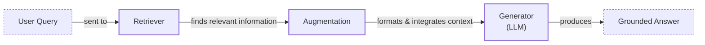
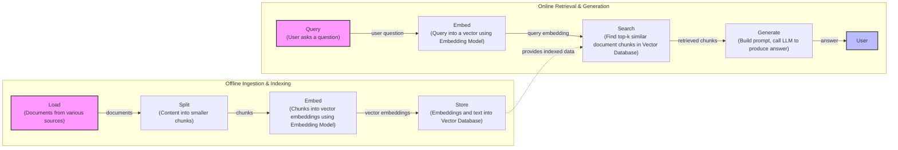
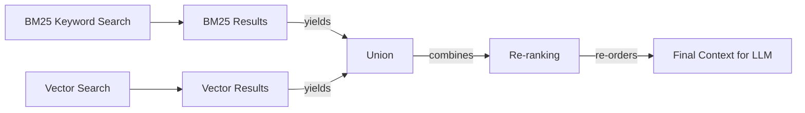
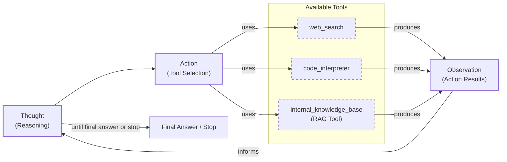

# Lesson 9: Retrieval-Augmented Generation

## Introduction: Giving LLMs an Open-Book Exam

In our previous lessons, we built a solid foundation in AI Engineering. We explored the agent landscape, distinguished between LLM workflows and autonomous agents, and dove into context engineering. We've seen how to get structured data out of LLMs and how to give them tools to perform actions. We even built a ReAct agent from scratch, giving it the ability to reason and plan.

Now, we will tackle one of the most critical challenges in building intelligent systems: knowledge. LLMs are trained on a fixed dataset, a snapshot of the world's information at a specific point in time. This makes their knowledge static and prone to making things up, a phenomenon we call hallucination. During their training, they are essentially taking a "closed-book exam" on all the information they have memorized. If you ask a model like ChatGPT about an event that happened after its training data cutoff, it will honestly tell you it does not know [[13]](https://neo4j.com/blog/developer/fine-tuning-vs-rag/). But for information just outside its knowledge, it might confidently invent an answer that sounds plausible but is entirely false [[13]](https://neo4j.com/blog/developer/fine-tuning-vs-rag/).

We do not yet have techniques that allow these models to continuously learn new information after they are deployed, at least not in the way humans do. While we can fine-tune them, this process is inefficient for simply adding new facts. Fine-tuning is expensive, time-consuming, and requires large, high-quality datasets. Furthermore, it does not eliminate hallucinations and offers no way for the model to cite its sources, making it difficult to verify the generated answers [[13]](https://neo4j.com/blog/developer/fine-tuning-vs-rag/).

Retrieval-Augmented Generation (RAG) provides a powerful solution to this problem, allowing us to inject new knowledge into the LLM's context window at the moment it's needed. With RAG, we are giving the LLM an "open-book exam." Just as humans do not need to memorize everything and can rely on manuals, notes, or "cheat sheets," LLMs can use external data sources to answer questions accurately. This approach is faster, less expensive, and more adaptable than retraining a model every time new information becomes available [[1]](https://blogs.nvidia.com/blog/what-is-retrieval-augmented-generation/).

RAG is a core method AI Engineers use for context engineering, a topic we covered in Lesson 3. In that lesson, we discussed the importance of curating the information an LLM sees. RAG is the primary tool for doing just that—retrieving the right data to build that context. It allows us to connect LLMs to proprietary company documents, real-time data feeds, and vast external knowledge bases, making their responses more accurate, relevant, and trustworthy. This ability to ground answers in verifiable sources is what separates a simple chatbot from a production-grade AI application.

In this lesson, we will explore the "what" and "how" of RAG, starting with its basic components and progressing to the advanced and agentic patterns that power modern AI applications. We will also see how retrieval complements an agent's memory, a topic we will explore in detail in our next lesson.

## The RAG System: Core Components

To design effective RAG systems, you first need to understand their fundamental building blocks. This is the first step in the context engineering process we discussed in Lesson 3. At its core, a RAG system is composed of three conceptual pillars: Retrieval, Augmentation, and Generation. Understanding each is key to building and troubleshooting your applications.

**Retrieval** is the engine responsible for finding relevant information. When a user asks a question, the retriever's job is to search an external knowledge base and pull out the most relevant pieces of data. The most common approach for this is semantic search, which relies on vector embeddings to find information that is contextually similar in meaning, even if the wording is different [[51]](https://apxml.com/courses/prompt-engineering-llm-application-development/chapter-6-integrating-llms-external-data-rag/implementing-semantic-search-retrieval). This is often supplemented with traditional keyword-based search (like BM25) to catch exact matches [[38]](https://mlpills.substack.com/p/issue-76-optimize-rag-with-hybrid).

Vector embeddings are at the heart of semantic retrieval. They are numerical representations of text that capture its meaning. An embedding model, such as a transformer network, converts text chunks into these high-dimensional vectors. Chunks with similar meanings are located closer to each other in this vector space. These vectors are then stored in a specialized vector database, which is optimized for performing fast similarity searches across millions or even billions of vectors. These databases use efficient nearest-neighbor search algorithms to find the most relevant content for a given query in milliseconds [[52]](https://medium.com/@robi.tomar72/how-rag-actually-works-embeddings-vector-databases-indexing-retrieval-explained-simply-3d1ca45fe1bf), [[55]](https://tutorialsdojo.com/aws-vector-databases-explained-semantic-search-and-rag-systems/).

**Augmentation** is the process of taking the information found by the retriever and preparing it for the LLM. This involves more than just concatenating text; it is a crucial prompt engineering step. The retrieved data is formatted and integrated into the prompt that will be sent to the model, often with specific instructions on how to use the provided context. A well-designed prompt template clearly separates the user's query from the retrieved documents, guiding the LLM to prioritize the provided information and use it as the primary source for its answer [[56]](https://www.topquadrant.com/resources/blog-retrieval-augmented-generation-explained/), [[58]](https://medium.com/@rahulraut.techuse/introduction-to-augmenting-llms-using-retrieval-augmented-generation-rag-6530123dbb91).

**Generation** is the final step. The LLM receives the augmented prompt, which contains both the original user query and the retrieved context. It then uses this combined input to generate a final answer. Because the answer is grounded in the provided data, it is more accurate and trustworthy than a response based solely on the model's internal, parametric knowledge. This step also allows for the inclusion of citations, linking claims in the answer back to the source documents, which builds user trust and allows for verification [[29]](https://www.ibm.com/think/topics/retrieval-augmented-generation).

Image 1: A flowchart illustrating the core components and data flow of a Retrieval Augmented Generation (RAG) system.

Now that you can name each moving part, let’s see how they line up across the two phases of a real system.

## The RAG Pipeline: Ingestion and Retrieval

The end-to-end RAG workflow is split into two distinct phases: an offline ingestion phase, where you prepare your knowledge base, and an online retrieval phase, where you use it to answer user queries in real-time. This separation is a key architectural pattern that allows RAG systems to be both scalable and responsive [[32]](https://newsletter.systemdesign.one/p/how-rag-works).

### Phase 1: Offline Ingestion & Indexing

This is the preparatory phase where you process your external documents and load them into a searchable index. This is typically done as a batch process and is repeated whenever your source data changes to keep the knowledge base current. The quality of this phase directly determines the quality of your retrieval.

-   **Load:** The first step is to load your documents from their sources. These can be PDFs, web pages, database records, or even content from enterprise systems like Confluence or SharePoint. A variety of tools exist to handle different data formats, such as Unstructured for complex files, LangChain's document loaders, or LlamaIndex's readers, which provide connectors for a wide array of data sources [[31]](https://medium.com/@derrickryangiggs/rag-pipeline-deep-dive-ingestion-chunking-embedding-and-vector-search-abd3c8bfc177).
-   **Split:** Since LLMs have limited context windows, you cannot feed them entire documents. Instead, you must break the content into smaller, manageable pieces called chunks. This is a critical step, as the quality of your chunks directly impacts retrieval accuracy. Simple rule-based splitters, like LangChain’s `RecursiveCharacterTextSplitter`, break text based on characters or tokens. More advanced methods, like LlamaIndex's `SemanticSplitter`, analyze the text to find natural semantic boundaries, ensuring that related ideas are kept together within a single chunk. It is also common practice to use a small amount of overlap between chunks (e.g., 10-20%) to ensure that context is not lost across boundaries [[31]](https://medium.com/@derrickryangiggs/rag-pipeline-deep-dive-ingestion-chunking-embedding-and-vector-search-abd3c8bfc177).
-   **Embed:** Each chunk is then passed through an embedding model to convert it into a numerical vector. This vector captures the semantic meaning of the text. The choice of embedding model is important; options range from proprietary models like OpenAI's `text-embedding-3-large`, Google's `gemini-text-embedding-004`, and Cohere's Embed, to high-performing open-source models like Voyage AI's offerings or BGE variants available via Hugging Face [[31]](https://medium.com/@derrickryangiggs/rag-pipeline-deep-dive-ingestion-chunking-embedding-and-vector-search-abd3c8bfc177).
-   **Store:** Finally, these vector embeddings, along with the original text chunks and any associated metadata like source, date, or author, are loaded into a vector database. This metadata is crucial for filtering results during retrieval. The database indexes the vectors for efficient similarity search. Options range from local libraries like FAISS for prototyping to production-grade, scalable databases like Milvus, Qdrant, Pinecone, or vector-enabled search platforms like Elasticsearch, OpenSearch, and Azure AI Search [[52]](https://medium.com/@robi.tomar72/how-rag-actually-works-embeddings-vector-databases-indexing-retrieval-explained-simply-3d1ca45fe1bf).

### Phase 2: Online Retrieval & Generation

This phase happens in real-time whenever a user submits a query.

-   **Query:** The process starts with a user's question. This query might be pre-processed to normalize it or expand it for better matching, a step handled by frameworks like LangChain's `Runnable` chains or LlamaIndex's `QueryEngine`.
-   **Embed:** The user's query is converted into a vector using the *same* embedding model that was used during the ingestion phase. This is crucial to ensure that the query and the document chunks are in the same vector space, allowing for meaningful comparison [[31]](https://medium.com/@derrickryangiggs/rag-pipeline-deep-dive-ingestion-chunking-embedding-and-vect.md).
-   **Search:** The system uses the query vector to search the vector database. It performs a similarity search to find the top-k document chunks whose embeddings are closest to the query's embedding. This is done by calculating the distance between the query vector and all document vectors using a metric like Cosine Similarity or Euclidean Distance [[54]](https://towardsdatascience.com/rag-explained-understanding-embeddings-similarity-and-retrieval/).
-   **Generate:** The retrieved chunks are combined with the original user query and a set of instructions into a single prompt, typically using a predefined prompt template. This augmented prompt is then sent to an LLM, which generates a final answer grounded in the retrieved context. As we learned in Lesson 4, using structured outputs here can help ensure the answer is well-formatted and includes citations back to the source documents [[29]](https://www.ibm.com/think/topics/retrieval-augmented-generation).

Image 2: A detailed flowchart depicting the end-to-end RAG pipeline, split into two main phases: Offline Ingestion & Indexing and Online Retrieval & Generation.

With the end-to-end path in place, the next question is quality: what are the advanced techniques to make retrieval more accurate and useful across messy, real-world data?

## Advanced RAG Techniques

A naive RAG pipeline often performs well in demos but can break down in production. To build a robust system, you need to move beyond the basics and incorporate advanced techniques that improve retrieval quality, handle complex queries, and manage context effectively. These strategies are essential for moving from a prototype to a dependable, production-grade application.

### Hybrid Search

This technique combines the strengths of two different search methods: traditional keyword-based search (like BM25) and modern vector-based semantic search. Keyword search is excellent at finding exact matches for specific terms, IDs, or acronyms, which semantic search can sometimes miss. Vector search, on the other hand, excels at understanding the meaning and context behind a query, catching synonyms and paraphrased concepts [[39]](https://cubitrek.com/blog/hybrid-search-optimization-how-bm25-and-dense-vector-retrieval-work-together-for-superior-ai-search/).

For example, if a customer support user searches for "my bill keeps rolling over," a keyword search will find articles containing the exact word "rollover." A semantic search might also surface guides about "carryover balances," capturing a different wording for the same concept. By running both searches and fusing the results, often using a method called Reciprocal Rank Fusion (RRF), you get a more comprehensive set of candidates for the LLM, improving both recall and precision [[38]](https://mlpills.substack.com/p/issue-76-optimize-rag-with-hybrid).

Image 3: A flowchart illustrating the hybrid retrieval flow.

### Re-ranking

The initial retrieval step is optimized for speed and recall, meaning it casts a wide net to find potentially relevant documents. However, the top-k results are not always ordered by true relevance. Re-ranking introduces a second, more sophisticated model to refine this initial list [[43]](https://apxml.com/courses/optimizing-rag-for-production/chapter-2-advanced-retrieval-optimization/reranking-architectures-rag).

This is typically done with a cross-encoder model, such as those provided by Cohere. Unlike the bi-encoder used for initial retrieval (which creates separate embeddings for the query and documents), a cross-encoder takes the query and a candidate document *together* as input and outputs a single relevance score [[45]](https://towardsdatascience.com/advanced-rag-retrieval-cross-encoders-reranking/). This allows for a much deeper interaction between the query and document tokens, resulting in a more accurate relevance judgment. Because this is computationally more expensive, it is only applied to a small set of top candidates (e.g., the top 50) from the first stage [[43]](https://apxml.com/courses/optimizing-rag-for-production/chapter-2-advanced-retrieval-optimization/reranking-architectures-rag). For a product help query like "how to connect my account," a re-ranker can correctly prioritize a step-by-step setup guide over a less relevant press release.

### Query Transformations

Sometimes, the user's original query is not the best one for searching your knowledge base. Query transformation techniques rewrite or decompose the query to improve retrieval results.

**Decomposition** breaks a complex, multi-faceted question into several simpler sub-questions. For instance, the query "What’s our travel policy for conferences in Europe this year?" could be broken down into: "Where is the travel policy?", "What are the rules for conferences in Europe?", and "What has changed for this year?". The system retrieves documents for each sub-question and then synthesizes the answers, ensuring all parts of the original query are addressed [[19]](https://docs.nvidia.com/rag/latest/query_decomposition.html).

**Hypothetical Document Embeddings (HyDE)** is another approach. Instead of directly embedding the user's query, it first asks an LLM to generate a short, hypothetical answer to the question. The system then embeds this *hypothetical document* and uses that embedding to search for similar, real documents in the vector database. This can bridge the gap when the user's phrasing does not align well with the language in the source documents [[20]](https://neo4j.com/blog/genai/advanced-rag-techniques/).

### Advanced Chunking Strategies

How you split your documents into chunks has a massive impact on retrieval quality. Fixed-size chunking is simple but often cuts documents in unnatural places, separating related information.

For example, splitting a 20-page employee handbook every 500 words might slice the "Reimbursements" section in half, leaving a chunk with rules but no spending limits. **Semantic chunking** is a smarter approach that groups semantically related sentences together, ensuring that complete thoughts and contexts are preserved. This might keep the entire "Reimbursements" section intact.

For documents with complex structures like tables or forms, **layout-aware chunking** is essential. It preserves the tabular structure, ensuring that a price is not separated from its corresponding product label. Another powerful technique is **context-enriched chunking**, where you prepend each chunk with a summary or relevant metadata from the parent document before embedding it. This gives the embedding model more context, improving retrieval accuracy [[6]](https://www.anthropic.com/news/contextual-retrieval).

### GraphRAG

For questions about complex relationships and interconnected data, standard document retrieval can fall short. GraphRAG addresses this by first extracting entities and relationships from your documents and building a knowledge graph. This concept is not new; modern knowledge graphs evolved from semantic web technologies of the 1990s, with systems like DBpedia and Google's Knowledge Graph paving the way for structuring factual knowledge for machines [[57]](https://www.semantic-web-journal.net/system/files/swj3862.pdf). Instead of just searching for similar text, the system can traverse this graph to find answers.

The core trade-off is deployment speed versus reasoning capability. Standard RAG is faster to deploy with existing documents, but it struggles with complex queries that depend on relationships. Knowledge graphs require a more significant upfront investment in schema design and entity extraction but excel at multi-hop reasoning and providing explainable, relationship-dependent answers [[58]](https://atlan.com/know/knowledge-graphs-vs-rag-for-ai/). This makes GraphRAG particularly powerful for multi-hop questions where the answer requires connecting multiple pieces of information [[59]](https://www.gooddata.com/blog/from-rag-to-graphrag-knowledge-graphs-ontologies-and-smarter-ai/).

For example, to answer a retail query like, “Which shoes get the most size-related returns and were featured in last month’s ads?” the system can connect returns data to sizing reasons, to specific product SKUs, and then to the marketing calendar. Similarly, for an IT operations query like, “Which incidents were caused by weekend deploys that also touched the login service?”, it can traverse the graph from change records to deploy times, to affected services, and finally to incident tickets, assembling a precise context that would be nearly impossible to find with simple vector search [[50]](https://arxiv.org/html/2501.00309v2).

These techniques increase retrieval quality. Next, we’ll see how retrieval becomes one tool that an agent can choose to use as it reasons.

## Agentic RAG

In Lessons 7 and 8, we explored the ReAct framework, where an agent cycles through Thought, Action, and Observation to solve problems. Agentic RAG is the application of this principle, where retrieval is not a fixed step in a pipeline but a tool that a reasoning agent can choose to use. This approach is inspired by cognitive architectures in AI, which mimic human-like reasoning by incorporating components for planning, memory, and reflection to achieve goals autonomously [[60]](https://www.ibm.com/think/topics/agentic-architecture).

The core distinction is the shift from a linear workflow to an adaptive loop.
-   **Standard RAG** is a rigid, pre-determined process: Retrieve → Augment → Generate. Every query follows this exact path.
-   **Agentic RAG** is an iterative process where an agent decides *when* and *what* to retrieve. It can reformulate queries, choose between knowledge sources, and chain multiple retrieval and reasoning steps [[11]](https://towardsdatascience.com/agentic-rag-vs-classic-rag-from-a-pipeline-to-a-control-loop/).

This agentic approach unlocks several new capabilities. The agent can **iteratively** use the RAG tool. If an initial search for "EU data retention rules" returns an outdated 2023 policy, the agent can reason that this is likely incorrect, refine its query to "EU data retention rules 2024 update," and retrieve again.

It can also **choose** which knowledge base to search. For an outage inquiry, an agent might intelligently select `search_incident_runbooks` over `search_marketing_pages`. Furthermore, it can **fuse** information from its internal RAG tool with data from other tools, like a live web search, to form a more comprehensive answer. For example, it might retrieve an internal policy and then use a web search to verify that it aligns with current public regulations [[12]](https://www.pingcap.com/article/agentic-rag-vs-traditional-rag-key-differences-benefits/). An agent can even decide to **update** the RAG system's knowledge base with new information it learns, a concept we will explore in Lesson 10 when we discuss agent memory.

Here is a conceptual thought process for an agent:
*   **Thought:** "The user is asking about '2024 EU data retention rules.' Our internal policy document is from 2023, so it might be outdated. I need to verify this."
*   **Action:** `retrieve(internal_policy, query="EU data retention 2024")`
*   **Observation:** The retrieved document mentions amendments but lacks specific citations.
*   **Thought:** "The internal document is not sufficient. I need to find the official external source."
*   **Action:** `web_search(query="official EU data retention directive 2024")`
*   **Observation:** The search returns a link to a new directive update.
*   **Thought:** "I have both the internal context and the latest external directive. I will synthesize these, highlight the changes from the 2023 policy, and cite both sources."

This transforms the interaction from a simple database lookup into a conversation with a knowledgeable research assistant. However, this flexibility introduces trade-offs. Each reasoning step and tool call adds latency and cost from increased token usage. Iterative loops can lead to "retrieval thrash" where the agent repeatedly queries without improving evidence quality, or "tool-call cascades" that compound delays [[63]](https://arxiv.org/html/2501.09136v4). For real-time applications, this creates a critical engineering balance between answer quality and system performance, as the added overhead from multiple steps may not always be justified [[61]](https://www.algolia.com/blog/ai/agentic-retrieval), [[62]](https://www.vellum.ai/blog/agentic-rag).

Image 4: A conceptual flowchart showing an agent's main loop in an Agentic RAG system.

You now understand both a linear RAG pipeline and how an agent can control retrieval when needed. Let’s wrap up by situating RAG in the wider AI Engineering toolkit and previewing what comes next.

## Conclusion

We have journeyed from the fundamental problem of static LLM knowledge to the sophisticated, reasoning-driven approach of agentic retrieval. The key takeaway is that RAG is the most widely used and practical solution to the LLM knowledge problem. For production-grade quality, advanced techniques like hybrid search and re-ranking are essential, and the future of knowledge retrieval is undeniably agentic.

By grounding LLMs in external, verifiable data, RAG reduces hallucinations, enables customization with proprietary information, and builds user trust through source-based answers. It is not a niche skill but a foundational competency for any AI Engineer. As we have seen, RAG is a powerful application of the context engineering principles we have been building upon throughout this course.

In our next lesson, we will explore Memory for Agents, and you will see how short-term and long-term memory systems work alongside RAG to create even more intelligent and stateful AI applications. We will also cover other critical topics, like retrieval quality evaluation and production monitoring, in later parts of the course. Evaluating agentic systems, in particular, is one of the field’s most underdeveloped aspects. Traditional metrics fail because the question is not just "Was the final answer correct?" but "Did the agent take the right steps to get there?" [[63]](https://toloka.ai/blog/agentic-rag-systems-for-enterprise-scale-information-retrieval/). This requires new patterns, such as using a powerful LLM as a judge to score the faithfulness of an answer against its retrieved context [[64]](https://aiamastery.substack.com/p/lesson-44-evaluating-agentic-rag).

## References

- [1] What Is RAG? (https://blogs.nvidia.com/blog/what-is-retrieval-augmented-generation/)
- [2] A Complete Guide to RAG (https://towardsai.net/p/l/a-complete-guide-to-rag)
- [3] RAG Fundamentals First (https://decodingml.substack.com/p/rag-fundamentals-first?utm_source=publication-search)
- [4] Your RAG is wrong: Here's how to fix it (https://decodingml.substack.com/p/your-rag-is-wrong-heres-how-to-fix?utm_source=publication-search)
- [5] A GraphRAG Approach to Query-Focused Summarization (https://arxiv.org/html/2404.16130)
- [6] Introducing Contextual Retrieval (https://www.anthropic.com/news/contextual-retrieval)
- [7] What is Agentic RAG (https://weaviate.io/blog/what-is-agentic-rag)
- [8] RAG is dead, long live agentic retrieval (https://www.llamaindex.ai/blog/rag-is-dead-long-live-agentic-retrieval)
- [9] What is agentic RAG? (https://www.ibm.com/think/topics/agentic-rag)
- [10] Build advanced RAG systems (https://learn.microsoft.com/en-us/azure/developer/ai/advanced-retrieval-augmented-generation)
- [11] The Rise of RAG (https://highlearningrate.substack.com/p/the-rise-of-rag)
- [12] Agentic RAG vs. Classic RAG (https://towardsdatascience.com/agentic-rag-vs-classic-rag-from-a-pipeline-to-a-control-loop/)
- [13] Fine-Tuning vs. RAG (https://neo4j.com/blog/developer/fine-tuning-vs-rag/)
- [19] Query Decomposition (https://docs.nvidia.com/rag/latest/query_decomposition.html)
- [20] Advanced RAG Techniques (https://neo4j.com/blog/genai/advanced-rag-techniques/)
- [29] What is RAG? (https://www.ibm.com/think/topics/retrieval-augmented-generation)
- [31] RAG Pipeline Deep Dive (https://medium.com/@derrickryangiggs/rag-pipeline-deep-dive-ingestion-chunking-embedding-and-vector-search-abd3c8bfc177)
- [32] How RAG Works (https://newsletter.systemdesign.one/p/how-rag-works)
- [38] Optimize RAG with Hybrid Search (https://mlpills.substack.com/p/issue-76-optimize-rag-with-hybrid)
- [39] Hybrid Search Optimization (https://cubitrek.com/blog/hybrid-search-optimization-how-bm25-and-dense-vector-retrieval-work-together-for-superior-ai-search/)
- [43] Reranking Architectures in RAG (https://apxml.com/courses/optimizing-rag-for-production/chapter-2-advanced-retrieval-optimization/reranking-architectures-rag)
- [45] Advanced RAG: Cross-Encoders for Re-Ranking (https://towardsdatascience.com/advanced-rag-retrieval-cross-encoders-reranking/)
- [48] From Local to Global: A GraphRAG Approach (https://webhome.cs.uvic.ca/~thomo/papers/asonam2025-graphrag.pdf)
- [50] Graph-based Retrieval for Multi-hop QA (https://arxiv.org/html/2501.00309v2)
- [51] Implementing Semantic Search for Retrieval (https://apxml.com/courses/prompt-engineering-llm-application-development/chapter-6-integrating-llms-external-data-rag/implementing-semantic-search-retrieval)
- [52] How RAG Actually Works (https://medium.com/@robi.tomar72/how-rag-actually-works-embeddings-vector-databases-indexing-retrieval-explained-simply-3d1ca45fe1bf)
- [54] RAG Explained (https://towardsdatascience.com/rag-explained-understanding-embeddings-similarity-and-retrieval/)
- [55] AWS Vector Databases Explained (https://tutorialsdojo.com/aws-vector-databases-explained-semantic-search-and-rag-systems/)
- [56] RAG Explained (https://www.topquadrant.com/resources/blog-retrieval-augmented-generation-explained/)
- [57] The Semantic Web (https://www.semantic-web-journal.net/system/files/swj3862.pdf)
- [58] Knowledge Graphs vs. RAG for AI (https://atlan.com/know/knowledge-graphs-vs-rag-for-ai/)
- [59] From RAG to GraphRAG (https://www.gooddata.com/blog/from-rag-to-graphrag-knowledge-graphs-ontologies-and-smarter-ai/)
- [60] What is agentic architecture? (https://www.ibm.com/think/topics/agentic-architecture)
- [61] Agentic Retrieval (https://www.algolia.com/blog/ai/agentic-retrieval)
- [62] Agentic RAG (https://www.vellum.ai/blog/agentic-rag)
- [63] Agentic RAG Systems for Enterprise-Scale (https://toloka.ai/blog/agentic-rag-systems-for-enterprise-scale-information-retrieval/)
- [64] Evaluating Agentic RAG (https://aiamastery.substack.com/p/lesson-44-evaluating-agentic-rag)