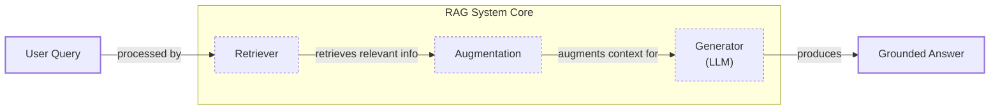
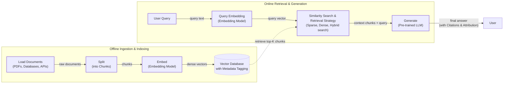
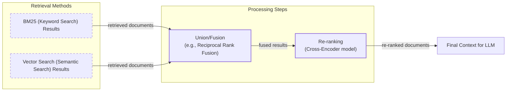
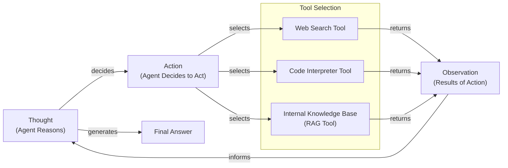

# Lesson 9: Retrieval-Augmented Generation (RAG)

In our previous lessons, we have built a solid foundation in AI Engineering. We explored the agent landscape, distinguished between LLM workflows and autonomous agents, and in Lesson 3, we covered Context Engineering—the art of managing the information an LLM sees. We have also learned how to get structured data out of models, give them tools to perform actions, and implement reasoning loops like ReAct.

On a recent project, we hit a wall that every AI engineer eventually faces. We were building a chatbot to answer questions about our internal documentation, but the model kept giving outdated answers. It was trained on data from last year and was completely unaware of our latest product updates. It confidently hallucinated features that didn't exist and missed new ones that did. This is a fundamental problem: Large Language Models are trained on a fixed dataset, making their knowledge static. During training, they are essentially taking a "closed-book exam" on the world's information [[18]](https://neo4j.com/blog/developer/fine-tuning-vs-rag/). Asking a model about an event that happened after its training cutoff is like asking a historian about the future. For example, a model trained until January 2022 cannot tell you who won the NBA MVP in 2024; it will either admit it doesn't know or, worse, invent an answer [[18]](https://neo4j.com/blog/developer/fine-tuning-vs-rag/).

While fine-tuning can inject new knowledge, it is slow, expensive, and creates yet another static snapshot. It is not an efficient way for models to learn continuously. The process requires significant GPU compute, machine learning expertise, and carefully prepared training data, often taking days or weeks to complete. Once the underlying data changes again, the fine-tuned model becomes stale, and you are back where you started [[32]](https://newsletter.systemdesign.one/p/how-rag-works).

This is where Retrieval-Augmented Generation (RAG) comes in. RAG is a reliable solution that transforms how we use LLMs. Instead of relying on memorized facts, we give the model an "open-book exam" by connecting it to external, up-to-date knowledge sources [[32]](https://newsletter.systemdesign.one/p/how-rag-works). Just as humans use manuals and cheat sheets to perform complex tasks, we can use RAG to provide an LLM with the right information at the right time, ensuring its answers are grounded in verifiable facts.

RAG is a core method within the Context Engineering discipline we introduced in Lesson 3. It is a practical tool AI Engineers use to curate the context fed to an LLM, ensuring the model's responses are accurate and trustworthy. This lesson will guide you through the "what" and "how" of RAG, from its basic components to the advanced and agentic patterns that power modern AI systems. We will also see how retrieval complements an agent's memory, a topic we will explore further in Lesson 10.

With the problem and motivation clear, we will first decompose RAG into its core components so you can see where each responsibility lives.

## The RAG System: Core Components

Understanding the components of a RAG system is the first step in the Context Engineering process of designing effective AI applications. At its core, RAG is built on three conceptual pillars: Retrieval, Augmentation, and Generation. These components work together to connect an LLM to external knowledge, turning it from a closed-book test-taker into an open-book researcher.

Image 1: A flowchart illustrating the core components of a RAG system.

**Retrieval** is the engine that finds relevant information. When a user asks a question, the retriever’s job is to search an external knowledge base and pull out the most relevant pieces of data. The most common approach is semantic search, which uses vector embeddings to find information that is conceptually similar to the query, even if the wording is different. Vector embeddings are dense numerical arrays that capture the semantic meaning of text, images, or other data [[7]](https://tutorialsdojo.com/aws-vector-databases-explained-semantic-search-and-rag-systems/). An embedding model transforms a piece of content into a high-dimensional vector where concepts with similar meanings are located close to each other in the vector space. For example, the phrases "how to reset my password" and "I can't log into my account" would have very similar vector representations [[32]](https://newsletter.systemdesign.one/p/how-rag-works). These vectors are stored in a specialized vector database, which is optimized for performing fast similarity searches using distance metrics like cosine similarity [[51]](https://apxml.com/courses/prompt-engineering-llm-application-development/chapter-6-integrating-llms-external-data-rag/implementing-semantic-search-retrieval). Another popular method is keyword-based search, using algorithms like BM25, which excels at finding exact term matches [[36]](https://pr-peri.github.io/blogpost/2026/03/05/blogpost-hybrid-search.html).

**Augmentation** is the process of taking the retrieved information and preparing it for the LLM. This involves formatting the data and inserting it into the prompt alongside the original user query. The goal is to create a clear and context-rich input that guides the LLM toward a grounded answer. This step is where prompt engineering techniques are applied to ensure the model understands how to use the provided context effectively. For instance, a common practice is to use a template that clearly separates the retrieved context from the user's question, instructing the model to base its answer solely on the provided information [[56]](https://www.topquadrant.com/resources/blog-retrieval-augmented-generation-explained/).

**Generation** is the final step where the LLM produces an answer. Using the augmented prompt, which now contains both the user’s question and the retrieved context, the model generates a response that is grounded in the external data. This process reduces the risk of hallucination and allows the model to provide answers based on information it was never trained on [[26]](https://humanloop.com/blog/rag-architectures). The LLM acts as a reasoning engine, synthesizing the provided information into a coherent and accurate answer, often with citations pointing back to the source documents, which builds user trust [[3]](https://blogs.nvidia.com/blog/what-is-retrieval-augmented-generation/).

Now that you can name each moving part, let’s see how they line up across the two phases of a real system.

## The RAG Pipeline: Ingestion and Retrieval

The end-to-end RAG workflow is split into two distinct phases: an offline ingestion pipeline that prepares your data and an online retrieval pipeline that answers user queries in real-time. This separation is key to building efficient and scalable RAG systems, as the computationally intensive work of processing documents is done upfront, allowing for fast, on-demand retrieval during user interactions.

Image 2: A detailed flowchart depicting the end-to-end RAG workflow, clearly separated into two main phases: "Offline Ingestion & Indexing" and "Online Retrieval & Generation".

### Phase 1: Offline Ingestion & Indexing

The offline phase is where you process your knowledge base and make it searchable. This is a one-time or periodic process that happens before any user interacts with the system. It involves four key steps [[32]](https://newsletter.systemdesign.one/p/how-rag-works):

1.  **Load:** The first step is to load your documents from various sources. These can be PDFs, databases, APIs, or websites. Frameworks like LangChain and LlamaIndex offer ready-made connectors for many common sources, such as `Unstructured` for complex file types. This stage is about gathering all the raw data you want your RAG system to have access to.
2.  **Split:** Once loaded, the documents are broken down into smaller, semantically meaningful pieces called chunks. This is a critical step because you want to avoid splitting a coherent thought or piece of information across multiple chunks. The chunking strategy you choose can have a huge impact on retrieval quality. You can use simple rule-based splitters, like LangChain’s `RecursiveCharacterTextSplitter`, or more advanced methods like LlamaIndex's `SemanticSplitter` that split based on topic shifts.
3.  **Embed:** Each chunk is then converted into a numerical representation, or vector embedding, using an embedding model. These vectors capture the semantic meaning of the text. Popular models for this task include OpenAI’s `text-embedding-3-large/small`, Google's `gemini-text-embedding-004`, Cohere's `embed` models, Voyage AI models, and various open-source `bge` variants available via Hugging Face.
4.  **Store:** Finally, the embeddings and their corresponding text chunks are stored in a vector database. This specialized database is optimized for fast similarity searches, allowing the system to quickly find the most relevant chunks for a given query. Examples include local libraries like FAISS, or scalable production systems like Milvus, Qdrant, Pinecone, and vector search capabilities in traditional databases like Elasticsearch or Azure AI Search. Metadata, such as the source document or creation date, is often stored alongside each chunk to enable filtering and provide citations [[32]](https://newsletter.systemdesign.one/p/how-rag-works).

### Phase 2: Online Retrieval & Generation

The online phase is triggered when a user submits a query. This is the real-time part of the RAG system that finds information and generates an answer [[31]](https://medium.com/@derrickryangiggs/rag-pipeline-deep-dive-ingestion-chunking-embedding-and-vector-search-abd3c8bfc177).

1.  **Query & Embed:** The user’s question is taken as input and converted into a vector embedding using the *same* embedding model from the ingestion phase. This is crucial, as it ensures that the query and the document chunks exist in the same vector space, making them comparable. Orchestration frameworks like LangChain's `Runnable` chains or LlamaIndex's `QueryEngine` handle this step.
2.  **Search:** The system uses the query vector to search the vector database. It performs a similarity search to find the top-k document chunks whose embeddings are closest to the query embedding. This is often done using cosine similarity or other distance metrics. Vector databases like Pinecone allow for pre-filtering on metadata, while systems like Elasticsearch support hybrid searches combining vector similarity with keyword matching.
3.  **Generate:** The retrieved chunks are then assembled into a prompt along with the original user query and a set of instructions. This augmented prompt is sent to an LLM, which generates a final answer grounded in the provided context. To ensure the response is reliable and easy to use downstream, you can use structured outputs, a technique we covered in Lesson 4, to format the answer and include citations.

With the end-to-end path in place, the next question is quality. What are the advanced techniques to make the retrieval more accurate and useful across messy, real-world data?

## Advanced RAG Techniques

The vanilla RAG pipeline is a great starting point, but production-grade systems often require more sophisticated techniques to achieve high accuracy. The field has evolved from this initial "naive RAG" approach to more advanced and modular architectures designed to overcome the limitations of a simple retrieve-then-generate process [[61]](https://www.ibm.com/think/topics/rag-techniques). These advanced methods focus on improving the quality of the retrieved information before it ever reaches the LLM.

### Hybrid Search

Hybrid search combines the strengths of traditional keyword-based search, like BM25, with modern vector-based semantic search. Keyword search is precise and excels at finding documents with specific terms or identifiers, while vector search is better at understanding the user's intent and finding conceptually related information, even if the wording is different [[36]](https://pr-peri.github.io/blogpost/2026/03/05/blogpost-hybrid-search.html).

For example, if a customer support agent searches for "my bill keeps rolling over," a keyword search will find articles containing the exact word "rollover." A semantic search might also surface guides about "carryover balances." By fusing the results of both searches, often using a technique like Reciprocal Rank Fusion (RRF), the system can cover different phrasings of the same issue, leading to more comprehensive retrieval [[38]](https://mlpills.substack.com/p/issue-76-optimize-rag-with-hybrid). RRF is effective because it operates on rank positions rather than raw scores, which avoids the need for complex normalization. It gives more weight to documents that rank highly across multiple result lists, effectively finding a consensus between the different search methods.

Image 3: A flowchart illustrating the hybrid retrieval flow.

### Re-ranking

Re-ranking introduces a second, more precise model to re-order the documents retrieved in the initial search. The first-pass retrieval is designed for speed and recall, casting a wide net to find all potentially relevant documents. However, this can result in a list where the most relevant items are not at the top.

A re-ranker, typically a cross-encoder model, takes the user query and each retrieved document as a pair and computes a relevance score [[43]](https://apxml.com/courses/optimizing-rag-for-production/chapter-2-advanced-retrieval-optimization/reranking-architectures-rag). Unlike bi-encoder models used for initial retrieval, which encode the query and documents separately, cross-encoders allow for deep interaction between the query and document tokens. This results in a much more accurate relevance judgment. For instance, in a product help scenario, a re-ranker can push a step-by-step setup guide to the top of the list, above a less relevant press release.

### Query Transformations

Sometimes, the user's original query is not the best input for a search system. Query transformation techniques rewrite or decompose the query to improve retrieval accuracy.

-   **Decomposition:** This technique breaks down a complex, multi-part question into several simpler sub-questions. The system then retrieves documents for each sub-question and merges the results. For example, the query "What’s our travel policy for conferences in Europe this year?" could be decomposed into: (1) "What is the company travel policy?", (2) "What are the rules for conferences?", (3) "Are there specific rules for Europe?", and (4) "What has changed this year?". Retrieving for each part ensures all aspects of the original query are addressed [[19]](https://docs.nvidia.com/rag/latest/query_decomposition.html).
-   **Hypothetical Document Embeddings (HyDE):** This method involves generating a hypothetical, ideal answer to the user's query *before* searching. This generated document is then embedded and used for the similarity search. The idea is that this hypothetical document is more likely to be semantically similar to the actual answer documents than the original, often short, query. For a query about travel policy, the system might generate a short paragraph like, "Employees attending approved conferences in Europe can book economy flights and stay in hotels up to a certain price limit." It then searches for documents that sound like this ideal answer [[16]](https://47billion.com/blog/rag-system-in-production-why-it-fails-and-how-to-fix-it/).

### Advanced Chunking Strategies

How you split your documents into chunks has a massive impact on retrieval quality. Moving beyond simple fixed-size chunking is one of the most effective ways to improve your RAG system.

-   **Semantic Chunking:** Instead of splitting by a fixed number of tokens, this method splits text based on semantic shifts. It uses embeddings to identify where the topic changes, ensuring that each chunk contains a coherent, self-contained idea. For example, when chunking a 20-page handbook, a fixed-size approach might split the "Reimbursements" section in half, separating a policy description from its specific monetary caps. Semantic chunking would keep the entire section together, preserving its full context [[17]](https://sarthakai.substack.com/p/improve-your-rag-accuracy-with-a).
-   **Layout-Aware Chunking:** For documents with rich structure like PDFs, this strategy uses layout information to guide the chunking process. It identifies headers, tables, and lists, and keeps these elements intact within chunks. For a pricing table, this means keeping each row (product, price, discount) together, rather than slicing the page by character count and separating numbers from their labels [[17]](https://sarthakai.substack.com/p/improve-your-rag-accuracy-with-a).
-   **Context-Enriched Chunking:** This approach, also known as contextual retrieval, adds a summary of the surrounding context to each chunk before embedding it. This helps the embedding model understand the chunk's place within the larger document, leading to more accurate retrieval, especially for ambiguous chunks that lack context on their own.

### GraphRAG

GraphRAG introduces knowledge graphs as the retrieval source. This technique excels at answering questions about complex relationships and interconnected entities, which are often lost in standard document chunks. It builds a graph where nodes represent entities (like people, products, or companies) and edges represent the relationships between them. While standard RAG asks, "Which document mentions X?", GraphRAG can ask, "How does X relate to Y?", providing relational context that is missing from unstructured text chunks [[49]](https://atlan.com/know/what-is-graphrag/).

This structured representation allows the system to perform multi-hop reasoning by traversing the graph. For example, to answer, "Which incidents were caused by weekend deploys that also touched the login service?", it can link change records to deploy times, affected services, and incident tickets to surface the relevant post-mortems. This is effective for uncovering insights that require connecting disparate pieces of information.

These techniques increase retrieval quality. Next, we’ll see how retrieval becomes one tool that an agent can choose to use as it reasons.

## Agentic RAG

In Lessons 7 and 8, we explored the ReAct framework, where an agent cycles through a loop of Thought, Action, and Observation to solve problems. Agentic RAG is the application of this principle, where retrieval is no longer a fixed step in a pipeline but a tool that a reasoning agent can choose to use.

The core distinction between standard and agentic RAG is the shift from a linear workflow to an adaptive, iterative loop.

-   **Standard RAG** is a pre-determined process: Retrieve -> Augment -> Generate. It is effective but rigid, following the same path for every query.
-   **Agentic RAG** is dynamic. An AI agent decides *when* to retrieve, *what* to search for, which knowledge source to use, and whether multiple retrieval steps are needed [[11]](https://towardsdatascience.com/agentic-rag-vs-classic-rag-from-a-pipeline-to-a-control-loop/).

This agentic approach unlocks several capabilities. The agent can iteratively use its RAG tool, refining its query based on initial findings. For instance, if a search returns a vague policy, it can form a more specific query like "EU customer data policy, 2024 updates" and retrieve again. The agent can also choose which knowledge base to search (e.g., `search_tech_docs` over `search_emails`) and fuse information from its RAG tool with other tools, like a web search. For instance, it might retrieve an internal policy, then use a web search to verify current regulations before synthesizing a response [[13]](https://medium.com/@gaddam.rahul.kumar/agentic-rag-vs-traditional-rag-b1a156f72167).

It is important to note that agents typically use many tools, such as web search, code execution, and database queries. Labeling an entire system "agentic RAG" can be too narrow, as the retrieval tool is just one of many capabilities the agent possesses [[9]](https://weaviate.io/blog/what-is-agentic-rag).

Image 4: A conceptual flowchart illustrating an agent's main loop in an Agentic RAG system.

Here is a conceptual thought process for an agent tackling a complex query:

> **Thought:** The user is asking about "2024 EU data retention rules." Our internal policy document is from 2023, so it might be outdated. I need to check for recent changes.
>
> **Action:** `retrieve(internal_policy, query="EU data retention 2024")`
>
> **Observation:** The retrieved document mentions amendments but lacks specific citations for the 2024 updates.
>
> **Thought:** The internal document is incomplete. I need to find the official external source to verify the changes.
>
> **Action:** `web_search(query="official EU data retention directive 2024")`
>
> **Observation:** The search returns a link to a new directive with updated clauses.
>
> **Thought:** I now have both the internal context and the latest external directive. I can synthesize these to provide a complete answer, highlighting the changes from the 2023 policy.

This is the difference between a simple database lookup and a conversation with a knowledgeable research assistant. The agent doesn't just follow a script; it reasons, strategizes, and adapts. As we will explore in our next lesson on agent memory, agents can even decide to update their knowledge base with new information they learn.

You now understand both a linear RAG pipeline and how an agent can control retrieval when needed. Let’s wrap up by situating RAG in the wider AI Engineering toolkit and previewing what comes next.

## Conclusion

We have journeyed from the fundamentals of RAG to its advanced and agentic forms. The key takeaway is that RAG is the most used solution to the LLM knowledge problem, providing a robust way to ground models in factual, verifiable data. This reduces hallucinations, enables customization with proprietary information, and builds user trust through source-based answers. For production-grade quality, advanced techniques like hybrid search, re-ranking, and intelligent chunking are not just options—they are essential. The future of knowledge retrieval is agentic, where RAG transforms from a static pipeline into a dynamic tool wielded by a reasoning agent.

This positions RAG as a foundational competency for any AI Engineer. It is a critical subset of Context Engineering, enabling the creation of customized, knowledgeable, and reliable AI applications. By mastering these techniques, you can build systems that go beyond simple question-answering to become truly intelligent partners in complex, knowledge-intensive tasks.

In our next lesson, we will dive into Memory for Agents. We will explore how short-term and long-term memory systems complement retrieval, allowing agents to build a persistent understanding of their world and interactions. We will also touch on other important topics later in the course, such as how to build robust evaluation pipelines for retrieval quality and how to monitor these complex systems in production.

## References

- [1] Lewis, P., Perez, E., Piktus, A., Petroni, F., Karpukhin, V., Nogueira, G., ... & Kiela, D. (2020). Retrieval-Augmented Generation for Knowledge-Intensive NLP Tasks. [https://arxiv.org/abs/2005.11401](https://arxiv.org/abs/2005.11401)
- [2] Gao, Y., Xiong, Y., Gao, X., Jia, K., Pan, J., Bi, Y., ... & Wang, H. (2024). Retrieval-Augmented Generation for Large Language Models: A Survey. [https://arxiv.org/abs/2312.10997](https://arxiv.org/abs/2312.10997)
- [3] What Is Retrieval-Augmented Generation, aka RAG?. [https://blogs.nvidia.com/blog/what-is-retrieval-augmented-generation/](https://blogs.nvidia.com/blog/what-is-retrieval-augmented-generation/)
- [4] A Complete Guide to RAG. [https://towardsai.net/p/l/a-complete-guide-to-rag](https://towardsai.net/p/l/a-complete-guide-to-rag)
- [5] Retrieval-Augmented Generation (RAG) Fundamentals First. [https://decodingml.substack.com/p/rag-fundamentals-first?utm_source=publication-search](https://decodingml.substack.com/p/rag-fundamentals-first?utm_source=publication-search)
- [6] Your RAG is wrong: Here's how to fix it. [https://decodingml.substack.com/p/your-rag-is-wrong-heres-how-to-fix?utm_source=publication-search](https://decodingml.substack.com/p/your-rag-is-wrong-heres-how-to-fix?utm_source=publication-search)
- [7] Edge, D., Trinh, H., Cheng, N., Bradley, J., Dou, A., He, Y., ... & Le, Q. (2024). From Local to Global: A GraphRAG Approach to Query-Focused Summarization. [https://arxiv.org/html/2404.16130](https://arxiv.org/html/2404.16130)
- [8] Introducing Contextual Retrieval. [https://www.anthropic.com/news/contextual-retrieval](https://www.anthropic.com/news/contextual-retrieval)
- [9] What is Agentic RAG. [https://weaviate.io/blog/what-is-agentic-rag](https://weaviate.io/blog/what-is-agentic-rag)
- [10] RAG is dead, long live agentic retrieval. [https://www.llamaindex.ai/blog/rag-is-dead-long-live-agentic-retrieval](https://www.llamaindex.ai/blog/rag-is-dead-long-live-agentic-retrieval)
- [11] Agentic RAG vs Classic RAG: From a Pipeline to a Control Loop. [https://towardsdatascience.com/agentic-rag-vs-classic-rag-from-a-pipeline-to-a-control-loop/](https://towardsdatascience.com/agentic-rag-vs-classic-rag-from-a-pipeline-to-a-control-loop/)
- [12] What is agentic RAG?. [https://www.ibm.com/think/topics/agentic-rag](https://www.ibm.com/think/topics/agentic-rag)
- [13] Agentic RAG vs Traditional RAG. [https://medium.com/@gaddam.rahul.kumar/agentic-rag-vs-traditional-rag-b1a156f72167](https://medium.com/@gaddam.rahul.kumar/agentic-rag-vs-traditional-rag-b1a156f72167)
- [14] Build advanced retrieval-augmented generation systems. [https://learn.microsoft.com/en-us/azure/developer/ai/advanced-retrieval-augmented-generation](https://learn.microsoft.com/en-us/azure/developer/ai/advanced-retrieval-augmented-generation)
- [15] The Rise of RAG. [https://highlearningrate.substack.com/p/the-rise-of-rag](https://highlearningrate.substack.com/p/the-rise-of-rag)
- [16] RAG System in Production: Why it Fails and How to Fix it. [https://47billion.com/blog/rag-system-in-production-why-it-fails-and-how-to-fix-it/](https://47billion.com/blog/rag-system-in-production-why-it-fails-and-how-to-fix-it/)
- [17] Improve Your RAG Accuracy With A Smarter Chunking Strategy. [https://sarthakai.substack.com/p/improve-your-rag-accuracy-with-a](https://sarthakai.substack.com/p/improve-your-rag-accuracy-with-a)
- [18] Knowledge Graphs and LLMs: Fine-Tuning vs. Retrieval-Augmented Generation. [https://neo4j.com/blog/developer/fine-tuning-vs-rag/](https://neo4j.com/blog/developer/fine-tuning-vs-rag/)
- [19] Query Decomposition. [https://docs.nvidia.com/rag/latest/query_decomposition.html](https://docs.nvidia.com/rag/latest/query_decomposition.html)
- [20] Retrieval-Augmented Generation for Knowledge-Intensive NLP Tasks. [https://arxiv.org/abs/2005.11401](https://arxiv.org/abs/2005.11401)
- [21] Large Language Models are not Fair Evaluators. [https://arxiv.org/abs/2305.17926](https://arxiv.org/abs/2305.17926)
- [22] RAGAS: Automated Evaluation of Retrieval Augmented Generation. [https://arxiv.org/abs/2309.15217](https://arxiv.org/abs/2309.15217)
- [23] ARES: An Automated Evaluation Framework for Retrieval-Augmented Generation Systems. [https://arxiv.org/abs/2311.09476](https://arxiv.org/abs/2311.09476)
- [24] Benchmarking Large Language Models in Retrieval-Augmented Generation. [https://arxiv.org/abs/2309.01431](https://arxiv.org/abs/2309.01431)
- [25] SentGraph: Hierarchical Sentence Graph for Multi-hop Retrieval-Augmented Question Answering. [https://arxiv.org/html/2601.03014v1](https://arxiv.org/html/2601.03014v1)
- [26] RAG Architectures. [https://humanloop.com/blog/rag-architectures](https://humanloop.com/blog/rag-architectures)
- [27] RAG and its different components. [https://www.aimon.ai/posts/rag_and_its_different_components/](https://www.aimon.ai/posts/rag_and_its_different_components/)
- [28] Grounding LLMs: Driving AI to Deliver Contextually Relevant Data. [https://toloka.ai/blog/grounding-llms-driving-ai-to-deliver-contextually-relevant-data/](https://toloka.ai/blog/grounding-llms-driving-ai-to-deliver-contextually-relevant-data/)
- [29] Retrieval-augmented generation. [https://www.ibm.com/think/topics/retrieval-augmented-generation](https://www.ibm.com/think/topics/retrieval-augmented-generation)
- [30] RAG Architecture. [https://galileo.ai/blog/rag-architecture](https://galileo.ai/blog/rag-architecture)
- [31] RAG Pipeline Deep Dive: Ingestion, Chunking, Embedding, and Vector Search. [https://medium.com/@derrickryangiggs/rag-pipeline-deep-dive-ingestion-chunking-embedding-and-vector-search-abd3c8bfc177](https://medium.com/@derrickryangiggs/rag-pipeline-deep-dive-ingestion-chunking-embedding-and-vector-search-abd3c8bfc177)
- [32] How RAG Works. [https://newsletter.systemdesign.one/p/how-rag-works](https://newsletter.systemdesign.one/p/how-rag-works)
- [33] RAGOps Guide: Building and Scaling Retrieval-Augmented Generation Systems. [https://towardsdatascience.com/ragops-guide-building-and-scaling-retrieval-augmented-generation-systems-3d26b3ebd627/](https://towardsdatascience.com/ragops-guide-building-and-scaling-retrieval-augmented-generation-systems-3d26b3ebd627/)
- [34] RAG Offline vs. Online Evaluation. [https://apxml.com/courses/optimizing-rag-for-production/chapter-6-advanced-rag-evaluation-monitoring/rag-offline-online-evaluation](https://apxml.com/courses/optimizing-rag-for-production/chapter-6-advanced-rag-evaluation-monitoring/rag-offline-online-evaluation)
- [35] What is Retrieval-Augmented Generation?. [https://aws.amazon.com/what-is/retrieval-augmented-generation/](https://aws.amazon.com/what-is/retrieval-augmented-generation/)
- [36] Hybrid Search for Production RAG. [https://pr-peri.github.io/blogpost/2026/03/05/blogpost-hybrid-search.html](https://pr-peri.github.io/blogpost/2026/03/05/blogpost-hybrid-search.html)
- [37] Hybrid Retrieval for RAG. [https://www.chitika.com/hybrid-retrieval-rag/](https://www.chitika.com/hybrid-retrieval-rag/)
- [38] Optimize RAG with Hybrid Search. [https://mlpills.substack.com/p/issue-76-optimize-rag-with-hybrid](https://mlpills.substack.com/p/issue-76-optimize-rag-with-hybrid)
- [39] Hybrid Search Optimization: How BM25 and Dense Vector Retrieval Work Together for Superior AI Search. [https://cubitrek.com/blog/hybrid-search-optimization-how-bm25-and-dense-vector-retrieval-work-together-for-superior-ai-search/](https://cubitrek.com/blog/hybrid-search-optimization-how-bm25-and-dense-vector-retrieval-work-together-for-superior-ai-search/)
- [40] Hybrid RAG in the Real World: Graphs, BM25, and the End of Black-Box Retrieval. [https://community.netapp.com/t5/Tech-ONTAP-Blogs/Hybrid-RAG-in-the-Real-World-Graphs-BM25-and-the-End-of-Black-Box-Retrieval/ba-p/464834](https://community.netapp.com/t5/Tech-ONTAP-Blogs/Hybrid-RAG-in-the-Real-World-Graphs-BM25-and-the-End-of-Black-Box-Retrieval/ba-p/464834)
- [41] A Survey on RAG technologies for LLMs. [https://arxiv.org/html/2407.00072v5](https://arxiv.org/html/2407.00072v5)
- [42] 10 Techniques to Improve RAG Accuracy. [https://redis.io/blog/10-techniques-to-improve-rag-accuracy/](https://redis.io/blog/10-techniques-to-improve-rag-accuracy/)
- [43] Reranking Architectures for RAG. [https://apxml.com/courses/optimizing-rag-for-production/chapter-2-advanced-retrieval-optimization/reranking-architectures-rag](https://apxml.com/courses/optimizing-rag-for-production/chapter-2-advanced-retrieval-optimization/reranking-architectures-rag)
- [44] Advanced RAG Techniques. [https://neo4j.com/blog/genai/advanced-rag-techniques/](https://neo4j.com/blog/genai/advanced-rag-techniques/)
- [45] Advanced RAG Retrieval: Cross-Encoders & Reranking. [https://towardsdatascience.com/advanced-rag-retrieval-cross-encoders-reranking/](https://towardsdatascience.com/advanced-rag-retrieval-cross-encoders-reranking/)
- [46] SentGraph: Hierarchical Sentence Graph for Multi-hop Retrieval-Augmented Question Answering. [https://arxiv.org/html/2601.03014v1](https://arxiv.org/html/2601.03014v1)
- [47] Graph-Based Retrieval for RAG. [https://www.chitika.com/graph-based-retrieval-rag/](https://www.chitika.com/graph-based-retrieval-rag/)
- [48] GraphRAG: A Graph-Based Approach to Retrieval-Augmented Generation. [https://webhome.cs.uvic.ca/~thomo/papers/asonam2025-graphrag.pdf](https://webhome.cs.uvic.ca/~thomo/papers/asonam2025-graphrag.pdf)
- [49] What is GraphRAG?. [https://atlan.com/know/what-is-graphrag/](https://atlan.com/know/what-is-graphrag/)
- [50] A Survey on Graph-based Retrieval-Augmented Generation. [https://arxiv.org/html/2501.00309v2](https://arxiv.org/html/2501.00309v2)
- [51] Implementing Semantic Search for Retrieval. [https://apxml.com/courses/prompt-engineering-llm-application-development/chapter-6-integrating-llms-external-data-rag/implementing-semantic-search-retrieval](https://apxml.com/courses/prompt-engineering-llm-application-development/chapter-6-integrating-llms-external-data-rag/implementing-semantic-search-retrieval)
- [52] How RAG Actually Works: Embeddings, Vector Databases, Indexing & Retrieval Explained Simply. [https://medium.com/@robi.tomar72/how-rag-actually-works-embeddings-vector-databases-indexing-retrieval-explained-simply-3d1ca45fe1bf](https://medium.com/@robi.tomar72/how-rag-actually-works-embeddings-vector-databases-indexing-retrieval-explained-simply-3d1ca45fe1bf)
- [53] Vector DB and RAG Pipeline for Document RAG. [https://learnopencv.com/vector-db-and-rag-pipeline-for-document-rag/](https://learnopencv.com/vector-db-and-rag-pipeline-for-document-rag/)
- [54] RAG Explained: Understanding Embeddings, Similarity, and Retrieval. [https://towardsdatascience.com/rag-explained-understanding-embeddings-similarity-and-retrieval/](https://towardsdatascience.com/rag-explained-understanding-embeddings-similarity-and-retrieval/)
- [55] AWS Vector Databases Explained: Semantic Search and RAG Systems. [https://tutorialsdojo.com/aws-vector-databases-explained-semantic-search-and-rag-systems/](https://tutorialsdojo.com/aws-vector-databases-explained-semantic-search-and-rag-systems/)
- [56] Retrieval-Augmented Generation Explained. [https://www.topquadrant.com/resources/blog-retrieval-augmented-generation-explained/](https://www.topquadrant.com/resources/blog-retrieval-augmented-generation-explained/)
- [57] Building Trustworthy RAG Systems. [https://www.linkedin.com/posts/haruiz_building-trustworthy-rag-systems-with-in-activity-7310729777227669505-nd6u](https://www.linkedin.com/posts/haruiz_building-trustworthy-rag-systems-with-in-activity-7310729777227669505-nd6u)
- [58] Introduction to Augmenting LLMs using Retrieval-Augmented Generation (RAG). [https://medium.com/@rahulraut.techuse/introduction-to-augmenting-llms-using-retrieval-augmented-generation-rag-6530123dbb91](https://medium.com/@rahulraut.techuse/introduction-to-augmenting-llms-using-retrieval-augmented-generation-rag-6530123dbb91)
- [59] Retrieval-Augmented Generation (RAG). [https://www.promptingguide.ai/research/rag](https://www.promptingguide.ai/research/rag)
- [60] Retrieval-Augmented Generation (RAG): From Basics to Advanced. [https://medium.com/@tejpal.abhyuday/retrieval-augmented-generation-rag-from-basics-to-advanced-a2b068fd576c](https://medium.com/@tejpal.abhyuday/retrieval-augmented-generation-rag-from-basics-to-advanced-a2b068fd576c)
- [61] RAG techniques. [https://www.ibm.com/think/topics/rag-techniques](https://www.ibm.com/think/topics/rag-techniques)
- [62] Building Hybrid Search for RAG. [https://dev.to/lpossamai/building-hybrid-search-for-rag-combining-pgvector-and-full-text-search-with-reciprocal-rank-fusion-6nk](https://dev.to/lpossamai/building-hybrid-search-for-rag-combining-pgvector-and-full-text-search-with-reciprocal-rank-fusion-6nk)
- [63] Your Chunks Failed Your RAG in Production. [https://towardsdatascience.com/your-chunks-failed-your-rag-in-production/](https://towardsdatascience.com/your-chunks-failed-your-rag-in-production/)
- [64] The Importance of Chunking in AI and RAG Applications. [https://deepchecks.com/importance-of-chunking-in-ai-and-rag-applications/](https://deepchecks.com/importance-of-chunking-in-ai-and-rag-applications/)
- [65] Knowledge Graph vs RAG. [https://www.puppygraph.com/blog/knowledge-graph-vs-rag](https://www.puppygraph.com/blog/knowledge-graph-vs-rag)
- [66] From RAG to Knowledge Graphs. [https://dev.to/sreeni5018/from-rag-to-knowledge-graphs-why-the-agent-era-is-redefining-ai-architecture-3fgc](https://dev.to/sreeni5018/from-rag-to-knowledge-graphs-why-the-agent-era-is-redefining-ai-architecture-3fgc)
- [67] Beyond RAG: Why AI Agents Need Long-Term Memory, Not Retrieval. [https://xtrace.ai/blog/rag-vs-long-term-memory-ai-agents](https://xtrace.ai/blog/rag-vs-long-term-memory-ai-agents)
- [68] Advancing Memory-Augmented Large Language Models with Detailed Architectural and Methodological Examinations. [https://ieeexplore.ieee.org/abstract/document/11080430/](https://ieeexplore.ieee.org/abstract/document/11080430/)
</article>