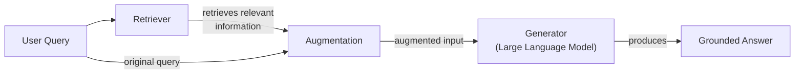
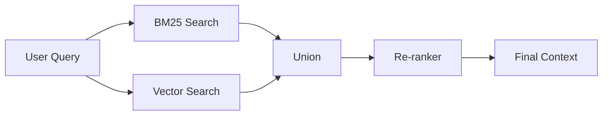
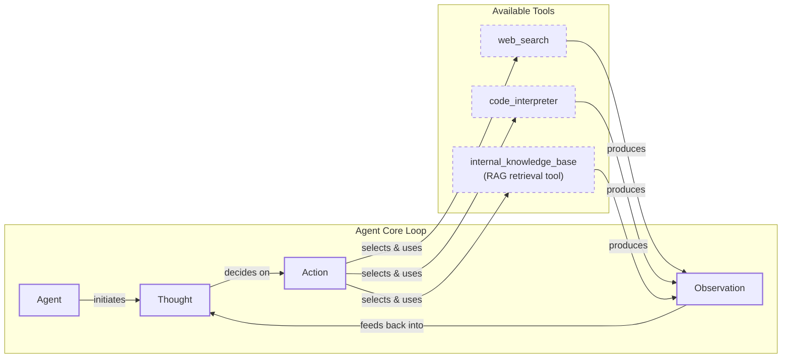

# Retrieval-Augmented Generation: Giving LLMs an Open-Book Exam

In our previous lessons, we’ve built a solid foundation in AI Engineering. We started with the agent landscape, distinguished between rule-based workflows and autonomous agents, and explored context engineering as the art of managing information flow to an LLM. We've also given agents the ability to use tools and reason through complex problems using frameworks like ReAct.

However, a core problem remains: LLMs are trained on a fixed dataset. Their knowledge is static, making them prone to hallucination and unable to access information created after their training date. For example, if you ask a model trained before 2024 about the NBA MVP of that year, it will either refuse to answer or, worse, invent a plausible but incorrect response [[1]](https://neo4j.com/blog/developer/fine-tuning-vs-rag/). During training, LLMs essentially take a "closed-book exam" on the world's information. Their knowledge is baked into their parameters, and this "parameterized knowledge" cannot be easily updated.

While we can fine-tune models with new data, this process is expensive, slow, and doesn't allow for real-time updates [[2]](https://medium.com/@tahirbalarabe2/retrieval-augmented-generation-vs-fine-tuning-enhancing-llms-697e7a0cf7e0). It’s like reprinting an entire textbook for a single new fact. Research consistently shows that LLMs struggle to learn new factual information through fine-tuning alone; they require extensive repetition and varied examples to internalize new knowledge [[4]](https://aclanthology.org/2024.emnlp-main.15.pdf). We have yet to develop techniques that allow models to learn continuously from experience after deployment.

This is where Retrieval-Augmented Generation (RAG) comes in. RAG is a reliable and cost-effective solution that allows us to inject new knowledge into the LLM's context window at inference time [[35]](https://aws.amazon.com/what-is/retrieval-augmented-generation/). Instead of forcing the model to memorize everything, we give it an "open-book exam" by connecting it to external, real-time knowledge sources. This is similar to how humans work; we don't memorize every fact but rely on manuals, notes, and search engines to find information when we need it. This approach also has parallels to classic AI techniques like Case-Based Reasoning (CBR), where a system solves new problems by retrieving and adapting solutions from similar past problems. While RAG retrieves factual knowledge, analogous to semantic memory, CBR retrieves specific experiences, akin to episodic memory [[65]](https://ceur-ws.org/Vol-3708/paper_21.pdf).

RAG is a key method AI engineers use in the process of context engineering, which we introduced in Lesson 3. It’s a powerful tool for curating the context we provide to LLMs. By retrieving only the most relevant information, RAG makes our applications more efficient and accurate. It is a practical alternative to fine-tuning, which is better suited for teaching a model a new skill or style rather than continuously updating its knowledge base [[1]](https://neo4j.com/blog/developer/fine-tuning-vs-rag/), [[4]](https://aclanthology.org/2024.emnlp-main.15.pdf). In this lesson, we will explore the "what" and "how" of RAG, starting with its basic components and moving toward the advanced and agentic patterns that power modern AI systems. It’s important to distinguish retrieval from agent memory, a topic we will explore in our next lesson, where we discuss the short- and long-term memory stores that complement RAG.

With the problem and motivation clear, we’ll first decompose RAG into its core components so you can see where each responsibility lives.

## The RAG System: Core Components

Understanding the components of RAG is the first step in the context engineering process of designing effective systems. At its core, a RAG system is built on three conceptual pillars that work together to ground an LLM's response in external data.

The first pillar is **retrieval**, which acts as the system's engine for finding relevant information. When a user asks a question, the retriever searches an external knowledge base to find documents or data snippets most likely to contain the answer. The most common approach for this is semantic similarity search, which relies on vector embeddings. Text is converted into numerical representations (embeddings) that capture its meaning. These embeddings are stored in a specialized vector database, which uses efficient algorithms to perform fast lookups [[6]](https://pub.towardsai.net/vector-databases-in-practice-building-a-realistic-hybrid-search-rag-system-with-qdrant-7b8f4a6e41e0). The user's query is also converted into an embedding, and the database then finds the vectors—and thus the text chunks—that are closest in meaning [[51]](https://apxml.com/courses/prompt-engineering-llm-application-development/chapter-6-integrating-llms-external-data-rag/implementing-semantic-search-retrieval), [[52]](https://medium.com/@robi.tomar72/how-rag-actually-works-embeddings-vector-databases-indexing-retrieval-explained-simply-3d1ca45fe1bf).

The theoretical principle behind this is that embeddings map text into a high-dimensional space where semantic proximity is represented by geometric distance. Vector databases facilitate efficient lookups in this space using Approximate Nearest Neighbor (ANN) algorithms like Hierarchical Navigable Small World (HNSW), which allow for scalable search across billions of vectors without having to compare the query to every single one [[7]](https://tutorialsdojo.com/aws-vector-databases-explained-semantic-search-and-rag-systems/). Another popular method is keyword-based search, using algorithms like BM25, which excels at finding exact matches for specific terms, names, or acronyms that semantic search might miss [[38]](https://mlpills.substack.com/p/issue-76-optimize-rag-with-hybrid).

The second pillar is **augmentation**, the process of taking the retrieved information and integrating it into the prompt that will be sent to the LLM. The original user query is combined with the relevant context found by the retriever. This augmented prompt provides the LLM with the specific, external knowledge it needs to formulate a high-quality response. Proper prompt engineering is essential here to ensure the model understands how to use the provided context effectively. This often involves using a template that clearly separates the retrieved documents from the user's question and instructs the model to base its answer on the given sources [[56]](https://www.topquadrant.com/resources/blog-retrieval-augmented-generation-explained/).

The final pillar is **generation**. The LLM receives the augmented prompt and generates a response. Because the prompt now contains grounded, factual information from the external source, the LLM's answer is more accurate, relevant, and less likely to be a hallucination. The model's role shifts from being a pure knowledge repository to a reasoning engine that synthesizes information from the provided context. This allows the system to provide answers that are not only correct but also verifiable, as they can be traced back to the original source documents [[29]](https://www.ibm.com/think/topics/retrieval-augmented-generation).



Image 1: A flowchart illustrating the core components and conceptual flow of a Retrieval Augmented Generation (RAG) system.

Now that you can name each moving part, let’s see how they line up across the two phases of a real system.

## The RAG Pipeline: Ingestion and Retrieval

The end-to-end RAG workflow is split into two distinct phases: an offline ingestion pipeline that prepares the knowledge base and an online retrieval pipeline that answers user queries in real-time. Separating these processes allows you to handle the computationally intensive data preparation offline, ensuring the online system is fast and responsive [[34]](https://apxml.com/courses/optimizing-rag-for-production/chapter-6-advanced-rag-evaluation-monitoring/rag-offline-online-evaluation).

### Phase 1: Offline Ingestion & Indexing

This phase is all about preparing your data to be searchable. It's a batch or streaming process that runs in the background to populate your vector database with the knowledge your application will need [[33]](https://towardsdatascience.com/ragops-guide-building-and-scaling-retrieval-augmented-generation-systems-3d26b3ebd627/).

1.  **Load:** The first step is to extract raw documents from various data sources, such as PDFs, websites, databases, or APIs. This can involve handling a wide range of formats and both structured and unstructured data. Tools like LangChain's document loaders or LlamaIndex's readers are commonly used for this task [[32]](https://newsletter.systemdesign.one/p/how-rag-works).
2.  **Split:** Since LLMs have limited context windows and retrieval works best with smaller, focused pieces of text, large documents are broken down into smaller chunks. The goal is to create "semantically meaningful pieces" that contain a coherent thought or idea. This involves a trade-off: smaller chunks offer more precise retrieval but may lack sufficient context, while larger chunks provide more context but can introduce noise. This can be done using simple rule-based splitters (e.g., LangChain's `RecursiveCharacterTextSplitter`) or more advanced semantic chunkers [[17]](https://sarthakai.substack.com/p/improve-your-rag-accuracy-with-a).
3.  **Embed:** Each chunk is then passed through an embedding model, which converts the text into a dense vector. This vector is a numerical representation that captures the semantic meaning of the chunk. The choice of embedding model and its dimensionality are critical factors that influence retrieval quality. Popular embedding models include OpenAI's `text-embedding-3` series, Google's `text-embedding-004`, and open-source models like BGE variants available on Hugging Face [[52]](https://medium.com/@robi.tomar72/how-rag-actually-works-embeddings-vector-databases-indexing-retrieval-explained-simply-3d1ca45fe1bf).
4.  **Store:** Finally, these embeddings, along with their corresponding text and any relevant metadata (like source, date, or category), are loaded into a vector database. This database indexes the vectors for efficient similarity search. Examples of vector stores include local libraries like FAISS, or scalable managed services like Milvus, Qdrant, and Pinecone [[9]](https://wandb.ai/mostafaibrahim17/ml-articles/reports/Vector-Embeddings-in-RAG-Applications--Vmlldzo3OTk1NDA5).

A key challenge in this offline phase is maintaining the freshness of the knowledge base. Over time, the indexed information can become outdated, leading to a problem known as **embedding drift**, where the stored vectors no longer accurately represent the current state of the source data. A robust ingestion pipeline must include a strategy for re-indexing documents as they change [[66]](https://milvus.io/ai-quick-reference/what-are-common-agentic-rag-failure-modes-in-production).

### Phase 2: Online Retrieval & Generation

This phase happens in real-time when a user interacts with your application [[31]](https://medium.com/@derrickryangiggs/rag-pipeline-deep-dive-ingestion-chunking-embedding-and-vector-search-abd3c8bfc177/).

1.  **Query:** The user submits a query to the system. This query can be pre-processed to normalize it or expand it for better results.
2.  **Embed:** The user's query is converted into a vector using the *same* embedding model and preprocessing steps that were used during the ingestion phase. This is critical to avoid a training-serving skew, ensuring that the query and the document chunks are in the same vector space and can be meaningfully compared [[8]](https://qdrant.tech/articles/what-is-rag-in-ai/), [[36]](https://decodingml.substack.com/p/rag-fundamentals-first?utm_source=publication-search).
3.  **Search:** The system uses the query vector to search the vector database. It performs a similarity search, often using a distance metric like cosine similarity, to find the top-k most similar document chunks. These are the chunks whose meanings are closest to the user's question [[54]](https://towardsdatascience.com/rag-explained-understanding-embeddings-similarity-and-retrieval/).
4.  **Generate:** The retrieved chunks are assembled into a prompt along with the original user query and specific instructions. This augmented prompt is then sent to an LLM, which generates a final answer grounded in the provided context. As we learned in Lesson 4, we can use structured outputs to format the answer and include citations, making the response verifiable [[56]](https://www.topquadrant.com/resources/blog-retrieval-augmented-generation-explained/).

This entire online process is sequential, meaning the latency of each step—encoding, searching, and generation—adds up. In production systems, this cumulative latency can become a major bottleneck, especially at scale [[67]](https://apxml.com/courses/large-scale-distributed-rag/chapter-1-scalable-rag-architectures-foundations/scaling-rag-bottlenecks-limitations).

```mermaid
flowchart LR
  %% Phase 1: Offline Ingestion & Indexing
  subgraph "Offline Ingestion & Indexing"
    RD["Raw Documents"]
    L["Load"]
    S["Split"]
    E["Embed"]
    ST["Store"]

    RD -- "read" --> L
    L -- "process" --> S
    S -- "convert" --> E
    E -- "save" --> ST
  end

  %% Phase 2: Online Retrieval & Generation
  subgraph "Online Retrieval & Generation"
    UQ["User Query"]
    EQ["Embed Query"]
    SR["Search"]
    G["Generate"]

    UQ -- "vectorize" --> EQ
    EQ -- "find similar" --> SR
    SR -- "build prompt & call LLM" --> G
  end

  %% Connection between phases
  ST -- "provides data for" .-> SR

  %% Visual grouping
  classDef phaseBox stroke-width:2px,stroke:#333,fill:#f9f9f9
  class "Offline Ingestion & Indexing", "Online Retrieval & Generation" phaseBox
```

Image 2: A detailed flowchart depicting the two distinct phases of an end-to-end RAG pipeline: Offline Ingestion & Indexing and Online Retrieval & Generation.

With the end-to-end path in place, the next question is quality. What are the advanced techniques to make retrieval more accurate and useful across messy, real-world data?

## Advanced RAG Techniques

A naive RAG pipeline often performs well in demos but can break down in production when faced with complex queries and diverse document types. To build a robust system, we need to move beyond simple vector search and incorporate more sophisticated techniques to improve retrieval quality and relevance.

### Hybrid Search

Hybrid search combines the strengths of traditional keyword-based search (like BM25) with modern semantic vector search. Keyword search is excellent for precision, especially with rare terms, IDs, or acronyms that vector search might miss. Vector search excels at understanding the meaning and context behind a query, catching paraphrases and related concepts [[39]](https://cubitrek.com/blog/hybrid-search-optimization-how-bm25-and-dense-vector-retrieval-work-together-for-superior-ai-search/).

The theoretical motivation is to leverage both lexical and semantic relevance. For instance, a query about a specific error code requires an exact match that keyword search provides, while a conceptual query about system performance benefits from the semantic understanding of vector search. By combining both, the system can handle a wider range of query types and provide more comprehensive results [[38]](https://mlpills.substack.com/p/issue-76-optimize-rag-with-hybrid). The results from both search methods are typically merged using a technique like Reciprocal Rank Fusion (RRF) to create a single, more relevant list of documents.

### Re-ranking

The initial retrieval step is optimized for speed and recall, meaning it aims to quickly find a broad set of potentially relevant documents. However, the most relevant document might not be at the top of this initial list. Re-ranking introduces a second, more precise model to re-order these initial results. This multi-stage pipeline, which balances broad retrieval with precise re-scoring, is a pattern inherited from traditional search engine architectures that have long optimized for relevance at scale [[72]](https://ijcaonline.org/archives/volume187/number18/veluru-2025-ijca-925279.pdf).

Cross-encoder models are commonly used for this task. Unlike bi-encoders, which create separate embeddings for the query and documents, a cross-encoder processes the query and a candidate document together. This allows for a deeper, token-level interaction between them, producing a more accurate relevance score [[43]](https://apxml.com/courses/optimizing-rag-for-production/chapter-2-advanced-retrieval-optimization/reranking-architectures-rag). This allows the system to make finer-grained relevance judgments, such as distinguishing between a technical guide and a marketing page that are both semantically similar to a product-related query [[42]](https://redis.io/blog/10-techniques-to-improve-rag-accuracy/).

However, this accuracy comes at a computational cost. A full transformer forward pass is required for every candidate document, which can become a latency bottleneck under high query loads where tail latencies increase sharply [[68]](https://towardsdatascience.com/advanced-rag-retrieval-cross-encoders-reranking/). This is why re-ranking is typically applied to a smaller subset of the top initial results, balancing precision with performance.



Image 3: A flowchart illustrating the Hybrid Retrieval Flow with re-ranking.

### Query Transformations

Sometimes, the user's original query isn't the best one for searching your knowledge base. Query transformation techniques rewrite or decompose the query to improve retrieval accuracy.

-   **Decomposition:** This technique breaks down a complex, multi-part question into several simpler sub-queries. The system retrieves documents for each sub-query and then synthesizes the results. For a query involving multiple constraints or entities, this method ensures that all aspects of the question are addressed [[19]](https://docs.nvidia.com/rag/latest/query_decomposition.html). Achieving perfect decomposition is an open research problem, especially for queries involving complex logical operators like negation or exclusion [[71]](https://arxiv.org/html/2510.18633v1).
-   **Hypothetical Document Embeddings (HyDE):** This method involves generating a hypothetical, ideal answer to the user's query first. This generated answer is then converted to an embedding and used for the similarity search. The idea is that this hypothetical document is often semantically closer to the actual answer documents than the original, sometimes vague, query [[16]](https://47billion.com/blog/rag-system-in-production-why-it-fails-and-how-to-fix-it/). The main limitation is that this hypothetical document is based on the LLM's parametric knowledge and may contain factual inaccuracies, which can misguide the search process toward plausible but incorrect documents [[70]](https://towardsdatascience.com/advanced-query-transformations-to-improve-rag-11adca9b19d1/).

### Advanced Chunking Strategies

How you split your documents can have a huge impact on retrieval quality.

-   **Fixed-size chunks** are simple but often break up content unnaturally. This can sever logical units of information, separating a policy statement from its corresponding exceptions or details.
-   **Semantic chunking** splits text based on topical coherence, ensuring that related sentences stay together. This is better for complex documents like academic papers where topic boundaries are important [[18]](https://cloudurable.com/blog/advanced-rag-techniques-that-will-transform-your-l/).
-   **Layout-aware chunking** is essential for documents with complex structures like tables, forms, or financial reports. Instead of splitting a table by character count and separating data points from their headers, this method preserves the structural integrity of the content [[17]](https://sarthakai.substack.com/p/improve-your-rag-accuracy-with-a).

### GraphRAG

GraphRAG introduces retrieval from knowledge graphs. This technique excels at answering questions about complex relationships and interconnected entities, which are often lost in standard document chunks. It builds a knowledge graph from the source documents by extracting entities and their relationships. This structured representation allows the system to traverse connections and answer multi-hop questions that require reasoning across multiple documents or data points [[46]](https://arxiv.org/html/2601.03014v1). This is particularly effective in complex domains like legal or engineering, where standard RAG can fail due to "temporal hallucinations" (retrieving an outdated clause over a newer amendment) or "contextual fragmentation" (failing to follow a chain of citations) [[69]](https://arxiv.org/html/2604.14220v1).

For example, a multi-hop query in a business context might require connecting information about product returns, their reasons, the specific products involved, and their appearance in recent marketing campaigns. A graph structure allows the system to navigate these connections deterministically, assembling a comprehensive context that would be difficult to gather with simple similarity search [[50]](https://arxiv.org/html/2501.00309v2).

### Beyond Simple Re-ranking

The two-stage pattern can be further refined. One advanced technique is **knowledge distillation**, where a large, accurate cross-encoder (the "teacher") is used to train a smaller, faster bi-encoder (the "student"). The student learns to mimic the teacher's relevance scores, effectively embedding domain-specific ranking logic into a fast retrieval model. Another approach is to use **late-interaction models** like ColBERT, which offer a middle ground. They encode documents into multi-vector representations (one per token) and perform cheap, token-level comparisons at query time, achieving near cross-encoder quality at much higher speeds [[68]](https://towardsdatascience.com/advanced-rag-retrieval-cross-encoders-reranking/).

These techniques increase retrieval quality. Next, we’ll see how retrieval becomes one tool that an agent can choose to use as it reasons.

## Agentic RAG

In Lessons 7 and 8, we explored the ReAct framework, where an agent cycles through Thought, Action, and Observation to solve problems. Agentic RAG is the application of this principle, where retrieval is not a fixed step in a pipeline but a tool that a reasoning agent can choose to use. The agent thinks, decides it has a knowledge gap, and then takes the action to retrieve information.

The core distinction between standard and agentic RAG is the shift from a linear workflow to an adaptive, iterative loop [[11]](https://towardsdatascience.com/agentic-rag-vs-classic-rag-from-a-pipeline-to-a-control-loop/).

-   **Standard RAG** is a rigid, pre-determined process: Retrieve → Augment → Generate. Every query follows this exact path.
-   **Agentic RAG** is dynamic. An agent decides *when* to retrieve, *how* to reformulate a query, *which* knowledge source to search, and whether it needs to chain multiple retrieval and reasoning steps to arrive at an answer [[12]](https://www.pingcap.com/article/agentic-rag-vs-traditional-rag-key-differences-benefits/).

This agentic approach unlocks several new capabilities. The agent can **iteratively** use the RAG tool, refining its query based on initial results. It can also **choose** which part of its knowledge base to search, like selecting a technical documentation index over a marketing content index for a product-related query, or even deciding between a semantic search over documents and a precise SQL query against a structured database [[75]](https://devblogs.microsoft.com/azure-sql/improve-the-r-in-rag-and-embrace-agentic-rag-in-azure-sql/).

Furthermore, it can **fuse** information from its internal RAG tool with data from other tools, like a web search, to form a more comprehensive answer [[13]](https://medium.com/@gaddam.rahul.kumar/agentic-rag-vs-traditional-rag-b1a156f72167). It can even decide to **update** the RAG system's knowledge base with new information it learns. This falls under the topic of Memory for Agents, which we will cover in the next lesson, but it involves the agent proposing writes to a long-term memory store based on new, verified information.

However, this iterative power introduces new risks. The agent can fall into failure modes like **retrieval thrash**, endlessly re-retrieving similar documents, or it may struggle to reconcile contradictory information from different sources [[74]](https://towardsdatascience.com/agentic-rag-failure-modes-retrieval-thrash-tool-storms-and-context-bloat-and-how-to-spot-them-early/), [[73]](https://dev.to/kuldeep_paul/ten-failure-modes-of-rag-nobody-talks-about-and-how-to-detect-them-systematically-7i4). The latency of multiple steps is also a key trade-off, leading to adaptive systems that choose between simple RAG and a full agentic loop based on query complexity [[76]](https://redis.io/blog/agentic-rag-how-enterprises-are-surmounting-the-limits-of-traditional-rag/).

This transforms the interaction from a simple database lookup into a conversation with a knowledgeable research assistant. The RAG system is no longer just a pipeline; it's a dynamic capability within a larger reasoning loop.



Image 4: A conceptual flowchart illustrating an agent's main loop in an Agentic RAG system, inspired by the ReAct framework.

You now understand both a linear RAG pipeline and how an agent can control retrieval when needed. Let’s wrap up by situating RAG in the wider AI Engineering toolkit and previewing what comes next.

## Conclusion

RAG is the most widely used and reliable solution to the LLM knowledge problem. While a basic pipeline is a good starting point, advanced techniques like hybrid search, re-ranking, and GraphRAG are essential for achieving production-grade quality. The future of knowledge retrieval is agentic, where RAG becomes a dynamic tool within an intelligent agent's reasoning loop.

By grounding LLMs in external data, RAG reduces hallucinations, enables customization with proprietary information, and builds user trust through verifiable, source-based answers. For the modern AI Engineer, mastering RAG is not a niche skill but a foundational competency and a core part of the broader discipline of Context Engineering. It is the bridge that connects the powerful reasoning capabilities of LLMs to the vast, ever-changing world of real-world data.

In our next lesson, we will explore Memory for Agents, and see how short-term and long-term memory systems complement the retrieval capabilities we've discussed today. This will complete our understanding of how agents access and manage information. We will also cover other important topics like retrieval quality evaluation and production monitoring in later parts of the course, providing you with the end-to-end skills needed to build and maintain robust, knowledge-intensive AI systems.

## References

- [1] [Fine-Tuning vs. Retrieval Augmented Generation for LLMs](https://neo4j.com/blog/developer/fine-tuning-vs-rag/)
- [2] [Retrieval-Augmented Generation vs Fine-tuning: Enhancing LLMs](https://medium.com/@tahirbalarabe2/retrieval-augmented-generation-vs-fine-tuning-enhancing-llms-697e7a0cf7e0)
- [3] [Addressing AI hallucinations with retrieval-augmented generation](https://www.infoworld.com/article/2335043/addressing-ai-hallucinations-with-retrieval-augmented-generation.html)
- [4] [Fine-Tuning or Retrieval? Comparing Knowledge Injection in LLMs](https://aclanthology.org/2024.emnlp-main.15.pdf)
- [5] [Comparing Knowledge Injection in LLMs](https://arxiv.org/html/2312.05934v3)
- [6] [Vector Databases in Practice: Building a Realistic Hybrid Search RAG System with Qdrant](https://pub.towardsai.net/vector-databases-in-practice-building-a-realistic-hybrid-search-rag-system-with-qdrant-7b8f4a6e41e0)
- [7] [AWS Vector Databases Explained: Semantic Search and RAG Systems](https://tutorialsdojo.com/aws-vector-databases-explained-semantic-search-and-rag-systems/)
- [8] [What is RAG in AI?](https://qdrant.tech/articles/what-is-rag-in-ai/)
- [9] [Vector Embeddings in RAG Applications](https://wandb.ai/mostafaibrahim17/ml-articles/reports/Vector-Embeddings-in-RAG-Applications--Vmlldzo3OTk1NDA5)
- [10] [What Is Retrieval-Augmented Generation, aka RAG?](https://blogs.nvidia.com/blog/what-is-retrieval-augmented-generation/)
- [11] [Agentic RAG vs Classic RAG: From a Pipeline to a Control Loop](https://towardsdatascience.com/agentic-rag-vs-classic-rag-from-a-pipeline-to-a-control-loop/)
- [12] [Agentic RAG vs. Traditional RAG: Key Differences & Benefits](https://www.pingcap.com/article/agentic-rag-vs-traditional-rag-key-differences-benefits/)
- [13] [Agentic RAG vs Traditional RAG](https://medium.com/@gaddam.rahul.kumar/agentic-rag-vs-traditional-rag-b1a156f72167)
- [14] [AI Agent vs RAG: What’s the Difference?](https://airbyte.com/agentic-data/ai-agent-vs-rag)
- [15] [RAG vs. Agentic AI: What’s the Difference?](https://domino.ai/blog/rag-vs-agentic-ai)
- [16] [Why Your RAG System Fails in Production and How to Fix It](https://47billion.com/blog/rag-system-in-production-why-it-fails-and-how-to-fix-it/)
- [17] [Improve Your RAG Accuracy With A Better Chunking Strategy](https://sarthakai.substack.com/p/improve-your-rag-accuracy-with-a)
- [18] [Advanced RAG Techniques That Will Transform Your LLM Application](https://cloudurable.com/blog/advanced-rag-techniques-that-will-transform-your-l/)
- [19] [Query Decomposition](https://docs.nvidia.com/rag/latest/query_decomposition.html)
- [20] [Advanced RAG Techniques for High-Performance LLM Applications](https://neo4j.com/blog/genai/advanced-rag-techniques/)
- [21] [Retrieval-Augmented Generation: Building Grounded AI for Enterprise Knowledge](https://medium.com/@fahey_james/retrieval-augmented-generation-building-grounded-ai-for-enterprise-knowledge-6bc46277fee5)
- [22] [What is RAG?](https://www.mindstudio.ai/blog/what-is-rag/)
- [23] [A Complete Guide to RAG](https://towardsai.net/p/l/a-complete-guide-to-rag)
- [24] [Your RAG is wrong: Here's how to fix it](https://decodingml.substack.com/p/your-rag-is-wrong-heres-how-to-fix?utm_source=publication-search)
- [25] [RAG Inventor Talks Agents, Grounded AI, and Enterprise Impact](https://www.madrona.com/rag-inventor-talks-agents-grounded-ai-and-enterprise-impact/)
- [26] [RAG Architectures Explained](https://humanloop.com/blog/rag-architectures)
- [27] [RAG and its different components](https://www.aimon.ai/posts/rag_and_its_different_components/)
- [28] [Grounding LLMs: Driving AI to Deliver Contextually Relevant Data](https://toloka.ai/blog/grounding-llms-driving-ai-to-deliver-contextually-relevant-data/)
- [29] [What is retrieval-augmented generation?](https://www.ibm.com/think/topics/retrieval-augmented-generation)
- [30] [RAG Architecture: An Overview of the 3 Core Components](https://galileo.ai/blog/rag-architecture)
- [31] [RAG Pipeline Deep Dive: Ingestion (Chunking, Embedding) and Vector Search](https://medium.com/@derrickryangiggs/rag-pipeline-deep-dive-ingestion-chunking-embedding-and-vector-search-abd3c8bfc177)
- [32] [How RAG Works](https://newsletter.systemdesign.one/p/how-rag-works)
- [33] [RAGOps Guide: Building and Scaling Retrieval-Augmented Generation Systems](https://towardsdatascience.com/ragops-guide-building-and-scaling-retrieval-augmented-generation-systems-3d26b3ebd627/)
- [34] [RAG Offline vs. Online Evaluation](https://apxml.com/courses/optimizing-rag-for-production/chapter-6-advanced-rag-evaluation-monitoring/rag-offline-online-evaluation)
- [35] [What is Retrieval-Augmented Generation (RAG)?](https://aws.amazon.com/what-is/retrieval-augmented-generation/)
- [36] [Retrieval-Augmented Generation (RAG) Fundamentals First](https://decodingml.substack.com/p/rag-fundamentals-first?utm_source=publication-search)
- [37] [From Local to Global: A GraphRAG Approach to Query-Focused Summarization](https://arxiv.org/html/2404.16130)
- [38] [Optimize RAG with Hybrid Search](https://mlpills.substack.com/p/issue-76-optimize-rag-with-hybrid)
- [39] [Hybrid Search Optimization: How BM25 and Dense Vector Retrieval Work Together](https://cubitrek.com/blog/hybrid-search-optimization-how-bm25-and-dense-vector-retrieval-work-together-for-superior-ai-search/)
- [40] [Hybrid RAG in the Real World: Graphs, BM25, and the End of Black Box Retrieval](https://community.netapp.com/t5/Tech-ONTAP-Blogs/Hybrid-RAG-in-the-Real-World-Graphs-BM25-and-the-End-of-Black-Box-Retrieval/ba-p/464834)
- [41] [Pistis-RAG: Enhancing Retrieval-Augmented Generation with Human Feedback](https://arxiv.org/html/2407.00072v5)
- [42] [10 Techniques to Improve RAG Accuracy](https://redis.io/blog/10-techniques-to-improve-rag-accuracy/)
- [43] [Reranking Architectures for RAG](https://apxml.com/courses/optimizing-rag-for-production/chapter-2-advanced-retrieval-optimization/reranking-architectures-rag)
- [44] [Advanced RAG Techniques for High-Performance LLM Applications](https://neo4j.com/blog/genai/advanced-rag-techniques/)
- [45] [Advanced RAG Retrieval: Cross-Encoders & Reranking](https://towardsdatascience.com/advanced-rag-retrieval-cross-encoders-reranking/)
- [46] [GraphRAG: A Graph-Based Approach to Question Answering](https://arxiv.org/html/2601.03014v1)
- [47] [Introducing Contextual Retrieval](https://www.anthropic.com/news/contextual-retrieval)
- [48] [GraphRAG: A Graph-Based Approach to Question Answering over Private Text Corpora](https://webhome.cs.uvic.ca/~thomo/papers/asonam2025-graphrag.pdf)
- [49] [What is GraphRAG?](https://atlan.com/know/what-is-graphrag/)
- [50] [GraphRAG: A Graph-Based Approach for Multi-Hop Question Answering](https://arxiv.org/html/2501.00309v2)
- [51] [Implementing Semantic Search for Retrieval](https://apxml.com/courses/prompt-engineering-llm-application-development/chapter-6-integrating-llms-external-data-rag/implementing-semantic-search-retrieval)
- [52] [How RAG Actually Works: Embeddings, Vector Databases, Indexing & Retrieval Explained Simply](https://medium.com/@robi.tomar72/how-rag-actually-works-embeddings-vector-databases-indexing-retrieval-explained-simply-3d1ca45fe1bf)
- [53] [Vector DB and RAG Pipeline for Document RAG](https://learnopencv.com/vector-db-and-rag-pipeline-for-document-rag/)
- [54] [RAG Explained: Understanding Embeddings, Similarity, and Retrieval](https://towardsdatascience.com/rag-explained-understanding-embeddings-similarity-and-retrieval/)
- [55] [AWS Vector Databases Explained: Semantic Search and RAG Systems](https://tutorialsdojo.com/aws-vector-databases-explained-semantic-search-and-rag-systems/)
- [56] [Retrieval-Augmented Generation Explained](https://www.topquadrant.com/resources/blog-retrieval-augmented-generation-explained/)
- [57] [What is Agentic RAG](https://weaviate.io/blog/what-is-agentic-rag)
- [58] [Introduction to Augmenting LLMs using Retrieval Augmented Generation (RAG)](https://medium.com/@rahulraut.techuse/introduction-to-augmenting-llms-using-retrieval-augmented-generation-rag-6530123dbb91)
- [59] [Retrieval-Augmented Generation (RAG)](https://www.promptingguide.ai/research/rag)
- [60] [Retrieval Augmented Generation (RAG) from Basics to Advanced](https://medium.com/@tejpal.abhyuday/retrieval-augmented-generation-rag-from-basics-to-advanced-a2b068fd576c)
- [61] [RAG is dead, long live agentic retrieval](https://www.llamaindex.ai/blog/rag-is-dead-long-live-agentic-retrieval)
- [62] [What is agentic RAG?](https://www.ibm.com/think/topics/agentic-rag)
- [63] [Build advanced retrieval-augmented generation systems](https://learn.microsoft.com/en-us/azure/developer/ai/advanced-retrieval-augmented-generation)
- [64] [The Rise of RAG](https://highlearningrate.substack.com/p/the-rise-of-rag)
- [65] [Case-Based Reasoning and RAG](https://ceur-ws.org/Vol-3708/paper_21.pdf)
- [66] [Common Agentic RAG Failure Modes in Production](https://milvus.io/ai-quick-reference/what-are-common-agentic-rag-failure-modes-in-production)
- [67] [Scaling RAG: Bottlenecks and Limitations](https://apxml.com/courses/large-scale-distributed-rag/chapter-1-scalable-rag-architectures-foundations/scaling-rag-bottlenecks-limitations)
- [68] [Advanced RAG Retrieval: Cross-Encoders & Reranking](https://towardsdatascience.com/advanced-rag-retrieval-cross-encoders-reranking/)
- [69] [Limitations of Standard Vector RAG](https://arxiv.org/html/2604.14220v1)
- [70] [Advanced Query Transformations to Improve RAG](https://towardsdatascience.com/advanced-query-transformations-to-improve-rag-11adca9b19d1/)
- [71] [Query Decomposition as a Bandit Problem](https://arxiv.org/html/2510.18633v1)
- [72] [Generative Retrieval and LLM-Native Architectures](https://ijcaonline.org/archives/volume187/number18/veluru-2025-ijca-925279.pdf)
- [73] [Ten Failure Modes of RAG Nobody Talks About](https://dev.to/kuldeep_paul/ten-failure-modes-of-rag-nobody-talks-about-and-how-to-detect-them-systematically-7i4)
- [74] [Agentic RAG Failure Modes: Retrieval Thrash, Tool Storms, and Context Bloat](https://towardsdatascience.com/agentic-rag-failure-modes-retrieval-thrash-tool-storms-and-context-bloat-and-how-to-spot-them-early/)
- [75] [Improve the R in RAG and Embrace Agentic RAG in Azure SQL](https://devblogs.microsoft.com/azure-sql/improve-the-r-in-rag-and-embrace-agentic-rag-in-azure-sql/)
- [76] [Agentic RAG: How Enterprises Are Surmounting the Limits of Traditional RAG](https://redis.io/blog/agentic-rag-how-enterprises-are-surmounting-the-limits-of-traditional-rag/)

</article>