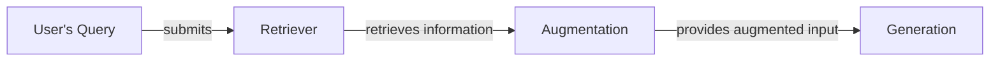
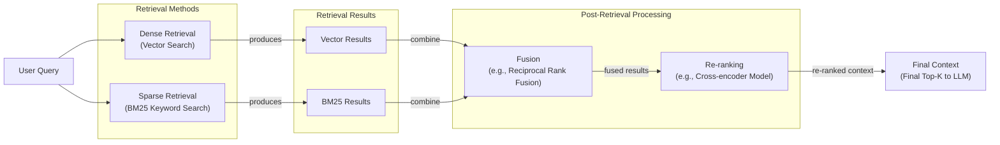
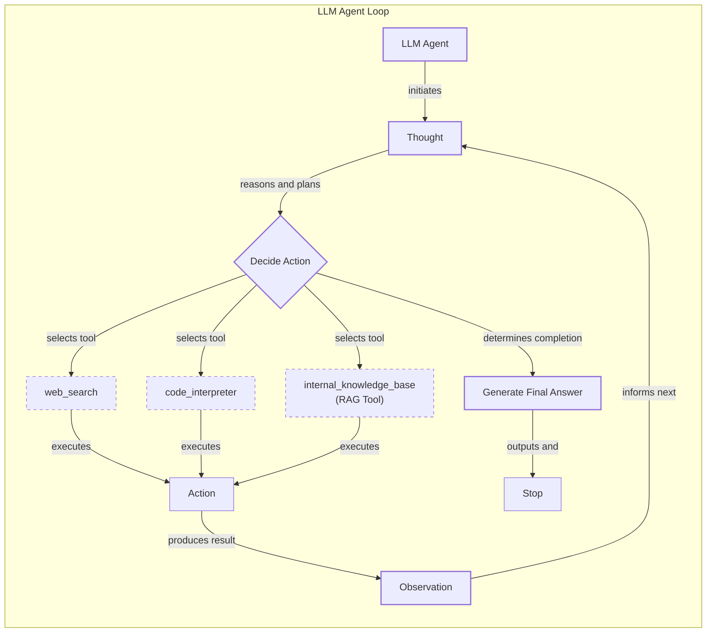

# Lesson 9: Retrieval-Augmented Generation

In our previous lessons, we built a solid foundation in AI Engineering. We explored the agent landscape, distinguished between rule-based workflows and autonomous agents, and dove into context engineering. We learned how to give agents tools to act on the world and how to implement reasoning loops with ReAct. Now, we will tackle one of the most fundamental challenges in building knowledgeable AI systems.

LLMs are trained on a fixed snapshot of the world’s information, which means their knowledge is static and they can confidently invent facts, a phenomenon known as hallucination. During their training, they are essentially taking a "closed-book exam." We do not yet have techniques that allow models to learn new information over time after deployment in the way humans do. We can fine-tune them, but this process is inefficient.

Fine-tuning is a resource-heavy and slow process. It requires curating large, high-quality datasets of question-answer pairs, which can be a complex and expensive task in itself [[1]](https://neo4j.com/blog/developer/fine-tuning-vs-rag/). The training jobs can run for multiple days, consuming significant computational resources. Furthermore, fine-tuning carries the risk of "catastrophic forgetting," a phenomenon where the model's performance on its original tasks degrades as it learns new information. This makes it an impractical solution for keeping an AI system's knowledge up-to-date with rapidly changing data.

Simply expanding the context window isn't a silver bullet either. While modern models can handle millions of tokens, this approach has its own drawbacks. First, there are significant cost implications, as API providers charge per token. Sending vast amounts of text with every query is not economically viable at scale. Second, large contexts increase latency, making applications slow and unresponsive. Finally, performance degrades due to the "lost-in-the-middle" problem. Models tend to recall information from the beginning and end of a long context more accurately than information buried in the middle, effectively creating a blind spot.

A more practical and effective solution is Retrieval-Augmented Generation (RAG). RAG gives the LLM an "open-book exam" by connecting it to external, real-time knowledge sources. Instead of forcing the model to memorize everything, we allow it to look up information when needed, much like a human using a cheat sheet or a reference manual.

In Lesson 3, we introduced Context Engineering as the practice of curating the information an LLM receives. RAG is a core method AI Engineers use to implement this, ensuring the model gets relevant, timely, and factual data. This skill is not optional—it's a fundamental competency for creating agents that can use proprietary data, access real-time information, and provide accurate, source-backed answers.

In this lesson, we will explore the what and how of RAG, from its basic components to the advanced and agentic patterns that power modern AI systems. We will also see how retrieval complements an agent's memory, a topic we will explore further in Lesson 10.

With the problem and motivation clear, we’ll first decompose RAG into its core components so you can see where each responsibility lives.

## The RAG System: Core Components

To design effective RAG systems, you must first understand its three conceptual pillars. These components work together to find, prepare, and use external knowledge to answer a user's query. Understanding them is the first step in the Context Engineering process we discussed in Lesson 3.


Image 1: A flowchart illustrating the core components and sequential interaction of a Retrieval Augmented Generation (RAG) system.

### Retrieval

The retriever is the engine responsible for finding relevant information. When a user asks a question, the retriever searches an external knowledge base to find documents or data snippets that are likely to contain the answer. The most common approach is **semantic search**, which finds text that is contextually similar in meaning, even if the wording is different [[2]](https://apxml.com/courses/prompt-engineering-llm-application-development/chapter-6-integrating-llms-external-data-rag/implementing-semantic-search-retrieval).

This is made possible by **vector embeddings**. An embedding model, such as one from OpenAI or Google, converts a piece of text into a high-dimensional numerical vector. This vector is a mathematical representation that captures the text's semantic meaning. Chunks of text with similar meanings will have vectors that are located closer together in this high-dimensional space [[2]](https://apxml.com/courses/prompt-engineering-llm-application-development/chapter-6-integrating-llms-external-data-rag/implementing-semantic-search-retrieval).

These vectors are then stored in a specialized **vector database**, which is optimized for performing fast and efficient similarity searches at scale [[3]](https://pub.towardsai.net/vector-databases-in-practice-building-a-realistic-hybrid-search-rag-system-with-qdrant-7b8f4a6e41e0), [[4]](https://learnopencv.com/vector-db-and-rag-pipeline-for-document-rag/). When a user's query comes in, it is also converted into a vector using the same embedding model. The vector database then uses a distance metric, like cosine similarity, to find the stored vectors that are "closest" to the query vector, effectively finding the most semantically relevant information [[5]](https://towardsdatascience.com/rag-explained-understanding-embeddings-similarity-and-retrieval/).

### Augmentation

Once the retriever has found a set of relevant document chunks, the augmentation step begins. This process involves taking the retrieved information and formatting it into the prompt that will be sent to the LLM. The goal is to provide the model with all the necessary context to answer the user's query accurately.

The process of constructing the augmented prompt is a crucial part of prompt engineering. It typically involves a template that structures the information for the LLM. The steps are as follows:
1.  Start with a system instruction that defines the LLM's task, such as "You are a helpful assistant. Answer the user's question based only on the provided context."
2.  Insert the retrieved document chunks, often separated by clear delimiters or headers like `<context>` and `</context>` to help the model distinguish them from the rest of the prompt.
3.  Include the original user query.
4.  Add a final instruction, like "Based on the context, please answer the question."

A well-structured augmented prompt guides the LLM to ground its response in the provided information, rather than relying on its internal, parametric knowledge [[6]](https://www.topquadrant.com/resources/blog-retrieval-augmented-generation-explained/).

### Generation

The final step is generation. The LLM receives the augmented prompt, which now contains both the user's question and the relevant context retrieved from the external knowledge base. The model then synthesizes this information to generate a coherent, factually grounded answer [[7]](https://www.aimon.ai/posts/rag_and_its_different_components/). The LLM is not just extracting and repeating text; it is reasoning over the provided context to formulate a new response in natural language.

Because the answer is based on specific, retrieved sources, it is possible to include citations, allowing users to verify the information. This traceability is a key advantage of RAG, as it builds trust and makes the system's outputs more reliable [[1]](https://neo4j.com/blog/developer/fine-tuning-vs-rag/).

Now that you can name each moving part, let’s see how they line up across the two phases of a real system.

## The RAG Pipeline: Ingestion and Retrieval

An end-to-end RAG system is typically split into two distinct phases: an offline ingestion pipeline that prepares the data, and an online retrieval pipeline that answers queries at runtime [[8]](https://newsletter.systemdesign.one/p/how-rag-works). Understanding both is key to building a robust system.

```mermaid
flowchart LR
  %% Offline Ingestion & Indexing Phase
  subgraph "Offline Ingestion & Indexing"
    RD["Raw Documents"]
    DL["Document Loader<br/>(Unstructured, LangChain, LlamaIndex)"]
    TSC["Text Splitter & Chunking<br/>(RecursiveCharacterTextSplitter, SemanticSplitter)"]
    C["Chunks"]
    EM_OFF["Embedding Model<br/>(OpenAI, Google Gemini, Cohere, Voyage, bge)"]
    E["Embeddings"]
    VD["Vector Database<br/>(FAISS, Milvus, Qdrant, Pinecone, Elasticsearch/OpenSearch, Azure AI Search)"]

    RD -- "load" --> DL
    DL -- "process" --> TSC
    TSC -- "create" --> C
    C -- "embed" --> EM_OFF
    EM_OFF -- "generate" --> E
    E -- "store" --> VD
  end

  %% Online Retrieval & Generation Phase
  subgraph "Online Retrieval & Generation"
    UQ["User Query"]
    EM_ON["Embedding Model<br/>(Same as offline)"]
    QV["Query Vector"]
    SS["Similarity Search"]
    TKC["Top-K Chunks"]
    PB["Prompt Builder"]
    AP["Augmented Prompt"]
    LLM["Large Language Model (LLM)"]
    RG["Response Generation"]
    FA["Final Answer"]

    UQ -- "embed" --> EM_ON
    EM_ON -- "generate" --> QV
    QV -- "search" --> SS
    SS -- "retrieve" --> TKC
    VD -. "provides data for" .-> SS
    TKC -- "combine with query & instructions" --> PB
    UQ -. "provides query to" .-> PB
    PB -- "create" --> AP
    AP -- "send to" --> LLM
    LLM -- "perform" --> RG
    RG -- "produce" --> FA
  end

  %% Visual grouping
  classDef store stroke-dasharray:3,3
  classDef exec stroke-width:2px
  class VD store
  class DL,TSC,EM_OFF,EM_ON,SS,PB,LLM,RG exec
```


Image 2: A detailed Mermaid diagram illustrating the end-to-end RAG workflow, divided into two distinct phases: Offline Ingestion & Indexing and Online Retrieval & Generation.

### Phase 1: Offline Ingestion & Indexing

This phase is all about preparing your knowledge base for fast and accurate retrieval. It happens offline, before any user asks a question [[9]](https://medium.com/@derrickryangiggs/rag-pipeline-deep-dive-ingestion-chunking-embedding-and-vector-search-abd3c8bfc177).

1.  **Load:** The process starts by loading documents from various sources, which could be anything from PDFs and websites to databases and APIs. This step presents challenges due to diverse formats; for example, PDFs may contain complex tables and images that are difficult to parse, while web pages include boilerplate content like ads and navigation bars that need to be removed. Tools like LangChain's document loaders or LlamaIndex's data connectors provide a unified interface for handling these formats.

2.  **Split:** Once loaded, the documents are broken down into smaller, manageable pieces called chunks. This is a critical step because the quality of your chunks directly impacts retrieval performance. The goal is to create chunks that are semantically coherent and self-contained. Naive fixed-size chunking can split sentences mid-thought, losing context. More advanced strategies, like `RecursiveCharacterTextSplitter` in LangChain, split text along natural boundaries like paragraphs and sentences, which generally yields better results.

3.  **Embed:** Each chunk is then passed through an embedding model to convert it into a vector. The choice of embedding model is important, as it determines the quality of the semantic representation. Popular options include models from OpenAI (e.g., `text-embedding-3-large`), Google (`text-embedding-004`), Cohere, and open-source variants like BGE available on Hugging Face. The same model must be used for both indexing documents and embedding user queries to ensure they are in the same vector space.

4.  **Store:** Finally, the generated embeddings and their corresponding text chunks are stored in a vector database. This database creates an index that allows for efficient similarity search. There are various options available, each suited for different use cases. Local libraries like FAISS are excellent for rapid prototyping and smaller datasets. For larger, production-grade applications, scalable open-source databases like Milvus and Qdrant are popular choices. Managed cloud services like Pinecone offer ease of use and scalability without the operational overhead. Additionally, many traditional search systems like Elasticsearch and OpenSearch now offer k-Nearest Neighbor (kNN) capabilities, and cloud providers like Azure have dedicated AI Search services.

A common failure mode in production occurs at the chunking stage. In a case study building a Q&A system over university presentation slides, a naive fixed-size chunking strategy consistently produced poor results [[15]](https://47billion.com/blog/rag-system-in-production-why-it-fails-and-how-to-fix-it/). The chunker would split a slide's content mid-bullet point, separating a key concept like the STAR method ("Situation → Task → Action → Result") from its context. When a student asked about behavioral interview techniques, the system would retrieve a fragmented chunk, leading to a vague or incorrect answer. The solution was to implement hierarchical chunking, which preserved the structure of the presentation, ensuring that each chunk corresponded to a complete slide or a meaningful section. This improved answer accuracy from 61% to 89% in their internal benchmarks [[15]](https://47billion.com/blog/rag-system-in-production-why-it-fails-and-how-to-fix-it/).

### Phase 2: Online Retrieval & Generation

This phase happens in real-time, responding to a user's query [[10]](https://towardsdatascience.com/ragops-guide-building-and-scaling-retrieval-augmented-generation-systems-3d26b3ebd627/).

1.  **Query:** A user submits a query to the system. This query can be pre-processed to normalize it or expand it with synonyms to improve the chances of finding a match.

2.  **Embed:** The user's query is converted into a vector using the exact same embedding model that was used during the ingestion phase. This ensures that the query and the document chunks can be compared in the same semantic space [[11]](https://qdrant.tech/articles/what-is-rag-in-ai/).

3.  **Search:** The query vector is used to search the vector database. The database performs a similarity search (often using cosine similarity) to find the top-k document chunks whose embeddings are closest to the query embedding [[5]](https://towardsdatascience.com/rag-explained-understanding-embeddings-similarity-and-retrieval/). These top-k chunks are the most semantically relevant pieces of information from the knowledge base.

4.  **Generate:** The retrieved chunks are combined with the original user query and a set of instructions into a single prompt. This augmented prompt is then sent to an LLM. The LLM uses the provided context to generate a final answer that is grounded in the retrieved data. As we learned in Lesson 4, using structured outputs can help format the response and ensure that citations are included, making the answer verifiable.

With the end-to-end path in place, the next question is quality: what are the advanced techniques to make retrieval more accurate and useful across messy, real-world data?

## Advanced RAG Techniques

A naive RAG pipeline is a great starting point, but production systems require more sophisticated techniques to handle the complexities of real-world data and user queries. These advanced methods are designed to improve the quality, relevance, and efficiency of the retrieval process.


Image 3: Mermaid diagram illustrating the hybrid retrieval flow.

### Hybrid Search

Vector search is powerful for understanding semantic meaning, but it can sometimes miss exact keywords, product codes, or specific names. **Hybrid search** addresses this by combining dense (vector-based) retrieval with sparse (keyword-based) retrieval methods like BM25 [[12]](https://pr-peri.github.io/blogpost/2026/03/05/blogpost-hybrid-search.html). BM25 excels at finding exact term matches. By running both searches in parallel and fusing the results—often using a technique like **Reciprocal Rank Fusion (RRF)**—the system can capture both semantic relevance and keyword precision. For example, if a user asks, "My bill keeps rolling over," vector search might find articles about "carryover balances," while keyword search ensures documents containing the exact term "rollover" are also retrieved.

### Re-ranking

The initial retrieval step is optimized for speed and recall, meaning it casts a wide net to find potentially relevant documents. However, the top-k results are not always ordered by true relevance. A **re-ranker** is a second, more precise model that re-orders this initial set of documents. Typically, a cross-encoder model is used, which takes the user query and each candidate document as a pair and outputs a relevance score [[13]](https://apxml.com/courses/optimizing-rag-for-production/chapter-2-advanced-retrieval-optimization/reranking-architectures-rag). While slower than the initial retrieval, this step is only applied to a small number of candidates (e.g., the top 50), making it computationally feasible. For a query like "how to connect my account," a re-ranker, such as the one offered by Cohere, can promote a step-by-step guide above a less relevant press release.

### Query Transformations

Sometimes, the user's query is not in the optimal format for retrieval. **Query transformations** rewrite the query to improve its chances of matching relevant documents.
-   **Decomposition** breaks down a complex, multi-faceted question into smaller, more focused sub-queries. For a question like, “What’s our travel policy for conferences in Europe this year?” the system might generate sub-queries like “Where is the travel policy?” and “What are the rules for Europe?” It then retrieves documents for each and merges the results [[14]](https://docs.nvidia.com/rag/latest/query_decomposition.html).
-   **Hypothetical Document Embeddings (HyDE)** addresses the gap between how questions are phrased and how answers are written. The system first generates a hypothetical, ideal answer to the query using an LLM. It then embeds this hypothetical answer and uses the resulting vector for the similarity search [[15]](https://47billion.com/blog/rag-system-in-production-why-it-fails-and-how-to-fix-it/). This often leads to more relevant document retrieval because the hypothetical answer is more semantically similar to the actual source documents.

### Advanced Chunking Strategies

The way documents are chunked has a massive impact on retrieval quality. NVIDIA's 2024 benchmarks found up to a 9% recall gap between the best and worst chunking strategies, with page-level chunking performing best for structured PDFs [[15]](https://47billion.com/blog/rag-system-in-production-why-it-fails-and-how-to-fix-it/). Moving beyond simple fixed-size chunking is crucial.
-   **Semantic chunking** splits text based on topic shifts, ensuring that each chunk contains a single, coherent idea. This preserves conceptual integrity, which is vital for complex documents like research papers or legal contracts [[16]](https://sarthakai.substack.com/p/improve-your-rag-accuracy-with-a).
-   **Layout-aware chunking** is essential for documents with complex structures like PDFs, tables, or forms. This strategy uses a parser to identify structural elements and chunks the document accordingly [[16]](https://sarthakai.substack.com/p/improve-your-rag-accuracy-with-a).
-   **Context-enriched chunking**, also known as contextual retrieval, prepends a summary of the document's context to each chunk before embedding. This helps the embedding capture the chunk's place within the larger document, improving retrieval for context-dependent information.

Here is a conceptual code example showing how to implement a more advanced chunking strategy, known as parent document retrieval, using LangChain. This contrasts with a basic retriever.

1.  First, we set up a basic retriever that uses a simple `RecursiveCharacterTextSplitter`.
    ```python
    from langchain.text_splitter import RecursiveCharacterTextSplitter
    from langchain_community.vectorstores import Chroma
    from langchain_openai import OpenAIEmbeddings
    
    # Basic setup
    text_splitter = RecursiveCharacterTextSplitter(chunk_size=512, chunk_overlap=50)
    docs = text_splitter.split_documents(raw_documents)
    vectorstore = Chroma.from_documents(documents=docs, embedding=OpenAIEmbeddings())
    basic_retriever = vectorstore.as_retriever()
    ```
2.  Next, we implement the parent document retriever. It uses two splitters: one for creating small "child" chunks for precise retrieval and another for creating larger "parent" chunks that provide more context.
    ```python
    from langchain.retrievers import ParentDocumentRetriever
    from langchain.storage import InMemoryStore
    
    # Advanced setup: Parent Document Retriever
    parent_splitter = RecursiveCharacterTextSplitter(chunk_size=2048)
    child_splitter = RecursiveCharacterTextSplitter(chunk_size=400)
    
    # The store for parent documents
    docstore = InMemoryStore()
    
    advanced_retriever = ParentDocumentRetriever(
        vectorstore=vectorstore, # The same vectorstore can be used, but indexed with child docs
        docstore=docstore,
        child_splitter=child_splitter,
        parent_splitter=parent_splitter,
    )
    # This retriever would be populated with documents via advanced_retriever.add_documents()
    ```
    In this setup, the `advanced_retriever` first finds the relevant small child chunks from the `vectorstore` and then retrieves the corresponding large parent chunks from the `docstore` to pass to the LLM.

### GraphRAG

For questions about complex relationships and interconnected entities, standard document retrieval often falls short. **GraphRAG** builds a knowledge graph from the source documents, where nodes represent entities (like people, companies, or products) and edges represent their relationships [[17]](https://arxiv.org/html/2601.03014v1). Instead of just searching for similar text, the system can traverse this graph to answer multi-hop questions. For example, to answer “Which shoes get the most size-related returns and were featured in last month’s ads?” the system can trace connections from return records to specific products and then to marketing campaigns, assembling a more comprehensive context than vector search alone could provide. Microsoft's open-source GraphRAG project is a prominent industry example of this approach in action [[17]](https://arxiv.org/html/2601.03014v1).

### Metadata Filtering

One of the most powerful and practical techniques in production is **metadata filtering**. When documents are ingested, they can be tagged with metadata like `source`, `creation_date`, `department`, or `policy_version`. During retrieval, the search can be filtered to only include chunks that match specific metadata criteria. This is particularly useful for **temporal filters**. If a user asks, “What changed between March and June 2025?” the system can restrict the search to documents with an `effective_date` within that range. For even more advanced use cases, you can apply **bitemporal logic**, which tracks both the `effective_date` (when the information was valid in the real world) and the `indexed_at` date (when it was added to the system). This allows you to query the state of your knowledge base at a specific point in time, preventing stale information from being retrieved.

These techniques increase retrieval quality. Next, we’ll see how retrieval becomes one tool that an agent can choose to use as it reasons.

## Agentic RAG

So far, we have treated RAG as a linear, predetermined workflow. This is powerful but rigid. Every query follows the same path: retrieve, augment, generate. But what if the system could adapt its strategy based on the query itself? This is the core idea behind Agentic RAG.

As we covered in Lessons 7 and 8, a ReAct-style agent operates in a loop: it reasons about a problem (Thought), decides on a course of action (Action), observes the outcome, and repeats until the task is complete. Agentic RAG is essentially a ReAct agent that has a retrieval tool in its toolkit. This represents a conceptual shift from viewing RAG as an isolated process to seeing it as a core capability within an agent's versatile toolkit.


Image 4: A conceptual Mermaid diagram illustrating an agent's main loop in an Agentic RAG system, highlighting its iterative reasoning and tool-use capabilities.

The distinction is critical: in an agentic system, retrieval is not an automatic first step but a deliberate choice. The agent decides *when* to retrieve, *what* to retrieve, and *how* to use the retrieved information. This transforms RAG from a static pipeline into a dynamic, intelligent process [[18]](https://towardsdatascience.com/agentic-rag-vs-classic-rag-from-a-pipeline-to-a-control-loop/). The agent becomes an orchestrator, and retrieval is just one of many tools it can use to solve a problem.

This approach unlocks several new capabilities:
-   **Iterative Retrieval:** An agent can use the RAG tool multiple times, refining its query based on initial results. If the first retrieval returns a vague policy document, the agent can form a more specific query, like "search for 2024 updates for EU customers," and retrieve again to find more precise information [[19]](https://airbyte.com/agentic-data/ai-agent-vs-rag).
-   **Strategic Tool Selection:** An agent can choose the most appropriate knowledge source. For an IT outage, it might decide to query `search_incident_runbooks` instead of `search_marketing_pages`, routing its request to the most relevant database [[20]](https://medium.com/@gaddam.rahul.kumar/agentic-rag-vs-traditional-rag-b1a156f72167).
-   **Information Fusion:** The agent can combine information from its RAG tool with outputs from other tools, like a web search or a code interpreter. For instance, it could retrieve an internal company policy on data retention and then use a web search to check for recent changes in regulatory laws, synthesizing both sources for a comprehensive answer.

Here is a conceptual code example using LlamaIndex to create a router agent that chooses between two different retrieval tools.

1.  First, we define two separate query engines, one for a vector index and one for a summary index.
    ```python
    from llama_index.core import VectorStoreIndex, SummaryIndex
    from llama_index.core.tools import QueryEngineTool, ToolMetadata
    
    # Assume 'vector_nodes' and 'summary_nodes' are pre-loaded LlamaIndex nodes
    vector_index = VectorStoreIndex(vector_nodes)
    summary_index = SummaryIndex(summary_nodes)
    
    vector_query_engine = vector_index.as_query_engine()
    summary_query_engine = summary_index.as_query_engine()
    ```
2.  Next, we wrap these query engines in `QueryEngineTool` objects, providing descriptions that the agent will use to decide which tool is appropriate.
    ```python
    vector_tool = QueryEngineTool(
        query_engine=vector_query_engine,
        metadata=ToolMetadata(
            name="vector_search_tool",
            description="Useful for searching for specific facts and details in documents.",
        ),
    )
    
    summary_tool = QueryEngineTool(
        query_engine=summary_query_engine,
        metadata=ToolMetadata(
            name="summary_tool",
            description="Useful for getting a high-level summary of a topic.",
        ),
    )
    ```
3.  Finally, we create a `RouterQueryEngine` that uses an LLM to select the best tool for a given query.
    ```python
    from llama_index.core.query_engine import RouterQueryEngine
    from llama_index.core.selectors import LLMSingleSelector
    
    router_query_engine = RouterQueryEngine(
        selector=LLMSingleSelector.from_defaults(),
        query_engine_tools=[vector_tool, summary_tool],
    )
    
    # The agent will now route the query to the appropriate tool
    # response = router_query_engine.query("What were the key findings?")
    ```
This example demonstrates how an agent can be configured to make intelligent decisions about which retrieval strategy to use, moving beyond a one-size-fits-all approach.

This is the difference between a simple database lookup and a conversation with a knowledgeable research assistant. The agent doesn't just fetch data; it reasons, plans, and iterates to construct a complete and accurate response. This shift from a fixed pipeline to an agent-controlled loop represents the future of knowledge-intensive AI applications.

You now understand both a linear RAG pipeline and how an agent can control retrieval when needed. Let’s wrap up by situating RAG in the wider AI Engineering toolkit and previewing what comes next.

## Conclusion

We have journeyed from the fundamental problem of static LLM knowledge to the dynamic, reasoning-driven world of Agentic RAG. RAG is the most widely adopted solution to the LLM knowledge problem, providing a practical way to ground models in external, verifiable data. For production-grade systems, advanced techniques like hybrid search, re-ranking, and intelligent chunking are not just optimizations—they are necessities. The future of knowledge retrieval is agentic, where RAG is not a fixed pipeline but a powerful tool that an intelligent agent can wield.

The core benefits of this approach are clear. RAG concretely reduces hallucinations by forcing the model to base its answers on provided evidence. It enables deep customization with proprietary and real-time data without the high cost and complexity of frequent fine-tuning. Most importantly, by producing source-backed, verifiable answers, it builds the user trust that is essential for any AI application deployed in a high-stakes environment [[21]](https://www.mindstudio.ai/blog/what-is-rag/).

For the modern AI Engineer, mastering RAG is a foundational competency. It is not a niche skill but a key component of the broader discipline of Context Engineering. It allows us to build AI systems that are not just intelligent, but also reliable, accurate, and trustworthy. The ability to design, implement, and optimize a RAG pipeline is what separates a prototype from a production-ready AI product.

In our next lesson, we will explore memory for agents, diving into how short-term and long-term memory systems complement RAG's on-demand retrieval capabilities. This will complete our understanding of how agents access and manage information, whether it's retrieved on-demand from a knowledge base or recalled from past interactions. We will also touch on other critical topics later in the course, such as building robust evaluation pipelines to measure retrieval quality and monitoring these systems in production to ensure they continue to perform reliably at scale. These future lessons will build directly on the RAG principles we've established here, showing you how to maintain high-performing systems throughout their lifecycle.

## References

- [1] https://neo4j.com/blog/developer/fine-tuning-vs-rag/
- [2] https://apxml.com/courses/prompt-engineering-llm-application-development/chapter-6-integrating-llms-external-data-rag/implementing-semantic-search-retrieval
- [3] https://pub.towardsai.net/vector-databases-in-practice-building-a-realistic-hybrid-search-rag-system-with-qdrant-7b8f4a6e41e0
- [4] https://learnopencv.com/vector-db-and-rag-pipeline-for-document-rag/
- [5] https://towardsdatascience.com/rag-explained-understanding-embeddings-similarity-and-retrieval/
- [6] https://www.topquadrant.com/resources/blog-retrieval-augmented-generation-explained/
- [7] https://www.aimon.ai/posts/rag_and_its_different_components/
- [8] https://newsletter.systemdesign.one/p/how-rag-works
- [9] https://medium.com/@derrickryangiggs/rag-pipeline-deep-dive-ingestion-chunking-embedding-and-vector-search-abd3c8bfc177
- [10] https://towardsdatascience.com/ragops-guide-building-and-scaling-retrieval-augmented-generation-systems-3d26b3ebd627/
- [11] https://qdrant.tech/articles/what-is-rag-in-ai/
- [12] https://pr-peri.github.io/blogpost/2026/03/05/blogpost-hybrid-search.html
- [13] https://apxml.com/courses/optimizing-rag-for-production/chapter-2-advanced-retrieval-optimization/reranking-architectures-rag
- [14] https://docs.nvidia.com/rag/latest/query_decomposition.html
- [15] https://47billion.com/blog/rag-system-in-production-why-it-fails-and-how-to-fix-it/
- [16] https://sarthakai.substack.com/p/improve-your-rag-accuracy-with-a
- [17] https://arxiv.org/html/2601.03014v1
- [18] https://towardsdatascience.com/agentic-rag-vs-classic-rag-from-a-pipeline-to-a-control-loop/
- [19] https://airbyte.com/agentic-data/ai-agent-vs-rag
- [20] https://medium.com/@gaddam.rahul.kumar/agentic-rag-vs-traditional-rag-b1a156f72167
- [21] https://www.mindstudio.ai/blog/what-is-rag/
- [22] https://www.infoworld.com/article/2335043/addressing-ai-hallucinations-with-retrieval-augmented-generation.html
- [23] https://aclanthology.org/2024.emnlp-main.15.pdf
- [24] https://arxiv.org/html/2312.05934v3
- [25] https://wandb.ai/mostafaibrahim17/ml-articles/reports/Vector-Embeddings-in-RAG-Applications--Vmlldzo3OTk1NDA5
- [26] https://www.pingcap.com/article/agentic-rag-vs-traditional-rag-key-differences-benefits/
- [27] https://cloudurable.com/blog/advanced-rag-techniques-that-will-transform-your-l/
- [28] https://neo4j.com/blog/genai/advanced-rag-techniques/
- [29] https://medium.com/@fahey_james/retrieval-augmented-generation-building-grounded-ai-for-enterprise-knowledge-6bc46277fee5
- [30] https://www.madrona.com/rag-inventor-talks-agents-grounded-ai-and-enterprise-impact/
- [31] https://humanloop.com/blog/rag-architectures
- [32] https://toloka.ai/blog/grounding-llms-driving-ai-to-deliver-contextually-relevant-data/
- [33] https://www.ibm.com/think/topics/retrieval-augmented-generation
- [34] https://galileo.ai/blog/rag-architecture
- [35] https://apxml.com/courses/optimizing-rag-for-production/chapter-6-advanced-rag-evaluation-monitoring/rag-offline-online-evaluation
- [36] https://aws.amazon.com/what-is/retrieval-augmented-generation/
- [37] https://www.chitika.com/hybrid-retrieval-rag/
- [38] https://mlpills.substack.com/p/issue-76-optimize-rag-with-hybrid
- [39] https://cubitrek.com/blog/hybrid-search-optimization-how-bm25-and-dense-vector-retrieval-work-together-for-superior-ai-search/
- [40] https://community.netapp.com/t5/Tech-ONTAP-Blogs/Hybrid-RAG-in-the-Real-World-Graphs-BM25-and-the-End-of-Black-Box-Retrieval/ba-p/464834
- [41] https://arxiv.org/html/2407.00072v5
- [42] https://redis.io/blog/10-techniques-to-improve-rag-accuracy/
- [43] https://towardsdatascience.com/advanced-rag-retrieval-cross-encoders-reranking/
- [44] https://www.chitika.com/graph-based-retrieval-rag/
- [45] https://webhome.cs.uvic.ca/~thomo/papers/asonam2025-graphrag.pdf
- [46] https://atlan.com/know/what-is-graphrag/
- [47] https://arxiv.org/html/2501.00309v2
- [48] https://medium.com/@robi.tomar72/how-rag-actually-works-embeddings-vector-databases-indexing-retrieval-explained-simply-3d1ca45fe1bf
- [49] https://tutorialsdojo.com/aws-vector-databases-explained-semantic-search-and-rag-systems/
- [50] https://www.linkedin.com/posts/haruiz_building-trustworthy-rag-systems-with-in-activity-7310729777227669505-nd6u
- [51] https://medium.com/@rahulraut.techuse/introduction-to-augmenting-llms-using-retrieval-augmented-generation-rag-6530123dbb91
- [52] https://www.promptingguide.ai/research/rag
- [53] https://medium.com/@tejpal.abhyuday/retrieval-augmented-generation-rag-from-basics-to-advanced-a2b068fd576c