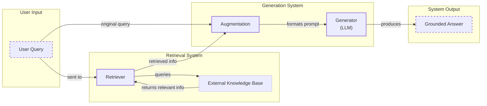
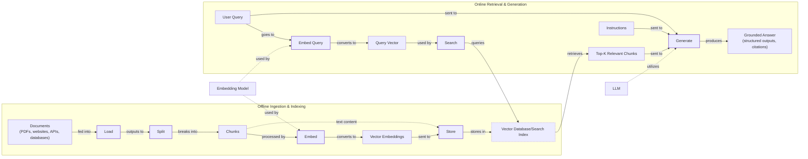
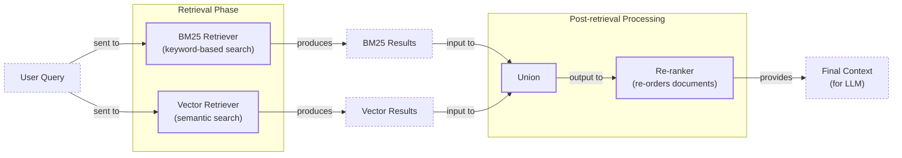
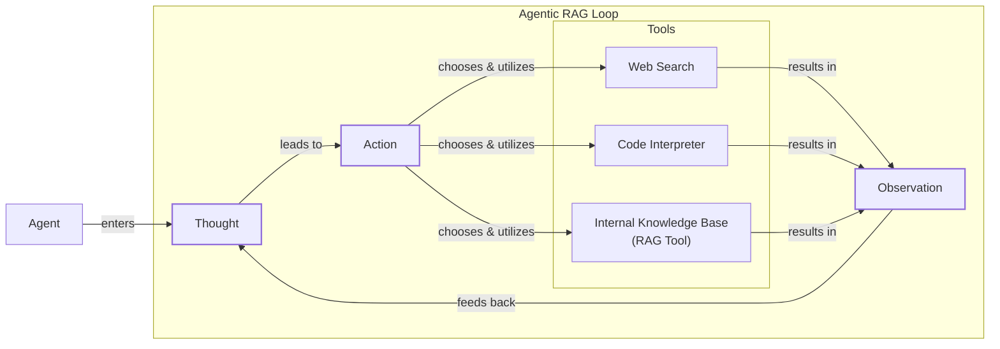

# Lesson 9: Retrieval-Augmented Generation (RAG)

In our previous lessons, we explored the core principles of building intelligent systems. We covered Context Engineering in Lesson 3, where we learned the importance of carefully managing the information we provide to an LLM. We also built a ReAct agent from scratch in Lesson 8, giving our models the ability to reason and act. Now, we will combine these ideas to tackle one of the biggest challenges in AI engineering: connecting LLMs to external, up-to-date, and private knowledge.

## Introduction: Giving LLMs an Open-Book Exam

A core problem with LLMs is that their knowledge is frozen in time. They are trained on a fixed dataset, which means they are effectively taking a "closed-book exam" on the world's information as it existed at one point in the past [[26]](https://blogs.nvidia.com/blog/what-is-retrieval-augmented-generation/). Ask a model about an event that happened after its training cutoff, and it will either admit ignorance or, worse, hallucinate a plausible but incorrect answer [[10]](https://neo4j.com/blog/developer/fine-tuning-vs-rag/). This static nature makes them unreliable for applications that need current or domain-specific information.

One might think fine-tuning is the answer. However, fine-tuning is a resource-heavy and slow process that comes with significant limitations. First, it is expensive, often requiring multi-day training jobs on powerful and costly hardware like GPUs or TPUs. Second, curating the high-quality, labeled dataset required for supervised fine-tuning is a complex and time-consuming task in itself [[10]](https://neo4j.com/blog/developer/fine-tuning-vs-rag/). Furthermore, fine-tuning doesn't truly solve the knowledge update problem; it just moves the knowledge cutoff date. The model's weights are updated, but it still has no mechanism to learn continuously from new information.

Another apparent solution is to leverage the massive context windows of modern LLMs, which can now handle millions of tokens. The thinking goes: why retrieve when you can just stuff all your documents into the prompt? This approach quickly hits practical and performance walls. First, it is incredibly expensive and slow. Sending millions of tokens with every API call is not a scalable strategy [[30]](https://highlearningrate.substack.com/p/the-rise-of-rag). Second, it runs into the "lost-in-the-middle" problem, a well-documented phenomenon where models struggle to recall information buried in the center of a large context. This cognitive blind spot means performance can degrade long before the physical token limit is reached, leading to unreliable answers [[31]](https://decodingml.substack.com/p/your-rag-is-wrong-heres-how-to-fix).

Retrieval-Augmented Generation (RAG) provides a reliable and scalable solution by giving the LLM an "open-book exam." Instead of forcing the model to memorize information, we connect it to external knowledge sources it can query in real-time. Just as we use cheat sheets or manuals to recall specific details, an LLM can use RAG to fetch the exact information it needs to answer a question accurately [[30]](https://highlearningrate.substack.com/p/the-rise-of-rag/).

While RAG feels like a modern invention, it builds on decades of research in Information Retrieval (IR). Early systems relied on keyword-based techniques like TF-IDF to find relevant documents [[73]](https://www.cloudthat.com/resources/blog/unveiling-the-journey-the-evolution-of-rag-systems). These methods were effective but often failed to capture the user's intent. The shift to modern RAG, powered by dense vector embeddings, represents an evolution from matching keywords to understanding meaning, a transition made possible by the same transformer models that power LLMs [[71]](https://www.iict.bas.bg/pecr/2025/83/3-PECR-MDimitrova.pdf).

RAG is a core technique in the broader discipline of Context Engineering, which we introduced in Lesson 3. It is the mechanism by which we dynamically select and inject relevant knowledge into the prompt. It is a foundational skill for any AI Engineer looking to build grounded, trustworthy, and knowledgeable systems. We will also see how this on-demand retrieval complements an agent's memory, a topic we will explore further in Lesson 10.

In this lesson, we will build a complete mental model of RAG. We will start by breaking down its core components, then walk through the end-to-end pipeline, and finally explore the advanced and agentic patterns that power modern AI applications. With the problem and motivation clear, we will first decompose RAG into its core components so you can see where each responsibility lives.

## The RAG System: Core Components

Understanding the fundamental components of a RAG system is the first step in designing an effective retrieval strategy. At its heart, a RAG system is composed of three conceptual pillars: Retrieval, Augmentation, and Generation. Each plays a distinct role in transforming a user's query into a factually grounded answer.

**Retrieval** is the engine responsible for finding relevant information from an external knowledge base. The most common approach is semantic search, which goes beyond simple keyword matching to find documents that are conceptually similar to a user's query. This process relies on vector embeddings—numerical representations of text that capture its semantic meaning [[32]](https://decodingml.substack.com/p/rag-fundamentals-first).

The creation of these embeddings is a critical offline step. Text chunks are fed into a deep learning model, such as a transformer like BERT, which has been trained to understand language. The model processes the text and outputs a high-dimensional vector, a list of numbers that represents the text's position in a semantic space [[8]](https://qdrant.tech/articles/what-is-rag-in-ai/). The key property of these vectors is that semantically similar pieces of text will have vectors that are close to each other in this space. For example, the vectors for "dog" and "puppy" will be much closer than the vectors for "dog" and "car." These vectors are then stored in a specialized vector database, which is optimized for fast similarity searches using indexing algorithms like HNSW to enable Approximate Nearest Neighbor (ANN) search [[6]](https://pub.towardsai.net/vector-databases-in-practice-building-a-realistic-hybrid-search-rag-system-with-qdrant-7b8f4a6e41e0). When a user asks a question, their query is converted into a vector using the same embedding model, and the database returns the most similar document chunks based on a distance metric like cosine similarity [[54]](https://towardsdatascience.com/rag-explained-understanding-embeddings-similarity-and-retrieval/).

**Augmentation** is the process of taking the retrieved information and preparing it for the LLM. This is a critical step in context engineering. The retrieved document chunks are formatted and combined with the original user query and a set of instructions into a single prompt [[56]](https://www.topquadrant.com/resources/blog-retrieval-augmented-generation-explained/). The goal is to provide the LLM with all the necessary context it needs to formulate an accurate and relevant response. A well-constructed augmented prompt clearly separates the user's question from the supporting evidence, guiding the model to ground its answer in the provided sources.

**Generation** is the final step, where the LLM synthesizes an answer based on the augmented prompt. Instead of relying solely on its internal, parametric knowledge, the model is instructed to use the provided context as its primary source of truth [[29]](https://www.ibm.com/think/topics/retrieval-augmented-generation). This grounds the response in verifiable data, reducing the risk of hallucinations and allowing the model to answer questions about information it was never trained on. The final output is a grounded answer, often with citations that trace back to the original source documents, building user trust.

Image 1: A flowchart illustrating the core components and data flow of a RAG system.

Now that you can name each moving part, let’s see how they line up across the two phases of a real system.

## The RAG Pipeline: Ingestion and Retrieval

A production-ready RAG system operates in two distinct phases: an offline ingestion pipeline that prepares the data and an online retrieval pipeline that answers user queries in real-time. Understanding this separation is key to building and maintaining a scalable system.

### Phase 1: Offline Ingestion & Indexing

The ingestion phase is an offline process responsible for preparing your knowledge base for efficient retrieval. It involves transforming raw documents from various sources into a searchable index.

1.  **Load:** The first step is to load your documents. These can come from anywhere: PDFs, web pages, databases, or APIs [[32]](https://newsletter.systemdesign.one/p/how-rag-works). Tools like LlamaIndex readers or LangChain document loaders are commonly used to handle diverse data formats and extract clean text. The main challenge here is dealing with the variety of structures—like tables in PDFs or nested HTML tags—and cleaning the content to ensure consistency.

2.  **Split:** Once loaded, large documents are broken down into smaller, more manageable chunks. This is a critical step because the quality of your chunks directly impacts retrieval relevance. A naive fixed-size split can cut a sentence or idea in half. More advanced strategies, like semantic chunking, split text based on conceptual boundaries to ensure each chunk is a coherent unit of meaning. Frameworks like LangChain offer tools such as `RecursiveCharacterTextSplitter` to handle this intelligently.

3.  **Embed:** Each chunk is then converted into a vector embedding using a specialized model. This numerical representation captures the semantic essence of the text. There is a wide array of embedding models available, from proprietary ones like OpenAI's `text-embedding-3-large` and Google's `text-embedding-004` to open-source alternatives like BGE variants available on Hugging Face. Choosing the right model is a crucial decision involving trade-offs between performance, cost, and domain specificity. For example, larger models may offer higher accuracy but come with increased latency and API costs, while smaller, open-source models can be fine-tuned on your specific data to better capture domain-specific jargon.

4.  **Store:** Finally, the embeddings and their corresponding text are loaded into a vector database or search index. This specialized database is designed for efficient similarity search, allowing the system to quickly find the vectors (and thus, the document chunks) most similar to a query vector [[33]](https://towardsdatascience.com/ragops-guide-building-and-scaling-retrieval-augmented-generation-systems-3d26b3ebd627/). Popular choices include FAISS for local development and scalable solutions like Qdrant, Pinecone, or Milvus for production environments. The choice often depends on whether you need a fully managed service or a self-hosted solution for greater control and data privacy.

### Phase 2: Online Retrieval & Generation

The online phase happens in real-time, triggered by a user's query. Its goal is to fetch relevant context and generate a grounded answer as quickly as possible.

1.  **Query:** A user submits a question. This raw query can be pre-processed through normalization (e.g., lowercasing, removing punctuation) or expansion (e.g., adding synonyms) to improve its chances of matching relevant documents. This step ensures the query is in a clean, standardized format before being embedded.

2.  **Embed:** The processed query is transformed into a vector using the exact same embedding model that was used during the ingestion phase. This ensures that the query and the document chunks exist in the same vector space, making them comparable.

3.  **Search:** The system uses the query vector to search the vector database. The database performs a similarity search (e.g., using cosine similarity) to find the top-k document chunks whose embeddings are closest to the query embedding [[54]](https://towardsdatascience.com/rag-explained-understanding-embeddings-similarity-and-retrieval/). These top-k chunks represent the most relevant information available in the knowledge base to answer the user's question. This step can also involve metadata filtering to narrow the search to specific sources or timeframes.

4.  **Generate:** The retrieved chunks are combined with the original query and a set of instructions into a final prompt. This augmented prompt is then passed to an LLM. The model generates a response that is grounded in the provided context. As we learned in Lesson 4, we can use structured outputs to ensure the answer includes citations, making the information verifiable and trustworthy.

Image 2: A detailed flowchart depicting the two distinct phases of the RAG pipeline: "Offline Ingestion & Indexing" and "Online Retrieval & Generation".

With the end-to-end path in place, the next question is quality. The following section will cover advanced techniques to make retrieval more accurate and useful across messy, real-world data.

## Advanced RAG Techniques

While a basic RAG pipeline is a good starting point, production systems require more sophisticated techniques to handle the complexities of real-world data and user queries. These advanced methods focus on improving the quality and relevance of the retrieved context, which directly translates to more accurate and reliable answers.

### Hybrid Search

Vector search is excellent at understanding semantic meaning, but it can sometimes miss queries that depend on exact keywords, like product codes, acronyms, or specific names. Hybrid search solves this by combining the strengths of keyword-based search (like BM25) with semantic vector search [[40]](https://community.netapp.com/t5/Tech-ONTAP-Blogs/Hybrid-RAG-in-the-Real-World-Graphs-BM25-and-the-End-of-Black-Box-Retrieval/ba-p/464834). For example, if a customer support agent searches for "error code SKU-123," a keyword search will pinpoint documents containing that exact code, while a vector search might find related articles about general error handling. By fusing the results from both, often using a technique like Reciprocal Rank Fusion (RRF), the system provides a more comprehensive set of documents, capturing both precise matches and conceptual relevance [[20]](https://neo4j.com/blog/genai/advanced-rag-techniques/).

### Re-ranking

The initial retrieval step is optimized for speed and recall, meaning it casts a wide net to find potentially relevant documents. However, the top-k results are not always ordered by true relevance. Re-ranking introduces a second, more precise scoring step. After the initial retrieval, a re-ranker model, often a cross-encoder, evaluates the query against each retrieved document individually [[42]](https://redis.io/blog/10-techniques-to-improve-rag-accuracy/). Unlike bi-encoders used in initial retrieval, which create separate embeddings for the query and documents, cross-encoders process them together, allowing for a deeper analysis of relevance [[45]](https://towardsdatascience.com/advanced-rag-retrieval-cross-encoders-reranking/). For a query like "how do I connect my account?", the re-ranker can promote a step-by-step guide above a less relevant press release, ensuring the most useful information is placed at the top of the context.

### Query Transformations

Sometimes, the user's query is not in the best format for retrieval. Query transformation techniques rewrite or decompose the query to improve its chances of matching the right documents.

-   **Decomposition:** A complex, multi-faceted query is broken down into several simpler sub-questions. For example, "What is our travel policy for conferences in Europe this year?" could be decomposed into: "What is the company travel policy?", "What are the rules for conferences?", and "Are there specific rules for Europe in 2024?". The system retrieves documents for each sub-question and then synthesizes the results to form a complete answer [[19]](https://docs.nvidia.com/rag/latest/query_decomposition.html).

-   **Hypothetical Document Embeddings (HyDE):** This technique involves generating a hypothetical, ideal answer to the user's query before the retrieval step. The system then uses the embedding of this hypothetical answer to search the vector database [[20]](https://neo4j.com/blog/genai/advanced-rag-techniques/). Since the hypothetical answer is likely to be phrased in a way that is similar to the actual documents in the knowledge base, this can lead to more relevant retrieval results.

### Advanced Chunking Strategies

Moving beyond simple fixed-size chunking is one of the most impactful ways to improve RAG performance. The goal is to create chunks that are semantically complete.

-   **Semantic Chunking:** This method splits documents along conceptual boundaries rather than arbitrary character counts. For instance, instead of splitting a policy document mid-paragraph, it ensures that the entire section on "Reimbursements" remains in a single chunk, preserving critical context like spending limits and exceptions.

-   **Layout-aware Chunking:** For documents with complex structures like tables or forms, this approach preserves the layout. When processing a pricing table, it keeps each row intact, ensuring that product names, prices, and discounts are not separated from each other. This is crucial for accurately answering questions about structured data.

-   **Context-Enriched Chunking:** Also known as contextual retrieval, this technique adds a summary or contextual metadata to each chunk before embedding it. For a chunk from a financial report, it might prepend "This chunk is from ACME Corp's Q2 2023 report" to provide necessary context that would otherwise be lost.

### GraphRAG

For questions that involve complex relationships and multi-hop reasoning, standard document retrieval can fall short. GraphRAG addresses this by structuring knowledge as a graph of entities and relationships [[46]](https://arxiv.org/html/2601.03014v1). This is particularly useful for answering questions that require connecting information across multiple documents or data points. For example, to answer "Which IT incidents were caused by weekend deployments that also affected the login service?", a GraphRAG system can traverse the knowledge graph, following connections from "incident" nodes to "deployment" nodes and filtering by time and affected service to find the answer. This approach excels at uncovering hidden connections that vector search alone would miss.

### Metadata Filtering

One of the most powerful and practical techniques in a production environment is filtering based on metadata. When each document chunk is stored with metadata fields like `source`, `creation_date`, `author`, or `department`, you can substantially narrow the search space before performing the vector search. For a query like "What were the marketing updates in Q2?", you can pre-filter for documents where `department` is "marketing" and `date` is within the second quarter. This not only improves retrieval speed but also ensures that only relevant documents are considered, increasing the accuracy of the final answer.

Temporal filters are especially useful. For a query like "What changed between March and June 2025?", you can restrict retrieval to chunks with an `effective_date` within that range. For even more advanced use cases, you can apply **bitemporal logic**, which tracks two distinct timelines: the `effective_date` (when the information was valid in the real world) and the `indexed_at` date (when it was recorded in your system). This allows you to answer complex historical questions, such as "What did our system believe was the policy on May 1st, based on the information we had on April 15th?", preventing the system from surfacing stale guidance.

Image 3: A flowchart illustrating the hybrid retrieval flow in advanced RAG techniques.

These techniques increase retrieval quality. Next, we will see how retrieval becomes one tool that an agent can choose to use as it reasons.

## Agentic RAG

So far, we have treated RAG as a linear pipeline. But what if retrieval was not a fixed step, but a dynamic capability that an intelligent system could use as needed? This is the core idea behind Agentic RAG. Tying directly into what we learned about ReAct agents in Lessons 7 and 8, Agentic RAG is essentially a reasoning agent that is equipped with a powerful retrieval tool.

Instead of a rigid workflow, the agent operates in a loop: it reasons about the task (Thought), decides on an Action (like retrieving information), observes the results, and then iterates. This transforms RAG from a simple lookup mechanism into an active, problem-solving process. It is important to clarify that agents use many tools, such as web search or code interpreters. Labeling an entire system "agentic RAG" can be narrow; more accurately, retrieval becomes one of the core tools in an agent's toolkit [[11]](https://towardsdatascience.com/agentic-rag-vs-classic-rag-from-a-pipeline-to-a-control-loop/).

The fundamental distinction lies in control. Standard RAG follows a predetermined path: Retrieve → Augment → Generate. Agentic RAG, on the other hand, is adaptive and iterative. The agent decides *when* to retrieve, *what* to retrieve, and *whether* the retrieved information is sufficient. If the initial results are inadequate, it can reformulate its query and try again. This shift moves RAG from a static pipeline to a dynamic control loop, where the system actively gathers evidence until it is confident in its answer [[11]](https://towardsdatascience.com/agentic-rag-vs-classic-rag-from-a-pipeline-to-a-control-loop/).

This agentic approach unlocks several powerful capabilities:

-   **Iterative Refinement:** An agent can use the RAG tool multiple times within a single task. If an initial query for a company policy returns a vague document, the agent can reason that it needs more specific information, refine its query to "2024 EU customer data policy," and retrieve again. This iterative process allows the agent to zero in on the most relevant information.

-   **Strategic Tool Selection:** In a system with multiple knowledge sources, an agent can choose the most appropriate one. When asked about a recent system outage, it might decide to query the `incident_runbooks` index instead of the general `marketing_documents` index, demonstrating an understanding of context and data sources.

-   **Information Fusion:** The agent can combine information from its RAG tool with outputs from other tools. For instance, it could retrieve an internal policy on data retention, then use a web search tool to check if recent regulatory changes affect that policy, and finally synthesize both pieces of information into a comprehensive answer.

-   **Knowledge Base Updates:** An agent can even decide to update the knowledge base with new information it discovers. While this capability touches on memory, a topic we will cover in Lesson 10, the agent can propose writing new, verified information back into the long-term store, creating a self-improving system.

However, this added autonomy is not without trade-offs. Scaling agentic systems introduces challenges like increased latency from multi-step reasoning, higher costs due to multiple LLM calls, and lower reliability if any one tool or reasoning step fails. Managing this complexity and overhead is a key engineering task when moving from prototypes to production [[64]](https://redis.io/blog/agentic-rag-how-enterprises-are-surmounting-the-limits-of-traditional-rag/).

Consider this conceptual thought process for an agent handling a complex query:

*   **Thought:** The user is asking about "2024 EU data retention rules." My internal knowledge base has a policy, but it's dated 2023. It's likely outdated.
*   **Action:** `retrieve(internal_knowledge_base, query="EU data retention policy 2024")`
*   **Observation:** The retrieved document mentions amendments but lacks specific citations.
*   **Thought:** I need external verification to provide a reliable answer.
*   **Action:** `web_search(query="official EU data retention directive 2024")`
*   **Observation:** The search returns a link to a new regulatory directive.
*   **Thought:** I will now synthesize the information from our internal policy and the new directive, highlighting the changes from the 2023 version and citing both sources.

This is the difference between a simple database lookup and a conversation with a knowledgeable research assistant. The agent does not just fetch information; it actively reasons about it, verifies it, and synthesizes it to solve the user's problem.

Image 4: A conceptual flowchart illustrating an agent's main loop in Agentic RAG.

You now understand both a linear RAG pipeline and how an agent can control retrieval when needed. Let’s wrap up by situating RAG in the wider AI Engineering toolkit and previewing what comes next.

## Conclusion

In this lesson, we have journeyed from the fundamental problem of static LLM knowledge to the dynamic, reasoning-driven world of Agentic RAG. We have seen that RAG is the most practical and widely used solution for grounding LLMs in external data, directly addressing limitations like knowledge cutoffs and hallucinations. For production-grade quality, advanced techniques like hybrid search, re-ranking, and GraphRAG are not just options but necessities. The future of knowledge retrieval is agentic, where RAG transforms from a fixed pipeline into a versatile tool wielded by a reasoning agent.

The core benefits of this approach are clear: it reduces hallucinations, enables deep customization with proprietary data, and builds user trust by providing verifiable, source-backed answers. As we have emphasized throughout this course, these are the hallmarks of a production-ready AI system. By grounding responses in external facts, RAG makes LLM outputs more reliable and transparent, which is essential for enterprise applications where accuracy and accountability are non-negotiable.

We must position RAG not as a niche skill but as a foundational competency for the modern AI Engineer. It is a critical component of Context Engineering, the discipline of managing the flow of information to and from an LLM. Mastering RAG means understanding how to structure data, optimize retrieval, and integrate this capability into larger, more intelligent systems.

This lesson sets the stage for our next topic, Memory for Agents, which we will cover in Lesson 10. While RAG provides on-demand access to vast external knowledge, memory gives an agent the ability to learn from interactions and retain context over time. These two capabilities—retrieval and memory—work together to create truly intelligent and adaptive systems. Other topics we have touched on, such as evaluating retrieval quality and monitoring these systems in production, are critical for maintaining performance and will be covered in detail later in the course.

## References

- [1] https://arxiv.org/pdf/2005.11401.pdf
- [3] https://www.infoworld.com/article/2335043/addressing-ai-hallucinations-with-retrieval-augmented-generation.html
- [4] https://arxiv.org/html/2312.05934v3
- [6] https://pub.towardsai.net/vector-databases-in-practice-building-a-realistic-hybrid-search-rag-system-with-qdrant-7b8f4a6e41e0
- [8] https://qdrant.tech/articles/what-is-rag-in-ai/
- [9] https://wandb.ai/mostafaibrahim17/ml-articles/reports/Vector-Embeddings-in-RAG-Applications--Vmlldzo3OTk1NDA5
- [10] https://neo4j.com/blog/developer/fine-tuning-vs-rag/
- [11] https://towardsdatascience.com/agentic-rag-vs-classic-rag-from-a-pipeline-to-a-control-loop/
- [12] https://www.pingcap.com/article/agentic-rag-vs-traditional-rag-key-differences-benefits/
- [14] https://airbyte.com/agentic-data/ai-agent-vs-rag
- [15] https://domino.ai/blog/rag-vs-agentic-ai
- [18] https://cloudurable.com/blog/advanced-rag-techniques-that-will-transform-your-l/
- [19] https://docs.nvidia.com/rag/latest/query_decomposition.html
- [20] https://neo4j.com/blog/genai/advanced-rag-techniques/
- [22] https://www.mindstudio.ai/blog/what-is-rag
- [25] https://www.madrona.com/rag-inventor-talks-agents-grounded-ai-and-enterprise-impact/
- [26] https://blogs.nvidia.com/blog/what-is-retrieval-augmented-generation/
- [28] https://toloka.ai/blog/grounding-llms-driving-ai-to-deliver-contextually-relevant-data/
- [29] https://www.ibm.com/think/topics/retrieval-augmented-generation
- [30] https://highlearningrate.substack.com/p/the-rise-of-rag
- [31] https://decodingml.substack.com/p/your-rag-is-wrong-heres-how-to-fix
- [32] https://newsletter.systemdesign.one/p/how-rag-works
- [33] https://towardsdatascience.com/ragops-guide-building-and-scaling-retrieval-augmented-generation-systems-3d26b3ebd627/
- [35] https://aws.amazon.com/what-is/retrieval-augmented-generation/
- [40] https://community.netapp.com/t5/Tech-ONTAP-Blogs/Hybrid-RAG-in-the-Real-World-Graphs-BM25-and-the-End-of-Black-Box-Retrieval/ba-p/464834
- [42] https://redis.io/blog/10-techniques-to-improve-rag-accuracy/
- [44] https://neo4j.com/blog/genai/advanced-rag-techniques/
- [45] https://towardsdatascience.com/advanced-rag-retrieval-cross-encoders-reranking/
- [46] https://arxiv.org/html/2601.03014v1
- [48] https://webhome.cs.uvic.ca/~thomo/papers/asonam2025-graphrag.pdf
- [49] https://atlan.com/know/what-is-graphrag/
- [50] https://arxiv.org/html/2501.00309v2
- [53] https://learnopencv.com/vector-db-and-rag-pipeline-for-document-rag/
- [54] https://towardsdatascience.com/rag-explained-understanding-embeddings-similarity-and-retrieval/
- [55] https://tutorialsdojo.com/aws-vector-databases-explained-semantic-search-and-rag-systems/
- [56] https://www.topquadrant.com/resources/blog-retrieval-augmented-generation-explained/
- [59] https://www.promptingguide.ai/research/rag
- [64] https://redis.io/blog/agentic-rag-how-enterprises-are-surmounting-the-limits-of-traditional-rag/
- [67] https://github.com/aws-samples/amazon-bedrock-samples/blob/main/docs/rag/knowledge-bases/features-examples/03-advanced-concepts/dynamic-metadata-filtering/dynamic-metadata-filtering-KB.md
- [70] https://oneuptime.com/blog/post/2026-01-30-metadata-filtering/view
- [71] https://www.iict.bas.bg/pecr/2025/83/3-PECR-MDimitrova.pdf
- [73] https://www.cloudthat.com/resources/blog/unveiling-the-journey-the-evolution-of-rag-systems
- [76] https://saison-technology-intl.com/resource/compliance-intelligence-rag-financial-services/
- [80] https://oneuptime.com/blog/post/2026-01-30-metadata-filtering/view